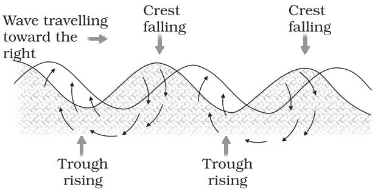
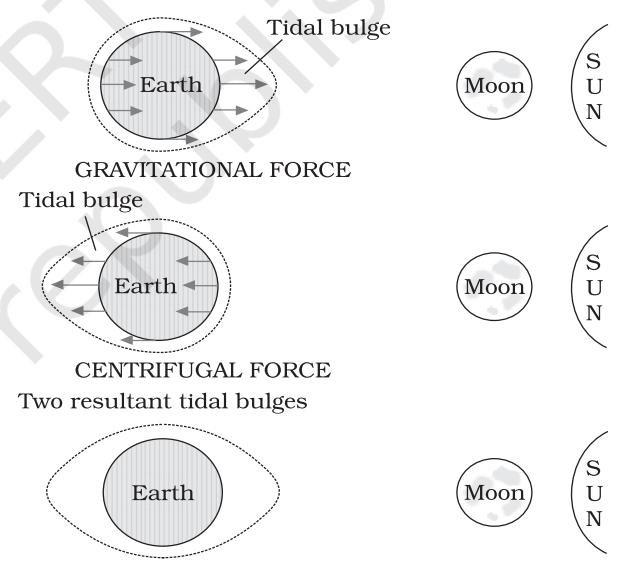
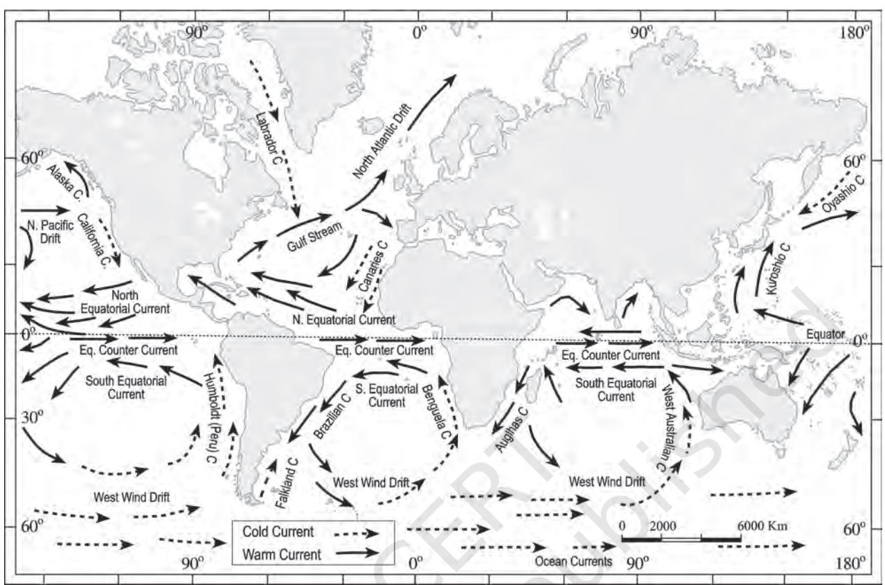

#### CHAPTER

# **MOVEMENTS OF OCEAN WATER**

T he ocean water is dynamic. Its physical characteristics like temperature, salinity, density and the external forces like of the sun, moon and the winds influence the movement of ocean water. The horizontal and vertical motions are common in ocean water bodies. The horizontal motion refers to the ocean currents and waves. The vertical motion refers to tides. Ocean currents are the continuous flow of huge amount of water in a definite direction while the waves are the horizontal motion of water. Water moves ahead from one place to another through ocean currents while the water in the waves does not move, but the wave trains move ahead. The vertical motion refers to the rise and fall of water in the oceans and seas. Due to attraction of the sun and the moon, the ocean water is raised up and falls down twice a day. The upwelling of cold water from subsurface and the sinking of surface water are also forms of vertical motion of ocean water.

### **WAVES**

Waves are actually the energy, not the water as such, which moves across the ocean surface. Water particles only travel in a small circle as a wave passes. Wind provides energy to the waves. Wind causes waves to travel in the ocean and the energy is released on shorelines. The motion of the surface water seldom affects the stagnant deep bottom water of the oceans. As a wave approaches the beach, it slows down. This is due to the friction occurring between the dynamic water and the sea floor. And, when the depth of water is less than half the wavelength of the wave, the wave breaks. The largest waves are found in the open oceans. Waves continue to grow larger as they move and absorb energy from the wind.

Most of the waves are caused by the wind driving against water. When a breeze of two knots or less blows over calm water, small ripples form and grow as the wind speed increases until white caps appear in the breaking waves. Waves may travel thousands of km before rolling ashore, breaking and dissolving as surf.

A wave's size and shape reveal its origin. Steep waves are fairly young ones and are probably formed by local wind. Slow and steady waves originate from far away places, possibly from another hemisphere. The maximum wave height is determined by the strength of the wind, i.e. how long it blows and the area over which it blows in a single direction.

Waves travel because wind pushes the water body in its course while gravity pulls the crests of the waves downward. The falling water pushes the former troughs upward, and the

**Figure13.1 : Motion of waves and water molecules**

wave moves to a new position (Figure 13.1). The actual motion of the water beneath the waves is circular. It indicates that things are carried up and forward as the wave approaches, and down and back as it passes.

#### **Characteristics of Waves**

*Wave crest and trough* : The highest and lowest points of a wave are called the crest and trough respectively.

*Wave height* : It is the vertical distance from the bottom of a trough to the top of a crest of a wave.

*Wave amplitude :* It is one-half of the wave height.

*Wave period* : It is merely the time interval between two successive wave crests or troughs as they pass a fixed point.

*Wavelength* : It is the horizontal distance between two successive crests.

*Wave speed* : It is the rate at which the wave moves through the water, and is measured in knots.

*Wave frequency* : It is the number of waves passing a given point during a onesecond time interval.

### **TIDES**

The periodical rise and fall of the sea level, once or twice a day, mainly due to the attraction of the sun and the moon, is called a *tide*. Movement of water caused by meteorological effects (winds and atmospheric pressure changes) are called *surges*. Surges are not regular like tides. The study of tides is very complex, spatially and temporally, as it has great variations in frequency, magnitude and height.

The moon's gravitational pull to a great extent and to a lesser extent the sun's gravitational pull, are the major causes for the occurrence of tides. Another factor is centrifugal force, which is the force that acts to counter balance the gravity. Together, the gravitational pull and the centrifugal force are responsible for creating the two major tidal bulges on the earth. On the side of the earth facing the moon, a tidal bulge occurs while on the opposite side though the gravitational attraction of the moon is less as it is farther away, the centrifugal force causes tidal bulge on the other side (Figure 13.2).

The 'tide-generating' force is the difference between these two forces; i.e. the gravitational attraction of the moon and the centrifugal force. On the surface of the earth, nearest the moon, pull or the attractive force of the moon is greater than the centrifugal force, and so there is a net force causing a bulge towards the moon. On the opposite side of the earth, the attractive force is less, as it is farther away from the moon, the centrifugal force is dominant. Hence, there is a net force away from the moon. It creates the second bulge away from the moon. On the surface of the earth, the horizontal tide generating forces are more important than the vertical forces in generating the tidal bulges.

#### **Figure13.2 : Relation between gravitational forces and tides**

The tidal bulges on wide continental shelves, have greater height. When tidal bulges hit the mid-oceanic islands they become low. The shape of bays and estuaries along a coastline can also magnify the intensity of tides. Funnel-shaped bays greatly change tidal magnitudes. When the tide is channelled between islands or into bays and estuaries they are called *tidal currents*.

### **Tides of Bay of Fundy, Canada**

The highest tides in the world occur in the Bay of Fundy in Nova Scotia, Canada. The tidal bulge is 15 - 16 m. Because there are two high tides and two low tides every day (roughly a 24 hour period); then a tide must come in within about a six hour period. As a rough estimate, the tide rises about 240 cm an hour (1,440 cm divided by 6 hours). If you have walked down a beach with a steep cliff alongside (which is common there), make sure you watch the tides. If you walk for about an hour and then notice that the tide is coming in, the water will be over your head before you get back to where you started!

# **Types of Tides**

Tides vary in their frequency, direction and movement from place to place and also from time to time. Tides may be grouped into various types based on their frequency of occurrence in one day or 24 hours or based on their height.

## *Tides based on Frequency*

*Semi-diurnal tide :* The most common tidal pattern, featuring two high tides and two low tides each day. The successive high or low tides are approximately of the same height.

*Diurnal tide :* There is only one high tide and one low tide during each day. The successive high and low tides are approximately of the same height.

*Mixed tide :* Tides having variations in height are known as mixed tides. These tides generally occur along the west coast of North America and on many islands of the Pacific Ocean.

### *Tides based on the Sun, Moon and the Earth Positions*

*The height of rising water (high tide) varies appreciably depending upon the position of sun and moon with respect to the earth. Spring tides and neap tides come under this category.*

*Spring tides* : The position of both the sun and the moon in relation to the earth has direct bearing on tide height. When the sun, the moon and the earth are in a straight line, the height of the tide will be higher. These are called spring tides and they occur twice a month, one on full moon period and another during new moon period.

*Neap tides* : Normally, there is a seven day interval between the spring tides and neap tides. At this time the sun and moon are at right angles to each other and the forces of the sun and moon tend to counteract one another. The Moon's attraction, though more than twice as strong as the sun's, is diminished by the counteracting force of the sun's gravitational pull.

Once in a month, when the moon's orbit is closest to the earth *(perigee)*, unusually high and low tides occur. During this time the tidal range is greater than normal. Two weeks later, when the moon is farthest from earth *(apogee)*, the moon's gravitational force is limited and the tidal ranges are less than their average heights.

When the earth is closest to the sun *(perihelion)*, around 3rd January each year, tidal ranges are also much greater, with unusually high and unusually low tides. When the earth is farthest from the sun *(aphelion)*, around 4th July each year, tidal ranges are much less than average.

The time between the high tide and low tide, when the water level is falling, is called the *ebb*. The time between the low tide and high tide, when the tide is rising, is called the *flow* or *flood*.

### **Importance of Tides**

Since tides are caused by the earth-moon-sun positions which are known accurately, the tides can be predicted well in advance. This helps the navigators and fishermen plan their activities. Tidal flows are of great importance in navigation. Tidal heights are very important, especially harbours near rivers and within estuaries having shallow 'bars' at the entrance, which prevent ships and boats from entering into the harbour. Tides are also helpful in desilting the sediments and in removing polluted water from river estuaries. Tides are used to generate electrical power (in Canada, France, Russia, and China). A 3 MW tidal power project at Durgaduani in Sunderbans of West Bengal is under way.

### **OCEAN CURRENTS**

Ocean currents are like river flow in oceans. They represent a regular volume of water in a definite path and direction. Ocean currents are influenced by two types of forces namely : (i) primary forces that initiate the movement of water; (ii) secondary forces that influence the currents to flow.

The primary forces that influence the currents are: (i) heating by solar energy; (ii) wind; (iii) gravity; (iv) coriolis force. Heating by solar energy causes the water to expand. That is why, near the equator the ocean water is about 8 cm higher in level than in the middle latitudes. This causes a very slight gradient and water tends to flow down the slope. Wind blowing on the surface of the ocean pushes the water to move. Friction between the wind and the water surface affects the movement of the water body in its course. Gravity tends to pull the water down the pile and create gradient variation. The Coriolis force intervenes and causes the water to move to the right in the northern hemisphere and to the left in the southern hemisphere. These large accumulations of water and the flow around them are called *Gyres*. These produce large circular currents in all the ocean basins.

#### **Characteristics of Ocean Currents**

Currents are referred to by their "drift". Usually, the currents are strongest near the surface and may attain speeds over five knots. At depths, currents are generally slow with speeds less than 0.5 knots. We refer to the speed of a current as its "drift." Drift is measured in terms of knots. The strength of a current refers to the speed of the current. A fast current is considered strong. A current is usually strongest at the surface and decreases in strength (speed) with depth. Most currents have speeds less than or equal to 5 knots.

Differences in water density affect vertical mobility of ocean currents. Water with high salinity is denser than water with low salinity and in the same way cold water is denser than warm water. Denser water tends to sink, while relatively lighter water tends to rise. Cold-water ocean currents occur when the cold water at the poles sinks and slowly moves towards the equator. Warm-water currents travel out from the equator along the surface, flowing towards the poles to replace the sinking cold water.

### **Types of Ocean Currents**

The ocean currents may be classified based on their depth as surface currents and deep water currents : (i) *surface currents* constitute about 10 per cent of all the water in the ocean, these waters are the upper 400 m of the ocean; (ii) *deep water currents* make up the other 90 per cent of the ocean water. These waters move around the ocean basins due to variations in the density and gravity. Deep waters sink into the deep ocean basins at high latitudes, where the temperatures are cold enough to cause the density to increase.

Ocean currents can also be classified based on temperature : as cold currents and warm currents: (i) *cold currents* bring cold water into warm water areas. These currents are usually found on the west coast of the continents in the low and middle latitudes (true in both hemispheres) and on the east coast in the higher latitudes in the Northern Hemisphere; (ii) *warm currents* bring warm water into cold water areas and are usually observed on the east coast of continents in the low and middle latitudes (true in both hemispheres). In the northern hemisphere they are found on the west coasts of continents in high latitudes.

### *Major Ocean Currents*

Major ocean currents are greatly influenced by the stresses exerted by the prevailing winds and coriolis force. The oceanic circulation pattern roughly corresponds to the earth's atmospheric circulation pattern. The air circulation over the oceans in the middle latitudes is mainly anticyclonic (more pronounced in the southern hemisphere than in the northern hemisphere). The oceanic circulation pattern also corresponds with the same. At higher latitudes, 112 FUNDAMENTALS OF PHYSICAL GEOGRAPHY

**Fig.13.3 : Major currents in the Pacific, Atlantic and Indian oceans**

where the wind flow is mostly cyclonic, the oceanic circulation follows this pattern. In regions of pronounced monsoonal flow, the monsoon winds influence the current movements. Due to the coriolis force, the warm currents from low latitudes tend to move to the right in the northern hemisphere and to their left in the southern hemisphere.

The oceanic circulation transports heat from one latitude belt to another in a manner similar to the heat transported by the general circulation of the atmosphere. The cold waters of the Arctic and Antarctic circles move towards warmer water in tropical and equatorial regions, while the warm waters of the lower latitudes move polewards. The major currents in the different oceans are shown in Figure13.3.

> Prepare a list of currents which are found in Pacific, Atlantic and Indian Oceans.

> How is the movement of currents influenced by prevailing winds? Give some examples from Figure13.3.

### *Effects of Ocean Currents*

Ocean currents have a number of direct and indirect influences on human activities. West coasts of the continents in tropical and subtropical latitudes (except close to the equator) are bordered by cool waters. Their average temperatures are relatively low with a narrow diurnal and annual ranges. There is fog, but generally the areas are arid. West coasts of the continents in the middle and higher latitudes are bordered by warm waters which cause a distinct marine climate. They are characterised by cool summers and relatively mild winters with a narrow annual range of temperatures. Warm currents flow parallel to the east coasts of the continents in tropical and subtropical latitudes. This results in warm and rainy climates. These areas lie in the western margins of the subtropical anti-cyclones. The mixing of warm and cold currents help to replenish the oxygen and favour the growth of planktons, the primary food for fish population. The best fishing grounds of the world exist mainly in these mixing zones.

#### **EXERCISES**

- 1. Multiple choice questions.
	- (i) Upward and downward movement of ocean water is known as the :
		- (a) tide (c) wave
		- (b) current (d) none of the above
	- (ii) Spring tides are caused :
		- (a) As result of the moon and the sun pulling the earth gravitationally in the same direction.
		- (b) As result of the moon and the sun pulling the earth gravitationally in the opposite direction.
		- (c) Indention in the coast line.
		- (d) None of the above.
	- (iii) The distance between the earth and the moon is minimum when the moon is in :
		- (a) Aphelion (c) Perihelion
		- (b) Perigee (d) Apogee
	- (iv) The earth reaches its perihelion in:
		- (a) October (c) July
		- (b) September (d) January
- 2. Answer the following questions in about 30 words.
	- (i) What are waves?
	- (ii) Where do waves in the ocean get their energy from?
	- (iii) What are tides?
	- (iv) How are tides caused?
	- (v) How are tides related to navigation?
- 3. Answer the following questions in about 150 words.
	- (i) How do currents affect the temperature? How does it affect the temperature of coastal areas in the N. W. Europe?
	- (ii) What are the causes of currents?

#### **Project Work**

- (i) Visit a lake or a pond and observe the movement of waves. Throw a stone and notice how waves are generated.
- (ii) Take a globe and a map showing the currents of the oceans. Discuss why certain currents are warm or cold and why they deflect in certain places and examine the reasons.

