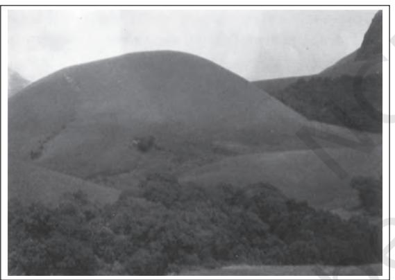
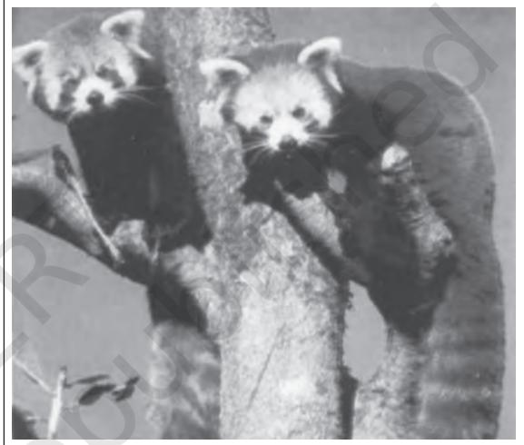
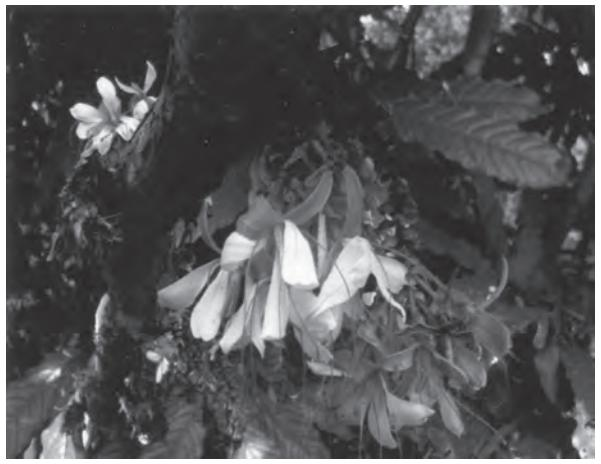
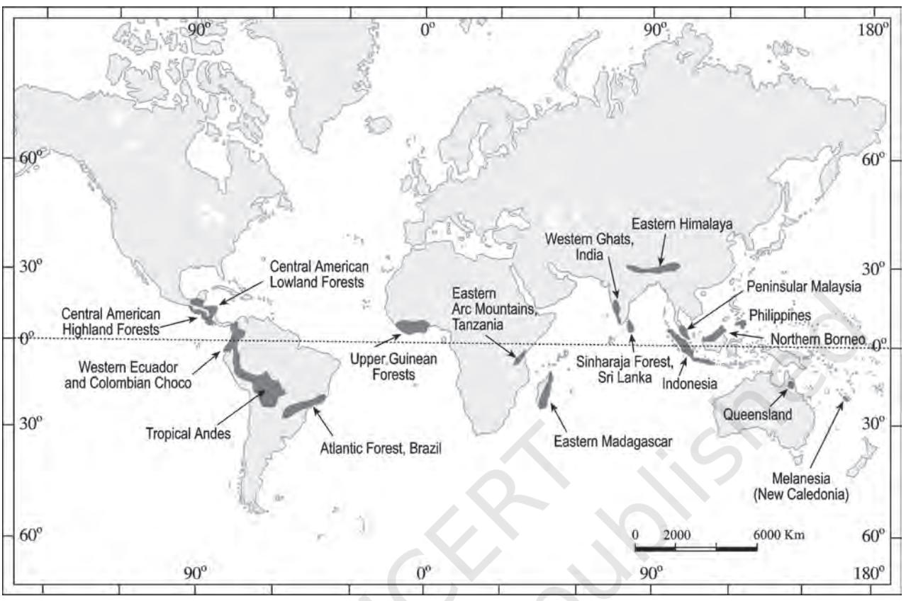

# **UNIT VI**

114 FUNDAMENTALS OF PHYSICAL GEOGRAPHY

#### **LIFE ON THE EARTH**

*This unit deals with*

- *• Biosphere biodiversity and conservation*
#### CHAPTER

## **BIODIVERSITY AND CONSERVATION**

Y ou have already learnt about the geomorphic processes particularly weathering and depth of weathering mantle in different climatic zones. See the Figure 5.2 in Chapter 5 in order to recapitulate. You should know that this weathering mantle is the basis for the diversity of vegetation and hence, the biodiversity. The basic cause for such weathering variations and resultant biodiversity is the input of solar energy and water. No wonder that the areas that are rich in these inputs are the areas of wide spectrum of biodiversity.

> Biodiversity as we have today is the result of 2.5-3.5 billion years of evolution. Before the advent of humans, our earth supported more biodiversity than in any other period. Since, the emergence of humans, however, biodiversity has begun a rapid decline, with one species after another bearing the brunt of extinction due to overuse. The number of species globally vary from 2 million to 100 million, with 10 million being the best estimate. New species are regularly discovered most of which are yet to be classified (an estimate states that about 40 per cent of fresh water fishes from South America are not classified yet). Tropical forests are very rich in bio-diversity.

Biodiversity is a system in constant evolution, from a view point of species, as well as from view point of an individual organism. The average half-life of a species is estimated at between one and four million years, and 99 per cent of the species that have ever lived on the earth are today extinct. Biodiversity is not found evenly on the earth. It is consistently richer in the tropics. As one approaches the polar regions, one finds larger and larger populations of fewer and fewer species.

Biodiversity itself is a combination of two words, *Bio* (life) and *diversity* (variety). In simple terms, biodiversity is the number and variety of organisms found within a specified geographic region. It refers to the varieties of plants, animals and micro-organisms, the genes they contain and the ecosystems they form. It relates to the variability among living organisms on the earth, including the variability within and between the species and that within and between the ecosystems. Biodiversity is our living wealth. It is a result of hundreds of millions of years of evolutionary history.

Biodiversity can be discussed at three levels : (i) Genetic diversity; (ii) Species diversity; (iii) Ecosystem diversity.

#### **Genetic Diversity**

Genes are the basic building blocks of various life forms. Genetic biodiversity refers to the variation of genes within species. Groups of individual organisms having certain similarities in their physical characteristics are called *species*. Human beings genetically belong to the *homo sapiens* group and also differ in their characteristics such as height, colour, physical appearance, etc., considerably. This is due to genetic diversity. This genetic diversity is essential for a healthy breeding of population of species.

### **Species Diversity**

This refers to the variety of species. It relates to the number of species in a defined area. The diversity of species can be measured through its richness, abundance and types. Some areas are more rich in species than others. Areas rich in species diversity are called *hotspots* of diversity (Figure 14.5).

### **Ecosystem Diversity**

You have studied about the ecosystem in the earlier chapter. The broad differences between ecosystem types and the diversity of habitats and ecological processes occurring within each ecosystem type constitute the ecosystem diversity. The 'boundaries' of communities (associations of species) and ecosystems are not very rigidly defined. Thus, the demarcation of ecosystem boundaries is difficult and complex.

**Figure 14.1 : Grasslands and sholas in Indira Gandhi National Park, Annamalai, Western Ghats — an example of ecosystem diversity**

### **Importance of Biodiversity**

Biodiversity has contributed in many ways to the development of human culture and, in turn, human communities have played a major role in shaping the diversity of nature at the genetic, species and ecological levels. Biodiversity plays the following roles: ecological, economic and scientific.

#### **Ecological Role of Biodiversity**

Species of many kinds perform some function or the other in an ecosystem. Nothing in an ecosystem evolves and sustains without any reason. That means, every organism, besides extracting its needs, also contributes something of useful to other organisms. Can you think of the way we, humans contribute to the sustenance of ecosystems. Species capture and store energy, produce and decompose organic materials, help to cycle water and nutrients throughout the ecosystem, fix atmospheric gases and help regulate the climate. These functions are important for ecosystem function and human survival. The more diverse an ecosystem, better are the chances for the species to survive through adversities and attacks, and consequently, is more productive. Hence, the loss of species would decrease the ability of the system to maintain itself. Just like a species with a high genetic diversity, an ecosystem with high biodiversity may have a greater chance of adapting to environmental change. In other words, the more the variety of species in an ecosystem, the more stable the ecosystem is likely to be.

### **Economic Role of Biodiversity**

For all humans, biodiversity is an important resource in their day-to-day life. One important part of biodiversity is 'crop diversity', which is also called agro-biodiversity. Biodiversity is seen as a reservoir of resources to be drawn upon for the manufacture of food, pharmaceutical, and cosmetic products. This concept of biological resources is responsible for the deterioration of biodiversity. At the same time, it is also the origin of new conflicts dealing with rules of division and appropriation of natural resources. Some of the important economic commodities that biodiversity supplies to humankind are: food crops, livestock, forests, fish, medicinal resources, etc.

### **Scientific Role of Biodiversity**

Biodiversity is important because each species can give us some clue as to how life evolved and will continue to evolve. Biodiversity also helps in understanding how life functions and the role of each species in sustaining

ecosystems of which we are also a species. This fact must be drawn upon every one of us so that we live and let other species also live their lives.

It is our ethical responsibility to consider that each and every species along with us have an intrinsic right to exist. Hence, it is morally wrong to voluntarily cause the extinction of any species. The level of biodiversity is a good indicator of the state of our relationships with other living species. In fact, the concept of biodiversity is an integral part of many human cultures.

### **LOSS OF BIODIVERSITY**

Since the last few decades, growth in human population has increased the rate of consumption of natural resources. It has accelerated the loss of species and habitation in different parts of the world. Tropical regions which occupy only about one-fourth of the total area of the world, contain about threefourth of the world human population. Overexploitation of resources and deforestation have become rampant to fulfil the needs of large population. As these tropical rain forests contain 50 per cent of the species on the earth, destruction of natural habitats have proved disastrous for the entire biosphere.

Natural calamities such as earthquakes, floods, volcanic eruptions, forest fires, droughts, etc. cause damage to the flora and fauna of the earth, bringing change the biodiversity of respective affected regions. Pesticides and other pollutants such as hydrocarbons and toxic heavy metals destroy the weak and sensitive species. Species which are not the natural inhabitants of the local habitat but are introduced into the system, are called *exotic species*. There are many examples when a natural biotic community of the ecosystem suffered extensive damage because of the introduction of exotic species. During the last few decades, some animals like tigers, elephants, rhinoceros, crocodiles, minks and birds were hunted mercilessly by poachers for their horn, tusks, hides, etc. It has resulted in the rendering of certain types of organisms as endangered category.

The International Union of Conservation of Nature and Natural Resources (IUCN) has classified the threatened species of plants and animals into three categories for the purpose of their conservation.

#### **Endangered Species**

It includes those species which are in danger of extinction. The IUCN publishes information about endangered species world-wide as the *Red List* of threatened species.

**Vulnerable Species Figure 14.2 : Red Panda — an endangered species**

This includes the species which are likely to be in danger of extinction in near future if the factors threatening to their extinction continue. Survival of these species is not assured as their population has reduced greatly.

#### **Rare Species**

Population of these species is very small in the world; they are confined to limited areas or thinly scattered over a wider area.

#### **CONSERVATION OF BIODIVERSITY**

Biodiversity is important for human existence. All forms of life are so closely interlinked that disturbance in one gives rise to imbalance in the others. If species of plants and animals become endangered, they cause degradation in the environment, which may threaten human being's own existence.

118 FUNDAMENTALS OF PHYSICAL GEOGRAPHY

**Figure 14.3 : Humbodtia decurrens Bedd — highly rare endemic tree of Southern Western Ghats (India)**

There is an urgent need to educate people to adopt environment-friendly practices and reorient their activities in such a way that our development is harmonious with other life forms and is sustainable. There is an increasing consciousness of the fact that such conservation with sustainable use is possible only with the involvement and cooperation of local communities and individuals. For this, the development of institutional structures at local levels is necessary. The critical problem is not merely the conservation of species nor the habitat but the continuation of process of conservation.

The Government of India along with 155 other nations have signed the Convention of Biodiversity at the Earth Summit held at Rio de Janeiro, Brazil in June 1992. The world conservation strategy has suggested the following steps for biodiversity conservation:

- (i) Efforts should be made to preserve the species that are endangered.
- (ii) Prevention of extinction requires proper planning and management.
- (iii) Varieties of food crops, forage plants, timber trees, livestock, animals and their wild relatives should be preserved;
- (iv) Each country should identify habitats of wild relatives and ensure their protection.
- (v) Habitats where species feed, breed, rest and nurse their young should be safeguarded and protected.
- (vi) International trade in wild plants and animals be regulated.

To protect, preserve and propagate the variety of species within natural boundaries, the Government of India passed the *Wild Life (Protection) Act, 1972*, under which national parks and sanctuaries were established and biosphere reserves declared. Details of these biosphere reserves are given in the book *India: Physical Environment* (NCERT, 2006).

There are some countries which are situated in the tropical region; they possess a large number of the world's species diversity. They are called *mega diversity centres*. There are 12 such countries, namely Mexico, Columbia, Ecuador, Peru, Brazil, Democratic Republic of Congo, Madagascar, China, India, Malaysia, Indonesia and Australia in which these centres are located. In order to concentrate resources on those areas that are most vulnerable, the International Union for the Conservation of Nature and Natural Resources (IUCN) has identified certain areas as biodiversity hotspots (Figure 14.1). Hotspots are defined according to their vegetation. Plants are important because these determine the primary productivity of an ecosystem. Most, but not all, of the hotspots rely on species-rich ecosystems for food, firewood, cropland, and income from timber. In Madagascar, for example, about 85 per cent of the plants and animals are found nowhere else in the world, Other hotspots in wealthy countries are facing different types of pressures. The islands of Hawaii have many unique plants and animals that are threatened by introduced species and land development.

#### BIODIVERSITY AND CONSERVATION 119

**Figure 14.4 : Some ecological 'hotspots' in the world**

#### **EXERCISES**

- 1. Multiple choice questions.
	- (i) Conservation of biodiversity is important for :
		- (a) Animals (c) Plants
		- (b) Animals and plants (d) All organisms
	- (ii) Threatened species are those which :
		- (a) threaten others
		- (b) Lion and tiger
		- (c) are abundant in number
		- (d) are suffering from the danger of extinction
	- (iii) National parks and sanctuaries are established for the purpose of :
		- (a) Recreation (c) Pets
		- (b) Hunting (d) Conservation

#### 120 FUNDAMENTALS OF PHYSICAL GEOGRAPHY

- (iv) Biodiversity is richer in :
	- (a) Tropical Regions (c) Temperate Regions
	- (b) Polar Regions (d) Oceans
- (v) In which one of the following countries, the 'Earth Summit' was held?
	- (a) the UK (c) Brazil
	- (b) Mexico (d) China
- 2. Answer the following questions in about 30 words.
	- (i) What is biodiversity?
	- (ii) What are the different levels of biodiversity?
	- (iii) What do you understand by 'hotspots'?
	- (iv) Discuss briefly the importance of animals to human kind.
	- (v) What do you understand by 'exotic species'?
- 3. Answer the following questions in about 150 words.
	- (i) What are the roles played by biodiversity in the shaping of nature?
	- (ii) What are the major factors that are responsible for the loss of biodiversity? What steps are needed to prevent them?

#### **Project Work**

Collect the names of national parks, sanctuaries and biosphere reserves of the state where your school is located and show their location on the map of India.

