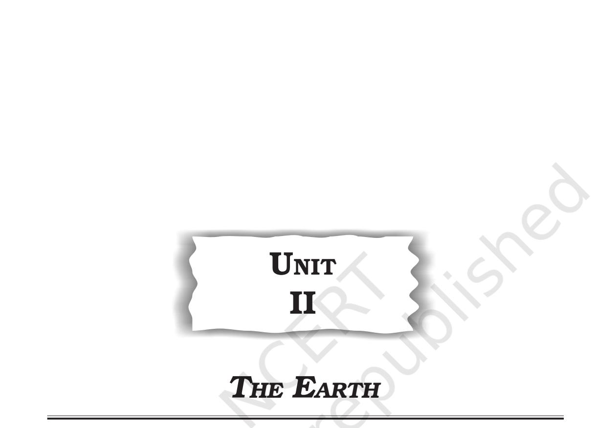
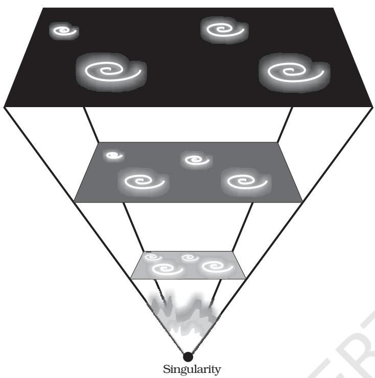

12 FUNDAMENTALS OF PHYSICAL GEOGRAPHY

## *This unit deals with*

- *• Origin and evolution of the earth; Interior of the earth; Wegener's continental drift theory and plate tectonics; earthquakes and volcanoes*

#### CHAPTER

# **THE ORIGIN AND EVOLUTION OF THE EARTH**

D o you remember the nursery rhyme "…Twinkle, twinkle little star…"? Starry nights have always attracted us since the childhood. You may also have thought of these stars and had numerous questions in your mind. Questions such as how many stars are there in the sky? How did they come into existence? Can one reach the end of the sky? May be many more such questions are still there in your mind. In this chapter, you will learn how these "twinkling little stars" were formed. With that you will eventually also read the story of origin and evolution of the earth.

## **EARLY THEORIES**

## **Origin of the Earth**

A large number of hypotheses were put forth by different philosophers and scientists regarding the origin of the earth. One of the earlier and popular arguments was by German philosopher Immanuel Kant. Mathematician Laplace revised it in 1796. It is known as *Nebular Hypothesis*. The hypothesis considered that the planets were formed out of a cloud of material associated with a youthful sun, which was slowly rotating. In 1950, Otto Schmidt in Russia and Carl Weizascar in Germany somewhat revised the 'nebular hypothesis', though differing in details. They considered that the sun was surrounded by solar nebula containing mostly the hydrogen and helium along with what may be termed as dust. The friction and collision of particles led to formation of a disk-shaped cloud and the planets were formed through the process of accretion.

However, scientists in later period took up the problems of origin of universe rather than that of just the earth or the planets.

## **MODERN THEORIES**

#### **Origin of the Universe**

The most popular argument regarding the origin of the universe is the *Big Bang Theory*. It is also called *expanding universe hypothesis*. Edwin Hubble, in 1920, provided evidence that the universe is expanding. As time passes, galaxies move further and further apart. You can experiment and find what does the expanding universe mean. Take a balloon and mark some points on it to represent the galaxies. Now, if you start inflating the balloon, the points marked on the balloon will appear to be moving away from each other as the balloon expands. Similarly, the distance between the galaxies is also found to be increasing and thereby, the universe is considered to be expanding. However, you will find that besides the increase in the distances between the points on the balloon, the points themselves are expanding. This is not in accordance with the fact. Scientists believe that though the space between the galaxies is increasing, observations do not support the expansion of galaxies. So, the balloon example is only partially correct.

The Big Bang Theory considers the following stages in the development of the universe.

- (i) In the beginning, all matter forming the universe existed in one place in the form of a "tiny ball" (singular atom) with an

**Figure 2.1 : The Big Bang**

unimaginably small volume, infinite temperature and infinite density.

- (ii) At the Big Bang the "tiny ball" exploded violently. This led to a huge expansion. It is now generally accepted that the event of big bang took place 13.7 billion years before the present. The expansion continues even to the present day. As it grew, some energy was converted into matter. There was particularly rapid expansion within fractions of a second after the bang. Thereafter, the expansion has slowed down. Within first three minutes from the Big Bang event, the first atom began to form.
- (iii) Within 300,000 years from the Big Bang, temperature dropped to 4,500K (Kelvin) and gave rise to atomic matter. The universe became transparent.

The expansion of universe means increase in space between the galaxies. An alternative to this was Hoyle's concept of *steady state*. It considered the universe to be roughly the same

14 FUNDAMENTALS OF PHYSICAL GEOGRAPHY

at any point of time. However, with greater evidence becoming available about the expanding universe, scientific community at present favours argument of expanding universe.

## **The Star Formation**

The distribution of matter and energy was not even in the early universe. These initial density differences gave rise to differences in gravitational forces and it caused the matter to get drawn together. These formed the bases for development of galaxies. A *galaxy* contains a large number of stars. Galaxies spread over vast distances that are measured in thousands of *light-year*s. The diameters of individual galaxies range from 80,000-150,000 light years. A galaxy starts to form by accumulation of hydrogen gas in the form of a very large cloud called *nebula*. Eventually,

growing nebula develops localised clumps of gas. These clumps continue to grow into even denser gaseous bodies, giving rise to formation of stars. The formation of stars is believed to have taken place some 5-6 billion years ago.

> A light year is a measure of distance and not of time. Light travels at a speed of 300,000 km/second. Considering this, the distances the light will travel in one year is taken to be one light year. This equals to 9.461×1012 km. The mean distance between the sun and the earth is 149,598,000 km. In terms of light years, it is 8.311minutes.

## **Formation of Planets**

The following are considered to be the stages in the development of planets :

- (i) The stars are localised lumps of gas within a nebula. The gravitational force within the lumps leads to the formation of a core to the gas cloud and a huge rotating disc of gas and dust develops around the gas core.
- (ii) In the next stage, the gas cloud starts getting condensed and the matter around the core develops into smallrounded objects. These small-rounded objects by the process of cohesion develop into what is called *planetesimals*. Larger bodies start forming by collision, and gravitational attraction causes the material to stick together. Planetesimals are a large number of smaller bodies.
- (iii) In the final stage, these large number of small planetesimals accrete to form a fewer large bodies in the form of planets.

#### EVOLUTION OF THE EARTH

Do you know that the planet earth initially was a barren, rocky and hot object with a thin atmosphere of hydrogen and helium. This is far from the present day picture of the earth. Hence, there must have been some events– processes, which may have caused this change from rocky, barren and hot earth to a beautiful planet with ample amount of water and conducive atmosphere favouring the existence of life. In the following section, you will find out how the period, between the 4,600 million years and the present, led to the evolution of life on the surface of the planet.

The earth has a layered structure. From the outermost end of the atmosphere to the centre of the earth, the material that exists is not uniform. The atmospheric matter has the least density. From the surface to deeper depths, the earth's interior has different zones and each of these contains materials with different characteristics.

> How was the layered structure of the earth developed?

#### Evolution of Lithosphere

The earth was mostly in a volatile state during its primordial stage. Due to gradual increase in density the temperature inside has increased. As a result the material inside started getting separated depending on their densities. This allowed heavier materials (like iron) to sink towards the centre of the earth and the lighter ones to move towards the surface. With passage of time it cooled further and solidified and condensed into a smaller size. This later led to the development of the outer surface in the form of a crust. During the formation of the moon, due to the giant impact, the earth was further heated up. It is through the process of differentiation that the earth forming material got separated into different layers. Starting from the surface to the central parts, we have layers like the crust, mantle, outer core and inner core. From the crust to the core, the density of the material increases. We shall discuss in detail the properties of each of this layer in the next chapter.

#### Evolution of Atmosphere and Hydrosphere

The present composition of earth's atmosphere is chiefly contributed by nitrogen and oxygen. You will be dealing with the composition and structure of the earth's atmosphere in Chapter 8.

There are three stages in the evolution of the present atmosphere. The first stage is marked by the loss of primordial atmosphere. In the second stage, the hot interior of the earth contributed to the evolution of the atmosphere. Finally, the composition of the atmosphere was modified by the living world through the process of *photosynthesis*.

The early atmosphere, with hydrogen and helium, is supposed to have been stripped off as a result of the solar winds. This happened not only in case of the earth, but also in all the terrestrial planets, which were supposed to have lost their primordial atmosphere through the impact of solar winds.

During the cooling of the earth, gases and water vapour were released from the interior solid earth. This started the evolution of the present atmosphere. The early atmosphere largely contained water vapour, nitrogen, carbon dioxide, methane, ammonia and very little of free oxygen. The process through which the gases were outpoured from the interior is called *degassing*. Continuous volcanic eruptions contributed water vapour and gases to the atmosphere. As the earth cooled, the water vapour released started getting condensed. The carbon dioxide in the atmosphere got dissolved in rainwater and the temperature further decreased causing more condensation and more rains. The rainwater falling onto the surface got collected in the depressions to give rise to oceans. The earth's oceans were formed within 500 million years from the formation of the earth. This tells us that the oceans are as old as 4,000 million years. Sometime around 3,800 million years ago, life began to evolve. However, around 2,500-3,000 million years before the present, the process of photosynthesis got evolved. Life was confined to the oceans for a long time. Oceans began to have the contribution of oxygen through the process of *photosynthesis*. Eventually, oceans were saturated with oxygen, and 2,000 million years ago, oxygen began to flood the atmosphere.

#### **Origin of Life**

The last phase in the evolution of the earth relates to the origin and evolution of life. It is undoubtedly clear that initially the earth or even the atmosphere of the earth was not conducive for the development of life. Modern scientists refer to the origin of life as a kind of chemical reaction, which first generated complex organic molecules and assembled them. This assemblage was such that they could duplicate themselves converting inanimate matter into living substance. The record of life that existed on this planet in different periods is found in rocks in the form of fossils. The microscopic structures closely related to the present form of blue algae have been found in geological formations much older than some 3,000 million years. It can be assumed that life began to evolve sometime 3,800 million years ago. The summary of evolution of life from unicellular bacteria to the modern man is given in the Geological Time Scale on page 18.

#### **EXERCISES**

- 1. Multiple choice questions.
	- (i) Which one of the following figures represents the age of the earth?

|
|  |

- (b) 13.7 billion years (d) 13.7 trillion years
- (ii) Which one of the following is not related to the formation or modification of the present atmosphere?
	- (a) Solar winds (c) Degassing
	- (b) Differentiation (d) Photosynthesis
- (iii) Life on the earth appeared around how many years before the present?
	- (a) 13.7 billion (c) 4.6 billion
	- (b) 3.8 million (d) 3.8 billion
- 2. Answer the following questions in about 30 words.
	- (i) What is meant by the process of differentiation?
	- (ii) What was the nature of the earth surface initially?
	- (iii) What were the gases which initially formed the earth's atmosphere?
- 3. Answer the following questions in about 150 words.
	- (i) Write an explanatory note on the 'Big Bang Theory'.
	- (ii) List the stages in the evolution of the earth and explain each stage in brief.

#### **Project Work**

Collect information about the project "Stardust" (website: *www.sci.edu/public.html* and *www.nasm.edu*) along the following lines.

- (i) Which is the agency that has launched this project?
- (ii) Why are scientists interested in collecting Stardust?
- (iii) Where from the Stardust is being collected?

