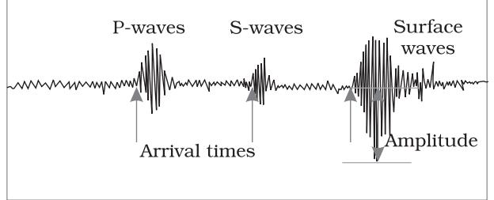
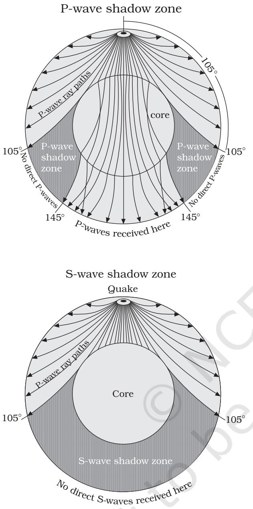
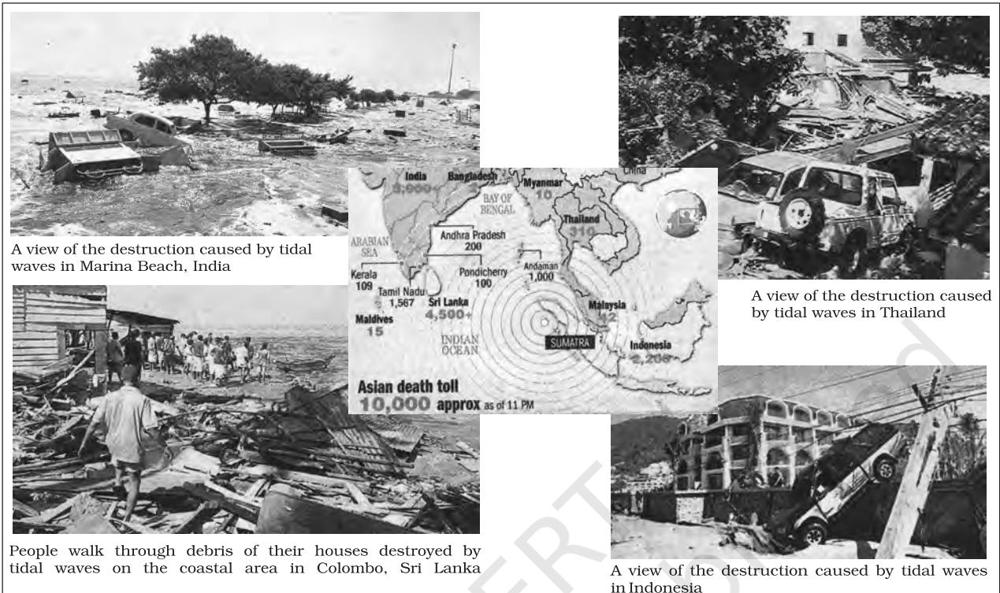
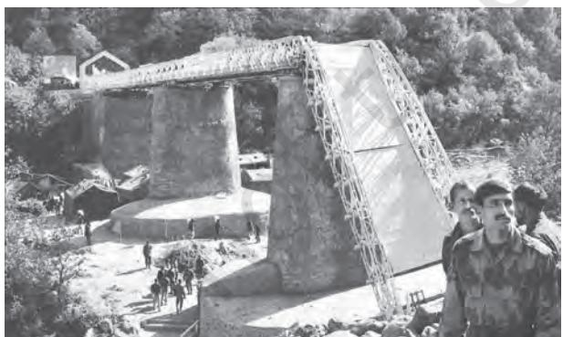
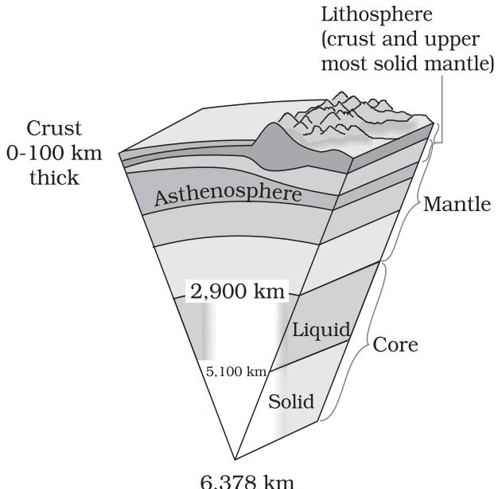
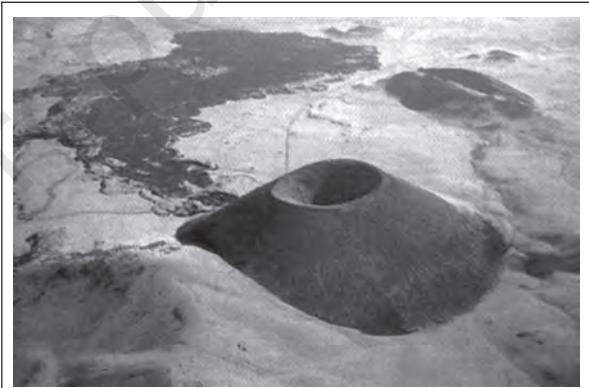
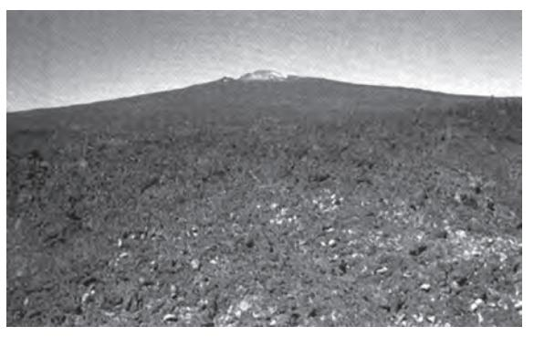
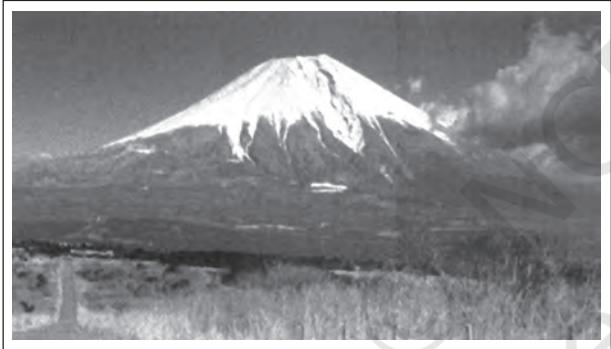
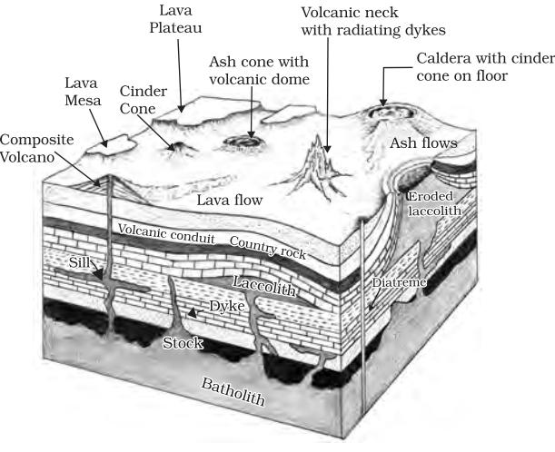

# **INTERIOR OF THE EARTH**

CHAPTER

W hat do you imagine about the nature of the earth? Do you imagine it to be a solid ball like cricket ball or a hollow ball with a thick cover of rocks i.e. lithosphere? Have you ever seen photographs or images of a volcanic eruption on the television screen? Can you recollect the emergence of hot molten lava, dust, smoke, fire and magma flowing out of the volcanic crater? The interior of the earth can be understood only by indirect evidences as neither any one has nor any one can reach the interior of the earth.

The configuration of the surface of the earth is largely a product of the processes operating in the interior of the earth. Exogenic as well as endogenic processes are constantly shaping the landscape. A proper understanding of the physiographic character of a region remains incomplete if the effects of endogenic processes are ignored. Human life is largely influenced by the physiography of the region. Therefore, it is necessary that one gets acquainted with the forces that influence landscape development. To understand why the earth shakes or how a tsunami wave is generated, it is necessary that we know certain details of the interior of the earth. In the previous chapter, you have noted that the earth-forming materials have been distributed in the form of layers from the crust to the core. It is interesting to know how scientists have gathered information about these layers and what are the characteristics of each of these layers. This is exactly what this chapter deals with.

**SOURCES OF INFORMATION ABOUT THE INTERIOR**

The earth's radius is about 6,378 km. No one can reach the centre of the earth and make observations or collect samples of the material. Under such conditions, you may wonder how scientists tell us about the earth's interior and the type of materials that exist at such depths. Most of our knowledge about the interior of the earth is largely based on estimates and inferences. Yet, a part of the information is obtained through direct observations and analysis of materials.

# **Direct Sources**

The most easily available solid earth material is surface rock or the rocks we get from mining areas. Gold mines in South Africa are as deep as 3 - 4 km. Going beyond this depth is not possible as it is very hot at this depth. Besides mining, scientists have taken up a number of projects to penetrate deeper depths to explore the conditions in the crustal portions. Scientists world over are working on two major projects such as "Deep Ocean Drilling Project" and "Integrated Ocean Drilling Project". The deepest drill at Kola, in Arctic Ocean, has so far reached a depth of 12 km. This and many deep drilling projects have provided large volume of information through the analysis of materials collected at different depths.

Volcanic eruption forms another source of obtaining direct information. As and when the molten material (magma) is thrown onto the surface of the earth, during volcanic eruption it becomes available for laboratory analysis. However, it is difficult to ascertain the depth of the source of such magma.

### Indirect Sources

Analysis of properties of matter indirectly provides information about the interior. We know through the mining activity that temperature and pressure increase with the increasing distance from the surface towards the interior in deeper depths. Moreover, it is also known that the density of the material also increases with depth. It is possible to find the rate of change of these characteristics. Knowing the total thickness of the earth, scientists have estimated the values of temperature, pressure and the density of materials at different depths. The details of these characteristics with reference to each layer of the interior are discussed later in this chapter.

Another source of information are the meteors that at times reach the earth. However, it may be noted that the material that becomes available for analysis from meteors, is not from the interior of the earth. The material and the structure observed in the meteors are similar to that of the earth. They are solid bodies developed out of materials same as, or similar to, our planet. Hence, this becomes yet another source of information about the interior of the earth.

The other indirect sources include gravitation, magnetic field, and seismic activity. The gravitation force (*g*) is not the same at different latitudes on the surface. It is greater near the poles and less at the equator. This is because of the distance from the centre at the equator being greater than that at the poles. The gravity values also differ according to the mass of material. The uneven distribution of mass of material within the earth influences this value. The reading of the gravity at different places is influenced by many other factors. These readings differ from the expected values. Such a difference is called *gravity anomaly*. Gravity anomalies give us information about the distribution of mass of the material in the crust of the earth. Magnetic surveys also provide information about the distribution of magnetic materials in the crustal portion, and thus, provide information about the distribution of materials in this part. Seismic activity is one of the most important sources of information about the interior of the earth. Hence, we shall discuss it in some detail.

# Earthquake

The study of seismic waves provides a complete picture of the layered interior. An earthquake in simple words is shaking of the earth. It is a natural event. It is caused due to release of energy, which generates waves that travel in all directions.

### *Why does the earth shake?*

The release of energy occurs along a fault. A fault is a sharp break in the crustal rocks. Rocks along a fault tend to move in opposite directions. As the overlying rock strata press them, the friction locks them together. However, their tendency to move apart at some point of time overcomes the friction. As a result, the blocks get deformed and eventually, they slide past one another abruptly. This causes a release of energy, and the energy waves travel in all directions. The point where the energy is released is called the *focus* of an earthquake, alternatively, it is called the *hypocentre*. The energy waves travelling in different directions reach the surface. The point on the surface, nearest to the focus, is called *epicentre*. It is the first one to experience the waves. It is a point directly above the focus.

# Earthquake Waves

All natural earthquakes take place in the lithosphere. You will learn about different layers of the earth later in this chapter. It is sufficient to note here that the lithosphere refers to the portion of depth up to 200 km from the surface of the earth. An instrument called 'seismograph' records the waves reaching the surface. A curve of earthquake waves recorded on the seismograph is given in Figure 3.1. Note that the curve shows three distinct sections each representing different types of wave patterns. Earthquake waves are basically of two types — *body waves* and *surface waves*. Body waves are generated due to the release of energy at the focus and move in all directions travelling through the body of the earth. Hence, the name body waves. The body waves interact with the surface rocks and generate new set of waves called surface waves. These waves move along the surface. The velocity of waves changes as they travel through materials with different densities. The denser the material, the higher is the velocity. Their direction also changes as they reflect or refract when coming across materials with different densities.

Figure 3.1 : Earthquake Waves

There are two types of body waves. They are called P and S-waves. P-waves move faster and are the first to arrive at the surface. These are also called 'primary waves'. The P-waves are similar to sound waves. They travel through gaseous, liquid and solid materials. S-waves arrive at the surface with some time lag. These are called secondary waves. An important fact about S-waves is that they can travel only through solid materials. This characteristic of the S-waves is quite important. It has helped scientists to understand the structure of the interior of the earth. Reflection causes waves to rebound whereas refraction makes waves move in different directions. The variations in the direction of waves are inferred with the help of their record on seismograph. The surface waves are the last to report on seismograph. These waves are more destructive. They cause displacement of rocks, and hence, the collapse of structures occurs.

# *Propagation of Earthquake Waves*

Different types of earthquake waves travel in different manners. As they move or propagate, they cause vibration in the body of the rocks through which they pass. P-waves vibrate parallel to the direction of the wave. This exerts pressure on the material in the direction of the propagation. As a result, it creates density differences in the material leading to stretching and squeezing of the material. Other three waves vibrate perpendicular to the direction of propagation. The direction of vibrations of S-waves is perpendicular to the wave direction in the vertical plane. Hence, they create troughs and crests in the material through which they pass. Surface waves are considered to be the most damaging waves.

# *Emergence of Shadow Zone*

Earthquake waves get recorded in seismographs located at far off locations. However, there exist some specific areas where the waves are not reported. Such a zone is called the 'shadow zone'. The study of different events reveals that for each earthquake, there exists an altogether different shadow zone. Figure 3.2 (a) and (b) show the shadow zones of P and S-waves. It was observed that seismographs located at any distance within 105° from the epicentre, recorded the arrival of both P and S-waves. However, the seismographs located beyond 145° from epicentre, record the arrival of P-waves, but not that of S-waves. Thus, a zone between 105° and 145° from epicentre was identified as the shadow zone for both the types of waves. The entire zone beyond 105° does not receive S-waves. The shadow zone of S-wave is much larger than that of the P-waves. The shadow zone of P-waves appears as a band around the earth between 105° and 145° away from the epicentre. The shadow zone of S-waves is not only larger in extent but it is also a little over 40 per cent of the earth surface. You can draw the shadow zone for any earthquake provided you know the location of the epicentre. (See the activity box on page 28 to know how to locate the epicentre of a quake event).

# *Types of Earthquakes*

- (i) The most common ones are the *tectonic* earthquakes. These are generated due to sliding of rocks along a fault plane.
- (ii) A special class of tectonic earthquake is sometimes recognised as *volcanic* earthquake. However, these are confined to areas of active volcanoes.

Figure 3.2 (a) and (b) : Earthquake Shadow Zones

- (iii) In the areas of intense mining activity, sometimes the roofs of underground mines collapse causing minor tremors. These are called *collapse* earthquakes.
- (iv) Ground shaking may also occur due to the explosion of chemical or nuclear devices. Such tremors are called *explosion* earthquakes.

- (v) The earthquakes that occur in the areas of large reservoirs are referred to as *reservoir induced* earthquakes.
#### *Measuring Earthquakes*

The earthquake events are scaled either according to the magnitude or intensity of the shock. The magnitude scale is known as the *Richter scale*. The magnitude relates to the energy released during the quake. The magnitude is expressed in numbers, 0-10. The intensity scale is named after *Mercalli*, an Italian seismologist. The intensity scale takes into account the visible damage caused by the event. The range of intensity scale is from 1-12.

#### EFFECTS OF EARTHQUAKE

Earthquake is a natural hazard. The following are the immediate hazardous effects of earthquake:

- (i) Ground Shaking
- (ii) Differential ground settlement
- (iii) Land and mud slides
- (iv) Soil liquefaction
- (v) Ground lurching
- (vi) Avalanches
- (vii) Ground displacement
- (viii) Floods from dam and levee failures
	- (ix) Fires
	- (x) Structural collapse
- (xi) Falling objects
- (xii) Tsunami

The first six listed above have some bearings upon landforms, while others may be considered the effects causing immediate concern to the life and properties of people in the region. The effect of tsunami would occur only if the epicentre of the tremor is below oceanic waters and the magnitude is sufficiently high. *Tsunamis* are waves generated by the tremors and not an earthquake in itself. Though the actual quake activity lasts for a few seconds, its effects are devastating provided the magnitude of the quake is more than 5 on the Richter scale.

# *Frequency of Earthquake Occurrences*

The earthquake is a natural hazard. If a tremor of high magnitude takes place, it can cause heavy damage to the life and property of people. However, not all the parts of the globe necessarily experience major shocks. We shall be discussing the distribution of earthquakes and volcanoes with some details in the next

A view of the damaged Aman Setu at the LOC in Uri, due to an earthquake

chapter. Note that the quakes of high magnitude, i.e. 8+ are quite rare; they occur once in 1-2 years whereas those of 'tiny' types occur almost every minute.

#### STRUCTURE OF THE EARTH

# The Crust

It is the outermost solid part of the earth. It is brittle in nature. The thickness of the crust varies under the oceanic and continental areas. Oceanic crust is thinner as compared to the continental crust. The mean thickness of oceanic crust is 5 km whereas that of the continental is around 30 km. The continental crust is thicker in the areas of major mountain systems. It is as much as 70 km thick in the Himalayan region.

# The Mantle

The portion of the interior beyond the crust is called the mantle. The mantle extends from Moho's discontinuity to a depth of 2,900 km. The upper portion of the mantle is called *asthenosphere*. The word *astheno* means weak. It is considered to be extending upto 400 km. It is the main source of magma that finds

Figure 3.3 : The interior of the earth

its way to the surface during volcanic eruptions. The crust and the uppermost part of the mantle are called lithosphere. Its thickness ranges from 10-200 km. The lower mantle extends beyond the asthenosphere. It is in solid state.

# The Core

As indicated earlier, the earthquake wave velocities helped in understanding the existence of the core of the earth. The coremantle boundary is located at the depth of 2,900 km. The outer core is in liquid state while the inner core is in solid state. The core is made up of very heavy material mostly constituted by nickel and iron. It is sometimes referred to as the *nife* layer.

# VOLCANOES AND VOLCANIC LANDFORMS

You may have seen photographs or pictures of volcanoes on a number of occasions. A volcano is a place where gases, ashes and/or molten rock material – lava – escape to the ground. A volcano is called an active volcano if the materials mentioned are being released or have been released out in the recent past. The layer below the solid crust is mantle. It has higher density than that of the crust. The mantle contains a weaker zone called *asthenosphere*. It is from this that the molten rock materials find their way to the surface. The material in the upper mantle portion is called *magma*. Once it starts moving towards the crust or it reaches the surface, it is referred to as *lava*. The material that reaches the ground includes lava flows, pyroclastic debris, volcanic bombs, ash and dust and gases such as nitrogen compounds, sulphur compounds and minor amounts of chlorene, hydrogen and argon.

# Volcanoes

Volcanoes are classified on the basis of nature of eruption and the form developed at the surface. Major types of volcanoes are as follows:

# *Shield Volcanoes*

Barring the basalt flows, the shield volcanoes are the largest of all the volcanoes on the earth. The Hawaiian volcanoes are the most famous

Shield Volcano

Cinder Cone

examples. These volcanoes are mostly made up of basalt, a type of lava that is very fluid when erupted. For this reason, these volcanoes are not steep. They become explosive if somehow water gets into the vent; otherwise, they are characterised by low-explosivity. The upcoming lava moves in the form of a fountain and throws out the cone at the top of the vent and develops into cinder cone.

# *Composite Volcanoes*

These volcanoes are characterised by eruptions of cooler and more viscous lavas than basalt. These volcanoes often result in explosive eruptions. Along with lava, large quantities of pyroclastic material and ashes find their way to the ground. This material accumulates in the vicinity of the vent openings leading to formation of layers, and this makes the mounts appear as composite volcanoes.

#### *Caldera*

These are the most explosive of the earth's volcanoes. They are usually so explosive that when they erupt they tend to collapse on themselves rather than building any tall structure. The collapsed depressions are called *calderas*. Their explosiveness indicates that the magma chamber supplying the lava is not only huge but is also in close vicinity.

#### *Flood Basalt Provinces*

These volcanoes outpour highly fluid lava that flows for long distances. Some parts of the world are covered by thousands of sq. km of thick basalt lava flows. There can be a series of flows with some flows attaining thickness of Figure 3.4 : Volcanic Landforms

more than 50 m. Individual flows may extend for hundreds of km. The *Deccan Traps* from India, presently covering most of the Maharashtra plateau, are a much larger flood basalt province. It is believed that initially the trap formations covered a much larger area than the present.

#### *Mid-Ocean Ridge Volcanoes*

These volcanoes occur in the oceanic areas. There is a system of mid-ocean ridges more than 70,000 km long that stretches through all the ocean basins. The central portion of this ridge experiences frequent eruptions. We shall be discussing this in detail in the next chapter.

#### VOLCANIC LANDFORMS

### Intrusive Forms

The lava that is released during volcanic eruptions on cooling develops into igneous rocks. The cooling may take place either on reaching the surface or also while the lava is still in the crustal portion. Depending on the location of the cooling of the lava, igneous rocks are classified as *volcanic rocks* (cooling at the surface) and *plutonic rocks* (cooling in the crust). The lava that cools within the crustal portions assumes different forms. These forms are called *intrusive forms*. Some of the forms are shown in Figure 3.4. Composite Volcano

#### *Batholiths*

A large body of magmatic material that cools in the deeper depth of the crust develops in the form of large domes. They appear on the surface only after the denudational processes remove the overlying materials. They cover large areas, and at times, assume depth that may be several km. These are granitic bodies. Batholiths are the cooled portion of magma chambers.

#### *Lacoliths*

These are large dome-shaped intrusive bodies with a level base and connected by a pipe-like conduit from below. It resembles the surface volcanic domes of composite volcano, only these are located at deeper depths. It can be regarded as the localised source of lava that finds its way to the surface. The Karnataka plateau is spotted with domal hills of granite rocks. Most of these, now exfoliated, are examples of lacoliths or batholiths.

#### *Lapolith, Phacolith and Sills*

As and when the lava moves upwards, a portion of the same may tend to move in a horizontal direction wherever it finds a weak plane. It may get rested in different forms. In case it develops into a saucer shape, concave to the sky body, it is called *lapolith*. A wavy mass of intrusive rocks, at times, is found at the base of synclines or at the top of anticline in folded igneous country. Such wavy materials have a definite conduit to source beneath in the form of magma chambers (subsequently developed as batholiths). These are called the phacoliths.

The near horizontal bodies of the intrusive igneous rocks are called *sill* or *sheet*, depending on the thickness of the material. The thinner ones are called sheets while the thick horizontal deposits are called sills.

#### *Dykes*

When the lava makes its way through cracks and the fissures developed in the land, it solidifies almost perpendicular to the ground. It gets cooled in the same position to develop a wall-like structure. Such structures are called dykes. These are the most commonly found intrusive forms in the western Maharashtra area. These are considered the feeders for the eruptions that led to the development of the Deccan traps.

#### EXERCISES

- 1. Multiple choice questions.
	- (i) Which one of the following earthquake waves is more destructive?
		- (a) P-waves (c) Surface waves
			- (b) S-waves (d) None of the above
	- (ii) Which one of the following is a direct source of information about the interior of the earth?
		- (a) Earthquake waves (c) Gravitational force
			- (b) Volcanoes (d) Earth magnetism

(iii) Which type of volcanic eruptions have caused Deccan Trap formations?

- (a) Shield (c) Composite
- (b) Flood (d) Caldera
- (iv) Which one of the following describes the lithosphere:
	- (a) upper and lower mantle (c) crust and core
	- (b) crust and upper mantle (d) mantle and core
- 2. Answer the following questions in about 30 words.
	- (i) What are body waves?
	- (ii) Name the direct sources of information about the interior of the earth.
	- (iii) Why do earthquake waves develop shadow zone?
	- (iv) Briefly explain the indirect sources of information of the interior of the earth other than those of seismic activity.
- 3. Answer the following questions in about 150 words.
	- (i) What are the effects of propagation of earthquake waves on the rock mass through which they travel?
	- (ii) What do you understand by intrusive forms? Briefly describe various intrusive forms.

