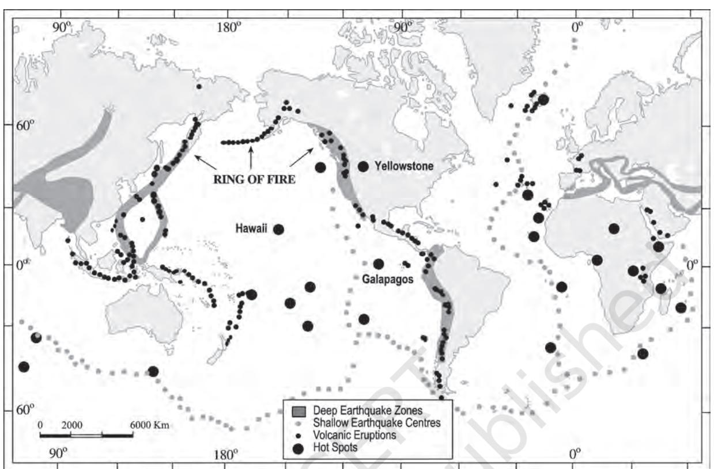

### CHAPTER

# DISTRIBUTION OF OCEANS AND CONTINENTS

In the previous chapter, you have studied the interior of the earth. You are already familiar with the world map. You know that continents cover 29 per cent of the surface of the earth and the remainder is under oceanic waters. The positions of the continents and the ocean bodies, as we see them in the map, have not been the same in the past. Moreover, it is now a well-accepted fact that oceans and continents will not continue to enjoy their present positions in times to come. If this is so, the question arises what were their positions in the past? Why and how do they change their positions? Even if it is true that the continents and oceans have changed and are changing their positions, you may wonder as to how scientists know this. How have they determined their earlier positions? You will find the answers to some of these and related questions in this chapter.

# CONTINENTAL DRIFT

Observe the shape of the coastline of the Atlantic Ocean. You will be surprised by the symmetry of the coastlines on either side of the ocean. No wonder, many scientists thought of this similarity and considered the possibility of the two Americas, Europe and Africa, to be once joined together. From the known records of the history of science, it was *Abraham Ortelius*, a Dutch map maker, who first proposed such a possibility as early as 1596. *Antonio Pellegrini* drew a map showing the three continents together. However, it was *Alfred Wegener*—a German meteorologist who put forth a comprehensive argument in the form of "the continental drift theory" in 1912. This was regarding the distribution of the oceans and the continents.

According to Wegener, all the continents formed a single continental mass and mega ocean surrounded the same. The super continent was named PANGAEA, which meant all earth. The mega-ocean was called PANTHALASSA, meaning all water. He argued that, around 200 million years ago, the super continent, Pangaea, began to split. Pangaea first broke into two large continental masses as Laurasia and Gondwanaland forming the northern and southern components respectively. Subsequently, Laurasia and Gondwanaland continued to break into various smaller continents that exist today. A variety of evidence was offered in support of the continental drift. Some of these are given below.

# Evidence in Support of the Continental Drift

# *The Matching of Continents (Jig-Saw-Fit)*

The shorelines of Africa and South America facing each other have a remarkable and unmistakable match. It may be noted that a map produced using a computer programme to find the best fit of the Atlantic margin was presented by Bullard in 1964. It proved to be quite perfect. The match was tried at 1,000 fathom line instead of the present shoreline.

# *Rocks of Same Age Across the Oceans*

The radiometric dating methods developed in the recent period have facilitated correlating the rock formation from different continents across the vast ocean. The belt of ancient rocks of 2,000 million years from Brazil coast matches with those from western Africa. The earliest marine deposits along the coastline of South America and Africa are of the Jurassic age. This suggests that the ocean did not exist prior to that time.

# *Tillite*

It is the sedimentary rock formed out of deposits of glaciers. The Gondawana system of sediments from India is known to have its counterparts in six different landmasses of the Southern Hemisphere. At the base, the system has thick tillite indicating extensive and prolonged glaciation. Counterparts of this succession are found in Africa, Falkland Island, Madagascar, Antarctica and Australia. Overall resemblance of the Gondawana-type sediments clearly demonstrates that these landmasses had remarkably similar histories. The glacial tillite provides unambiguous evidence of palaeoclimates and also of drifting of continents.

# *Placer Deposits*

The occurrence of rich placer deposits of gold in the Ghana coast and the absolute absence of source rock in the region is an amazing fact. The gold bearing veins are in Brazil and it is obvious that the gold deposits of the Ghana are derived from the Brazil plateau when the two continents lay side by side.

# *Distribution of Fossils*

When identical species of plants and animals adapted to living on land or in fresh water are found on either side of the marine barriers, a problem arises regarding accounting for such distribution. The observations that Lemurs occur in India, Madagascar and Africa led some to consider a contiguous landmass 'Lemuria' linking these three landmasses. Mesosaurus was a small reptile adapted to shallow brackish water. The skeletons of these are found only in two localities: the Southern Cape province of South Africa and Iraver formations of Brazil. The two localities are presently 4,800 km apart with an ocean in between them.

# Force for Drifting

Wegener suggested that the movement responsible for the drifting of the continents was caused by pole-fleeing force and tidal force. The polar-fleeing force relates to the rotation of the earth. You are aware of the fact that the earth is not a perfect sphere; it has a bulge at the equator. This bulge is due to the rotation of the earth. The second force that was suggested by Wegener — the tidal force — is due to the attraction of the moon and the sun that develops tides in oceanic waters. Wegener believed that these forces would become effective when applied over many million years. However, most of scholars considered these forces to be totally inadequate.

# Post-drift Studies

It is interesting to note that for continental drift, most of the evidence was collected from the continental areas in the form of distribution of flora and fauna or deposits, like tillite. A number of discoveries during the post–World War II period added new information to geological literature. Particularly, the information collected from the ocean floor mapping provided new dimensions for the study of distribution of oceans and continents.

# *Convectional Current Theory*

Arthur Holmes in 1930s discussed the possibility of convection currents operating in the mantle portion. These currents are generated due to radioactive elements causing thermal differences in the mantle portion. Holmes argued that there exists a system of such currents in the entire mantle portion. This was an attempt to provide an explanation to the issue of force, on the basis of which contemporary scientists discarded the continental drift theory.

# *Mapping of the Ocean Floor*

Detailed research of the ocean configuration revealed that the ocean floor is not just a vast plain but it is full of relief. Expeditions to map the oceanic floor in the post–World War II period provided a detailed picture of the ocean relief and indicated the existence of submerged mountain ranges as well as deep trenches, mostly located closer to the continent margins. The mid-oceanic ridges were found to be most active in terms of volcanic eruptions. The dating of the rocks from the oceanic crust revealed the fact that they are much younger than the continental areas. Rocks on either side of the crest of oceanic ridges and having equi-distant locations from the crest were found to have remarkable similarities both in terms of their constituents and their age.

### Ocean Floor Configuration

In this section we shall note a few things related to the ocean floor configuration that help us in the understanding of the distribution of continents and oceans. You will be studying the details of ocean floor relief in Chapter 13. The ocean floor may be segmented into three major divisions based on the depth as well as the forms of relief. These divisions are continental margins, deep-sea basins and mid-ocean ridges.

Figure 4.1 : Ocean Floor

## *Continental Margins*

These form the transition between continental shores and deep-sea basins. They include continental shelf, continental slope, continental rise and deep-oceanic trenches. Of these, the deep-oceanic trenches are the areas which are of considerable interest in so far as the distribution of oceans and continents is concerned.

#### *Abyssal Plains*

These are extensive plains that lie between the continental margins and mid-oceanic ridges. The abyssal plains are the areas where the continental sediments that move beyond the margins get deposited.

### *Mid-Oceanic Ridges*

This forms an interconnected chain of mountain system within the ocean. It is the longest mountain-chain on the surface of the earth though submerged under the oceanic waters. It is characterised by a central rift system at the crest, a fractionated plateau and flank zone all along its length. The rift system at the crest is the zone of intense volcanic activity. In the previous chapter, you have been introduced to this type of volcanoes as midoceanic volcanoes.

#### Distribution of Earthquakes and Volcanoes

Study the maps showing the distribution of seismic activity and volcanoes given in Figure 4.2. You will notice a line of dots in the central parts of the Atlantic Ocean almost parallel to the coastlines. It further extends into the Indian Ocean. It bifurcates a little south of the Indian subcontinent with one branch moving into East Africa and the other meeting a similar line from Myanmar to New Guiana. You will notice that this line of dots coincides with the midoceanic ridges. The shaded belt showing another area of concentration coincides with the Alpine-Himalayan system and the rim of the Pacific Ocean. In general, the foci of the earthquake in the areas of mid-oceanic ridges are at shallow depths whereas along the Alpine-Himalayan belt as well as the rim of the Pacific, the earthquakes are deep-seated ones. The map of volcanoes also shows a similar pattern. The rim of the Pacific is also called rim of fire due to the existence of active volcanoes in this area.

# CONCEPT OF SEA FLOOR SPREADING

As mentioned above, the post-drift studies provided considerable information that was not

Figure 4. 2 : Distribution of earthquakes and volcanoes

available at the time Wegener put forth his concept of continental drift. Particularly, the mapping of the ocean floor and palaeomagnetic studies of rocks from oceanic regions revealed the following facts :

- (i) It was realised that all along the midoceanic ridges, volcanic eruptions are common and they bring huge amounts of lava to the surface in this area.
- (ii) The rocks equidistant on either sides of the crest of mid-oceanic ridges show remarkable similarities in terms of period of formation, chemical compositions and magnetic properties. Rocks closer to the mid-oceanic ridges have normal polarity and are the youngest. The age of the rocks increases as one moves away from the crest.
- (iii) The ocean crust rocks are much younger than the continental rocks. The age of rocks in the oceanic crust is nowhere more than 200 million years old. Some of the continental rock formations are as old as 3,200 million years.
- (iv) The sediments on the ocean floor are unexpectedly very thin. Scientists were expecting, if the ocean floors were as old as the continent, to have a complete sequence of sediments for a period of much longer duration. However, nowhere was the sediment column found to be older than 200 million years.
- (v) The deep trenches have deep-seated earthquake occurrences while in the midoceanic ridge areas, the quake foci have shallow depths.

These facts and a detailed analysis of magnetic properties of the rocks on either sides of the mid-oceanic ridge led Hess (1961) to propose his hypothesis, known as the "sea floor spreading". Hess argued that constant eruptions at the crest of oceanic ridges cause the rupture of the oceanic crust and the new lava wedges into it, pushing the oceanic crust on either side. The ocean floor, thus spreads. The younger age of the oceanic crust as well as the fact that the spreading of one ocean does not cause the shrinking of the other, made Hess

think about the consumption of the oceanic crust. He further maintained that the ocean floor that gets pushed due to volcanic eruptions at the crest, sinks down at the oceanic trenches and gets consumed.

The basic concept of sea floor spreading has been depicted in Figure 4.3.

# PLATE TECTONICS

Since the advent of the concept of sea floor spreading, the interest in the problem of distribution of oceans and continents was revived. It was in 1967, McKenzie and Parker and also Morgan, independently collected the available ideas and came out with another

Figure 4.4 : Position of continents through geological past

concept termed *Plate Tectonics*. A tectonic plate (also called lithospheric plate) is a massive, irregularly-shaped slab of solid rock, generally composed of both continental and oceanic lithosphere. Plates move horizontally over the asthenosphere as rigid units. The lithosphere includes the crust and top mantle with its thickness range varying between 5 and100 km in oceanic parts and about 200 km in the continental areas. A plate may be referred to as the continental plate or oceanic plate depending on which of the two occupy a larger portion of the plate. Pacific plate is largely an oceanic plate whereas the Eurasian plate may be called a continental plate. The theory of plate tectonics proposes that the earth's lithosphere is divided into seven major and some minor plates. Young Fold Mountain ridges, trenches, and/or faults surround these major plates (Figure 4.5). The major plates are as follows :

- I Antarctica and the surrounding oceanic plate
- II North American (with western Atlantic floor separated from the South American plate along the Caribbean islands) plate
- III South American (with western Atlantic floor separated from the North American plate along the Caribbean islands) plate
- IV Pacific plate
- V India-Australia-New Zealand plate
- VI Africa with the eastern Atlantic floor plate
- VII Eurasia and the adjacent oceanic plate. Some important minor plates are listed below:
- (i) *Cocos plate* : Between Central America and Pacific plate
- (ii) *Nazca plate* : Between South America and Pacific plate
- (iii) *Arabian plate* : Mostly the Saudi Arabian landmass
- (iv) *Philippine plate* : Between the Asiatic and Pacific plate

Figure 4.5 : Major and minor plates of the world

- (v) *Caroline plate* : Between the Philippine and Indian plate (North of New Guinea)
These plates have been constantly moving over the globe throughout the history of the earth. It is not the continent that moves as believed by Wegener. Continents are part of a plate and what moves is the plate. Moreover, it may be noted that all the plates, without exception, have moved in the geological past, and shall continue to move in the future as well. Wegener had thought of all the continents to have initially existed as a super continent in the form of Pangaea. However, later discoveries reveal that the continental masses, resting on the plates, have been wandering all through the geological period, and Pangaea was a result of converging of different continental masses that were parts of one or the other plates. Scientists using the palaeomagnetic data have determined the positions held by each of the present continental landmass in different geological periods (Fig 4.4). Position of the Indian subcontinent (mostly Peninsular India) is traced with the help of the rocks analysed from the Nagpur area.

There are three types of plate boundaries:

# **Divergent Boundaries**

Where new crust is generated as the plates pull away from each other. The sites where the plates move away from each other are called *spreading sites*. The best-known example of divergent boundaries is the Mid-Atlantic Ridge. At this, the American Plate(s) is/are separated from the Eurasian and African Plates.

# **Convergent Boundaries**

Where the crust is destroyed as one plate dived under another. The location where sinking of a plate occurs is called a *subduction zone.* There are three ways in which convergence can occur. These are: (i) between an oceanic and continental plate; (ii) between two oceanic plates; and (iii) between two continental plates.

### **Transform Boundaries**

Where the crust is neither produced nor destroyed as the plates slide horizontally past each other. Transform faults are the planes of separation generally perpendicular to the midoceanic ridges. As the eruptions do not take all along the entire crest at the same time, there is a differential movement of a portion of the plate away from the axis of the earth. Also, the rotation of the earth has its effect on the separated blocks of the plate portions.

> How do you think the rate of plate movement is determined?

### **Rates of Plate Movement**

The strips of normal and reverse magnetic field that parallel the mid-oceanic ridges help scientists determine the rates of plate movement. These rates vary considerably. The Arctic Ridge has the slowest rate (less than 2.5 cm/yr), and the East Pacific Rise near Easter Island, in the South Pacific about 3,400 km west of Chile, has the fastest rate (more than 15 cm/yr).

### **Force for the Plate Movement**

At the time that Wegener proposed his theory of continental drift, most scientists believed that the earth was a solid, motionless body. However, concepts of sea floor spreading and the unified theory of plate tectonics have emphasised that both the surface of the earth and the interior are not static and motionless but are dynamic. The fact that the plates move is now a well-accepted fact. The mobile rock beneath the rigid plates is believed to be moving in a circular manner. The heated material rises to the surface, spreads and begins to cool, and then sinks back into deeper depths. This cycle is repeated over and over to generate what scientists call a convection cell or convective flow. Heat within the earth comes from two main sources: radioactive decay and residual heat. Arthur Holmes first considered this idea in the 1930s, which later influenced Harry Hess' thinking about seafloor spreading. The slow movement of hot, softened mantle that lies below the rigid plates is the driving force behind the plate movement.

# MOVEMENT OF THE INDIAN PLATE

The Indian plate includes Peninsular India and the Australian continental portions. The subduction zone along the Himalayas forms the northern plate boundary in the form of continent*— continent convergence*. In the east, it extends through Rakinyoma Mountains of Myanmar towards the island arc along the Java Trench. The eastern margin is a *spreading site* lying to the east of Australia in the form of an oceanic ridge in SW Pacific. The Western margin follows Kirthar Mountain of Pakistan. It further extends along the Makrana coast and joins the *spreading site* from the Red Sea rift southeastward along the Chagos Archipelago. The boundary between India and the Antarctic plate is also marked by oceanic ridge *(divergent boundary)* running in roughly W-E direction and merging into the *spreading site,* a little south of New Zealand.

India was a large island situated off the Australian coast, in a vast ocean. The Tethys Sea separated it from the Asian continent till about 225 million years ago. India is supposed to have started her northward journey about 200 million years ago at the time when Pangaea broke. India collided with Asia about 40-50 million years ago causing rapid uplift of the Himalayas. The positions of India since about 71 million years till the present are shown in the Figure 4.6. It also shows the position of the Indian subcontinent and the Eurasian plate. About 140 million years before the present, the subcontinent was located as south as 50oS. latitude. The two major plates were separated by the Tethys Sea and the Tibetan block was closer to the Asiatic landmass. During the movement of the Indian

Figure 4.6 : Movement of the Indian plate

plate towards the Eurasian plate, a major event that occurred was the outpouring of lava and formation of the Deccan Traps. This started somewhere around 60 million years ago and continued for a long period of time. Note that the subcontinent was still close to the equator. From 40 million years ago and thereafter, the event of formation of the Himalayas took place. Scientists believe that the process is still continuing and the height of the Himalayas is rising even to this date.

#### EXERCISES

- 1. Multiple choice questions.
	- (i) Who amongst the following was the first to consider the possibility of Europe, Africa and America having been located side by side.
		- (a) Alfred Wegener (c) Abraham Ortelius
		- (b) Antonio Pellegrini (d) Edmond Hess
	- (ii) Polar fleeing force relates to:

|
|  |

- (b) Gravitation (d) Tides
- (iii) Which one of the following is not a minor plate?
	- (a) Nazca (c) Philippines
	- (b) Arabia (d) Antarctica
- (iv) Which one of the following facts was not considered by those while discussing the concept of sea floor spreading?
	- (a) Volcanic activity along the mid-oceanic ridges.
	- (b) Stripes of normal and reverse magnetic field observed in rocks of ocean floor.
	- (c) Distribution of fossils in different continents.
	- (d) Age of rocks from the ocean floor.
- (v) Which one of the following is the type of plate boundary of the Indian plate along the Himalayan mountains?
	- (a) Ocean-continent convergence
	- (b) Divergent boundary
	- (c) Transform boundary
	- (d) Continent-continent convergence
- 2. Answer the following questions in about 30 words.
	- (i) What were the forces suggested by Wegener for the movement of the continents?
	- (ii) How are the convectional currents in the mantle initiated and maintained?
	- (iii) What is the major difference between the transform boundary and the convergent or divergent boundaries of plates?
	- (iv) What was the location of the Indian landmass during the formation of the Deccan Traps?
- 3. Answer the following questions in about 150 words.
	- (i) What are the evidences in support of the continental drift theory?
	- (ii) Bring about the basic difference between the drift theory and Plate tectonics.
	- (iii) What were the major post-drift discoveries that rejuvenated the interest of scientists in the study of distribution of oceans and continents?

#### Project Work

Prepare a collage related to damages caused by an earthquake.

