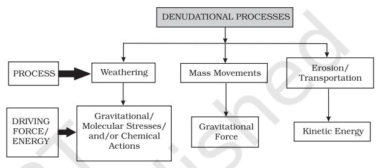

# **UNIT III**

# **LANDFORMS**

*This unit deals with*

- *• Landforms and their evolution*
- *• Geomorphic processes weathering, mass wasting, erosion and deposition; soils — formation*

#### CHAPTER

# **GEOMORPHIC PROCESSES**

A fter learning about how the earth was born, how it evolved its crust and other inner layers, how its crustal plates moved and are moving, and other information on earthquakes, the forms of volcanism and about the rocks and minerals the crust is composed of, it is time to know in detail about the surface of the earth on which we live. Let us start with this question.

#### Why is the surface of the earth uneven?

The earth's crust is dynamic. You are well aware that it has moved and moves vertically and horizontally. Of course, it moved a bit faster in the past than the rate at which it is moving now. The differences in the internal forces operating from within the earth which built up the crust have been responsible for the variations in the outer surface of the crust. The earth's surface is being continuously subjected to external forces induced basically by energy (sunlight). Of course, the internal forces are still active though with different intensities. That means, the earth's surface is being continuously subjected to by external forces originating within the earth's atmosphere and by internal forces from within the earth. The external forces are known as *exogenic forces* and the internal forces are known as *endogenic forces*. The actions of exogenic forces result in wearing down (degradation) of relief/elevations and filling up (aggradation) of basins/ depressions, on the earth's surface. The phenomenon of wearing down of relief variations of the surface of the earth through erosion is known as *gradation*. The endogenic forces continuously elevate or build up parts of the earth's surface and hence the exogenic processes fail to even out the relief variations of the surface of the earth. So, variations remain as long as the opposing actions of exogenic and endogenic forces continue. In general terms, the endogenic forces are mainly land building forces and the exogenic processes are mainly land wearing forces. The surface of the earth is sensitive. Humans depend on it for their sustenance and have been using it extensively and intensively. So, it is essential to understand its nature in order to use it effectively without disturbing its balance and diminishing its potential for the future. Almost all organisms contribute to sustain the earth's environment. However, humans have caused extensive damage to the environment through over use of resources. Use we must, but must also leave it potential enough to sustain life through the future. Most of the surface of the earth had and has been shaped over very long periods of time (hundreds and thousands of years) and because of its use and misuse by humans its potential is being diminished at a fast rate. If the processes which shaped and are shaping the surface of the earth into varieties of forms (shapes) and the nature of materials of which it is composed of, are understood, precautions can be taken to minimise the detrimental effects of human use and to preserve it for posterity.

## **GEOMORPHIC PROCESSES**

You would like to know the meaning of geomorphic processes. The endogenic and exogenic forces causing physical stresses and chemical actions on earth materials and bringing about changes in the configuration of the surface of the earth are known as *geomorphic processes*. Diastrophism and volcanism are endogenic geomorphic processes. These have already been discussed in brief in the preceding unit. Weathering, mass wasting, erosion and deposition are exogenic geomorphic processes. These exogenic processes are dealt with in detail in this chapter.

Any exogenic element of nature (like water, ice, wind, etc.,) capable of acquiring and transporting earth materials can be called a geomorphic agent. When these elements of nature become mobile due to gradients, they remove the materials and transport them over slopes and deposit them at lower level. Geomorphic processes and geomorphic agents especially exogenic, unless stated separately, are one and the same.

A process is a force applied on earth materials affecting the same. An agent is a mobile medium (like running water, moving ice masses, wind, waves and currents etc.) which removes, transports and deposits earth materials. Running water, groundwater, glaciers, wind, waves and currents, etc., can be called *geomorphic agents*.

> Do you think it is essential to distinguish geomorphic agents and geomorphic processes?

Gravity besides being a directional force activating all downslope movements of matter also causes stresses on the earth's materials. Indirect gravitational stresses activate wave and tide induced currents and winds. Without gravity and gradients there would be no mobility and hence no erosion, transportation and deposition are possible. So, gravitational stresses are as important as the other geomorphic processes. Gravity is the force that is keeping us in contact with the surface and it is the force that switches on the movement of all surface material on earth. All the movements either within the earth or on the surface of the earth occur due to gradients — from higher levels to lower levels, from high pressure to low pressure areas etc.

# **ENDOGENIC PROCESSES**

The energy emanating from within the earth is the main force behind endogenic geomorphic processes. This energy is mostly generated by radioactivity, rotational and tidal friction and primordial heat from the origin of the earth. This energy due to geothermal gradients and heat flow from within induces diastrophism and volcanism in the lithosphere. Due to variations in geothermal gradients and heat flow from within, crustal thickness and strength, the action of endogenic forces are not uniform and hence the tectonically controlled original crustal surface is uneven.

# **Diastrophism**

All processes that move, elevate or build up portions of the earth's crust come under *diastrophism*. They include: (i) *orogenic* processes involving mountain building through severe folding and affecting long and narrow belts of the earth's crust; (ii) *epeirogenic* processes involving uplift or warping of large parts of the earth's crust; (iii) earthquakes involving local relatively minor movements; (iv) plate tectonics involving horizontal movements of crustal plates.

In the process of orogeny, the crust is severely deformed into folds. Due to epeirogeny, there may be simple deformation. Orogeny is a mountain building process whereas epeirogeny is continental building process. Through the processes of orogeny, epeirogeny, earthquakes and plate tectonics, there can be faulting and fracturing of the crust. All these processes cause pressure, volume and temperature (PVT) changes which in turn induce metamorphism of rocks.

> Epeirogeny and orogeny, cite the differences.

## **Volcanism**

Volcanism includes the movement of molten rock (magma) onto or toward the earth's surface and also formation of many intrusive and extrusive volcanic forms. Many aspects of volcanism have already been dealt in detail under volcanoes in the Unit II and under igneous rocks in the preceding chapter in this unit.

> What do the words volcanism and volcanoes indicate?

# **EXOGENIC PROCESSES**

The exogenic processes derive their energy from atmosphere determined by the ultimate energy from the sun and also the gradients created by tectonic factors.

> Why do you think that the slopes or gradients are created by tectonic factors?

Gravitational force acts upon all earth materials having a sloping surface and tend to produce movement of matter in down slope direction. Force applied per unit area is called *stress*. Stress is produced in a solid by pushing or pulling. This induces deformation. Forces acting along the faces of earth materials are shear stresses (separating forces). It is this stress that breaks rocks and other earth materials. The shear stresses result in angular displacement or slippage. Besides the gravitational stress earth materials become subjected to molecular stresses that may be caused by a number of factors amongst which temperature changes, crystallisation and melting are the most common. Chemical processes normally lead to loosening of bonds between grains, dissolving of soluble minerals or cementing materials. Thus, the basic reason that leads to weathering, mass movements, and erosion is development of stresses in the body of the earth materials.

 Temperature and precipitation are the two important climatic elements that control various processes.

All the exogenic geomorphic processes are covered under a general term, *denudation*. The word 'denude' means to strip off or to uncover. Weathering, mass wasting/movements, erosion and transportation are included in denudation. The flow chart (Figure 5.1) gives the denudation processes and their respective driving forces. It should become clear from this chart that for each process there exists a distinct driving force or energy.

As there are different climatic regions owing to variations in thermal gradients created by latitudinal, seasonal, and land and water spread on the surface of the earth, the exogenic geomorphic processes vary from region to region. The density, type and distribution of vegetation which largely depend upon precipitation and temperature also exert

influence indirectly on exogenic geomorphic processes. Within different climatic regions there may be local variations of the effects of different climatic elements due to altitudinal differences, aspect variations and the variation in the amount of insolation received by north and south facing slopes as compared to east and west facing slopes. Further, due to differences in wind velocities and directions, amount and kind of precipitation, its intensity, the relation between precipitation and evaporation, daily range of temperature, freezing and thawing frequency, depth of frost penetration, the geomorphic processes vary within any climatic region.

> What is the sole driving force behind all the exogenic processes?

Climatic factors being equal, the intensity of action of exogenic geomorphic processes depends upon type and structure of rocks. The term structure includes such aspects of rocks as folds, faults, orientation and inclination of beds, presence or absence of joints, bedding planes, hardness or softness of constituent minerals, chemical susceptibility of mineral constituents; the permeability or impermeability

etc. Different types of rocks with differences in their structure offer varying resistances to various geomorphic processes. A particular rock may be resistant to one process and nonresistant to another. And, under varying climatic conditions, particular rocks may exhibit different degrees of resistance to geomorphic processes and hence they operate at differential rates and give rise to differences in topography. The effects of most of the exogenic geomorphic processes are small and slow and may be imperceptible in a short time span, but will in the long run affect the rocks severely due to continued fatigue.

Finally, it boils down to one fact that the differences on the surface of the earth though originally related to the crustal evolution continue to exist in some form or the other due to differences in the type and structure of earth materials, differences in geomorphic processes and in their rates of operation.

Some of the exogenic geomorphic processes have been dealt in detail here.

## **WEATHERING**

Weathering is action of elements of weather and climate over earth materials. There are a number of processes within weathering which act either individually or together to affect the earth materials in order to reduce them to fragmental state.

> Weathering is defined as mechanical disintegration and chemical decomposition of rocks through the actions of various elements of weather and climate.

As very little or no motion of materials takes place in weathering, it is an *in-situ* or on-site process.

> Is this little motion which can occur sometimes due to weathering synonymous with transportation? If not, why?

Weathering processes are conditioned by many complex geological, climatic, topographic and vegetative factors. Climate is of particular importance. Not only weathering processes differ from climate to climate, but also the depth of the weathering mantle (Figure 5.2).

**Figure 5.2 : Climatic regimes and depth of weathering mantles (adapted and modified from Strakhov, 1967)**

# **Activity** Mark the latitude values of different climatic regimes in Figure 6.2 and compare the details.

There are three major groups of weathering processes : (i) chemical; (ii) physical or mechanical; (iii) biological weathering processes. Very rarely does any one of these processes ever operate completely by itself, but quite often a dominance of one process can be seen.

#### **Chemical Weathering Processes**

A group of weathering processes viz; solution, carbonation, hydration, oxidation and reduction act on the rocks to decompose, dissolve or reduce them to a fine clastic state through chemical reactions by oxygen, surface and/or soil water and other acids. Water and air (oxygen and carbon dioxide) along with heat must be present to speed up all chemical reactions. Over and above the carbon dioxide present in the air, decomposition of plants and animals increases the quantity of carbon dioxide underground. These chemical reactions on various minerals are very much similar to the chemical reactions in a laboratory.

#### **Physical Weathering Processes**

Physical or mechanical weathering processes depend on some applied forces. The applied forces could be: (i) gravitational forces such as overburden pressure, load and shearing stress; (ii) expansion forces due to temperature changes, crystal growth or animal activity; (iii) water pressures controlled by wetting and drying cycles. Many of these forces are applied both at the surface and within different earth materials leading to rock fracture. Most of the physical weathering processes are caused by thermal expansion and pressure release. These processes are small and slow but can cause great damage to the rocks because of continued fatigue the rocks suffer due to repetition of contraction and expansion.

# **BIOLOGICAL ACTIVITY AND WEATHERING**

Biological weathering is contribution to or removal of minerals and ions from the weathering environment and physical changes due to growth or movement of organisms. Burrowing and wedging by organisms like earthworms, termites, rodents etc., help in exposing the new surfaces to chemical attack and assists in the penetration of moisture and air. Human beings by disturbing vegetation, ploughing and cultivating soils, also help in mixing and creating new contacts between air, water and minerals in the earth materials. Decaying plant and animal matter help in the production of humic, carbonic and other acids which enhance decay and solubility of some elements. Plant roots exert a tremendous pressure on the earth materials mechanically breaking them apart.

## **SPECIAL EFFECTS OF WEATHERING**

#### *Exfoliation*

This has already been explained under physical weathering processes of unloading, thermal contraction and expansion and salt weathering. Exfoliation is a result but not a process. Flaking off of more or less curved sheets of shells from over rocks or bedrock results in smooth and rounded surfaces (Figure 5.3). Exfoliation can occur due to expansion and contraction induced by temperature changes. Exfoliation domes and tors result due to unloading and thermal expansion respectively.

**Fig.5.3 : Exfoliation (Flacking) and granular disintegration**

## **SIGNIFICANCE OF WEATHERING**

Weathering processes are responsible for breaking down the rocks into smaller fragments and preparing the way for formation of not only regolith and soils, but also erosion and mass movements. Biomes and bio-diversity is basically a result of forests (vegetation) and forests depend upon the depth of weathering mantles. Erosion cannot be significant if the rocks are not weathered. That means, weathering aids mass wasting, erosion and reduction of relief and changes in landforms are a consequence of erosion. Weathering of rocks and deposits helps in the enrichment and concentrations of certain valuable ores of iron, manganese, aluminium, copper etc., which are of great importance for the national economy. Weathering is an important process in the formation of soils.

> When rocks undergo weathering, some materials are removed through chemical or physical leaching by groundwater and thereby the concentration of remaining (valuable) materials increases. Without such a weathering taking place, the concentration of the same valuable material may not be sufficient and economically viable to exploit, process and refine. This is what is called enrichment.

## **MASS MOVEMENTS**

These movements transfer the mass of rock debris down the slopes under the direct influence of gravity. That means, air, water or ice do not carry debris with them from place to place but on the other hand the debris may carry with it air, water or ice. The movements of mass may range from slow to rapid, affecting shallow to deep columns of materials and include creep, flow, slide and fall. Gravity exerts its force on all matter, both bedrock and the products of weathering. So, weathering is not a pre-requisite for mass movement though it aids mass movements. Mass movements are very active over weathered slopes rather than over unweathered materials.

Mass movements are aided by gravity and no geomorphic agent like running water, glaciers, wind, waves and currents participate in the process of mass movements. That means mass movements do not come under erosion though there is a shift (aided by gravity) of materials from one place to another. Materials over the slopes have their own resistance to disturbing forces and will yield only when force is greater than the shearing resistance of the materials. Weak unconsolidated materials, thinly bedded rocks, faults, steeply dipping beds, vertical cliffs or steep slopes, abundant precipitation and torrential rains and scarcity of vegetation etc., favour mass movements.

Several activating causes precede mass movements. They are : (i) removal of support from below to materials above through natural or artificial means; (ii) increase in gradient and height of slopes; (iii) overloading through addition of materials naturally or by artificial filling; (iv) overloading due to heavy rainfall, saturation and lubrication of slope materials; (v) removal of material or load from over the original slope surfaces; (vi) occurrence of earthquakes, explosions or machinery; (vii) excessive natural seepage; (viii) heavy drawdown of water from lakes, reservoirs and rivers leading to slow outflow of water from under the slopes or river banks; (ix) indiscriminate removal of natural vegetation.

*Heave* (heaving up of soils due to frost growth and other causes), *flow* and *slide* are the three forms of movements. Figure 5.5 shows the relationships among different types of mass movements, their relative rates of movement and moisture limits.

#### **Landslides**

These are relatively rapid and perceptible movements. The materials involved are relatively dry. The size and shape of the detached mass depends on the nature of discontinuities in the rock, the degree of weathering and the steepness of the slope. Depending upon the type of movement of materials several types are identified in this category.

*Slump* is slipping of one or several units of rock debris with a backward rotation with respect to the slope over which the movement takes place (Figure 5.4). Rapid rolling or sliding

**Figure 5.4 : Slumping of debris with backward rotation**

of earth debris without backward rotation of mass is known as *debris slide*. Debris fall is nearly a free fall of earth debris from a vertical or overhanging face. Sliding of individual rock masses down bedding, joint or fault surfaces is *rockslide*. Over steep slopes, rock sliding is very fast and destructive. Figure 5.5 shows landslide scars over steep slopes. Slides occur as planar failures along discontinuities like

**Figure 5.5 : Landslide scars in Shiwalik Himalayan ranges near river Sarada at India-Nepal border, Uttar Pradesh**

bedding planes that dip steeply. Rock fall is free falling of rock blocks over any steep slope keeping itself away from the slope. Rock falls occur from the superficial layers of the rock face, an occurrence that distinguishes it from rockslide which affects materials up to a substantial depth.

> Between mass wasting and mass movements, which term do you feel is most appropriate? Why? Can solifluction be included under rapid flow movements? Why it can be and can't be?

> In our country, debris avalanches and landslides occur very frequently in the Himalayas. There are many reasons for this. One, the Himalayas are tectonically active. They are mostly made up of sedimentary rocks and unconsolidated and semi-consolidated deposits. The slopes are very steep. Compared to the Himalayas, the Nilgiris bordering Tamilnadu, Karnataka, Kerala and the Western Ghats along the west coast are relatively tectonically stable and are mostly made up of very hard rocks; but, still, debris avalanches and landslides occur though not as frequently as in the Himalayas, in these hills. Why? Many slopes are steeper with almost vertical cliffs and escarpments in the Western Ghats and Nilgiris. Mechanical weathering due to temperature changes and ranges is pronounced. They receive heavy amounts of rainfall over short periods. So, there is almost direct rock fall quite frequently in these places along with landslides and debris avalanches.

## **EROSION AND DEPOSITION**

Erosion involves acquisition and transportation of rock debris. When massive rocks break into smaller fragments through weathering and any other process, erosional geomorphic agents like running water, groundwater, glaciers, wind and waves remove and transport it to other places depending upon the dynamics of each of these agents. Abrasion by rock debris carried by these geomorphic agents also aids greatly in erosion. By erosion, relief degrades, i.e., the landscape is worn down. That means, though weathering aids erosion it is not a pre-condition for erosion to take place. Weathering, mass-wasting and erosion are degradational processes. It is erosion that is largely responsible for continuous changes that the earth's surface is undergoing. As indicated in Figure 6.1, denudational processes like erosion and transportation are controlled by kinetic energy. The erosion and transportation of earth materials is brought about by wind, running water, glaciers, waves and ground water. Of these the first three agents are controlled by climatic conditions. They represent three states of matter —gaseous (wind), liquid (running water) and solid (glacier) respectively.

> Can you compare the three climatically controlled agents?

The work of the other two agents of erosion-waves and ground water is not controlled by climate. In case of waves it is the location along the interface of litho and hydro sphere — coastal region — that will determine the work of waves, whereas the work of ground water is determined more by the lithological character of the region. If the rocks are permeable and soluble and water is available only then karst topography develops. In the next chapter we shall be dealing with the landforms produced by each of these agents of erosion.

Deposition is a consequence of erosion. The erosional agents loose their velocity and hence energy on gentler slopes and the materials carried by them start to settle themselves. In other words, deposition is not actually the work of any agent. The coarser materials get deposited first and finer ones later. By deposition depressions get filled up. The same erosional agents viz., running water, glaciers, wind, waves and groundwater act as aggradational or depositional agents also.

What happens to the surface of the earth due to erosion and deposition is elaborated in the next chapter on landforms and their evolution.

> There is a shift of materials in mass movements as well as in erosion from one place to the other. So, why can't both be treated as one and the same? Can there be appreciable erosion without rocks undergoing weathering?

# **SOIL FORMATION**

You see plants growing in soils. You play in the ground and come into contact with soil. You touch and feel soil and soil your clothes while playing. Can you describe it?

Soil is a dynamic medium in which many chemical, physical and biological activities go on constantly. Soil is a result of decay, it is also the medium for growth. It is a changing and developing body. It has many characteristics that fluctuate with the seasons. It may be alternatively cold and warm or dry and moist. Biological activity is slowed or stopped if the soil becomes too cold or too dry. Organic matter increases when leaves fall or grasses die.

## **Process of Soil Formation**

Soil formation or pedogenesis depends first on weathering. It is this weathering mantle (depth of the weathered material) which is the basic input for soil to form. First, the weathered material or transported deposits are colonised by bacteria and other inferior plant bodies like mosses and lichens. Also, several minor organisms may take shelter within the mantle and deposits. The dead remains of organisms and plants help in humus accumulation. Minor grasses and ferns may grow; later, bushes and trees will start growing through seeds brought in by birds and wind. Plant roots penetrate down, burrowing animals bring up particles, mass of material becomes porous and sponge-like with a capacity to retain water and to permit the passage of air and finally a mature soil, a complex mixture of mineral and organic products forms.

Is weathering solely responsible for soil formation? If not, why?

Pedology is soil science. A pedologist is a soil-scientist.

# **Soil-forming Factors**

Five basic factors control the formation of soils: (i) parent material; (ii) topography; (iii) climate; (iv) biological activity; (v) time. In fact soil forming factors act in union and affect the action of one another.

# *Parent Material*

Parent material is a passive control factor in soil formation. Parent materials can be any *in-situ* or on-site weathered rock debris (residual soils) or transported deposits (transported soils). Soil formation depends upon the texture (sizes of debris) and structure (disposition of individual grains/particles of debris) as well as the mineral and chemical composition of the rock debris/deposits.

Nature and rate of weathering and depth of weathering mantle are important considerations under parent materials. There may be differences in soil over similar bedrock and dissimilar bedrocks may have similar soils above them. But when soils are very young and have not matured these show strong links with the type of parent rock. Also, in case of some limestone areas, where the weathering processes are specific and peculiar, soils will show clear relation with the parent rock.

# *Topography*

Topography like parent materials is another passive control factor. The influence of topography is felt through the amount of exposure of a surface covered by parent materials to sunlight and the amount of surface and sub-surface drainage over and through the parent materials. Soils will be thin on steep slopes and thick over flat upland areas. Over gentle slopes where erosion is slow and percolation of water is good, soil formation is very favourable. Soils over flat areas may develop a thick layer of clay with good accumulation of organic matter giving the soil dark colour.

# *Climate*

Climate is an important active factor in soil formation. The climatic elements involved in soil development are : (i) moisture in terms of its intensity, frequency and duration of precipitation - evaporation and humidity; (ii) temperature in terms of seasonal and diurnal variations.

Precipitation gives soil its moisture content which makes the chemical and biological activities possible. Excess of water helps in the downward transportation of soil components through the soil (eluviation) and deposits the same down below (illuviation). In climates like wet equatorial rainy areas with high rainfall, not only calcium, sodium, magnesium, potassium etc. but also a major part of silica is removed from the soil. Removal of silica from the soil is known as *desilication*. In dry climates, because of high temperature, evaporation exceeds precipitation and hence ground water is brought up to the surface by capillary action and in the process the water evaporates leaving behind salts in the soil. Such salts form into a crust in the soil known as hardpans. In tropical climates and in areas with intermediate precipitation conditions, calcium carbonate nodules (*kanker*) are formed.

Temperature acts in two ways — increasing or reducing chemical and biological activity. Chemical activity is increased in higher temperatures, reduced in cooler temperatures (with an exception of carbonation) and stops in freezing conditions. That is why, tropical soils with higher temperatures show deeper profiles and in the frozen tundra regions soils contain largely mechanically broken materials.

# *Biological Activity*

The vegetative cover and organisms that occupy the parent materials from the beginning and also at later stages help in adding organic matter, moisture retention, nitrogen etc. Dead plants provide humus, the finely divided organic matter of the soil. Some organic acids which form during humification aid in decomposing the minerals of the soil parent materials.

Intensity of bacterial activity shows up differences between soils of cold and warm climates. Humus accumulates in cold climates as bacterial growth is slow. With undecomposed organic matter because of low bacterial activity, layers of peat develop in subarctic and tundra climates. In humid tropical and equatorial climates, bacterial growth and action is intense and dead vegetation is rapidly oxidised leaving very low humus content in the soil. Further, bacteria and other soil organisms take gaseous nitrogen from the air and convert it into a chemical form that can be used by plants. This process is known as nitrogen fixation. Rhizobium, a type of bacteria, lives in the root nodules of leguminous plants and fixes nitrogen beneficial to the host plant. The influence of large animals like ants, termites, earthworms, rodents etc., is mechanical, but, it is nevertheless important in soil formation as they rework the soil up and down. In case of earthworms, as they feed on soil, the texture and chemistry of the soil that comes out of their body changes.

## *Time*

Time is the third important controlling factor in soil formation. The length of time the soil forming processes operate, determines maturation of soils and profile development. A soil becomes mature when all soil-forming processes act for a sufficiently long time developing a profile. Soils developing from recently deposited alluvium or glacial till are considered young and they exhibit no horizons or only poorly developed horizons. No specific length of time in absolute terms can be fixed for soils to develop and mature.

> Is it necessary to separate the process of soil formation and the soil forming control factors?

> Why are time, topography and parent material considered as passive control factors in soil formation?

## **EXERCISES**

- 1. Multiple choice questions.
	- (i) Which one of the following processes is a gradational process?
		- (a) Deposition (c) Volcanism
		- (b) Diastrophism (d) Erosion
	- (ii) Which one of the following materials is affected by hydration process?
		- (a) Granite (c) Quartz
		- (b) Clay (d) Salts
	- (iii) Debris avalanche can be included in the category of:
		- (a) Landslides (c) Rapid flow mass movements
		- (b) Slow flow mass movements (d) Subsidence
- 2. Answer the following questions in about 30 words.
	- (i) It is weathering that is responsible for bio-diversity on the earth. How?
	- (ii) What are mass movements that are real rapid and perceptible? List.
	- (iii) What are the various mobile and mighty exogenic geomorphic agents and what is the prime job they perform?
	- (iv) Is weathering essential as a pre-requisite in the formation of soils? Why?
- 3. Answer the following questions in about 150 words.
	- (i) "Our earth is a playfield for two opposing groups of geomorphic processes." Discuss.
	- (ii) Exogenic geomorphic processes derive their ultimate energy from the sun's heat. Explain.
	- (iii) Are physical and chemical weathering processes independent of each other? If not, why? Explain with examples.
	- (iv) How do you distinguish between the process of soil formation and soilforming factors? What is the role of climate and biological activity as two important control factors in the formation of soils?

## **Project Work**

Depending upon the topography and materials around you, observe and record climate, possible weathering process and soil contents and characteristics.

