#### CHAPTER

# **LANDFORMS AND THEIR EVOLUTION**

A fter weathering processes have had their actions on the earth materials making up the surface of the earth, the geomorphic agents like running water, ground water, wind, glaciers, waves perform erosion. It is already known to you that erosion causes changes on the surface of the earth. Deposition follows erosion and because of deposition too, changes occur on the surface of the earth.

As this chapter deals with landforms and their evolution 'first' start with the question, what is a landform? In simple words, small to medium tracts or parcels of the earth's surface are called landforms.

> If landform is a small to medium sized part of the surface of the earth, what is a landscape?

Several related landforms together make up landscapes, (large tracts of earth's surface). Each landform has its own physical shape, size, materials and is a result of the action of certain geomorphic processes and agent(s). Actions of most of the geomorphic processes and agents are slow, and hence the results take a long time to take shape. Every landform has a beginning. Landforms once formed may change in their shape, size and nature slowly or fast due to continued action of geomorphic processes and agents.

Due to changes in climatic conditions and vertical or horizontal movements of landmasses, either the intensity of processes or the processes themselves might change leading to new modifications in the landforms. Evolution here implies stages of transformation of either a part of the earth's surface from one landform into another or transformation of individual landforms after they are once formed. That means, each and every landform has a history of development and changes through time. A landmass passes through stages of development somewhat comparable to the stages of life youth, mature and old age.

> What are the two important aspects of the evolution of landforms?

# **RUNNING WATER**

In humid regions, which receive heavy rainfall running water is considered the most important of the geomorphic agents in bringing about the degradation of the land surface. There are two components of running water. One is overland flow on general land surface as a sheet. Another is linear flow as streams and rivers in valleys. Most of the erosional landforms made by running water are associated with vigorous and youthful rivers flowing over steep gradients. With time, stream channels over steep gradients turn gentler due to continued erosion, and as a consequence, lose their velocity, facilitating active deposition. There may be depositional forms associated with streams flowing over steep slopes. But these phenomena will be on a small scale compared to those associated with rivers flowing over medium to gentle slopes. The gentler the river channels in gradient or slope, the greater is the deposition. When the stream beds turn gentler due to continued erosion, downward cutting becomes less dominant and lateral erosion of banks increases and as a consequence the hills and valleys are reduced to plains.

> Is complete reduction of relief of a high land mass possible?

Overland flow causes sheet erosion. Depending upon irregularities of the land surface, the overland flow may concentrate into narrow to wide paths. Because of the sheer friction of the column of flowing water, minor or major quantities of materials from the surface of the land are removed in the direction of flow and gradually small and narrow rills will form. These rills will gradually develop into long and wide gullies; the gullies will further deepen, widen, lengthen and unite to give rise to a network of valleys. In the early stages, down-cutting dominates during which irregularities such as waterfalls and cascades will be removed. In the middle stages, streams cut their beds slower, and lateral erosion of valley sides becomes severe. Gradually, the valley sides are reduced to lower and lower slopes. The divides between drainage basins are likewise lowered until they are almost completely flattened leaving finally, a lowland of faint relief with some low resistant remnants called *monadnocks* standing out here and there. This type of plain forming as a result of stream erosion is called a *peneplain* (an almost plain). The characteristics of each of the stages of landscapes developing in running water regimes may be summarised as follows:

# **Youth**

Streams are few during this stage with poor integration and flow over original slopes showing shallow V-shaped valleys with no floodplains or with very narrow floodplains along trunk streams. Streams divides are broad and flat with marshes, swamp and lakes. Meanders if present develop over these broad upland surfaces. These meanders may eventually entrench themselves into the uplands. Waterfalls and rapids may exist where local hard rock bodies are exposed.

#### **Mature**

During this stage streams are plenty with good integration. The valleys are still V-shaped but deep; trunk streams are broad enough to have wider floodplains within which streams may flow in meanders confined within the valley. The flat and broad inter stream areas and swamps and marshes of youth disappear and the stream divides turn sharp. Waterfalls and rapids disappear.

## **Old**

Smaller tributaries during old age are few with gentle gradients. Streams meander freely over vast floodplains showing natural levees, oxbow lakes, etc. Divides are broad and flat with lakes, swamps and marshes. Most of the landscape is at or slightly above sea level.

# **EROSIONAL LANDFORMS**

#### **Valleys**

Valleys start as small and narrow rills; the rills will gradually develop into long and wide gullies; the gullies will further deepen, widen and lengthen to give rise to valleys. Depending upon dimensions and shape, many types of valleys like *V-shaped valley, gorge, canyon*, etc. can be recognised. A gorge is a deep valley with very steep to straight sides (Figure 6.1) and a canyon is characterised by steep step-like side slopes (Figure 6.2) and may be as deep as a gorge. A gorge is almost equal in width at its top as well as its bottom. In contrast, a canyon is wider at its top than at its bottom. In fact, a canyon is a variant of gorge. Valley types depend upon the type and structure of rocks in which they form. For example, canyons commonly form in horizontal bedded sedimentary rocks and gorges form in hard rocks.

#### **Potholes and Plunge Pools**

Over the rocky beds of hill-streams more or less circular depressions called *potholes* form because of stream erosion aided by the abrasion of rock fragments. Once a small and

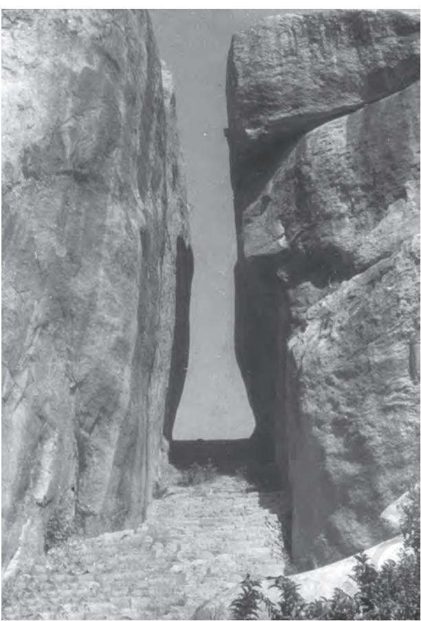

**Figure 6.1 : The Valley of Kaveri river near Hogenekal, Dharmapuri district, Tamil Nadu in the form of gorge**

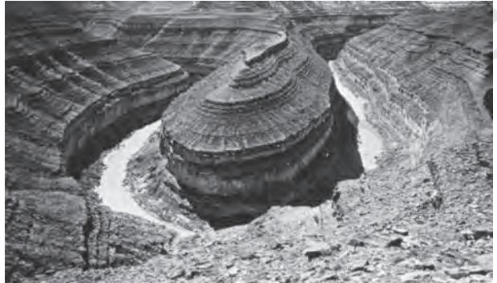

**Figure 6.2 : An entrenched meander loop of river Colorado in USA showing step-like side slopes of its valley typical of a canyon**

shallow depression forms, pebbles and boulders get collected in those depressions and get rotated by flowing water and consequently the depressions grow in dimensions. A series of such depressions eventually join and the stream valley gets deepened. At the foot of waterfalls also, large potholes, quite deep and wide, form because of the sheer impact of water and rotation of boulders. Such large and deep holes at the base of waterfalls are called *plunge pools*.

# **Incised or Entrenched Meanders**

In streams that flow rapidly over steep gradients, normally erosion is concentrated on the bottom of the stream channel. Also, in the case of steep gradient streams, lateral erosion on the sides of the valleys is not much when compared to the streams flowing on low and gentle slopes. Because of active lateral erosion, streams flowing over gentle slopes, develop sinuous or meandering courses. It is common to find meandering courses over floodplains and delta plains where stream gradients are very gentle. But very deep and wide meanders can also be found cut in hard rocks. Such meanders are called *incised or entrenched meanders* (Figure 6.2).

# **River Terraces**

River terraces are surfaces marking old valley floor or floodplain levels. They may be bedrock surfaces without any alluvial cover or alluvial terraces consisting of stream deposits. River terraces are basically products of erosion as they result due to vertical erosion by the stream into its own depositional floodplain. There can be a number of such terraces at different heights indicating former river bed levels. The river terraces may occur at the same elevation on either side of the rivers in which case they are called *paired terraces..*

# **DEPOSITIONAL LANDFORMS**

## **Alluvial Fans**

Alluvial fans (Figure 6.3) are formed when streams flowing from higher levels break into foot slope plains of low gradient. Normally very coarse load is carried by streams flowing over mountain slopes. This load becomes too heavy for the streams to be carried over gentler gradients and gets dumped and spread as a broad low to high cone shaped

deposit called *alluvial fan*. Usually, the streams which flow over fans are not confined to their original channels for long and shift their position across the fan forming many channels called *distributaries*. Alluvial fans in humid areas show normally low cones with gentle slope from head to toe and they appear as high cones with steep slope in arid and semi-arid climates.

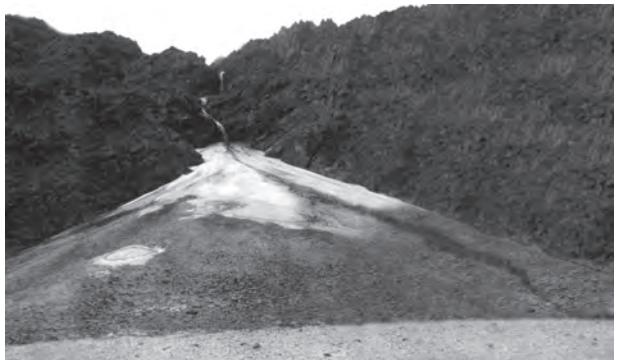

**Figure 6.3 : An alluvial fan deposited by a hill stream on the way to Amarnath, Jammu and Kashmir**

# **Deltas**

Deltas are like alluvial fans but develop at a different location. The load carried by the rivers is dumped and spread into the sea. If this load is not carried away far into the sea or distributed along the coast, it spreads and

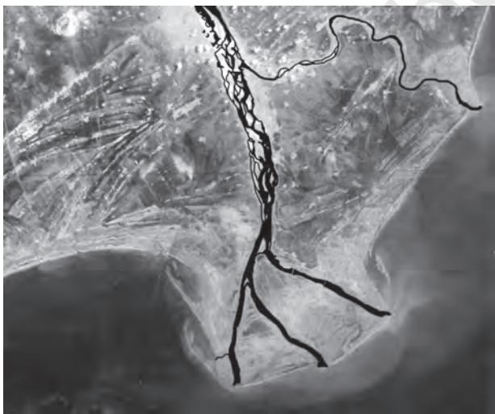

**Figure 6.4 : A satellite view of part of Krishna river**

accumulates as a low cone. Unlike in alluvial fans, the deposits making up deltas are very well sorted with clear stratification. The coarsest materials settle out first and the finer fractions like silts and clays are carried out into the sea. As the delta grows, the river distributaries continue to increase in length (Figure 6.4) and delta continues to build up into the sea.

# **Floodplains, Natural Levees and Point Bars**

Deposition develops a floodplain just as erosion makes valleys. Floodplain is a major landform of river deposition. Large sized materials are deposited first when stream channel breaks into a gentle slope. Thus, normally, fine sized materials like sand, silt and clay are carried by relatively slow moving waters in gentler channels usually found in the plains and deposited over the bed and when the waters spill over the banks during flooding above the bed. A river bed made of river deposits is the active floodplain. The floodplain above the bank is inactive floodplain. Inactive floodplain above the banks basically contain two types of deposits — flood deposits and channel deposits. In plains, channels shift laterally and change their courses occasionally leaving cut-off courses which get filled up gradually. Such areas over flood plains built up by abandoned or cut-off channels contain coarse deposits. The flood deposits of spilled waters carry relatively finer materials like silt and clay. The flood plains in a delta are called *delta plains*.

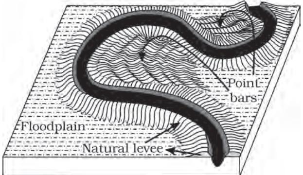

**delta, Andhra Pradesh Figure 6.5 : Natural levee and point bars**

*Natural levees and point bars* (Figure 6.5) are some of the important landforms found associated with floodplains. *Natural levees* are found along the banks of large rivers. They are low, linear and parallel ridges of coarse deposits along the banks of rivers, quite often cut into individual mounds. *Point bars* are also known as *meander bars*. They are found on the concave side of meanders of large rivers and are sediments deposited in a linear fashion by flowing waters along the bank. They are almost uniform in profile and in width and contain mixed sizes of sediments.

> In what way do natural levees differ from point bars?

## **Meanders**

In large flood and delta plains, rivers rarely flow in straight courses. Loop-like channel patterns called *meanders* develop over flood and delta plains (Figure 6.6).

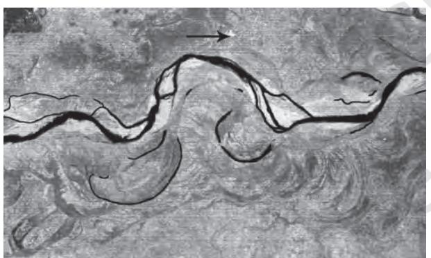

**Figure 6.6 : A satellite scene showing meandering Burhi Gandak river near Muzaffarpur, Bihar, showing a number of oxbow lakes and cut-offs**

Meander is not a landform but is only a type of channel pattern. This is because of (i) propensity of water flowing over very gentle gradients to work laterally on the banks; (ii) unconsolidated nature of alluvial deposits making up the banks with many irregularities which can be used by water exerting pressure laterally; (iii) coriolis force acting on the fluid water deflecting it like it deflects the wind. When the gradient of the channel becomes extremely low, water flows leisurely and starts working laterally. Slight irregularities along

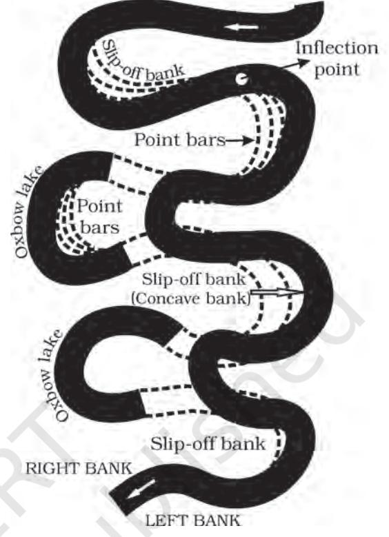

**Figure 6.7 : Meander growth and cut-off loops and slip-off and undercut banks**

the banks slowly get transformed into a small curvature in the banks; the curvature deepens due to deposition on the inside of the curve and erosion along the bank on the outside. If there is no deposition and no erosion or undercutting, the tendency to meander is reduced. Normally, in meanders of large rivers, there is active deposition along the concave bank and undercutting along the convex bank. The concave bank is known as cut-off bank which shows up as a steep scarp and the convex bank presents a long, gentle profile (Figure 6.7). As meanders grow into deep loops, the same may get cut-off due to erosion at the inflection points and are left as *ox-bow lakes*.

#### **GROUNDWATER**

Here the interest is not on groundwater as a resource. Our focus is on the work of groundwater in the erosion of landmasses and evolution of landforms. The surface water

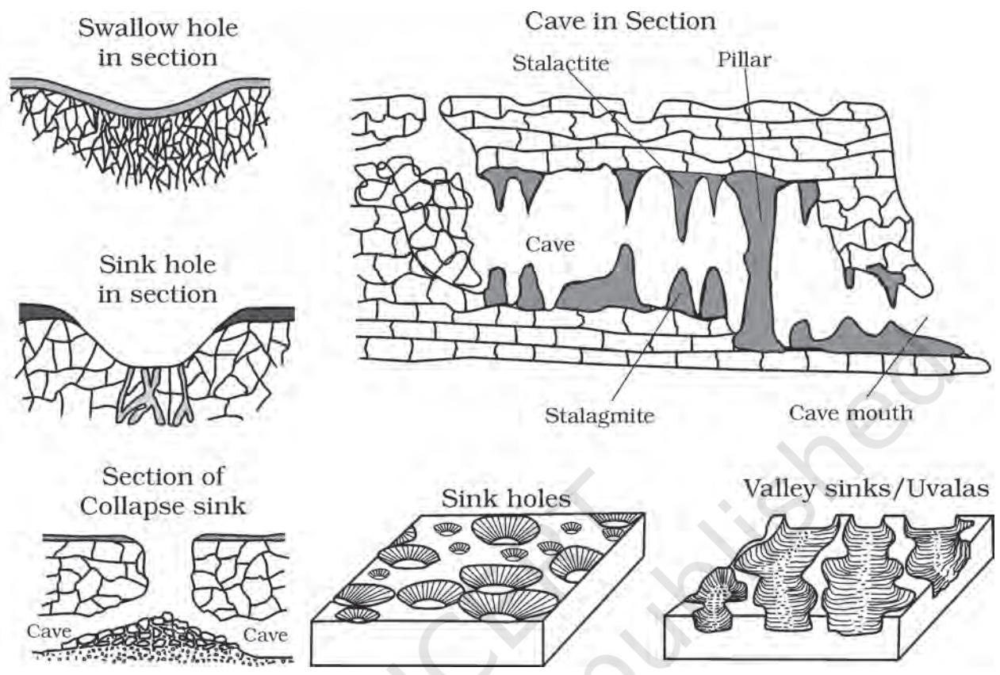

**Figure 6.8 : Various karst features**

percolates well when the rocks are permeable, thinly bedded and highly jointed and cracked. After vertically going down to some depth, the water under the ground flows horizontally through the bedding planes, joints or through the materials themselves. It is this downward and horizontal movement of water which causes the rocks to erode. Physical or mechanical removal of materials by moving groundwater is insignificant in developing landforms. That is why, the results of the work of groundwater cannot be seen in all types of rocks. But in rocks like limestones or dolomites rich in calcium carbonate, the surface water as well as groundwater through the chemical process of solution and precipitation deposition develop varieties of landforms. These two processes of solution and precipitation are active in limestones or dolomites occurring either exclusively or interbedded with other rocks. Any limestone or dolomitic region showing typical landforms produced by the action of groundwater through the processes of solution and deposition is called *Karst topography* after the typical topography developed in limestone rocks of Karst region in the Balkans adjacent to Adriatic sea.

The karst topography is also characterised by erosional and depositional landforms.

#### **EROSIONAL LANDFORMS**

### **Pools, Sinkholes, Lapies and Limestone Pavements**

Small to medium sized round to sub-rounded shallow depressions called *swallow holes* form on the surface of limestones through solution. Sinkholes are very common in limestone/ karst areas. *A sinkhole* is an opening more or less circular at the top and funnel-shapped towards the bottom with sizes varying in area from a few sq. m to a hectare and with depth from a less than half a metre to thirty metres or more. Some of these form solely through solution action (solution sinks) and others might start as solution forms first and if the bottom of a sinkhole forms the roof of a void or cave underground, it might collapse leaving a large hole opening into a cave or a void below (collapse sinks). Quite often, sinkholes are covered up with soil mantle and appear as shallow water pools. Anybody stepping over such pools would go down like it happens in quicksands in deserts. The term *doline* is sometimes used to refer the collapse sinks. Solution sinks are more common than collapse sinks. Quite often the surface runoff simply goes down swallow and sink holes and flow as underground streams and reemerge at a distance downstream through a cave opening. When sink holes and dolines join together because of slumping of materials along their margins or due to roof collapse of caves, long, narrow to wide trenches called *valley sinks* or *Uvalas* form. Gradually, most of the surface of the limestone is eaten away by these pits and trenches, leaving it extremely irregular with a maze of points, grooves and *ridges* or *lapies*. Especially, these ridges or lapies form due to differential solution activity along parallel to sub-parallel joints. The lapie field may eventually turn into somewhat smooth *limestone pavements*.

#### **Caves**

In areas where there are alternating beds of rocks (shales, sandstones, quartzites) with limestones or dolomites in between or in areas where limestones are dense, massive and occurring as thick beds, cave formation is prominent. Water percolates down either through the materials or through cracks and joints and moves horizontally along bedding planes. It is along these bedding planes that the limestone dissolves and long and narrow to wide gaps called *caves* result. There can be a maze of caves at different elevations depending upon the limestone beds and intervening rocks. Caves normally have an opening through which cave streams are discharged. Caves having openings at both the ends are called tunnels.

#### **Depositional Landforms**

Many depositional forms develop within the limestone caves. The chief chemical in limestone is calcium carbonate which is easily soluble in carbonated water (carbon dioxide absorbed rainwater). This calcium carbonate is deposited when the water carrying it in solution evaporates or loses its carbon dioxide as it trickles over rough rock surfaces.

#### **Stalactites, Stalagmites and Pillars**

*Stalactites* hang as icicles of different diameters. Normally they are broad at their bases and taper towards the free ends showing up in a variety of forms. *Stalagmites* rise up from the floor of the caves. In fact, stalagmites form due to dripping water from the surface or through the thin pipe, of the stalactite, immediately below it (Figure 6.9).

Stalagmites may take the shape of a column, a disc, with either a smooth, rounded bulging end or a miniature crater like

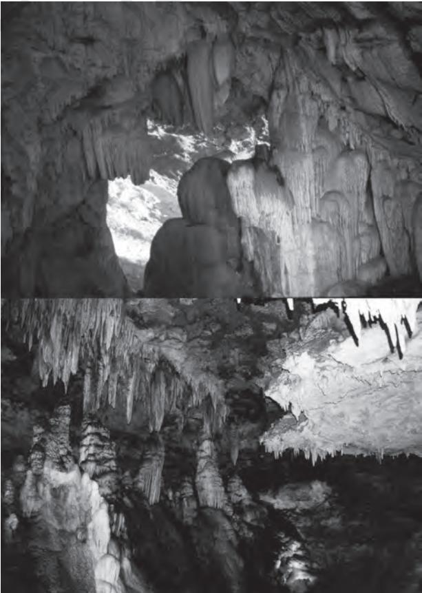

**Figure 6.9 : Stalactites and stalagmites in limestone caves**

depression. The stalagmite and stalactites eventually fuse to give rise to *columns and pillars* of different diameters.

# **GLACIERS**

Masses of ice moving as sheets over the land (continental glacier or piedmont glacier if a vast sheet of ice is spread over the plains at the foot of mountains) or as linear flows down the slopes of mountains in broad trough-like valleys (mountain and valley glaciers) are called *glaciers* (Figure 6.10). The movement of glaciers is slow unlike water flow. The movement could be a few centimetres to a few metres a day or even less or more. Glaciers move basically because of the force of gravity.

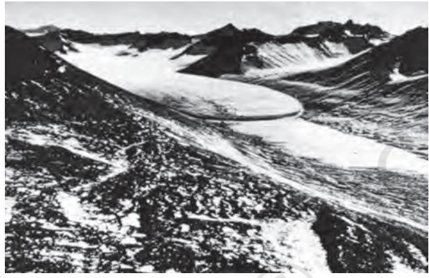

**Figure 6.10 : A glacier in its valley**

We have many glaciers in our country moving down the slopes and valleys in Himalayas. Higher reaches of Uttaranchal, Himachal Pradesh and Jammu and Kashmir, are places to see some of them. Do you know where one can see river Bhagirathi is basically fed by meltwaters from under the snout (Gaumukh) of the Gangotri glacier. In fact, Alkapuri glacier feeds waters to Alakananda river. Rivers Alkananda and Bhagirathi join to make river Ganga near Deoprayag.

Erosion by glaciers is tremendous because of friction caused by sheer weight of the ice. The material plucked from the land by glaciers (usually large-sized angular blocks and fragments) get dragged along the floors or sides of the valleys and cause great damage through abrasion and plucking. Glaciers can cause significant damage to even un-weathered rocks and can reduce high mountains into low hills and plains.

As glaciers continue to move, debris gets removed, divides get lowered and eventually the slope is reduced to such an extent that glaciers will stop moving leaving only a mass of low hills and vast outwash plains along with other depositional features. Figures 6.11 and 6.12 show various glacial erosional and depositional forms described in the text.

# **EROSIONAL LANDFORMS**

# **Cirque**

Cirques are the most common of landforms in glaciated mountains. The cirques quite often are found at the heads of glacial valleys. The accumulated ice cuts these cirques while moving down the mountain tops. They are deep, long and wide troughs or basins with very steep concave to vertically dropping high walls at its head as well as sides. A lake of water can be seen quite often within the cirques after the glacier disappears. Such lakes are called *cirque or tarn lakes*. There can be two or more cirques one leading into another down below in a stepped sequence.

# **Horns and Serrated Ridges**

Horns form through head ward erosion of the cirque walls. If three or more radiating glaciers cut headward until their cirques meet, high, sharp pointed and steep sided peaks called *horns* form. The divides between cirque side walls or head walls get narrow because of progressive erosion and turn into serrated or saw-toothed ridges sometimes referred to as *arêtes* with very sharp crest and a zig-zag outline.

> The highest peak in the Alps, Matterhorn and the highest peak in the Himalayas, Everest are in fact horns formed through headward erosion of radiating cirques.

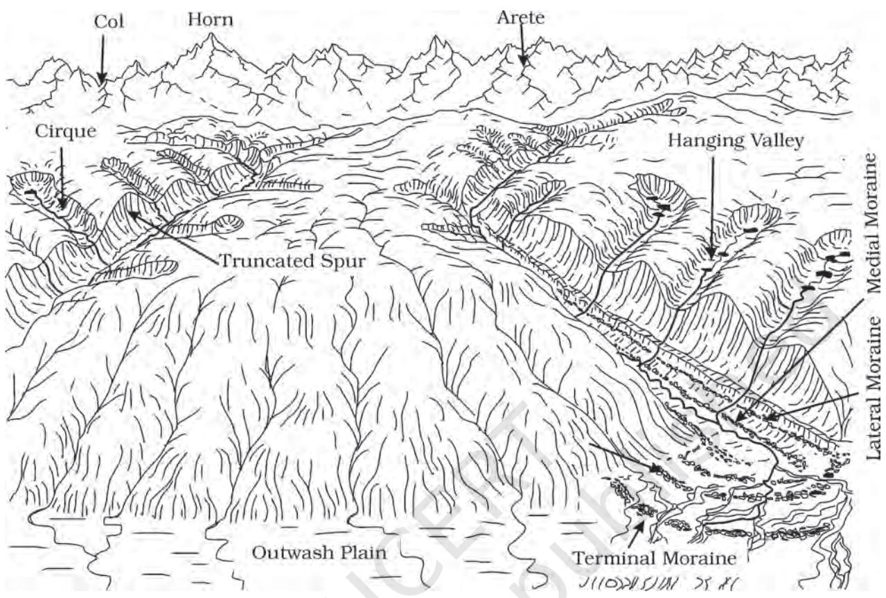

**Figure 6.11 : Some glacial erosional and depositional forms (adapted and modified from Spencer, 1962)**

# **Glacial Valleys/Troughs**

Glaciated valleys are trough-like and *Ushaped* with broad floors and relatively smooth, and steep sides. The valleys may contain littered debris or debris shaped as *moraines* with swampy appearance. There may be lakes gouged out of rocky floor or formed by debris within the valleys. There can be hanging valleys at an elevation on one or both sides of the main glacial valley. The faces of divides or spurs of such hanging valleys opening into main glacial valleys are quite often truncated to give them an appearance like triangular facets. Very deep glacial troughs filled with sea water and making up shorelines (in high latitudes) are called *fjords*/*fiords*.

> What are the basic differences between glacial valleys and river valleys?

## **Depositional Landforms**

The unassorted coarse and fine debris dropped by the melting glaciers is called *glacial till*. Most of the rock fragments in till are angular to sub-angular in form. Streams form by melting ice at the bottom, sides or lower ends of glaciers. Some amount of rock debris small enough to be carried by such meltwater streams is washed down and deposited. Such glacio-fluvial deposits are called *outwash deposits*. Unlike till deposits, the outwash deposits are roughly stratified and assorted. The rock fragments in outwash deposits are somewhat rounded at their edges. Figure 6.12 shows a few depositional landforms commonly found in glaciated areas.

#### **Moraines**

They are long ridges of deposits of glacial till. Terminal moraines are long ridges of debris

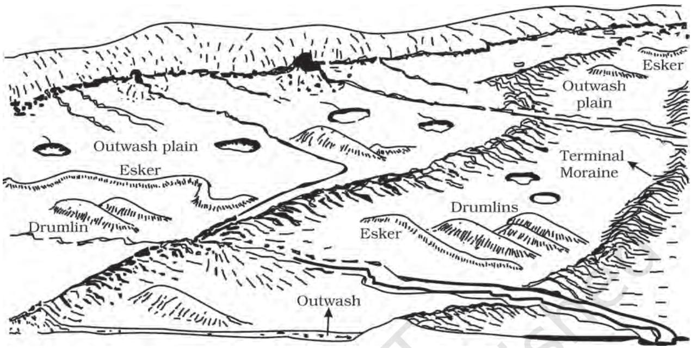

**Figure 6.12 : A panoramic diagram of glacial landscape with various depositional landforms (adapted and modified from Spencer, 1962)**

deposited at the end (toe) of the glaciers. *Lateral moraines* form along the sides parallel to the glacial valleys. The lateral moraines may join a terminal moraine forming a horse-shoe shaped ridge (Fig. 6.11). There can be many lateral moraines on either side in a glacial valley. These moraines partly or fully owe their origin to glacio-fluvial waters pushing up materials to the sides of glaciers. Many valley glaciers retreating rapidly leave an irregular sheet of till over their valley floors. Such deposits varying greatly in thickness and in surface topography are called *ground moraines*. The moraine in the centre of the glacial valley flanked by lateral moraines is called *medial moraine*. They are imperfectly formed as compared to lateral moraines. Sometimes medial moraines are indistinguishable from ground moraines.

## **Eskers**

When glaciers melt in summer, the water flows on the surface of the ice or seeps down along the margins or even moves through holes in the ice. These waters accumulate beneath the glacier and flow like streams in a channel beneath the ice. Such streams flow over the ground (not in a valley cut in the ground) with ice forming its banks. Very coarse materials like boulders and blocks along with some minor fractions of rock debris carried into this stream settle in the valley of ice beneath the glacier and after the ice melts can be found as a sinuous ridge called *esker*.

#### **Outwash Plains**

The plains at the foot of the glacial mountains or beyond the limits of continental ice sheets are covered with glacio-fluvial deposits in the form of broad flat alluvial fans which may join to form outwash plains of gravel, silt, sand and clay.

> Distinguish between river alluvial plains and glacial outwash plains.

#### **Drumlins**

Drumlins are smooth oval shaped ridge-like features composed mainly of glacial till with some masses of gravel and sand. The long axes of drumlins are parallel to the direction of ice movement. They may measure up to 1 km in length and 30 m or so in height. One end of the drumlins facing the glacier called the *stoss* end is blunter and steeper than the other end called *tail*. The drumlins form due to dumping of rock debris beneath heavily loaded ice through fissures in the glacier. The stoss end gets blunted due to pushing by moving ice. Drumlins give an indication of direction of glacier movement.

> What is the difference between till and alluvium?

# **WAVES AND CURRENTS**

Coastal processes are the most dynamic and hence most destructive. So, don't you think it is important to know about the coastal processes and forms?

Some of the changes along the coasts take place very fast. At one place, there can be erosion in one season and deposition in another. Most of the changes along the coasts are accomplished by waves. When waves break, the water is thrown with great force onto the shore, and simultaneously, there is a great churning of sediments on the sea bottom. Constant impact of breaking waves drastically affects the coasts. Storm waves and tsunami waves can cause far-reaching changes in a short period of time than normal breaking waves. As wave environment changes, the intensity of the force of breaking waves changes.

> Do you know about the generating forces behind waves and currents? If not, refer to the chapter on movements in ocean waters.

Other than the action of waves, the coastal landforms depend upon (i) the configuration of land and sea floor; (ii) whether the coast is advancing (emerging) seaward or retreating (submerging) landward. Assuming sea level to be constant, two types of coasts are considered to explain the concept of evolution of coastal landforms: (i) high, rocky coasts (submerged coasts); (ii) low, smooth and gently sloping sedimentary coasts (emerged coasts).

## **HIGH ROCKY COASTS**

Along the high rocky coasts, the rivers appear to have been drowned with highly irregular coastline. The coastline appears highly indented with extension of water into the land where glacial valleys *(fjords)* are present. The hill sides drop off sharply into the water. Shores do not show any depositional landforms initially. Erosion features dominate.

Along high rocky coasts, waves break with great force against the land shaping the hill sides into cliffs. With constant pounding by waves, the cliffs recede leaving a *wave-cut platform* in front of the sea cliff. Waves gradually minimise the irregularities along the shore.

The materials which fall off, and removed from the sea cliffs, gradually break into smaller fragments and roll to roundness, will get deposited in the offshore. After a considerable period of cliff development and retreat when coastline turns somewhat smooth, with the addition of some more material to this deposit in the offshore, a wave-built terrace would develop in front of wave-cut terrace. As the erosion along the coast takes place a good supply material becomes available to longshore currents and waves to deposit them as beaches along the shore and as bars (long ridges of sand and/ or shingle parallel to the coast) in the nearshore zone. Bars are submerged features and when bars show up above water, they are called *barrier bars*. Barrier bar which get keyed up to the headland of a bay is called a *spit*. When barrier bars and spits form at the mouth of a bay and block it, a *lagoon* forms. The lagoons would gradually get filled up by sediments from the land giving rise to a coastal plain.

#### **LOW SEDIMENTARY COASTS**

Along low sedimentary coasts the rivers appear to extend their length by building coastal plains and deltas. The coastline appears smooth with occasional incursions of water in the form of *lagoons and tidal creeks*. The land slopes gently into the water. Marshes and swamps may abound along the coasts. Depositional features dominate.

When waves break over a gently sloping sedimentary coast, the bottom sediments get churned and move readily building *bars, barrier bars, spits and lagoons*. Lagoons would eventually turn into a swamp which would subsequently turn into a coastal plain. The maintenance of these depositional features depends upon the steady supply of materials. Storm and tsunami waves cause drastic changes irrespective of supply of sediments. Large rivers which bring lots of sediments build deltas along low sedimentary coasts.

> The west coast of our country is a high rocky retreating coast. Erosional forms dominate in the west coast. The east coast of India is a low sedimentary coast. Depositional forms dominate in the east coast.

> What are the various differences between a high rocky coast and a low sedimentary coast in terms of processes and landforms?

## **EROSIONAL LANDFORMS**

## **Cliffs, Terraces, Caves and Stacks**

Wave-cut cliffs and terraces are two forms usually found where erosion is the dominant shore process. Almost all sea cliffs are steep and may range from a few m to 30 m or even more. At the foot of such cliffs there may be a flat or gently sloping platform covered by rock debris derived from the sea cliff behind. Such platforms occurring at elevations above the average height of waves is called a *wavecut terrace*. The lashing of waves against the base of the cliff and the rock debris that gets smashed against the cliff along with lashing waves create hollows and these hollows get widened and deepened to form *sea caves*. The roofs of caves collapse and the sea cliffs recede further inland. Retreat of the cliff may leave some remnants of rock standing isolated as small islands just off the shore. Such resistant masses of rock, originally parts of a cliff or hill are called *sea stacks*. Like all other features, sea stacks are also temporary and eventually coastal hills and cliffs will disappear because of wave erosion giving rise to narrow coastal plains, and with onrush of deposits from over the land behind may get covered up by alluvium or may get covered up by shingle or sand to form a wide beach.

## **DEPOSITIONAL LANDFORMS**

## **Beaches and Dunes**

Beaches are characteristic of shorelines that are dominated by deposition, but may occur as patches along even the rugged shores. Most of the sediment making up the beaches comes from land carried by the streams and rivers or from wave erosion. Beaches are temporary features. The sandy beach which appears so permanent may be reduced to a very narrow strip of coarse pebbles in some other season. Most of the beaches are made up of sand sized materials. Beaches called shingle beaches contain excessively small pebbles and even cobbles.

Just behind the beach, the sands lifted and winnowed from over the beach surfaces will be deposited as sand dunes. Sand dunes forming long ridges parallel to the coastline are very common along low sedimentary coasts.

#### **Bars, Barriers and Spits**

A ridge of sand and shingle formed in the sea in the off-shore zone lying approximately parallel to the coast is called an *off-shore bar*. An off-shore bar which is exposed due to further addition of sand is termed a *barrier bar*. The off-shore bars and barriers commonly form across the mouth of a river or at the entrance of a bay. Sometimes such barrier bars get keyed up to one end of the bay when they are called *spits* (Figure 6.13). Spits may also develop attached to headlands/hills. The barriers, bars and spits at the mouth of the bay gradually extend leaving only a small opening of the bay into the sea and the bay

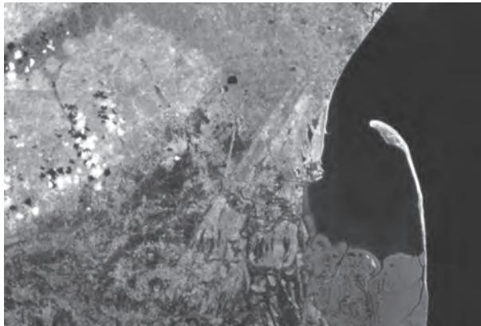

**Figure 6.13 : A satellite picture of a part of Godavari river delta showing a spit**

will eventually develop into a lagoon. The lagoons get filled up gradually by sediment coming from the land or from the beach itself (aided by wind) and a broad and wide coastal plain may develop replacing a lagoon.

> Do you know, the coastal off-shore bars offer the first buffer or defence against storm or tsunami by absorbing most of their destructive force. Then come the barriers, beaches, beach dunes and mangroves, if any, to absorb the destructive force of storm and tsunami waves. So, if we do anything which disturbs the 'sediment budget' and the mangroves along the coast, these coastal forms will get eroded away leaving human habitations to bear first strike of storm and tsunami waves.

## **WINDS**

Wind is one of the two dominant agents in hot deserts. The desert floors get heated up too much and too quickly because of being dry and barren. The heated floors heat up the air directly above them and result in upward movements in the hot lighter air with turbulence, and any obstructions in its path sets up eddies, whirlwinds, updrafts and downdrafts. Winds also move along the desert floors with great speed and the obstructions in their path create turbulence. Of course, there are storm winds which are very destructive. Winds cause deflation, abrasion and impact. Deflation includes lifting and removal of dust and smaller particles from the surface of rocks. In the transportation process sand and silt act as effective tools to abrade the land surface. The impact is simply sheer force of momentum which occurs when sand is blown into or against a rock surface. It is similar to sand-blasting operation. The wind action creates a number of interesting erosional and depositional features in the deserts.

In fact, many features of deserts owe their formation to mass wasting and running water as sheet floods. Though rain is scarce in deserts, it comes down torrentially in a short period of time. The desert rocks devoid of vegetation, exposed to mechanical and chemical weathering processes due to drastic diurnal temperature changes, decay faster and the torrential rains help in removing the weathered materials easily. That means, the weathered debris in deserts is moved by not only wind but also by rain/sheet wash. The wind moves fine materials and general mass erosion is accomplished mainly through sheet floods or sheet wash. Stream channels in desert areas are broad, smooth and indefinite and flow for a brief time after rains.

#### **EROSIONAL LANDFORMS**

#### **Pediments and Pediplains**

Landscape evolution in deserts is primarily concerned with the formation and extension of pediments. Gently inclined rocky floors close to the mountains at their foot with or without a thin cover of debris, are called *pediments*. Such rocky floors form through the erosion of mountain front through a combination of lateral erosion by streams and sheet flooding.

Erosion starts along the steep margins of the landmass or the steep sides of the tectonically controlled steep incision features over the landmass. Once, pediments are formed with a steep wash slope followed by cliff or free face above it, the steep wash slope and free face retreat backwards. This method of erosion is termed as parallel retreat of slopes through backwasting. So, through parallel retreat of slopes, the pediments extend backwards at the expense of mountain front, and gradually, the mountain gets reduced leaving an *inselberg* which is a remnant of the mountain. That's how the high relief in desert areas is reduced to low featureless plains called *pediplains*.

# **Playas**

Plains are by far the most prominent landforms in the deserts. In basins with mountains and hills around and along, the drainage is towards the centre of the basin and due to gradual deposition of sediment from basin margins, a nearly level plain forms at the centre of the basin. In times of sufficient water, this plain is covered up by a shallow water body. Such types of shallow lakes are called as *playas* where water is retained only for short duration due to evaporation and quite often the playas contain good deposition of salts. The playa plain covered up by salts is called *alkali flats*.

# **Deflation Hollows and Caves**

Weathered mantle from over the rocks or bare soil, gets blown out by persistent movement of wind currents in one direction. This process may create shallow depressions called *deflation hollows*. Deflation also creates numerous small pits or cavities over rock surfaces. The rock faces suffer impact and abrasion of wind-borne sand and first shallow depressions called blow outs are created, and some of the *blow outs* become deeper and wider fit to be called *caves*.

# **Mushroom, Table and Pedestal Rocks**

Many rock-outcrops in the deserts easily susceptible to wind deflation and abrasion are worn out quickly leaving some remnants of resistant rocks polished beautifully in the shape of mushroom with a slender stalk and a broad and rounded pear shaped cap above. Sometimes, the top surface is broad like a table top and quite often, the remnants stand out like pedestals.

List the erosional features carved out by wind action and action of sheet floods.

# **Depositional Landforms**

Wind is a good sorting agent. Depending upon the velocity of wind, different sizes of grains are moved along the floors by rolling or saltation and carried in suspension and in this process of transportation itself, the materials get sorted. When the wind slows or begins to die down, depending upon sizes of grains and their critical velocities, the grains will begin to settle. So, in depositional landforms made by wind, good sorting of grains can be found. Since wind is there everywhere and wherever there is good source of sand and with constant wind directions, depositional features in arid regions can develop anywhere.

# **Sand Dunes**

Dry hot deserts are good places for sand dune formation. Obstacles to initiate dune formation are equally important. There can be a great variety of dune forms (Figure 6.14).

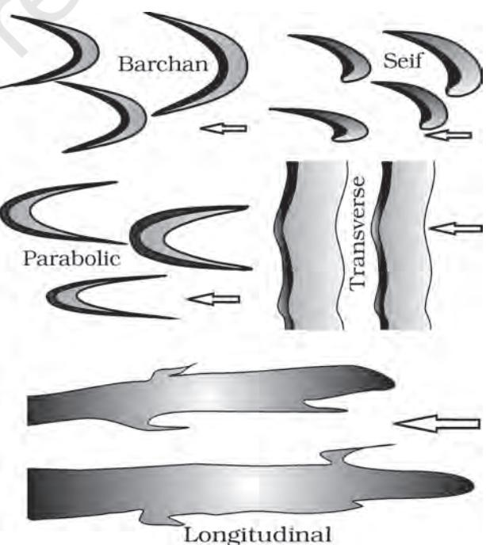

**Figure 6.14 : Various types of sand dunes Arrows indicate wind direction**

Crescent shaped dunes called *barchans* with the points or wings directed away from wind direction i.e., downwind, form where the wind direction is constant and moderate and where the original surface over which sand is moving is almost uniform. *Parabolic dunes* form when sandy surfaces are partially covered with vegetation. That means parabolic dunes are reversed barchans with wind direction being the same. *Seif* is similar to barchan with a small difference. Seif has only one wing or point. This happens when there is shift in wind conditions. The lone wings of seifs can grow very long and high. Longitudinal dunes form when supply of sand is poor and wind direction is constant. They appear as long ridges of considerable length but low in height. *Transverse dunes* are aligned perpendicular to wind direction. These dunes form when the wind direction is constant and the source of sand is an elongated feature at right angles to the wind direction. They may be very long and low in height. When sand is plenty, quite often, the regular shaped dunes coalesce and lose their individual characteristics. Most of the dunes in the deserts shift and a few of them will get stabilised especially near human habitations.

#### **EXERCISES**

- 1. Multiple choice questions.
	- (i) In which of the following stages of landform development, downward cutting is dominated?
		- (a) Youth stage (c) Early mature stage
		- (b) Late mature stage (d) Old stage
	- (ii) A deep valley characterised by steep step-like side slopes is known as
		- (a) U-shaped valley (c) Blind valley
		- (b) Gorge (d) Canyon
	- (iii) In which one of the following regions the chemical weathering process is more dominant than the mechanical process?
		- (a) Humid region (c) Arid region
		- (b) Limestone region (d) Glacier region
	- (iv) Which one of the following sentences best defines the term 'Lapies' ?
		- (a) A small to medium sized shallow depression
		- (b) A landform whose opening is more or less circular at the top and funnel shaped towards bottom
		- (c) A landform formed due to dripping water from surface
		- (d) An irregular surface with sharp pinnacles, grooves and ridges
	- (v) A deep, long and wide trough or basin with very steep concave high walls at its head as well as in sides is known as:
		- (a) Cirque (c) Lateral Moraine
		- (b) Glacial valley (d) Esker
- 2. Answer the following questions in about 30 words.
	- (i) What do incised meanders in rocks and meanders in plains of alluvium indicate?
- (ii) Explain the evolution of valley sinks or uvalas.
- (iii) Underground flow of water is more common than surface run-off in limestone areas. Why?
- (iv) Glacial valleys show up many linear depositional forms. Give their locations and names.
- (v) How does wind perform its task in desert areas? Is it the only agent responsible for the erosional features in the deserts?
- 3. Answer the following questions in about 150 words.
	- (i) Running water is by far the most dominating geomorphic agent in shaping the earth's surface in humid as well as in arid climates. Explain.
	- (ii) Limestones behave differently in humid and arid climates. Why? What is the dominant and almost exclusive geomorphic process in limestone areas and what are its results?
	- (iii) How do glaciers accomplish the work of reducing high mountains into low hills and plains?

#### **Project Work**

Identify the landforms, materials and processes around your area.

