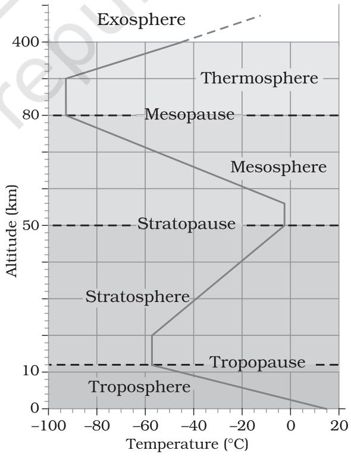

*This unit deals with*

- *• Atmosphere compositions and structure; elements of weather and climate*
- *• Insolation angle of incidence and distribution; heat budget of the earth — heating and cooling of atmosphere (conduction, convection, terrestrial radiation, advection); temperature — factors controlling temperature; distribution of temperature — horizontal and vertical; inversion of temperature*
- *• Pressure pressure belts; winds-planetary seasonal and local, air masses and fronts; tropical and extra tropical cyclones*
- *• Precipitation evaporation; condensation dew, frost, fog, mist and cloud; rainfall — types and world distributon*
- *• World climates classification (Koeppen), greenhouse effect, global warming and climatic changes*

### CHAPTER

# **COMPOSITION AND STRUCTURE OF ATMOSPHERE**

C an a person live without air? We eat food two - three times a day and drink water more frequently but breathe every few seconds. Air is essential to the survival of all organisms. Some organisms like humans may survive for some time without food and water but can't survive even a few minutes without breathing air. That shows the reason why we should understand the atmosphere in greater detail. Atmosphere is a mixture of different gases and it envelopes the earth all round. It contains life-giving gases like oxygen for humans and animals and carbon dioxide for plants. The air is an integral part of the earth's mass and 99 per cent of the total mass of the atmosphere is confined to the height of 32 km from the earth's surface. The air is colourless and odourless and can be felt only when it blows as wind.

> Can you imagine what will happen to us in the absence of ozone in the atmosphere?

## **COMPOSITION OF THE ATMOSPHERE**

The atmosphere is composed of gases, water vapour and dust particles. The proportion of gases changes in the higher layers of the atmosphere in such a way that oxygen will be almost in negligible quantity at the height of 120 km. Similarly, carbon dioxide and water vapour are found only up to 90 km from the surface of the earth.

### **Gases**

Carbon dioxide is meteorologically a very important gas as it is transparent to the incoming solar radiation but opaque to the outgoing terrestrial radiation. It absorbs a part of terrestrial radiation and reflects back some part of it towards the earth's surface. It is largely responsible for the *green house effect*. The volume of other gases is constant but the volume of carbon dioxide has been rising in the past few decades mainly because of the burning of fossil fuels. This has also increased the temperature of the air. Ozone is another important component of the atmosphere found between 10 and 50 km above the earth's surface and acts as a filter and absorbs the *ultra-violet rays* radiating from the sun and prevents them from reaching the surface of the earth.

### **Water Vapour**

Water vapour is also a variable gas in the atmosphere, which decreases with altitude. In the warm and wet tropics, it may account for four per cent of the air by volume, while in the dry and cold areas of desert and polar regions, it may be less than one per cent of the air. Water vapour also decreases from the equator towards the poles. It also absorbs parts of the insolation from the sun and preserves the earth's radiated heat. It thus, acts like a blanket allowing the earth neither to become too cold nor too hot. Water vapour also contributes to the stability and instability in the air.

#### **Dust Particles**

Atmosphere has a sufficient capacity to keep small solid particles, which may originate from different sources and include sea salts, fine soil, smoke-soot, ash, pollen, dust and disintegrated particles of meteors. Dust particles are generally concentrated in the lower layers of the atmosphere; yet, convectional air currents may transport them to great heights. The higher concentration of dust particles is found in subtropical and temperate regions due to dry winds in comparison to equatorial and polar regions. Dust and salt particles act as hygroscopic nuclei around which water vapour condenses to produce clouds.

### **STRUCTURE OF THE ATMOSPHERE**

The atmosphere consists of different layers with varying density and temperature. Density is highest near the surface of the earth and decreases with increasing altitude. The column of atmosphere is divided into five different layers depending upon the temperature condition. They are: troposphere, stratosphere, mesosphere, thermosphere and exosphere.

*The troposphere* is the lowermost layer of the atmosphere. Its average height is 13 km and extends roughly to a height of 8 km near the poles and about 18 km at the equator. Thickness of the troposphere is greatest at the equator because heat is transported to great heights by strong convectional currents. This layer contains dust particles and water vapour. All changes in climate and weather take place in this layer. The temperature in this layer decreases at the rate of 1 C for every 165m of height. This is the most important layer for all biological activity.

The zone separating the tropsophere from stratosphere is known as the *tropopause*. The air temperature at the tropopause is about minus 800C over the equator and about minus 45oC over the poles. The temperature here is nearly constant, and hence, it is called the tropopause. *The stratosphere* is found above the tropopause and extends up to a height of 50 km. One important feature of the stratosphere is that it contains the *ozone layer*. This layer absorbs ultra-violet radiation and shields life on the earth from intense, harmful form of energy.

*The mesosphere* lies above the stratosphere, which extends up to a height of 80 km. In this layer, once again, temperature starts decreasing with the increase in altitude and reaches up to minus 100 C at the height of 80 km. The upper limit of mesosphere is known as the *mesopause*. *The ionosphere* is located between 80 and 400 km above the mesopause. It contains electrically charged particles known as ions, and hence, it is known as ionosphere. Radio waves transmitted from the earth are reflected back to the earth by this layer. Temperature here starts increasing with height. The uppermost layer of the atmosphere above the thermosphere

**Figure 7.1 : Structure of atmosphere**

is known as the *exosphere*. This is the highest layer but very little is known about it. Whatever contents are there, these are extremely rarefied in this layer, and it gradually merges with the outer space. Although all layers of the atmosphere must be exercising influence on us, geographers are concerned with the first two layers of the atmosphere.

## **Elements of Weather and Climate**

The main elements of atmosphere which are subject to change and which influence human life on earth are temperature, pressure, winds, humidity, clouds and precipitation. These elements have been dealt in detail in Chapters 8, 9 and 10.

#### **EXERCISES**

- 1. Multiple choice questions.
	- (i) Which one of the following gases constitutes the major portion of the atmosphere?
		- (a) Oxygen (c) Argon
		- (b) Nitrogen (d) Carbon dioxide
	- (ii) Atmospheric layer important for human beings is:
		- (a) Stratosphere (c) Troposphere
		- (b) Mesosphere (d) Ionosphere
	- (iii) Sea salt, pollen, ash, smoke soot, fine soil these are associated with:
		- (a) Gases (c) Water vapour
		- (b) Dust particles (d) Meteors
	- (iv) Oxygen gas is in negligible quantity at the height of atmosphere:
		- (a) 90 km (c) 100 km
		- (b) 120 km (d) 150 km
	- (v) Which one of the following gases is transparent to incoming solar radiation and opaque to outgoing terrestrial radiation?
		- (a) Oxygen (c) Helium
		- (b) Nitrogen (d) Carbon dioxide
- 2. Answer the following questions in about 30 words.
	- (i) What do you understand by atmosphere?
	- (ii) What are the elements of weather and climate?
	- (iii) Describe the composition of atmosphere.
	- (iv) Why is troposphere the most important of all the layers of the atmosphere?
- 3. Answer the following questions in about 150 words.
	- (i) Describe the composition of the atmosphere.
	- (ii) Draw a suitable diagram for the structure of the atmosphere and label it and describe it.

