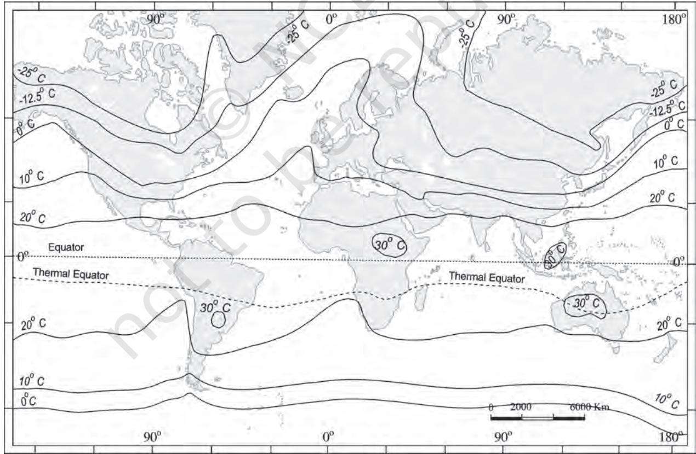

CHAPTER

D o you feel air around you? Do you know that we live at the bottom of a huge pile of air? We inhale and exhale but we feel the air when it is in motion. It means air in motion is wind. You have already learnt about the fact that earth is surrounded by air all around. This envelop of air is atmosphere which is composed of numerous gases. These gases support life over the earth's surface.

The earth receives almost all of its energy from the sun. The earth in turn radiates back to space the energy received from the sun. As a result, the earth neither warms up nor does it get cooled over a period of time. Thus, the amount of heat received by different parts of the earth is not the same. This variation causes pressure differences in the atmosphere. This leads to transfer of heat from one region to the other by winds. This chapter explains the process of heating and cooling of the atmosphere and the resultant temperature distribution over the earth's surface.

# **SOLAR RADIATION**

The earth's surface receives most of its energy in short wavelengths. The energy received by the earth is known as incoming solar radiation which in short is termed as *insolation*.

As the earth is a geoid resembling a sphere, the sun's rays fall obliquely at the top of the atmosphere and the earth intercepts a very small portion of the sun's energy. On an average the earth receives 1.94 calories per sq. cm per minute at the top of its atmosphere. The solar output received at the top of the atmosphere varies slightly in a year due to the variations in the distance between the earth and the sun. During its revolution around the sun, the earth is farthest from the sun (152 million km) on 4th July. This position of the earth is called *aphelion*. On 3rd January, the earth is the nearest to the sun (147 million km). This position is called *perihelion*. Therefore, the annual insolation received by the earth on 3rd January is slightly more than the amount received on 4th July. However, the effect of this variation in the solar output is masked by other factors like the distribution of land and sea and the atmospheric circulation. Hence, this variation in the solar output does not have great effect on daily weather changes on the surface of the earth.

# **Variability of Insolation at the Surface of the Earth**

The amount and the intensity of insolation vary during a day, in a season and in a year. The factors that cause these variations in insolation are : (i) the rotation of earth on its axis; (ii) the angle of inclination of the sun's rays; (iii) the length of the day; (iv) the transparency of the atmosphere; (v) the configuration of land in terms of its aspect. The last two however, have less influence.

The fact that the earth's axis makes an angle of 66½ with the plane of its orbit round the sun has a greater influence on the amount of insolation received at different latitudes.

The second factor that determines the amount of insolation received is the angle of inclination of the rays. This depends on the latitude of a place. The higher the latitude the less is the angle they make with the surface of the earth resulting in slant sun rays. The area covered by vertical rays is always less than the slant rays. If more area is covered, the energy gets distributed and the net energy received per unit area decreases. Moreover, the slant rays are required to pass through greater depth of the atmosphere resulting in more absorption, scattering and diffusion.

**Figure 8.1 : Summer Solstice**

#### *The Passage of Solar Radiation through the Atmosphere*

The atmosphere is largely transparent to short wave solar radiation. The incoming solar radiation passes through the atmosphere before striking the earth's surface. Within the troposphere water vapour, ozone and other gases absorb much of the near infrared radiation.

Very small-suspended particles in the troposphere scatter visible spectrum both to the space and towards the earth surface. This process adds colour to the sky. The red colour of the rising and the setting sun and the blue colour of the sky are the result of scattering of light within the atmosphere.

## *Spatial Distribution of Insolation at the Earth's Surface*

The insolation received at the surface varies from about 320 Watt/m2 in the tropics to about 70 Watt/m2 in the poles. Maximum insolation is received over the subtropical deserts, where the cloudiness is the least. Equator receives comparatively less insolation than the tropics. Generally, at the same latitude the insolation is more over the continent than over the oceans. In winter, the middle and higher latitudes receive less radiation than in summer.

## **HEATING AND COOLING OF ATMOSPHERE**

There are different ways of heating and cooling of the atmosphere.

The earth after being heated by insolation transmits the heat to the atmospheric layers near to the earth in long wave form. The air in contact with the land gets heated slowly and the upper layers in contact with the lower layers also get heated. This process is called *conduction*. Conduction takes place when two bodies of unequal temperature are in contact with one another, there is a flow of energy from the warmer to cooler body. The transfer of heat continues until both the bodies attain the same temperature or the contact is broken. Conduction is important in heating the lower layers of the atmosphere.

The air in contact with the earth rises vertically on heating in the form of currents and further transmits the heat of the atmsphere. This process of vertical heating of the atmosphere is known as *convection*. The convective transfer of energy is confined only to the troposphere.

The transfer of heat through horizontal movement of air is called *advection*. Horizontal movement of the air is relatively more important than the vertical movement. In middle latitudes, most of dirunal (day and night) variation in daily weather are caused by advection alone. In tropical regions particularly in northern India during summer season local winds called 'loo' is the outcome of advection process.

#### **Terrestrial Radiation**

The insolation received by the earth is in short waves forms and heats up its surface. The earth after being heated itself becomes a radiating body and it radiates energy to the atmosphere in long wave form. This energy heats up the atmosphere from below. This process is known as terrestrial radiation.

The long wave radiation is absorbed by the atmospheric gases particularly by carbon dioxide and the other green house gases. Thus, the atmosphere is indirectly heated by the earth's radiation.

The atmosphere in turn radiates and transmits heat to the space. Finally the amount of heat received from the sun is returned to space, thereby maintaining constant temperature at the earth's surface and in the atmosphere.

#### **Heat Budget of the Planet Earth**

Figure 9.2 depicts the heat budget of the planet earth. The earth as a whole does not accumulate or loose heat. It maintains its temperature. This can happen only if the amount of heat received in the form of insolation equals the amount lost by the earth through terrestrial radiation.

Consider that the insolation received at the top of the atmosphere is 100 per cent. While passing through the atmosphere some amount of energy is reflected, scattered and absorbed. Only the remaining part reaches the earth surface. Roughly 35 units are reflected back to space even before reaching the earth's surface. Of these, 27 units are reflected back from the top of the clouds and 2 units from the snow and ice-covered areas of the earth. The reflected amount of radiation is called the *albedo of the earth*.

The remaining 65 units are absorbed, 14 units within the atmosphere and 51 units by the earth's surface. The earth radiates back 51 units in the form of terrestrial radiation. Of these, 17 units are radiated to space directly and the remaining 34 units are absorbed by the atmosphere (6 units absorbed directly by the atmosphere, 9 units through convection and turbulence and 19 units through latent heat of condensation). 48 units absorbed by the atmosphere (14 units from insolation +34 units from terrestrial radiation) are also radiated back into space. Thus, the total radiation returning from the earth and the atmosphere respectively is 17+48=65 units which balance the total of 65 units received from the sun. This is termed the heat budget or heat balance of the earth.

This explains, why the earth neither warms up nor cools down despite the huge transfer of heat that takes place.

**Figure 8.2 : Heat budget of the earth**

# *Variation in the Net Heat Budget at the Earth's Surface*

As explained earlier, there are variations in the amount of radiation received at the earth's surface. Some part of the earth has surplus radiation balance while the other part has deficit.

Figure 8.3 depicts the latitudinal variation in the net radiation balance of the earth the atmosphere system. The figure shows that there is a surplus of net radiation balance between 40 degrees north and south and the regions near the poles have a deficit. The surplus heat energy from the tropics is redistributed pole wards and as a result the tropics do not get progressively heated up due to the accumulation of excess heat or the high latitudes get permanently frozen due to excess deficit.

 **radiation balance**

# **Temperature**

The interaction of insolation with the atmosphere and the earth's surface creates heat which is measured in terms of temperature. While heat represents the molecular movement of particles comprising a substance, the temperature is the measurement in degrees of how hot (or cold) a thing (or a place) is.

# *Factors Controlling Temperature Distribution*

The temperature of air at any place is influenced by (i) the latitude of the place; (ii) the altitude of the place; (iii) distance from the sea, the air-mass circulation; (iv) the presence of warm and cold ocean currents; (v) local aspects.

*The latitude :* The temperature of a place depends on the insolation received. It has been explained earlier that the insolation varies according to the latitude hence the temperature also varies accordingly.

*The altitude :* The atmosphere is indirectly heated by terrestrial radiation from below. Therefore, the places near the sea-level record higher temperature than the places situated at higher elevations. In other words, the temperature generally decreases with increasing height. The rate of decrease of temperature with height is termed as the normal lapse rate. It is 6.5°C per 1,000 m.

*Distance from the sea* : Another factor that influences the temperature is the location of a place with respect to the sea. Compared to land, the sea gets heated slowly and loses heat slowly. Land heats up and cools down quickly. Therefore, the variation in temperature over the sea is less compared to land. The places situated near the sea come under the moderating influence of the sea and land breezes which moderate the temperature.

*Air-mass and Ocean currents* : Like the land and sea breezes, the passage of air masses also affects the temperature. The places, which come under the influence of warm airmasses experience higher temperature and the places that come under the influence of cold air-masses experience low temperature. Similarly, the places located on the coast where the warm ocean currents flow record higher temperature than the places located on the coast where the cold currents flow.

# *Distribution of Temperature*

The global distribution of temperature can well be understood by studying the temperature distribution in January and July. The temperature distribution is generally shown on the map with the help of isotherms. The *Isotherms* are lines joining places having equal temperature. Figure 8.4 (a) and (b) show the distribution of surface air temperature in the month of January and July.

In general the effect of the latitude on temperature is well pronounced on the map, as the isotherms are generally parallel to the latitude. The deviation from this general trend is more pronounced in January than in July, especially in the northern hemisphere. In the northern hemisphere the land surface area is much larger than in the southern hemisphere. Hence, the effects of land mass and the ocean currents are well pronounced. In January the isotherms deviate to the north over the ocean and to the south over the continent. This can be seen on the North Atlantic Ocean. The presence of warm ocean currents, Gulf Stream and North Atlantic drift, make the Northern Atlantic Ocean warmer and the isotherms bend towards the north. Over the land the temperature decreases sharply and the isotherms bend towards south in Europe.

It is much pronounced in the Siberian plain. The mean January temperature along 60° E longitude is minus 20° C both at 80° N and 50 N latitudes. The mean monthly temperature for January is over 27° C, in equatorial oceans over 24° C in the tropics and 2° C - 0° C in the middle latitudes and –18° C to –48° C in the Eurasian continental interior.

 The effect of the ocean is well pronounced in the southern hemisphere. Here the isotherms are more or less parallel to the latitudes and the variation in temperature is more gradual than in the northern hemisphere. The isotherm of 20° C, 10° C, and 0° C runs parallel to 35° S, 45° S and 60° S latitudes respectively.

In July the isotherms generally run parallel to the latitude. The equatorial oceans record warmer temperature, more than 27°C.

**Figure 8.4 (a) : The distribution of surface air temperature in the month of January**

**Figure 8.4 (b) : The distribution of surface air temperature in the month of July**

**Figure 8.5 : The range of temperature between January and July**

Over the land more than 30°C is noticed in the subtropical continental region of Asia, along the 30° N latitude. Along the 40° N runs the isotherm of 10° C and along the 40 S the temperature is 10° C.

Figure 8.5 shows the range of temperature between January and July. The highest range of temperature is more than 60 C over the north-eastern part of Eurasian continent. This is due to continentality. The least range of temperature, 3°C, is found between 20° S and 15° N.

#### **INVERSION OF TEMPERATURE**

Normally, temperature decreases with increase in elevation. It is called normal lapse rate. At times, the situations is reversed and the normal lapse rate is inverted. It is called Inversion of temperature. Inversion is usually of short duration but quite common nonetheless. A long winter night with clear skies and still air is ideal situation for inversion. The heat of the day is radiated off during the night, and by early morning hours, the earth is cooler than the air above. Over polar areas, temperature inversion is normal throughout the year.

Surface inversion promotes stability in the lower layers of the atmosphere. Smoke and dust particles get collected beneath the inversion layer and spread horizontally to fill the lower strata of the atmosphere. Dense fogs in mornings are common occurrences especially during winter season. This inversion commonly lasts for few hours until the sun comes up and beings to warm the earth.

The inversion takes place in hills and mountains due to air drainage. Cold air at the hills and mountains, produced during night, flows under the influence of gravity. Being heavy and dense, the cold air acts almost like water and moves down the slope to pile up deeply in pockets and valley bottoms with warm air above. This is called *air drainage.* It protects plants from frost damages.

- l Plank's law states that hotter a body, the more energy it will radiate and shorter the wavelength of that radiation.
- l Specific heat is the energy needed to raise the temperature of one gram of substance by one Celsius.

#### **EXERCISES**

- 1. Multiple choice questions.
	- (i) The sun is directly overhead at noon on 21st June at:

|
|  |

|
|  |

- (ii) In which one of the following cities, are the days the longest?
	- (a) Tiruvanantpuram (c) Hyderabad
	- (b) Chandigarh (d) Nagpur
- (iii) The atmosphere is mainly heated by the:
	- (a) Short wave solar radiation (c) Long wave terrestrial radiation
	- (b) Reflected solar radiation (d) Scattered solar radiation

- (iv) Make correct pairs from the following two columns.

| (i) Insolation |  | (a) | The | difference | between | the | mean |
| --- | --- | --- | --- | --- | --- | --- | --- |
|  |  |  | temperature of the warmest and the coldest |  |  |  |  |
|  |  |  | months |  |  |  |  |
| (ii) | Albedo | (b) | The lines joining the places of equal |  |  |  |  |
|  |  |  | temperature |  |  |  |  |
| (iii) Isotherm |  | (c) | The incoming solar radiation |  |  |  |  |
| (iv) | Annual range | (d) | The percentage of visible light reflected by |  |  |  |  |
|  |  |  | an object |  |  |  |  |

- (v) The main reason that the earth experiences highest temperatures in the subtropics in the northern hemisphere rather than at the equator is :
	- (a) Subtropical areas tend to have less cloud cover than equatorial areas.
	- (b) Subtropical areas have longer day hours in the summer than the equatorial.
	- (c) Subtropical areas have an enhanced "green house effect" compared to equatorial areas.
	- (d) Subtropical areas are nearer to the oceanic areas than the equatorial locations.
- 2. Answer the following questions in about 30 words.
	- (i) How does the unequal distribution of heat over the planet earth in space and time cause variations in weather and climate?
	- (ii) What are the factors that control temperature distribution on the surface of the earth?
	- (iii) In India, why is the day temperature maximum in May and why not after the summer solstice?
	- (iv) Why is the annual range of temperature high in the Siberian plains?
- 3. Answer the following questions in about 150 words.
	- (i) How do the latitude and the tilt in the axis of rotation of the earth affect the amount of radiation received at the earth's surface?
	- (ii) Discuss the processes through which the earth-atmosphere system maintains heat balance.
	- (iii) Compare the global distribution of temperature in January over the northern and the southern hemisphere of the earth.

#### **Project Work**

Select a meteorological observatory located in your city or near your town. Tabulate the temperature data as given in the climatological table of observatories :

- (i) Note the altitude, latitude of the observatory and the period for which the mean is calculated.
- (ii) Define the terms related to temperature as given in the table.
- (iii) Calculate the daily mean monthly temperature.
- (iv) Draw a graph to show the daily mean maximum, the daily mean minimum and the mean temperature.
- (v) Calculate the annual range of temperature.
- (vi) Find out in which months the daily range of temperature is the highest and the lowest.
- (vii) List out the factors that determine the temperature of the place and explain the possible causes for temperature variation in the months of January, May, July and October.

*Example* Observatory : New Delhi (Safdarjung) Latitude : 28°35°' N Based on observations : 1951 - 1980 Altitude above mean sea level : 216 m

| Month | Mean of | Mean of | Highest | Lowest |
| --- | --- | --- | --- | --- |
|  | Daily | Daily | Recorded | Recorded |
|  | Max.(°C) | Min.(°C) | (°C) | (°C) |
| January | 21.1 | 7.3 | 29.3 | 0.6 |
| May | 39.6 | 25.9 | 47.2 | 17.5 |

Daily mean monthly temperature

  
#### January 
$$\bf\large\frac{21.1+7.3}{2}\color{blue}=14.2^o C$$

$${\mathrm{May~}}{\frac{39.6+25.9}{2}}=32.75^{\mathrm{o}}\mathrm{C}$$

Annual range of temperature

Mean Max. Temperature in May - Mean Temperature in January Annual range of temperature = 32.75°C – 14.2°C = 18.55°C

