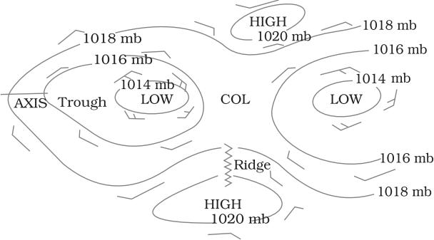
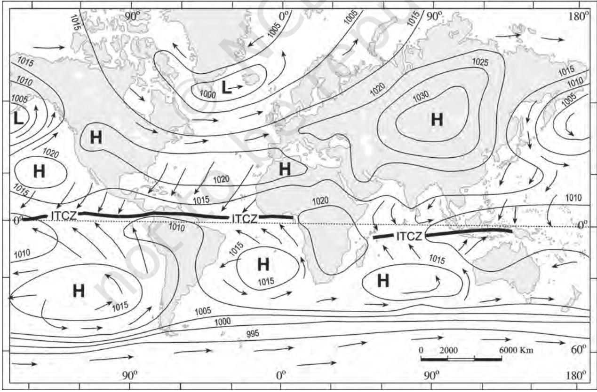
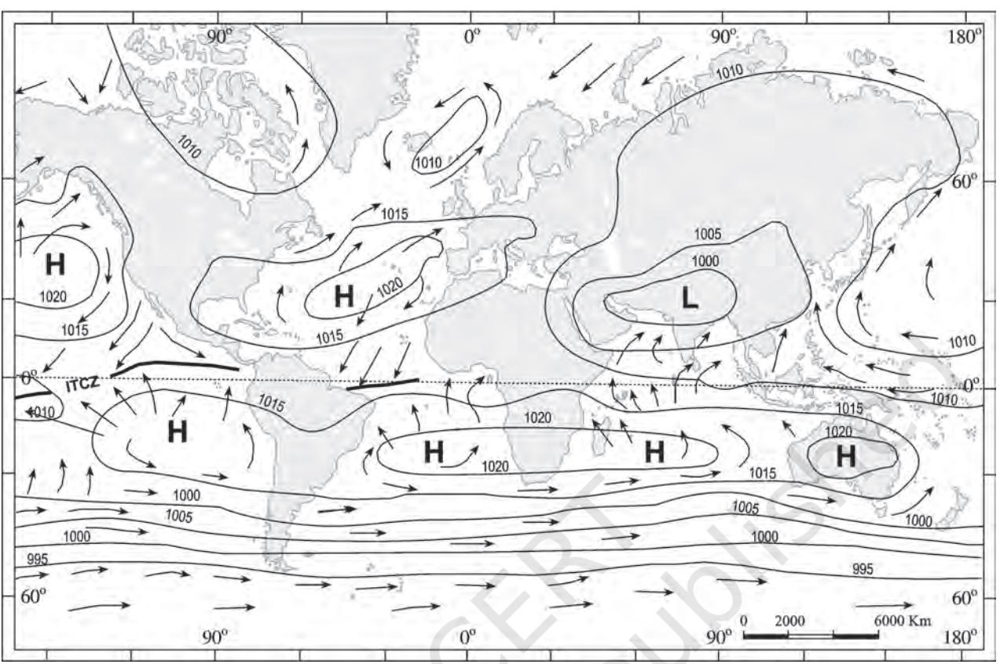
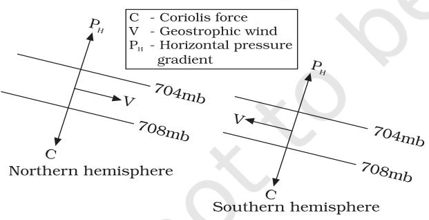
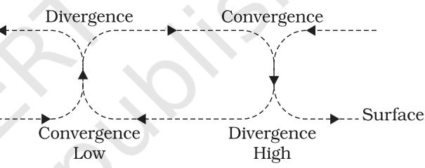
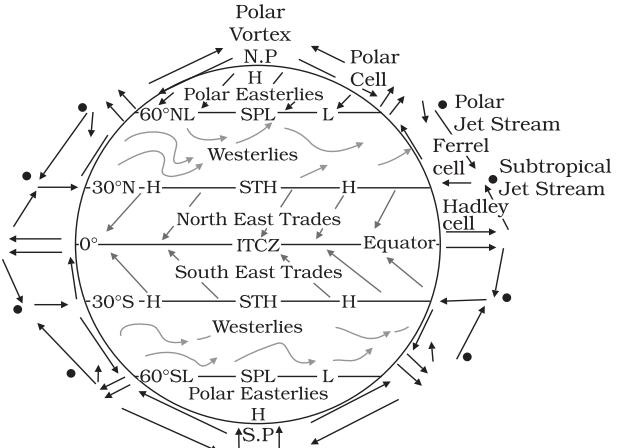
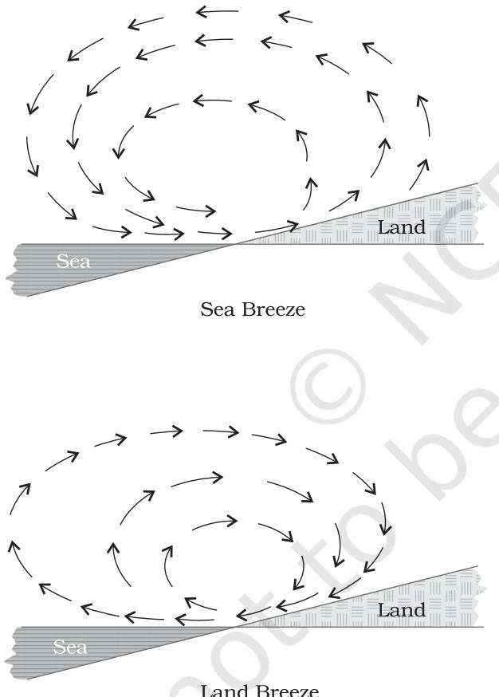
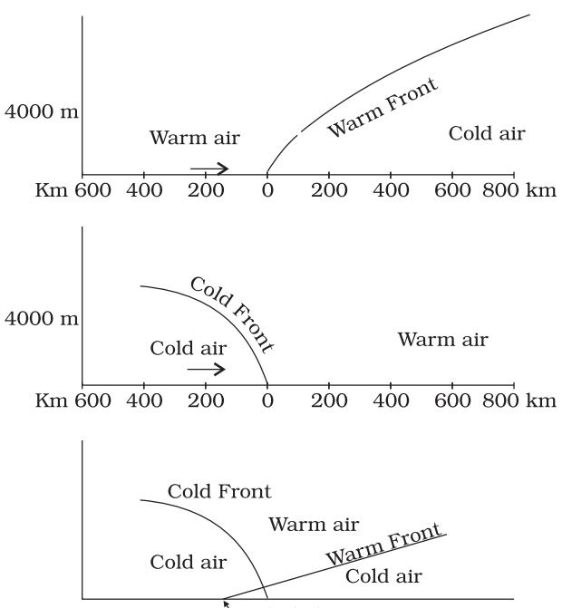
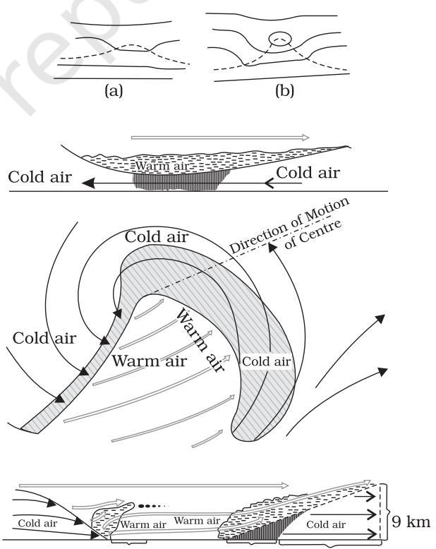
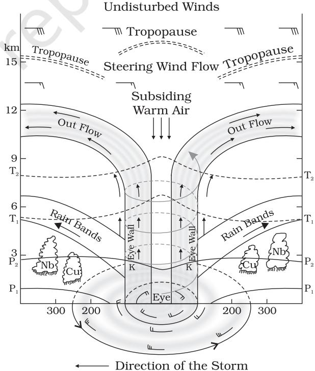

## CHAPTER

# **ATMOSPHERIC CIRCULATION AND WEATHER SYSTEMS**

E arlier Chapter 8 described the uneven distribution of temperature over the surface of the earth. Air expands when heated and gets compressed when cooled. This results in variations in the atmospheric pressure. The result is that it causes the movement of air from high pressure to low pressure, setting the air in motion. You already know that air in horizontal motion is wind. Atmospheric pressure also determines when the air will rise or sink. The wind redistributes the heat and moisture across the planet, thereby, maintaining a constant temperature for the planet as a whole. The vertical rising of moist air cools it down to form the clouds and bring precipitation. This chapter has been devoted to explain the causes of pressure differences, the forces that control the atmospheric circulation, the turbulent pattern of wind, the formation of air masses, the disturbed weather when air masses interact with each other and the phenomenon of violent tropical storms.

# **ATMOSPHERIC PRESSURE**

Do you realise that our body is subjected to a lot of air pressure. As one moves up the air gets varified and one feels breathless.

The weight of a column of air contained in a unit area from the mean sea level to the top of the atmosphere is called the *atmospheric pressure*. The atmospheric pressure is expressed in units of milibar. At sea level the average atmospheric pressure is 1,013.2 milibar. Due to gravity the air at the surface is denser and hence has higher pressure. Air pressure is measured with the help of a mercury barometer or the aneroid barometer. Consult your book, *Practical Work in Geography — Part I* (NCERT, 2006) and learn about these instruments. The pressure decreases with height. At any elevation it varies from place to place and its variation is the primary cause of air motion, i.e. wind which moves from high pressure areas to low pressure areas.

# **Vertical Variation of Pressure**

In the lower atmosphere the pressure decreases rapidly with height. The decrease amounts to about 1 mb for each 10 m increase in elevation. It does not always decrease at the same rate. Table 9.1 gives the average pressure and temperature at selected levels of elevation for a standard atmosphere.

#### **Table 9.1 : Standard Pressure and Temperature at Selected Levels**

| Level | Pressure in mb | Temperature °C |
| --- | --- | --- |
| Sea Level | 1,013.25 | 15.2 |
| 1 km | 898.76 | 8.7 |
| 5 km | 540.48 | –17. 3 |
| 10 km | 265.00 | – 49.7 |

The vertical pressure gradient force is much larger than that of the horizontal pressure gradient. But, it is generally balanced by a nearly equal but opposite gravitational force. Hence, we do not experience strong upward winds.

# **Horizontal Distribution of Pressure**

Small differences in pressure are highly significant in terms of the wind direction and

**Figure 9.1 : Isobars, pressure and wind systems in Northern Hemisphere**

velocity. Horizontal distribution of pressure is studied by drawing isobars at constant levels. Isobars are lines connecting places having equal pressure. In order to eliminate the effect of altitude on pressure, it is measured at any station after being reduced to sea level for purposes of comparison. The sea level pressure distribution is shown on weather maps.

Figure 9.1 shows the patterns of isobars corresponding to pressure systems. Lowpressure system is enclosed by one or more isobars with the lowest pressure in the centre. High-pressure system is also enclosed by one or more isobars with the highest pressure in the centre.

# **World Distribution of Sea Level Pressure**

The world distribution of sea level pressure in January and July has been shown in Figures 9.2 and 9.3. Near the equator the sea level pressure is low and the area is known as *equatorial low*. Along 30° N and 30o S are found the high-pressure areas known as the subtropical highs. Further pole wards along 60o N and 60o S, the low-pressure belts are termed as the sub polar lows. Near the poles the pressure is high and it is known as the *polar high*. These pressure belts are not permanent

**Figure 9.2 : Distribution of pressure (in millibars) — January**

78 FUNDAMENTALS OF PHYSICAL GEOGRAPHY

**Figure 9.3 : Distribution of pressure (in millibars) — July**

in nature. They oscillate with the apparent movement of the sun. In the northern hemisphere in winter they move southwards and in the summer northwards.

# **Forces Affecting the Velocity and Direction of Wind**

You already know that the air is set in motion due to the differences in atmospheric pressure. The air in motion is called wind. The wind blows from high pressure to low pressure. The wind at the surface experiences friction. In addition, rotation of the earth also affects the wind movement. The force exerted by the rotation of the earth is known as the Coriolis force. Thus, the horizontal winds near the earth surface respond to the combined effect of three forces – the pressure gradient force, the frictional force and the Coriolis force. In addition, the gravitational force acts downward.

# *Pressure Gradient Force*

The differences in atmospheric pressure produces a force. The rate of change of pressure with respect to distance is the pressure gradient. The pressure gradient is strong where the isobars are close to each other and is weak where the isobars are apart.

# *Frictional Force*

It affects the speed of the wind. It is greatest at the surface and its influence generally extends upto an elevation of 1 - 3 km. Over the sea surface the friction is minimal.

## *Coriolis Force*

The rotation of the earth about its axis affects the direction of the wind. This force is called the Coriolis force after the French physicist who described it in 1844. It deflects the wind to the right direction in the northern hemisphere and to the left in the southern hemisphere. The deflection is more when the wind velocity is high. The Coriolis force is directly proportional to the angle of latitude. It is maximum at the poles and is absent at the equator.

The Coriolis force acts perpendicular to the pressure gradient force. The pressure gradient force is perpendicular to an isobar. The higher the pressure gradient force, the more is the velocity of the wind and the larger is the deflection in the direction of wind. As a result of these two forces operating perpendicular to each other, in the low-pressure areas the wind blows around it. At the equator, the Coriolis force is zero and the wind blows perpendicular to the isobars. The low pressure gets filled instead of getting intensified. That is the reason why tropical cyclones are not formed near the equator.

#### *Pressure and Wind*

The velocity and direction of the wind are the net result of the wind generating forces. The winds in the upper atmosphere, 2 - 3 km above the surface, are free from frictional effect of the surface and are controlled mainly by the pressure gradient and the Coriolis force. When isobars are straight and when there is no friction, the pressure gradient force is balanced by the Coriolis force and the resultant wind blows parallel to the isobar. This wind is known as the geostrophic wind (Figure 9.4).

**Figure 9.4 : Geostropic Wind**

The wind circulation around a low is called *cyclonic circulation*. Around a high it is called *anti cyclonic circulation*. The direction of winds around such systems changes according to their location in different hemispheres (Table 9.2).

The wind circulation at the earth's surface around low and high on many occasions is closely related to the wind circulation at higher level. Generally, over low pressure area the air will converge and rise. Over high pressure area the air will subside from above and diverge at the surface (Figure 9.5). Apart from convergence, some eddies, convection currents, orographic uplift and uplift along fronts cause the rising of air, which is essential for the formation of clouds and precipitation.

**Figure 9.5 : Convergence and divergence of winds**

#### **General circulation of the atmosphere**

The pattern of planetary winds largely depends on : (i) latitudinal variation of atmospheric heating; (ii) emergence of pressure belts; (iii) the migration of belts following apparent path of the sun; (iv) the distribution of continents and oceans; (v) the rotation of earth. The pattern of the movement of the planetary winds is called the general circulation of the atmosphere. The general circulation of the atmosphere also sets in motion the ocean water circulation which influences the earth's

| Table 9.2 : Pattern of Wind Direction in Cyclones and Anticyclones |
| --- |

| Pressure System | Pressure Condition | Pattern of Wind Direction |  |
| --- | --- | --- | --- |
|  | at the Centre | Northern Hemisphere | Southern Hemisphere |
| Cyclone | Low | Anticlockwise | Clockwise |
| Anticyclone | High | Clockwise | Anticlockwise |

climate. A schematic description of the general circulation is shown in Figure 9.6.

**Figure 9. 6 : Simplified general circulation of the atmosphere**

The air at the Inter Tropical Convergence Zone (ITCZ) rises because of convection caused by high insolation and a low pressure is created. The winds from the tropics converge at this low pressure zone. The converged air rises along with the convective cell. It reaches the top of the troposphere up to an altitude of 14 km. and moves towards the poles. This causes accumulation of air at about 30o N and S. Part of the accumulated air sinks to the ground and forms a subtropical high. Another reason for sinking is the cooling of air when it reaches 30o N and S latitudes. Down below near the land surface the air flows towards the equator as the easterlies. The easterlies from either side of the equator converge in the Inter Tropical Convergence Zone (ITCZ). Such circulations from the surface upwards and *vice-versa* are called cells. Such a cell in the tropics is called *Hadley Cell*. In the middle latitudes the circulation is that of sinking cold air that comes from the poles and the rising warm air that blows from the subtropical high. At the surface these winds are called westerlies and the cell is known as the *Ferrel cell*. At polar latitudes the cold dense air subsides near the poles and blows towards middle latitudes as the polar easterlies. This cell is called the polar cell. These three cells set the pattern for the general circulation of the atmosphere. The transfer of heat energy from lower latitudes to higher latitudes maintains the general circulation.

The general circulation of the atmosphere also affects the oceans. The large-scale winds of the atmosphere initiate large and slow moving currents of the ocean. Oceans in turn provide input of energy and water vapour into the air. These interactions take place rather slowly over a large part of the ocean.

# **General Atmospheric Circulation and its Effects on Oceans**

Warming and cooling of the Pacific Ocean is most important in terms of general atmospheric circulation. The warm water of the central Pacific Ocean slowly drifts towards South American coast and replaces the cool Peruvian current. Such appearance of warm water off the coast of Peru is known as the El Nino. The El Nino event is closely associated with the pressure changes in the Central Pacific and Australia. This change in pressure condition over Pacific is known as the southern oscillation. The combined phenomenon of southern oscillation and El Nino is known as ENSO. In the years when the ENSO is strong, large-scale variations in weather occur over the world. The arid west coast of South America receives heavy rainfall, drought occurs in Australia and sometimes in India and floods in China. This phenomenon is closely monitored and is used for long range forecasting in major parts of the world.

# *Seasonal Wind*

The pattern of wind circulation is modified in different seasons due to the shifting of regions of maximum heating, pressure and wind belts. The most pronounced effect of such a shift is noticed in the monsoons, especially over southeast Asia. You would be studying the details of monsoon in the book *India : Physical Environment* (NCERT, 2006)*.* The other local deviations from the general circulation system are as follows.

# *Local Winds*

Differences in the heating and cooling of earth surfaces and the cycles those develop daily or annually can create several common, local or regional winds.

# *Land and Sea Breezes*

As explained earlier, the land and sea absorb and transfer heat differently. During the day the land heats up faster and becomes warmer than the sea. Therefore, over the land the air rises giving rise to a low pressure area, whereas the sea is relatively cool and the pressure over sea is relatively high. Thus, pressure gradient from sea to land is created and the wind blows from the sea to the land as the sea breeze. In the night the reversal of condition takes place. The land loses heat faster and is cooler than the sea. The pressure gradient is from the land to the sea and hence land breeze results (Figure 9.7).

**Figure 9.7 : Land and sea breezes**

#### *Mountain and Valley Winds*

In mountainous regions, during the day the slopes get heated up and air moves upslope and to fill the resulting gap the air from the valley blows up the valley. This wind is known as the valley breeze. During the night the slopes get cooled and the dense air descends into the valley as the mountain wind. The cool air, of the high plateaus and ice fields draining into the valley is called katabatic wind. Another type of warm wind occurs on the leeward side of the mountain ranges. The moisture in these winds, while crossing the mountain ranges condense and precipitate. When it descends down the leeward side of the slope the dry air gets warmed up by adiabatic process. This dry air may melt the snow in a short time.

#### *Air Masses*

When the air remains over a homogenous area for a sufficiently longer time, it acquires the characteristics of the area. The homogenous regions can be the vast ocean surface or vast plains. The air with distinctive characteristics in terms of temperature and humidity is called an airmass. It is defined as a large body of air having little horizontal variation in temperature and moisture. The homogenous surfaces, over which air masses form, are called the source regions.

The air masses are classified according to the source regions. There are five major source regions. These are: (i) Warm tropical and subtropical oceans; (ii) The subtropical hot deserts; (iii) The relatively cold high latitude oceans; (iv) The very cold snow covered continents in high latitudes; (v) Permanently ice covered continents in the Arctic and Antarctica. Accordingly, following types of airmasses are recognised: (i) Maritime tropical (mT); (ii) Continental tropical (cT); (iii) Maritime polar (mP); (iv) Continental polar (cP); (v) Continental arctic (cA). Tropical air masses are warm and polar air masses are cold.

#### *Fronts*

When two different air masses meet, the boundary zone between them is called a *front*. The process of formation of the fronts is known as *frontogenesis*. There are four types of fronts: (a) Cold; (b) Warm; (c) Stationary; (d) Occluded. When the front remains stationary, it is called a *stationary front*. When the cold air moves

**Figure 9.8 : Vertical Sections of : (a) Warm Front; (b) Cold Front; (c) Occluded Front**

towards the warm air mass, its contact zone is called the *cold front*, whereas if the warm air mass moves towards the cold air mass, the contact zone is a warm front. If an air mass is fully lifted above the land surface, it is called the *occluded front*. The fronts occur in middle latitudes and are characterised by steep gradient in temperature and pressure. They bring abrupt changes in temperature and cause the air to rise to form clouds and cause precipitation.

# *Extra Tropical Cyclones*

The systems developing in the mid and high latitude, beyond the tropics are called the *middle latitude or extra tropical cyclones*. The passage of front causes abrupt changes in the weather conditions over the area in the middle and high latitudes.

Extra tropical cyclones form along the polar front. Initially, the front is stationary. In the northern hemisphere, warm air blows from the south and cold air from the north of the front. When the pressure drops along the front, the warm air moves northwards and the cold air move towards, south setting in motion an anticlockwise cyclonic circulation. The cyclonic circulation leads to a well developed extra tropical cyclone, with a warm front and a cold front. The plan and cross section of a well developed cyclone is given in Figure 9.9. There are pockets of warm air or warm sector wedged between the forward and the rear cold air or cold sector. The warm air glides over the cold air and a sequence of clouds appear over the sky ahead of the warm front and cause precipitation. The cold front approaches the warm air from behind and pushes the warm air up. As a result, cumulus clouds develop along the cold front. The cold front moves faster than the warm front ultimately overtaking the warm front. The warm air is completely lifted up and the front is occluded and the cyclone dissipates.

The processes of wind circulation both at the surface and aloft are closely interlinked. The extra tropical cyclone differs from the tropical cyclone in number of ways. The extra tropical cyclones have a clear frontal system

**Figure 9. 9 : Extra tropical cyclones**

which is not present in the tropical cyclones. They cover a larger area and can originate over the land and sea. Whereas the tropical cyclones originate only over the seas and on reaching the land they dissipate. The extra tropical cyclone affects a much larger area as compared to the tropical cyclone. The wind velocity in a tropical cyclone is much higher and it is more destructive. The extra tropical cyclones move from west to east but tropical cyclones, move from east to west.

# *Tropical Cyclones*

Tropical cyclones are violent storms that originate over oceans in tropical areas and move over to the coastal areas bringing about large scale destruction caused by violent winds, very heavy rainfall and storm surges. This is one of the most devastating natural calamities. They are known as *Cyclones* in the Indian Ocean, *Hurricanes* in the Atlantic, *Typhoons* in the Western Pacific and South China Sea, and *Willy-willies* in the Western Australia.

Tropical cyclones originate and intensify over warm tropical oceans. The conditions favourable for the formation and intensification of tropical storms are: (i) Large sea surface with temperature higher than 27° C; (ii) Presence of the Coriolis force; (iii) Small variations in the vertical wind speed; (iv) A pre-existing weaklow-pressure area or low-level-cyclonic circulation; (v) Upper divergence above the sea level system.

The energy that intensifies the storm, comes from the condensation process in the towering cumulonimbus clouds, surrounding the centre of the storm. With continuous supply of moisture from the sea, the storm is further strengthened. On reaching the land the moisture supply is cut off and the storm dissipates. The place where a tropical cyclone crosses the coast is called the landfall of the cyclone. The cyclones, which cross 20o N latitude generally, recurve and they are more destructive.

A schematic representation of the vertical structure of a mature tropical cyclonic storm is shown in Figure 9.10.

A mature tropical cyclone is characterised by the strong spirally circulating wind around the centre, called the eye. The diameter of the circulating system can vary between 150 and 250 km.

The eye is a region of calm with subsiding air. Around the eye is the eye wall, where there is a strong spiralling ascent of air to greater height reaching the tropopause. The wind reaches maximum velocity in this region, reaching as high as 250 km per hour. Torrential rain occurs here. From the eye wall rain bands may radiate and trains of cumulus and cumulonimbus clouds may drift into the outer region. The diameter of the storm over the Bay of Bengal, Arabian sea and Indian ocean is between 600 - 1200 km. The system moves slowly about 300 - 500 km per day. The cyclone creates storm surges and they inundate the coastal low lands. The storm peters out on the land.

**Figure 9.10 : Vertical section of the tropical cyclone (after Rama Sastry)**

## 84 FUNDAMENTALS OF PHYSICAL GEOGRAPHY

## *Thunderstorms and Tornadoes*

Other severe local storms are thunderstorms and tornadoes. They are of short duration, occurring over a small area but are violent. *Thunderstorms* are caused by intense convection on moist hot days. A thunderstorm is a well-grown cumulonimbus cloud producing thunder and lightening. When the clouds extend to heights where sub-zero temperature prevails, hails are formed and they come down as hailstorm. If there is insufficient moisture, a thunderstorm can generate duststorms. A thunderstorm is characterised by intense updraft of rising warm air, which causes the clouds to grow bigger and rise to greater height. This causes precipitation. Later, downdraft brings down to earth the cool air and the rain. From severe thunderstorms sometimes spiralling wind descends like a trunk of an elephant with great force, with very low pressure at the centre, causing massive destruction on its way. Such a phenomenon is called a *tornado*. Tornadoes generally occur in middle latitudes. The tornado over the sea is called *water spouts*.

These violent storms are the manifestation of the atmosphere's adjustments to varying energy distribution. The potential and heat energies are converted into kinetic energy in these storms and the restless atmosphere again returns to its stable state.

## **EXERCISES**

- 1. Multiple choice questions.
	- (i) If the surface air pressure is 1,000 mb, the air pressure at 1 km above the surface will be:
		- (a) 700 mb (c) 900 mb
		- (b) 1,100 mb (d) 1,300 mb
	- (ii) The Inter Tropical Convergence Zone normally occurs:
		- (a) near the Equator (b) near the Tropic of Cancer
		- (c) near the Tropic of Capricorn (d) near the Arctic Circle
	- (iii) The direction of wind around a low pressure in northern hemisphere is:
		- (a) clockwise (c) anti-clock wise
		- (b) perpendicular to isobars (d) parallel to isobars
	- (iv) Which one of the following is the source region for the formation of air masses?

| (a) the Equatorial forest | (c) the Siberian Plain |
| --- | --- |
| (b) the Himalayas | (d) the Deccan Plateau |

- 2. Answer the following questions in about 30 words.
	- (i) What is the unit used in measuring pressure? Why is the pressure measured at station level reduced to the sea level in preparation of weather maps?
	- (ii) While the pressure gradient force is from north to south, i.e. from the subtropical high pressure to the equator in the northern hemisphere, why are the winds north easterlies in the tropics.
	- (iii) What are the geotrophic winds?
	- (iv) Explain the land and sea breezes.

- 3. Answer the following questions in about 150 words.
	- (i) Discuss the factors affecting the speed and direction of wind.
	- (ii) Draw a simplified diagram to show the general circulation of the atmosphere over the globe. What are the possible reasons for the formation of subtropical high pressure over 30o N and S latitudes?
	- (iii) Why does tropical cyclone originate over the seas? In which part of the tropical cyclone do torrential rains and high velocity winds blow and why?

# **Project Work**

- (i) Collect weather information over media such as newspaper, TV and radio for understanding the weather systems.
- (ii) Read the section on weather in any newspaper, preferably, one having a map showing a satellite picture. Mark the area of cloudiness. Attempt to infer the atmospheric circulation from the distribution of clouds. Compare the forecast given in the newspaper with the TV coverage, if you have access to TV. Estimate, how many days in a week was the forecast were accurate.

