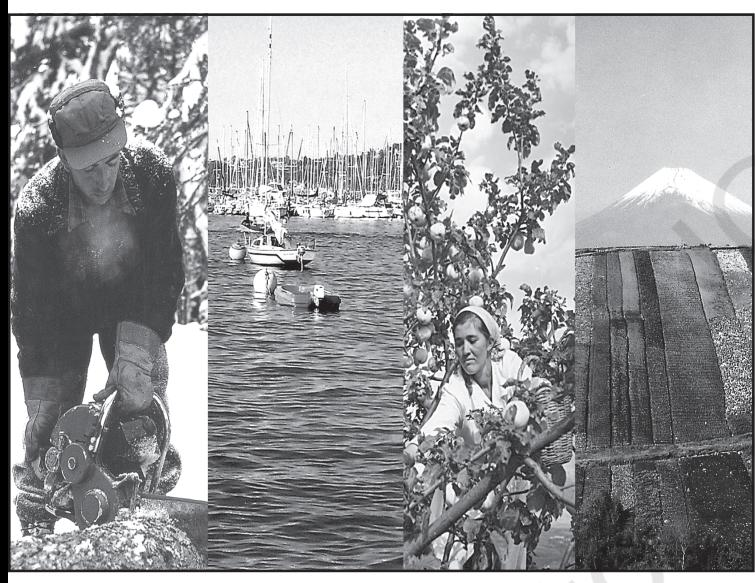
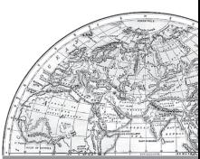
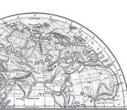
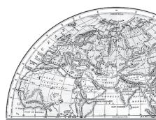
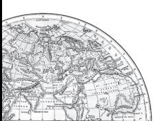
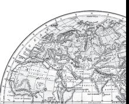
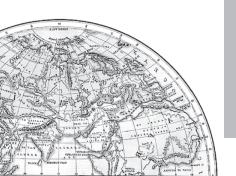

# Human Geography Nature and Scope

You have already studied 'Geography as a Discipline' in Chapter I of the book, *Fundamentals of Physical Geography* (NCERT, 2006). Do you recall the contents? This chapter has broadly covered and introduced you to the nature of geography. You are also acquainted with the important branches that sprout from the body of geography. If you re-read the chapter you will be able to recall the link of human geography with the mother discipline i.e. geography. As you know geography as a field of study is integrative, empirical, and practical. Thus, the reach of geography is extensive and each and every event or phenomenon which varies over space and time can be studied geographically. How do you see the earth's surface? Do you realise that the earth comprises two major components: nature (physical environment) and life forms including human beings? Make a list of physical and human components of your surroundings. Physical geography studies physical environment and human geography studies "the relationship between the physical/natural and the human worlds, the spatial distributions of human phenomena and how they come about, the social and economic differences between different parts of the world".1

You are already aware of the fact that the core concern of geography as a discipline is to understand the earth as home of human beings and to study all those elements which have sustained them. Thus, emphasis is on study of nature and human beings. You will realise that geography got subjected to dualism and the wide-ranging debates started whether geography as a discipline should be a law making/theorising (nomothetic) or descriptive (idiographic). Whether its subject matter should be organised and approach of the study should be regional or systematic? Whether geographical phenomena be interpreted theoretically or through historicinstitutional approach? These have been issues for intellectual exercise but finally you will appreciate that the dichotomy between physical and human is not a very valid one because nature and human are inseparable elements and should be seen holistically. It is interesting to note that both physical and human

1 Agnew J. Livingstone, David N. and Rogers, A.; (1996) Blackwell Publishing Limited, Malden, U.S.A. p. 1 and 2.

phenomena are described in metaphors using symbols from the human anatomy.

We often talk of the 'face' of the earth, 'eye' of the storm, 'mouth' of the river, 'snout' (nose) of the glacier, 'neck' of the isthmus and 'profile' of the soil. Similarly regions, villages, towns have been described as 'organisms'. German geographers describe the 'state/country' as a 'living organism'. Networks of road, railways and water ways have often been described as "arteries of circulation". Can you collect such terms and expressions from your own language? The basic questions now arises, can we separate nature and human when they are so intricately intertwined?

# Human Geography Defined

**•** "Human geography is the synthetic study of relationship between human societies and earth's surface". Ratzel

Synthesis has been emphasised in the above definition.

**•** "Human geography is the study of the changing relationship between the unresting man and the unstable earth."

Ellen C. Semple

Dynamism in the relationship is the keyword in Semple's definition.

**•** "Conception resulting from a more synthetic knowledge of thephysical laws governing our earth and of the relations between the living beings which inhabit it".

Paul Vidal de la Blache

Human geography offers a new conception of the interrelationships between earth and human beings.

# NATURE OF HUMAN GEOGRAPHY

Human geography studies the inter-relationship between the physical environment and sociocultural environment created by human beings through mutual interaction with each other. You

2 *Fundamentals of Human Geography*

have already studied the elements of physical environment in class XI in the book entitled *Fundamentals of Physical Geography* (NCERT 2006). You know that these elements are landforms, soils, climate, water, natural vegetation and diverse flora and fauna. Can you make a list of elements which human beings have created through their activities on the stage provided by the physical environment? Houses, villages, cities, road-rail networks, industries, farms, ports, items of our daily use and all other elements of material culture have been created by human beings using the resources provided by the physical environment. While physical environment has been greatly modified by human beings, it has also, in turn, impacted human lives.

#### Naturalisation of Humans and Humanisation of Nature

Human beings interact with their physical environment with the help of technology. It is not important what human beings produce and create but it is extremely important 'with the help of what tools and techniques do they produce and create'.

Technology indicates the level of cultural development of society. Human beings were able to develop technology after they developed better understanding of natural laws. For example, the understanding of concepts of friction and heat helped us discover fire. Similarly, understanding of the secrets of DNA and genetics enabled us to conquer many diseases. We use the laws of aerodynamics to develop faster planes. You can see that knowledge about Nature is extremely important to develop technology and technology loosens the shackles of environment on human beings. In the early stages of their interaction with their natural environment humans were greatly influenced by it. They adapted to the dictates of Nature. This is so because the level of technology was very low and the stage of human social development was also primitive. This type of interaction between primitive human society and strong forces of nature was termed as environmental determinism. At that stage of very low technological development we can imagine the presence of a naturalised human, who listened to Nature, was afraid of its fury and worshipped it.

# The Naturalisation of Humans

Benda lives in the wilds of the Abujh Maad area of central India. His village consists of three huts deep in the wilds. Not even birds or stray dogs that usually crowd villages can be seen in these areas. Wearing a small loin cloth and armed with his axe he slowly surveys the penda (forest) where his tribe practices a primitive form of agriculture called shifting cultivation. Benda and his friends burn small patches of forest to clear them for cultivation. The ash is used for making the soil fertile. Benda is happy that the Mahua trees around him are in bloom. How lucky I am to be a part of this beautiful universe, he thinks as he looks up to see the Mahua, Palash and Sal trees that have sheltered him since childhood. Crossing the penda in a gliding motion, Benda makes his way to a stream. As he bends down to scoop up a palmful of water, he remembers to thank Loi-Lugi, the spirit of the forest for allowing him to quench his thirst. Moving on with his friends, Benda chews on succulent leaves and roots. The boys have been trying to collect Gajjhara and Kuchla, from the forest. These are special plants that Benda and his people use. He hopes the spirits of the forest will be kind and lead him to these herbs. These are needed to barter in the madhai or tribal fair coming up the next full moon. He closes his eyes and tries hard to recall what the elders had taught him about these herbs and the places they are found in. He wishes he had listened more carefully. Suddenly there is a rustling of leaves. Benda and his friends know it is the outsiders who have come searching for them in the wilds. In a single fluid motion Benda and his friends disappear behind the thick canopy of trees and become one with the spirit of the forest.

The story in the box represents the direct relationship of a household belonging to an economically primitive society with nature. Read about other primitive societies which live in complete harmony with their natural environment. You will realise that in all such cases nature is a powerful force, worshipped, revered and conserved. There is direct dependence of human beings on nature for resources which sustain them. The physical environment for such societies becomes the "Mother Nature".

The people begin to understand their environment and the forces of nature with the passage of time. With social and cultural development, humans develop better and more efficient technology. They move from a state of necessity to a state of freedom. They create possibilities with the resources obtained from the environment. The human activities create cultural landscape. The imprints of human activities are created everywhere; health resorts on highlands, huge urban sprawls, fields, orchards and pastures in plains and rolling hills, ports on the coasts, oceanic routes on the oceanic surface and satellites in the space. The earlier scholars termed this as possibilism. Nature provides opportunities and human being make use of these and slowly nature gets humanised and starts bearing the imprints of human endeavour.

Humanisation of Nature

Winters in the town of Trondheim mean fierce winds and heavy snow. The skies are dark for months. Kari drives to work in the dark at 8 am. She has special tyres for the winter and keeps the headlights of her powerful car switched on. Her office is artificially heated at a comfortable 23 degrees Celsius. The campus of the university she works in is built under a huge glass dome. This dome keeps the snow out in winter and lets in the sunshine in the summer. The temperature is controlled carefully and there is adequate lighting. Even though fresh vegetables and plants don't grow in such harsh weather, Kari keeps an orchid on her desk and enjoys eating tropical fruits like banana and kiwi. These are flown in from warmer areas regularly. With a click of the mouse, Kari can network with colleagues in New Delhi. She frequently takes a morning flight to London and returns in the evening in time to watch her favourite television serial. Though Kari is fifty-eight years old, she is fitter and looks younger than many thirtyyear- olds in other parts of the world.

Can you imagine what has made such a life style possible? It is technology that has allowed the people of Trondheim and others to overcome the constraints imposed by nature. Do you know about some other such instances? Such examples are not difficult to find.

A geographer, Griffith Taylor introduced another concept which reflects a middle path (Madhyam Marg) between the two ideas of environmental determinism and possibilism. He termed it as Neodeterminism or stop and go determinism. Those of you who live in cities and those who have visited a city, might have seen that traffic is regulated by lights on the cross-roads. Red light means 'stop', amber light provides a gap between red and green lights 'to get set' and green light means 'go'. The concept shows that neither is there a situation of absolute necessity (environmental determinism) nor is there a condition of absolute freedom (possibilism). It means that human beings can conquer nature by obeying it. They have to respond to the red signals and can proceed in their pursuits of development when nature permits the modifications. It means that possibilities can be created within the limits which do not damage the environment and there is no free run without accidents. The free run which the developed economies attempted to take has already resulted in the green house effect, ozone layer depletion, global warming, receding glaciers and degrading lands. The neo-determinism conceptually attempts to bring a balance nullifying the 'either' 'or' dichotomy.

- **•** Welfare or humanistic school of thought in human geography was mainly concerned with the different aspects of social well-being of the people. These included aspects such as housing, health and education. Geographers have already introduced a paper as Geography of Social well-being in the Post Graduate curriculum'.
- **•** Radical school of thought employed Marxian theory to explain the basic cause of poverty, deprivation and social inequality. Contemporary social problems were related to the development of capitalism.
- **•** Behavioural school of thought laid great emphasis on lived experience and also on the perception of space by social categories based on ethnicity, race and religion, etc.

## Fields and Sub-fields of Human Geography

Human geography, as you have seen, attempts to explain the relationship between all elements of human life and the space they occur over. Thus, human geography assumes a highly inter-disciplinary nature. It develops close interface with other sister disciplines in social sciences in order to understand and explain human elements on the surface of the earth. With the expansion of knowledge, new subfields emerge and it has also happened to human geography. Let us examine these fields and sub-fields of Human Geography (Table 1.2).

| Period | Approaches | Broad Features |
| --- | --- | --- |
| Early Colonial | Exploration and | Imperial and trade interests prompted the discovery and |
| period | description | exploration of new areas. An encyclopaedic description of |
|  |  | the area formed an important aspect of the geographer's |
|  |  | account. |
| Later Colonial | Regional analysis | Elaborate description of all aspects of a region were |
| period |  | undertaken. The idea was that all the regions were part of |
|  |  | a whole, i.e. (the earth); so, understanding the parts in |
|  |  | totality would lead to an understanding of the whole. |

*Table 1.1: Broad Stages and Thrust of Human Geography*

| 1930s through the | Areal differentiation | The focus was on identifying the uniqueness of any |
| --- | --- | --- |
| inter-War period |  | region and understanding how and why it was different |
|  |  | from others. |
| Late 1950s to the | Spatial organisation | Marked by the use of computers and sophisticated |
| late 1960s |  | statistical tools. Laws of physics were often applied |
|  |  | to map and analyse human phenomena. This phase |
|  |  | was called the quantitative revolution. The main |
|  |  | objective was to identify mappable patterns for |
|  |  | different human activities. |
| 1970s | Emergence of | Discontentment with the quantitative revolution and |
|  | humanistic, radical | its dehumanised manner of doing geography led to |
|  | and behavioural | the emergence of three new schools of thought of |
|  | schools | human geography in the 1970s. Human geography |
|  |  | was made more relevant to the socio-political reality |
|  |  | by the emergence of these schools of thought. Consult |
|  |  | the box below to know a little bit more about these |
|  |  | schools of thought. |
| 1990s | Post-modernism in | The grand generalisations and the applicability of |
|  | geography | universal theories to explain the human conditions |
|  |  | were questioned. The importance of understanding |
|  |  | each local context in its own right was emphasised. |

| Table 1.2: Human Geography and Sister Disciplines of Social Sciences |
| --- |

| Fields of | Sub-fields | Interface with Sister |
| --- | --- | --- |
| Human |  | Disciplines of Social Sciences |
| Geography |  |  |
| Social | — | Social Sciences – Sociology |
| Geography | Behavioural Geography | Psychology |
|  | Geography of Social | Welfare Economics |
|  | Well-being |  |
|  | Geography of Leisure | Sociology |
|  | Cultural Geography | Anthropology |
|  | Gender Geography | Sociology, Anthropology, Women's Studies |
|  | Historical Geography | History |
|  | Medical Geography | Epidemology |
| Urban | — | Urban Studies and Planning |
| Geography |  |  |
| Political | — | Political Science |
| Geography | Electoral Geography | Psephology |
|  | Military Geography | Military Science |
| Population | — | Demography |
| Geography |  |  |
| Settlement | — | Urban/Rural Planning |
| Geography |  |  |

*Human Geography: Nature and Scope* 5

| Economic | — | Economics |
| --- | --- | --- |
| Geography | Geography of Resources | Resource Economics |
|  | Geography of Agriculture | Agricultural Sciences |
|  | Geography of Industries | Industrial Economics |
|  | Geography of Marketing | Business Studies, Economics, Commerce |
|  | Geography of Tourism | Tourism and Travel Management |
|  | Geography of International | International Trade |
|  | Trade |  |

# EXERCISES

- 1. Choose the right answer from the four alternatives given below.
	- (i) Which one of the following statements does not describe geography?
		- (a) an integrative discipline
		- (b) study of the inter-relationship between humans and environment
		- (c) subjected to dualism
		- (d) not relevant in the present time due to the development of technology.
	- (ii) Which one of the following is not a source of geographical information?
		- (a) traveller's accounts
		- (b) old maps
		- (c) samples of rock materials from the moon
		- (d) ancient epics
	- (iii) Which one of the following is the most important factor in the interaction between people and environment?
		- (a) human intelligence (c) technology
		- (b) people's perception (d) human brotherhood
	- (iv) Which one of the following is not an approach in human geography?
		- (a) Areal differentiation (c) Quantitative revolution
		- (b) Spatial organisation (d) Exploration and description
- 2. Answer the following questions in about 30 words.
	- (i) Define human geography.
	- (ii) Name some sub-fields of human geography.
	- (iii) How is human geography related to other social sciences?
- 3. Answer the following questions in not more than 150 words.
	- (i) Explain naturalisation of humans.
	- (ii) Write a note on the scope of human geography.

