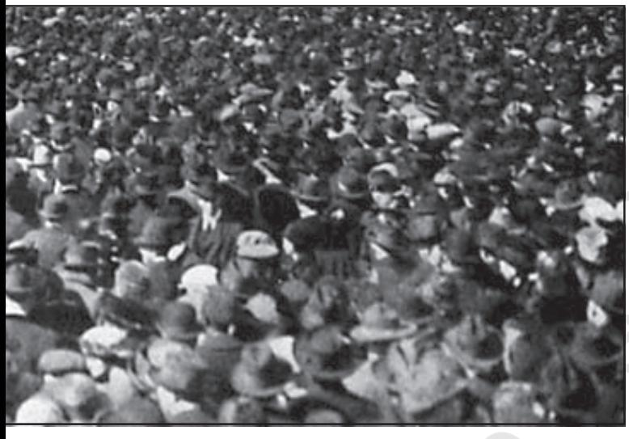
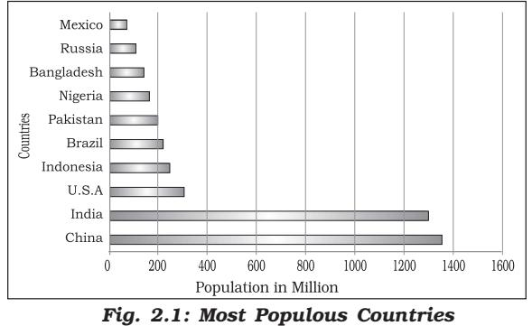
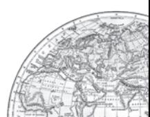
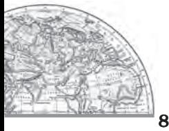
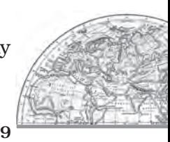
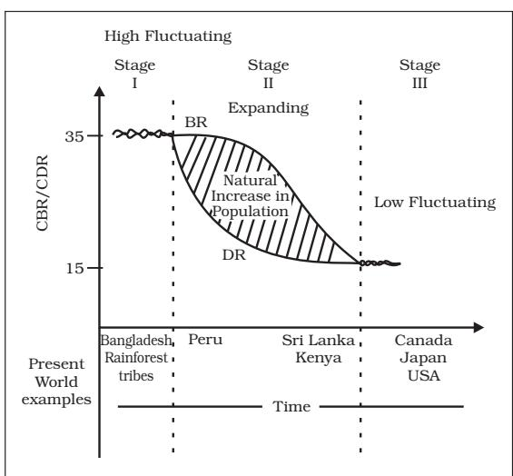
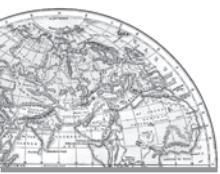

## Unit-II Chapter-2

# The World Population

Distribution, Density and Growth

Not gold but only (Wo)men can make a people great and strong.

(Wo)men who for truth and honour's sake, stand fast and suffer long (Wo)men who toil while others sleep – who dare while others flee – they build a nation's pillars deep and lift it to the sky.

Ralph Waldo Emerson

The people of a country are its real wealth. It is they, who are the actual resources and make use of the country's other resources and decide its policies. Ultimately a country is known by its people.

It is important to know how many women and men a country has, how many children are born each year, how many people die and how? Whether they live in cities or villages, can they read or write and what work do they do? These are what you will study about in this unit.

The world at the beginning of 21st century recorded the presence of over 6 billion population. We shall discuss the patterns of their distribution and density here.

#### **Why do people prefer to live in certain regions and not in others?**

The population of the world is unevenly distributed. The remark of George B. Cressey about the population of Asia that "Asia has many places where people are few and few place where people are very many" is true about the pattern of population distribution of the world also.

### PATTERNS OF POPULATION DISTRIBUTION IN THE WORLD

Patterns of population distribution and density help us to understand the demographic characteristics of any area. The term population distribution refers to the way people are spaced over the earth's surface. Broadly, 90 per cent of the world population lives in about 10 per cent of its land area.

The 10 most populous countries of the world contribute about 60 per cent of the world's population. Of these 10 countries, 6 are located in Asia. Identify these six countries of Asia.

#### **DENSITY OF POPULATION**

Each unit of land has limited capacity to support people living on it. Hence, it is necessary to understand the ratio between the numbers of people to the size of land. This ratio is the density of population. It is usually measured in persons per sq km

> Population Density of Population = Area

For example, area of Region X is 100 sq km and the population is 1,50,000 persons. The density of population is calculated as:

> 1,50,000 Density 100 =

= 1,500 person/sq km What does this tell you about Region X?

#### **FACTORS INFLUENCING THE DISTRIBUTION OF POPULATION**

#### I. Geographical Factors

- (i) Availability of water: Water is the most important factor for life. So, people prefer to live in areas where fresh water is easily available. Water is used for drinking, bathing and cooking – and also for cattle, crops, industries and navigation. It is because of this that river valleys are among the most densely populated areas of the world.
- (ii) Landforms: People prefer living on flat plains and gentle slopes. This is because such areas are favourable for the production of crops and to build roads and industries. The mountainous and hilly areas hinder the development of transport network and hence initially do not favour agricultural and industrial development. So, these areas tend to be less populated. The Ganga plains are among the most densely populated areas of the world while the mountains zones in the Himalayas are scarcely populated.
- (iii) Climate: An extreme climate such as very hot or cold deserts are uncomfortable for human habitation. Areas with a comfortable climate, where there is not much seasonal variation attract more people. Areas with very heavy rainfall or extreme and harsh climates have low population. Mediterranean regions were inhabited from early periods in history due to their pleasant climate.
- (iv) Soils: Fertile soils are important for agricultural and allied activities. Therefore, areas which have fertile loamy soils have more people living on them as these can support intensive agriculture. Can you name some areas in India which are thinly populated due to poor soils?

#### II. Economic Factors

- (i) Minerals: Areas with mineral deposits attract industries. Mining and industrial activities generate employment. So, skilled and semi–skilled workers move to these areas and make them densely populated. Katanga Zambia copper belt in Africa is one such good example.
- (ii) Urbanisation: Cities offer better employment opportunities, educational and medical facilities, better means of transport and communication. Good civic amenities and the attraction of city life draw people to the cities. It leads to rural to urban migration and cities grow in size. Mega cities of the world continue to attract large number of migrants every year.

**Yet city life can be very taxing…. think of some of the unpleasant aspects of city life.**

- (iii) Industrialisation: Industrial belts provide job opportunities and attract large numbers of people. These include not just factory workers but also transport operators, shopkeepers, bank employees, doctors, teachers and other service providers. The Kobe-Osaka region of

Fundamentals of Human Geography Japan is thickly populated because of the presence of a number of industries.

#### **III. Social and Cultural Factors**

Some places attract more people because they have religious or cultural significance. In the same way – people tend to move away from places where there is social and political unrest. Many a times governments offer incentives to people to live in sparsely populated areas or move away from overcrowded places. Can you think of some examples from your region?

#### **POPULATION GROWTH**

The population growth or population change refers to the change in number of inhabitants of a territory during a specific period of time. This change may be positive as well as negative. It can be expressed either in terms of absolute numbers or in terms of percentage. Population change in an area is an important indicator of economic development, social upliftment and historical and cultural background of the region.

#### Some Basic Concepts of Population Geography

*Growth of Population* **:** Change of population in particular area between two points of time is known as growth of population. For example, if we deduct the population of India 2001 (102.70 crore) from population of 2011 (121.02 crore) then we shall get the growth of population (18.15 crores) in actual numbers.

*Growth Rate of Population* **:** This is the change of population expressed in percentage.

*Natural Growth of Population***:** This is the population increased by difference between births and deaths in a particular region between two points of time.

*Natural Growth = Births – Deaths*

*Actual Growth of Population* **:** This is

*Births – Deaths + In Migration – Out Migration*

*Positive Growth of Population***:** This happens when the birth rate is more than the death rate between two points of time or when people from other countries migrate permanently to a region.

*Negative Growth of Population***:** If the population decreases between two points of time it is known as negative growth of population. It occurs when the birth rate falls below the death rate or people migrate to other countries.

#### **Components of Population Change**

There are three components of population change – births, deaths and migration.

The crude birth rate (CBR) is expressed as number of live births in a year per thousand of population. It is calculated as:

B CBR 1000 P 

Here, CBR = Crude Birth Rate; B = live births during the year; P= Estimated mid year population of the area.

Death rate plays an active role in population change. Population growth occurs not only by increasing births rate but also due to decreasing death rate. Crude Death Rate (CDR) is a simple method of measuring mortality of any area. CDR is expressed in terms of number of deaths in a particular year per thousand of population in a particular region.

CDR is calculated as:

$$\mathrm{CDR}={\frac{\mathrm{D}}{\mathrm{P}}}\times1000$$

Here, CDR=Crude Death Rate; D= Number of deaths; P=Estimated mid-year population of that year.

By and large mortality rates are affected by the region's demographic structure, social advancement and levels of its economic development.

#### **Migration**

Apart from birth and death there is another way by which the population size changes.

**The World Population: Distribution, Density and Growth** 

When people move from one place to another, the place they move from is called the Place of Origin and the place they move to is called the Place of Destination. The place of origin shows a decrease in population while the population increases in the place of destination. Migration may be interpreted as a spontaneous effort to achieve a better balance between population and resources.

Migration may be permanent, temporary or seasonal. It may take place from rural to rural areas, rural to urban areas, urban to urban areas and urban to rural areas.

Do you realise that the same person is both an immigrant and an emigrant?

*Immigration:* Migrants who move into a new place are called Immigrants.

*Emigration:* Migrants who move out of a place are called Emigrants.

#### **Can you think of reasons why people migrate?**

People migrate for a better economic and social life. There are two sets of factors that influence migration.

The Push factors make the place of origin seem less attractive for reasons like unemployment, poor living conditions, political turmoil, unpleasant climate, natural disasters, epidemics and socio-economic backwardness.

The Pull factors make the place of destination seem more attractive than the place of origin for reasons like better job opportunities and living conditions, peace and stability, security of life and property and pleasant climate.

Human population increased more than ten times in the past 500 hundred years.

In the twentieth century itself the population has increased four times.

#### DEMOGRAPHIC TRANSITION

Demographic transition theory can be used to describe and predict the future population of any area. The theory tells us that population of any region changes from high births and high deaths to low births and low deaths as society progresses from rural agrarian and illiterate to urban industrial and literate society. These changes occur in stages which are collectively known as the demographic cycle.

Fig. 2.2 explains the three-staged model of Demographic Transition Theory:

The first stage has high fertility and high mortality because people reproduce more to compensate for the deaths due to epidemics and variable food supply. The population growth is slow and most of the people are engaged in agriculture where large families are an asset. Life expectancy is low, people are mostly illiterate and have low levels of technology. Two hundred years ago all the countries of the world were in this stage.

*Fig. 2.2: Demographic Transition Theory*

10 *Fundamentals of Human Geography*

Fertility remains high in the beginning of second stage but it declines with time. This is accompanied by reduced mortality rate. Improvements in sanitation and health conditions lead to decline in mortality. Because of this gap the net addition to population is high.

In the last stage, both fertility and mortality decline considerably. The population is either stable or grows slowly. The population becomes urbanised, literate and has high technical know- how and deliberately controls the family size.

This shows that human beings are extremely flexible and are able to adjust their fertility.

In the present day, different countries are at different stages of demographic transition.

#### POPULATION CONTROL MEASURES

Family planning is the spacing or preventing the birth of children. Access to family planning services is a significant factor in limiting population growth and improving women's health. Propaganda, free availability of contraceptives and tax disincentives for large families are some of the measures which can help population control.

Thomas Malthus in his theory (1798) stated that the number of people would increase faster than the food supply. Any further increase would result in a population crash caused by famine, disease and war. The preventive checks are better than the physical checks. For the sustainability of our resources, the world will have to control the rapid population increase.

|  | EXERCISES |
| --- | --- |
| 1. | Choose the right answer from the four alternatives given below. |
| (i) | Which one of the following continents has the highest growth of population? |
|  | (a) Africa (c) Asia |
|  | (b) South America (d) North America |
| (ii) | Which one of the following is not an area of sparse population? |
|  | (a) The Atacama (c) Equatorial region |
|  | (b) South-east Asia (d) Polar regions |
| (iii) | Which one of the following is not a push factor ? |
|  | (a) Water shortage (c) Unemployment |
|  | (b) Medical/educational facilities (d) Epidemics |
| (iv) | Which one of the following is not a fact ? |
|  | (a) Human population increased more than ten times during the past |
|  | 500 years. |
|  | (b) Population growth is high in the first stage of demographic transition? |
| 2. | Answer the following questions in about 30 words. |
| (i) | Name three geographical factors that influence the distribution of |
|  | population. |

*The World Population: Distribution, Density and Growth* 11

- (ii) There are a number of areas with high population density in the world. Why does this happen?
- (iii) What are the three components of population change?
- 3. Distinguish between:
	- (i) Birth rate and death rate.
	- (ii) Push factors and pull factors of migration.
- 4. Answer the following questions in about 150 words.
	- (i) Discuss the factors influencing the distribution and density of population in the world.
	- (ii) Discuss the three stages of demographic transition.

#### Map Skill

- On the outline map of the world, show and name the following.
- (i) Countries of Europe and Asia with negative growth rate of population.

#### Project/Activity

- (i) Has someone in your family migrated? Write about her/his place of destination. What made her/him migrate?
- (ii) Write a brief report on the distribution and density of population in your

state.

