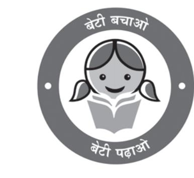

# **Unit-II** Chapter-3

# Human Development

The words 'growth' and 'development' are not new to you. Look around you, almost everything that you can see (and many that you cannot) grows and develops. These may be plants, cities, ideas, nations, relationships or even you yourself! What does this mean?

**Do growth and development mean the same thing? Do they accompany each other?**

This chapter discusses the concept of human development as it pertains to nations and communities.

# **GROWTH AND DEVELOPMENT**

Both growth and development refer to changes over a period of time. The difference is that growth is quantitative and value neutral. It may have a positive or a negative sign. This means that the change may be either positive (showing an increase) or negative (indicating a decrease).

Development means a qualitative change which is always value positive. This means that development cannot take place unless there is an increment or addition to the existing conditions. Development occurs when positive growth takes place. Yet, positive growth does not always lead to development. Development occurs when there is a positive change in quality.

For example, if the population of a city grows from one lakh to two lakhs over a period of time, we say the city has grown. However, if a facilities like housing, provision of basic services and other characteristics remain the same, then this growth has not been accompanied by development.

Can you think of a few more examples to differentiate between growth and development?

Write a short essay or draw a set of pictures illustrating growth without development and growth with development.

For many decades, a country's level of development was measured only in terms of its

Band Aceh, June, 2004 Band Aceh, December, 2004

Do you know that cities can also grow negatively? Look at the photographs of this tsunami affected city. Are natural disasters the only reasons for negative growth in a city's size?

economic growth. This meant that the bigger the economy of the country, the more developed it was considered, even though this growth did not really mean much change in the lives of most people.

The idea that the quality of life people enjoy in a country, the opportunities they have and freedoms they enjoy, are important aspects of development, is not new.

These ideas were clearly spelt out for the first time in the late eighties and early nineties. The works of two South Asian economists, Mahbub-ul-Haq and Amartya Sen are important in this regard.

The concept of human development was introduced by Dr Mahbub-ul-Haq. Dr Haq has described human development as development that enlarges people's choices and improves their lives. People are central to all development under this concept. These choices are not fixed but keep on changing. The basic goal of development is to create conditions where people can live meaningful lives.

A meaningful life is not just a long one. It must be a life with some purpose. This means that people must be healthy, be able to develop their talents, participate in society and be free to achieve their goals.

Dr Mahbub-ul-Haq and Prof Amartya Sen were close friends and have worked together under the leadership of Dr Haq to bring out the initial Human Development Reports. Both these South Asian economists have been able to provide an alternative view of development.

A man of vision and compassion, Pakistani economist Dr Mahbub-ul-Haq created the Human Development Index in 1990. According to him, development is all about enlarging people's choices in order to lead long, healthy lives with dignity. The United Nations Development Programme has used his concept of human development to publish the Human Development Report annually since 1990.

Dr Haq's flexibility of mind and ability to think out of the box can be illustrated from one of his speeches where he quoted Shaw saying, "'You see things that are, and ask why? I dream of things that never were, and ask why not?'

Nobel Laureate Prof Amartya Sen saw an increase in freedom (or decrease in unfreedom) as the main objective of development. Interestingly, increasing freedoms is also one of the most effective ways of bringing about development. His work explores the role of social and political institutions and processes in increasing freedom.

The works of these economists are path breaking and have succeeded in bringing people to the centre of any discussion on development.

- 14 *Fundamentals of Human Geography*

The Government of India has introduced *Beti Bachao Beti Padhao* programme to address the issue of decline in child sex ratio. Discuss with your peers how it will lead to more meaningful life for girls.

 Leading a long and healthy life, being able to gain knowledge and having enough means to be able to live a decent life are the most important aspects of human development.

Therefore, access to resources, health and education are the key areas in human development. Suitable indicators have been developed to measure each of these aspects. Can you think of some?

Very often, people do not have the capability and freedom to make even basic choices. This may be due to their inability to acquire knowledge, their material poverty, social discrimination, inefficiency of institutions and other reasons. This prevents them from leading healthy lives, being able to get educated or to have the means to live a decent life.

Building people's capabilities in the areas of health, education and access to resources is therefore, important in enlarging their choices. If people do not have capabilities in these areas, their choices also get limited.

For example, an uneducated child cannot make the choice to be a doctor because her choice has got limited by her lack of education. Similarly, very often poor people cannot choose to take medical treatment for disease because their choice is limited by their lack of resources.

Enact a five-minute play with your classmates showing how choices are limited due to lack of capability in the areas of either income, education or health.

# THE FOUR PILLARS OF HUMAN DEVELOPMENT

Just as any building is supported by pillars, the idea of human development is supported by the concepts of equity, sustainability, productivity and empowerment.

Equity refers to making equal access to opportunities available to everybody. The opportunities available to people must be equal irrespective of their gender, race, income and in the Indian case, caste. Yet this is very often not the case and happens in almost every society.

16 *Fundamentals of Human Geography*

For example, in any country, it is interesting to see which group the most of the school dropouts belong to. This should then lead to an understanding of the reasons for such behaviour. In India, a large number of women and persons belonging to socially and economically backward groups drop out of school. This shows how the choices of these groups get limited by not having access to knowledge.

Sustainability means continuity in the availability of opportunities. To have sustainable human development, each generation must have the same opportunities. All environmental, financial and human resources must be used keeping in mind the future. Misuse of any of these resources will lead to fewer opportunities for future generations.

A good example is about the importance of sending girls to school. If a community does not stress the importance of sending its girl children to school, many opportunities will be lost to these young women when they grow up. Their career choices will be severely curtailed and this would affect other aspects of their lives. So each generation must ensure the availability of choices and opportunities to its future generations.

Productivity here means human labour productivity or productivity in terms of human work. Such productivity must be constantly enriched by building capabilities in people. Ultimately, it is people who are the real wealth of nations. Therefore, efforts to increase their knowledge, or provide better health facilities ultimately leads to better work efficiency.

Empowerment means to have the power to make choices. Such power comes from increasing freedom and capability. Good governance and people-oriented policies are required to empower people. The empowerment of socially and economically disadvantaged groups is of special importance.

Talk to the vegetable vendor in your neighbourhood and find out if she has gone to school. Did she drop out of school? Why? What does this tell you about her choices and the freedom she has? Note how her opportunities were limited because of her gender, caste and income.

### APPROACHES TO HUMAN DEVELOPMENT

There are many ways of looking at the problem of human development. Some of the important approaches are: (a) The income approach; (b) The welfare approach; (c) Minimum needs approach; and (d) Capabilities approach (Table 3.1).

## MEASURING HUMAN DEVELOPMENT

The human development index (HDI) ranks the countries based on their performance in the key areas of health, education and access to resources. These rankings are based on a score between 0 to 1 that a country earns from its record in the key areas of human development.

The indicator chosen to assess health is the life expectancy at birth. A higher life expectancy means that people have a greater chance of living longer and healthier lives.

The adult literacy rate and the gross enrolment ratio represent access to knowledge. The number of adults who are able to read and write and the number of children enrolled in schools show how easy or difficult it is to access knowledge in a particular country.

Access to resources is measured in terms of purchasing power (in U.S. dollars).

Each of these dimensions is given a weightage of 1/3. The human development index is a sum total of the weights assigned to all these dimensions.

The closer a score is to one, the greater is the level of human development. Therefore, a score of 0.983 would be considered very high while 0.268 would mean a very low level of human development.

The human development index measures attainments in human development. It reflects what has been achieved in the key areas of human development. Yet it is not the most reliable measure. This is because it does not say anything about the distribution.

The human poverty index is related to the human development index. This index measures the shortfall in human development.

| (a) | Income Approach | This is one of the oldest approaches to human |
| --- | --- | --- |
|  |  | development. Human development is seen as being |
|  |  | linked to income. The idea is that the level of income |
|  |  | reflects the level of freedom an individual enjoys. |
|  |  | Higher the level of income, the higher is the level of |
|  |  | human development. |
| (b) | Welfare Approach | This approach looks at human beings as beneficiaries |
|  |  | or targets of all development activities. The approach |
|  |  | argues for higher government expenditure on |
|  |  | education, health, social secondary and amenities. |
|  |  | People are not participants in development but only |
|  |  | passive recipients. The government is responsible for |
|  |  | increasing levels of human development by |
|  |  | maximising expenditure on welfare. |
| (c) | Basic Needs Approach | This approach was initially proposed by the |
|  |  | International Labour Organisation (ILO). Six basic |
|  |  | needs i.e.: health, education, food, water supply, |
|  |  | sanitation, and housing were identified. The question |
|  |  | of human choices is ignored and the emphasis is on |
|  |  | the provision of basic needs of defined sections. |
| (d) | Capability Approach | This approach is associated with Prof. Amartya Sen. |
|  |  | Building human capabilities in the areas of health, |
|  |  | education and access to resources is the key to |
|  |  | increasing human development. |

*Table 3.1: Approaches to Human Development*

Since 1990, the United Nations Development Programme (UNDP) has been publishing the Human Development Report every year. This report provides a rank-wise list of all member countries according to the level of human development. The Human Development index and the Human Poverty index are two important indices to measure human development used by the UNDP.

It is a non-income measure. The probability of not surviving till the age of 40, the adult illiteracy rate, the number of people who do not have access to clean water, and the number of small children who are underweight are all taken into account to show the shortfall in human development in any region. Often the human poverty index is more revealing than the human development index.

Looking at both these measures of human development together gives an accurate picture of the human development situation in a country.

The ways to measure human development are constantly being refined and newer ways of capturing different elements of human development are being researched. Researchers have found links between the level of corruption or political freedom in a particular region. There is also a discussion regarding a political freedom index and, a listing of the most corrupt countries. Can you think of other links to the level of human development?

18

Bhutan is the only country in the world to officially proclaim the Gross National Happiness (GNH) as the measure of the country's progress. Material progress and technological developments are approached more cautiously taking into consideration the possible harm they might bring to the environment or the other aspects of cultural and spiritual life of the Bhutanese. This simply means material progress cannot come at the cost of happiness. GNH encourages us to think of the spiritual, non-material and qualitative aspects of development.

# **INTERNATIONAL COMPARISONS**

International comparisons of human development are interesting. Size of the territory and per capita income are not directly related to human development. Often smaller countries have done better than larger ones in human development. Similarly, relatively poorer nations have been ranked higher than richer neighbours in terms of human development.

For example, Sri Lanka, Trinidad and Tobago have a higher rank than India in the human development index despite having smaller economies. Similarly, within India, Kerala performs much better than Punjab and Gujarat in human development despite having lower per capita income.

Countries can be classified into four groups on the basis of the human development scores earned by them (Table 3.2).

| Table 3.2: Human Development: Categories, Criteria |
| --- |
| and Countries |

| Level of Human | Score in Score in Score in | Number of |
| --- | --- | --- |
| Development | Development | Countries |
|  | Index |  |
| Very High | above 0.800 | 66 |
| High | between 0.700 | 49 |
|  | up to 0.799 |  |
| Medium | between 0.550 | 44 |
|  | up to 0.699 |  |
| Low | below 0.549 | 32 |

Source: Human Development Report, 2021-22

Fundamentals of Human Geography

Countries with very high human development index are those which have a score of over 0.800. According to the *Human Development Report* of 2021-22, this group includes 66 countries. Table 3.3 shows the top ten countries in this group.

**Table 3.3: Top Ten Ranked Countries with HighValue Index**

| Rank | Country | Rank | Country |
| --- | --- | --- | --- |
| 1. | Switzerland | 6. | Denmark |
| 2. | Norway | 7. | Sweden |
| 3. | Iceland | 8. | Ireland |
| 4. | Hongkong, China (SAR) | 9. | Germany |
| 5. | Australia | 10. | Netherlands |

*Source: Human Development Report, 2021-22*

**Try to locate these countries on a map. Can you see what these countries have in common? To find out more visit the official government websites of these countries.**

High level of human development group has 49 countries. Providing education and healthcare is an important government priority. Countries with higher human development are those where a lot of investment in the social sector has taken place. Altogether, a higher investment in people and good governance has set this group of countries apart from the others.

Try to find out the percentage of the country's income spent on these sectors. Can you think of some other characteristics that these countries have in common?

You will notice that many of these countries have been the former imperial powers. The degree of social diversity in these countries is not very high. Many of the countries with a high human development score are located in Europe and represent the industrialised western world. Yet there are striking numbers of non-European countries also who have made it to this list.

Countries with medium levels of human development form the largest group. There are 44 countries in the medium level of human development. Most of these are countries which have emerged in the period after the Second World War. Some countries from this group were former colonies while many others have emerged

after the break up of the erstwhile Soviet Union in 1990. Many of these countries have been rapidly improving their human development score by adopting more people-oriented policies and reducing social discrimination. Most of these countries have a much higher social diversity than the countries with higher human development scores. Many in this group have

**19**

faced political instability and social uprisings at some point of time in their recent history.

As many as 32 countries record low levels of human development. A large proportion of these are small countries which have been going through political turmoil and social instability in the form of civil war, famine or a high incidence of diseases. There is an urgent need to address the human development requirements of this group through well thought out policies.

International comparisons of human development can show some very interesting results. Often people tend to blame low levels of human development on the culture of the people. For example, X country has lower human development because its people follow Y religion, or belong to Z community. Such statements are misleading.

To understand why a particular region keeps reporting low or high levels of human development it is important to look at the pattern of government expenditure on the social sector. The political environment of the country and the amount of freedom people have is also important. Countries with high levels of human development invest more in the social sectors and are generally free from political turmoil and instability. Distribution of the country's resources is also far more equitable.

On the other hand, places with low levels of human development tend to spend more on defence rather than social sectors. This shows that these countries tend to be located in areas of political instability and have not been able to initiate accelerated economic development.

- **3 .** Answer the following questions in not more than 150 words.
	- (i) What do you understand by the term human development?
	- (ii) What do equity and sustainability refer to within the concept of human development?

Fundamentals of Human Geography

- 

Make a list of the ten most corrupt countries and ten least corrupt countries. Compare their scores on the human development index. What inferences can you draw?

Consult the latest Human Development Report for this.

