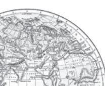

# Unit-III Chapter-4

22 *Fundamentals of Human Geography*

Human activities which generate income are known as *economic activities.* Economic activities are broadly grouped into primary, secondary, tertiary and quaternary activities. Primary activities are directly dependent on environment as these refer to utilisation of earth's resources such as land, water, vegetation, building materials and minerals. It, thus includes, hunting and gathering, pastoral activities, fishing, forestry, agriculture, and mining and quarrying.

> **Why are the inhabitants of coastal and plain regions engaged in fishing and agriculture respectively? What are the physical and social factors which affect the type of primary activities in different regions?**

People engaged in primary activities are called redcollar workers due to the outdoor nature of their work.

# HUNTING AND GATHERING

The earliest human beings depended on their immediate environment for their sustenance. They subsisted on: (a) animals which they hunted; and (b) the edible plants which they gathered from forests in the vicinity.

Primitive societies depended on wild animals. People located in very cold and extremely hot climates survived on hunting. The people in the coastal areas still catch fish though fishing has experienced modernisation due to technological progress. Many species, now have become extinct or endangered due to illegal hunting (poaching). The early hunters used primitive tools made of stones, twigs or arrows so the number of animals killed was limited. Why has hunting been banned in India?

Gathering and hunting are the oldest economic activity known. These are carried out at different levels with different orientations.

Gathering is practised in regions with harsh climatic conditions. It often involves primitive societies, who extract, both plants and animals to satisfy their needs for food, shelter and clothing. This type of activity requires a small amount of capital investment and operates at very low level of technology. The yield per person is very low and little or no surplus is produced.

*Fig. 4.1: Women Gathering Oranges in Mizoram*

Gathering is practised in: (i) high latitude zones which include northern Canada, northern Eurasia and southern Chile; (ii) Low latitude zones such as the Amazon Basin, tropical Africa, Northern fringe of Australia and the interior parts of Southeast Asia (Fig. 4.2).

In modern times some gathering is marketoriented and has become commercial. Gatherers collect valuable plants such as leaves, barks of trees and medicinal plants and after simple processing sell the products in the market. They use various parts of the plants, for example, the bark is used for quinine, tanin extract and cork— leaves supply materials for beverages, drugs, cosmetics, fibres, thatch and fabrics; nuts for food and oils and tree trunk yield rubber, balata, gums and resins.

The name of the part of the chewing gum after the flavour is gone? It is called Chicle — it is made from the milky juice of zapota tree.

Gathering has little chance of becoming important at the global level. Products of such an

*Fig. 4.2: Areas of Subsistence Gathering*

*Primary Activities* 23

activity cannot compete in the world market. Moreover, synthetic products often of better quality and at lower prices, have replaced many items supplied by the gatherers in tropical forests.

## PASTORALISM

At some stage in history, with the realisation that hunting is an unsustainable activity, human beings might have thought of domestication of animals. People living in different climatic conditions selected and domesticated animals found in those regions. Depending on the geographical factors, and technological development, animal rearing today is practised either at the subsistence or at the commercial level.

#### Nomadic Herding

Nomadic herding or pastoral nomadism is a primitive subsistence activity, in which the herders rely on animals for food, clothing, shelter, tools and transport. They move from one place to another along with their livestock, depending on the amount and quality of pastures and water. Each nomadic community occupies a well-identified territory as a matter of tradition.

*Fig. 4.3: Nomads taking their sheep up to the Mountains at the onset of summer*

A wide variety of animals is kept in different regions. In tropical Africa, cattle are the most important livestock, while in Sahara and Asiatic deserts, sheep, goats and camel are reared. In the mountainous areas of Tibet and Andes, yak and llamas and in the Arctic and sub Arctic areas, reindeer are the most important animals.

Pastoral nomadism is associated with three important regions. The core region extends from the Atlantic shores of North Africa eastwards across the Arabian peninsula into Mongolia and Central China. The second region extends over the tundra region of Eurasia. In the southern hemisphere there are small areas in South-west Africa and on the island of Madagascar (Fig. 4.4)

Movement in search of pastures is undertaken either over vast horizontal distances or vertically from one elevation to another in the mountainous regions. The process of migration from plain areas to pastures on mountains during summers and again from mountain pastures to plain areas during winters is known as *transhumance.* In mountain regions, such as Himalayas, Gujjars, Bakarwals, Gaddis and Bhotiyas migrate from plains to the mountains in summers and to the plains from the high altitude pastures in winters. Similarly, in the tundra regions, the nomadic herders move from south to north in summers and from north to south in winters.

The number of pastoral nomads has been decreasing and the areas operated by them shrinking. This is due to (a) imposition of political boundaries; (b) new settlement plans by different countries.

#### Commercial Livestock Rearing

Unlike nomadic herding, commercial livestock rearing is more organised and capital intensive. Commercial livestock ranching is essentially associated with western cultures and is practised on permanent ranches. These ranches cover large areas and are divided into a number of parcels, which are fenced to regulate the grazing. When the grass of one parcel is grazed, animals are moved to another parcel. The number of animals in a pasture is kept according to the carrying capacity of the pasture.

This is a specialised activity in which only one type of animal is reared. Important animals include sheep, cattle, goats and horses. Products such as meat, wool, hides and skin are processed and packed scientifically and exported to different world markets.

Rearing of animals in ranching is organised on a scientific basis. The main

24 *Fundamentals of Human Geography*

*Fig. 4.4: Areas of Nomadic Herding*

*Fig. 4.5: Commercial Livestock Rearing*

Reindeer rearing in the northern regions of Alaska where most of the Eskimos own about two-third of the stock.

emphasis is on breeding, genetic improvement, disease control and health care of the animals.

New Zealand, Australia, Argentina, Uruguay and United States of America are important countries where commercial livestock rearing is practised (Fig. 4.6).

# AGRICUL AGRICULTURE

Agriculture is practised under multiple combinations of physical and socio-economic conditions, which gives rise to different types of agricultural systems.

Based on methods of farming, different types of crops are grown and livestock raised. The following are the main agricultural systems.

### Subsistence Agriculture

Subsistence agriculture is one in which the farming areas consume all, or nearly so, of the products locally grown. It can be grouped in two categories — Primitive Subsistence Agriculture and Intensive Subsistence Agriculture.

### *Primitive Subsistence Agriculture*

Primitive subsistence agriculture or shifting cultivation is widely practised by many tribes in the tropics, especially in Africa, south and central America and south east Asia (Fig. 4.7).

26 *Fundamentals of Human Geography*

The vegetation is usually cleared by fire, and the ashes add to the fertility of the soil. Shifting cultivation is thus, also called slash and burn agriculture. The cultivated patches are very small and cultivation is done with very primitive tools such as sticks and hoes. After sometime (3 to 5 years) the soil looses its fertility and the farmer shifts to another parts and clears other patch of the forest for cultivation. The farmer may return to the earlier patch after sometime. One of the major problems of shifting cultivation is that the cycle of jhum becomes less and less due to loss of fertility in different parcels. It is prevalent in tropical region in different names, e.g. Jhuming Jhuming in North eastern states of India, Milpa in central America and Mexico and Ladang in Indonesia and Malaysia. Find out other areas and the names with which shifting cultivation is done.

#### Intensive Subsistence Agriculture

This type of agriculture is largely found in densely populated regions of monsoon Asia.

Basically, there are two types of intensive subsistence agriculture.

- (i) Intensive subsistence agriculture dominated by wet paddy cultivation: This type of agriculture is characterised by dominance of the rice crop. Land holdings are very small due to the high density of population. Farmers work with the help of family labour leading to intensive use of land. Use of machinery is limited and most of the agricultural operations are done by manual labour. Farm yard manure is used to maintain the fertility of the soil. In this type of agriculture, the yield per unit area is high but per labour productivity is low.
- (ii) Intensive subsistence agriculture dominated by crops other than paddy: Due to the difference in relief, climate, soil and some of the other geographical factors, it is not practical to grow paddy in many parts of monsoon Asia. Wheat, soyabean, barley and sorghum are grown in northern China, Manchuria, North Korea and North Japan. In India wheat is grown in western

Primary Activities

*Fig. 4.9: Rice Transplantation*

parts of the Indo-Gangetic plains and millets are grown in dry parts of western and southern India. Most of the characteristics of this type of agriculture are similar to those dominated by wet paddy except that irrigation is often used.

The Europeans colonised many parts in the world and they introduced some other forms of agriculture such as plantations which were mainly profit-oriented large scale production systems.

#### Plantation Agriculture

Plantation agriculture as mentioned above was introduced by the Europeans in colonies situated in the tropics. Some of the important plantation crops are tea, coffee, cocoa, rubber, cotton, oil palm, sugarcane, bananas and pineapples.

The characteristic features of this type of farming are large estates or plantations, large capital investment, managerial and technical support, scientific methods of cultivation, single crop specialisation, cheap labour, and a good system of transportation which links the estates to the factories and markets for the export of the products.

The French established cocoa and coffee plantations in west Africa. The British set up large tea gardens in India and Sri Lanka, rubber plantations in Malaysia and sugarcane and banana plantations in West Indies. Spanish and Americans invested heavily in coconut and sugarcane plantations in the Philippines. The Dutch once had monopoly over sugarcane plantation in Indonesia. Some coffee fazendas (large plantations) in Brazil are still managed by Europeans.

Today, ownership of the majority of plantations has passed into the hands of the government or the nationals of the countries concerned.

*Fig. 4.10: Tea Plantation*

The slopes of hills are used for tea plantations because of favourable geographical conditions.

#### Extensive Commercial Grain Cultivation

Commercial grain cultivation is practised in the interior parts of semi-arid lands of the midlatitudes. Wheat is the principal crop, though other crops like corn, barley, oats and rye are also grown. The size of the farm is very large, therefore entire operations of cultivation from

ploughing to harvesting are mechanised (Fig. 4.11). There is low yield per acre but high yield per person. Why does this happen?

#### *Fig. 4.11: Mechanised Grain Farming*

Combine crews are capable of harvesting grain over many hectares in a single day.

28 *Fundamentals of Human Geography*

*Fig. 4.12: Areas of Extensive Commercial Grain Farming*

This type of agriculture is best developed in Eurasian steppes, the Canadian and American Prairies, the Pampas of Argentina, the Velds of South Africa, the Australian Downs and the Canterbury Plains of New Zealand. (Locate these areas on the world map).

#### Mixed Farming

This form of agriculture is found in the highly developed parts of the world, e.g. North-western Europe, Eastern North America, parts of Eurasia and the temperate latitudes of Southern continents (Fig. 4.14).

Mixed farms are moderate in size and usually the crops associated with it are wheat, barley, oats, rye, maize, fodder and root crops. Fodder crops are an important component of mixed farming. Crop rotation and intercropping play an important role in maintaining soil fertility. Equal emphasis is laid on crop cultivation and animal husbandry. Animals like cattle, sheep, pigs and poultry provide the main income along with crops.

Mixed farming is characterised by high capital expenditure on farm machinery and building, extensive use of chemical fertilisers and green manures and also by the skill and expertise of the farmers.

### Dairy Farming

Dairy is the most advanced and efficient type of rearing of milch animals. It is highly capital intensive. Animal sheds, storage facilities for fodder, feeding and milching machines add to the cost of dairy farming. Special emphasis is laid on cattle breeding, health care and veterinary services.

*Fig. 4.13: A Dairy Farm in Austria*

*Fig. 4.14: Areas of Mixed Farming*

It is highly labour intensive as it involves rigorous care in feeding and milching. There is no off season during the year as in the case of crop raising.

It is practised mainly near urban and industrial centres which provide neighbourhood market for fresh milk and dairy products. The development of transportation, refrigeration, pasteurisation and other preservation processes have increased the duration of storage of various dairy products.

There are three main regions of commercial dairy farming. The largest is North Western Europe the second is Canada and the third belt includes South Eastern Australia, New Zealand and Tasmania (Fig. 4.16).

#### Mediterranean Agriculture

Mediterranean agriculture is highly specialised commercial agriculture. It is practised in the countries on either side of the Mediterranean

*Fig. 4.15 (a): A vineyard in Switzerland Fig. 4.15 (b): Collection of*

*grapes in a collective farm of Kazakhstan*

30 *Fundamentals of Human Geography*

*Fig. 4.16: Areas of Dairy Farming*

sea in Europe and in north Africa from Tunisia to Atlantic coast, southern California, central Chile, south western parts of South Africa and south and south western parts of Australia. This region is an important supplier of citrus fruits.

Viticulture or grape cultivation is a speciality of the Mediterranean region. Best quality wines in the world with distinctive flavours are produced from high quality grapes in various countries of this region. The inferior grapes are dried into raisins and currants. This region also produces olives and figs. The advantage of Mediterranean agriculture is that more valuable crops such as fruits and vegetables are grown in winters when there is great demand in European and North American markets.

#### Market Gardening and Horticulture

Market gardening and horticulture specialise in the cultivation of high value crops such as vegetables, fruits and flowers, solely for the urban markets. Farms are small and are located where there are good transportation links with the urban centre where high income group of consumers is located. It is both labour and capital intensive and lays emphasis on the use of irrigation, HYV seeds, fertilisers, insecticides, greenhouses and artificial heating in colder regions.

This type of agriculture is well developed in densely populated industrial districts of north west Europe, north eastern United States of America and the Mediterranean regions. The Netherlands specialises in growing flowers and horticultural crops especially tulips, which are flown to all major cities of Europe.

The regions where farmers specialise in vegetables only, the farming is know as truck farming. The distance of truck farms from the market is governed by the distance that a truck can cover overnight, hence the name truck farming.

In addition to market gardening, a modern development in the industrial regions of Western Europe and North America is factory farming. Livestock, particularly poultry and cattle

*Figure 4.17 (a): Vegetables being grown in the vicinity of the city*

rearing, is done in stalls and pens, fed on manufactured feedstuff and carefully supervised against diseases. This requires heavy capital investment in terms of building, machinery for various operations, veterinary services and heating and lighting. One of the important features of poultry farming and cattle rearing is breed selection and scientific breeding.

Types of farming can also be categorised according to the farming organisation. Farming organisation is affected by the way in which farmers own their farms and various policies of the government which help to run these farms.

#### Co-operative Farming

A group of farmers form a co-operative society by pooling in their resources voluntarily for more efficient and profitable farming. Individual farms remain intact and farming is a matter of cooperative initiative.

Co-operative societies help farmers, to procure all important inputs of farming, sell the products at the most favourable terms and help in processing of quality products at cheaper rates.

Co-operative movement originated over a century ago and has been successful in many western European countries like Denmark, Netherlands, Belgium, Sweden, Italy etc. In Denmark, the movement has been so successful that practically every farmer is a member of a co-operative.

*Figure 4.17 (b): Vegetables being loaded into a truck and cycle carts for transporting to city markets*

#### Collective Farming

 The basic principle behind this types of farming is based on social ownership of the means of production and collective labour. Collective farming or the model of Kolkhoz was introduced in erstwhile Soviet Union to improve upon the inefficiency of the previous methods of agriculture and to boost agricultural production for self-sufficiency.

The farmers used to pool in all their resources like land, livestock and labour. However, they were allowed to retain very small plots to grow crops in order to meet their daily requirements.

## MINING

The discovery of minerals in the history of human development, is reflected in many stages in terms of copper age, bronze age and iron age. The use of minerals in ancient times was largely confined to the making of tools, utensils and weapons. The actual development of mining began with the industrial revolution and its importance is continuously increasing.

#### Factors Affecting Mining Activity

The profitability of mining operations thus, depends on two main factors:

- (i) Physical factors include the size, grade and the mode of occurrence of the deposits.
- (ii) Economic factors such as the demand for the mineral, technology available and used, capital to develop infrastructure and the labour and transport costs.

32 *Fundamentals of Human Geography*

*Fig. 4.18: Oil drilling operation in the Gulf of Mexico*

#### Methods of Mining

Depending on the mode of occurrence and the nature of the ore, mining is of two types: surface and underground mining. The surface mining also known as *open-cast* mining is the easiest and the cheapest way of mining minerals that occur close to the surface. Overhead costs such as safety precautions and equipment is relatively low in this method. The output is both large and rapid.

When the ore lies deep below the surface, underground mining method (shaft method)

*Fig. 4.19: Methods of Mining*

has to be used. In this method, vertical shafts have to be sunk, from where underground galleries radiate to reach the minerals. Minerals are extracted and transported to the surface through these passages. It requires specially designed lifts, drills, haulage vehicles, ventilation system for safety and efficient movement of people and material. This method is risky. Poisonous gases, fires, floods and caving in lead to fatal accidents. Have you ever read about mine fires and flooding of coal mines in India?

The developed economies are retreating from mining, processing and refining stages of production due to high labour costs, while the developing countries with large labour force and striving for higher standard of living are becoming more important. Several countries of Africa and few of south America and Asia have over fifty per cent of the earnings from minerals alone.

# EXERCISES

1. Choose the right answer from the four alternatives given below.

- (i) Which one of the following is not a plantation crop?
	- (a) Coffee (c) Wheat
		- (b) Sugarcane (d) Rubber
- (ii) In which one of the following countries co-operative farming was the most successful experiment?
	- (a) Russia (c) India
	- (b) Denmark (d) The Netherlands
- (iii) Growing of flowers is called:
	- (a) Truck farming (c) Mixed farming
	-
	- (b) Factory farming (d) Floriculture
- (iv) Which one of the following types of cultivation was developed by European colonists?
	- (a) Kolkoz (c) Mixed farming
	- (b) Viticulture (d) Plantation
- (v) In which one of the following regions is extensive commercial grain cultivation not practised?
	- (a) American Canadian prairies (c) Pampas of Argentina
	- (b) European Steppes (d) Amazon Basin
- (vi) In which of the following types of agriculture is the farming of citrus fruit very important?
	- (a) Market gardening (c) Mediterranean agriculture
	- (b) Plantation agriculture (d) Co-operative farming
- (vii) Which one type of agriculture amongst the following is also called 'slash and burn agriculture'?
	- (a) Extensive subsistence agriculture
	- (b) Primitive subsistence agriculture
	- (c) Extensive commercial grain cultivation
	- (d) Mixed farming
- (viii) Which one of the following does not follow monoculture?
	- (a) Dairy farming (c) Plantation agriculture
	- (b) Mixed farming (d) Commercial grain farming
- 2. Answer the following questions in about 30 words.
	- (i) Future of shifting cultivation is bleak. Discuss.
	- (ii) Market gardening is practised near urban areas. Why?
	- (iii) Large scale dairy farming is the result of the development of transportation and refrigeration.

34 *Fundamentals of Human Geography*

- 3. Answer the following questions in not more than 150 words.
	- (i) Differentiate between Nomadic Herding and Commercial Livestock Rearing.
	- (ii) Discuss the important characteristic features of plantation agriculture. Name a few important plantation crops from different countries.

# Project/Activity

Visit a nearby village and observe the cultivation of some crops. Ask the farmers and list the various operations.

*Primary Activities* 35

