# Unit-III Chapter-5

# Secondary Activities

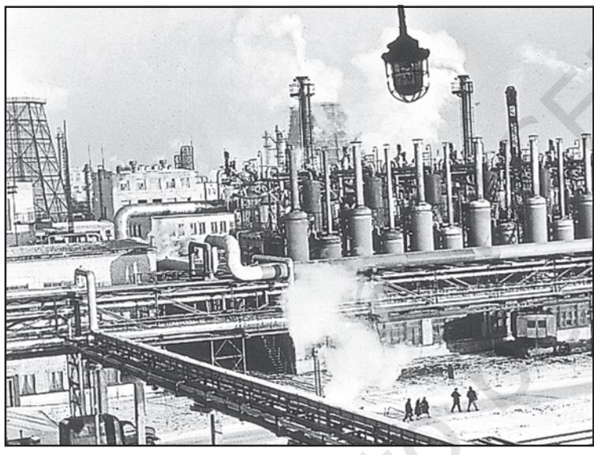

36 *Fundamentals of Human Geography*

All economic activities namely primary, secondary, tertiary and quaternary, revolve around obtaining and utilising resources necessary for survival.

Secondary activities add value to natural resources by *transforming* raw materials into valuable products. Cotton in the boll has limited use but after it is transformed into yarn, becomes more valuable and can be used for making clothes. Iron ore, cannot be used; directly from the mines, but after being converted into steel it gets its value and can be used for making many valuable machines, tools, etc. The same is true of most of the materials from the farm, forest, mine and the sea. Secondary activities, therefore, are concerned with manufacturing, processing and construction (infrastructure) industries.

# MANUFACTURING CTURING

Manufacturing involves a full array of production from handicrafts to moulding iron and steel and stamping out plastic toys to assembling delicate computer components or space vehicles. In each of these processes, the common characteristics are the application of power, mass production of identical products and specialised labour in factory settings for the production of standardised commodities. Manufacturing may be done with modern power and machinery or it may still be very primitive. Most of the Third World countries still 'manufacture' in the literal sense of the term. It is difficult to present a full picture of all the manufacturers in these countries. More emphasis is given to the kind of 'industrial' activity which involves less complicated systems of production.

# Characteristics of Modern Large Scale Manufacturing

Modern large scale manufacturing has the following characteristics:

# *Specialisation of Skills/Methods of Production*

Under the 'craft' method factories produce only a few pieces which are made-to-order. So the costs are high. On the other hand, mass

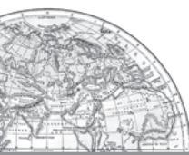

production involves production of large quantities of standardised parts by each worker performing only one task repeatedly.

> **'Manufacturing' Industry and 'Manufacturing Industry'**

Manufacturing literally means *'to make by hand'*. However, now it includes goods 'made by machines'. It is essentially a process which involves *transforming raw materials into finished goods of higher value for sale in local or distant markets*. Conceptually, an industry is a geographically located manufacturing unit maintaining books of accounts and, records under a management system. As the term *industry* is comprehensive, it is also used as synonymous with 'manufacturing' When one uses terms like 'steel industry' and 'chemical industry' one thinks of *factories* and *processes.* But there are many secondary activities which are not carried on in factories such as what is now called the 'entertainment industry' and Tourism industry, etc. So for clarity the longer expression 'manufacturing industry' is used.

# *Mechanisation*

Mechanisation refers to using gadgets which accomplish tasks. Automation (without aid of human thinking during the manufacturing process) is the advanced stage of mechanisation. Automatic factories with feedback and closedloop computer control systems where machines are developed to 'think', have sprung up all over the world.

# *Technological Innovation*

Technological innovations through research and development strategy are an important aspect of modern manufacturing for quality control, eliminating waste and inefficiency, and combating pollution.

#### *Organisational Structure and Stratification*

Modern manufacturing is characterised by:

- (i) a complex machine technology
- (ii) extreme specialisation and division of labour for producing more goods with less effort, and low costs
- (iii) vast capital
- (iv) large organisations
- (v) executive bureaucracy.

#### *Uneven Geographic Distribution*

Major concentrations of modern manufacturing have flourished in a few number of places. These cover less than 10 per cent of the world's land area. These nations have become the centres of economic and political power. However, in terms of the total area covered, manufacturing sites are much less conspicuous and concentrated on much smaller areas than that of agriculture due to greater intensity of processes. For example, 2.5 sq km of the American corn belt usually includes about four large farms employing about 10-20 workers supporting 50-100 persons. But this same area could contain several large integrated factories and employ thousands of workers.

#### **Why do Large-scale Industries choose different locations?**

Industries maximise profits by reducing costs. Therefore, industries should be located at points where the production costs are minimum. Some of the factors influencing industrial locations are as under:

#### *Access to Market*

The existence of a market for manufactured goods is the most important factor in the location of industries. 'Market' means people who have a demand for these goods and also have the purchasing power (ability to purchase) to be able to purchase from the sellers at a place. Remote areas inhabited by a few people offer small markets. The developed regions of Europe, North America, Japan and Australia provide large global markets as the purchasing power of the people is very high. The densely populated regions of South and South-east Asia also

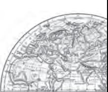

provide large markets. Some industries, such as aircraft manufacturing, have a global market. The arms industry also has global markets.

#### *Access to Raw Material*

Raw material used by industries should be cheap and easy to transport. Industries based on cheap, bulky and weight-losing material (ores) are located close to the sources of raw material such as steel, sugar, and cement industries. Perishability is a vital factor for the industry to be located closer to the source of the raw material. Agro-processing and dairy products are processed close to the sources of farm produce or milk supply respectively.

#### *Access to Labour Supply*

Labour supply is an important factor in the location of industries. Some types of manufacturing still require skilled labour. Increasing mechanisation, automation and flexibility of industrial processes have reduced the dependence of industry upon the labours.

#### *Access to Sources of Energy*

Industries which use more power are located close to the source of the energy supply such as the aluminium industry.

Earlier coal was the main source of energy, today hydroelectricity and petroleum are also important sources of energy for many industries.

#### *Access to Transportation and Communication Facilities*

Speedy and efficient transport facilities to carry raw materials to the factory and to move finished goods to the market are essential for the development of industries. The cost of transport plays an important role in the location of industrial units. Western Europe and eastern North America have a highly developed transport system which has always induced the concentration of industries in these areas. Modern industry is inseparably tied to transportation systems. Improvements in transportation led to integrated economic development and regional specialisation of manufacturing.

38 *Fundamentals of Human Geography*

Communication is also an important need for industries for the exchange and management of information.

#### *Government Policy*

Governments adopt 'regional policies' to promote 'balanced' economic development and hence set up industries in particular areas.

#### *Access to Agglomeration Economies/ Links between Industries*

Many industries benefit from nearness to a leader-industry and other industries. These benefits are termed as agglomeration economies. Savings are derived from the linkages which exist between different industries.

These factors operate together to determine industrial location.

# Foot Loose Industries

Foot loose industries can be located in a wide variety of places. They are not dependent on any specific raw material, weight losing or otherwise. They largely depend on component parts which can be obtained anywhere. They produce in small quantity and also employ a small labour force. These are generally not polluting industries. The important factor in their location is accessibility by road network.

# Classification of Manufacturing Industries

Manufacturing industries are classified on the basis of their size, inputs/raw materials, output/products and ownership (Fig. 5.1).

#### *Industries based on Size*

The amount of capital invested, number of workers employed and volume of production determine the size of industry. Accordingly, industries may be classified into household or cottage, small-scale and large-scale.

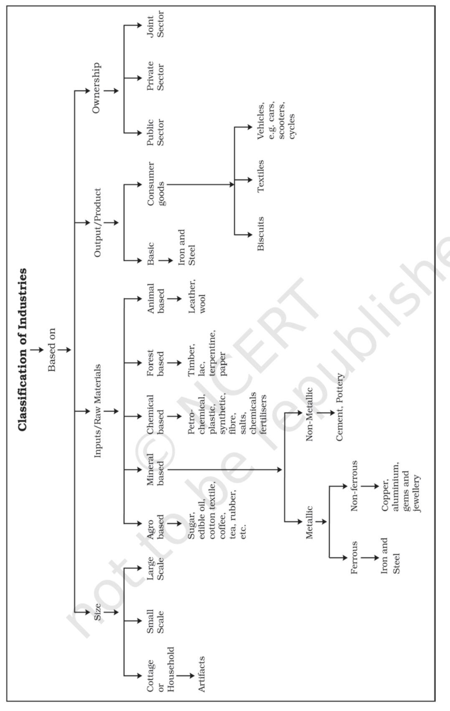

*Fig. 5.1 : Classification of Industries*

*Secondary Activities* 39

# HOUSEHOLD INDUSTRIES OR COTTAGE MANUFACTURING CTURING

It is the smallest manufacturing unit. The artisans use local raw materials and simple tools to produce everyday goods in their homes with the help of their family members or parttime labour. Finished products may be for consumption in the same household or, for sale in local (village) markets, or, for barter. Capital and transportation do not wield much influence as this type of manufacturing has low commercial significance and most of the tools are devised locally.

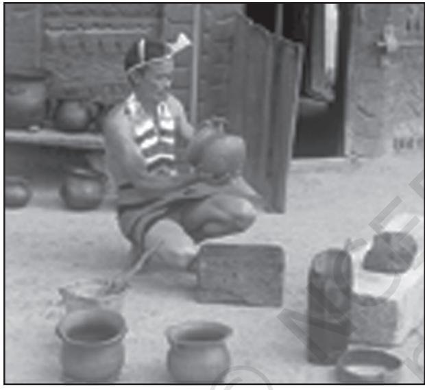

*Fig. 5.2 (a) : A man making pots in his courtyardexample of household industry in Nagaland*

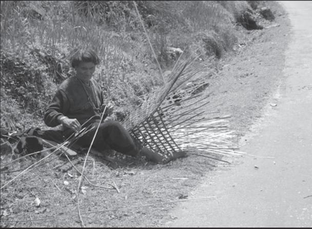

*Fig. 5.2 (b) : A man weaving a bamboo basket by the roadside in Arunachal Pradesh*

40 *Fundamentals of Human Geography*

Some common everyday products produced in this sector of manufacturing include foodstuffs, fabrics, mats, containers, tools, furniture, shoes, and figurines from wood lot and forest, shoes, thongs and other articles from leather; pottery and bricks from clays and stones. Goldsmiths make jewellery of gold, silver and bronze. Some artefacts and crafts are made out of bamboo, wood obtained locally from the forests.

# Small Scale Manufacturing

Small scale manufacturing is distinguished from household industries by its production techniques and place of manufacture (a workshop outside the home/cottage of the producer). This type of manufacturing uses local raw material, simple power -driven machines and semi-skilled labour. It provides employment and raises local purchasing power. Therefore, countries like India, China, Indonesia and Brazil, etc. have developed labour-intensive small scale manufacturing in order to provide employment to their population.

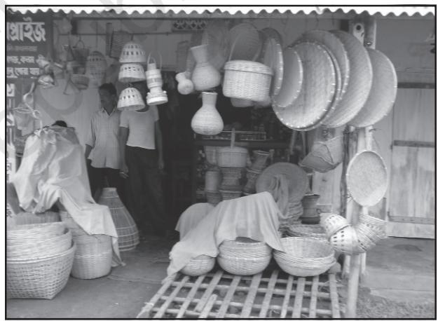

*Fig. 5.3: Products of cottage industry on sale in Assam*

# Large Scale Manufacturing

Large scale manufacturing involves a large market, various raw materials, enormous energy, specialised workers, advanced technology, assembly-line mass production and large capital. This kind of manufacturing developed in the last 200 years, in the United Kingdom, north-eastern U.S.A. and Europe. Now it has diffused to almost all over the world.

On the basis of the system of large scale manufacturing, the world's major industrial regions may be grouped under two broad types, namely

- (i) traditional large-scale industrial regions which are thickly clustered in a few more developed countries.
- (ii) high-technology large scale industrial regions which have diffused to less developed countries.

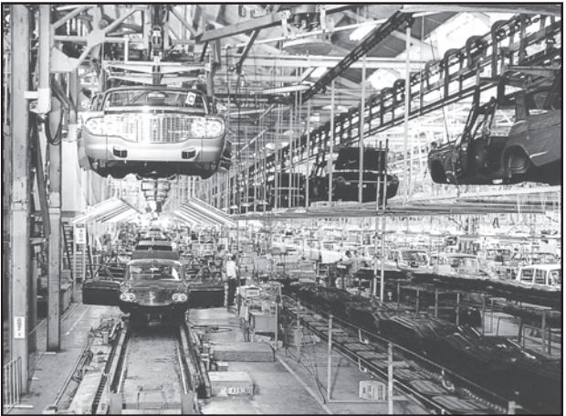

*Fig. 5.4 : Passenger car assembly hires at a plant of the Motor Company in Japan*

# Industries based on Inputs/Raw Materials

On the basis of the raw materials used, the industries are classified as: (a) agro-based; (b) mineral based; (c) chemical based; (d) forest based: and (e) animal based.

# (a) *Agro based Industries*

Agro processing involves the processing of raw materials from the field and the farm into finished products for rural and urban markets. Major agro-processing industries are food processing, sugar, pickles, fruits juices, beverages (tea, coffee and cocoa), spices and oils fats and textiles (cotton, jute, silk), rubber, etc.

#### *Food Processing*

Agro processing includes canning, producing cream, fruit processing and confectionery. While some preserving techniques, such as drying, fermenting and pickling, have been known since ancient times, these had limited applications to cater to the pre-Industrial Revolution demands.

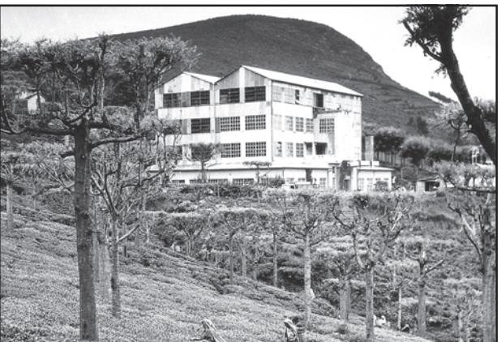

*Fig. 5.5: Tea Garden and a Tea Factory in the Nilgiri Hills of Tamil Nadu*

Agri-business is commercial farming on an industrial scale often financed by business whose main interests lie outside agriculture, for example, large corporations in tea plantation business. Agri-business farms are mechanised, large in size, highly structured, reliant on chemicals, and may be described as 'agro-factories'.

# (b) *Mineral based Industries*

These industries use minerals as a raw material. Some industries use ferrous metallic minerals which contain ferrous (iron), such as iron and steel industries but some use non-ferrous metallic minerals, such as aluminium, copper and jewellery industries. Many industries use non-metallic minerals such as cement and pottery industries.

#### (c) *Chemical based Industries*

Such industries use natural chemical minerals, e.g. mineral-oil (petroleum) is used in petrochemical industry. Salts, sulphur and potash industries also use natural minerals. Chemical industries are also based on raw materials obtained from wood and coal. Synthetic fibre, plastic, etc. are other examples of chemical based industries.

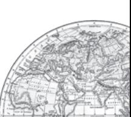

#### *(d) Forest based Raw Material using Industries*

The forests provide many major and minor products which are used as raw material. Timber for furniture industry, wood, bamboo and grass for paper industry, lac for lac industries come from forests.

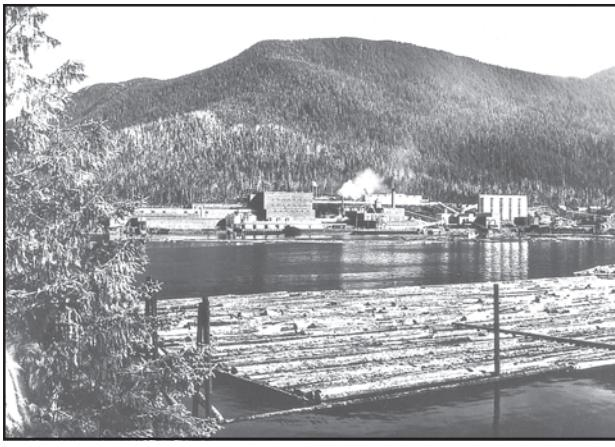

*Fig. 5.6: A pulp mill in the heart of the Ketchikan's timber area of Alaska*

#### *(e) Animal based Industries*

Leather for leather industry and wool for woollen textiles are obtained from animals. Besides, ivory is also obtained from elephant's tusks.

# Industries Based On Output/Product

You have seen some machines and tools made of iron or steel. The raw material for such machines and tools is iron and steel. Which is itself an industry. The industry whose products are used to make other goods by using them as raw materials are basic industries. Can you identify the links? Iron/steel machines for textile industry clothes for use by consumers.

The consumer goods industries produced goods which are consumed by consumers directly. For example, industries producing breads and biscuits, tea, soaps and toiletries, paper for writing, televisions, etc. are consumer goods or non-basic industries.

# INDUSTRIES BASED ON OWNERSHIP

- (a) Public Sector Industries are owned and managed by governments. In India, there were a number of Public Sector Undertakings (PSUs). Socialist countries have many state owned industries. Mixed economies have both Public and Private sector enterprises.
- (b) Private Sector Industries are owned by individual investors. These are managed by private organisations. In capitalist countries, industries are generally owned privately.
- (c) Joint Sector Industries are managed by joint stock companies or sometimes the private and public sectors together establish and manage the industries. Can you make a list of such industries?

# Concept of High Technology Industry

High technology, or simply high-tech, is the latest generation of manufacturing activities. It is best understood as the application of intensive research and development (R and D) efforts leading to the manufacture of products of an advanced scientific and engineering character. Professional (white collar) workers make up a large share of the total workforce. These highly skilled specialists greatly outnumber the actual production (blue collar) workers. Robotics on the assembly line, computer -aided design (CAD) and manufacturing, electronic controls of smelting and refining processes, and the constant development of new chemical and pharmaceutical products are notable examples of a high-tech industry.

Neatly spaced, low, modern, dispersed, office-plant-lab buildings rather than massive assembly structures, factories and storage areas mark the high-tech industrial landscape. Planned business parks for high-tech start-ups have become part of regional and local development schemes.

High-tech industries which are regionally concentrated, self-sustained and highly specialised are called technopolies.

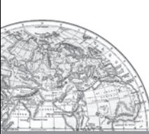

42 *Fundamentals of Human Geography*

The Silicon Valley near San Francisco and Silicon Forest near Seattle are examples of technopolies. Are some technopolies developing in India?

Manufacturing contributes significantly to the world economy. Iron and steel, textiles, automobiles, petrochemicals and electronics are some of the world's most important manufacturing industries.

# EXERCISES

1. Choose the right answer from the four alternatives given below.

- (i) Which one of the following statements is wrong?
	- (a) Cheap water transport has facilitated the jute mill industry along the Hugli.
	- (b) Sugar, cotton textiles and vegetable oils are footloose industries.
	- (c) The development of hydro-electricity and petroleum reduced, to a great extent, the importance of coal energy as a locational factor for industry.
	- (d) Port towns in India have attracted industries.
- (ii) In which one of the following types of economy are the factors of production owned individually ?
	- (a) Capitalist (c) Socialist
	- (b) Mixed (d) None
- (iii) Which one of the following types of industries produces raw materials for other industries?
	- (a) Cottage Industries (c) Basic Industries
	- (b) Small-scale Industries (d) Footloose Industries
- (iv) Which one of the following pairs is correctly matched ?
	- (a) Automobile industry … Los Angeles
	- (b) Shipbuilding industry … Lusaka
	- (c) Aircraft industry … Florence
- 2. Write a short note on the following in about 30 words.
	- (i) High-Tech industry
	- (ii) Manufacturing
	- (iii) Footloose industries
- 3. Answer the following in not more than 150 words.
	- (i) Differentiate between primary and secondary activities.
	- (ii) Discuss the major trends of modern industrial activities especially in the developed countries of the world.
	- (iii) Explain why high-tech industries in many countries are being attracted to the peripheral areas of major metropolitan centres.
	- (iv) Africa has immense natural resources and yet it is industrially the most backward continent. Comment.

- (i) Carry out a survey in your school premises of the factory-made goods used by students and the staff.
- (ii) Find out the meaning of the terms bio-degradable and nonbiodegradable. Which kind of material is better to use? Why?
- (iii) Look around and make a list of the global brands, their logos and products.

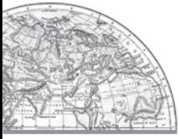

