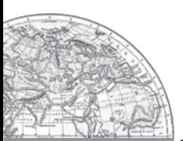

# Tertiary and Quaternary Activities

When you fall ill you go to your family doctor or you call a doctor. Sometimes your parents take you to a hospital for treatment. While in school, you are taught by your teachers. In the event of any dispute, legal opinion is obtained from a lawyer. Likewise, there are many professionals who provide their services against payment of their fee. Thus, all types of services are special skills provided in exchange of payments. Health, education, law, governance and recreation etc. require professional skills. These services require other theoretical knowledge and practical training. Tertiary activities are related to the service sector. Manpower is an important component of the service sector as most of the tertiary activities are performed by skilled labour, professionally trained experts and consultants.

In the initial stages of economic development, larger proportion of people worked in the primary sector. In a developed economy, the majority of workers get employment in tertiary activity and a moderate proportion is employed in the secondary sector.

Tertiary activities include both production and exchange. The production involves the 'provision' of services that are 'consumed'. The output is indirectly measured in terms of wages and salaries. Exchange, involves trade, transport and communication facilities that are used to overcome distance. Tertiary activities, therefore, involve the commercial output of services rather than the production of tangible goods. They are not directly involved in the processing of physical raw materials. Common examples are the work of a plumber, electrician, technician, launderer, barber, shopkeeper, driver, cashier, teacher, doctor, lawyer and publisher etc. The main difference between secondary activities and tertiary activities is that the expertise provided by services relies more heavily on specialised skills, experience and knowledge of the workers rather than on the production techniques, machinery and factory processes.

# TYPES OF TERTIARY ACTIVITIES

By now you know that you purchase your books, stationery from traders shop, travel by

46 *Fundamentals of Human Geography*

bus or rail, send letters, talk on telephone and obtain services of teachers for studies and doctors at the time of illness.

Thus, trade, transport, communication and services are some of the tertiary activities discussed in this section. The chart provides the basis for classifying the tertiary activities.

#### Trade and commerce

Trade is essentially buying and selling of items produced elsewhere. All the services in retail and wholesale trading or commerce are specifically intended for profit. The towns and cities where all these works take place are known us trading centres.

The rise of trading from barter at the local level to money-exchange of international scale has produced many centres and institutions such as trading centres or collection and distribution points.

Trading centres may be divided into rural and urban marketing centres.

*Rural marketing centres* cater to nearby settlements. These are quasi-urban centres. They serve as trading centres of the most rudimentary type. Here personal and professional services are not well-developed. These form local collecting and distributing centres. Most of these have *mandis (*wholesale markets) and also retailing areas. They are not urban centres *per se* but are significant centres for making available goods and services which are most frequently demanded by rural folk.

*Periodic markets in rural areas* are found where there are no regular markets and local periodic markets are organised at different temporal intervals. These may be weekly, biweekly markets from where people from the surrounding areas meet their temporally accumulated demand. These markets are held on specified dates and move from one place to another. The shopkeepers thus, remain busy on all the days while a large area is served by them.

*Urban marketing centres* have more widely specialised urban services. They provide ordinary goods and services as well as many of the specialised goods and services required by people. Urban centres, therefore, offer manufactured goods as well as many specialised markets develop, e.g. markets for labour, housing, semi or finished products. Services of educational institutions and professionals such as teachers, lawyers, consultants, physicians, dentists and veterinary doctors are available.

*Fig. 6.2: A Wholesale Vegetable Market*

*Fig. 6.3: Packed Food Market in U.S.A.*

#### *Retail Trading*

This is the business activity concerned with the sale of goods directly to the consumers. Most of the retail trading takes place in fixed establishments or stores solely devoted to selling. Street peddling, handcarts, trucks, door-to-door, mail-order, telephone, automatic vending machines and internet are examples of non-store retail trading.

### More on Stores

**Consumer cooperatives** were the first of the large-scale innovations in retailing.

**Departmental stores** delegate the responsibility and authority to departmental heads for purchasing of commodities and for overseeing the sale in different sections of the stores.

**Chain stores** are able to purchase merchandise most economically, often going so far as to direct the goods to be manufactured to their specification. They employ highly skilled specialists in many executive tasks. They have the ability to experiment in one store and apply the results to many.

#### *Wholesale Trading*

Wholesale trading constitutes bulk business through numerous intermediary merchants and supply houses and not through retail stores. Some large stores including chain stores are able to buy directly from the manufacturers. However, most retail stores procure supplies from an intermediary source. Wholesalers often extend credit to retail stores to such an extent that the retailer operates very largely on the wholesaler's capital.

#### Transport

Transport is a service or facility by which people, materials and manufactured goods are physically carried from one location to another. It is an organised industry created to satisfy man's basic need of mobility. Modern society requires speedy and efficient transport systems to assist in the production, distribution and consumption of goods. At every stage in this complex system, the value of the material is significantly enhanced by transportation.

Transport distance can be measured as: km distance or actual distance of route length; time distance or the time taken to travel on a

48 *Fundamentals of Human Geography*

particular route; and cost distance or the expense of travelling on a route. In selecting the mode of transport, distance, in terms of time or cost, is the determining factor. Isochrone lines are drawn on a map to join places equal in terms of the time taken to reach them.

#### Network and Accessibility

As transport systems develop, different places are linked together to form a **network.** Networks are made up of nodes and links. A **node** is the meeting point of two or more routes, a point of origin, a point of destination or any sizeable town along a route, Every road that joins two nodes is called a **link.** A developed network has many links, which means that places are well-connected.

#### *Factors Affecting Transport*

Demand for transport is influenced by the size of population. The larger the population size, the greater is the demand for transport.

Routes depend on: location of cities, towns, villages, industrial centres and raw materials, pattern of trade between them, nature of the landscape between them,type of climate, and funds available for overcoming obstacles along the length of the route.

#### Communication

Communication services involve the transmission of words and messages, facts and ideas*.* The invention of writing preserved messages and helped to make communication dependent on means of transport. These were actually carried by hand, animals, boat, road, rail and air. That is why all forms of transport are also referred to as lines of communication. Where the transport network is efficient, communications are easily disseminated. Certain developments, such as mobile telephony and satellites, have made communications independent of transport. All forms are not fully disassociated because of the cheapness of the older systems. Thus, very

large volumes of mail continue to be handled by post offices all over the world.

Some of the communication services are discussed below.

#### *Telecommunications*

The use of telecommunications is linked to the development of modern technology. It has revolutionised communications because of the speed with which messages are sent. The time reduced is from weeks to minutes. Besides, the recent advancements like mobile telephony have made communications direct and instantaneous at any time and from anywhere. The telegraph, morse code and telex have almost become things of the past.

Radio and television also help to relay news, pictures, and telephone calls to vast audiences around the world and hence they are termed as mass media. They are vital for advertising and entertainment. Newspapers are able to cover events in all corners of the world. Satellite communication relays information of the earth and from space. The internet has truly revolutionised the global communication system .

#### Services

Services occur at many different levels. Some are geared to industry, some to people, and some to both industry and people, e.g. the transport systems. Low-order services, such as grocery shops and laundries, are more common and widespread than high-order services or more specialised ones like those of accountants, consultants and physicians. Services are provided to individual consumers who can afford to pay for them. For example, the gardener, the launderers and the barber do primarily physical labour. Teacher, lawyers, physicians, musicians and others perform mental labour.

 Many services have now been regulated. Making and maintaining highways and bridges, maintaining fire fighting departments and supplying or supervising education and customer -care are among the important services most often supervised or performed by governments or companies. State and union

legislation have established corporations to supervise and control the marketing of such services as transport, telecommunication, energy and water supply. Professional services are primarily health care, engineering, law and management. The location of recreational and entertainment services depends on the market. Multiplexes and restaurants might find location within or near the Central Business District (CBD), whereas a golf course would choose a site where land costs are lower than in the CBD.

Personal services are made available to the people to facilitate their work in daily life. The workers migrate from rural areas in search of employment and are unskilled. They are employed in domestic services as housekeepers, cooks, and gardeners. This segment of workers is generally unorganised. One such example in India is Mumbai's *dabbawala* (Tiffin) service provided to about 1,75,000 customers all over the city.

*Fig. 6.4: Dabbawala Service in Mumbai*

# PEOPLE ENGAGED IN GED IN TERTIARY ACTIVITIES

Today most people are service workers. Services are provided in all societies. But in more developed countries a higher percentage of workers is employed in providing services as compared to less developed countries. The trend in employment in this sector has been

*Tertiary and Quaternary Activities* 49

increasing while it has remained unchanged or decreasing in the primary and secondary activities.

# SOME SELECTED EXAMPLES

#### *Tourism*

Tourism is travel undertaken for purposes of recreation rather than business. It has become the world's single largest tertiary activity in total registered jobs (250 million) and total revenue (40 per cent of the total GDP). Besides, many local persons, are employed to provide services like accommodation, meals, transport, entertainment and special shops serving the tourists. Tourism fosters the growth of infrastructure industries, retail trading, and craft industries (souvenirs). In some regions, tourism is seasonal because the vacation period is dependent on favourable weather conditions, but many regions attract visitors all the year round.

*Fig. 6.5: Tourists skiing in the snow capped mountain slopes of Switzerland*

#### *Tourist Regions*

The warmer places around the Mediterranean Coast and the West Coast of India are some of the popular tourist destinations in the world. Others include winter sports regions, found mainly in mountainous areas, and various scenic landscapes and national parks, which are scattered. Historic towns also attract tourists, because of the monument, heritage sites and cultural activities.

#### *Tourist Attractions*

*Climate:* Most people from colder regions expect to have warm, sunny weather for beach holidays. This is one of the main reasons for the importance of tourism in Southern Europe and the Mediterranean lands. The Mediterranean climate offers almost consistently higher temperatures, than in other parts of Europe, long hours of sunshine and low rainfall throughout the peak holiday season. People taking winter holidays have specific climatic requirements, either higher temperatures than their own homelands, or snow cover suitable for skiing.

*Landscape:* Many people like to spend their holidays in an attractive environment, which often means mountains, lakes, spectacular sea coasts and landscapes not completely altered by man.

*History and Art:* The history and art of an area have potential attractiveness. People visit ancient or picturesque towns and archaeological sites, and enjoy exploring castles, palaces and churches.

*Culture and Economy:* These attract tourists with a penchant for experiencing ethnic and local customs. Besides, if a region provides for the needs of tourists at a cheap cost, it is likely to become very popular. Home-stay has emerged as a profitable business such as *heritage homes* in Goa, Madikere and Coorg in Karnataka.

#### Medical Services for Overseas Patients in India

About 55,000 patients from U.S.A. visited India in 2005 for treatment. This is still a small number compared with the millions of surgeries performed each year in the U.S. healthcare system. India has emerged as the leading country of medical tourism in the world. World class hospitals located in metropolitan cities cater to patients all over the world. Medical tourism brings abundant benefits to developing countries like India, Thailand, Singapore and Malaysia. Beyond medical tourism, is the trend

of outsourcing of medical tests and data interpretation. Hospitals in India, Switzerland and Australia have been performing certain medical services – ranging from reading radiology images, to interpreting Magnetic Resonance Images (MRIs) and ultrasound tests. Outsourcing holds tremendous advantages for patients, if it is focused on improving quality or providing specialised care.

#### Medical Tourism

When medical treatment is combined with international tourism activity, it lends itself to what is commonly known as medical tourism.

# QUATERNARY ACTIVITIES

What do a CEO of an MNC in Copenhagen, at New York and a medical transcriptionist at Bangalore have in common? All these people work in a segment of the service sector that is knowledge oriented. This sector can be divided into quaternary and quinary activities.

Quaternary activities involve some of the following: the collection, production and dissemination of information or even the production of information. Quaternary activities centre around research, development and may be seen as an advanced form of services involving specialised knowledge and technical skills.

> The Quaternary Sector The Quaternary Sector along with the Tertiary Sector has replaced most of the primary and secondary employment as the basis for economic growth. Over half of all workers In developed economies are in the 'Knowledge Sector' and there has been a very high growth in demand for and consumption of informationbased services from mutual fund managers to tax consultants, software developers and statisticians. Personnel working in office buildings, elementary schools and university classrooms, hospitals and doctors' offices, theatres, accounting and brokerage firms all belong to this category of services.

> Like some of the tertiary functions, quaternary activities can also be outsourced. They are not tied to resources, affected by the environment, or necessarily localised by market.

## QUINARY ACTIVITIES

The highest level of decision makers or policy makers perform quinary activities. These are subtly different from the knowledge based industries that the quinary sector in general deals with.

> Quinary activities are services that focus on the creation, re-arrangement and interpretation of new and existing ideas; data interpretation and the use and evaluation of new technologies. Often referred to as 'gold collar' professions, they represent another subdivision of the tertiary sector representing special and highly paid skills of senior business executives, government officials, research scientists, financial and legal consultants, etc. Their importance in the structure of advanced economies far outweighs their numbers.

Outsourcing has resulted in the opening up of a large number of call centres in India, China, Eastern Europe, Israel, Philippines and Costa Rica. It has created new jobs in these countries. Outsourcing is coming to those countries where cheap and skilled workers are available. These are also outmigrating countries. With the work available though outsourcing, the migration in these countries may come down. Outsourcing countries are facing resistance from jobseeking youths in their respective countries. The comparative advantage is the main reason for continuing outsourcing. New trends in quinary services include knowledge processing outsourcing (KPO) and 'home shoring', the latter as an alternative to outsourcing. The KPO industry is distinct from Business Process Outsourcing (BPO) as it involves highly skilled workers. It is information driven knowledge outsourcing. KPO enables companies to create additional business opportunities. Examples of KPOs include research and development (R and D) activities, e-learning, business research, intellectual property (IP) research, legal profession and the banking sector.

# Outsourcing

Outsourcing or contracting out is giving work to an outside agency to improve efficiency and to reduce costs. When outsourcing involves transferring work to overseas locations, it is described by the term off shoring, although both off - shoring and outsourcing are used together. Business activities that are outsourced include information technology (IT), human resources, customer support and call centre services and at times also manufacturing and engineering.

Data processing is an IT related service easily be carried out in Asian, East European and African countries, In these countries IT skilled staff with good English language skills are available at lower wages than those in the developed countries. Thus, a company in Hyderabad or Manila does work on a project based on GIS techniques for a country like U.S.A or Japan. Overhead costs are also much lower making it profitable to get job-work carried out overseas, whether it is in India, China or even a less populous country like Botswana in Africa.

Describe the nature of work against each colour-name

| Colour of the collar | Nature of work |
| --- | --- |
| Red | ? |
| Gold | ? |
| White | ? |
| Grey | ? |
| Blue | ? |
| Pink | ? |

# THE DIGITHE DIGIT HE DIGITAL DIVIDE

Opportunities emerging from the Information and Communication Technology based development is unevenly distributed across the globe. There are wide ranging economic, political and social differences among countries. How quickly countries can provide ICT access and benefits to its citizens is the deciding factor. While developed countries in general have surged forward, the developing countries have lagged behind and this is known as the digital divide. Similarly digital divides exist within countries. For example, in a large country like India or Russia, it is inevitable that certain areas like metropolitan centres possess better connectivity and access to the digital world versus peripheral rural areas.

52 *Fundamentals of Human Geography*

# EXERCISES

- 1. Choose the right answer from the four alternatives given below.
	- (i) Which one of the following is a tertiary activity?
		- (a) Farming (c) Weaving
		- (b) Trading (d) Hunting
	- (ii) Which one of the following activities is NOT a secondary sector activity?
		- (a) Iron Smelting (c) Making garments
		- (b) Catching fish (d) Basket Weaving
	- (iii) Which one of the following sectors provides most of the employment in Delhi, Mumbai, Chennai and Kolkata.
		- (a) Primary (c) Secondary
		- (b) Quaternary (d) Service
	- (iv) Jobs that involve high degrees and level of innovations are known as:
		- (a) Secondary activities (c) Quinary activities
		- (b) Quaternary activities (d) Primary activities
	- (v) Which one of the following activities is related to quaternary sector?
		- (a) Manufacturing computers (c) University teaching
		- (b) Paper and Raw pulp production (d) Printing books
	- (vi) Which one out of the following statements is not true?
		- (a) Outsourcing reduces costs and increases efficiency.
		- (b) At times engineering and manufacturing jobs can also be outsourced.
		- (c) BPOs have better business opportunities as compared to KPOs.
		- (d) There may be dissatisfaction among job seekers in the countries that outsource the job.
- 2. Answer the following questions in about 30 words.
	- (i) Explain retail trading service.
	- (ii) Describe quaternary services.
	- (iii) Name the fast emerging countries of medical tourism in the world.
	- (iv) What is digital divide?

3. Answer the following questions in not more than 150 words.

- (i) Discuss the significance and growth of the service sector in modern economic development.
- (ii) Explain in detail the significance of transport and communication services.

# Project/Activity

- (i) Find out the activities of BPO.
- (ii) Find out from a travel agent the documents you need to travel abroad.

*Tertiary and Quaternary Activities* 53

