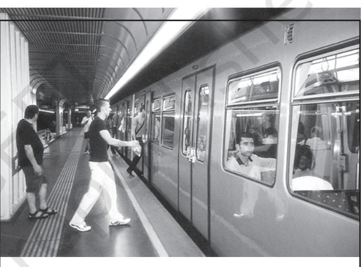

## Unit-III Chapter-7

# Transport and Communication

54 *Fundamentals of Human Geography*

Natural resources, economic activities and markets are rarely found in one place. Transport, communication and trade establish links between producing centres and consuming centres. The system of mass production and exchange is complex. Each region produces the items for which it is best suited. Trade or the exchange of such commodities relies on transportation and communication. Likewise, the high living standards and quality of life depend on efficient transportation, communications and trade. In earlier days, the means of transport and communication were the same. But today both have acquired distinct and specialised forms. Transport provides the network of links and carriers through which trade takes place.

## TRANSPORT

Transport is a service or facility for the carriage of persons and goods from one place to the other using humans, animals and different kinds of vehicles. Such movements take place over land, water and air. Roads and railways form part of land transport; while shipping and waterways and airways are the other two modes. Pipelines carry materials like petroleum, natural gas, and ores in liquidified form.

 Moreover, transportation is an organised service industry created to satisfy the basic needs of society. It includes transport arteries, vehicles to carry people and goods, and the organisation to maintain arteries, and to handle loading, unloading and delivery. Every nation has developed various kinds of transportation for defence purposes. Assured and speedy transportation, along with efficient communication, promote cooperation and unity among scattered peoples.

What is a Transport Network ?

Several places (nodes) joined together by a series of routes (links) to form a pattern.

## MODES OF TRANSPORTATION

The principal modes of world transportation, as already mentioned are land, water, air and pipelines. These are used for inter-regional and intra-regional transport, and each one (except pipelines) carries both passengers and freight. The significance of a mode depends on the type of goods and services to be transported, costs of transport and the mode available. International movement of goods is handled by ocean freighters. Road transport is cheaper and faster over short distances and for door-todoor services. Railways are most suited for large volumes of bulky materials over long distances within a country. High-value, light and perishable goods are best moved by airways. In a well-managed transport system, these various modes complement each other.

## Land Transport

Most of the movement of goods and services takes place over land. In early days, humans themselves were carriers. Have you ever seen a bride being carried on a palanquin *(palki/doli)* by four persons (*Kahars* in north India). Later animals were used as beasts of burden. Have you seen mules, horses and camels, carrying loads of cargo in rural areas? With the invention of the wheel, the use of carts and wagons became important. The revolution in transport came about only after the invention of the steam engine in the eighteenth century. Perhaps the first public railway line was opened in 1825 between Stockton and Darlington in northern England and then onwards, railways became the most popular and fastest form of transport in the nineteenth century. It opened up continental interiors for commercial grain farming, mining and manufacturing in U.S.A. The invention of the internal combustion engine revolutionised road transport in terms of road quality and vehicles (motor cars and trucks) plying over them. Among the newer developments in land transportation are pipelines, ropeways and cableways. Liquids like mineral oil, water, sludge and sewers are transported by pipelines. The great freight carriers are the railways, ocean vessels, barges, boats and motor trucks and pipelines.

In general, the old and elementary forms like the human porter, pack animal, cart or wagon are the most expensive means of

*Fig. 7.1: Ropeway and Cable cars in Austria*

This means of transport is usually found on steep mountain slopes and mines which are not suitable for building roads.

transportation and large freighters are the cheapest. They are important in supplementing modern channels and carriers which penetrate the interiors in large countries. In the densely populated districts of India and China, overland transport still takes place by human porters or carts drawn or pushed by humans.

## Pack Animals

 **Horses** are used as a draught animal even in the Western countries. **Dogs** and **reindeer** are used in North America, North Europe and Siberia to draw sledges over snow-covered ground. **Mules** are preferred in the mountainous regions; while **camels** are used for caravan movement in deserts. In India, **bullocks** are used for pulling carts.

*Fig. 7.2: A horse cart in a village Tefki, in Ethiopia*

*Transport and Communication* 55

#### Roads

Road transport is the most economical for short distances compared to railways. Freight transport by road is gaining importance because it offers door-to-door service. But unmetalled roads, though simple in construction, are not effective and serviceable for all seasons. During the rainy season these become unmotorable and even the metalled ones are seriously handicapped during heavy rains and floods. In such conditions, the high embankment of rail-tracks and the efficient maintenance of railway transport service, is an effective solution. But the rail kilometrage being small cannot serve the needs of vast and developing countries at a low cost. Roads, therefore, play a vital role in a nation's trade and commerce and for promoting tourism.

The quality of the roads varies greatly between developed and developing countries because road construction and maintenance require heavy expenditure. In developed countries good quality roads are universal and provide long-distance links in the form of motorways, autobahns (Germany), and inter– state highways for speedy movement. Lorries, of increasing size and power to carry heavy loads, are common. But unfortunately, the world's road system is not well developed.

The world's total motorable road length is only about 15 million km, of which North America accounts for 33 per cent. The highest road density and the highest number of vehicles are registered in this continent compared to Western Europe.

Traffic Flows: Traffic on roads has increased dramatically in recent years. When the road network cannot cope with the demands of traffic, congestion occurs. City roads suffer from chronic traffic congestion. Peaks (high points) and troughs (low points) of traffic flow can be seen on roads at particular times of the day, for example, peaks occurring during the rush hour before and after work. Most of the cities in the world have been facing the problem of congestion.

Think on these lines for a better tomorrow . . . URBAN TRANSPORT SOLUTIONS Higher Parking Fee Mass Rapid Transit (MRT) Improved Public Bus Service Expressways

#### Highways

Highways are metalled roads connecting distant places. They are constructed in a manner for unobstructed vehicular movement. As such these are 80 m wide, with separate traffic lanes, bridges, flyovers and dual carriageways to facilitate uninterrupted traffic flow. In developed countries, every city and port town is linked through highways.

*Fig. 7.3 : Dharmavaram Tuni National Highway, India*

In North America, highway density is high, about 0.65 km per sq km. Every place is within 20 km distance from a highway. Cities located on the Pacific coast (west) are well-connected with those of the Atlantic Coast (east). Likewise, the cities of Canada in the north are linked with those of Mexico in the south. The Trans-

Canadian Highway links Vancouver in British Columbia(west coast) to St. John's City in Newfoundland (east coast) and the Alaskan Highway links Edmonton (Canada) to Anchorage (Alaska).

The Pan-American Highway, a large portion of which has been constructed, will connect the countries of South America, Central America and U.S.A.-Canada. The Trans-Continental Stuart Highway connects Darwin (north coast) and Melbourne via Tennant Creek and Alice Springs in Australia.

Europe has a large number of vehicles and a well-developed highway network. But highways face a lot of competition from railways and waterways.

In Russia, a dense highway network is developed in the industrialised region west of the Urals with Moscow as the hub. The important Moscow-Vladivostok Highway serves the region to the east. Due to the vast geographical area, highways in Russia are not as important as railways.

In China, highways criss-cross the country connecting all major cities such as Tsungtso (near Vietnam boundary), Shanghai (central China), Guangzhou (south) and Beijing (north). A new highway links Chengdu with Lhasa in Tibet.

In India, there are many highways linking the major towns and cities. The Golden Quadrilateral (GQ) or Super Expressway is underway to connect the four metropolitan cities — New Delhi, Mumbai, Chennai and Kolkata.

In Africa, a highway joins Algiers in the north to Conakry in Guinea. Similarly, Cairo is also connected to Cape Town.

#### Border Roads

Roads laid along international boundaries are called border roads. They play an important role in integrating people in remote areas with major cities and providing defence. Almost all countries have such roads to transport goods to border villages and military camps.

#### Railways

Railways are a mode of land transport for bulky goods and passengers over long distances. The railway gauges vary in different countries and are roughly classified as broad (more than 1.5 m), standard (1.44 m), metre gauge (1 m) and smaller gauges. The standard gauge is used in the U.K.

Commuter trains are very popular in U.K., U.S.A, Japan and India. These carry millions of passengers daily to and fro in the city. There are about 13 lakh km of railways open for traffic in the world.

*Fig. 7.4: Tube Train in Vienna*

Europe has one of the most dense rail networks in the world. There are about 4,40,000 km of railways, most of which is double or multiple-tracked. Belgium has the highest density of 1 km of railway for every 6.5 sq kms area. The industrial regions exhibit some of the highest densities in the world. The important rail heads are London, Paris, Brussels, Milan, Berlin and Warsaw. Passenger transport is more important than freight in many of these countries. Underground railways are important in London and Paris. Channel Tunnel, operated by Euro Tunnel Group through England, connects London with Paris. Trans-continental railway lines have now lost

their importance to quicker and more flexible transport systems of airways and roadways.

In Russia, railways account for about 90 per cent of the country's total transport with a very dense network west of the Urals. Moscow is the most important rail head with major lines radiating to different parts of the country's vast geographical area. Underground railways and commuter trains are also important in Moscow.

North America has one of the most extensive rail networks accounting for nearly 40 per cent of the world's total? In contrast to many European countries, the railways are used more for long-distance bulky freight like ores, grains, timber and machinery than for passengers. The most dense rail network is found in the highly industrialised and urbanised region of East Central U.S.A. and adjoining Canada.

In Canada, railways are in the public sector and distributed all over the sparsely populated areas. The transcontinental railways carry the bulk of wheat and coal tonnage.

Australia has about 40,000 km of railways, of which 25 per cent are found in New South Wales alone. The west-east Australian National Railway line runs across the country from Perth to Sydney. New Zealand's railways are mainly in the North Island to serve the farming areas.

In South America, the rail network is the most dense in two regions, namely, the Pampas of Argentina and the coffee growing region of Brazil which together account for 40 per cent of South America's total route length. Only Chile, among the remaining countries has a considerable route length linking coastal centres with the mining sites in the interior. Peru, Bolivia, Ecuador, Colombia and Venezuela have short single-track rail-lines from ports to the interior with no inter-connecting links.

There is only one trans-continental rail route linking Buenos Aires (Argentina) with Valparaiso (Chile) across the Andes Mountains through the Uspallatta Pass located at a height of 3,900 m.

In Asia, rail network is the most dense in the thickly populated areas of Japan, China and India. Other countries have relatively few rail routes. West Asia is the least developed in rail facilities because of vast deserts and sparsely populated regions.

Africa continent, despite being the second largest, has only 40,000 km of railways with South Africa alone accounting for 18,000 km due to the concentration of gold, diamond and copper mining activities. The important routes of the continent are: (i) the Benguela Railway through Angola to Katanga-Zambia Copper Belt; (ii) the Tanzania Railway from the Zambian Copper Belt to Dar-es-Salaam on the coast; (iii) the Railway through Botswana and Zimbabwe linking the landlocked states to the South African network; and (iv) the Blue Train from Cape Town to Pretoria in the Republic of South Africa. Elsewhere, as in Algeria, Senegal, Nigeria, Kenya and Ethiopia, railway lines connect port cities to interior centres but do not form a good network with other countries.

#### Trans–Continental Railways

 Trans–continental railways run across the continent and link its two ends. They were constructed for economic and political reasons to facilitate long runs in different directions. The following are the most important of these:

#### Trans–Siberian Railway

This is a trans–siberian Railways major rail route of Russia runs from St. Petersburg in the west to Vladivostok on the Pacific Coast in the east passing through Moscow, Ufa, Novosibirsk, Irkutsk, Chita and Khabarovsk. It is the most important route in Asia and the longest (9,332 km)

double-tracked and electrified trans– continental railway in the world. It has helped in opening up its Asian region to West European markets. It runs across the Ural Mountains Ob and Yenisei rivers Chita is an important agrocentre and Irkutsk, a fur centre. There are connecting links to the south, namely, to Odessa (Ukraine), Baku on the Caspian Coast, Tashkent (Uzbekistan), Ulan Bator (Mongolia), and Shenyang (Mukden) and Beijing in China.

#### Trans–Canadian Railways

This 7,050 km long rail-line in Canada runs from Halifax in the east to Vancouver on the Pacific Coast passing through Montreal, Ottawa, Winnipeg and Calgary (Fig. 7.6). It was constructed in 1886, initially as part of an agreement to make British Columbia on the west coast join the Federation of States. Later on, it

gained economic significance because it connected the Quebec-Montreal Industrial Region with the wheat belt of the Prairie Region and the Coniferous Forest region in the north. Thus each of these regions became complementary to the other. A loop line from Winnipeg to Thunder Bay (Lake Superior) connects this rail-line with one of the important waterways of the world. This line is the economic artery of Canada. Wheat and meat are the important exports on this route.

#### The Union and Pacific Railway

This rail-line connects New York on the Atlantic Coast to San Francisco on the Pacific Coast passing through Cleveland, Chicago, Omaha, Evans, Ogden and Sacramento. The most valuable exports on this route are ores, grain, paper, chemicals and machinery.

Fig. 7.5: Trans–Siberian Railway

Transport and Communication

59

*Fig. 7.6: Trans–Canadian Railway*

## The Australian Trans–Continental Railway

This rail-line runs west-east across the southern part of the continent from Perth on the west coast, to Sydney on the east coast. passing through Kalgoorlie, Broken Hill and Port Augusta (Fig. 7.7).

Another major north-south line connects Adelaide and Alice Spring and to be joined further to the Darwin–Birdum line.

#### The Orient Express

This line runs from Paris to Istanbul passing through Strasbourg, Munich, Vienna, Budapest and Belgrade. The journey time from London to Istanbul by this Express is now reduced to 96 hours as against 10 days by the sea-route. The chief exports on this rail-route

are cheese, bacon, oats, wine, fruits, and machinery.

There is a proposal to build a Trans–Asiatic Railway linking Istanbul with Bangkok via Iran, Pakistan, India, Bangladesh and Myanmar.

## WATER TRANSPORT

One of the great advantages of water transportation is that it does not require route construction. The oceans are linked with each other and are negotiable with ships of various sizes. All that is needed is to provide port facilities at the two ends. It is much cheaper because the friction of water is far less than that of land. The energy cost of water transportation is lower. Water transport is divided into sea routes and inland waterways.

60 *Fundamentals of Human Geography*

Fig. 7.7: Australian Trans–Continental Railway

Fig. 7.8: The view of Seine River from the Eiffel Tower (One can see how the river has become an important Inland waterway)

## Sea Routes

The oceans offer a smooth highway traversable in all directions with no maintenance costs. Its transformation into a routeway by sea-going vessels is an important development in human adaptation to the physical environment. Compared to land and air, ocean transport is a cheaper means of haulage (carrying of load) of bulky material over long distances from one continent to another.

Modern passenger liners (ships) and cargo ships are equipped with radar, wireless and other navigation aids. The development of refrigerated chambers for perishable goods, tankers and specialised ships has also improved cargo transport. The use of containers has made cargo handling at the world's major ports easier.

## Important Sea Routes

Major sea routes are shown in the Fig. 7.9. Some important routes have been discussed in the following pages.

#### The Northern Atlantic Sea Route

This links North-eastern U.S.A. and Northwestern Europe, the two industrially developed

61

*Fig. 7.9: Major Sea Routes and Sea Ports*

regions of the world. The foreign trade over this route is greater than that of the rest of the world combined. One fourth of the world's foreign trade moves on this route. It is, therefore, the busiest in the world and otherwise, called the Big Trunk Route. Both the coasts have highly advanced ports and harbour facilities.

Find out some of the important ports on the coast of U.S.A. and Western Europe in your atlas.

#### *The Mediterranean–Indian Ocean Sea Route*

This sea route passes through the heart of the Old World and serves more countries and people than any other route. Port Said, Aden, Mumbai, Colombo and Singapore are some of the important ports on this route. The construction of Suez Canal has greatly reduced the distance and time as compared to the earlier route through the Cape of Good Hope, which was longer than the route through Suez Canal.

#### *The Cape of Good Hope Sea Route*

This trade route connects the highly industrialised Western European region with West Africa, South Africa, South-east Asia and the commercial agriculture and livestock economies of Australia and New Zealand. The volume of trade and traffic between both East and West Africa is on the increase due to the development of the rich natural resources such as gold, diamond, copper, tin, groundnut, oil palm, coffee and fruits.

#### *The Southern Atlantic Sea Route*

This sea route is another important one across the Atlantic Ocean which connects West European and West African countries with Brazil, Argentina and Uruguay in South America. The traffic is far less on this route because of the limited development and population in South America and Africa. Only southeastern Brazil and Plata estuary and parts of South Africa have large-scale industries. There is also little traffic on the route between Rio de Janeiro and Cape Town because both South America and Africa have similar products and resources.

62 *Fundamentals of Human Geography*

#### *The North Pacific Sea Route*

Trade across the vast North Pacific Ocean moves by several routes which converge at Honolulu. The direct route on the Great Circle links Vancouver and Yokohama and reduces the travelling distance (2,480 km) by half.

This sea route links the ports on the westcoast of North America with those of Asia. These are Vancouver, Seattle, Portland, San Francisco and Los Angeles on the American side and Yokohama, Kobe, Shanghai, Hong Kong, Manila and Singapore on the Asian side.

#### *The South Pacific Sea Route*

This sea route connects Western Europe and North America with Australia, New Zealand and the scattered Pacific islands via the Panama Canal. This route is also used for reaching Hong Kong, Philippines and Indonesia. The distance covered between Panama and Sydney is 12,000 km. Honolulu is an important port on this route.

#### *Coastal Shipping*

It is obvious that water transport is a cheaper mode. While oceanic routes connect different countries, coastal shipping is a convenient mode of transportation with long coastlines, e.g. U.S.A, China and India. Shenzhen States in Europe are most suitably placed for coastal shipping connecting one member's coast with the other. If properly developed, coastal shipping can reduce the congestion on the land routes.

#### *Shipping Canals*

The Suez and the Panama Canals are two vital man-made navigation canals or waterways which serve as gateways of commerce for both the eastern and western worlds.

#### *The Suez Canal*

This canal had been constructed in 1869 in Egypt between Port Said in the north and Port Suez in the south linking the Mediterranean Sea and the Red Sea. It gives Europe a new gateway to the Indian Ocean and reduces direct sea-route distance between Liverpool and Colombo compared to the Cape of Good Hope route. It is a sea-level canal without locks which is about 160 km and 11 to 15 m deep. About 100 ships travel daily and each ship takes 10-12 hours to cross this canal. The tolls are so heavy that some find it cheaper to go by the longer Cape Route whenever the consequent delay is not important. A railway follows the canal to Suez, and from Ismailia there is a branch line to Cairo. A navigable fresh-water canal from the Nile also joins the Suez Canal in Ismailia to supply fresh-water to Port Said and Suez.

*Fig. 7.10 : Suez Canal*

#### *The Panama Canal*

This canal connects the Atlantic Ocean in the east to the Pacific Ocean in the west. It has been constructed across the Panama Isthmus between Panama City and Colon by the U.S. government which purchased 8 km of area on either side and named it the Canal Zone*.* The Canal is about 72 km. long and involves a very

*Fig. 7.11 : The Panama Canal*

64 *Fundamentals of Human Geography*

deep cutting for a length of 12 km. It has a sixlock system and ships cross the different levels (26 m up and down) through these locks before entering the Gulf of Panama.

It shortens the distance between New York and San Francisco by 13,000 km by sea. Likewise the distance between Western Europe and the West-coast of U.S.A.; and North-eastern and Central U.S.A. and East and South-east Asia is shortened. The economic significance of this Canal is relatively less than that of the Suez. However, it is vital to the economies of Latin America.

#### Inland Waterways

Rivers, canals, lakes and coastal areas have been important waterways since time immemorial. Boats and steamers are used as means of transport for cargo and passengers. The development of inland waterways is dependent on the navigability width and depth of the channel, continuity in the water flow, and transport technology in use. Rivers are the only means of transport in dense forests. Very heavy cargo like coal, cement, timber and metallic ores can be transported through inland waterways. In ancient times, riverways were the main highways of transportation as in the case of India. But they lost importance because of competition from railways, lack of water due to diversion for irrigation, and their poor maintenance.

*Fig. 7.12: Inland waterways are a major source of transport wherever the river is wide, deep and free of silt*

The significance of rivers as inland waterways for domestic and international transport and trade has been recognised throughout the developed world. Despite inherent limitations, many rivers have been modified to enhance their navigability by dredging, stabilising river banks, and building dams and barrages for regulating the flow of water. The following river waterways are some of the world's important highways of commerce.

### The Rhine Waterways

The Rhine flows through Germany and the Netherlands. It is navigable for 700 km from Rotterdam, at its mouth in the Netherlands to Basel in Switzerland. Ocean-going vessels can reach up to Cologne. The Ruhr river joins the Rhine from the east. It flows through a rich coalfield and the whole basin has become a prosperous manufacturing area. Dusseldorf is the Rhine port for this region. Huge tonnage moves along the stretch south of the Ruhr. This waterway is the world's most heavily used. Each year more than 20,000 ocean-going ships and 2,00,000 inland vessels exchange their cargoes. It connects the industrial areas of Switzerland, Germany, France, Belgium and the Netherlands with the North Atlantic Sea Route.

*Fig. 7.13: The Rhine Waterway*

#### *The Danube Waterway*

This important inland waterway serves Eastern Europe. The Danube river rises in the Black Forest and flows eastwards through many countries. It is navigable up to Taurna Severin. The chief export items are wheat, maize, timber, and machinery.

#### *The Volga Waterway*

Russia has a large number of developed waterways, of which the Volga is one of the most important. It provides a navigable waterway of 11,200 km and drains into the Caspian Sea. The Volga-Moscow Canal connects it with the Moscow region and the Volga-Don Canal with the Black Sea.

#### *The Great Lakes – St. Lawrence Seaway*

The Great Lakes of North America Superior, Huron Erie and Ontario are connected by Soo Canal and Welland Canal to form an inland waterway. The estuary of St. Lawrence River, along with the Great Lakes, forms a unique commercial waterway in the northern part of North America. The ports on this route like Duluth and Buffalo are equipped with all facilities of ocean ports. As such large oceangoing vessels are able to navigate up the river deep inside the continent to Montreal. But here goods have to be trans-shipped to smaller vessels due to the presence of rapids. Canals have been constructed up to 3.5 m deep to avoid these.

#### *The Mississippi Waterways*

The Mississippi-Ohio waterway connects the interior part of U.S.A. with the Gulf of Mexico in the south. Large steamers can go through this route up to Minneapolis.

## AIR TRANSPORT

Air transport is the fastest means of transportation, but it is very costly. Being fast, it is preferred by passengers for long-distance travel. Valuable cargo can be moved rapidly on a world-wide scale. It is often the only means to reach inaccessible areas. Air transport has brought about a connectivity revolution in the world. The frictions created by mountainous snow fields or inhospitable desert terrains have been overcome. The accessibility has increased. The airplane brings varied articles to the Eskimos in Northern Canada unhindered by the frozen ground. In the Himalayan region, the routes are often obstructed due to landslides, avalanches or heavy snow fall. At such times, air travel is the only alternative to reach a place. Airways also have great strategic importance. The air strikes by U.S. and British forces in Iraq bears testimony to this fact. The airways network is expanding very fast.

#### *Fig. 7.15: An Aeroplane at Salsburg Airport*

The manufacturing of aircrafts and their operations require elaborate infrastructure like hangars, landing, fuelling, and maintenance facilities for the aircrafts. The construction of airports is also very expensive and has developed more in highly industrialised countries where there is a large volume of traffic.

At present no place in the world is more than 35 hours away. This startling fact has been made possible due to people who build and fly airplanes. Travel by air can now be measured by hours and minutes instead of years and months. Frequent air services are available to many parts of the world. Although, U.K. pioneered the use of commercial jet transport, U.S.A. developed largely post-War international civil aviation. Today, more than 250 commercial airlines offer regular services to different parts of the world. Recent developments can change the future course of air transport. Supersonic aircraft, cover the distance between London and New York within three and a half hours.

## Inter-Continental Air Routes

In the Northern Hemisphere, there is a distinct east-west belt of inter-continental air routes. Dense network exists in Eastern U.S.A., Western Europe and Southeast Asia. U.S.A. alone accounts for 60 per cent of the airways of the world. New York, London, Paris, Amsterdam, Frankfurt Rome, Moscow, Karachi, New Delhi, Mumbai, Bangkok, Singapore, Tokyo, San Francisco, Los Angeles and Chicago are the nodal points where air routes converge or radiate to all continents.

Africa, Asiatic part of Russia and South America lack air services. There are limited air services between 10-35 latitudes in the Southern hemisphere due to sparser population, limited landmass and economic development.

## PIPELINES

Pipelines are used extensively to transport liquids and gases such as water, petroleum and natural gas for an uninterrupted flow. Water supplied through pipelines is familiar to all. Cooking gas or LPG is supplied through pipelines in many parts of the world. Pipelines can also be used to transport liquidified coal. In New Zealand, milk is being supplied through pipelines from farms to factories.

In U.S.A. there is a dense network of oil pipelines from the producing areas to the

*Fig. 7.16: Major Airports*

consuming areas. Big Inch is one such famous pipeline, which carries petroleum from the oil wells of the Gulf of Mexico to the North-eastern States. About 17 per cent of all freight per tonne-km. is carried through pipelines in U.S.A.

*Fig. 7.17: Pipelines transporting natural gas in Ukraine*

In Europe, Russia, West Asia and India pipelines are used to connect oil wells to refineries, and to ports or domestic markets. Turkmenistan is central Asia has extended pipelines to Iran and also to parts of China.

 The proposed Iran-India via Pakistan international oil and natural gas pipeline will be the longest in the world.

## COMMUNICATIONS

Human beings have used different methods long-distance communications of which the telegraph and the telephone were important. The telegraph was instrumental in the colonisation of the American West. During the early and mid-twentieth century, the American Telegraph and Telephone Company (AT&T) enjoyed a monopoly over U.S.A.'s telephone industry. In fact, the telephone became a critical factor in the urbanisation of America. Firms centralised their functioning at cityheadquarters and located their branch offices in smaller towns. Even today, the telephone is the most commonly used mode. In developing countries, the use of cell phones, made possible by satellites, is important for rural connectivity.

Today there is a phenomenal pace of development. The first major breakthrough is the use of optic fiber cables (OFC). Faced with mounting competition, telephone companies all

over the world soon upgraded their copper cable systems to include optic fiber cables. These allow large quantities of data to be transmitted rapidly, securely, and are virtually error-free. With the digitisation of information in the 1990s, telecommunication slowly merged with computers to form integrated networks termed as Internet.

#### Satellite Communication

Today Internet is the largest electronic network on the planet connecting about 1,000 million people in more than 100 countries.

> Satellites touch human lives in many ways. Every time you use a cell phone to call a friend, send an SMS or watch a popular programme on cable television. You are using satellite communication.

Communication through satellites emerged as a new area in communication technology since the 1970s after U.S.A. and former U.S.S.R. pioneered space research. Artificial satellites, now, are successfully deployed in the earth's orbit to connect even the remote corners of the globe with limited onsite verification. These have rendered the unit cost and time of communication invariant in terms of distance. This means it costs the same to communicate over 500 km as it does over 5,000 km via satellite.

India has also made great strides in satellite development. Aryabhatt was launched on 19 April 1979, Bhaskar-I in 1979 and Rohini in 1980. On 18 June 1981, APPLE (Arian Passenger Payload Experiment) was launched through Arian rocket. Bhaskar, Challenger and INSAT I-B have made longdistance communication, television and radio very effective. Today weather forecasting through television is a boon.

## Cyber Space – Internet

Cyberspace is the world of electronic computerised space. It is encompassed by the Internet such as the World Wide Web (www). In simple words, it is the electronic digital world for communicating or accessing information over computer networks without physical movement of the sender and the receiver... It is also referred to as the Internet. Cyberspace exists everywhere. It may be in an office, sailing boat, flying plane and virtually anywhere.

The speed at which this electronic network has spread is unprecedented in human history. There were less than 50 million Internet users in 1995, about 400 million in 2000 A.D. and over two billion in 2010. In the last few years there has been a shift among global users from U.S.A. to the developing countries. The percentage share of U.S.A. has dropped from 66 in 1995 to only 25 in 2005. Now the majority of the world's users are in U.S.A., U.K., Germany, Japan, China and India.

 As billions use the Internet each year, cyberspace will expand the contemporary economic and social space of humans through e-mail, e-commerce, e-learning and e-governance. Internet together with fax, television and radio will be accessible to more and more people cutting across place and time. It is these modern communication systems, more than transportation, that has made the concept of global village a reality.

## EXERCISES

- 1. Choose the right answer from the four alternatives given below.
	- (i) The Trans–Continental Stuart Highway runs between
		- (a) Darwin and Melbourne
		- (b) Edmonton and Anchorage
		- (c) Vancouver and St. John's City
		- (d) Chengdu and Lhasa
	- (ii) Which country has the highest density of railway network?
		- (a) Brazil (c) Canada
		- (b) U.S.A (d) Russia
	- (iii) The Big Trunk Route runs through
		- (a) The Mediterranean Indian ocean
		- (b) The North Atlantic Ocean
		- (c) The South Atlantic Ocean
		- (d) The North Pacific Ocean
	- (iv) The Big Inch pipeline transports
		- (a) Milk (c) Water
		- (b) Liquid petroleum gas (LGP) (d) Petroleum
	- (v) Which one pair of the following places is linked by Channel Tunnel?
		- (a) London Berlin (c) Berlin Paris
		- (b) Paris London (d) Barcelona Berlin
- 2. Answer the following questions in about 30 words.
	- (i) What are the problems of road transport in mountainous, desert and flood prone regions?
	- (ii) What is a trans–continental railway?
	- (iii) What are the advantages of water transport?
- 3. Answer the following questions in not more than 150 words.
	- (i) Elucidate the statement– "In a well managed transport system, various modes complement each other".
	- (ii) Which are the major regions of the world having a dense network of airways.
	- (iii) What are the modes by which cyber space will expand the contemporary economic and social space of humans.

*Transport and Communication* 69

