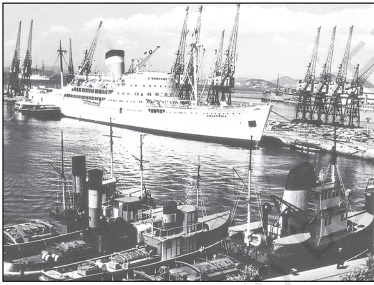
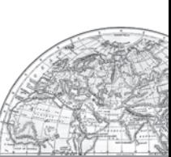

# Unit-III Chapter-8

# International Trade

70 *Fundamentals of Human Geography*

You are already familiar with the term "trade" as a tertiary activity which you have studied in Chapter 7 of this book. You know that trade means the voluntary exchange of goods and services. Two parties are required to trade. One person sells and the other purchases. In certain places, people barter their goods. For both the parties trade is mutually beneficial.

Trade may be conducted at two levels: international and national. International trade is the exchange of goods and services among countries across national boundaries. Countries need to trade to obtain commodities, they cannot produce themselves or they can purchase elsewhere at a lower price.

The initial form of trade in primitive societies was the barter system, where direct exchange of goods took place. In this system if you were a potter and were in need of a plumber, you would have to look for a plumber who would be in need of pots and you could exchange your pots for his plumbing service.

*Fig. 8.1: Two women practising barter system in Jon Beel Mela*

Every January after the harvest season Jon Beel Mela takes place in Jagiroad, 35 km away from Guwahati and it is possibly the only fair In India, where barter system is still alive. A big market is organised during this fair and people from various tribes and communities exchange their products.

The difficulties of barter system were overcome by the introduction of money. In the olden times, before paper and coin currency came into being, rare objects with very high intrinsic value served as money, like, flintstones, obsidian, *cowrie* shells, tiger's paws, whale's teeth, dogs teeth, skins, furs, cattle, rice, peppercorns, salt, small tools, copper, silver and gold.

The word salary comes from the Latin word Salarium which means payment by salt. As in those times producing salt from sea water was unknown and could only be made from rock salt which was rare and expensive. That is why it became a mode of payment.

## HISTORY OF INTERNATIONAL TRADE

In ancient times, transporting goods over long distances was risky, hence trade was restricted to local markets. People then spent most of their resources on basic necessities – food and clothes. Only the rich people bought jewellery, costly dresses and this resulted in trade of luxury items.

The Silk Route is an early example of long distance trade connecting Rome to China – along the 6,000 km route. The traders transported Chinese silk, Roman wool and precious metals and many other high value commodities from intermediate points in India, Persia and Central Asia.

After the disintegration of the Roman Empire, European commerce grew during twelfth and thirteenth century with the development of ocean going warships trade between Europe and Asia grew and the Americas were discovered.

Fifteenth century onwards, the European colonialism began and along with trade of exotic commodities, a new form of trade emerged which was called slave trade. The Portuguese, Dutch, Spaniards, and British captured African natives and forcefully transported them to the newly discovered Americas for their labour in the plantations. Slave trade was a lucrative business for more than two hundred years till it was abolished in Denmark in 1792, Great Britain in 1807 and United States in 1808.

*Figure 8.2 : Advertisement for Slave Auction, 1829*

This American slave auction advertised slaves for sale or temporary hire by their owners. Buyers often paid as much as $2,000 for a skilled, healthy slave. Such auctions often separated family members from one another, many of whom never saw their loved ones again.

After the Industrial Revolution the demand for raw materials like grains, meat, wool also expanded, but their monetary value declined in relation to the manufactured goods.

The industrialised nations imported primary products as raw materials and exported the value added finished products back to the non-industrialised nations.

In the later half of the nineteenth century, regions producing primary goods were no more important, and industrial nations became each other's principle customers.

During the World Wars I and II, countries imposed trade taxes and quantitative restrictions for the first time. During the postwar period, organisations like General Agreement for Tariffs and Trade (which later became the World Trade Organisation), helped in reducing tariff.

### Why Does International Trade Exist?

International trade is the result of specialisation in production. It benefits the world economy if

different countries practise specialisation and division of labour in the production of commodities or provision of services. Each kind of specialisation can give rise to trade. Thus, international trade is based on the principle of comparative advantage, complimentarity and transferability of goods and services and in principle, should be mutually beneficial to the trading partners.

In modern times, trade is the basis of the world's economic organisation and is related to the foreign policy of nations. With welldeveloped transportation and communication systems, no country is willing to forego the benefits derived from participation in international trade.

### Basis of International Trade

- (i) *Difference in national resources:* The world's national resources are unevenly distributed because of differences in their physical make up i.e. geology, relief soil and climate.
	- (a) *Geological structure:* It determines the mineral resource base and topographical differences ensure diversity of crops and animals raised. Lowlands have greater agricultural potential. Mountains attract tourists and promote tourism.
	- (b) *Mineral resources:* They are unevenly distributed the world over. The availability of mineral resources provides the basis for industrial development.
	- (c) *Climate:* It influences the type of flora and fauna that can survive in a given region. It also ensures diversity in the range of various products, e.g. wool production can take place in cold regions, bananas, rubber and cocoa can grow in tropical regions.
- (ii) *Population factors*: The size, distribution and diversity of people between countries affect the type and volume of goods traded.
	- (a) *Cultural factors:* Distinctive forms of art and craft develop in certain

cultures which are valued the world over, e.g. China produces the finest porcelains and brocades. Carpets of Iran are famous while North African leather work and Indonesian batik cloth are prized handicrafts.

- (b) *Size of population:* Densely populated countries have large volume of internal trade but little external trade because most of the agricultural and industrial production is consumed in the local markets. Standard of living of the population determines the demand for better quality imported products because with low standard of living only a few people can afford to buy costly imported goods.
- (iii) *Stage of economic development:* At different stages of economic development of countries, the nature of items traded undergo changes. In agriculturally important countries, agro products are exchanged for manufactured goods whereas industrialised nations export machinery and finished products and import food grains and other raw materials.
- (iv) *Extent of foreign investment:* Foreign investment can boost trade in developing countries which lack in capital required for the development of mining, oil drilling, heavy engineering, lumbering and plantation agriculture. By developing such capital intensive industries in developing countries, the industrial nations ensure import of food stuffs, minerals and create markets for their finished products. This entire cycle steps up the volume of trade between nations.
- (v) *Transport:* In olden times, lack of adequate and efficient means of transport restricted trade to local areas. Only high value items, e.g. gems, silk and spices were traded over long distances. With expansions of rail, ocean and air transport, better means of refrigeration and preservation, trade has experienced spatial expansion.

### Balance of Trade

Balance of trade records the volume of goods and services imported as well as exported by a country to other countries. If the value of imports is more than the value of a country's exports, the country has negative or unfavourable balance of trade. If the value of exports is more than the value of imports, then the country has a positive or favourable balance of trade.

Balance of trade and balance of payments have serious implications for a country's economy. A negative balance would mean that the country spends more on buying goods than it can earn by selling its goods. This would ultimately lead to exhaustion of its financial reserves.

### Types of International Trade

International trade may be categorised into two types:

- (a) Bilateral trade: Bilateral trade is done by two countries with each other. They enter into agreement to trade specified commodities amongst them. For example, country A may agree to trade some raw material with agreement to purchase some other specified item to country B or vice versa.
- (b) Multi-lateral trade: As the term suggests multi-lateral trade is conducted with many trading countries. The same country can trade with a number of other countries. The country may also grant the status of the "Most Favoured Nation" (MFN) on some of the trading partners.

### Case for Free Trade

The act of opening up economies for trading is known as free trade or trade liberalisation. This is done by bringing down trade barriers like tariffs. Trade liberalisation allows goods and services from everywhere to compete with domestic products and services.

Globalisation along with free trade can adversely affect the economies of developing countries by not giving equal playing field by imposing conditions which are unfavourable. With the development of transport and communication systems goods and services can travel faster and farther than ever before. But free trade should not only let rich countries enter the markets, but allow the developed countries to keep their own markets protected from foreign products.

Countries also need to be cautious about dumped goods; as along with free trade dumped goods of cheaper prices can harm the domestic producers.

Dumping Dumping

The practice of selling a commodity in two countries at a price that differs for reasons not related to costs is called dumping.

Think of some reasons why dumping is becoming a serious concern among trading nations?

### World Trade Organisation

In1948, to liberalise the world from high customs tariffs and various other types of restrictions, General Agreement for Tariffs and Trade (GATT) was formed by some countries. In 1994, it was decided by the member countries to set up a permanent institution for looking after the promotion of free and fair trade amongst nation and the GATT was transformed into the World Trade Organisation from 1st January 1995.

WTO is the only international organisation dealing with the global rules of trade between nations. It sets the rules for the global trading system and resolves disputes between its member nations. WTO also covers trade in services, such as telecommunication and banking, and others issues such as intellectual rights.

The WTO has however been criticised and opposed by those who are worried about the effects of free trade and economic globalisation. It is argued that free trade does not make ordinary people's lives more prosperous. It is actually widening the gulf between rich and poor by making rich countries more rich. This is because the influential nations in the WTO focus on their own commercial interests. Moreover, many developed countries have not fully opened their markets to products from developing countries. It is also argued that issues of health, worker's rights, child labour and environment are ignored.

WTO Headquarters are located in Geneva, Switzerland.

164 countries were members of WTO as on December 2016.

India has been one of the founder member of WTO.

### Regional Trade Blocs

Regional Trade Blocs have come up in order to encourage trade between countries with geographical proximity, similarity and complementarities in trading items and to curb restrictions on trade of the developing world. Today, 120 regional trade blocs generate 52 per cent of the world trade. These trading blocs developed as a response to the failure of the global organisations to speed up intra-regional trade.

Though, these regional blocs remove trade tariffs within the member nations and encourage free trade, in the future it could get increasingly difficult for free trade to take place between different trading blocs.

### Concerns Related to International Trade

Undertaking international trade is mutually beneficial to nations if it leads to regional specialisation, higher level of production, better standard of living, worldwide availability of goods and services, equalisation of prices and wages and diffusion of knowledge and culture.

International trade can prove to be detrimental to nations of it leads to dependence on other countries, uneven levels of development, exploitation, and commercial rivalry leading to wars. Global trade affects many aspects of life; it can impact everything from the environment to health and well-being of the people around the world. As countries compete to trade more, production and the use of natural resources spiral up, resources get used up faster than they can be replenished. As a result, marine life is also depleting fast, forests are being cut down and river basins sold off to private drinking water companies. Multinational corporations trading in oil, gas mining, pharmaceuticals and agri-business keep expanding their operations at all costs creating more pollution – their mode of work does not follow the norms of sustainable development. If organisations are geared only towards profit making, and environmental and health concerns are not addressed, then it could lead to serious implications in the future.

74 *Fundamentals of Human Geography*

### GATEWAYS OF INTERNATIONAL TRADE

### Ports

The chief gateways of the world of international trade are the harbours and ports. Cargoes and travellers pass from one part of the world to another through these ports.

The ports provide facilities of docking, loading, unloading and the storage facilities for cargo. In order to provide these facilities, the port authorities make arrangements for maintaining navigable channels, arranging tugs and barges, and providing labour and managerial services. The importance of a port is judged by the size of cargo and the number of ships handled. The quantity of cargo handled by a port is an indicator of the level of development of its hinterland.

*Fig. 8.3: San Francisco, the largest land-locked harbour in the world*

### Types of Port

Generally, ports are classified according to the types of traffic which they handle.

Types of port according to cargo handled:

- (i) *Industrial Ports:* These ports specialise in bulk cargo-like grain, sugar, ore, oil, chemicals and similar materials.
- (ii) *Commercial Ports:* These ports handle general cargo-packaged products and manufactured good. These ports also handle passenger traffic.

*Fig. 8.4: Leningrad Commercial Port*

- (iii) *Comprehensive Ports:* Such ports handle bulk and general cargo in large volumes. Most of the world's great ports are classified as comprehensive ports.
Types of port on the basis of location:

- (i) *Inland Ports:* These ports are located away from the sea coast. They are linked to the sea through a river or a canal. Such ports are accessible to flat bottom ships or barges. For example, Manchester is linked with a canal; Memphis is located on the river Mississippi; Rhine has several ports like Mannheim and Duisburg; and Kolkata is located on the river Hoogli, a branch of the river Ganga.
- (ii) *Out Ports:* These are deep water ports built away from the actual ports. These serve the parent ports by receiving those ships which are unable to approach them due to their large size. Classic combination, for example, is Athens and its out port Piraeus in Greece.

Types of port on the basis of specialised functions:

- (i) *Oil Ports:* These ports deal in the processing and shipping of oil. Some of these are tanker ports and some are refinery ports. Maracaibo in Venezuela, Esskhira in Tunisia, Tripoli in Lebanon are tanker ports. Abadan on the Gulf of Persia is a refinery port.

- (ii) *Ports of Call:* These are the ports which originally developed as calling points on main sea routes where ships used to anchor for refuelling, watering and taking food items. Later on, they developed into commercial ports. Aden, Honolulu and Singapore are good examples.
- (iii) *Packet Station:* These are also known as *ferry ports.* These packet stations are exclusively concerned with the transportation of passengers and mail across water bodies covering short distances. These stations occur in pairs located in such a way that they face each

other across the water body, e.g. Dover in England and Calais in France across the English Channel.

- (iv) *Entrepot Ports:* These are collection centres where the goods are brought from different countries for export. Singapore is an entrepot for Asia. Rotterdam for Europe, and Copenhagen for the Baltic region.
- (v) *Naval Ports:* These are ports which have only strategic importance. These ports serve warships and have repair workshops for them. Kochi and Karwar are examples of such ports in India.

# EXERCISES

- 1. Choose the right answer from the four alternatives given below.
	- (i) Most of the world's great ports are classified as:
		- (a) Naval Ports (c) Comprehensive Ports
			- (b) Oil Ports (d) Industrial Ports
	- (ii) Which one of the following continents has the maximum flow of global trade?
		- (a) Asia (c) Europe
		- (b) North America (d) Africa
- 2. Answer the following questions in about 30 words:
	- (i) What is the basic function of the World Trade Organisation?
	- (ii) Why is it detrimental for a nation to have negative balance of payments?
	- (iii) What benefits do nations get by forming trading blocs?
- 3. Answer the following questions in not more than 150 words:
	- (i) How are ports helpful for trade? Give a classification of ports on the basis of their location.
	- (ii) How do nations gain from International Trade?

