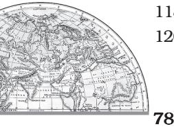
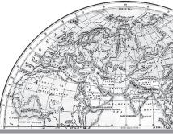
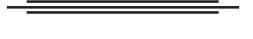
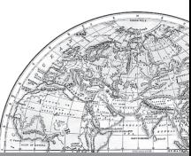

## Appendix I

#### Human Development Index, 2021

| HDI | Country Country | (HDI) Value | HDI | Country Country | (HDI) Value |
| --- | --- | --- | --- | --- | --- |
| Rank |  | 2021 | Rank |  | 2021 |
|  | Very High Human Development |  | 40 | Andorra | 0.858 |
| 1 | Switzerland | 0.962 | 40 | Croatia | 0.858 |
| 2 | Norway | 0.961 | 42 | Chile | 0.855 |
| 3 | Iceland | 0.959 | 42 | Qatar | 0.855 |
| 4 | Hong Kong, China (SAR) | 0.952 | 44 | San Marino | 0.853 |
| 5 | Australia | 0.951 | 45 | Slovakia | 0.848 |
| 6 | Denmark | 0.948 | 46 | Hungary | 0.846 |
| 7 | Sweden | 0.947 | 47 | Argentina | 0.842 |
| 8 | Ireland | 0.945 | 48 | Türkiye | 0.838 |
| 9 | Germany | 0.942 | 49 | Montenegro | 0.832 |
| 10 | Netherlands | 0.941 | 50 | Kuwait | 0.831 |
| 11 | Finland | 0.940 | 51 | Brunei Darussalam | 0.829 |
| 12 | Singapore | 0.939 | 52 | Russian Federation | 0.822 |
| 13 | Belgium | 0.937 | 53 | Romania | 0.821 |
| 13 | New Zealand | 0.937 | 54 | Oman | 0.816 |
| 15 | Canada | 0.936 | 55 | Bahamas | 0.812 |
| 16 | Liechtenstein | 0.935 | 56 | Kazakhstan | 0.811 |
| 17 | Luxembourg | 0.930 | 57 | Trinidad and Tobago | 0.810 |
| 18 | United Kingdom | 0.929 | 58 | Costa Rica | 0.809 |
| 19 | Japan | 0.925 | 58 | Uruguay | 0.809 |
| 19 | Korea (Republic of) | 0.925 | 60 | Belarus | 0.808 |
| 21 | United States | 0.921 | 61 | Panama | 0.805 |
| 22 | Israel | 0.919 | 62 | Malaysia | 0.803 |
| 23 | Malta | 0.918 | 63 | Georgia | 0.802 |
| 23 | Slovenia | 0.918 | 63 | Mauritius | 0.802 |
| 25 | Austria | 0.916 | 63 | Serbia | 0.802 |
| 26 | United Arab Emirates | 0.911 | 66 | Thailand | 0.800 |
| 27 | Spain | 0.905 |  | High Human Development |  |
| 28 | France | 0.903 | 67 | Albania | 0.796 |
| 29 | Cyprus | 0.896 | 68 | Bulgaria | 0.795 |
| 30 | Italy | 0.895 | 68 | Grenada | 0.795 |
| 31 | Estonia | 0.890 | 70 | Barbados | 0.790 |
| 32 | Czechia | 0.889 | 71 | Antigua and Barbuda | 0.788 |
| 33 | Greece | 0.887 | 72 | Seychelles | 0.785 |
| 34 | Poland | 0.876 | 73 | Sri Lanka | 0.782 |
| 35 | Bahrain | 0.875 | 74 | Bosnia and Herzegovina | 0.780 |
| 35 | Lithuania | 0.875 | 75 | Saint Kitts and Nevis | 0.777 |
| 35 | Saudi Arabia | 0.875 | 76 | Iran (Islamic Republic of) | 0.774 |
| 38 | Portugal | 0.866 | 77 | Ukraine | 0.773 |
| 39 | Latvia | 0.863 | 78 | North Macedonia | 0.770 |

| HDI | Country Country | (HDI) Value | HDI | Country Country | (HDI) Value |
| --- | --- | --- | --- | --- | --- |
| Rank |  | 2021 | Rank |  | 2021 |
| 79 | China | 0.768 | 121 | Iraq | 0.686 |
| 80 | Dominican Republic | 0.767 | 122 | Tajikistan | 0.685 |
| 80 | Moldova (Republic of) | 0.767 | 123 | Belize | 0.683 |
| 80 | Palau | 0.767 | 123 | Morocco | 0.683 |
| 83 | Cuba | 0.764 | 125 | El Salvador | 0.675 |
| 84 | Peru | 0.762 | 126 | Nicaragua | 0.667 |
| 85 | Armenia | 0.759 | 127 | Bhutan | 0.666 |
| 86 | Mexico | 0.758 | 128 | Cabo Verde | 0.662 |
| 87 | Brazil | 0.754 | 129 | Bangladesh | 0.661 |
| 88 | Colombia | 0.752 | 130 | Tuvalu | 0.641 |
| 89 | Saint Vincent and the Grenadines | 0.751 | 131 | Marshall Islands | 0.639 |
| 90 | Maldives | 0.747 | 132 | India | 0.633 |
| 91 | Algeria | 0.745 | 133 | Ghana | 0.632 |
| 91 | Azerbaijan | 0.745 | 134 | Micronesia (Federated States of) | 0.628 |
| 91 | Tonga | 0.745 | 135 | Guatemala | 0.627 |
| 91 | Turkmenistan | 0.745 | 136 | Kiribati | 0.624 |
| 95 | Ecuador | 0.740 | 137 | Honduras | 0.621 |
| 96 | Mongolia | 0.739 | 138 | Sao Tome and Principe | 0.618 |
| 97 | Egypt | 0.731 | 139 | Namibia | 0.615 |
| 97 | Tunisia | 0.731 | 140 | Lao People's Democratic Republic | 0.607 |
| 99 | Fiji | 0.730 | 140 | Timor-Leste | 0.607 |
| 99 | Suriname | 0.730 | 140 | Vanuatu | 0.607 |
| 101 | Uzbekistan | 0.727 | 143 | Nepal | 0.602 |
| 102 | Dominica | 0.720 | 144 | Eswatini (Kingdom of) | 0.597 |
| 102 | Jordan | 0.720 | 145 | Equatorial Guinea | 0.596 |
| 104 | Libya | 0.718 | 146 | Cambodia | 0.593 |
| 105 | Paraguay | 0.717 | 146 | Zimbabwe | 0.593 |
| 106 | Palestine, State of | 0.715 | 148 | Angola | 0.586 |
| 106 | Saint Lucia | 0.715 | 149 | Myanmar | 0.585 |
| 108 | Guyana | 0.714 | 150 | Syrian Arab Republic | 0.577 |
| 109 | South Africa | 0.713 | 151 | Cameroon | 0.576 |
| 110 | Jamaica | 0.709 | 152 | Kenya | 0.575 |
| 111 | Samoa | 0.707 | 153 | Congo | 0.571 |
| 112 | Gabon | 0.706 | 154 | Zambia | 0.565 |
| 112 | Lebanon | 0.706 | 155 | Solomon Islands | 0.564 |
| 114 | Indonesia | 0.705 | 156 | Comoros | 0.558 |
| 115 | Viet Nam | 0.703 | 156 | Papua New Guinea | 0.558 |
|  | Medium Human Development |  | 158 | Mauritania | 0.556 |
| 116 | Philippines | 0.699 | 159 | Côte d'Ivoire | 0.550 |
| 117 | Botswana | 0.693 |  | Low Human Development |  |
| 118 | Bolivia (Plurinational State of) | 0.692 | 160 | Tanzania (United Republic of) | 0.549 |
| 118 | Kyrgyzstan | 0.692 | 161 | Pakistan | 0.544 |
| 120 | Venezuela (Bolivarian Republic of) | 0.691 | 162 | Togo | 0.539 |

Fundamentals of Human Geography

| HDI | Country Country | (HDI) Value | HDI | Country Country | (HDI) Value |
| --- | --- | --- | --- | --- | --- |
| Rank |  | 2021 | Rank |  | 2021 |
| 163 | Haiti | 0.535 | 178 | Liberia | 0.481 |
| 163 | Nigeria | 0.535 | 179 | Congo (Democratic Republic of the) 0.479 |  |
| 165 | Rwanda | 0.534 | 180 | Afghanistan | 0.478 |
| 166 | Benin | 0.525 | 181 | Sierra Leone | 0.477 |
| 166 | Uganda | 0.525 | 182 | Guinea | 0.465 |
| 168 | Lesotho | 0.514 | 183 | Yemen | 0.455 |
| 169 | Malawi | 0.512 | 184 | Burkina Faso | 0.449 |
| 170 | Senegal | 0.511 | 185 | Mozambique | 0.446 |
| 171 | Djibouti | 0.509 | 186 | Mali | 0.428 |
| 172 | Sudan | 0.508 | 187 | Burundi | 0.426 |
| 173 | Madagascar | 0.501 | 188 | Central African Republic | 0.404 |
| 174 | Gambia | 0.500 | 189 | Niger | 0.400 |
| 175 | Ethiopia | 0.498 | 190 | Chad | 0.394 |
| 176 | Eritrea | 0.492 | 191 | South Sudan | 0.385 |
| 177 | Guinea-Bissau | 0.483 |  | Source : http://hdr.undp.org/as on 12.12.2023 |  |

# **GLOSSARY**

### **Agriculture**

The science and art of cultivating the soil, raising crops and rearing livestock. It is also called farming.

### **Balance of Trade**

The difference between the total value of a country's exports and imports. An excess of export over import makes a favourable balance of trade, and the converse an unfavourable balance.

### **Barter**

A direct exchange of excess produce between two parties to the mutual advantages of both, without the use of tokens, credit or money in the transaction.

### **Census**

Official enumeration of population along with certain economic and social statistics in a given territory at some time interval.

### **Chemical Fertilisers**

Substance of natural or artificial origin containing chemical elements such as phosphorus, potassium and nitrogem that are necessary to plan life. They are added to the soil for increasing its productivity.

### **Contour Ploughing**

Tilling or ploughing hillsides or sloping lands along the contour lines, that is, around rather than up and down a slope mainly with a view to conserving soil and water.

### **Crop Rotation**

Growing of different crops in succession on the same field from season to season to maintain soil fertility

### **Dairy Farming**

 A kind of agriculture in which major emphasis is on breeding and rearing milch cattle. Agriculture crops are raised mainly to feed these cattle.

### **Density of Population**

The average number of inhabitants living within a specified unit of area, such as a sq km.

### **Dry Farming**

A method of farming adopted in certain regions of inadequate rainfall and devoid of irrigation facilities by conserving moisture in the soil and by raising drought-enduring crops.

### **Economic Geography**

The aspect or branch of geography which deals with the influences of the environment, both physical and cultural, on the economic activity of man, bringing out similarities and differences from place to place in the ways people make a living.

### **Environment**

Surroundings or the conditions under which a person or things exist and develop his or its character. It covers both physical and cultural elements.

#### **Exports**

Goods despatched from one country to another.

### **Extensive Agriculture**

Farming in which the amount of capital and labour applied to a given area is relatively small.

**Fazenda** A coffee plantation in Brazil.

### **Foreign Exchange**

The mechanism or process by which payments between any two places operating under different national currency systems are effected without passing of actual money or gold, etc.

#### **Freeways**

The wide highways on which cross-roads are avoided by providing overhead links where one turns in only one direction to ensure smooth and speedy traffic.

### **Harbour**

An extensive stretch of deep water where vessels can anchor securely to obtain protection from sea and swell either through natural features or artificial works.

### **Highway**

Public road connecting distant places. Such a road of national importance is called the national highway.

#### **Horticulture**

Cultivation of vegetables and fruits; often on small plots, involving higher intensiveness than in field cultivation.

#### **Imports**

Goods brought into a country from another country.

### **Industrial Revolution**

The change in manufacturing from handoperated tools to power-driven machinery began in England during the middle of the eighteenth century.

### **Industry**

Systematic production characterised by division of labour and extensive use of machinery.

#### **Intensive Agriculture**

Farming in which large amounts of capital and labour are applied per unit area of land, in order to obtain high yield.

### **Inter Cropping**

It is a practice of growing two or more crops together on the same field in the same season

#### **International Trade**

Trade carried on between nations primarily to exchange their surpluses and make up their deficits.

### **Metropolis**

A very large city or agglomeration of population in a district or a country, and is often the chief centre or seat of some form of activity— administrative, commercial or industrial. It generally serves a large hinterland.

#### **Mine**

An excavation made in the earth for digging out minerals such as coal, iron-ore and precious stones. A mine usually denotes underground working except in open-pit mines.

#### **Mineral**

A substance that is found in the earth's crust, and which generally has a definite chemical composition unlike most rocks.

#### **Mineral Fuel**

Non-metallic minerals such as coal and petroleum which are used as fuel.

#### **Mineral Oil**

A mixture of hydrocarbons in solid, gaseous or liquid form found in the earth. It is commonly known as petroleum. It became a commercial product only in 1859.

#### **Mineral Ore**

Metals in their raw state as extracted from the earth.

#### **Mining**

An economic activity concerned with the extraction of commercially valuable minerals from the bowels of the earth.

#### **Mixed Farming**

A type of farming in which cultivation of crops and raising of livestock go hand in hand. Both these activities play an important part in the economy.

### **Natural Resources**

Wealth supplied by nature-mineral deposits, soil fertility, timber, fuel, water, potential water-power, fish and wild life, etc.

### **Nomadism**

A way of life of the people who are required to shift their dwellings frequently from place to place in search of pastures for their animals— the mainstay of their economy.

### **Open-cast Mine**

A place where soil and its outward cover are first removed and a mineral or ore is extracted by quarrying. In a way, it is a quarry on a large scale. This method of mining is known as open-cast mining.

#### **Pastoralism**

An economy that solely depends upon animals. Whereas nomadic pastoralism is practised mainly for subsistence, the modern ranches present an example of commercial pastoralism.

#### **Plantation Agriculture**

A large-scale one-crop farming resembling factory production. It is usually characterised by large estate, huge capital investment, and modern and scientific techniques of cultivation and trade.

#### **Port**

The commercial part of a harbour containing facilities for embarking and disembarking passengers, loading and unloading, and some facilities for the storage of cargo.

### **Primary Activity**

Activities concerned with collecting or making available materials, provided by nature, for example, agriculture, fishing, forestry, hunting or mining.

### **Quarry**

An open-air excavation from which stone is obtained by cutting, blasting, etc.

### **Ranches**

Large stock farms, usually fenced in, where animals are bred and reared on a commercial scale. They are found especially in the United States.

### **Rotation of Crops**

 A systematic succession of different crops on a given piece of land carried out in order to avoid exhaustion of the soil.

### **Secondary Activity**

Activities which transform the material provided by primary activities into commodities more directly useful to man.

### **Sedentary Agriculture**

Farming practised more or less permanently on the same piece of land, the same as settled agriculture.

#### **Shaft Mine**

An underground excavation made deep into the earth for digging minerals like coal, precious stones and iron. Such mines contain vertical and inclined shafts and horizontal tunnels at various levels.

### **Shifting Agriculture**

A method of farming in which a patch of ground is cultivated for a period of few years until the soil is partly exhausted or overrun by weeds, and after which the land is left to natural vegetation while cultivation is carried on elsewhere. In due course, the original patch of land is cultivated again when the natural growth has restored fertility.

#### **Subsistence Agriculture**

Farming in which its produce is mainly consumed in the farmer's household unlike commercial agriculture whose products enter into trade on a very large scale.

#### **Transhumance**

A seasonal movement of herdsmen with their livestock and from and to the mountains or between the regions of differing climates.

#### **Transport**

The action of carrying persons and goods from one place to another.

### **Truck Farming**

Growing of vegetables around the urban centres to meet the daily demand of the people is known as truck farming. It is governed by the distance a truck can cover overnight between the farm and the market.

#### **Urbanisation**

 A general movement of people from small rural or agricultural communities or villages to larger towns engaged in varied activities such as government, trade, transport and manufacture. It also indicates the concentration of an increasing proportion of total population in towns and cities.

*Glossary* 81

# **NOTES**

