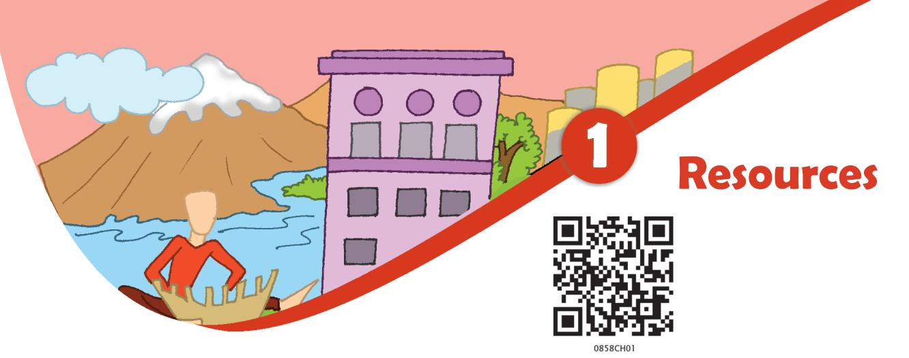
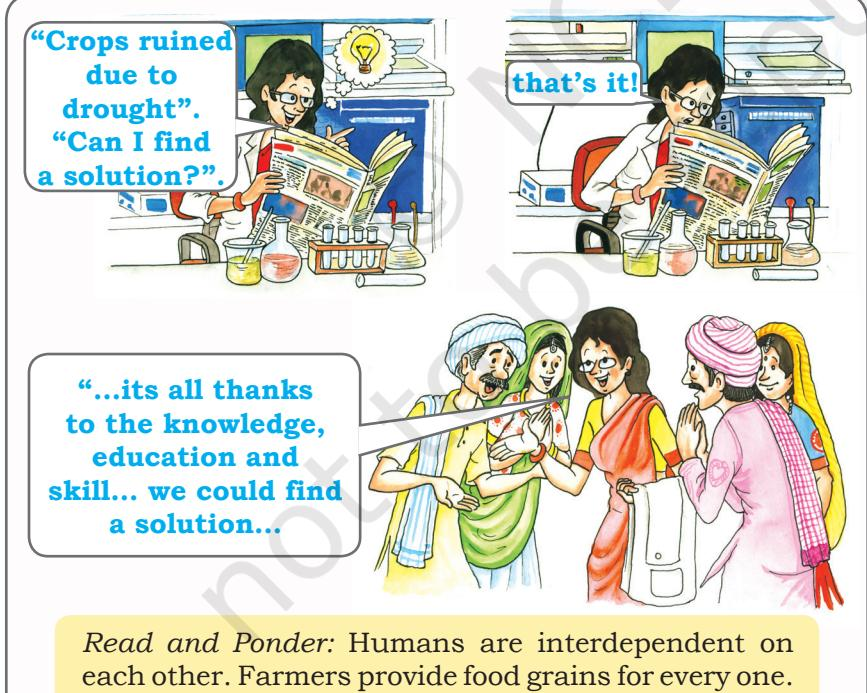

*Mona and Raju were helping Amma to clean their house. "Look at all these things…. clothes, utensils, foodgrains, combs, this bottle of honey, books…..Each of these has a use," said Mona. "That is why they are important," said Amma. "These are resources…..". "What is a resource?" was Raju's question to Amma. "Anything that can be used to satisfy a need is a resource", replied amma. "Look around you and observe, you will be able to identify many types of resources. The water you drink when you are thirsty, the electricity you use in your house, the rickshaw you use to get home from school, the textbook you use to study are all resources. Your father has prepared a tasty snack for you. The fresh vegetables he has used are also a resource".*

Water, electricity, rickshaw, vegetable and textbook have something in common. They have all been used by you, so they have **utility**. Utility or usability is what makes an object or substance a resource.

*"How does something become a resource?" Raju now wanted to know. Amma told the children that things become resources only when they have a value. "Its use or utility gives it a value. All resources have some value." said Amma.* 

**Value** means worth. Some resources have economic value, some do not. For example, metals may have an economic value, a beautiful landscape may not. But both are important and satisfy human needs.

Some resources can become economically valuable with time. Your grandmother's home remedies have no commercial value today. But if they are patented and sold by a medical firm tomorrow, they could become economically valuable.

### Let's do

List out five resources you use in your home and five you use in your classroom.

Glossary **Patent**: It means the exclusive right over any idea or invention.

Chapter-1.indd 1 8/17/2022 11:34:40 AM

### Glossary

**Technology**: It is the application of latest knowledge and skill in doing or making things.

### Activity

Circle those resources from Amma's list that are regarded as having no commercial value.

**Amma's List**

| Cotton cloth |
| --- |
| Iron ore |
| Intelligence |
| Medicinal plants |
| Medical knowledge |
| Coal deposits |
| Beautiful scenery |
| Agricultural land |
| Clean environment |
| Old folk songs |
| Good weather |
| Resourcefulness |
| A good singing voice |
| Grandmother's |
| home remedies |
| Affection from |
| friends and family |

Time and technology are two important factors that can change substances into resources. Both are related to the needs of the people. People themselves are the most important resource. It is their ideas, knowledge, inventions and discoveries that lead to the creation of more resources. Each discovery or invention leads to many others. The discovery of fire led to the practice of cooking and other processes while the invention of the wheel

ultimately resulted in development of newer modes of transport. The technology

to create hydroelectricity has turned energy in fast flowing water into an important resource.

 **"So I am a resource too!"**

**"A very valuable one!"**

# Types of Resources

Resources are generally classified into natural, human made and human*.*

## Natural Resources

Resources that are drawn from Nature and used without much modification are called **natural resources**. The air we breathe, the water in our rivers and lakes, the soils, minerals are all natural resources. Many of these resources are free gifts of nature and can be used directly. In some cases tools and technology may be needed to use a natural resource in the best possible way.

Natural resources can be broadly categorised into **renewable** and **non-renewable** resources.

**Renewable resources** are those which get renewed or replenished quickly. Some of these are unlimited and are not affected by human activities, such as solar and wind energy. Yet careless use of certain renewable resources like water, soil and forest can affect their stock. Water seems to be an unlimited renewable resource. But shortage and drying up of natural water sources is a major problem in many parts of the world today.

**Non-renewable resources** are those which have a limited stock. Once the stocks are exhausted it may take thousands of years to be renewed or replenished. Since this period is much more than human life spans,

- 2 Resources and Development
Chapter-1.indd 2 8/17/2022 11:34:41 AM

such resources are considered non-renewable. Coal, petroleum and natural gas are some examples.

The distribution of natural resources depends upon number of physical factors like terrain, climate and altitude. The distribution of resources is unequal because these factors differ so much over the earth.

## Human Made Resources

Sometimes, natural substances become resources only when their original form has been changed. Iron ore was not a resource until people learnt to extract iron from it. People use natural resources to make buildings, bridges, roads, machinery and vehicles, which are known as **human made resources**. Technology is also a human made resource.

*"So people like us use natural resources to make human made resources," said Mona nodding in understanding. "Yes," said Raju.*

## Human Resources

People can make the best use of nature to create more resources when they have the knowledge, skill and the

Scientists suggest various means to combat problems related to agriculture and improve farm production.

## Glossary

**Stock of Resource** It is the amount of resources available for use.

## Let's do

Think of a few renewable resources and mention how their stock may get affected by overuse.

# Let's do

Make a list of five human made resources that you can observe around you.

# Do you know?

**Human Resource** 

refers to the number (quantity) and abilities (mental and physical) of the people. Though, there are differing views regarding treatment of humans as a resource, one cannot deny the fact that it is the skills of human that help in transfering the physical material into a valuable resource.

Resources3

Chapter-1.indd 3 8/17/2022 11:34:42 AM

technology to do so. That is why human beings are a special resource. **People are human resources**. Education and health help in making people a valuable resource. Improving the quality of people's skills so that they are able to create more resources is known as **human resource development**.

# Conserving Resources

*Mona had a nightmare. She dreamt that all the water on the earth had dried up and all the trees cut down. There was no shade and nothing to eat or drink. People were suffering and roaming around desperately looking for food and shade.* 

*She told her mother about the dream. "Amma can this really happen?" she asked.*

*"Yes," Amma replied. "If we are not careful then even renewable resources can become very scarce and the non-renewable ones can definitely get exhausted". "What can we do about it," Raju asked. "Lots," replied Amma.* 

Using resources carefully and giving them time to get renewed is called **resource conservation**. Balancing the need to use resources and also conserve them for the future is called **sustainable development**. There are many ways of conserving resources. Each person can contribute by reducing consumption, recycling and reusing thing. Ultimately it makes a difference because all our lives are linked.

> *That evening the children and their friends made packets and shopping bags out of old newspapers, discarded clothes and baskets from bamboo sticks. "We will give a few to every family we know," said Mona. "After all it is for a very good cause," said Mustafa, "To save our resources and to keep our earth alive".*

> *"I am going to be very careful not to waste paper," said Jessy. "Many trees are cut down to make paper," she explained.*

*"I will see that electricity is not wasted in my house," shouted Mustafa. "Electricity comes from water and coal."*

### Glossary

**Sustainable Development** Carefully utilising resources so that besides meeting the requirements of the present, also takes care of future generations.

4 Resources and Development

Chapter-1.indd 4 8/17/2022 11:34:44 AM

*"I will make sure that water is not wasted at home," said Asha. "Every drop of water is precious"* 

*"Together we can make a difference!" chorused the children.*

*These are some of the things Mona, Raju and their friends did. What about you? How are you going to help in conserving resources?*

The future of our planet and its people is linked with our ability to maintain and preserve the life support system that nature provides. Therefore it is our duty to ensure that :

- all uses of renewable resources are sustainable
- the diversity of life on the earth is conserved
- the damage to natural environmental system is minimised.

### **Some Principles of Sustainable Development**

- Respect and care for all forms of life
- Improve the quality of human life
- Conserve the earth's vitality and diversity
- Minimise the depletion of natural resources
- Change personal attitude and practices
- towards the environment Enable communities to care for their own environment.

Resources5

## **Exercises**

## **1. Answer the following questions.**

- (i) Why are resources distributed unequally over the earth?
- (ii) What is resource conservation?
- (iii) Why are human resources important?
- (iv) What is sustainable development?
- **2. Tick the correct answer.**
	- (i) Which one of the following does NOT make substance a resource? (a) utility (b) value (c) quantity
	- (ii) Which one of the following is a human made resource? (a) medicines to treat cancer
	- (b) spring water
	- (c) tropical forests
	- (iii) Complete the statement.
- Non-renewable resources are
	- (a) those which have limited stock
	- (b) made by human beings
		- (c) derived from non-living things

#### **3. Activity**

"*Rahiman paani raakhiye, Bin paani sab soon.*

Chapter-1.indd 5 8/17/2022 11:34:44 AM

#### *Paani gaye na ubere Moti, manus, choon*…"

[Says Rahim, keep water, as without water there is nothing*.* Without water pearl, swan and dough cannot exist. ]

These lines were written by the poet Abdur Rahim Khankhana, one of the nine gems of Akbar's court. What kind of resource is the poet referring to? Write in 100 words what would happen if this resource disappeared?

## **For Fun**

- 1. Pretend that you live in the prehistoric times on a high windy plateau. What are the uses you and your friends could put the fast winds to? Can you call the wind a resource?
Now imagine that you are living in the same place in the year 2138. Can you put the winds to any use? How? Can you explain why the wind is an important resource now?

- 2. Pick up a stone, a leaf, a paper straw and a twig. Think of how you can use these as resources. See the example given below and get creative!

| You can use a stone… | Use/Utility |
| --- | --- |
| To play stapu | toy |
| As a paper-weight | tool |
| To crush spices | tool |
| To decorate your garden/room | decoration piece |
| To open a bottle | tool |
| In a catapult | weapon |

|
|  |

6 Resources and Development

Chapter-1.indd 6 8/17/2022 11:34:45 AM

