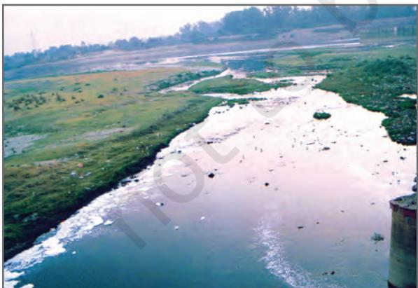

# **Land, Soil, Water, Natural Vegetation and Wildlife Resources**

*In a small village in Tanzania, Africa, Mamba gets up very early in the morning to fetch water. She has to walk a long way and returns after a few hours. She then helps her mother in the house and joins her brothers in taking care of their goats. All her family owns is a piece of rocky land around their small hut. Mamba's father can barely grow some maize and beans on it after toiling hard. This is not enough to feed their family for the whole year.*

*Peter lives in the heart of the sheep rearing region in New Zealand where his family runs a wool processing factory. Everyday when he returns from school, Peter watches his uncle taking care of their sheep. Their sheep yard is situated on a wide grassy plain with hills in the far distance. It is managed in a scientific way using the latest technology. Peter's family also grows vegetables through organic farming.*

Mamba and Peter stay in two different parts of the world and lead very different lives. This difference is because of the differences in the quality of land, soil, water, natural vegetation, animals and the usage of technology. The availability of such resources is the main reason places differ from each other.

# Land

Land is among the most important natural resources. It covers only about thirty per cent of the total area of the earth's surface and all parts of this small percentage are not habitable.

The uneven distribution of population in different parts of the world is mainly due to varied characteristics of land and climate. The rugged topography, steep slopes of the mountains, low-lying areas susceptible to water Let's do Observe the land, type of soil and water availability in the region you live. Discuss in your class, how it has influenced the lifestyle of people there.

Do you know?

Ninety per cent of the world population occupies only thirty per cent of land area. The remaining seventy per cent of the land is either sparsely populated or uninhabited.

Chapter-2.indd 7 8/17/2022 11:36:42 AM

*Fig. 2.1: Salzburg in Austria Notice in how many ways the land has been used in the above picture.*

#### Let's do

Talk to some elderly person in your family or neighbourhood and collect information about changes in the land use over the years, in the place where you live. Display your findings on a bulletin board in your classroom.

logging, desert areas, thick forested areas are normally sparsely populated or uninhabited. Plains and river valleys offer suitable land for agriculture. Hence, these are the densely populated areas of the world.

# Land Use

Land is used for different purposes such as agriculture, forestry, mining, building houses, roads and setting up

of industries. This is commonly termed as **Land use**. Can you list out the different ways in which Mamba's and Peter's family use their land?

The use of land is determined by physical factors such as topography, soil, climate, minerals and availability of water. Human factors such as population and technology are also important determinants of land use pattern.

Land can also be classified on the basis of ownership as – private land and community land. Private land is owned by individuals whereas, community land is owned by the community for common uses like collection of fodder, fruits, nuts or medicinal herbs. These community lands are also called **common property resources**.

People and their demands are ever growing but the availability of land is limited. The quality of land also differs from place to place. People started encroaching the common lands to build up commercial areas, housing complexes in the urban areas and to expand the agricultural land in the rural areas. Today the vast changes in the land use pattern also reflect the cultural changes in our society. Land degradation, landslides, soil erosion, desertification are the major threats to the environment because of the expansion of agriculture and construction activities.

8 Resources and Development

Chapter-2.indd 8 8/17/2022 11:36:44 AM

*Fig. 2.2: Change in land use over time*

# Conservation of Land Resource

Growing population and their ever growing demand has led to a large scale destruction of forest cover and arable land and has created a fear of losing this natural resource. Therefore, the present rate of degradation of land must be checked. Afforestation, land reclamation, regulated use of chemical pesticide and fertilisers and checks on overgrazing are some of the common methods used to conserve land resources.

# Soil

The thin layer of grainy substance covering the surface of the earth is called soil. It is closely linked to land. Landforms determine the type of soil. Soil is made up of organic matter, minerals and weathered rocks found on the earth. This happens through the process of weathering. The right mix of minerals and organic matter make the soil fertile.

### Glossary

**Weathering** The breaking up and decay of exposed rocks, by temperature changes, frost action, plants, animals and human activity.

Land, Soil, Water, Natural Vegetation and Wildlife Resources 9

Chapter-2.indd 9 8/17/2022 11:36:47 AM

### Landslides

Landslides are simply defined as the mass movement of rock, debris or earth down a slope. They often take place in conjunction with earthquakes, floods and volcanoes. A prolonged spell of rainfall can cause heavy landslide that can block the flow of river for quite some time. The formation of river blocks can cause havoc to the settlements downstream on its bursting. In the hilly terrain landslides have been a major and widely spread natural disaster that often strike life and property and occupy a position of major concern.

*A Landslide*

### A Case Study

A massive landslide hit Pangi village near Reckong Peo in Kinnaur district of Himachal Pradesh and damaged a 200-meter stretch of old Hindustan-Tibet road, National Highway - 22. This landslide was triggered by intense blasting at Pangi village. Due to the blasting this weak zone of slope collapsed and caused intense damage to the road and nearby villages. The Pangi village was completely vacated to avoid any possible loss of life.

#### Mitigation Mechanism

Advancement in scientific techniques has empowered us to understand what factors cause landslides and how to manage them. Some broad mitigation techniques of landslide are as follows:

- • Hazard mapping to locate areas prone to landslides. Hence, such areas can be avoided for building settlements.
- • Construction of retention wall to stop land from slipping.
- • Increase in the vegetation cover to arrest landslide.
- • The surface drainage control works to control the movement of landslide along with rain water and spring flows.

*Retention Wall*

10 Resources and Development

Chapter-2.indd 10 8/17/2022 11:36:49 AM

*Fig. 2.3: Soil Profile*

Do you know? It takes hundreds of years to make just one centimetre of **soil**.

# Factors of Soil Formation

The major factors of **soil formation** are the nature of the parent rock and climatic factors. Other factors are the topography, role of organic material and time taken for the composition of soil formation. All these differ from place to place.

Land, Soil, Water, Natural Vegetation and Wildlife Resources 11

Chapter-2.indd 11 8/17/2022 11:36:50 AM

### Activity

In India soils could be alluvial, black, red, laterite, desertic and mountain soil. Collect a handful of different types of soil and observe. How are they different?

# Degradation of Soil and Conservation

# Measures

Soil erosion and depletion are the major threats to soil as a resource. Both human and natural factors can lead to degradation of soils. Factors which lead to soil degradation are deforestation, overgrazing, overuse of chemical feritilisers or pesticides, rain wash, landslides and floods.

Some methods of soil conservation are listed below:

*Mulching*: The bare ground between plants is covered with a layer of organic matter like straw. It helps to retain soil moisture.

*Contour barriers*: Stones, grass, soil are used to build barriers along contours. Trenches are made in front of the barriers to collect water.

*Rock dam*: Rocks are piled up to slow down the flow of water. This prevents gullies and further soil loss.

*Fig 2.5: Terrace Farming*

*Fig 2.6: Contour Ploughing*

*Fig 2.7: Shelter Belts*

12 Resources and Development

*Terrace farming*: Broad flat steps or terraces are made on the steep slopes so that flat surfaces are available to grow crops. They reduce surface runoff and soil erosion (Fig. 2.5).

*Intercropping*: Different crops are grown in alternate rows and are sown at different times to protect the soil from rain wash.

*Contour ploughing*: Ploughing parallel to the contours of a hill slope to form a natural barrier for water to flow down the slope (Fig. 2.6).

*Shelter belts*: In the coastal and dry regions, rows of trees are planted to check the wind movement to protect soil cover (Fig. 2.7).

2024-25

Chapter-2.indd 12 8/17/2022 11:36:51 AM

#### Activity

Take two trays A and B of same size. Make six holes at one end of these trays and then fill them with the same amount of soil. Leave the soil in tray A bare while sow wheat or rice grains in tray B. When the grain in tray B has grown a few centimetres high, place both the trays in such a way that they are on a slope. Pour one mug of water from the same height into each tray. Collect the muddy water that trickles down the holes of both trays in two separate containers and compare how much soil is washed out of each tray?

# Water

Water is a vital renewable natural resource. Threefourth's of the earth's surface is covered with water. It is therefore appropriately called the 'water planet'. It was in the primitive oceans that life began almost 3.5 billion years back. Even today, the oceans cover two-thirds of the earth's surface and support a rich variety of plant and animal life. The ocean water is however saline and not fit for human consumption. Fresh water accounts for only about 2.7 per cent. Nearly 70 per cent of this occurs as ice sheets and glaciers in Antarctica, Greenland and mountain regions. Due to their location they are inaccessible. Only 1 per cent of freshwater is available and fit for human use. It is found as ground water, as surface water in rivers and lakes and as water vapour in the atmosphere.

Fresh water is therefore, the most precious substance on earth. Water can neither be added nor subtracted from the earth. Its total volume remains constant. Its abundance only seems to vary because it is in constant motion, cycling through the oceans, the air, the land and back again, through the processes of evaporation, precipitation and run-off. This as you already know is referred to as the 'water cycle'.

Do you know? In 1975, the consumption of water for human use was 3850cu km/year. It soared to more than 6000 cu km/year in the year 2000.

Do you know? A dripping tap wastes1200 litres of water in a year.

Land, Soil, Water, Natural Vegetation and Wildlife Resources 13

Chapter-2.indd 13 8/17/2022 11:36:53 AM

Humans use huge amounts of water not only for drinking and washing but also in the process of production. Water for agriculture, industries,

| Activity |  |
| --- | --- |
| An average urban Indian uses about 150 litres |  |
| of water every day. |  |
| Use | Litres per person per day |
| Drinking | 3 |
| Cooking | 4 |
| Bathing | 20 |
| Flushing | 40 |
| Washing clothes | 40 |
| Washing utensils | 20 |
| Gardening | 23 |
| Total | 150 |
| Can you suggest some ways to bring down this amount? |  |

generating electricity through reservoirs of dams are the other usages. Increasing population, rising demands for food and cash crops, increasing urbanisation and rising standards of living are the major factors leading to shortages in supply of fresh water either due to drying up of water sources or water pollution.

# Problems of Water Availability

There is scarcity of water in many regions of the world. Most of Africa, West Asia, South Asia, parts of western USA, north-west Mexico, parts of South America and entire Australia are facing shortages in fresh water supply. Countries located in climatic zones most susceptible to droughts face great problems of water scarcity. Thus, water shortage may be a consequence of variation in seasonal or annual precipitation or the scarcity is caused by over-exploitation and contamination of water sources.

*Fig 2.8: River Yamuna is getting polluted due to sewage, industrial effluents and garbage*

# Conservation of Water Resources

Access to clean and adequate water sources is a major problem facing the world today. Steps have to be taken to conserve this dwindling resource. Even though water is a renewable resource, its overuse and pollution make it unfit for use. Discharge of untreated or partially treated sewage, agricultural chemicals and industrial effluents in water bodies are major contaminants. They pollute water with nitrates, metals and pesticides.

14 Resources and Development

Chapter-2.indd 14 27-02-2024 11:09:32

Most of these chemicals are non-biodegradable and reach human bodies through water. Water pollution can be controlled by treating these effluents suitably before releasing them in water bodies.

Forest and other vegetation cover slow the surface runoff and replenish underground water. Water harvesting is another method to save surface runoff. The canals used for irrigating field should be properly lined to minimise losses by water seepage. Sprinklers effectively irrigate the area by checking water losses through seepage and evaporation. In dry regions with high rates of evaporation, drip or trickle irrigation is very useful. The valuable water resource can therefore be conserved by adopting these means of irrigation.

# Natural Vegetation and Wildlife

*Some school children were visiting an exhibition on handicrafts. The articles in the exhibition were collected from different parts of the country. Mona picked up a bag and exclaimed, "This is a beautiful handbag!" "Yes, it is made from Jute," the teacher said. "Do you see those baskets, lamp shades and chairs? Those are made of canes and bamboos. In the eastern and north eastern humid regions of India, bamboo grows in plenty." Jassy was excited to see a silk scarf. "See this beautiful scarf". The teacher explained that silk is obtained from silk worms that are bred on Mulberry trees. The children understood that plants provide us with many different products that we use in our day-to-day life.* 

Natural vegetation and wildlife exist only in the narrow zone of contact between the lithosphere, hydrosphere and atmosphere that we call **biosphere**. In the biosphere living beings are inter-related and interdependent on each other for survival. This life supporting system is known as the **ecosystem**. Vegetation and wildlife are valuable resources. Plants provide us with timber, give shelter to animals, produce oxygen we breathe, protects soils so

*Fig 2.9: A Water Sprinkler*

### Do you know?

Rain water harvesting is the process of collecting rain water from roof tops and directing it to an appropriate location where it is stored for future use. On an average, one spell of rain for two hours is enough to save 8,000 litres of water.

Land, Soil, Water, Natural Vegetation and Wildlife Resources 15

Chapter-2.indd 15 8/17/2022 11:36:55 AM

#### Do you know?

Vultures in the Indian subcontinent were dying of kidney failure shortly after scavenging livestock treated with diclofenac, a painkiller that is similar to aspirin or ibuprofen. Efforts are on to ban the drug for livestock use and breed vultures in captivity.

essential for growing crops, act as shelter belts, help in storage of underground water, give us fruits, nuts, latex, turpentine oil, gum, medicinal plants and also the paper that is so essential for your studies. There are innumerable uses of plants and you can add some more.

Wildlife includes animals, birds, insects as well as the aquatic life forms. They provide us milk, meat, hides and wool. Insects like bees provide us honey, help in pollination of flowers and have an important role to play as decomposers in the ecosystem. The birds feed on insects and act as decomposers as well. Vulture due to its ability to feed on dead livestock is a scavenger and considered a vital cleanser of the environment. So animals big or small, all are integral to maintaining balance in the ecosystem.

*Fig 2.11: Brahma Kamal a Medicinal Herb*

*Fig 2.12: A Blue Kingfisher*

# Distribution of Natural Vegetation

The growth of vegetation depends primarily on temperature and moisture. The major vegetation

types of the world are grouped as forests, grasslands, scrubs and tundra.

In areas of heavy rainfall, huge trees may thrive. The forests are thus associated with areas having abundant water supply. As the amount of moisture decreases the size of trees and their density reduces. Short stunted trees and grasses grow in the regions of moderate rainfall forming the grasslands of the world. Thorny shrubs and

*Fig. 2.13: Grassland and Forest*

16 Resources and Development

Chapter-2.indd 16 8/17/2022 11:36:56 AM

scrubs grow in dry areas of low rainfall. In such areas plants have deep roots and leaves with thorny and waxy surface reduce loss of moisture through transpiration. Tundra vegetation of cold Polar Regions comprise of mosses and lichens.

Today there are many more people in the world than there were two centuries back. To feed the growing numbers, large areas of forests have been cleared to grow crops. Forest cover all over the

world is vanishing rapidly. There is an urgent need to conserve this valuable resource.

# Conservation of Natural Vegetation and Wildlife

Forests are our wealth. Plants give shelter to the animals and together they maintain the ecosystem. Changes of climate and human interferences can cause the loss of natural habitats for the plants and animals. Many species have become vulnerable

or endangered and some are on the verge of extinction. Deforestation, soil erosion, constructional activities, forest fires, tsunami and landslides are some of the human and natural factors which accelerate the process of extinction of these resources. One of the major concerns is the poaching which result in a sharp decline in the number of particular species. The animals are poached for collection and illegal trade of hides, skins, nails, teeth, horns as well as feathers. Some of these animals are tiger, lion, elephant, deer, black buck, crocodile, rhinoceros, snow

*Fig. 2.14: A Python in a forest*

*Fig. 2.15: A collage of a forest made by school students*

*Fig. 2.16: Loss of rainforest in Great Nicobar after Tsunami*

Land, Soil, Water, Natural Vegetation and Wildlife Resources 17

Chapter-2.indd 17 8/17/2022 11:36:58 AM

leopard, ostrich and peacock. These can be conserved by increasing awareness.

National parks, wildlife sanctuaries, biosphere reserves are made to protect our natural vegetation and wildlife. Conservation of creeks, lakes, and wetlands is necessary to save the precious resource from depletion

There is a balance in the environment if the relative number of species is not disturbed. Human activities in several parts of the world have disturbed the natural

*Fig. 2.17: Black buck also needs protection*

#### Activity

Read the news item and find out how fire started in California ? Could it be avoided?

#### Know More

Forest fire is a threat to the entire region of fauna and flora. It occurs mainly due to three reasons :

- 1. Natural fire due to lightening etc.
- 2. Fire due to heat generated in the litter due to carelessness of people.
- 3. Fire purposely caused by local inhabitants, mischief makers, miscreants etc.

### Some Control Measures

- 1. Prevention of fires through education.
- 2. Prompt detection of fires through well co-ordinated network of observation points, efficient ground patroling and communication network.

18 Resources and Development

Chapter-2.indd 18 8/17/2022 11:36:59 AM

habitats of many species. Due to indiscriminate killings, several birds and animals have either become extinct or are on the verge of extinction.

Awareness programmes like social forestry and *Vanamohatasava* should be encouraged at the regional and community level. School children should be encouraged to bird watch and visit nature camps so that they appreciate the habitat of varied species.

Many countries have passed laws against the trade as well as killing of birds and animals. In India, killing lions, tigers, deers, great Indian bustards and peacocks is illegal.

 An international convention CITES has been established that lists several species of animals and birds in which trade is prohibited. Conservation of plants and animals is an ethical duty of every citizen.

*Fig. 2:19: A herd of Elephants in Kaziranga National Park*

Glossary

**National Park**  A natural area designated to protect the ecological integrity of one or more ecosystems for the present and the future generations

*Fig. 2:18: A Herd of Cheetals*

#### Glossary

**Biosphere reserves**  Series of protected areas linked through a global network, intended to demonstrate the relationship between conservation and development.

#### Do you know?

CITES (the Convention on International Trade in Endangered Species of Wild Fauna and Flora) is an international agreement between governments. It aims to ensure that international trade in specimens of wild animals and plants does not threaten their survival. Roughly 5,000 species of animals and 28,000 species of plants are protected. Bears, dolphins, cacti, corals, orchids and aloes are some examples.

Land, Soil, Water, Natural Vegetation and Wildlife Resources 19

Chapter-2.indd 19 8/17/2022 11:37:01 AM

# **Exercises**

#### **1. Answer the following questions.**

- (i) Which are the two main climatic factors responsible for soil formation?
- (ii) Write any two reasons for land degradation today.
- (iii) Why is land considered an important resource?
- (iv) Name any two steps that government has taken to conserve plants and animals.
	- (v) Suggest three ways to conserve water.

#### **2. Tick the correct answer.**

- (i) Which one of the following is NOT a factor of soil formation?
	- (a) time (b) soil texture (c) organic matter
- (ii) Which one of the following methods is most appropriate to check soil erosion on steep slopes?
	- (a) shelter belts (b) mulching (c) terrace cultivation
- (iii) Which one of the following is NOT in favour of the conservation of nature?
	- (a) switch off the bulb when not in use
	- (b) close the tap immediately after using
	- (c) dispose polypacks after shopping

#### **3. Match the followings :**

- 
- (i) Land use (a) prevent soil erosion
- 
- (ii) Humus (b) narrow zone of contact between the lithosphere,
- 
- (iii) Rock dams (c) productive use of land

hydrosphere and atmosphere

- (iv) Biosphere (d) organic matter deposited on top soil
- (e) contour ploughing

#### **4. State whether the given statement is true or false. If true, write the reasons.**

- (i) Ganga–Brahmaputra plain of India is an overpopulated region.
- (ii) Water availability per person in India is declining.
- (iii) Rows of trees planted in the coastal areas to check the wind movement is called intercropping.
	- (iv) Human interference and changes of climate can maintain the ecosystem.

#### **5. Activity**

Discuss some more reasons which are responsible for changes of land use pattern. Has your place undergone any change in the land use pattern in recent years?

Chapter-2.indd 20 8/17/2022 11:37:03 AM

Find out from your parents and elderly people. You can conduct an interview by asking the following questions.

| Place | When your | When your | Why do you | Are common |
| --- | --- | --- | --- | --- |
|  | grand | parents were | think this is | areas and |
|  | parent's were | in their 30's | happening? | open spaces |
|  | in their 30's |  |  | disappearing? |
| Rural |  |  |  |  |
| Number of |  |  |  |  |
| cattle and |  |  |  |  |
| poultry owned |  |  |  |  |
| Number of |  |  |  |  |
| trees and |  |  |  |  |
| ponds in the |  |  |  |  |
| village |  |  |  |  |
| Main |  |  |  |  |
| occupation of |  |  |  |  |
| the head of |  |  |  |  |
| the family |  |  |  |  |
| Urban |  |  |  |  |
| Number of |  |  |  |  |
| cars owned |  |  |  |  |
| Number of |  |  |  |  |
| rooms in the |  |  |  |  |
| house |  |  |  |  |
| Number of |  |  |  |  |
| metalled |  |  |  |  |
| roads |  |  |  |  |
| Number of |  |  |  |  |
| flyovers in the |  |  |  |  |
| city |  |  |  |  |
| Number of |  |  |  |  |
| parks and |  |  |  |  |
| playgrounds |  |  |  |  |

Based on the table you have just completed, draw a picture of land use patterns that you foresee in your neighbourhood after 20 years. Why do you think that land use patterns change over the years?

Land, Soil, Water, Natural Vegetation and Wildlife Resources 21

Chapter-2.indd 21 8/17/2022 11:37:04 AM

