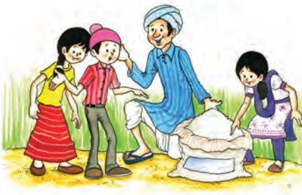

*Gurpreet, Madho and Tina were walking through the village where they saw a farmer tilling land. The farmer told them that he was growing wheat and had just added manure to the soil to make it more fertile. He told the children that the wheat would fetch a good price in the mandi from where it would be taken to factories to make bread and biscuits from flour.*

**Agriculture**

This transformation from a plant to a finished product involves three types of economic activities. These are primary, secondary and tertiary activities.

Primary activities include all those connected with extraction and production of natural resources. Agriculture, fishing and gathering are good examples. Secondary activities are concerned with the processing of these resources. Manufacturing of steel, baking of bread and weaving of cloth are examples of this activity. Tertiary activities provide support to the primary and secondary sectors through services. Transport, trade, banking, insurance and advertising are examples of tertiary activities.

Agriculture is a primary activity. It includes growing crops, fruits, vegetables, flowers and rearing of livestock. In the world, 50 per cent of persons are engaged in agricultural activity. Two-thirds of India's population is still dependent on agriculture.

Favourable topography of soil and climate are vital for agricultural activity. The land on which the crops are grown is known as arable land (Fig. 3.1). In the map you can see that agricultural activity is concentrated in those regions of the world where suitable factors for the growing of crops exist.

### Word Origin

The word agriculture is derived from Latin words *ager* or *agri* meaning soil and *culture* meaning, cultivation.

Chapter-3.indd 22 8/17/2022 11:34:55 AM

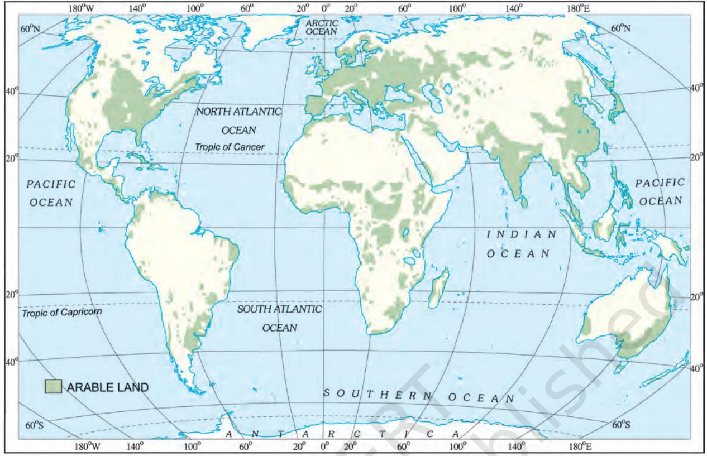

*Fig. 3.1: World Distribution of Arable Land*

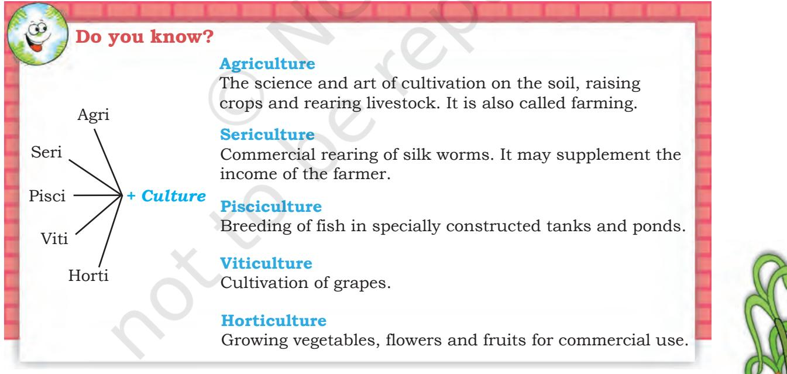

# Farm System

Agriculture or farming can be looked at as a system. The important inputs are seeds, fertilisers, machinery and

Agriculture 23

Chapter-3.indd 23 8/17/2022 11:34:56 AM

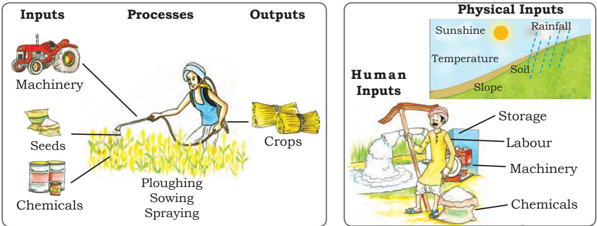

*Fig 3.2: The farm system of an arable farm Fig 3.3: Physical and human farm inputs*

labour. Some of the operations involved are ploughing, sowing, irrigation, weeding and harvesting. The outputs from the system include crops, wool, dairy and poultry products.

# Types of Farming

Farming is practised in various ways across the world. Depending upon the geographical conditions, demand of produce, labour and level of technology, farming can be classified into two main types. These are **subsistence farming** and **commercial farming**.

# Subsistence Farming

This type of farming is practised to meet the needs of the farmer's family. Traditionally, low levels of technology and household labour are used to produce on small output. Subsistence farming can be further classified as intensive subsistence and primitive subsistence farming.

In **intensive subsistence agriculture** the farmer cultivates a small plot of land using simple tools and more labour. Climate with large number of days with sunshine and fertile soils permit growing of more than one crop annually on the same plot. Rice is the main crop. Other crops include wheat, maize, pulses and oilseeds. Intensive subsistence agriculture is prevalent in the thickly populated areas of the monsoon regions of south, southeast and east Asia.

24 Resources and Development

Interesting Fact **Organic Farming** In this type of farming, organic manure and natural pesticides are used instead

- of chemicals. No genetic modification is done to increase the yield of the crop.
Chapter-3.indd 24 8/17/2022 11:34:57 AM

**Primitive subsistence agriculture** includes shifting cultivation and nomadic herding.

**Shifting cultivation** is practised in the thickly forested areas of Amazon basin, tropical Africa, parts of southeast Asia and Northeast India. These are the areas of heavy rainfall and quick regeneration of vegetation. A plot of land is cleared by felling the trees and burning them. The ashes are then mixed with the soil and crops like maize, yam, potatoes and cassava are grown. After the soil loses its fertility, the land is abandoned and the cultivator moves to a new plot. Shifting cultivation is also known as 'slash and burn' agriculture.

**Nomadic herding** is practised in the semi-arid and arid regions of Sahara, Central Asia and some

parts of India, like Rajasthan and Jammu and Kashmir. In this type of farming, herdsmen move from place to place with their animals for fodder and water, along defined routes. This type of movement arises in response to climatic constraints and terrain. Sheep, camel, yak and goats are most commonly reared. They provide milk, meat, wool, hides and other products to the herders and their families.

#### **Commercial Farming**

In commercial farming crops are grown and animals are reared for sale in market. The area cultivated and the amount of capital used is large. Most of the work is done by machines. Commercial farming includes commercial grain farming, mixed farming and plantation agriculture (Fig 3.5).

In *commercial grain farming* crops are grown for commercial purpose. Wheat and maize are common commercially grown grains. Major areas where commercial grain farming is

pracised are temperate grasslands of North America, Europe and Asia. These areas are sparsely populated with large farms spreading over hundreds of hectares. Severe winters restrict the growing season and only a single crop can be grown.

In **mixed farming** the land is used for growing food and fodder crops and rearing livestock.

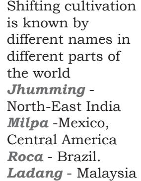

**Do you know?** 

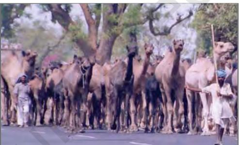

*Fig 3.4: Nomadic Herders with their camels*

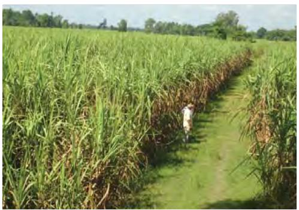

*Fig 3.5: A Sugarcane plantation*

AGRICULTURE 25

Chapter-3.indd 25 12-01-2024 10:14:53

*Fig 3.6: A Banana Plantation*

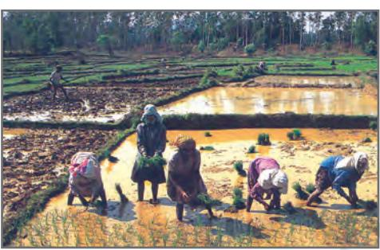

*Fig 3.7: Rice Cultivation*

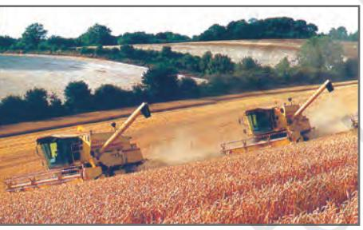

*Fig 3.8: Wheat Harvesting*

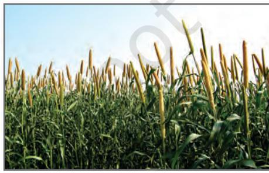

*Fig 3.9: Bajra Cultivation*

26 Resources and Development

It is practised in Europe, eastern USA, Argentina, southeast Australia, New Zealand and South Africa.

> **Plantations** are a type of commercial farming where single crop of tea, coffee, sugarcane, cashew, rubber, banana or cotton are grown. Large amount of labour and capital are required. The produce may be processed on the farm itself or in nearby factories. The development of a transport network is thus essential for such farming.

> Major plantations are found in the tropical regions of the world. Rubber in Malaysia, coffee in Brazil, tea in India and Sri Lanka are some examples.

## Major Crops

A large variety of crops are grown to meet the requirement of the growing population. Crops also supply raw materials for agro based industries. Major food crops are wheat, rice, maize and millets. Jute and cotton are fibre crops. Important beverage crops are tea and coffee.

*Rice:* Rice is the major food crop of the world. It is the staple diet of the tropical and sub-tropical regions. Rice needs high temperature, high humidity and rainfall. It grows best in alluvial clayey soil, which can retain water. China leads in the production of rice followed by India, Japan, Sri Lanka and Egypt. In favourable climatic conditions as in West Bengal and Bangladesh two to three crops are grown in a year.

*Wheat:* Wheat requires moderate temperature and rainfall during growing season and bright sunshine at the time of harvest. It thrives best in well drained loamy soil. Wheat is grown extensively in USA, Canada, Argentina, Russia, Ukraine, Australia and India. In India it is grown in winter.

*Millets:* They are also known as coarse grains and can be grown on less fertile and sandy soils. It is a hardy crop that needs low rainfall and high to

Chapter-3.indd 26 8/17/2022 11:35:21 AM

moderate temperature and adequate rainfall. Jowar, bajra and ragi are grown in India. Other countries are Nigeria, China and Niger.

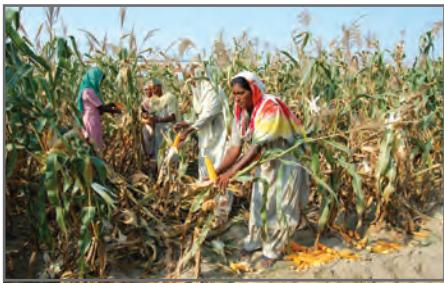

*Fig 3.10: Maize Cultivation*

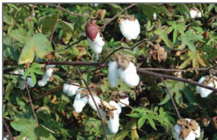

*Fig 3.11: Cotton Cultivation*

*Maize:* Maize requires moderate temperature, rainfall and lots of sunshine. It needs well-drained fertile soils. Maize is grown in North America, Brazil, China, Russia, Canada, India, and Mexico.

*Cotton:* Cotton requires high temperature, light rainfall, two hundred and ten frost-free days and bright sunshine for its growth. It grows best on black and alluvial soils. China, USA, India,

Pakistan, Brazil and Egypt are the leading producers of cotton. It is one of the main raw materials for the cotton textile industry.

*Jute:* Jute was also known as the 'Golden Fibre'. It grows well on alluvial soil and requires high temperature, heavy rainfall and humid climate. This crop is grown in

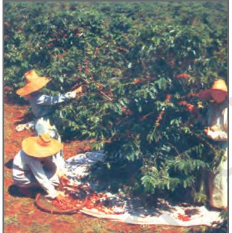

*Fig 3.12: Coffee Plantation*

the tropical areas. India and Bangladesh are the leading producers of jute.

*Coffee:* Coffee requires warm and wet climate and welldrained loamy soil. Hill slopes are more suitable for growth of this crop. Brazil is the leading producer followed by Columbia and India.

*Tea:* Tea is a beverage crop grown on plantations. This requires cool climate and well distributed high rainfall throughout the year for the growth of its tender leaves. Do you know? Maize is also know as corn. Various colourful varieties of maize are found across the world.

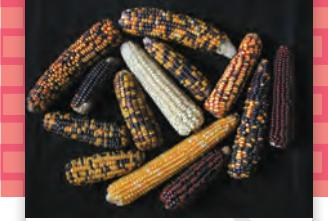

# Interesting Fact

**Who discovered the Coffee Plant?** There are different versions about the discovery of coffee. In about AD 850, Kaldi, an Arab goat-herder, who was puzzled by the queer antics of his flock, tasted the berries of the evergreen bush on which the goats were feeding. On experiencing a sense of exhilaration, he proclaimed his discovery to the world.

Agriculture 27

Chapter-3.indd 27 8/17/2022 11:35:23 AM

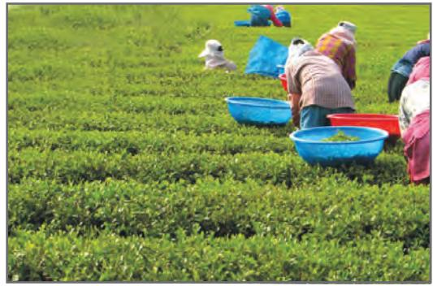

*Fig 3.13: Tea Plantation* 

### Do you know?

Food security exists when all people, at all times, have access to sufficient, safe and nutritious food to meet their dietary needs and food preferences for an active and healthy life.

It needs well-drained loamy soils and gentle slopes. Labour in large number is required to pick the leaves. Kenya, India, China, Sri Lanka produce the best quality tea in the world.

## Agricultural Development

Agricultural Development refers to efforts made to increase farm production in order to meet the growing demand of increasing

population. This can be achieved in many ways such as increasing the cropped area, the number of crops grown, improving irrigation facilities, use of fertilisers and high yielding variety of seeds. Mechanisation of agriculture is also another aspect of agricultural development. The ultimate aim of agricultural development is to increase food security.

Agriculture has developed at different places in different parts of the world. Developing countries with large populations usually practise intensive agriculture where crops are grown on small holdings mostly for subsistence. Larger holdings are more suitable for commercial agriculture as in USA, Canada and Australia. With the help of two case studies of farms — one from India and the other from the USA, let us understand about agriculture in the developing and a developed country.

# A Farm in India

There is a small village Adilabad in Ghazipur district of Uttar Pradesh. Munna Lal is a small farmer in this village who has farmland of about 1.5 hectares. His house is in the main village. He purchases high yielding varieties of

> seeds from the market every alternate year. The land is fertile and he grows atleast two crops in a year which are normally wheat or rice and pulses. The farmer takes advice of his friends and elders as well as government agricultural officers regarding farming practices. He takes a tractor on rent for ploughing his field, though some of his friends still use traditional method of using bullocks for ploughing. There is a tubewell in the nearby field which he takes on rent to irrigate his field.

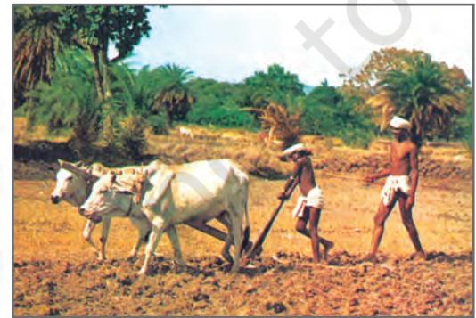

*Fig 3.14: Farmers ploughing a field*

28 Resources and Development

Chapter-3.indd 28 8/17/2022 11:35:24 AM

Munna Lal also has two buffaloes and few hens. He sells milk in the cooperative store located in the nearby town. He is a member of the co-operative society which also advises him on the type of fodder for his animals, safety measures to protect the health of the livestock and artificial insemination.

All the members of the family help him in various farm activities. Sometimes, he takes credit from a bank or the agricultural co-operative society to buy HYV seeds and implements.

He sells his produce in the *mandi* located in the nearby town. Since majority of the farmers do not have lack storage facilities, they are forced to sell the produce even when the market is not favourable to them. In recent years, the government has taken some steps to develop storage facilites.

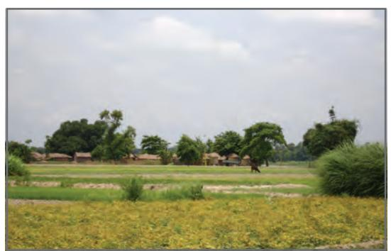

*Fig 3.15: An Agricultural Field in India*

### A Farm in the USA

The average size of a farm in the USA is much larger than that of an Indian farm. A typical farm size in the USA is about 250 hectares. The farmer generally resides in the farm. Some of the major crops grown are corn, soyabean, wheat, cotton and sugarbeet. Joe Horan, a farmer in the Midwest USA, in Iowa State owns about 300 hectares of land. He grows corn on his field after making sure that soil and water resources meet the needs

of this crop. Adequate measures are taken to control pests that can damage the crop. From time to time he sends the soil samples to a soil testing laboratory

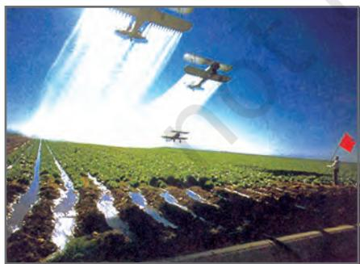

to check whether the nutrients are sufficient or not. The results help Joe Horan to plan a scientific fertiliser programme. His computer is linked to the satellite which gives him a precise picture of his field. This helps him to use chemical fertilisers *Fig 3.17: Spray of Pesticides*

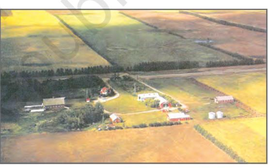

*Fig 3.16: A Farm in the USA*

Agriculture 29

Chapter-3.indd 29 8/17/2022 11:35:24 AM

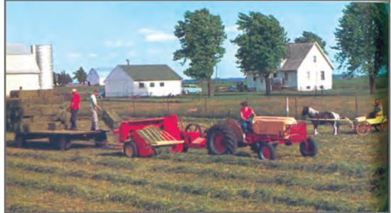

*Fig 3.18: Mechanised Harvesting in the USA*

and pesticides wherever they are required. He uses tractors, seed drills, leveller, combined harvester and thresher to perform various agricultural operations. A grains are stored in the automated grain storage or despatched to market agencies. The farmer in USA works like a businessman and not like a peasant farmer.

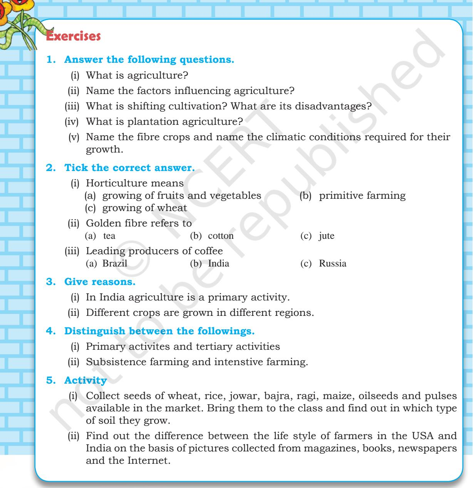

30 Resources and Development

2024-25

Chapter-3.indd 30 8/17/2022 11:35:25 AM

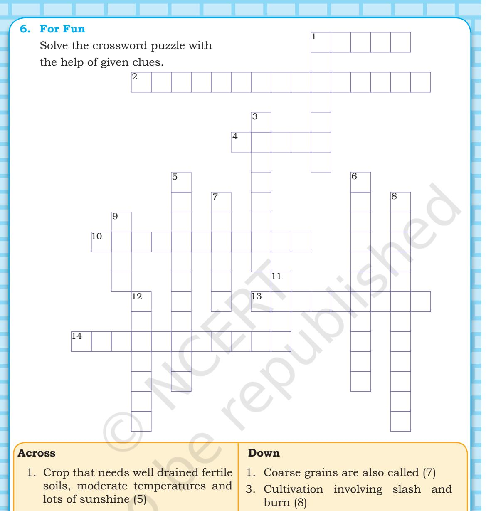

- 2. Increasing production through use of HYV seeds, chemical fertilisers and pesticides (5,10)
- 4. USA, Canada, Russia, Australia are major producers of this crop (5)
- 10. Type of farming to meet family needs (11)
- 13. Rearing of animals for sale (9)
- 14. Growing grapes for wines (11)
- 5. Growing of crops, fruits and vegetables (11)
- 6. Tea, coffee, sugarcane and rubber are grown in (11)
- 7. Requires 210 frost-free days for growth (6)
- 8. Growing of flowers (12)
- 9. Also called 'Golden Fibre' (4)
- 11. Also known as paddy (4)
- 12. Activity concerned with extraction of natural resources (7)

Agriculture 31 Agriculture 31

Chapter-3.indd 31 8/17/2022 11:35:28 AM

