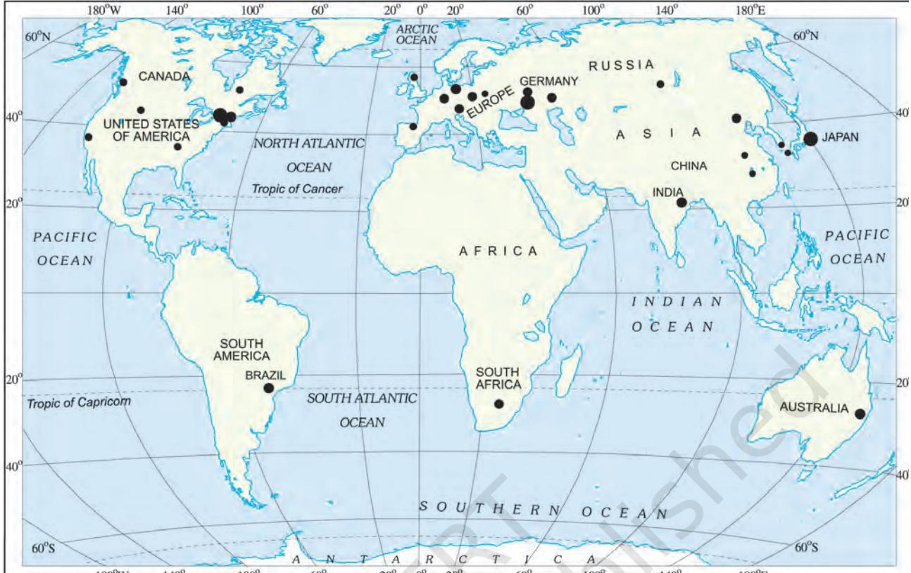

*...recycle...*

### Activity

Trace the journey of your shirt from a cotton field to your wardrobe.

*Have you ever given a thought to the fact that the note book you use for writing has come to you after a long process of manufacturing. It started its life as part of a tree. It was cut down and transported to the pulp mill. There the wood of the tree was processed and converted into wood pulp. The wood pulp was mixed with chemicals and finally changed into paper by machines. This paper found its way to the press where ink made from chemicals was used to print the lines on the pages. The pages were then bound in the form of a note book, packed and sent to the market for sale. Finally, it reached your hands.*

**Secondary activities** or **manufacturing** change raw materials into products of more value to people. As you have seen pulp was changed into paper and paper into a note book. These represent the two stages of the manufacturing process.

The paper made from pulp and cloth made from cotton have had value added to them at each stage of the manufacturing process. In this way the finished product has more value and utility than the raw material that it is made from.

**Industry** refers to an economic activity that is concerned with production of goods, extraction of minerals or the provision of services. Thus we have iron and steel industry (production of goods), coal mining industry (extraction of coal) and tourism industry (service provider).

## Classification of Industries

Industries can be classified on the basis of raw materials, size and ownership.

*Raw Materials:* Industries may be agro based, mineral based, marine based and forest based depending on the type of raw materials they use. **Agro based industries** use plant and animal based products as their raw materials. Food processing, vegetable oil, cotton textile, dairy products and leather industries are examples of agro-based industries. **Mineral based industries** are primary industries that use mineral ores as their raw materials. The products of these industries feed other industries. Iron made from iron ore is the product of mineral based industry. This is used as raw material for the manufacture of a number of other products, such as heavy machinery, building materials and railway coaches. **Marine based industries** use products from the sea and oceans as raw materials. Industries processing sea food or manufacturing fish oil are some examples. **Forest based industries** utilise forest produce as raw materials. The industries associated with forests are pulp and paper, pharmaceuticals, furniture and buildings.

*Size:* It refers to the amount of capital invested, number of people employed and the volume of production. Based on size, industries can be classified

into **small scale** and **large scale industries**. Cottage or household industries are a type of small scale industry where the products are manufactured by hand, by the artisans. Basket weaving, pottery and other handicrafts are examples of cottage industry. Small scale industries use lesser amount of capital and technology as compared to large scale industries that produce large volumes of products. Investment of capital is higher and the technology used is superior in large scale industries. Silk weaving and food processing industries are small scale industries (Fig 4.1). Production of automobiles and heavy machinery are large scale industries.

*Ownership:* Industries can be classified into private sector, state owned or public sector, joint sector and cooperative sector. **Private sector industries** are owned and operated by individuals or a group of individuals. The public sector industries are owned and operated by the government, such as Hindustan Aeronautics Limited

*Fig 4.1: Stages in food processing of Gorgon nut (makhana)*

Industries 33

*Fig 4.2: Sudha dairy in Co-operative sector*

*Fig 4.3: Locational factors for industries*

## Activity

Find out the inputs, outputs and processes involved in the manufacture of a leather shoe.

and Steel Authority of India Limited. **Joint sector industries** are owned and operated by the state and individuals or a group of individuals. Maruti Udyog Limited is an example of joint sector industry. **Co-operative sector** industries are owned and operated by the producers or suppliers of raw materials, workers or both. Anand Milk Union Limited and Sudha Dairy are a success stories of a co-operative venture.

# Factors Affecting Location of Industries

The factors affecting the location of industries are the availability of raw material, land, water, labour, power, capital, transport and market. Industries are situate d where some or all of these factors are easily available. Sometimes, the government provides incentives like subsidised power, lower transport cost and other infrastructure so that industries may be located in backward areas. Industrialisation often leads to development and growth of towns and cities.

# Industrial System

An industrial system consists of inputs, processes and outputs. The inputs are the raw materials, labour and costs of land, transport, power and other infrastructure. The processes include a wide range of activities that convert the raw material into finished products. The outputs are the end product and the income earned from it. In case of the textile industry the inputs may be cotton, human labour, factory and transport cost. The processes include ginning, spinning, weaving, dyeing and printing. The output is the shirt you wear.

# Industrial Regions

Industrial regions emerge when a number of industries locate close to each other and share the benefits of their closeness. Major industrial regions of the world are eastern North America, western and central Europe, eastern Europe and eastern Asia (Fig 4.4). Major

34 Resources and Development

*Fig 4.4: World's Industrial Regions*

industrial regions tend to be located in the temperate areas, near sea ports and especially near coal fields.

India has several industrial regions like Mumbai-Pune cluster, Bangalore-Tamil Nadu region, Hugli region, Ahmedabad-Baroda region, Chottanagpur industrial belt, Vishakhapatnam-Guntur belt, Gurgaon-Delhi-Meerut region and the Kollam-Thiruvanathapuram industrial cluster.

### Industrial Disaster

In industries, accidents/disasters mainly occur due to technical failure or irresponsible handling of hazardous material.

One of the worst industrial disasters of all time occurred in Bhopal on 3 December 1984 around 00:30 a.m. It was a technological accident in which highly poisonous Methyl Isocynate (MIC) gas along with Hydrogen Cyanide and other reaction products leaked out of the pesticide factory of Union Carbide. The official death toll was 3,598 in 1989. Thousands, who survived still suffer from one or many ailments like blindness, impaired immune system, gastrointestinal disorders, etc. *Union Carbide Factory*

Industries 35

In another incident, on 23 December 2005, due to gas well blowout in Gao Qiao, Chongging, China, 243 people died, 9,000 were injured and 64,000 were evacuated. Many people died because they were unable to run after the explosion. Those who could not escape in time suffered burns to their eyes, skin and lungs from the gas.

### Risk Reduction Measures

- 1. Densely populated residential areas should be separated far away from the industrial areas.
- 2. People staying in the vicinity of industries should be aware of the storage of toxins or hazardous substances and their possible effects in case if an accident occurs.
- 3. Fire warning and fighting system should be improved.
- 4. Storage capacity of toxic substances should be limited.
- 5. Pollution dispersion qualities in the industries should be improved.

*Rescue operation in Gao Qiao*

Do you know?

Emerging industries are also known as 'Sunrise Industries'.These include Information technology, Wellness, Hospitality and Knowledge.

#### Glossary **Smelting** It is the process in which metals are extracted from their ores by heating beyond the melting point

Distribution of Major Industries

The world's major industries are the iron and steel industry, the textile industry and the information technology industry. The iron and steel and textile industry are the older industries while information technology is an emerging industry.

The countries in which iron and steel industry is located are Germany, USA, China, Japan and Russia. Textile industry is concentrated in India, Hong Kong, South Korea, Japan and Taiwan. The major hubs of Information technology industry are the Silicon valley of Central California and the Bangalore region of India.

### Iron and Steel Industry

Like other industries iron and steel industry too comprises various inputs, processes and outputs. This is a feeder industry whose products are used as raw material for other industries.

The inputs for the industry include raw materials such as iron ore, coal and limestone, along with labour, capital, site and other infrastructure. The process of converting iron ore into steel involves many stages. The raw material is put in the blast furnace where it undergoes smelting (Fig 4.6). It is then refined. The output obtained is steel which may be used by other industries as raw material.

36 Resources and Development

*Fig 4.5: Manufacturing of steel*

Steel is tough and it can easily be shaped, cut, or made into wire. Special alloys of steel can be made by adding small amounts of other metals such as aluminium, nickel, and copper. Alloys give steel unusual hardness, toughness, or ability to resist rust.

Steel is often called the backbone of modern industry. Almost everything we use is either made of iron or steel or has been made with tools and machinery of these metals. Ships, trains, trucks, and autos are made largely of steel. Even the safety pins and the needles you use are made from steel. Oil wells are drilled with steel machinery. Steel pipelines transport oil. Minerals are mined with steel equipment. Farm machines are mostly steel. Large buildings have steel framework.

Before 1800 A.D. iron and steel industry was located where raw materials, power supply and

running water were easily available. Later the ideal location for the industry was near coal fields and close to canals and railways. After 1950, iron and steel industry began to be located on large areas of flat land near sea ports. This is because by this time steel works had become very large and iron ore had to be imported from overseas (Fig 4.7).

In India, iron and steel industry has developed taking

*Fig. 4.6: From iron ore to steel in a blast furnace*

*Fig 4.8: World: Major Iron Ore Producing Areas*

advantage of raw materials, cheap labour, transport and market. All the important steel producing centres such as Bhilai, Durgapur, Burnpur, Jamshedpur, Rourkela, Bokaro are situated in a region that spreads over four states — West Bengal, Jharkhand, Odisha and Chhattisgarh. Bhadravati and Vijay Nagar in Karnataka, Vishakhapatnam in Andhra Pradesh, Salem in Tamil Nadu are other important steel centres utilising local resources.

## Jamshedpur

Before 1947, there was only one iron and steel plant in the country – Tata Iron and Steel Company Limited (TISCO). It was privately owned. After Independence, the government took the initiative and set up several iron and steel plants. TISCO was started in 1907 at Sakchi, near the confluence of the rivers Subarnarekha and Kharkai in Jharkhand. Later on Sakchi was renamed as Jamshedpur. Geographically, Jamshedpur is the most conveniently situated iron and steel centre in the country.

38 Resources and Development

*Fig 4.9: Location of iron and steel industry in Jamshedpur*

Sakchi was chosen to set up the steel plant for several reasons. This place was only 32 km away from Kalimati station on the Bengal-Nagpur railway line. It was close to the iron ore, coal and manganese deposits as well as to Kolkata, which provided a large market. TISCO, gets coal from Jharia coalfields, and iron ore, limestone, dolomite and manganese from Odisha and Chhattisgarh. The Kharkai and Subarnarekha rivers ensured sufficient water supply. Government initiatives provided adequate capital for its later development.

In Jamshedpur, several other industrial plants were set up after TISCO. They produce chemicals, locomotive parts, agricultural equipment, machinery, tinplate, cable and wire.

The development of the iron and steel industry opened the doors to rapid industrial development in India. Almost all sectors of the Indian industry depend heavily on the iron and steel industry for their basic infrastructure. The Indian iron and steel industry consists of large integrated steel plants as well as mini Let's do With the help of an atlas identify some iron and steel industries in India and mark their location on an outline map of India.

Industries 39

steel mills. It also includes secondary producers, rolling mills and ancillary industries.

*Pittsburgh* : It is an important steel city of the United States of America. The steel industry at Pittsburgh enjoys locational advantages. Some of the raw material such as coal is available locally, while the iron ore comes from the iron mines at Minnesota, about 1500 km from Pittsburgh. Between these mines and Pittsburgh is one of the world's best routes for shipping ore cheaply – the famous Great Lakes waterway. Trains carry the ore from the Great Lakes to the Pittsburgh area. The Ohio, the Monogahela and Allegheny rivers provide adequate water supply.

Today, very few of the large steel mills are in Pittsburgh itself. They are located in the valleys of the Monogahela and Allegheny rivers above Pittsburgh and along the Ohio River below it. Finished steel is transported to the market by both land and water routes.

The Pittsburgh area has many factories other than steel mills. These use steel as their raw material to make many different products such as railroad equipment, heavy machinery and rails.

Do you know? The names of Great Lakes are Superior, Huron, Ontario, Michigan and Erie. Lake Superior is the largest of these five lakes. It lies higher upstream

than others.

# **Exercises**

#### **1. Answer the following questions.**

- (i) What is meant by the term 'industry'?
- (ii) Which are the main factors which influence the location of an industry?
- (iii) Which industry is often referred to as the backbone of modern industry and why?

#### **2. Distinguish between the following.**

- (i) Agro-based and mineral based industry
- (ii) Public sector and joint sector industry

### **3. Give two examples of the following in the space provided:**

- (i) Raw Materials: _____________ and _____________________
	- (ii) End products: _______________ and _________________________
- (iii) Tertiary Activities: ________________ and __________
- (iv) Agro-based Industries: ____________ and ____________
- (v) Cottage Industries: ___________ and ________________
- (vi) Co-operatives: ______________________ and _____________

#### **4. Activity**

How to identify a location for establishing an industry —

Divide your class into groups. Each group is a Board of Directors faced with the problem of choosing a suitable site for an iron and steel plant of Developen Dweep. A team of technical experts has submitted a report with notes and a map. The team considered access to iron ore, coal, water and limestone, as well as the main market, sources of labour and port facilities. The team has suggested two sites, X and Y. The Board of Directors has to take the final decision about where to locate the steel plant.

- • Read the report submitted by the team.
- • Study the map to find out the distances of the resources from each site.
- • Give each resource a 'weight' from 1 to 10, according to its importance. The greater the 'pull' of the factor on the industry the higher the weight from 1 to 10.
- • Complete the table on the next page.
- • The site with the lowest total should be the most satisfactory site.
- • Remember each group of directors can decide differently.

42 Resources and Development

### **Report**

**Factors/Resources affecting the location of a proposed Iron and Steel Plant on Developen Dweep.**

- *Iron ore*: This is a very large deposit of low grade iron ore. Long distance transportation of the ore would be uneconomic.
- • *Coal*: The only coalfield contains rich deposits of high grade coal. Transportation of the coal is by railway, which is relatively cheap.
- • *Limestone*: This is widely available over the island, but the purest deposits are in the Chuna Mountains.
- • *Water*: Both the tributaries of River Neel carry sufficient water to supply a large iron and steel plant in all seasons. The sea water because of its high salt content is unsuitable.
- • *Market*: It is expected that the chief market for the Plant's products will be the engineering works of Rajdhanipur. Transport costs for the products- mainly small steel bars and light steel plates would be relatively low.
- • *Labour supply*: This will have to be recruited mainly from the unskilled workers in the 3 fishing villages of Hil, Rah and Sing. It is expected that most workers will commute daily from their present homes.
- • *Port facilities*: These are at present minimal. There is a good, deep natural harbour at port Paschimpur developed to import metal alloys.

| Resource | Distance | Distance | Weighting* 1-10 | Distance X weight for | Distance X weight for |
| --- | --- | --- | --- | --- | --- |
|  | from X | from Y |  | site X | site Y |
| Iron ore |  |  |  |  |  |
| Coal |  |  |  |  |  |
| Limestone |  |  |  |  |  |
| Water |  |  |  |  |  |
| Chief market |  |  |  |  |  |
| Labour supply |  |  |  |  |  |
|  |  |  | Total = |  |  |

* the larger the pull, the higher the weighting

Industries 43

