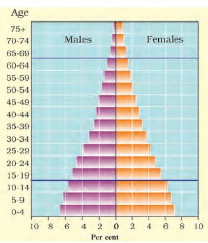

People are a nation's greatest resource. Nature's bounty becomes significant only when people find it useful. It is people with their demands and abilities that turn them into 'resources'. Hence, **human resource** is the ultimate resource. Healthy, educated and motivated people develop resources as per their requirements.

Human resources like other resources are not equally distributed over the world. They differ in their educational levels, age and sex. Their numbers and characteristics also keep changing.

## Distribution of Population

The way in which people are spread across the earth surface is known as **the pattern of population distribution**. More than 90 per cent of the world's population lives in about 30 per cent of the land surface. The distribution of population in the world is extremely uneven.

Some areas are very crowded and some are sparely populated. The crowded areas are south and south east Asia, Europe and north eastern North America. Very few people live in high latitude areas, tropical deserts, high mountains and areas of equatorial forests.

Many more people live north of the Equator than south of the Equator. Almost three-quarters of the world's people live in two continents Asia and Africa.

Sixty per cent of the world's people stay in just 10 countries. All of them have more than a 100 million people.

*Fig. 5.1: World population by continents*

*Locate and label these countries on the outline map of the world. Source: Census of India, 2011 Provisional Population Totals, Paper 1 of 2011 India Series 1*

Human Resources 45

Do you know?

Average density of population in India is 382 persons per square km.

## Density of Population

Population density is the number of people living in a unit area of the earth's surface. It is normally expressed as per square km. The average density of population in the whole world is 51 persons per square km. South Central Asia has the highest density of population followed by East and South East Asia

When all the 30 students are present, our classroom seems very crowded. But when the same class is seated in the school assembly hall, it seems so open and empty. Why?

Because the size or area of the hall is much larger than that of the classroom. However, when all the students of the school come into the hall, the hall too starts looking crowded.

## Factors Affecting Distribution of Population

#### **Geographical Factors**

*Topography:* People always prefer to live on plains rather than mountains and plateaus because these areas are suitable for farming, manufacturing and service activities. The Ganga plains are the most densely populated areas of the world while mountains like Andes, Alps and Himalayas are sparsely populated.

*Climate:* People usually avoid extreme climates that are very hot or very cold like Sahara desert, polar regions of Russia, Canada and Antarctica.

*Soil:* Fertile soils provide suitable land for agriculture. Fertile plains such as Ganga and Brahmaputra in India, Hwang-He, Chang Jiang in China and the Nile in Egypt are densely populated.

*Water:* People prefer to live in the areas where fresh water is easily available. The river valleys of the world are densely populated while deserts have spare population.

*Minerals:* Areas with mineral deposits are more populated. Diamond mines of South Africa and discovery of oil in the Middle east lead to settling of people in these areas.

#### **Social, Cultural and Economic Factors**

*Social:* Areas of better housing, education and health facilities are more densely populated e.g., Pune.

#### Activity

Look at Fig 5.2 and find out: of these countries how many are in Asia? Colour them on a world map.

*Cultural:* Places with religion or cultural significance attract people. Varanasi, Jerusalem and Vatican city are some examples.

*Economic:* Industrial areas provide employment opportunities. Large number of people are attracted to these areas. Osaka in Japan and Mumbai in India are two densely populated areas.

## Population Change

The population change refers to change in the number of people during a specific time. The world population has not been stable. It has increased manifold as seen in the Fig 5.3. Why? This is actually due to changes in the number of births and deaths. For an extremely long period of human history, until the 1800s, the world's population grew steadily but slowly. Large numbers of babies were born, but they died early too. This was as there were no proper health facilities. Sufficient food was not available for all the people. Farmers were not able to produce enough to meet the food requirements of all the people. As a result the total increase in population was very low.

In 1804, the world's population reached one billion. A hundred and fifty five years later, in 1959, the world's population reached 3 billion. This is often called population explosion. In 1999, 40 years later, the population doubled to 6 billion. The main reason for this growth was that with better food supplies and medicine, deaths were reducing, while the number of births still remained fairly high.

Births are usually measured using the **birth rate** i.e. the number of live births per 1,000 people. Deaths are usually measured using the **death rate** i.e. the number of deaths per 1,000 people. **Migrations** is the movement of people in and out of an area.

Births and deaths are the natural causes of population change. The difference between the birth rate and the death rate of a country is called the **natural growth rate**.

The population increase in the world is mainly due to rapid increase in natural growth rate.

Glossary **Life expectancy** It is the number of years that an average person can expect to live.

Human Resources 47

*Birth rate more than death rate: population increase*

*Birth rate and death rate same: population stays the same* 

*Death rate more than birth rate:population decreases*

Polpulation decrease

Population Decrease

Birth Rate

Death Rate

*Fig 5.4: Balance of Population*

Migration is another way by which population size changes. People may move within a country or between countries. **Emigrants** are people who leave a country; **Immigrants** are those who arrive in a country.

Countries like the United States of America and Australia have gained in-numbers by **in-migration** or **immigration**. Sudan is an example of a country that has experienced a loss in population numbers due to **out-migration** or **emigration**.

The general trend of international migrations is from the less developed nations to the more developed nations in search of better employment opportunities. Within countries large number of people may move from the rural to urban areas in search of employment, education and health facilities.

## Patterns of Population Change

Rates of population growth vary across the world (Fig 5.5). Although, the world's total population is rising rapidly, not all countries are experiencing this growth.

Some countries like Kenya have high population growth rates. They had both high birth rates and death rates. Now, with improving health care, death rates have fallen, but birth rates still remain high leading to high growth rates.

In other countries like United Kingdom, population growth is slowing because of both low death and low birth rates.

48 Resources and Development

*Fig. 5.5: World: Differing rates of population growth*

# Population Composition

How crowded a country is, has little to do with its level of economic development. For example, both Bangladesh and Japan are very densely populated but Japan is

far more economically developed than Bangladesh.

To understand the role of people as a resource, we need to know more about their qualities. People vary greatly in their age, sex, literacy level, health condition, occupation and income level. It is essential to understand these characteristics of the people. Population composition refers to the structure of the population.

The composition of population helps us to know

Human Resources 49

how many are males or females, which age group they belong to, how educated they are and what type of occupations they are employed in, what their income levels and health conditions are.

An interesting way of studying the population composition of a country is by looking at the population pyramid, also called an age-sex pyramid.

A population pyramid shows

- • The total population divided into various age groups, e.g., 5 to 9 years, 10 to 14 years.
- • The percentage of the total population, subdivided into males and females, in each of those groups.

The shape of the population pyramid tells the story of the people living in that particular country. The numbers of children (below 15 years) are shown at the bottom and reflect the level of births. The size of the top shows the numbers of aged people (above 65 years) and reflects the number of deaths.

The population pyramid also tells us how many dependents there are in a country. There are two groups of dependents — young dependents (aged below 15 years) and elderly dependents (aged over 65 years). Those of the working age are the economically active.

The population pyramid of a country in which birth and death rates bothe are high is broad at the base and rapidly narrows towards the top. This is because

although, many children are born, a large percentage of them die in their infancy, relatively few become adults and there are very few old people. This situation is typified by the pyramid shown for Kenya (Fig 5.7).

In countries where death rates (especially amongst the very young) are decreasing, the pyramid is broad in the younger

age groups, because more infants survive

to adulthood. This can be seen in the pyramid for India (Fig 5.8). Such populations contain a relatively large number of young people and which means a strong and expanding labour force.

In countries like Japan, low birth rates make the pyramid narrow at the base (Fig 5.9). Decreased death rates allow numbers of people to reach old age.

Skilled, spirited and hopeful young people endowed with a positive outlook are the future of any nation. We in India are fortunate to have such a resource. They must be educated and provided skills and opportunities to become able and productive.

*Fig. 5.7: Population Pyramid of Kenya*

*Fig. 5.9: Population Pyramid of Japan*

Human Resources 51

# **Exercise**

#### **1. Answer the following questions.**

- (i) Why are people considered a resource?
- (ii) What are the causes for the uneven distribution of population in the world?
- (iii) The world population has grown very rapidly. Why?
	- (iv) Discuss the role of any two factors influencing population change.
	- (v) What is meant by population composition?
	- (vi) What are population pyramids? How do they help in understanding about the population of a country?

#### **2. Tick the correct answer.**

- (i) Which does the term population distribution refer to?
- (a) How population in a specified area changes over time.
- (b) The number of people who die in relation to the number of people born in a specified area.
- (c) The way in which people are spread across a given area.
	- (ii) Which are three main factors that cause population change?
- (a) Births, deaths and marriage
- (b) Births, deaths and migration
- (c) Births, deaths and life expectancy
	- (iii) In 1999, the world population reached
- (a) 1 billion (b) 3 billion (c) 6 billion
	- (iv) What is a population pyramid?
- (a) A graphical presentation of the age, sex composition of a population.
- (b) When the population density of an area is so high that people live in tall buildings.
- (c) Pattern of population distribution in large urban areas.

#### **3. Complete the sentences below using some of the following words.**

sparsely, favourable, fallow, artificial, fertile, natural, extreme, densely

- When people are attracted to an area it becomes ....................... populated
Factors that influence this include ....................... climate; good

supplies of ....................... resources and ....................... land.

52 Resources and Development

#### **4. Activity**

Discuss the characteristics of a society with 'too many under 15s' and one with 'too few under 15s'.

*Hint : need for schools; pension schemes, teachers, toys, wheel chairs, labour supply, hospitals.* 

### *Some Internet Sources for More Information*

www.ndmindia.nic.in www.environmentdefense.org www.freefoto.com www.worldgame.org/worldmeters www.cseindia.org www.mnes.nic.in www.undp.org/popin

Human Resources 53

