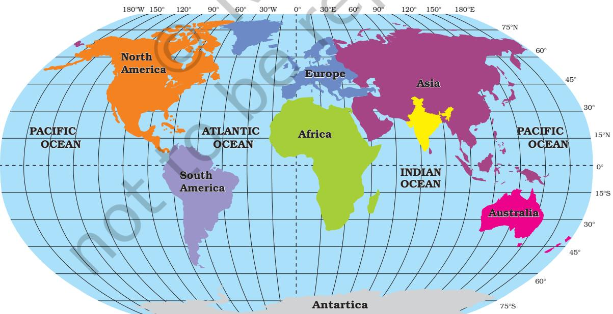
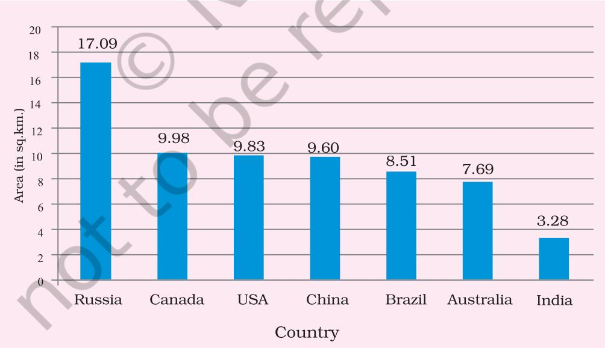
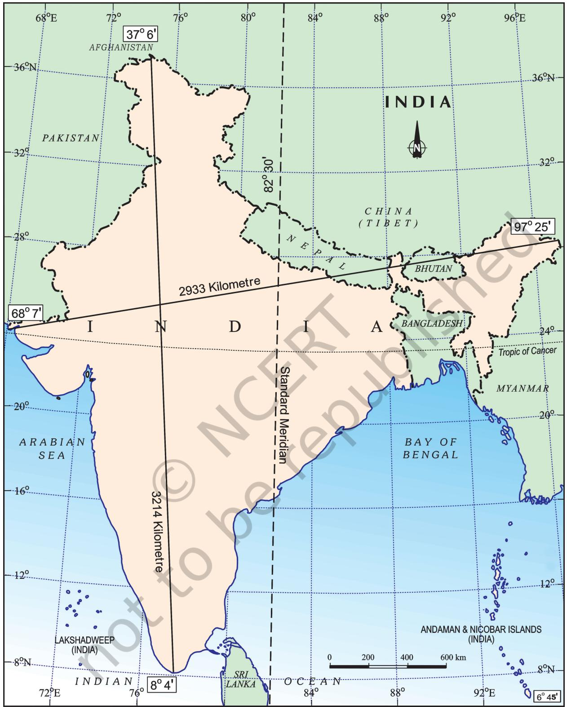
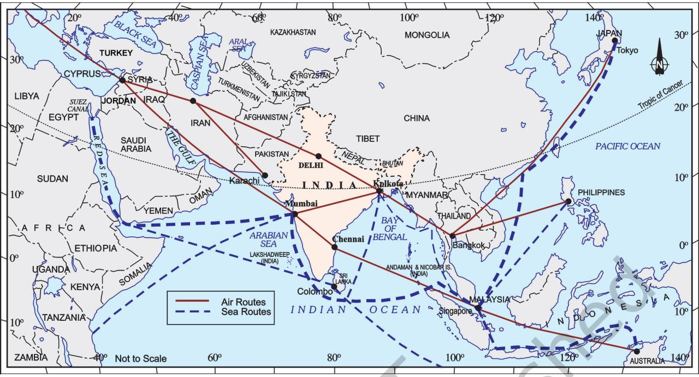
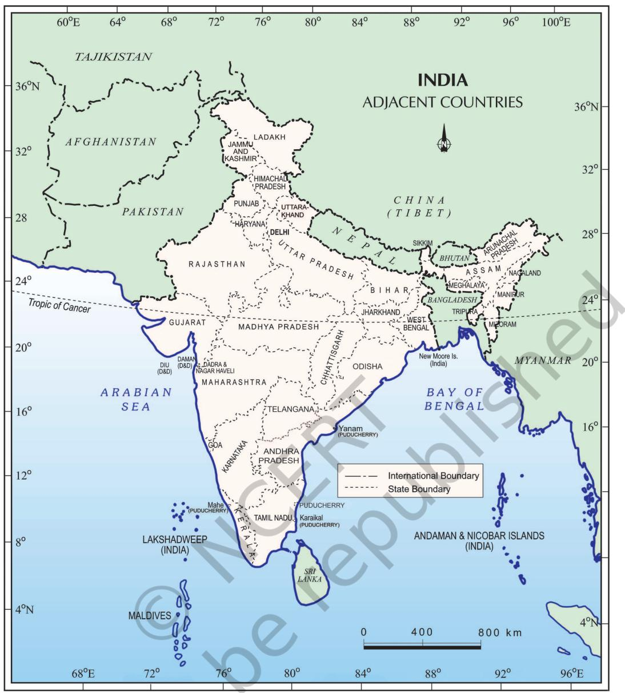

# 1

# INDIA – SIZE AND LOCATION

I ndia is one of the ancient civilisations in the world. It has achieved multi-faceted socioeconomic progress during the last five decades. It has moved forward displaying remarkable progress in the field of agriculture, industry, technology and overall economic development. India has also contributed significantly to the making of world history.

# LOCATION

India is a vast country. Lying entirely in the Northern hemisphere (Figure 1.1) the main land extends between latitudes 8°4'N and 37°6'N and longitudes 68°7'E and 97°25'E. The Tropic of Cancer (23° 30'N) divides the country into almost two equal parts. To the southeast and southwest of the mainland, lie the Andaman and Nicobar islands and the Lakshadweep islands in Bay of Bengal and Arabian Sea respectively. Find out the extent of these groups of islands from your atlas.

# SIZE

The land mass of India has an area of 3.28 million square km. India's total area accounts for about 2.4 per cent of the total geographical

*Figure 1.1 : India in the World*

area of the world. From Figure 1.2 it is clear that India is the seventh largest country of the world. India has a land boundary of about 15,200 km and the total length of the coastline of the mainland, including Andaman and Nicobar and Lakshadweep, is 7,516.6 km.

India is bounded by the young fold mountains in the northwest, north and northeast. South of about 22° north latitude, it begins to taper, and extends towards the Indian Ocean, dividing it into two seas, the Arabian Sea on the west and the Bay of Bengal on its east.

Look at Figure 1.3 and note that the latitudinal and longitudinal extent of the mainland is about 30°. Despite this fact, the east-west extent appears to be smaller than the north-south extent.

From Gujarat to Arunachal Pradesh, there is a time lag of two hours. Hence, time along the Standard Meridian of India (82°30'E) passing through Mirzapur (in Uttar Pradesh) is taken as the standard time for the whole country. The latitudinal extent influences the duration of day and night, as one moves from south to north.

- Why 82°30'E has been selected as the Standard Meridian of India?
- Why is the difference between the durations of day and night hardly felt at Kanniyakumari but not so in Kashmir?

# INDIA AND THE WORLD

The Indian landmass has a central location between the East and the West Asia. India is a southward extension of the Asian continent. The trans Indian Ocean routes, which connect the countries of Europe in the West and the countries of East Asia, provide a strategic central location to India. Note that the Deccan Peninsula protrudes into the Indian Ocean, thus helping India to establish close contact with West Asia, Africa and Europe from the western coast and with Southeast and East Asia from the eastern coast. No other country has a long coastline on the Indian Ocean as India has and indeed, it is India's eminent position in the Indian Ocean, which justifies the naming of an Ocean after it.

Since the opening of the Suez Canal in 1869, India's distance from Europe has been reduced by 7,000 km.

*Figure 1.2 : Seven Largest Countries of the World Source :* United Nations Demographic Year Book 2015

2 CONTEMPORARY INDIA-I

*Figure 1.3 : India : Extent and Standard Meridian*

*Figure 1.4 : India on International Highway of Trade and Commerce*

India's contacts with the World have continued through ages but her relationships through the land routes are much older than her maritime contacts. The various passes across the mountains in the north have provided passages to the ancient travellers, while the oceans restricted such interaction for a long time.

These routes have contributed in the exchange of ideas and commodities since ancient times. The ideas of the *Upanishads* and the *Ramayana*, the stories of *Panchtantra*, the Indian numerals and the decimal system thus could reach many parts of the world. The spices, muslin and other merchandise were taken from India to different countries. On the other hand, the influence of Greek sculpture, and the architectural styles of dome and minarets from West Asia can be seen in different parts of our country.

# INDIA'S NEIGHBOURS

India occupies an important strategic position in South Asia. India has 28 states and Eight Union Territories (Figure 1.5).

# • The number of Union Territories along the western and eastern coasts.

- Area-wise which is the smallest and which is the largest state?
- The states which do not have an international border or lie on the coast.
- Classify the states into four groups each having common frontiers with
- (i) Pakistan, (ii) China, (iii) Myanmar, and (iv) Bangladesh.

India shares its land boundaries with Pakistan and Afghanistan in the northwest, China (Tibet), Nepal and Bhutan in the north and Myanmar and Bangladesh in the east. Our southern neighbours across the sea consist of the two island countries, namely

# Before 1947, there were two types of states in India — the provinces and the Princely states. Provinces were ruled directly by British officials, who were appointed by the Viceroy. Princely states were ruled by local, hereditary rulers, who acknowledged sovereignity

in return for local autonomy.

*Figure 1.5 : India and Adjacent Countries*

Sri Lanka and Maldives. Sri Lanka is separated from India by a narrow channel of sea formed by the Palk Strait and the Gulf of Mannar, while Maldives Islands are situated to the south of the Lakshadweep Islands.

India has had strong geographical and historical links with her neighbours. Look at the physical map of Asia in your atlas, and note how India stands apart from the rest of Asia.

 School Bhuvan, NCERT is a portal providing map-based learning to bring awareness among the students about the country's natural resources, environment and their role in sustainable development. It is an initiative of Bhuvan — NRSC/ISRO based on NCERT syllabus. You can explore various maps of India related to the secondary stage on https://bhuvan-app1.nrsc.gov.in/mhrd_ncert/

# EXERCISE

- 1. Choose the right answer from the four alternatives given below.

| (i) | The Tropic of Cancer does not pass through |  |
| --- | --- | --- |
|  | (a) (c) Chhattisgarh | Rajasthan |
|  | (b) (d) Tripura | Odisha |
| (ii) | The easternmost longitude of India is |  |
|  | (a) (c) 77° 6' E | 97° 25' E |
|  | (b) (d) 82° 32' E | 68° 7' E |
| (iii) | Uttarakhand, Uttar Pradesh, Bihar, West Bengal and Sikkim have common |  |
|  |  | frontiers with |
|  | (a) (c) Nepal | China |
|  | (b) (d) Myanmar | Bhutan |
| (iv) | If you intend to visit Kavarati during your summer vacations, which one of |  |
|  | the following Union Territories of India you will be going to |  |
|  | (a) (c) Andaman and Nicobar | Puducherry |
|  | (b) (d) Daman and Diu | Lakshadweep |
| (v) | My friend hails from a country which does not share land boundary with |  |
|  | India. Identify the country. |  |
|  | (a) (c) Bangladesh | Bhutan |
|  | (b) (d) Nepal | Tajikistan |
| 2 | Answer the following questions briefly. |  |
| (i) | Name the group of islands lying in the Arabian Sea. |  |

- (ii) Name the countries which are larger than India.
- (iii) Which island group of India lies to its south-east?
- (iv) Which island countries are our southern neighbours?
- 3 The sun rises two hours earlier in Arunachal Pradesh as compared to Gujarat in the west but the watches show the same time. How does this happen?
- 4 The central location of India at the head of the Indian Ocean is considered of great significance. Why?

# MAP SKILLS

- 1. Identify the following with the help of map reading.
	- (i) The island groups of India lying in the Arabian Sea and the Bay of Bengal.
	- (ii) The countries constituting Indian subcontinent.
	- (iii) The States through which the Tropic of Cancer passes.
	- (iv) The northernmost latitude in degrees.
	- (v) The southernmost latitude of the Indian mainland in degrees.
	- (vi) The eastern and the western-most longitude in degrees.
	- (vii) The place situated on the three seas.
	- (viii) The strait separating Sri Lanka from India.
	- (ix) The Union Territories of India.

# PROJECT/ACTIVITY

- (i) Find out the longitudinal and latitudinal extent of your state.
- (ii) Collect information about the 'Silk Route'. Also find out the new developments, which are improving communication routes in the regions of high altitude.

6 CONTEMPORARY INDIA-I

