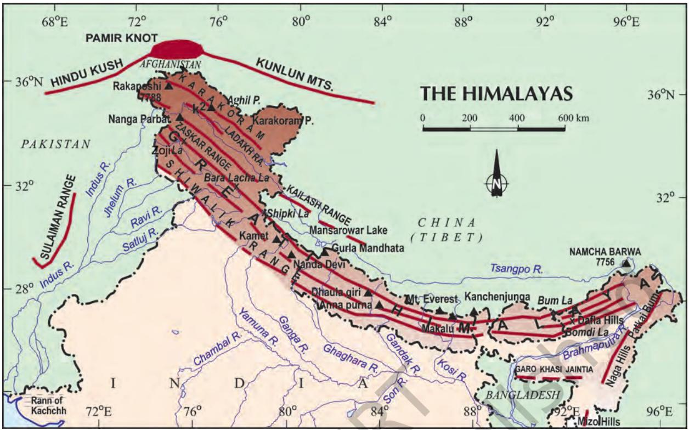
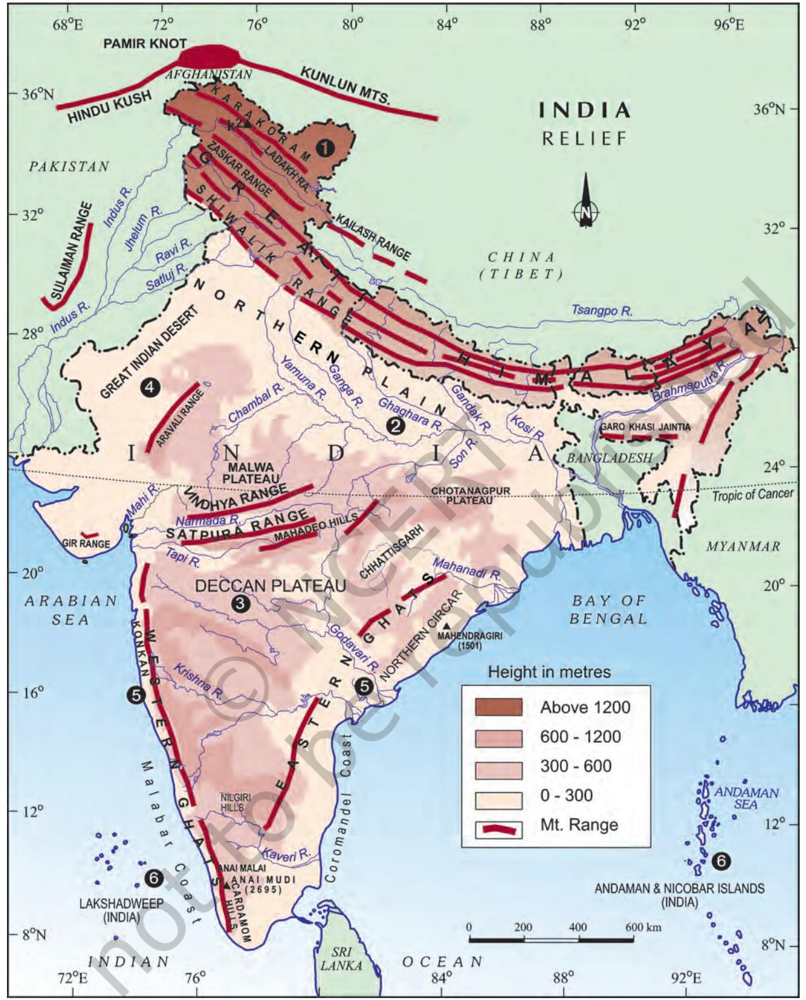
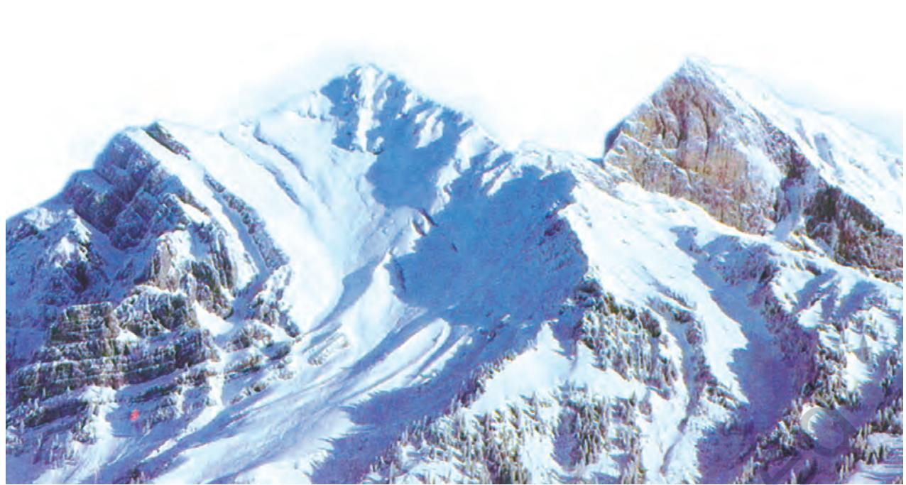
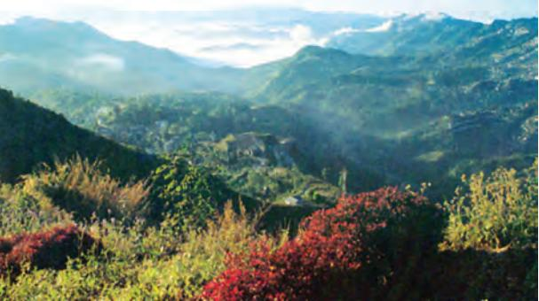
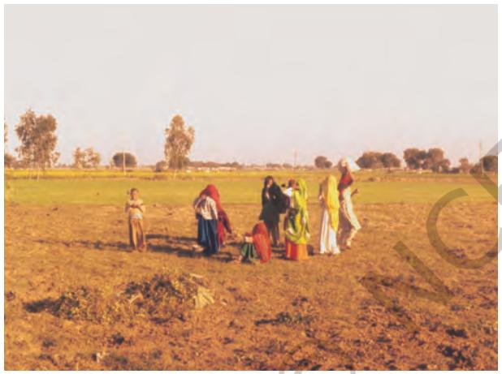
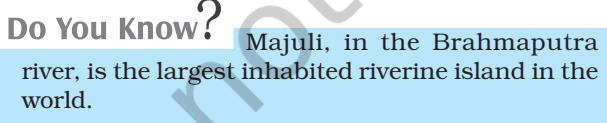
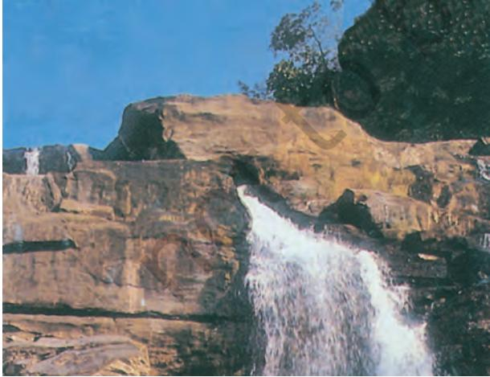
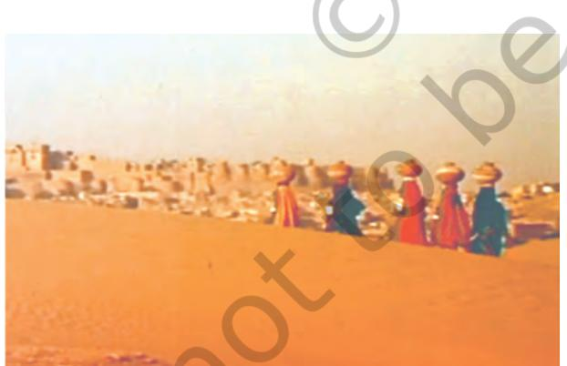
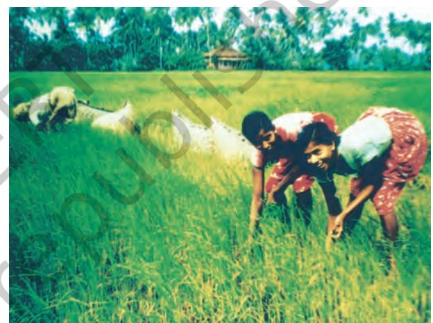
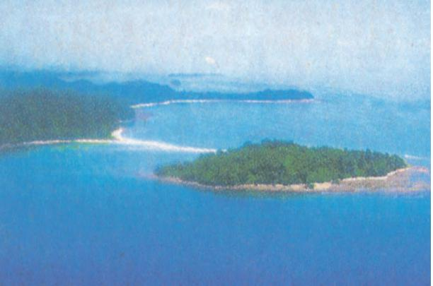

# 2

# PHYSICAL FEATURES OF INDIA

Y ou have already learnt earlier that India is a vast country with varied land forms. What kind of terrain do you live in? If you live in the plains, you are familiar with the vast stretches of plain land. In contrast, if you live in hilly region, the rugged terrain with mountains and valleys are common features. In fact, our country has practically all major physical features of the earth, i.e., mountains, plains, deserts, plateaus and islands.

The land of India displays great physical variation. Geologically, the Peninsular Plateau constitutes one of the ancient landmasses on the earth's surface. It was supposed to be one of the most stable land blocks. The Himalayas and the Northern Plains are the most recent landforms. From the view point of geology, Himalayan mountains form an unstable zone. The whole mountain system of Himalaya represents a very youthful topography with high peaks, deep valleys and fast flowing rivers. The northern plains are formed of alluvial deposits. The peninsular plateau is composed of igneous and metamorphic rocks with gently rising hills and wide valleys.

# MAJOR PHYSIOGRAPHIC DIVISIONS

The physical features of India can be grouped under the following physiographic divisions (Figure 2.2):

- (1) The Himalayan Mountains
- (2) The Northern Plains
- (3) The Peninsular Plateau
- (4) The Indian Desert
- (5) The Coastal Plains
- (6) The Islands

### The Himalayan Mountains

The Himalayas, geologically young and structurally fold mountains stretch over the northern borders of India. These mountain ranges run in a west-east direction from the Indus to the Brahmaputra. The Himalayas represent the loftiest and one of the most rugged mountain barriers of the world. They form an arc, which covers a distance of about 2,400 Km. Their width varies from 400 Km in Kashmir to 150 Km in Arunachal Pradesh. The altitudinal variations are greater in the eastern half than those in the western half. The Himalaya consists of three parallel ranges in its longitudinal extent. A number of valleys lie between these ranges. The northern-most range is known as the Great or Inner Himalayas or the *Himadri.* It is the most continuous range consisting of the loftiest peaks with an average height of 6,000 metres. It contains all prominent Himalayan peaks.

*Figure 2.1 : Himalayas*

| Some Highest Peaks of the Himalayas |  |  |
| --- | --- | --- |
| Peak | Country | Height |
|  |  | in metres |
| Mt. Everest | Nepal | 8848 |
| Kanchenjunga | India | 8598 |
| Makalu | Nepal | 8481 |
| Dhaulagiri | Nepal | 8172 |
| Nanga Parbat | India | 8126 |
| Annapurna | Nepal | 8078 |
| Nanda Devi | India | 7817 |
| Kamet | India | 7756 |
| Namcha Barwa | India | 7756 |
| Gurla Mandhata | Nepal | 7728 |

The folds of the Great Himalayas are asymmetrical in nature. The core of this part of Himalayas is composed of granite. It is perennially snow bound, and a number of glaciers descend from this range.

• The names of the glaciers and passes that lie in the Great Himalayas.

- The name of the states where the highest peaks are located.
The range lying to the south of the Himadri forms the most rugged mountain system and is known as *Himachal* or lesser Himalaya. The ranges are mainly composed of highly compressed and altered rocks. The altitude varies between 3,700 and 4,500 metres and the average width is of 50 Km. While the *Pir Panjal range* forms the longest and the most important range, the *Dhaula Dhar* and the *Mahabharat* ranges are also prominent ones. This range consists of the famous valley of Kashmir, the Kangra and Kullu Valley in Himachal Pradesh. This region is well-known for its hill stations.

• Location of Mussoorie, Nainital, Ranikhet from your atlas and also name the state where they are located.

The outer-most range of the Himalayas is called the **Shiwaliks.** They extend over a width

*Figure 2.2 : Relief*

**PHYSICAL FEATURES OF INDIA 9**

*Figure 2.3 : The Himalayas*

of 10-50 Km and have an altitude varying between 900 and 1100 metres. These ranges are composed of unconsolidated sediments brought down by rivers from the main Himalayan ranges located farther north. These valleys are covered with thick gravel and alluvium. The longitudinal valley lying between lesser Himalaya and the Shiwaliks are known as Duns. Dehra Dun, Kotli Dun and Patli Dun are some of the well-known Duns.

Besides the longitudinal divisions, the Himalayas have been divided on the basis of regions from west to east. These divisions have been demarcated by river valleys. For example, the part of Himalayas lying between Indus and Satluj has been traditionally known as Punjab Himalaya but it is also known regionally as Kashmir and Himachal Himalaya from west to east respectively. The part of the Himalayas lying between Satluj and Kali rivers is known as Kumaon Himalayas. The Kali and Teesta rivers demarcate the Nepal Himalayas and the part lying between Teesta and Dihang rivers is known as Assam Himalayas. There are regional names also in these broad categories. Find out some regional names of the Himalayas

The Brahmaputra marks the eastern-most boundary of the Himalayas. Beyond the Dihang gorge, the Himalayas bend sharply to the south and spread along the eastern boundary of India. They are known as the *Purvachal* or the Eastern hills and mountains. These hills running through the north-eastern states are mostly composed of strong sandstones, which are sedimentary rocks. Covered with dense forests, they mostly run as parallel ranges and valleys. The *Purvachal* comprises the *Patkai hills*, the *Naga hills, the Manipur hills* and the *Mizo hills.*

*Figure 2.4 : Mizo Hills*

10 CONTEMPORARY INDIA-I

### The Northern Plain

The northern plain has been formed by the interplay of the three major river systems, namely — the Indus, the Ganga and the Brahmaputra along with their tributaries. This plain is formed of alluvial soil. The deposition of alluvium in a vast basin lying at the foothills of the Himalaya over millions of years, formed this fertile plain. It spreads over an area of 7 lakh sq. km. The plain being about 2400 km long and 240 to 320 km broad, is a densely populated physiographic division. With a rich soil cover combined with adequate water supply and favourable climate it is agriculturally a productive part of India.

*Figure 2.5 : The Northern Plains*

The rivers coming from northern mountains are involved in depositional work. In the lower course, due to gentle slope, the velocity of the river decreases, which results in the formation of riverine islands.

The rivers in their lower course split into numerous channels due to the deposition of silt. These channels are known as *distributaries*.

The Northern Plain is broadly divided into three sections. The Western part of the Northern Plain is referred to as the Punjab Plains. Formed by the Indus and its tributaries, the larger part of this plain lies in Pakistan. The Indus and its tributaries — the Jhelum, the Chenab, the Ravi, the Beas and the Satluj originate in the Himalaya. This section of the plain is dominated by the *doabs*.

'Doab' is made up of two words — 'do' meaning two and 'ab' meaning water. Similarly 'Punjab', is also made up two words — 'Punj' meaning five and 'ab' meaning water.

The Ganga plain extends between Ghaggar and Teesta rivers. It is spread over North India in Haryana, Delhi, U.P., Bihar, partly Jharkhand and West Bengal. In the East, particularly in Assam lies the Brahmaputra plain.

The northern plains are generally described as flat land with no variations in its relief. It is not true. These vast plains also have diverse relief features. According to the variations in relief features, the Northern plains can be divided into four regions. The rivers, after descending from the mountains deposit pebbles in a narrow belt of about 8 to 16 km in width lying parallel to the slopes of the Shiwaliks. It is known as *bhabar*. All the streams disappear in this *bhabar* belt. South of this belt, the streams and rivers re-emerge and create a wet, swampy and marshy region known as *terai*. This was a thickly forested region full of wildlife. The forests have been cleared to create agricultural land and to settle migrants from Pakistan after partition. Locate Dudhwa National Park in this region.

The largest part of the northern plain is formed of older alluvium. It lies above the floodplains of the rivers and presents a terracelike feature. This part is known as *bhangar*. The soil in this region contains calcareous deposits, locally known as *kankar*. The newer, younger deposits of the floodplains are called *khadar*. They are renewed almost every year and so are fertile, thus, ideal for intensive agriculture.

## The Peninsular Plateau

The Peninsular plateau is a tableland composed of the old crystalline, igneous and metamorphic rocks. It was formed due to the breaking and drifting of the Gondwana land and thus, making it a part of the oldest landmass. The plateau has broad and shallow valleys and rounded hills. This plateau consists of two broad divisions, namely, the Central Highlands and the Deccan Plateau. The part of the Peninsular plateau lying to the north of the Narmada river, covering a major area of the Malwa plateau, is known as the Central Highlands. The Vindhyan range is bounded by the Satpura range on the south and the Aravalis on the northwest. The further westward extension gradually merges with the sandy and rocky desert of Rajasthan. The flow of the rivers draining this region, namely the Chambal, the Sind, the Betwa and the Ken is from southwest to northeast, thus indicating the slope. The Central Highlands are wider in the west but narrower in the east. The eastward extensions of this plateau are locally known as the *Bundelkhand* and *Baghelkhand.*

The Chotanagpur plateau marks the further eastward extension, drained by the Damodar river.

The Deccan Plateau is a triangular landmass that lies to the south of the river Narmada. The Satpura range flanks its broad base in the north, while the Mahadev, the Kaimur hills and the Maikal range form its eastern extensions. Locate these hills and ranges in the Physical map of India. The Deccan Plateau is higher in the west and slopes gently eastwards. An extension of the Plateau is also visible in the northeast, locally known as the Meghalaya, Karbi-Anglong Plateau and North Cachar Hills. It is separated by a fault from the Chotanagpur Plateau. Three prominent hill ranges from the west to the east are the Garo, the Khasi and the Jaintia Hills.

The Western Ghats and the Eastern Ghats mark the western and the eastern edges of the Deccan Plateau respectively. Western Ghats lie parallel to the western coast. They are continuous and can be crossed through passes only. Locate the Thal, Bhor and Pal Ghats in the Physical map of India.

The Western Ghats are higher than the Eastern Ghats. Their average elevation is 900– 1600 metres as against 600 metres of the Eastern Ghats. The Eastern Ghats stretch from the Mahanadi Valley to the Nigiris in the south. The Eastern Ghats are discontinuous and irregular and dissected by rivers draining into the Bay of Bengal. The Western Ghats cause orographic rain by facing the rain bearing moist winds to rise along the western slopes of the Ghats. The Western Ghats are known by different local names. The height of the Western Ghats progressively increases from north to south. The highest peaks include the Anai Mudi (2,695 metres) and the Doda Betta (2,637 metres). Mahendragiri (1,501 metres) is the highest peak in the Eastern Ghats. Shevroy Hills and the Javadi Hills are located to the southeast of the *Figure 2.6 : A Waterfall in Chotanagpur Plateau*

Eastern Ghats. Locate the famous hill stations of Udagamandalam, popularly known as Ooty and the Kodaikanal.

One of the distinct features of the Peninsular plateau is the black soil area known as Decean Trap. This is of volcanic origin, hence, the rocks are igneous. Actually, these rocks have denuded over time and are responsible for the formation of black soil. The Aravali Hills lie on the western and northwestern margins of the Peninsular plateau. These are highly eroded hills and are found as broken hills. They extend from Gujarat to Delhi in a southwest-northeast direction.

# The Indian Desert

The Indian desert lies towards the western margins of the Aravali Hills. It is an undulating sandy plain covered with sand dunes. This region receives very low rainfall below 150 mm per year. It has arid climate with low vegetation cover. Streams appear during the rainy season. Soon after they disappear into the sand as they do not have enough water to reach the sea. Luni is the only large river in this region.

*Figure 2.7 : The Indian Desert*

Barchans (crescent-shaped dunes) cover larger areas but longitudinal dunes become more prominent near the Indo-Pakistan boundary. If you visit Jaisalmer, you may go to see a group of barchans.

# The Coastal Plains

The Peninsular plateau is flanked by stretch of narrow coastal strips, running along the *Arabian Sea* on the *west* and the *Bay of Bengal* on the *east*. The *western coast*, sandwiched between the Western Ghats and the Arabian Sea, is a narrow plain. It consists of three sections. The *northern* part of the coast is called the *Konkan* (Mumbai – Goa), the central stretch is called the *Kannad Plain,* while the *southern* stretch is referred to as the *Malabar coast*.

*Figure 2.8 : The Coastal Plains*

The plains along the Bay of Bengal are wide and level. In the northern part, it is referred to as the *Northern Circar*, while the *southern* part is known as the *Coromandel Coast*. Large rivers, such as the Mahanadi, the Godavari, the Krishna and the Kaveri have formed extensive delta on this coast. Lake Chilika is an important feature along the eastern coast.

The Chilika Lake is the largest salt water lake in India. It lies in the state of Odisha, to the south of the Mahanadi delta.

### The Islands

You have already seen that India has a vast mainland. Besides this, the country has two groups of islands. Can you identify these island groups?

*Figure 2.9 : An Island*

Locate the Lakshadweep Islands group lying close to the Malabar coast of Kerala. This group of islands is composed of small coral isalnds. Earlier they were known as Laccadive, Minicoy and Amindive. In 1973, these were named as Lakshadweep. It covers small area of 32 sq km. Kavaratti island is the administrative headquarters of Lakshadweep. This island group has great diversity of flora and fauna. The Pitti island, which is uninhabited, has a bird sanctuary.

### Corals

Coral polyps are short-lived microscopic organisms, which live in colonies. They flourish in shallow, mud-free and warm waters. They secrete calcium carbonate. The coral secretion and their skeletons from coral deposits in the form of reefs: they are mainly of three kinds: barrier reef. fringing reef and atolls. The Great Barrier Reef of Australia is a good example of the first kind of coral reefs. Atolls are circular or horse shoe-shaped coral reefs.

Now you see the elongated chain of islands located in the Bay of Bengal extending from north to south. These are Andaman and Nicobar islands. They are bigger in size and are more numerous and scattered. The entire group of islands is divided into two broad categories – The Andaman in the north and the Nicobar in the south. It is believed that these islands are an elevated portion of submarine mountains. These island groups are of great strategic importance for the country. There is great diversity of flora and fauna in this group of islands too. These islands lie close to equator and experience equatorial climate and has thick forest cover.

India's only active volcano is found on Barren island in Andaman and Nicobar group of Islands.

A detailed account of the different physiographic units highlights the unique features of each region. It would, however, be clear that each region complements the other and makes the country richer in its natural resources. The mountains are the major sources of water and forest wealth. The northern plains are the granaries of the country. They provide the base for early civilisations. The plateau is a storehouse of minerals, which has played a crucial role in the industrialisation of the country. The coastal region and island groups provide sites for fishing and port activities. Thus, the diverse physical features of the land have immense future possibilities of development.

14 CONTEMPORARY INDIA-I

# EXERCISE

- 1. Choose the right answer from the four alternatives given below.
	- (i) A landmass bounded by sea on three sides is referred to as
		- (a) Coast (c) Peninsula
		- (b) Island (d) None of the above
	- (ii) Mountain ranges in the eastern part of India forming its boundary with Myanmar are collectively called
		- (a) Himachal (c) Purvachal
		- (b) Uttarakhand (d) None of the above
	- (iii) The western coastal strip, south of Goa is referred to as
		- (a) Coromandel (c) Kannad
		- (b) Konkan (d) Northern Circar
	- (iv) The highest peak in the Eastern Ghats is
		- (a) Anai Mudi (c) Mahendragiri
		- (b) Kanchenjunga (d) Khasi
- 2 Answer the following questions briefly.
	- (i) What is the *bhabar*?
	- (ii) Name the three major divisions of the Himalayas from north to south.
	- (iii) Which plateau lies between the Aravali and the Vindhyan ranges?
	- (iv) Name the island group of India having coral origin.
- 3. Distinguish between
	- (i) *Bhangar and Khadar*
	- (ii) Western Ghats and Eastern Ghats
- 4. Which are the major physiographic divisions of India? Contrast the relief of the Himalayan region with that of the Peninsular plateau.
- 5. Give an account of the Northern Plains of India.
- 6. Write short notes on the following.
	- (i) The Indian Desert
	- (ii) The Central Highlands
	- (iii) The Island groups of India

### MAP SKILLS

On an outline map of India show the following.

- (i) Mountain and hill ranges the Karakoram, the Zaskar, the Patkai Bum, the Jaintia, the Vindhya range, the Aravali, and the Cardamom hills.
- (ii) Peaks K2, Kanchenjunga, Nanga Parbat and the Anai Mudi.
- (iii) Plateaus, Chotanagpur and Malwa
- (iv) The Indian Desert, Western Ghats, Lakshadweep Islands

### PROJECT/ACTIVITY

Locate the peaks, passes, ranges, plateaus, hills, and duns hidden in the puzzle. Try to find where these features are located. You may start your search horizontally, vertically or diagonally.

| E | M | K | U | N | L | N | A | T | H | U | L | A | R | I | A | H | I | A | L |
| --- | --- | --- | --- | --- | --- | --- | --- | --- | --- | --- | --- | --- | --- | --- | --- | --- | --- | --- | --- |
| M | H | A | ഗ | J | M | A | N | J | K | M | A | J | L | B | H | O | R | b | J |
| J | N | V | F | A | E | L | D | C | A | R | D | E | M | O | M | L | O | M | K |
| C | R | E | I | I | ರಿ | H | M | O | I | F | L | N | X | M | A | X | F | C | T |
| N | M | T | ട | N | A | U | இ | R | M | ട | A | N | A | D | I | D | A | N | J |
| ਖ | B | X | A | L | G | A | R | O | U | L | F | V | D | I | K | ь | L | D | C |
| C | Y | C | H | I | G | A | M | M | R | D | T | I | Z | L | A | J | b | O | K |
| H | R | T | K | A | N | C | H | E | N | J | U | N | G | A | L | U | L | в | E |
| O | O | M | O | Б | I | L | Б | N | O | ഗ | ഗ | D | D | K | ഗ | Р | D | O | K |
| L | D | A | N | M | L | M | D | D | C | ഗ | A | H | L | ട | A | I | E | E | J |
| A | R | R | K | A | G | L | H | A | R | H | E | Y | D | H | H | A | I | A | R |
| N | ഗ | A | A | L | I | A | L | L | E | I | Y | A | B | A | Y | L | H | R | > L |
| A | Z | V | N | W | R | E | D | ട | b | Ь | A | N | H | D | A | O | J | U | K |
| G | O | A | N | A | I | M | U | D | ــ | K | D | b | M | W | D | A | B | P | E |
| b | A | L | L | J | ട | H | E | V | R | I | צ | E | V | E | R | E | ഗ | T | M |
| U | O | ا | M | y | R | y | b | A | L | L | I | G | J | E | <I | (T | H | A | R |
| R | K | 】 | ಡಿ | ഗ | L | A | H | C | N | A | V | R | V | P | 1 | A | T | ഗ | b |

16 CONTEMPORARY INDIA-I

