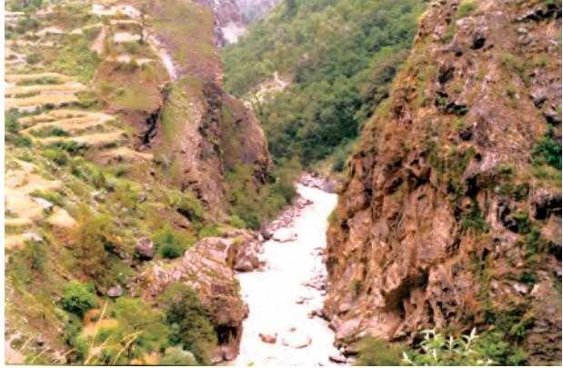
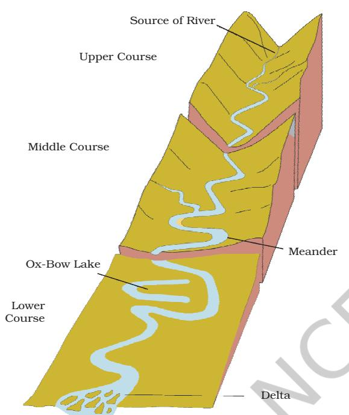
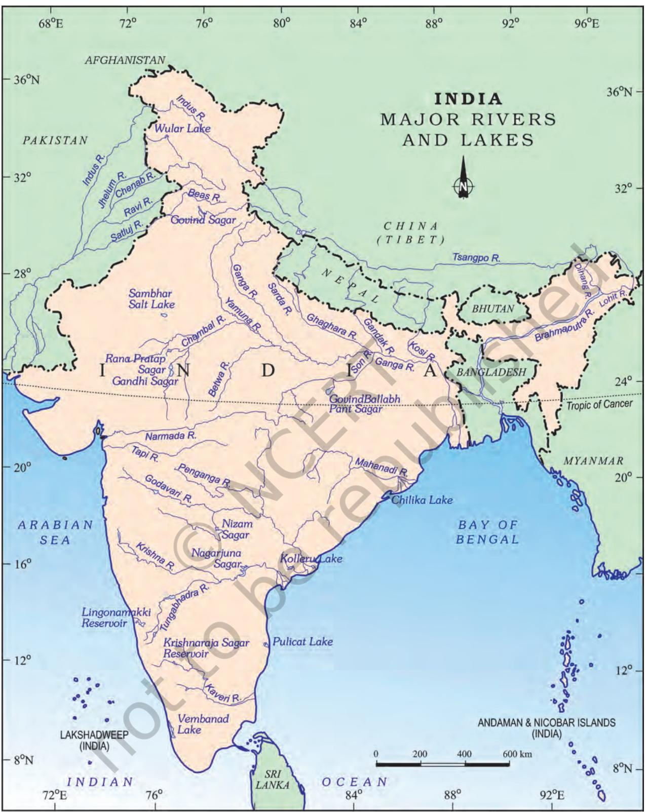
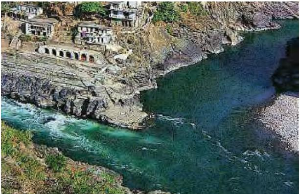
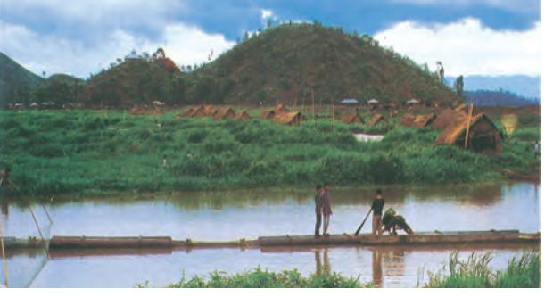
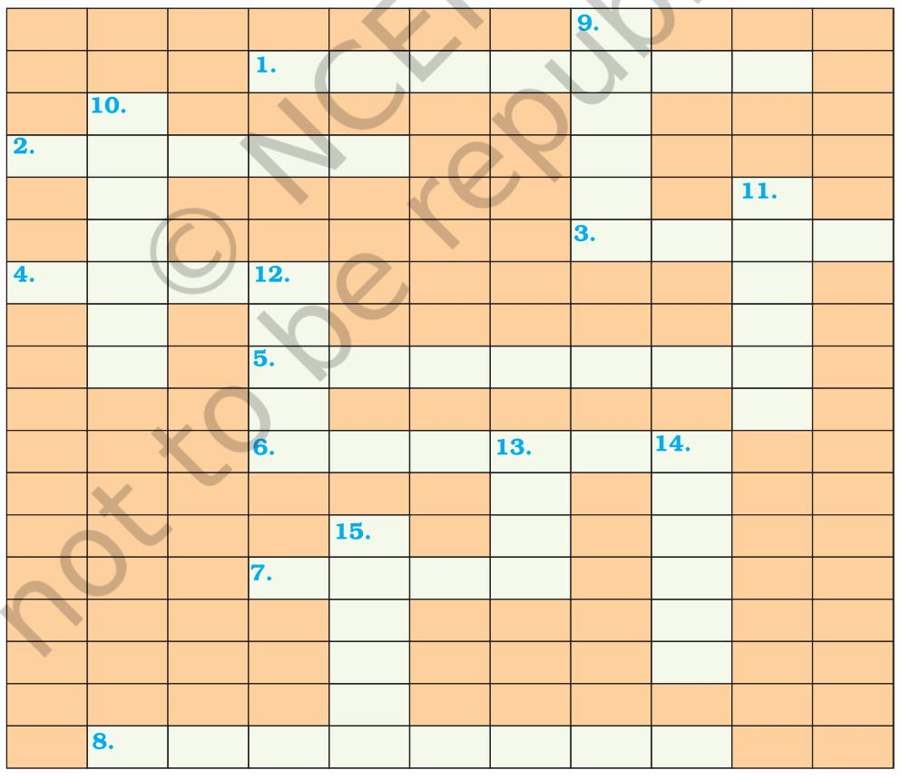

# DRAINAGE

T he term *drainage* describes the river system of an area. Look at the physical map. You will notice that small streams flowing from different directions come together to form the main river, which ultimately drains into a large water body such as a lake or a sea or an ocean. The area drained by a single river system is called a *drainage basin*. A closer observation on a map will indicate that any elevated area, such as a mountain or an upland, separates two drainage basins. Such an upland is known as a *water divide* (Figure 3.1).

• Which river has the largest basin in India?

# DRAINAGE SYSTEMS IN INDIA

The drainage systems of India are mainly controlled by the broad relief features of the subcontinent. Accordingly, the Indian rivers are divided into two major groups:

- the Himalayan rivers; and
- the Peninsular rivers.

Apart from originating from the two major physiographic regions of India, the Himalayan and the Peninsular rivers are different from each other in many ways. Most of the Himalayan rivers are perennial. It means that they have water throughout the year. These rivers receive water from rain as well as from melted snow from the lofty mountains. The two major Himalayan rivers, the Indus and the Brahmaputra originate from the north of the mountain ranges. They have cut through the mountains making gorges. The Himalayan rivers have long courses from their source to the sea.

*Figure 3.2 : A Gorge*

They perform intensive erosional activity in their upper courses and carry huge loads of silt and sand. In the middle and the lower courses, these rivers form meanders, oxbow lakes, and many other depositional features in their floodplains. They also have welldeveloped deltas (Figure 3.3).

*Figure 3.3 : Some Features Made by Rivers*

A large number of the Peninsular rivers are seasonal, as their flow is dependent on rainfall. During the dry season, even the large rivers have reduced flow of water in their channels. The Peninsular rivers have shorter and shallower courses as compared to their Himalayan counterparts. However, some of them originate in the central highlands and flow towards the west. Can you identify two such large rivers? Most of the rivers of peninsular India originate in the Western Ghats and flow towards the Bay of Bengal.

# The Himalayan Rivers

The major Himalayan rivers are the Indus, the Ganga and the Brahmaputra. These rivers are long, and are joined by many large and important tributaries. A river alongwith its tributaries may be called a river system.

### *The Indus River System*

The river Indus rises in Tibet, near Lake Mansarowar. Flowing west, it enters India in the Ladakh. It forms a picturesque gorge in this part. Several tributaries, the Zaskar, the Nubra, the Shyok and the Hunza, join it in the Kashmir region. The Indus flows through Baltistan and Gilgit and emerges from the mountains at Attock. The Satluj, the Beas, the Ravi, the Chenab and the Jhelum join together to enter the Indus near Mithankot in Pakistan. Beyond this, the Indus flows southwards eventually reaching the Arabian Sea, east of Karachi. The Indus plain has a very gentle slope. With a total length of 2900 km, the Indus is one of the longest rivers of the world. A little over a third of the Indus basin is located in India Ladakh, Jammu and Kashmir, Himachal Pradesh and Punjab and the rest is in Pakistan.

• According to the regulations of the Indus Water Treaty (1960), India can use only 20 per cent of the total water carried by the Indus river system. This water is used for irrigation in Punjab, Haryana and the southern and the western parts of Rajasthan.

### *The Ganga River System*

The headwaters of the Ganga, called the 'Bhagirathi' is fed by the Gangotri Glacier and joined by the Alaknanda at Devaprayag in Uttarakhand. At Haridwar, the Ganga emerges from the mountains on to the plains.

*Figure 3.4 : Major Rivers and Lakes*

*Figure 3.5 : Confluence of Bhagirathi and Alaknanda at Devaprayag*

The Ganga is joined by many tributaries from the Himalayas, a few of them being major rivers, such as the Yamuna, the Ghaghara, the Gandak and the Kosi. The river Yamuna rises from the Yamunotri Glacier in the Himalayas. It flows parallel to the Ganga and as a right bank tributary meets the Ganga at Allahabad. The Ghaghara, the Gandak and the Kosi rise in the Nepal Himalaya. They are the rivers, which flood parts of the northern plains every year, causing widespread damage to life and property, whereas, they enrich the soil for agricultural use.

The main tributaries, which come from the peninsular uplands, are the Chambal, the Betwa and the Son. These rise from semi-arid areas, have shorter courses and do not carry much water in them. Find out where and how they ultimately join the Ganga.

 • The *Namami Gange Programme* is an Integrated Conservation Mission approved as a 'flagship programme' by the Union Government in June 2014 to accomplish the twin objectives of effective abatement of pollution, conservation and rejuvenation of the national river, Ganga. You may explore about this project at http://nmcg.nic.in/ NamamiGanga.sspx#

Enlarged with the waters from its right and left bank tributaries, the Ganga flows eastwards till Farakka in West Bengal. This is the northernmost point of the Ganga delta. The river bifurcates here; the Bhagirathi-Hooghly (a distributary) flows southwards through the deltaic plains to the Bay of Bengal. The mainstream, flows southwards into Bangladesh and is joined by the Brahmaputra. Further downstream, it is known as the Meghna. This mighty river, with waters from the Ganga and the Brahmaputra, flows into the Bay of Bengal. The delta formed by these rivers is known as the *Sundarban Delta*.

• The Sundarban Delta derived its name from the Sundari tree, which grows well in marshland. • It is the world's largest and fastest growing delta. It is also the home of Royal Bengal tiger.

The length of the Ganga is over 2500 km. Look at Figure 3.4; can you identify the type of drainage pattern formed by the Ganga river system? Ambala is located on the water divide between the Indus and the Ganga river systems. The plains from Ambala to the Sunderban stretch over nearly 1800 km, but the fall in its slope is hardly 300 metres. In other words, there is a fall of just one metre for every 6 km. Therefore, the river develops large meanders.

#### *The Brahmaputra River System*

The Brahmaputra rises in Tibet east of Mansarowar lake very close to the sources of the Indus and the Satluj. It is slightly longer than the Indus, and most of its course lies outside India. It flows eastwards parallel to the Himalayas. On reaching the Namcha Barwa (7757 m), it takes a 'U' turn and enters India in Arunachal Pradesh through a gorge. Here, it is called the Dihang and it is joined by the Dibang, the Lohit, and many other tributaries to form the Brahmaputra in Assam.

• Brahmaputra is known as the Tsang Po in Tibet and Jamuna in Bangladesh.

In Tibet, the river carries a smaller volume of water and less silt as it is a cold and a dry area. In India, it passes through a region of high rainfall. Here the river carries a large volume of water and considerable amount of silt. The Brahmaputra has a braided channel in its entire length in Assam and forms many riverine islands. Do you remember the name of the world's largest riverine island formed by the Brahmaputra?

Every year during the rainy season, the river overflows its banks, causing widespread devastation due to floods in Assam and Bangladesh. Unlike other north Indian rivers, the Brahmaputra is marked by huge deposits of silt on its bed causing the riverbed to rise. The river also shifts its channel frequently.

#### The Peninsular Rivers

The main water divide in Peninsular India is formed by the Western Ghats, which runs from north to south close to the western coast. Most of the major rivers of the Peninsula, such as the Mahanadi, the Godavari, the Krishna and the Kaveri flow eastwards and drain into the Bay of Bengal. These rivers make deltas at their mouths. There are numerous small streams flowing west of the Western Ghats. The Narmada and the Tapi are the only long rivers, which flow west and make esturies. The drainage basins of the peninsular rivers are comparatively smaller in size.

#### *The Narmada Basin*

The Narmada rises in the Amarkantak hills in Madhya Pradesh. It flows towards the west in a rift valley formed due to faulting. On its way to the sea, the Narmada creates many picturesque locations. The 'Marble rocks', near Jabalpur, where the Narmada flows through a deep gorge, and the 'Dhuadhar falls, where the river plunges over steep rocks, are some of the notable ones.

 • The Narmada river conservation mission has been undertaken by the government of Madhya Pradesh by a scheme named *Namami Devi Narmade*. You may visit their website. http://www.namamidevinarmade.mp.gov.in to learn more about it.

All tributaries of the Narmada are very short and most of these join the main stream at right angles. The Narmada basin covers parts of Madhya Pradesh and Gujarat.

### *The Tapi Basin*

The Tapi rises in the Satpura ranges, in the Betul district of Madhya Pradesh. It also flows in a rift valley parallel to the Narmada but it is much shorter in length. Its basin covers parts of Madhya Pradesh, Gujarat and Maharashtra.

The coastal plains between Western Ghats and the Arabian Sea are very narrow. Hence, the coastal rivers are short. The main west flowing rivers are Sabarmati, Mahi, Bharathpuzha and Periyar. Find out the states in which these rivers drain the water.

# *The Godavari Basin*

The Godavari is the largest Peninsular river. It rises from the slopes of the Western Ghats in the Nasik district of Maharashtra. Its length is about 1500 km. It drains into the Bay of Bengal. Its drainage basin is also the largest among the peninsular rivers. The basin covers parts of Maharashtra (about 50 per cent of the basin area lies in Maharashtra), Madhya Pradesh, Odisha and Andhra Pradesh. The Godavari is joined by a number of tributaries, such as the Purna, the Wardha, the Pranhita, the Manjra, the Wainganga and the Penganga. The last three tributaries are very large. Because of its length and the area it covers, it is also known as the *Dakshin Ganga*.

### *The Mahanadi Basin*

The Mahanadi rises in the highlands of Chhattisgarh. It flows through Odisha to reach the Bay of Bengal. The length of the river is about 860 km. Its drainage basin is shared by Maharashtra, Chhattisgarh, Jharkhand, and Odisha.

### *The Krishna Basin*

Rising from a spring near Mahabaleshwar, the Krishna flows for about 1400 km and reaches the Bay of Bengal. The Tungabhadra, the Koyana, the Ghatprabha, the Musi and the Bhima are some of its tributaries. Its drainage basin is shared by Maharasthra, Karnataka and Andhra Pradesh.

### *The Kaveri Basin*

The Kaveri rises in the Brahmagri range of the Western Ghats and it reaches the Bay of Bengal in south of Cuddalore in Tamil Nadu. The total length of the river is about 760 km. Its main tributaries are Amravati, Bhavani, Hemavati and Kabini. Its basin drains parts of Karnataka, Kerala and Tamil Nadu.

• The river Kaveri makes the second biggest waterfall in India, known as Shivasamudram Falls. The hydroelectric power generated from the falls is supplied to Mysuru, Bengaluru and the Kolar Gold Field.

• The name of the biggest waterfall in India.

Besides these major rivers, there are some smaller rivers flowing towards the east. The Damoder, the Brahmani, the Baitarni and the Subarnrekha are some notable examples. Locate them in your atlas.

• 71 per cent of the world's surface is covered with water, but 97 per cent of that is salt water.

• Of the 3 per cent that is available as freshwater, three quarters of it is trapped as ice.

# LAKES

You may be familiar with the valley of Kashmir and the famous Dal Lake, the house boats and *shikaras*, which attract thousands of tourists every year. Similarly, you may have visited some other tourist spot near a lake and enjoyed boating, swimming and other water games. Imagine that if Srinagar, Nainital and other tourists places did not have a lake would they have been as attractive as they are today? Have you ever tried to know the importance of lakes in making a place attractive to tourists? Apart from attraction for tourists, lakes are also useful to human beings in many ways.

• Lakes of large extent are called seas, like the Caspian, the Dead and the Aral seas.

India has many lakes. These differ from each other in size and other characteristics. Most lakes are permanent; some contain water only during the rainy season, like the lakes in the basins of inland drainage of semi-arid regions. There are some lakes which are the result of the action of glaciers and ice sheets, while others have been formed by wind, river action and human activities.

A meandering river across a floodplain forms *cut-offs* that later develops into *ox-bow* lakes. Spits and bars form lagoons in the coastal areas, e.g. the Chilika lake, the Pulicat lake and the Kolleru lake. Lakes in the region of inland drainage are sometimes seasonal; for example, the Sambhar lake in Rajasthan, which is a salt water lake. Its water is used for producing salt.

Most of the freshwater lakes are in the Himalayan region. They are of glacial origin. In other words, they formed when glaciers dug out a basin, which was later filled with snowmelt. The Wular lake in Jammu and Kashmir, in contrast, is the result of tectonic activity. It is the largest freshwater lake in India. The Dal lake, Bhimtal, Nainital, Loktak and Barapani are some other important freshwater lakes.

*Figure 3.6 : Loktak Lake*

22 CONTEMPORARY INDIA-I

Apart from natural lakes, the damming of the rivers for the generation of hydel power has also led to the formation of lakes, such as Guru Gobind Sagar (Bhakra Nangal Project).

Lakes are of great value to human beings. A lake helps to regulate the flow of a river. During heavy rains, it prevents flooding and during the dry season, it helps to maintain an even flow of water. Lakes can also be used for developing hydel power. They moderate the climate of the surroundings; maintain the aquatic ecosystem, enhance natural beauty, help develop tourism and provide recreation.

### ROLE OF RIVERS IN THE ECONOMY

Rivers have been of fundamental importance throughout the human history. Water from rivers is a basic natural resource, essential for various human activities. Therefore, riverbanks have attracted settlers from ancient times. These settlements have now become big cities. Make a list of cities in your state which are located on the bank of a river.

Using rivers for irrigation, navigation, hydro-power generation is of special significance — particularly to a country like India, where agriculture is the major source of livelihood of the majority of its population.

# RIVER POLLUTION

The growing domestic, municipal, industrial and agricultural demand for water from rivers naturally affects the quality of water. As a

#### National River Conservation Plan (NRCP)

The river cleaning programme in the country was initiated with the launching of the *Ganga Action Plan* (GAP) in 1985. The *Ganga Action Plan* was expanded to cover other rivers under the National River Conservation Plan (NRCP) in the year 1995. The objective of the NRCP is to improve the water quality of the rivers, which are major water sources in the country, through the implementation of pollultion abatement work.

*Source:* http://nrcd.nic.in/nrcp.pd as on 25.07.17

result, more and more water is being drained out of the rivers reducing their volume. On the other hand, a heavy load of untreated sewage and industrial effluents are emptied into the rivers. This affects not only the quality of water but also the self-cleansing capacity of the river. For example, given the adequate streamflow, the Ganga water is able to dilute and assimilate pollution loads within 20 km of large cities. But the increasing urbanisation and industrialisation do not allow it to happen and the pollution level of many rivers has been rising. Concern over rising pollution in our rivers led to the launching of various action plans to clean the rivers. Have you heard about such action plans? How does our health get affected by polluted river water? Think about "life of human beings without fresh water". Arrange a debate on this topic in the class.

# EXERCISE

1. Choose the right answer from the four alternatives given below. (i) *In which of the following states is the Wular lake located?*

- 
- (a) Rajasthan (c) Punjab
- (b) Uttar Pradesh (d) Jammu and Kashmir
- 
- (ii) The river Narmada has its source at
	- (a) Satpura (c) Amarkantak
	- (b) Brahmagiri (d) Slopes of the Western Ghats
- (iii) Which one of the following lakes is a salt water lake?
	- (a) Sambhar (c) Wular
	- (b) Dal (d) Gobind Sagar

(iv) Which one of the following is the longest river of the Peninsular India?

- (a) Narmada (c) Godavari
- (b) Krishna (d) Mahanadi
- (v) Which one amongst the following rivers flows through a rift valley?
	- (a) Mahanadi (c) Krishna
	- (b) Tungabhadra (d) Tapi
- 2. Answer the following questions briefly.
	- (i) What is meant by a water divide? Give an example.
	- (ii) Which is the largest river basin in India?
	- (iii) Where do the rivers Indus and Ganga have their origin?
	- (iv) Name the two headstreams of the Ganga. Where do they meet to form the Ganga?
	- (v) Why does the Brahmaputra in its Tibetan part have less silt, despite a longer course?
	- (vi) Which two Peninsular rivers flow through trough?
	- (vii) State some economic benefits of rivers and lakes.
- 3. Below are given names of a few lakes of India. Group them under two categories – natural and created by human beings.
	- (a) Wular (b) Dal
	- (c) Nainital (d) Bhimtal
	- (e) Gobind Sagar (f) Loktak
	- (g) Barapani (h) Chilika
	- (i) Sambhar (j) Rana Pratap Sagar
	- (k) Nizam Sagar (l) Pulicat
	- (m) Nagarjuna Sagar (n) Hirakund
- 4. Discuss the significant difference between the Himalayan and the Peninsular rivers.
- 5. Compare the east flowing and the west flowing rivers of the Peninsular plateau.
- 6. Why are rivers important for the country's economy?

#### Map Skills

- (i) On an outline map of India mark and label the following rivers: Ganga, Satluj, Damodar, Krishna, Narmada, Tapi, Mahanadi, and Brahmaputra.
- (ii) On an outline map of India mark and label the following lakes: Chilika, Sambhar, Wular, Pulicat, Kolleru.

### Project/Activity

Solve this crossword puzzle with the help of given clues.

#### Across

- 1. Nagarjuna Sagar is a river valley project. Name the river?
- 2. The longest river of India.
- 3. The river which originates from a place known as Beas Kund.
- 4. The river which rises in the Betul district of MP and flows westwards.
- 5. The river which was known as the "Sorrow" of West Bengal.
- 6. The river on which the reservoir for Indira Gandhi Canal has been built.
- 7. The river whose source lies near Rohtang Pass.
- 8. The longest river of Peninsular India?

#### Down

- 9. A tributary of Indus originating from Himachal Pradesh.
- 10. The river flowing through fault, drains into the Arabian Sea.
- 11. A river of south India, which receives rainwater both in summer and winter.
- 12. A river which flows through Ladakh, Gilgit and Pakistan.
- 13. An important river of the Indian desert.
- 14. The river which joins Chenab in Pakistan.
- 15. A river which rises at Yamunotri glacier.

