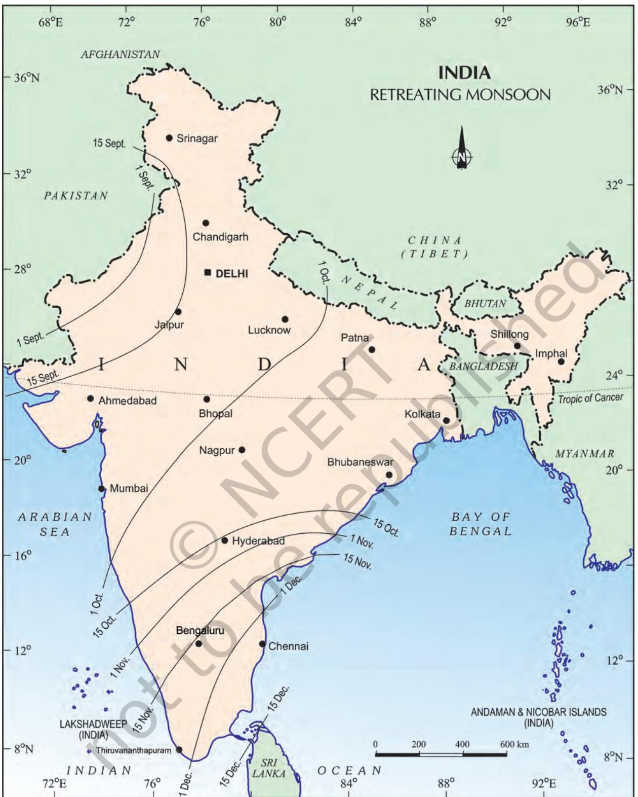
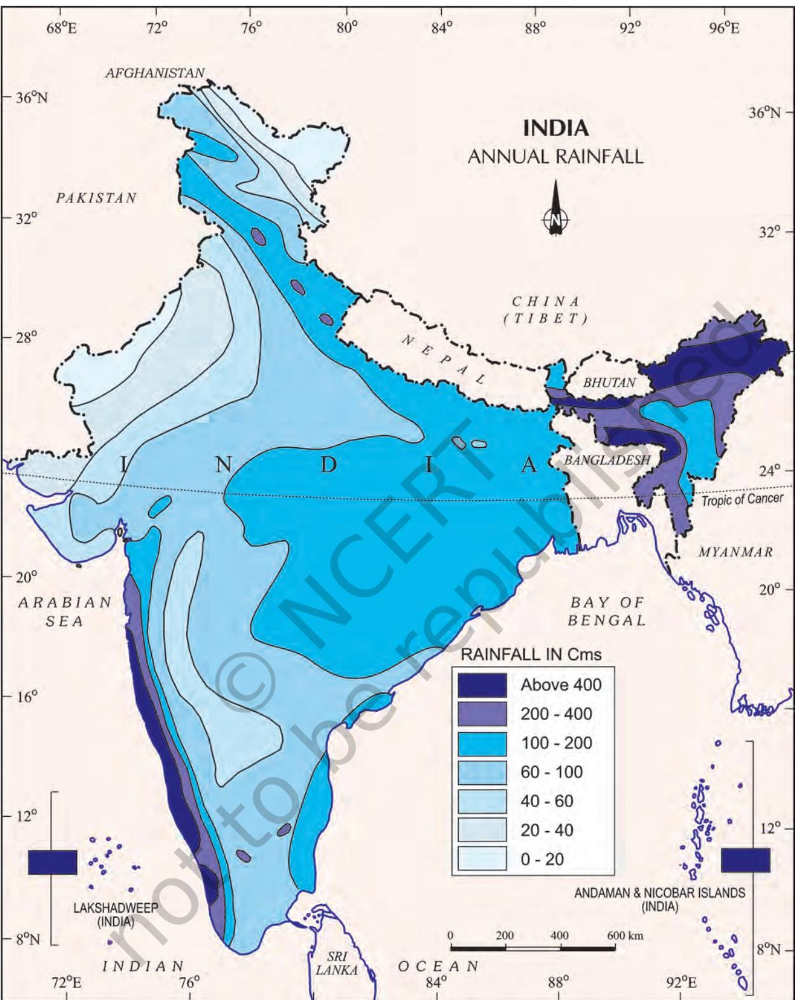
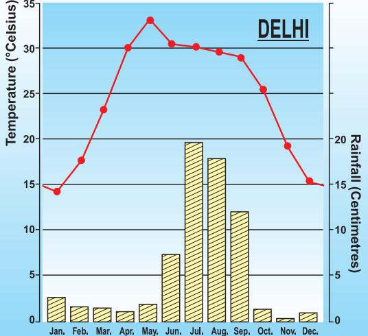

I n the last two chapters you have read about the landforms and the drainage of our country. These are the two of the three basic elements that one learns about the natural environment of any area. In this chapter you will learn about the third, that is, the atmospheric conditions that prevail over our country. Why do we wear woollens in December or why it is hot and uncomfortable in the month of May, and why it rains in June - July? The answers to all these questions can be found out by studying about the climate of India.

Climate refers to the sum total of weather conditions and variations over a large area for a long period of time (more than thirty years). Weather refers to the state of the atmosphere over an area at any point of time. The elements of weather and climate are the same, i.e. temperature, atmospheric pressure, wind, humidity and precipitation. You may have observed that the weather conditions fluctuate very often even within a day. But there is some common pattern over a few weeks or months, i.e. days are cool or hot, windy or calm, cloudy or bright, and wet or dry. On the basis of the generalised monthly atmospheric conditions, the year is divided into seasons such as winter, summer or rainy seasons.

The world is divided into a number of climatic regions. Do you know what type of climate India has and why it is so? We will learn about it in this chapter.

• The word monsoon is derived from the Arabic word 'mausim' which literally means season.

• 'Monsoon' refers to the seasonal reversal in the wind direction during a year.

The climate of India is described as the 'monsoon' type. In Asia, this type of climate is found mainly in the south and the southeast. Despite an overall unity in the general pattern, there are perceptible regional variations in climatic conditions within the country. Let us take two important elements – temperature and precipitation, and examine how they vary from place to place and season to season.

In summer, the mercury occasionally touches 50°C in some parts of the Rajasthan desert, whereas it may be around 20°C in Pahalgam in Jammu and Kashmir. On a winter night, temperature at Drass in Jammu and Kashmir may be as low as minus 45°C. Thiruvananthapuram, on the other hand, may have a temperature of 22°C.

In certain places there is a wide difference between day and night temperatures. In the Thar Desert the day temperature may rise to 50°C, and drop down to near 15°C the same night. On the other hand, there is hardly any difference in day and night temperatures in the Andaman and Nicobar islands or in Kerala.

Let us now look at precipitation. There are variations not only in the form and types of precipitation but also in its amount and the seasonal distribution. While precipitation is mostly in the form of snowfall in the upper parts of Himalayas, it rains over the rest of the country. The annual precipitation varies from over 400 cm in Meghalaya to less than 10 cm in Ladakh and western Rajasthan. Most parts of the country receive rainfall from June to September. But some parts like the Tamil Nadu coast gets a large portion of its rain during October and November.

In general, coastal areas experience less contrasts in temperature conditions. Seasonal contrasts are more in the interior of the country. There is decrease in rainfall generally from east to west in the Northern Plains. These variations have given rise to variety in lives of people – in terms of the food they eat, the clothes they wear and also the kind of houses they live in.

• Why the houses in Rajasthan have thick walls and flat roofs?

- Why is it that the houses in the Tarai region and in Goa and Mangalore have sloping roofs?
- Why houses in Assam are built on stilts?

## CLIMATIC CONTROLS

There are six major controls of the climate of any place. They are: latitude, altitude, pressure and wind system, distance from the sea (continentality), ocean currents and relief features.

Due to the curvature of the earth, the amount of solar energy received varies according to latitude. As a result, air temperature generally decreases from the equator towards the poles. As one goes from the surface of the earth to higher altitudes, the atmosphere becomes less dense and temperature decreases. The hills are therefore cooler during summers. The pressure and wind system of any area depend on the latitude and altitude of the place. Thus it influences the temperature and rainfall pattern. The sea exerts a moderating influence on climate: As the distance from the sea increases, its moderating influence decreases and the people experience extreme weather conditions. This condition is known as continentality (i.e. very hot during summers and very cold during winters). Ocean currents along with onshore winds affect the climate of the coastal areas, For example, any coastal area with warm or cold currents flowing past it, will be warmed or cooled if the winds are onshore.

•Why most of the world's deserts are located in the western margins of continents in the subtropics?

Finally, relief too plays a major role in determining the climate of a place. High mountains act as barriers for cold or hot winds; they may also cause precipitation if they are high enough and lie in the path of rain-bearing winds. The leeward side of mountains remains relatively dry.

## FACTORS AFFECTING INDIA'S CLIMATE

### Latitude

The Tropic of Cancer passes through the middle of the country from the Rann of Kuchchh in the west to Mizoram in the east. Almost half of the country, lying south of the Tropic of Cancer, belongs to the tropical area. All the remaining area, north of the Tropic, lies in the sub-tropics. Therefore, India's climate has characteristics of tropical as well as subtropical climates.

## Altitude

India has mountains to the north, which have an average height of about 6,000 metres. India also has a vast coastal area where the maximum elevation is about 30 metres. The Himalayas prevent the cold winds from Central Asia from entering the subcontinent. It is because of these mountains that this subcontinent experiences comparatively milder winters as compared to central Asia.

### Pressure and Winds

The climate and associated weather conditions in India are governed by the following atmospheric conditions:

- *Pressure and surface winds;*
- *Upper air circulation; and*
- *Western cyclonic disturbances and tropical cyclones*.

India lies in the region of north easterly winds. These winds originate from the subtropical high-pressure belt of the northern

hemisphere. They blow southwards, get deflected to the right due to the Coriolis force, and move towards the equatorial low-pressure area. Generally, these winds carry little moisture as they originate and blow over land. Therefore, they bring little or no rain. Hence, India should have been an arid land, but it is not so. Let us see why?

Coriolis force: An apparent force caused by the earth's rotation. The Coriolis force is responsible for deflecting winds towards the right in the northern hemisphere and towards the left in the southern hemisphere. This is also known as 'Ferrel's Law'.

The pressure and wind conditions over India are unique. During winter, there is a high-pressure area north of the Himalayas. Cold dry winds blow from this region to the low-pressure areas over the oceans to the south. In summer, a low-pressure area develops over interior Asia, as well as, over northwestern India. This causes a complete reversal of the direction of winds during summer. Air moves from the high-pressure area over the southern Indian Ocean, in a south-easterly direction, crosses the equator, and turns right towards the low-pressure areas over the Indian subcontinent. These are known as the Southwest Monsoon winds. These winds blow over the warm oceans, gather moisture and bring widespread rainfall over the mainland of India.

### THE SEASONS

The monsoon type of climate is characterised by a distinct seasonal pattern. The weather conditions greatly change from one season to the other. These changes are particularly noticeable in the interior parts of the country. The coastal areas do not experience much variation in temperature though there is variation in rainfall pattern. How many seasons are experienced in your place? Four main seasons can be identified in India – the cold weather season, the hot weather season, the advancing monsoon and the retreating monsoon with some regional variations.

### The Cold Weather Season (Winter)

The cold weather season begins from mid-November in northern India and stays till February. December and January are the coldest months in the northern part of India. The temperature decreases from south to the north. The average temperature of Chennai, on the eastern coast, is between 24°– 25° Celsius, while in the northern plains, it ranges between 10°C and 15° Celsius. Days are warm and nights are cold. Frost is common in the north and the higher slopes of the Himalayas experience snowfall.

During this season, the northeast trade winds prevail over the country. They blow from land to sea and hence, for most part of the country, it is a dry season. Some amount of rainfall occurs on the Tamil Nadu coast from these winds as, here they blow from sea to land.

In the northern part of the country, a feeble high-pressure region develops, with light winds moving outwards from this area. Influenced by the relief, these winds blow through the Ganga valley from the west and the northwest. The weather is normally marked by clear sky, low temperatures and low humidity and feeble, variable winds.

A characteristic feature of the cold weather season over the northern plains is the inflow of cyclonic disturbances from the west and the northwest. These low-pressure systems, originate over the Mediterranean Sea and western Asia and move into India, along with the westerly flow. They cause the much-needed winter rains over the plains and snowfall in the mountains. Although the total amount of winter rainfall locally known as *'mahawat'* is small, they are of immense importance for the cultivation of *'rabi'* crops.

The peninsular region does not have a welldefined cold season. There is hardly any noticeable seasonal change in temperature pattern during winters due to the moderating influence of the sea.

*Figure 4.1 : Advancing Monsoon*

### The Hot Weather Season (Summer)

Due to the apparent northward movement of the sun, the global heat belt shifts northwards. As such, from March to May, it is hot weather season in India. The influence of the shifting of the heat belt can be seen clearly from temperature recordings taken during March-May at different latitudes. In March, the highest temperature is about 38° Celsius, recorded on the Deccan plateau. In April, temperatures in Gujarat and Madhya Pradesh are around 42° Celsius. In May, temperature of 45° Celsius is common in the northwestern parts of the country. In peninsular India, temperatures remain lower due to the moderating influence of the oceans.

The summer months experience rising temperature and falling air pressure in the northern part of the country. Towards the end of May, an elongated low-pressure area develops in the region extending from the Thar Desert in the northwest to Patna and Chotanagpur plateau in the east and southeast. Circulation of air begins to set in around this trough.

A striking feature of the hot weather season is the *'loo'*. These are strong, gusty, hot, dry winds blowing during the day over the north and northwestern India. Sometimes they even continue until late in the evening. Direct exposure to these winds may even prove to be fatal. Dust storms are very common during the month of May in northern India. These storms bring temporary relief as they lower the temperature and may bring light rain and cool breeze. This is also the season for localised thunderstorms, associated with violent winds, torrential downpours, often accompanied by hail. In West Bengal, these storms are known as the '*Kaal Baisakhi'*.

Towards the close of the summer season, pre-monsoon showers are common especially, in Kerala and Karnataka. They help in the early ripening of mangoes, and are often referred to as '*mango showers'*.

### Advancing Monsoon (The Rainy Season)

By early June, the low-pressure condition over the northern plains intensifies. It attracts, the trade winds of the southern hemisphere. These south-east trade winds originate over the warm subtropical areas of the southern oceans. They cross the equator and blow in a southwesterly direction entering the Indian peninsula as the south-west monsoon. As these winds blow over warm oceans, they bring abundant moisture to the subcontinent. These winds are strong and blow at an average velocity of 30 km per hour. With the exception of the extreme north-west, the monsoon winds cover the country in about a month.

The inflow of the south-west monsoon into India brings about a total change in the weather. Early in the season, the windward side of the Western Ghats receives very heavy rainfall, more than 250 cm. The Deccan Plateau and parts of Madhya Pradesh also receive some amount of rain in spite of lying in the rain shadow area. The maximum rainfall of this season is received in the north-eastern part of the country. Mawsynram in the southern ranges of the Khasi Hills receives the highest average rainfall in the world. Rainfall in the Ganga valley decreases from the east to the west. Rajasthan and parts of Gujarat get scanty rainfall.

Another phenomenon associated with the monsoon is its tendency to have 'breaks' in rainfall. Thus, it has wet and dry spells. In other words, the monsoon rains take place only for a few days at a time. They are interspersed with rainless intervals. These breaks in monsoon are related to the movement of the monsoon trough. For various reasons, the trough and its axis keep on moving northward or southward, which determines the spatial distribution of rainfall. When the axis of the monsoon trough lies over the plains, rainfall is good in these parts. On the other hand, whenever the axis shifts closer to the Himalayas, there are longer dry spells in the plains, and widespread rain occur in the mountainous catchment areas of the Himalayan rivers. These heavy rains bring in

30 CONTEMPORARY INDIA-I

*Figure 4.2 : Retreating Monsoon*

their wake, devastating floods causing damage to life and property in the plains. The frequency and intensity of tropical depressions too, determine the amount and duration of monsoon rains. These depressions form at the head of the Bay of Bengal and cross over to the mainland. The depressions follow the axis of the "monsoon trough of low pressure". The monsoon is known for its uncertainties. The alternation of dry and wet spells vary in intensity, frequency and duration. While it causes heavy floods in one part, it may be responsible for droughts in the other. It is often irregular in its arrival and its retreat. Hence, it sometimes disturbs the farming schedule of millions of farmers all over the country.

### Retreating/Post Monsoons (The Transition Season)

During October-November, with the apparent movement of the sun towards the south, the monsoon trough or the low-pressure trough over the northern plains becomes weaker. This is gradually replaced by a high-pressure system. The south-west monsoon winds weaken and start withdrawing gradually. By the beginning of October, the monsoon withdraws from the Northern Plains.

The months of October-November form a period of transition from hot rainy season to dry winter conditions. The retreat of the monsoon is marked by clear skies and rise in

Mawsynram, the wettest place on the earth is also reputed for its stalagmite and stalactite caves.

temperature. While day temperatures are high, nights are cool and pleasant. The land is still moist. Owing to the conditions of high temperature and humidity, the weather becomes rather oppressive during the day. This is commonly known as 'October heat'. In the second half of October, the mercury begins to fall rapidly in northern India.

The low-pressure conditions, over northwestern India, get transferred to the Bay of Bengal by early November. This shift is associated with the occurrence of cyclonic depressions, which originate over the Andaman Sea. These cyclones generally cross the eastern coasts of India cause heavy and widespread rain. These tropical cyclones are often very destructive. The thickly populated deltas of the Godavari, the Krishna and the Kaveri are frequently struck by cyclones, which cause great damage to life and property. Sometimes, these cyclones arrive at the coasts of Odisha, West Bengal and Bangladesh. The bulk of the rainfall of the Coromandel Coast is derived from depressions and cyclones.

## DISTRIBUTION OF RAINFALL

Parts of western coast and northeastern India receive over about 400 cm of rainfall annually. However, it is less than 60 cm in western Rajasthan and adjoining parts of Gujarat, Haryana and Punjab. Rainfall is equally low in the interior of the Deccan plateau, and east of the Sahyadris. Why do these regions receive low rainfall? A third area of low precipitation is around Leh in Jammu and Kashmir. The rest of the country receives moderate rainfall. Snowfall is restricted to the Himalayan region.

Owing to the nature of monsoons, the annual rainfall is highly variable from year to year. Variability is high in the regions of low rainfall, such as parts of Rajasthan, Gujarat and the leeward side of the Western Ghats. As such, while areas of high rainfall are liable to be affected by floods, areas of low rainfall are drought-prone (Figure 4.3).

## MONSOON AS A UNIFYING BOND

You have already known the way the Himalayas protect the subcontinent from extremely cold winds from central Asia. This enables northern India to have uniformly higher temperatures compared to other areas on the same latitudes. Similarly, the Peninsular plateau, under the influence of the sea from three sides, has moderate temperatures. Despite such

*Figure 4.3 : Annual Rainfall*

(i)

(ii)

(iii)

Evaluate flood as a disaster with the help of a case study.

Activity

Compare the rainfall description of Chennai and Mumbai and explain the reasons for the difference.

On the basis of the news items above, find out the names of places and the seasons described.

34

moderating influences, there are great variations in the temperature conditions. Nevertheless, the unifying influence of the monsoon on the Indian subcontinent is quite perceptible. The seasonal alteration of the wind systems and the associated weather conditions provide a rhythmic cycle of seasons. Even the uncertainties of rain and uneven distribution are very much typical of the monsoons. The Indian landscape, its animal and plant life, its

entire agricultural calendar and the life of the people, including their festivities, revolve around this phenomenon. Year after year, people of India from north to south and from east to west, eagerly await the arrival of the monsoon. These monsoon winds bind the whole country by providing water to set the agricultural activities in motion. The river valleys which carry this water also unite as a single river valley unit.

## EXERCISE

- 1. Choose the correct answer from the four alternatives given below.
	- (i) Which one of the following places receives the highest rainfall in the world?
		- (a) Silchar
		- (c) Cherrapunji
		- (b) Mawsynram
		- (d) Guwahati
	- (ii) The wind blowing in the northern plains in summers is known as:
		- (a) *Kaal Baisakhi*
		- (c) Trade Winds
		- (b) *Loo*
		- (d) None of the above
	- (iii) Monsoon arrives in India approximately in:
		- (a) Early May
		- (c) Early June
		- (b) Early July
		- (d) Early August
	- (iv) Which one of the following characterises the cold weather season in India?
		- (a) Warm days and warm nights
		- (b) Warm days and cold nights
		- (c) Cool days and cold nights
		- (d) Cold days and warm nights
- 2. Answer the following questions briefly.
	- (i) What are the controls affecting the climate of India?
	- (ii) Why does India have a monsoon type of climate?
	- (iii) Which part of India does experience the highest diurnal range of temperature and why?
	- (iv) Which winds account for rainfall along the Malabar coast?
	- (v) Define monsoons. What do you understand by "break" in monsoon?
	- (vi) Why is the monsoon considered a unifying bond?
- 3. Why does the rainfall decrease from the east to the west in Northern India.
- 4. Give reasons as to why.
	- (i) Seasonal reversal of wind direction takes place over the Indian subcontinent?
	- (ii) The bulk of rainfall in India is concentrated over a few months.
	- (iii) The Tamil Nadu coast receives winter rainfall.
	- (iv) The delta region of the eastern coast is frequently struck by cyclones.
	- (v) Parts of Rajasthan, Gujarat and the leeward side of the Western Ghats are drought-prone.
- 5. Describe the regional variations in the climatic conditions of India with the help of suitable examples.
- 6. Give an account of weather conditions and characteristics of the cold season.
- 7. Give the characteristics and effects of the monsoon rainfall in India.

### MAP SKILLS

On an outline map of India, show the following.

- (i) Areas receiving rainfall over 400 cm.
- (ii) Areas receiving less than 20 cm of rainfall.
- (iii) The direction of the south-west monsoon over India.

### PROJECT/ACTIVITY

- (i) Find out which songs, dances, festivals and special food preparations are associated with certain seasons in your region. Do they have some commonality with other regions of India?
- (ii) Collect photographs of typical rural houses, and clothing of people from different regions of India. Examine whether they reflect any relationship with the climatic condition and relief of the area.

### FOR DOING IT YOURSELF

- 1. In Table-I, the average mean monthly temperatures and amounts of rainfall of 10 representative stations have been given. It is for you to study on your own and convert them into 'temperature and rainfall' graphs. A glance at these visual representations will help you to grasp instantly the smilarities and differences between them. One such graph (Figure 1) is already prepared for you. See if you can arrive at some broad generalisations about our diverse climatic conditions. We hope you are in for a great joy of learning. Do the following activities.
- 2. Re-arrange the 10 stations in two different sequences:

*Figure 1 : Temperature and Rainfall of Delhi*

36 CONTEMPORARY INDIA-I

- (i) According to their distance from the equator.
- (ii) According to their altitude above mean sealevel.
- 3. (i) Name two rainiest stations.
	- (ii) Name two driest stations.
	- (iii) Two stations with most equable climate.
	- (iv) Two stations with most extreme climate.
	- (v) Two stations influenced by retreating monsoons.
	- (vi) The two hottest stations in the months of
		- (a) February (b) April (c) May (d) June

| Stations |  |  | (Metres) |  |  |  |  |  | Latitude Altitude Jan. Feb. Mar. Apr. May. Jun. Jul. Aug. Sep. Oct. Nov. Dec. Annual |  |  |  |  |  | Rainfall |
| --- | --- | --- | --- | --- | --- | --- | --- | --- | --- | --- | --- | --- | --- | --- | --- |
| Bengaluru | Temperature (°C) | 12°58'N | 909 | 20.5 | 22.7 | 25.2 | 27.1 | 26.7 | 24.2 | 23.0 | 23.0 | 23.1 | 22.9 | 18.9 20.2 |  |
| Rainfall (cm) |  |  |  | 0.7 | 0.9 | 1.1 | 4.5 | 10.7 | 7.1 | 11.1 | 13.7 | 16.4 | 15.3 | 6.1 1.3 | 88.9 |
| Mumbai | Temperature (°C) | 19° N | 11 | 24.4 | 24.4 | 26.7 | 28.3 | 30.0 | 28.9 | 27.2 | 27.2 | 27.2 | 27.8 | 27.2 25.0 |  |
| Rainfall (cm) |  |  |  | 0.2 | 0.2 | – | – | 1.8 | 50.6 | 61.0 | 36.9 | 26.9 | 4.8 | 1.0 – | 183.4 |
| Kolkata | Temperature (°C) | 22°34' N | 6 | 19.6 | 22.0 | 27.1 | 30.1 | 30.4 | 29.9 | 28.9 | 28.7 | 28.9 | 27.6 | 23.4 19.7 |  |
| Rainfall (cm) |  |  |  | 1.2 | 2.8 | 3.4 | 5.1 | 13.4 | 29.0 | 33.1 | 33.4 | 25.3 | 12.7 | 2.7 0.4 | 162.5 |
| Delhi | Temperature (°C) | 29° N | 219 | 14.4 | 16.7 | 23.3 | 30.0 | 33.3 | 33.3 | 30.0 | 29.4 | 28.9 | 25.6 | 19.4 15.6 |  |
| Rainfall (cm) |  |  |  | 2.5 | 1.5 | 1.3 | 1.0 | 1.8 | 7.4 | 19.3 | 17.8 | 11.9 | 1.3 | 0.2 1.0 | 67.0 |
| Jodhpur | Temperature (°C) | 26°18' N | 224 | 16.8 | 19.2 | 26.6 | 29.8 | 33.3 | 33.9 | 31.3 | 29.0 | 20.1 | 27.0 | 20.1 14.9 |  |
| Rainfall (cm) |  |  |  | 0.5 | 0.6 | 0.3 | 0.3 | 1.0 | 3.1 | 10.8 | 13.1 | 5.7 | 0.8 | 0.2 0.2 | 36.6 |
| Chennai | Temperature (°C) | 13°4' N | 7 | 24.5 | 25.7 | 27.7 | 30.4 | 33.0 | 32.5 | 31.0 | 30.2 | 29.8 | 28.0 | 25.9 24.7 |  |
| Rainfall (cm) |  |  |  | 4.6 | 1.3 | 1.3 | 1.8 | 3.8 | 4.5 | 8.7 | 11.3 | 11.9 | 30.6 | 35.0 13.9 | 128.6 |
| Nagpur | Temperature (°C) | 21°9' N | 312 | 21.5 | 23.9 | 28.3 | 32.7 | 35.5 | 32.0 | 27.7 | 27.3 | 27.9 | 26.7 | 23.1 20.7 |  |
| Rainfall (cm) |  |  |  | 1.1 | 2.3 | 1.7 | 1.6 | 2.1 | 22.2 | 37.6 | 28.6 | 18.5 | 5.5 | 2.0 1.0 | 124.2 |
| Shillong | Temperature (°C) | 24°34' N | 1461 | 9.8 | 11.3 | 15.9 | 18.5 | 19.2 | 20.5 | 21.1 | 20.9 | 20.0 | 17.2 | 13.3 10.4 |  |
| Rainfall (cm) |  |  |  | 1.4 | 2.9 | 5.6 | 14.6 | 29.5 | 47.6 | 35.9 | 34.3 | 30.2 | 18.8 | 3.8 0.6 | 225.3 |
| Temperature (°C) | Thiruvananthapuram 8°29' N |  | 61 | 26.7 | 27.3 | 28.3 | 28.7 | 28.6 | 26.6 | 26.2 | 2.6.2 | 26.5 | 26.7 | 26.6 26.5 |  |
| Rainfall (cm) |  |  |  | 2.3 | 2.1 | 3.7 | 10.6 | 20.8 | 35.6 | 22.3 | 14.6 | 13.8 | 27.3 | 20.6 7.5 | 181.2 |
| Leh 34° N | Temperature (°C) | 34°N | 3506 | – 8.5 | – 7.2 | – 0.6 | 6.1 | 10.0 | 14.4 | 17.2 | 16.1 | 12.2 | 6.1 | 0.0 – 5.6 |  |
| Rainfall (cm) |  |  |  | 1.0 | 0.8 | 0.8 | 0.5 | 0.5 | 0.5 | 1.3 | 1.3 | 0.8 | 0.5 | – 0.5 | 8.5 |

| Table I |
| --- |

### 4. Now find out

- (i) Why are Thiruvananthapuram and Shillong rainier in June than in July?
- (ii) Why is July rainier in Mumbai than in Thiruvananthapuram?
- (iii) Why are southwest monsoons less rainy in Chennai?
- (iv) Why is Shillong rainier than Kolkata?
- (v) Why is Kolkata rainier in July than in June unlike Shillong which is rainier in June than in July?
- (vi) Why does Delhi receive more rain than Jodhpur?
- 5. Now think why
	- Thiruvananthapuram has equable climate?
	- Chennai has more rains only after the fury of monsoon is over in most parts of the country?
	- Jodhpur has a hot desert type of climate?
	- Leh has moderate precipitation almost throughut the year?
	- while in Delhi and Jodhpur most of the rain is confined to nearly three months, in Thiruvananthapuram and Shillong it is almost nine months of the year?

In spite of these facts see carefully if there are strong evidences to conclude that the monsoons still provide a very strong framework lending overall climatic unity to the whole country.

