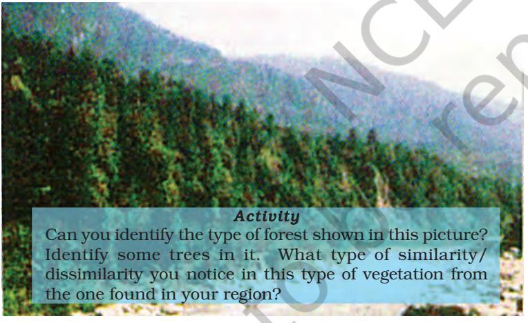

# NATURAL VEGETATION AND WILDLIFE

H ave you observed the type of trees, bushes, grasses and birds in the fields and parks in and around your school? Are they similar or there are variations? India being a vast country you can imagine the types of bio-forms available throughout the country.

Our country India is one of the 12 mega bio-diversity countries of the world. With about 47,000 plant species India occupies tenth place in the world and fourth in Asia in plant diversity. There are about 15,000 flowering plants in India, which account for 6 per cent in the world's total number of flowering plants. The country has many nonflowering plants, such as ferns, algae and fungi. India also has approximately 90,000 species of animals, as well as, a rich variety of fish in its fresh and marine waters.

Natural vegetation refers to a plant community, which has grown naturally without human aid and has been left undisturbed by humans for a long time. This is termed as a virgin vegetation. Thus, cultivated crops and fruits, orchards form part of vegetation but not natural vegetation.

#### The virgin vegetation, which are purely Indian are known as endemic or indigenous species but those which have come from outside India are termed as exotic plants.

The term flora is used to denote plants of a particular region or period. Similarly, the species of animals are referred to as fauna. *Figure 5.1 : Tropical Evergreen Forest*

## TYPES OF VEGETATION

The following major types of vegetation may be identified in our country (Figure 5.4).

- (i) Tropical Evergreen Forests
- (ii) Tropical Deciduous Forests
- (iii) Tropical Thorn Forests and Scrubs
- (iv) Montane Forests
- (v) Mangrove Forests

NATURAL VEGETATION AND WILDLIFE 39

#### Tropical Evergreen Forests

These forests are restricted to heavy rainfall areas of the Western Ghats and the island groups of Lakshadweep, Andaman and Nicobar, upper parts of Assam and Tamil Nadu coast. They are at their best in areas having more than 200 cm of rainfall with a short dry season. The trees reach great heights up to 60 metres or even above. Since the region is warm and wet throughout the year, it has a luxuriant vegetation of all kinds — trees, shrubs and creepers giving it a multilayered structure. There is no definite time for trees to shed their leaves. As such, these forests appear green all the year round.

Some of the commercially important trees of this forest are ebony, mahogany, rosewood, rubber and cinchona.

The common animals found in these forests are elephant, monkey, lemur and deer. Onehorned rhinoceroses are found in the jungles of Assam and West Bengal. Besides these animals, plenty of birds, bats, sloth, scorpions and snails are also found in these jungles.

#### Tropical Deciduous Forests

These are the most widespread forests of India. They are also called the monsoon forests and spread over the region receiving rainfall between 200 cm and 70 cm. Trees of this forest

*Figure 5.2 : Tropical Deciduous Forest Figure 5.3 : Thorn Forests and Scrubs*

type shed their leaves for about six to eight weeks in dry summer.

On the basis of the availability of water, these forests are further divided into moist and dry deciduous. The former is found in areas receiving rainfall between 200 and 100 cm. These forests exist, therefore, mostly in the eastern part of the country — northeastern states, along the foothills of the Himalayas, Jharkhand, West Odisha and Chhattisgarh, and on the eastern slopes of the Western Ghats. Teak is the most dominant species of this forest. Bamboos*, sal, shisham,* sandalwood*, khair, kusum, arjun* and mulberry are other commercially important species.

The dry deciduous forests are found in areas having rainfall between 100 cm and 70 cm. These forests are found in the rainier parts of the Peninsular plateau and the plains of Bihar and Uttar Pradesh. There are open stretches, in which teak, sal, *peepal and neem* grow. A large part of this region has been cleared for cultivation and some parts are used for grazing.

In these forests, the common animals found are lion, tiger, pig, deer and elephant. A huge variety of birds, lizards, snakes and tortoises are also found here.

## The Thorn Forests and Scrubs

In regions with less than 70 cm of rainfall, the natural vegetation consists of thorny trees and

40 CONTEMPORARY INDIA-I

*Figure 5.4 : Natural Vegetation*

Study the given map for the forest cover and try to find the reasons as to why certain states have more forest area as compared to others?

bushes. This type of vegetation is found in the north-western part of the country, including semi-arid areas of Gujarat, Rajasthan, Madhya Pradesh, Chhattisgarh, Uttar Pradesh and Haryana. Acacias, palms, euphorbias and cacti are the main plant species. Trees are scattered and have long roots penetrating deep into the soil in order to get moisture. The stems are succulent to conserve water. Leaves are mostly thick and small to minimise evaporation. These forests give way to thorn forests and scrubs in arid areas.

In these forests, the common animals are rats, mice, rabbits, fox, wolf, tiger, lion, wild ass, horses and camels.

## Montane Forests

In mountainous areas, the decrease in temperature with increasing altitude leads to the corresponding change in natural vegetation. As such, there is a succession of natural vegetation belts in the same order as we see from the tropical to the tundra region. The wet temperate type of forests are found between a height of 1000 and 2000 metres. Evergreen broad-leaf trees, such as oaks and chestnuts predominate. Between 1500 and 3000 metres, temperate forests containing

coniferous trees, like pine, deodar, silver fir, spruce and cedar, are found. These forests cover mostly the southern slopes of the Himalayas, places having high altitude in southern and north-east India. At higher elevations, temperate grasslands are common. At high altitudes, generally, more than 3,600 metres above the sea level, temperate forests and grasslands give way to the Alpine vegetation. Silver fir, junipers, pines and birches are the common trees of these forests. However, they get progressively stunted as they approach the snow-line. Ultimately, through shrubs and scrubs, they merge into the Alpine grasslands. These are used extensively for grazing by nomadic tribes, like the Gujjars and the Bakarwals. At higher altitudes, mosses and lichens form part of tundra vegetation.

The common animals found in these forests are Kashmir stag, spotted dear, wild sheep, jack rabbit, Tibetan antelope, yak, snow leopard, squirrels, Shaggy horn wild ibex, bear and rare red panda, sheep and goats with thick hair.

## Mangrove Forests

The mangrove tidal forests are found in the areas of coasts influenced by tides. Mud and silt get accumutated on such coasts. Dense

*Figure 5.5 : Montane Forests Figure 5.6 : Mangrove Forests*

42 CONTEMPORARY INDIA-I

mangroves are the common varieties with roots of the plants submerged under water. The deltas of the Ganga, the Mahanadi, the Krishna, the Godavari and the Kaveri are covered by such vegetation. In the Ganga-Brahmaputra delta, sundari trees are found, which provide durable hard timber. Palm, coconut, *keora*, *agar*, etc., also grow in some parts of the delta.

Royal Bengal Tiger is the famous animal in these forests. Turtles, crocodiles, gharials and snakes are also found in these forests.

*Let us discuss :* What will happen if plants and animals disappear from the earth's surface? Can the human beings survive under such a situation? Why is biodiversity necessary and why should it be conserved?

#### MEDICINAL PLANTS

India is known for its herbs and spices from ancient times. Some 2,000 plants have been described in Ayurveda and at least 500 are in regular use. The World Conservation Union's Red List has named 352 medicinal plants of which 52 are critically threatened and 49 endangered. The commonly used plants in India are:

| Sarpagandha | : Used to treat blood pressure; it is found only in India. |
| --- | --- |
| Jamun | : The juice from ripe fruit is used to prepare vinegar, which is carminative and diuretic, and |
|  | has digestive properties. The powder of the seed is used for controlling diabetes. |
| Arjun | : The fresh juice of leaves is a cure for earache. It is also used to regulate blood pressure. |
| Babool | : Leaves are used as a cure for eye sores. Its gum is used as a tonic. |
| Neem | : Has high antibiotic and antibacterial properties. |
| Tulsi | : Is used to cure cough and cold. |
| Kachnar | : Is used to cure asthma and ulcers. The buds and roots are good for digestive problems. |
|  | Identify more medicinal plants in your area. Which plants are used as medicines by local |
|  | people to cure some diseases? |

*Source :* Medicinal Plants by Dr. S.K. Jain, 5th edition 1994, National Book Trust of India

#### WILDLIFE

Like its flora, India is also rich in its fauna. It has approximately 90,000 animal species. The country has about 2,000 species of birds. They constitute 13% of the world's total. There are 2,546 species of fish, which account for nearly 12% of the world's stock. It also shares between 5 and 8 per cent of the world's amphibians, reptiles and mammals.

The elephants are the most majestic animals among the mammals. They are found in the hot wet forests of Assam, Karnataka and Kerala. One-horned rhinoceroses are the other animals, which live in swampy and marshy lands of Assam and West Bengal. Arid areas of the Rann of Kachchh and the Thar Desert are the habitat for wild ass and camels respectively. Indian bison, *nilgai* (blue bull), *chousingha* (four-horned antelope), gazel and different species of deer are some

other animals found in India. It also has several species of monkeys.

> Wildlife Protection Act was implemented in 1972 in India.

India is the only country in the world that has both tigers and lions. The natural habitat of the Indian lion is the Gir forest in Gujarat. Tigers are found in the forests of Madhya

Pradesh, the Sundarbans of West Bengal and the Himalayan region. Leopards, too, are members of the cat family. They are important among animals of prey.

The Himalayas harbour a hardy range of animals, which survive in extreme cold. Ladakh's freezing high altitudes are a home to yak, the shaggy horned wild ox weighing around one tonne, the Tibetan antelope, the *bharal* (blue sheep), wild sheep, and the *kiang* (Tibetan wild ass). Furhtermore, the ibex, bear, snow-leopard and rare red panda are found in certain pockets.

In the rivers, lakes and coastal areas, turtles, crocodiles and gharials are found. The latter is the only representative of a variety of crocodile, found in the world today.

Bird life in India is colourful. Peacocks, pheasants, ducks, parakeets, cranes and pigeons are some of the birds inhabiting the forests and wetlands of the country.

We have selected our crops from a bio-diverse environment, i.e., from the reserve of edible plants. We also experimented and selected many medicinal plants. The animals were selected from large stock provided by nature as milch animal. They also provided us draught power, transportation, meat and eggs. The fish provide nutritive food. Many insects help in pollination of crops and fruit trees and exerting biological control on such insects is harmful. Every species has a role to play in the

*Figure 5.7 : Wildlife Reserves*

NATURAL VEGETATION AND WILDLIFE 45

ecosystem. Hence, conservation is essential. As has been mentioned earlier due to excessive exploitation of plant and animal resources by human beings, the ecosystem has been disturbed. About 1,300 plant species are endangered and 20 species are extinct. Quite a few animal species are also endangered and some have become extinct.

The main causes for this major threat to nature are hunting by greedy hunters for commercial purposes. Pollution due to chemical and industrial waste, acid deposits, introduction of alien species and reckless cutting of the forests to bring land under cultivation and habitation, are also responsible for the imbalance.

 To protect the flora and fauna of the country, the government has taken many steps.

- (i) Eighteen biosphere reserves have been set up in the country to protect flora and fauna. Twelve out of these, the Sundarbans Nanda Devi, the Gulf of Mannar, the Nilgiri, Nokrek, Great Nicobar, Simlipal, Pachmarhi, Achanakmar-Amarkantak, Agasthyamalai, Kangchendzonga and Panna have been included in the world network of biosphere reserves.
#### Eighteen Bio-reserves

| • Sundarbans | • Simlipal |
| --- | --- |
| • Gulf of Mannar | • Dihang-Dibang |
| • Nilgiri | • Dibru Saikhowa |
| • Nanda Devi | • Agasthyamalai |
| • Nokrek | • Kangchendzonga |
| • Great Nicobar | • Pachmarhi |
| • Manas | • Achanakmar-Amarkantak |
| • Kachchh | • Cold Desert |
| • Seshachalam | • Panna |

- (ii) Financial and technical assistance is provided to many botanical gardens by the government since 1992.
- (iii) Project Tiger, Project Rhino, Project Great Indian Bustard and many other eco-developmental projects have been introduced.

(iv) 106 National Parks, 573 Wildlife sanctuaries and Zoological gardens are set up to take care of natural heritage.

All of us must realise the importance of the natural ecosystem for our own survival. It is possible if indiscriminate destruction of natural environment is put to an immediate end.

#### Migratory Birds

*Some of the wetlands of India are popular with migratory birds. During winter, birds, such as Siberian Crane, come in large numbers. One such place favourable with birds is the Rann of Kachchh. At a place where the desert merges with the sea, flamingo with their brilliant pink plumage come in thousands to build nest mounds from the salty mud and raise their young ones. It is one among many extraordinary sights in the country. Is it not a rich natural heritage of ours?*

# EXERCISE

- 1. Choose the right answer from the four alternatives given below:
	- (i) To which one of the following types of vegetation does rubber belong to?
		- (a) Tundra (c) Himalayan
		- (b) Tidal (d) Tropical Evergreen
	- (ii) Cinchona trees are found in the areas of rainfall more than
		- (a) 100 cm (c) 70 cm
		- (b) 50 cm (d) less than 50 cm
	- (iii) In which of the following state is the Simlipal bio-reserve located?
		- (a) Punjab (b) Delhi
		- (c) Odisha (d) West Bengal
	- (iv) Which one of the following bio-reserves of India is not included in the world network of bioreserve?
		- (a) Manas (c) Gulf of Mannar
		- (b) Nilgiri (d) Panna
- 2. Answer the following questions briefly.
	- (i) What is a bio-reserve? Give two examples.
	- (ii) Name two animals having habitat in tropical and montane type of vegetation.
- 3. Distinguish between
	- (i) Flora and Fauna
	- (ii) Tropical Evergreen and Deciduous forests
- 4. Name different types of Vegetation found in India and describe the vegetation of high altitudes.
- 5. Quite a few species of plants and animals are endangered in India. Why?
- 6. Why has India a rich heritage of flora and fauna?
- Map Skills
	- On an outline map of India, label the following.
	- (i) Areas of Evergreen Forests
	- (ii) Areas of Dry Deciduous Forests
	- (iii) Two national parks each in Northern, Southern, Eastern and Western parts of the Country

#### Project/Activity

- (i) Find some trees in your neighbourhood having medicinal values.
- (ii) Find ten occupations getting raw material from forests and wildlife.
- (iii) Write a poem or paragraph showing the importance of wildlife.
- (iv) Write the script of a street play giving the importance of tree plantation and try to enact it in your locality.
- (v) Plant a tree either on your birthday or one of your family member's birthday. Note the growth of the tree and notice in which season it grows faster.

