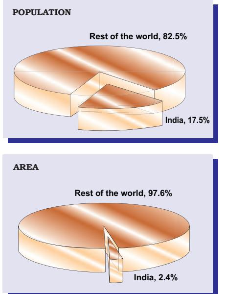
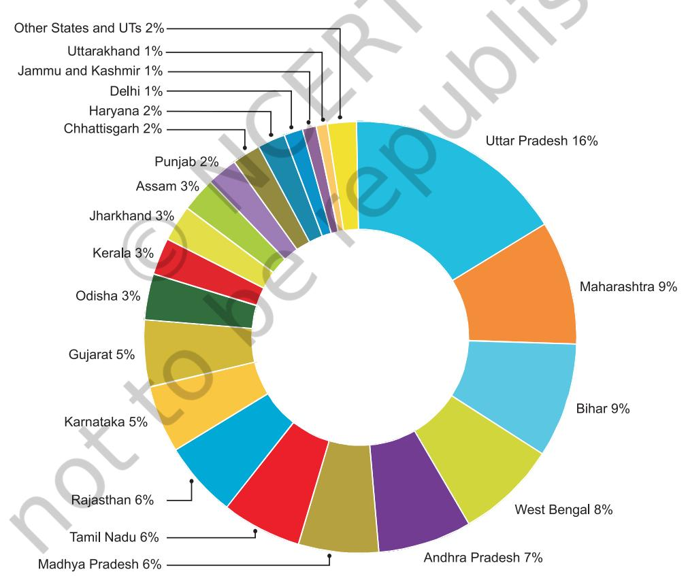
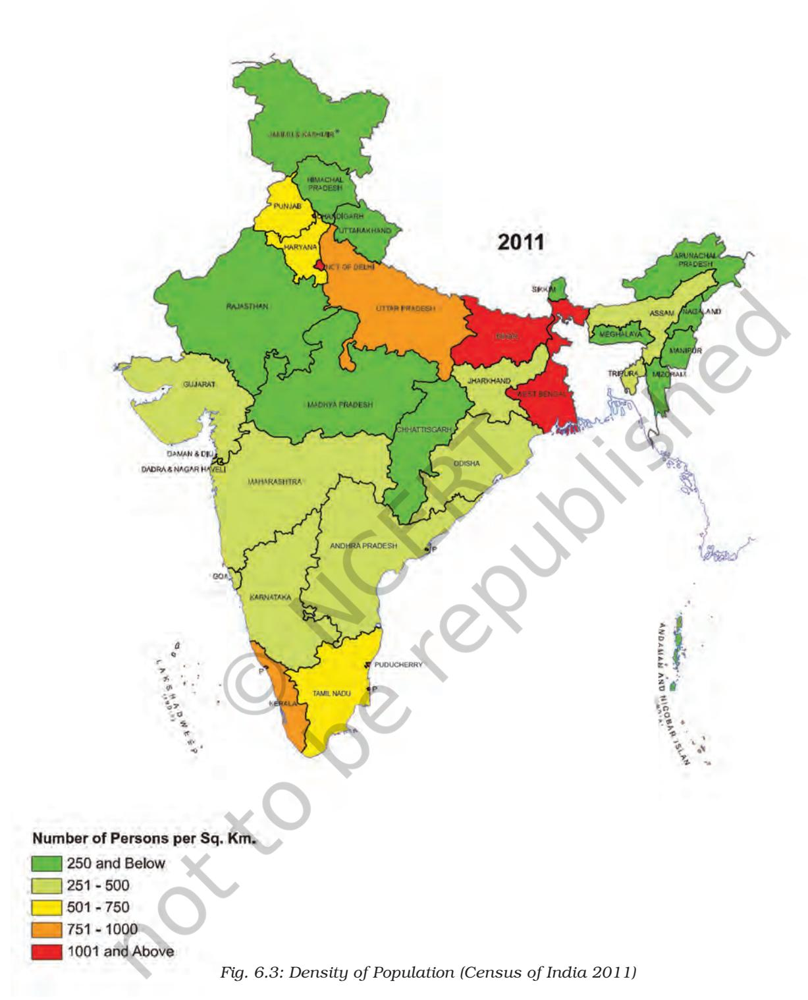
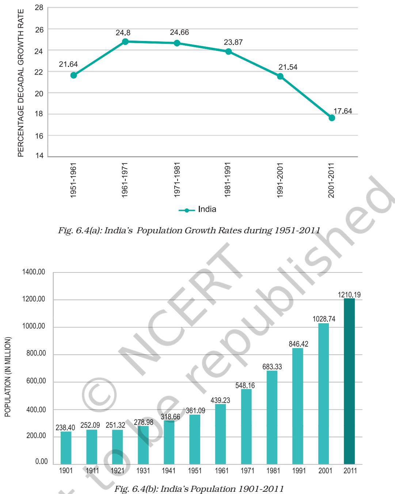

# 6

# POPULATION

C an you imagine a world without human beings? Who would have utilised the resources and created social and cultural environment? The people are important to develop the economy and the society. The people make and use resources and are themselves resources with varying quality. Coal is but a piece of rock, until people were able to invent technology to obtain it and make it 'resource'. Natural events, like a flood or a Tsunami, becomes a 'disaster' only when they affect a crowded village or a town.

Hence, population is the pivotal element in social studies. It is the point of reference from which all other elements are observed and from which they derive significance and meaning. 'Resources', 'calamities' and 'disasters' are all meaningful only in relation to human beings. Their numbers, distribution, growth and characteristics or qualities provide the basic background for understanding and appreciating all aspects of the environment.

Human beings are producers and consumers of earth's resources. Therefore, it is important to know how many people are there in a country, where do they live, how and why their numbers are increasing and what are their characteristics. The census of India provides us with information regarding the population of our country.

### POPULATION SIZE AND DISTRIBUTION

# India's Population Size and Distribution by Numbers

India's population as on March 2011 stood at 1,210.6 million, which account for more the 17 per cent of the world's population. These 1.21 billion people are unevenly distributed over our country's vast area of 3.28 million square km, which accounts for 2.4 per cent of the world's area (Figure 6.1).

The 2011 Census data reveal that Uttar Pradesh with a population size of 199 million is the most populous state of India. Uttar Pradesh accounts for about 16 per cent of the country's population. On the other hand, the Himalayan state of Sikkim has a population of just about 0.6 million and Lakshadweep has only 64,429 people.

Almost half of India's population lives in just five states. These are Uttar Pradesh, Maharashtra, Bihar, West Bengal and Andhra Pradesh. Rajasthan, the biggest state in terms of area, has only 5.5 per cent of the total population of India (Figure 6.2)

 • What could be the reason of uneven distribution of population in India?

### Census

- A census is an official enumeration of population done periodically. In India, the first census was held in the year 1872. The first complete census, however, was taken in the year 1881. Since then, censuses have been held regularly every tenth year.
- The Indian Census is the most comprehensive source of demographic, social and economic data. Have you ever seen a census report? Check in your library if it has one.

48 CONTEMPORARY INDIA-I

*Fig 6.1 : India's Share of World's Area and Population*

### India's Population Distribution by Density

Population density provides a better picture of the uneven distribution. Population density is calculated as the number of persons per unit area. India is one of the most densely populated countries of the world.

| Only Bangladesh and Japan have |
| --- |
| Do You Know higher average population densities |
| than India. Find out the population |
| densities of Bangladesh and Japan. |

The population density of India in the year 2011 was 382 persons per sq km. Densities vary from 1,102 persons per sq km in Bihar to only 17 persons per sq km in Arunachal Pradesh. A study of the Figure 6.3 shows the pattern of uneven distribution of population densities at the State level.

*Fig. 6.2: Distribution of Population*

*Source: Census of India, 2011*

POPULATION 49

*Note: Telangana became the 29th State of India in June 2014.*

- ** State of Jammu and Kashmir was bifurcated into two union territories namely Jammu and Kashmir and Ladakh on 05.08.19.*
50 CONTEMPORARY INDIA-I

### *Activity ActivityActivity*

Study the Figure 6.3 and compare it with Figure 2.4 and Figure 4.7. Do you find any corelation between these maps?

Note the States with population densities below 250 persons per square km. Rugged terrain and unfavourable climatic conditions are primarily responsible for sparse population in these areas. Which states have density below 250 persons per square km?

Assam and most of the Peninsular states have moderate population densities. Hilly, dissected and rocky nature of the terrain, moderate to low rainfall, shallow and less fertile soils have influenced population densities in these areas.

The Northern plains and Kerala in the south have high to very high population densities because of the flat plains with fertile soils and abundant rainfall. Identify the three states of the Northern Plains with high population densities.

# POPULATION GROWTH AND PROCESSES OF POPULATION CHANGE

Population is a dynamic phenomenon. The numbers, distribution and composition of the population are constantly changing. This is the influence of the interaction of the three processes, namely — births, deaths and migrations.

### Population Growth

Growth of population refers to the change in the number of inhabitants of a country/territory during a specific period of time, say during the last 10 years. Such a change can be expressed in two ways: in terms of absolute numbers and in terms of percentage change per year.

The absolute numbers added each year or decade is the magnitude of increase. It is obtained by simply subtracting the earlier population (e.g. that of 2001) from the later population (e.g. that of 2011). It is referred to as the absolute increase.

The rate or the pace of population increase is the other important aspect. It is studied in per cent per annum, e.g. a rate of increase of 2 per cent per annum means that in a given year, there was an increase of two persons for every 100 persons in the base population. This is referred to as the annual growth rate.

India's population has been steadily increasing from 361 million in 1951 to 1210 million in 2011.

| Year | Total | Absolute | Annual |
| --- | --- | --- | --- |
|  | Population | Increase in | Growth |
|  | (in million) | the Decade | Rate |
|  |  | (in million) | ( % ) |
| 1951 | 361.0 | 42.43 | 1.25 |
| 1961 | 439.2 | 78.15 | 1.96 |
| 1971 | 548.2 | 108.92 | 2.20 |
| 1981 | 683.3 | 135.17 | 2.22 |
| 1991 | 846.4 | 163.09 | 2.16 |
| 2001 | 1028.7 | 182.32 | 1.97 |
| 2011 | 1210.6 | 181.46 | 1.64 |

*Table 6.1 : The Magnitude and Rate of India's Population Growth*

Table 6.1 and Figures 6.4 (a) and 6.4 (b) reveal that from 1951 to 1981, the annual rate of population growth was steadily increasing; which explains the rapid increase in population from 361 million in 1951 to 683 million in 1981.

• Table 6.1 reveals that despite the decline in growth rates, the number of people being added every decade is steadily increasing. Why?

Since 1981, however, the rate of growth started declining gradually. During this period, birth rates declined rapidly. Still 182 million people were added to the total population in the 1990s alone (an annual addition larger than ever before).

It is essential to realise that India has a very large population. When a low annual rate is applied to a very large population, it yields a large absolute increase. When more than a billion people increase even at a lower rate, the total number being added becomes very large. India's annual increase in population is large enough to neutralise efforts to conserve the resource endowment and environment.

 The declining trend of the growth rate is indeed a positive indicator of the efforts of birth control. Despite that, the total additions to the population base continue to grow, and India

has overtaken China in 2023 to become the most populous country in the world. (www.un.org.)

# **Processes of Population Change/Growth**

There are three main processes of change of population : birth rates, death rates and migration.

The natural increase of population is the difference between birth rates and death rates.

**Birth rate** is the number of live births per thousand persons in a year. It is a major component of growth because in India, birth rates have always been higher than death rates.

Death rate is the number of deaths per thousand persons in a year. The main cause of the rate of growth of the Indian population has been the rapid decline in death rates.

Till 1980, high birth rates and declining death rates led to a large difference between birth rates and death rates resulting in higher rates of population growth. Since 1981, birth rates have also started declining gradually, resulting in a gradual decline in the rate of population growth. What are the reasons for this trend?

The third component of population growth is migration. Migration is the movement of people across regions and territories. Migration can be internal (within the country) or international (between the countries).

Internal migration does not change the size of the population, but influences the distribution of population within the nation. Migration plays a very significant role in changing the composition and distribution of population.

In India, most migrations have been from rural to urban areas because of the "push" factor in rural areas. These are adverse conditions of poverty and unemployment in the rural areas and the "pull" of the city in terms of increased employment opportunities and better living conditions.

Migration is an important determinant of population change. It changes not only the population size but also the population composition of urban and rural populations in terms of age and sex composition. In India, the rural-urban migration has resulted in a steady increase in the percentage of population in cities and towns. The urban population has increased from 17.29 per cent of the total

population in 1951 to 31.80 per cent in 2011. There has been a significant increase in the number of 'million plus cities' from 35 to 53 in just one decade, i.e., 2001 to 2011. In 2023 there were 59 million plus cities in India.

## Adolescent Population

The most significant feature of the Indian population is the size of its adolescent population. It constitutes one-fifth of the total population of India. Adolescents are, generally, grouped in the age group of 10 to 19 years. They are the most important resource for the future. Nutrition requirements of adolescents are higher than those of a normal child or adult. Poor nutrition can lead to deficiency and stunted growth. But in India, the diet available to adolescents is inadequate in all nutrients. A large number of adolescent girls suffer from anaemia. Their problems have so far not received adequate attention in the process of development. The adolescent girls have to be sensitised to the problems they confront. Awareness among them can be improved through the spread of literacy and education.

# National Population Policy

Recognising that the planning of families would improve individual health and welfare, the Government of India initiated a comprehensive Family Planning Programme in 1952. The Family Welfare Programme has sought to promote responsible and planned parenthood on a voluntary basis. The National Population Policy (NPP) 2000 is a culmination of years of planned efforts.

The NPP 2000 provides a policy framework for imparting free and compulsory school education up to 14 years of age, reducing infant mortality rate to below 30 per 1000 live births, achieving universal immunisation of children against all vaccine preventable diseases, promoting delayed marriage for girls, and making family welfare a people-centred programme.

# EXERCISE

- 1. Choose the right answer from the four alternatives given below.
	- (i) Migrations change the number, distribution and composition of the population in
		-
		- (a) the area of departure (c) both the area of departure and arrival
		- (b) the area of arrival (d) none of the above
- - (ii) A large proportion of children in a population is a result of
		- (a) high birth rates (c) high death rates
		- (b) high life expectancies (d) more married couples
	- (iii) The magnitude of population growth refers to
		- (a) the total population of an area
		- (b) the number of persons added each year
		- (c) the rate at which the population increases
		- (d) the number of females per thousand males
	- (iv) According to the Census, a "literate" person is one who
		- (a) can read and write his/her name
		- (b) can read and write any language
		- (c) is 7 years old and can read and write any language with understanding
		- (d) knows the 3 'R's (reading, writing, arithmetic)
- 2. Answer the following questions briefly.
	- (i) Why is the rate of population growth in India declining since 1981?
	- (ii) Discuss the major components of population growth.
	- (iii) Define age structure, death rate and birth rate.
	- (iv) How is migration a determinant factor of population change?
- 3. Distinguish between population growth and population change.
- 4. What is the relation between occupational structure and development?
- 5. What are the advantages of having a healthy population?
- 6. What are the significant features of the National Population Policy 2000?

### PROJECT/ACTIVITY

Conduct a class census by preparing a questionnaire. The questionnaire should contain minimum five questions. Questions should relate to students, their family members, their class performance, their health, etc. Each student is required to fill in the questionnaire. Compile the information in numerical terms (in terms of percentage). Present the information through pie-chart, bar-diagram or in any other way.

# GLOSSARY

| Adolescence | : Adolescence is a period in which a person is no longer a child and |
| --- | --- |
|  | not yet an adult. Such persons are grouped in the age group of |
|  | 10 to 19 years. |
| Alluvial plain | : A level tract of land made up of alluvium or fine rock material |
|  | brought down by a river. |
| Base population : | The total population of an area at the beginning of a given time |
|  | period. |
| Biome | : Plant communities occuring in distinct groups in areas having |
|  | similar climatic conditions. |
| Birth rate | : The number of live births for every 1000 persons in a year. |
| Depression | : In meteorology; it denotes an area of relatively low atmospheric |
|  | pressure, which is found mainly in temperate regions. In geology, |
|  | it refers to a hollow sunken area of the earth's surface. |
| Death rate | : The number of deaths per 1000 persons in year. |
| Density of population | : The average number of persons per unit area, such as a square |
|  | kilometre. |
| Dependency ratio | : The ratio of people of dependent age (below 15 and above 60 years) |
|  | to people of economically active ages (15-59 years). |
| Ecosystem | : A system which comprises the physical environment and the |
|  | organisms living therein. |
| Environment | : Surroundings or the conditions under which a person or thing |
|  | exists and develops his or its character. It covers both physical |
|  | and cultural elements. |
| Fault | : A linear break in rocks of the earth's crust along which there has |
|  | been displacement in a horizontal, vertical or oblique direction. |
| Fauna | : The animal life of a given area. |
| Flora | : The total vegetation or plant cover of a region. |
| Fold | : A bend in the rock strata resulting from compression of an area of |
|  | the earth's crust. |
| Geosyncline | : A narrow, shallow, elongated basin with a sinking bottom in which |
|  | a considerable thickness of sediments was deposited by the rivers |
|  | coming from Angara and Gondwanaland. |
| Glacier | : A mass of snow and ice that moves slowly under the influence of |
|  | gravity along a confined course away from its place of accumulation. |
| Growth rate of population | : The growth rate of population indicates the rate at which the |
|  | population is growing. In estimating the growth rate the increase |
|  | in population is compared with the base population. It can be |
|  | measured annually or over a decade. |
| Indian mainland | : It refers to the contiguous stretch of landmass from Jammu and |
|  | Kashmir to Kanniyakumari and from Gujarat to Arunachal Pradesh. |
| Indian Standard Time | : The local time along the Standard Meridian of India (82°30'E). |
| Inland drainage | : A drainage system in which the waters of the rivers do not reach |
|  | the oceans but fall into an inland sea or lake. |

| Igneous rocks | : Rocks formed as a result of solidification of magma either below |
| --- | --- |
|  | the earth's surface or above it. |
| Lagoon | : A salt-water lake separated from the sea by the sandbars and spits. |
| Lake | : A body of water that lies in a hollow in the earth's surface and is |
|  | entirely surrounded by land. |
| Lithospheric plates | : Large segments of the earth's crust composed of continental and |
|  | oceanic lithospheric parts, floating above the asthenosphere. |
| Life expectancy | : The average number of years one is expected to live. |
| Local time | : The time of a place determined by the midday sun is called the |
|  | local time. |
| Metamorphic rocks | : Deformation and alteration of pre-existing igneous and |
|  | sedimentary rocks as a result of changes in physical and chemical |
|  | conditions due to intense heat or pressure. |
| Migration | : Movement of people from one place to another. Internal migration |
|  | means movement of people within a country and external migration |
|  | means movement of people between countries. When people come |
|  | to a country from another country, it is called immigration and |
|  | when they leave that country, it is called emigration. |
| Million plus cities | : Cities with a population of more than one million or 10 lakh. |
| Monsoon | : A complete reversal of winds over a large area leading to a change |
|  | of seasons. |
| Mountain | : An upward projected features of the earth's surface that rises to |
|  | high altitude and usually possesses steep slopes. |
| National park | : A reserved area for preserving its natural vegetation, wildlife and |
|  | the natural environment. |
| Plain | : An extensive area of flat or gently undulating land. |
| Plateau | : An extensive elevated area of relatively flat land. |
| Plate tectonics : | The scientific concept that explains the movements of the crustal |
|  | plates. |
| Relief | : The differences in elevation or the physical outline of the land |
|  | surface or ocean floor. |
| Subsidence | : In meteorology, it is the downward movement of the air. In geology, |
|  | it refers to the sinking of a portion of the earth's surface. |
| Sedimentary rocks | : Rocks composed of sediments and generally having a layered |
|  | structure. |
| Sex-ratio | : Sex-ratio is defined as the number of females per thousand males. |
| Subcontinent | : A big landmass, which stands out as a distinct geographical unit |
|  | from the rest of the continent. |
| Tectonic | : Forces originating within the earth and responsible for bringing |
|  | widespread changes in the landform features. |
| Young mountains | : The fold mountains formed during the most recent major phase |
|  | of folding in the earth's crust. |

56 CONTEMPORARY INDIA-I

