# **SECTION I**

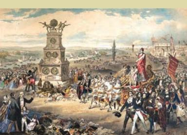

# **EVENTS AND PROCESSES**

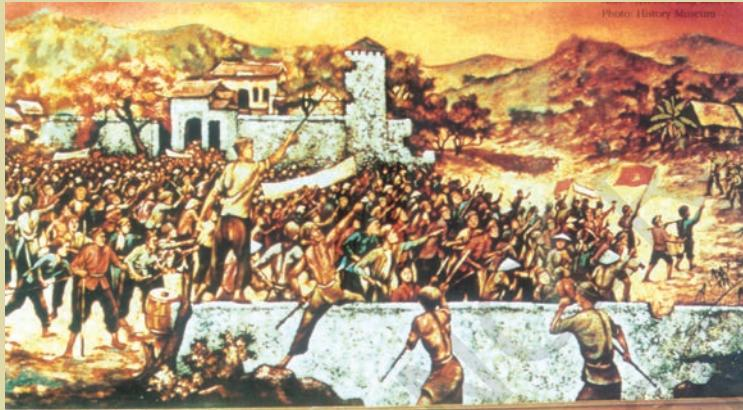

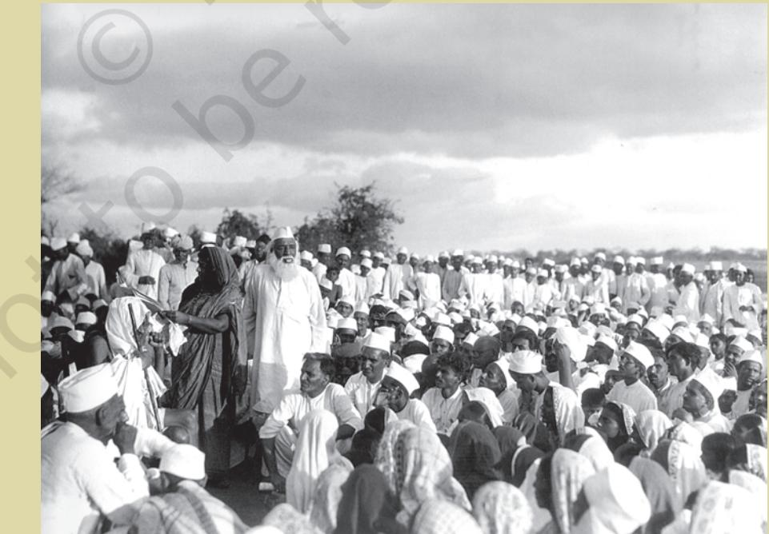

# **The Rise of Nationalism in Europe**

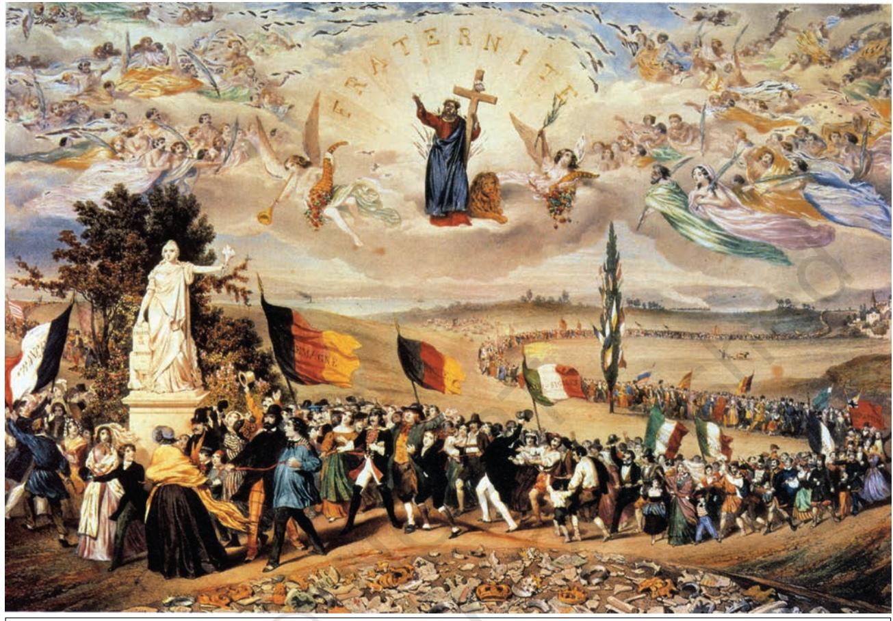

Fig. 1 — The Dream of Worldwide Democratic and Social Republics – The Pact Between Nations, a print prepared by Frédéric Sorrieu, 1848.

In 1848, Frédéric Sorrieu, a French artist, prepared a series of four prints visualising his dream of a world made up of 'democratic and social Republics', as he called them. The first print (Fig. 1) of the series, shows the peoples of Europe and America – men and women of all ages and social classes – marching in a long train, and offering homage to the statue of Liberty as they pass by it. As you would recall, artists of the time of the French Revolution personified Liberty as a female figure – here you can recognise the torch of Enlightenment she bears in one hand and the Charter of the Rights of Man in the other. On the earth in the foreground of the image lie the shattered remains of the symbols of absolutist institutions. In Sorrieu's utopian vision, the peoples of the world are grouped as distinct nations, identified through their flags and national costume. Leading the procession, way past the statue of Liberty, are the United States and Switzerland, which by this time were already nation-states. France,

### New words

Absolutist – Literally, a government or system of rule that has no restraints on the power exercised. In history, the term refers to a form of monarchical government that was centralised, militarised and repressive

Utopian – A vision of a society that is so ideal that it is unlikely to actually exist

### Activity

In what way do you think this print (Fig. 1) depicts a utopian vision?

3

identifiable by the revolutionary tricolour, has just reached the statue. She is followed by the peoples of Germany, bearing the black, red and gold flag. Interestingly, at the time when Sorrieu created this image, the German peoples did not yet exist as a united nation – the flag they carry is an expression of liberal hopes in 1848 to unify the numerous German-speaking principalities into a nation-state under a democratic constitution. Following the German peoples are the peoples of Austria, the Kingdom of the Two Sicilies, Lombardy, Poland, England, Ireland, Hungary and Russia. From the heavens above, Christ, saints and angels gaze upon the scene. They have been used by the artist to symbolise fraternity among the nations of the world.

This chapter will deal with many of the issues visualised by Sorrieu in Fig. 1. During the nineteenth century, nationalism emerged as a force which brought about sweeping changes in the political and mental world of Europe. The end result of these changes was the emergence of the nation-state in place of the multi-national dynastic empires of Europe. The concept and practices of a modern state, in which a centralised power exercised sovereign control over a clearly defined territory, had been developing over a long period of time in Europe. But a nation-state was one in which the majority of its citizens, and not only its rulers, came to develop a sense of common identity and shared history or descent. This commonness did not exist from time immemorial; it was forged through struggles, through the actions of leaders and the common people. This chapter will look at the diverse processes through which nation-states and nationalism came into being in nineteenth-century Europe.

### **Source A**

#### Ernst Renan, 'What is a Nation?'

In a lecture delivered at the University of Sorbonne in 1882, the French philosopher Ernst Renan (1823-92) outlined his understanding of what makes a nation. The lecture was subsequently published as a famous essay entitled 'Qu'est-ce qu'une nation?' ('What is a Nation?'). In this essay Renan criticises the notion suggested by others that a nation is formed by a common language, race, religion, or territory:

'A nation is the culmination of a long past of endeavours, sacrifice and devotion. A heroic past, great men, glory, that is the social capital upon which one bases a national idea. To have common glories in the past, to have a common will in the present, to have performed great deeds together, to wish to perform still more, these are the essential conditions of being a people. A nation is therefore a large-scale solidarity … Its existence is a daily plebiscite … A province is its inhabitants; if anyone has the right to be consulted, it is the inhabitant. A nation never has any real interest in annexing or holding on to a country against its will. The existence of nations is a good thing, a necessity even. Their existence is a guarantee of liberty, which would be lost if the world had only one law and only one master.'

# **Source**

#### New words

Plebiscite – A direct vote by which all the people of a region are asked to accept or reject a proposal

### Discuss

Summarise the attributes of a nation, as Renan understands them. Why, in his view, are nations important?

# **1 The French Revolution and the Idea of the Nation**

The first clear expression of nationalism came with the French Revolution in 1789. France, as you would remember, was a full-fledged territorial state in 1789 under the rule of an absolute monarch. The political and constitutional changes that came in the wake of the French Revolution led to the transfer of sovereignty from the monarchy to a body of French citizens. The revolution proclaimed that it was the people who would henceforth constitute the nation and shape its destiny.

From the very beginning, the French revolutionaries introduced various measures and practices that could create a sense of collective identity amongst the French people. The ideas of la patrie (the fatherland) and le citoyen (the citizen) emphasised

the notion of a united community enjoying equal rights under a constitution. A new French flag, the tricolour, was chosen to replace the former royal standard. The Estates General was elected by the body of active citizens and renamed the National Assembly. New hymns were composed, oaths taken and martyrs commemorated, all in the name of the nation. A centralised administrative system was put in place and it formulated uniform laws for all citizens within its territory. Internal customs duties and dues were abolished and a uniform system of weights and measures was adopted. Regional dialects were discouraged and French, as it was spoken and written in Paris, became the common language of the nation.

The revolutionaries further declared that it was the mission and the destiny of the French nation to liberate the peoples of Europe from despotism, in other words to help other peoples of Europe to become nations.

When the news of the events in France reached the different cities of Europe, students and other members of educated middle classes began setting up Jacobin clubs. Their activities and campaigns prepared the way for the French armies which moved into Holland, Belgium, Switzerland and much of Italy in the 1790s. With the outbreak of the revolutionary wars, the French armies began to carry the idea of nationalism abroad.

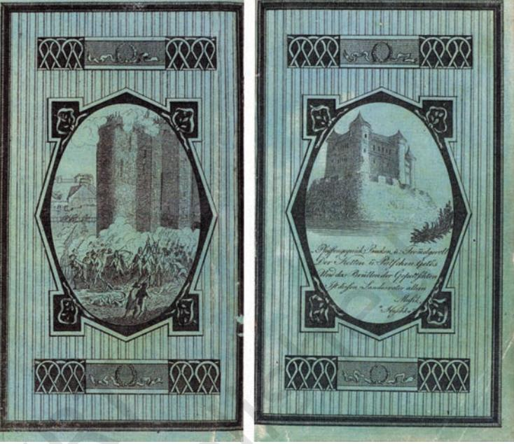

Fig. 2 — The cover of a German almanac designed by the journalist Andreas Rebmann in 1798.

The image of the French Bastille being stormed by the revolutionary crowd has been placed next to a similar fortress meant to represent the bastion of despotic rule in the German province of Kassel. Accompanying the illustration is the slogan: 'The people must seize their own freedom!' Rebmann lived in the city of Mainz and was a member of a German Jacobin group.

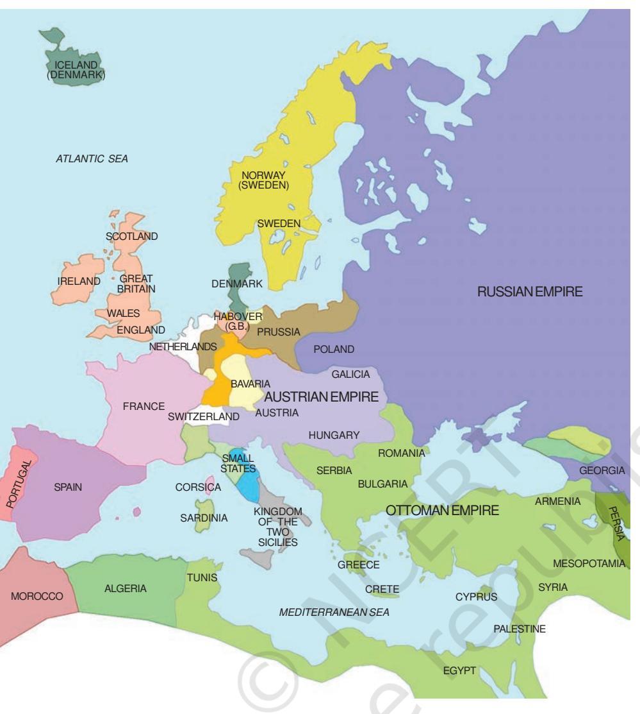

Within the wide swathe of territory that came under his control, Napoleon set about introducing many of the reforms that he had already introduced in France. Through a return to monarchy Napoleon had, no doubt, destroyed democracy in France, but in the administrative field he had incorporated revolutionary principles in order to make the whole system more rational and efficient. The Civil Code of 1804 – usually known as the Napoleonic Code – did away with all privileges based on birth, established equality before the law and secured the right to property. This Code was exported to the regions under French control. In the Dutch Republic, in Switzerland, in Italy and Germany, Napoleon simplified administrative divisions, abolished the feudal system and freed peasants from serfdom and manorial dues. In the towns too, guild restrictions were removed. Transport and communication systems were improved. Peasants, artisans, workers and new businessmen Fig. 3 — Europe after the Congress of Vienna, 1815.

2024-25

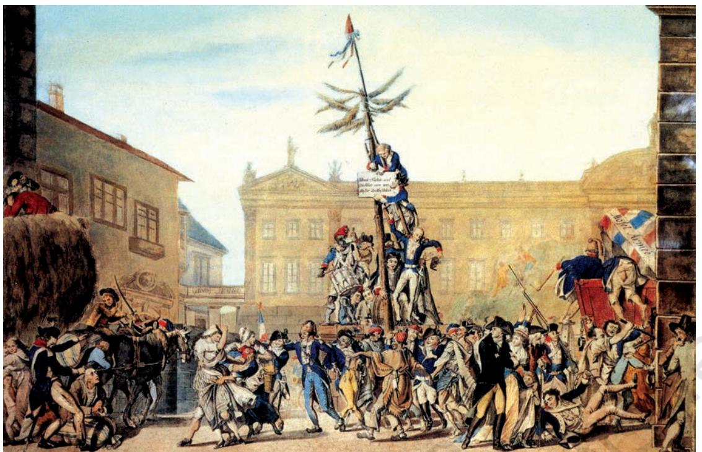

Fig. 4 — The Planting of Tree of Liberty in Zweibrücken, Germany. The subject of this colour print by the German painter Karl Kaspar Fritz is the occupation of the town of Zweibrücken by the French armies. French soldiers, recognisable by their blue, white and red uniforms, have been portrayed as oppressors as they seize a peasant's cart (left), harass some young women (centre foreground) and force a peasant down to his knees. The plaque being affixed to the Tree of Liberty carries a German inscription which in translation reads: 'Take freedom and equality from us, the model of humanity.' This is a sarcastic reference to the claim of the French as being liberators who opposed monarchy in the territories they entered.

enjoyed a new-found freedom. Businessmen and small-scale producers of goods, in particular, began to realise that uniform laws, standardised weights and measures, and a common national currency would facilitate the movement and exchange of goods and capital from one region to another.

However, in the areas conquered, the reactions of the local populations to French rule were mixed. Initially, in many places such as Holland and Switzerland, as well as in certain cities like Brussels, Mainz, Milan and Warsaw, the French armies were welcomed as harbingers of liberty. But the initial enthusiasm soon turned to hostility, as it became clear that the new administrative arrangements did not go hand in hand with political freedom. Increased taxation, censorship, forced conscription into the French armies required to conquer the rest of Europe, all seemed to outweigh the advantages of the administrative changes.

Fig. 5 — The courier of Rhineland loses all that he has on his way home from Leipzig. Napoleon here is represented as a postman on his way back to France after he lost the battle of Leipzig in 1813. Each letter dropping out of his bag bears the names of the territories he lost.

# **2 The Making of Nationalism in Europe**

If you look at the map of mid-eighteenth-century Europe you will find that there were no 'nation-states' as we know them today.

What we know today as Germany, Italy and Switzerland were divided into kingdoms, duchies and cantons whose rulers had their autonomous territories. Eastern and Central Europe were under autocratic monarchies within the territories of which lived diverse peoples. They did not see themselves as sharing a collective identity or a common culture. Often, they even spoke different languages and belonged to different ethnic groups. The Habsburg Empire that ruled over Austria-Hungary, for example, was a patchwork of many different regions and peoples. It included the Alpine regions – the Tyrol, Austria and the Sudetenland – as well as Bohemia, where the aristocracy was predominantly German-speaking. It also included the Italian-speaking provinces of Lombardy and Venetia. In Hungary, half of the population spoke Magyar while the other half spoke a variety of dialects. In Galicia, the aristocracy spoke Polish. Besides these three dominant groups, there also lived within the boundaries of the empire, a mass of subject peasant peoples – Bohemians and Slovaks to the north, Slovenes in Carniola, Croats to the south, and Roumans to the east in Transylvania. Such differences did not easily promote a sense of political unity. The only tie binding these diverse groups together was a common allegiance to the emperor.

How did nationalism and the idea of the nation-state emerge?

### **2.1 The Aristocracy and the New Middle Class**

Socially and politically, a landed aristocracy was the dominant class on the continent. The members of this class were united by a common way of life that cut across regional divisions. They owned estates in the countryside and also town-houses. They spoke French for purposes of diplomacy and in high society. Their families were often connected by ties of marriage. This powerful aristocracy was, however, numerically a small group. The majority of the population was made up of the peasantry. To the west, the bulk of the land was farmed by tenants and small owners, while in Eastern and Central Europe the pattern of landholding was characterised by vast estates which were cultivated by serfs.

#### **Some important dates**

#### 1797

Napoleon invades Italy; Napoleonic wars begin.

#### 1814-1815

Fall of Napoleon; the Vienna Peace Settlement.

#### 1821

Greek struggle for independence begins.

#### 1848

Revolutions in Europe; artisans, industrial workers and peasants revolt against economic hardships; middle classes demand constitutions and representative governments; Italians, Germans, Magyars, Poles, Czechs, etc. demand nation-states.

1859-1870 Unification of Italy.

1866-1871 Unification of Germany.

#### 1905

Slav nationalism gathers force in the Habsburg and Ottoman Empires.

In Western and parts of Central Europe the growth of industrial production and trade meant the growth of towns and the emergence of commercial classes whose existence was based on production for the market. Industrialisation began in England in the second half of the eighteenth century, but in France and parts of the German states it occurred only during the nineteenth century. In its wake, new social groups came into being: a working-class population, and middle classes made up of industrialists, businessmen, professionals. In Central and Eastern Europe these groups were smaller in number till late nineteenth century. It was among the educated, liberal middle classes that ideas of national unity following the abolition of aristocratic privileges gained popularity.

### **2.2 What did Liberal Nationalism Stand for?**

Ideas of national unity in early-nineteenth-century Europe were closely allied to the ideology of liberalism. The term 'liberalism' derives from the Latin root liber, meaning free. For the new middle classes liberalism stood for freedom for the individual and equality of all before the law. Politically, it emphasised the concept of government by consent. Since the French Revolution, liberalism had stood for the end of autocracy and clerical privileges, a constitution and representative government through parliament. Nineteenth-century liberals also stressed the inviolability of private property.

Yet, equality before the law did not necessarily stand for universal suffrage. You will recall that in revolutionary France, which marked the first political experiment in liberal democracy, the right to vote and to get elected was granted exclusively to property-owning men. Men without property and all women were excluded from political rights. Only for a brief period under the Jacobins did all adult males enjoy suffrage. However, the Napoleonic Code went back to limited suffrage and reduced women to the status of a minor, subject to the authority of fathers and husbands. Throughout the nineteenth and early twentieth centuries women and non-propertied men organised opposition movements demanding equal political rights.

In the economic sphere, liberalism stood for the freedom of markets and the abolition of state-imposed restrictions on the movement of goods and capital. During the nineteenth century this was a strong demand of the emerging middle classes. Let us take the example of the German-speaking regions in the first half of the nineteenth century. Napoleon's administrative measures had created out of

### New words

Suffrage – The right to vote

countless small principalities a confederation of 39 states. Each of these possessed its own currency, and weights and measures. A merchant travelling in 1833 from Hamburg to Nuremberg to sell his goods would have had to pass through 11 customs barriers and pay a customs duty of about 5 per cent at each one of them. Duties were often levied according to the weight or measurement of the goods. As each region had its own system of weights and measures, this involved time-consuming calculation. The measure of cloth, for example, was the elle which in each region stood for a different length. An elle of textile material bought in Frankfurt would get you 54.7 cm of cloth, in Mainz 55.1 cm, in Nuremberg 65.6 cm, in Freiburg 53.5 cm.

Such conditions were viewed as obstacles to economic exchange and growth by the new commercial classes, who argued for the creation of a unified economic territory allowing the unhindered movement of goods, people and capital. In 1834, a customs union or zollverein was formed at the initiative of Prussia and joined by most of the German states. The union abolished tariff barriers and reduced the number of currencies from over thirty to two. The creation of a network of railways further stimulated mobility, harnessing economic interests to national unification. A wave of economic nationalism strengthened the wider nationalist sentiments growing at the time.

### **2.3 A New Conservatism after 1815**

Following the defeat of Napoleon in 1815, European governments were driven by a spirit of conservatism. Conservatives believed that established, traditional institutions of state and society – like the monarchy, the Church, social hierarchies, property and the family – should be preserved. Most conservatives, however, did not propose a return to the society of pre-revolutionary days. Rather, they realised, from the changes initiated by Napoleon, that modernisation could in fact strengthen traditional institutions like the monarchy. It could make state power more effective and strong. A modern army, an efficient bureaucracy, a dynamic economy, the abolition of feudalism and serfdom could strengthen the autocratic monarchies of Europe.

In 1815, representatives of the European powers – Britain, Russia, Prussia and Austria – who had collectively defeated Napoleon, met at Vienna to draw up a settlement for Europe. The Congress was hosted by the Austrian Chancellor Duke Metternich. The delegates

### **Source B**

Economists began to think in terms of the national economy. They talked of how the nation could develop and what economic measures could help forge this nation together.

Friedrich List, Professor of Economics at the University of Tübingen in Germany, wrote in 1834:

'The aim of the zollverein is to bind the Germans economically into a nation. It will strengthen the nation materially as much by protecting its interests externally as by stimulating its internal productivity. It ought to awaken and raise national sentiment through a fusion of individual and provincial interests. The German people have realised that a free economic system is the only means to engender national feeling.'

**Source**

### Discuss

Describe the political ends that List hopes to achieve through economic measures.

### New words

Conservatism – A political philosophy that stressed the importance of tradition, established institutions and customs, and preferred gradual development to quick change

drew up the Treaty of Vienna of 1815 with the object of undoing most of the changes that had come about in Europe during the Napoleonic wars. The Bourbon dynasty, which had been deposed during the French Revolution, was restored to power, and France lost the territories it had annexed under Napoleon. A series of states were set up on the boundaries of France to prevent French expansion in future. Thus the kingdom of the Netherlands, which included Belgium, was set up in the north and Genoa was added to Piedmont in the south. Prussia was given important new territories on its western frontiers, while Austria was given control of northern Italy. But the German confederation of 39 states that had been set up by Napoleon was left untouched. In the east, Russia was given part of Poland while Prussia was given a portion of Saxony. The main intention was to restore the monarchies that had been overthrown by Napoleon, and create a new conservative order in Europe.

Conservative regimes set up in 1815 were autocratic. They did not tolerate criticism and dissent, and sought to curb activities that questioned the legitimacy of autocratic governments. Most of them imposed censorship laws to control what was said in newspapers, books, plays and songs and reflected the ideas of liberty and freedom

### Activity

Plot on a map of Europe the changes drawn up by the Vienna Congress.

### Discuss

What is the caricaturist trying to depict?

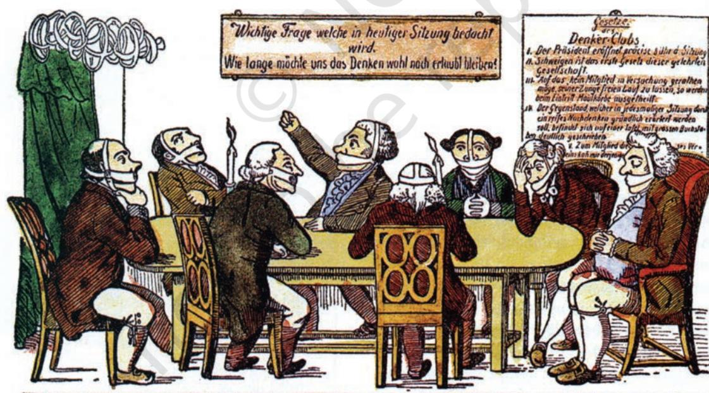

Fig. 6 — The Club of Thinkers, anonymous caricature dating to c. 1820. The plaque on the left bears the inscription: 'The most important question of today's meeting: How long will thinking be allowed to us?' The board on the right lists the rules of the Club which include the following: '1. Silence is the first commandment of this learned society. 2. To avoid the eventuality whereby a member of this club may succumb to the temptation of speech, muzzles will be distributed to members upon entering.'

associated with the French Revolution. The memory of the French Revolution nonetheless continued to inspire liberals. One of the major issues taken up by the liberal-nationalists, who criticised the new conservative order, was freedom of the press.

### **2.4 The Revolutionaries**

During the years following 1815, the fear of repression drove many liberal-nationalists underground. Secret societies sprang up in many European states to train revolutionaries and spread their ideas. To be revolutionary at this time meant a commitment to oppose monarchical forms that had been established after the Vienna Congress, and to fight for liberty and freedom. Most of these revolutionaries also saw the creation of nation-states as a necessary part of this struggle for freedom.

One such individual was the Italian revolutionary Giuseppe Mazzini. Born in Genoa in 1805, he became a member of the secret society of the Carbonari. As a young man of 24, he was sent into exile in 1831 for attempting a revolution in Liguria. He subsequently founded two more underground societies, first, Young Italy in Marseilles, and then, Young Europe in Berne, whose members were like-minded young men from Poland, France, Italy and the German states. Mazzini believed that God had intended nations to be the natural units of mankind. So Italy could not continue to be a patchwork of small states and kingdoms. It had to be forged into a single unified republic within a wider alliance of nations. This unification alone could be the basis of Italian liberty. Following his model, secret societies were set up in Germany, France, Switzerland and Poland. Mazzini's relentless opposition to monarchy and his vision of democratic republics frightened the conservatives. Metternich described him as 'the most dangerous enemy of our social order'.

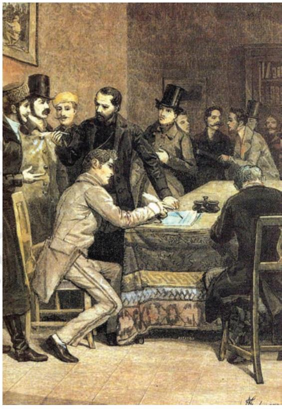

*Fig. 7 — Giuseppe Mazzini and the founding of Young Europe in Berne 1833. Print by Giacomo Mantegazza.*

## **3 The Age of Revolutions: 1830-1848**

As conservative r egimes tried to consolidate their po wer , liberalism and nationalism came to be increasingly associated with revolution in many r egions of Europe such as the Italian and German states , the pr ovinces of the Ottoman Empire, Ireland and Poland. These revolutions were led by the liberal-nationalists belonging to the educated middle-class elite, among whom were professors, schoolteachers, clerks and members of the commercial middle classes.

The first upheaval took place in France in July 1830. The Bourbon kings who had been restored to po wer during the conservative reaction after 1815, were now overthrown by liberal revolutionaries who installed a constitutional monarchy with Louis Philippe at its head. 'When F rance snee zes,' Metternich once remar ked, 'the rest of Europe catches cold. ' The July Revolution spar ked an uprising in Brussels which led to Belgium breaking away from the United Kingdom of the Netherlands .

An event that mobilised nationalist feelings among the educated elite across Europe was the Greek war of independence. Greece had been part of the Ottoman Empire since the fifteenth century. The growth of revolutionary nationalism in Europe spar ked off a strug gle for independence amongst the Greeks which began in 1821. Nationalists in Greece got support from other Greeks living in exile and also from many West Europeans who had sympathies for ancient Greek culture. Poets and artists lauded Greece as the cradle of European civilisation and mobilised public opinion to support its strug gle a gainst a Muslim empire. The English poet Lord Byron organised funds and later went to fight in the war, where he died of fever in 1824. Finally, the Treaty of Constantinople of 1832 recognised Greece as an independent nation.

### **3.1 The Romantic Imagination and National Feeling**

The development of nationalism did not come about only through wars and territorial expansion. Culture played an important role in creating the idea of the nation: art and poetry, stories and music helped express and shape nationalist feelings .

Let us look at Romanticism, a cultural movement which sought to de velop a particular form of nationalist sentiment. Romantic artists and poets generally criticised the glorification of reason and science

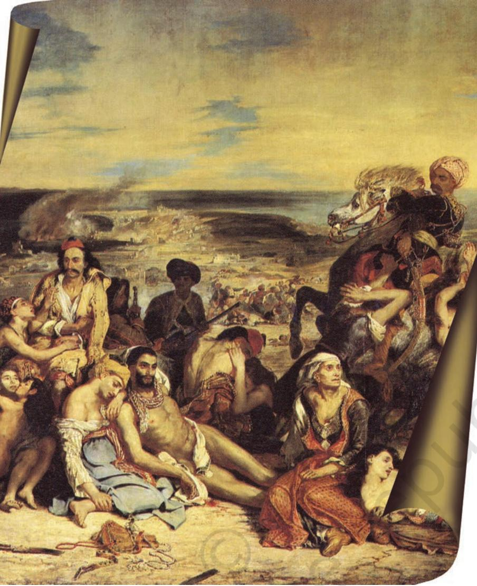

Fig. 8 — The Massacre at Chios, Eugene Delacroix, 1824. The French painter Delacroix was one of the most important French Romantic painters. This huge painting (4.19m x 3.54m) depicts an incident in which 20,000 Greeks were said to have been killed by Turks on the island of Chios. By dramatising the incident, focusing on the suffering of women and children, and using vivid colours, Delacroix sought to appeal to the emotions of the spectators, and create sympathy for the Greeks.

and focused instead on emotions, intuition and mystical feelings. Their effort was to create a sense of a shared collective heritage, a common cultural past, as the basis of a nation.

Other Romantics such as the German philosopher Johann Gottfried Herder (1744-1803) claimed that true German culture was to be discovered among the common people – das volk. It was through folk songs, folk poetry and folk dances that the true spirit of the nation (volksgeist) was popularised. So collecting and recording these forms of folk culture was essential to the project of nation-building. The emphasis on vernacular language and the collection of local folklore was not just to recover an ancient national spirit, but also to carry the modern nationalist message to large audiences who were mostly illiterate. This was especially so in the case of Poland, which had been partitioned at the end of the eighteenth century by the Great Powers – Russia, Prussia and Austria. Even though Poland no longer existed as an independent territory, national feelings were kept alive through music and language. Karol Kurpinski, for example, celebrated the national struggle through his operas and music, turning folk dances like the polonaise and mazurka into nationalist symbols.

Language too played an important role in developing nationalist sentiments. After Russian occupation, the Polish language was forced out of schools and the Russian language was imposed everywhere. In 1831, an armed rebellion against Russian rule took place which was ultimately crushed. Following this, many members of the clergy in Poland began to use language as a weapon of national resistance. Polish was used for Church gatherings and all religious instruction. As a result, a large number of priests and bishops were put in jail or sent to Siberia by the Russian authorities as punishment for their refusal to preach in Russian. The use of Polish came to be seen as a symbol of the struggle against Russian dominance.

### **3.2 Hunger, Hardship and Popular Revolt**

The 1830s were years of great economic hardship in Europe. The first half of the nineteenth century saw an enormous increase in population all over Europe. In most countries there were more seekers of jobs than employment. Population from rural areas migrated to the cities to live in overcrowded slums. Small producers in towns were often faced with stiff competition from imports of cheap machine-made goods from England, where industrialisation was more advanced than on the continent. This was especially so in textile production, which was carried out mainly in homes or small workshops and was only partly mechanised. In those regions of Europe where the aristocracy still enjoyed power, peasants struggled under the burden of feudal dues and obligations. The rise of food prices or a year of bad harvest led to widespread pauperism in town and country.

The year 1848 was one such year. Food shortages and widespread unemployment brought the population of Paris out on the roads. Barricades were erected and Louis Philippe was forced to flee. A

### **Box 1**

#### The Grimm Brothers: Folktales and Nation-building

Grimms' Fairy Tales is a familiar name. The brothers Jacob and Wilhelm Grimm were born in the German city of Hanau in 1785 and 1786 respectively. While both of them studied law, they soon developed an interest in collecting old folktales. They spent six years travelling from village to village, talking to people and writing down fairy tales, which were handed down through the generations. These were popular both among children and adults. In 1812, they published their first collection of tales. Subsequently, both the brothers became active in liberal politics, especially the movement for freedom of the press. In the meantime they also published a 33-volume dictionary of the German language.

The Grimm brothers also saw French domination as a threat to German culture, and believed that the folktales they had collected were expressions of a pure and authentic German spirit. They considered their projects of collecting folktales and developing the German language as part of the wider effort to oppose French domination and create a German national identity.

### Discuss

Discuss the importance of language and popular traditions in the creation of national identity.

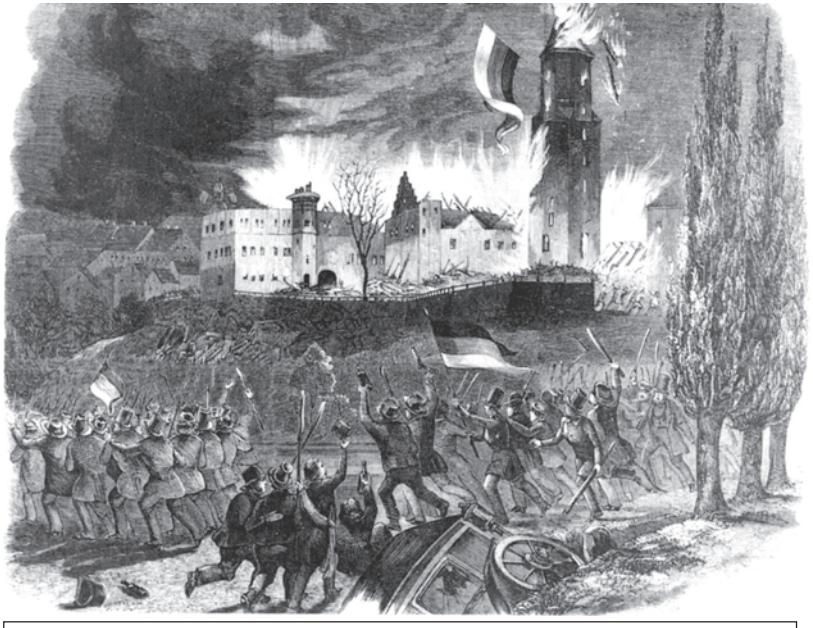

Fig. 9 — Peasants' uprising, 1848.

National Assembly proclaimed a Republic, granted suffrage to all adult males above 21, and guaranteed the right to work. National workshops to provide employment were set up.

Earlier, in 1845, weavers in Silesia had led a revolt against contractors who supplied them raw material and gave them orders for finished textiles but drastically reduced their payments. The journalist Wilhelm Wolff described the events in a Silesian village as follows:

In these villages (with 18,000 inhabitants) cotton weaving is the most widespread occupation … The misery of the workers is extreme. The desperate need for jobs has been taken advantage of by the contractors to reduce the prices of the goods they order …

On 4 June at 2 p.m. a large crowd of weavers emerged from their homes and marched in pairs up to the mansion of their contractor demanding higher wages. They were treated with scorn and threats alternately. Following this, a group of them forced their way into the house, smashed its elegant windowpanes, furniture, porcelain … another group broke into the storehouse and plundered it of supplies of cloth which they tore to shreds … The contractor fled with his family to a neighbouring village which, however, refused to shelter such a person. He returned 24 hours later having requisitioned the army. In the exchange that followed, eleven weavers were shot.

### Discuss

Describe the cause of the Silesian weavers' uprising. Comment on the viewpoint of the journalist.

# Activity

Imagine you are a weaver who saw the events as they unfolded. Write a report on what you saw.

### **3.3 1848: The Revolution of the Liberals**

Parallel to the revolts of the poor, unemployed and starving peasants and workers in many European countries in the year 1848, a revolution led by the educated middle classes was under way. Events of February 1848 in France had brought about the abdication of the monarch and a republic based on universal male suffrage had been proclaimed. In other parts of Europe where independent nation-states did not yet exist – such as Germany, Italy, Poland, the Austro-Hungarian Empire – men and women of the liberal middle classes combined their demands for constitutionalism with national unification. They took advantage of the growing popular unrest to push their demands for the creation of a nation-state on parliamentary principles – a constitution, freedom of the press and freedom of association.

In the German regions a large number of political associations whose members were middle-class professionals, businessmen and prosperous artisans came together in the city of Frankfurt and decided to vote for an all-German National Assembly. On 18 May 1848, 831 elected representatives marched in a festive procession to take their places in the Frankfurt parliament convened in the Church of St Paul. They drafted a constitution for a German nation to be headed by a monarchy subject to a parliament. When the deputies offered the crown on these terms to Friedrich Wilhelm IV, King of Prussia, he rejected it and joined other monarchs to oppose the elected assembly. While the opposition of the aristocracy and military became stronger, the social basis of parliament eroded. The parliament was dominated by the middle classes who resisted the demands of workers and artisans and consequently lost their support. In the end troops were called in and the assembly was forced to disband.

The issue of extending political rights to women was a controversial one within the liberal movement, in which large numbers of women had participated actively over the years. Women had formed their own political associations, founded newspapers and taken part in political meetings and demonstrations. Despite this they were denied

### New words

Feminist – Awareness of women's rights and interests based on the belief of the social, economic and political equality of the genders

### **Source C**

#### How were liberty and equality for women to be defined?

The liberal politician Carl Welcker, an elected member of the Frankfurt Parliament, expressed the following views:

'Nature has created men and women to carry out different functions … Man, the stronger, the bolder and freer of the two, has been designated as protector of the family, its provider, meant for public tasks in the domain of law, production, defence. Woman, the weaker, dependent and timid, requires the protection of man. Her sphere is the home, the care of the children, the nurturing of the family … Do we require any further proof that given such differences, equality between the sexes would only endanger harmony and destroy the dignity of the family?' Louise Otto-Peters (1819-95) was a political activist who founded a women's journal and

subsequently a feminist political association. The first issue of her newspaper (21 April 1849) carried the following editorial:

'Let us ask how many men, possessed by thoughts of living and dying for the sake of Liberty, would be prepared to fight for the freedom of the entire people, of all human beings? When asked this question, they would all too easily respond with a "Yes!", though their untiring efforts are intended for the benefit of only one half of humanity – men. But Liberty is indivisible! Free men therefore must not tolerate to be surrounded by the unfree …'

An anonymous reader of the same newspaper sent the following letter to the editor on 25 June 1850:

'It is indeed ridiculous and unreasonable to deny women political rights even though they enjoy the right to property which they make use of. They perform functions and assume responsibilities without however getting the benefits that accrue to men for the same … Why this injustice? Is it not a disgrace that even the stupidest cattle-herder possesses the right to vote, simply because he is a man, whereas highly talented women owning considerable property are excluded from this right, even though they contribute so much to the maintenance of the state?' **Source**

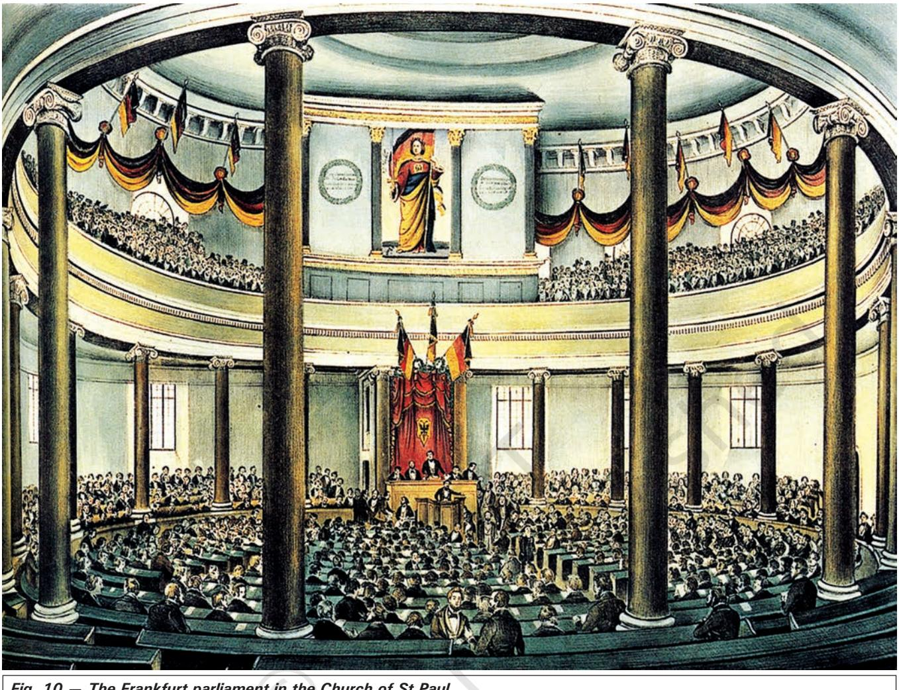

Fig. 10 — The Frankfurt parliament in the Church of St Paul. Contemporary colour print. Notice the women in the upper left gallery.

suffrage rights during the election of the Assembly. When the Frankfurt parliament convened in the Church of St Paul, women were admitted only as observers to stand in the visitors' gallery.

Though conservative forces were able to suppress liberal movements in 1848, they could not restore the old order. Monarchs were beginning to realise that the cycles of revolution and repression could only be ended by granting concessions to the liberal-nationalist revolutionaries. Hence, in the years after 1848, the autocratic monarchies of Central and Eastern Europe began to introduce the changes that had already taken place in Western Europe before 1815. Thus serfdom and bonded labour were abolished both in the Habsburg dominions and in Russia. The Habsburg rulers granted more autonomy to the Hungarians in 1867.

### Discuss

Compare the positions on the question of women's rights voiced by the three writers cited above. What do they reveal about liberal **ideology**?

### New words

Ideology – System of ideas reflecting a particular social and political vision

# **4 The Making of Germany and Italy**

### **4.1 Germany – Can the Army be the Architect of a Nation?**

After 1848, nationalism in Europe moved away from its association with democracy and revolution. Nationalist sentiments were often mobilised by conservatives for promoting state power and achieving political domination over Europe.

This can be observed in the process by which Germany and Italy came to be unified as nation-states.As you have seen, nationalist feelings were widespread among middle-class Germans, who in 1848 tried to unite the different regions of the German confederation into a nation-state governed by an elected parliament. This liberal initiative to nation-building was, however, repressed by the combined forces of the monarchy and the military, supported by the large landowners (called Junkers) of Prussia. From then on, Prussia took on the leadership of the movement for

national unification. Its chief minister, Otto von Bismarck, was the architect of this process carried out with the help of the Prussian army and bureaucracy. Three wars over seven years – with Austria, Denmark and France – ended in Prussian victory and completed the process of unification. In January 1871, the Prussian king, William I, was proclaimed German Emperor in a ceremony held at Versailles.

On the bitterly cold morning of 18 January 1871, an assembly comprising the princes of the German states, representatives of the army, important Prussian ministers including the chief minister Otto von Bismarck gathered in the unheated Hall of Mirrors in the Palace of Versailles to proclaim the new German Empire headed by Kaiser William I of Prussia.

The nation-building process in Germany had demonstrated the dominance of Prussian state power. The new state placed a strong emphasis on modernising the currency, banking, legal and judicial systems in Germany. Prussian measures and practices often became a model for the rest of Germany.

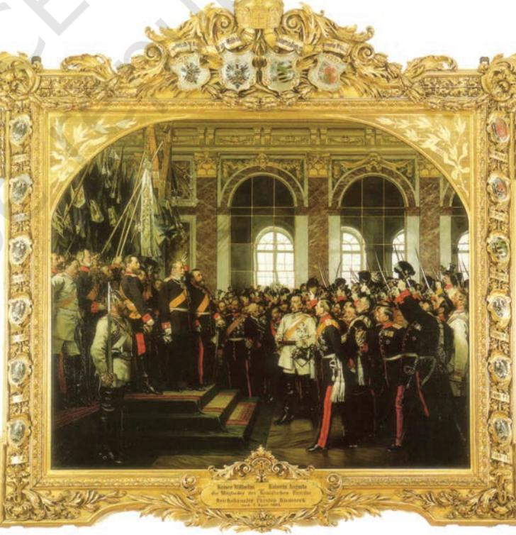

Fig. 11 — The proclamation of the German empire in the Hall of Mirrors at Versailles, Anton von Werner. At the centre stands the Kaiser and the chief commander of the Prussian army, General von Roon. Near them is Bismarck. This monumental work (2.7m x 2.7m) was completed and presented by the artist to Bismarck on the latter's 70th birthday in 1885.

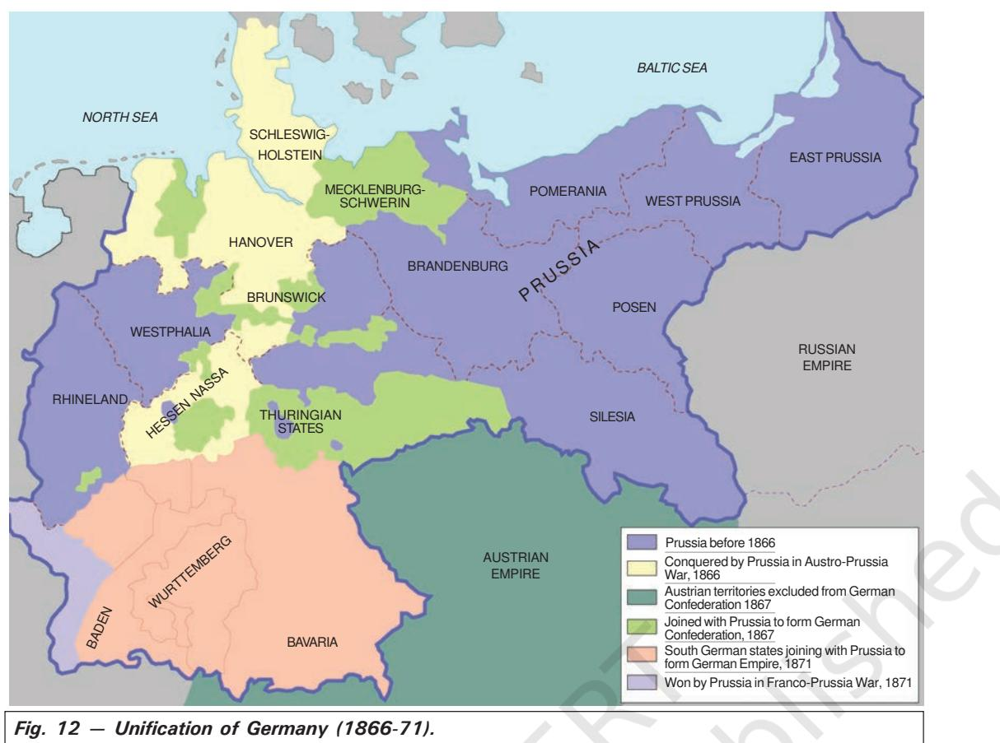

### **4.2 Italy Unified**

Like Germany, Italy too had a long history of political fragmentation. Italians were scattered over several dynastic states as well as the multi-national Habsburg Empire. During the middle of the nineteenth century, Italy was divided into seven states, of which only one, Sardinia-Piedmont, was ruled by an Italian princely house. The north was under Austrian Habsburgs, the centre was ruled by the Pope and the southern regions were under the domination of the Bourbon kings of Spain. Even the Italian language had not acquired one common form and still had many regional and local variations.

During the 1830s, Giuseppe Mazzini had sought to put together a coherent programme for a unitary Italian Republic. He had also formed a secret society called Young Italy for the dissemination of his goals. The failure of revolutionary uprisings both in 1831 and 1848 meant that the mantle now fell on Sardinia-Piedmont under its ruler King Victor Emmanuel II to unify the Italian states through war. In the eyes of the ruling elites of this region, a unified Italy offered them the possibility of economic development and political dominance.

Fig. 13 — Caricature of Otto von Bismarck in the German reichstag (parliament), from Figaro, Vienna, 5 March 1870.

# Activity

Describe the caricature. How does it represent the relationship between Bismarck and the elected deputies of Parliament? What interpretation of democratic processes is the artist trying to convey?

Chief Minister Cavour who led the movement to unify the regions of Italy was neither a revolutionary nor a democrat. Like many other wealthy and educated members of the Italian elite, he spoke French much better than he did Italian. Through a tactful diplomatic alliance with France engineered by Cavour, Sardinia-Piedmont succeeded in defeating the Austrian forces in 1859. Apart from regular troops, a large number of armed volunteers under the leadership of Giuseppe Garibaldi joined the fray. In 1860, they marched into South Italy and the Kingdom of the Two Sicilies and succeeded in winning the support of the local peasants in order to drive out the Spanish rulers. In 1861 Victor Emmanuel II was proclaimed king of united Italy. However, much of the Italian population, among whom rates of illiteracy were very high, remained blissfully unaware of liberalnationalist ideology. The peasant masses who had supported Garibaldi in southern Italy had never heard of Italia, and believed that 'La Talia' was Victor Emmanuel's wife!

# Activity

Look at Fig. 14(a). Do you think that the people living in any of these regions thought of themselves as Italians?

Examine Fig. 14(b). Which was the first region to become a part of unified Italy? Which was the last region to join? In which year did the largest number of states join?

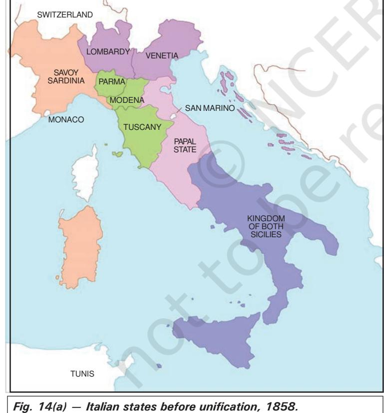

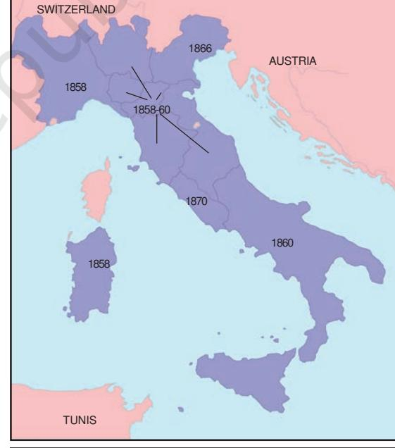

Fig. 14(b) — Italy after unification. The map shows the year in which different regions (seen in Fig 14(a) become part of a unified Italy.

### **4.3 The Strange Case of Britain**

The model of the nation or the nation-state, some scholars have argued, is Great Britain. In Britain the formation of the nation-state was not the result of a sudden upheaval or revolution. It was the result of a long-drawn-out process. There was no British nation prior to the eighteenth century. The primary identities of the people who inhabited the British Isles were ethnic ones – such as English, Welsh, Scot or Irish.All of these ethnic groups had their own cultural and political traditions. But as the English nation steadily grew in wealth, importance and power, it was able to extend its influence over the other nations of the islands. The English parliament, which had seized power from the monarchy in 1688 at the end of a protracted conflict, was the instrument through which a nation-state, with England at its centre, came to be forged. The Act of Union (1707) between England and Scotland that resulted in the formation of the 'United Kingdom of Great Britain' meant, in effect, that England was able to impose its influence on Scotland. The British parliament was henceforth dominated by its English members. The growth of a British identity meant that Scotland's distinctive culture and political institutions were systematically suppressed. The Catholic clans that inhabited the Scottish Highlands suffered terrible repression whenever they attempted to assert their independence. The Scottish Highlanders were forbidden to speak their Gaelic language or wear their national dress, and large numbers were forcibly driven out of their homeland.

Ireland suffered a similar fate. It was a country deeply divided between Catholics and Protestants. The English helped the Protestants of Ireland to establish their dominance over a largely Catholic country. Catholic revolts against British dominance were suppressed. After a failed revolt led by Wolfe Tone and his United Irishmen (1798), Ireland was forcibly incorporated into the United Kingdom in 1801. A new 'British nation' was forged through the propagation of a dominant English culture. The symbols of the new Britain – the British flag (Union Jack), the national anthem (God Save Our Noble King), the English language – were actively promoted and the older nations survived only as subordinate partners in this union.

### Activity

The artist has portrayed Garibaldi as holding on to the base of the boot, so that the King of Sardinia-Piedmont can enter it from the top. Look at the map of Italy once more. What statement is this caricature making?

### **Box 2**

Giuseppe Garibaldi (1807-82) is perhaps the most celebrated of Italian freedom fighters. He came from a family engaged in coastal trade and was a sailor in the merchant navy. In 1833 he met Mazzini, joined the Young Italy movement and participated in a republican uprising in Piedmont in 1834. The uprising was suppressed and Garibaldi had to flee to South America, where he lived in exile till 1848. In 1854, he supported Victor Emmanuel II in his efforts to unify the Italian states. In 1860, Garibaldi led the famous Expedition of the Thousand to South Italy. Fresh volunteers kept joining through the course of the campaign, till their numbers grew to about 30,000. They were popularly known as Red Shirts.

In 1867, Garibaldi led an army of volunteers to Rome to fight the last obstacle to the unification of Italy, the Papal States where a French garrison was stationed. The Red Shirts proved to be no match for the combined French and Papal troops. It was only in 1870 when, during the war with Prussia, France withdrew its troops from Rome that the Papal States were finally joined to Italy.

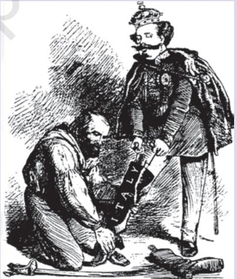

Fig. 15 – Garibaldi helping King Victor Emmanuel II of Sardinia-Piedmont to pull on the boot named 'Italy'. English caricature of 1859.

### New words

Ethnic – Relates to a common racial, tribal, or cultural origin or background that a community identifies with or claims

# **5 Visualising the Nation**

While it is easy enough to represent a ruler through a portrait or a statue, how does one go about giving a face to a nation? Artists in the eighteenth and nineteenth centuries found a way out by personifying a nation. In other words they represented a country as if it were a person. Nations were then portrayed as female figures. The female form that was chosen to personify the nation did not stand for any particular woman in real life; rather it sought to give the abstract idea of the nation a concrete form. That is, the female figure became an allegory of the nation.

You will recall that during the French Revolution artists used the female allegory to portray ideas such as Liberty, Justice and the Republic. These ideals were represented through specific objects or symbols. As you would remember, the attributes of Liberty are the red cap, or the broken chain, while Justice is generally a blindfolded woman carrying a pair of weighing scales.

Similar female allegories were invented by artists in the nineteenth century to represent the nation. In France she was christened Marianne, a popular Christian name, which underlined the idea of a people's nation. Her characteristics were drawn from those of Liberty and the Republic – the red cap, the tricolour, the cockade. Statues of Marianne were erected in public squares to remind the public of the national symbol of unity and to persuade them to identify with it. Marianne images were marked on coins and stamps.

Similarly, Germania became the allegory of the German nation. In visual representations, Germania wears a crown of oak leaves, as the German oak stands for heroism.

#### New words

Allegory – When an abstract idea (for instance, greed, envy, freedom, liberty) is expressed through a person or a thing. An allegorical story has two meanings, one literal and one symbolic

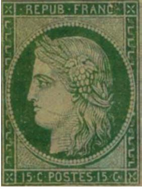

Fig. 16 — Postage stamps of 1850 with the figure of Marianne representing the Republic of France.

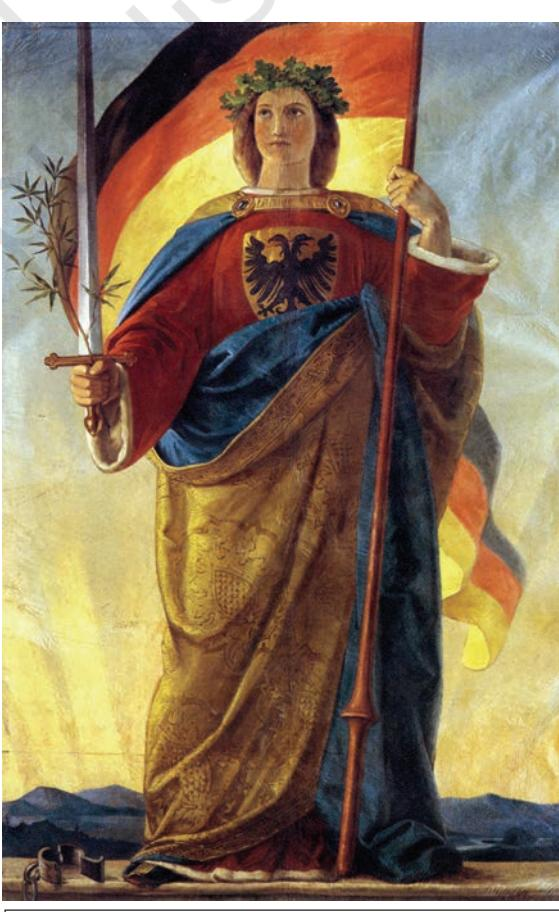

Fig. 17 — Germania, Philip Veit, 1848. The artist prepared this painting of Germania on a cotton banner, as it was meant to hang from the ceiling of the Church of St Paul where the Frankfurt parliament was convened in March 1848.

### Meanings of the symbols

**Box 3**

| Attribute | Significance |
| --- | --- |
| Broken chains | Being freed |
| Breastplate with eagle | Symbol of the German empire – strength |
| Crown of oak leaves | Heroism |
| Sword | Readiness to fight |
| Olive branch around the sword | Willingness to make peace |
| Black, red and gold tricolour | Flag of the liberal-nationalists in 1848, banned by the Dukes of the |
|  | German states |
| Rays of the rising sun | Beginning of a new era |

# Activity

With the help of the chart in Box 3, identify the attributes of Veit's Germania and interpret the symbolic meaning of the painting. In an earlier allegorical rendering of 1836, Veit had portrayed the Kaiser's crown at the place where he has now located the broken chain. Explain the significance of this change.

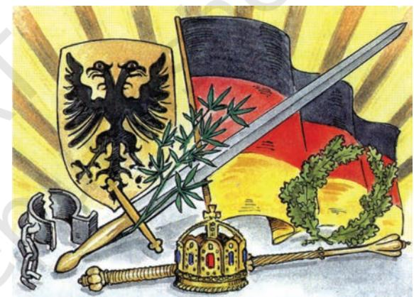

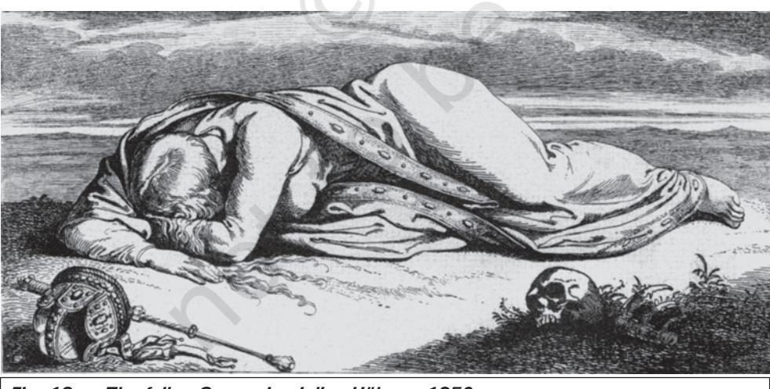

### Activity

Describe what you see in Fig. 17. What historical events could Hübner be referring to in this allegorical vision of the nation?

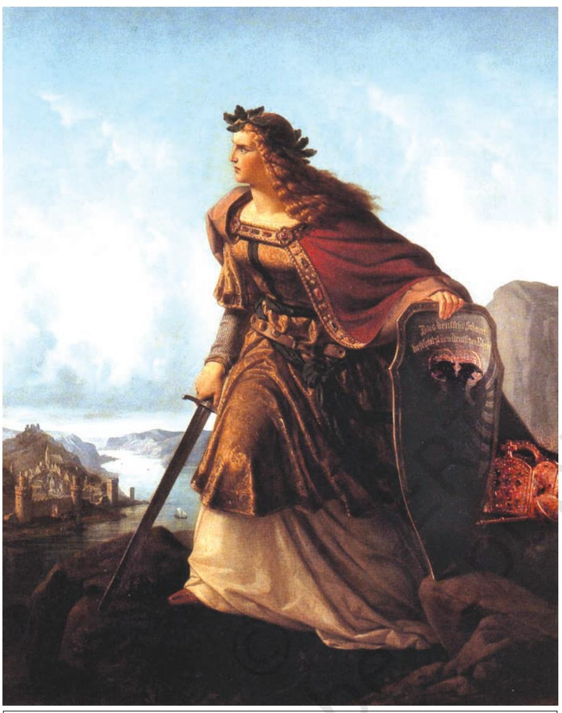

Fig. 19 — Germania guarding the Rhine. In 1860, the artist Lorenz Clasen was commissioned to paint this image. The inscription on Germania's sword reads: 'The German sword protects the German Rhine.'

# Activity

Look once more at Fig. 10. Imagine you were a citizen of Frankfurt in March 1848 and were present during the proceedings of the parliament. How would you (a) as a man seated in the hall of deputies, and (b) as a woman observing from the galleries, relate to the banner of Germania hanging from the ceiling?

### **6 Nationalism and Imperialism**

By the last quarter of the nineteenth century nationalism no longer retained its idealistic liberal-democratic sentiment of the first half of the century, but became a narrow creed with limited ends. During this period nationalist groups became increasingly intolerant of each other and ever ready to go to war. The major European powers, in turn, manipulated the nationalist aspirations of the subject peoples in Europe to further their own imperialist aims.

The most serious source of nationalist tension in Europe after 1871 was the area called the Balkans. The Balkans was a region of geographical and ethnic variation comprising modern-day Romania, Bulgaria, Albania, Greece, Macedonia, Croatia, Bosnia-Herzegovina, Slovenia, Serbia and Montenegro whose inhabitants were broadly known as the Slavs. A large part of the Balkans was under the control of the Ottoman Empire. The spread of the ideas of romantic nationalism in the Balkans together with the disintegration of the Ottoman Empire made this region very explosive. All through the nineteenth century the Ottoman Empire had sought to strengthen itself through modernisation and internal reforms but with very little success. One by one, its European subject nationalities broke away from its control and declared independence. The Balkan peoples based their claims for independence or political rights on nationality and used history to prove that they had once been independent but had subsequently been subjugated by foreign powers. Hence the rebellious nationalities in the Balkans thought of their struggles as attempts to win back their long-lost independence.

As the different Slavic nationalities struggled to define their identity and independence, the Balkan area became an area of intense conflict. The Balkan states were fiercely jealous of each other and each hoped to gain more territory at the expense of the others. Matters were further complicated because the Balkans also became the scene of big power rivalry. During this period, there was intense rivalry among the European powers over trade and colonies as well as naval and military might. These rivalries were very evident in the way the Balkan problem unfolded. Each power – Russia, Germany, England, Austro-Hungary – was keen on countering the hold of other powers over the Balkans, and extending its own control over the area. This led to a series of wars in the region and finally the First World War.

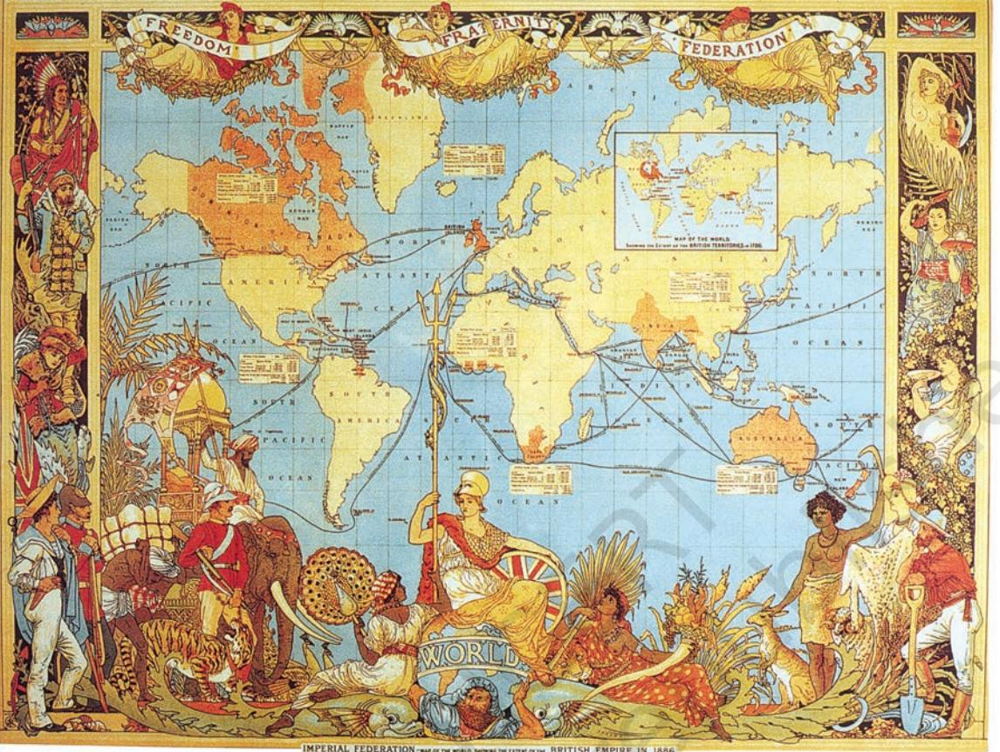

Fig. 20 — A map celebrating the British Empire. At the top, angels are shown carrying the banner of freedom. In the foreground, Britannia — the symbol of the British nation — is triumphantly sitting over the globe. The colonies are represented through images of tigers, elephants, forests and primitive people. The domination of the world is shown as the basis of Britain's national pride.

Nationalism, aligned with imperialism, led Europe to disaster in 1914. But meanwhile, many countries in the world which had been colonised by the European powers in the nineteenth century began to oppose imperial domination. The anti-imperial movements that developed everywhere were nationalist, in the sense that they all struggled to form independent nation-states, and were inspired by a sense of collective national unity, forged in confrontation with imperialism. European ideas of nationalism were nowhere replicated, for people everywhere developed their own specific variety of nationalism. But the idea that societies should be organised into 'nation-states' came to be accepted as natural and universal.

# Write in brief

- 1. Write a note on:
	- a) Guiseppe Mazzini
	- b) Count Camillo de Cavour
	- c) The Greek war of independence
	- d) Frankfurt parliament
	- e) The role of women in nationalist struggles
- 2. What steps did the French revolutionaries take to create a sense of collective identity among the French people?
- 3. Who were Marianne and Germania? What was the importance of the way in which they were portrayed?
- 4. Briefly trace the process of German unification.
- 5. What changes did Napoleon introduce to make the administrative system more efficient in the territories ruled by him?

# Discuss

- 1. Explain what is meant by the 1848 revolution of the liberals. What were the political, social and economic ideas supported by the liberals?
- 2. Choose three examples to show the contribution of culture to the growth of nationalism in Europe.
- 3. Through a focus on any two countries, explain how nations developed over the nineteenth century.
- 4. How was the history of nationalism in Britain unlike the rest of Europe?
- 5. Why did nationalist tensions emerge in the Balkans?

## Project

### Project

Discuss

Write in brief

Find out more about nationalist symbols in countries outside Europe. For one or two countries, collect examples of pictures, posters or music that are symbols of nationalism. How are these different from European examples?

