# **Nationalism in India**

As you have seen, modern nationalism in Europe came to be associated with the formation of nation-states. It also meant a change in people's understanding of who they were, and what defined their identity and sense of belonging. New symbols and icons, new songs and ideas forged new links and redefined the boundaries of communities. In most countries the making of this new national identity was a long process. How did this consciousness emerge in India?

In India and as in many other colonies, the growth of modern nationalism is intimately connected to the anti-colonial movement. People began discovering their unity in the process of their struggle with colonialism. The sense of being oppressed under colonialism provided a shared bond that tied many different groups together. But each class and group felt the effects of colonialism differently, their experiences were varied, and their notions of freedom were not always the same. The Congress under Mahatma Gandhi tried to forge these groups together within one movement. But the unity did not emerge without conflict.

In an earlier textbook you have read about the growth of nationalism in India up to the first decade of the twentieth century. In this chapter we will pick up the story from the 1920s and study the Non-Cooperation and Civil Disobedience Movements. We will explore how the Congress sought to develop the national movement, how different social groups participated in the movement, and how nationalism captured the imagination of people.

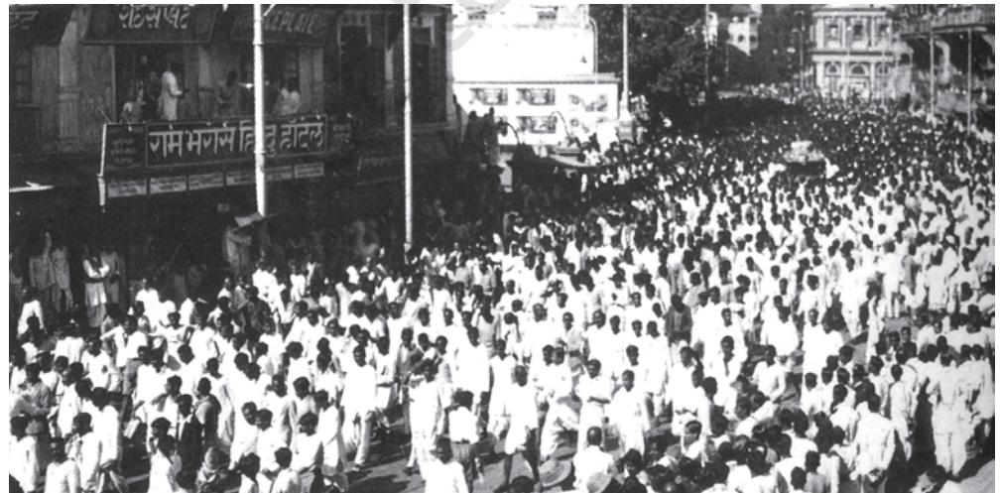

Fig. 1 – 6 April 1919. Mass processions on the streets became a common feature during the national movement.

29

### **1 The First World War, Khilafat and Non-Cooperation**

In the years after 1919, we see the national movement spreading to new areas, incorporating new social groups, and developing new modes of struggle. How do we understand these developments? What implications did they have?

First of all, the war created a new economic and political situation. It led to a huge increase in defence expenditure which was financed by war loans and increasing taxes: customs duties were raised and income tax introduced. Through the war years prices increased – doubling between 1913 and 1918 – leading to extreme hardship for the common people. Villages were called upon to supply soldiers, and the forced recruitment in rural areas caused widespread anger. Then in 1918-19 and 1920-21, crops failed in many parts of India, resulting in acute shortages of food. This was accompanied by an influenza epidemic. According to the census of 1921, 12 to 13 million people perished as a result of famines and the epidemic.

People hoped that their hardships would end after the war was over. But that did not happen.

At this stage a new leader appeared and suggested a new mode of struggle.

### **1.1 The Idea of Satyagraha**

Mahatma Gandhi returned to India in January 1915. As you know, he had come from South Africa where he had successfully fought

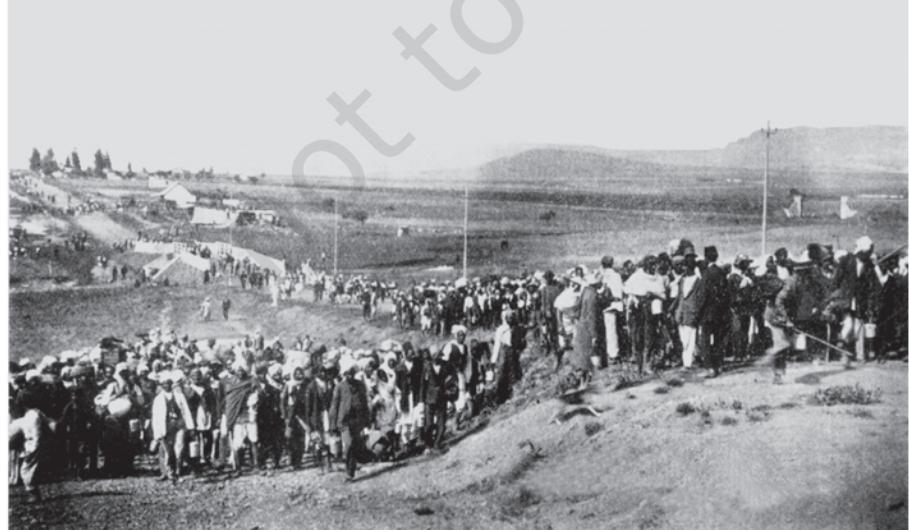

#### New words

Forced recruitment – A process by which the colonial state forced people to join the army

> Fig. 2 – Indian workers in South Africa march through Volksrust, 6 November 1913. Mahatma Gandhi was leading the workers from Newcastle to Transvaal. When the marchers were stopped and Gandhiji arrested, thousands of more workers joined the satyagraha against racist laws that denied rights to non-whites.

the racist regime with a novel method of mass agitation, which he called satyagraha. The idea of satyagraha emphasised the power of truth and the need to search for truth. It suggested that if the cause was true, if the struggle was against injustice, then physical force was not necessary to fight the oppressor. Without seeking vengeance or being aggressive, a satyagrahi could win the battle through nonviolence. This could be done by appealing to the conscience of the oppressor. People – including the oppressors – had to be persuaded to see the truth, instead of being forced to accept truth through the use of violence. By this struggle, truth was bound to ultimately triumph. Mahatma Gandhi believed that this dharma of non-violence could unite all Indians.

After arriving in India, Mahatma Gandhi successfully organised satyagraha movements in various places. In 1917 he travelled to Champaran in Bihar to inspire the peasants to struggle against the oppressive plantation system.Then in 1917, he organised a satyagraha to support the peasants of the Kheda district of Gujarat. Affected by crop failure and a plague epidemic, the peasants of Kheda could not pay the revenue, and were demanding that revenue collection be relaxed. In 1918, Mahatma Gandhi went to Ahmedabad to organise a satyagraha movement amongst cotton mill workers.

#### **1.2 The Rowlatt Act**

Emboldened with this success, Gandhiji in 1919 decided to launch a nationwide satyagraha against the proposed Rowlatt Act (1919). This Act had been hurriedly passed through the Imperial Legislative Council despite the united opposition of the Indian members. It gave the government enormous powers to repress political activities, and allowed detention of political prisoners without trial for two years. Mahatma Gandhi wanted non-violent civil disobedience against such unjust laws, which would start with a hartal on 6 April.

Rallies were organised in various cities, workers went on strike in railway workshops, and shops closed down.Alarmed by the popular upsurge, and scared that lines of communication such as the railways and telegraph would be disrupted, the British administration decided to clamp down on nationalists. Local leaders were picked up from Amritsar, and Mahatma Gandhi was barred from entering Delhi. On 10 April, the police in Amritsar fired upon a peaceful procession, provoking widespread attacks on banks, post offices and railway stations. Martial law was imposed and General Dyer took command.

#### **Source A**

#### Mahatma Gandhi on Satyagraha

'It is said of "passive resistance" that it is the weapon of the weak, but the power which is the subject of this article can be used only by the strong. This power is not passive resistance; indeed it calls for intense activity. The movement in South Africa was not passive but active …

' Satyagraha is not physical force. A satyagrahi does not inflict pain on the adversary; he does not seek his destruction … In the use of satyagraha, there is no ill-will whatever.

' Satyagraha is pure soul-force. Truth is the very substance of the soul. That is why this force is called satyagraha. The soul is informed with knowledge. In it burns the flame of love. … Nonviolence is the supreme dharma…

'It is certain that India cannot rival Britain or Europe in force of arms. The British worship the war-god and they can all of them become, as they are becoming, bearers of arms. The hundreds of millions in India can never carry arms. They have made the religion of non-violence their own ...'

**Source**

### Activity

Read the text carefully. What did Mahatma Gandhi mean when he said satyagraha is active resistance?

2024-25

On 13 April the infamous Jallianwalla Bagh incident took place. On that day a large crowd gathered in the enclosed ground of Jallianwalla Bagh. Some came to protest against the government's new repressive measures. Others had come to attend the annual Baisakhi fair. Being from outside the city, many villagers were unaware of the martial law that had been imposed. Dyer entered the area, blocked the exit points, and opened fire on the crowd, killing hundreds. His object, as he declared later, was to 'produce a moral effect', to create in the minds of satyagrahis a feeling of terror and awe.

As the news of Jallianwalla Bagh spread, crowds took to the streets in many north Indian towns. There were strikes, clashes with the police and attacks on government buildings. The government responded with brutal repression, seeking to humiliate and terrorise people: satyagrahis were forced to rub their noses on the ground, crawl on the streets, and do salaam (salute) to all sahibs; people were flogged and villages (around Gujranwala in Punjab, now in Pakistan) were bombed. Seeing violence spread, Mahatma Gandhi called off the movement.

While the Rowlatt satyagraha had been a widespread movement, it was still limited mostly to cities and towns. Mahatma Gandhi now felt the need to launch a more broad-based movement in India. But he was certain that no such movement could be organised without bringing the Hindus and Muslims closer together. One way of doing this, he felt, was to take up the Khilafat issue. The First World War had ended with the defeat of Ottoman Turkey. And there were rumours that a harsh peace treaty was going to be imposed on the Ottoman emperor – the spiritual head of the Islamic world (the Khalifa). To defend the Khalifa's temporal powers, a Khilafat Committee was formed in Bombay in March 1919. A young generation of Muslim leaders like the brothers Muhammad Ali and Shaukat Ali, began discussing with Mahatma Gandhi about the possibility of a united mass action on the issue. Gandhiji saw this as an opportunity to bring Muslims under the umbrella of a unified national movement. At the Calcutta session of the Congress in September 1920, he convinced other leaders of the need to start a non-cooperation movement in support of Khilafat as well as for swaraj.

#### **1.3 Why Non-cooperation?**

In his famous book Hind Swaraj (1909) Mahatma Gandhi declared that British rule was established in India with the cooperation of

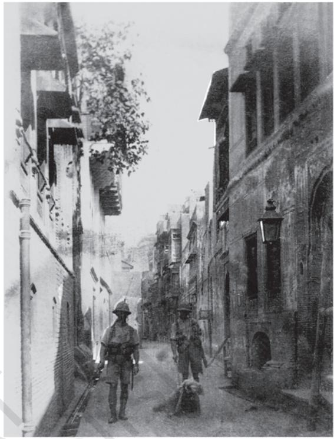

Fig. 3 – General Dyer's 'crawling orders' being administered by British soldiers, Amritsar, Punjab, 1919.

Indians, and had survived only because of this cooperation. If Indians refused to cooperate, British rule in India would collapse within a year, and swaraj would come.

How could non-cooperation become a movement? Gandhiji proposed that the movement should unfold in stages. It should begin with the surrender of titles that the government awarded, and a boycott of civil services, army, police, courts and legislative councils, schools, and foreign goods. Then, in case the government used repression, a full civil disobedience campaign would be launched. Through the summer of 1920 Mahatma Gandhi and Shaukat Ali toured extensively, mobilising popular support for the movement.

Many within the Congress were, however, concerned about the proposals. They were reluctant to boycott the council elections scheduled for November 1920, and they feared that the movement might lead to popular violence. In the months between September and December there was an intense tussle within the Congress. For a while there seemed no meeting point between the supporters and the opponents of the movement. Finally, at the Congress session at Nagpur in December 1920, a compromise was worked out and the Non-Cooperation programme was adopted.

How did the movement unfold? Who participated in it? How did different social groups conceive of the idea of Non-Cooperation?

#### New words

Boycott – The refusal to deal and associate with people, or participate in activities, or buy and use things; usually a form of protest

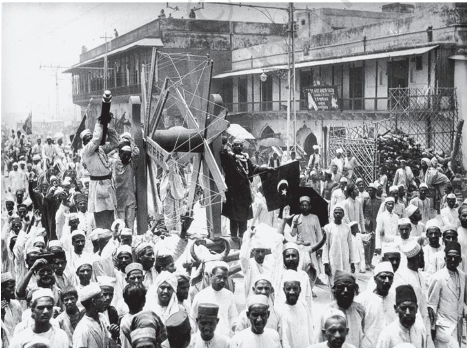

Fig. 4 – The boycott of foreign cloth, July 1922. Foreign cloth was seen as the symbol of Western economic and cultural domination.

### **2 Differing Strands within the Movement**

The Non-Cooperation-Khilafat Movement began in January 1921. Various social groups participated in this movement, each with its own specific aspiration. All of them responded to the call of Swaraj, but the term meant different things to different people.

#### **2.1 The Movement in the Towns**

The movement started with middle-class participation in the cities. Thousands of students left government-controlled schools and colleges, headmasters and teachers resigned, and lawyers gave up their legal practices. The council elections were boycotted in most provinces except Madras, where the Justice Party, the party of the non-Brahmans, felt that entering the council was one way of gaining some power – something that usually only Brahmans had access to.

The effects of non-cooperation on the economic front were more dramatic. Foreign goods were boycotted, liquor shops picketed, and foreign cloth burnt in huge bonfires. The import of foreign cloth halved between 1921 and 1922, its value dropping from Rs 102 crore to Rs 57 crore. In many places merchants and traders refused to trade in foreign goods or finance foreign trade. As the boycott movement spread, and people began discarding imported clothes and wearing only Indian ones, production of Indian textile mills and handlooms went up.

But this movement in the cities gradually slowed down for a variety of reasons. Khadi cloth was often more expensive than massproduced mill cloth and poor people could not afford to buy it. How then could they boycott mill cloth for too long? Similarly the boycott of British institutions posed a problem. For the movement to be successful, alternative Indian institutions had to be set up so that they could be used in place of the British ones. These were slow to come up. So students and teachers began trickling back to government schools and lawyers joined back work in government courts.

#### **2.2 Rebellion in the Countryside**

From the cities, the Non-Cooperation Movement spread to the countryside. It drew into its fold the struggles of peasants and tribals

#### New words

Picket – A form of demonstration or protest by which people block the entrance to a shop, factory or office

### Activity

The year is 1921. You are a student in a government-controlled school. Design a poster urging school students to answer Gandhiji's call to join the Non-Cooperation Movement.

which were developing in different parts of India in the years after the war.

In Awadh, peasants were led by Baba Ramchandra – a sanyasi who had earlier been to Fiji as an indentured labourer. The movement here was against talukdars and landlords who demanded from peasants exorbitantly high rents and a variety of other cesses. Peasants had to do begar and work at landlords' farms without any payment. As tenants they had no security of tenure, being regularly evicted so that they could acquire no right over the leased land. The peasant movement demanded reduction of revenue, abolition of begar, and social boycott of oppressive landlords. In many places nai – dhobi bandhs were organised by panchayats to deprive landlords of the services of even barbers and washermen. In June 1920, Jawaharlal Nehru began going around the villages in Awadh, talking to the villagers, and trying to understand their grievances. By October, the Oudh Kisan Sabha was set up headed by Jawaharlal Nehru, Baba Ramchandra and a few others. Within a month, over 300 branches had been set up in the villages around the region. So when the Non-Cooperation Movement began the following year, the effort of the Congress was to integrate the Awadh peasant struggle into the wider struggle. The peasant movement, however, developed in forms that the Congress leadership was unhappy with. As the movement spread in 1921, the houses of talukdars and merchants were attacked, bazaars were looted, and grain hoards were taken over. In many places local leaders told peasants that Gandhiji had declared that no taxes were to be paid and land was to be redistributed among the poor. The name of the Mahatma was being invoked to sanction all action and aspirations.

#### New words

Begar – Labour that villagers were forced to contribute without any payment

### Activity

If you were a peasant in Uttar Pradesh in 1920, how would you have responded to Gandhiji's call for Swaraj? Give reasons for your response.

In 1928, Vallabhbhai Patel led the peasant movement in Bardoli, a taluka in Gujarat, against enhancement of land revenue. Known as the Bardoli Satyagraha, this movement was a success under the able leadership of Vallabhbhai Patel. The struggle was widely publicised and generated immense sympathy in many parts of India.

#### **Source B**

On 6 January 1921, the police in United Provinces fired at peasants near Rae Bareli. Jawaharlal Nehru wanted to go to the place of firing, but was stopped by the police. Agitated and angry, Nehru addressed the peasants who gathered around him. This is how he later described the meeting:

'They behaved as brave men, calm and unruffled in the face of danger. I do not know how they felt but I know what my feelings were. For a moment my blood was up, non-violence was almost forgotten – but for a moment only. The thought of the great leader, who by God's goodness has been sent to lead us to victory, came to me, and I saw the kisans seated and standing near me, less excited, more peaceful than I was – and the moment of weakness passed, I spoke to them in all humility on non-violence – I needed the lesson more than they – and they heeded me and peacefully dispersed.'

Quoted in Sarvapalli Gopal, Jawaharlal Nehru: A Biography

, Vol. I. **Source**

Tribal peasants interpreted the message of Mahatma Gandhi and the idea of swaraj in yet another way. In the Gudem Hills of Andhra Pradesh, for instance, a militant guerrilla movement spread in the early 1920s – not a form of struggle that the Congress could approve. Here, as in other forest regions, the colonial government had closed large forest areas, preventing people from entering the forests to graze their cattle, or to collect fuelwood and fruits. This enraged the hill people. Not only were their livelihoods affected but they felt that their traditional rights were being denied. When the government began forcing them to contribute begar for road building, the hill people revolted. The person who came to lead them was an interesting figure. Alluri Sitaram Raju claimed that he had a variety of special powers: he could make correct astrological predictions and heal people, and he could survive even bullet shots. Captivated by Raju, the rebels proclaimed that he was an incarnation of God. Raju talked of the greatness of Mahatma Gandhi, said he was inspired by the Non-Cooperation Movement, and persuaded people to wear khadi and give up drinking. But at the same time he asserted that India could be liberated only by the use of force, not non-violence. The Gudem rebels attacked police stations, attempted to kill British officials and carried on guerrilla warfare for achieving swaraj. Raju was captured and executed in 1924, and over time became a folk hero.

## Activity

Find out about other participants in the National Movement who were captured and put to death by the British. Can you think of a similar example from the national movement in Indo-China (Chapter 2)?

Workers too had their own understanding of Mahatma Gandhi and the notion of swaraj. For plantation workers in Assam, freedom meant the right to move freely in and out of the confined space in which they were enclosed, and it meant retaining a link with the village from which they had come. Under the Inland Emigration Act of 1859, plantation workers were not permitted to leave the tea gardens without permission, and in fact they were rarely given such permission. When they heard of the Non-Cooperation Movement, thousands of workers defied the authorities, left the plantations and headed home. They believed that Gandhi Raj was coming and everyone would be given land in their own villages. They, however, never reached their destination. Stranded on the way by a railway and steamer strike, they were caught by the police and brutally beaten up.

**2.3 Swaraj in the Plantations**

The visions of these movements were not defined by the Congress programme. They interpreted the term swaraj in their own ways, imagining it to be a time when all suffering and all troubles would be over. Yet, when the tribals chanted Gandhiji's name and raised slogans demanding 'Swatantra Bharat', they were also emotionally relating to an all-India agitation. When they acted in the name of Mahatma Gandhi, or linked their movement to that of the Congress, they were identifying with a movement which went beyond the limits of their immediate locality.

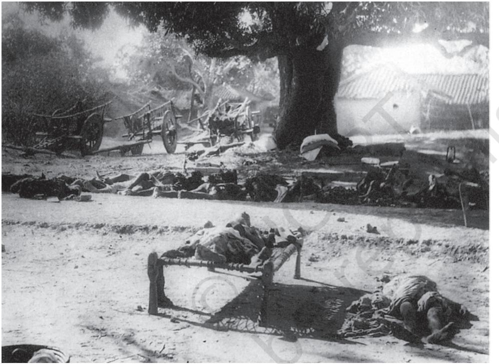

#### Fig. 5 – Chauri Chaura, 1922. At Chauri Chaura in Gorakhpur, a peaceful demonstration in a bazaar turned into a violent clash with the police. Hearing of the incident, Mahatma Gandhi called a halt to the Non-Cooperation Movement.

### **3 Towards Civil Disobedience**

In February 1922, Mahatma Gandhi decided to withdraw the Non-Cooperation Movement. He felt the movement was turning violent in many places and satyagrahis needed to be properly trained before they would be ready for mass struggles. Within the Congress, some leaders were by now tired of mass struggles and wanted to participate in elections to the provincial councils that had been set up by the Government of India Act of 1919. They felt that it was important to oppose British policies within the councils, argue for reform and also demonstrate that these councils were not truly democratic. C. R. Das and Motilal Nehru formed the Swaraj Party within the Congress to argue for a return to council politics. But younger leaders like Jawaharlal Nehru and Subhas Chandra Bose pressed for more radical mass agitation and for full independence.

In such a situation of internal debate and dissension two factors again shaped Indian politics towards the late 1920s. The first was the effect of the worldwide economic depression. Agricultural prices began to fall from 1926 and collapsed after 1930. As the demand for agricultural goods fell and exports declined, peasants found it difficult to sell their harvests and pay their revenue. By 1930, the countryside was in turmoil.

Against this background the new Tory government in Britain constituted a Statutory Commission under Sir John Simon. Set up

in response to the nationalist movement, the commission was to look into the functioning of the constitutional system in India and suggest changes. The problem was that the commission did not have a single Indian member. They were all British.

When the Simon Commission arrived in India in 1928, it was greeted with the slogan 'Go back Simon'. All parties, including the Congress and the Muslim League, participated in the demonstrations. In an effort to win them over, the viceroy, Lord Irwin, announced in October 1929, a vague offer of 'dominion status' for India in an unspecified future, and a Round Table Conference to discuss a future constitution. This did not satisfy the Congress leaders. The radicals within the Congress, led by Lala Lajpat Rai was assaulted by the British police during a peaceful demonstration against the Simon Commission. He succumbed to injuries that were inflicted on him during the demonstration.

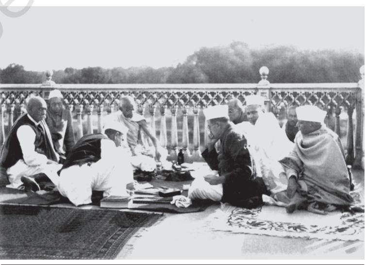

Fig. 6 – Meeting of Congress leaders at Allahabad, 1931. Apart from Mahatma Gandhi, you can see Sardar Vallabhbhai Patel (extreme left), Jawaharlal Nehru (extreme right) and Subhas Chandra Bose (fifth from right).

38

Jawaharlal Nehru and Subhas Chandra Bose, became more assertive. The liberals and moderates, who were proposing a constitutional system within the framework of British dominion, gradually lost their influence. In December 1929, under the presidency of Jawaharlal Nehru, the Lahore Congress formalised the demand of 'Purna Swaraj' or full independence for India. It was declared that 26 January 1930, would be celebrated as the Independence Day when people were to take a pledge to struggle for complete independence. But the celebrations attracted very little attention. So Mahatma Gandhi had to find a way to relate this abstract idea of freedom to more concrete issues of everyday life.

#### **3.1 The Salt March and the Civil Disobedience Movement**

Mahatma Gandhi found in salt a powerful symbol that could unite the nation. On 31 January 1930, he sent a letter to Viceroy Irwin stating eleven demands. Some of these were of general interest; others were specific demands of different classes, from industrialists to peasants. The idea was to make the demands wide-ranging, so that all classes within Indian society could identify with them and everyone could be brought together in a united campaign. The most stirring of all was the demand to abolish the salt tax. Salt was something consumed by the rich and the poor alike, and it was one of the most essential items of food. The tax on salt and the government monopoly over its production, Mahatma Gandhi declared, revealed the most oppressive face of British rule.

Mahatma Gandhi's letter was, in a way, an ultimatum. If the demands were not fulfilled by 11 March, the letter stated, the Congress would launch a civil disobedience campaign. Irwin was unwilling to negotiate. So Mahatma Gandhi started his famous salt march accompanied by 78 of his trusted volunteers. The march was over 240 miles, from Gandhiji's ashram in Sabarmati to the Gujarati coastal town of Dandi. The volunteers walked for 24 days, about 10 miles a day. Thousands came to hear Mahatma Gandhi wherever he stopped, and he told them what he meant by swaraj and urged them to peacefully defy the British. On 6 April he reached Dandi, and ceremonially violated the law, manufacturing salt by boiling sea water.

This marked the beginning of the Civil Disobedience Movement. How was this movement different from the Non-Cooperation Movement? People were now asked not only to refuse cooperation

#### **Source C**

#### The Independence Day Pledge, 26 January 1930

'We believe that it is the inalienable right of the Indian people, as of any other people, to have freedom and to enjoy the fruits of their toil and have the necessities of life, so that they may have full opportunities of growth. We believe also that if any government deprives a people of these rights and oppresses them, the people have a further right to alter it or to abolish it. The British Government in India has not only deprived the Indian people of their freedom but has based itself on the exploitation of the masses, and has ruined India economically, politically, culturally, and spiritually. We believe, therefore, that India must sever the British connection and attain Purna Swaraj or Complete Independence.'

**Source**

Fig. 7 – The Dandi march. During the salt march Mahatma Gandhi was accompanied by 78 volunteers. On the way they were joined by thousands.

with the British, as they had done in 1921-22, but also to break colonial laws. Thousands in different parts of the country broke the salt law, manufactured salt and demonstrated in front of government salt factories. As the movement spread, foreign cloth was boycotted, and liquor shops were picketed. Peasants refused to pay revenue and chaukidari taxes, village officials resigned, and in many places forest people violated forest laws – going into Reserved Forests to collect wood and graze cattle.

Worried by the developments, the colonial government began arresting the Congress leaders one by one. This led to violent clashes in many palaces. When Abdul Ghaffar Khan, a devout disciple of Mahatma Gandhi, was arrested in April 1930, angry crowds demonstrated in the streets of Peshawar, facing armoured cars and police firing. Many were killed. A month later, when Mahatma Gandhi himself was arrested, industrial workers in Sholapur attacked police posts, municipal buildings, lawcourts and railway stations – all structures that symbolised British rule. A frightened government responded with a policy of brutal repression. Peaceful satyagrahis were attacked, women and children were beaten, and about 100,000 people were arrested.

In such a situation, Mahatma Gandhi once again decided to call off the movement and entered into a pact with Irwin on 5 March 1931. By this Gandhi-Irwin Pact, Gandhiji consented to participate in a Round Table Conference (the Congress had boycotted the first

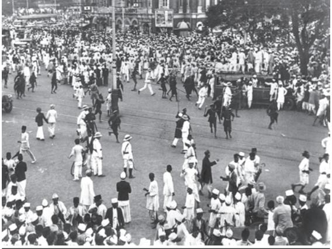

Fig. 8 – Police cracked down on satyagrahis, 1930.

Round Table Conference) in London and the government agreed to release the political prisoners. In December 1931, Gandhiji went to London for the conference, but the negotiations broke down and he returned disappointed. Back in India, he discovered that the government had begun a new cycle of repression. Ghaffar Khan and Jawaharlal Nehru were both in jail, the Congress had been declared illegal, and a series of measures had been imposed to prevent meetings, demonstrations and boycotts. With great apprehension, Mahatma Gandhi relaunched the Civil Disobedience Movement. For over a year, the movement continued, but by 1934 it lost its momentum.

#### **3.2 How Participants saw the Movement**

Let us now look at the different social groups that participated in the Civil Disobedience Movement. Why did they join the movement? What were their ideals? What did swaraj mean to them?

In the countryside, rich peasant communities – like the Patidars of Gujarat and the Jats of Uttar Pradesh – were active in the movement. Being producers of commercial crops, they were very hard hit by the trade depression and falling prices. As their cash income disappeared, they found it impossible to pay the government's revenue demand. And the refusal of the government to reduce the revenue demand led to widespread resentment. These rich peasants became enthusiastic supporters of the Civil Disobedience Movement, organising their communities, and at times forcing reluctant members, to participate in the boycott programmes. For them the fight for swaraj was a struggle against high revenues. But they were deeply disappointed when the movement was called off in 1931 without the revenue rates being revised. So when the movement was restarted in 1932, many of them refused to participate.

The poorer peasantry were not just interested in the lowering of the revenue demand. Many of them were small tenants cultivating land they had rented from landlords. As the Depression continued and cash incomes dwindled, the small tenants found it difficult to pay their rent. They wanted the unpaid rent to the landlord to be remitted. They joined a variety of radical movements, often led by Socialists and Communists. Apprehensive of raising issues that might upset the rich peasants and landlords, the Congress was unwilling to support 'no rent' campaigns in most places. So the relationship between the poor peasants and the Congress remained uncertain.

#### **Box 1**

#### 'To the altar of this revolution we have brought our youth as incense'

Many nationalists thought that the struggle against the British could not be won through non-violence. In 1928, the Hindustan Socialist Republican Army (HSRA) was founded at a meeting in Ferozeshah Kotla ground in Delhi. Amongst its leaders were Bhagat Singh, Jatin Das and Ajoy Ghosh. In a series of dramatic actions in different parts of India, the HSRA targeted some of the symbols of British power. In April 1929, Bhagat Singh and Batukeswar Dutta threw a bomb in the Legislative Assembly. In the same year there was an attempt to blow up the train that Lord Irwin was travelling in. Bhagat Singh was 23 when he was tried and executed by the colonial government. During his trial, Bhagat Singh stated that he did not wish to glorify 'the cult of the bomb and pistol' but wanted a revolution in society:

'Revolution is the inalienable right of mankind. Freedom is the imprescriptible birthright of all. The labourer is the real sustainer of society … To the altar of this revolution we have brought our youth as incense, for no sacrifice is too great for so magnificent a cause. We are content. We await the advent of revolution. Inquilab Zindabad!'

What about the business classes? How did they relate to the Civil Disobedience Movement? During the First World War, Indian merchants and industrialists had made huge profits and become powerful (see Chapter 5). Keen on expanding their business, they now reacted against colonial policies that restricted business activities. They wanted protection against imports of foreign goods, and a rupee-sterling foreign exchange ratio that would discourage imports. To organise business interests, they formed the Indian Industrial and Commercial Congress in 1920 and the Federation of the Indian Chamber of Commerce and Industries (FICCI) in 1927. Led by prominent industrialists like Purshottamdas Thakurdas and G. D. Birla, the industrialists attacked colonial control over the Indian economy, and supported the Civil Disobedience Movement when it was first launched. They gave financial assistance and refused to buy or sell imported goods. Most businessmen came to see swaraj as a time when colonial restrictions on business would no longer exist and trade and industry would flourish without constraints. But after the failure of the Round Table Conference, business groups were no longer uniformly enthusiastic. They were apprehensive of the spread of militant activities, and worried about prolonged disruption of business, as well as of the growing influence of socialism amongst the younger members of the Congress.

The industrial working classes did not participate in the Civil Disobedience Movement in large numbers, except in the Nagpur region. As the industrialists came closer to the Congress, workers stayed aloof. But in spite of that, some workers did participate in the Civil Disobedience Movement, selectively adopting some of the ideas of the Gandhian programme, like boycott of foreign goods, as part of their own movements against low wages and poor working conditions. There were strikes by railway workers in 1930 and dockworkers in 1932. In 1930 thousands of workers in Chotanagpur tin mines wore Gandhi caps and participated in protest rallies and boycott campaigns. But the Congress was reluctant to include workers' demands as part of its programme of struggle. It felt that this would alienate industrialists and divide the antiimperial forces.

Another important feature of the Civil Disobedience Movement was the large-scale participation of women. During Gandhiji's salt march, thousands of women came out of their homes to listen to him. They participated in protest marches, manufactured salt, and Some important dates

1918-19

Distressed UP peasants organised by Baba Ramchandra.

April 1919

Gandhian hartal against Rowlatt Act; Jallianwala Bagh massacre.

January 1921

Non-Cooperation and Khilafat movement launched.

February 1922

Chauri Chaura; Gandhiji withdraws Non-Cooperation movement.

May 1924

Alluri Sitarama Raju arrested ending a two-year armed tribal struggle.

December 1929

Lahore Congress; Congress adopts the demand for 'Purna Swaraj'.

1930

Ambedkar establishes Depressed Classes Association.

March 1930

Gandhiji begins Civil Disobedience Movement by breaking salt law at Dandi.

March 1931

Gandhiji ends Civil Disobedience Movement.

December 1931

Second Round Table Conference.

1932

Civil Disobedience re-launched.

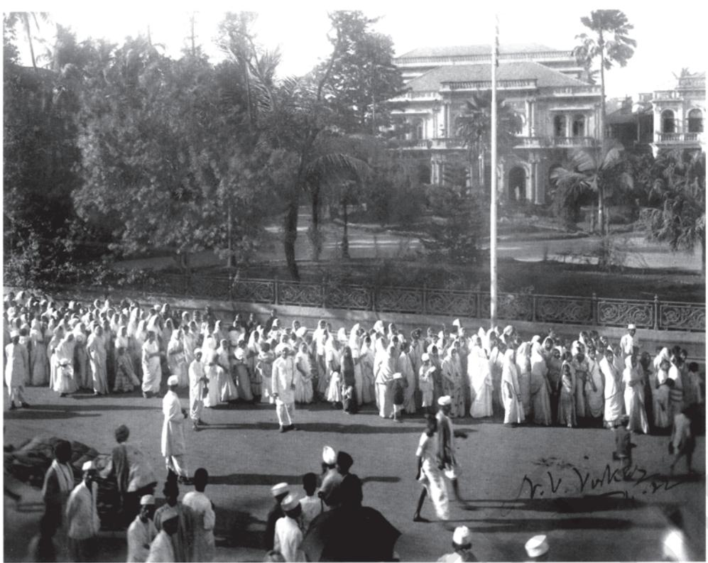

Fig. 9 – Women join nationalist processions. During the national movement, many women, for the first time in their lives, moved out of their homes on to a public arena. Amongst the marchers you can see many old women, and mothers with children in their arms.

picketed foreign cloth and liquor shops. Many went to jail. In urban areas these women were from high-caste families; in rural areas they came from rich peasant households. Moved by Gandhiji's call, they began to see service to the nation as a sacred duty of women. Yet, this increased public role did not necessarily mean any radical change in the way the position of women was visualised. Gandhiji was convinced that it was the duty of women to look after home and hearth, be good mothers and good wives. And for a long time the Congress was reluctant to allow women to hold any position of authority within the organisation. It was keen only on their symbolic presence.

#### **3.3 The Limits of Civil Disobedience**

Not all social groups were moved by the abstract concept of swaraj. One such group was the nation's 'untouchables', who from around the 1930s had begun to call themselves dalit or oppressed. For long the Congress had ignored the dalits, for fear of offending the sanatanis, the conservative high-caste Hindus. But Mahatma Gandhi declared that swaraj would not come for a hundred years if untouchability was not eliminated. He called the 'untouchables' harijan,

### Discuss

Why did various classes and groups of Indians participate in the Civil Disobedience Movement?

or the children of God, organised satyagraha to secure them entry into temples, and access to public wells, tanks, roads and schools. He himself cleaned toilets to dignify the work of the bhangi (the sweepers), and persuaded upper castes to change their heart and give up 'the sin of untouchability'. But many dalit leaders were keen on a different political solution to the problems of the community. They began organising themselves, demanding reserved seats in educational institutions, and a separate electorate that would choose dalit members for legislative councils. Political empowerment, they believed, would resolve the problems of their social disabilities. Dalit participation in the Civil Disobedience Movement was therefore limited, particularly in the Maharashtra and Nagpur region where their organisation was quite strong.

Dr B.R. Ambedkar, who organised the dalits into the Depressed Classes Association in 1930, clashed with Mahatma Gandhi at the second Round Table Conference by demanding separate electorates for dalits. When the British government conceded Ambedkar's demand, Gandhiji began a fast unto death. He believed that separate electorates for dalits would slow down the process of their integration into society. Ambedkar ultimately accepted Gandhiji's position and the result was the Poona Pact of September 1932. It gave the Depressed Classes (later to be known as the Schedule Castes) reserved seats in provincial and central legislative councils, but they were to be voted in by the general electorate. The dalit movement, however, continued to be apprehensive of the Congress-led national movement.

Some of the Muslim political organisations in India were also lukewarm in their response to the Civil Disobedience Movement. After the decline of the Non-Cooperation-Khilafat Movement, a large section of Muslims felt alienated from the Congress. From the mid-1920s the Congress came to be more visibly associated with openly Hindu religious nationalist groups like the Hindu Mahasabha. As relations between Hindus and Muslims worsened, each community organised religious processions with militant fervour, provoking Hindu-Muslim communal clashes and riots in various cities. Every riot deepened the distance between the two communities.

The Congress and the Muslim League made efforts to renegotiate an alliance, and in 1927 it appeared that such a unity could be forged. The important differences were over the question of representation in the future assemblies that were to be elected. Muhammad Ali

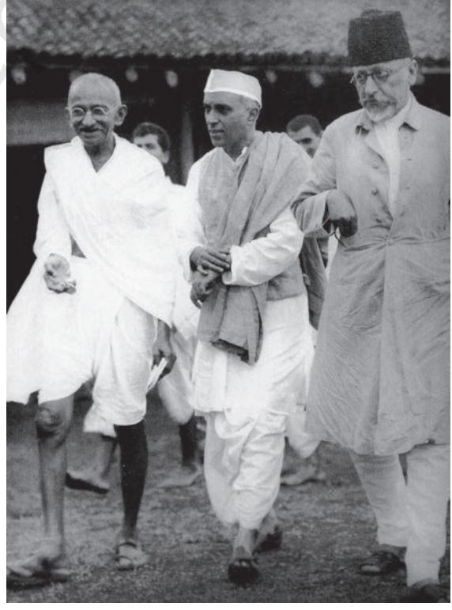

*Fig. 10 – Mahatma Gandhi, Jawaharlal Nehru and Maulana Azad at Sevagram Ashram, Wardha, 1935.*

Jinnah, one of the leaders of the Muslim League, was willing to give up the demand for separate electorates, if Muslims were assured reserved seats in the Central Assembly and representation in proportion to population in the Muslim-dominated provinces (Bengal and Punjab). Negotiations over the question of representation continued but all hope of resolving the issue at the All Parties Conference in 1928 disappeared when M.R. Jayakar of the Hindu Mahasabha strongly opposed efforts at compromise.

When the Civil Disobedience Movement started there was thus an atmosphere of suspicion and distrust between communities. Alienated from the Congress, large sections of Muslims could not respond to the call for a united struggle. Many Muslim leaders and intellectuals expressed their concern about the status of Muslims as a minority within India. They feared that the culture and identity of minorities would be submerged under the domination of a Hindu majority.

#### **Source D**

In 1930, Sir Muhammad Iqbal, as president of the Muslim League, reiterated the importance of separate electorates for the Muslims as an important safeguard for their minority political interests. His statement is supposed to have provided the intellectual justification for the Pakistan demand that came up in subsequent years. This is what he said:

'I have no hesitation in declaring that if the principle that the Indian Muslim is entitled to full and free development on the lines of his own culture and tradition in his own Indian home-lands is recognised as the basis of a permanent communal settlement, he will be ready to stake his all for the freedom of India. The principle that each group is entitled to free development on its own lines is not inspired by any feeling of narrow communalism … A community which is inspired by feelings of ill-will towards other communities is low and ignoble. I entertain the highest respect for the customs, laws, religions and social institutions of other communities. Nay, it is my duty according to the teachings of the Quran, even to defend their places of worship, if need be. Yet I love the communal group which is the source of life and behaviour and which has formed me what I am by giving me its religion, its literature, its thought, its culture and thereby its whole past as a living operative factor in my present consciousness …

'Communalism in its higher aspect, then, is indispensable to the formation of a harmonious whole in a country like India. The units of Indian society are not territorial as in European countries … The principle of European democracy cannot be applied to India without recognising the fact of communal groups. The Muslim demand for the creation of a Muslim India within India is, therefore, perfectly justified…

'The Hindu thinks that separate electorates are contrary to the spirit of true nationalism, because he understands the word "nation" to mean a kind of universal amalgamation in which no communal entity ought to retain its private individuality. Such a state of things, however, does not exist. India is a land of racial and religious variety. Add to this the general economic inferiority of the Muslims, their enormous debt, especially in the Punjab, and their insufficient majorities in some of the provinces, as at present constituted and you will begin to see clearly the meaning of our anxiety to retain separate electorates.' **Source**

### Discuss

Read the Source D carefully. Do you agree with Iqbal's idea of communalism? Can you define communalism in a different way?

2024-25

### **4 The Sense of Collective Belonging**

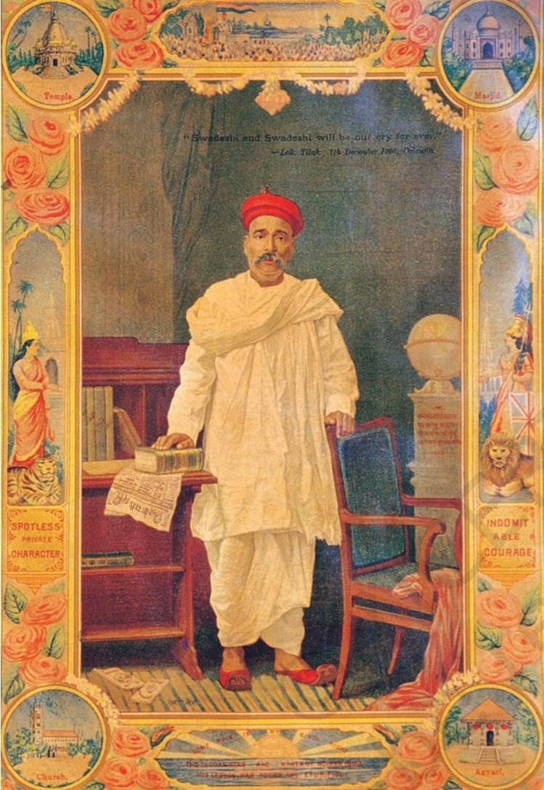

Fig. 11 – Bal Gangadhar Tilak, an early-twentieth-century print. Notice how Tilak is surrounded by symbols of unity. The sacred institutions of different faiths (temple, church, masjid) frame the central figure.

Nationalism spreads when people begin to believe that they are all part of the same nation, when they discover some unity that binds them together. But how did the nation become a reality in the minds of people? How did people belonging to different communities, regions or language groups develop a sense of collective belonging?

This sense of collective belonging came partly through the experience of united struggles. But there were also a variety of cultural processes through which nationalism captured people's imagination. History and fiction, folklore and songs, popular prints and symbols, all played a part in the making of nationalism.

The identity of the nation, as you know (see Chapter 1), is most often symbolised in a figure or image. This helps create an image with which people can identify the nation. It was in the twentieth century, with the growth of nationalism, that the identity of India came to be visually associated with the image of Bharat Mata. The image was first created by Bankim Chandra Chattopadhyay. In the 1870s he wrote 'Vande Mataram' as a hymn to the motherland. Later it was included in his novel Anandamath and widely sung during the Swadeshi movement in Bengal. Moved by the Swadeshi movement, Abanindranath Tagore painted his famous image of Bharat Mata (see Fig. 12). In this painting Bharat Mata is portrayed as an ascetic figure; she is calm, composed, divine and spiritual. In subsequent years, the image of Bharat Mata acquired many different forms, as it circulated in popular prints, and was painted by different artists (see Fig. 14). Devotion to this mother figure came to be seen as evidence of one's nationalism.

Ideas of nationalism also developed through a movement to revive Indian folklore. In late-nineteenth-century India, nationalists began recording folk tales sung by bards and they toured villages to gather folk songs and legends. These tales, they believed, gave a true picture of traditional culture that had been corrupted and damaged by outside forces. It was essential to preserve this folk tradition in order to discover one's national identity and restore a sense of pride in one's past. In Bengal, Rabindranath Tagore himself began collecting ballads, nursery rhymes and myths, and led the movement for folk

Fig. 12 – Bharat Mata, Abanindranath Tagore, 1905.

Notice that the mother figure here is shown as dispensing learning, food and clothing. The mala in one hand emphasises her ascetic quality. Abanindranath Tagore, like Ravi Varma before him, tried to develop a style of painting that could be seen as truly Indian.

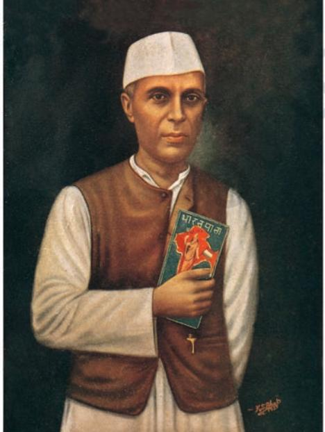

Fig. 13 – Jawaharlal Nehru, a popular print.

Nehru is here shown holding the image of Bharat Mata and the map of India close to his heart. In a lot of popular prints, nationalist leaders are shown offering their heads to Bharat Mata. The idea of sacrifice for the mother was powerful within popular imagination.

revival. In Madras, Natesa Sastri published a massive four-volume collection of Tamil folk tales, The Folklore of Southern India. He believed that folklore was national literature; it was 'the most trustworthy manifestation of people's real thoughts and characteristics'.

As the national movement developed, nationalist leaders became more and more aware of such icons and symbols in unifying people and inspiring in them a feeling of nationalism. During the Swadeshi movement in Bengal, a tricolour flag (red, green and yellow) was designed. It had eight lotuses representing eight provinces of British India, and a crescent moon, representing Hindus and Muslims. By 1921, Gandhiji had designed the Swaraj flag. It was again a tricolour (red, green and white) and had a spinning wheel in the centre, representing the Gandhian ideal of self-help. Carrying the flag, holding it aloft, during marches became a symbol of defiance.

Another means of creating a feeling of nationalism was through reinterpretation of history. By the end of the nineteenth century many Indians began feeling that to instill a sense of pride in the nation, Indian history had to be thought about differently. The British saw Indians as backward and primitive, incapable of governing themselves. In response, Indians began looking into the past to discover India's great achievements. They wrote about the glorious developments in ancient times when art and architecture, science and mathematics, religion and culture, law and philosophy, crafts and trade had flourished. This glorious time, in their view, was followed by a history of decline, when India was colonised. These nationalist histories urged the readers to take pride in India's great achievements in the past and struggle to change the miserable conditions of life under British rule.

These efforts to unify people were not without problems. When the past being glorified was Hindu, when the images celebrated were drawn from Hindu iconography, then people of other communities felt left out.

#### **Source E**

Tarinicharan Chattopadhyay, Bharatbarsher Itihas (The History of Bharatbarsh), vol. 1, 1858.

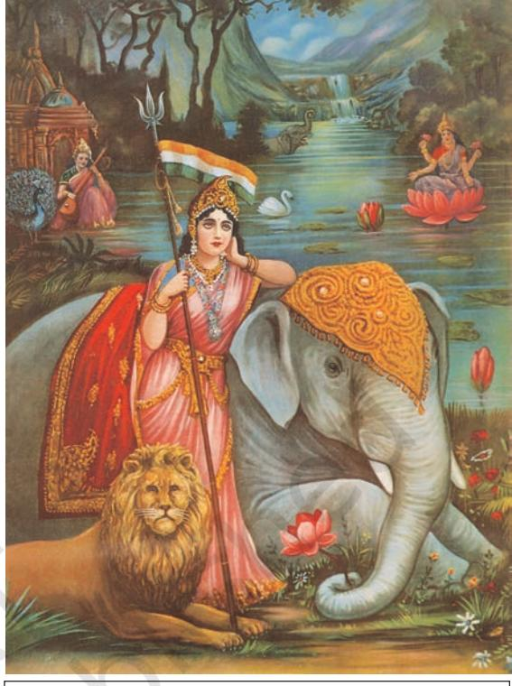

Fig. 14a – Bharat Mata. This figure of Bharat Mata is a contrast to the one painted by Abanindranath Tagore. Here she is shown with a trishul, standing beside a lion and an elephant – both symbols of power and authority.

### Activity

Look at Figs. 12 and 14. Do you think these images will appeal to all castes and communities? Explain your views briefly.

#### **Conclusion**

A growing anger against the colonial government was thus bringing together various groups and classes of Indians into a common struggle for freedom in the first half of the twentieth century. The Congress under the leadership of Mahatma Gandhi tried to channel people's grievances into organised movements for independence. Through such movements the nationalists tried to forge a national unity. But as we have seen, diverse groups and classes participated in these movements with varied aspirations

and expectations. As their grievances were wide-ranging, freedom from colonial rule also meant different things to different people. The Congress continuously attempted to resolve differences, and ensure that the demands of one group did not alienate another. This is precisely why the unity within the movement often broke down. The high points of Congress activity and nationalist unity were followed by phases of disunity and inner conflict between groups.

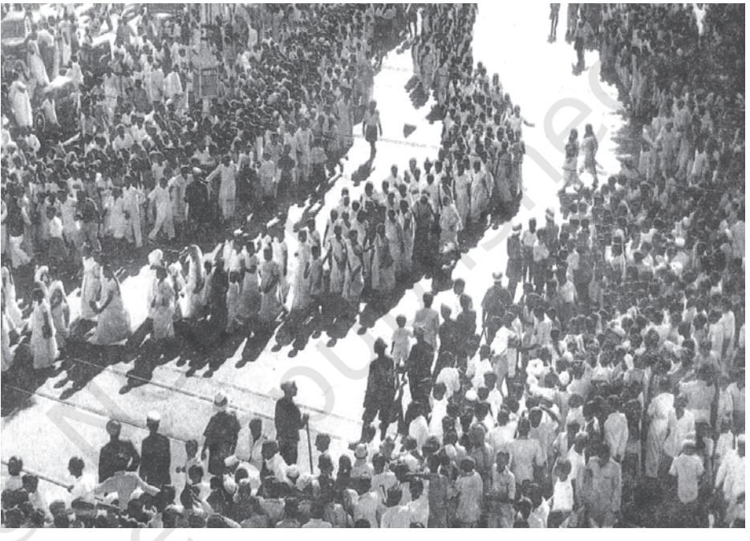

In other words, what was emerging was a nation with many voices wanting freedom from colonial rule.

Fig. 14b Women's procession in Bombay during the Quit India Movement

#### Quit India Movement

The failure of the Cripps Mission and the effects of World War II created widespread discontentment in India. This led Gandhiji to launch a movement calling for complete withdrawal of the British from India. The Congress Working Committee, in its meeting in Wardha on 14 July 1942, passed the historic 'Quit India' resolution demanding the immediate transfer of power to Indians and quit India. On 8 August 1942 in Bombay, the All India Congress Committee endorsed the resolution which called for a non-violent mass struggle on the widest possible scale throughout the country. It was on this occasion that Gandhiji delivered the famous 'Do or Die' speech. The call for 'Quit India' almost brought the state machinery to a standstill in large parts of the country as people voluntarily threw themselves into the thick of the movement. People observed hartals, and demonstrations and processions were accompanied by national songs and slogans. The movement was truly a mass movement which brought into its ambit thousands of ordinary people, namely students, workers and peasants. It also saw the active participation of leaders, namely, Jayprakash Narayan, Aruna Asaf Ali and Ram Manohar Lohia and many women such as Matangini Hazra in Bengal, Kanaklata Barua in Assam and Rama Devi in Odisha. The British responded with much force, yet it took more than a year to suppress the movement.

### Write in brief

- 1. Explain:
	- a) Why growth of nationalism in the colonies is linked to an anti-colonial movement.
	- b) How the First World War helped in the growth of the National Movement in India.

Write in brief

- c) Why Indians were outraged by the Rowlatt Act.
- d) Why Gandhiji decided to withdraw the Non-Cooperation Movement.
- 2. What is meant by the idea of satyagraha?
- 3. Write a newspaper report on:
	- a) The Jallianwala Bagh massacre
	- b) The Simon Commission
- 4. Compare the images of Bharat Mata in this chapter with the image of Germania in Chapter 1.

### Discuss

- 1. List all the different social groups which joined the Non-Cooperation Movement of 1921. Then choose any three and write about their hopes and struggles to show why they joined the movement. Discuss
- 2. Discuss the Salt March to make clear why it was an effective symbol of resistance against colonialism.
- 3. Imagine you are a woman participating in the Civil Disobedience Movement. Explain what the experience meant to your life.
- 4. Why did political leaders differ sharply over the question of separate electorates?

### Project

Find out about the anti-colonial movement in Indo-China. Compare and contrast India's national movement with the ways in which Indo-China became independent. Project

