# **SECTION II**

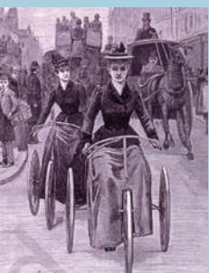

# **LIVELIHOODS, ECONOMIES AND SOCIETIES**

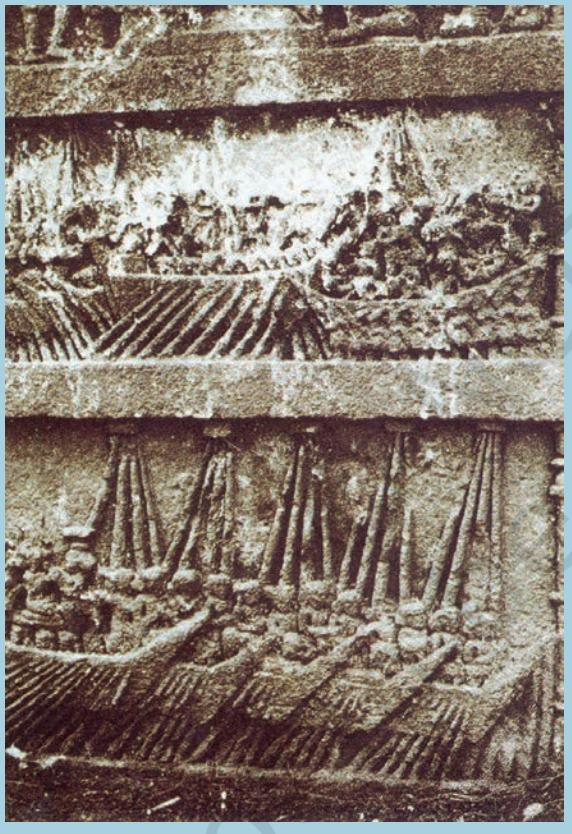

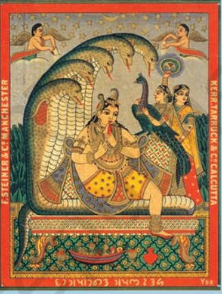

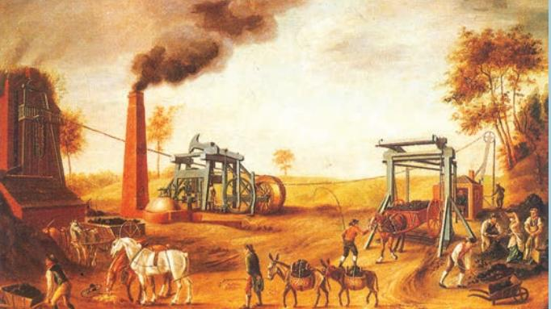

# **The Making of a Global World**

# **1 The Pre-modern World**

When we talk of 'globalisation' we often refer to an economic system that has emerged since the last 50 years or so. But as you will see in this chapter, the making of the global world has a long history – of trade, of migration, of people in search of work, the movement of capital, and much else. As we think about the dramatic and visible signs of global interconnectedness in our lives today, we need to understand the phases through which this world in which we live has emerged.

All through history, human societies have become steadily more interlinked. From ancient times, travellers, traders, priests and pilgrims travelled vast distances for knowledge, opportunity and spiritual fulfilment, or to escape persecution. They carried goods, money, values, skills, ideas, inventions, and even germs and diseases. As early as 3000 BCE an active coastal trade linked the Indus valley civilisations with present-day West Asia. For more than a millennia, cowries (the Hindi cowdi or seashells, used as a form of currency) from the Maldives found their way to China and East Africa. The long-distance spread of disease-carrying germs may be traced as far back as the seventh century. By the thirteenth century it had become an unmistakable link.

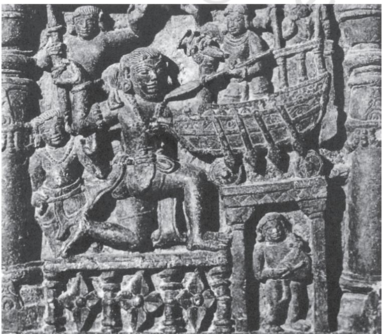

Fig. 1 – Image of a ship on a memorial stone, Goa Museum, tenth century CE. From the ninth century, images of ships appear regularly in memorial stones found in the western coast, indicating the significance of oceanic trade.

53

#### **1.1 Silk Routes Link the World**

The silk routes are a good example of vibrant pre-modern trade and cultural links between distant parts of the world. The name 'silk routes' points to the importance of West-bound Chinese silk cargoes along this route. Historians have identified several silk routes, over land and by sea, knitting together vast regions of Asia, and linking Asia with Europe and northern Africa. They are known to have existed since before the Christian Era and thrived almost till the fifteenth century. But Chinese pottery also travelled the same route, as did textiles and spices from India and Southeast Asia. In return, precious metals – gold and silver – flowed from Europe to Asia.

Trade and cultural exchange always went hand in hand. Early Christian missionaries almost certainly travelled this route to Asia, as did early Muslim preachers a few centuries later. Much before all this, Buddhism emerged from eastern India and spread in several directions through intersecting points on the silk routes.

Fig. 2 – Silk route trade as depicted in a Chinese cave painting, eighth century, Cave 217, Mogao Grottoes, Gansu, China.

#### **1.2 Food Travels: Spaghetti and Potato**

Food offers many examples of long-distance cultural exchange. Traders and travellers introduced new crops to the lands they travelled. Even 'ready' foodstuff in distant parts of the world might share common origins. Take spaghetti and noodles. It is believed

that noodles travelled west from China to become spaghetti. Or, perhaps Arab traders took pasta to fifth-century Sicily, an island now in Italy. Similar foods were also known in India and Japan, so the truth about their origins may never be known. Yet such guesswork suggests the possibilities of long-distance cultural contact even in the pre-modern world.

Many of our common foods such as potatoes, soya, groundnuts, maize, tomatoes, chillies, sweet potatoes, and so on were not known to our ancestors until about five centuries ago. These foods were only introduced in Europe and Asia after Christopher Columbus accidentally discovered the vast continent that would later become known as the Americas.

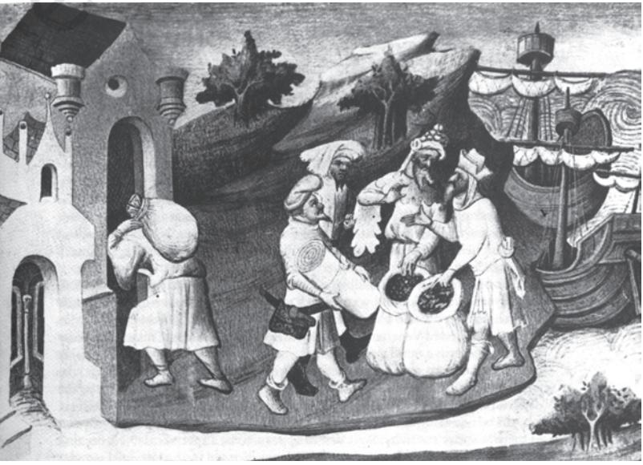

Fig. 3 – Merchants from Venice and the Orient exchanging goods, from Marco Polo, Book of Marvels, fifteenth century.

(Here we will use 'America' to describe North America, South America and the Caribbean.) In fact, many of our common foods came from America's original inhabitants – the American Indians.

Sometimes the new crops could make the difference between life and death. Europe's poor began to eat better and live longer with the introduction of the humble potato. Ireland's poorest peasants became so dependent on potatoes that when disease destroyed the potato crop in the mid-1840s, hundreds of thousands died of starvation.

#### **1.3 Conquest, Disease and Trade**

The pre-modern world shrank greatly in the sixteenth century after European sailors found a sea route to Asia and also successfully crossed the western ocean to America. For centuries before, the Indian Ocean had known a bustling trade, with goods, people, knowledge, customs, etc. criss-crossing its waters. The Indian subcontinent was central to these flows and a crucial point in their networks. The entry of the Europeans helped expand or redirect some of these flows towards Europe.

Before its 'discovery', America had been cut off from regular contact with the rest of the world for millions of years. But from the sixteenth century, its vast lands and abundant crops and minerals began to transform trade and lives everywhere.

Precious metals, particularly silver, from mines located in presentday Peru and Mexico also enhanced Europe's wealth and financed its trade with Asia. Legends spread in seventeenth-century Europe about South America's fabled wealth. Many expeditions set off in search of El Dorado, the fabled city of gold.

The Portuguese and Spanish conquest and colonisation of America was decisively under way by the mid-sixteenth century. European conquest was not just a result of superior firepower. In fact, the most powerful weapon of the Spanish conquerors was not a conventional military weapon at all. It was the germs such as those of smallpox that they carried on their person. Because of their long isolation, America's original inhabitants had no immunity against these diseases that came from Europe. Smallpox in particular proved a deadly killer. Once introduced, it spread deep into the continent, ahead even of any Europeans reaching there. It killed and decimated whole communities, paving the way for conquest.

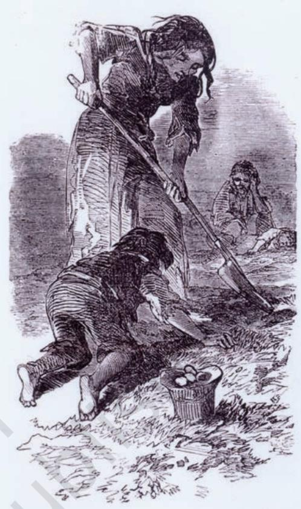

Fig. 4 – The Irish Potato Famine, Illustrated London News, 1849.

Hungry children digging for potatoes in a field that has already been harvested, hoping to discover some leftovers. During the Great Irish Potato Famine (1845 to 1849), around 1,000,000 people died of starvation in Ireland, and double the number emigrated in search of work.

#### **Box 1**

#### 'Biological' warfare?

John Winthorp, the first governor of the Massachusetts Bay colony in New England, wrote in May 1634 that smallpox signalled God's blessing for the colonists: '… the natives … were neere (near) all dead of small Poxe (pox), so as the Lord hathe (had) cleared our title to what we possess'.

Alfred Crosby, Ecological Imperialism. Guns could be bought or captured and turned against the invaders. But not diseases such as smallpox to which the conquerors were mostly immune.

Until the nineteenth century, poverty and hunger were common in Europe. Cities were crowded and deadly diseases were widespread. Religious conflicts were common, and religious dissenters were persecuted. Thousands therefore fled Europe for America. Here, by the eighteenth century, plantations worked by slaves captured in Africa were growing cotton and sugar for European markets.

Until well into the eighteenth century, China and India were among the world's richest countries. They were also pre-eminent in Asian trade. However, from the fifteenth century, China is said to have restricted overseas contacts and retreated into isolation. China's reduced role and the rising importance of the Americas gradually moved the centre of world trade westwards. Europe now emerged as the centre of world trade.

#### New words

Dissenter – One who refuses to accept established beliefs and practices

# Discuss

Explain what we mean when we say that the world 'shrank' in the 1500s.

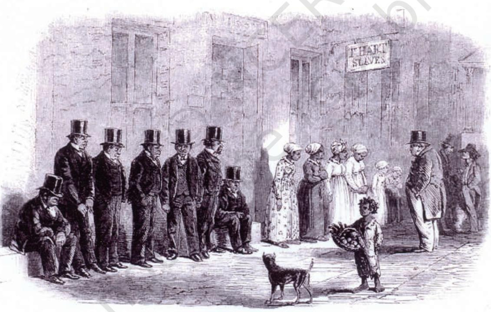

Fig. 5 – Slaves for sale, New Orleans, Illustrated London News, 1851. A prospective buyer carefully inspecting slaves lined up before the auction. You can see two children along with four women and seven men in top hats and suit waiting to be sold. To attract buyers, slaves were often dressed in their best clothes.

2024-25

# **2 The Nineteenth Century (1815-1914)**

The world changed profoundly in the nineteenth centur y. Economic , political, social, cultural and technological factors interacted in complex w ays to transform societies and reshape external relations .

Economists identify three types of movement or 'flows' within international economic ex changes . The first is the flow of trade which in the nineteenth century refer red lar gely to trade in goods (e.g., cloth or wheat). The second is the flow of labour – the migration of people in search of employment. The third is the movement of capital for short-term or long-term investments over long distances .

All three flows were closely interwoven and affected peoples' lives more deeply now than ever before. The interconnections could sometimes be broken – for example, labour migration was often more restricted than goods or capital flows. Yet it helps us understand the nineteenth-century world economy better if we look at the three flows to gether .

#### **2.1 A World Economy Takes Shape**

A good place to start is the changing pattern of food production and consumption in industrial Europe. Traditionall y, countries liked to be self-sufficient in food. But in nineteenth-century Britain, self-sufficiency in food meant lower living standards and social conflict. Why was this so?

Population growth from the late eighteenth century had increased the demand for food grains in Britain. As urban centres expanded and industry grew, the demand for a gricultural products went up , pushing up food g rain prices . Under pressure from landed groups, the government also restricted the import of corn. The laws allowing the government to do this were commonly known as the 'Corn Laws'. Unhappy with high food prices, industrialists and urban d wellers forced the abolition of the Corn Laws .

After the Corn Laws were scrapped, food could be imported into Britain more cheaply than it could be produced within the country. British agriculture was una ble to compete with imports . Vast areas of land were now left uncultivated, and thousands of men and women were thrown out of work. They flocked to the cities or migrated o verseas .

As food prices fell, consumption in Britain rose. From the midnineteenth century, faster industrial growth in Britain also led to higher incomes, and therefore more food imports. Around the world – in Eastern Europe, Russia, America and Australia – lands were cleared and food production expanded to meet the British demand.

It was not enough merely to clear lands for agriculture. Railways were needed to link the agricultural regions to the ports. New harbours had to be built and old ones expanded to ship the new cargoes. People had to settle on the lands to bring them under cultivation. This meant building homes and settlements. All these activities in turn required capital and labour. Capital flowed from financial centres such as London. The demand for labour in places where labour was in short supply – as in America and Australia – led to more migration.

Nearly 50 million people emigrated from Europe to America and Australia in the nineteenth century. All over the world some 150 million are estimated to have left their homes, crossed oceans and vast distances over land in search of a better future. Fig. 6 – Emigrant ship leaving for the US, by

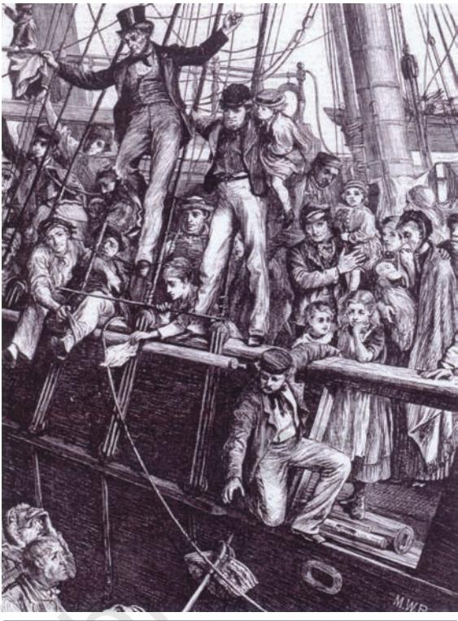

M.W. Ridley, 1869.

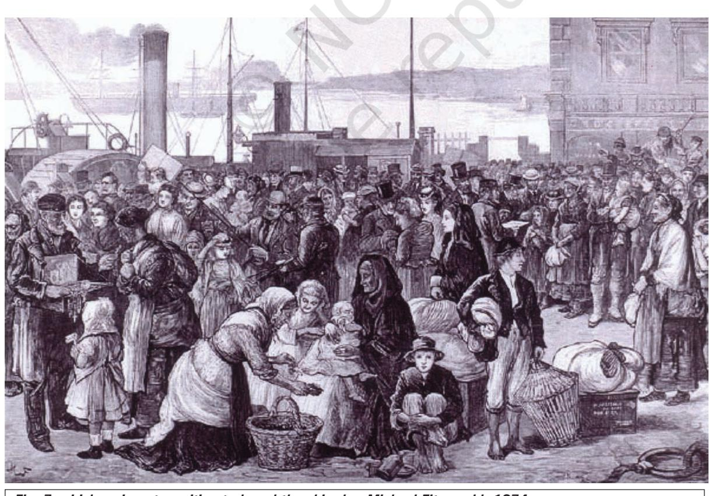

Fig. 7 – Irish emigrants waiting to board the ship, by Michael Fitzgerald, 1874.

Activity Thus by 1890, a global agricultural economy had taken shape, accompanied by complex changes in labour movement patterns, capital flows, ecologies and technology. Food no longer came from a nearby village or town, but from thousands of miles away. It was not grown by a peasant tilling his own land, but by an agricultural worker, perhaps recently arrived, who was now working on a large farm that only a generation ago had most likely been a forest. It was transported by railway, built for that very purpose, and by ships which were increasingly manned in these decades by low-paid workers from southern Europe, Asia, Africa and the Caribbean.

# Activity

Imagine that you are an agricultural worker who has arrived in America from Ireland. Write a paragraph on why you chose to come and how you are earning your living.

Some of this dramatic change, though on a smaller scale, occurred closer home in west Punjab. Here the British Indian government built a network of irrigation canals to transform semi-desert wastes into fertile agricultural lands that could grow wheat and cotton for export. The Canal Colonies, as the areas irrigated by the new canals were called, were settled by peasants from other parts of Punjab.

Of course, food is merely an example. A similar story can be told for cotton, the cultivation of which expanded worldwide to feed British textile mills. Or rubber. Indeed, so rapidly did regional specialisation in the production of commodities develop, that between 1820 and 1914 world trade is estimated to have multiplied 25 to 40 times. Nearly 60 per cent of this trade comprised 'primary products' – that is, agricultural products such as wheat and cotton, and minerals such as coal.

#### **2.2 Role of Technology**

What was the role of technology in all this? The railways, steamships, the telegraph, for example, were important inventions without which we cannot imagine the transformed nineteenth-century world. But technological advances were often the result of larger social, political and economic factors. For example, colonisation stimulated new investments and improvements in transport: faster railways, lighter wagons and larger ships helped move food more cheaply and quickly from faraway farms to final markets.

Prepare a flow chart to show how Britain's decision to import food led to increased migration to America and Australia.

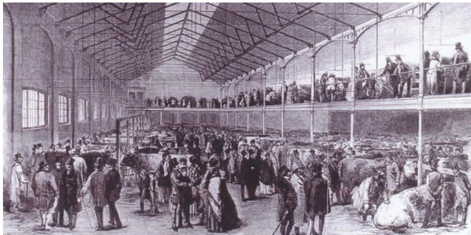

#### Fig. 8 — The Smithfield Club Cattle Show, Illustrated London News, 1851.

Cattle were traded at fairs, brought by farmers for sale. One of the oldest livestock markets in London was at Smithfield. In the midnineteenth century a huge poultry and meat market was established near the railway line connecting Smithfield to all the meat-supplying centres of the country.

The trade in meat offers a good example of this connected process. Till the 1870s, animals were shipped live from America to Europe and then slaughtered when they arrived there. But live animals took up a lot of ship space. Many also died in voyage, fell ill, lost weight, or became unfit to eat. Meat was hence an expensive luxury beyond the reach of the European poor. High prices in turn kept demand and production down until the development of a new technology, namely, refrigerated ships, which enabled the transport of perishable foods over long distances.

Now animals were slaughtered for food at the starting point – in America, Australia or New Zealand – and then transported to Europe as frozen meat. This reduced shipping costs and lowered meat prices in Europe. The poor in Europe could now consume a more varied diet. To the earlier monotony of bread and potatoes many, though not all, could now add meat (and butter and eggs) to their diet. Better living conditions promoted social peace within the country and support for imperialism abroad.

Fig. 9 – Meat being loaded on to the ship, Alexandra, Illustrated London News, 1878. Export of meat was possible only after ships were refrigerated.

#### **2.3 Late nineteenth-century Colonialism**

Trade flourished and markets expanded in the late nineteenth century. But this was not only a period of expanding trade and increased prosperity. It is important to realise that there was a darker side to this process. In many parts of the world, the expansion of trade and a closer relationship with the world economy also meant a loss of freedoms and livelihoods. Latenineteenth-century European conquests produced many painful economic, social and ecological changes through which the colonised societies were brought into the world economy.

Look at a map of Africa (Fig. 10). You will see some countries' borders run straight, as if they were drawn using a ruler. Well, in fact this was almost how rival European powers in Africa drew up the borders demarcating their respective territories. In 1885 the big European powers met in Berlin to complete the carving up of Africa between them.

Britain and France made vast additions to their overseas territories in the late nineteenth century. Belgium and Germany became new colonial powers. The US also became a colonial power in the late 1890s by taking over some colonies earlier held by Spain.

Let us look at one example of the destructive impact of colonialism on the economy and livelihoods of colonised people.

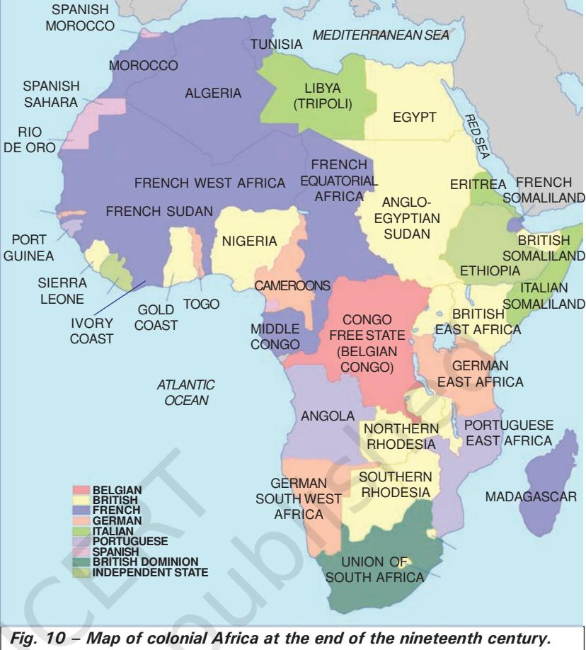

#### **Box 2**

#### Sir Henry Morton Stanley in Central Africa

Stanley was a journalist and explorer sent by the New York Herald to find Livingston, a missionary and explorer who had been in Africa for several years. Like other European and American explorers of the time, Stanley went with arms, mobilised local hunters, warriors and labourers to help him, fought with local tribes, investigated African terrains, and mapped different regions. These explorations helped the conquest of Africa. Geographical explorations were not driven by an innocent search for scientific information. They were directly linked to imperial projects.

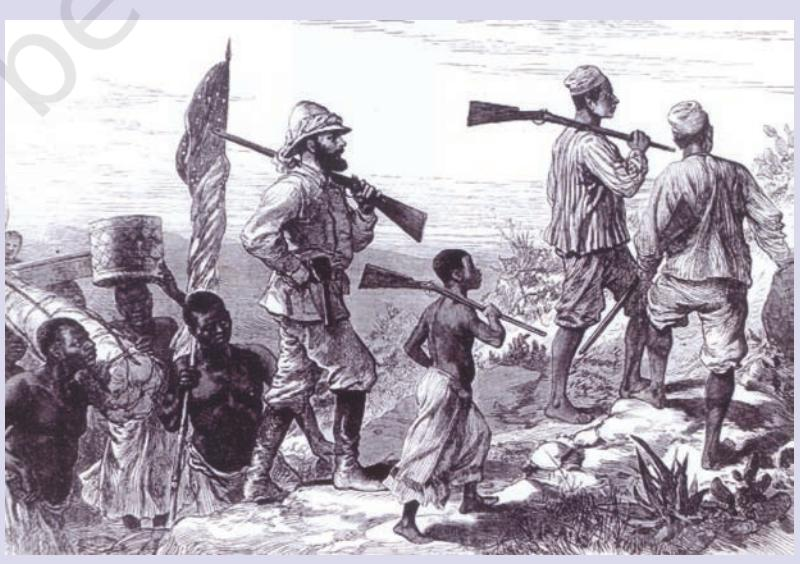

Fig. 11 – Sir Henry Morton Stanley and his retinue in Central Africa, Illustrated London News, 1871.

#### **2.4 Rinderpest, or the Cattle Plague**

In Africa, in the 1890s, a fast-spreading disease of cattle plague or Rinderpest had a terrifying impact on people's livelihoods and the local economy. This is a good example of the widespread European imperial impact on colonised societies. It shows how in this era of conquest even a disease affecting cattle reshaped the lives and fortunes of thousands of people and their relations with the rest of the world.

Historically, Africa had abundant land and a relatively small population. For centuries, land and livestock sustained African livelihoods and people rarely worked for a wage. In latenineteenth-century Africa there were few consumer goods that wages could buy. If you had been an African possessing land and livestock – and there was plenty of both – you too would have seen little reason to work for a wage.

In the late nineteenth century, Europeans were attracted to Africa due to its vast resources of land and minerals. Europeans came to Africa hoping to establish plantations and mines to produce crops and minerals for export to Europe. But there was an unexpected problem – a shortage of labour willing to work for wages.

Employers used many methods to recruit and retain labour. Heavy taxes were imposed which could be paid only by working for wages on plantations and mines. Inheritance laws were changed so that

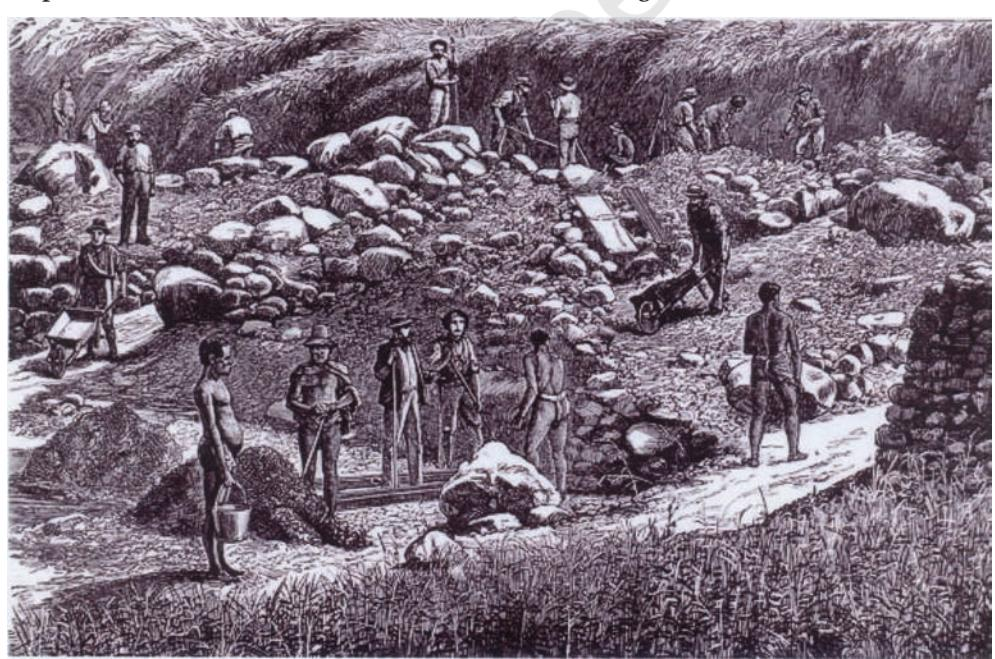

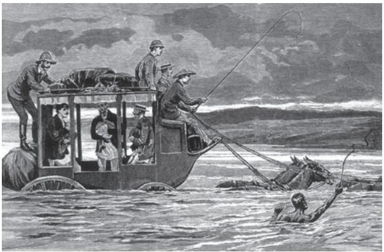

*Fig. 12 – Transport to the Transvaal gold mines,* **The Graphic***, 1887.*

*Crossing the Wilge river was the quickest method of transport to the gold fields of Transvaal. After the discovery of gold in Witwatersrand, Europeans rushed to the region despite their fear of disease and death, and the difficulties of the journey. By the 1890s, South Africa contributed over 20 per cent of the world gold production.*

> *Fig. 13* **—** *Diggers at work in the Transvaal gold fields in South Africa,* **The Graphic,** *1875.*

peasants were displaced from land: only one member of a family was allowed to inherit land, as a result of which the others were pushed into the labour market. Mineworkers were also confined in compounds and not allowed to move about freely.

Then came Rinderpest, a devastating cattle disease.

Rinderpest arrived in Africa in the late 1880s. It was carried by infected cattle imported from British Asia to feed the Italian soldiers invading Eritrea in East Africa. Entering Africa in the east, rinderpest moved west 'like forest fire', reaching Africa's Atlantic coast in 1892. It reached the Cape (Africa's southernmost tip) five years later. Along the way rinderpest killed 90 per cent of the cattle.

The loss of cattle destroyed African livelihoods. Planters, mine owners and colonial governments now successfully monopolised what scarce cattle resources remained, to strengthen their power and to force Africans into the labour market. Control over the scarce resource of cattle enabled European colonisers to conquer and subdue Africa.

Similar stories can be told about the impact of Western conquest on other parts of the nineteenth-century world.

#### **2.4 Indentured Labour Migration from India**

The example of **indentured labour** migration from India also illustrates the two-sided nature of the nineteenth-century world. It was a world of faster economic growth as well as great misery, higher incomes for some and poverty for others, technological advances in some areas and new forms of coercion in others.

In the nineteenth century, hundreds of thousands of Indian and Chinese labourers went to work on plantations, in mines, and in road and railway construction projects around the world. In India, indentured labourers were hired under contracts which promised return travel to India after they had worked five years on their employer's plantation.

Most Indian indentured workers came from the present-day regions of eastern Uttar Pradesh, Bihar, central India and the dry districts of Tamil Nadu. In the mid-nineteenth century these regions experienced many changes – cottage industries declined, land rents rose, lands were cleared for mines and plantations. All this affected the lives of the poor: they failed to pay their rents, became deeply indebted and were forced to migrate in search of work.

#### **New words**

Indentured labour – A bonded labourer under contract to work for an employer for a specific amount of time, to pay off his passage to a new country or home

The main destinations of Indian indentured migrants were the Caribbean islands (mainly Trinidad, Guyana and Surinam), Mauritius and Fiji. Closer home, Tamil migrants went to Ceylon and Malaya. Indentured workers were also recruited for tea plantations in Assam.

Recruitment was done by agents engaged by employers and paid a small commission. Many migrants agreed to take up work hoping to escape poverty or oppression in their home villages. Agents also tempted the prospective migrants by providing false information about final destinations, modes of travel, the nature of the work, and living and working conditions. Often

migrants were not even told that they were to embark on a long sea voyage. Sometimes agents even forcibly abducted less willing migrants.

Nineteenth-century indenture has been described as a 'new system of slavery'. On arrival at the plantations, labourers found conditions to be different from what they had imagined. Living and working conditions were harsh, and there were few legal rights.

But workers discovered their own ways of surviving. Many of them escaped into the wilds, though if caught they faced severe punishment. Others developed new forms of individual and collective selfexpression, blending different cultural forms, old and new. In Trinidad the annual Muharram procession was transformed into a riotous carnival called 'Hosay' (for Imam Hussain) in which workers of all races and religions joined. Similarly, the protest religion of Rastafarianism (made famous by the Jamaican reggae star Bob Marley) is also said to reflect social and cultural links with Indian migrants to the Caribbean. 'Chutney music', popular in Trinidad and Guyana, is another creative contemporary expression of the post-indenture experience. These forms of cultural fusion are part of the making of the global world, where things from different places get mixed, lose their original characteristics and become something entirely new.

Most indentured workers stayed on after their contracts ended, or returned to their new homes after a short spell in India. Consequently, there are large communities of people of Indian descent in these countries. Have you heard of the Nobel Prize-winning writer

# Discuss

Discuss the importance of language and popular traditions in the creation of national identity.

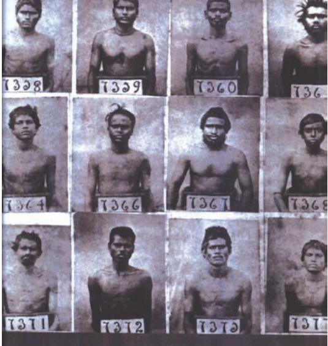

Fig. 15 — Indentured laboureres photographed for identification. For the employers, the numbers and not the names mattered.

Fig. 14 — Indian indentured labourers in a cocoa plantation in Trinidad, early nineteenth century.

V.S. Naipaul? Some of you may have followed the exploits of West Indies cricketers Shivnarine Chanderpaul and Ramnaresh Sarwan. If you have wondered why their names sound vaguely Indian, the answer is that they are descended from indentured labour migrants from India.

From the 1900s India's nationalist leaders began opposing the system of indentured labour migration as abusive and cruel. It was abolished in 1921. Yet for a number of decades afterwards, descendants of Indian indentured workers, often thought of as 'coolies', remained an uneasy minority in the Caribbean islands. Some of Naipaul's early novels capture their sense of loss and alienation.

#### **2.5 Indian Entrepreneurs Abroad**

Growing food and other crops for the world market required capital. Large plantations could borrow it from banks and markets. But what about the humble peasant?

Enter the Indian banker. Do you know of the Shikaripuri Shroffs and Nattukottai Chettiars? They were amongst the many groups of bankers and traders who financed export agriculture in Central and Southeast Asia, using either their own funds or those borrowed from European banks. They had a sophisticated system to transfer money over large distances, and even developed indigenous forms of corporate organisation.

Indian traders and moneylenders also followed European colonisers into Africa. Hyderabadi Sindhi traders, however, ventured beyond European colonies. From the 1860s they established flourishing emporia at busy ports worldwide, selling local and imported curios to tourists whose numbers were beginning to swell, thanks to the development of safe and comfortable passenger vessels.

#### **2.6 Indian Trade, Colonialism and the Global System**

Historically, fine cottons produced in India were exported to Europe. With industrialisation, British cotton manufacture began to expand, and industrialists pressurised the government to restrict cotton imports and protect local industries. Tariffs were imposed on cloth imports into Britain. Consequently, the inflow of fine Indian cotton began to decline.

From the early nineteenth century, British manufacturers also began to seek overseas markets for their cloth. Excluded from the British

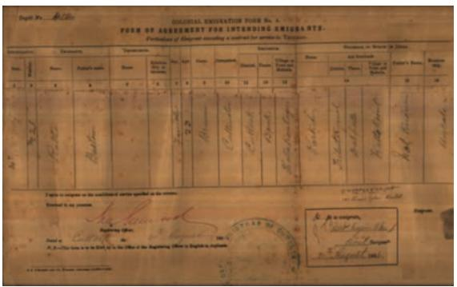

*Fig. 16* **—** *A contract form of an indentured labourer.*

#### *Source A*

#### **The testimony of an indentured labourer**

Extract from the testimony of Ram Narain Tewary, an indentured labourer who spent ten years on Demerara in the early twentieth century.

'… in spite of my best efforts, I could not properly do the works that were allotted to me ... In a few days I got my hands bruised all over and I could not go to work for a week for which I was prosecuted and sent to jail for 14 days. ... new emigrants find the tasks allotted to them extremely heavy and cannot complete them in a day. ... Deductions are also made from wages if the work is considered to have been done unsatisfactorily. Many people cannot therefore earn their full wages and are punished in various ways. In fact, the labourers have to spend their period of indenture in great trouble …'

Source: Department of Commerce and Industry, Emigration Branch. 1916 *Source*

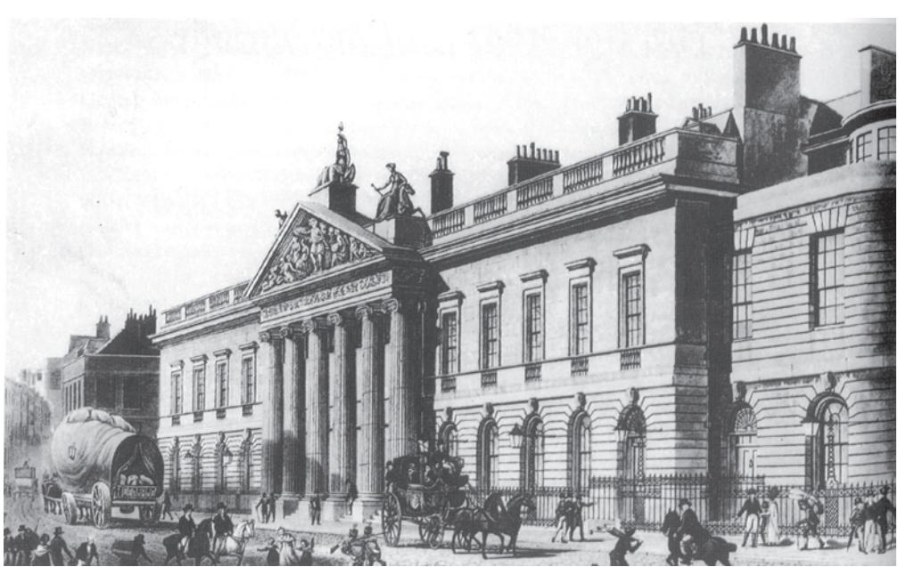

Fig. 17 – East India Company House, London. This was the nerve centre of the worldwide operations of the East India Company.

market by tariff barriers, Indian textiles now faced stiff competition in other international markets. If we look at the figures of exports from India, we see a steady decline of the share of cotton textiles: from some 30 per cent around 1800 to 15 per cent by 1815. By the 1870s this proportion had dropped to below 3 per cent.

What, then, did India export? The figures again tell a dramatic story. While exports of manufactures declined rapidly, export of raw materials increased equally fast. Between 1812 and 1871, the share of raw cotton exports rose from 5 per cent to 35 per cent. Indigo used for dyeing cloth was another important export for

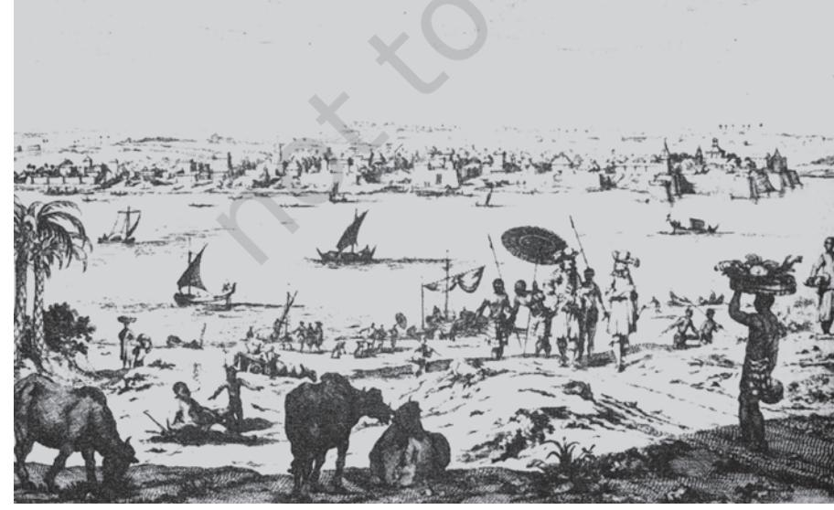

Fig. 18 – A distant view of Surat and its river. All through the seventeenth and early eighteenth centuries, Surat remained the main centre of overseas trade in the western Indian Ocean.

many decades.And, as you have read last year, opium shipments to China grew rapidly from the 1820s to become for a while India's single largest export. Britain grew opium in India and exported it to China and, with the money earned through this sale, it financed its tea and other imports from China.

Over the nineteenth century, British manufactures flooded the Indian market. Food grain and raw material exports from India to Britain and the rest of the world increased. But the value of British exports to India was much higher than the value of British imports from India. Thus Britain had a 'trade surplus' with India. Britain used this surplus to balance its trade deficits with other countries – that is, with countries from which Britain was importing more than it was selling to. This is how a multilateral settlement system works – it allows one country's deficit with another country to be settled by its surplus with a third country. By helping Britain balance its deficits, India played a crucial role in the late-nineteenth-century world economy.

Britain's trade surplus in India also helped pay the so-called 'home charges' that included private remittances home by British officials and traders, interest payments on India's external debt, and pensions of British officials in India.

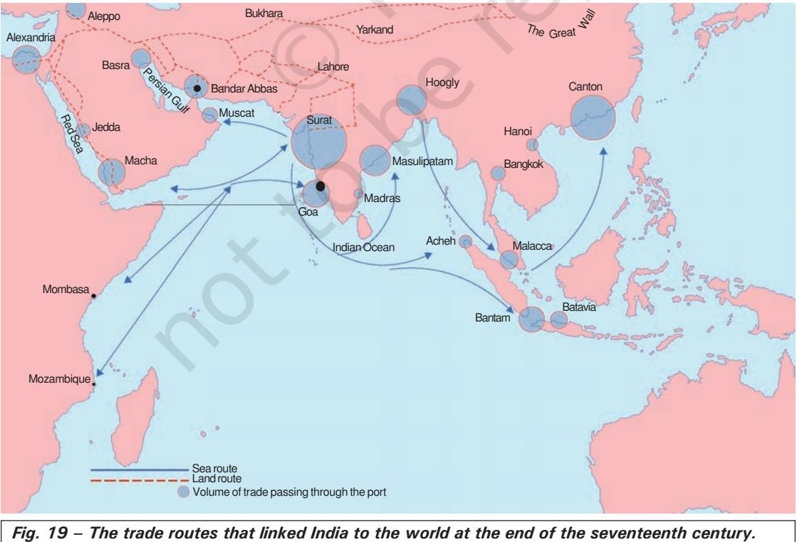

# The Making of a Global World

# **3 The Inter-war Economy**

The First World War (1914-18) was mainly fought in Europe. But its impact was felt around the world. Notably for our concerns in this chapter, it plunged the first half of the twentieth century into a crisis that took over three decades to overcome. During this period the world experienced widespread economic and political instability, and another catastrophic war.

#### **3.1 Wartime Transformations**

The First World War, as you know, was fought between two power blocs. On the one side were the Allies – Britain, France and Russia (later joined by the US); and on the opposite side were the Central Powers – Germany, Austria-Hungary and Ottoman Turkey. When the war began in August 1914, many governments thought it would be over by Christmas. It lasted more than four years.

The First World War was a war like no other before. The fighting involved the world's leading industrial nations which now harnessed the vast powers of modern industry to inflict the greatest possible destruction on their enemies.

This war was thus the first modern industrial war. It saw the use of machine guns, tanks, aircraft, chemical weapons, etc. on a massive scale. These were all increasingly products of modern large-

scale industry. To fight the war, millions of soldiers had to be recruited from around the world and moved to the frontlines on large ships and trains. The scale of death and destruction – 9 million dead and 20 million injured – was unthinkable before the industrial age, without the use of industrial arms.

Most of the killed and maimed were men of working age. These deaths and injuries reduced the able-bodied workforce in Europe. With fewer numbers within the family, household incomes declined after the war.

During the war, industries were restructured to produce war-related goods. Entire societies were also reorganised for war – as men went to battle, women stepped in to undertake jobs that earlier only men were expected to do.

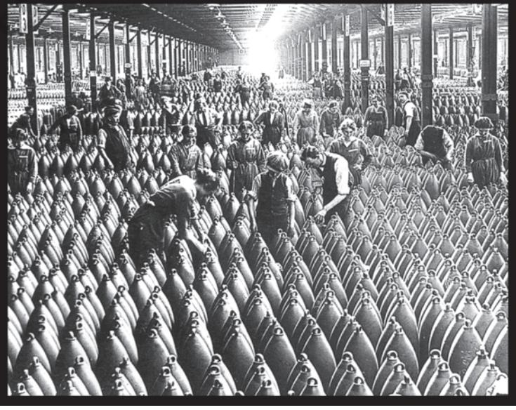

Fig. 20 – Workers in a munition factory during the First World War. Production of armaments increased rapidly to meet war demands.

The war led to the snapping of economic links between some of the world's lar gest economic po wers which were now fighting each other to pay for them. So Britain borrowed large sums of money from US banks as well as the US public. Thus the war transformed the US from being an international debtor to an international creditor. In other words , at the war's end, the US and its citizens owned more overseas assets than foreign governments and citizens owned in the US .

#### **3.2 Post-war Recovery**

Post-war economic recovery proved difficult. Britain, which was the world's leading economy in the pre-war period, in particular faced a prolonged crisis. While Britain was preoccupied with war, industries had developed in India and Japan. After the war Britain found it difficult to recapture its earlier position of dominance in the Indian mar ket, and to compete with J apan internationally. Moreover, to finance war expenditures Britain had borrowed liberally from the US. This meant that at the end of the war Britain was burdened with huge external debts.

The war had led to an economic boom, that is, to a large increase in demand, production and employment. When the war boom ended, production contracted and unemployment increased. At the same time the government reduced bloated war expenditures to bring them into line with peacetime revenues. These de velopments led to huge job losses – in 1921 one in every five British workers was out of work. Indeed, anxiety and uncertainty about work became an enduring part of the post-war scenario .

Many a gricultural economies were also in crisis . Consider the case of wheat producers. Before the war , eastern Europe was a major supplier of wheat in the world market. When this supply was disrupted during the war, wheat production in Canada, America and Australia expanded dramatically. But once the war was o ver , production in eastern Europe revived and created a glut in wheat output. Grain prices fell, rural incomes declined, and farmers fell deeper into debt.

#### **3.3 Rise of Mass Production and Consumption**

In the US , reco very was quic ker. We have already seen how the war helped boost the US economy. After a short period of economic

2024-25

trouble in the years after the war, the US economy resumed its strong growth in the early 1920s.

One important feature of the US economy of the 1920s was mass production. The move towards mass production had begun in the late nineteenth century, but in the 1920s it became a characteristic feature of industrial production in the US. A well-known pioneer of mass production was the car manufacturer Henry Ford. He adapted the assembly line of a Chicago slaughterhouse (in which slaughtered animals were picked apart by butchers as they came down a conveyor belt) to his new car plant in Detroit. He realised that the 'assembly line' method would allow a faster and cheaper way of producing vehicles. The assembly line forced workers to repeat a single task mechanically and continuously – such as fitting a particular part to the car – at a pace dictated by the

conveyor belt. This was a way of increasing the output per worker by speeding up the pace of work. Standing in front of a conveyor belt no worker could afford to delay the motions, take a break, or even have a friendly word with a workmate. As a result, Henry Ford's cars came off the assembly line at three-minute intervals, a speed much faster than that achieved by previous methods. The T-Model Ford was the world's first mass-produced car.

At first workers at the Ford factory were unable to cope with the stress of working on assembly lines in which they could not control the pace of work. So they quit in large numbers. In desperation Ford doubled the daily wage to $5 in January 1914. At the same time he banned trade unions from operating in his plants.

Henry Ford recovered the high wage by repeatedly speeding up the production line and forcing workers to work ever harder. So much so, he would soon describe his decision to double the daily wage as the 'best cost-cutting decision' he had ever made.

Fordist industrial practices soon spread in the US. They were also widely copied in Europe in the 1920s. Mass production lowered costs and prices of engineered goods. Thanks to higher wages, more workers could now afford to purchase durable consumer goods such as cars. Car production in the US rose from 2 million in 1919 to more than 5 million in 1929. Similarly, there was a spurt in the purchase of refrigerators, washing machines, radios, gramophone players, all through a system of 'hire purchase' (i.e., on

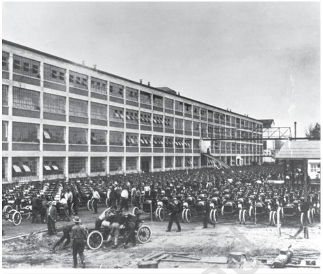

Fig. 21 – T-Model automobiles lined up outside the factory.

credit repaid in weekly or monthly instalments). The demand for refrigerators, washing machines, etc. was also fuelled by a boom in house construction and home ownership, financed once again by loans.

The housing and consumer boom of the 1920s created the basis of prosperity in the US. Large investments in housing and household goods seemed to create a cycle of higher employment and incomes, rising consumption demand, more investment, and yet more employment and incomes.

In 1923, the US resumed exporting capital to the rest of the world and became the largest overseas lender. US imports and capital exports also boosted European recovery and world trade and income growth over the next six years.

All this, however, proved too good to last. By 1929 the world would be plunged into a depression such as it had never experienced before.

#### **3.4 The Great Depression**

The Great Depression began around 1929 and lasted till the mid-1930s. During this period most parts of the world experienced catastrophic declines in production, employment, incomes and trade. The exact timing and impact of the depression varied across countries. But in general, agricultural regions and communities were the worst affected. This was because the fall in agricultural prices was greater and more prolonged than that in the prices of industrial goods.

The depression was caused by a combination of several factors. We have already seen how fragile the post-war world economy was. First: agricultural overproduction remained a problem. This was made worse by falling agricultural prices. As prices slumped and agricultural incomes declined, farmers tried to expand production and bring a larger volume of produce to the market to maintain their overall income. This worsened the glut in the market, pushing down prices even further. Farm produce rotted for a lack of buyers.

Second: in the mid-1920s, many countries financed their investments through loans from the US. While it was often extremely easy to raise loans in the US when the going was good, US overseas lenders panicked at the first sign of trouble. In the first half of 1928, US

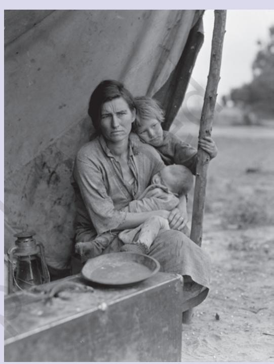

Fig. 22 – Migrant agricultural worker's family, homeless and hungry, during the Great Depression, 1936. Courtesy: Library of Congress, Prints and Photographs Division.

Many y ears later, Dorothea Lange, the photographer who shot this picture, recollected the moment of her encounter with the hungry mother:

'I saw and approached the hungry and desperate mother, as if drawn by a magnet … I did not ask her name or her history. She told me her age, that she was thirty-two. She said that they (i.e., she and her seven children) had been living on frozen vegetables from the surrounding fields, and birds that the children killed … There she sat … with her children huddled around her, and seemed to know that my pictures might help her, and so she helped me …'

From: Popular Photography, February 1960. overseas loans amounted to over $ 1 billion. A year later it was one quarter of that amount. Countries that depended crucially on US loans now faced an acute crisis.

The withdrawal of US loans affected much of the rest of the world, though in different ways. In Europe it led to the failure of some major banks and the collapse of currencies such as the British pound sterling. In Latin America and elsewhere it intensified the slump in agricultural and raw material prices. The US attempt to protect its economy in the depression by doubling import duties also dealt another severe blow to world trade.

The US was also the industrial country most severely affected by the depression. With the fall in prices and the prospect of a depression, US banks had also slashed domestic lending and called back loans. Farms could not sell their harvests, households were ruined, and businesses collapsed. Faced with falling incomes, many households in the US could not repay what they had borrowed, and were forced to give up their homes, cars and other consumer durables. The consumerist prosperity of the 1920s now disappeared in a puff of dust. As unemployment soared, people trudged long distances looking for any work they could find. Ultimately, the US banking system itself collapsed. Unable to recover investments, collect loans and repay depositors, thousands of banks went bankrupt and were forced to close. The numbers are phenomenal: by 1933 over 4,000 banks had closed and between 1929 and 1932 about 110, 000 companies had collapsed.

By 1935, a modest economic recovery was under way in most industrial countries. But the Great Depression's wider effects on society, politics and international relations, and on peoples' minds, proved more enduring.

#### **3.5 India and the Great Depression**

If we look at the impact of the depression on India we realise how integrated the global economy had become by the early twentieth century. The tremors of a crisis in one part of the world were quickly relayed to other parts, affecting lives, economies and societies worldwide.

In the nineteenth century, as you have seen, colonial India had become an exporter of agricultural goods and importer of manufactures. The depression immediately affected Indian trade. India's exports

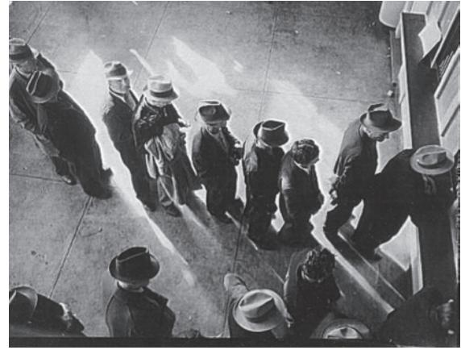

Fig. 23 – People lining up for unemployment benefits, US, photograph by Dorothea Lange, 1938. Courtesy: Library of Congress, Prints and Photographs Division. When an unemployment census showed 10 million people out of work, the local government in many US states began making small allowances to the unemployed. These long queues came to symbolise the poverty and unemployment of the depression years.

and imports nearly halved between 1928 and 1934. As international prices crashed, prices in India also plunged. Between 1928 and 1934, wheat prices in India fell by 50 per cent.

Peasants and farmers suffered more than urban dwellers. Though agricultural prices fell sharply, the colonial government refused to reduce revenue demands. Peasants producing for the world market were the worst hit.

Consider the jute producers of Bengal. They grew raw jute that was processed in factories for export in the form of gunny bags. But as gunny exports collapsed, the price of raw jute crashed more than 60 per cent. Peasants who borrowed in the hope of better times or to increase output in the hope of higher incomes faced ever lower prices, and fell deeper and deeper into debt. Thus the Bengal jute growers' lament:

> grow more jute, brothers, with the hope of greater cash. Costs and debts of jute will make your hopes get dashed. When you have spent all your money and got the crop off the ground, … traders, sitting at home, will pay only Rs 5 a maund.

Across India, peasants' indebtedness increased. They used up their savings, mortgaged lands, and sold whatever jewellery and precious metals they had to meet their expenses. In these depression years, India became an exporter of precious metals, notably gold. The famous economist John Maynard Keynes thought that Indian gold exports promoted global economic recovery. They certainly helped speed up Britain's recovery, but did little for the Indian peasant. Rural India was thus seething with unrest when Mahatma Gandhi launched the civil disobedience movement at the height of the depression in 1931.

The depression proved less grim for urban India. Because of falling prices, those with fixed incomes – say town-dwelling landowners who received rents and middle-class salaried employees – now found themselves better off. Everything cost less. Industrial investment also grew as the government extended tariff protection to industries, under the pressure of nationalist opinion.

# Discuss

Who profits from jute cultivation according to the jute growers' lament? Explain.

# **4 Rebuilding a World Economy: The Post-war Era**

The Second World War broke out a mere two decades after the end of the First World War. It was fought between the Axis powers (mainly Nazi Germany, Japan and Italy) and the Allies (Britain, France, the Soviet Union and the US). It was a war waged for six years on many fronts, in many places, over land, on sea, in the air.

Once again death and destruction was enormous. At least 60 million people, or about 3 per cent of the world's 1939 population, are believed to have been killed, directly or indirectly, as a result of the war. Millions more were injured.

Unlike in earlier wars, most of these deaths took place outside the battlefields. Many more civilians than soldiers died from war-related causes. Vast parts of Europe and Asia were devastated, and several cities were destroyed by aerial bombardment or relentless artillery attacks. The war caused an immense amount of economic devastation and social disruption. Reconstruction promised to be long and difficult.

Two crucial influences shaped post-war reconstruction. The first was the US's emergence as the dominant economic, political and military power in the Western world. The second was the dominance of the Soviet Union. It had made huge sacrifices to defeat Nazi Germany, and transformed itself from a backward agricultural country into a world power during the very years when the capitalist world was trapped in the Great Depression.

#### **4.1 Post-war Settlement and the Bretton Woods Institutions**

Economists and politicians drew two key lessons from inter-war economic experiences. First, an industrial society based on mass production cannot be sustained without mass consumption. But to ensure mass consumption, there was a need for high and stable incomes. Incomes could not be stable if employment was unstable. Thus stable incomes also required steady, full employment.

But markets alone could not guarantee full employment. Therefore governments would have to step in to minimise

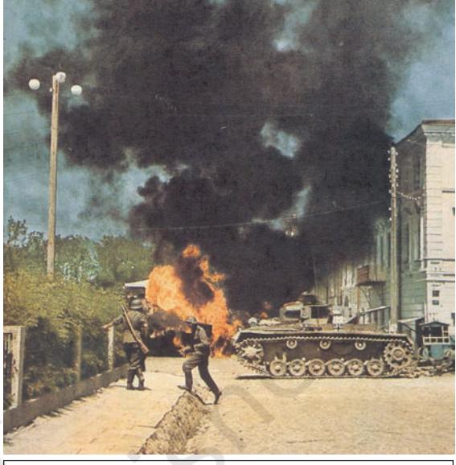

Fig. 24 – German forces attack Russia, July 1941. Hitler's attempt to invade Russia was a turning point in the war.

Fig. 25 – Stalingrad in Soviet Russia devastated by the war.

fluctuations of price, output and employment. Economic stability could be ensured only through the intervention of the government.

The second lesson related to a country's economic links with the outside world. The goal of full employment could only be achieved if governments had power to control flows of goods, capital and labour.

Thus in brief, the main aim of the post-war international economic system was to preserve economic stability and full employment in the industrial world. Its framework was agreed upon at the United Nations Monetary and Financial Conference held in July 1944 at Bretton Woods in New Hampshire, USA.

The Bretton Woods conference established the International Monetary Fund (IMF) to deal with external surpluses and deficits of its member nations. The International Bank for Reconstruction and Development (popularly known as the World Bank) was set up to finance postwar reconstruction. The IMF and the World Bank are referred to as the Bretton Woods institutions or sometimes the Bretton Woods twins. The post-war international economic system is also often described as the Bretton Woods system.

The IMF and the World Bank commenced financial operations in 1947. Decision-making in these institutions is controlled by the Western industrial powers. The US has an effective right of veto over key IMF and World Bank decisions.

The international monetary system is the system linking national currencies and monetary system. The Bretton Woods system was based on fixed exchange rates. In this system, national currencies, for example the Indian rupee, were pegged to the dollar at a fixed exchange rate. The dollar itself was anchored to gold at a fixed price of $35 per ounce of gold.

#### **4.2 The Early Post-war Years**

The Bretton Woods system inaugurated an era of unprecedented growth of trade and incomes for the Western industrial nations and Japan. World trade grew annually at over 8 per cent between 1950 and 1970 and incomes at nearly 5 per cent. The growth was also mostly stable, without large fluctuations. For much of this period the unemployment rate, for example, averaged less than 5 per cent in most industrial countries.

Fig. 26 – Mount Washington Hotel situated in Bretton Woods, US. This is the place where the famous conference was held.

# Discuss

Briefly summarise the two lessons learnt by economists and politicians from the inter-war economic experience?

These decades also saw the worldwide spread of technology and enterprise. Developing countries were in a hurry to catch up with the advanced industrial countries. Therefore, they invested vast amounts of capital, importing industrial plant and equipment featuring modern technology.

#### **4.3 Decolonisation and Independence**

When the Second World War ended, large parts of the world were still under European colonial rule. Over the next two decades most colonies in Asia and Africa emerged as free, independent nations. They were, however, overburdened by poverty and a lack of resources, and their economies and societies were handicapped by long periods of colonial rule.

The IMF and the World Bank were designed to meet the financial needs of the industrial countries. They were not equipped to cope with the challenge of poverty and lack of development in the former colonies. But as Europe and Japan rapidly rebuilt their economies, they grew less dependent on the IMF and the World Bank. Thus from the late 1950s the Bretton Woods institutions began to shift their attention more towards developing countries.

As colonies, many of the less developed regions of the world had been part of Western empires. Now, ironically, as newly independent countries facing urgent pressures to lift their populations out of poverty, they came under the guidance of international agencies dominated by the former colonial powers. Even after many years of decolonisation, the former colonial powers still controlled vital resources such as minerals and land in many of their former colonies.

Large corporations of other powerful countries, for example the US, also often managed to secure rights to exploit developing countries' natural resources very cheaply.

At the same time, most developing countries did not benefit from the fast growth the Western economies experienced in the 1950s and 1960s. Therefore they organised themselves as a group – the Group of 77 (or G-77) – to demand a new international economic order (NIEO). By the NIEO they meant a system that would give them real control over their natural resources, more development assistance, fairer prices for raw materials, and better access for their manufactured goods in developed countries' markets.

#### **Box 4**

#### What are MNCs?

Multinational corporations (MNCs) are large companies that operate in several countries at the same time. The first MNCs were established in the 1920s. Many more came up in the 1950s and 1960s as US businesses expanded worldwide and Western Europe and Japan also recovered to become powerful industrial economies. The worldwide spread of MNCs was a notable feature of the 1950s and 1960s. This was partly because high import tariffs imposed by different governments forced MNCs to locate their manufacturing operations and become 'domestic producers' in as many countries as possible.

#### New words

Tariff – Tax imposed on a country's imports from the rest of the world. Tariffs are levied at the point of entry, i.e., at the border or the airport.

#### **4.4 End of Bretton Woods and the Beginning of 'Globalisation'**

Despite years of stable and rapid growth, not all was well in this post-war world. From the 1960s the rising costs of its overseas involvements weakened the US's finances and competitive strength. The US dollar now no longer commanded confidence as the world's principal currency. It could not maintain its value in relation to gold. This eventually led to the collapse of the system of fixed exchange rates and the introduction of a system of floating exchange rates.

From the mid-1970s the international financial system also changed in important ways. Earlier, developing countries could turn to international institutions for loans and development assistance. But now they were forced to borrow from Western commercial banks and private lending institutions. This led to periodic debt crises in the developing world, and lower incomes and increased poverty, especially in Africa and Latin America.

The industrial world was also hit by unemployment that began rising from the mid-1970s and remained high until the early 1990s. From the late 1970s MNCs also began to shift production operations to low-wage Asian countries.

China had been cut off from the post-war world economy since its revolution in 1949. But new economic policies in China and the collapse of the Soviet Union and Soviet-style communism in Eastern Europe brought many countries back into the fold of the world economy.

Wages were relatively low in countries like China. Thus they became attractive destinations for investment by foreign MNCs competing to capture world markets. Have you noticed that most of the TVs, mobile phones, and toys we see in the shops seem to be made in China? This is because of the low-cost structure of the Chinese economy, most importantly its low wages.

The relocation of industry to low-wage countries stimulated world trade and capital flows. In the last two decades the world's economic geography has been transformed as countries such as India, China and Brazil have undergone rapid economic transformation.

#### New words

Exchange rates – They link national currencies for purposes of international trade. There are broadly two kinds of exchange rates: fixed exchange rate and floating exchange rate Fixed exchange rates – When exchange rates are fixed and governments intervene to prevent movements in them

Flexible or floating exchange rates – These rates fluctuate depending on demand and supply of currencies in foreign exchange markets, in principle without interference by governments

# Write in brief

- 1. Give two examples of different types of global exchanges which took place before the seventeenth century, choosing one example from Asia and one from the Americas.
- 2. Explain how the global transfer of disease in the pre-modern world helped in the colonisation of the Americas.
- 3. Write a note to explain the effects of the following:
	- a) The British government's decision to abolish the Corn Laws.
	- b) The coming of rinderpest to Africa.
	- c) The death of men of working-age in Europe because of the World War.
	- d) The Great Depression on the Indian economy.
	- e) The decision of MNCs to relocate production to Asian countries.
- 4. Give two examples from history to show the impact of technology on food availability.

Write in brief

Discuss

- 5. What is meant by the Bretton Woods Agreement?
# Discuss

- 6. Imagine that you are an indentured Indian labourer in the Caribbean. Drawing from the details in this chapter, write a letter to your family describing your life and feelings.
- 7. Explain the three types of movements or flows within international economic exchange. Find one example of each type of flow which involved India and Indians, and write a short account of it.
- 8. Explain the causes of the Great Depression.
- 9. Explain what is referred to as the G-77 countries. In what ways can G-77 be seen as a reaction to the activities of the Bretton Woods twins?

# Project

Find out more about gold and diamond mining in South Africa in the nineteenth century. Who controlled the gold and diamond companies? Who were the miners and what were their lives like? Project

