# **The Age of Industrialisation**

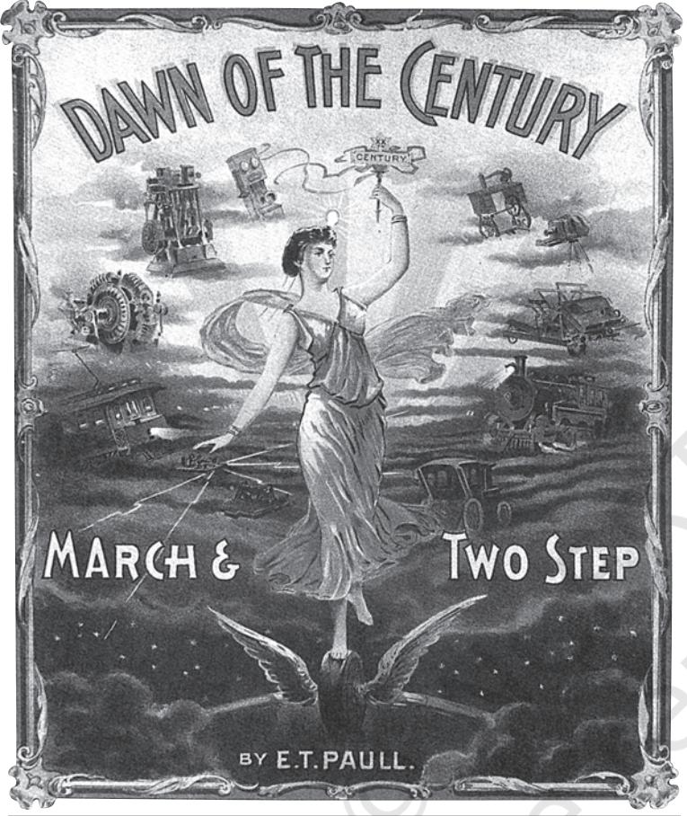

Fig. 1 – Dawn of the Century, published by E.T. Paull Music Co., New York, England, 1900.

The Age of Industrialisation In 1900, a popular music publisher E.T. Paull produced a music book that had a picture on the cover page announcing the 'Dawn of the Century' (Fig. 1). As you can see from the illustration, at the centre of the picture is a goddess-like figure, the angel of progress, bearing the flag of the new century. She is gently perched on a wheel with wings, symbolising time. Her flight is taking her into the future. Floating about, behind her, are the signs of progress: railway, camera, machines, printing press and factory.

This glorification of machines and technology is even more marked in a picture which appeared on the pages of a trade magazine over a hundred years ago (Fig. 2). It shows two magicians. The one at the top is Aladdin from the Orient who built a beautiful palace with his

#### New words

Orient – The countries to the east of the Mediterranean, usually referring to Asia. The term arises out of a western viewpoint that sees this region as premodern, traditional and mysterious

79

magic lamp. The one at the bottom is the modern mechanic, who with his modern tools weaves a new magic: builds bridges, ships, towers and high-rise buildings.Aladdin is shown as representing the East and the past, the mechanic stands for the West and modernity.

These images offer us a triumphant account of the modern world. Within this account the modern world is associated with rapid technological change and innovations, machines and factories, railways and steamships.The history of industrialisation thus becomes simply a story of development, and the modern age appears as a wonderful time of technological progress.

These images and associations have now become part of popular imagination. Do you not see rapid industrialisation as a time of progress and modernity? Do you not think that the spread of railways and factories, and construction of high-rise buildings and bridges is a sign of society's development?

How have these images developed? And how do we relate to these ideas? Is industrialisation always based on rapid technological development? Can we today continue to glorify continuous mechanisation of all work? What has industrialisation meant to people's lives? To answer such questions we need to turn to the history of industrialisation.

In this chapter we will look at this history by focusing first on Britain, the first industrial nation, and then India, where the pattern of industrial change was conditioned by colonial rule.

### Activity

Give two examples where modern development that is associated with progress has led to problems. You may like to think of areas related to environmental issues, nuclear weapons or disease.

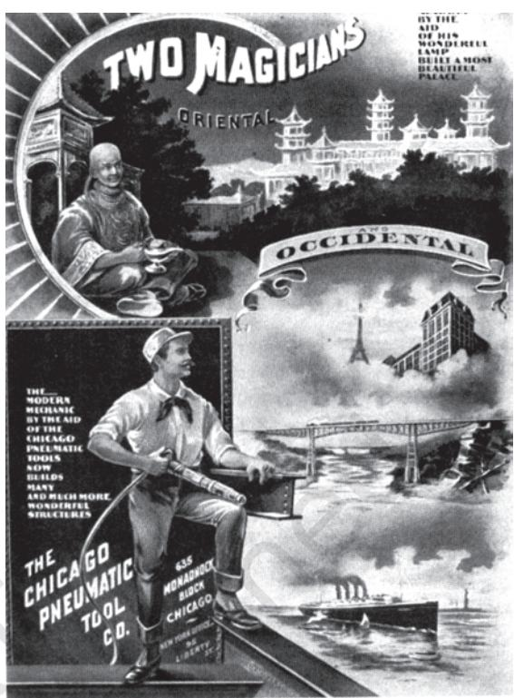

Fig. 2 – Two Magicians, published in Inland Printers, 26 January 1901.

### **1 Before the Industrial Revolution**

All too often we associate industrialisation with the growth of factory industry. When we talk of industrial production we refer to factory production. When we talk of industrial workers we mean factory workers. Histories of industrialisation very often begin with the setting up of the first factories.

There is a problem with such ideas. Even before factories began to dot the landscape in England and Europe, there was large-scale industrial production for an international market. This was not based on factories. Many historians now refer to this phase of industrialisation as proto-industrialisation.

In the seventeenth and eighteenth centuries, merchants from the towns in Europe began moving to the countryside, supplying money to peasants and artisans, persuading them to produce for an international market. With the expansion of world trade and the acquisition of colonies in different parts of the world, the demand for goods began growing. But merchants could not expand production within towns. This was because here urban crafts and trade guilds were powerful. These were associations of producers that trained craftspeople, maintained control over production, regulated competition and prices, and restricted the entry of new people into

the trade. Rulers granted different guilds the monopoly right to produce and trade in specific products. It was therefore difficult for new merchants to set up business in towns. So they turned to the countryside.

In the countryside poor peasants and artisans began working for merchants. As you have seen in the textbook last year, this was a time when open fields were disappearing and commons were being enclosed. Cottagers and poor peasants who had earlier depended on common lands for their survival, gathering their firewood, berries, vegetables, hay and straw, had to now look for alternative sources of income. Many had tiny plots of land which could not provide work for all members of the household. So when merchants came around and offered advances to produce goods for them, peasant households eagerly agreed. By working for the merchants, they

#### New words

Proto – Indicating the first or early form of something

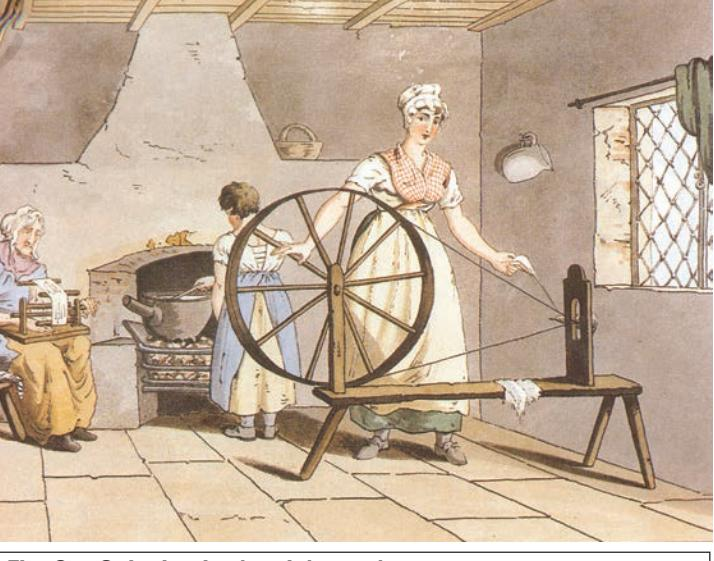

Fig. 3 – Spinning in the eighteenth century. You can see each member of the family involved in the production of yarn. Notice that one wheel is moving only one spindle.

could remain in the countryside and continue to cultivate their small plots. Income from proto-industrial production supplemented their shrinking income from cultivation. It also allowed them a fuller use of their family labour resources.

Within this system a close relationship developed between the town and the countryside. Merchants were based in towns but the work was done mostly in the countryside. A merchant clothier in England purchased wool from a wool stapler, and carried it to the spinners; the yarn (thread) that was spun was taken in subsequent stages of production to weavers, fullers, and then to dyers. The finishing was done in London before the export merchant sold the cloth in the international market. London in fact came to be known as a finishing centre.

This proto-industrial system was thus part of a network of commercial exchanges. It was controlled by merchants and the goods were produced by a vast number of producers working within their family farms, not in factories. At each stage of production 20 to 25 workers were employed by each merchant. This meant that each clothier was controlling hundreds of workers.

#### **1.1 The Coming Up of the Factory**

The earliest factories in England came up by the 1730s. But it was only in the late eighteenth century that the number of factories multiplied.

The first symbol of the new era was cotton. Its production boomed in the late nineteenth century. In 1760 Britain was importing 2.5 million pounds of raw cotton to feed its cotton industry. By 1787 this import soared to 22 million pounds. This increase was linked to a number of changes within the process of production. Let us look briefly at some of these.

A series of inventions in the eighteenth century increased the efficacy of each step of the production process (carding, twisting and spinning, and rolling). They enhanced the output per worker, enabling each worker to produce more, and they made possible the production of stronger threads and yarn. Then Richard Arkwright created the cotton mill. Till this time, as you have seen, cloth production was spread all over the countryside and carried out within village households. But now, the costly new machines could be purchased, set up and maintained in the mill. Within the mill all the

#### New words

Stapler – A person who 'staples' or sorts wool according to its fibre

Fuller – A person who 'fulls' – that is, gathers – cloth by pleating

Carding – The process in which fibres, such as cotton or wool, are prepared prior to spinning

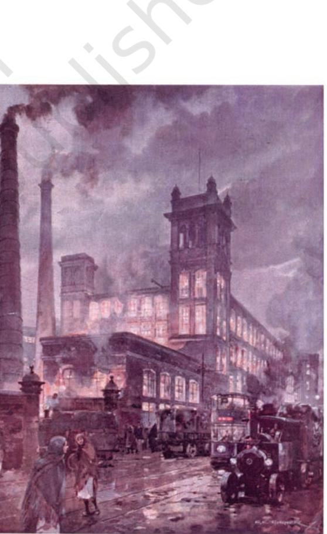

Fig. 4 – A Lancashire cotton mill, painted by C.E. Turner, The Illustrated London News, 1925.

The artist said: 'Seen through the humid atmosphere that makes Lancashire the best cotton-spinning locality in the world, a huge cotton-mill aglow with electricity in the twilight, is a most impressive sight.'

processes were brought together under one roof and management. This allowed a more careful supervision over the production process, a watch over quality, and the regulation of labour, all of which had been difficult to do when production was in the countryside.

In the early nineteenth century, factories increasingly became an intimate part of the English landscape. So visible were the imposing new mills, so magical seemed to be the power of new technology, that contemporaries were dazzled. They concentrated their attention on the mills, almost forgetting the bylanes and the workshops where production still continued.

### Activity

The way in which historians focus on industrialisation rather than on small workshops is a good example of how what we believe today about the past is influenced by what historians choose to notice and what they ignore. Note down one event or aspect of your own life which adults such as your parents or teachers may think is unimportant, but which you believe to be important.

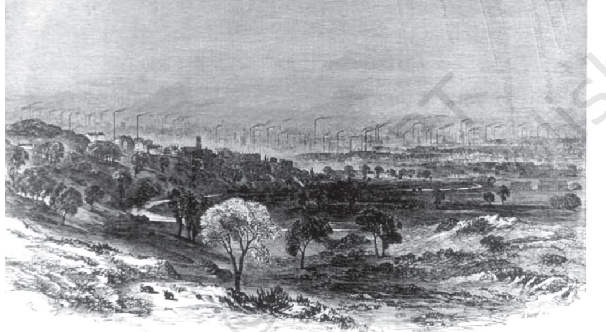

Fig. 5 – Industrial Manchester by M. Jackson, The Illustrated London News, 1857. Chimneys billowing smoke came to characterise the industrial landscape.

### **1.2 The Pace of Industrial Change**

How rapid was the process of industrialisation? Does industrialisation mean only the growth of factory industries?

First: The most dynamic industries in Britain were clearly cotton and metals. Growing at a rapid pace, cotton was the leading sector in the first phase of industrialisation up to the 1840s. After that the iron and steel industry led the way. With the expansion of railways, in England from the 1840s and in the colonies from the 1860s, the demand for iron and steel increased rapidly. By 1873 Britain was exporting iron and steel worth about £ 77 million, double the value of its cotton export.

### Activity

Look at Figs. 4 and 5. Can you see any difference in the way the two images show industrialisation? Explain your view briefly.

Second: the new industries could not easily displace traditional industries. Even at the end of the nineteenth century, less than 20 per cent of the total workforce was employed in technologically advanced industrial sectors. Textiles was a dynamic sector, but a large portion of the output was produced not within factories, but outside, within domestic units.

Third: the pace of change in the 'traditional' industries was not set by steam-powered cotton or metal industries, but they did not remain entirely stagnant either. Seemingly ordinary and small innovations were the basis of growth in many non-mechanised sectors such as food processing, building, pottery, glass work, tanning, furniture making, and production of implements.

Fourth: technological changes occurred slowly. They did not spread dramatically across the industrial landscape. New technology was expensive and merchants and industrialists were cautious about using it. The machines often broke down and repair was costly. They were not as effective as their inventors and manufacturers claimed.

Consider the case of the steam engine. James Watt improved the steam engine produced by Newcomen and patented the new engine in 1781. His industrialist friend Mathew Boulton manufactured the new model. But for years he could find no buyers. At the beginning of the nineteenth century, there were no more than 321 steam engines

all over England. Of these, 80 were in cotton industries, nine in wool industries, and the rest in mining, canal works and iron works. Steam engines were not used in any of the other industries till much later in the century. So even the most powerful new technology that enhanced the productivity of labour manifold was slow to be accepted by industrialists.

Historians now have come to increasingly recognise that the typical worker in the mid-nineteenth century was not a machine operator but the traditional craftsperson and labourer.

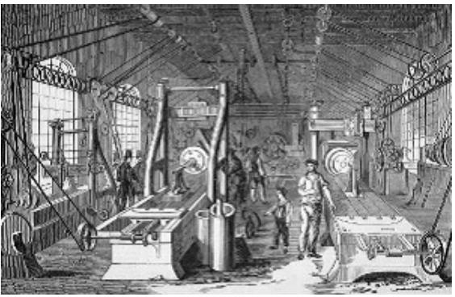

Fig. 6 – A fitting shop at a railway works in England, The Illustrated London News, 1849. In the fitting shop new locomotive engines were completed and old ones repaired.

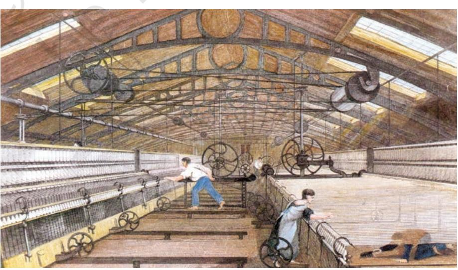

Fig. 7 – A spinning factory in 1830. You can see how giant wheels moved by steam power could set in motion hundreds of spindles to manufacture thread.

### **2 Hand Labour and Steam Power**

In Victorian Britain there was no shortage of human labour. Poor peasants and vagrants moved to the cities in large numbers in search of jobs, waiting for work.As you will know, when there is plenty of labour, wages are low. So industrialists had no problem of labour shortage or high wage costs. They did not want to introduce machines that got rid of human labour and required large capital investment.

In many industries the demand for labour was seasonal. Gas works and breweries were especially busy through the cold months. So they needed more workers to meet their peak demand. Bookbinders and printers, catering to Christmas demand, too needed extra hands before December. At the waterfront, winter was the time that ships were repaired and spruced up. In all such industries where production fluctuated with the season, industrialists usually preferred hand labour, employing workers for the season.

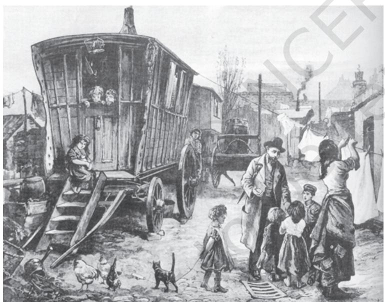

Fig. 8 – People on the move in search of work, The Illustrated London News, 1879. Some people were always on the move selling small goods and looking for temporary work.

A range of products could be produced only with hand labour. Machines were oriented to producing uniforms, standardised goods for a mass market. But the demand in the market was often for goods with intricate designs and specific shapes. In mid-nineteenth-century Britain, for instance, 500 varieties of

#### **Source A**

Will Thorne is one of those who went in search of seasonal work, loading bricks and doing odd jobs. He describes how job-seekers walked to London in search of work:

'I had always wanted to go to London, and my desire … was stimulated by letters from an old workmate … who was now working at the Old Kent Road Gas Works … I finally decided to go … in November, 1881. With two friends I started out to walk the journey, filled with the hope that we would be able to obtain employment, when we get there, with the kind assistance of my friend … we had little money when we started, not enough to pay for our food and lodgings each night until we arrived in London. Some days we walked as much as twenty miles, and other days less. Our money was gone at the end of the third day … For two nights we slept out – once under a haystack, and once in an old farm shed … On arrival in London we tried to find … my friend … but … were unsuccessful. Our money was gone, so there was nothing for us to do but to walk around until late at night, and then try to find some place to sleep. We found an old building and slept in it that night. The next day, Sunday, late in the afternoon, we got to the Old Kent Gas Works, and applied for work. To my great surprise, the man we had been looking for was working at the time. He spoke to the foreman and I was given a job.'

Quoted in Raphael Samuel, 'Comers and Goers', in H.J. Dyos and Michael Wolff, eds, The VictorianCity: Images and Realities, 1973.

### Activity

Imagine that you are a merchant writing back to a salesman who has been trying to persuade you to buy a new machine. Explain in your letter what you have heard and why you do not wish to invest in the new technology.

hammers were produced and 45 kinds of axes. These required human skill, not mechanical technology.

In Victorian Britain, the upper classes – the aristocrats and the bourgeoisie – preferred things produced by hand. Handmade products came to symbolise refinement and class. They were better finished, individually produced, and carefully designed. Machinemade goods were for export to the colonies.

In countries with labour shortage, industrialists were keen on using mechanical power so that the need for human labour can be minimised. This was the case in nineteenth-century America. Britain, however, had no problem hiring human hands.

#### **2.1 Life of the Workers**

The abundance of labour in the market affected the lives of workers. As news of possible jobs travelled to the countryside, hundreds tramped to the cities. The actual possibility of getting a job depended on existing networks of friendship and kin relations. If you had a relative or a friend in a factory, you were more likely to get a job quickly. But not everyone had social connections. Many jobseekers had to wait weeks, spending nights under bridges or in night

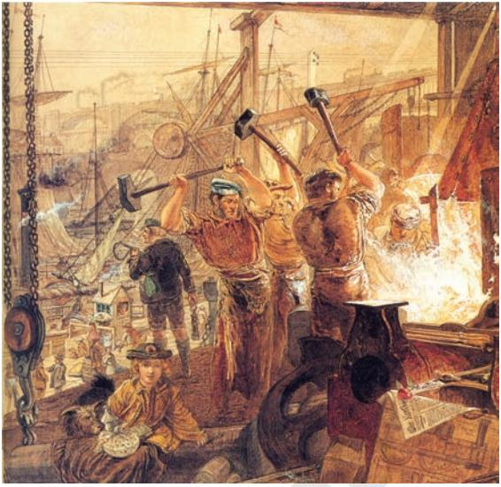

Fig. 9 – Workers in an iron works, north-east England, painting by William Bell Scott, 1861. Many artists from the late nineteenth century began idealising workers: they were shown suffering hardship and pain for the cause of the nation.

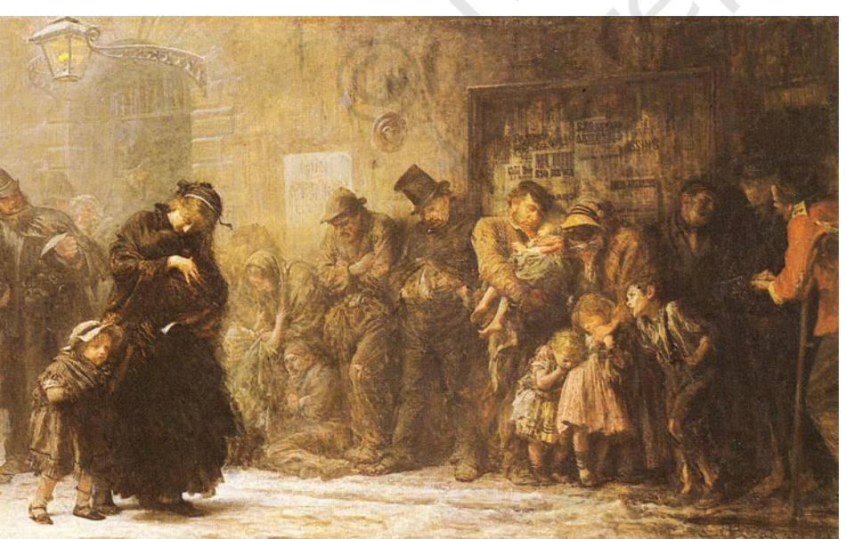

Fig. 10 – Houseless and Hungry, painting by Samuel Luke Fildes, 1874. This painting shows the homeless in London applying for tickets to stay overnight in a workhouse. These shelters were maintained under the supervision of the Poor Law Commissioners for the 'destitute, wayfarers, wanderers and foundling'. Staying in these workhouses was a humiliating experience: everyone was subjected to a medical examination to see whether they were carrying disease, their bodies were cleansed, and their clothes purified. They had to also do hard labour.

shelters. Some stayed in Night Refuges that were set up by private individuals; others went to the Casual Wards maintained by the Poor Law authorities.

Seasonality of work in many industries meant prolonged periods without work. After the busy season was over, the poor were on the streets again. Some returned to the countryside after the winter, when the demand for labour in the rural areas opened up in places. But most looked for odd jobs, which till the mid-nineteenth century were difficult to find.

Wages increased somewhat in the early nineteenth century. But they tell us little about the welfare of the workers. The average figures hide the variations between trades and the fluctuations from year to year. For instance, when prices rose sharply during the prolonged Napoleonic War, the real value of what the workers earned fell significantly, since the same wages could now buy fewer things. Moreover, the income of workers depended not on the wage rate alone. What was also critical was the period of employment: the number of days of work determined the average daily income of the workers. At the best of times till the mid-nineteenth century, about 10 per cent of the urban population were extremely poor. In periods of economic slump, like the 1830s, the proportion of unemployed went up to anything between 35 and 75 per cent in different regions.

The fear of unemployment made workers hostile to the introduction of new technology. When the Spinning Jenny was introduced in

#### **Source B**

A magistrate reported in 1790 about an incident when he was called in to protect a manufacturer's property from being attacked by workers:

'From the depredations of a lawless Banditti of colliers and their wives, for the wives had lost their work to spinning engines … they advanced at first with much insolence, avowing their intention of cutting to pieces the machine lately introduced in the woollen manufacture; which they suppose, if generally adopted, will lessen the demand for manual labour. The women became clamorous. The men were more open to conviction and after some expostulation were induced to desist from their purpose and return peaceably home.'

J.L. Hammond and B. Hammond, The Skilled Labourer 1760-1832, quoted in Maxine Berg, The Age of Manufactures.

**Source**

2024-25

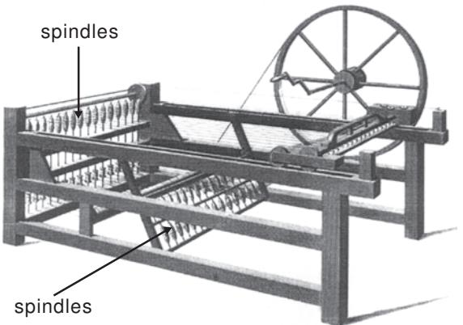

Fig. 11 – A Spinning Jenny, a drawing by T.E. Nicholson, 1835. Notice the number of spindles that could be operated with one wheel.

#### New words

Spinning Jenny – Devised by James Hargreaves in 1764, this machine speeded up the spinning process and reduced labour demand. By turning one single wheel a worker could set in motion a number of spindles and spin several threads at the same time.

### Discuss

Look at Figs. 3, 7 and 11, then reread source B. Explain why many workers were opposed to the use of the Spinning Jenny.

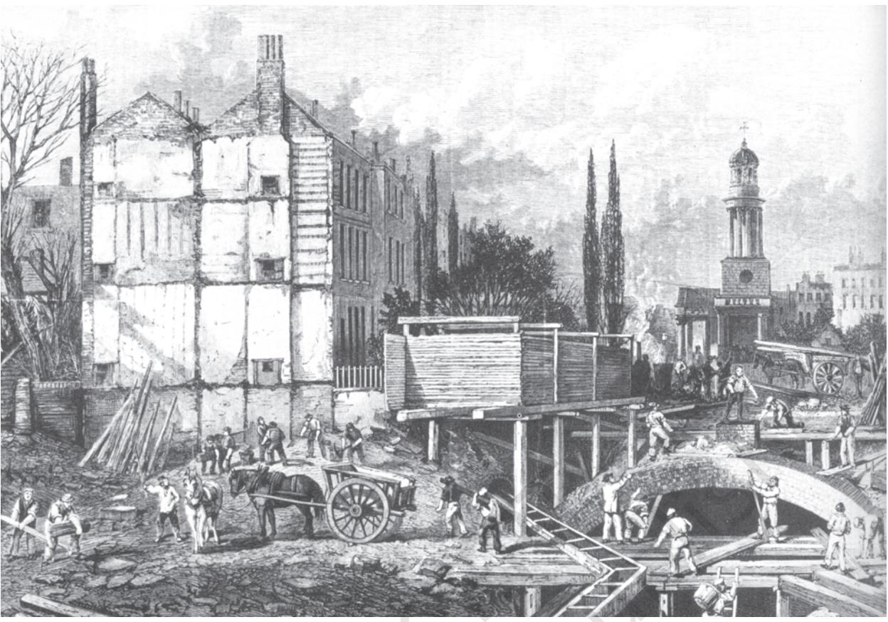

Fig. 12 – A shallow underground railway being constructed in central London, Illustrated Times, 1868. From the 1850s railway stations began coming up all over London. This meant a demand for large numbers of workers to dig tunnels, erect timber scaffolding, do the brick and iron works. Job-seekers moved from one construction site to another.

the woollen industry, women who survived on hand spinning began attacking the new machines. This conflict over the introduction of the jenny continued for a long time.

After the 1840s, building activity intensified in the cities, opening up greater opportunities of employment. Roads were widened, new railway stations came up, railway lines were extended, tunnels dug, drainage and sewers laid, rivers embanked. The number of workers employed in the transport industry doubled in the 1840s, and doubled again in the subsequent 30 years.

### **3 Industrialisation in the Colonies**

Let us now move to India to see how a colony industrialises. Once again we will look not only at factory industries but also at the non-mechanised sector. We will limit our discussion primarily to textile industries.

#### **3.1 The Age of Indian Textiles**

Before the age of machine industries, silk and cotton goods from India dominated the international market in textiles. Coarser cottons were produced in many countries, but the finer varieties often came from India.Armenian and Persian merchants took the goods from Punjab to Afghanistan, eastern Persia and Central Asia. Bales of fine textiles were carried on camel back via the north-west frontier, through mountain passes and across deserts. A vibrant sea trade operated through the main pre-colonial ports. Surat on the Gujarat coast connected India to the Gulf and Red Sea Ports; Masulipatam on the Coromandel coast and Hoogly in Bengal had trade links with Southeast Asian ports.

A variety of Indian merchants and bankers were involved in this network of export trade – financing production, carrying goods and supplying exporters. Supply merchants linked the port towns to the inland regions. They gave advances to weavers, procured the woven cloth from weaving villages, and carried the supply to the ports. At the port, the big shippers and export merchants had brokers who negotiated the price and bought goods from the supply merchants operating inland.

By the 1750s this network, controlled by Indian merchants, was breaking down.

The European companies gradually gained power – first securing a variety of concessions from local courts, then the monopoly rights to trade. This resulted in a decline of the old ports of Surat and Hoogly through which local merchants had operated. Exports from these ports fell dramatically, the credit that had financed the earlier trade began drying up, and the local bankers slowly went bankrupt. In the last years of the seventeenth century, the gross value of trade that passed through Surat had been Rs 16 million. By the 1740s it had slumped to Rs 3 million.

### Activity

On a map of Asia, find and draw the sea and land links of the textile trade from India to Central Asia, West Asia and Southeast Asia.

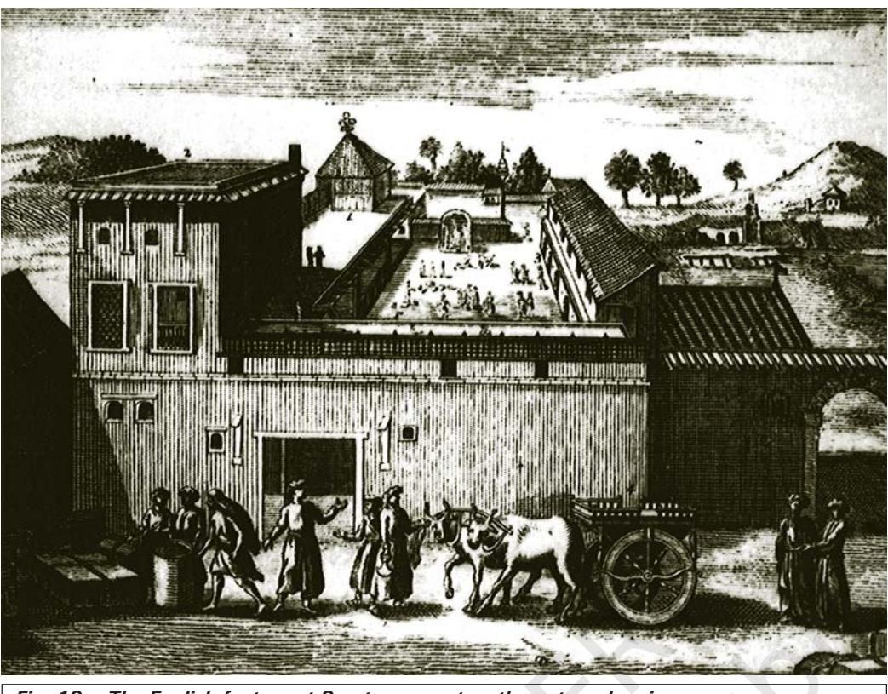

Fig. 13 – The English factory at Surat, a seventeenth-century drawing.

While Surat and Hoogly decayed, Bombay and Calcutta grew. This shift from the old ports to the new ones was an indicator of the growth of colonial power. Trade through the new ports came to be controlled by European companies, and was carried in European ships. While many of the old trading houses collapsed, those that wanted to survive had to now operate within a network shaped by European trading companies.

How did these changes affect the life of weavers and other artisans?

#### **3.2 What Happened to Weavers?**

The consolidation of East India Company power after the 1760s did not initially lead to a decline in textile exports from India. British cotton industries had not yet expanded and Indian fine textiles were in great demand in Europe. So the company was keen on expanding textile exports from India.

Before establishing political power in Bengal and Carnatic in the 1760s and 1770s, the East India Company had found it difficult to ensure a regular supply of goods for export. The French, Dutch,

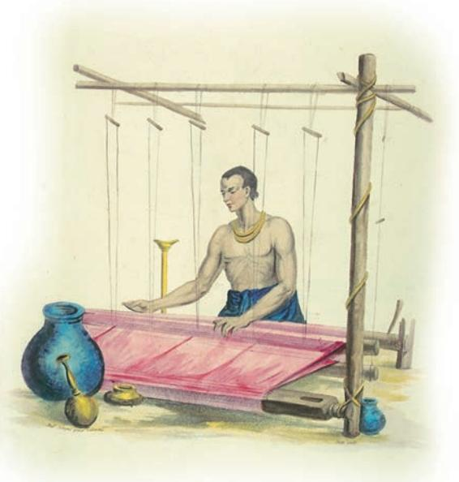

Fig. 14 – A weaver at work, Gujarat.

Portuguese as well as the local traders competed in the market to secure woven cloth. So the weaver and supply merchants could bargain and try selling the produce to the best buyer. In their letters back to London, Company officials continuously complained of difficulties of supply and the high prices.

However, once the East India Company established political power, it could assert a monopoly right to trade. It proceeded to develop a system of management and control that would eliminate competition, control costs, and ensure regular supplies of cotton and silk goods. This it did through a series of steps.

First: the Company tried to eliminate the existing traders and brokers connected with the cloth trade, and establish a more direct control over the weaver. It appointed a paid servant called the gomastha to supervise weavers, collect supplies, and examine the quality of cloth.

Second: it prevented Company weavers from dealing with other buyers. One way of doing this was through the system of advances. Once an order was placed, the weavers were given loans to purchase the raw material for their production. Those who took loans had to hand over the cloth they produced to the gomastha. They could not take it to any other trader.

As loans flowed in and the demand for fine textiles expanded, weavers eagerly took the advances, hoping to earn more. Many weavers had small plots of land which they had earlier cultivated along with weaving, and the produce from this took care of their family needs. Now they had to lease out the land and devote all their time to weaving. Weaving, in fact, required the labour of the entire family, with children and women all engaged in different stages of the process.

Soon, however, in many weaving villages there were reports of clashes between weavers and gomasthas. Earlier supply merchants had very often lived within the weaving villages, and had a close relationship with the weavers, looking after their needs and helping them in times of crisis. The new gomasthas were outsiders, with no long-term social link with the village. They acted arrogantly, marched into villages with sepoys and peons, and punished weavers for delays in supply – often beating and flogging them. The weavers lost the space to bargain for prices and sell to different buyers: the price they received from the Company was miserably low and the loans they had accepted tied them to the Company.

#### New words

Sepoy – This is how the British pronounced the word sipahi, meaning an Indian soldier in the service of the British

In many places in Carnatic and Bengal, weavers deserted villages and migrated, setting up looms in other villages where they had some family relation. Elsewhere, weavers along with the village traders revolted, opposing the Company and its officials. Over time many weavers began refusing loans, closing down their workshops and taking to agricultural labour.

By the turn of the nineteenth century, cotton weavers faced a new set of problems.

#### **3.3 Manchester Comes to India**

In 1772, Henry Patullo, a Company official, had ventured to say that the demand for Indian textiles could never reduce, since no other nation produced goods of the same quality. Yet by the beginning of the nineteenth century we see the beginning of a long decline of textile exports from India. In 1811-12 piece-goods accounted for 33 per cent of India's exports; by 1850-51 it was no more than 3 per cent.

Why did this happen? What were its implications?

As cotton industries developed in England, industrial groups began worrying about imports from other countries. They pressurised the government to impose import duties on cotton textiles so that Manchester goods could sell in Britain without facing any competition from outside. At the same time industrialists persuaded the East India Company to sell British manufactures in Indian markets as well. Exports of British cotton goods increased dramatically in the early nineteenth century. At the end of the eighteenth century there had been virtually no import of cotton piece-goods into India. But by 1850 cotton piece-goods constituted over 31 per cent of the value of Indian imports; and by the 1870s this figure was over 50 per cent.

Cotton weavers in India thus faced two problems at the same time: their export market collapsed, and the local market shrank, being glutted with Manchester imports. Produced by machines at lower costs, the imported cotton goods were so cheap that weavers could not easily compete with them. By the 1850s, reports from most weaving regions of India narrated stories of decline and desolation.

By the 1860s, weavers faced a new problem. They could not get sufficient supply of raw cotton of good quality. When the American

#### **Source C**

The Commissioner of Patna wrote:

'It appears that twenty yeas ago, a brisk trade was carried on in the manufacture of cloth at Jahanabad, and Behar, which has in the former place entirely ceased, while in the latter the amount of manufacture is very limited, in consequence of the cheap and durable goods from Manchester with which the Native manufactures are unable to compete.'

Quoted in J. Krishnamurty, 'Deindustrialisation in Gangetic Bihar during the nineteenth century', The Indian Economic and Social History Review, 1985.

**Source**

#### **Source D**

Reporting on the Koshtis, a community of weavers, the Census Report of Central Provinces stated:

'The Koshtis, like the weavers of the finer kinds of cloth in other parts of India, have fallen upon evil times. They are unable to compete with the showy goods which Manchester sends in such profusion, and they have of late years emigrated in great numbers, chiefly to Berar, where as day labourers they are able to obtain wages …'

Census Report of Central Provinces, 1872, quoted in Sumit Guha, 'The handloom industry in Central India, 1825-1950', The Indian Economic and Social History Review.

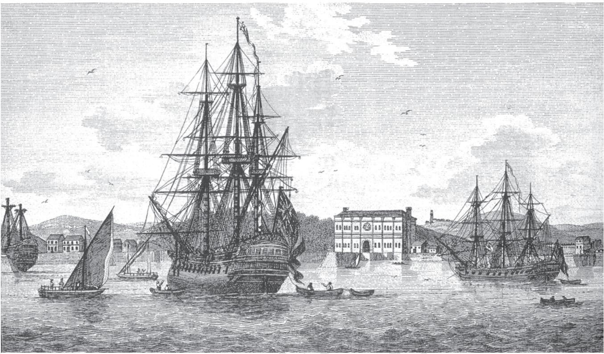

Fig. 15 – Bombay harbour, a late-eighteenth-century drawing. Bombay and Calcutta grew as trading ports from the 1780s. This marked the decline of the old trading order and the growth of the colonial economy.

Civil War broke out and cotton supplies from the US were cut off, Britain turned to India. As raw cotton exports from India increased, the price of raw cotton shot up. Weavers in India were starved of supplies and forced to buy raw cotton at exorbitant prices. In this, situation weaving could not pay.

Then, by the end of the nineteenth century, weavers and other craftspeople faced yet another problem. Factories in India began production, flooding the market with machine-goods. How could weaving industries possibly survive?

### **4 Factories Come Up**

The first cotton mill in Bombay came up in 1854 and it went into production two years later. By 1862 four mills were at work with 94,000 spindles and 2,150 looms. Around the same time jute mills came up in Bengal, the first being set up in 1855 and another one seven years later, in 1862. In north India, the Elgin Mill was started in Kanpur in the 1860s, and a year later the first cotton mill of Ahmedabad was set up. By 1874, the first spinning and weaving mill of Madras began production.

Who set up the industries? Where did the capital come from? Who came to work in the mills?

#### **4.1 The Early Entrepreneurs**

Industries were set up in different regions by varying sorts of people. Let us see who they were.

The history of many business groups goes back to trade with China. From the late eighteenth century, as you have read in your book last year, the British in India began exporting opium to China and took tea from China to England. Many Indians became junior players in this trade, providing finance, procuring supplies, and shipping consignments. Having earned through trade, some of these businessmen had visions of developing industrial enterprises in India. In Bengal, Dwarkanath Tagore made his fortune in the China trade before he turned to industrial investment, setting up six joint-stock companies in the 1830s and 1840s. Tagore's enterprises sank along with those of others in the wider business crises of the 1840s, but later in the nineteenth century many of the China traders became successful industrialists. In Bombay, Parsis like Dinshaw Petit and Jamsetjee Nusserwanjee Tata who built huge industrial empires in India, accumulated their initial wealth partly from exports to China, and partly from raw cotton shipments to England. Seth Hukumchand, a Marwari businessman who set up the first Indian jute mill in Calcutta in 1917, also traded with China. So did the father as well as grandfather of the famous industrialist G.D. Birla.

Capital was accumulated through other trade networks. Some merchants from Madras traded with Burma while others had links with the Middle East and East Africa. There were yet other

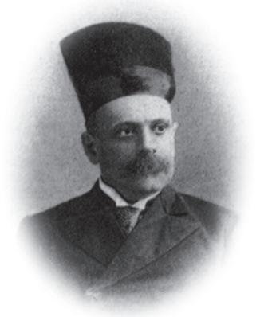

Fig. 16 – Jamsetjee Jeejeebhoy. Jeejeebhoy was the son of a Parsi weaver. Like many others of his time, he was involved in the China trade and shipping. He owned a large fleet of ships, but competition from English and American shippers forced him to sell his ships by the 1850s.

Fig. 17 – Dwarkanath Tagore. Dwarkanath Tagore believed that India would develop through westernisation and industrialisation. He invested in shipping, shipbuilding, mining, banking, plantations and insurance.

commercial groups, but they were not directly involved in external trade. They operated within India, carrying goods from one place to another, banking money, transferring funds between cities, and financing traders. When opportunities of investment in industries opened up, many of them set up factories.

As colonial control over Indian trade tightened, the space within which Indian merchants could function became increasingly limited. They were barred from trading with Europe in manufactured goods, and had to export mostly raw materials and food grains – raw cotton, opium, wheat and indigo – required by the British. They were also gradually edged out of the shipping business.

Till the First World War, European Managing Agencies in fact controlled a large sector of Indian industries. Three of the biggest ones were Bird Heiglers & Co., Andrew Yule, and Jardine Skinner & Co. These Agencies mobilised capital, set up joint-stock companies and managed them. In most instances Indian financiers provided the capital while the European Agencies made all investment and business decisions. The European merchant-industrialists had their own chambers of commerce which Indian businessmen were not allowed to join.

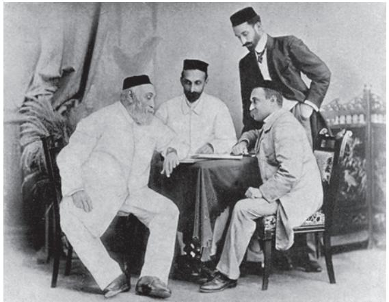

Fig. 18 – Partners in enterprise – J.N. Tata, R.D. Tata, Sir R.J. Tata, and Sir D.J. Tata. In 1912, J.N. Tata set up the first iron and steel works in India at Jamshedpur. Iron and steel industries in India started much later than textiles. In colonial India industrial machinery, railways and locomotives were mostly imported. So capital goods industries could not really develop in any significant way till Independence.

#### **4.2 Where Did the Workers Come From?**

Factories needed workers. With the expansion of factories, this demand increased. In 1901, there were 584,000 workers in Indian factories. By 1946 the number was over 2,436, 000. Where did the workers come from?

 In most industrial regions workers came from the districts around. Peasants and artisans who found no work in the village went to the industrial centres in search of work. Over 50 per cent workers in the Bombay cotton industries in 1911 came from the neighbouring district of Ratnagiri, while the mills of Kanpur got most of their textile hands from the villages within the district of Kanpur. Most often millworkers moved between the village and the city, returning to their village homes during harvests and festivals.

Over time, as news of employment spread, workers travelled great distances in the hope of work in the mills. From the United Provinces, for instance, they went to work in the textile mills of Bombay and in the jute mills of Calcutta.

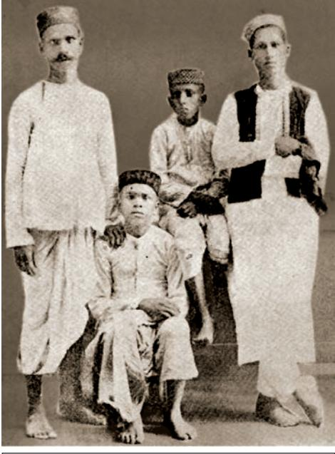

Fig. 19 – Young workers of a Bombay mill, early twentieth century. When workers went back to their village homes, they liked dressing up.

Getting jobs was always difficult, even when mills multiplied and the demand for workers increased. The numbers seeking work were always more than the jobs available. Entry into the mills was also restricted. Industrialists usually employed a jobber to get new recruits. Very often the jobber was an old and trusted worker. He got people from his village, ensured them jobs, helped them settle in the city and provided them money in times of crisis. The jobber therefore became a person with some authority and power. He began demanding money and gifts for his favour and controlling the lives of workers.

The number of factory workers increased over time. However, as you will see, they were a small proportion of the total industrial workforce.

#### **Source E**

Vasant Parkar, who was once a millworker in Bombay, said:

'The workers would pay the jobbers money to get their sons work in the mill … The mill worker was closely associated with his village, physically and emotionally. He would go home to cut the harvest and for sowing. The Konkani would go home to cut the paddy and the Ghati, the sugarcane. It was an accepted practice for which the mills granted leave.'

Meena Menon and Neera Adarkar, One Hundred Years: One HundredVoices, 2004. **Source**

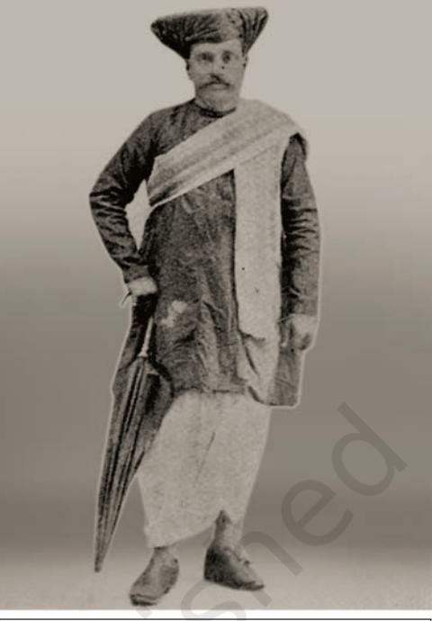

Fig. 20 – A head jobber. Notice how the posture and clothes emphasise the jobber's position of authority.

Fig. 21 – Spinners at work in an Ahmedabad mill. Women worked mostly in the spinning departments.

#### **Source F**

Bhai Bhosle, a trade unionist of Bombay, recollected his childhood in the 1930s and 1940s:

'In those days, the shift was 10 hours – from 5 pm to 3 am – terrible working hours. My father worked for 35 years; he got the asthma like disease and could not work any more…Then my father went back to village.'

Meena Menon and Neera Adarkar, One Hundred Years: One Hundred Voices.

### **5 The Peculiarities of Industrial Growth**

European Managing Agencies, which dominated industrial production in India, were interested in certain kinds of products. They established tea and coffee plantations, acquiring land at cheap rates from the colonial government; and they invested in mining, indigo and jute. Most of these were products required primarily for export trade and not for sale in India.

When Indian businessmen began setting up industries in the late nineteenth century, they avoided competing with Manchester goods in the Indian market. Since yarn was not an important part of British imports into India, the early cotton mills in India produced coarse cotton yarn (thread) rather than fabric. When yarn was imported it was only of the superior variety. The yarn produced in Indian spinning mills was used by handloom weavers in India or exported to China.

By the first decade of the twentieth century a series of changes affected the pattern of industrialisation. As the swadeshi movement gathered momentum, nationalists mobilised people to boycott foreign cloth. Industrial groups organised themselves to protect their collective interests, pressurising the government to increase tariff protection and grant other concessions. From 1906, moreover, the export of Indian yarn to China declined since produce from Chinese and

Japanese mills flooded the Chinese market. So industrialists in India began shifting from yarn to cloth production. Cotton piecegoods production in India doubled between 1900 and 1912.

Yet, till the First World War, industrial growth was slow. The war created a dramatically new situation. With British mills busy with war production to meet the needs of the army, Manchester imports into India declined. Suddenly, Indian mills had a vast home market to supply. As the war prolonged, Indian factories were called upon to supply war needs: jute bags, cloth for army uniforms, tents and leather boots, horse and mule saddles and a host of other items. New factories were set up and old

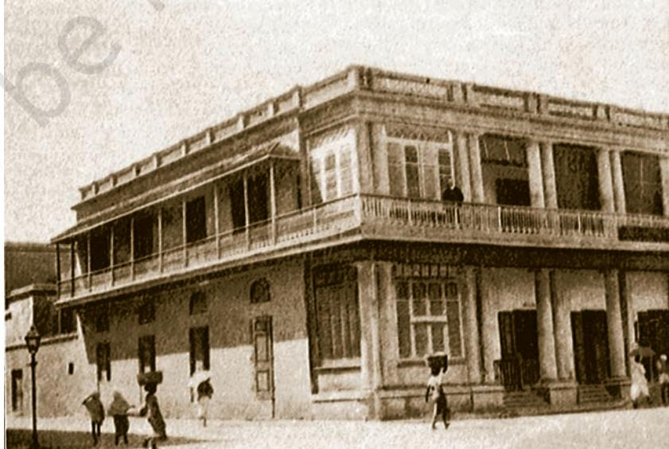

Fig. 22 – The first office of the Madras Chamber of Commerce. By the late nineteenth century merchants in different regions began meeting and forming Chambers of Commerce to regulate business and decide on issues of collective concern.

ones ran multiple shifts. Many new workers were employed and everyone was made to work longer hours. Over the war years industrial production boomed.

After the war, Manchester could never recapture its old position in the Indian market. Unable to modernise and compete with the US, Germany and Japan, the economy of Britain crumbled after the war. Cotton production collapsed and exports of cotton cloth from Britain fell dramatically. Within the colonies, local industrialists gradually consolidated their position, substituting foreign manufactures and capturing the home market.

#### **5.1 Small-scale Industries Predominate**

While factory industries grew steadily after the war, large industries formed only a small segment of the economy. Most of them – about 67 per cent in 1911 – were located in Bengal and Bombay. Over the rest of the country, small-scale production continued to predominate. Only a small proportion of the total industrial labour force worked in registered factories: 5 per cent in 1911 and 10 per cent in 1931. The rest worked in small workshops and household units, often located in alleys and bylanes, invisible to the passer-by.

In fact, in some instances, handicrafts production actually expanded in the twentieth century. This is true even in the case of the handloom sector that we have discussed. While cheap machine-made thread wiped out the spinning industry in the nineteenth century, the weavers survived, despite problems. In the twentieth century, handloom cloth production expanded steadily: almost trebling between 1900 and 1940.

Fig. 23 – A Hand-woven Cloth. The intricate designs of hand-woven cloth could not be easily copied by the mills.

#### How did this happen?

This was partly because of technological changes. Handicrafts people adopt new technology if that helps them improve production without excessively pushing up costs. So, by the second decade of the twentieth century we find weavers using looms with a fly shuttle. This increased productivity per worker, speeded up production and reduced labour demand. By 1941, over 35 per cent of handlooms in India were fitted with fly shuttles: in regions like Travancore, Madras, Mysore, Cochin, Bengal the proportion was 70 to 80 per cent. There were several other small innovations that helped weavers improve their productivity and compete with the mill sector.

#### New words

Fly shuttle – It is a mechanical device used for weaving, moved by means of ropes and pullies. It places the horizontal threads ( called the weft) into the verticle threads (called the warp). The invention of the fly shuttle made it possible for weavers to operate large looms and weave wide pieces of cloth.

Certain groups of weavers were in a better position than others to survive the competition with mill industries. Amongst weavers some produced coarse cloth while others wove finer varieties. The coarser cloth was bought by the poor and its demand fluctuated violently. In times of bad harvests and famines, when the rural poor had little to eat, and their cash income disappeared, they could not possibly buy cloth. The demand for the finer varieties bought by the well-to-do was more stable. The rich could buy these even when the poor starved. Famines did not affect the sale of Banarasi or Baluchari saris. Moreover, as you have seen, mills could not imitate specialised weaves. Saris with woven borders, or the famous lungis and handkerchiefs of Madras, could not be easily displaced by mill production.

Weavers and other craftspeople who continued to expand production through the twentieth century, did not necessarily prosper. They lived hard lives and worked long hours. Very often the entire household – including all the women and children – had to work at various stages of the production process. But they were not simply remnants of past times in the age of factories. Their life and labour was integral to the process of industrialisation.

Fig. 24 – Location of large-scale industries in India, 1931. The circles indicate the size of industries in the different regions.

### **6 Market for Goods**

We have seen how British manufacturers attempted to take over the Indian market, and how Indian weavers and craftsmen, traders and industrialists resisted colonial controls, demanded tariff protection, created their own spaces, and tried to extend the market for their produce.

But when new products are produced people have to be persuaded to buy them. They have to feel like using the product. How was this done?

One way in which new consumers are created is through advertisements. As you know, advertisements make products appear desirable and necessary. They try to shape the minds of people and create new needs. Today we live in a world where advertisements surround us. They appear in newspapers, magazines, hoardings, street walls, television screens. But if we look back into history we find that from the very beginning of the industrial age, advertisements have played a part in expanding the markets for products, and in shaping a new consumer culture.

When Manchester industrialists began selling cloth in India, they put labels on the cloth bundles. The label was needed to make the place of manufacture and the name of the company familiar to the buyer. The label was also to be a mark of quality. When buyers saw 'MADE IN MANCHESTER' written in bold on the label, they were expected to feel confident about buying the cloth.

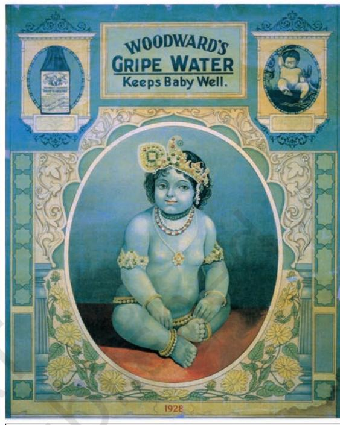

Fig. 25 – Gripe Water calendar of 1928 by M.V. Dhurandhar. The image of baby Krishna was most commonly used to popularise baby products.

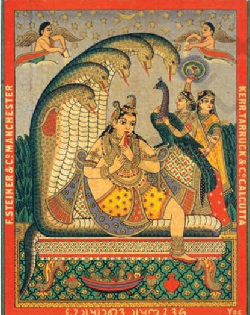

100

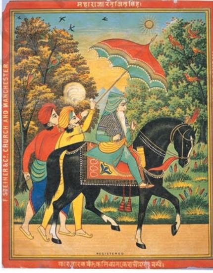

Fig. 26(a) Fig. 26(b)

Fig. 26(a) – Manchester labels, early twentieth century. Images of numerous Indian gods and goddesses – Kartika, Lakshmi, Saraswati – are shown in imported cloth labels approving the quality of the product being marketed.

Fig. 26(b) – Maharaja Ranjit Singh on a Manchester label. Historic figures are used to create respect for the product.

But labels did not only carry words and texts. They also carried images and were very often beautifully illustrated. If we look at these old labels, we can have some idea of the mind of the manufacturers, their calculations, and the way they appealed to the people.

Images of Indian gods and goddesses regularly appeared on these labels. It was as if the association with gods gave divine approval to the goods being sold. The imprinted image of Krishna or Saraswati was also intended to make the manufacture from a foreign land appear somewhat familiar to Indian people.

By the late nineteenth century, manufacturers were printing calendars to popularise their products. Unlike newspapers and magazines, calendars were used even by people who could not read. They were hung in tea shops and in poor people's homes just as much as in offices and middle-class apartments. And those who hung the calendars had to see the advertisements, day after day, through the year. In these calendars, once again, we see the figures of gods being used to sell new products.

Like the images of gods, figures of important personages, of emperors and nawabs, adorned advertisement and calendars. The message very often seemed to say: if you respect the royal figure, then respect this product; when the product was being used by kings, or produced under royal command, its quality could not be questioned.

When Indian manufacturers advertised the nationalist message was clear and loud. If you care for the nation then buy products that Indians produce. Advertisements became a vehicle of the nationalist message of swadeshi.

#### **Conclusion**

Clearly, the age of industries has meant major technological changes, growth of factories, and the making of a new industrial labour force. However, as you have seen, hand technology and small-scale production remained an important part of the industrial landscape.

Look again at Figs. 1 and 2. What would you now say of the images they project?

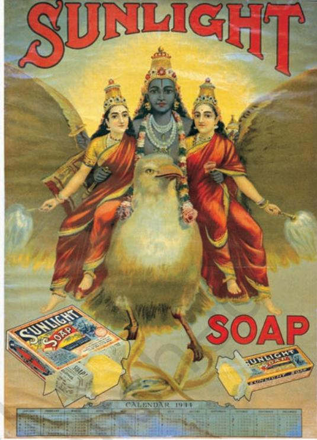

Fig. 27 – Sunlight soap calendar of 1934. Here God Vishnu is shown bringing sunlight from across the skies.

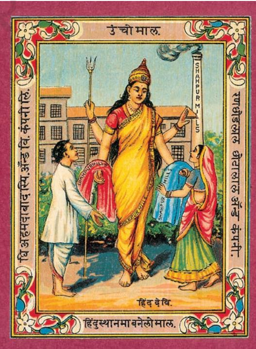

Fig. 28 – An Indian mill cloth label. The goddess is shown offering cloth produced in an Ahmedabad mill, and asking people to use things made in India.

## Write in brief

- 1. Explain the following:
	- a) Women workers in Britain attacked the Spinning Jenny.
	- b) In the seventeenth century merchants from towns in Europe began employing peasants and artisans within the villages.
	- c) The port of Surat declined by the end of the eighteenth century.
	- d) The East India Company appointed gomasthas to supervise weavers in India.
- 2. Write True or False against each statement:
	- a) At the end of the nineteenth century, 80 per cent of the total workforce in Europe was employed in the technologically advanced industrial sector.
	- b) The international market for fine textiles was dominated by India till the eighteenth century.
	- c) The American Civil War resulted in the reduction of cotton exports from India.
	- d) The introduction of the fly shuttle enabled handloom workers to improve their productivity.
- 3. Explain what is meant by proto-industrialisation.

### Discuss

- 1. Why did some industrialists in nineteenth-century Europe prefer hand labour over machines?
- 2. How did the East India Company procure regular supplies of cotton and silk textiles from Indian weavers?
- 3. Imagine that you have been asked to write an article for an encyclopaedia on Britain and the history of cotton. Write your piece using information from the entire chapter.
- 4. Why did industrial production in India increase during the First World War?

### Project work

### Project

Write in brief

Discuss

Select any one industry in your region and find out its history. How has the technology changed? Where do the workers come from? How are the products advertised and marketed? Try and talk to the employers and some workers to get their views about the industry's history.

