# **SECTION III**

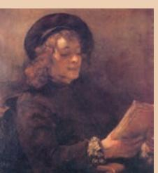

## **EVERYDAY LIFE, CULTURE AND POLITICS**

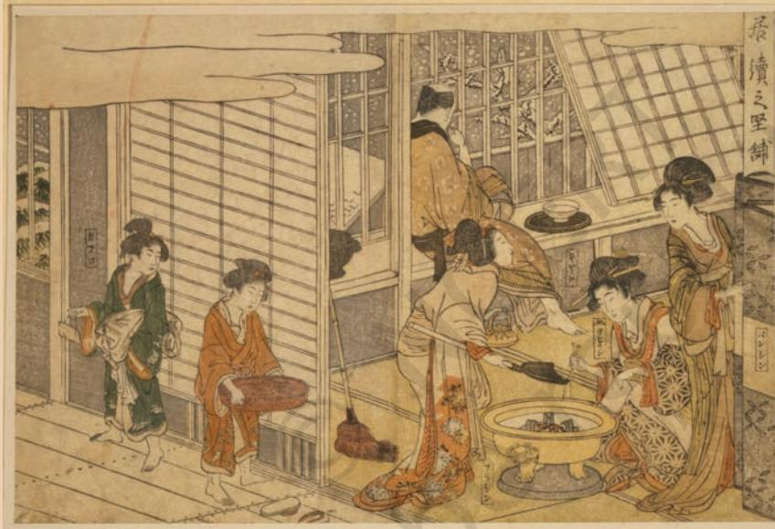

# **Print Culture and the Modern World**

It is difficult for us to imagine a world without printed matter. We find evidence of print everywhere around us – in books, journals, newspapers, prints of famous paintings, and also in everyday things like theatre programmes, official circulars, calendars, diaries, advertisements, cinema posters at street corners. We read printed literature, see printed images, follow the news through newspapers, and track public debates that appear in print. We take for granted this world of print and often forget that there was a time before print. We may not realise that print itself has a history which has, in fact, shaped our contemporary world. What is this history? When did printed literature begin to circulate? How has it helped create the modern world?

In this chapter we will look at the development of print, from its beginnings in East Asia to its expansion in Europe and in India. We will understand the impact of the spread of technology and consider how social lives and cultures changed with the coming of print.

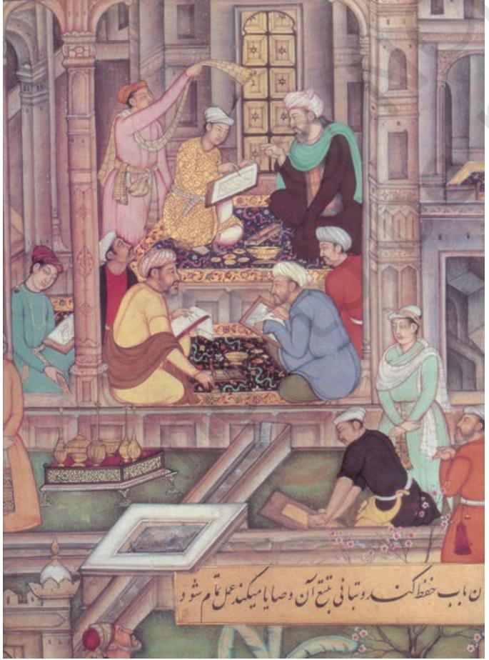

#### Fig. 1 – Book making before the age of print, from Akhlaq-i-Nasiri, 1595.

This is a royal workshop in the sixteenth century, much before printing began in India. You can see the text being dictated, written and illustrated. The art of writing and illustrating by hand was important in the age before print. Think about what happened to these forms of art with the coming of printing machines.

105

### **1 The First Printed Books**

The earliest kind of print technology was developed in China, Japan and Korea. This was a system of hand printing. From AD 594 onwards, books in China were printed by rubbing paper – also invented there – against the inked surface of woodblocks.As both sides of the thin, porous sheet could not be printed, the traditional Chinese 'accordion book' was folded and stitched at the side. Superbly skilled craftsmen could duplicate, with remarkable accuracy, the beauty of calligraphy.

The imperial state in China was, for a very long time, the major producer of printed material. China possessed a huge bureaucratic system which recruited its personnel through civil service examinations. Textbooks for this examination were printed in vast numbers under the sponsorship of the imperial state. From the sixteenth century, the number of examination candidates went up and that increased the volume of print.

By the seventeenth century, as urban culture bloomed in China, the uses of print diversified. Print was no longer used just by scholarofficials. Merchants used print in their everyday life, as they collected trade information. Reading increasingly became a leisure activity. The new readership preferred fictional narratives, poetry, autobiographies, anthologies of literary masterpieces, and romantic plays. Rich women began to read, and many women began publishing their poetry and plays. Wives of scholar-officials published their works and courtesans wrote about their lives.

This new reading culture was accompanied by a new technology. Western printing techniques and mechanical presses were imported in the late nineteenth century as Western powers established their outposts in China. Shanghai became the hub of the new print culture, catering to the Western-style schools. From hand printing there was now a gradual shift to mechanical printing.

### **1.1 Print in Japan**

Buddhist missionaries from China introduced hand-printing technology into Japan around AD 768-770. The oldest Japanese book, printed in AD 868, is the Buddhist Diamond Sutra, containing six sheets of text and woodcut illustrations. Pictures were printed on textiles,

### New words

Calligraphy – The art of beautiful and stylised writing

| Fig. 2a – A page from the Diamond Sutra. |
| --- |

playing cards and paper money. In medieval Japan, poets and prose writers were regularly published, and books were cheap and abundant.

Printing of visual material led to interesting publishing practices. In the late eighteenth century, in the flourishing urban circles at Edo (later to be known as Tokyo), illustrated collections of paintings Belonging to the mid-13th century, printing woodblocks of the Tripitaka Koreana are a Korean collection of Buddhist scriptures. They were engraved on about 80,000 woodblocks. They were inscribed on the UNESCO Memory of the World Register in 2007. Source: http://www.cha.go.kr

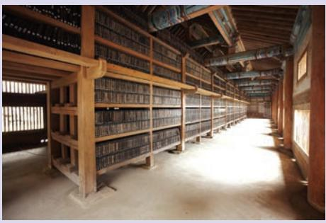

Fig. 2b – Tripitaka Koreana

depicted an elegant urban culture, involving artists, courtesans, and teahouse gatherings. Libraries and bookstores were packed with hand-printed material of various types – books on women, musical instruments, calculations, tea ceremony, flower arrangements, proper etiquette, cooking and famous places.

### **Box 1**

Kitagawa Utamaro, born in Edo in 1753, was widely known for his contributions to an art form called ukiyo ('pictures of the floating world') or depiction of ordinary human experiences, especially urban ones. These prints travelled to contemporary US and Europe and influenced artists like Manet, Monet and Van Gogh. Publishers like Tsutaya Juzaburo identified subjects and commissioned artists who drew the theme in outline. Then a skilled woodblock carver pasted the drawing on a woodblock and carved a printing block to reproduce the painter's lines. In the process, the original drawing would be destroyed and only prints would survive.

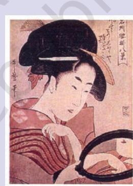

Fig. 3 – An ukiyo print by Kitagawa Utamaro.

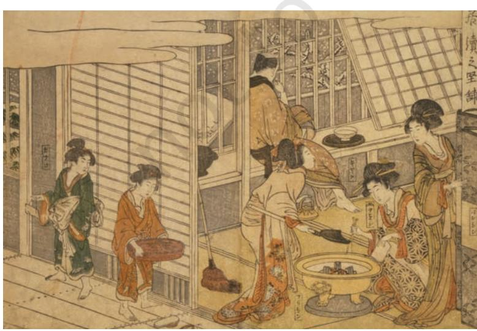

Fig. 4a – A morning scene, ukiyo print by Shunman Kubo, late eighteenth century. A man looks out of the window at the snowfall while women prepare tea and

perform other domestic

duties.

### **2 Print Comes to Europe**

For centuries, silk and spices from China flowed into Europe through the silk route. In the eleventh century, Chinese paper reached Europe via the same route. Paper made possible the production of manuscripts, carefully written by scribes. Then, in 1295, Marco Polo, a great explorer, returned to Italy after many years of exploration in China. As you read above, China already had the technology of woodblock printing. Marco Polo brought this knowledge back with him. Now Italians began producing books with woodblocks, and soon the technology spread to other parts of Europe. Luxury editions were still handwritten on very expensive vellum, meant for aristocratic circles and rich monastic libraries which scoffed at printed books as cheap vulgarities. Merchants and students in the university towns bought the cheaper printed copies.

As the demand for books increased, booksellers all over Europe began exporting books to many different countries. Book fairs were held at different places. Production of handwritten manuscripts was also organised in new ways to meet the expanded demand. Scribes or skilled handwriters were no longer solely employed by wealthy or influential patrons but increasingly by booksellers as well. More than 50 scribes often worked for one bookseller.

But the production of handwritten manuscripts could not satisfy the ever-increasing demand for books. Copying was an expensive, laborious and time-consuming business. Manuscripts were fragile, awkward to handle, and could not be carried around or read easily. Their circulation therefore remained limited. With the growing demand for books, woodblock printing gradually became more and more popular. By the early fifteenth century, woodblocks were being widely used in Europe to print textiles, playing cards, and religious pictures with simple, brief texts.

There was clearly a great need for even quicker and cheaper reproduction of texts. This could only be with the invention of a new print technology. The breakthrough occurred at Strasbourg, Germany, where Johann Gutenberg developed the first-known printing press in the 1430s.

### New words

Vellum – A parchment made from the skin of animals

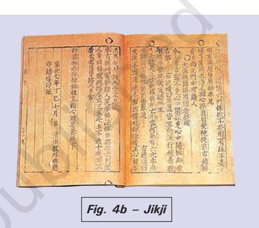

The Jikji of Korea is among the world's oldest existing books printed with movable metal type. It contains the essential features of Zen Buddhism. About 150 monks of India, China and Korea are mentioned in the book. It was printed in late 14th century. While the first volume of the book is unavailable, the second one is available in the National Library of France. This work marked an important technical change in the print culture. That is why it was inscribed on the UNESCO Memory of the World Register in 2001.

### Activity

Imagine that you are Marco Polo. Write a letter from China to describe the world of print which you have seen there.

### **2.1 Gutenberg and the Printing Press**

Gutenberg was the son of a merchant and grew up on a large agricultural estate. From his childhood he had seen wine and olive presses. Subsequently, he learnt the art of polishing stones, became a master goldsmith, and also acquired the expertise to create lead moulds used for making trinkets. Drawing on this knowledge, Gutenberg adapted existing technology to design his innovation. The olive press provided the model for the printing press, and moulds were used for casting the metal types for the letters of the alphabet. By 1448, Gutenberg perfected the system. The first book he printed was the Bible. About 180 copies were printed and it took three years to produce them. By the standards of the time this was fast production.

The new technology did not entirely displace the existing art of producing books by hand.

In fact, printed books at first closely resembled the written manuscripts in appearance and layout. The metal letters imitated the ornamental handwritten styles. Borders were illuminated by hand with foliage and other patterns, and illustrations were painted. In the books printed for the rich, space for decoration was kept blank on the printed page. Each purchaser could choose the design and decide on the painting school that would do the illustrations.

In the hundred years between 1450 and 1550, printing presses were set up in most countries of Europe. Printers from Germany travelled to other countries, seeking work and helping start new presses. As the number of printing presses grew, book production boomed. The second half of the fifteenth century saw 20 million copies of printed books flooding the markets in Europe. The number went up in the sixteenth century to about 200 million copies.

This shift from hand printing to mechanical printing led to the print revolution.

### New words

Platen – In letterpress printing, platen is a board which is pressed onto the back of the paper to get the impression from the type. At one time it used to be a wooden board; later it was made of steel

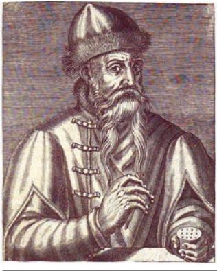

Fig. 5 – A Portrait of Johann Gutenberg, 1584.

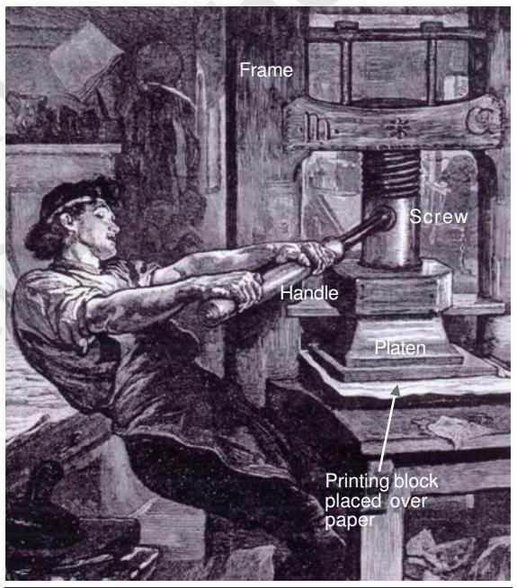

Fig. 6 – Gutenberg Printing Press. Notice the long handle attached to the screw. This handle was used to turn the screw and press down the platen over the printing block that was placed on top of a sheet of damp paper. Gutenberg developed metal types for each of the 26 characters of the Roman alphabet and devised a way of moving them around so as to compose different words of the text. This came to be known as the moveable type printing machine, and it remained the basic print technology over the next 300 years. Books could now be produced much faster than was possible when each print block was prepared by carving a piece of wood by hand. The Gutenberg press could print 250 sheets on one side per hour.

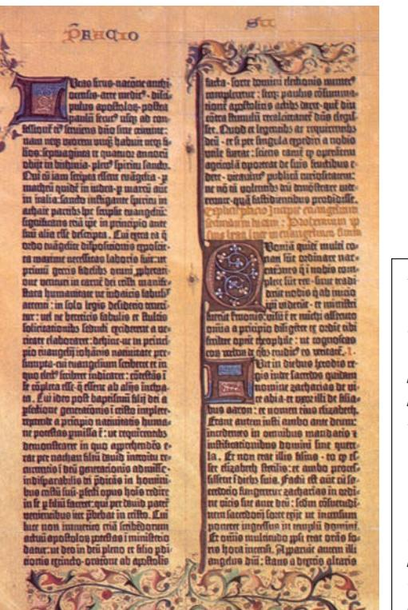

Fig. 7 – Pages of Gutenberg's Bible, the first printed book in Europe.

Gutenberg printed about 180 copies, of which no more than 50 have survived.

Look at these pages of Gutenberg's Bible carefully. They were not just products of new technology. The text was printed in the new Gutenberg press with metal type, but the borders were carefully designed, painted and illuminated by hand by artists. No two copies were the same. Every page of each copy was different. Even when two copies look similar, a careful comparison will reveal differences. Elites everywhere preferred this lack of uniformity: what they possessed then could be claimed as unique, for no one else owned a copy that was exactly the same.

In the text you will notice the use of colour within the letters in various places. This had two functions: it added colour to the page, and highlighted all the holy words to emphasise their significance. But the colour on every page of the text was added by hand. Gutenberg printed the text in black, leaving spaces where the colour could be filled in later.

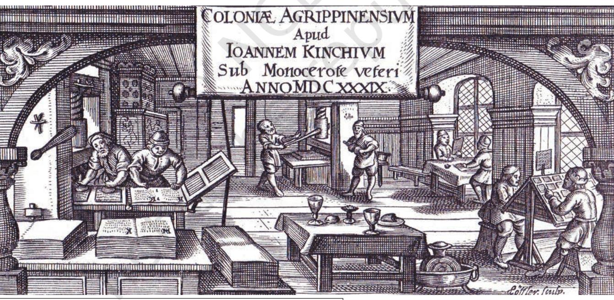

Fig. 8 – A printer's workshop, sixteenth century. This picture depicts what a printer's shop looked like in the sixteenth century. All the activities are going on under one roof. In the foreground on the right, compositors are at work, while on the left galleys are being prepared and ink is being applied on the metal types; in the background, the printers are turning the screws of the press, and near them proofreaders are at work. Right in front is the final product – the double-page printed sheets, stacked in neat piles, waiting to be bound.

### New words

Compositor – The person who composes the text for printing

Galley – Metal frame in which types are laid and the text composed

### **3 The Print Revolution and Its Impact**

What was the print revolution? It was not just a development, a new way of producing books; it transformed the lives of people, changing their relationship to information and knowledge, and with institutions and authorities. It influenced popular perceptions and opened up new ways of looking at things.

Let us explore some of these changes.

### **3.1 A New Reading Public**

With the printing press, a new reading public emerged. Printing reduced the cost of books. The time and labour required to produce each book came down, and multiple copies could be produced with greater ease. Books flooded the market, reaching out to an ever-growing readership.

Access to books created a new culture of reading. Earlier, reading was restricted to the elites. Common people lived in a world of oral culture. They heard sacred texts read out, ballads recited, and folk tales narrated. Knowledge was transferred orally. People collectively heard a story, or saw a performance. As you will see in Chapter 8, they did not read a book individually and silently. Before the age of print, books were not only expensive but they could not be produced in sufficient numbers. Now books could reach out to wider sections of people. If earlier there was a hearing public, now a reading public came into being.

But the transition was not so simple. Books could be read only by the literate, and the rates of literacy in most European countries were very low till the twentieth century. How, then, could publishers persuade the common people to welcome the printed book? To do this, they had to keep in mind the wider reach of the printed work: even those who did not read could certainly enjoy listening to books being read out. So printers began publishing popular ballads and folk tales, and such books would be profusely illustrated with pictures. These were then sung and recited at gatherings in villages and in taverns in towns.

Oral culture thus entered print and printed material was orally transmitted. The line that separated the oral and reading cultures became blurred. And the hearing public and reading public became intermingled.

### Activity

You are a bookseller advertising the availability of new cheap printed books. Design a poster for your shop window.

### New words

Ballad – A historical account or folk tale in verse, usually sung or recited

Taverns – Places where people gathered to drink alcohol, to be served food, and to meet friends and exchange news

### **3.2 Religious Debates and the Fear of Print**

Print created the possibility of wide circulation of ideas, and introduced a new world of debate and discussion. Even those who disagreed with established authorities could now print and circulate their ideas. Through the printed message, they could persuade people to think differently, and move them to action. This had significance in different spheres of life.

Not everyone welcomed the printed book, and those who did also had fears about it. Many were apprehensive of the effects that the easier access to the printed word and the wider circulation of books, could have on people's minds. It was feared that if there was no control over what was printed and read then rebellious and irreligious thoughts might spread. If that happened the authority of 'valuable' literature would be destroyed. Expressed by religious authorities and monarchs, as well as many writers and artists, this anxiety was the basis of widespread criticism of the new printed literature that had begun to circulate.

Let us consider the implication of this in one sphere of life in early modern Europe – namely, religion.

In 1517, the religious reformer Martin Luther wrote Ninety Five Theses criticising many of the practices and rituals of the Roman Catholic Church. A printed

copy of this was posted on a church door in Wittenberg. It challenged the Church to debate his ideas. Luther's writings were immediately reproduced in vast numbers and read widely. This lead to a division within the Church and to the beginning of the Protestant Reformation. Luther's translation of the New Testament sold 5,000 copies within a few weeks and a second edition appeared within three months. Deeply grateful to print, Luther said, 'Printing is the ultimate gift of God and the greatest one.' Several scholars, in fact, think that print brought about a new intellectual atmosphere and helped spread the new ideas that led to the Reformation.

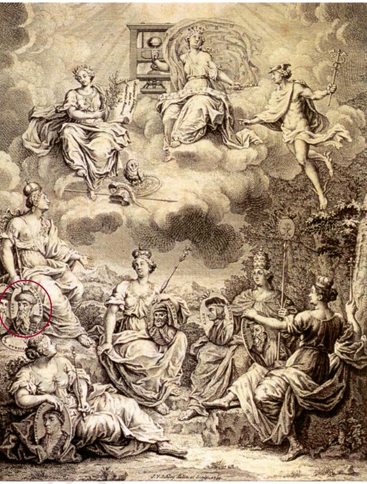

Fig. 9 – J.V. Schley, L'Imprimerie, 1739. This is one of the many images produced in early modern Europe, celebrating the coming of print. You can see the printing press descending from heaven, carried by a goddess. On two sides of the goddess, blessing the machine, are Minerva (the goddess of wisdom) and Mercury (the messenger god, also symbolising reason). The women in the foreground are holding plaques with the portraits of six pioneer printers of different countries. In the middle ground on the left (figure encircled) is the portrait of Gutenberg.

### New words

Protestant Reformation – A sixteenth-century movement to reform the Catholic Church dominated by Rome. Martin Luther was one of the main Protestant reformers. Several traditions of anti-Catholic Christianity developed out of the movement

### **3.3 Print and Dissent**

Print and popular religious literature stimulated many distinctive individual interpretations of faith even among little-educated working people. In the sixteenth century, Menocchio, a miller in Italy, began to read books that were available in his locality. He reinterpreted the message of the Bible and formulated a view of God and Creation that enraged the Roman Catholic Church. When the Roman Church began its inquisition to repress heretical ideas, Menocchio was hauled up twice and ultimately executed. The Roman Church, troubled by such effects of popular readings and questionings of faith, imposed severe controls over publishers and booksellers and began to maintain an Index of Prohibited Books from 1558.

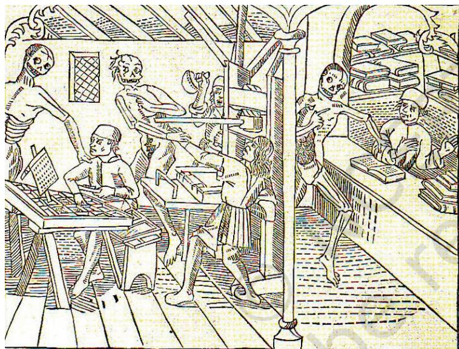

#### Fig. 10 – The macabre dance.

This sixteenth-century print shows how the fear of printing was dramatised in visual representations of the time. In this highly interesting woodcut the coming of print is associated with the end of the world. The interior of the printer's workshop here is the site of a dance of death. Skeletal figures control the printer and his workers, define and dictate what is to be done and what is to be produced.

### Discuss

Write briefly why some people feared that the development of print could lead to the growth of dissenting ideas.

### New words

Inquisition –A former Roman Catholic court for identifying and punishing heretics

Heretical – Beliefs which do not follow the accepted teachings of the Church. In medieval times, heresy was seen as a threat to the right of the Church to decide on what should be believed and what should not. Heretical beliefs were severely punished

Satiety – The state of being fulfilled much beyond the point of satisfaction

Seditious – Action, speech or writing that is seen as opposing the government

### **Source A**

#### Fear of the book

Erasmus, a Latin scholar and a Catholic reformer, who criticised the excesses of Catholicism but kept his distance from Luther, expressed a deep anxiety about printing. He wrote in Adages(1508):

'To what corner of the world do they not fly, these swarms of new books? It may be that one here and there contributes something worth knowing, but the very multitude of them is hurtful to scholarship, because it creates a glut, and even in good things satiety is most harmful ... [printers] fill the world with books, not just trifling things (such as I write, perhaps), but stupid, ignorant, slanderous, scandalous, raving, irreligious and seditious books, and the number of them is such that even the valuable publications lose their value.'

**Source**

### **4 The Reading Mania**

Through the seventeenth and eighteenth centuries literacy rates went up in most parts of Europe. Churches of different denominations set up schools in villages, carrying literacy to peasants and artisans. By the end of the eighteenth century, in some parts of Europe literacy rates were as high as 60 to 80 per cent. As literacy and schools spread in European countries, there was a virtual reading mania. People wanted books to read and printers produced books in everincreasing numbers.

New forms of popular literature appeared in print, targeting new audiences. Booksellers employed pedlars who roamed around villages, carrying little books for sale. There were almanacs or ritual calendars, along with ballads and folktales. But other forms of reading matter, largely for entertainment, began to reach ordinary readers as well. In England, penny chapbooks were carried by petty pedlars known as chapmen, and sold for a penny, so that even the poor could buy them. In France, were the "Biliotheque Bleue", which were low-priced small books printed on poor quality paper, and bound in cheap blue covers. Then there were the romances, printed on four to six pages, and the more substantial 'histories' which were stories about the past. Books were of various sizes, serving many different purposes and interests.

The periodical press developed from the early eighteenth century, combining information about current affairs with entertainment. Newspapers and journals carried information about wars and trade, as well as news of developments in other places.

Similarly, the ideas of scientists and philosophers now became more accessible to the common people. Ancient and medieval scientific texts were compiled and published, and maps and scientific diagrams were widely printed. When scientists like Isaac Newton began to publish their discoveries, they could influence a much wider circle of scientifically minded readers. The writings of thinkers such as Thomas Paine, Voltaire and Jean Jacques Rousseau were also widely printed and read. Thus their ideas about science, reason and rationality found their way into popular literature.

### New words

Denominations – Sub groups within a religion Almanac – An annual publication giving astronomical data, information about the movements of the sun and moon, timing of full tides and eclipses, and much else that was of importance in the everyday life of people Chapbook – A term used to describe pocketsize books that are sold by travelling pedlars called chapmen. These became popular from the time of the sixteenth-century print revolution

#### **Box 2**

In 1791, a London publisher, James Lackington, wrote in his diary:

'The sale of books in general has increased prodigiously within the last twenty years. The poorer sort of farmers and even the poor country people in general who before that period spent their winter evenings in relating stories of witches, ghosts, hobgoblins … now shorten the winter night by hearing their sons and daughters read them tales, romances, etc. If John goes to town with a load of hay, he is charged to be sure not to forget to bring home Peregrine Pickle's Adventure … and when Dolly is sent to sell her eggs, she is commissioned to purchase The History of Joseph Andrews.'

### **4.1 'Tremble, therefore, tyrants of the world!'**

By the mid-eighteenth century, there was a common conviction that books were a means of spreading progress and enlightenment. Many believed that books could change the world, liberate society from despotism and tyranny, and herald a time when reason and intellect would rule. Louise-Sebastien Mercier, a novelist in eighteenth-century France, declared: 'The printing press is the most powerful engine of progress and public opinion is the force that will sweep despotism away.' In many of Mercier's novels, the heroes are transformed by acts of reading. They devour books, are lost in the world books create, and become enlightened in the process. Convinced of the power of print in bringing enlightenment and destroying the basis of despotism, Mercier proclaimed: 'Tremble, therefore, tyrants of the world! Tremble before the virtual writer!'

### **4.2 Print Culture and the French Revolution**

Many historians have argued that print culture created the conditions within which French Revolution occurred. Can we make such a connection?

Three types of arguments have been usually put forward.

First: print popularised the ideas of the Enlightenment thinkers. Collectively, their writings provided a critical commentary on tradition, superstition and despotism. They argued for the rule of reason rather than custom, and demanded that everything be judged through the application of reason and rationality. They attacked the sacred authority of the Church and the despotic power of the state, thus eroding the legitimacy of a social order based on tradition. The writings of Voltaire and Rousseau were read widely; and those who read these books saw the world through new eyes, eyes that were questioning, critical and rational.

Second: print created a new culture of dialogue and debate. All values, norms and institutions were re-evaluated and discussed by a public that had become aware of the power of reason, and recognised the need to question existing ideas and beliefs. Within this public culture, new ideas of social revolution came into being.

Third: by the 1780s there was an outpouring of literature that mocked the royalty and criticised their morality. In the process, it raised

#### **Source B**

This is how Mercier describes the impact of the printed word, and the power of reading in one of his books:

'Anyone who had seen me reading would have compared me to a man dying of thirst who was gulping down some fresh, pure water … Lighting my lamp with extraordinary caution, I threw myself hungrily into the reading. An easy eloquence, effortless and animated, carried me from one page to the next without my noticing it. A clock struck off the hours in the silence of the shadows, and I heard nothing. My lamp began to run out of oil and produced only a pale light, but still I read on. I could not even take out time to raise the wick for fear of interrupting my pleasure. How those new ideas rushed into my brain! How my intelligence adopted them!'

Quoted by Robert Darnton, The Forbidden Best-Sellers of Pre-Revolutionary France, 1995.

**Source**

### New words

Despotism – A system of governance in which absolute power is exercised by an individual, unregulated by legal and constitutional checks

questions about the existing social order. Cartoons and caricatures typically suggested that the monarchy remained absorbed only in sensual pleasures while the common people suffered immense hardships. This literature circulated underground and led to the growth of hostile sentiments against the monarchy.

How do we look at these arguments? There can be no doubt that print helps the spread of ideas. But we must remember that people did not read just one kind of literature. If they read the ideas of Voltaire and Rousseau, they were also exposed to monarchical and Church propaganda. They were not influenced directly by everything they read or saw. They accepted some ideas and rejected others. They interpreted things their own way. Print did not directly shape their minds, but it did open up the possibility of thinking differently.

### Activity

Imagine that you are a cartoonist in France before the revolution. Design a cartoon as it would have appeared in a pamphlet.

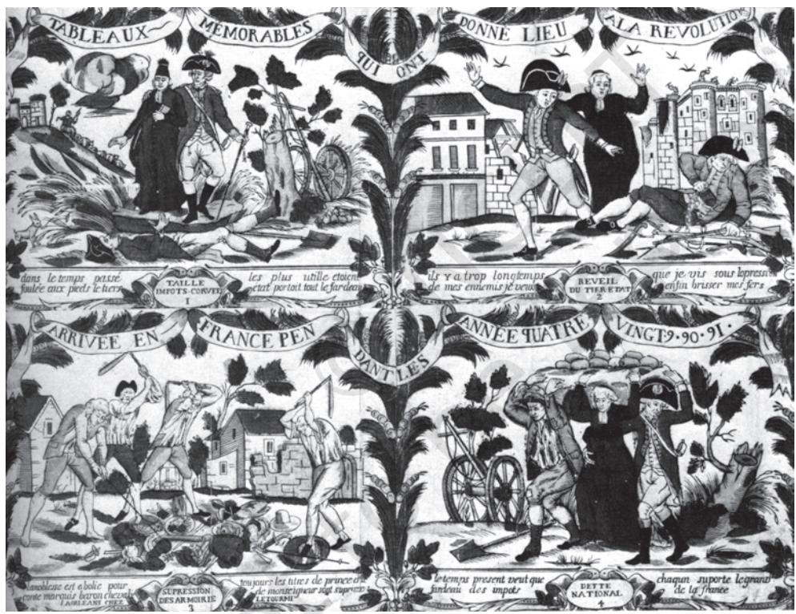

Fig. 11 – The nobility and the common people before the French Revolution, a cartoon of the late eighteenth century.

The cartoon shows how the ordinary people – peasants, artisans and workers – had a hard time while the nobility enjoyed life and oppressed them. Circulation of cartoons like this one had an impact on the thinking of people before the revolution.

### Discuss

Why do some historians think that print culture created the basis for the French Revolution?

### **5 The Nineteenth Century**

The nineteenth century saw vast leaps in mass literacy in Europe, bringing in large numbers of new readers among children, women and workers.

### **5.1 Children, Women and Workers**

As primary education became compulsory from the late nineteenth century, children became an important category of readers. Production of school textbooks became critical for the publishing industry. A children's press, devoted to literature for children alone, was set up in France in 1857. This press published new works as well as old fairy tales and folk tales. The Grimm Brothers in Germany spent years compiling traditional folk tales gathered from peasants. What they collected was edited before the stories were published in a collection in 1812. Anything that was considered unsuitable for children or would appear vulgar to the elites, was not included in the published version. Rural folk tales thus acquired a new form. In this way, print recorded old tales but also changed them.

Women became important as readers as well as writers. Penny magazines (see Fig. 12) were especially meant for women, as were manuals teaching proper behaviour and housekeeping. When novels began to be written in the nineteenth century, women were seen as important readers. Some of the best-

known novelists were women: Jane Austen, the Bronte sisters, George Eliot. Their writings became important in defining a new type of woman: a person with will, strength of personality, determination and the power to think.

Lending libraries had been in existence from the seventeenth century onwards. In the nineteenth century, lending libraries in England became instruments for educating white-collar workers, artisans and lower-middle-class people. Sometimes, self-educated working class people wrote for themselves. After the working day was gradually shortened from the mid-nineteenth century, workers had some time for self-improvement and self-expression. They wrote political tracts and autobiographies in large numbers.

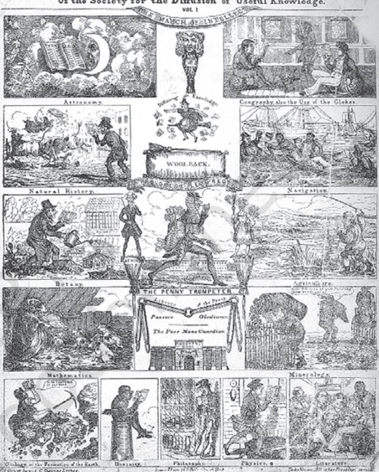

Fig. 12 – Frontispiece of Penny Magazine. Penny Magazine was published between 1832 and 1835 in England by the Society for the Diffusion of Useful Knowledge. It was aimed primarily at the working class.

### **Box 3**

Thomas Wood, a Yorkshire mechanic, narrated how he would rent old newspapers and read them by firelight in the evenings as he could not afford candles. Autobiographies of poor people narrated their struggles to read against grim obstacles: the twentieth-century Russian revolutionary author Maxim Gorky's My Childhood and My University provide glimpses of such struggles.

### **5.2 Further Innovations**

By the late eighteenth century, the press came to be made out of metal. Through the nineteenth century, there were a series of further innovations in printing technology. By the mid-nineteenth century, Richard M. Hoe of New York had perfected the power-driven cylindrical press. This was capable of printing 8,000 sheets per hour. This press was particularly useful for printing newspapers. In the late nineteenth century, the offset press was developed which could print up to six colours at a time. From the turn of the twentieth century, electrically operated presses accelerated printing operations. A series of other developments followed. Methods of feeding paper improved, the quality of plates became better, automatic paper reels and photoelectric controls of the colour register were introduced. The accumulation of several individual mechanical improvements transformed the appearance of printed texts.

Printers and publishers continuously developed new strategies to sell their product. Nineteenth-century periodicals serialised important novels, which gave birth to a particular way of writing novels. In the 1920s in England, popular works were sold in cheap series, called the Shilling Series. The dust cover or the book jacket is also a twentieth-century innovation. With the onset of the Great Depression in the 1930s, publishers feared a decline in book purchases. To sustain buying, they brought out cheap paperback editions.

### Activity

Look at Fig. 13. What impact do such advertisements have on the public mind? Do you think everyone reacts to printed material in the same way?

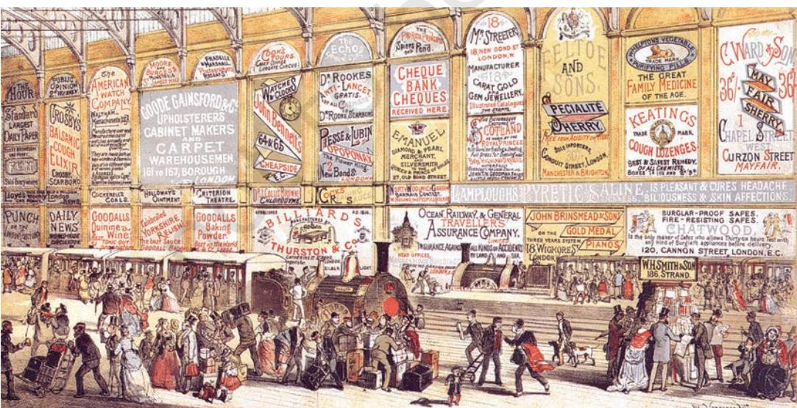

Fig. 13 – Advertisements at a railway station in England, a lithograph by Alfred Concanen, 1874. Printed advertisements and notices were plastered on street walls, railway platforms and public buildings.

### **6 India and the World of Print**

Let us see when printing began in India and how ideas and information were written before the age of print.

### **6.1 Manuscripts Before the Age of Print**

India had a very rich and old tradition of handwritten manuscripts – in Sanskrit,Arabic, Persian, as well as in various vernacular languages. Manuscripts were copied on palm leaves or on handmade paper. Pages were sometimes beautifully illustrated. They would be either pressed between wooden covers or sewn together to ensure preservation. Manuscripts continued to be produced till well after the introduction of print, down to the late nineteenth century.

Manuscripts, however, were highly expensive and fragile. They had to be handled carefully, and they could not be read easily as the

Fig. 15 – Pages from the Diwan of Hafiz, 1824. Hafiz was a fourteenth-century poet whose collected works are known as Diwan. Notice the beautiful calligraphy and the elaborate illustration and design. Manuscripts like this continued to be produced for the rich even after the coming of the letterpress.

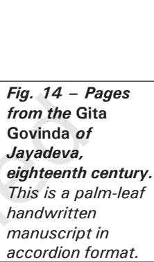

script was written in different styles. So manuscripts were not widely used in everyday life. Even though pre-colonial Bengal had developed an extensive network of village primary schools, students very often did not read texts. They only learnt to write. Teachers dictated portions of texts from memory and students wrote them down. Many thus became literate without ever actually reading any kinds of texts.

Fig. 16 – Pages from the Rigveda. Handwritten manuscripts continued to be produced in India till much after the coming of print. This manuscript was produced in the eighteenth century in the Malayalam script.

### **6.2 Print Comes to India**

The printing press first came to Goa with Portuguese missionaries in the mid-sixteenth century. Jesuit priests learnt Konkani and printed several tracts. By 1674, about 50 books had been printed in the Konkani and in Kanara languages. Catholic priests printed the first Tamil book in 1579 at Cochin, and in 1713 the first Malayalam book was printed by them. By 1710, Dutch Protestant missionaries had printed 32 Tamil texts, many of them translations of older works.

The English language press did not grow in India till quite late even though the English East India Company began to import presses from the late seventeenth century.

From 1780, James Augustus Hickey began to edit the Bengal Gazette, a weekly magazine that described itself as 'a commercial paper open to all, but influenced by none'. So it was private English enterprise, proud of its independence from colonial influence, that began English printing in India. Hickey published a lot of advertisements, including those that related to the import and sale of slaves. But he also published a lot of gossip about the Company's senior officials in India. Enraged by this, Governor-General Warren Hastings persecuted Hickey, and encouraged the publication of officially sanctioned newspapers that could counter the flow of information that damaged the image of the colonial government. By the close of the eighteenth century, a number of newspapers and journals appeared in print. There were Indians, too, who began to publish Indian newspapers. The first to appear was the weekly Bengal Gazette, brought out by Gangadhar Bhattacharya, who was close to Rammohun Roy.

### **Source C**

As late as 1768, a William Bolts affixed a notice on a public building in Calcutta:

'To the Public: Mr. Bolts takes this method of informing the public that the want of a printing press in this city being of a great disadvantage in business ... he is going to give the best encouragement to any ... persons who are versed in the business of printing.'

Bolts, however, left for England soon after and nothing came of the promise.

**Source**

### **7 Religious Reform and Public Debates**

From the early nineteenth century, as you know, there were intense debates around religious issues. Different groups confronted the changes happening within colonial society in different ways, and offered a variety of new interpretations of the beliefs of different religions. Some criticised existing practices and campaigned for reform, while others countered the arguments of reformers. These debates were carried out in public and in print. Printed tracts and newspapers not only spread the new ideas, but they shaped the nature of the debate. A wider public could now participate in these public discussions and express their views. New ideas emerged through these clashes of opinions.

This was a time of intense controversies between social and religious reformers and the Hindu orthodoxy over matters like widow immolation, monotheism, Brahmanical priesthood and idolatry. In Bengal, as the debate developed, tracts and newspapers proliferated, circulating a variety of arguments. To reach a wider audience, the ideas were printed in the everyday, spoken language of ordinary people. Rammohun Roy published the Sambad Kaumudi from 1821 and the Hindu orthodoxy commissioned the Samachar Chandrika to oppose his opinions. From 1822, two Persian newspapers were published, Jam-i-Jahan Nama and Shamsul Akhbar. In the same year, a Gujarati newspaper, the Bombay Samachar, made its appearance.

In north India, the ulama were deeply anxious about the collapse of Muslim dynasties. They feared that colonial rulers would encourage conversion, change the Muslim personal laws. To counter this, they used cheap lithographic presses, published Persian and Urdu translations of holy scriptures, and printed religious newspapers and tracts. The Deoband Seminary, founded in 1867, published thousands upon thousands of fatwas telling Muslim readers how to conduct themselves in their everyday lives, and explaining the meanings of Islamic doctrines. All through the nineteenth century, a number of Muslim sects and seminaries appeared, each with a different interpretation of faith, each keen on enlarging its following and countering the influence of its opponents. Urdu print helped them conduct these battles in public.

Among Hindus, too, print encouraged the reading of religious texts, especially in the vernacular languages. The first printed edition of

### New words

Ulama – Legal scholars of Islam and the sharia ( a body of Islamic law)

Fatwa – A legal pronouncement on Islamic law usually given by a mufti (legal scholar) to clarify issues on which the law is uncertain

the Ramcharitmanas of Tulsidas, a sixteenth-century text, came out from Calcutta in 1810. By the mid-nineteenth century, cheap lithographic editions flooded north Indian markets. From the 1880s, the Naval Kishore Press at Lucknow and the Shri Venkateshwar Press in Bombay published numerous religious texts in vernaculars. In their printed and portable form, these could be read easily by the faithful at any place and time. They could also be read out to large groups of illiterate men and women.

Religious texts, therefore, reached a very wide circle of people, encouraging discussions, debates and controversies within and among different religions.

Print did not only stimulate the publication of conflicting opinions amongst communities, but it also connected communities and people in different parts of India. Newspapers conveyed news from one place to another, creating pan-Indian identities.

#### **Source D**

#### Why Newspapers?

'Krishnaji Trimbuck Ranade inhabitant of Poona intends to publish a Newspaper in the Marathi Language with a view of affording useful information on every topic of local interest. It will be open for free discussion on subjects of general utility, scientific investigation and the speculations connected with the antiquities, statistics, curiosities, history and geography of the country and of the Deccan especially… the patronage and support of all interested in the diffusion of knowledge and Welfare of the People is earnestly solicited.'

#### Bombay Telegraph and Courier, 6 January 1849

'The task of the native newspapers and political associations is identical to the role of the Opposition in the House of Commons in Parliament in England. That is of critically examining government policy to suggest improvements, by removing those parts that will not be to the benefit of the people, and also by ensuring speedy implementation.

These associations ought to carefully study the particular issues, gather diverse relevant information on the nation as well as on what are the possible and desirable improvements, and this will surely earn it considerable influence.'

Native Opinion

, 3 April 1870. **Source**

### **8 New Forms of Publication**

Printing created an appetite for new kinds of writing. As more and more people could now read, they wanted to see their own lives, experiences, emotions and relationships reflected in what they read. The novel, a literary firm which had developed in Europe, ideally catered to this need. It soon acquired distinctively Indian forms and styles . For reader s , it opened up new worlds of experience , and gave a vivid sense of the diversity of human li ves .

Other new literary forms also entered the world of reading – lyrics , short stories , essays about social and political matters. In different ways, they reinforced the new emphasis on human lives and intimate feelings, about the political and social rules that shaped such things .

By the end of the nineteenth century, a new visual culture was taking shape. With the setting up of an increasing number of printing presses, visual images could be easily r eproduced in multiple copies . Painter s like Raja R avi Varma produced ima ges for mass circulation. Poor wood engravers who made woodblocks set up shop near the letterpresses, and were employed by print shops. Cheap prints and calendars, easily available in the bazaar, could be bought even by the poor to decorate the walls of their homes or places of work. These prints began shaping popular ideas about modernity and tradition, religion and politics, and society and culture.

By the 1870s, caricatures and cartoons were being published in journals and newspapers, commenting on social and political issues . Some caricatures ridiculed the educated Indians' fascination with Western tastes and clothes, while others expressed the fear of social change. There were imperial caricatures lampooning nationalists, as well as nationalist cartoons criticising imperial rule.

Fig. 17 – Raja Ritudhwaj rescuing Princess Madalsa from the captivity of demons, print by Ravi Varma. Raja Ravi Varma produced innumerable mythological paintings that were printed at the Ravi Varma Press.

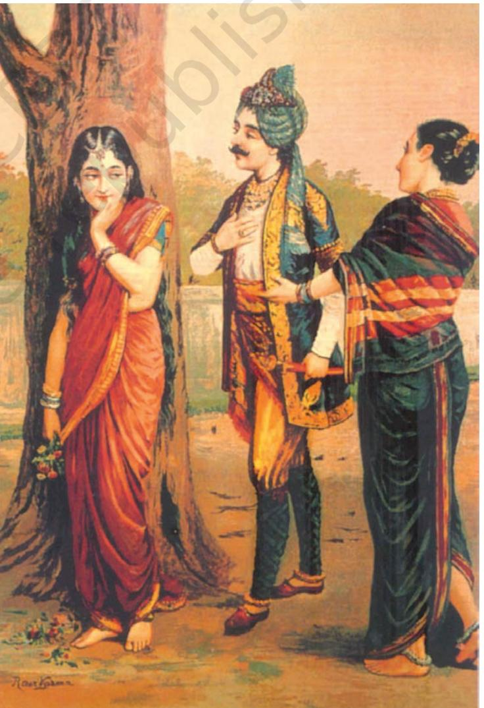

### **8.1 Women and Print**

Lives and feelings of women began to be written in particularly vivid and intense ways. Women's reading, therefore, increased enormously in middle-class homes. Liberal husbands and fathers began educating their womenfolk at home, and sent them to schools when women's schools were set up in the cities and towns after the mid-nineteenth century. Many journals began carrying writings by women, and explained why women should be educated. They also carried a syllabus and attached suitable reading matter which could be used for home-based schooling.

But not all families were liberal. Conservative Hindus believed that a literate girl would be widowed and Muslims feared that educated women would be corrupted by reading Urdu romances. Sometimes, rebel women defied such prohibition. We know the story of a girl in a conservative Muslim family of north India who secretly learnt to read and write in Urdu. Her family wanted her to read only the Arabic Quran which she did not understand. So she insisted on learning to read a language that was her own. In East Bengal, in the early nineteenth century, Rashsundari Debi, a young married girl in a very orthodox household, learnt to read in the secrecy of her kitchen. Later, she wrote her autobiography Amar Jiban which was published in 1876. It was the first full-length autobiography published in the Bengali language.

Since social reforms and novels had already created a great interest in women's lives and emotions, there was also an interest in what women would have to say about their own lives. From the 1860s, a few Bengali women like Kailashbashini Debi wrote books highlighting the experiences of women – about how women were imprisoned at home, kept in ignorance, forced to do hard domestic labour and treated unjustly by the very people they served. In the 1880s, in present-day Maharashtra, Tarabai Shinde and Pandita Ramabai wrote with passionate anger about the miserable lives of upper-caste Hindu women, especially widows. A woman in a Tamil novel expressed what reading meant to women who were so greatly confined by social regulations: 'For various reasons, my world is small … More than half my life's happiness has come from books …'

While Urdu, Tamil, Bengali and Marathi print culture had developed early, Hindi printing began seriously only from the 1870s. Soon, a large segment of it was devoted to the education of women. In

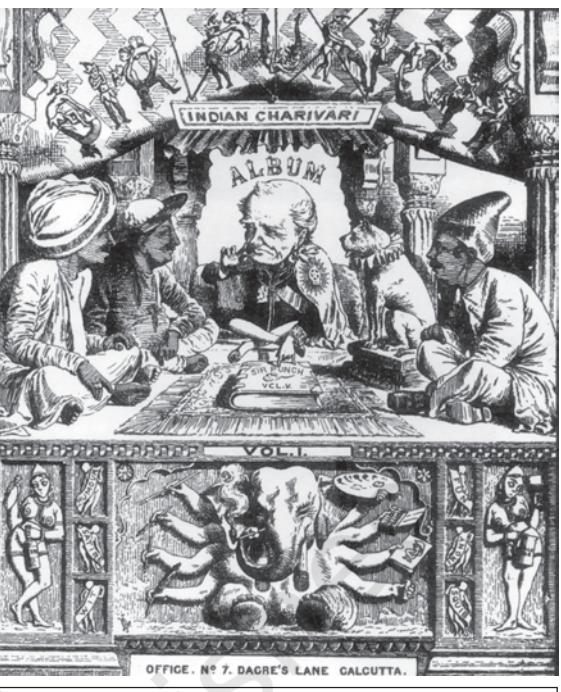

Fig. 18 – The cover page of Indian Charivari. The Indian Charivari was one of the many journals of caricature and satire published in the late nineteenth century. Notice that the imperial British figure is positioned right at the centre. He is authoritative and imperial; telling the natives what is to be done. The natives sit on either side of him, servile and submissive. The Indians are being shown a copy of Punch, the British journal of cartoons and satire. You can almost hear the British master say – 'This is the model, produce Indian versions of it.'

#### **Source E**

In 1926, Begum Rokeya Sakhawat Hossein, a noted educationist and literary figure, strongly condemned men for withholding education from women in the name of religion as she addressed the Bengal Women's Education Conference:

**Source** 'The opponents of female education say that women will become unruly … Fie! They call themselves Muslims and yet go against the basic tenet of Islam which gives Women an equal right to education. If men are not led astray once educated, why should women?'

the early twentieth century, journals, written for and sometimes edited by women, became extremely popular. They discussed issues like women's education, widowhood, widow remarriage and the national movement. Some of them offered household and fashion lessons to women and brought entertainment through short stories and serialised novels.

In Punjab, too, a similar folk literature was widely printed from the early twentieth century. Ram Chaddha published the fast-selling Istri Dharm Vichar to teach women how to be obedient wives. The Khalsa Tract Society published cheap booklets with a similar message. Many of these were in the form of dialogues about the qualities of a good woman.

In Bengal, an entire area in central Calcutta – the Battala – was devoted to the printing of popular books. Here you could buy cheap editions of religious tracts and scriptures, as well as literature that was considered obscene and scandalous. By the late nineteenth century, a lot of these books were being profusely illustrated with woodcuts and coloured lithographs. Pedlars took the Battala publications to homes, enabling women to read them in their leisure time.

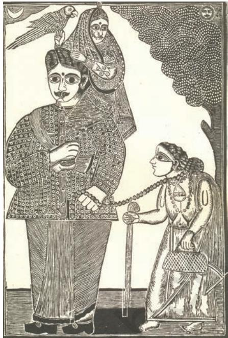

Fig. 19 – Ghor Kali (The End of the World), coloured woodcut, late nineteenth century. The artist's vision of the destruction of proper family relations. Here the husband is totally dominated by his wife who is perched on his shoulder. He is cruel towards his mother, dragging her like an animal, by the noose.

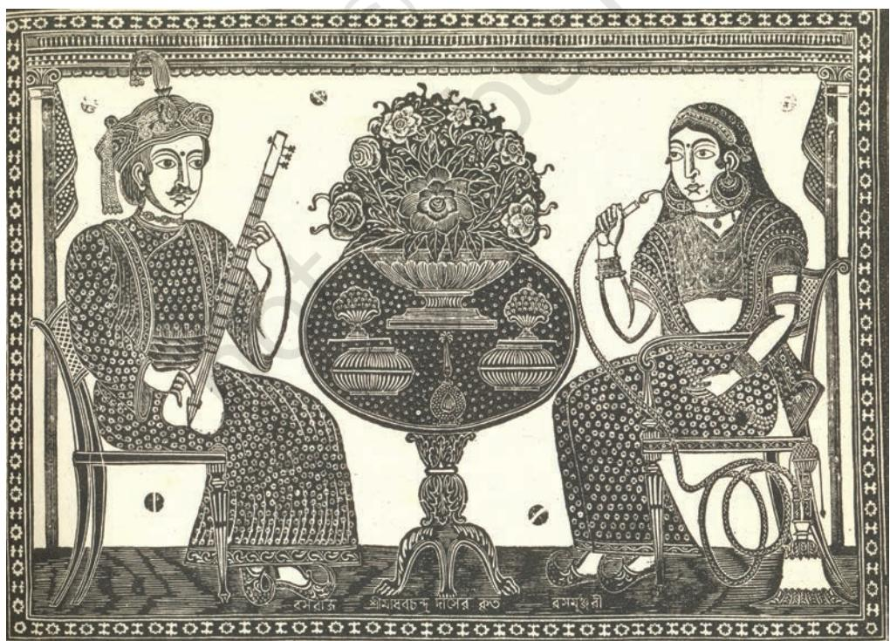

#### Fig. 20 – An Indian couple, black and white woodcut.

The image shows the artist's fear that the cultural impact of the West has turned the family upside down. Notice that the man is playing the veena while the woman is smoking a hookah. The move towards women's education in the late nineteenth century created anxiety about the breakdown of traditional family roles.

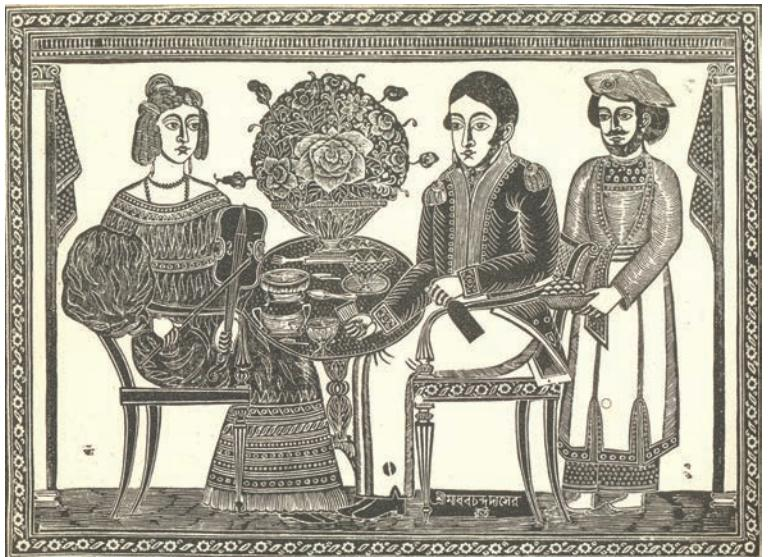

Fig. 21 – A European couple sitting on chairs, nineteenth-century woodcut. The picture suggests traditional family roles. The Sahib holds a liquor bottle in his hand while the Memsahib plays the violin.

### **8.2 Print and the Poor People**

Very cheap small books were brought to markets in nineteenth-century Madras towns and sold at crossroads, allowing poor people travelling to markets to buy them. Public libraries were set up from the early twentieth century, expanding the access to books. These libraries were located mostly in cities and towns, and at times in prosperous villages. For rich local patrons, setting up a library was a way of acquiring prestige.

From the late nineteenth century, issues of caste discrimination began to be written about in many printed tracts and essays. Jyotiba Phule, the Maratha pioneer of 'low caste' protest movements, wrote about the injustices of the caste system in his Gulamgiri (1871). In the twentieth century, B.R.Ambedkar in Maharashtra and E.V. Ramaswamy Naicker in Madras, better known as Periyar, wrote powerfully on caste and their writings were read by people all over India. Local protest movements and sects also created a lot of popular journals and tracts criticising ancient scriptures and envisioning a new and just future.

Workers in factories were too overworked and lacked the education to write much about their experiences. But Kashibaba, a Kanpur millworker, wrote and published Chhote Aur Bade Ka Sawal in 1938 to show the links between caste and class exploitation. The poems of another Kanpur millworker, who wrote under the name of Sudarshan Chakr between 1935 and 1955, were brought together and published in a collection called Sacchi Kavitayan. By the 1930s, Bangalore cotton millworkers set up libraries to educate themselves, following the example of Bombay workers. These were sponsored by social reformers who tried to restrict excessive drinking among them, to bring literacy and, sometimes, to propagate the message of nationalism.

### Activity

Look at Figs. 19, 20 and 21 carefully.

- Ø What comment are the artists making on the social changes taking place in society?
- Ø What changes in society were taking place to provoke this reaction?
- Ø Do you agree with the artist's view?

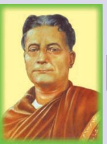

Fig. 22 – Lakshminath Bezbaruah (1868–1938)

He was a doyen of modern Assamese literature. Burhi Aair Sadhu (Grandma's Tales) is among his notable works. He penned the popular song of Assam, 'O Mor Apunar Desh' (O' my beloved land).

### **9 Print and Censorship**

Before 1798, the colonial state under the East India Company was not too concerned with censorship. Strangely, its early measures to control printed matter were directed against Englishmen in India who were critical of Company misrule and hated the actions of particular Company officers. The Company was worried that such criticisms might be used by its critics in England to attack its trade monopoly in India.

By the 1820s, the Calcutta Supreme Court passed certain regulations to control press freedom and the Company began encouraging publication of newspapers that would celebrate Britsh rule. In 1835, faced with urgent petitions by editors of English and vernacular newspapers, Governor-General Bentinck agreed to revise press laws. Thomas Macaulay, a liberal colonial official, formulated new rules that restored the earlier freedoms.

After the revolt of 1857, the attitude to freedom of the press changed. Enraged Englishmen demanded a clamp down on the 'native' press. As vernacular newspapers became assertively nationalist, the colonial government began debating measures of stringent control. In 1878, the Vernacular Press Act was passed, modelled on the Irish Press Laws. It provided the government with extensive rights to censor reports and editorials in the vernacular press. From now on the government kept regular track of the vernacular newspapers published in different provinces. When a report was judged as seditious, the newspaper was warned, and if the warning was ignored, the press was liable to be seized and the printing machinery confiscated.

Despite repressive measures, nationalist newspapers grew in numbers in all parts of India. They reported on colonial misrule and encouraged nationalist activities. Attempts to throttle nationalist criticism provoked militant protest. This in turn led to a renewed cycle of persecution and protests. When Punjab revolutionaries were deported in 1907, Balgangadhar Tilak wrote with great sympathy about them in his Kesari. This led to his imprisonment in 1908, provoking in turn widespread protests all over India.

### **Box 4**

Sometimes, the government found it hard to find candidates for editorship of loyalist papers. When Sanders, editor of the Statesman that had been founded in 1877, was approached, he asked rudely how much he would be paid for suffering the loss of freedom. The Friend of India refused a government subsidy, fearing that this would force it to be obedient to government commands.

#### **Box 5**

The power of the printed word is most often seen in the way governments seek to regulate and suppress print. The colonial government kept continuous track of all books and newspapers published in India and passed numerous laws to control the press.

During the First World War, under the Defence of India Rules, 22 newspapers had to furnish securities. Of these, 18 shut down rather than comply with government orders. The Sedition Committee Report under Rowlatt in 1919 further strengthened controls that led to imposition of penalties on various newspapers. At the outbreak of the Second World War, the Defence of India Act was passed, allowing censoring of reports of war-related topics. All reports about the Quit India movement came under its purview. In August 1942, about 90 newspapers were suppressed.

### **Source F**

#### Gandhi said in 1922:

**Source** 'Liberty of speech ... liberty of the press ... freedom of association. The Government of India is now seeking to crush the three powerful vehicles of expressing and cultivating public opinion. The fight for Swaraj, for Khilafat ... means a fight for this threatened freedom before all else ...'

### Write in brief

- 1. Give reasons for the following:
	- a) Woodblock print only came to Europe after 1295.
	- b) Martin Luther was in favour of print and spoke out in praise of it.
	- c) The Roman Catholic Church began keeping an Index of Prohibited books from the mid-sixteenth century.
	- d) Gandhi said the fight for Swaraj is a fight for liberty of speech, liberty of the press, and freedom of association.
- 2. Write short notes to show what you know about:
	- a) The Gutenberg Press
	- b) Erasmus's idea of the printed book
	- c) The Vernacular Press Act
- 3. What did the spread of print culture in nineteenth century India mean to:
	- a) Women
	- b) The poor
	- c) Reformers

### Discuss

- 1. Why did some people in eighteenth century Europe think that print culture would bring enlightenment and end despotism?
- 2. Why did some people fear the effect of easily available printed books? Choose one example from Europe and one from India.

Discuss

Project

Write in brief

- 3. What were the effects of the spread of print culture for poor people in nineteenth century India?
- 4. Explain how print culture assisted the growth of nationalism in India.

### Project

Find out more about the changes in print technology in the last 100 years. Write about the changes, explaining why they have taken place, what their consequences have been.

