# i early societies

# **Writing and City Life**

1

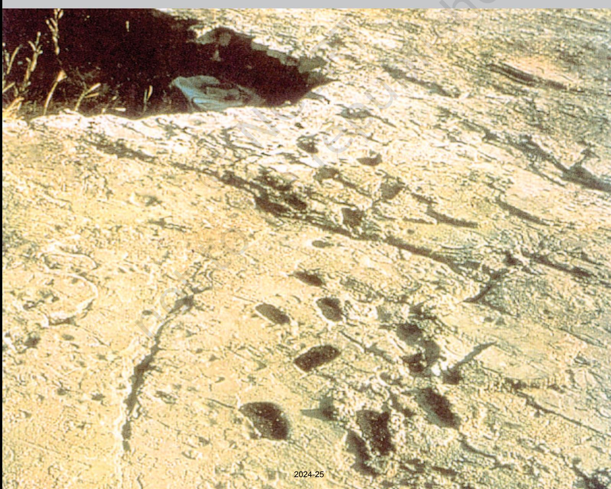

# early societies

2 THEMES IN WORLD HISTORY

I N this section, we will read about early societies which is often traced to the beginnings of human existence, from the remote past, millions of years ago. Your teachers will inform you how humans first emerged in Africa and how archaeologists have studied these early phases of history from remains of bones and stone tools.

Archaeologists have made attempts to reconstruct the lives of early people – to find out about the shelters in which they lived, the food they ate by gathering plant produce and hunting animals, and the ways in which they expressed themselves. Other important developments included the use of fire and of language. And, finally, you can find out whether the lives of people who live by hunting and gathering today can help us to understand the past.

Theme 1, included in the section, deals with some of the earliest cities – those of Mesopotamia, present-day Iraq. These cities developed around temples, and were centres of long-distance trade. Archaeological evidence – remains of old settlements – and an abundance of written material are used to reconstruct the lives of the different people who lived there – craftspeople, scribes, labourers, priests, kings and queens. You will notice how pastoral people played an important role in some of these towns. A question to think about is whether the many activities that went on in cities would have been possible if writing had not developed.

You may wonder as to how people who for millions of years had lived in forests, in caves or temporary shelters and rock shelters began to eventually live in villages and cities. Well, the story is a long one and is related to several developments that took place at least 5,000 years before the establishment of the first cities.

One of the most far-reaching changes was the gradual shift from nomadic life to settled agriculture, which began around 10,000 years ago. As you will be informed by your teacher, prior to the adoption of agriculture, people had gathered plant produce as a source of food. Slowly, they learnt more about different kinds of plants – where they grew, the seasons when they bore fruit and so on. From this, they learnt to grow plants. In West Asia, wheat and barley, peas and various kinds of pulses were grown. In East and Southeast Asia, the crops that grew easily were millet and rice. Millet was also grown in Africa. Around the same time, people learnt how to domesticate animals such as sheep, goat, cattle, pig and donkey. Plant fibres such as cotton and flax, and animal fibres such as wool were now woven into cloth. Somewhat later, about 5,000 years ago, domesticated animals such as cattle and donkeys were harnessed to ploughs and carts.

These developments led to other changes as well. When people grew crops, they had to stay in the same place till the crops ripened. So, settled life became more common. And with that, people built more permanent structures in which to live.

This was also the time when some communities learnt how to make earthen pots. These were used to store grain and other produce, and to prepare and cook a variety of foods made from the new grains that were cultivated. In fact, a great deal of attention was given to processing foods to make them tasty and digestible.

The way stone tools were made also changed. While earlier methods of making tools continued, some tools and equipment were now smoothened and polished by an elaborate process of grinding. New equipment included mortars and pestles for processing and grinding grain, as well as stone axes and hoes, which were used to clear land for cultivation, as well as for digging the earth to sow seeds.

In some areas, people learnt to tap the ores of metals such as copper and tin. Sometimes, copper ores were collected and used for their distinctive bluish-green colour. This prepared the way for the more extensive use of metal for jewellery and for tools subsequently.

There was also a growing familiarity with other kinds of produce from distant lands (and seas). This included wood, stones, including precious and semi-precious stones, metals and shell, and obsidian (hardened) volcanic lava. Clearly, people were going from place to place, carrying goods and ideas with them.

With increasing trade, the growth of villages and towns, and the movements of people, in place of the small communities of early people there now grew small states. While these changes took place slowly, over several thousand years, the pace quickened with the growth of the first cities. Also, the changes had far-reaching consequences. Some scholars have described

- 4 THEMES IN WORLD HISTORY
this as a revolution, as the lives of people were probably transformed beyond recognition. Look out for continuities and changes as you explore these two contrasting themes in early history.

Remember too, that we have selected only some examples of early societies for detailed study. There were other kinds of early societies, including farming communities and pastoral peoples. And there were other peoples who were hunter-gatherers as well as city dwellers, apart from the examples selected. Timeline I gives you some hints about those societies and people.

#### **How to Read Timelines**

You will find a timeline like this one in every section.

Each of these will indicate some of the major processes and events in world history.

As you study the timelines, remember—

- Processes through which ordinary women and men have shaped history are far more difficult to date than events such as a war between kings.
- Some dates may indicate the beginning of a process, or when it reaches maturation.
- Historians are constantly revising dates in the light of new evidence, or new ways of assessing old data.
- While we have divided the timelines on a geographical basis as a matter of convenience, actual historical developments often transcend these divisions.
- Also, there is a chronological overlap in historical processes.
- Only some landmarks in human history have been shown here – we have highlighted the processes dealt with in the themes that follow, which also have separate timelines.
- Wherever you see a*, you will also find an illustration related to the date along the column.
- Blank spaces do not mean that nothing was happening – sometimes these indicate that we do not as yet know what was happening.
- You will be learning more about South Asian history in general and Indian history in particular next year. The dates selected for South Asia are only indicative of some of the developments in the subcontinent.

# Timeline i (6 MYA TO 1 BCE)

TIMELINE-I 5

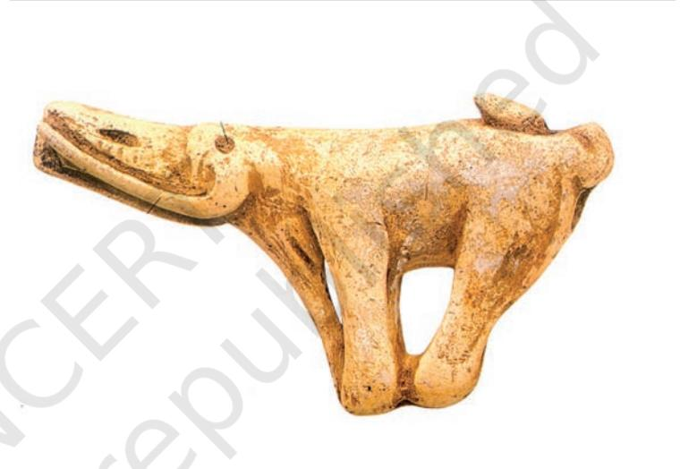

This timeline focuses on the emergence of humans and the domestication of plants and animals. It highlights some major technological developments such as the use of fire, metals, plough agriculture and the wheel. Other processes that are shown include the emergence of cities and the use of writing. You will also find mention of some of the earliest empires – a theme that will be developed in Timeline II.

| DATES | AFRICA | EUROPE |
| --- | --- | --- |
| 6 mya-500,000 BP | Australopithecus fossils (5.6 mya) |  |
|  | Evidence of use of fire (1.4 mya) |  |
| 500,000-150,000 BP | Homo sapiens fossils (195,000 BP) | Evidence of use of fire (400,000 BP) |
| 150,000-50,000 BP |  |  |
| 50,000-30,000 |  | Homo sapiens fossils (40,000) |
| 30,000-10,000 | Paintings in caves/rock shelters (27,500) | Paintings in caves/rock shelters |
|  |  | (especially France and Spain) |
| 8000-7000 BCE |  |  |
| 7000-6000 | Domestication of cattle and dogs |  |
| 6000-5000 |  | Cultivation of wheat and barley (Greece) |
| 5000-4000 |  |  |
| 4000-3000 | Domestication of donkey, cultivation of | Use of copper (Crete) |
|  | millet, use of copper |  |
| 3000-2000 | Plough agriculture, first kingdoms, cities, | Domestication of horse (eastern Europe) |
|  | pyramids, calendar, hieroglyphic script*, |  |
|  | writing on papyrus (Egypt) |  |
| 2000-1900 |  | Cities, palaces, use of bronze, the potter's |
|  |  | wheel, development of trade (Crete) |
| 1900-1800 |  |  |
| 1800-1700 |  |  |
| 1700-1600 |  | Development of a script (Crete)* |
| 1600-1500 |  |  |
| 1500-1400 | Use of glass bottles (Egypt) |  |
| 1400-1300 |  |  |
| 1300-1200 |  |  |
| 1200-1100 |  |  |
| 1100-1000 |  | Use of iron |
| 1000-900 |  |  |
| 900-800 | City of Carthage established in North |  |
|  | Africa by the Phoenicians from West Asia; |  |
|  | growing trade around the Mediterranean |  |
| 800-700 | Use of iron (Sudan) | First Olympic games (Greece, 776 BCE) |
| 700-600 | Use of iron (Egypt) |  |
| 600-500 |  | Use of coins* (Greece); establishment of |
|  |  | the Roman republic (510 BCE) |
| 500-400 | Persians invade Egypt | Establishment of a 'democracy' in Athens |
|  |  | (Greece) |
| 400-300 | Establishment of Alexandria, Egypt (332 | Alexander of Macedonia conquers Egypt |
|  | BCE), which becomes a major centre of | and parts of West Asia (336-323 BCE) |
|  | learning |  |
| 300-200 |  |  |
| 200-100 |  |  |
| 100-1 BCE |  |  |

| DATES | ASIA | SOUTH ASIA |
| --- | --- | --- |
| 6mya-500,000 BP | Use of fire (700,000 BP, China) | Stone age site in Riwat (1,900,000 BP, |
|  |  | Pakistan) |
| 500,000-150,000 BP |  |  |
| 150,000-50,000 BP | Homo sapiens fossils (100,000 BP, West |  |
|  | Asia) |  |
| 50,000-30,000 BP |  |  |
| 30,000-10,000 BP | Domestication of dog (14,000, West Asia) | Cave paintings at Bhimbetka (Madhya |
|  |  | Pradesh); Homo sapiens fossils (25,500 |
|  |  | BP, Sri Lanka) |
| 8000-7000 BCE | Domestication of sheep and goat, |  |
|  | cultivation of wheat and barley (West Asia) |  |
| 7000-6000 | Domestication of pig and cattle (West | Early agricultural settlements (Baluchistan) |
|  | and East Asia) |  |
| 6000-5000 | Domestication of chicken, cultivation of |  |
|  | millet and yam (East Asia) |  |
| 5000-4000 | Cultivation of cotton (South Asia); use of |  |
|  | copper (West Asia) |  |
| 4000-3000 | Use of the potter's wheel, wheel for | Use of copper |
|  | transport (3600 BCE), writing (3200 BCE, |  |
|  | Mesopotamia), use of bronze |  |
| 3000-2000 | Plough agriculture, cities (Mesopotamia); silk | Cities of the Harappan civilisation, use of |
|  | making (China); domestication of horse (Central | script* (c.2700 BCE) |
|  | Asia); cultivation of rice (Southeast Asia) |  |
| 2000-1900 | Domestication of water-buffalo (East Asia) |  |
| 1900-1800 |  |  |
| 1800-1700 |  |  |
| 1700-1600 |  |  |
| 1600-1500 | Cities, writing, kingdoms (Shang |  |
|  | dynasty), use of bronze (China)* |  |
| 1500-1400 | Use of iron (West Asia) | Composition of the Rig Veda |
| 1400-1300 |  |  |
| 1300-1200 |  |  |
| 1200-1100 |  | Use of iron, megaliths (Deccan and South |
|  |  | India) |
| 1100-1000 | Domestication of the one-humped camel (Arabia) |  |
| 1000-900 |  |  |
| 900-800 |  |  |
| 800-700 |  |  |
| 700-600 |  |  |
| 600-500 | Use of coins (Turkey); Persian empire (546 | Cities and states in several areas, first |
|  | BCE) with capital at Persepolis; Chinese | coins, spread of Jainism and Buddhism |
|  | philosopher Confucius (c. 551 BCE) |  |
| 500-400 |  |  |
| 400-300 |  | Establishment of the Mauryan empire |
|  |  | (c. 321 BCE) |
| 300-200 | Establishment of an empire in China (221 |  |
|  | BCE), beginning of the construction of the |  |
|  | Great Wall |  |
| 200-100 |  |  |
| 100-1 BCE |  |  |

| DATES | AMERICAS | AUSTRALIA/PACIFIC ISLANDS |
| --- | --- | --- |
| 6 mya-500,000 BP |  |  |
| 500,000-150,000 BP |  |  |
| 150,000-50,000 BP |  |  |
| 50,000-30,000 BP |  | Homo sapiens fossils, earliest indications |
|  |  | of sea-faring (45,000 BP) |
| 30,000-10,000 BP | Homo sapiens fossils (12,000 BP) | Paintings (20,000 BP) |
| 8000-7000 BCE |  |  |
| 7000-6000 | Cultivation of squash |  |
| 6000-5000 |  |  |
| 5000-4000 | Cultivation of beans | ACTIVITY |
| 4000-3000 | Cultivation of cotton, bottle gourd | Choose one date |
| 3000-2000 | Domestication of guinea pig, turkey, | from each of the |
|  | cultivation of maize | six columns and |
|  |  | discuss the |
| 2000-1900 | Cultivation of potato, chilli*, cassava, | possible |
|  | peanut, domestication of llama* and alpaca | significance of |
|  |  | the process/ |
| 1900-1800 |  | event for men |
| 1800-1700 |  | and women |
|  |  | living in the |
| 1700-1600 |  | region. |
| 1600-1500 |  |  |
| 1500-1400 |  |  |
| 1400-1300 |  |  |
| 1300-1200 |  |  |
| 1200-1100 | Olmec settlements around the Gulf of | Settlements in Polynesia and Micronesia |
|  | Mexico, early temples and sculpture |  |
| 1100-1000 |  |  |
| 1000-900 | Development of a hieroglyphic script |  |
| 900-800 |  |  |
| 800-700 |  |  |
| 700-600 |  |  |
| 600-500 |  |  |
| 500-400 |  |  |
| 400-300 |  |  |
| 300-200 |  |  |
| 200-100 |  |  |
| 100-1 BCE |  |  |

# writing and city life

*CITY life began in Mesopotamia***, the land between the Euphrates and the Tigris rivers that is now part of the Republic of Iraq. Mesopotamian civilisation is known for its prosperity, city life, its voluminous and rich literature and its mathematics and astronomy. Mesopotamia's writing system and literature spread to the eastern Mediterranean, northern Syria, and Turkey after 2000 BCE, so that the kingdoms of that entire region were writing to one another, and to the Pharaoh of Egypt, in the language and script of Mesopotamia. Here we shall explore the connection between city life and writing, and then look at some outcomes of a sustained tradition of writing.*

*In the beginning of recorded history, the land, mainly the urbanised south (see discussion below), was called Sumer and Akkad. After 2000 BCE, when Babylon became an important city, the term Babylonia was used for the southern region. From about 1100 BCE, when the Assyrians established their kingdom in the north, the region became known as Assyria. The first known language of the land was Sumerian. It was gradually replaced by Akkadian around 2400 BCE when Akkadian speakers arrived. This language flourished till about Alexander's time (336-323 BCE), with some regional changes occurring. From 1400 BCE, Aramaic also trickled in. This language, similar to Hebrew, became widely spoken after 1000 BCE. It is still spoken in parts of Iraq.*

Archaeology in Mesopotamia began in the 1840s. At one or two sites (including Uruk and Mari, which we discuss below), excavations continued for decades. (No Indian site has ever seen such long-term projects.) Not only can we study hundreds of Mesopotamian buildings, statues, ornaments, graves, tools and seals as sources, there are thousands of written documents.

Mesopotamia was important to Europeans because of references to it in the Old Testament, the first part of the Bible. For instance, the Book of Genesis of the Old Testament refers to 'Shimar', meaning Sumer, as a land of brick-built cities. Travellers and scholars of Europe looked on Mesopotamia as a kind of ancestral land, and when archaeological work began in the area, there was an attempt to prove the literal truth of the Old Testament.

1

THEME

9

*The name Mesopotamia is derived from the Greek words *mesos*, meaning middle, and *potamos*, meaning river.

According to the Bible, the Flood was meant to destroy all life on earth. However, God chose a man, Noah, to ensure that life could continue after the Flood. Noah built a huge boat, an ark. He took a pair each of all known species of animals and birds on board the ark, which survived the Flood. There was a strikingly similar story in the Mesopotamian tradition, where the principal character was called Ziusudra or Utnapishtim.

#### MAP 1: West Asia

#### ACTIVITY 1

Many societies have myths about floods. These are often ways of preserving and expressing memories about important changes in history. Find out more about these, noting how life before and after the flood is represented.

From the mid-nineteenth century there was no stopping the enthusiasm for exploring the ancient past of Mesopotamia. In 1873, a British newspaper funded an expedition of the British Museum to search for a tablet narrating the story of the Flood, mentioned in the Bible.

By the 1960s, it was understood that the stories of the Old Testament were not literally true, but may have been ways of expressing memories about important changes in history. Gradually, archaeological techniques became far more sophisticated and refined. What is more, attention was directed to different questions, including reconstructing the lives of ordinary people. Establishing the literal truth of Biblical narratives receded into the background. Much of what we discuss subsequently in the chapter is based on these later studies.

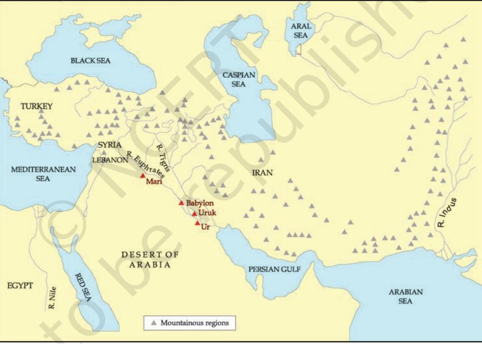

# **Mesopotamia and its Geography**

Iraq is a land of diverse environments. In the north-east lie green, undulating plains, gradually rising to tree-covered mountain ranges with clear streams and wild flowers, with enough rainfall to grow crops. Here, agriculture began between 7000 and 6000 BCE. In the north, there is a stretch of upland called a steppe, where animal herding offers people a better livelihood than agriculture – after the winter rains, sheep and goats feed on the grasses and low shrubs that grow here. To the east, tributaries of the Tigris provide routes of

communication into the mountains of Iran. The south is a desert – and this is where the first cities and writing emerged (see below). This desert could support cities because the rivers Euphrates and Tigris, which rise in the northern mountains, carry loads of silt (fine mud). When they flood or when their water is let out on to the fields, fertile silt is deposited.

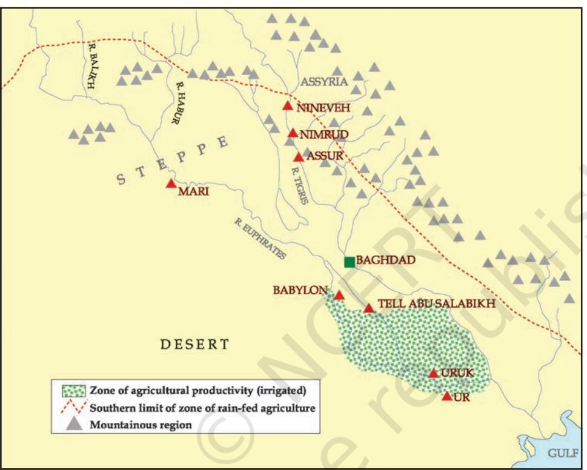

MAP 2: Mesopotamia: Mountains, Steppe, Desert, Irrigated Zone of the South.

After the Euphrates has entered the desert, its water flows out into small channels. These channels flood their banks and, in the past, functioned as irrigation canals: water could be let into the fields of wheat, barley, peas or lentils when necessary. Of all ancient systems, that of the Roman Empire (Theme 3) included, it was the agriculture of southern Mesopotamia that was the most productive, even though the region did not have sufficient rainfall to grow crops.

Not only agriculture, Mesopotamian sheep and goats that grazed on the steppe, the north-eastern plains and the mountain slopes (that is, on tracts too high for the rivers to flood and fertilise) produced meat, milk and wool in abundance. Further, fish was available in rivers and date-palms gave fruit in summer. Let us not, however, make the mistake of thinking that cities grew simply because of rural prosperity. We shall discuss other factors by and by, but first let us be clear about city life.

The earliest cities in Mesopotamia date back to the bronze age, c.3000 BCE. Bronze is an alloy of copper and tin. Using bronze meant procuring these metals, often from great distances. Metal tools were necessary for accurate carpentry, drilling beads, carving stone seals, cutting shell for inlaid furniture, etc. Mesopotamian weapons were also of bronze – for example, the tips of the spears that you see in the illustration on p. 18.

# **The Significance of Urbanism**

Cities and towns are not just places with large populations. It is when an economy develops in spheres other than food production that it becomes an advantage for people to cluster in towns. Urban economies comprise besides food production, trade, manufactures and services. City people, thus, cease to be self-sufficient and depend on the products or services of other (city or village) people. There is continuous interaction among them. For instance, the carver of a stone seal requires bronze tools that he himself cannot make, and coloured stones for the seals that he does not know where to get: his 'specialisation' is fine carving, not trading. The bronze tool maker does not himself go out to get the metals, copper and tin. Besides, he needs regular supplies of charcoal for fuel. The *division of labour* is a mark of urban life.

Further, there must be a social organisation in place. Fuel, metal, various stones, wood, etc., come from many different places for city manufacturers. Thus, organised trade and storage is needed. There are deliveries of grain and other food items from the village to the city, and food supplies need to be stored and distributed. Besides, many different activities have to be coordinated: there must be not only stones but also bronze tools and pots available for seal cutters. Obviously, in such a system some people give commands that others obey, and urban economies often require the keeping of written records.

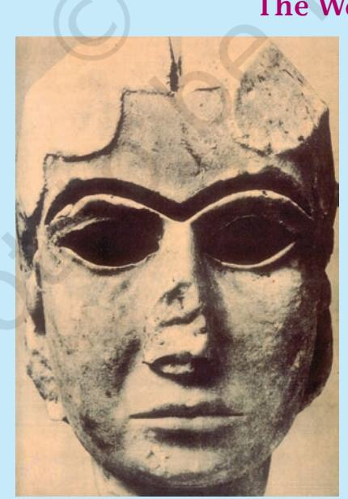

#### **The Warka Head**

This woman's head was sculpted in white marble at Uruk before 3000 BCE. The eyes and eyebrows would probably have taken lapis lazuli (blue) and shell (white) and bitumen (black) inlays, respectively. There is a groove along the top of the head, perhaps for an ornament. This is a world-famous piece of sculpture, admired for the delicate modelling of the woman's mouth, chin and cheeks. And it was modelled in a hard stone that would have been imported from a distance.

*Beginning with the procurement of stone, list all the specialists who*

*would be involved in the production of such a piece of sculpture.*

#### ACTIVITY 2

Discuss whether city life would have been possible without the use of metals.

# **Movement of Goods into Cities**

However rich the food resources of Mesopotamia, its mineral resources were few. Most parts of the south lacked stones for tools, seals and jewels; the wood of the Iraqi date-palm and poplar was not good enough for carts, cart wheels or boats; and there was no metal for tools, vessels or ornaments. So we can surmise that the ancient Mesopotamians could have traded their abundant textiles and agricultural produce for wood, copper, tin, silver, gold, shell and various stones from Turkey and Iran, or across the Gulf. These latter regions had mineral resources, but much less scope for agriculture. Regular exchanges – possible only when there was a social organisation – to equip foreign expeditions and direct the exchanges were initiated by the people of southern Mesopotamia.

Besides crafts, trade and services, efficient transport is also important for urban development. If it takes too much time, or too much animal feed, to carry grain or charcoal into cities on pack animals or bullock carts, the city economy will not be viable. The cheapest mode of transportation is, everywhere, over water. River boats or barges loaded with sacks of grain are propelled by the current of the river and/or wind, but when animals transport goods, they need to be fed. The canals and natural channels of ancient Mesopotamia were in fact routes of goods transport between large and small settlements, and in the account on the city of Mari later in the chapter, the importance of the Euphrates as a 'world route' will become clear.

# **The Development of Writing**

All societies have languages in which certain spoken sounds convey certain meanings. This is verbal communication. Writing too is verbal communication – but in a different way. When we talk about writing or a script, we mean that *spoken sounds*

are represented in *visible signs*.

The first Mesopotamian tablets, written around 3200 BCE, contained picture-like signs and numbers. These were about 5,000 lists of oxen, fish, bread loaves, etc. – lists of goods that were brought into or distributed from the temples of Uruk, a city in the south. Clearly, writing began when society needed to keep records of transactions – because in city life transactions occurred at different times, and involved many people and a variety of goods.

*Clay tablets c.3200 BCE. Each tablet is 3.5 cm or less in height, with picture-like signs (ox, fish, grain, boat) and numbers ( )*

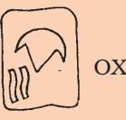

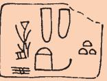

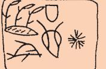

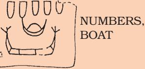

*Cuneiform syllabic signs.*

Mesopotamians wrote on tablets of clay. A scribe would wet clay and pat it into a size he could hold comfortably in one hand.

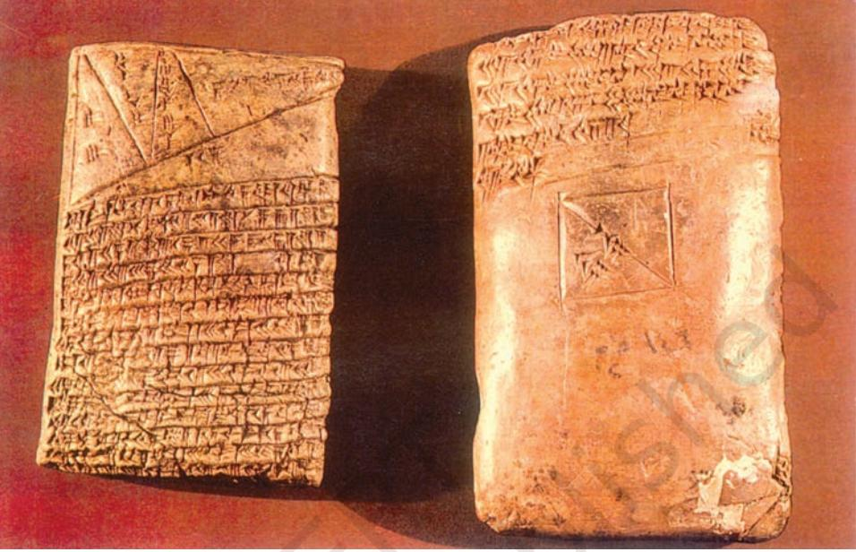

He would carefully smoothen its surfaces. With the sharp end of a reed cut obliquely, he would press wedge-shaped ('cuneiform*') signs on to the smoothened surface while it was still moist. Once dried in the sun, the clay would harden and tablets would be almost as indestructible as pottery. When a written record of, say, the delivery of pieces of metal had ceased to be relevant, the tablet was thrown away. Once the surface dried, signs could not be pressed on to a tablet: so each transaction, however minor, required a separate written tablet. This is why tablets occur by the hundreds at Mesopotamian sites. And it is because of this wealth of sources that we know so much more about Mesopotamia than we do about contemporary India.

By 2600 BCE or so, the letters became cuneiform, and the language was Sumerian. Writing was now used not only for keeping records, but also for making dictionaries, giving legal validity to land transfers, narrating the deeds of kings, and announcing the changes a king had made in the customary laws of the land. Sumerian, the earliest known language of Mesopotamia, was gradually replaced after 2400 BCE by the Akkadian language. Cuneiform writing in the Akkadian language continued in use until the first century CE, that is, for more than 2,000 years.

# **The System of Writing**

The sound that a cuneiform sign represented was not a single consonant or vowel (such as *m* or *a* in the English alphabet), but syllables (say, *put*-,or-*la*-,or-*in*-). Thus, the signs that a Mesopotamian scribe had

*A clay tablet written on both sides in cuneiform. It is a mathematical exercise – you can see a triangle and lines across the triangle on the top of the obverse side. You can see that the letters have been pressed into the clay.*

* Cuneiform is derived from the Latin words *cuneus*, meaning 'wedge' and *forma,* meaning 'shape'.

to learn ran into hundreds, and he had to be able to handle a wet tablet and get it written before it dried. So, writing was a skilled craft but, more important, it was an enormous intellectual achievement, conveying in visual form the system of sounds of a particular language.

#### **Literacy**

Very few Mesopotamians could read and write. Not only were there hundreds of signs to learn, many of these were complex (see p. 33). If a king could read, he made sure that this was recorded in one of his boastful inscriptions! For the most part, however, writing reflected the mode of speaking.

A letter from an official would have to be read out to the king. So it would begin:

'To my lord A, speak: … Thus says your servant B: … I have carried out the work assigned to me ...'

A long mythical poem about creation ends thus:

'Let these verses be held in remembrance and let the elder teach them;

let the wise one and the scholar discuss them;

let the father repeat them to his sons;

let the ears of (even) the herdsman be opened to them.'

# **The Uses of Writing**

The connection between city life, trade and writing is brought out in a long Sumerian epic poem about Enmerkar, one of the earliest rulers of Uruk. In Mesopotamian tradition, Uruk was the city par excellence, often known simply as The City.

 Enmerkar is associated with the organisation of the first trade of Sumer: in the early days, the epic says, 'trade was not known'. Enmerkar wanted lapis lazuli and precious metals for the beautification of a city temple and sent his messenger out to get them from the chief of a very distant land called Aratta. 'The messenger heeded the word of the king. By night he went just by the stars. By day, he would go by heaven's sun divine. He had to go up into the mountain ranges, and had to come down out of the mountain ranges. The people of Susa (a city) below the mountains saluted him like tiny mice***. Five mountain ranges, six mountain ranges, seven mountain ranges he crossed...'

The messenger could not get the chief of Aratta to part with lapis lazuli or silver, and he had to make the long journey back and forth, again and again, carrying threats and promises from the king of Uruk. Ultimately, the messenger 'grew weary of mouth'. He got all the messages mixed up. Then, 'Enmerkar formed a clay tablet in his hand, and he wrote the words down. In those days, there had been no writing down of words on clay.'

***The poet means that once the messenger had climbed to a great height, everything appeared small in the valley far below.

***Cuneiform letters were wedge shaped, hence, like nails.

Given the written tablet, 'the ruler of Aratta examined the clay. The spoken words were nails*. His face was frowning. He kept looking at the tablet.'

This should not be taken as the literal truth, but it can be inferred that in Mesopotamian understanding it was kingship that organised trade and writing. This poem also tells us that, besides being a means of storing information and of sending messages afar, writing was seen as a sign of the superiority of Mesopotamian urban culture.

# **Urbanisation in Southern Mesopotamia: Temples and Kings**

From 5000 BCE, settlements had begun to develop in southern Mesopotamia. The earliest cities emerged from some of these settlements. These were of various kinds: those that gradually developed around temples; those that developed as centres of trade; and imperial cities. It is cities of the first two kinds that will be discussed here.

Early settlers (their origins are unknown) began to build and rebuild temples at selected spots in their villages. The earliest known temple was a small shrine made of unbaked bricks. Temples were the residences of various gods: of the Moon God of Ur, or of Inanna the Goddess of Love and War. Constructed in brick, temples became larger over time, with

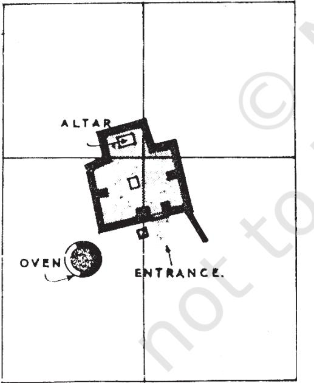

*The earliest known temple of the south, c.5000 BCE (plan).*

several rooms around open courtyards. Some of the early ones were possibly not unlike the ordinary house – for the temple was the house of a god. But temples always had their outer walls going in and out at regular intervals, which no ordinary building ever had.

The god was the focus of worship: to him or her people brought grain, curd and fish (the floors of some early temples had thick layers of fish bones). The god was also the theoretical owner of the agricultural fields, the fisheries, and the herds of the local community. In time, the processing of produce (for example, oil pressing, grain grinding, spinning, and the weaving of woollen cloth) was also done in the temple. Organiser of production at a level above the household, employer of merchants and keeper of written records of distributions and allotments of grain, plough animals, bread, beer, fish, etc., the temple gradually developed its activities and became the main urban institution. But there was also another factor on the scene.

In spite of natural fertility, agriculture was subject to hazards. The natural outlet channels of the Euphrates would have too much water one year and flood the crops, and sometimes they would change course altogether. As the archaeological record shows, villages were periodically relocated in Mesopotamian history. There were man-made problems as well. Those who lived on the

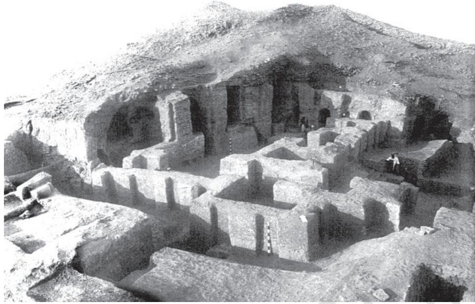

*A temple of a later period, c.3000 BCE, with an open courtyard and in-andout façade (as excavated).*

upstream stretches of a channel could divert so much water into their fields that villages downstream were left without water. Or they could neglect to clean out the silt from their stretch of the channel, blocking the flow of water further down. So the early Mesopotamian countryside saw repeated conflict over land and water.

When there was continuous warfare in a region, those chiefs who had been successful in war could oblige their followers by distributing the loot, and could take prisoners from the defeated groups to employ as their guards or servants. So they could increase their influence and clout. Such war leaders, however, would be here today and gone tomorrow – until a time came when such leadership came to increase the well-being of the community with the creation of new institutions or practices. In time, victorious chiefs began to offer precious booty to the gods and thus beautify the community's temples. They would send men out to fetch fine stones and metal for the benefit of the god and community and organise the distribution of temple wealth in an efficient way by accounting for things that came in and went out. As the poem about Enmerkar shows, this gave the king high status and the authority to command the community.

We can imagine a mutually reinforcing cycle of development in which leaders encouraged the settlement of villagers close to themselves, to be able to rapidly get an army together. Besides, people would be safe living in close proximity to one another. At Uruk, one of the earliest temple towns, we find depictions of armed heroes and their victims, and careful archaeological surveys have shown that around 3000 BCE, when Uruk grew to the enormous extent of 250 hectares – twice as large as Mohenjo-daro would be in later centuries – dozens of small villages were deserted. There had

been a major population shift. Significantly, Uruk also came to have a defensive wall at a very early date. The site was continuously occupied from about 4200 BCE to about 400 CE, and by about 2800 BCE it had expanded to 400 hectares.

> War captives and local people were put to work for the temple, or directly for the ruler. This, rather than agricultural tax, was compulsory. Those who were put to work were paid rations. Hundreds of ration lists have been found, which give, against people's names, the quantities of grain, cloth or oil allotted to them. It has been estimated that one of the temples took 1,500 men working 10 hours a day, five years to build.

With rulers commanding people to fetch stones or metal ores, to come and make bricks or lay the bricks for a temple, or else to go to a distant country to fetch suitable materials, there were also technical advances at Uruk around 3000 BCE. Bronze tools came into use for various crafts. Architects learnt to construct brick columns, there being no suitable wood to bear the weight of

the roof of large halls.

Hundreds of people were put to work at making and baking clay cones that could be pushed into temple walls, painted in different colours, creating a colourful mosaic. In sculpture, there were superb achievements, not in easily available clay but in imported stone. And then there was a technological landmark that we can say is appropriate to an urban economy: the potter's wheel. In the long run, the wheel enables a potter's workshop to 'mass produce' dozens of similar pots at a time.

*Steles are stone slabs with inscriptions or carvings.

*Impression of a cylinder seal, c.3200 BCE. The bearded and armed standing figure is similar in dress and hairstyle to the hero in the stele* shown above. Note three prisoners of war, their arms bound, and a fourth man beseeching the war leader.*

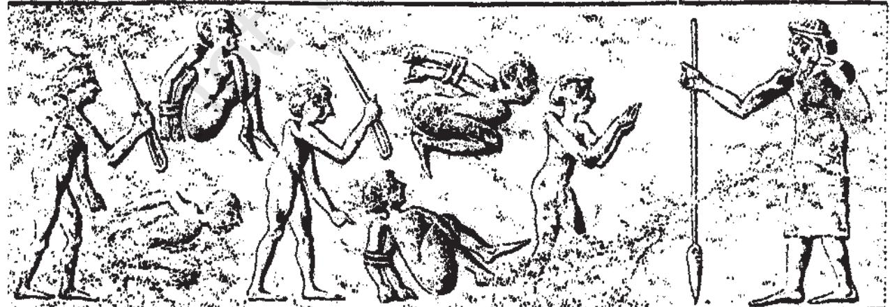

*a lion with a huge bow and arrow. In the scene above, the hero finally kills the rampant lion with a spear (c.3200 BCE).*

*Top: Basalt stele* showing a bearded man twice. Note his headband and hair, waistband and long skirt. In the lower scene he attacks*

#### **The Seal – An Urban Artefact**

In India, early stone seals were stamped. In Mesopotamia until the end of the first millennium BCE, cylindrical stone seals, pierced down the centre, were fitted with a stick and rolled over wet clay so that a continuous picture was created. They were carved by very skilled craftsmen, and sometimes carry writing: the name of the owner, his god, his official position, etc. A seal could be rolled on clay covering the string knot of a cloth package or the mouth of a pot, keeping the contents safe. When rolled on a letter written on a clay tablet, it became a mark of authenticity. So the seal was the mark of a city dweller's role in public life.

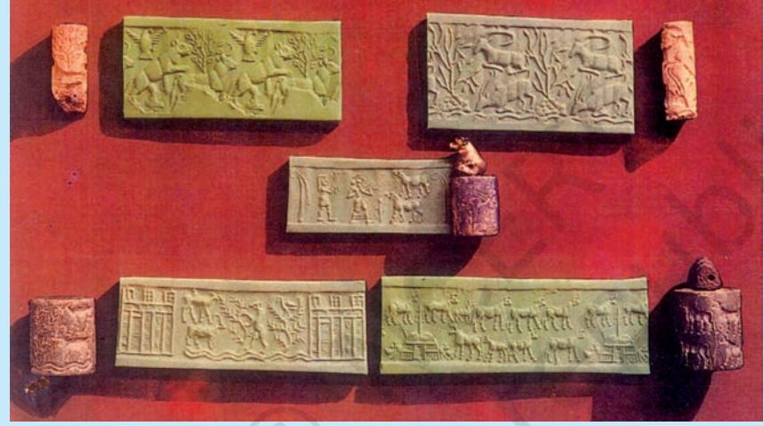

*Five early cylinder seals and their impressions.* Describe what you see in each of the impressions. Is the cuneiform script shown on them?

### **Life in the City**

What we have seen is that a ruling elite had emerged: a small section of society had a major share of the wealth. Nothing makes this fact as clear as the enormous riches (jewellery, gold vessels, wooden musical instruments inlaid with white shell and lapis lazuli, ceremonial daggers of gold, etc.) buried with some kings and queens at Ur. But what of the ordinary people?

We know from the legal texts (disputes, inheritance matters, etc.) that in Mesopotamian society the nuclear family*** was the norm, although a married son and his family often resided with his parents. The father was the head of the family. We know a little about the procedures for marriage. A declaration was made about the willingness to marry, the bride's parents giving their consent to the marriage. Then a gift was given by the groom's people to the bride's

*A nuclear family comprises a man, his wife and children.

people. When the wedding took place, gifts were exchanged by both parties, who ate together and made offerings in a temple. When her mother-in-law came to fetch her, the bride was given her share of the inheritance by her father. The father's house, herds, fields, etc., were inherited by the sons.

Let us look at Ur, one of the earliest cities to have been excavated. Ur was a town whose ordinary houses were systematically excavated in the 1930s. Narrow winding streets indicate that wheeled carts could not have reached many of the houses. Sacks of grain and firewood would have arrived on donkey-back. Narrow winding streets and the irregular shapes of house plots also indicate an absence of town planning. There were no street drains of the kind we find in contemporary Mohenjo-daro. Drains and clay pipes were instead found in the inner courtyards of the Ur houses and it is thought that house roofs sloped inwards and rainwater was channelled via the drainpipes into sumps*** in the inner courtyards. This would have been a way

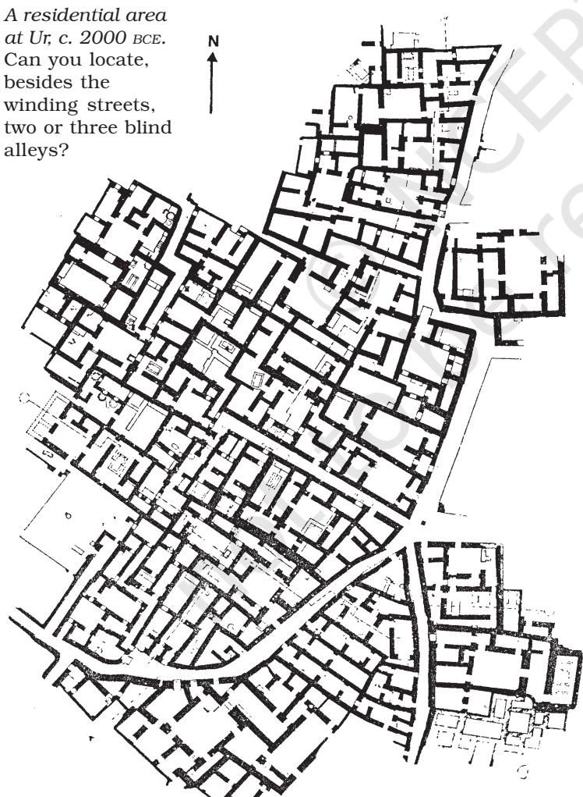

of preventing the unpaved streets from becoming excessively slushy after a downpour.

Yet people seem to have swept all their household refuse into the streets, to be trodden underfoot! This made street levels rise, and over time the thresholds of houses had also to be raised so that no mud would flow inside after the rains. Light came into the rooms not from windows but from doorways opening into the courtyards: this would also have given families their privacy. There were superstitions about houses, recorded in omen tablets at Ur: a raised threshold brought wealth; a front door that did not open towards another house was lucky; but if the main wooden door of a house opened outwards (instead of inwards), the wife would be a torment to her husband!

There was a town cemetery at Ur in which the graves of royalty and commoners have been found, but a few individuals were found buried under the floors of ordinary houses.

*A sump is a covered basin in the ground into which water and sewage flow.

# **A Trading Town in a Pastoral Zone**

After 2000 BCE the royal capital of Mari flourished. You will have noticed (see Map 2) that Mari stands not on the southern plain with its highly productive agriculture but much further upstream on the Euphrates. Map 3 with its colour coding shows that agriculture and animal rearing were carried out close to each other in this region. Some communities in the kingdom of Mari had both farmers and pastoralists, but most of its territory was used for pasturing sheep and goats.

Herders need to exchange young animals, cheese, leather and meat in return for grain, metal tools, etc., and the manure of a penned flock is also of great use to a farmer. Yet, at the same time, there may be conflict. A shepherd may take his flock to water across a sown field, to the ruin of the crop. Herdsmen being mobile can raid agricultural villages and seize their stored goods. For their part, settled groups may deny pastoralists access to river and canal water along a certain set of paths.

Through Mesopotamian history,

nomadic communities of the western desert filtered into the prosperous agricultural heartland. Shepherds would bring their flocks into the sown area in the summer. Such groups would come in as herders, harvest labourers or hired soldiers, occasionally become prosperous, and settle down. A few gained the power to establish their own rule. These included the Akkadians, Amorites, Assyrians and Aramaeans. (You will read more about rulers from pastoral societies in Theme 3.) The kings of Mari were Amorites whose dress differed from that of the original inhabitants and who respected not only the gods of Mesopotamia but also raised a temple at Mari for Dagan, god of the steppe. Mesopotamian society and culture were thus open to different people and cultures, and the vitality of the civilisation was perhaps due to this intermixture.

*A warrior holding a long spear and a wicker shield. Note the dress, typical of Amorites, and different from that of the Sumerian warrior shown on p. 18. This picture was incised on shell, c.2600 BCE.*

MAP 3: The Location of Mari

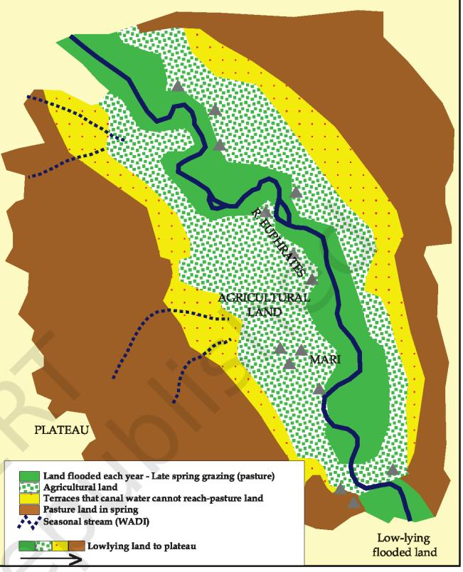

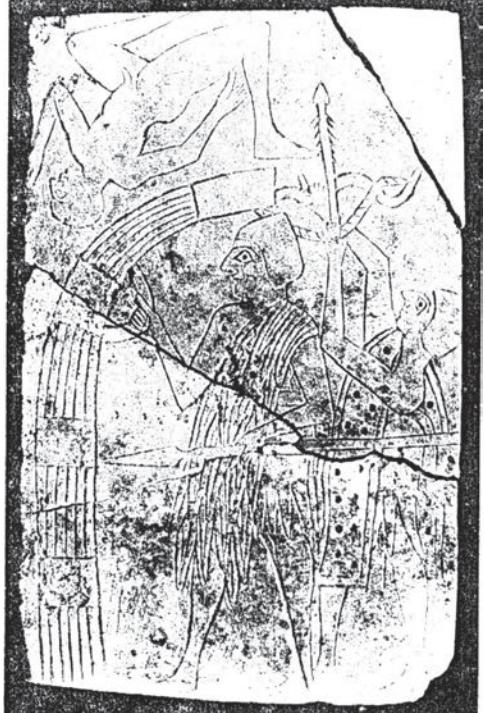

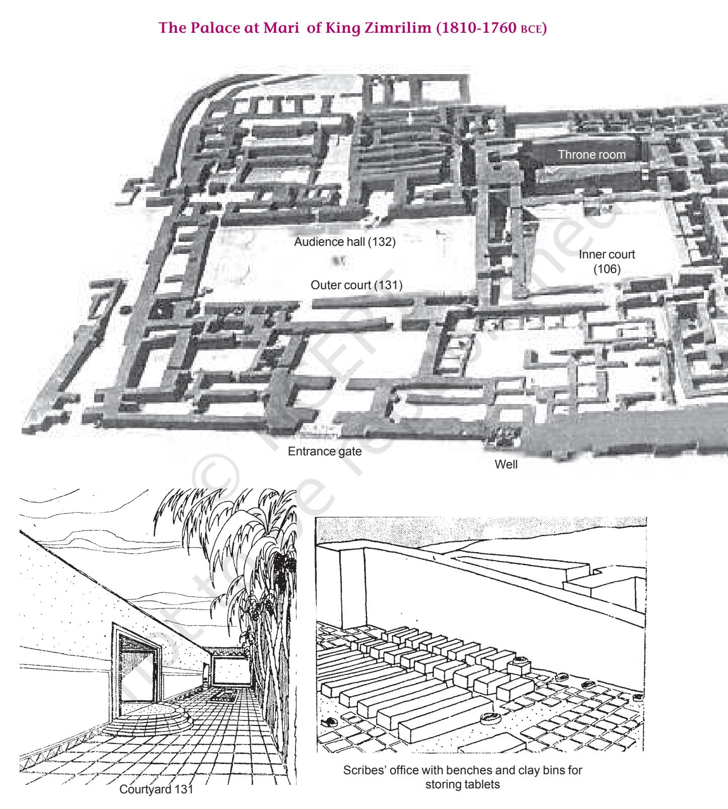

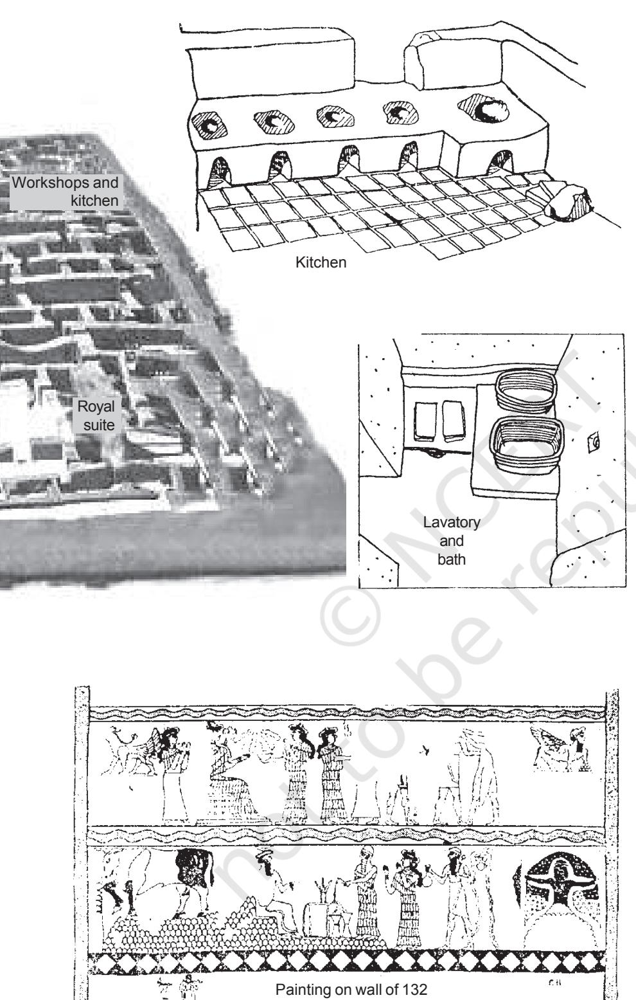

## **The Palace at Mari of King Zimrilim (1810-1760 BCE)**

The great palace of Mari was the residence of the royal family, the hub of administration, and a place of production, especially of precious metal ornaments. It was so famous in its time that a minor king came from north Syria just to see it, carrying with him a letter of introduction from a royal friend of the king of Mari, Zimrilim. Daily lists reveal that huge quantities of food were presented each day for the king's table: flour, bread, meat, fish, fruit, beer and wine. He probably ate in the company of many others, in or around courtyard **106**, paved white. You will notice from the plan that the palace had only one entrance, on the north. The large, open courtyards such as **131** were beautifully paved. The king would have received foreign dignitaries and his own people in **132**, a room with wall paintings that would have awed the visitors. The palace was a sprawling structure, with 260 rooms and covered an area of 2.4 hectares.

#### ACTIVITY 3

Trace the route from the entrance to the inner court. What do you think would have been kept in the storerooms? How has the kitchen been identified?

The kings of Mari, however, had to be vigilant; herders of various tribes were allowed to move in the kingdom, but they were watched. The camps of herders are mentioned frequently in letters between kings and officials. In one letter, an officer writes to the king that he has been seeing frequent fire signals at night – sent by one camp to another – and he suspects that a raid or an attack is being planned.

Located on the Euphrates in a prime position for trade – in wood, copper, tin, oil, wine, and various other goods that were carried in boats along the Euphrates – between the south and the mineral-rich uplands of Turkey, Syria and Lebanon, Mari is a good example of an urban centre prospering on trade. Boats carrying grinding stones, wood, and wine and oil jars, would stop at Mari on their way to the southern cities. Officers of this town would go aboard, inspect the cargo (a single river boat could hold 300 wine jars), and levy a charge of about one-tenth the value of the goods before allowing the boat to continue downstream. Barley came in special grain boats. Most important, tablets refer to copper from 'Alashiya', the island of Cyprus, known for its copper, and tin was also an item of trade. As bronze was the main industrial material for tools and weapons, this trade was of great importance. Thus, although the kingdom of Mari was not militarily strong, it was exceptionally prosperous.

#### **Excavating Mesopotamian Towns**

Today, Mesopotamian excavators have much higher standards of accuracy and care in recording than in the old days, so that few dig huge areas the way Ur was excavated. Moreover, few archaeologists have the funds to employ large teams of excavators. Thus, the mode of obtaining data has changed.

Take the small town at Abu Salabikh, about 10 hectares in area in 2500 BCE with a population less than 10,000. The outlines of walls were at first traced by scraping surfaces. This involves scraping off the top few millimetres of the mound with the sharp and wide end of a shovel or other tool. While the soil underneath was still slightly moist, the archaeologist could make out different colours, textures and lines of brick walls or pits or other features. A few houses that were discovered were excavated. The archaeologists also sieved through tons of earth to recover plant and animal remains, and in the process identified many species of plants and animals and found large quantities of charred fish bones that had been swept out on to the streets. Plant seeds and fibre remained after dung cakes had been burned as fuel and thus kitchens were identified. Living rooms were those with fewer traces. Because they found the teeth of very young pigs on the streets, archaeologists concluded that pigs must have roamed freely here as in any other Mesopotamian town. In fact, one house burial contained some pig bones – the dead person must have been given some pork for his nourishment in the afterlife! The archaeologists also made microscopic studies of room floors to decide which rooms in a house were roofed (with poplar logs, palm leaves, straw, etc.) and which were open to the sky.

# **Cities in Mesopotamian Culture**

Mesopotamians valued city life in which people of many communities and cultures lived side by side. After cities were destroyed in war, they recalled them in poetry.

The most poignant reminder to us of the pride Mesopotamians took in their cities comes at the end of the Gilgamesh Epic, which was written on twelve tablets. Gilgamesh is said to have ruled the city of Uruk some time after Enmerkar. A great hero who subdued people far and wide, he got a shock when his heroic friend died. He then set out to find the secret of immortality, crossing the waters that surround the world. After a heroic attempt, Gilgamesh failed, and returned to Uruk. There, he consoled himself by walking along the city wall, back and forth. He admired the foundations made of fired bricks that he had put into place. It is on the city wall of Uruk that the long tale of heroism and endeavour fizzles out. Gilgamesh does not say that even though he will die his sons will outlive him, as a tribal hero would have done. He takes consolation in the city that his people had built.

#### **The Legacy of Writing**

While moving narratives can be transmitted orally, science requires written texts that generations of scholars can read and build upon. Perhaps the greatest legacy of Mesopotamia to the world is its scholarly tradition of time reckoning and mathematics.

Dating around 1800 BCE are tablets with multiplication and division tables, square- and square-root tables, and tables of compound interest. The square root of 2 was given as:

$$1\,+\,24/60\,+\,51/60^{2}+\,10/60^{3}$$

If you work this out, you will find that the answer is 1.41421296, only slightly different from the correct answer, 1.41421356. Students had to solve problems such as the following: a field of area such and such is covered one finger deep in water; find out the volume of water.

The division of the year into 12 months according to the revolution of the moon around the earth, the division of the month into four weeks, the day into 24 hours, and the hour into 60 minutes – all that we take for granted in our daily lives – has come to us from the Mesopotamians. These time divisions were adopted by the successors of Alexander and from there transmitted to the Roman world, then to the world of Islam, and then to medieval Europe (see Theme 5 for how this happened).

Whenever solar and lunar eclipses were observed, their occurrence was noted according to year, month and day. So too there were records about the observed positions of stars and constellations in the night sky.

None of these momentous Mesopotamian achievements would have been possible without writing and the urban institution of schools, where students read and copied earlier written tablets, and where some boys were trained to become not record keepers for the administration, but intellectuals who could build on the work of their predecessors.

We would be mistaken if we think that the preoccupation with the urban world of Mesopotamia is a modern phenomenon. Let us look, finally, at two early attempts to locate and preserve the texts and traditions of the past.

#### **An Early Library**

In the iron age, the Assyrians of the north created an empire, at its height between 720 and 610 BCE, that stretched as far west as Egypt. The state economy was now a predatory one, extracting labour and tribute in the form of food, animals, metal and craft items from a vast subject population.

The great Assyrian kings, who had been immigrants, acknowledged the southern region, Babylonia, as the centre of high culture and the last of them, Assurbanipal (668-627 BCE), collected a library at his capital, Nineveh in the north. He made great efforts to gather tablets on history, epics, omen literature, astrology, hymns and poems. He sent his scribes south to find old tablets. Because scribes in the south were trained to read and write in schools where they all had to copy tablets by the dozen, there were towns in Babylonia where huge collections of tablets were created and acquired fame. And although Sumerian ceased to be spoken after about 1800 BCE, it continued to be taught in schools, through vocabulary texts, sign lists, bilingual (Sumerian and Akkadian) tablets, etc. So even in 650 BCE, cuneiform tablets written as far back as 2000 BCE were intelligible – and Assurbanipal's men knew where to look for early tablets or their copies.

Copies were made of important texts such as the Epic of Gilgamesh, the copier stating his name and writing the date. Some tablets ended with a reference to Assurbanipal:

'I, Assurbanipal, king of the universe, king of Assyria, on whom the gods bestowed vast intelligence, who could acquire the recondite details of scholarly erudition, I wrote down on tablets the wisdom of the gods … And I checked and collated the tablets. I placed them for the future in the library of the temple of my god, Nabu, at Nineveh, for my life and the well-being of my soul, and to sustain the foundations of my royal throne…'

More important, there was cataloguing: a basket of tablets would have a clay label that read: '*n* number of tablets about exorcism, written by X'. Assurbanipal's library had a total of some 1,000 texts, amounting to about 30,000 tablets, grouped according to subject.

#### **And, an Early Archaeologist!**

A man of the southern marshes, Nabopolassar, released Babylonia from Assyrian domination in 625 BCE. His successors increased their territory and organised building projects at Babylon. From that time, even after the Achaemenids of Iran conquered Babylon in 539 BCE and until 331 BCE when Alexander conquered Babylon, Babylon was the premier city of the world, more than 850 hectares, with a triple wall, great palaces and temples, a ziggurat or stepped tower, and a processional way to the ritual centre. Its trading houses had widespread dealings and its mathematicians and astronomers made some new discoveries.

Nabonidus was the last ruler of independent Babylon. He writes that the god of Ur came to him in a dream and ordered him to appoint a priestess to take charge of the cult in that ancient town in the deep south. He writes:

'Because for a very long time the office of High Priestess had been forgotten, her characteristic features nowhere indicated, I bethought myself day after day …'

Then, he says, he found the stele of a very early king whom we today date to about 1150 BCE and saw on that stele the carved image of the Priestess. He observed the clothing and the jewellery that was depicted. This is how he was able to dress his daughter for her consecration as Priestess.

On another occasion, Nabonidus's men brought to him a broken statue inscribed with the name of Sargon, king of Akkad. (We know today that the latter ruled around 2370 BCE.) Nabonidus, and indeed many intellectuals, had heard of this great king of remote times. Nabonidus felt he had to repair the statue. 'Because of my reverence for the gods and respect for kingship,' he writes, 'I summoned skilled craftsmen, and replaced the head.'

#### ACTIVITY 4

Why do you think Assurbanipal and Nabonidus cherished early Mesopotamian traditions?

|  | TIMELINE |
| --- | --- |
| c. 7000-6000 BCE | Beginning of agriculture in the northern Mesopotamian plains |
| c. 5000 BCE | Earliest temples in southern Mesopotamia built |
| c. 3200 BCE | First writing in Mesopotamia |
| c. 3000 BCE | Uruk develops into a huge city, increasing use of bronze tools |
| c. 2700-2500 BCE | Early kings, including, possibly, the legendary ruler Gilgamesh |
| c. 2600 BCE | Development of the cuneiform script |
| c. 2400 BCE | Replacement of Sumerian by Akkadian |
| 2370 BCE | Sargon, king of Akkad |
| c. 2000 BCE | Spread of cuneiform writing to Syria, Turkey and Egypt; |
|  | Mari and Babylon emerge as important urban centres |
| c.1800 BCE | Mathematical texts composed; Sumerian no longer spoken |
| c.1100 BCE | Establishment of the Assyrian kingdom |
| c. 1000 BCE | Use of iron |
| 720-610 BCE | Assyrian empire |
| 668-627 BCE | Rule of Assurbanipal |
| 331 BCE | Alexander conquers Bablyon |
| c. 1st century CE | Akkadian and cuneiform remain in use |
| 1850s | Decipherment of the cuneiform script |

# **Exercises**

# **ANSWER IN BRIEF**

- 1. Why do we say that it was *not* natural fertility and high levels of food production that were the causes of early urbanisation?
- 2. Which of the following were necessary conditions and which the causes, of early urbanisation, and which would you say were the outcome of the growth of cities:

(a) highly productive agriculture, (b) water transport, (c) the lack of metal and stone, (d) the division of labour, (e) the use of seals, (f) the military power of kings that made labour compulsory?

- 3. Why were mobile animal herders not necessarily a threat to town life?
- 4. Why would the early temple have been much like a house?

# **ANSWER IN A SHORT ESSAY**

- 5. Of the new institutions that came into being once city life had begun, which would have depended on the initiative of the king?
- 6. What do ancient stories tell us about the civilisation of Mesopotamia?

