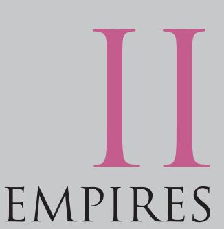

29

## **An Empire Across Three Continents**

**Nomadic Empires**

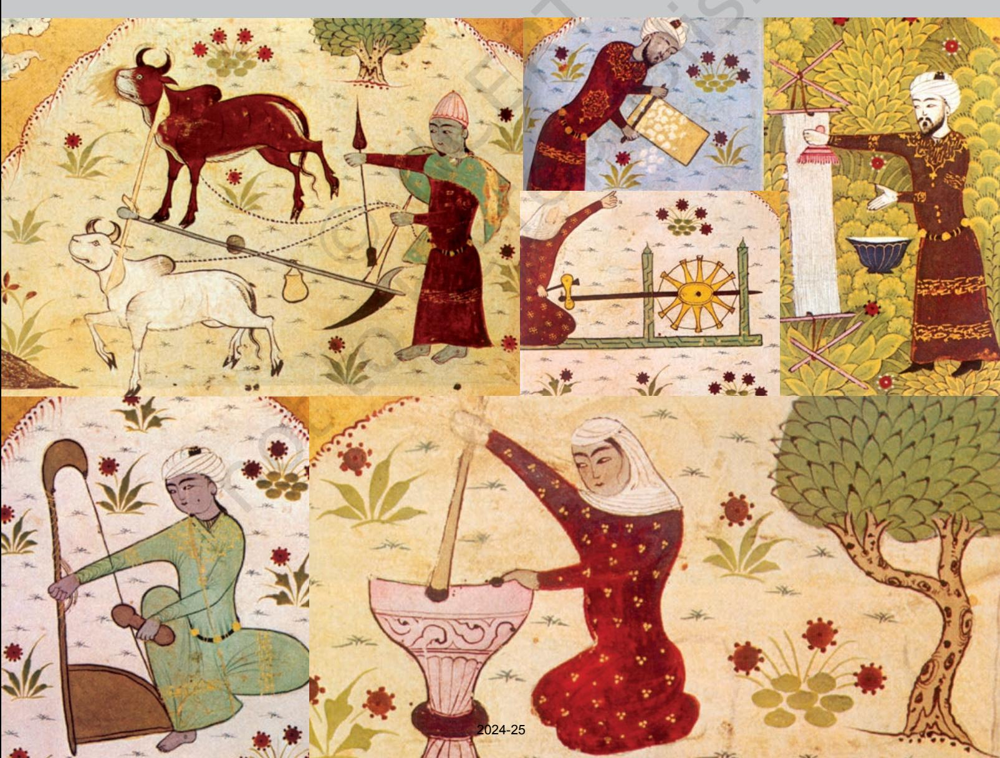

## empires

30 THEMES IN WORLD HISTORY

O VER the two millennia that followed the establishment of empires in Mesopotamia, various attempts at empirebuilding took place across the region and in the area to the west and east of it.

By the sixth century BCE, Iranians had established control over major parts of the Assyrian empire. Networks of trade developed overland, as well as along the coasts of the Mediterranean Sea.

In the eastern Mediterranean, Greek cities and their colonies benefited from improvements in trade that were the result of these changes. They also benefited from close trade with nomadic people to the north of the Black Sea. In Greece, for the most part, city-states such as Athens and Sparta were the focus of civic life. From among the Greek states, in the late fourth century BCE, the ruler of the kingdom of Macedon, Alexander, undertook a series of military campaigns and conquered parts of North Africa, West Asia and Iran, reaching up to the Beas. Here, his soldiers refused to proceed further east. Alexander's troops retreated, though many Greeks stayed behind.

Throughout the area under Alexander's control, ideals and cultural traditions were shared amongst the Greeks and the local population. The region on the whole became 'Hellenised' (the Greeks were called Hellenes), and Greek became a well-known language throughout. The political unity of Alexander's empire disintegrated quickly after his death, but for almost three centuries after, Hellenistic culture remained important in the area. The period is often referred to as the 'Hellenistic period' in the history of the region, but this ignores the way in which other cultures (especially Iranian culture associated with the old empire of Iran) were as important as – if not often *more* important than – Hellenistic notions and ideas.

This section deals with important aspects of what happened after this.

Small but well-organised military forces of the central Italian citystate of Rome took advantage of the political discord that followed the disintegration of Alexander's empire and established control over North Africa and the eastern Mediterranean from the second century BCE. At the time, Rome was a republic. Government was based on a complex system of election, but its political institutions gave some importance to birth and wealth and society benefited from slavery. The forces of Rome established a network for trade between the states that had once been part of Alexander's empire. In the middle of the first century BCE, under Julius Caesar, a high-born military commander, this 'Roman Empire' was extended to present-day Britain and Germany.

Latin (spoken in Rome) was the main language of the empire, though many in the east continued to use Greek, and the Romans had a great respect for Hellenic culture. There were changes in the political structure of the empire from the late first century BCE, and it was substantially Christianised after the emperor Constantine became a Christian in the fourth century CE.

To make government easier, the Roman Empire was divided into eastern and western halves in the fourth century CE. But in the west, there was a breakdown of the arrangements that existed between Rome and the tribes in frontier areas (Goths, Visigoths, Vandals and others). These arrangements dealt with trade, military recruitment and

*Ruins at Greek city of Corinth.*

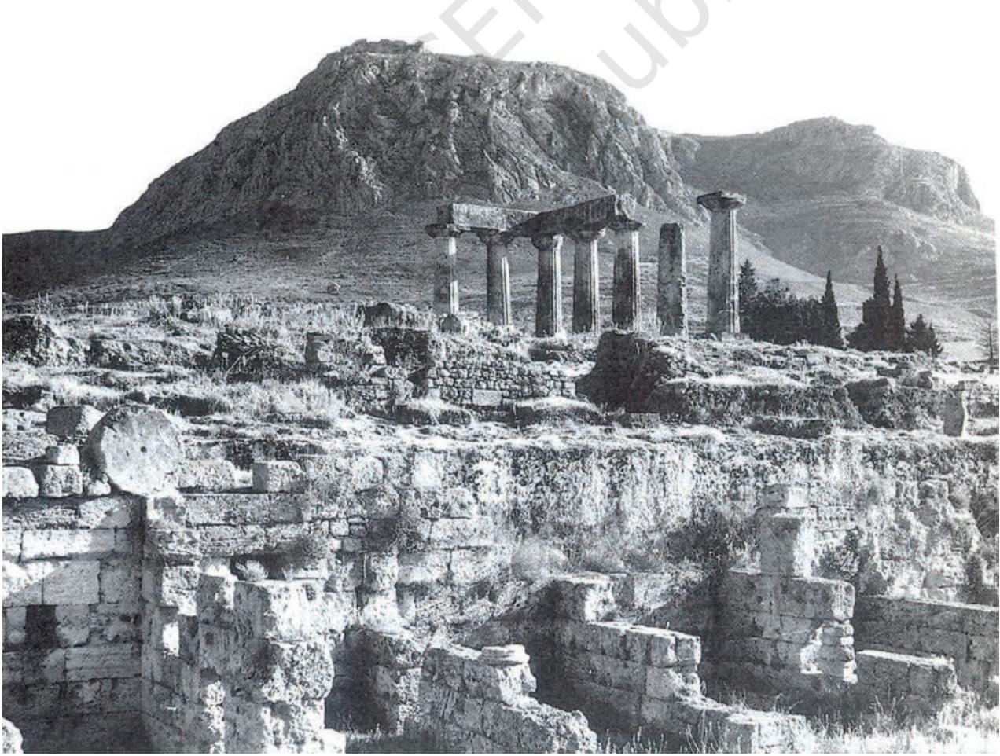

settlement, and the tribes increasingly attacked the Roman administration. Conflicts increased in scale, and coincided with internal dissensions in the empire, leading to the collapse of the empire in the west by the fifth century CE. Tribes established their own kingdoms within the former empire, though, with the prompting of the Christian Church, a Holy Roman Empire was formed from some of these kingdoms from the ninth century CE. This claimed some continuity with the Roman Empire.

Between the seventh century and the fifteenth century, almost all the lands of the eastern Roman Empire (centred on Constantinople) came to be taken over by the Arab empire – created by the followers of the Prophet Muhammad (who founded the faith of Islam in the seventh century) and centred on Damascus – or by its successors (who ruled from Baghdad initially). There was a close interaction between Greek and Islamic traditions in the region. The trading networks of the area and its prosperity attracted the attention of pastoral peoples to the north including various Turkic tribes, who often attacked the cities of the region and established control. The last of these peoples to attack the area and attempt to control it were the Mongols, under Genghis Khan and his successors, who moved into West Asia, Europe, Central Asia and China in the thirteenth century.

All these attempts to make and maintain empires were driven by the search to control the resources of the trading networks that existed in the region as a whole, and to derive benefit from the links of the region with other areas such as India or China. All the empires evolved administrative systems to give stability to trade. They also evolved

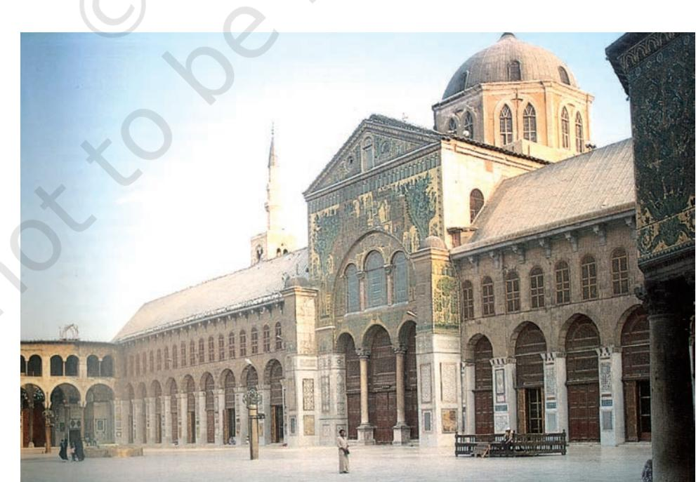

*The Great Mosque, Damascus, completed in 714.*

different types of military organisation. The achievements of one empire were often taken up by its successor. Over time, the area came to be marked by Persian, Greek, Latin and Arabic above many other languages that were spoken and written.

The empires were not very stable. This was partly due to disputes and conflict over resources in various regions. It was also due to the crisis that developed in relations between empires and pastoral peoples to the north – from whom empires derived support both for their trade and to provide them with labour for production of manufactures and for their armies. It is worth noting that not all empires were citycentric. The Mongol empire of Genghis Khan and his successors is a good example of how an empire could be maintained by pastoral people for a long time and with success.

Religions that appealed to peoples of different ethnic origins, who often spoke different languages, were important in the making of large empires. This was true in the case of Christianity (which originated in Palestine in the early first century CE) and Islam (which originated in the seventh century CE).

## Timeline ii (C. 100 BCE TO 1300 CE)

34 THEMES IN WORLD HISTORY

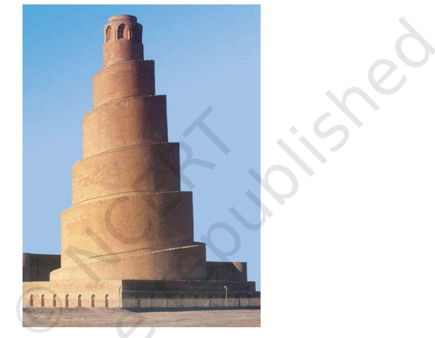

This timeline focuses on kingdoms and empires. Some of these such as the Roman Empire were very large, spreading across three continents. This was also the time when some of the major religious and cultural traditions developed. It was a time when institutions of intellectual activity emerged. Books were written and ideas travelled across continents. Some things that are now part of our everyday lives were used for the first time during this period.

|
|  |

| DATES | AFRICA | EUROPE |
| --- | --- | --- |
| 100-50 BCE | Bananas introduced from Southeast Asia | Spartacus leads revolt of about 100,000 |
|  | to East Africa through sea routes | slaves (73 BCE) |
| 50-1 | Cleopatra, queen of Egypt (51-30 BCE) | Building of Colosseum in Rome |
| 1-50 CE |  |  |
| 50-100 |  |  |
| 100-150 | Hero of Alexandria makes a machine that | Roman Empire at is peak* |
|  | runs on steam |  |
| 150-200 | Ptolemy of Alexandria writes a work on |  |
|  | geography |  |
| 200-250 |  |  |
| 250-300 |  |  |
| 300-350 | Christianity introduced in Axum* (330) | Constantine becomes emperor, |
|  |  | establishes city of Constantinople |
| 350-400 |  | Roman Empire divided into eastern and |
|  |  | western halves |
| 400-450 | Vandals from Europe set up a kingdom in | Roman Empire invaded by tribes from |
|  | North Africa (429) | North and Central Europe |
| 450-500 |  | Conversion of Clovis of Gaul (France) to |
|  |  | Christianity (496) |
| 500-550 |  | St Benedict establishes a monastery in |
|  |  | Italy (526), St Augustine introduces |
|  |  | Christianity in England (596), Gregory the |
|  |  | Great (590) lays the foundations of the |
|  |  | power of the Roman Catholic Church |
| 550-600 |  |  |
| 600-650 | Emigration (hijra) of some Muslims to |  |
|  | Abyssinia (615) |  |
| 650-700 | Muslim Arabs sign treaty with Nubia, | Bede writes the History of the English |
|  | south of Egypt (652) | Church and People |
| 700-750 |  |  |
| 750-800 |  |  |
| 800-850 | Rise of kingdom in Ghana | Charlemagne, king of the Franks, crowned |
|  |  | Holy Roman Emperor (800) |
| 850-900 |  | First Russian states founded at Kiev and |
|  |  | Novgorod |
| 900-950 |  | Viking raids across western Europe |
| 950-1000 |  |  |
| 1000-50 |  | Medical school set up in Salerno, Italy (1030) |
| 1050-1100 | Almoravid kingdom (1056-1147) extends | William of Normandy invades England and |
|  | from Ghana to southern Spain | becomes king (1066); proclamation of the |
|  |  | first crusade (1095) |
| 1100-50 | Zimbabwe (1120-1450) emerges as a centre |  |
|  | for production of gold and copper artefacts, |  |
|  | and of long-distance trade |  |
| 1150-1200 |  | Construction of the cathedral of Notre Dame |
|  | Christian churches established in Ethiopia | begins (1163) |
| 1200-50 | (1200), kingdom of Mali in West Africa, with | St Francis of Assisi sets up a monastic |
|  | Timbuktu as a centre of learning | order, emphasising austerity and |
|  |  | compassion (1209); lords in England rebel |
|  |  | against the king who signs the Magna |
|  |  | Carta, accepting to rule according to law |
| 1250-1300 |  | Establishment of the Hapsburg dynasty |
|  |  | that continued to rule Austria till 1918 |

| DATES | ASIA | SOUTH ASIA |
| --- | --- | --- |
| 100-50 BCE | Han empire in China, development of the | Bactrian Greeks and Shakas establish |
|  | Silk Route from Asia to Europe | kingdoms in the north-west; rise of the |
|  |  | Satavahanas in the Deccan |
| 50-1 |  | Growing trade between South Asia, |
|  |  | Southeast and East Asia, and Europe |
| 1-50 CE | Jesus Christ in Judaea, a province of the |  |
|  | Roman Empire; Roman invasion of Arabia (24) |  |
| 50-100 |  | Establishment of the Kushana state in the |
|  |  | northwest and Central Asia |
| 100-150 | Paper invented in China (118); development |  |
|  | of the first seismograph (132) |  |
| 150-200 |  |  |
| 200-250 | End of Han empire (221); Sasanid rule in |  |
|  | Persia (226) |  |
| 250-300 | Tea at the royal court, China (262), use of |  |
|  | the magnetic compass, China (270) |  |
| 300-350 | Chinese start using stirrups while riding | Establishment of the Gupta* dynasty (320) |
|  | horses* |  |
| 350-400 |  | Fa Xian travels from China to India (399) |
| 400-450 |  |  |
| 450-500 |  | Aryabhata, astronomer and mathematician |
| 500-550 |  |  |
| 550-600 | Buddhism introduced in Japan (594); | Chalukya temples in Badami and Aihole |
|  | Grand Canal to transport grain built in |  |
|  | China (584-618), by 5,000,000 workers |  |
|  | over 34 years |  |
| 600-650 | Tang dynasty in China (618); | Xuan Zang travels from China to India; |
|  | Prophet Muhammad goes to Medina; the | Nalanda emerges as an important |
|  | beginning of the Hijri era ( 622); | educational centre |
|  | collapse of the Sasanian empire (642) |  |
| 650-700 | Umayyad caliphate (661-750) |  |
| 700-750 | A branch of the Umayyads conquers | Arabs conquer Sind (712) |
|  | Spain; Tang dynasty established in China |  |
| 750-800 | Abbasid caliphate established and |  |
|  | Baghdad becomes a major cultural and |  |
|  | commercial centre |  |
| 800-850 | Khmer state founded in Cambodia (802) |  |
| 850-900 | First printed book, China (868) |  |
| 900-950 |  |  |
| 950-1000 | Use of paper money in China |  |
| 1000-50 | Ibn Sina, a Persian doctor, writes a | Mahmud of Ghazni raids the north-west; |
|  | medical text that is followed for centuries | Alberuni travels to India; Rajarajesvara |
|  |  | temple built at Thanjavur |
| 1050-1100 | Establishment of the Turkish empire by |  |
|  | Alp Arsalan (1075) |  |
| 1100-50 | First recorded display of fireworks in | Kalhana writes the Rajatarangini |
|  | China |  |
| 1150-1200 | Angkor empire, Cambodia, at its height |  |
|  | (1180), temple complex at Angkor Wat |  |
| 1200-50 | Genghis Khan consolidates power (1206) | Establishment of Delhi sultanate (1206) |
| 1250-1300 | Qubilai Khan, grandson of Genghis Khan, | Amir Khusrau (1253-1325) introduces new |
|  | becomes emperor of China | forms of poetry and music*; Sun Temple at |
|  |  | Konark |

| DATES | AMERICAS | AUSTRALIA/PACIFIC ISLANDS |
| --- | --- | --- |
| 100-50 BCE |  |  |
| 50-1 |  |  |
| 1-50 CE |  |  |
| 50-100 |  |  |
| 100-150 |  |  |
| 150-200 |  |  |
| 200-250 |  | ACTIVITY |
| 250-300 |  |  |
| 300-350 | City-state of Teotihuacan established in | Try and identify |
|  | Mexico, with pyramid temples, Mayan | at least five |
|  | ceremonial centres*, development of | events/processes |
|  | astronomy, pictorial script* | that would have |
|  |  | involved the |
| 350-400 |  | movement of |
|  |  | peoples across |
| 400-450 |  | regions/ |
| 450-500 |  | continents. What |
|  |  | would have been |
| 500-550 |  | the significance |
| 550-600 |  | of these events/ |
|  |  | processes? |
| 600-650 |  |  |
| 650-700 |  |  |
| 700-750 |  |  |
| 750-800 |  |  |
| 800-850 |  |  |
| 850-900 |  |  |
| 900-950 |  |  |
| 950-1000 | First city is built in North America (c.990) | Maori navigator from Polynesia 'discovers' |
|  |  | New Zealand |
| 1000-50 |  |  |
| 1050-1100 |  | Sweet potato (originally from South |
|  |  | America) grown in the Polynesian islands |
| 1100-1150 |  |  |
| 1150-1200 |  |  |
| 1200-50 |  |  |
| 1250-1300 |  |  |

|
|  |

# 2 An Empire Across Three Continents

38 THEMES IN WORLD HISTORY

*THE Roman Empire covered a vast stretch of territory that included most of Europe as we know it today and a large part of the Fertile Crescent and North Africa. In this chapter we shall look at the way this empire was organised, the political forces that shaped its destiny, and the social groups into which people were divided. You will see that the empire embraced a wealth of local cultures and languages; that women had a stronger legal position then than they do in many countries today; but also that much of the economy was run on slave labour, denying freedom to substantial numbers of persons. From the fifth century on, the empire fell apart in the west but remained intact and exceptionally prosperous in its eastern half. The caliphate which you will read about in the next chapter built on this prosperity and inherited its urban and religious traditions.*

Roman historians have a rich collection of sources to go on, which we can broadly divide into three groups: (a) texts, (b) documents and (c) material remains. Textual sources include histories of the period written by contemporaries (these were usually called 'Annals', because the narrative was constructed on a year-by-year basis), letters, speeches, sermons, laws, and so on. Documentary sources include mainly inscriptions and papyri. Inscriptions were usually cut on stone, so a large number survive, in both Greek and Latin. The 'papyrus' was a reed-like plant that grew along the banks of the Nile in Egypt and was processed to produce a writing material that was very widely used in everyday life. Thousands of contracts, accounts, letters and official documents survive 'on papyrus' and have been published by scholars who are called 'papyrologists'. Material remains include a very wide assortment of items that mainly archaeologists discover (for example, through excavation and field survey), for example, buildings, monuments and other kinds of structures, pottery, coins, mosaics, even entire landscapes (for example, through the use of aerial photography). Each of these sources can only tell us just so much about the past, and combining them can be a fruitful exercise, but how well this is done depends on the historian's skill!

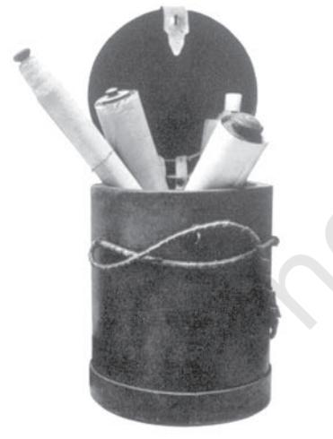

THEME

*Papyrus scrolls*

Two powerful empires ruled over most of Europe,North Africa and the Middle East in the period between the birth of Christ and the early part of the seventh century, say, down to the 630s. The two empires were those of Rome and Iran. The Romans and Iranians were rivals and fought against each other for much of their history. Their empires lay next to each other, separated only by a narrow strip of land that ran along the river Euphrates. In this chapter we shall be looking at the Roman Empire, but we shall also refer, in passing, to Rome's rival, Iran.

If you look at the map, you will see that the continents of Europe and Africa are separated by a sea that stretches all the way from Spain in the west to Syria in the east. This sea is called the Mediterranean, and it was the heart of Rome's empire. Rome dominated the Mediterranean and all the regions around that sea in both directions, north as well as south. To the north, the boundaries of the empire were formed by two great rivers, the Rhine and the Danube; to the south, by the huge expanse of

MAP 1: Europe and North Africa

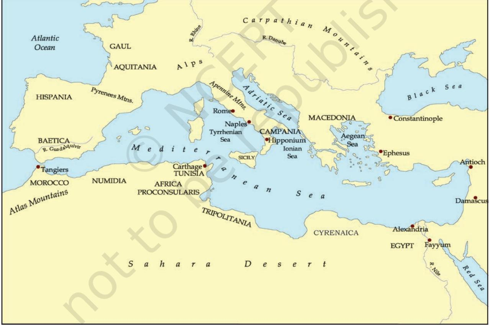

desert called the Sahara. This vast stretch of territory was the Roman Empire. Iran controlled the whole area south of the Caspian Sea down to eastern Arabia, and sometimes large parts of Afghanistan as well. These two superpowers had divided up most of the world that the Chinese called *Ta Ch'in* ('greater Ch'in', roughly the west).

## **The Early Empire**

The Roman Empire can broadly be divided into two phases, 'early' and 'late', divided by the third century as a sort of historical watershed between them. In other words, the whole period down to the main part of the third century can be called the 'early empire', and the period after that the 'late empire'.

A major difference between the two superpowers and their respective empires was that the Roman Empire was culturally much more diverse than that of Iran. The Parthians and later the Sasanians, the dynasties that ruled Iran in this period, ruled over a population that was largely Iranian. The Roman Empire, by contrast, was a mosaic of territories and cultures that were chiefly bound together by a common system of government. Many languages were spoken in the empire, but for the purposes of administration Latin and Greek were the most widely used, indeed the *only* languages. The upper classes of the east spoke and wrote in Greek, those of the west in Latin, and the boundary between these broad language areas ran somewhere across the middle of the Mediterranean, between the African provinces of Tripolitania (which was Latin speaking) and Cyrenaica (Greek-speaking). All those who lived in the empire were subjects of a single ruler, the emperor, regardless of where they lived and what language they spoke.

The regime established by Augustus, the first emperor, in 27 BCE was called the 'Principate'. Although Augustus was the sole ruler and the only real source of authority, the fiction was kept alive that he was actually only the 'leading citizen' (*Princeps* in Latin), not the absolute ruler. This was done out of respect for the Senate, the body which had controlled Rome earlier, in the days when it was a Republic.* The Senate had existed in Rome for centuries, and had been and remained a body representing the aristocracy, that is, the wealthiest families of Roman and, later, Italian descent, mainly landowners. Most of the Roman histories that survive in Greek and Latin were written by people from a senatorial background. From these it is clear that emperors were judged by how they behaved towards the Senate. The worst emperors were those who were hostile to the senatorial class, behaving with suspicion or brutality and violence. Many senators yearned to go back to the days of the Republic, but most must have realised that this was impossible.

Next to the emperor and the Senate, the other key institution of imperial rule was the army. Unlike the army of its rival in the Persian empire, which was a conscripted** army, the Romans had a paid professional army where soldiers had to put in a minimum of 25 years of service. Indeed, the existence of a paid army was a distinctive feature of the Roman Empire. The army was the largest single organised body in the empire (600,000 by the fourth century) and it certainly had the power to determine the fate of emperors. The soldiers would constantly agitate for better wages and service conditions. These agitations often

the name for a regime in which the reality of power lay with the Senate, a body dominated by a small group of wealthy families who formed the 'nobility'. In practice, the Republic represented the government of the nobility, exercised through the body called the Senate. The Republic lasted from 509 BC to 27 BC, when it was overthrown by Octavian, the adopted son and heir of Julius Caesar, who later changed his name to Augustus. Membership of the Senate was for life, and wealth and office-holding counted for more than birth.

*The Republic was

 **A conscripted army is one which is forcibly recruited; military service is compulsory for certain groups or categories of the population.

took the form of mutinies, if the soldiers felt let down by their generals or even the emperor. Again, our picture of the Roman army depends largely on the way they were portrayed by historians with senatorial sympathies. The Senate hated and feared the army, because it was a source of oftenunpredictable violence, especially in the tense conditions of the third century when government was forced to tax more heavily to pay for its mounting military expenditures.

To sum up, the emperor, the aristocracy and the army were the three main 'players' in the political history of the empire. The success of individual emperors depended on their control of the army, and when the armies were divided, the result usually was

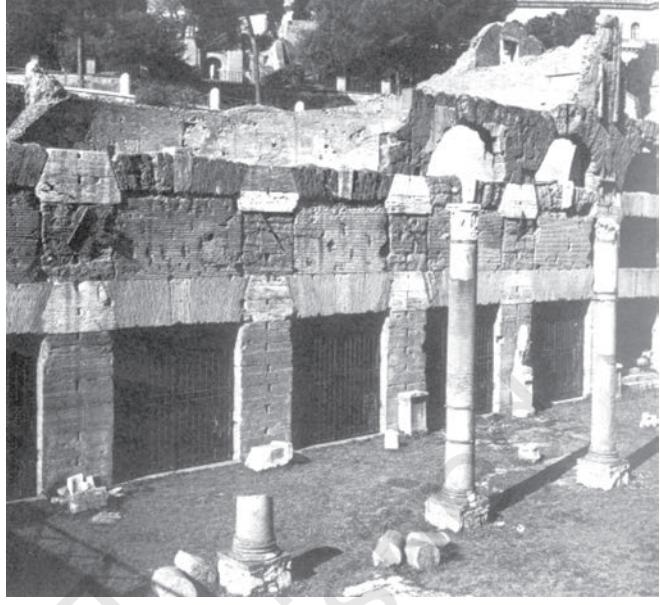

civil war*. Except for one notorious year (69 CE), when four emperors mounted the throne in quick succession, the first two centuries were on the whole free from civil war and in this sense relatively stable. Succession to the throne was based as far as possible on family descent, either natural or adoptive, and even the army was strongly wedded to this principle. For example, Tiberius (14-37 CE), the second in the long line of Roman emperors, was not the natural son of Augustus, the ruler who founded the Principate, but Augustus adopted him to ensure a smooth transition.

External warfare was also much less common in the first two centuries. The empire inherited by Tiberius from Augustus was already so vast that further expansion was felt to be unnecessary. In fact, the 'Augustan age' is remembered for the *peace* it ushered in after decades of internal strife and centuries of military conquest. The only major campaign of expansion in the early empire was Trajan's fruitless occupation of territory across the Euphrates, in the years 113-17 CE abandoned by his successors.

*Shops in Forum Julium, Rome. This piazza with columns was built after 51 BCE, to enlarge the older Roman Forum.*

*Civil war refers to armed struggles for power within the same country, in contrast to conflicts between different countries.

### **The Emperor Trajan's Dream – A Conquest of India?**

'Then, after a winter (115/16) in Antioch marked by a great earthquake, in 116 Trajan marched down the Euphrates to Ctesiphon, the Parthian capital, and then to the head of the Persian Gulf. There [the historian] Cassius Dio describes him looking longingly at a merchant-ship setting off for India, and wishing that he were as young as Alexander.'

– Fergus Millar, *The Roman Near East*.

The Near East. From the perspective of someone who lived in the Roman Mediterranean, this referred to all the territory east of the Mediterranean, chiefly the Roman provinces of Syria, Palestine and Mesopotamia, and in a looser sense the surrounding territories, for example Arabia.

*These were local kingdoms that were 'clients' of Rome. Their rulers could be relied on to use their forces in support of Rome, and in return Rome allowed them to exist.

*Pont du Gard, near Nimes, France, first century BCE. Roman engineers built massive aqueducts over three continents to carry water.*

Much more characteristic was the gradual extension of Roman direct rule. This was accomplished by absorbing a whole series of 'dependent' kingdoms into Roman provincial territory. The Near East was full of such kingdoms*, but by the early second century those which lay west of the Euphrates (towards Roman territory) had disappeared, swallowed up by Rome. (Incidentally, some of these kingdoms were exceedingly wealthy, for example Herod's kingdom yielded the equivalent of 5.4 million *denarii* per year, equal to over 125,000 kg of gold! The *denarius* was a Roman silver coin containing about 4½ gm of pure silver.)

In fact, except for Italy, which was not considered a province in these centuries, *all* the territories of the empire were organised into *provinces* and subject to taxation. At its peak in the second century, the Roman Empire stretched from Scotland to the borders of Armenia, and from the Sahara to the Euphrates and sometimes beyond. Given that there was no government in the modern sense to help them to run things, you may well ask, how was it possible for the emperor to cope with the control and administration of such a vast and diverse set of territories, with a population of some 60 million in the mid-second century? The answer lies in the *urbanisation* of the empire.

The great urban centres that lined the shores of the Mediterranean (Carthage, Alexandria, Antioch were the biggest among them) were the true bedrock of the imperial system. It was through the *cities* that 'government' was able to tax the provincial countrysides which generated much of the wealth of the empire. What this means is that the local upper classes actively collaborated with the Roman state in administering their own territories and raising taxes from them. In fact, one of the most interesting aspects of Roman political history is the dramatic shift in power between Italy and the provinces. Throughout the second and third centuries, it was the *provincial* upper classes who supplied most of the cadre that governed the provinces and commanded the armies. They came to form a new

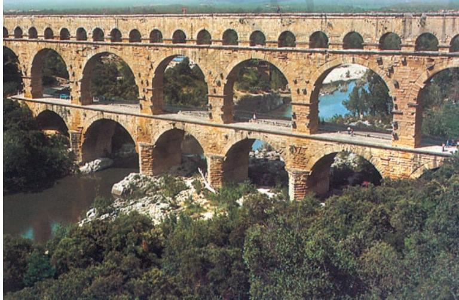

elite of administrators and military commanders who became much more powerful than the senatorial class because they had the backing of the emperors. As this new group emerged, the emperor Gallienus (253-68) consolidated their rise to power by *excluding* senators from military command. We are told that Gallienus forbade senators from serving in the army or having access to it, in order to prevent control of the empire from falling into their hands.

To sum up, in the late first, second and early third centuries the army and administration were increasingly drawn from the provinces, as citizenship spread to these regions and was no longer confined to Italy. But individuals of Italian origin continued to dominate the senate at least till the third century, when senators of provincial origin became a majority. These trends reflected the general decline of Italy within the empire, both political and economic, and the rise of new elites in the wealthier and more urbanised parts of the Mediterranean, such as the south of Spain, Africa and the east. A city in the Roman sense was an urban centre with its own magistrates, city council and a 'territory' containing villages which were under its jurisdiction. Thus one city could not be in the territory of another city, but villages almost always were. Villages could be upgraded to the status of cities, and vice versa, usually as a mark of imperial favour (or the opposite). One crucial advantage of living in a city was simply that it might be better provided for during food shortages and even famines than the countryside.

#### **Doctor Galen on how Roman Cities Treated the Countryside**

Empire? Write one or two lines about each of them. And how did the Roman emperor manage to govern such a vast territory? Whose

ACTIVITY 1

 Who were the three main players in the political history of the Roman

collaboration was crucial to this?

'The famine prevalent for many successive years in many provinces has clearly displayed for men of any understanding the effect of malnutrition in generating illness. The city-dwellers, as it was their custom to collect and store enough grain for the whole of the next year immediately after the harvest, carried off all the wheat, barley, beans and lentils, and left to the peasants various kinds of pulse – after taking quite a large proportion of these to the city. After consuming what was left in the course of the winter, the country people had to resort to unhealthy foods in the spring; they ate twigs and shoots of trees and bushes and bulbs and roots of inedible plants…'

– Galen, *On Good and Bad Diet.*

Public baths were a striking feature of Roman urban life (when one Iranian ruler tried to introduce them into Iran, he encountered the wrath of the clergy there! Water was a sacred element and to use it for *public* bathing may have seemed a desecration to them), and urban populations also enjoyed a much higher level of entertainment. For example, one calendar tells us that *spectacula* (shows) filled no less than 176 days of the year!

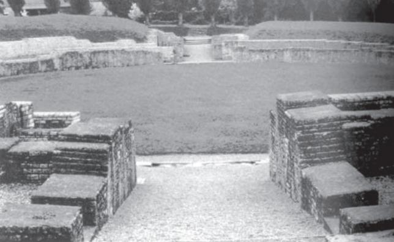

*Amphitheatre at the Roman cantonment town of Vindonissa (in modern Switzerland), first century CE. Used for military drill and for staging entertainments for the soldiers.*

## **The Third-Century Crisis**

If the first and second centuries were by and large a period of peace, prosperity and economic expansion, the third century brought the first major signs of internal strain. From the 230s, the empire found itself fighting on several fronts simultaneously. In Iran a new and more aggressive dynasty emerged in 225 (they called themselves the 'Sasanians') and within just 15 years were expanding rapidly in the direction of the Euphrates. In a famous rock inscription cut in three languages, Shapur I, the Iranian ruler, claimed he had annihilated a Roman army of 60,000 and even captured the eastern capital of Antioch. Meanwhile, a whole series of Germanic tribes or rather tribal confederacies (most notably, the Alamanni, the Franks and the Goths) began to move against the Rhine and Danube frontiers, and the whole period from 233 to 280 saw repeated invasions of a whole line of provinces that stretched from the Black Sea to the Alps and southern Germany. The Romans were forced to abandon much of the territory beyond the Danube, while the emperors of this period were constantly in the field against what the Romans called 'barbarians'. The rapid succession of emperors in the third century (25 emperors in 47 years!) is an obvious symptom of the strains faced by the empire in this period.

## **Gender, Literacy, Culture**

One of the more modern features of Roman society was the widespread prevalence of the nuclear family. Adult sons did not live with their families, and it was exceptional for adult brothers to share a common household. On the other hand, slaves *were* included in the family as the Romans understood this. By the late Republic (the first century BCE), the typical form of marriage was one where the wife did not transfer to her husband's authority but retained full rights in the property of her natal family. While the woman's dowry went to the husband for the duration of the marriage, the woman remained a primary heir of her father and became an independent property owner on her father's death. Thus Roman women enjoyed considerable legal rights in owning and managing property. In other words, in law the married couple was not one financial entity but two, and the wife enjoyed complete legal independence. Divorce was relatively easy and needed no more than a notice of intent to dissolve the marriage by either husband or wife. On the other hand, whereas males married in their late twenties or early thirties, women were married off in the late teens or early twenties, so there was an age gap between husband and wife and this would have encouraged a certain inequality. Marriages were generally arranged, and there is no doubt that women were often subject to domination by their husbands. Augustine*, the great Catholic bishop who spent most of his life in North Africa, tells us that his mother was regularly beaten by his father and that most other wives

*Saint Augustine (354-430) was bishop of the North African city of Hippo from 396 and a towering figure in the intellectual history of the Church. Bishops were the most important religious figures in a Christian community, and often very powerful.

in the small town where he grew up had similar bruises to show! Finally, fathers had substantial legal control over their children – sometimes to a shocking degree, for example, a legal power of life and death in exposing unwanted children, by leaving them out in the cold to die.

What about literacy? It is certain that rates of casual literacy* varied greatly between different parts of the empire. For example, in Pompeii, which was buried in a volcanic eruption in 79 CE, there is strong evidence of widespread casual literacy. Walls on the main streets of Pompeii often carried advertisements, and graffiti were found all over the city.

By contrast, in Egypt where hundreds of papyri survive, most formal documents such as contracts were usually written by professional scribes, and they often tell us that X or Y is unable to read and write. But even here literacy was certainly more widespread among certain categories such as soldiers, army officers and estate managers.

The cultural diversity of the empire was reflected in many ways and at many levels: in the vast diversity of religious cults and local deities; the plurality of languages that were spoken; the styles of dress and

costume, the food people ate, their forms of social organisation (tribal/non-tribal), even their patterns of settlement. Aramaic was the dominant language group of the Near East (at least west of the Euphrates), Coptic was spoken in Egypt, Punic and Berber in North Africa, Celtic in Spain and the northwest. But many of these linguistic cultures were purely oral, at least until a script was invented for them. Armenian, for example, only began to be written as late as the fifth century, whereas there was already a Coptic

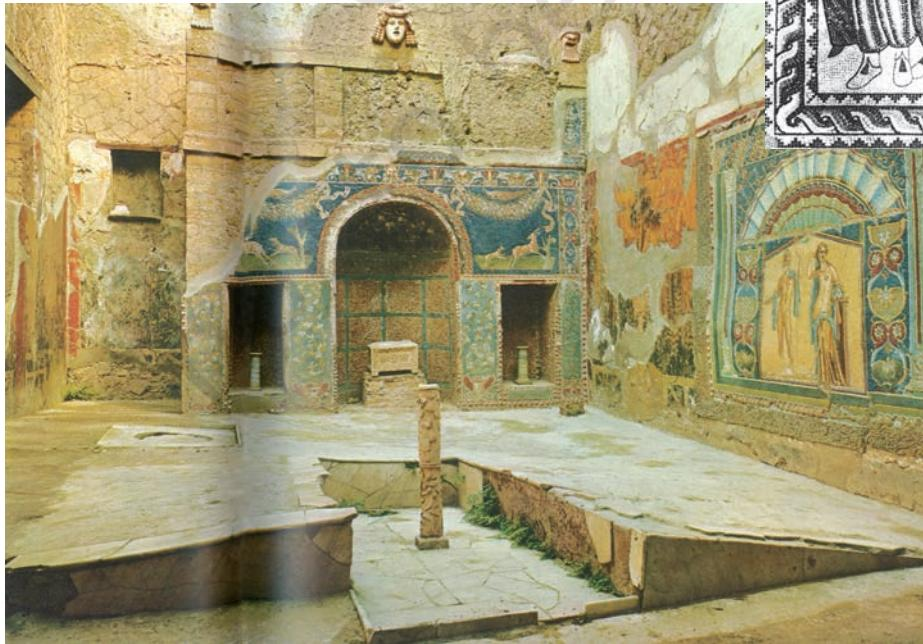

*The use of reading and writing in everyday, often trivial, contexts.

> One of the funniest of these graffiti found on the walls of Pompeii says:

> > 'Wall, I admire you for not collapsing in ruins

When you have to support so much boring writing on you.'

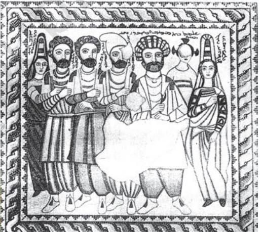

*Mosaic in Edessa, second century CE. The Syriac inscription suggests that those depicted are the wife of king Abgar and her family.*

*Pompeii: A winemerchant's diningroom, its walls decorated with scenes depicting mythical animals.*

#### ACTIVITY 2

How independent were women in the Roman world? Compare the situation of the Roman family with the family in India today.

*Shipwreck off the south coast of France, first century BCE. The amphorae are Italian, bearing the stamp of a producer near the Lake of Fondi.*

translation of the Bible by the middle of the third century. Elsewhere, the spread of Latin displaced the written form of languages that were otherwise widespread; this happened notably with Celtic, which ceased to be written after the first century.

## **Economic Expansion**

The empire had a substantial economic infrastructure of harbours, mines, quarries, brickyards, olive oil factories, etc. Wheat, wine and olive-oil were traded and consumed in huge quantities, and they came mainly from Spain, the Gallic provinces, North Africa, Egypt and, to a lesser extent, Italy, where conditions were best for these crops. Liquids like wine and olive oil were transported in containers called 'amphorae'. The fragments and sherds of a very large number of these survive (Monte Testaccio in Rome is said to contain the remnants of over 50 million vessels!), and it has been possible for archaeologists to reconstruct the precise *shapes* of these containers, tell us *what* they carried, and say exactly *where* they were made by examining the clay content and matching the finds with clay pits throughout the Mediterranean. In this way we can now say with some confidence that Spanish olive oil, to take just one example, was a vast commercial

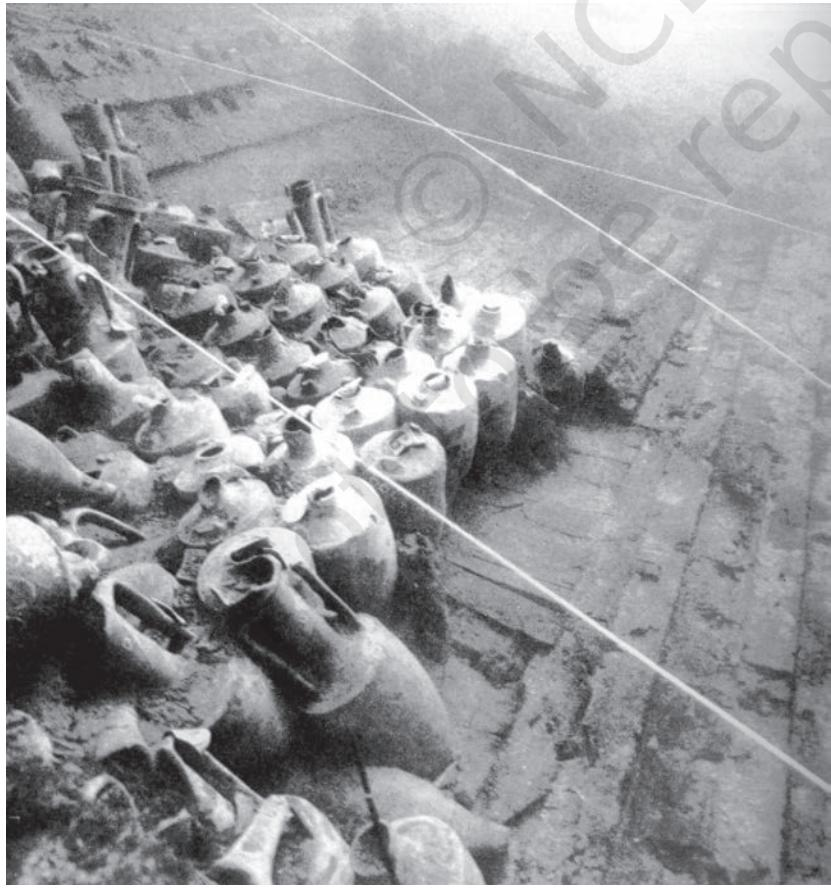

enterprise that reached its peak in the years 140-160. The Spanish olive oil of this period was mainly carried in a container called 'Dressel 20' (after the archaeologist who first established its form). If finds of Dressel 20 are widely scattered across sites in the Mediterranean, this suggests that Spanish olive oil circulated very widely indeed. By using such evidence (the remains of amphorae of different kinds and their 'distribution maps'), archaeologists are able to show that Spanish producers succeeded in capturing markets for olive oil from their Italian counterparts. This would only have happened if Spanish producers supplied a better quality oil at lower prices. In other words, the big landowners from different regions *competed* with each other for control of the main markets for the goods they produced. The success of the Spanish olive growers was then repeated by North African producers – olive estates in this part of the empire dominated production through most of the third and fourth centuries. Later, after 425, North African dominance was broken by the East: in the later fifth and sixth centuries the Aegean, southern Asia Minor (Turkey), Syria and Palestine became major exporters of wine and olive oil, and containers from Africa show a dramatically reduced presence on Mediterranean markets. Behind these broad movements the prosperity of individual regions rose and fell depending on how effectively they could organise the production and transport of particular goods, and on the quality of those goods.

The empire included many regions that had a reputation for exceptional fertility. Campania in Italy, Sicily, the Fayum in Egypt, Galilee, Byzacium (Tunisia), southern Gaul (called Gallia Narbonensis), and Baetica (southern Spain) were all among the most densely settled or wealthiest parts of the empire, according to writers like Strabo and Pliny. The best kinds of wine came from Campania. Sicily and Byzacium exported large quantities of wheat to Rome. Galilee was densely cultivated ('every inch of the soil has been cultivated by the inhabitants', wrote the historian Josephus), and Spanish olive oil came mainly from numerous estates (*fundi*) along the banks of the river Guadalquivir in the south of Spain.

On the other hand, large expanses of Roman territory were in a much less advanced state. For example, transhumance* was widespread in the countryside of Numidia (modern Algeria). These pastoral and semi-nomadic communities were often on the move, carrying their oven-shaped huts (called *mapalia*) with them. As Roman estates expanded in North Africa, the pastures of those communities were drastically reduced and their movements more tightly regulated. Even in Spain the north was much less developed, and inhabited largely by a Celtic-speaking peasantry that lived in hilltop villages called *castella*. When we think of the Roman Empire, we should never forget these differences.

We should also be careful not to imagine that because this was the 'ancient' world, their forms of cultural and economic life were necessarily backward or primitive. On the contrary, diversified applications of water power around the Mediterranean as well as advances in water-powered milling technology, the use of hydraulic mining techniques in the Spanish gold and silver mines and the gigantic industrial scale on which those mines were worked in the first and second centuries (with levels of output that would not be reached again till the nineteenth century, some 1,700 years later!), the existence of well-organised commercial and banking networks, and the widespread use of money are *all* indications of how much we tend to *under*-estimate the sophistication of the Roman economy. This raises the issue of labour and of the use of slavery.

#### ACTIVITY 3

Archaeologists who work on the remains of pottery are a bit like detectives. Can you explain why? Also, what can amphorae tell us about the economic life of the Mediterranean in the Roman period?

*Transhumance is the herdsman's regular annual movement between the higher mountain regions and lowlying ground in search of pasture for sheep and other flocks.

## **Controlling Workers**

Slavery was an institution deeply rooted in the ancient world, both in the Mediterranean and in the Near East, and not even Christianity when it emerged and triumphed as the state religion (in the fourth

#### **On the Treatment of Slaves**

'Soon afterwards the City Prefect, Lucius Pedanius Secundus, was murdered by one of his slaves. After the murder, ancient custom required that every slave residing under the same roof must be executed. But a crowd gathered, eager to save so many innocent lives; and rioting began. The senate-house was besieged. Inside, there was feeling against excessive severity, but the majority opposed any change (….) [The senators] favouring execution prevailed. However, great crowds ready with stones and torches prevented the order from being carried out. Nero rebuked the population by edict, and lined with troops the whole route along which those condemned were taken for execution.'

– Tacitus (55-117), historian of the early empire.

*The practice of encouraging female slaves and their partners to have more children, who would of course also be slaves.

*Opp page*: *Mosaic at Cherchel, Algeria, early third century CE, with agricultural scenes. Above: Ploughing and sowing. Below: Working in vineyards.*

century) seriously challenged this institution. It does not follow that the bulk of the labour in the Roman economy was performed by slaves. That may have been true of large parts of Italy in the Republican period (under Augustus there were still 3 million slaves in a total Italian population of 7.5 million) but it was no longer true of the empire as a whole. Slaves were an investment, and at least one Roman agricultural writer advised landowners against using them in contexts where too many might be required (for example, for harvests) or where their health could be damaged (for example, by malaria). These considerations were not based on any sympathy for the slaves but on hard economic calculation. On the other hand, if the Roman upper classes were often brutal towards their slaves, ordinary people did sometimes show much more compassion. See what one historian says about a famous incident that occurred in the reign of Nero.

As warfare became less widespread with the establishment of peace in the first century, the supply of slaves tended to decline and the users of slave labour thus had to turn either to slave breeding* or to cheaper substitutes such as wage labour which was more easily dispensable. In fact, free labour was extensively used on public works at Rome precisely because an extensive use of slave labour would have been too expensive. Unlike hired workers, slaves had

to be fed and maintained throughout the year, which increased the cost of holding this kind of labour. This is probably why slaves are not widely found in the agriculture of the later period, at least not in the eastern provinces. On the other hand, they and freedmen, that is, slaves who had been set free by their masters, *were* extensively used as business managers, where, obviously, they were not required in large numbers. Masters often gave their slaves or freedmen capital to run businesses on their behalf or even businesses of their own.

The Roman agricultural writers paid a great deal of attention to the management of labour. Columella, a first-century writer who came from the south of Spain, recommended that landowners should keep a reserve stock of implements and tools, twice as many as they needed, so that production could be continuous, 'for the loss in slave labourtime exceeds the cost of such items'. There was a general presumption among employers that without supervision no work would ever get done, so supervision was paramount, for both free workers and slaves. To make supervision easier, workers were sometimes grouped into gangs or smaller teams. Columella recommended squads of ten, claiming it was easier to tell who was putting in effort and who was not in work groups of this size. This shows a detailed consideration of the management of labour. Pliny the Elder, the author of a very famous 'Natural History', condemned the use of slave gangs as the worst method of organising production, mainly because slaves who worked in gangs were usually chained together by their feet.

All this looks draconian*, but we should remember that most factories in the world today enforce similar principles of labour control. Indeed, some industrial establishments in the empire enforced even tighter controls. The Elder Pliny described conditions

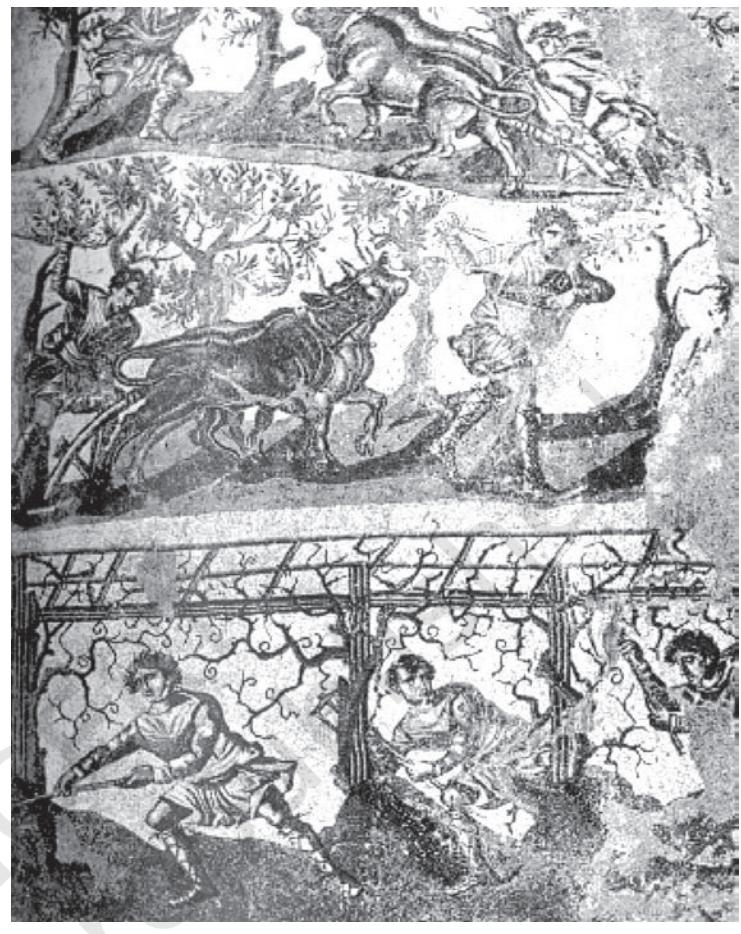

in the frankincense** factories (*officinae*) of Alexandria, where, he tells us, no amount of supervision seemed to suffice. 'A seal is put upon the workmen's aprons, they have to wear a mask or a net with a close mesh on their heads, and before they are allowed to leave the premises, they have to take off all their clothes.' Agricultural labour must have been fatiguing and disliked, for a famous edict of the early third century refers to Egyptian peasants deserting their villages 'in order not to engage in agricultural work'. The same was probably true of most factories and workshops. A law of 398 referred to workers being branded so they could be recognised if and when they run away and try to hide. Many private employers cast their agreements with workers in the form of debt contracts to be able to claim that their employees were in debt to them and thus ensure tighter control over them. An early, second-century writer tells us, 'Thousands surrender themselves to work in servitude, *although they are free.*' In other words, a lot of the poorer families went into debt bondage in order to survive. From one of the recently discovered letters of Augustine we learn that parents sometimes sold their children into servitude for periods of 25 years. Augustine asked a lawyer friend of his whether these children could be liberated once the father died. Rural indebtedness was even more

*Draconian: Harsh (so-called because of an early sixthcentury BCE Greek lawmaker called Draco, who prescribed death as the penalty for most crimes!).

**Frankincense – the European name for an aromatic resin used in incense and perfumes. It is tapped from Boswellia trees by slashing the bark and allowing the exuded resins to harden. The bestquality frankincense came from the Arabian peninsula.

 *A rebellion in Judaea against Roman domination, which was ruthlessly suppressed by the Romans in what is called the 'Jewish war'.

#### ACTIVITY 4

The text has referred to three writers whose work is used to say something about how the Romans treated their workers. Can you identify them? Reread the section for yourself and describe any two methods the Romans used to control labour.

*The *equites*, ('knights' or 'horsemen') were traditionally the second most powerful and wealthy group. Originally, they were families whose property qualified them to serve in the cavalry, hence the name. Like senators, most 'knights' were landowners, but unlike senators many of them were shipowners, traders and bankers, that is, involved in business activities.

widespread; to take just one example, in the great Jewish revolt of 66 CE* the revolutionaries destroyed the moneylenders' bonds to win popular support.

Again, we should be careful not to conclude that the bulk of labour was coerced in these ways. The late-fifth-century emperor Anastasius built the eastern frontier city of Dara in less than three weeks by attracting labour from all over the East by offering high wages. From the papyri we can even form some estimate of how widespread wage labour had become in parts of the Mediterranean by the sixth century, especially in the East.

## **Social Hierarchies**

Let us stand back from the details now and try and get a sense of the social structures of the empire. Tacitus described the leading social groups of the *early* empire as follows: senators (*patres*, lit. 'fathers'); leading members of the equestrian class; the respectable section of the people, those attached to the great houses; the unkempt lower class (*plebs sordida*) who, he tells us, were addicted to the circus and theatrical displays; and finally the slaves. In the early third century when the Senate numbered roughly 1,000, approximately half of all senators still came from Italian families. By the *late* empire, which starts with the reign of Constantine I in the early part of the fourth century, the first two groups mentioned by Tacitus (the senators and the *equites**) had *merged* into a unified and expanded aristocracy, and at least half of all families were of African or eastern origin. This 'late Roman' aristocracy was enormously wealthy but in many ways less powerful than the purely military elites who came almost entirely from non-aristocratic backgrounds. The 'middle' class now consisted of the considerable mass of persons connected with imperial service in the bureaucracy and army but also the more prosperous merchants and farmers of whom there were many in the eastern provinces. Tacitus described this 'respectable' middle class as clients of the great senatorial houses. Now it was chiefly government service and dependence on the State that sustained many of these families. Below them were the vast mass of the lower classes known collectively as *humiliores* (lit. 'lower'). They comprised a rural labour force of which many were permanently employed on the large estates; workers in industrial and mining establishments; migrant workers who supplied much of the labour for the grain and olive harvests and for the building industry; self-employed artisans who, it was said, were better fed than wage labourers; a large mass of casual labourers, especially in the big cities; and of course the many thousands of slaves that were still found all over the western empire in particular.

One writer of the early fifth century, the historian Olympiodorus who was also an ambassador, tells us that the aristocracy based in the City of Rome drew annual incomes of up to 4,000 lbs of gold from their estates, not counting the produce they consumed directly!

The monetary system of the late empire broke with the silver-based currencies of the first three centuries because the Spanish silver mines were exhausted and government ran out of sufficient stocks of the metal to support a stable coinage in silver. Constantine founded the new monetary system on gold and there were vast amounts of this in circulation throughout late antiquity.

The late Roman bureaucracy, both the higher and middle echelons, was a comparatively affluent group because it drew the bulk of its salary in gold and invested much of this in buying up assets like land. There was of course also a great deal of corruption, especially in the judicial system and in the administration of military supplies. The extortion of the higher bureaucracy and the greed of the provincial governors were proverbial. But government intervened repeatedly to curb these forms of corruption – we only know about them in the first place because of the laws that tried to put an end to them, and because historians and other members of the intelligentsia denounced such practices. This element of 'criticism' is a remarkable feature of the classical world. The Roman state was an authoritarian regime; in other words, dissent was rarely tolerated and government usually responded to protest with violence (especially in the cities of the East where people were often fearless in making fun of emperors). Yet a strong tradition of Roman law had emerged by the fourth century, and this acted as a brake on even the most fearsome emperors. Emperors were *not* free to do whatever they liked, and the

#### **Incomes of the Roman Aristocracy, Early Fifth Century**

'Each of the great houses of Rome contained within itself everything which a medium-sized city could hold, a hippodrome, fora, temples, fountains and different kinds of baths… Many of the Roman households received an income of four thousand pounds of gold per year from their properties, not including grain, wine and other produce which, if sold, would have amounted to one-third of the income in gold. The income of the households at Rome of the second class was one thousand or fifteen hundred pounds of gold.'

– Olympiodorus of Thebes.

law was actively used to protect civil rights. That is why in the later fourth century it was possible for powerful bishops like Ambrose to confront equally powerful emperors when they were excessively harsh or repressive in their handling of the civilian population.

## **Late Antiquity**

We shall conclude this chapter by looking at the cultural transformation of the Roman world in its final centuries. 'Late antiquity' is the term now used to describe the final, fascinating period in the evolution and break-up of the Roman Empire and refers broadly to the fourth to seventh centuries. The fourth century itself was one of considerable ferment, both cultural and economic. At the cultural level, the period saw momentous developments in religious life, with the emperor Constantine deciding to make Christianity the official religion, and with the rise of Islam in the seventh century. But there were equally important changes in the

structure of the state that began with the emperor Diocletian (284- 305), and it may be best to start with these.

Overexpansion had led Diocletian to 'cut back' by abandoning territories with little strategic or economic value. Diocletian also fortified the frontiers, reorganised provincial boundaries, and separated civilian from military functions, granting greater autonomy to the military commanders (*duces*), who now became a more powerful group. Constantine consolidated some of these changes and added others of his own. His chief innovations were in the monetary sphere, where he introduced a new denomination, the *solidus*, a coin of 4½ gm of pure gold that would in fact outlast the Roman Empire itself. *Solidi* were

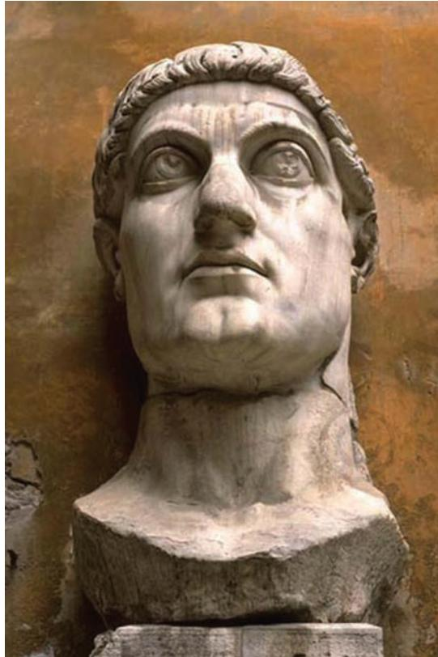

*Part of a colossal statue of Emperor Constantine, 313 CE.*

minted on a very large scale and their circulation ran into millions. The other area of innovation was the creation of a second capital at Constantinople (at the site of modern Istanbul in Turkey, and previously called Byzantium), surrounded on three sides by the sea. As the new capital required a new senate, the fourth century was a period of rapid expansion of the governing classes. Monetary stability and an expanding population stimulated economic growth, and the archaeological record shows considerable investment in rural establishments, including industrial installations like oil presses and glass factories, in newer technologies such as screw presses and multiple water-mills, and in a revival of the long-distance trade with the East.

All of this carried over into strong urban prosperity that was marked by new forms of architecture and an exaggerated sense of luxury. The ruling elites were wealthier and more powerful than ever before. In Egypt, hundreds of papyri survive from these later centuries and they show us a relatively affluent society where money was in extensive use and rural estates generated vast incomes in gold. For example, Egypt contributed

taxes of over 2½ million *solidi* a year (roughly 35,000 lbs of gold) in the reign of Justinian in the sixth century. Indeed, large parts of the Near Eastern countryside were *more* developed and densely settled in the fifth and sixth centuries than they would be even in the twentieth century! This is the social background against which we should set the cultural developments of this period.

The traditional religious culture of the classical world, both Greek and Roman, had been polytheist. That is, it involved a multiplicity of cults that included both Roman/Italian gods like Jupiter, Juno, Minerva and Mars, as well as numerous Greek and eastern deities worshipped in thousands of temples, shrines and sanctuaries throughout the empire. Polytheists had no common name or label to describe themselves. The other great religious tradition in the empire was Judaism. But Judaism was not a monolith* either, and there was a great deal of diversity within the Jewish communities of late antiquity. Thus, the 'Christianisation'** of the empire in the fourth and fifth centuries was a gradual and complex process. Polytheism did not disappear overnight, especially in the western provinces, where the Christian bishops waged a running battle against beliefs and practices *they* condemned more than the Christian laity*** did. The *boundaries* between religious communities were much more fluid in the fourth century than they would become thanks to the repeated efforts of religious leaders, the powerful bishops who now led the Church, to rein in their followers and enforce a more rigid set of beliefs and practices.

The general prosperity was especially marked in the East where population was still expanding till the sixth century, despite the impact of the plague which affected the Mediterranean in the 540s. In the West, by contrast, the empire fragmented politically as Germanic groups from the North (Goths, Vandals, Lombards, etc.) took over all the major provinces and established kingdoms that are best described as 'post-Roman'. The most important of these were that of the Visigoths in Spain, destroyed by the Arabs between 711 and 720, that of the Franks in Gaul (c.511-687) and that of the Lombards in Italy (568-774). These kingdoms foreshadowed the beginnings of a different kind of world that is usually called 'medieval'. In the East, where the empire remained united, the reign of Justinian is the highwater mark of prosperity and imperial ambition. Justinian *Monolith – literally a large block of stone, but the expression is used to refer to anything (for example a society or culture) that lacks variety and is all of the same type.

**Christianisation – the process by which Christianity spread among different groups of the population and became the dominant religion.

***Laity – the ordinary members of a religious community as opposed to the priests or clergy who have official positions within the community.

*The Colosseum, built in 79 CE, where gladiators fought wild beasts. It could accommodate*

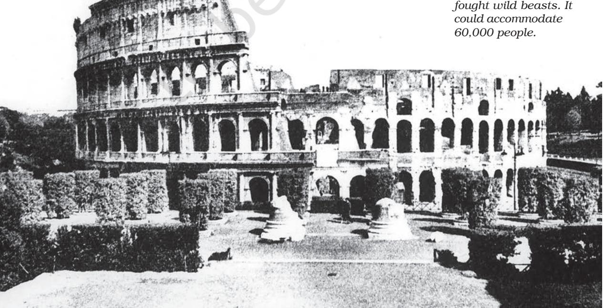

recaptured Africa from the Vandals (in 533) but his recovery of Italy (from the Ostrogoths) left that country devastated and paved the way for the Lombard invasion. By the early seventh century, the war between Rome and Iran had flared up again, and the Sasanians who had ruled Iran since the third century launched a wholesale invasion of all the major eastern provinces (including Egypt). When Byzantium, as the Roman Empire was now increasingly known, recovered these provinces in the 620s, it was just a few years away, literally, from the final major blow which came, this time, from the south-east.

The expansion of Islam from its beginnings in Arabia has been called 'the greatest political revolution ever to occur in the history of the ancient world'. By 642, barely ten years after the Prophet Muhammad's death, large parts of *both* the eastern Roman and Sasanian empires had fallen to the Arabs in a series of stunning confrontations. However, we should bear in mind that those conquests, which eventually (a century later) extended as far afield as Spain, Sind and Central Asia, began in fact with the subjection of the Arab tribes by the emerging Islamic state, first within Arabia and then in the Syrian desert and on the fringes of Iraq. As we will see in Theme 4, the unification of the Arabian peninsula and its numerous tribes was the MAP 2: West Asia key factor behind the territorial expansion of Islam.

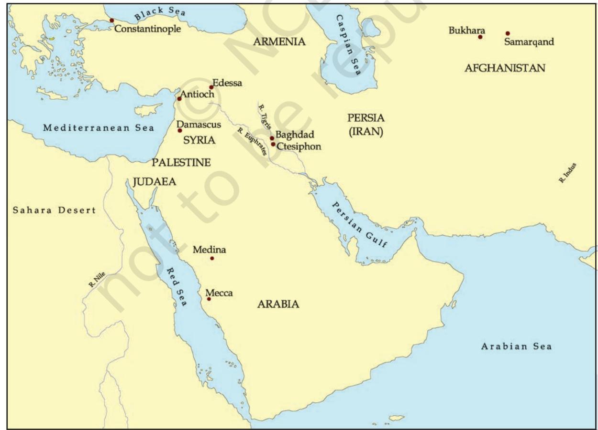

| RULERS | EVENTS |  |
| --- | --- | --- |
| 27 BCE-14 CE | 27 BCE | 'Principate' founded by Octavian, now calls himself Augustus |
| Augustus, first |  |  |
| Roman emperor |  | c. 24-79 Life of the Elder Pliny; dies in the volcanic eruption of Vesuvius, |
| 14-37 |  | which also buries the Roman town of Pompeii |
| Tiberius | 66-70 | The great Jewish revolt and capture of Jerusalem by Roman forces |
| 98-117 |  |  |
|  | c. 115 | Greatest extent of the Roman Empire, following Trajan's conquests |
| Trajan |  | in the East |
| 117-38 |  |  |
| Hadrian | 212 | All free inhabitants of the empire transformed into Roman citizens |
| 193-211 | 224 | New dynasty founded in Iran, called 'Sasanians' after ancestor Sasan |
| Septimius Severus | 250s | Persians invade Roman territories west of the Euphrates |
| 241-72 |  |  |
| reign of Shapur I | 258 | Cyprian bishop of Carthage executed |
| in Iran | 260s | Gallienus reorganises the army |
| 253-68 | 273 | Caravan city of Palmyra destroyed by Romans |
| Gallienus |  |  |
|  | 297 | Diocletian reorganises empire into 100 provinces |
| 284-305 |  |  |
| the 'Tetrarchy'; | c. 310 | Constantine issues new gold coinage (the 'solidus') |
| Diocletian main | 312 | Constantine converts to Christianity |
| ruler |  |  |
| 312-37 | 324 | Constantine now sole ruler of empire; founds city of Constantinople |
| Constantine |  | 354-430 Life of Augustine, bishop of Hippo |
| 309-79 reign of |  |  |
| Shapur II in Iran | 378 | Goths inflict crushing defeat on Roman armies at Adrianople |
| 408-50 | 391 | Destruction of the Serapeum (temple of Serapis) at Alexandria |
| Theodosius II | 410 | Sack of Rome by the Visigoths |
| (compiler of the |  |  |
| famous | 428 | Vandals capture Africa |
| 'Theodosian Code') |  |  |
| 490-518 | 434-53 | Empire of Attila the Hun |
| Anastasius | 493 | Ostrogoths establish kingdom in Italy |
| 527-65 | 533-50 | Recovery of Africa and Italy by Justinian |
| Justinian | 541-70 | Outbreaks of bubonic plague |
| 531-79 reign of |  |  |
| Khusro I in Iran | 568 | Lombards invade Italy |
| 610-41 | c. 570 | Birth of Muhammad |
| Heraclius |  |  |
|  | 614-19 | Persian ruler Khusro II invades and occupies eastern Roman territories |
|  | 622 | Muhammad and companions leave Mecca for Medina |
|  | 633-42 | First and crucial phase of the Arab conquests; Muslim armies |
|  |  | take Syria, Palestine, Egypt, Iraq and parts of Iran |
|  |  | 661-750 Umayyad dynasty in Syria |
|  | 698 | Arabs capture Carthage |
|  | 711 | Arab invasion of Spain |

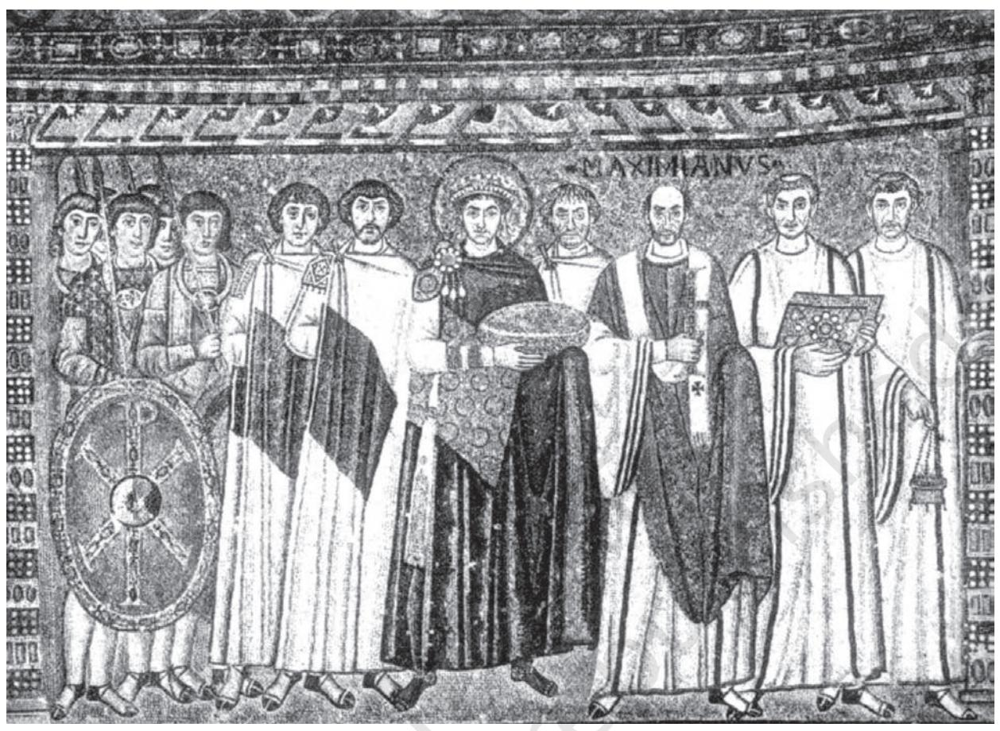

*Mosaic at Ravenna, 547 CE, showing Emperor Justinian.*

## **Exercises**

## **ANSWER IN BRIEF**

- 1. If you had lived in the Roman Empire, where would you rather have lived – in the towns or in the countryside? Explain why.
- 2. Compile a list of some of the towns, cities, rivers, seas and provinces mentioned in this chapter, and then try and find them on the maps. Can you say something about any three of the items in the list you have compiled?
- 3. Imagine that you are a Roman housewife preparing a shopping list for household requirements. What would be on the list?
- 4. Why do you think the Roman government stopped coining in silver? And which metal did it begin to use for the production of coinage?

## **ANSWER IN A SHORT ESSAY**

- 5. Suppose the emperor Trajan had actually managed to conquer India and the Romans had held on to the country for several centuries. In what ways do you think India might be different today?
- 6. Go through the chapter carefully and pick out some basic features of Roman society and economy which you think make it look quite modern.

