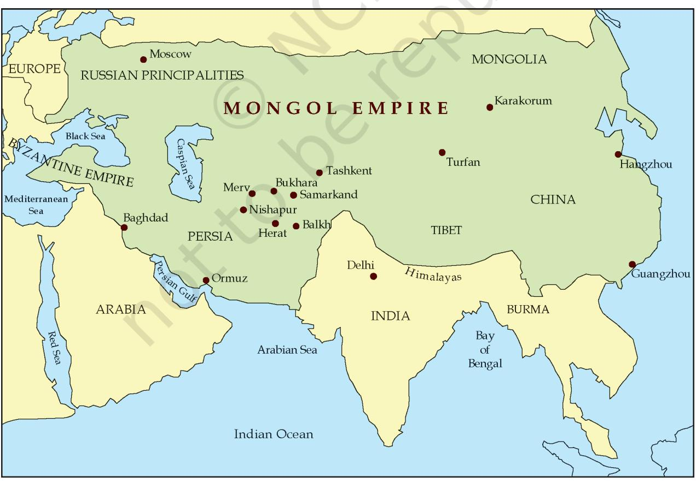
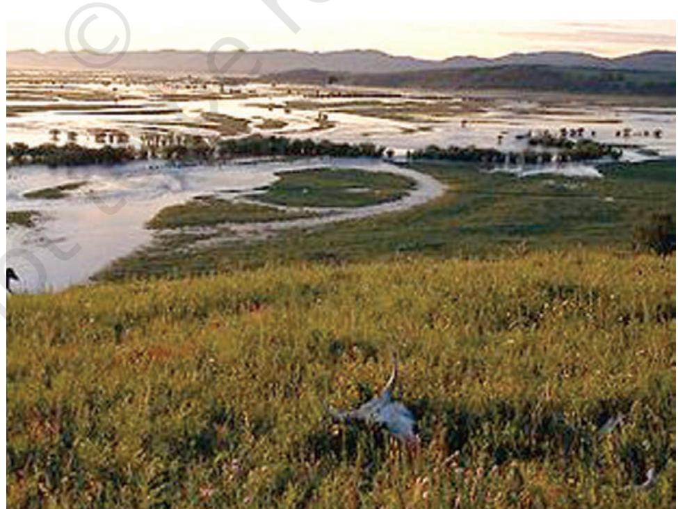
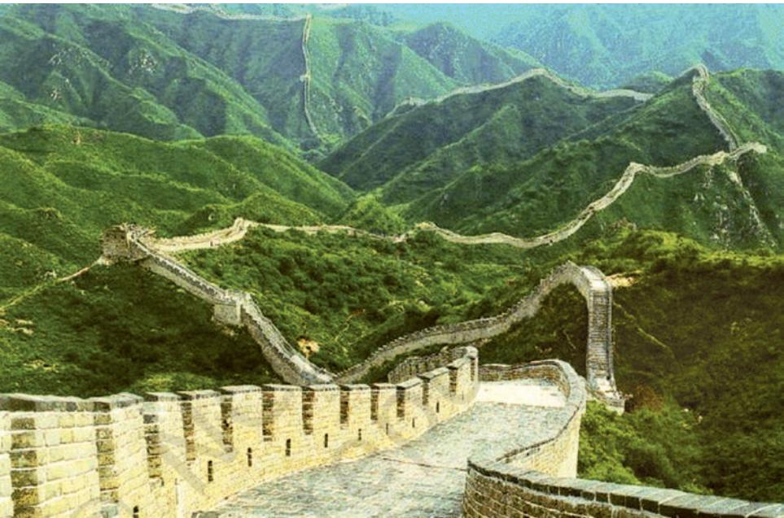
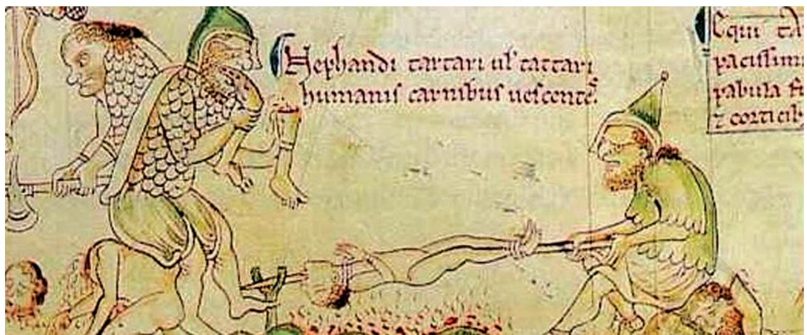
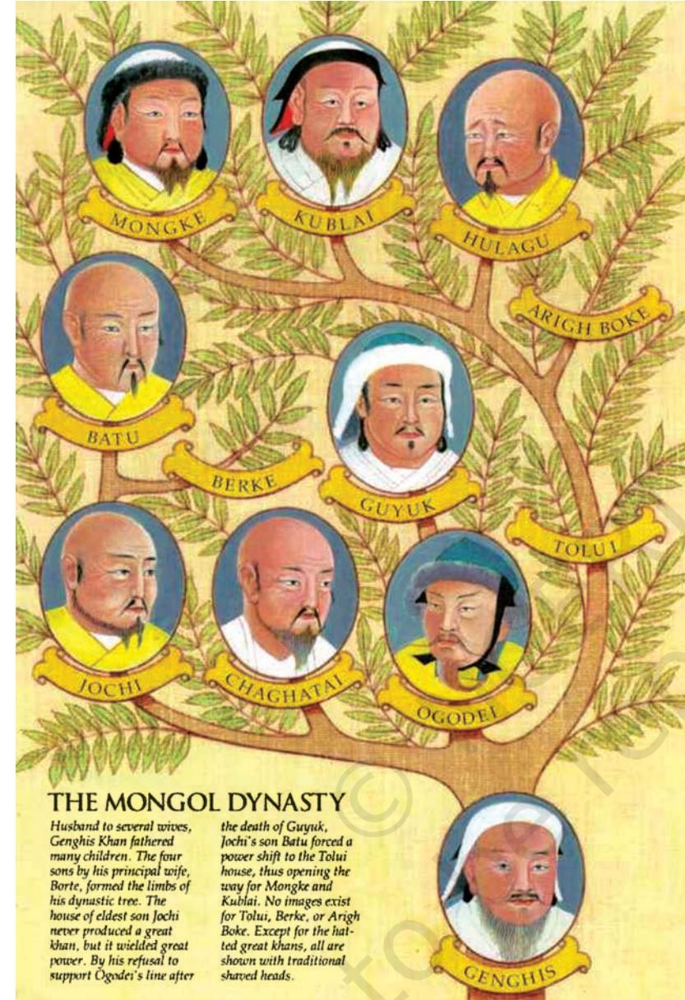
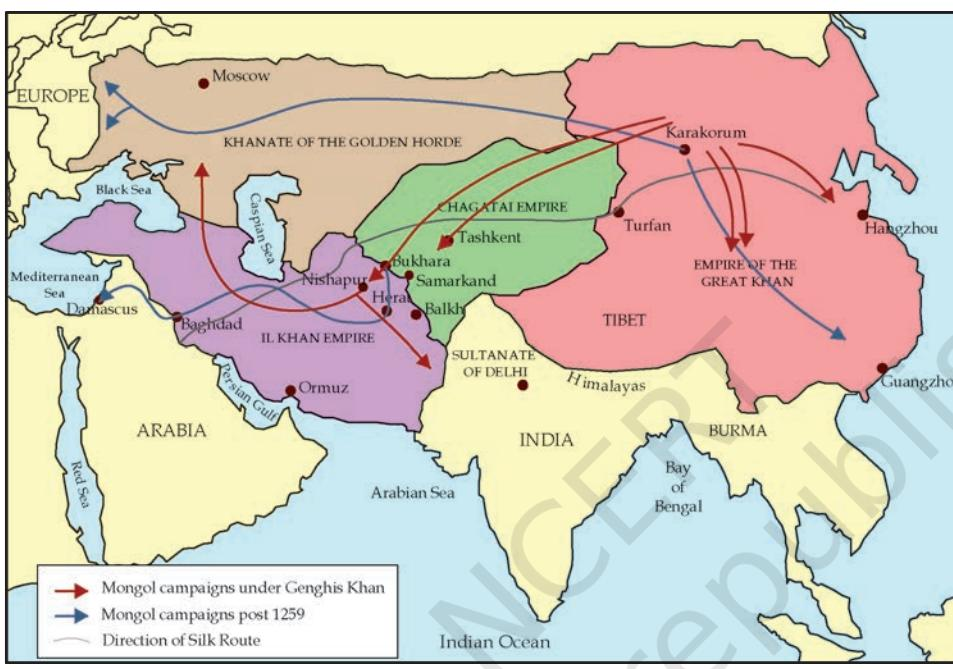
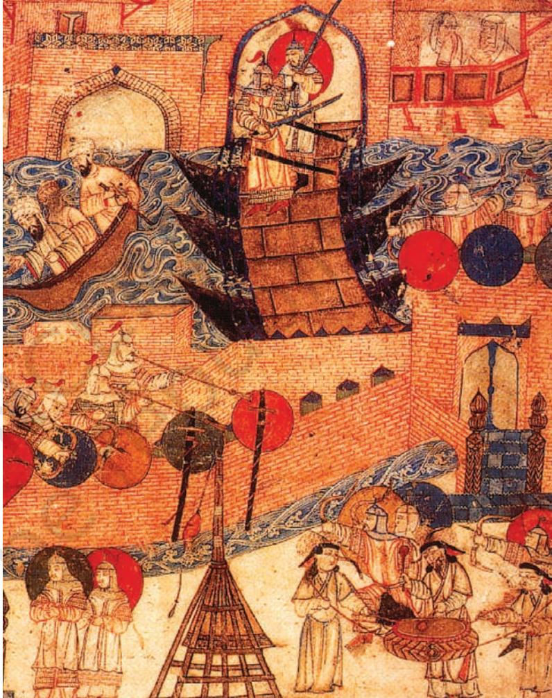
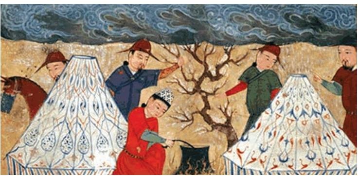

58 THEMES IN WORLD HISTORY

3

THEME

*THE term 'nomadic empires' can appear contradictory: nomads are arguably quintessential wanderers, organised in family assemblies with a relatively undifferentiated economic life and rudimentary systems of political organisation. The term 'empire', on the other hand, carries with it the sense of a material location, a stability derived from complex social and economic structures and the governance of an extensive territorial dominion through an elaborate administrative system. But the juxtapositions on which these definitions are framed may be too narrowly and ahistorically conceived. They certainly collapse when we study some imperial formations constructed by nomadic groups.*

*In Theme 4 we studied state formations in the central Islamic lands whose origins lay in the Bedouin nomadic traditions of the Arabian peninsula. This chapter studies a different group of nomads: the Mongols of Central Asia who established a transcontinental empire under the leadership of Genghis Khan, straddling Europe and Asia during the thirteenth and fourteenth centuries. Relative to the agrarian-based imperial formations in China, the neighbouring nomads of Mongolia may have inhabited a humbler, less complex, social and economic world. But the Central Asian nomadic societies were not insulated 'islands' that were impervious to historical change. These societies interacted, had an impact on and learnt from the larger world of which they were very much a part.*

*This chapter studies the manner in which the Mongols under Genghis Khan adapted their traditional social and political customs to create a fearsome military machine and a sophisticated method of governance. The challenge of ruling a dominion spanning a melange of people, economies, and confessional systems meant that the Mongols could not simply impose their steppe traditions over their recently annexed territories. They innovated and compromised, creating a nomadic empire that had a huge impact on the history of Eurasia even as it changed the character and composition of their own society forever.*

The steppe dwellers themselves usually produced no literature, so our knowledge of nomadic societies comes mainly from chronicles, travelogues and documents produced by city-based litterateurs. These authors often produced extremely ignorant and biased reports of nomadic life. The imperial success of the Mongols, however, attracted many literati. Some of them produced travelogues of their experiences; others stayed to serve Mongol masters. These individuals came from a variety of backgrounds – Buddhist, Confucian, Christian, Turkish and Muslim. Although not always familiar with Mongol customs, many of them produced sympathetic accounts – even eulogies – that challenged and complicated the otherwise hostile, city-based tirade against the steppe marauders. The history of the Mongols, therefore, provides interesting details to question the manner in which sedentary societies usually characterised nomads as primitive barbarians*.

Perhaps the most valuable research on the Mongols was done by Russian scholars starting in the eighteenth and nineteenth centuries as the Tsarist regime consolidated its control over Central Asia. This work was produced within a colonial milieu and was largely survey notes produced by travellers, soldiers, merchants and antiquarian scholars. In the early twentieth century, after the extension of the soviet republics in the region, a new Marxist historiography argued that the prevalent mode of production determined the nature of social relations. It placed Genghis Khan and the emerging Mongol empire within a scale of human evolution that was witnessing a transition from a tribal to a feudal mode of production: from a relatively classless society to one where there were wide differences between the lord, the owners of land and the peasant. Despite following such a deterministic interpretation of history, excellent research on Mongol languages, their society and culture was carried out by scholars such as Boris Yakovlevich Vladimirtsov. Others such as Vasily Vladimirovich Bartold did not quite toe the official line. At a time when the Stalinist regime was extremely wary of regional nationalism, Bartold's sympathetic and positive assessment of the career and achievements of the Mongols under Genghis Khan and his successors got him into trouble with the censors. It severely curtailed the circulation of the work of the scholar and it was only in the 1960s, during and after the more liberal Khruschev era, that his writings were published in nine volumes.

The transcontinental span of the Mongol empire also meant that the sources available to scholars are written in a vast number of languages. Perhaps the most crucial are the sources in Chinese, Mongolian, Persian and Arabic, but vital materials are also available in Italian, Latin, French and Russian. Often the same text was produced in two languages with differing contents. For example, the Mongolian and Chinese versions of the earliest narrative on Genghis Khan, titled *Mongqol-un niuèa tobèa'an* (*The Secret History of the*

*The term 'barbarian' is derived from the Greek *barbaros* which meant a non-Greek, someone whose language sounded like a random noise: 'barbar'. In Greek texts, barbarians were depicted like children, unable to speak or reason properly, cowardly, effeminate, luxurious, cruel, slothful, greedy and politically unable to govern themselves. The sterotype passed to the Romans who used the term for the Germanic tribes, the Gauls and the Huns. The Chinese had different terms for the steppe barbarians but none of them carried a positive meaning.

- 60 THEMES IN WORLD HISTORY
*Mongols*) are quite different and the Italian and Latin versions of Marco Polo's travels to the Mongol court do not match. Since the Mongols produced little literature on their own and were instead 'written about' by literati from foreign cultural milieus, historians have to often double as philologists to pick out the meanings of phrases for their closest approximation to Mongol usage. The work of scholars like Igor de Rachewiltz on *The Secret History of the Mongols* and Gerhard Doerfer on Mongol and Turkic terminologies that infiltrated into the Persian language brings out the difficulties involved in studying the history of the Central Asian nomads. As we will notice through the remainder of this chapter, despite their incredible achievements there is much about Genghis Khan and the Mongol world empire still awaiting the diligent scholar's scrutiny.

## **Introduction**

In the early decades of the thirteenth century the great empires of the Euro-Asian continent realised the dangers posed to them by the arrival of a new political power in the steppes of Central Asia: Genghis Khan (d. 1227) had united the Mongol people. Genghis Khan's political vision, however, went far beyond the creation of a confederacy of Mongol

MAP 1: The Mongol Empire

tribes in the steppes of Central Asia: he had a mandate from God to rule the world. Even though his own lifetime was spent consolidating his hold over the Mongol tribes, leading and directing campaigns into adjoining areas in north China, Transoxiana, Afghanistan, eastern Iran and the Russian steppes, his descendants travelled further afield to fulfil Genghis Khan's vision and create the largest empire the world had ever seen.

It was in the spirit of Genghis Khan's ideals that his grandson Mongke (1251-60) warned the French ruler, Louis IX (1226-70): 'In Heaven there is only one Eternal Sky, on Earth there is only one Lord, Genghis Khan, the Son of Heaven… When by the power of the Eternal Heaven the whole world from the rising of the sun to its setting shall be at one in joy and peace, then it will be made clear what we are going to do: if when you have understood the decree of the Eternal Heaven, you are unwilling to pay attention and believe it, saying, "Our country is far away, our mountains are mighty, our sea is vast", and in this confidence you bring an army against us, we know what we can do. He who made easy what was difficult and near what was far off, the Eternal Heaven knows.'

These were not empty threats and the 1236-41 campaigns of Batu, another grandson of Genghis Khan, devastated Russian lands up to Moscow, seized Poland and Hungary and camped outside Vienna. In the thirteenth century it did seem that the Eternal Sky was on the side of the Mongols and many parts of China, the Middle East and Europe saw in Genghis Khan's conquests of the inhabited world the 'wrath of God', the beginning of the Day of Judgement.

### The Capture of Bukhara

Juwaini, a late-thirteenth-century Persian chronicler of the Mongol rulers of Iran, carried an account of the capture of Bukhara in 1220. After the conquest of the city, Juwaini reported, Genghis Khan went to the festival ground where the rich residents of the city were and addressed them: 'O people know that you have committed great sins, and that the great ones among you have committed these sins. If you ask me what proof I have for these words, I say it is because I am the punishment of God. If you had not committed great sins, God would not have sent a punishment like me upon you'… Now one man had escaped from Bukhara after its capture and had come to Khurasan. He was questioned about the fate of the city and replied: 'They came, they [mined the walls], they burnt, they slew, they plundered and they departed.'

How did the Mongols create an empire that dwarfed the achievements of the other 'World Conqueror', Alexander? In a pre-industrial age of

#### ACTIVITY 1

Assume that Juwaini's account of the capture of Bukhara is accurate. Imagine yourself as a resident of Bukhara and Khurasan who heard the speeches. What impact would they have had on you?

poor technological communications, what skills were deployed by the Mongols to administer and control such a vast dominion? For someone so self-confidently aware of his moral, divinely-dispensed right to rule, how did Genghis Khan relate to the diverse social and religious groups that comprised his dominion? In the making of his imperium what happened to this plurality? We need to start our discussion, however, with a humbler set of questions to better comprehend the social and political background of the Mongols and Genghis Khan: who were the Mongols? Where did they live? Who did they interact with and how do we know about their society and politics?

# **Social and Political Background**

The Mongols were a diverse body of people, linked by similarities of language to the Tatars, Khitan and Manchus to the east, and the Turkic tribes to the west. Some of the Mongols were pastoralists while others were hunter-gatherers. The pastoralists tended horses, sheep and, to a lesser extent, cattle, goats and camels. They nomadised in the steppes of Central Asia in a tract of land in the area of the modern state of Mongolia. This was (and still is) a majestic landscape with wide horizons, rolling plains, ringed by the snow-capped Altai mountains to the west, the arid Gobi desert in the south and drained by the Onon and Selenga rivers and myriad springs from the melting snows of the hills in the north and the west. Lush, luxuriant grasses for pasture and considerable small game were available in a good season. The hunter-gatherers resided to the north of the

*Onon river plain in flood.*

pastoralists in the Siberian forests. They were a humbler body of people than the pastoralists, making a living from trade in furs of animals trapped in the summer months. There were extremes of temperature in the entire region: harsh, long winters followed by brief, dry summers. Agriculture was possible in the pastoral regions during short parts of the year but the Mongols (unlike some of the Turks further west) did not take to farming. Neither the pastoral nor the hunting-gathering economies could sustain dense population settlements and as a result the region possessed no cities. The Mongols lived in tents, *gers*, and travelled with their herds from their winter to summer pasture lands.

Ethnic and language ties united the Mongol people but the scarce resources meant that their society was divided into patrilineal lineages; the richer families were larger, possessed more animals and pasture lands. They therefore had many followers and were more influential in local politics. Periodic natural calamities – either unusually harsh, cold winters when game and stored provisions ran out or drought which parched the grasslands – would force families to forage further afield leading to conflict over pasture lands and predatory raids in search of livestock. Groups of families would occasionally ally for offensive and defensive purposes around richer and more powerful lineages but, barring the few exceptions, these confederacies were usually small and short-lived. The size of Genghis Khan's confederation of Mongol and Turkish tribes was perhaps matched in size only by that which had been stitched together in the fifth century by Attila (d. 453).

Unlike Attila, however, Genghis Khan's political system was far more durable and survived its founder. It was stable enough to counter larger armies with superior equipment in China, Iran and eastern Europe. And, as they established control over these regions, the Mongols administered complex agrarian economies and urban settlements – sedentary societies – that were quite distant from their own social experience and habitat.

Although the social and political organisations of the nomadic and agrarian economies were very different, the two societies were hardly foreign to each other. In fact, the scant resources of the steppe lands drove Mongols and other Central Asian nomads to trade and barter with their sedentary neighbours in China. This was mutually beneficial to both parties: agricultural produce and iron utensils from China were exchanged for horses, furs and game trapped in the steppe. Commerce was not without its tensions, especially as the two groups unhesitatingly applied military pressure to enhance profit. When the Mongol lineages allied they could force their Chinese neighbours to offer better terms and trade ties were sometimes discarded in favour of outright plunder. This relationship would alter when the Mongols were in disarray. The Chinese would then confidently assert their influence in the steppe. These frontier wars were more debilitating to settled societies. They dislocated agriculture and plundered cities. Nomads, on the other hand, could retreat away from the zone of conflict with

Listed below are some of the great Central Asian steppe confederacies of the Turks and Mongol people. They did not all occupy the same region and were not equally large and complex in their internal organisation. They had a considerable impact on the history of the nomadic population but their impact on China and the adjoining regions varied.

Hsiung-nu (200 BCE) (Turks)

Juan-juan (400 CE) (Mongols)

Epthalite Huns (400 CE) (Mongols)

T'u-chueh (550 CE) (Turks)

Uighurs (740 CE) (Turks)

Khitan (940 CE) (Mongols)

marginal losses. Throughout its history, China suffered extensively from nomad intrusion and different regimes – even as early as the eighth century BCE – built fortifications to protect their subjects. Starting from the third century BCE, these fortifications started to be integrated into a common defensive outwork known today as the 'Great Wall of China' a dramatic visual testament to the disturbance and fear perpetrated by nomadic raids on the agrarian societies of north China.

*The Great Wall of China.*

# **The Career of Genghis Khan**

Genghis Khan was born some time around 1162 near the Onon river in the north of present-day Mongolia. Named Temujin, he was the son of Yesugei, the chieftain of the Kiyat, a group of families related to the Borjigid clan. His father was murdered at an early age and his mother, Oelun-eke, raised Temujin, his brothers and step-brothers in great hardship. The following decade was full of reversals – Temujin was captured and enslaved and soon after his marriage, his wife, Borte, was kidnapped, and he had to fight to recover her. During these years of hardship he also managed to make important friends. The young Boghurchu was his first ally and remained a trusted friend; Jamuqa, his bloodbrother (*anda*), was another. Temujin also restored old alliances with the ruler of the Kereyits, Tughril/Ong Khan, his father's old blood-brother.

Through the 1180s and 1190s, Temujin remained an ally of Ong Khan and used the alliance to defeat powerful adversaries like Jamuqa, his old friend who had become a hostile foe. It was after defeating him that Temujin felt confident enough to move against other tribes: the powerful Tatars (his father's assassins), the Kereyits and Ong Khan himself in 1203. The final defeat of the Naiman people and the powerful Jamuqa in 1206, left Temujin as the dominant personality in the politics of the steppe lands, a position that was recognised at an assembly of Mongol chieftains (*quriltai*) where he was proclaimed the 'Great Khan of the Mongols' (*Qa'an*) with the title Genghis Khan, the 'Oceanic Khan' or 'Universal Ruler'.

Just before the *quriltai* of 1206, Genghis Khan had reorganised the Mongol people into a more effective, disciplined military force (*see following sections*) that facilitated the success of his future campaigns. The first of his concerns was to conquer China, divided at this time into three realms: the Hsi Hsia people of Tibetan origin in the north-western provinces; the Jurchen whose Chin dynasty ruled north China from Peking; the Sung dynasty who controlled south China. By 1209, the Hsi Hsia were defeated, the 'Great Wall of China' was breached in 1213 and Peking sacked in 1215. Longdrawn-out battles against the Chin continued until 1234 but Genghis Khan was satisfied enough with the progress of his campaigns to return to his Mongolian homeland in 1216 and leave the military affairs of the region to his subordinates.

After the defeat in 1218 of the Qara Khita who controlled the Tien Shan mountains north-west of China, Mongol dominions reached the Amu Darya, and the states of Transoxiana and Khwarazm. Sultan Muhammad, the ruler of Khwarazm, felt the fury of Genghis Khan's rage when he executed Mongol envoys. In the campaigns between 1219 and 1221 the great cities – Otrar, Bukhara, Samarqand, Balkh, Gurganj, Merv, Nishapur and Herat – surrendered to the Mongol forces. Towns that resisted were devastated. At Nishapur, where a Mongol prince was killed during the siege operation, Genghis Khan commanded that the 'town should be laid waste in such a manner that the site could be ploughed upon; and that in the exaction of vengeance [for the death of the prince] not even cats and dogs should be left alive'.

### **Estimated Extent of Mongol Destruction**

All reports of Genghis Khan's campaigns agree at the vast number of people killed following the capture of cities that defied his authority. The numbers are staggering: at the capture of Nishapur in 1220, 1,747,000 people were massacred while the toll at Herat in 1222 was 1,600,000 people and at Baghdad in 1258, 800,000. Smaller towns suffered proportionately: Nasa, 70,000 dead; Baihaq district, 70,000; and at Tun in the Kuhistan province, 12,000 individuals were executed.

How did medieval chroniclers arrive at such figures?

Juwaini, the Persian chronicler of the Ilkhans stated that 1,300,000 people were killed in Merv. He reached the figure because it took thirteen days to count the dead and each day they counted 100,000 corpses.

*Opp. page: 'Barbarians' as imagined by a European artist.*

Mongol forces in pursuit of Sultan Muhammad pushed into Azerbaijan, defeated Russian forces at the Crimea and encircled the Caspian Sea. Another wing followed the Sultan's son, Jalaluddin, into Afghanistan and the Sindh province. At the banks of the Indus, Genghis Khan considered returning to Mongolia through North India and Assam, but the heat, the natural habitat and the ill portents reported by his Shaman soothsayer made him change his mind.

Genghis Khan died in 1227, having spent most of his life in military combat. His military achievements were astounding and they were largely a result of his ability to innovate and transform different aspects of steppe combat into extremely effective military strategies. The horse-riding skills of the Mongols and the Turks provided speed and mobility to the army; their abilities as rapid-shooting archers from horseback were further perfected during regular hunting expeditions which doubled as field manoeuvres. The steppe cavalry had always travelled light and moved quickly, but now it brought all its knowledge of the terrain and the weather to do the unimaginable: they carried out campaigns in the depths of winter, treating frozen rivers as highways to enemy cities and camps. Nomads were conventionally at a loss against fortified encampments but Genghis Khan learnt the importance of siege engines and naphtha bombardment very quickly. His engineers prepared lightportable equipment, which was used against opponents with devastating effect.

| c. 1167 | Birth of Temujin |
| --- | --- |
| 1160s-70s | Years spent in slavery and struggle |
| 1180s-90s | Period of alliance formation |
| 1203-27 | Expansion and triumph |
| 1206 | Temujin proclaimed Genghis Khan, 'Universal Ruler' of the Mongols |
| 1227 | Death of Genghis Khan |
| 1227-60 | Rule of the three Great Khans and continued Mongol unity |
| 1227-41 | Ogodei, son of Genghis Khan |
| 1246-49 | Guyuk, son of Ogodei |
| 1251-60 | Mongke, son of Genghis Khan's youngest son, Toluy |
| 1236-42 | Campaigns in Russia, Hungary, Poland and Austria |
|  | under Batu, son of Jochi, Genghis Khan's eldest son |
| 1253-55 | Beginning of fresh campaigns in Iran and China under Mongke |
| 1258 | Capture of Baghdad and the end of the Abbasid caliphate. Establishment |
|  | of the Il-Khanid state of Iran under Hulegu, younger brother of |
|  | Mongke. Beginning of conflict between the Jochids and the Il-Khans |

| 1260 | Accession of Qubilai Khan as Grand Khan in Peking; |
| --- | --- |
|  | conflict amongst descendants of Genghis Khan; fragmentation of Mongol realm |
|  | into independent lineages – Toluy, Chaghatai and Jochi (Ogodei's |
|  | lineage defeated and absorbed into the Toluyid) |
|  | Toluyids: Yuan dynasty in China and Il-Khanid state in Iran; |
|  | Chaghataids in steppes north of Transoxiana and 'Turkistan'; |
|  | Jochid lineages in the Russian steppes, |
|  | described as the 'Golden Horde' by observers |
| 1257-67 | Reign of Berke, son of Batu; reorientation of the Golden Horde from Nestorian |
|  | Christianity towards Islam. Definitive conversion takes place only in the 1350s. |
|  | Start of the alliance between the Golden Horde and Egypt against the Il-Khans |
| 1295-1304 | Reign of Il-Khanid ruler Ghazan Khan in Iran. His conversion from Buddhism to |
|  | Islam is followed gradually by other Il-Khanid chieftains |
| 1368 | End of Yuan dynasty in China |
| 1370-1405 | Rule of Timur, a Barlas Turk who claimed Genghis Khanid |
|  | descent through the lineage of Chaghatai. Establishes a steppe empire that |
|  | assimilates part of the dominions of Toluy (excluding China), |
|  | Chaghatai and Jochi. Proclaims himself 'Guregen' – 'royal son-in- law' – |
|  | and marries a princess of the Genghis Khanid lineage |
| 1495-1530 | Zahiruddin Babur, descendant of Timur and Genghis Khan, succeeds to Timurid |
|  | territory of Ferghana and Samarqand, is expelled, captures Kabul and in 1526 |
|  | seizes Delhi and Agra; founds the Mughal empire in India |
| 1500 | Capture of Transoxiana by Shaybani Khan, descendant of Jochi's |
|  | youngest son, Shiban. Consolidates Shaybani power (Shaybanids also |
|  | described as Uzbeg, from whom Uzbekistan, today, gets its name) in Transoxiana |
|  | and expels Babur and other Timurids from the region |
| 1759 | Manchus of China conquer Mongolia |
| 1921 | Republic of Mongolia |

### **The Mongols after Genghis Khan**

We can divide Mongol expansion after Genghis Khan's death into two distinct phases: the first which spanned the years 1236-42 when the major gains were in the Russian steppes, Bulghar, Kiev, Poland and Hungary. The second phase including the years 1255- 1300 led to the conquest of all of China (1279), Iran, Iraq and Syria. The frontier of the empire stabilised after these campaign.

The Mongol military forces met with few reversals in the decades after 1203 but, quite noticeably, after the 1260s the original impetus of campaigns could not be sustained in the West. Although Vienna, and beyond it western Europe, as well as Egypt was within the grasp of Mongol forces, their retreat from the Hungarian steppes and defeat at the hands of the Egyptian forces signalled the emergence of new political trends. There were two facets to this: the first was a consequence of the internal politics of succession within the Mongol family where the descendants of Jochi and Ogodei allied to control the office of the great Khan in the first two generations. These interests were more important than the pursuit of campaigns in Europe. The second compulsion occurred as the Jochi and Ogodei lineages were marginalised by the Toluyid branch of Genghis Khanid descendants. With the accession of Mongke, a descendant of Toluy, Genghis Khan's youngest son, military campaigns were pursued energetically in Iran during the 1250s. But as Toluyid interests in the conquest of China increased during the 1260s, forces and supplies were increasingly diverted into the heartlands of the Mongol dominion. As a result, the Mongols fielded a small, understaffed force against the Egyptian military. Their defeat and the increasing preoccupation with China of the Toluyid family marked the end of western expansion of the Mongols. Concurrently, conflict between the Jochid and Toluyid descendants along the Russian-Iranian frontier diverted the Jochids away from further European campaigns.

The suspension of Mongol expansion in the West did not arrest their campaigns in China which was reunited under the Mongols. Paradoxically, it was at the moment of its greatest successes that internal turbulence between members of the ruling family manifested itself. The next section discusses the factors that led to some of the greatest successes of the Mongol political enterprise but also inhibited its progress.

### **Social, Political and Military Organisation**

Among the Mongols, and many other nomadic societies as well, all the able-bodied, adult males of the tribe bore arms: they constituted the armed forces when the occasion demanded. The unification of the different Mongol tribes and subsequent campaigns against diverse people introduced new members into Genghis Khan's army complicating the composition of this relatively small, undifferentiated body into an incredibly heterogeneous mass of people. It included groups like the Turkic Uighurs, who had accepted his authority willingly. It also included defeated people, like the Kereyits, who were accommodated in the confederacy despite their earlier hostility.

Genghis Khan worked to systematically erase the old tribal identities of the different groups who joined his confederacy. His army was organised according to the old steppe system of decimal units: in divisions of 10s, 100s, 1,000s and [notionally] 10,000 soldiers. In the old system the clan and the tribe would have coexisted within the decimal units. Genghis Khan stopped this practice. He divided the old tribal groupings and distributed their members into new military units. Any individual who tried to move from his/her allotted group without permission received harsh punishment. The largest unit of soldiers, approximating 10,000 soldiers (*tuman*) now included fragmented groups of people from a variety of different tribes and clans. This altered the old steppe social order integrating different lineages and clans and providing them with a new identity derived from its progenitor, Genghis Khan.

The new military contingents were required to serve under his four sons and specially chosen captains of his army units called *noyan*. Also important within the new realm were a band of followers who had served Genghis Khan loyally through grave adversity for many years. Genghis Khan publicly honoured some of these individuals as his 'blood-brothers' (*anda*); yet others, freemen of a humbler rank, were given special ranking as his bondsmen (*naukar*), a title that marked their close relationship with their master. This ranking did not preserve the rights of the old clan chieftains; the new aristocracy derived its status from a close relationship with the Great Khan of the Mongols.

In this new hierarchy, Genghis Khan assigned the responsibility of governing the newly conquered people to his four sons. These comprised the four *ulus*, a term that did not originally mean fixed territories. Genghis Khan's lifetime was still the age of rapid conquests and expanding domains, where frontiers were still extremely fluid. For example, the eldest son, Jochi, received the Russian steppes but the farthest extent of his territory, *ulus*, was indeterminate: it extended as far west as his horses could roam. The second son, Chaghatai, was given the Transoxianian steppe and lands north of the Pamir mountains adjacent to those of his brother. Presumably, these lands would shift as Jochi marched westward. Genghis Khan had indicated that his third son, Ogodei, would succeed him as the Great Khan and on accession the Prince established his capital at Karakorum. The youngest son, Toluy, received the ancestral lands of Mongolia. Genghis Khan envisaged that his sons would rule the empire collectively, and to underline this point, military contingents (*tama*) of the individual princes were placed in each *ulus*. The sense of a dominion shared by the members of the family was underlined at the assembly of chieftains, *quriltais*, where all decisions relating to the family or the state for the forthcoming season – campaigns, distribution of plunder, pasture lands and succession – were collectively taken.

Genghis Khan had already fashioned a rapid courier system that connected the distant areas of his regime. Fresh mounts and despatch riders were placed in outposts at regularly spaced distances. For the maintenance of this communication system the Mongol nomads contributed a tenth of their herd – either horses or livestock – as provisions. This was called the *qubcur* tax, a levy that the nomads paid willingly for the multiple benefits that it brought. The courier system (*yam*) was further refined after Genghis Khan's death and its speed and reliability surprised travellers. It enabled the Great Khans to keep a check on developments at the farthest end of their regime across the continental landmass.

The conquered people, however, hardly felt a sense of affinity with their new nomadic masters. During the campaigns in the first half of the thirteenth century, cities were destroyed, agricultural lands laid waste, trade and handicraft production disrupted. Tens of thousands of people – the

*Family tree of Genghis Khan.*

exact figures are lost in the exaggerated reports of the time – were killed, even more enslaved. All classes of people, from the elites to the peasantry suffered. In the resulting instability, the underground canals, called *qanats*, in the arid Iranian plateau could no longer receive periodic maintenance. As they fell into disrepair, the desert crept in. This led to an ecological devastation from which parts of Khurasan never recovered.

Once the dust from the campaigns had settled, Europe and China were territorially linked. In the peace ushered in by Mongol conquest (Pax Mongolica) trade connections matured. Commerce and travel along the Silk Route reached its peak under the Mongols but, unlike before, the trade routes did not terminate in China.

They continued north into Mongolia and to Karakorum, the heart of the new empire. Communication and ease of travel was vital to retain the coherence of the Mongol regime and travellers were given

MAP 2: The Mongol Campaigns

#### ACTIVITY 2

Note the areas traversed by the Silk Route and the goods that were available to traders along the way. This map does not reflect one of the eastern terminal points of the silk route during the height of Mongol power.

Can you place the missing city? Could it have been on the Silk Route in the twelfth century? Why not?

a pass (*paiza* in Persian; *gerege* in Mongolian) for safe conduct. Traders paid the *baj* tax for the same purpose, all acknowledging thereby the authority of the Mongol Khan.

The contradictions between the nomadic and sedentary elements within the Mongol empire eased through the thirteenth century. In the 1230s, for example, as the Mongols waged their successful war against the Chin dynasty in north China, there was a strong pressure group within the Mongol leadership that advocated the massacre of all peasantry and the conversion of their fields into pasture lands. But by the 1270s, when south China was annexed to the Mongol empire after the defeat of the Sung dynasty, Genghis Khan's grandson, Qubilai Khan (d. 1294), appeared as the protector of the peasants and the cities. In the 1290s, the Mongol ruler of Iran, Ghazan Khan (d. 1304), a descendant of Genghis Khan's youngest son Toluy, warned family members and other generals to avoid pillaging the peasantry. It did not lead to a stable prosperous realm, he advised in a speech whose sedentary overtones would have made Genghis Khan shudder.

#### ACTIVITY 3

Why was there a conflict of interests between pastoralists and peasants? Would Genghis Khan have expressed sentiments of this nature in a speech to his nomad commanders?

### **Ghazan Khan's Speech**

Ghazan Khan (1295-1304) was the first Il-Khanid ruler to convert to Islam. He gave the following speech to the Mongol-Turkish nomad commanders, a speech that was probably drafted by his Persian *wazir* Rashiduddin and included in the minister's letters: 'I am not on the side of the Persian peasantry. If there is a purpose in pillaging them all, there is no one with more power to do this than I. Let us rob them together. But if you wish to be certain of collecting grain and food for your tables in the future, I must be harsh with you. You must be taught reason. If you insult the peasantry, take their oxen and seed and trample their crops into the ground, what will you do in the future? … The obedient peasantry must be distinguished from the peasantry who are rebels…'

From Genghis Khan's reign itself, the Mongols had recruited civil administrators from the conquered societies. They were sometimes moved around: Chinese secretaries deployed in Iran and Persians in China. They helped in integrating the distant dominions and their backgrounds and training were always useful in blunting the harsher edges of nomadic predation on sedentary life. The Mongol Khans trusted them as long as they continued to raise revenue for their masters and these administrators could sometimes command considerable influence. In the 1230s, the Chinese minister Yeh-lu Ch'u-ts'ai, muted some of Ogedei's more rapacious instincts; the Juwaini family played a similar role in Iran through the latter half of the thirteenth century and at the end of the century, the *wazir,* Rashiduddin, drafted the speech that Ghazan Khan delivered to his Mongol compatriots asking them to protect, not harass, the peasantry.

The pressure to sedentarise was greater in the new areas of Mongol domicile, areas distant from the original steppe habitat of the nomads. By the middle of the thirteenth century the sense of a common patrimony shared by all the brothers was gradually replaced by individual dynasties each ruling their separate *ulus*, a term which now carried the sense of a territorial dominion. This was, in part, a result of succession struggles, where Genghis Khanid descendants competed for the office of Great Khan and prized pastoral lands. Descendants of Toluy had come to rule both China and Iran where they had formed the Yuan and Il-Khanid dynasties. Descendants of Jochi formed the Golden Horde and ruled the Russian steppes; Chaghatai's successors ruled the steppes of Transoxiana and the lands called Turkistan today. Noticeably, nomadic traditions persisted longest amongst the steppe dwellers in Central Asia (descendants of Chaghatai) and Russia (the Golden Horde).

The gradual separation of the descendants of Genghis Khan into separate lineage groups implied that their connections with the memory and traditions of a past family concordance also altered. At an obvious level this was the result of competition amongst the cousin clans and here the Toluyid branch was more adept in presenting their version of the family disagreements in the histories produced under their patronage. To a large extent this was a consequence of their control of China and Iran and the large number of literati that its family members could recruit. At a more sophisticated level, the disengagement with the past also meant underlining the merits of the regnant rulers as a contrast to other past monarchs. This exercise in comparison did not exclude Genghis Khan himself. Persian chronicles produced in Il-Khanid Iran during the late thirteenth century detailed the gory killings of the Great Khan and greatly exaggerated the numbers killed. For example, in contrast to an eyewitness report that 400 soldiers defended the citadel of Bukhara, an Il-Khanid chronicle reported that 30,000 soldiers were killed in the attack on the citadel. Although Il-Khanid reports still eulogised Genghis Khan, they also carried a statement of relief that times had changed and the great killings of the past were over. The Genghis Khanid legacy was important, but for his descendants to appear as convincing heroes to a sedentary audience, they could no longer appear in quite the same way as their ancestor.

Following the research of David Ayalon, recent work on the *yasa*, the code of law that Genghis Khan was supposed to have promulgated at the *quriltai* of 1206, has elaborated on the complex ways in which the memory of the Great Khan was fashioned by his successors. In its earliest formulation the term was written as *yasaq* which meant 'law', 'decree' or 'order'. Indeed, the few details that we possess about the *yasaq* concern administrative regulations: the organisation of the hunt, the army and the postal system. By the middle of the thirteenth century, however, the Mongols had started using the related term *yasa* in a more general sense to mean the 'legal code of Genghis Khan'.

We may be able to understand the changes in the meaning of the term if we take a look at some of the other developments that occurred at the same time. By the middle of the thirteenth century the Mongols had emerged as a unified people and just created the largest empire the world had ever seen. They ruled over very sophisticated urban societies, with their respective histories, cultures and laws. Although the Mongols dominated the region politically, they were a numerical minority. The one way in which they could protect their identity and distinctiveness was through a claim to a sacred law given to them by their ancestor. The *yasa* was in all probability a compilation of the customary traditions of the Mongol tribes but in referring to it as Genghis Khan's code of law, the Mongol people also laid claim to a 'lawgiver' like Moses and Solomon, whose authoritative code could be imposed on their subjects. The *yasa* served to cohere the Mongol people around a body of shared beliefs, it acknowledged their affinity to Genghis Khan and his descendants and, even as they absorbed different aspects of a sedentary lifestyle, gave them the confidence to retain their ethnic

identity and impose their 'law' upon their defeated subjects. It was an extremely empowering ideology and although Genghis Khan may not have planned such a legal code, it was certainly inspired by his vision and was vital in the construction of a Mongol universal dominion.

### **Yasa**

In 1221, after the conquest of Bukhara, Genghis Khan had assembled the rich Muslim residents at the festival ground and had admonished them. He called them sinners and warned them to compensate for their sins by parting with their hidden wealth. The episode was dramatic enough to be painted and for a long time afterwards people still remembered the incident. In the late sixteenth century, 'Abdullah Khan, a distant descendant of Jochi, Genghis Khan's eldest son, went to the same festival ground in Bukhara. Unlike Genghis Khan, however, 'Abdullah Khan went to perform his holiday prayers there. His chronicler, Hafiz-i Tanish, reported this performance of Muslim piety by his master and included the surprising comment: 'this was according to the *yasa* of Genghis Khan'.

# **Conclusion: Situating Genghis Khan and the Mongols in World History**

When we remember Genghis Khan today the only images that appear in our imagination are those of the conqueror, the destroyer of cities, and an individual who was responsible for the death of thousands of people. Many thirteenth-century residents of towns in China, Iran and eastern Europe looked at the hordes from the steppes with fear and distaste. And yet, for the Mongols, Genghis Khan was the greatest leader of all time: he united the Mongol people, freed them from interminable tribal wars and Chinese exploitation, brought them prosperity, fashioned a grand transcontinental empire and restored trade routes and markets that attracted distant travellers like the Venetian Marco Polo. The contrasting images are not simply a case of dissimilar perspectives; they should make us pause and reflect on how one (dominant) perspective can completely erase all others.

Beyond the opinions of the defeated sedentary people, consider for a moment the sheer size of the Mongol dominion in the thirteenth century and the diverse body of people and faiths that it embraced. Although the Mongol Khans themselves belonged to a variety of

over the four centuries separating Genghis Khan from 'Abdullah Khan? Why did Hafiz-i Tanish make a reference to Genghis Khan's *yasa* in connection with 'Abdullah Khan's prayer at the Muslim

festival ground?

ACTIVITY 4

Did the meaning of *yasa* alter

different faiths – Shaman, Buddhist, Christian and eventually Islam – they never let their personal beliefs dictate public policy. The Mongol rulers recruited administrators and armed contingents from people of all ethnic groups and religions. Theirs was a multiethnic, multilingual, multi-religious regime that did not feel threatened by its pluralistic constitution. This was utterly unusual

for the time, and historians are only now studying the ways in which the Mongols provided ideological models for later regimes (like the Mughals of India) to follow.

The nature of the documentation on the Mongols – and any nomadic regime – makes it virtually impossible to understand the inspiration that led to the confederation of fragmented groups of people in the pursuit of an ambition to create an empire. The Mongol empire eventually altered in its different milieus, but the inspiration of its founder remained a powerful force. At the end of the fourteenth century, Timur, another monarch who aspired to universal dominion, hesitated to declare himself monarch because he was not of Genghis Khanid descent. When he did declare his independent sovereignty it was as the son-in-law (*guregen*) of the Genghis Khanid family.

Today, after decades of Soviet control, the country of Mongolia is recreating its identity as an

independent nation. It has seized upon Genghis Khan as a great national hero who is publicly venerated and whose achievements are recounted with pride. At a crucial juncture in the history of Mongolia, Genghis Khan has once again appeared as an iconic figure for the Mongol people, mobilising memories of a great past in the forging of national identity that can carry the nation into the future.

*The Capture of Baghdad by the Mongols, a miniature painting in the Chronicles of Rashid al-Din, Tabriz, fourteenth century.*

*Qubilai Khan and Chabi in camp.*

# **Exercises**

## **ANSWER IN BRIEF**

- 1. Why was trade so significant to the Mongols?
- 2. Why did Genghis Khan feel the need to fragment the Mongol tribes into new social and military groupings?
- 3. How do later Mongol reflections on the *yasa* bring out the uneasy relationship they had with the memory of Genghis Khan.
- 4. 'If history relies upon written records produced by city-based literati, nomadic societies will always receive a hostile representation.' Would you agree with this statement? Does it explain the reason why Persian chronicles produced such inflated figures of casualties resulting from Mongol campaigns?

# **ANSWER IN A SHORT ESSAY**

- 5. Keeping the nomadic element of the Mongol and Bedouin societies in mind, how, in your opinion, did their respective historical experiences differ? What explanations would you suggest account for these differences?
- 6. How does the following account enlarge upon the character of the Pax Mongolica created by the Mongols by the middle of the thirteenth century?

*The Franciscan monk, William of Rubruck, was sent by Louis IX of France on an embassy to the great Khan Mongke's court. He reached Karakorum, the capital of Mongke, in 1254 and came upon a woman from Lorraine (in France) called Paquette, who had been brought from Hungary and was in the service of one of the prince's wives who was a Nestorian Christian. At the court he came across a Parisian goldsmith named Guillaume Boucher, 'whose brother dwelt on the Grand Pont in Paris'. This man was first employed by the Queen Sorghaqtani and then by Mongke's younger brother. Rubruck found that at the great court festivals the Nestorian priests were admitted first, with their regalia, to bless the Grand Khan's cup, and were followed by the Muslim clergy and Buddhist and Taoist monks…*

