# iii CHANGING TRADITIONS

# **The Three Orders**

77

**Changing Cultural Traditions**

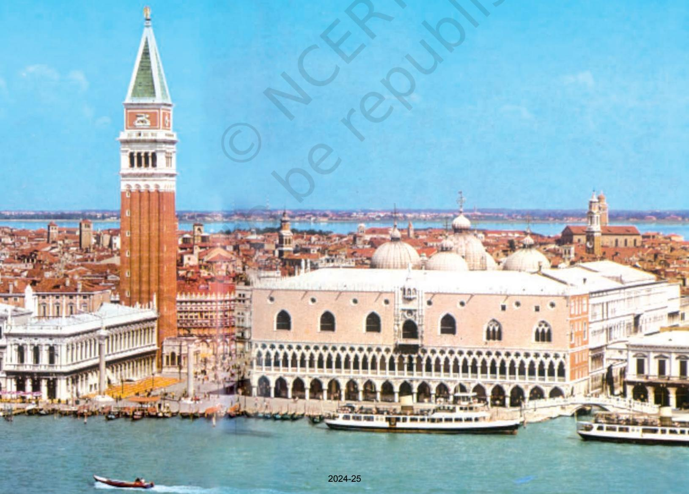

# Changing Traditions

78 THEMES IN WORLD HISTORY

WE have seen how, by the ninth century, large parts of Asia witnessed the growth and expansion of great empires – some nomadic, some based on well-developed cities and trading networks that centred on them. The difference between the Macedonian, Roman and Arab empires and the ones that preceded them (the Egyptian, Assyrian, Chinese, Mauryan) was that they covered greater areas of territory, and were continental or transcontinental in nature. The Mongol empire was similar.

Different cultural encounters were crucial to what took place. The arrival of empires was almost always sudden, but they were almost always the result of changes that had been taking place over a long time in the core of what would become an empire.

Traditions in world history could change in different ways. In western Europe during the period from the ninth to the seventeenth centuries, much that we connect with modern times evolved slowly – the development of scientific knowledge based on experiment rather than religious belief, serious thought about the organisation of government, with attention to the creation of civil services, parliaments and different codes of law, improvements in technology that was used in industry and agriculture. The consequences of these changes could be felt with great force outside Europe.

As we have seen, by the fifth century CE, the Roman Empire in the west had disintegrated. In western and central Europe, the remains of the Roman Empire were slowly adapted to the administrative requirements and needs of tribes that had established kingdoms there. However, urban centres were smaller in western Europe than further east.

By the ninth century, the commercial and urban centres – Aix, London, Rome, Sienna – though small, could not be dismissed. From the ninth to the eleventh centuries, there were major developments in the countryside in western Europe. The Church and royal government developed a combination of Roman institutions with the customary rules of tribes. The finest example was the empire of Charlemagne in western and central Europe at the beginning of the ninth century. Even after its rapid collapse, urban centres and trading networks persisted, albeit under heavy attack from Hungarians, Vikings and others.

What happened was called 'feudalism'. Feudalism was marked by agricultural production around castles and 'manor houses', where lords of the manor possessed land that was cultivated by peasants (serfs) who pledged them loyalty, goods and services. These lords in turn pledged their loyalty to greater lords who were 'vassals' of kings. The Catholic Church (centred on the papacy) supported this state of affairs and itself possessed land. In a world where uncertainties of life, poor sense of medicine and low life expectancy were common, the Church showed people how to behave so that life after death at least would be tolerable. Monasteries were created where God-fearing people could devote themselves to the service of God in the way Catholic churchmen thought fit. Equally, churches were part of a network of scholarship that ran from the Muslim states of Spain to Byzantium, and they provided the petty kings of Europe with a sense of the opulence of the eastern Mediterranean and beyond.

The influence of commerce and towns in the feudal order came to evolve and change encouraged by Mediterranean entrepreneurs in Venice and Genoa (from the twelfth century). Their ships carried on a growing trade with Muslim states and the remains of the Roman Empire in the east. Attracted by the lure of wealth in these areas, and inspired by the idea of freeing 'holy places' associated with Christ from Muslims, European kings reinforced links across the Mediterranean during the 'crusades'. Trade within Europe improved (centred on fairs and the port cities of the Baltic Sea and the North Sea and stimulated by a growing population).

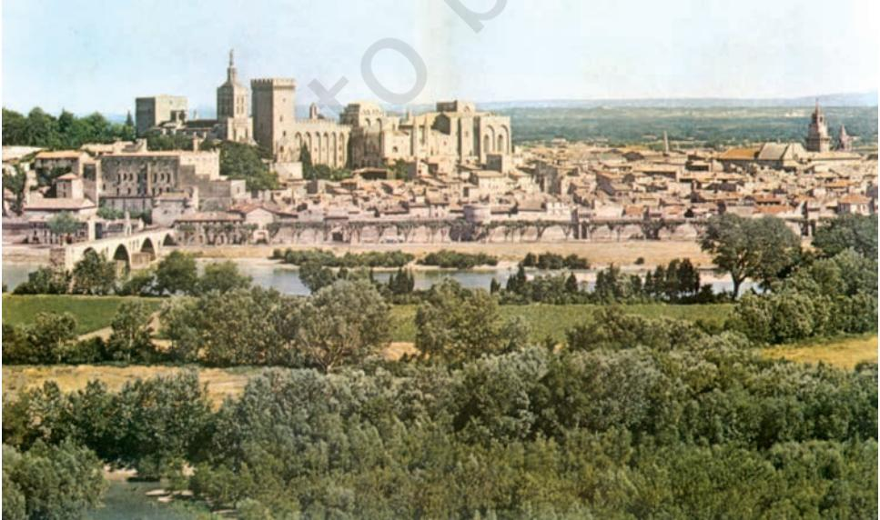

*The Palace of the Popes, in Avignon, a fourteenth-century town in south France.*

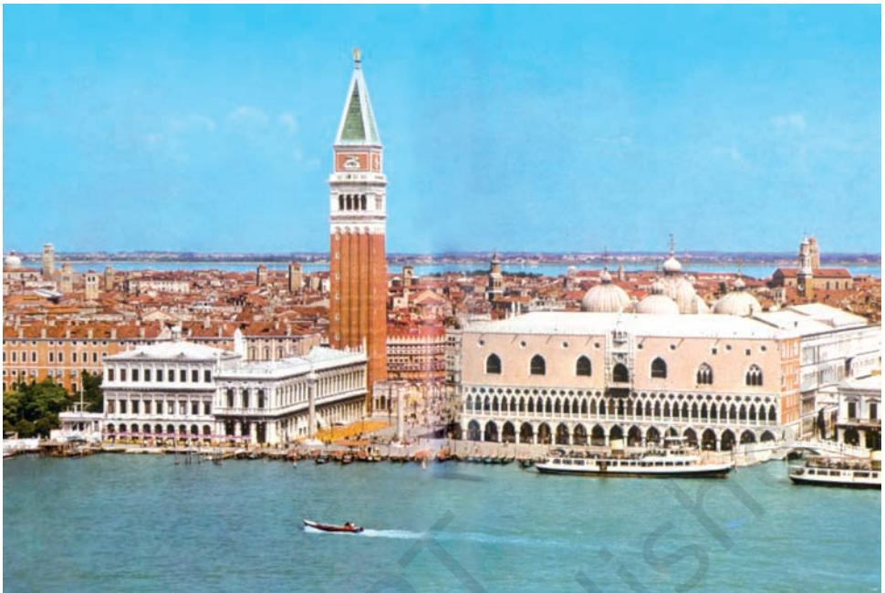

*The Palace of the Doge, in Venice, fifteenth century.*

Opportunities for commercial expansion coincided with changing attitudes concerning the value of life. Respect for human beings and living things that marked much of Islamic art and literature, and the example of Greek art and ideas that came to Europe from Byzantine trade encouraged Europeans to take a new look at the world. And from the fourteenth century (in what is called the 'Renaissance'), especially in north Italian towns, the wealthy became less concerned with life after death and more with the wonders of life itself. Sculptors, painters and writers became interested in humanity and the discovery of the world.

By the end of the fifteenth century, this state of affairs encouraged travel and discovery as never before. Voyages of discovery took place. Spaniards and Portuguese, who had traded with northern Africa, pushed further down the coast of western Africa, finally leading to journeys around the Cape of Good Hope to India – which had a great reputation in Europe as a source of spices that were in great demand. Columbus attempted to find a western route to India and in 1492 reached the islands which the Europeans called the West Indies. Other explorers tried to find a northern route to India and China via the Arctic.

European travellers encountered a range of different peoples in the course of their journeys. In part, they were interested in learning from them. The papacy encouraged the work of the North African geographer and traveller Hasan al-Wazzan (later known in Europe as Leo Africanus), who wrote the first geography of Africa in the early sixteenth century for Pope Leo X. Jesuit churchmen observed and wrote on Japan in the sixteenth century. An Englishman, Will Adams, became a friend and counsellor of the Japanese Shogun, Tokugawa Ieyasu, in the early seventeenth century. As in the case of Hasan al-Wazzan, peoples that the Europeans encountered in the Americas often took a great interest in them and sometimes worked for them. For example an Aztec woman – later known as Dona Marina – befriended the Spanish conqueror of Mexico, Cortes, and interpreted and negotiated for him.

In their encounters, Europeans were sometimes cautious, selfeffacing and observant, even as they frequently attempted to establish trade monopolies and enforce their authority by force of arms as the Portuguese attempted to do in the Indian Ocean after Vasco da Gama's arrival in Calicut (present-day Kozhikode) in 1498. In other cases, they were overbearing, aggressive and cruel and adopted an attitude of superiority to those they met, considering such people ignorant. The Catholic Church encouraged both attitudes. The Church was the centre for the study of other cultures and languages, but encouraged attacks on people it saw as 'un-Christian'.

From the point of view of non-Europeans, the encounter with Europe varied. For much of the Islamic lands and India and China, though, Europeans remained a curiosity until the end of the seventeenth century. They were perceived as hardy traders and seamen who had little to contribute to their sense of the larger world. The Japanese learnt some of the advantages of European technology quickly – for instance, they had begun large-scale production of muskets by the late sixteenth century. In the Americas, enemies of the Aztec empire sometimes used Europeans to challenge the power of the Aztecs. At the same time the diseases the Europeans brought devastated the populations, leading to the death of over 90 per cent of the people in some areas by the end of the sixteenth century.

# Timeline iiI (C. 1300 TO 1700)

82 THEMES IN WORLD HISTORY

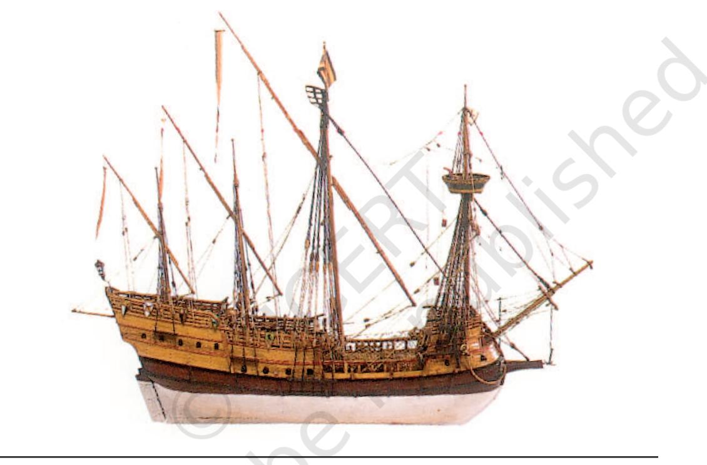

The period under consideration witnessed several major developments in Europe, including changes in agriculture and the lives of peasants. It was also marked by a range of cultural developments. This timeline draws attention to contacts between continents, stimulated in many instances by the growth of trade. The impact of these contacts was varied – while ideas, inventions and goods were shared across continents, there was also constant warfare between kingdoms to control land, resources and access to trade routes. As a result, men and women were often displaced and enslaved, if not exterminated. In many ways, the lives of people were transformed beyond recognition.

 83 TIMELINE-III

| DATES | AFRICA | EUROPE |
| --- | --- | --- |
| 1300-25 |  | Alhambra and Granada emerge as |
|  |  | important cultural centres in Spain |
| 1325-50 | Plague* in Egypt (1348-55) | Hundred Years War between England and |
|  |  | France (1337-1453); |
|  |  | Black Death (a form of plague) spreads |
|  |  | throughout Europe (1348) |
| 1350-75 | Ibn Batuta explores the Sahara | French peasants protest against high |
|  |  | taxes (1358) |
| 1375-1400 |  | Peasant revolt in Britain (1381); |
|  |  | Geoffrey Chaucer writes The Canterbury |
|  |  | Tales, one of the earliest compositions in |
|  |  | English (1388) |
| 1400-25 |  |  |
| 1425-50 | Portuguese begin slave trading (1442) |  |
| 1450-75 | Songhai empire in West Africa | First printed book appears in Europe; |
|  | established based on trading networks | Leonardo da Vinci (1452-1519), painter, |
|  | across the Sahara; Portuguese | architect, inventor in Italy |
|  | expeditions and settlements along the |  |
|  | west coast of Africa (1471 onwards) |  |
| 1475-1500 | Portuguese convert the king of Bokongo | Establishment of the Tudor dynasty in |
|  | to Christianity | England (1485) |
| 1500-25 | African slaves taken to work on sugar | Coffee from South America is drunk in |
|  | plantations in America (1510); | Europe for the first time (1517) and |
|  | Ottoman Turks conquer Egypt (1517) | tobacco, chocolate, tomatoes and turkey |
|  |  | are also introduced; Martin Luther attempts |
|  |  | to reform the Catholic Church (1517) |
| 1525-50 |  | Copernicus propounds theory about |
|  |  | solar system (1543) |
| 1550-75 |  | William Shakespeare (1564-1616), |
|  |  | dramatist in England |
| 1575-1600 |  | Zacharias Janssen invents the |
|  |  | microscope (1590s) |
| 1600-25 | Oyo kingdom of Nigeria at the height of | One of the first novels, Don Quixote, |
|  | its power, centres for metal-working* | written in Spanish (1605) |
| 1625-50 |  | William Harvey demonstrates that blood is |
|  |  | pumped through the body by the heart (1628) |
| 1650-75 | Portuguese destroy the Kongo kingdom | Louis XIV, king of France (1638-1715) |
|  | (1662) |  |
| 1675-1700 |  | Peter the Great (1682-1725) attempts to |
|  |  | modernise Russia |

| DATES | ASIA | SOUTH ASIA |
| --- | --- | --- |
| 1300-25 |  |  |
| 1325-1350 |  | Establishment of the Vijayanagara empire* |
|  |  | (1336) |
| 1350-75 | Ming dynasty* in China (1368 onwards) |  |
| 1375-1400 |  |  |
| 1400-25 |  | Emergence of regional sultanates |
| 1425-50 |  |  |
| 1450-75 | Ottoman Turks capture Constantinople (1453) |  |
| 1475-1500 |  | Vasco da Gama reaches India (1498) |
| 1500-25 | Portuguese entry into China opposed, driven out to Macao (1522) |  |
| 1525-50 |  | Babur establishes Mughal control over |
|  |  | north India, first battle of Panipat (1526) |
| 1550-75 |  | Akbar (1556-1605) consolidates Mughal rule |
| 1575-1600 | First Kabuki play staged in Japan (1586); Shah Abbas (1587-1629) of Persia introduces |  |
|  | European methods of military training |  |
| 1600-25 | Tokugawa Shogunate established in Japan | Establishment of the British East India |
|  | (1603) | Company (1600) |
| 1625-50 | All European traders with the exception of the | Construction of the Taj Mahal ( 1632-53) |
|  | Dutch forbidden to trade with Japan (1637); |  |
|  | Manchu rule in China, (1644 onwards) which lasts for nearly 300 years; growing demand in |  |
|  | Europe for Chinese tea and silk |  |
| 1650-75 |  |  |
| 1675-1700 |  |  |

 85 TIMELINE-III

| DATES | AMERICAS | AUSTRALIA /PACIFIC ISLANDS |
| --- | --- | --- |
| 1300-25 | Aztec capital at Tenochtitlan, Mexico (1325), |  |
|  | building temples, development of irrigation |  |
|  | systems and accounting system (quipu)* |  |
| 1325-50 |  |  |
| 1350-75 |  |  |
| 1375-1400 |  |  |
| 1400-25 |  |  |
| 1425-50 |  |  |
| 1450-75 | Incas establish control over Peru (1465) |  |
| 1475-1500 | Columbus reaches the West Indies (1492) |  |
| 1500-25 | Spanish conquest of Mexico (1521) | Magellan, a Spanish navigator, reaches |
|  |  | the Pacific Ocean (1519) |
| 1525-50 | French explorers reach Canada (1534) |  |
| 1550-75 | Spanish conquest of Peru (1572) |  |
| 1575-1600 |  | Dutch sailors reach Australia by accident |
| 1600-25 | England sets up its first colonies in North | Spanish sailors reach Tahiti (1606) |
|  | America (1607); the first slaves are |  |
|  | brought from West Africa to Virginia (1619) |  |
| 1625-50 | Dutch found New Amsterdam, now called | Dutch navigator Abel Tasman sails around |
|  | New York (1626); first printing press is set up in Massachusetts (1635) | Australia without realising it. He then lands on Van Diemen's land, later called |
|  |  | Tasmania. He also reaches New Zealand, |
|  | but thinks it is part of a huge landmass! |  |
| 1650-75 | First sugar plantations are established in |  |
|  | the West Indies (1654) |  |
| 1675-1700 | French colonise the Mississippi basin, |  |
|  | naming it Louisiana after King Louis XIV |  |
|  | (1682) |  |
|  | ACTIVITY |  |
|  | You may have noticed that the column on Australia/Pacific Islands has |  |
|  | very few recorded dates. This is because the peoples in these areas often |  |
|  | used other forms of recording, including paintings such as the one shown |  |
|  | above*. List at least one event/process from each of the preceding five |  |
|  | columns which an Australian painter may have found worth recording. |  |
|  | List another five which may have seemed irrelevant to her/him. |  |

86 THEMES IN WORLD HISTORY

4

THEME

*IN this chapter, we shall learn about the socio-economic and political changes which occurred in western Europe between the ninth and sixteenth centuries. After the fall of the Roman Empire, many groups of Germanic people from eastern and central Europe occupied regions of Italy, Spain and France.*

*In the absence of any unifying political force, military conflict was frequent, and the need to gather resources to protect one's land became very important. Social organisation was therefore centred on the control of land. Its features were derived from both imperial Roman traditions and German customs. Christianity, the official religion of the Roman Empire from the fourth century, survived the collapse of Rome, and gradually spread to central and northern Europe. The Church also became a major landholder and political power in Europe.*

*The 'three orders', the focus of this chapter, are three social categories: Christian priests, landowning nobles and peasants. The changing relationships between these three groups was an important factor in shaping European history for several centuries.*

Over the last 100 years, European historians have done detailed work on the histories of regions, even of individual villages. This was possible because, from the medieval period, there is a lot of material in the form of documents, details of landownership, prices and legal cases: for example, churches kept records of births, marriages and deaths, which have made it possible to understand the structure of families and of population. The inscriptions in churches give information about traders' associations, and songs and stories give a sense of festivals and community activities.

All these can be used by historians to understand economic and social life, and changes over a long period (like increase in population) or over a short period (like peasant revolts).

Of the many scholars in France who have worked on feudalism, one of the earliest was Bloch. Marc Bloch (1886–1944) was one of a group of scholars who argued that history consisted of much more than just political history, international relations and the lives of great people. He emphasised the importance of geography in shaping human history, and the need to understand the collective behaviour or attitudes of groups of people.

Bloch's *Feudal Society* is about European, particularly French, society between 900 and 1300, describing in remarkable detail social relations and hierarchies, land management and the popular culture of the period.

His career was cut short tragically when he was shot by the Nazis in the Second World War.

#### **An Introduction to Feudalism**

The term 'feudalism' has been used by historians to describe the economic, legal, political and social relationships that existed in Europe in the medieval era. Derived from the German word 'feud', which The term 'medieval era' refers to the period in European history between the fifth and the fifteenth centuries.

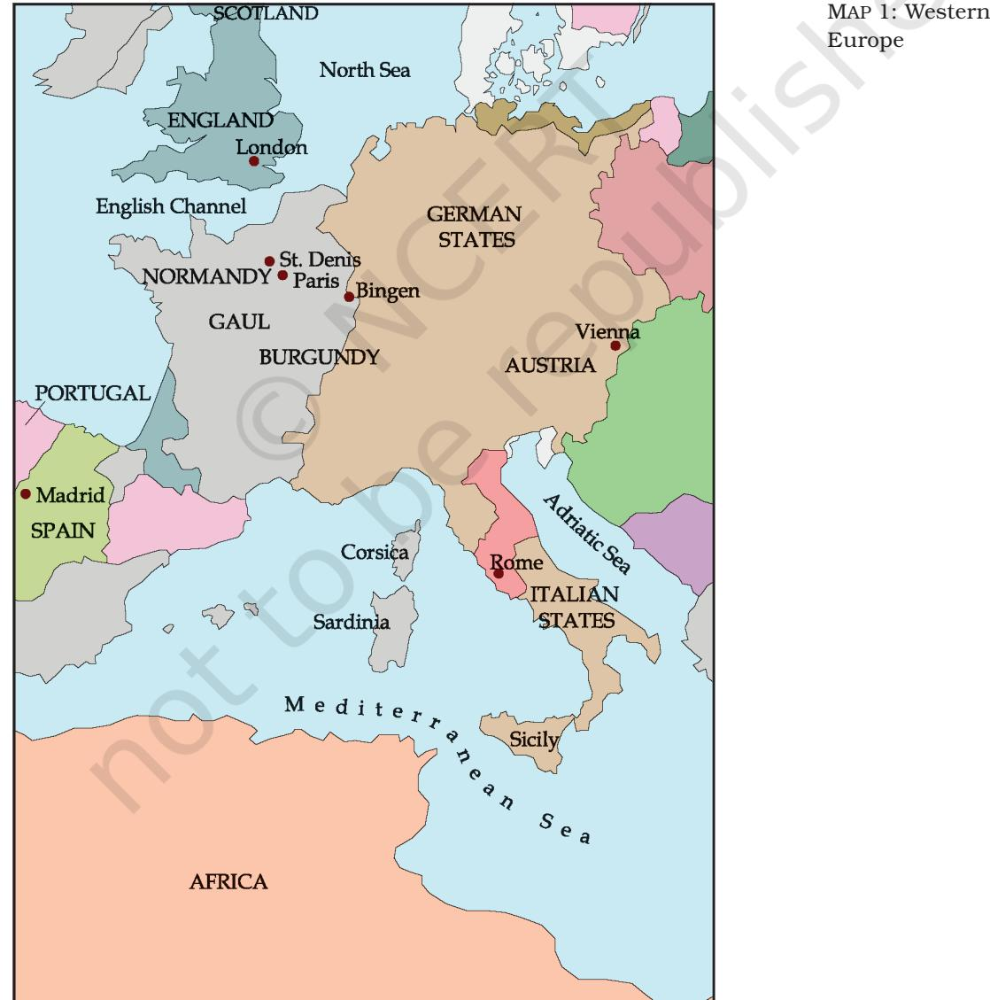

means 'a piece of land', it refers to the kind of society that developed in medieval France, and later in England and in southern Italy.

In an economic sense, feudalism refers to a kind of agricultural production which is based on the relationship between lords and peasants. The latter cultivated their own land as well as that of the lord. The peasants performed labour services for the lords, who in exchange provided military protection. They also had extensive judicial control over peasants. Thus, feudalism went beyond the economic to cover the social and political aspects of life as well.

Although its roots have been traced to practices that existed in the Roman Empire and during the age of the French king Charlemagne (742-814), feudalism as an established way of life in large parts of Europe may be said to have emerged later, in the eleventh century.

#### **France and England**

Gaul, a province of the Roman Empire, had two extensive coastlines, mountain ranges, long rivers, forests and large tracts of plains suited to agriculture.

The Franks, a Germanic tribe, gave their name to Gaul, making it 'France'. From the sixth century, this region was a kingdom ruled by Frankish/French kings, who were Christian. The French had very strong links with the Church, which were further strengthened when in 800 the Pope gave King Charlemagne the title of 'Holy Roman Emperor', to ensure his support*.

Across a narrow channel lay the island of England–Scotland, which in the eleventh century was conquered by a duke from the French province of Normandy.

|  | Early History of France |
| --- | --- |
| 481 | Clovis becomes king of the Franks |
| 486 | Clovis and the Franks begin the conquest of northern Gaul |
| 496 | Clovis and the Franks convert to Christianity |
| 714 | Charles Martel becomes mayor of the palace |
| 751 | Martel's son Pepin deposes the Frankish ruler, becomes king and establishes a dynasty. Wars of conquest double the size of his kingdom |
| 768 | Pepin succeeded by his son Charlemagne/Charles the Great |
| 800 | Pope Leo III crowns Charlemagne as Holy Roman Emperor |
| 840 ONWARDS Raids by Vikings from Norway |  |

*The head of the Eastern Church, in Constantinople, had a similar relationship with the Byzantine emperor.

#### **The Three Orders**

French priests believed in the concept that people were members of one of the three 'orders', depending on their work. A bishop stated, 'Here below, some pray, others fight, still others work...' Thus, the three orders of society were broadly the clergy, the nobility and the peasantry.

In the twelfth century, Abbess Hildegard of Bingen wrote: 'Who would think of herding his entire cattle in one stable – cows, donkeys, sheep, goats, without difference? Therefore it is necessary to establish difference among human beings, so that they do not destroy each other … God makes distinctions among his flock, in heaven as on earth. All are loved by him, yet there is no equality among them.'

#### **The Second Order: The Nobility**

Priests placed themselves in the first order, and nobles in the second. The nobility had, in reality, a central role in social processes. This is because they controlled land. This control was the outcome of a practice called 'vassalage'.

The kings of France were linked to the people by 'vassalage', similar to the practice among the Germanic peoples, of whom the Franks were one. The big landowners – the nobles – were vassals of the king, and peasants were vassals of the landowners. A nobleman accepted the king as his *seigneur* (senior) and they made a mutual promise: the *seigneur*/lord ('lord' was derived from a word meaning one who

provided bread) would protect the vassal, who would be loyal to him. This relationship involved elaborate rituals and exchange of vows taken on the Bible in a church. At this ceremony, the vassal received a written charter or a staff or even a clod of earth as a symbol of the land that was being given to him by his master.

The noble enjoyed a privileged status. He had absolute control over his property, in perpetuity. He could raise troops called 'feudal levies'. The lord held his own courts of justice and could even coin his own money.

He was the lord of all the people settled on his land. He owned vast tracts of land which contained his own dwellings, his private fields and pastures and the homes and fields of his tenant-peasants. His house was called a manor. His private lands were cultivated by peasants, who were also expected to act as footsoldiers in battle when required, in addition to working on their own farms.

'Abbey' is derived from the Syriac *abba*, meaning father. An abbey was governed by an abbot or an abbess.

*French nobles starting for a hunt, fifteenthcentury painting.*

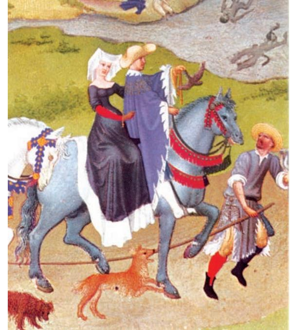

# **The Manorial Estate**

A lord had his own manor-house. He also controlled villages – some lords controlled hundreds of villages – where peasants lived. A small manorial estate could contain a dozen families, while larger estates might include fifty or sixty. Almost everything needed for daily life was found on the estate: grain was grown in the fields, blacksmiths and carpenters maintained the lord's implements and repaired his weapons, while stonemasons looked after his buildings. Women spun and wove fabric, and children worked in the lord's wine-presses. The estate had extensive woodlands and forests where the lords hunted. They contained

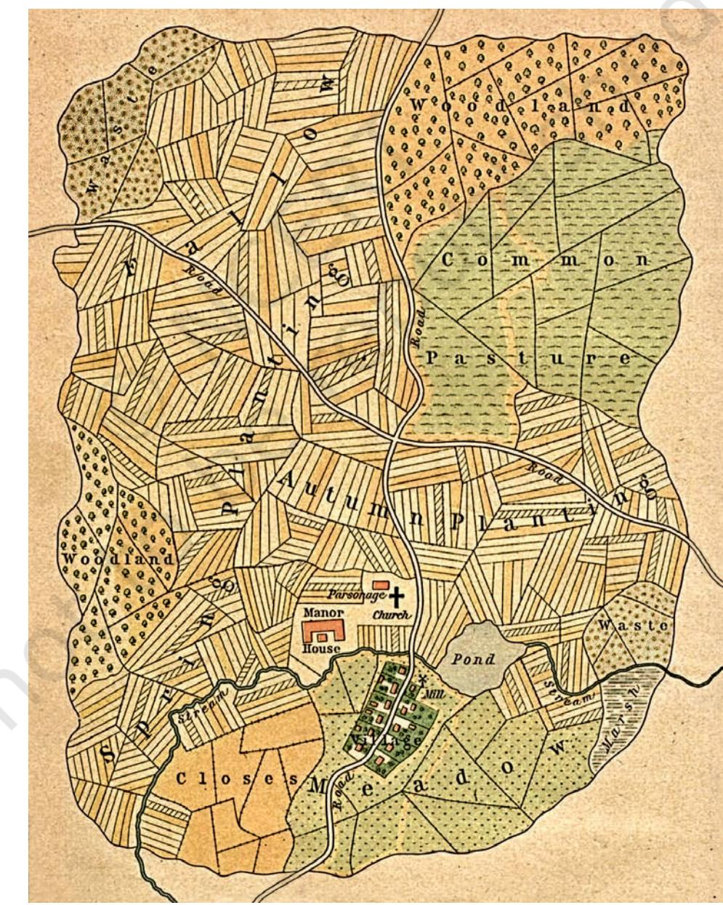

*A manorial estate, England, thirteenth century.*

pastures where his cattle and his horses grazed. There was a church on the estate and a castle for defence.

From the thirteenth century, some castles were made bigger for use as a residence for a knight's family. In fact, in England castles were practically unknown before the Norman Conquest, and developed as centres of political administration and military power under the feudal system.

The manor could not be completely self-sufficient because salt, millstones and metalware had to be obtained from outside sources. Those lords who wanted a luxurious lifestyle and were keen to buy rich furnishings, musical instruments and ornaments not locally produced, had to get these from other places.

#### **The Knights**

From the ninth century, there were frequent localised wars in Europe. The amateur peasant-soldiers were not sufficient, and good cavalry was needed. This led to the growing importance of a new section of people – the knights. They were linked to the lords, just as the latter were linked to the king. The lord gave the knight a piece of land (called 'fief') and promised to protect it. The fief could be inherited. It extended to anything between 1,000 and 2,000 acres or more, including a house for the knight and his family, a church and other establishments to house his dependants, besides a watermill and a wine-press. As in the feudal manor, the land of the fief was cultivated by peasants. In exchange, the knight paid his lord a regular fee and promised to fight for him in war. To keep up their skills, knights spent time each day fencing and practising tactics with dummies. A knight might serve more than one lord, but his foremost loyalty was to his own lord.

In France, from the twelfth century, minstrels travelled from manor to manor, singing songs which told stories – partly historical, partly invented – about brave kings and knights. In an age when not too many people could read and manuscripts were few, these travelling bards were very popular. Many manors had a narrow balcony above the large hall where the people of the manor gathered for meals. This was the minstrels' gallery, from where singers entertained nobles while they feasted.

## **The First Order: The Clergy**

The Catholic Church had its own laws, owned lands given to it by rulers, and could levy taxes. It was thus a very powerful institution which did not depend on the king. At the head of the western Church was the Pope. He lived in Rome. The Christians in Europe were guided by bishops and clerics – who constituted the first 'order'. Most villages had their own church, where people assembled every Sunday to listen to the sermon by the priest and to pray together.

#### ACTIVITY 1

Discuss social hierarchies based on different criteria: occupation, language, wealth, education. Compare medieval France with Mesopotamia and the Roman Empire.

'If my dear lord is slain, his fate I'll share, If he is hanged, then hang me by his side. If to the stake he goes, with him I'll burn; And if he's drowned, then let me drown with him.'

*– Doon de Mayence,* a thirteenth-century French poem (to be sung) recounting the adventures of knights.

Everyone could not become a priest. Serfs were banned, as were the physically challenged. Women could not become priests. Men who became priests could not marry. Bishops were the religious nobility. Like lords who owned vast landed estates, the bishops also had the use of vast estates, and lived in grand palaces. The Church was entitled to a tenth share of whatever the peasants produced from their land over the course of the year, called a 'tithe'. Money also came in the form of endowments made by the rich for their own welfare and the welfare of their deceased relatives in the afterlife.

Some of the important ceremonies conducted by the Church copied formal customs of the feudal elite. The act of kneeling while praying, with hands clasped and head bowed, was an exact replica of the way in which a knight conducted himself while taking vows of loyalty to his lord. Similarly, the use of the term 'lord' for God was another example of feudal culture that found its way into the practices of the Church. Thus, the religious and the lay worlds of feudalism shared many customs and symbols.

#### ACTIVITY 2

Discuss examples of expected patterns of behaviour between people of different social levels, in a medieval manor, a palace and in a place of worship.

The word 'monastery*'* is derived from the Greek word '*monos*', meaning someone who lives alone.

#### **Monks**

Apart from the Church, devout Christians had another kind of organisation. Some deeply religious people chose to live isolated lives, in contrast to clerics who lived amongst people in towns and villages. They lived in religious communities called abbeys or monasteries, often in places very far from human habitation. Two of the more well-known monasteries were those established by St Benedict in Italy in 529 and of Cluny in Burgundy in 910.

Monks took vows to remain in the abbey for the rest of their lives and to spend their time in prayer, study and manual labour, like farming. Unlike priesthood, this life was open to both men and women – men became monks and women nuns. Except in a few cases, all abbeys were single-sex communities, that is, there were separate abbeys for men and women. Like priests, monks and nuns did not marry.

From small communities of 10 or 20 men/women, monasteries grew to communities often of several hundred, with large buildings and landed estates, with attached schools or colleges and hospitals. They contributed to the development of the arts. Abbess Hildegard (see p.135) was a gifted musician, and did much to develop the practice of community singing of prayers in church. From the thirteenth century, some groups of monks – called friars – chose not to be based in a monastery but to move from place to place, preaching to the people and living on charity.

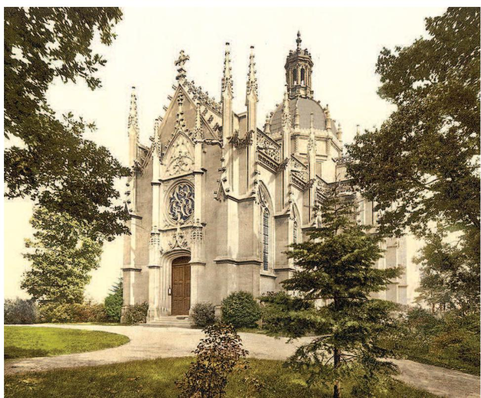

*St Michael's Benedictine abbey in Farnborough, England.*

In Benedictine monasteries, there was a manuscript with 73 chapters of rules which were followed by monks for many centuries. Here are some of the rules they had to follow:

Chapter 6: Permission to speak should rarely be granted to monks.

Chapter 7: Humility means obedience.

Chapter 33: No monk should own private property.

Chapter 47: Idleness is the enemy of the soul, so friars and sisters should be occupied at certain times in manual labour, and at fixed hours in sacred reading.

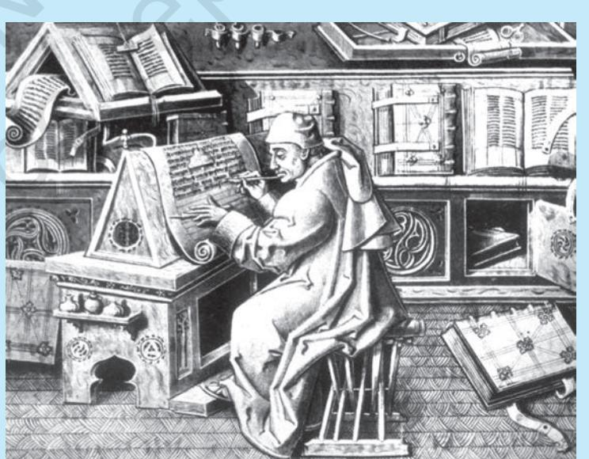

*A Benedictine monk working on a manuscript, woodcut.*

Chapter 48: The monastery should be laid out in such a way that all necessities be found within its bounds: water, mill, garden, workshops.

By the fourteenth century, there was a growing uncertainty about the value and purpose of monasticism. In England, Langland's poem, *Piers Plowman* (c.1360-70), contrasted the ease and luxury of the lives of some monks with the 'pure faith' of 'simple ploughmen and shepherds and poor common labourers.' Also in England, Chaucer wrote the *Canterbury Tales* (see box below) which had comic portraits of a nun, a monk and a friar.

# **The Church and Society**

Though Europeans became Christian, they still held on to some of their old beliefs in magic and folk traditions. Christmas and Easter became important dates from the fourth century. Christ's birth, celebrated on 25 December, replaced an old pre-Roman festival, the date of which was calculated by the solar calendar. Easter marked the crucifixion of Christ and his rising from the dead. But its date was not a fixed one, because it replaced an older festival to celebrate the coming of spring after a long winter, dated by the lunar calendar. Traditionally, on that day, people of each village used to make a tour of their village lands. With the coming of Christianity, they continued to do this, but they called the village the 'parish' (the area under the supervision of one priest). Overworked peasants welcomed 'holy days'/holidays because they were not expected to work then. These days were meant for prayer, but people usually spent a good part of them having fun and feasting.

Pilgrimage was an important part of a Christian's life, and many people went on long journeys to shrines of martyrs or to big churches.

'When in April the sweet showers fall And pierce the drought of March to the root And the small birds are making melody That sleep away the night with open eye… (So Nature pricks them and their heart engages); Then people long to go on pilgrimages, And palmers* long to seek the foreign shrines Of far-off saints, revered in various lands. And especially from every shire Of England, to Canterbury they make their journey.'

– Geoffrey Chaucer (c. 1340–1400), *The Canterbury Tales*. This was written in Middle English, and the verse is a translation in modern English.

*A monk who travels to distant shrines.

94 THEMES IN WORLD HISTORY

#### **The Third Order: Peasants, Free and Unfree**

Let us now turn to the vast majority of people, namely, those who sustained the first two orders. Cultivators were of two kinds: free peasants and serfs (from the verb 'to serve').

Free peasants held their farms as tenants of the lord. The men had to render military service (at least forty days every year). Peasant families had to set aside certain days of the week, usually three but often more, when they would go to the lord's estate and work there. The output from such labour, called labour-rent, would go directly to the lord. In addition, they could be required to do other unpaid labour services, like digging ditches, gathering firewood, building fences and repairing roads and buildings. Besides helping in the fields, women and children had to do other tasks. They spun thread, wove cloth, made candles and pressed grapes to prepare wine for the lord's use. There was one direct tax called 'taille' that kings sometimes imposed on peasants (the clergy and nobles were exempted from paying this).

Serfs cultivated plots of land, but these belonged to the lord. Much of the produce from this had to be given to the lord. They also had to work on the land which belonged *exclusively* to the lord. They

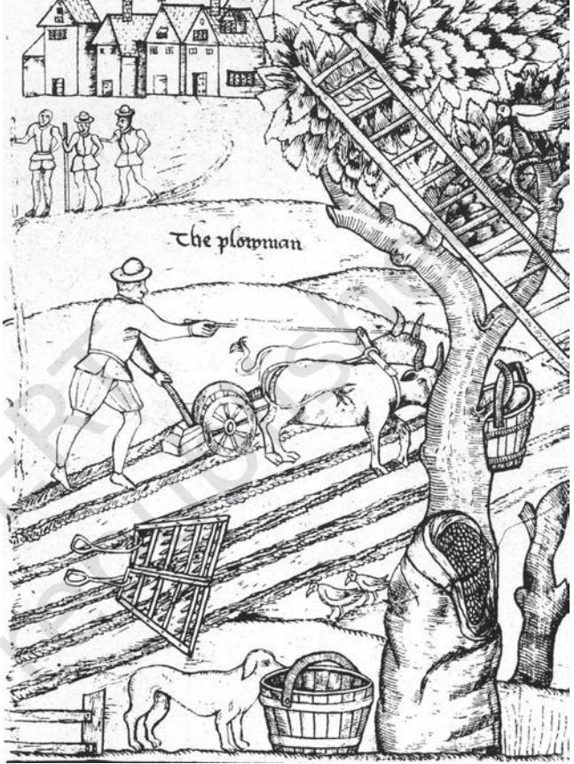

received no wages and could not leave the estate without the lord's permission. The lord claimed a number of monopolies at the expense of his serfs. Serfs could use only their lord's mill to grind their flour, his oven to bake their bread, and his wine-presses to distil wine and beer. The lord could decide whom a serf should marry, or might give his blessing to the serf's choice, but on payment of a fee.

# **England**

Feudalism developed in England from the eleventh century.

The Angles and Saxons, from central Europe, had settled in England in the sixth century. The country's name, England, is a variant of 'Angle-land'. In the eleventh century, William, the Duke of Normandy*, crossed the English Channel with an army and defeated the Saxon king of England. From this time, France and England were often at war because of disputes over territory and trade.

*An English ploughman, sixteenthcentury sketch.*

> *The present Queen of England is descended from William I.

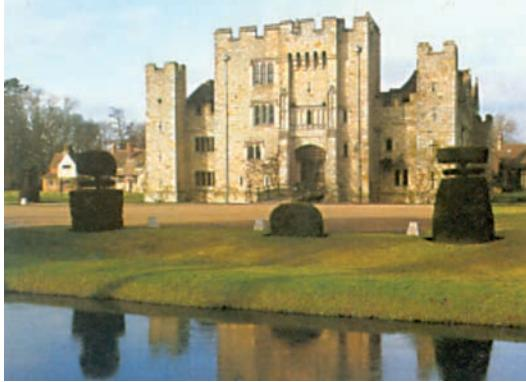

*Hever Castle, England, thirteenth century.*

William I had the land mapped, and distributed it in sections to 180 Norman nobles who had migrated with him. The lords became the chief tenants of the king, and were expected to give him military help. They were obliged to supply a certain number of knights to the king. They soon began to gift some of their own lands to knights who would serve them just as they in turn served the king. They could not, however, use their knights for private warfare, which was forbidden in England. Anglo-Saxon peasants became tenants of various levels of landholders.

#### **Factors Affecting Social and Economic Relations**

While members of the first two orders saw the social system as stable and unchanging, there were several processes which were transforming the system. Some of these, such as changes in the environment, were gradual and almost imperceptible. Others were more dramatic, like the changes in agricultural technology and land use. These in turn were shaped by and had an effect on the social and economic ties between lords and vassals. Let us examine these processes one by one.

#### **The Environment**

From the fifth to the tenth centuries, most of Europe was covered with vast forests. Thus the land available for agriculture was limited. Also, peasants dissatisfied with their conditions could flee from oppression and take refuge in the forest. Europe was undergoing an intensely cold climatic spell in this period. This led to severe and prolonged winters, a shortened growing season for crops, and reduced yields from agriculture.

From the eleventh century, Europe entered a warm phase. Average temperatures increased, which had a profound effect on agriculture. Peasants now had a longer growing season and the soil, now less subjected to frost, could be more easily ploughed. Environmental historians have noted that there was a significant receding of the forest line in many parts of Europe. This made expansion of the area under cultivation possible.

## **Land Use**

Initially, agricultural technology was very primitive. The only mechanical aid available to the peasant was the wooden plough, drawn by a team of oxen. This plough could at best scratch the surface of the earth and was unable to fully draw out the natural productivity of the soil. Agriculture was therefore very labour intensive. Fields had to be dug by hand, often once in four years, and enormous manual labour was required.

Also, an ineffective method of crop rotation was in use. The land was divided in half, one field was planted in autumn with winter wheat, while the other field was left fallow. Rye was planted on this piece of fallow land the next year while the other half was put to fallow. With this system, the soil slowly deteriorated, and famines were not uncommon. Chronic malnutrition alternated with devastating famines and life was difficult for the poor.

Despite these hardships, the lords were anxious to maximise their incomes. Since it was not possible to increase output from the land, the peasants were forced to bring under cultivation all the land in the manorial estate, and spend more time doing this than they were legally bound to do. The peasants did not bow quietly to oppression. Since they could not protest openly, they resorted to passive resistance. They spent more time cultivating their own fields, and kept much of the product of that labour for themselves. They also avoided performing unpaid extra services. They came into conflict with the lords over pasture and forest lands, and saw these lands as resources to be used by the whole community, while the lords treated these as their private property.

#### **New Agricultural Technology**

By the eleventh century, there is evidence of several technological changes.

Instead of the basic wooden ploughs, cultivators began using heavy iron-tipped ploughs and mould-boards. These ploughs could dig much deeper and the mould-boards turned the topsoil properly. With this the nutrients from the soil were better utilised.

The methods of harnessing animals to the plough improved. Instead of the neck-harness, the shoulder-harness came into use. This enabled animals to exert greater power. Horses were now better shod, with iron horseshoes, which prevented foot decay. There was increased use of wind and water energy for agriculture. More waterpowered and wind-powered mills were set up all over Europe for purposes like milling corn and pressing grapes.

There were also changes in land use. The most revolutionary one was the switch from a two-field to a three-field system. In this, peasants could use a field two years out of three if they planted it with one crop in autumn and a different crop in spring a year and a half later. That meant that farmers could break their holdings into three fields. They could plant one with wheat or rye in autumn for human consumption. The second could be used in spring to raise peas, beans and lentils for human use, and oats and barley for the horses. The third field lay fallow. Each year they rotated the use among the three fields.

With these improvements, there was an almost immediate increase in the amount of food produced from each unit of land. Food availability

doubled. The greater use of plants like peas and beans meant more vegetable proteins in the diet of the average European and a better source of fodder for their animals. For cultivators, it meant better opportunities. They could now produce more food from less land. The average size of a peasant's farm shrank from about 100 acres to 20 to 30 acres by the thirteenth century. Holdings which were smaller could be more efficiently cultivated and reduced the amount of labour needed. This gave the peasants time for other activities.

Some of these technological changes cost a lot of money. Peasants did not have enough money to set up watermills and windmills. Therefore the initiative was taken by the lords. But peasants were able to take the initiative in many things, such as extending arable land. They also switched to the three-field rotation of crops, and set up small forges and smithies in the villages, where iron-tipped ploughs and horseshoes were made and repaired cheaply.

From the eleventh century, the personal bonds that had been the basis of feudalism were weakening, because economic transactions were becoming more and more money based. Lords found it convenient to ask for rent in cash, not services, and cultivators were selling their crops for money (instead of exchanging them for other goods) to traders, who would then take such goods to be sold in the towns. The increasing use of money began to influence prices, which became higher in times of poor harvests. In England, for instance, agricultural prices doubled between the 1270s and the 1320s.

# **A Fourth Order? New Towns and Townspeople**

Expansion in agriculture was accompanied by growth in three related areas: population, trade and towns. From roughly 42 million in 1000, Europe's population stood at 62 million around 1200 and 73 million in 1300. Better food meant a longer lifespan. By the thirteenth century, an average European could expect to live 10 years longer than in the eighth century. Women and girls had shorter lifespans compared to men because the latter ate better food.

The towns of the Roman Empire had become deserted and ruined after its fall. But from the eleventh century, as agriculture increased and became able to sustain higher levels of population, towns began to grow again. Peasants who had surplus grain to sell needed a place where they could set up a selling centre and where they could buy tools and cloth. This led to the growth of periodic fairs and small marketing centres which gradually developed town-like features – a town square, a church, roads where merchants built shops and homes, an office where those who governed the town could meet. In other places, towns grew around large castles, bishops' estates, or large churches.

In towns, instead of services, people paid a tax to the lords who owned the land on which the town stood. Towns offered the prospect

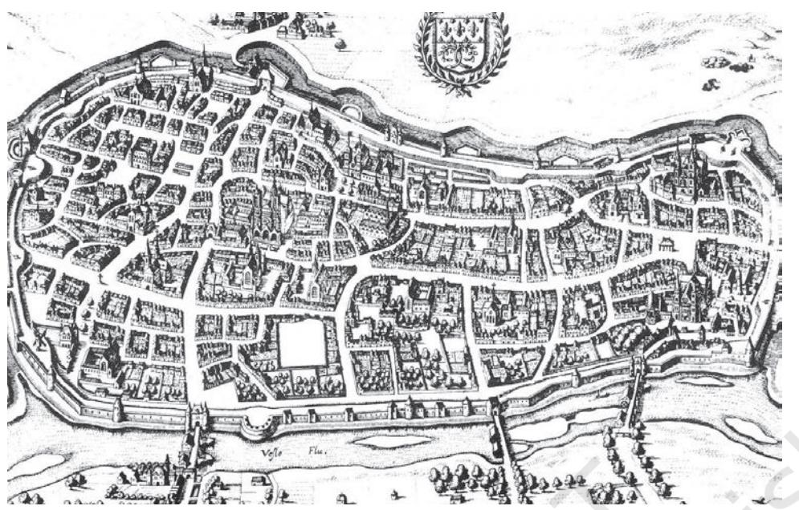

*Reims, French cathedral-town, seventeenth-century map.*

of paid work and freedom from the lord's control, for young people from peasant families.

'Town air makes free' was a popular saying. Many serfs craving to be free ran away and hid in towns. If a serf could stay for one year and one day without his lord discovering him, he would become a free man. Many people in towns were free peasants or escaped serfs who provided unskilled labour. Shopkeepers and merchants were numerous. Later there was need for individuals with specialised skills, like bankers and lawyers. The bigger towns had populations of about 30,000. They could be said to have formed a 'fourth' order.

The basis of economic organisation was the guild. Each craft or industry was organised into a guild, an association which controlled the quality of the product, its price and its sale. The 'guild-hall' was a feature of every town; it was a building for ceremonial functions, and where the heads of all the guilds met formally. Guards patrolled the town walls and musicians were called to play at feasts and in civic processions, and innkeepers looked after travellers.

By the eleventh century, new trade routes with West Asia were developing (see Theme 5). Scandinavian merchants were sailing south from the North Sea to exchange furs and hunting-hawks for cloth; English traders came to sell tin. In France, by the twelfth century, commerce and crafts began to grow. Earlier, craftsmen used to travel from manor to manor; now they found it easier to settle in one place where goods could be produced and traded for food. As the number of towns grew and trade continued to expand, town merchants became rich and powerful, and rivalled the power of the nobility.

#### ACTIVITY 3

Look carefully at this map and the drawing of a town. What would you notice as special features of medieval European towns? How were they different from towns in other places and other periods of time?

## **Cathedral-towns**

One of the ways that rich merchants spent their money was by making donations to churches. From the twelfth century, large churches – called cathedrals – were being built in France. These belonged to monasteries, but different groups of people contributed to their construction with their own labour, materials or money. Cathedrals were built of stone, and took many years to complete. As they were being built, the area around the cathedrals became more populated, and when they were completed they became centres of pilgrimage. Thus, small towns developed around them.

Cathedrals were designed so that the priest's voice could be heard clearly within the hall where large numbers of people gathered, and so that the singing by monks could sound beautiful and the chiming

bells calling people to prayer could be heard over a great distance. Stained glass was used for windows. During the day the sunlight would make them radiant for people *inside* the cathedral, and after sunset the light of candles would make them visible to people *outside*. The stained glass windows narrated the stories in the Bible through pictures, which illiterate people could 'read'. *Salisbury Cathedral,*

*England.*

'Because of the inadequacy which we often felt on feast days, for the narrowness of the place forced the women to run towards the altar upon the heads of the men with much anguish and noisy confusion, [we decided] to enlarge and amplify the noble church…

We also caused to be painted, by the exquisite hands of many masters from different regions, a splendid variety of new windows… Because these windows are very valuable on account of their wonderful execution and the profuse expenditure of painted glass and sapphire glass, we appointed an official master craftsman for their protection, and also a goldsmith…who would receive their allowances, namely, coins from the altar and flour from the common storehouse of the brethren, and who would never neglect their duty, to look after these [works of art].'

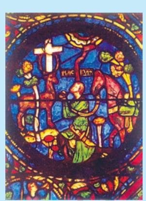

*Stained-glass window, Chartres cathedral, France, fifteenth century.*

– Abbot Suger (1081-1151) about the Abbey of St Denis, near Paris.

#### **The Crisis of the Fourteenth Century**

By the early fourteenth century, Europe's economic expansion slowed down. This was due to three factors.

In northern Europe, by the end of the thirteenth century the warm summers of the previous 300 years had given way to bitterly cold summers. Seasons for growing crops were reduced by a month and it became difficult to grow crops on higher ground. Storms and oceanic flooding destroyed many farmsteads, which resulted in less income in taxes for governments. The opportunities offered by favourable climatic conditions before the thirteenth century had led to large-scale reclamation of the land of forests and pastures for agriculture. But intensive ploughing had exhausted the soil despite the practice of the three-field rotation of crops, because clearance was not accompanied by proper soil conservation. The shortage of pasturage reduced the number of cattle. Population growth was outstripping resources, and the immediate result was famine. Severe famines hit Europe between 1315 and 1317, followed in the 1320s by massive cattle deaths.

In addition, trade was hit by a severe shortage of metal money because of a shortfall in the output of silver mines in Austria and Serbia. This forced governments to reduce the silver content of the currency, and to mix it with cheaper metals.

The worst was yet to come. As trade expanded in the thirteenth and fourteenth centuries, ships carrying goods from distant countries had started arriving in European ports. Along with the ships came rats – carrying the deadly bubonic plague infection (the 'Black Death'). Western Europe, relatively isolated in earlier centuries, was hit by the epidemic between 1347 and 1350. The modern estimate of mortality in that epidemic is that 20 per cent of the people of the whole of Europe died, with some places losing as much as 40 per cent of the population.

'How many valiant men, how many fair ladies, (had) breakfast with their kinfolk and the same night supped with their ancestors in the next world! The condition of the people was pitiable to behold. They sickened by the thousands daily, and died unattended and without help. Many died in the open street, others dying in their houses, made it known by the stench of their rotting bodies. Consecrated churchyards did not suffice for the burial of the vast multitude of bodies, which were heaped by the hundreds in vast trenches, like goods in a ships hold and covered with a little earth.'

– Giovanni Boccaccio (1313-75), Italian author.

As trade centres, cities were the hardest hit. In enclosed communities like monasteries and convents, when one individual contracted the plague, it was not long before everyone did. And in almost every case, none survived. The plague took its worst toll among infants, the young and the elderly. There were other relatively minor episodes of plague in the 1360s and 1370s. The population of Europe, 73 million in 1300, stood reduced to 45 million in 1400.

This catastrophe, combined with the economic crisis, caused immense social dislocation. Depopulation resulted in a major shortage of labour. Serious imbalances were created between agriculture and manufacture, because there were not enough people to engage in both equally. Prices of agricultural goods dropped as there were fewer people to buy. Wage rates increased because the demand for labour, particularly agricultural labour, rose in England by as much as 250 per cent in the aftermath of the Black Death. The surviving labour force could now demand twice their earlier wages.

#### **Social Unrest**

The income of lords was thus badly hit. It declined as agricultural prices came down and wages of labourers increased. In desperation, they tried to give up the money-contracts they had entered into and revive labour-services. This was violently opposed by peasants, particularly the better-educated and more prosperous ones. In 1323, peasants revolted in Flanders, in 1358 in France, and in 1381 in England.

Though these rebellions were ruthlessly crushed, it is significant that they occurred with the most violent intensity in those areas which had experienced the prosperity of the economic expansion – a sign that peasants were attempting to protect the gains they had made in previous centuries. Despite the severe repression, the sheer intensity of peasant opposition ensured that the old feudal relations could not be reimposed. The money economy was too far advanced to be reversed. Therefore, though the lords succeeded in crushing the revolts, the peasants ensured that the feudal privileges of earlier days could not be reinvented.

|  | Eleventh to Fourteenth Centuries |
| --- | --- |
| 1066 | Normans defeat Anglo-Saxons and conquer England |
| 1100ONWARDS | Cathedrals being built in France |
| 1315–17 | Great famine in Europe |
| 1347–50 | Black Death |
| 1338–1461 | Hundred Years War between England and France |
| 1381 | Peasants' revolts |

#### ACTIVITY 4

Read through the events and processes listed with dates, and connect them into a narrative account.

# **Political Changes**

Developments in the political sphere paralleled social processes. In the fifteenth and sixteenth centuries, European kings strengthened their military and financial power. The powerful new states they created were as significant for Europe as the economic changes that were occurring. Historians have therefore called these kings 'the new monarchs'. Louis XI in France, Maximilian in Austria, Henry VII in England and Isabelle and Ferdinand in Spain

were absolutist rulers, who started the process of organising standing armies, a permanent bureaucracy and national taxation and, in Spain and Portugal, began to play a role in Europe's expansion overseas.

The most important reason for the triumph of these monarchies was the social changes which had taken place in the twelfth and thirteenth centuries. The dissolution of the feudal system of lordship and vassalage, and the slow rate of economic growth had given the first opportunity to kings to increase their control over their powerful and notso-powerful subjects. Rulers dispensed with the system of feudal levies for their armies and introduced professionally trained infantry equipped with guns and siege artillery (see Theme 3) directly under their control. The resistance of the aristocracies crumbled in the face of the firepower of the kings.

*Queen Elizabeth I of England at a picnic, late sixteenth century.*

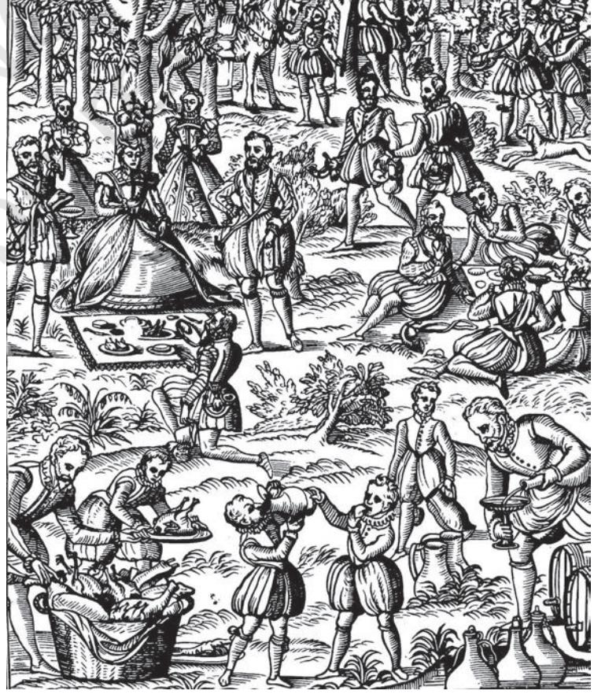

| The New Monarchy |  |
| --- | --- |
| 1461–1559 | New monarchs in France |
| 1474–1556 | New monarchs in Spain |
| 1485–1547 | New monarchs in England |

By increasing taxes, monarchs got enough revenues to support larger armies and thus defended and expanded their frontiers and overcame internal resistance to royal authority. Centralisation, however, did not occur without resistance from the aristocracy. A common thread running through all types of opposition to the monarchies was the question of taxation. In England, rebellions occurred and were put down in 1497, 1536, 1547, 1549 and 1553. In France, Louis XI (1461-83) had to wage a long struggle against dukes and princes. Lesser nobles, often members of local assemblies, resisted this royal usurpation of their powers. The 'religious' wars in France in the sixteenth century were in part a contest between royal privileges and regional liberties.

The nobility managed a tactical shift in order to ensure their survival. From being opponents to the new regimes, they quickly

> transformed themselves into loyalists. It is for this reason that royal absolutism has been called a modified form of feudalism. Precisely the same class of people who had been rulers in the feudal system – the lords – continued to dominate the political scene. They were given permanent positions in the administrative service. But the new regimes were different in some important ways.

The king was no longer at the apex of a pyramid where loyalty had been a matter of personal dependence and trust. He was now at the centre of an elaborate courtier society

and a network of patron–client relationships. All monarchies, weak or powerful, needed the cooperation of those who could command authority. Patronage became the means of ensuring such cooperation. And patronage could be given or obtained by means of money. Therefore money became an important way in which non-aristocratic elements like merchants and bankers could gain access to the court. They lent money to the kings, who used it to pay the wages of soldiers. Rulers thus made space for non-feudal elements in the state system.

The later history of France and England was to be shaped by these changes in the power structures. In the reign of the child-king Louis XIII of France, in 1614, a meeting was held of the French consultative assembly, known as the Estates-General (with three houses to represent the three estates/orders – clergy, nobility, and the rest). After this, it

*Nemours Castle, France, fifteenth century.*

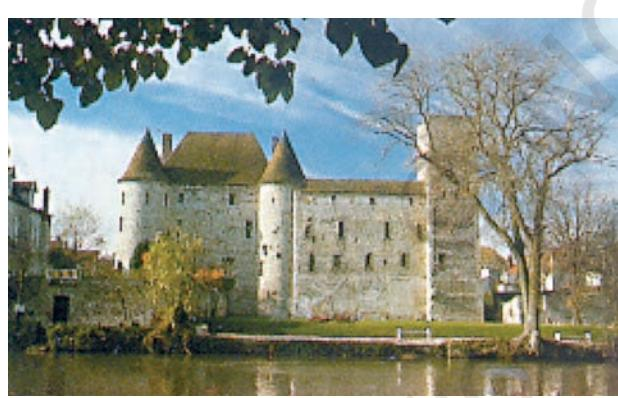

was not summoned again for nearly two centuries, till 1789, because the kings did not want to share power with the three orders.

What happened in England was very different. Even before the Norman Conquest, the Anglo-Saxons had a Great Council, which the king had to consult before imposing any tax. This developed into what was called the Parliament, which consisted of the House of Lords, the members of which were the lords and the clergy, and the House of Commons, representing towns and rural areas. King Charles I ruled for 11 years (1629–40) without calling Parliament. When he was forced to call it, because he needed money, a section of Parliament decided to go to war against him, and later executed him and established a republic. This did not last long, and monarchy was restored, but on the condition that Parliament would be called regularly.

 Today, France has a republican form of government and England has a monarchy. This is because of the different directions that the histories of the two countries took after the seventeenth century.

# **Exercises**

## **ANSWER IN BRIEF**

- 1. Describe two features of early feudal society in France.
- 2. How did long-term changes in population levels affect economy and society in Europe?
- 3. Why did knights become a distinct group, and when did they decline?
- 4. What was the function of medieval monasteries?

## **ANSWER IN A SHORT ESSAY**

- 5. Imagine and describe a day in the life of a craftsman in a medieval French town.
- 6. Compare the conditions of life for a French serf and a Roman slave.

