# THEME 106 THEMES IN WORLD HISTORY

# 5 Changing Cultural Traditions

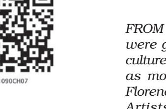

*FROM the fourteenth to the end of the seventeenth century, towns were growing in many countries of Europe. A distinct 'urban culture' also developed. Townspeople began to think of themselves as more 'civilised' than rural people. Towns – particularly Florence, Venice and Rome – became centres of art and learning. Artists and writers were patronised by the rich and the aristocratic. The invention of printing at the same time made books and prints available to many people, including those living in distant towns or countries. A sense of history also developed in Europe, and people contrasted their 'modern' world with the 'ancient' one of the Greeks and Romans.*

*Religion came to be seen as something which each individual should choose for himself. The church's earth-centric belief was overturned by scientists who began to understand the solar system, and new geographical knowledge overturned the Europecentric view that the Mediterranean Sea was the centre of the world*.

There is a vast amount of material on European history from the fourteenth century – documents, printed books, paintings, sculptures, buildings, textiles. Much of this has been carefully preserved in archives, art galleries and museums in Europe and America.

From the nineteenth century, historians used the term 'Renaissance' (literally, rebirth) to describe the cultural changes of this period. The historian who emphasised these most was a Swiss scholar – Jacob Burckhardt (1818–97) of the University of Basle in Switzerland. He was a student of the German historian Leopold von Ranke (1795–1886). Ranke had taught him that the primary concern of the historian was to write about states and politics using papers and files of government departments. Burckhardt was dissatisfied with these very limited goals that his master had set out for him. To him politics was not the be-all and endall in history writing. History was as much concerned with culture as with politics.

In 1860, he wrote a book called *The Civilisation of the Renaissance in Italy*, in which he called his readers' attention to literature, architecture and painting to tell the story of how a new 'humanist' culture had flowered in Italian towns from the fourteenth to the seventeenth century. This culture, he wrote, was characterised by a new belief – that man, as an individual, was capable of making his own decisions and developing his skills. He was 'modern', in contrast to 'medieval' man whose thinking had been controlled by the church.

#### **The Revival of Italian Cities**

After the fall of the western Roman Empire, many of the towns that had been political and cultural centres in Italy fell into ruin. There was no unified government, and the Pope in Rome, who was sovereign in his own state, was not a strong political figure.

While western Europe was being reshaped by feudal bonds and unified under the Latin Church, and eastern Europe under the Byzantine Empire, and Islam was creating a common civilisation further west, Italy was weak and fragmented. However, it was these very developments that helped in the revival of Italian culture.

With the expansion of trade between the Byzantine Empire and the Islamic countries, the ports on the Italian coast revived. From the twelfth century, as the Mongols opened up trade with China via the Silk Route (see Theme 5) and as trade with western European countries

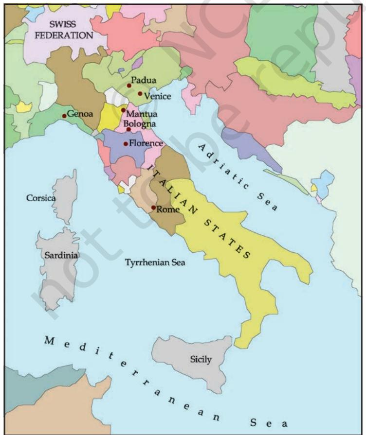

MAP 1: The Italian States

also increased, Italian towns played a central role. They no longer saw themselves as part of a powerful empire, but as independent citystates. Two of these – Florence and Venice – were republics, and many others were court-cities, ruled by princes.

One of the most vibrant cities was Venice, another was Genoa. They were different from other parts of Europe – the clergy were not politically dominant here, nor were there powerful feudal lords. Rich merchants and bankers actively participated in governing the city, and this helped the idea of citizenship to strike root. Even when these towns were ruled by military despots, the pride felt by the townspeople in being citizens did not weaken.

#### **The City-State**

Cardinal Gasparo Contarini (1483-1542) writes about the democratic government of his city-state in *The Commonwealth and Government of Venice* (1534).

'…to come to the institution of our Venetian commonwealth, the whole authority of the city…is in that council, into which all the gentlemen of the City being once past the age of 25 years are admitted...

Now first I am to yield you a reckoning how and with what wisdom it was ordained by our ancestors, that the common people should not be admitted into

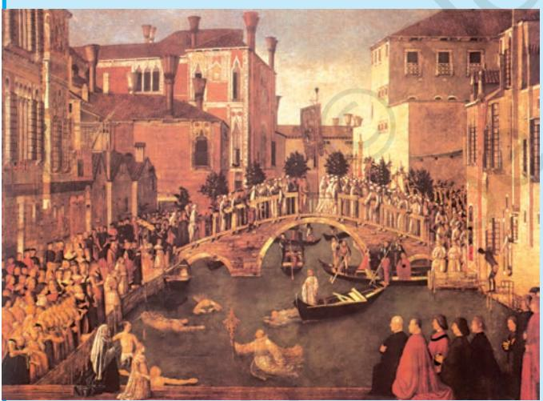

*G. Bellini's 'The Recovery of the Relic of the Holy Cross' was painted in 1500, to recall an event of 1370, and is set in fifteenth-century Venice.*

this company of citizens, in whose authority [lies] the whole power of the commonwealth... Because many troubles and popular tumults arise in those cities, whose government is swayed by the common people… many were of contrary opinion, deeming that it would do well, if this manner of governing the commonwealth should rather be defined by ability and abundance of riches. Contrariwise the honest citizens, and those that are liberally brought up, oftentimes fall to poverty... Therefore our wise and prudent ancestors... ordered that this definition of the public rule should go rather by the nobility of

lineage, than by the estimation of wealth: yet with that temperature [proviso], that men of chief and supreme nobility should not have this rule alone (for that would rather have been the power of a few than a commonwealth) but also every other citizen whosoever not ignobly born: so that all which were noble by birth, or ennobled by virtue, did...obtain this right of government.'

|  | The Fourteenth and Fifteenth Centuries |
| --- | --- |
| 1300 | Humanism taught at Padua University in Italy |
| 1341 | Petrarch given title of 'Poet Laureate' in Rome |
| 1349 | University established in Florence |
| 1390 | Geoffrey Chaucer's Canterbury Tales published |
| 1436 | Brunelleschi designs the Duomo in Florence |
| 1453 | Ottoman Turks defeat the Byzantine ruler of Constantinople |
| 1454 | Gutenberg prints the Bible with movable type |
| 1484 | Portuguese mathematicians calculate latitude by observing the sun |
| 1492 | Columbus reaches America |
| 1495 | Leonardo da Vinci paints The Last Supper |
| 1512 | Michelangelo paints the Sistine Chapel ceiling |

#### **Universities and Humanism**

The earliest universities in Europe had been set up in Italian towns. The universities of Padua and Bologna had been centres of legal studies from the eleventh century. Commerce being the chief activity in the city, there was an increasing demand for lawyers and notaries (a combination of solicitor and record-keeper) to write and interpret rules and written agreements without which trade on a large scale was not possible. Law was therefore a popular subject of study, but there was now a shift in emphasis. It was studied in the context of earlier Roman culture. Francesco Petrarch (1304-78) represented this change. To Petrarch, antiquity was a distinctive civilisation which could be best understood through the actual words of the ancient Greeks and Romans. He therefore stressed the importance of a close reading of ancient authors.

This educational programme implied that there was much to be learnt which religious teaching alone could not give. This was the culture which historians in the nineteenth century were to label 'humanism'. By the early fifteenth century, the term 'humanist' was used for masters who taught grammar, rhetoric, poetry, history and moral philosophy. The Latin word *humanitas*, from which 'humanities' was derived, had been used many centuries ago by the Roman lawyer and essayist Cicero (106-43 BCE), a contemporary of Julius Caesar, to mean culture. These subjects were not drawn from or connected with religion, and emphasised skills developed by individuals through discussion and debate.

#### ACTIVITY 1

Locate Venice on the map of Italy, and look carefully at the painting on p. 108. How would you describe the city, and in what ways was it different from a cathedral-town?

Giovanni Pico della Mirandola (1463-94), a humanist of Florence, wrote on the importance of debate in *On the Dignity of Man* (1486). 'For [Plato and Aristotle] it was certain that, for the attainment

of the knowledge of truth they were always seeking for themselves, nothing is better than to attend as often as possible the exercise of debate. For just as bodily energy is strengthened by gymnastic exercise, so beyond doubt in this wrestling-place of letters, as it were, energy of mind becomes far stronger and more vigorous.'

These revolutionary ideas attracted attention in many other universities, particularly in the newly established university in Petrarch's own home-town of Florence. Till the end of the thirteenth century, this city had not made a mark as a centre of trade or of learning, but things changed dramatically in the fifteenth century. A city is known by its great citizens as much as by its wealth, and Florence had come

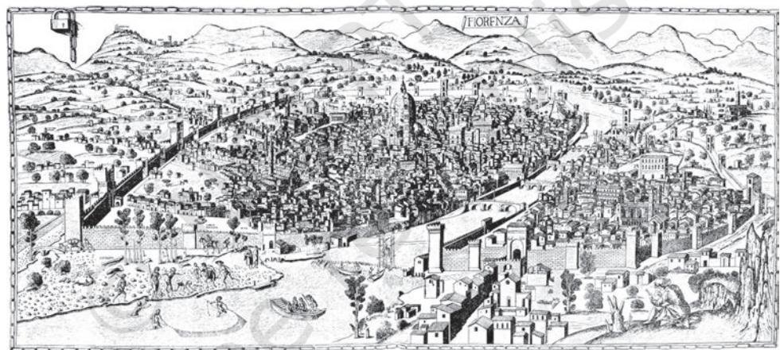

to be known because of Dante Alighieri (1265-1321), a layman who wrote on religious themes, and Giotto (1267-1337), an artist who painted lifelike portraits, very different from the stiff figures done by earlier artists. From then it developed as the most exciting intellectual city in Italy and as a centre of artistic creativity. The term 'Renaissance Man' is often used to describe a person with many interests and skills, because many of the individuals who became well known at this time were people of many parts. They were scholar-diplomat-theologian-artist combined in one.

# **The Humanist View of History**

Humanists thought that they were restoring 'true civilisation' after centuries of darkness, for they believed that a 'dark age' had set in after the collapse of the Roman Empire. Following them, later scholars unquestioningly assumed that a 'new age' had begun in Europe from the fourteenth century. The term 'Middle Ages'/'medieval period' was

*Florence, a sketch made in 1470.*

*Giotto's painting of the child Jesus, Assisi, Italy.*

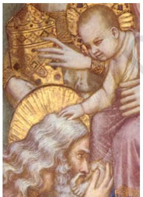

used for the millennium (thousand years) after the fall of Rome. In the 'Middle Ages', they argued, the Church had had such complete control over men's minds that all the learning of the Greeks and Romans had been blotted out. The humanists used the word 'modern' for the period from the fifteenth century.

Periodisation used by humanists and by later scholars

| 5th–14th century | The Middle Ages |
| --- | --- |
| 5th–9th century | The Dark Ages |
| 9th–11th century | The Early Middle Ages |
| 11th–14th century | The Late Middle Ages |
| 15th century onwards | The Modern Age |

Recently, historians have questioned this division. With more research being done and more being found out about Europe in this period, scholars are increasingly reluctant to make sharp divisions between centuries in terms of being culturally vibrant or otherwise. It seems unfair to label any period as the 'Dark Ages'.

# **Science and Philosophy: The Arabs' Contribution**

Much of the writings of the Greeks and Romans had been familiar to monks and clergymen through the 'Middle Ages', but they had not made these widely known. In the fourteenth century, many scholars began to read translated works of Greek writers like Plato and Aristotle. For this they were indebted not to their own scholars but to Arab translators who had carefully preserved and translated ancient manuscripts (Plato was Aflatun, and Aristotle Aristu in Arabic).

While some European scholars read Greek in Arabic translation, the Greeks translated works of Arabic and Persian scholars for further transmission to other Europeans. These were works on natural science, mathematics, astronomy, medicine and chemistry. Ptolemy's *Almagest* (a work on astronomy, written in Greek before 140 CE and later translated into Arabic) carries the Arabic definite article 'al', which brings out the Arabic connection. Among the Muslim writers who were regarded as men of wisdom in the Italian world were Ibn Sina* ('Avicenna' in Latin, 980-1037), an Arab physician and philosopher of Bukhara in Central Asia, and al-Razi ('Rhazes'), author of a medical encyclopaedia. Ibn Rushd ('Averroes' in Latin, 1126-98), an Arab philosopher of Spain, tried to resolve the tension between philosophical knowledge (*faylasuf*) and religious beliefs. His method was adopted by Christian thinkers.

Humanists reached out to people in a variety of ways. Though the curricula in universities continued to be dominated by law, medicine and theology, humanist subjects slowly began to be introduced in schools, not just in Italy but in other European countries as well.

*The European spelling of these individuals' names made later generations think they were Europeans!

> Schools at this time were only for boys.

# **Artists and Realism**

Formal education was not the only way through which humanists shaped the minds of their age. Art, architecture and books were wonderfully effective in transmitting humanist ideas.

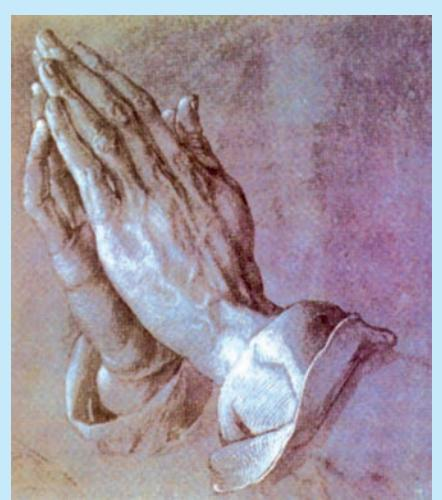

' "Art" is embedded in nature; he who can extract it, has it… Moreover, you may demonstrate much of your work by geometry. The more closely your work abides by life in its form, so much the better will it appear…No man shall ever be able to make a beautiful figure out of his own imagination unless he has well stored his mind by much copying from life.'

– Albrecht Durer (1471-1528)

This sketch by Durer (Praying Hands) gives us a sense of Italian culture in the sixteenth century, when people were deeply religious, but also had a sense of confidence in man's ability to achieve near-perfection and to unravel the mysteries of the world and the universe.

*'Praying Hands', brush drawing by Durer, 1508.*

*'The Pieta' by Michelangelo depicts Mary holding the body of Jesus.*

Artists were inspired by studying works of the past. The material remains of Roman culture were sought with as much excitement as

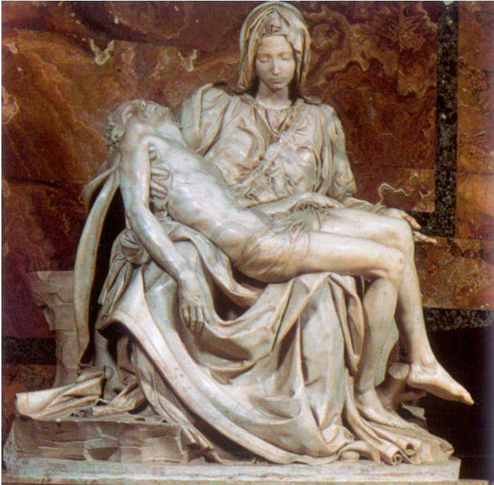

ancient texts: a thousand years after the fall of Rome, fragments of art were discovered in the ruins of ancient Rome and other deserted cities. Their admiration for the figures of 'perfectly' proportioned men and women sculpted so many centuries ago, made Italian sculptors want to continue that tradition. In 1416, Donatello (1386- 1466) broke new ground with his lifelike statues.

Artists' concern to be accurate was helped by the work of scientists. To study bone structures, artists went to the laboratories of medical schools. Andreas Vesalius (1514-64), a Belgian and a professor of medicine at the University of Padua, was the first to dissect the human body. This was the beginning of modern physiology.

This self-portrait is by Leonardo da Vinci (1452-1519) who had an amazing range of interests from botany and anatomy to mathematics and art. He painted the *Mona Lisa* and *The Last Supper*. One of his dreams was to be able to fly. He spent years observing birds in flight, and designed a flying machine. He signed his name 'Leonardo da Vinci, disciple of experiment'.

Painters did not have older works to use as a model. But they, like sculptors, painted as realistically as possible. They found that a knowledge of geometry helped them understand perspective, and that by noting the changing quality of light, their pictures acquired a three-dimensional quality. The use of oil as a medium for painting also gave a greater richness of colour to paintings than before. In the colours and designs of costumes in many paintings, there is evidence of the influence of Chinese and Persian art, made available to them by the Mongols. (see Theme 3)

Thus, anatomy, geometry, physics, as well as a strong sense of what was beautiful, gave a new quality to Italian art, which was to be called 'realism' and which continued till the nineteenth century.

#### **Architecture**

The city of Rome revived in a spectacular way in the fifteenth century. From 1417, the popes were politically stronger because the weakness caused by the election of two rival popes since 1378 had

ended. They actively encouraged the study of Rome's history. The ruins in Rome were carefully excavated by archaeologists (archaeology was a new skill). This inspired a 'new' style in architecture, which was actually a revival of the imperial Roman style – now called 'classical'. Popes, wealthy merchants and aristocrats employed architects who were familiar with classical architecture. Artists and sculptors were also to decorate buildings with paintings, sculptures and reliefs.

Some individuals were skilled equally as painters, sculptors and architects. The most impressive example is Michelangelo Buonarroti (1475-1564) – immortalised by the ceiling he painted for the Pope in the Sistine Chapel, the sculpture called 'The Pieta' and his design of the dome of St Peter's Church, all in Rome. Filippo Brunelleschi (1337-1446), the architect who designed the spectacular Duomo of Florence, had started his career as a sculptor.

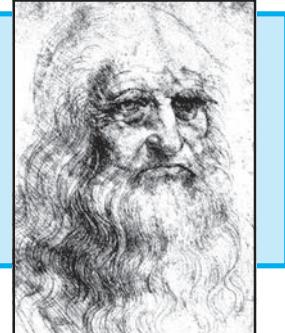

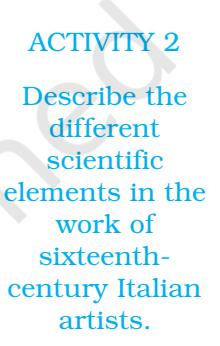

*Italian architecture in the sixteenth century copied many features of imperial Roman buildings.*

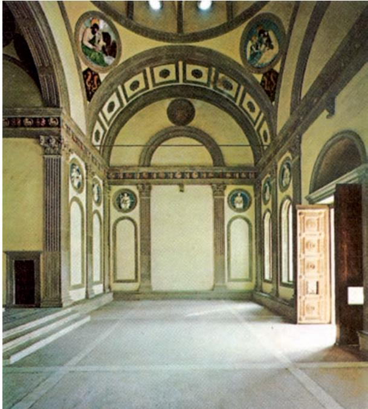

Another remarkable change was that from this time, artists were known individually, by name, not as members of a group or a guild, as earlier.

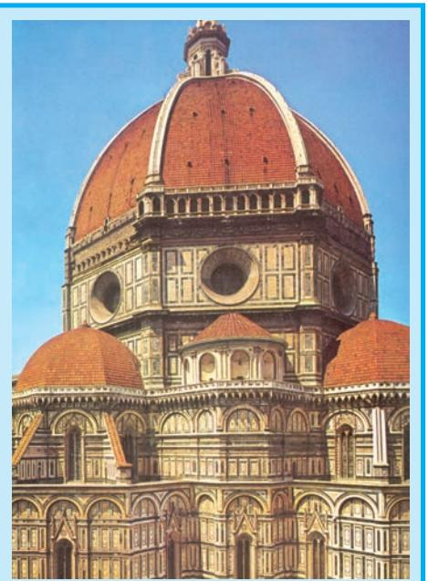

*The Duomo, the dome of Florence cathedral designed by Brunelleschi.*

Leon Batista Alberti (1404- 72) wrote on art theory and architecture. 'Him I call an Architect who is able to devise and to compleat all those Works which, by the movement of great Weights, and by the conjunction and amassment of Bodies can, with the greatest Beauty, be adapted to the uses of Mankind.'

#### **The First Printed Books**

If people in other countries wanted to see paintings, sculptures or buildings of great artists, they had to travel to Italy. But in the case of the written word, what was written in Italy travelled to other countries. This was because of the greatest revolution of the sixteenth century – the mastery of the technology of printing. For this, Europeans were indebted to other peoples – the Chinese, for printing technology, and to Mongol rulers because European traders and diplomats had become familiar with it during visits to their courts. (This was also the case with three other important innovations – firearms, the compass and the abacus.)

Earlier, texts existed in a few hand-written copies. In 1455, 150 copies of the Bible were printed in the workshop of Johannnes Gutenberg (1400-1458), the German who made the first printing press. Earlier, a monk would have taken the same amount of time to write out *one* copy of the Bible!

By 1500, many classical texts, nearly all in Latin, had been printed in Italy. As printed books became available, it was possible to buy them, and students did not have to depend solely on lecture-notes. Ideas, opinions and information moved more widely and more rapidly than ever before. A printed book promoting new ideas could quickly reach hundreds of readers. This also made it possible for individuals to read books, since it was possible to buy copies for oneself. This developed the reading habit among people.

The chief reason that the humanist culture of Italy spread more rapidly across the Alps from the end of the fifteenth century is that printed books were circulating. This also explains why earlier intellectual movements had been limited to particular regions.

#### **A New Concept of Human Beings**

One of the features of humanist culture was a slackening of the control of religion over human life. Italians were strongly attracted to material wealth, power and glory, but they were not necessarily irreligious. Francesco Barbaro (1390-1454), a humanist from Venice, wrote a pamphlet defending acquisition of wealth as a virtue. In *On Pleasure*, Lorenzo Valla (1406-1457), who believed that the study of history leads man to strive for a life of perfection, criticised the Christian injunction against pleasure. There was also a concern at this time with good manners – how one should speak politely and dress correctly, what skills a person of culture should learn.

Humanism also implied that individuals were capable of shaping their own lives through means other than the mere pursuit of power and money. This ideal was closely tied with the belief that human nature was many-sided, which went against the three separate orders that feudal society believed in.

Niccolo Machiavelli wrote about human nature in the fifteenth chapter of his book, *The Prince* (1513).

'So, leaving aside imaginary things, and referring only to those which truly exist, I say that whenever men are discussed (and especially princes, who are more exposed to view), they are noted for various qualities which earn them either praise or condemnation. Some, for example, are held to be generous, and others miserly. Some are held to be benefactors, others are called grasping; some cruel, some compassionate; one man faithless, another faithful; one man effeminate and cowardly, another fierce and courageous; one man courteous, another proud; one man lascivious, another pure; one guileless, another crafty; one stubborn, another flexible; one grave, another frivolous; one religious, another sceptical; and so forth.'

Machiavelli believed that 'all men are bad and ever ready to display their vicious nature partly because of the fact that human desires are insatiable'. The most powerful motive Machiavelli saw as the incentive for every human action is self-interest.

# **The Aspirations of Women**

The new ideal of individuality and citizenship excluded women. Men from aristocratic families dominated public life and were the decision-makers in their families. They educated their sons to take their place in family businesses or in public life, at times sending their younger sons to join the Church. Although their dowries were invested in the family businesses, women generally had no say in how their husbands should run their business. Often, marriages were intended to strengthen business alliances. If an adequate dowry could not be arranged, daughters were sent to convents to live the life of a nun. Obviously, the public role of women was limited and they were looked upon as keepers of the households.

The position of women in the families of merchants, however, was somewhat different. Shopkeepers were very often assisted by their wives in running the shop. In families of merchants and bankers, wives looked after the businesses when the male members were away on work. The early death of a merchant compelled his widow to perform a larger public role than was the case in aristocratic families.

A few women were intellectually very creative and sensitive about the importance of a humanist education. 'Even though the study of letters promises and offers no reward for women and no dignity', wrote the Venetian Cassandra Fedele (1465-1558), 'every woman ought to seek and embrace these studies.' She was one of a handful of women who questioned the idea that women were incapable of achieving the qualities of a humanist scholar. Fedele was known for her proficiency in Greek and Latin, and was invited to give orations at the University of Padua.

Fedele's writings bring into focus the general regard for education in that age. She was one of many Venetian women writers who criticised the republic 'for creating a highly limited definition of freedom that favoured the desires of men over those of women'. Another remarkable woman was the Marchesa of Mantua, Isabella d'Este (1474-1539). She ruled the state while her husband was absent, and the court of Mantua, a small state, was famed for its intellectual brilliance. Women's writings revealed their conviction that they should have economic power, property and education to achieve an identity in a world dominated by men.

Balthasar Castiglione, author and diplomat, wrote in his book *The Courtier* (1528):

'I hold that a woman should in no way resemble a man as regards her ways, manners, words, gestures and bearing. Thus just as it is very fitting that a man should display a certain robust and sturdy manliness, so it is well for a woman to have a certain soft and delicate tenderness, with an air of feminine sweetness in her every movement, which, in her going and staying and whatsoever she does, always makes her appear a woman, without any resemblance to a man. If this precept be added to the rules that these gentlemen have taught the courtier, then I think that she ought to be able to make use of many of them, and adorn herself with the finest accomplishments... For I consider that many virtues of the mind are as necessary to a woman as to a man; as it is to be of good family; to shun affectation: to be naturally graceful; to be well mannered, clever and prudent; to be neither proud, envious or evil-tongued, nor vain... to perform well and gracefully the sports suitable for women.'

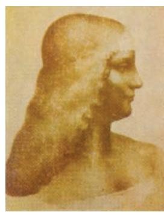

*Isabella d'Este.*

#### ACTIVITY 3

Compare the aspirations for women expressed by a woman (Fedele) and by a man (Castiglione). Did they have only women of a particular class in mind?

#### **Debates within Christianity**

Trade and travel, military conquest and diplomatic contacts linked Italian towns and courts with the world beyond. The new culture was admired and imitated by the educated and the wealthy. Very few of the new ideas filtered down to the ordinary man who, after all, could not read or write.

In the fifteenth and early sixteenth centuries, many scholars in universities in north Europe were attracted to humanist ideas. Like their Italian colleagues, they too focused on classical Greek and Roman texts along with the holy books of the Christians. But, unlike Italy, where professional scholars dominated the humanist movement, in north Europe humanism attracted many members of the Church. They called on Christians to practise religion in the way laid down in the ancient texts of their religion, discarding unnecessary rituals, which they condemned as later additions to a simple religion. Theirs was a radically new view of human beings as free and rational agents. Later philosophers were to return to this over and over again, inspired by the belief in a distant God who created man but allowed him complete freedom to live his life freely, in pursuit of happiness 'here and now'.

Christian humanists like Thomas More (1478-1535) in England and Erasmus (1466-1536) in Holland felt that the Church had become an institution marked by greed, extorting money at will from ordinary people. One of the favourite methods of the clergy was to sell 'indulgences', documents which apparently freed the buyer from the burden of the sins he had committed. Christians came to realise from printed translations of the Bible in local languages that their religion did not permit such practices.

In almost every part of Europe, peasants began to rebel against the taxes imposed by the Church. While the common folk resented the extortions of churchmen, princes found their interference in the work of the state irritating. They were pleased when the humanists pointed out that the clergy's claim to judicial and fiscal powers originated from a document called the 'Donation of Constantine' supposed to have been issued by Constantine, the first Christian Roman Emperor. Humanist scholars were able to point out that this was not genuine, and had been forged later.

In 1517, a young German monk called Martin Luther (1483-1546) launched a campaign against the Catholic Church and argued that a person did not need priests to establish contact with God. He asked his followers to have complete faith in God, for faith alone could guide them to the right life and entry into heaven. This movement – called the Protestant Reformation – led to the churches in Germany and Switzerland breaking their connection with the Pope and the Catholic Church. In Switzerland, Luther's ideas were popularised by Ulrich Zwingli (1484-1531) and later by Jean Calvin (1509-64). Backed by merchants, the reformers had greater popular

appeal in towns, while in rural areas the Catholic Church managed to retain its influence. Other German reformers, like the Anabaptists, were even more radical: they blended the idea of salvation with the end of all forms of social oppression. They said that since God had created all people as equal, they were not expected to pay taxes and had the right to choose their priests. This appealed to peasants oppressed by feudalism.

William Tyndale (1494-1536), an English Lutheran who translated the Bible into English in 1506, defended Protestantism thus:

'In this they be all agreed, to drive you from the knowledge of the scripture, and that ye shall not have the text thereof in the mother-tongue, and to keep the world still in darkness, to the intent they might sit in the consciences of the people, through vain superstition and false doctrine, to satisfy their proud ambition, and insatiable covetousness, and to exalt their own honour above king and emperor, yea, and above God himself... Which thing only moved me to translate the New Testament. Because I had perceived by experience, how that it was impossible to establish the lay-people in any truth, except the scripture were plainly laid before their eyes in their mother-tongue, that they might see the process, order, and meaning of the text. '

Luther did not support radicalism. He called upon German rulers to suppress the peasants' rebellion, which they did in 1525. But radicalism survived, and merged with the resistance of Protestants in France, who, persecuted by the Catholic rulers, started claiming the right of a people to remove an oppressive ruler and to choose someone of their own liking. Eventually, in France, as in many other parts of Europe, the Catholic Church allowed Protestants to worship as they chose. In England, the rulers ended the connection with the Pope. The king/queen was from then onwards the head of the Church.

The Catholic Church itself did not escape the impact of these ideas, and began to reform itself from within. In Spain and in Italy, churchmen emphasised the need for a simple life and service to the poor. In Spain, Ignatius Loyola, in an attempt to combat Protestantism, set up the Society of Jesus in 1540. His followers were called Jesuits, whose mission was to serve the poor and to widen their knowledge of other cultures.

#### ACTIVITY 4

What were the issues on which the Protestants criticised the Catholic Church?

The New Testament is the section of the Bible dealing with the life and teachings of Christ and his early followers.

|  | The Sixteenth and Seventeenth Centuries |
| --- | --- |
| 1516 | Thomas More's Utopia published |
| 1517 | Martin Luther writes the Ninety-Five Theses |
| 1522 | Luther translates the Bible into German |
| 1525 | Peasant uprising in Germany |
| 1543 | Andreas Vesalius writes On Anatomy |
| 1559 | Anglican Church established in England, with the king/queen as |
|  | its head |
| 1569 | Gerhardus Mercator prepares cylindrical map of the earth |
| 1582 | Gregorian calendar introduced by Pope Gregory XIII |
| 1628 | William Harvey links the heart with blood circulation |
| 1673 | Academy of Sciences set up in Paris |
| 1687 | Isaac Newton's Principia Mathematica published |

# **The Copernican Revolution**

The Christian notion of man as a sinner was questioned from an entirely different angle – by scientists. The turning point in European science came with the work of Copernicus (1473-1543), a contemporary of Martin Luther. Christians had believed that the earth was a sinful place and the heavy burden of sin made it immobile. The earth stood at the centre of the universe around which moved the celestial planets.

Copernicus asserted that the planets, including the earth, rotate around the sun. A devout Christian, Copernicus was afraid of the possible reaction to his theory by traditionalist clergymen. For this reason, he did not want his manuscript, *De revolutionibus* (The Rotation) to be printed. On his deathbed, he gave it to his follower, Joachim Rheticus. It took time for people to accept this idea. It was much later – more than half a century later, in fact – that the difference between 'heaven' and earth was bridged through the writings of astronomers like Johannes Kepler (1571-1630) and Galileo Galilei (1564-1642). The theory of the earth as part of a sun-centred system was made popular by Kepler's *Cosmographical Mystery,* which demonstrated that the planets move around the sun not in circles but in ellipses. Galileo confirmed the notion of the

Celestial means divine or heavenly, while terrestrial implies having a worldly quality.

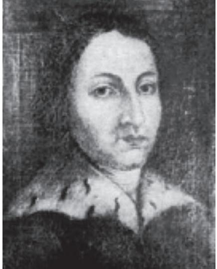

dynamic world in his work *The Motion*. This revolution in science reached its climax with Isaac Newton's theory of gravitation.

*Self-portrait by Copernicus.*

#### **Reading the Universe**

Galileo once remarked that the Bible that lights the road to heaven does not say much on how the heavens work. The work of these thinkers showed that *knowledge*, as distinct from *belief*, was based on observation and experiments. Once these scientists had shown the way, experiments and investigations into what came to be called physics, chemistry and biology expanded rapidly. Historians were to label this new approach to the knowledge of man and nature the Scientific Revolution.

Consequently, in the minds of sceptics and non-believers, God began to be replaced by Nature as the source of creation. Even those who retained their faith in God started talking about a distant God who does not directly regulate the act of living in the material world. Such ideas were popularised through scientific societies that established a new scientific culture in the public domain. The Paris Academy, established in 1670 and the Royal Society in London for the promotion of natural knowledge, formed in 1662, held lectures and conducted experiments for public viewing.

# **Was there a European 'Renaissance' in the Fourteenth Century?**

Let us now reconsider the concept of the 'Renaissance'. Can we see this period as marking a sharp break with the past and the rebirth of ideas from Greek and Roman traditions? Was the earlier period (twelfth and thirteenth centuries) a time of darkness?

Recent writers, like Peter Burke of England, have suggested that Burckhardt was exaggerating the sharp difference between this period and the one that preceded it, by using the term 'Renaissance', which implies that the Greek and Roman civilisations were *reborn* at this time, and that scholars and artists of this period substituted the pre-Christian worldview for the Christian one. Both arguments were exaggerated. Scholars in earlier centuries had been familiar with Greek and Roman cultures, and religion continued to be a very important part of people's lives.

To contrast the Renaissance as a period of dynamism and artistic creativity, and the Middle Ages as a period of gloom and lack of development is an over-simplification. Many elements associated with the Renaissance in Italy can be traced back to the twelfth and thirteenth centuries. It has been suggested by some historians that in the ninth century in France, there had been similar literary and artistic blossoming.

The cultural changes in Europe at this time were not shaped only by the 'classical' civilisation of Rome and Greece. The archaeological and literary recovery of Roman culture did create a great admiration of that civilisation. But technologies and skills in Asia had moved far ahead of what the Greeks and Romans had known. Much more of the world had become connected, and the new techniques of navigation (see Theme 8) enabled people to sail much further than had been possible earlier. The expansion of Islam and the Mongol conquests had linked Asia and North Africa with Europe, not politically but in terms of trade and of learning skills. The Europeans learned not just from the Greeks and Romans, but from India, from Arabia, from Iran, from Central Asia and China. These debts were not acknowledged for a long time because when the history of this period started to be written, historians saw it from a Europe-centred viewpoint.

An important change that did happen in this period was that gradually the 'private' and the 'public' spheres of life began to become separate: the 'public' sphere meant the area of government and of formal religion; the 'private' sphere included the family and personal religion. The individual had a private as well as a public role. He was not simply a member of one of the 'three orders'; he was also a person in his own right. An artist was not just a member of a guild, he was known for himself. In the eighteenth century, this sense of the individual would be expressed in a political form, in the belief that all individuals had equal political rights.

Another development was that the different regions of Europe started to have their separate sense of identity, based on language. Europe, earlier united partly by the Roman Empire and later by Latin and Christianity, was now dissolving into states, each united by a common language.

# **Exercises**

# **ANSWER IN BRIEF**

- 1. Which elements of Greek and Roman culture were revived in the fourteenth and fifteenth centuries?
- 2. Compare details of Italian architecture of this period with Islamic architecture.
- 3. Why were Italian towns the first to experience the ideas of humanism?
- 4. Compare the Venetian idea of good government with those in contemporary France.

# **ANSWER IN A SHORT ESSAY**

- 5. What were the features of humanist thought?
- 6. Write a careful account of how the world appeared different to seventeenth-century Europeans.

