# iv TOWARDS Modernisation

# **Displacing Indigenous Peoples**

 **Paths to Modernisation**

123

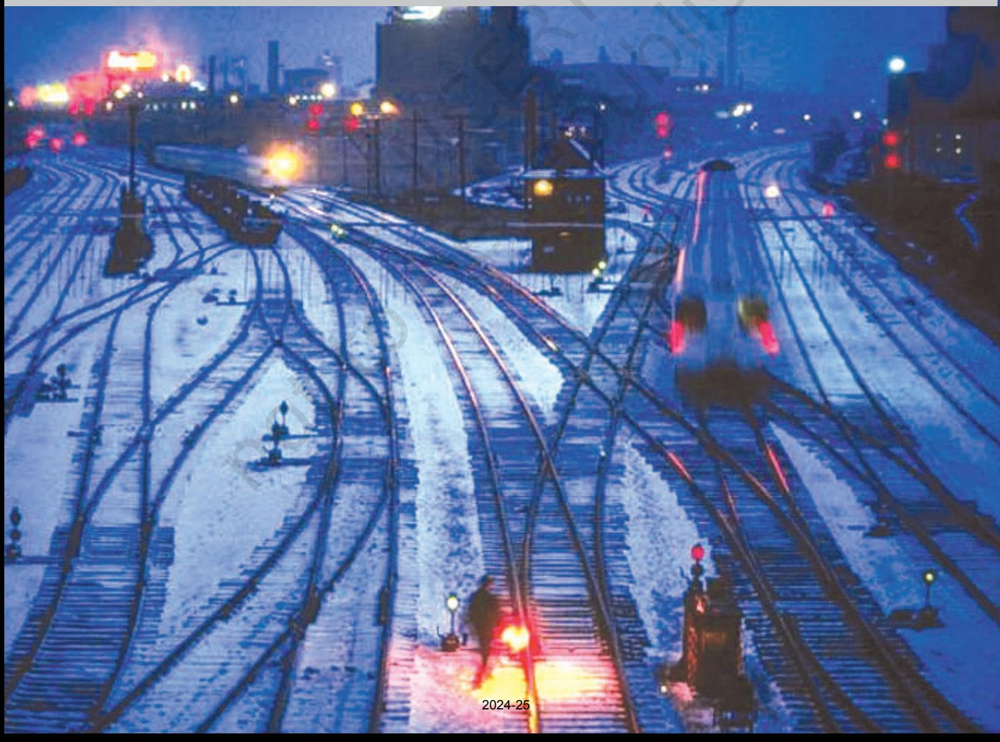

# TOWARDS Modernisation

124 THEMES IN WORLD HISTORY

I N the previous section you have learnt about certain crucial developments in the medieval and early modern world – feudalism, the European 'Renaissance' and the encounters between Europeans and the peoples of the Asia, Africa and Americas. As you would have realised, some of the phenomena that contributed to the making of our modern world gradually evolved in this period, and especially so from the mid-fifteenth century onwards. Two further developments in world history created a context for what has been called 'modernisation'. These were the Industrial Revolution and a series of political revolutions that transformed subjects into citizens, beginning with the American Revolution (1776-81) and the French Revolution (1789-94).

Britain has been the world's first industrial nation. For long it was believed that British industrialisation provided the model for industrialisation in other countries. However, historians have begun to question some of the earlier ideas about the Industrial Revolution. Each country drew upon the experiences of other nations, without necessarily reproducing any model. In Britain, for instance, coal and cotton textile industries were developed in the first phase of industrialisation, while the invention of railways initiated the second stage of that process. In other countries such as Russia, which began to industrialise much later (from the late nineteenth century onwards), the railway and other heavy industry emerged in the initial phase of industrialisation itself. Likewise, the role of the state, and of banks, in industrialisation has differed from country to country. The British case, no doubt, influenced the industrial

*Linking the world – In 1927 Charles Lindbergh, twenty-five years old, flew across the Atlantic Ocean, from New York to Paris, in a singleengine aeroplane.*

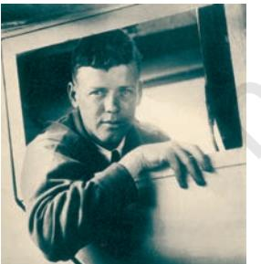

trajectories of other nations such as the USA and Germany, two significant industrial powers. It also displayed the human and material costs incurred by Britain on its industrialisation – the plight of the labouring poor, especially of children, environmental degradation and the consequent epidemics of cholera and tuberculosis. In Theme 7 you will read how industrial pollution and cadmium and mercury poisoning in Japan stirred people into mass movements against indiscriminate industrialisation.

European powers began to colonise parts of America and Asia and South Africa well before the Industrial Revolution. Theme 6 tells you the story of what European settlers did to the native peoples of America and Australia. The bourgeois mentality of the settlers made them buy and sell everything, including land and water. But the natives, who appeared uncivilised to European Americans, asked, 'If you do not own the freshness of the air and the sparkle of the water, how can one buy them?' The natives did not feel the need to own land, fish or animals. They had no desire to *commodify* them; if things needed to be exchanged, they could simply be *gifted*. Quite obviously, the natives and the Europeans represented competing notions of civilisation. The former did not allow the European deluge to wipe out their cultures although the US and Canadian governments of the mid-twentieth century desired natives to 'join the mainstream' and the Australian authorities of the same period attempted to simply ignore their traditions and culture. One might wonder what is meant by 'mainstream'. How does economic and political power influence the making of 'mainstream cultures'?

Western capitalisms – mercantile, industrial and financial – and early twentieth-century Japanese capitalism created colonies in large parts of the third world. Some of these were settler colonies. Others, such as British rule in India, are examples of direct imperial control. The case of nineteenthand early twentieth-century China illustrates a third variant of imperialism. Here Britain, France, Germany, Russia, America and Japan meddled in Chinese affairs without directly taking over state power. They exploited the country's resources to their own advantage, seriously compromising Chinese sovereignty and reducing the country to the status of a semi-colony.

Almost everywhere, colonial exploitation was challenged by powerful nationalist movements. Nationalisms, however, also arose without a colonial context, as in the West or Japan. All

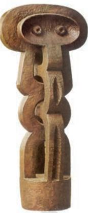

*Linking the world – J. Lipchitz's* Figure*, sculpted in the 1920s, shows the influence of central African statuary.*

*Linking the world – Japanese Zen paintings like this one were admired by western artists, and influenced the 'Abstract Expressionist' style of painting in the 1920s in the USA.*

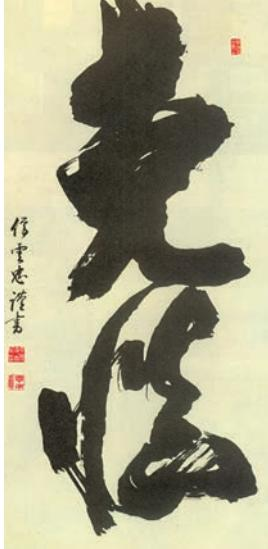

nationalisms are doctrines of popular sovereignty. Nationalist movements believe that political power should rest with the people and this is what makes nationalism a modern concept. Civic nationalism vests sovereignty in *all* people regardless of language, ethnicity, religion or gender. It seeks to create a community of rights-exercising citizens and defines nationhood in terms of *citizenship*, not ethnicity or religion. Ethnic and religious nationalisms try to build national solidarities around a given language, religion or set of traditions, defining the people ethnically, not in terms of common citizenship. In a multi-ethnic country, ethnic nationalists might limit the exercise of sovereignty to a chosen people, often assumed to be superior to minority communities. Today, most western countries define their nationhood in terms of common citizenship and not by common ethnicity. One prominent exception is Germany where ideas of ethnic nationalism have had a long and troubling career going back to the reaction against the French imperial occupation of German states in 1806. Ideologies of civic nationalism have vied with those of ethnic/religious nationalism the world over and this has been so in modern India, China and Japan as well.

As with industrialisation, so with paths to modernisation. Different societies have evolved their distinctive modernities. The Japanese and Chinese cases, along with the stories of Taiwan and South Korea, are very instructive in this regard. Japan succeeded in remaining free of colonial control and achieved fairly rapid economic and industrial progress throughout the twentieth century. The rebuilding of the Japanese economy after a humiliating defeat in the Second World War should not be seen as a mere post-war miracle. As Theme 7 shows, it resulted from certain gains that had already been accomplished in the nineteenth and early twentieth centuries. Did you know, for instance, that by 1910 tuition fees for studying at a primary school had more or less ended and enrolment had become universal? Japan's path to modernisation, like that of any other country, has had its own tensions: those between democracy and militarism, ethnic nationalism and civic nation-building and between what many Japanese describe as 'tradition' and 'westernisation'.

The Chinese resisted colonial exploitation and their own bureaucratic landed elite through a combination of peasant rebellion, reform and revolution. By the early 1930s, the Chinese Communist Party, which drew its strength from peasant mobilisation, had begun confronting the imperial powers as well as the Nationalists who represented the country's elite. It had also started implementing its ideas in selected pockets of the country. Its egalitarian ideology, stress on land reforms and awareness of women's problems helped it overthrow foreign imperialism and the Nationalists in 1949. Once in power, it succeeded in r educing inequalities, spreading education and creating political awareness. Even so, the country's single-party framework and state repression contributed to considerable dissatisfaction with the political system after the mid-1960s. But the Chinese Communist Party has been able to retain control over the country largely because, in embracing certain market principles, it reinvented itself and has worked hard to transform China into an economic powerhouse.

The different ways in which various countries have understood 'modernity' and sought to achieve it, each in the context of its own circumstances and ideas, make a fascinating story. This section introduces you to some aspects of that story.

# Timeline iv (C. 1700 TO 2000)

128 THEMES IN WORLD HISTORY

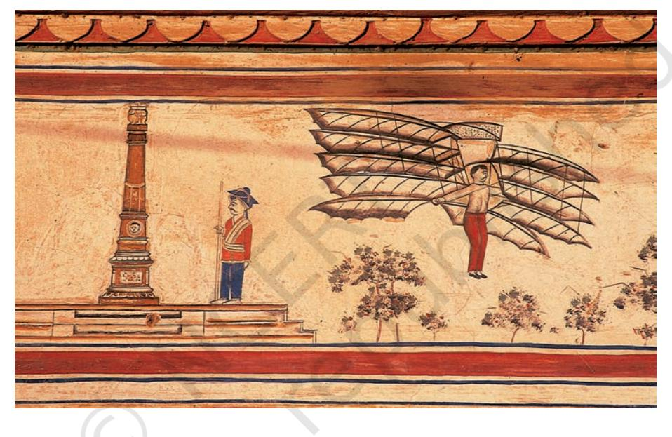

This timeline will give you an idea of what was happening in different parts of the world in the last three centuries, and how people in different countries contributed to the making of our modern world. It will tell you about the slave trade in Africa and the establishment of the Apartheid regime in South Africa, about social movements in Europe and the formation of nation states, about the expansion of imperial powers and the process of colonisation, and about democratic and anti-colonial movements that swept through the world in the last century. It will also refer to some of the inventions and technological developments that are associated with modernity.

As with all timelines, this one focuses on a few dates. There are others that are important. When you see a series of dates in a timeline, do not think that those are the only dates you need to know. Find out why different timelines focus on different types of dates, and what this selection tells us.

TIMELINE-IV 129

| DATES | AFRICA | EUROPE |
| --- | --- | --- |
| 1720-30 | King Agaja of Dahomey (1724-34), West |  |
|  | Africa, stops slave trade*; it is |  |
|  | reintroduced in the 1740s |  |
| 1730-40 |  | Carolus Linnaeus invents a taxonomic |
|  |  | system* to classify plants and animals |
|  |  | (1735) |
| 1740-50 |  |  |
| 1750-60 | First outbreak of smallpox (1755) brought |  |
|  | by sailors, in Cape Town, South Africa |  |
| 1760-70 |  |  |
| 1770-80 | Peak of international slave trade, all the |  |
|  | colonial powers are involved in it. Several | Emelian Pugachev heads a peasant |
|  | hundred thousand Black Africans are taken | uprising (1773-75) that sweeps across |
|  | across the Atlantic every year. As many as | Russia |
|  | two-thirds die on board ship itself |  |
| 1780-90 |  | Beginning of the French Revolution* (1789) |
| 1790-1800 |  |  |
| 1800-10 | Mohammed Ali rules Egypt, 1805-48; |  |
|  | Egypt breaks away from Ottoman empire |  |
| 1810-20 |  |  |
| 1820-30 | Liberia founded (1822) in West Africa as | Louis Braille develops a system of finger |
|  | home for freed slaves | reading* (1823); passenger trains |
|  |  | introduced in England (1825) |
| 1830-40 | Abdal-Kadir leads Arab resistance |  |
|  | (1832-47) against French presence in |  |
|  | Algeria |  |
| 1840-50 |  | Liberal and socialist movements in |
|  |  | several European countries (1848) |
| 1850-60 |  |  |

| DATES | AFRICA | EUROPE |
| --- | --- | --- |
| 1860-70 | Suez Canal*, one of the most | Russian serfs are freed (1861) |
|  | important trade routes in |  |
|  | the world, opens (1869) |  |
| 1870-80 |  | Germany and Italy emerge as unified |
|  |  | nation-states |
| 1880-90 | Beginning of the European 'Scramble for Africa' |  |
| 1890-1900 |  | Making of the first film (1895); the modern |
|  |  | Olympics are held for the first time in |
|  |  | Athens (1896) |
| 1900-1910 | Mahatma Gandhi* advocates satyagraha |  |
|  | to resist racist laws (1906) |  |
| 1910-1920 | South Africa introduces laws to reserve | First World War (1914-1918); the Russian |
|  | 87 per cent of land for whites (1913) | Revolution of 1917 |
| 1920-30 |  | Turkey becomes a republic under |
|  |  | Mustapha Kemal (1923) |
| 1930-40 | First trans-African railway from Angola to | Hitler captures power in Germany (1933); |
|  | Mozambique completed (1931) | Second World War (1939-45) |
| 1940-50 | Afrikaner National Party wins power in | Britain recognises Irish independence |
|  | South Africa (1948). The policy of | (1949) |
|  | Apartheid is put in place |  |
| 1950-60 | Ghana is the first country in sub-Saharan | Discovery of DNA; Russia launches the |
|  | Africa to become independent (1957) | spacecraft Sputnik (1957) |
| 1960-70 | Organisation of African Unity founded (1963) | Protest movements in Europe (1968) |
| 1970-80 |  |  |
| 1980-90 |  | Mikhail Gorbachev, leader of the USSR (1985); |
|  |  | Beginning of the world wide web (1989) |
| 1990-2000 | Nelson Mandela* freed in South Africa | Scientists clone the sheep Dolly (1997) |
|  | (1990); process of dismantling Apartheid | raising new debates about the limits of |
|  | begins | genetic engineering |

|
|  |

| DATES | ASIA | SOUTH ASIA |
| --- | --- | --- |
| 1720-30 | Gujin tushu jicheng*, the largest |  |
|  | encyclopaedia ever printed, commissioned |  |
|  | by Kangxi, the Manchu ruler of China |  |
| 1730-40 |  |  |
| 1740-50 |  | Marathas extend control over northern India |
| 1750-60 | Aoki Konyo, a Japanese scholar, compiles | Robert Clive defeats Siraj-ud-daula, Nawab |
|  | a Dutch-Japanese dictionary (1758) | of Bengal, at Battle of Plassey (1757) |
| 1760-70 |  |  |
| 1770-80 |  |  |
| 1780-90 | British export of opium* from India to China |  |
|  | expands dramatically |  |
| 1790-1800 |  | Ranjit Singh* founds Sikh kingdom in Punjab (1799) |
| 1800-10 |  |  |
| 1810-20 |  |  |
| 1820-30 | Javanese revolt against Dutch (1825-30) | Practice of sati made illegal (1829) |
|  | Ottoman sultan Abdul Majid starts a |  |
| 1830-40 | programme of modernisation (1839) |  |
| 1840-50 |  |  |
| 1850-60 | King Rama IV rules Thailand, opens the country to foreign trade (1853) | Railway and telegraph line introduced (1853); the Great Revolt* (1857) |
| 1860-70 | French begin to occupy Indo-China |  |
|  | (Southeast Asia) (1862) |  |
| 1870-80 | Opening of the first Japanese railway, | Famine in the Deccan, southern India |
|  | Tokyo to Yokohama (1872) | (1876-78), over 5 million die |
| 1880-90 | Britain annexes Burma (Myanmar) (1885-86) | Foundation of Indian National Congress* (1885) |
| 1890-1900 |  |  |

| DATES | ASIA | SOUTH ASIA |  |  |
| --- | --- | --- | --- | --- |
| Japanese navy defeats Russian fleet | 1900-10 | (1905) |  |  |
| 1910-20 | Balfour Declaration promises | homeland for Jews in Palestine (1917) |  |  |
| Non-Cooperation Movement (1921) | 1920-30 | launched by Mahatma Gandhi; E. V. |  |  |
| Ramaswamy Naicker launches the Self | Respect Movement in Tamil Nadu (1925) |  |  |  |
| Alam Ara by Ardeshir Irani (1931) is the | Opening of British oil pipeline from Iraq | 1930-40 | first Indian talkie. | to Syria (1934) |
| Berlin–Baghdad Railway linking Baghdad | to Istanbul begins operation (1940) |  |  |  |
| USA drops atom bombs on Japanese cities | 1940-50 | Quit India Movement (1942); India and | of Hiroshima and Nagasaki* (1945) killing | Pakistan become independent (1947) |
| approximately 120,000 civilians. Many more | were to die later through the effects of |  |  |  |
| radiation; formation of People's Republic of | China (1949) |  |  |  |
| Bandung Conference (1955) | 1950-60 | India becomes a republic* (1950) | strengthens the Non-Aligned Movement |  |
| Arab leaders set up Palestine Liberation | Sirimavo Bandarnaike* becomes world's | 1960-70 | Organisation to unite Palestinian refugees | first woman prime minister (1960) |
| (1964); war in Vietnam (1965-73) |  |  |  |  |
| Bangladesh emerges as an | Shah of Iran is overthrown (1979) | 1970-80 | independent nation (1971) |  |
| A leak at the Union Carbide pesticides plant | Mass demonstrations for democracy in | 1980-90 | in Bhopal (1984) leads to one of the worst | Tiananmen Square, Beijing, China (1989) |
| industrial disasters in history, thousands die |  |  |  |  |
| India and Pakistan conduct nuclear tests | Gulf War between Iraq, Kuwait and | 1990-2000 | (1998) | the USA |

|
|  |

| DATES | AMERICAS | AUSTRALIA /PACIFIC ISLANDS |
| --- | --- | --- |
| 1720-30 | Portuguese introduce coffee in Brazil | Dutch navigator Roggeveen reaches Samoa |
|  | (1727) | Islands and Easter Island in the Pacific (1722) |
| 1730-40 | Stono Slave Rebellion led by a literate |  |
|  | slave Jemmy (1739) |  |
| 1740-50 | Juan Santos, also called Atahualpa II, |  |
|  | leads Native Americans of Peru in |  |
|  | unsuccessful revolt (1742) |  |
| 1750-60 |  |  |
| 1760-70 | Chief Pontiac of the Ottawa tribe leads | First of Captain James Cook's three |
|  | protest against the British (1763) | voyages to the Pacific* (1768-71) |
| 1770-80 | US Declaration of Independence (1776) |  |
| 1780-90 | US Constitution drawn up; dollars first | First British convicts shipped to Botany |
|  | used as American currency (1787) | Bay, Australia (1788) |
| 1790-1800 |  |  |
| 1800-10 |  | Matthew Flinders circumnavigates, then names, |
|  |  | Australia; it means 'southern' (1801-03) |
| 1810-20 |  |  |
| 1820-30 | Simon Bolivar* leads Venezuela to |  |
|  | independence (1821) |  |
| 1830-40 | Trail of Tears; in the USA, thousands of | Charles Darwin sets out on voyage to the |
|  | eastern Native Americans are forced to | Pacific, Galapagos Islands (1831), leading |
|  | move west, many dying on the way (1838) | to the development of the theory of evolution |
| 1840-50 | Meeting in Seneca Falls, New York, calls | British and Maoris in New Zealand sign |
|  | for equal rights for American women (1848) | Treaty of Waitangi (1840). This was followed |
|  |  | by a series of Maori uprisings (1844-88) |
| 1850-60 |  | Beginning of the first regular steamship |
|  |  | service between Australia and England (1856) |

| DATES | AMERICAS | AUSTRALIA /PACIFIC ISLANDS |
| --- | --- | --- |
| 1860-70 | Civil War in USA (1861-65); Thirteenth | Transportation of prisoners to Australia |
|  | Amendment to the Constitution outlaws slavery | from Britain ends (1868) |
| 1870-80 | Invention of telephone, record-player, electric bulb |  |
| 1880-90 | Invention of Coca-Cola* (1886) |  |
| 1890-1900 |  | Voting right for women in New Zealand (1893) |
| 1900-1910 | Wright brothers invent the aeroplane (1903) |  |
| 1910-1920 | Henry Ford begins assembly line production of cars (1913); Panama Canal linking the | Influenza epidemic kills one-fifth of population of Western Samoa (1918) |
|  | Atlantic and Pacific opened (1914) |  |
| 1920-30 | US Wall Street Stock Exchange crashes | Uprising of Mau people of Samoa against |
|  | (1929); Great Depression follows; | New Zealand government (1929) |
|  | by 1932, 12 million are out of work |  |
| 1930-40 |  |  |
| 1940-50 | The US enters Second World War |  |
| 1950-60 | Fidel Castro comes to power after the |  |
|  | Cuban Revolution (1958) |  |
| 1960-70 | Civil Rights movement in the USA (1963)*; |  |
|  | US Civil Rights Act (1964) bans racial |  |
|  | discrimination. Civil Rights leader Martin |  |
|  | Luther King is assassinated (1968); US |  |
|  | astronauts land on the moon (1969) |  |
| 1970-80 | US Congress passes Equal Opportunity Act | Tonga and Fiji gain independence from |
|  | in response to women's movement (1972) | Britain (1970); Papua New Guinea gains |
|  |  | independence from Australia (1975) |
| 1980-90 |  | New Zealand declared nuclear-free zone |
|  |  | (1984); Treaty of Rarotonga sets up South |
|  |  | Pacific Nuclear-Free Zone (1986) |
| 1990-2000 |  | ACTIVITY |
|  |  | If you compare the four |
|  |  | timelines given in the book, you |
|  |  | will find that the chronological |
|  |  | reference periods in the left |
|  |  | hand column differ. Can you |
|  |  | think of the reasons for this? |
|  |  | Try and design a timeline of |
|  |  | your own, giving reasons for |
|  |  | your selections. |

# Displacing Indigenous Peoples

*THIS chapter recounts some aspects of the histories of the native peoples of America and Australia. Theme 8 described the history of the Spanish and Portuguese colonisation of South America. From the eighteenth century, more areas of South America, Central America, North America, South Africa, Australia and New Zealand came to be settled by immigrants from Europe. This led to many of the native peoples being pushed out into other areas. The European settlements were called 'colonies'. When the European inhabitants of the colonies became independent of the European 'mother-country', these colonies became 'states' or countries.*

*In the nineteenth and twentieth centuries, people from Asian countries also migrated to some of these countries. Today, these Europeans and Asians form the majority in these countries, and the number of the native inhabitants are very small. They are hardly seen in the towns, and people have forgotten that they once occupied much of the country, and that the names of many rivers, towns, etc. are derived from 'native' names (e.g. Ohio, Mississippi and Seattle in the USA, Saskatchewan in Canada, Wollongong and Parramatta in Australia).*

Till the middle of the twentieth century, American and Australian history textbooks used to describe how Europeans 'discovered' the Americas and Australia. They hardly mentioned the native peoples except to suggest that they were hostile to Europeans. These peoples were, however, studied by anthropologists in America from the 1840s. Much later, from the 1960s, the native peoples were encouraged to write their own histories or to dictate them (this is called oral history).

 Today, it is possible to read historical works and fiction written by the native peoples, and visitors to museums in these countries will see galleries of 'native art' and special museums which show the aboriginal way of life. The new National Museum of the American Indian in the USA has been curated by American Indians themselves.

THEME

6

135

# **European Imperialism**

The American empires of Spain and Portugal (see Theme 8) did not expand after the seventeenth century. From that time other countries – France, Holland and England – began to extend their trading activities and to establish colonies – in America, Africa and Asia; Ireland also was virtually a colony of England, as the landowners there were mostly English settlers.

From the eighteenth century, it became obvious that while it was the prospect of profit which drove people to establish colonies, there were significant variations in the *nature* of the control established.

In South Asia, trading companies like the East India Company made themselves into political powers, defeated local rulers and annexed their territories. They retained the older well-developed administrative system and collected taxes from landowners. Later they built railways to make trade easier, excavated mines and established big plantations.

In Africa, Europeans traded on the coast, except in South Africa, and only in the late nineteenth century did they venture into the interior. After this, some of the European countries reached an agreement to divide up Africa as colonies for themselves.

The word 'settler' is used for the Dutch in South Africa, the British in Ireland, New Zealand and Australia, and the Europeans in America. The official language in these colonies was English (except in Canada, where French is also an official language).

| World' | Names given by Europeans to Countries of the 'New |
| --- | --- |
| 'AMERICA' | First used after the publication of the travels of Amerigo Vespucci (1451-1512) |
| 'CANADA' | from kanata (= 'village' in the language of the Huron-Iroquois, as heard by the explorer Jacques Cartier in 1535) |
| 'AUSTRALIA' | Sixteenth-century name for land in the Great Southern Ocean (austral is Latin for 'south') |
| 'NEW ZEALAND' | Name given by Tasman of Holland, who was the first to sight these islands in 1642 (zee is Dutch for 'sea') |
|  | The Geographical Dictionary (pp 805-22) lists over a hundred place-names |
|  | in the Americas and Australia which begin with 'New'. |

# **NORTH AMERICA**

The continent of North America extends from the Arctic Circle to the Tropic of Cancer, from the Pacific to the Atlantic Ocean. West of the chain of the Rocky Mountains is the desert of Arizona and Nevada, still further west the Sierra Nevada mountains, to the east the Great Plains, the Great Lakes, the valleys of the Mississippi and the Ohio and the Appalachian Mountains. To the south is Mexico. Forty per cent of Canada is covered with forests. Oil, gas and mineral resources are found in many areas, which explains the many big industries in the USA and Canada. Today, wheat, corn and fruit are grown extensively and fishing is a major industry in Canada.

Mining, industry and extensive agriculture have been developed only in the last 200 years by immigrants from Europe, Africa and China. But there were people who had been living in North America for thousands of years before the Europeans learnt of its existence.

# **The Native Peoples**

The earliest inhabitants of North America came from Asia over 30,000 years ago on a land-bridge across the Bering Straits, and during the last Ice Age 10,000 years ago they moved further south. The oldest artefact found in America – an arrow-point – is 11,000 years old. The population started to increase about 5,000 years ago when the climate became more stable.

'At sunset on the day before America [that is, before the Europeans reached there and gave the continent this name], diversity lay at every hand. People spoke in more than a hundred tongues. They lived by every possible combination of hunting, fishing, gathering, gardening, and farming open to them. The quality of soils and the effort required to open and tend them determined some of their choices of how to live. Cultural and social biases determined others. Surpluses of fish or grain or garden plants or meats helped create powerful, tiered societies here but not there. Some cultures had endured for millennia…' – William Macleish, *The Day before America*.

These peoples lived in bands, in villages along river valleys. They ate fish and meat, and cultivated vegetables and maize. They often went on long journeys in search of meat, chiefly that of bison, the wild buffalo that roamed the grasslands (this became easier from the seventeenth century, when the natives started to ride horses, which they bought from Spanish settlers). But they only killed as many animals as they needed for food.

'Native' means a person born in the place he/she lives in. Till the early twentieth century, the term was used by Europeans to describe the inhabitants of countries they had colonised.

They did not attempt extensive agriculture and since they did not produce a surplus, they did not develop kingdoms and empires as in Central and South America. There were some instances of quarrels between tribes over territory, but by and large control of

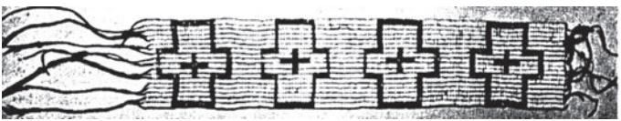

land was not an issue. They were content with the food and shelter they got from the land without feeling any need to 'own' it. An important feature of their tradition was that of making

*Wampum belts, made of coloured shells sewn together, were exchanged by native tribes after a treaty was agreed to.*

formal alliances and friendships, and exchanging gifts. Goods were obtained not by buying them, but as gifts.

Numerous languages were spoken in North America, though these were not written down. They believed that time moved in cycles, and each tribe had accounts about their origins and their earlier history which were passed on from one generation to the next. They were skilled craftspeople and wove beautiful textiles. They could read the land – they could understand the climates and different landscapes in the way literate people read written texts.

# **Encounters with Europeans**

Different terms are used in English for the native peoples of the 'New World'

*aborigine –* native people of Australia (in Latin, ab = from, origine = the beginning)

*Aboriginal –* adjective, often misused as a noun

*American Indian/Amerind/Amerindian* – native peoples of North and South America and the Caribbean

*First Nations peoples –* the organised native groups recognised by the Canadian government (the Indians Act of 1876 used the term 'bands' but from the 1980s the word 'nations' is used)

*indigenous people –* people belonging naturally to a place

*native American* – the indigenous people of the Americas (this is the term now commonly used)

'*Red Indian'* – the brown-complexioned people whose land Columbus mistook for India

*A woman of the Winnebago tribe of Wisconsin. In the 1860s, people of this tribe were moved to Nebraska*

Names of native tribes are often given to things unconnected with them: Dakota (an aeroplane), Cherokee (a jeep), Pontiac (a car), Mohawk (a haircut)! 'It was indicated on the stone tablets that the Hopis* had that the first brothers and sisters that would come back to them would come as turtles across the land. They would be human beings, but they would come as turtles. So when the time came close the Hopis were at a special village to welcome the turtles that would come across the land and they got up in the morning and looked out at the sunrise. They looked out across the desert and they saw the Spanish Conquistadores coming, covered in armour, like turtles across the land. So this was them. So they went out to the Spanish man and they extended their hand hoping for the handshake but into the hand the Spanish man dropped a trinket. And so word spread throughout North America that there was going to be a hard time, that maybe some of the brothers and sisters had forgotten the sacredness of all things and all the human beings were going to suffer for this on the earth.'

– From a talk by Lee Brown, 1986

In the seventeenth century, the European traders who reached the north coast of North America after a difficult two-month voyage were relieved to find the native peoples friendly and welcoming. Unlike the Spanish in South America, who were overcome by the abundance of gold in the country, these adventurers came to trade in fish and furs, in which they got the willing help of the natives who were expert at hunting.

Further south, along the Mississippi river, the French found that the natives held regular gatherings to exchange handicrafts unique to a tribe or food items not available in other regions. In exchange for local products the Europeans gave the natives blankets, iron vessels (which they used sometimes in place of their clay pots), guns, which was a useful supplement for bows and arrows to kill animals, and alcohol. This last item was something the natives had not known earlier, and they became addicted to it, which suited the Europeans, because it enabled them to dictate terms of trade. (The Europeans acquired from the natives an addiction to tobacco.)

| Quebec | American colonies |
| --- | --- |
| 1497 John Cabot reaches | 1507 Amerigo de Vespucci's Travels |
| Newfoundland | published |
| 1534 Jacques Cartier travels down the St Lawrence river |  |
| and meets native peoples |  |
| 1608 French found the colony | 1607 British found the colony of |
| of Quebec | Virginia |
|  | 1620 British found Plymouth |
|  | (in Massachusetts) |

*The Hopis are a native tribe who now live near California.

# **Mutual Perceptions**

In the eighteenth century, western Europeans defined 'civilised' people in terms of literacy, an organised religion and urbanism. To them, the natives of America appeared 'uncivilised'. To some, like the French philosopher Jean-Jacques Rousseau, such people were to be admired, as they were untouched by the corruptions of 'civilisation'. A popular term was 'the noble savage'. Some lines in a poem by the English poet William Wordsworth indicate another perspective. Neither he nor Rousseau had met a native American, but Wordsworth described them as living 'amid wilds/Where fancy hath small liberty to grace/The affections, to exalt them or refine', meaning that people living close to nature had only limited powers of imagination and emotion!

Thomas Jefferson, third President of the USA, and a contemporary of Wordsworth, spoke of the natives in words that would lead to a public outcry today:

'This unfortunate race which we have been taking so much pains to civilise… have justified extermination.'

*Many folk tales of the natives mocked Europeans and described them as greedy and deceitful, but because these were told as imaginary stories, it was only much later that the Europeans understood the references.

It is interesting to note that another writer, Washington Irving, much younger than Wordsworth and who had actually met native people, described them quite differently.

'The Indians I have had an opportunity of seeing in real life are quite different from those described in poetry… Taciturn they are, it is true, when in company with white men, whose goodwill they distrust and whose language they do not understand; but the white man is equally taciturn under like circumstances. When the Indians are among themselves, they are great mimics, and entertain themselves excessively at the expense of the whites… who have supposed them impressed with profound respect for their grandeur and dignity… The white men (as I have witnessed) are prone to treat the poor Indians as little better than animals.'

To the natives, the goods they exchanged with the Europeans were *gifts*, given in friendship. For the Europeans, dreaming of becoming rich, the fish and furs were *commodities,* which they would sell for a profit in Europe. The prices of the goods they sold varied from year to year, depending on the supply. The natives could not understand this – they had no sense of the 'market' in faraway Europe. They were puzzled by the fact that the European traders sometimes gave them a lot of things in exchange for their goods, sometimes very little. They were also saddened by the greed of the Europeans*. In their impatience to get furs, they had slaughtered hundreds of beavers, and the natives were very uneasy, fearing that the animals would take revenge on them for this destruction.

Following the first Europeans, who were traders, were those who came to 'settle' in America. From the seventeenth century, there were groups of Europeans who were being persecuted because they were of a different sect of Christianity (Protestants living in predominantly Catholic countries, or Catholics in countries where Protestantism was the official religion). Many of them left Europe and went to America to begin a new life. As long as there was vacant land, this was not a problem, but gradually the Europeans moved further inland, near native villages. They used their iron tools to cut down forests to lay out farms.

Natives and Europeans saw different things when they looked at forests – natives identified tracks invisible to the Europeans. Europeans imagined the forests cut down and replaced by cornfields. Jefferson's 'dream' was a country populated by Europeans with small farms. The natives, who grew crops for their own needs, not for sale and profit, and thought it wrong to 'own' the land, could not understand this. In Jefferson's view, this made them 'uncivilised'.

| Canada |  | USA |
| --- | --- | --- |
| 1701 | French treaty with |  |
|  | natives of Quebec |  |
| 1763 | Quebec conquered | 1781 Britain recognises USA as |
| by the British |  | an independent country |
| 1774 | Quebec Act | 1783 British give Mid-West to |
| 1791 | Canada Constitutional Act | the USA |

## ACTIVITY 1

Discuss the different images that Europeans and native Americans had of each other, and the different ways in which they saw nature.

MAP 1: The expansion of the USA

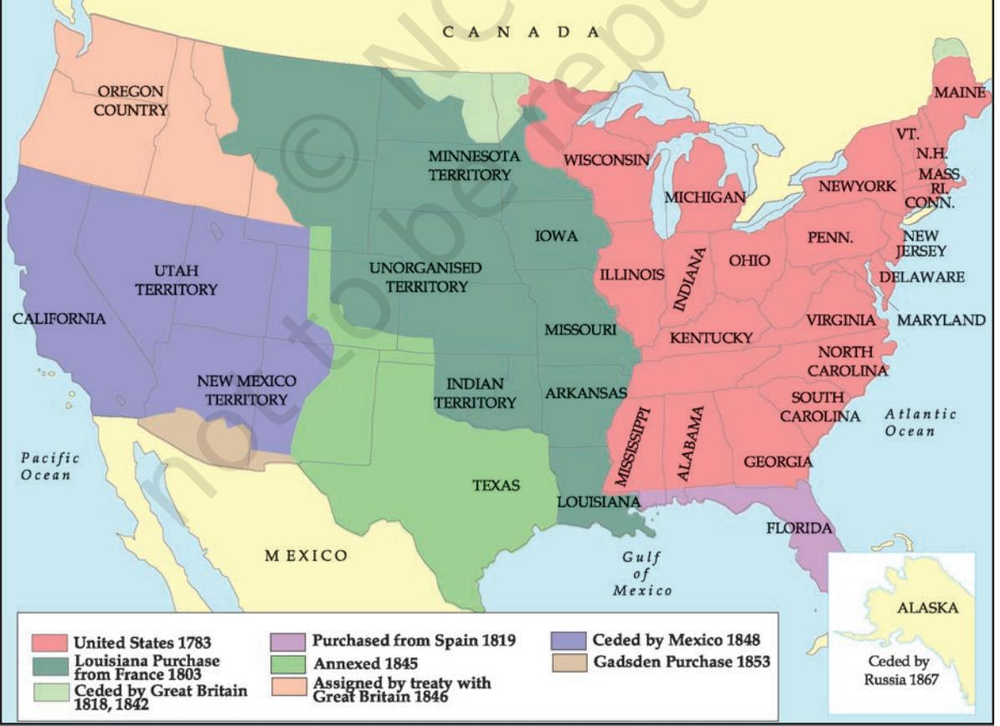

The countries that are known as Canada and the United States of America came into existence at the end of the eighteenth century. At that time they occupied only a fraction of the land they now cover. Over the next hundred years they extended their control over more territory, to reach their present size. Large areas were acquired by the USA by purchase – they bought land in the south from France (the 'Louisiana Purchase') and from Russia (Alaska), and by war – much of southern USA was won from Mexico. It did not occur to anyone that the consent of natives living in these areas should have been asked. The western 'frontier' of the USA was a shifting one, and as it moved, the natives also were forced to move back.

| Canada | USA |
| --- | --- |
|  | 1803 Louisiana purchased from France |
|  | 1825-58 Natives in USA moved to reserves |
| 1837 French Canadian rebellion | 1832 Justice Marshall's judgement |
| 1840 Canadian Union of Upper and Lower Canada | 1849 American Gold Rush |
| 1859 Canada Gold Rush | 1861-65 American Civil War |
| 1867 Confederation of Canada | 1865-90 American Indian Wars |
| 1869-85 Red River Rebellion by the Metis in Canada | 1870 Transcontinental railway |
| 1876 Canada Indians Act | 1890 Bison almost exterminated in |
| America |  |
| 1885 Transcontinental railway | 1892 'End' of American |
| links east and west coasts | frontier |

The landscapes of America changed drastically in the nineteenth century. The Europeans treated the land differently from the natives. Some of the migrants from Britain and France were younger sons who would not inherit their fathers' property and therefore were eager to own land in America. Later, there were waves of immigrants from countries like Germany, Sweden and Italy who had lost their lands to big farmers, and wanted farms they could own. People from Poland were happy to work in the prairie grasslands, which reminded them of the steppes of their homes, and were excited at being able to buy huge properties at very low prices. They cleared land and developed agriculture, introducing crops (rice and cotton) which could not grow in Europe and therefore could be sold there for profit. To protect their huge farms from wild animals – wolves and mountain lions – these were hunted to extinction. They felt totally secure only with the invention of barbed wire in 1873.

The climate of the southern region was too hot for Europeans to work outdoors, and the experience of South American colonies had

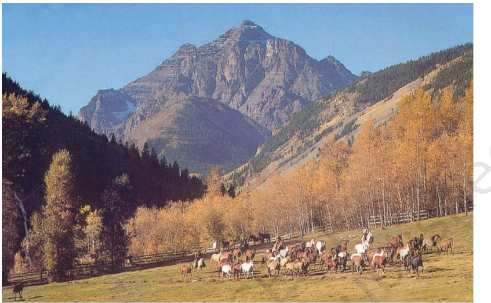

shown that the natives who had been enslaved had died in large numbers. Plantation owners therefore bought slaves in Africa. Protests by anti-slavery groups led to a ban on slave trade, but the Africans who were in the USA remained slaves, as did their children.

The northern states of the USA, where the economy did not depend on plantations (and therefore on slavery), argued for ending slavery which they condemned as an inhuman practice. In 1861-65, there was a war between the states that wanted to retain slavery and those supporting abolition. The latter won. Slavery was abolished, though it was only in the twentieth century that the African Americans were able to win the battle for civil liberties, and segregation between 'whites' and 'nonwhites' in schools and public transport was ended.

The Canadian government had a problem which was not to be solved for a long time, and which seemed more urgent than the question of the natives – in 1763 Canada had been won by the British after a war with France. The French settlers repeatedly demanded autonomous political status. It was only in 1867 that this problem was solved by organising canada as a Confederation of autonomous states.

# **The Native Peoples Lose their Land**

In the USA, as settlement expanded, the natives were induced or forced to move, after signing treaties selling their land. The prices paid were very low, and there were instances when the Americans (a term used *A ranch in Colorado.*

to mean the *European* people of the USA) cheated them by taking more land or paying less than promised.

Even high officials saw nothing wrong in depriving the native peoples of their land. This is seen by an episode in Georgia, a state in the USA. Officials had argued that the Cherokee tribe was governed by state laws, but could not enjoy the rights of citizens. (This was despite the fact that, of all the native peoples, the Cherokees were the ones who had made the most effort to learn English and to understand the American way of life; even so they were not allowed the rights of citizens.)

In 1832, an important judgment was announced by the US Chief Justice, John Marshall. He said that the Cherokees were 'a distinct community, occupying its own territory in which the laws of Georgia had no force', and that they had sovereignty in certain matters. US President Andrew Jackson had a reputation for fighting against economic and political privilege, but when it came to the Indians, he was a different person. He refused to honour the Chief Justice's judgment, and ordered the US army to evict the Cherokees from their land and drive them to the Great American Desert. Of the 15,000 people thus forced to go, over a quarter died along the 'Trail of Tears'.

Those who took the land occupied by the tribes justified it by saying the natives did not deserve to occupy land which they did not use to the maximum. They went on to criticise them for being lazy, since they did not use their crafts skills to produce goods for the market, for not being interested in learning English or dressing 'correctly' (which meant like the Europeans). They deserved to 'die out', they argued. The prairies were cleared for farmland, and wild bison killed off. 'Primitive man will disappear with the primitive animal' wrote a visiting Frenchman.

|  | ACTIVITY 2 |  |
| --- | --- | --- |
|  | Comment on these two sets of population data. |  |
|  | USA: 1820 | Spanish America: 1800 |
| Natives | 0.6 million | 7.5 million |
| Whites | 9.0 million | 3.3 million |
| Mixed Europeans | 0.1 million | 5.3 million |
| Blacks | 1.9 million | 0.8 million |
| Total | 11.6 million | 16.9 million |

Meanwhile, the natives were pushed westward, given land elsewhere ('theirs in perpetuity') but often moved again if any mineral – lead or gold – or oil was found on their lands. Many tribes were forced to share the land originally occupied by one tribe, thus leading to quarrels between them. They were locked off in small areas called 'reservations', which often was land with which they had no earlier connection. They did not give in without a fight. The US army crushed a series of rebellions from 1865 to 1890, and in Canada there were armed revolts by the Metis (people of native European descent) between 1869 and 1885. But after that they gave up.

In 1854, the President of the USA received a letter from a native leader, Chief Seattle. The president had asked the chief to sign a treaty giving a large part of the land they lived on to the American government. The Chief replied:

'How can you buy or sell the sky, the warmth of the land? The idea is strange to us. If you do not own the freshness of the air and the sparkle of the water, how can one buy them? Every part of the earth is sacred to my people. Every shining pine-needle, every sandy shore, every mist in the dark woods, every clearing and every humming insect is holy in the memory and experience of my people. The sap which courses through the trees carries the memories of the red man…

So, when the Great Chief in Washington sends word that he wishes to buy our land, he asks much of us. The Great Chief sends word that he will reserve us a place so that we can live comfortably. He will be our father and we will be his children. So we will consider your offer to buy our land. But it will not be easy. For this land is sacred to us. The shining water that moves in the streams and rivers is not just water but the blood of our ancestors. If we sell you land, you must remember that it is sacred and you must teach your children that it is sacred and that each ghostly reflection in the clear water of the lakes tells of events and memories in the life of my people. The water's murmur is the voice of my father's father…'

# **The Gold Rush, and the Growth of Industries**

There was always the hope that there was gold in North America. In the 1840s, traces of gold were found in the USA, in California. This led to the 'Gold Rush', when thousands of eager Europeans hurried to America in the hope of making a quick fortune. This led to the building of railway lines across the continent, for which thousands of Chinese workers were recruited. The USA's railway was completed by 1870, that of

Anthropology It is significant that it was at this time (from the 1840s) that the subject of 'anthropology' (which had been developed in France) was introduced in North America, out of a curiosity to study the differences between native 'primitive' communities and the 'civilised' communities of Europe. Some anthropologists argued that just as there were no 'primitive' people to be found in Europe, the American natives too would 'die out'.

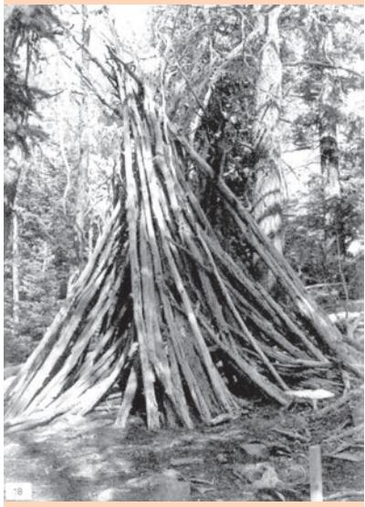

*A native lodge, 1862. Archaeologists moved this from the mountains and placed it in a museum in Wyoming.*

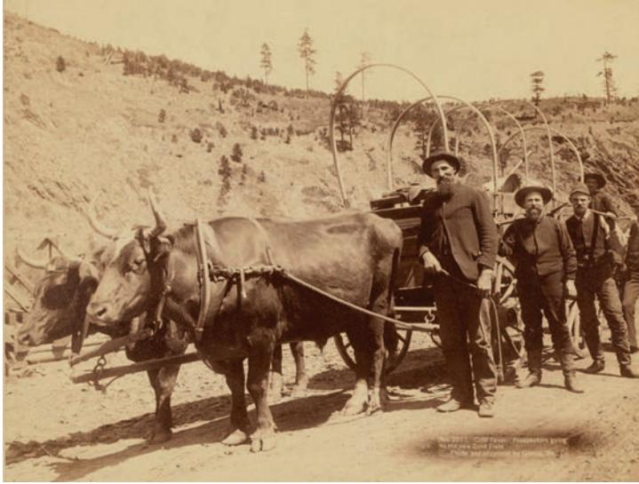

*Moving to California as part of the 'Gold Rush', photograph.*

Canada by 1885. 'The old nations creep on at a snail's pace' said Andrew Carnegie, a poor immigrant from Scotland who became one of the first millionaire industrialists in the USA, 'the Republic thunders on at the speed of an express'.

One reason why the Industrial Revolution happened in England when it did was because small peasants were losing their land to big farmers, and moving to jobs in factories (see Theme 9). In North America, industries developed for very different reasons – to manufacture railway equipment so

that rapid transport could link distant places, and to produce machinery which would make large-scale farming easier. Industrial towns grew and factories multiplied, both in the USA and Canada. In 1860, the USA had been an undeveloped economy. In 1890, it was the leading industrial power in the world.

Large-scale agriculture also expanded. Vast areas were cleared and divided up into farms. By 1890, the bison had almost been exterminated, thus ending the life of hunting the natives had followed for centuries. In 1892, the USA's continental expansion was complete. The area between the Pacific and Atlantic Oceans was divided up into states. There no longer remained the 'frontier' that had pulled European settlers west for many decades. Within a few years the USA was setting up its own colonies – in Hawaii and the Philippines. It had become an imperial power.

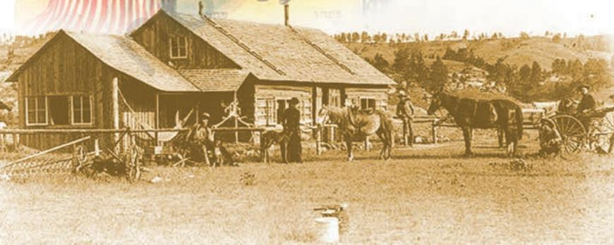

*Above: Immigrants welcomed by the USA, colour print, 1909.*

*Below: The ranch on the prairie that was the dream of poor European immigrants, photograph.*

# **Constitutional Rights**

The 'democratic spirit' which had been the rallying cry of the settlers in their fight for independence in the 1770s, came to define the identity of the USA against the monarchies and aristocracies of the Old World. Also important to them was that their constitution included the individual's 'right to property', which the state could not override.

But both democratic rights (the right to vote for representatives to Congress and for the President) and the right to property *were only for white men.* Daniel Paul, a Canadian native, pointed out in 2000 that Thomas Paine, the champion of democracy at the time of the War for American Independence and the French Revolution, 'used the Indians as models of how society might be organized'. He used this to argue that 'the Native Americans by their example sowed the seeds for the long-drawn-out movement towards democracy by the people of Europe' (*We Were Not the Savages*, p. 333)

# **The Winds of Change…**

Not till the 1920s did things begin to improve for the native peoples of the USA and Canada. *The Problem of Indian Administration*, a survey directed by social scientist Lewis Meriam and published in 1928, only a few years before the USA was swept by a major economic depression that affected all its people, painted a grim picture of the terribly poor health and education facilities for natives in reservations.

White Americans felt sympathy for the natives who were being discouraged from the full exercise of their cultures and simultaneously denied the benefits of citizenship. This led to a landmark law in the USA, the Indian Reorganisation Act of 1934, which gave natives in reservations the right to buy land and take loans.

In the 1950s and 1960s, the US and Canadian governments thought of ending all special provisions for the natives in the hope that they would 'join the mainstream', that is, adopt European culture. But the natives did not want this. In 1954, in the 'Declaration of Indian Rights' prepared by them, a number of native peoples accepted citizenship of the USA but on condition that their reservations would not be taken away and their traditions would not be interfered with. A similar development occurred in Canada. In 1969 the government announced that they would 'not recognise aboriginal rights'. The natives, in a well-organised opposition move, held a series of demonstrations and debates. The question could not be resolved till 1982, when the Constitution Act accepted the existing aboriginal and treaty rights of the natives. Many details remain to be worked out. Today, it is clear that the native peoples of both countries, though reduced so much in numbers from what they had been in the eighteenth century, have been able to assert their right to their own cultures and, particularly in Canada, to their sacred lands, in a way their ancestors could not have done in the 1880s.

Karl Marx (1818-83), the great German philosopher, described the American frontier as 'the last positive capitalist utopia…the limitless nature and space to which the limitless thirst for profit adapts itself'.

– 'Bastiat and Carey', *Grundrisse*

#### ACTIVITY 3

Comment on the following statement by the American historian Howard Spodek: 'For the indigenous [people] the effects of the American Revolution were exactly opposite to those of the settlers – expansion became contraction, democracy became tyranny, prosperity became poverty, and liberty became confinement.'

| Indians under British rule | Taxed arbitrarily; seen as not equal |
| --- | --- |
|  | (rationalisation – not ready for |
|  | responsibility of representative |
|  | government) |
| Natives in America and | Not seen as citizens; not equal Australia |
|  | (rationalisation 'primitive' as in no |
|  | settled agriculture, provision for the |
|  | future, towns) |
| African slaves in America | Denied personal liberty; not equal |
|  | (rationalisation – 'Slavery is part of |
|  | their own social system', black |
|  | people are inferior) |

# **AUSTRALIA**

As in the Americas, human habitation in Australia has a long history. The 'aborigines' (a general name given to a number of different societies) began to arrive on the continent over 40,000 years ago (possibly even earlier). They came from New Guinea, which was connected to Australia by a land-bridge. In the natives' traditions, they did not *come* to Australia, but had always been there. The past centuries were called the 'Dreamtime' – something difficult for Europeans to understand, since the distinction between past and present is blurred.

In the late eighteenth century, there were between 350 and 750 native communities in Australia each with its own language (even today 200 of these languages are spoken). There is another large group of indigenous people living in the north, called the Torres Strait Islanders. The term 'Aborigine' is not used for these as they are believed to have migrated from elsewhere and belong to a different race. Together, they make up 2.4 per cent of Australia's population in 2005.

Australia is sparsely populated, and even now most of the towns are along the coast (where the British first arrived in 1770) because the central region is arid desert.

# **The Europeans Reach Australia**

1606 Dutch travellers sight Australia

1642 Tasman lands on the island later named Tasmania

1770 James Cook reaches Botany Bay, named New South Wales

1788 British penal colony formed. Sydney founded

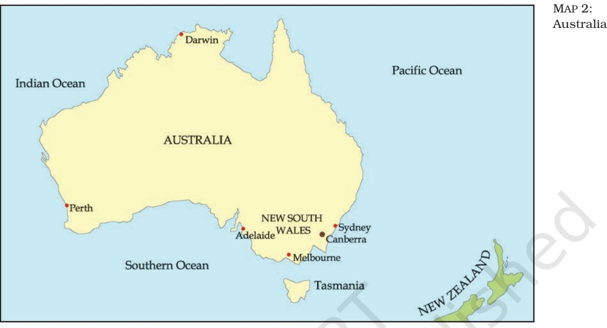

The story of the interaction between the European settlers, the native peoples and the land in Australia has many points of similarity to the story of the Americas, though it began nearly 300 years later. Initial reports from Captain Cook and his crew about encounters with natives are enthusiastic about their friendliness. There was a sharp reversal of feeling on the part of the British when Cook was killed by a native – not in Australia, but in Hawaii. As often happened, a single incident of this nature was used by colonisers to justify subsequent acts of violence towards other people.

## **A Description of the Sydney Area in 1790**

'Aboriginal production had been dramatically disturbed by the British presence. The arrival of a thousand hungry mouths, followed by hundreds more, put unprecedented pressure on local food resources.

So what would the Daruk people have thought of all this? To them such large-scale destruction of sacred places and strange, violent behaviour towards their land was inexplicable. The newcomers seemed to knock down trees without any reason, for they were not making canoes, gathering bush honey or catching animals. Stones were moved and stacked together, clay dug up, shaped and cooked, holes were made in the ground, large unwieldy structures built. At first they may have equated the clearing with the creation of a sacred ceremonial ground…Perhaps they thought a huge ritual gathering was to be held, dangerous business from which they should steer well clear. There is no doubt the Daruks subsequently avoided the settlement, for the only way to bring them back was by an official kidnapping.'

– (P. Grimshaw, M. Lake, A. McGrath, M. Quartly, *Creating a Nation*)

They did not foresee that in the nineteenth and twentieth centuries nearly 90 per cent of them would die by exposure to germs, by the loss of their lands and resources, and in battles against the settlers. The experiment of settling Brazil with Portuguese convicts had been abandoned when their violent behaviour provoked angry reprisals from the natives. The British had adopted the same practice in the American colonies until they became independent. Then they continued it in Australia. Most of the early settlers were convicts who had been deported from England and, when their jail term ended, were allowed to live as free people in Australia on condition that they did not return to Britain. With no recourse but to make a life for themselves in this land so different from their own, they felt no hesitation about ejecting natives from land they took over for cultivation.

## **The Development of Australia**

1850 Self-government granted to Australian colonies

1851 Chinese coolie immigration. Stopped by law in 1855

1851-1961 Gold rushes

1901 Formation of Federation of Australia, with six states

1911 Canberra established as capital

1948-75 Two million Europeans migrate to Australia

### The economic development of Australia under European settlement was not as varied as in America. Vast sheep farms and mining stations were established over a long period and with much labour, followed by vineyards and wheat farming. These came to form the basis of the country's prosperity. When the states were united, and it was decided that a new capital would be built for Australia in 1911, one name suggested for it was Woolwheatgold! Ultimately, it was called Canberra (= kamberra, a native word meaning 'meeting place').

Some natives were employed in farms, under conditions of work so harsh that it was little different from slavery. Later, Chinese immigrants provided cheap labour, as in California, but unease about being dependent on non-whites led to the governments in both countries to ban Chinese immigrants. Till 1974, such was the popular fear that 'dark' people from South Asia or Southeast Asia might migrate to Australia in large numbers that there was a government policy to keep 'non-white' people out.

### ACTIVITY 4

In 1911, it was announced that New Delhi and Canberra would be built as the capital cities of British India and of the Commonwealth of Australia. Compare and contrast the political situations of the native people in these countries at that time.

# **The Winds of Change…**

In 1968, people were electrified by a lecture by the anthropologist W.E.H. Stanner, entitled 'The Great Australian Silence' – the silence of historians about the aborigines. From the 1970s, as was happening in North America, there was an eagerness to understand natives not as anthropological curiosities but as communities with distinct cultures, unique ways of understanding nature and climate, with a sense of community which had vast bodies of stories, textile and painting and carving skills, which should be understood and recorded and respected. Underlying it all was the urgent question which Henry Reynolds later articulated in a powerful book, *Why Weren't We Told?* This condemned the practice of writing Australian history as though it had begun with Captain Cook's 'discovery'.

Since then, university departments have been instituted to study native cultures, galleries of native art have been added to art galleries, museums have been enlarged to incorporate dioramas and imaginatively designed rooms explaining native culture, and natives have begun writing their own life histories. This has been a wonderful effort. It has also occurred at a critical time, because if native cultures had remained ignored, by this time much of such cultures would have been forgotten. From 1974, 'multiculturalism' has been official policy in Australia, which gave equal respect to native cultures and to the different cultures of the immigrants from Europe and Asia.

> 'Kathy my sister with the torn heart, I don't know how to thank you For your dreamtime stories of joy and grief Written on paperbark. You were one of the dark children I wasn't allowed to play with– Riverbank campers, the wrong colour (I couldn't turn you white.) So it was late I met you, Late I began to know They hadn't told me the land I loved Was taken out of your hands.'

JUDITH WRIGHT (1915-2000), an Australian writer, was a champion of the rights of the Australian aborigines. She wrote many moving poems about the loss created by keeping the white people and the natives apart.

– 'Two Dreamtimes', written for Oodgeroo Noonuccal

From the 1970s, as the term 'human rights' began to be heard at meetings of the UNO and other international agencies, the Australian public realised with dismay that, in contrast to the USA, Canada and New Zealand, Australia had no treaties with the natives formalising the takeover of land by Europeans. The government had always termed the land of Australia *terra nullius*, that is belonging to nobody.

There was also a long and agonising history of children of mixed blood (native European) being forcibly captured and separated from their native relatives.

Agitation around these questions led to enquiries and to two important decisions: one, to recognise that the natives had strong historic bonds with the land which was 'sacred' to them, and which should be respected; two, that while past acts could not be undone, there should be a public apology for the injustice done to children in an attempt to keep 'white' and 'coloured' people apart.

- 1974 'White Australia' policy ends, Asian immigrants allowed entry
- 1992 Australian High Court (in the Mabo case) declares that *terra nullius* was legally invalid, and recognises native claims to land from before 1770
- 1995 National Enquiry into the Separation of Aboriginal and Torres Strait Islander Children from their Families
- 1999 (26 May) 'A National Sorry Day' as apology for the children 'lost' from the 1820s to the 1970s

# **Exercises**

# **ANSWER IN BRIEF**

- 1. Comment on any points of difference between the native peoples of South and North America.
- 2. Other than the use of English, what other features of English economic and social life do you notice in nineteenth-century USA?
- 3. What did the 'frontier' mean to the Americans?
- 4. Why was the history of the Australian native peoples left out of history books?

# **ANSWER IN A SHORT ESSAY**

- 5. How satisfactory is a museum gallery display in explaining the culture of a people? Give examples from your own experience of a museum.
- 6. Imagine an encounter in California in about 1880 between four people: a former African slave, a Chinese labourer, a German who had come out in the Gold Rush, and a native of the Hopi tribe, and narrate their conversation.

