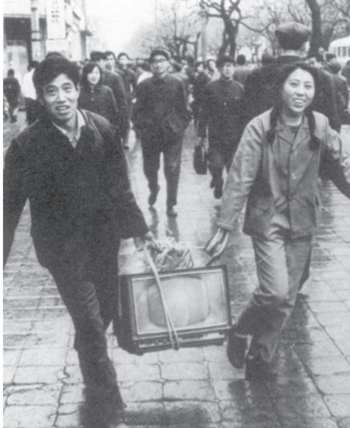

## Paths to Modernisation

*EAST ASIA at the beginning of the nineteenth century was dominated by China. The Qing dynasty, heir to a long tradition, seemed secure in its power, while Japan, a small island country, seemed to be locked in isolation. Yet, within a few decades China was thrown into turmoil unable to face the colonial challenge. The imperial government lost political control, was unable to reform effectively and the country was convulsed by civil war. Japan on the other hand was successful in building a modern nation-state, creating an industrial economy and even establishing a colonial empire by incorporating Taiwan (1895) and Korea (1910). It defeated China, the land that had been the source of its culture and ideals, in 1894, and Russia, a European power, in 1905.*

*The Chinese reacted slowly and faced immense difficulties as they sought to redefine their traditions to cope with the modern world, and to rebuild their national strength and become free from Western and Japanese control. They found that they could achieve both objectives – of removing inequalities and of rebuilding their country – through revolution. The Chinese Communist Party emerged victorious from the civil war in 1949. However, by the end of the 1970s Chinese leaders felt that the ideological system was retarding economic growth and development. This led to wide-ranging reforms of the economy that brought back capitalism and the free market even as the Communist Party retained political control.*

*Japan became an advanced industrial nation but its drive for empire led to war and defeat at the hands of the Anglo-American forces. The US Occupation marked the beginning of a more democratic political system and Japan rebuilt its economy to emerge by the 1970s as a major economic power.*

*The Japanese path to modernisation was built on capitalist principles and took place within a world dominated by Western colonialism. Japanese expansion was justified by the call to resist Western domination and liberate Asia. The rapid development underlined the strength of tradition in Japanese institutions and society, their ability to learn and the strength of nationalism.*

China and Japan have had a long tradition of historical writings, as history was an important guide for the rulers. The past provided the standards by which they would be judged and

THEME

7

153

the rulers established official departments to maintain records and write dynastic histories. Sima Qian (145-90 BCE) is considered the greatest historian of early China. In Japan, Chinese cultural influence led to history being given a similar importance. One of the earliest acts of the Meiji government was to establish, in 1869, a bureau to collect records and write, as it were, a victor's version of the Meiji Restoration. There was great respect for the written word and literary ability was highly valued. This has meant that a wide range of written materials – official histories, scholarly writings, popular literature, religious tracts – are available. Printing and publishing were important industries in the pre-modern period and it is possible, for instance, to trace the distribution of a book in eighteenth-century China or Japan. Modern scholars have used these materials in new and different ways.

Modern scholarship has built on the work of Chinese intellectuals such as Liang Qichao or Kume Kunitake (1839- 1931), one of the pioneers of modern history in Japan, as well as earlier writings by European travellers, such as the Italian Marco Polo (1254-1324, in China from 1274 to 1290), the Jesuit priests Mateo Ricci (1552-1610) in China and Luis Frois (1532- 97), in Japan, all of whom left rich accounts of these countries. It has also benefited from the writings of Christian missionaries in the nineteenth century whose work provides valuable material for our understanding of these countries.

Scholarship in English from Joseph Needham's monumental work on the history of science in Chinese civilisation or George Sansom's on Japanese history and culture has grown and there is an immense body of sophisticated scholarship available to us today. In recent years, writings by Chinese and Japanese scholars have been translated into English, some of whom teach abroad and write in English, and in the case of Chinese scholars, since the 1980s, many have been working in Japan as well and write in Japanese. This has meant that we have scholarly writings from many parts of the globe that give us a richer and deeper picture of these countries.

#### Naito Konan* (1866-1934)

A leading Japanese scholar of China, Naito Konan's writings influenced scholars worldwide. Using the new tools of Western historiography Naito built on a long tradition of studying China as well as bringing his experience as a journalist there. He helped establish the Department of Oriental Studies in Kyoto University in 1907. In *Shinaron* [On China (1914)], he argued that republican government offered the Chinese a way to end aristocratic control and centralised power that had existed since the Sung dynasty (960-1279) – a way to revitalise local society where reform must begin. He saw in Chinese history strengths that would make it modern and democratic. Japan, he thought had an important role to play in China but he underestimated the power of Chinese nationalism.

*In Japan, the surname is written first.

## **Introduction**

China and Japan present a marked physical contrast. China is a vast continental country that spans many climatic zones; the core is dominated by three major river systems: the Yellow River (Huang He), the Yangtse River (Chang Jiang – the third longest river in the world) and the Pearl River. A large part of the country is mountainous.

MAP 1: East Asia

The dominant ethnic group are the Han and the major language is Chinese (Putonghua) but there are many other nationalities, such as the Uighur, Hui, Manchu and Tibetan, and aside from dialects, such as Cantonese (Yue) and Shanghainese (Wu), there are other minority languages spoken as well.

Chinese food reflects this regional diversity with at least four distinct types. The best known is southern or Cantonese cuisine – as most overseas Chinese come from the Canton area – which includes dim sum (literally touch your heart), an assortment of pastries and dumplings. In the north, wheat is the staple food, while in Szechuan spices brought by Buddhist monks in the ancient period, along the silk route, and chillies by Portuguese traders in the fifteenth century, have created a fiery cuisine. In eastern China, both rice and wheat are eaten.

Japan, by contrast, is a string of islands, the four largest being Honshu, Kyushu, Shikoku and Hokkaido. The Okinawan chain is the southernmost, about the same latitude as the Bahamas. More than 50 per cent of the land area of the main islands is mountainous and Japan is situated in a very active earthquake zone. These geographical conditions have influenced architecture. The population is largely Japanese but there are a small Ainu minority and Koreans who were forcibly brought as labour when Korea was a Japanese colony.

Japan lacks a tradition of animal rearing. Rice is the staple crop and fish the major source of protein. Raw fish (sashimi or sushi) has now become a widely popular dish around the world as it is considered very healthy.

#### **JAPAN**

## **The Political System**

An emperor had ruled Japan from Kyoto but by the twelfth century the imperial court lost power to shoguns, who in theory ruled in the name of the emperor. From 1603 to 1867, members of the Tokugawa family held the position of shogun. The country was divided into over 250 domains under the rule of lords called *daimyo*. The shogun exercised power over the domainal lords, ordering them to stay at the capital Edo (modern Tokyo) for long periods so that they would not pose a threat. He also controlled the major cities and mines. The samurai (the warrior class) were the ruling elite and served the shoguns and *daimyo*.

In the late sixteenth century, three changes laid the pattern for future development. One, the peasantry was disarmed and only the samurai could carry swords. This ensured peace and order, ending the frequent wars of the previous century. Two, the *daimyo* were ordered to live in the capitals of their domains, each with a large degree of autonomy. Third, land surveys identified owners and taxpayers and graded land productivity to ensure a stable revenue base.

The *daimyo*'s capitals became bigger, so that by the mid-seventeenth century, Japan not only had the most populated city in the world – Edo – but also two other large cities – Osaka and Kyoto, and at least half a dozen castle-towns with populations of over 50,000. (By contrast, most European countries of the time had only one large city.) This led to the growth of a commercial economy, and created financial and credit systems. A person's merit began to be more valued than his status. A vibrant culture blossomed in the towns, where the fastgrowing class of merchants patronised theatre and the arts. As people enjoyed reading, it became possible for gifted writers to earn a living solely by writing. In Edo, people could 'rent' a book for the price of a bowl of noodles. This shows how popular reading had become and gives a glimpse into the scale of printing*.

* Printing was done with wood blocks. The Japanese did not like the regularity of European printing.

Japan was considered rich, because it imported luxury goods like silk from China and textiles from India. Paying for these imports with gold and silver strained the economy and led the Tokugawa to put restrictions on the export of precious metals. They also took steps to develop the silk industry in Nishijin in Kyoto so as to reduce imports. The silk from Nishijin came to be known as the best in the world. Other developments such as the increased use of money and the creation of a stock market in rice show that the economy was developing in new ways.

Social and intellectual changes – such as the study of ancient Japanese literature – led people to question the degree of Chinese influence and to argue that the essence of being Japanese could be found long before the contact with China, in such early classics as the *Tale of the Genji* and in the myths of origin that said that the islands were created by the gods and that the emperor was a descendant of the Sun Goddess.

#### **Tale of the Genji**

A fictionalised diary of the Heian court written by Murasaki Shikibu, the Tale of the Genji became the central work of fiction in Japanese literature. That period saw the emergence of many women writers, like Murasaki, who wrote in the Japanese script, while men wrote in the Chinese script, used for education and government. The novel depicts the romantic life of Prince Genji and is a striking picture of the aristocratic atmosphere of the Heian court. It shows the independence that women had in choosing their husbands and living their lives.

#### **The Meiji Restoration**

Internal discontent coincided with demands for trade and diplomatic relations. In 1853, the USA sent Commodore Matthew Perry (1794- 1858) to Japan to demand that the government sign a treaty that would permit trade and open diplomatic relations, which it did the following year. Japan lay on the route to China which the USA saw as a major market; also, their whaling ships in the Pacific needed a place to refuel. At that time, there was only one Western country that traded with Japan, Holland.

Perry's arrival had an important effect on Japanese politics. The emperor, who till then had had little political power, now re-emerged as an important figure. In 1868, a movement forcibly removed the shogun from power, and brought the Emperor to Edo. This was made the capital and renamed Tokyo, which means 'eastern capital'.

Nishijin is a quarter in Kyoto. In the sixteenth century, it had a weavers' guild of 31 households and by the end of the seventeenth century the community numbered over 70,000 people. Sericulture spread and was encouraged by an order in 1713 that only domestic yarn was to be used. Nishijin specialised only in the most expensive products. Silk production helped the growth of a class of regional entrepreneurs who challenged the Tokugawa order, and when foreign trade started in 1859 Japan's silk exports became a major source of profit for the economy struggling to compete with Western goods.

#### *Perry's ship: a Japanese woodblock print.*

What the Japanese called 'black ships' (tar was used to seal the joints of the wood) are depicted in paintings and cartoons showing the strange foreigners and their habits. This became a powerful symbol of Japan's 'opening'. (Today, scholars would argue that Japan had not been 'closed', took part in the east Asian trade and had access to knowledge of the wider world both through the Dutch and the Chinese.)

*Commodore Perry as seen by the Japanese.*

#### ACTIVITY 1

Contrast the encounter of the Japanese and the Aztecs with the Europeans.

Officials and the people were aware that some European countries were building colonial empires in India and elsewhere. News of China being defeated by the British (see p. 166) was flowing in, and this was even depicted in popular plays, so that there was a real fear that Japan might be made a colony. Many scholars and leaders wanted to *learn* from the new ideas in Europe rather than ignore them as the Chinese were doing; others sought to exclude the Europeans even while being ready to adopt the new technologies they offered. Some argued for a gradual and limited 'opening' to the outer world.

The government launched a policy with the slogan '*fukoku kyohei'* (rich country, strong army). They realised that they needed to develop their economy and build a strong army, otherwise they would face the prospect of being subjugated like India. To do this they needed to create a sense of nationhood among the people, and to transform subjects into citizens.

At the same time, the new government also worked to build what they called the 'emperor system'. (Japanese scholars use this term as the emperor was part of a system, along with the bureaucracy and the military, that exercised power.) Officials were sent to study the European monarchies on which they planned to model their own. The Emperor would be treated with reverence as he was considered a direct descendant of the Sun Goddess but he was also shown as the leader of westernisation. His birthday became a national holiday, he wore Western-style military uniforms, and edicts were issued in his name to set up modern institutions. The Imperial Rescript on Education of 1890 urged people to pursue learning, advance public good and promote common interests.

A new school system began to be built from the 1870s. Schooling was compulsory for boys and girls and by 1910 almost universal. Tuition fees were minimal. The curriculum had been based on Western models but by the 1870s, while emphasising modern ideas, stress was placed on loyalty and the study of Japanese history. The ministry of education exercised control over the curriculum and in the selection of textbooks, as well as in teachers' training. What was called 'moral culture' had to be taught, and texts urged children to revere their parents, be loyal to the nation, and become good citizens.

The Japanese had borrowed their written script from the Chinese in the sixth century. However, since their language is very different from Chinese they developed two phonetic alphabets – *hiragana* and *katakana*. *Hiragana* is considered feminine because it was used by many women writers in the Heian period (such as Murasaki). It is written using a mixture of Chinese characters and phonetics so that the main part of the word is written with a character – for instance, in 'going', 'go' would be written with a character and the 'ing' in phonetics.

The existence of a phonetic syllabary meant that knowledge spread from the elites to the wider society relatively quickly. In the 1880s it was suggested that Japanese develop a completely phonetic script, or adopt a European language. Neither was done.

To integrate the nation, the Meiji government imposed a new administrative structure by altering old village and domain boundaries. The administrative unit had to have revenue adequate to maintain the local schools and health facilities, as well as serve as a recruitment centre for the military. All young men over twenty had to do a period of military service. A modern military force was developed. A legal system was set up to regulate the formation of political groups, control the holding of meetings and impose strict censorship. In all these measures the government had to face opposition. The military and the bureaucracy were put under the direct command of the emperor. This meant that even after a constitution was enacted these two groups remained outside the control of the government. In all these measures the government faced opposition.

The tension between these different ideals represented by a democratic constitution and a modern army was to have far-reaching consequences. The army pressed for a vigorous foreign policy to acquire more territory. This led to wars with China and Russia, in both of which Japan was the victor. Popular demand for greater democracy was often in opposition to the government's aggressive policies. Japan developed economically and acquired a colonial empire that suppressed the spread of democracy at home and put it in collision with the people it colonised.

*Writing Japanese: Kanji (Chinese characters) – red; katakana – blue; hiragana – green.*

## **Modernising the Economy**

Another important part of the Meiji reforms was the modernising of the economy. Funds were raised by levying an agricultural tax. Japan's first railway line, between Tokyo and the port of Yokohama, was built in 1870-72. Textile machinery was imported from Europe, and foreign technicians were employed to train workers, as well as to teach in universities and schools, and Japanese students were sent abroad. In 1872, modern banking institutions were launched. Companies like Mitsubishi and Sumitomo were helped through subsidies and tax benefits to become major shipbuilders so that Japanese trade was from now on carried in Japanese ships. *Zaibatsu* (large business organisations controlled by individual families) dominated the economy till after the Second World War.

The population, 35 million in 1872, increased to 55 million in 1920. To reduce population pressure the government actively encouraged migration, first to the northern island of Hokkaido, which had been a largely autonomous area where the indigenous people called the Ainu lived, and then to Hawaii and Brazil, as well as to the growing colonial empire of Japan. Within Japan there was a shift to towns as industry developed. By 1925, 21 per cent of the population lived in cities; by 1935, this figure had gone up to 32 per cent (22.5 million).

## **Industrial Workers**

The number of people in manufacturing increased from 700,000 in 1870 to 4 million in 1913. Most of them worked in units employing less than five people and using neither machinery nor electric power.

*Workers in a textile factory.*

Over half of those employed in modern factories were women. And it was women who organised the first modern strike in 1886. After 1900, the number of men began to increase but only in the 1930s did male workers begin to outnumber women.

The size of factories also began to increase. Factories employing more than a hundred workers, just over 1,000 in 1909, jumped to over 2,000 by 1920 and 4,000 by the 1930s; yet even in 1940, there were over 550,000 workshops that employed less than five employees. This sustained the family-centred ideology, just as nationalism was sustained by a strong patriarchal system under an emperor who was like a family patriarch.

The rapid and unregulated growth of industry and the demand for natural resources such as timber led to environmental destruction. Tanaka Shozo, elected to the first House of Representatives, launched the first agitation against industrial pollution in 1897 with 800 villagers in a mass protest forcing the government to take action.

## **Aggressive Nationalism**

The Meiji constitution was based on a restricted franchise and created a Diet (the Japanese used the German word for parliament because of the influence of German legal ideas) with limited powers. The leaders who brought about the imperial restoration continued to exercise power and even established political parties. Between 1918 and 1931, popularly elected prime ministers formed cabinets. Thereafter, they lost power to national unity cabinets formed across party lines. The emperor was the commander of the forces and from 1890 this was interpreted to mean that the army and the navy had independent control. In 1899, the prime minister ordered that only serving generals and admirals could become ministers. This strengthening of the military, together with the expansion of Japan's colonial empire, was connected with the fear that Japan was at the mercy of the Western powers. This fear was used to silence opposition to military expansion and to higher taxes to fund the armed forces.

Tanaka Shozo (1841-1913), the self-taught son of a farmer, rose to become a major political figure. He participated in the Popular Rights Movement in the 1880s, a movement demanding constitutional government. He was elected member to the first Diet. He believed that ordinary people should not be sacrificed for industrial progress. The Ashio Mine was polluting the Watarase river ruining 100 square miles of farmland and affecting a thousand families. The agitation forced the company to take pollution-control measures so that by 1904 harvests were normal.

*Young people being exhorted to fight for the nation: a magazine cover. Student-soldiers: photographs.*

## **'Westernisation' and 'Tradition'**

Successive generations of Japanese intellectuals had different views on Japan's relations with other countries. To some, the USA and western European countries were at the highest point of civilisation, to which Japan aspired. Fukuzawa Yukichi, a leading Meiji intellectual, expressed this by saying that Japan must 'expel Asia'. He meant that Japan must shed its 'Asian' characteristics and become part of the West.

#### **Fukuzawa Yukichi (1835-1901)**

Born in an impoverished samurai family, he studied in Nagasaki and Osaka learning Dutch and Western sciences and, later, English. In 1860, he went as a translator for the first Japanese embassy to the USA. This provided material for a book on the West, written not in the classical but in the spoken style that became extremely popular. He established a school that is today the Keio University. He was one of the core members of the Meirokusha, a society to promote Western learning.

In *The Encouragement to Learning* (*Gakumon no susume,*1872- 76) he was very critical of Japanese knowledge: 'All that Japan has to be proud of is its scenery'. He advocated not just modern factories and institutions but the cultural essence of the West – the spirit of civilisation. With this spirit it would be possible to build a new citizen. His principle was: 'Heaven did not create men above men, nor set men below men.'

The next generation questioned this total acceptance of Western ideas and urged that national pride be built on indigenous values. The philosopher Miyake Setsurei (1860-1945) argued that each nation must develop its special talents in the interest of world civilisation: 'To devote oneself to one's country is to devote oneself to the world.' By contrast, many intellectuals were attracted to Western liberalism and wanted a Japan based not on the military but on democracy. Ueki Emori (1857-1892), a leader of the Popular Rights Movement, was demanding constitutional government, admired the French Revolution's doctrine of the natural rights of man and of popular sovereignty, and spoke for a liberal education that would develop each individual: 'Freedom is more precious than order.' Others even advocated voting rights for women. This pressure led the government to announce a constitution.

## **Daily Life**

Japan's transformation into a modern society can be seen also in the changes in everyday life. The patriarchal household system comprised many generations living together under the control of the head of the house, but as more people became affluent, new ideas of the family spread. The new home (*homu* as the Japanese say, using the English word) was that of the nuclear family, where husband and wife lived as

breadwinner and homemaker. This new concept of domesticity in turn generated demands for new types of domestic goods, new types of family entertainments, and new forms of housing. In the 1920s, construction

companies made cheap

housing available for a down payment of 200 yen and a monthly instalment of 12 yen for ten years – this at a time when the salary of a bank employee (a person with higher education) was 40 yen per month.

*The novelty of electric goods: a rice-cooker, an American grill, a toaster.*

#### **CAR-CLUB**

Moga: An abbreviation for 'modern girl'. It represented the coming together in the twentieth century of ideas of gender equality, a cosmopolitan culture and a developed economy. The new middleclass families enjoyed new forms of travel and entertainment. Transport in cities improved with electric trams, public parks were opened from 1878, and department stores began to be built. In Tokyo, the Ginza became a fashionable area for *Ginbura,* a word combining 'Ginza' and 'burbura' (walking aimlessly). The first radio stations opened in 1925. Matsui

Sumako, an actress, became a national star with her portrayal of Nora in the Norwegian writer Ibsen's *A Doll's House*. Movies began to be made in 1899 and soon there were a dozen companies making hundreds of films. The period was one of great vitality and the questioning of traditional norms of social and political behaviour.

*Women's car-pool.*

## **'Overcoming Modernity'**

State-centred nationalism found full expression in the 1930s and 1940s as Japan launched wars to extend its empire in China and other parts of Asia, a war that merged into the Second World War after Japan attacked the USA at Pearl Harbor. This period saw greater controls on society, the repression and imprisonment of dissidents, as well as the formation of patriotic societies, many of them women's organisations, to support the war.

An influential symposium on 'Overcoming Modernity' in 1943 debated the dilemma facing Japan – of how to combat the West while being modern. A musician, Moroi Saburo, posed the question of how to rescue music from the art of sensory stimulation and restore it to an art of the spirit. He was not rejecting Western music but trying to find a way that went beyond merely rewriting or playing Japanese music on Western instruments. The philosopher Nishitani Keiji defined 'modern' as the unity of three streams of Western thought: the Renaissance, the Protestant Reformation, and the rise of natural sciences. He argued that Japan's 'moral energy' (a term taken from the German philosopher Ranke) had helped it to escape colonisation and it was its duty to establish a new world order, a Greater East Asia. For this a new vision that would integrate science and religion was necessary.

# **After Defeat: Re-emerging as a Global**

#### **Economic Power**

Japan's attempt to carve out a colonial empire ended with its defeat by the Allied forces. It has been argued that nuclear bombs were dropped on Hiroshima and Nagasaki to shorten the war. But others think the immense destruction and suffering it caused were unnecessary. Under the US-led Occupation (1945-47) Japan was demilitarised and a new constitution introduced. This had Article 9, the so-called 'no war clause' that renounces the use of war as an instrument of state policy. Agrarian reforms, the re-establishment of trade unions and an attempt to dismantle the *zaibatsu* or large monopoly houses that dominated the Japanese economy were also carried out. Political parties were revived and the first post-war elections held in 1946 where women voted for the first time.

The rapid rebuilding of the Japanese economy after its shattering defeat was called a post-war 'miracle'. But it was more than that – it was firmly rooted in its long history. The constitution was democratised only now, but the Japanese had a historic tradition of popular struggles and intellectual engagement with how to broaden political participation. The social cohesion of the pre-war years was strengthened, allowing for a close working of the government, bureaucracy and industry. US support, as well as the demand created by the Korean and the Vietnamese wars also helped the Japanese economy.

### ACTIVITY 2

Would you agree with Nishitani's definition of 'modern'?

The 1964 Olympics held in Tokyo marked a symbolic coming of age. In much the same way the network of high-speed *Shinkansen* or bullet trains, started in 1964, which ran at 200 miles per hour (now it is 300 miles per hour) have come to represent the ability of the Japanese to use advanced technologies to produce better and cheaper goods.

The 1960s saw the growth of civil society movements as industrialisation had been pushed with utter disregard to its effect on

health and the environment. Cadmium poisoning, which led to a painful disease, was an early indicator, followed by mercury poisoning in Minamata in the 1960s and problems caused by air pollution in the early 1970s. Grass-roots pressure groups began to demand recognition of these problems as well as compensation for the victims. Government action and new legal regulations helped to improve conditions. From the mid-1980s there has been an increasing decline in interest

in environmental issues as Japan enacted some of the strictest environmental controls in the world. Today, as a developed country it faces the challenge of using its political and technological capabilities to maintain its position as a leading world power.

## **CHINA**

The modern history of China has revolved around the question of how to regain sovereignty, end the humiliation of foreign occupation and bring about equality and development. Chinese debates were marked by the views of three groups. The early reformers such as Kang Youwei (1858-1927) or Liang Qichao (1873-1929) tried to use traditional ideas in new and different ways to meet the challenges posed by the West. Second, republican revolutionaries such as Sun Yat-sen, the first president of the republic, were inspired by ideas from Japan and the West. The third, the Communist Party of China (CCP) wanted to end age-old inequalities and drive out the foreigners.

The beginning of modern China can be traced to its first encounter with the West in the sixteenth and seventeenth centuries when Jesuit missionaries introduced Western sciences such as astronomy and mathematics. Limited though its immediate impact was, it set in motion events that gathered momentum in the nineteenth century when Britain *Tokyo before and after the Second World War.*

used force to expand its lucrative trade in opium leading to the first Opium War (1839-42). This undermined the ruling Qing dynasty and strengthened demands for reform and change.

*The Opium War: A European painting.*

#### **THE OPIUM TRADE**

#### ACTIVITY 3

Does this painting give you a clear sense of the significance of the Opium War?

The demand for Chinese goods such as tea, silk and porcelain created a serious balance-of-trade problem. Western goods did not find a market in China, so payment had to be in silver. The East India Company found a new option – opium, which grew in India. They sold the opium in China and gave the silver that they earned to company agents in Canton in return for letters of credit. The Company used the silver to buy tea, silk and porcelain to sell in Britain. This was the 'triangular trade' between Britain, India and China.

Qing reformers such as Kang Youwei and Liang Qichao realised the need to strengthen the system and initiated policies to build a modern administrative system, a new army and an educational system, and set up local assemblies to establish constitutional government. They saw the need to protect China from colonisation.

The negative example of colonised countries worked powerfully on Chinese thinkers. The partition of Poland in the eighteenth century was a much-discussed example. So much so that by the late 1890s it came to be used as a verb: 'to Poland us' (*bolan wo*). India was another such example. In 1903, the thinker Liang Qichao, who believed that only by making people aware that China was a nation would they be able to resist the West, wrote that India was 'a country that was destroyed by a non-country that is the East India Company'. He criticised Indians for being cruel to their own people and subservient to the British. Such arguments carried a powerful appeal as ordinary Chinese could see that the British used Indian soldiers in their wars on China.

Above all many felt that traditional ways of thinking had to be changed. Confucianism, developed from the teachings of Confucius (551-479 BCE) and his disciples, was concerned with good conduct, practical wisdom and proper social relationships. It influenced the Chinese attitude toward life, provided social standards and laid the basis for political theories and institutions. It was now seen as a major barrier to new ideas and institutions.

To train people in modern subjects students were sent to study in Japan, Britain and France and bring back new ideas. Many Chinese students went to Japan in the 1890s. They not only brought back new ideas but many became leading republicans. The Chinese borrowed even Japanese translations of European words such as justice, rights, and revolution because they used the same ideographic script, a reversal of the traditional relationship. In 1905, just after the Russo-Japanese war (a war fought on Chinese soil and over Chinese territory) the centuries-old Chinese examination system that gave candidates entry into the elite ruling class was abolished.

#### **The Examination System**

Entry to the elite ruling class (about 1.1 million till 1850) had been largely through an examination. This required writing an eight-legged essay [pa-ku wen] in classical Chinese in a prescribed form. The examination was held twice every three years, at different levels and of those allowed to sit only 1-2 per cent passed the first level, usually by the age of 24, to become what was called 'beautiful talent'. At any given time before 1850 there were about 526,869 civil and 212,330 military provincial (*sheng-yuan*) degree holders in the whole country. Since there were only 27,000 official positions, many lower-level degree holders did not have jobs. The examination acted as a barrier to the development of science and technology as it demanded only literary skills. In 1905, it was abolished as it was based on skills in classical Chinese learning that had, it was felt, no relevance for the modern world.

## **Establishing the Republic**

The Manchu empire was overthrown and a republic established in 1911 under Sun Yat-sen (1866-1925) who is unanimously regarded as the founder of modern China. He came from a poor family and studied in missionary schools where he was introduced to democracy and Christianity. He studied medicine but was greatly concerned about the fate of China. His programme was called the Three Principles (*San*

*min chui*). These were nationalism – this meant overthrowing the Manchu who were seen as a foreign dynasty, as well as other foreign imperialists; democracy or establishing democratic government; and socialism regulating capital and equalising landholdings.

The social and political situation continued to be unstable. On 4 May 1919, an angry demonstration was held in Beijing to protest against the decisions of the post-war peace conference. Despite being an ally of the victorious side led by Britain, China did not get back the territories seized from it. The protest became a movement. It galvanised a whole generation to attack tradition and to call for saving China through modern science, democracy and nationalism. Revolutionaries called for driving out the foreigners, who were controlling the country's resources, to remove inequalities and reduce poverty. They advocated reforms such as the use of simple language in writing, abolishing the practice of foot-binding and the subordination of women, equality in marriage, and economic development to end poverty. After the republican revolution the country entered a period of turmoil. The Guomindang (the National People's Party) and the CCP emerged as major forces striving to unite the country and bring stability.

Sun Yat-sen's ideas became the basis of the political philosophy of the Guomindang. They identified the 'four great needs' as clothing, food, housing and transportation. After the death of Sun, Chiang Kai-shek (1887-1975) emerged as the leader of the Guomindang as he launched a military campaign to control the 'warlords', regional leaders who had usurped authority, and to eliminate the communists. He advocated a secular and rational 'this-worldly' Confucianism, but also sought to militarise the nation. The people, he said, must develop a 'habit and instinct for unified behaviour'. He encouraged women to cultivate the four virtues of 'chastity, appearance, speech and work' and recognise their role as confined to the household. Even the length of hemlines was prescribed.

 The Guomindang's social base was in urban areas. Industrial growth was slow and limited. In cities such as Shanghai, which became the centres of modern growth, by 1919 an industrial working class had appeared numbering 500,000. Of these, however, only a small percentage were employed in modern industries such as shipbuilding. Most were 'petty urbanites' (*xiao shimin*), traders and shopkeepers. Urban workers, particularly women, earned very low wages. Working hours were long and conditions of work bad. As individualism increased, there was a growing concern with women's rights, ways to build the family and discussions about love and romance.

Social and cultural change was helped along by the spread of schools and universities (Peking University was established in 1902). Journalism flourished reflecting the growing attraction of this new thinking. The popular *Life Weekly*, edited by Zao Taofen (1895-1944), is representative of this new trend. It introduced readers to new ideas, as well as to leaders such as Mahatma Gandhi and Kemal Ataturk, the modernist leader of Turkey. Its circulation increased rapidly from just 2,000 in 1926 to a massive 200,000 copies in 1933.

> Shanghai in 1935: Buck Clayton, a black American trumpet player, in Shanghai with his jazz orchestra lived the life of the privileged expatriates. But he was black and once some white Americans assaulted him and his orchestra members and threw them out fro–m the hotel they played in. Thus, though American, he had greater sympathy for the plight of the Chinese being himself a victim of racial discrimination.

#### ACTIVITY 4

How does a sense of discrimination unite people?

Of their fight with white Americans where they emerged victorious he writes, 'The Chinese onlookers treated us like we had done something they always wanted to do and followed us all the way home cheering us like a winning football team.'

On the poverty and hard life of the Chinese, Clayton writes, 'I would see sometimes twenty or thirty coolies pulling a big heavy cart that in America would be pulled by a truck or

horses. These people seemed to be nothing but human horses and all they would get at the end of the day was just enough to get a couple of bowls of rice and a place to sleep. I don't know how they did it.'

*'Rickshaw Puller', woodcut by Lan Jia. The novel* Rickshaw *by Lao She (1936)*

The Guomindang despite its attempts to unite the country failed because of its narrow social base and limited political vision. A major plank in Sun Yat-sen's programme – regulating capital and equalising land – was never carried out because the party ignored the peasantry and the rising social inequalities. It sought to impose military order rather then address the problems faced by the people.

*The story of rising prices.*

|  |  | T I M E L I N E |  |
| --- | --- | --- | --- |
|  | J A P A N |  | C H I N A |
| 1603 | Tokugawa Ieyasu establishes | 1644-1911 | Qing dynasty |
|  | the Edo shogunate |  |  |
| 1630 | Japan closes country to Western | 1839-60 | Two Opium Wars |
|  | Powers except for restricted trade |  |  |
|  | with the Dutch |  |  |
| 1854 | Japan and the USA |  |  |
|  | conclude the Treaty of Peace, |  |  |
|  | ending Japan's seclusion |  |  |
| 1868 | Restoration of Meiji |  |  |
| 1872 | Compulsory education system |  |  |
|  | First railway line between |  |  |
|  | Tokyo and Yokohama |  |  |
| 1889 | Meiji Constitution enacted |  |  |
| 1894-95 | War between Japan and China |  |  |
| 1904-05 | War between Japan and Russia |  |  |
| 1910 | Korea annexed, colony till 1945 | 1912 | Sun Yat-sen founds |
|  |  |  | Guomingdang |
| 1914-18 | First World War | 1919 | May Fourth Movement |
| 1925 | Universal male suffrage | 1921 | CCP founded |
| 1931 | Japan's invasion of China | 1926-49 | Civil Wars in China |
| 1941-45 | The Pacific War | 1934 | Long March |
| 1945 | Atomic bombs dropped on | 1945 |  |
|  | Hiroshima and Nagasaki |  |  |
| 1946-52 | US-led Occupation of Japan | 1949 | People's Republic of China |
|  | Reforms to democratise and |  | Chiang Kai-shek founds |
|  | demilitarise Japan |  | Republic of China in Taiwan |
| 1956 | Japan becomes a member of the | 1962 | China attacks India |
|  | United Nations |  | over border dispute |
| 1964 | Olympic Games in Tokyo, | 1966 | Cultural Revolution |
|  | the first time in Asia |  |  |
|  |  | 1976 | Death of Mao Zedong |
|  |  |  | and Zhou Enlai |
|  |  | 1997 | Hong Kong returned |
|  |  |  | to China by Britain |

## **The Rise of the Communist Party of China**

When the Japanese invaded China in 1937, the Guomindang retreated. The long and exhausting war weakened China. Prices rose 30 per cent per month between 1945 and 1949, and utterly destroyed the lives of ordinary people. Rural China faced two crises: one ecological, with soil exhaustion, deforestation and floods, and the second, a socio-economic one caused by exploitative land-tenure systems, indebtedness, primitive technology and poor communications.

The CCP had been founded in 1921, soon after the Russian Revolution. The Russian success exercised a powerful influence around the world and leaders such as Lenin and Trotsky went on to establish the Comintern or the Third International in March 1918 to help bring about a world government that would end exploitation. The Comintern and the Soviet Union supported communist parties around the world but they worked within the traditional Marxist understanding that revolution would be brought about by the working class in cities. Its initial appeal across national boundaries was immense but it soon became a tool for Soviet interests and was dissolved in 1943. Mao Zedong (1893-1976), who emerged as a major CCP leader, took a different path by basing his revolutionary programme on the peasantry. His success made the CCP a powerful political force that ultimately won against the Guomindang.

Mao Zedong's radical approach can be seen in Jiangxi, in the mountains, where they camped from 1928 to 1934, secure from Guomindang attacks. A strong peasants' council (soviet) was organised, united through confiscation and redistribution of land. Mao, unlike other leaders, stressed the need for an independent government and army. He had become aware of women's problems and supported the emergence of rural women's associations, promulgated a new marriage law that forbade arranged marriages, stopped purchase or sale of marriage contracts and simplified divorce.

In a survey in 1930 in Xunwu, Mao Zedong looked at everyday commodities such as salt and soya beans, at the relative strengths of local organisations, at petty traders and craftsmen, ironsmiths and prostitutes, and the strength of religious organisations to examine the different levels of exploitation. He gathered statistics of the number of peasants who had sold their children and found out what price they received – boys were sold for 100-200 yuan but there were no instances of the sale of girls because the need was for hard labour not sexual exploitation. It was on the basis of these studies that he advocated ways of solving social problems.

*This term was used by Karl Marx to stress that the working class would replace the repressive government of the propertied class with a revolutionary government and not a dictatorship in the current sense.

## **Establishing the New Democracy: 1949-65**

The Peoples Republic of China government was established in 1949. It was based on the principles of the 'New Democracy', an alliance of all social classes, unlike the 'dictatorship of the proletariat'* that the Soviet Union said it had established. Critical areas of the economy were put under government control, and private enterprise and private ownership of land were gradually ended. This programme lasted till 1953 when the government declared that it would launch a programme of socialist transformation. The Great Leap Forward movement launched in 1958 was a policy to galvanise the country to industrialise rapidly. People were encouraged to set up steel furnaces in their backyards. In the rural areas, people's communes (where land would be collectively owned and cultivated) were started. By 1958, there were 26,000 communes covering 98 per cent of the farm population.

Mao was able to mobilise the masses to attain the goals set by the Party. His concern was with creating a 'socialist man' who would have five loves: fatherland, people, labour, science and public property. Mass organisations were created for farmers, women, students and other groups. For instance, the All-China Democratic Women's Federation had 76 million members, the All-China Students Federation 3.29 million members. These objectives and methods did not appeal to everyone in the Party. In 1953-54, some were urging for more attention to industrial organisation and economic growth. Liu Shaochi (1896-1969) and Deng Xiaoping (1904-97) tried to modify the commune system as it was not working efficiently. The steel produced in the backyard furnaces was unusable industrially.

#### **Conflicting Visions: 1965-78**

The conflict between the Maoists wanting to create a 'Socialist Man' and those who objected to his emphasis on ideology rather than expertise, culminated in Mao launching the Great Proletarian Cultural Revolution in 1965 to counter his critics. The Red Guards, mainly students and the army, was used for a campaign against old culture, old customs and old habits. Students and professionals were sent to the countryside to learn from the masses. Ideology (being Communist) was more important than having professional knowledge. Denunciations and slogans replaced rational debate.

The Cultural Revolution began a period of turmoil, weakened the Party and severely disrupted the economy and educational system. From the late 1960s, the tide began to turn. In 1975, the Party once again laid emphasis on greater social discipline and the need to build an industrial economy so that China could become a power before the end of the century.

## **Reforms from 1978**

The Cultural Revolution was followed by a process of political manoeuvring. Deng Xiaoping kept party control strong while introducing a socialist market economy. In 1978, the Party declared its goal as the Four Modernisations (to develop science, industry, agriculture, defence). Debate was allowed as long as the Party was not questioned.

In this new and liberating climate, as at the time of the May Fourth movement 60 years earlier, there was an exciting explosion of new ideas. On 5 December 1978, a wall-poster, 'The Fifth Modernisation' proclaimed that without Democracy the other modernisations would come to nothing. It went on to criticise the CCP for not solving the problem of poverty or ending sexual exploitation, even citing cases of such abuse from within the Party.

*After the 1978 Reforms, the Chinese were able to buy consumer goods freely.*

These demands were suppressed, but in 1989 on the seventieth anniversary of the May Fourth movement many intellectuals called for a greater openness and an end to 'ossified dogmas' (*su shaozhi*). Student demonstrators at Tiananmen Square in Beijing were brutally repressed. This was strongly condemned around the world.

The post-reform period has seen the emergence of debates on ways to develop China. The dominant view supported by the Party is based on strong political control, economic liberalisation and integration into the world market. Critics argue that increasing inequalities between social groups, between regions and between men and women are creating social tensions, and question the heavy emphasis on the market. Finally, there is a growing revival of earlier so-called 'traditional' ideas, of Confucianism and arguments that China can build a modern society following its own traditions rather than simply copying the West.

## **The Story of Taiwan**

Chiang Kai-shek, defeated by the CCP fled in 1949 to Taiwan with over US$300 million in gold reserves and crates of priceless art treasures and established the Republic of China. Taiwan had been a Japanese colony since the Chinese ceded it after the 1894- 95 war with Japan. The Cairo Declaration (1943) and the Potsdam Proclamation (1949) restored sovereignty to China.

Massive demonstrations in February 1947 had led the GMD to brutally kill a whole generation of leading figures. The GMD, under Chiang Kai-shek went on to establish a repressive government forbidding free speech and political opposition and excluding the local population from positions of power. However, they carried out land reforms that increased agricultural productivity and modernised the economy so that by 1973 Taiwan had a GNP second only to that of Japan in Asia. The economy, largely dependent on trade has been steadily growing, but what is important is that the gap between the rich and poor has been steadily declining.

Even more dramatic has been the transformation of Taiwan into a democracy. It began slowly after the death of Chiang in 1975 and grew in momentum when martial law was lifted in 1987 and opposition parties were legally permitted. The first free elections began the process of bringing local Taiwanese to power. Diplomatically most countries have only trade missions in Taiwan. Full diplomatic relations and embassies are not possible as Taiwan is considered to be part of China.

The question of re-unification with the mainland remains a contentious issue but "Cross Strait" relations (that is between Taiwan and China) have been improving and Taiwanese trade and investments in the mainland are massive and travel has also become easier. China may be willing to tolerate a semi-autonomous Taiwan as long as it gives up any move to seek independence.

## **The Story of Korea**

## *Beginnings of Modernisation*

During the late nineteenth century, Korea's Joseon Dynasty (1392–1910) faced internal political and social strife and increasing foreign pressure from China, Japan and the West. Amidst this, Korea implemented modernisation reforms in its governmental structures, diplomatic relations, infrastructure and society. After decades of political interference, the imperial Japan annexed Korea as its colony in 1910, bringing the over 500-year long Joseon Dynasty to its end. However, the Korean people were angry about Japan's suppression of their culture and forced assimilation. Desiring independence, Koreans around the country demonstrated against the colonial rule, set up a provisional government and sent delegations to appeal to foreign leaders at international meetings, such as the Cairo, Yalta and Potsdam conferences.

*Koreans celebrate their independence from Japan in 1945.*

The Japanese colonial rule ended after 35 years in August 1945 with Japan's defeat in the World War II. However, it was the continued efforts of independence activists both inside and outside Korea that ensured Korea's independence after Japan's defeat. Following liberation, the Korean Peninsula was temporarily divided along the 38th parallel with the Soviets managing the North and the U.N. managing the South even as the nations worked to disband the Japanese forces in the region. However, this division became permanent as separate governments were established in both the North and the South in 1948.

#### **A Post-War Nation**

In June 1950, the Korean War broke out. With South Korea receiving support from the US-led United Nations forces and North Korea receiving support from communist China, it developed into

a vintage proxy war of the Cold War era. In July 1953, after three years, the war ended in an armistice agreement. Korea remained divided. The Korean War had caused not only massive losses of life and property, but also a delay in free-market economic development and democratisation. Prices suddenly rose due to inflation caused by increased national expenses and currency issued during the war. Furthermore, industrial facilities constructed during the colonial period had been destroyed entirely. As a result, South Korea was forced to rely on the economic assistance being provided by the USA.

Though South Korea's first president Syngman Rhee had been elected in 1948 through democratic process after the Korean War, he extended his administration, twice through illegal constitutional amendments. In April 1960, citizens protested against a rigged election in what is known as the April Revolution and Rhee was forced to resign.

With the revolution as an impetus, the spirit of the people, which had been suppressed during the Rhee administration, erupted in the form of demonstrations and demands. However, the Democratic Party administration, which took power after Rhee's resignation could not properly respond to citizens' demands due to internal divisions and conflict. Rather, reformist political powers emerged and the students' movement grew into a unification movement. This was not looked upon favourably by the military authorities. In May 1961, the Democratic Party government was overthrown in a military coup staged by General Park Chung-hee and other military authorities.

## **Rapid Industrialisation under Strong Leadership**

In October 1963, an election was held and military coup leader Park Chung-hee was elected the president. The Park administration adopted a state-led, export-oriented policy to achieve economic growth. The five-year economic plans of the government favoured large corporate firms, placed emphasis on expanding employment and increased Korea's competitiveness.

Korea's unprecedented rate of economic growth began in the early 1960s when the state policy shifted from import substitution industrialisation (ISI) towards a focus on exports. Under the exportoriented policy, the government supported labour-intensive light industrial products, such as textiles and garments in which Korea had a comparative advantage. During the late 1960s and 1970s, the focus again shifted from light industries to value-added heavy and chemical industries. Steel, non-ferrous metals machinery, shipbuilding, electronics and chemical production were selected as the most important industries in the race for economic growth.

In 1970, the New Village (*Saemaul*) Movement was introduced to encourage and mobilise the rural population and modernise the agricultural sector. This campaign aimed at reforming the spirit of the people from being passive and disheartened to becoming active and hopeful. Rural people were empowered to help themselves in developing their villages and improve the living conditions of their respective communities. The movement was later expanded to assist the neighbourhoods near industrial plants and in urban areas. Today, Korea is sharing the knowledge and experiences from this movement with developing countries, who wish to adopt the principles of the *Saemaul* Movement in their development efforts.

Korea achieved startling economic growth thanks to a combination of strong leaders, well-trained bureaucrats, aggressive industrialists and a capable labour force. Ambitious entrepreneurs responded well to government incentives to increase exports and develop new industries.

The high level of education also contributed to the economic growth of Korea. At the dawn of Korea's industrialisation, almost all Korean workers were already literate and could easily acquire new skills. At the same time, the country's open economic policy worked to absorb more advanced institutions and technologies from other countries. Foreign investment and Korea's high domestic savings rate helped develop the heavy industrial sector, while remittances from South Korean workers overseas also contributed to the overall economic development.

Economic growth was the foundation of the Park administration's long-term power. Park revised the constitution so that he could run for a third term and was reelected in 1971. In October 1972, Park declared and implemented the Yusin Constitution, which made permanent presidency possible. Under the Yusin Constitution, the president had complete authority over legislation, jurisdiction and administration and also had a constitutional right to repeal any law as an 'emergency measure'.

As the president was invested with absolute authority, the progress of democracy was temporarily suspended in pursuit of economic development. However, the second oil crisis in 1979 acted as a hindrance to the economic policy, which had overinvested in the heavy chemical industry. Moreover, students, scholars and the opposition continually demonstrated against the Yusin Constitution as the Park administration's invocation of emergency measures and suppression brought about political instability. Amidst this economic crisis and political instability, the Park administration came to an end in October 1979 when Park Chung-hee was assassinated.

## **Continued Economic Growth and Calls for Democratisation**

The desire for democratisation grew upon the death of Park Chunghee, but in December 1979, another military coup, this time led by Chun Doo-hwan, was staged. In May 1980, various protests in key cities around the nation were held by students and citizens demanding democracy in the face of Chun's military faction. The military faction suppressed the democracy movement by implementing martial law across the country. In the city of Gwangju, in particular, students and citizens did not back down and demanded that martial law be ended. This is known as the Gwangju Democratisation Movement. However, Chun's military faction suppressed the protests for democratisation. Later that year, Chun became the president through an indirect election under the Yusin Constitution.

The Chun administration strengthened the suppression of democratisation influences in order to stabilise the regime. Due in part to the international economic boom, the Chun administration was able to raise economic growth from 1.7 per cent in 1980 to 13.2 per cent by 1983, while also significantly lowering inflation. Economic development had led to urbanisation, improved education levels and media advancements. As a result, citizens' self-awareness about political rights grew, leading to demands for a constitutional amendment to allow direct election of the president.

In May 1987, the Chun administration's minimisation of inquiries into the death-by-torture of a university student was made known, making citizens begin participate in a large-scale struggle for democratisation. The June Democracy Movement that followed had participation not only by students, but the middle class as well. Owing to these efforts, the Chun administration

*Demonstrators during the June Democracy Movement of 1987.*

was forced to make a revision to the constitution, allowing direct elections. A new chapter of Korean democracy thus began.

## **Korean Democracy and the IMF Crisis**

As per the new constitution, the first direct election since 1971 was held in December 1987. But due to the opposition parties' failure to unite, a fellow military leader of Chun's military faction, Roh Tae-woo, was elected. However, Korea continued along the path of democracy. In 1990, long-time opposition leader Kim Young-sam compromised with Roh's party to create a large ruling party. In December 1992, Kim, a civilian, was elected the president after decades of military rule. With his election and the consequent dissolution of authoritarian military power, democracy made its forward march.

Under the export-driven policy of the new administration, several companies grew to global prominence, which continued until the early 1990s. With governmental support, Korean conglomerates invested in capital-intensive heavy and chemical industries, as well as, electronic industries, while the government continued to focus on building industrial and social infrastructure.

Meanwhile, under increasing neoliberalist pressure to open its market, the Kim administration joined the Organisation for Economic Cooperation and Development (OECD) in 1996 and attempted to strengthen Korea's international competitiveness. But amidst increasing trade deficits, poor management by financial institutions, reckless business operations by conglomerates, and more, Korea was met with a foreign currency crisis in 1997. The crisis was dealt with through emergency financial support provided by the International Monetary Fund (IMF). Simultaneous efforts were also made to improve the country's economic constitution as the citizens actively contributed towards foreign loan repayment through the Gold Collection Movement.

In December 1997, longtime opposition party leader Kim Dae-jung was elected the president for the first time in Korea, marking a peaceful transfer of power. The second peaceful transfer of power came in 2008, when conservative Lee Myung-bak was elected as the president, following the progressive Roh Mu-hyun administration. In 2012, conservative Park Geun-hye was elected as the first female president. At the beginning of her presidency, she gained support due to the

political legacy of her father, Park Chung-hee. But in October 2016, as it came to light that she had let a friend secretly manage government affairs, she met with nationwide protests, leading to her impeachment and removal from office in March 2017. In May 2017, Moon Jae-in was elected the president, in a peaceful transfer of power for the third time.

*Present-day downtown Seoul at night.*

The candlelight protests of 2016, led by citizens who peacefully demonstrated for the president's resignation within the boundaries of democratic law and systems, show the maturity of the Korean democracy. The Korean democracy owes a debt to economic development, but it was the citizens' elevated political awareness to encourage republicanism in the country, which played the lead role in advancing it to where it is today.

#### **Two Roads to Modernisation**

Industrial societies far from becoming like each other have found their own paths to becoming modern. The histories of Japan and China, along with the stories of Taiwan and Korea, show how different historical conditions led them on widely divergent paths to building independent and modern nations.

Japan was successful in retaining its independence and using traditional skills and practices in new ways. However, its elitedriven modernisation generated an aggressive nationalism, helped to sustain a repressive regime that stifled dissent and demands for democracy, and established a colonial empire that left a legacy of hatred in the region, as well as, distorted internal developments.

Japan's programme of modernisation was carried out in an environment dominated by Western imperial powers. While it imitated them, it also attempted to find its own solutions. Japanese nationalism was marked by these different compulsions — while many Japanese hoped to liberate Asia from Western domination, for others these ideas justified building an empire.

It is important to note that the transformation of social and political institutions and daily life was not just a question of reviving traditions, or tenaciously preserving them, but rather of creatively using them in new and different ways. For instance, the Meiji school system, modelled on European and American practices, introduced new subjects but the curriculum's main objective was to make loyal citizens. A course on morals that stressed loyalty to the emperor was compulsory. Similarly, changes in the family or in daily life show how foreign and indigenous ideas were brought together to create something new.

The Chinese path to modernisation was very different. Foreign imperialism, both Western and Japanese, combined with a hesitant and unsure Qing dynasty to weaken government control and set the stage for a breakdown of political and social order leading to immense misery for most of the people. Warlordism, banditry and civil war exacted a heavy toll on human lives, as did the savagery of the Japanese invasion. Natural disasters added to this burden.

The nineteenth and twentieth centuries saw a rejection of traditions and a search for ways to build national unity and strength. The CCP and its supporters fought to put an end to tradition, which they saw as keeping the masses in poverty, the women subjugated and the country undeveloped. While calling for power to the people, it built a highly centralised state. The success of the Communist programme promised hope but its repressive political system turned the ideals of liberation and equality into slogans to manipulate the people. Yet it did remove centuries' old inequalities, spread education and raise consciousness among the people.

The Party has now carried out market reforms and has been successful in making China economically powerful but its political system continues to be tightly controlled. The society now faces growing inequalities, as well as, a revival of traditions long suppressed. This new situation again poses the question of how China can develop while retaining its heritage.

## **Exercises**

## **ANSWER IN BRIEF**

- 1. What were the major developments before the Meiji restoration that made it possible for Japan to modernise rapidly?
- 2. Discuss how daily life was transformed as Japan developed.
- 3. How did the Qing dynasty try and meet the challenge posed by the Western powers?
- 4. What were Sun Yat-sen's Three Principles?
- 5. How did Korea deal with the foreign currency crisis in 1997?

## **ANSWER IN A SHORT ESSAY**

- 6. Did Japan's policy of rapid industrialisation lead to wars with its neighbours and destruction of the environment?
- 7. Do you think that Mao Zedong and the Communist Party of China were successful in liberating China and laying the basis for its current success?
- 8. Did economic growth in South Korea contribute to its democratisation?

## Conclusion

T HIS book on Themes of World History has taken you across vast stretches of time – ancient, medieval, modern. It has focused on some of the more prominent themes of human evolution and development. Each section has covered the following, increasingly foreshortened, periods:

- I c.6 MYA 400 BCE
- II BCE 400 1300 CE

182 THEMES IN WORLD HISTORY

- III 800 1700 CE
- IV 1700 2000 CE

Although historians tend to specialise in ancient, medieval and modern periods, the historian's craft displays certain common features and predicaments. We have attempted to nuance the distinction between ancient, medieval and modern in order to convey a holistic idea of how history is written and discussed as also to equip you with an overall understanding of human history that goes well beyond our modern roots.

The book would have allowed you a glimpse into the history of Africa, West and Central Asia, East Asia, Australia, North and South America and Europe including the United Kingdom. It would have familiarised you with what may be called the 'case study' method. Instead of burdening you with enormous detail about the history of all these places, we felt it would be better to examine key illustrations of certain phenomena in detail.

World history can be written in many ways. One of these, perhaps the oldest, is to focus on contact between peoples to stress the interconnectedness of cultures and civilisations and to explore the multifarious dimensions of world historical change. An alternative is to identify relatively self-contained – though expanding – regions of economic exchange that sustained certain forms of culture and power. A third method specifies differences in the historical experience of nations and regions to highlight their distinctive characteristics. You would have found traces of each of these approaches in the book. But differences between societies (and individuals) go hand in hand with similarities. Interlinkages, connections and similarities among human communities always existed. The interplay of the global and the local ('the world in a grain of sand'), the 'mainstream' and the 'marginal', the general and the specific, which you would have gleaned from this book, are a fascinating aspect of the study of history.

Our account began from scattered settlements in Africa, Asia and Europe. From there we moved on to city life in Mesopotamia. Early empires were created around cities in Mesopotamia, Egypt, China, Persia and India. Empires of greater extent followed them – the Greek (Macedonian), Roman, Arab and (from the 1200s) the Mongol. Trading operations, technology and government were often highly intricate in these empires. Very often, they were based on effective use of a written language.

A new era in human history took shape as a consequence of a combination of technological and organisational changes that occurred in Western Europe in the middle of the second millennium CE (from the 1400s onwards). These were linked to the 'Renaissance' or 'rebirth' of civilisation, whose primary impact was felt in the cities of northern Italy, but whose influence spread quickly over Europe. This Renaissance was the product of the region's city life, and of extensive interactions with Byzantium and the Muslim world of the Mediterranean. Over time, ideas and discoveries were carried to the Americas by explorers and conquerors, in the sixteenth century CE. Some of these notions were carried later to Japan, India and elsewhere as well.

European pre-eminence in global trade, politics and culture did not come at this time. It was to be the feature of the eighteenth and nineteenth centuries, when the Industrial Revolution took place in Britain, and spread to Europe. Britain, France and Germany were able to create systems of colonial control over parts of Africa and Asia – systems more intense and powerful than those of earlier empires. By the mid-twentieth century, the technology, economic life and culture that had once made European states powerful had been reworked in the rest of the world to create the foundations of modern life.

You must have noticed passages quoted in the various chapters of the book. Many of these are extracts for what historians call 'primary sources'. Scholars construct history from such materials, drawing their 'facts' from them. They critically evaluate these materials and are attentive to their ambiguities. Different historians may use a given source-material to advance vastly different, even contradictory arguments about historical phenomena. As with the other human sciences, history can be made to speak to us in varied voices. This is because of the intricate relationship between the historian's reasoning and historical facts.

In your final year at school you will be studying aspects of Indian (or South Asian) history from Harappan times to the making of modern India's Constitution. Again, the emphasis will be on a judicious mix

of political, economic, social and cultural history, inviting you to engage with chosen themes through the case-study method. We hope these books will help you formulate your own answers to so many questions, above all to the question,'Why study History?' Do you know the gifted medievalist, Marc Bloch, began his book, *The Historian's Craft*, written in the trenches during the Second World War, by recalling a young boy's question, 'Tell me, Daddy. What is the use of history?'

## SUGGESTED READING

#### Theme One

- l Postgate, J.N. 1994. *Early Mesopotamia: Society and Economy at the Dawn of History*. Routledge. London.
- l Mieroop, Marc van de. 1999.*The Ancient Mesopotamian City*. Oxford University Press. London.
- l *Scientific American* Vol. 5. No. 1 1994 (New York). Special issue on Ancient Cities.
- l Pollock, Susan. 1999. *Ancient Mesopotamia*, Cambridge University Press. Cambridge.

#### Theme Two

- l Millar, Fergus. 1981. *The Roman Empire and Its Neighbours*, London. Duckworth.
- l Colin, M. Wells. 1995. *The Roman Empire,* Harvard: University Press. Harvard.
- l Wacher, John S. 1987. *The Roman Empire.* London.
- l Brown, Peter. 1997. *The World of Late Antiquity A.D. 150-750.* Thames and Hudson. London.

#### Theme Three

- l Arthur, Waley. 1963. *The Secret History of the Mongols and Other Pieces.* Barnes and Noble. New York.
- l Latham, R.E. (trans.). 1958. *The Travels of Marco Polo,* Penguin Classics. London.
- l Boyle, J.A. (trans.). 1958. *Juvaini's History of the World Conqueror.* Vol. 1, pp. 23-34. Manchester University Press, Manchester.
- l Weatherford, Jack. 2004. *Genghis Khan and the Making of the Modern World.* Three Rivers Press. New York.

#### Theme Four

- l Frankforter, Daniel A. 2003. *The Medieval Millennium: An Introduction*. Prentice Hall.
- l Duby, Georges. 1998. *Rural Economy and Country Life in the Medieval West.* Philadelphia.
- l Postan, M.M. 1975. *The Medieval Economy and Society.* Penguin.
- l Cipolla, Carlo M. 1973. *The Fontana Economic History of Europe.* Vol.1: *The Middle Ages.*

#### Theme Five

- l Burke, Peter. 1987. *The Renaissance.* Macmillan. London.
- l Johnson, Paul. 2001. *The Renaissance*, London
- l Plumb, John. 2000. *The Penguin Book of the Renaissance*. London and New York.
- l Nauert, C.G. Jr. 1995. *Humanism and the Culture of Renaissance Europe,* Cambridge
- l Henry, J. 1997. *The Scientific Revolution and the Origins of Modern Science*, New York.

#### Theme Six

- l Trigger, Bruce G. and Wilcomb E.Washburn (eds). 1996. *The Cambridge History of the Native Peoples of the Americas* Vol. 1. North America (in two parts). Cambridge University Press. Cambridge.
- l Attwood, Bain. 2005. *Telling the Truth about Aboriginal History.* Allen and Unwin. Australia.
- l Reynolds, Henry. 1999. *Why Weren't we told?* Penguin. Australia.

#### Theme Seven

- l McClain, James L. 2002. *A Modern History of Japan*, New York: W.W.Norton & Co.
- l Daikichi, Irokawa. 1995. *The Age of Hirohito: In Search of Modern Japan*. Trans Mikiso Hane and John K. Urda. Free Press, New York.
- l Hsu, Immanuel. 1983. *The Rise of Modern China*. Oxford University Press, London
- l Spence, Jonathan. 1990. *In Search of Modern China.* Hutchinson, London.
- Kim, In-Geol, 1998. *Lectures on Modern Korean History:1945–1990*, Dolbegae, Seoul.
- Han, Yeong-Wo. 2010. *A Review of Korean History*, Vol.3. Kyongsaewon, Seoul.
- The Association of Korean History Teachers. 2010. *A Korean History for International Readers*. Humanist, Seoul.
- Yoon,Sung-Yi. 2016. *Democracy in South Korea.* National Museum of Korean Contemporary History, Seoul
- Korea University Center for Korean History. 2017. *Korean History*. Saemoonsa, Seoul.

## **NOTES**

187

