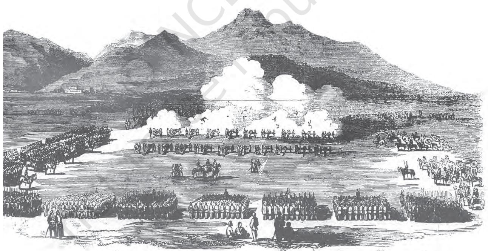

# **THEME TEN**

# **Rebels and the Raj** The Revolt of 1857 and Its Representations

Late in the afternoon of 10 May 1857, the sepoys in the cantonment of Meerut broke out in mutiny. It began in the lines of the native infantry, spread very swiftly to the cavalry and then to the city. The ordinary people of the town and surrounding villages joined the sepoys. The sepoys captured the bell of arms where the arms and ammunition were kept and proceeded to attack white people, and to ransack and burn their bungalows and property. Government buildings – the record office, jail, court, post office, treasury, etc. – were destroyed and plundered. The telegraph line to Delhi was cut. As darkness descended, a group of sepoys rode off towards Delhi.

*Fig. 10.1 Portrait of Bahadur Shah*

The sepoys arrived at the gates of the Red Fort early in the morning on 11 May. It was the month of Ramzan, the Muslim holy month of prayer and fasting. The old Mughal emperor, Bahadur Shah, had just finished his prayers and meal before the sun rose and the fast began. He heard the commotion at the gates. The sepoys who had gathered under his window told him: "We have come from Meerut after killing all the Englishmen there, because they asked us to bite bullets that were coated with the fat of cows and pigs with our teeth. This has corrupted the faith of Hindus and Muslims alike.'' Another group of sepoys also entered Delhi, and the ordinary people of the city joined them. Europeans were killed in large numbers; the rich of Delhi were attacked and looted. It was clear that Delhi had gone out of British control. Some sepoys rode into the Red Fort, without observing the elaborate court etiquette expected of them. They demanded that the emperor give them his blessings. Surrounded by the sepoys, Bahadur Shah had no other option but to comply. The revolt thus acquired a kind of legitimacy because it could now be carried on in the name of the Mughal emperor.

Through 12 and 13 May, North India remained quiet. Once word spread that Delhi had fallen to the rebels and Bahadur Shah had blessed the rebellion, events moved swiftly. Cantonment after cantonment in the Gangetic valley and some to the west of Delhi rose in mutiny.

## **1. Pattern of the Uprising**

If one were to place the dates of these mutinies in chronological order, it would appear that as the news of the mutiny in one town travelled to the next the sepoys there took up arms. The sequence of events in every cantonment followed a similar pattern.

### 1.1 How the mutinies began

The sepoys began their action with a signal: in many places it was the firing of the evening gun or the sounding of the bugle. They first seized the bell of arms and plundered the treasury. They then attacked government buildings – the jail, treasury, telegraph office, record room, bungalows – burning all records. Everything and everybody connected with the white man became a target. Proclamations in Hindi, Urdu and Persian were put up in the cities calling upon the population, both Hindus and Muslims, to unite, rise and exterminate the *firangis*.

When ordinary people began joining the revolt,

*Bell of arms* is a storeroom in which weapons are kept.

*Firangi,* a term of Persian origin, possibly derived from Frank (from which France gets its name), is used in Urdu and Hindi, often in a derogatory sense, to designate foreigners.

*Fig. 10.2*

*Ordinary people join the sepoys in attacking the British in Lucknow.*

the targets of attack widened. In major towns like Lucknow, Kanpur and Bareilly, moneylenders and the rich also became the objects of rebel wrath. Peasants not only saw them as oppressors but also as allies of the British. In most places their houses were looted and destroyed. The mutiny in the sepoy ranks quickly became a rebellion. There was a general defiance of all kinds of authority and hierarchy.

 In the months of May and June, the British had no answer to the actions of the rebels. Individual Britons tried to save their own lives and the lives of their families. British rule, as one British officer noted, "collapsed like a house made of cards''.

#### *Source 1*

### **Ordinary life in extraordinary times**

What happened in the cities during the months of the revolt? How did people live through those months of tumult? How was normal life affected? Reports from different cities tell us about the breakdown in routine activities. Read these reports from the *Delhi Urdu Akhbar*, 14 June 1857:

The same thing is true for vegetables and *saag* (spinach). People have been found to complain that even *kaddu* (pumpkin) and *baingan* (brinjal) cannot be found in the bazaars. Potatoes and *arvi* (yam) when available are of stale and rotten variety, stored from before by farsighted *kunjras* (vegetable growers). From the gardens inside the city some produce does reach a few places but the poor and the middle class can only lick their lips and watch them (as they are earmarked for the select).

... There is something else that needs attention which is causing a lot of damage to the people which is that the water-carriers have stopped filling water. Poor *Shurfas* (gentility) are seen carrying water in pails on their shoulders and only then the necessary household tasks such as cooking, etc. can take place. The *halalkhors* (righteous) have become *haramkhors* (corrupt), many *mohallas* have not been able to earn for several days and if this situation continues then decay, death and disease will combine together to spoil the city's air and an epidemic will spread all over the city and even to areas adjacent and around.

#### 1.2 Lines of communication

The reason for the similarity in the pattern of the revolt in different places lay partly in its planning and coordination. It is clear that there was communication between the sepoy lines of various cantonments. After the 7th Awadh Irregular Cavalry had refused to accept the new cartridges in early May, they wrote to the 48th Native Infantry that "they had acted for the faith and awaited the 48th's orders". Sepoys or their emissaries moved from one station to another. People were thus planning and talking about the rebellion.

‹ Read the two reports and the descriptions of what was happening in Delhi provided in the chapter. Remember that newspaper reports often express the prejudices of the reporter. How did *Delhi Urdu Akhbar* view the actions of the people?

#### *Source 2*

### **Sisten and the** *tahsildar*

In the context of the communication of the message of revolt and mutiny, the experience of François Sisten, a native Christian police inspector in Sitapur, is telling. He had gone to Saharanpur to pay his respects to the magistrate. Sisten was dressed in Indian clothes and sitting cross-legged. A Muslim *tahsildar* from Bijnor entered the room; upon learning that Sisten was from Awadh, he enquired, "What news from Awadh? How does the work progress, brother?" Playing safe, Sisten replied, "If we have work in Awadh, your highness will know it." The *tahsildar* said, "Depend upon it, we will succeed this time. The direction of the business is in able hands." The *tahsildar* was later identified as the principal rebel leader of Bijnor.

‹ What does this conversation suggest about the ways in which plans were communicated and discussed by the rebels? Why did the *tahsildar* regard Sisten as a potential rebel?

The pattern of the mutinies and the pieces of evidence that suggest some sort of planning and coordination raise certain crucial questions. How were the plans made? Who were the planners? It is difficult on the basis of the available documents to provide direct answers to such questions. But one incident provides clues as to how the mutinies came to be so organised. Captain Hearsey of the Awadh Military Police had been given protection by his Indian subordinates during the mutiny. The 41st Native Infantry, which was stationed in the same place, insisted that since they had killed all their white officers, the Military Police should also kill Hearsey or deliver him as prisoner to the 41st. The Military Police refused to do either, and it was decided that the matter would be settled by a panchayat composed of native officers drawn from each regiment. Charles Ball, who wrote one of the earliest histories of the uprising, noted that panchayats were a nightly occurrence in the Kanpur sepoy lines. What this suggests is that some of the decisions were taken collectively. Given the fact that the sepoys lived in lines and shared a common lifestyle and that many of them came from the same caste, it is not difficult to imagine them sitting together to decide their own future. The sepoys were the makers of their own rebellion.

*Mutiny* – a collective disobedience of rules and regulations within the armed forces

*Revolt* – a rebellion of people against established authority and power. The terms 'revolt' and 'rebellion' can be used synonymously.

In the context of the revolt of 1857 the term revolt refers primarily to the uprising of the civilian population (peasants, zamindars, rajas, *jagirdars)* while the mutiny was of the sepoys.

*Fig. 10.3 Rani Lakshmi Bai, a popular image*

#### *Fig. 10.4 Nana Sahib*

At the end of 1858, when the rebellion collapsed, Nana Sahib escaped to Nepal. The story of his escape added to the legend of Nana Sahib's courage and valour.

### 1.3 Leaders and followers

To fight the British, leadership and organisation were required. For these the rebels sometimes turned to those who had been leaders before the British conquest. One of the first acts of the sepoys of Meerut, as we saw, was to rush to Delhi and appeal to the old Mughal emperor to accept the leadership of the revolt. This acceptance of leadership took its time in coming. Bahadur Shah's first reaction was one of horror and rejection. It was only when some sepoys had moved into the Mughal court within the Red Fort, in defiance of normal court etiquette, that the old emperor, realising he had very few options, agreed to be the nominal leader of the rebellion.

Elsewhere, similar scenes were enacted though on a minor scale. In Kanpur, the sepoys and the people of the town gave Nana Sahib, the successor to Peshwa Baji Rao II, no choice save to join the revolt as their leader. In Jhansi, the rani was forced by the popular pressure around her to assume the leadership of the uprising. So was Kunwar Singh, a local zamindar in Arrah in Bihar. In Awadh, where the displacement of the popular Nawab Wajid Ali Shah and the annexation of the state were still very fresh in the memory of the people, the populace in Lucknow celebrated the fall of British rule by hailing Birjis Qadr, the young son of the Nawab, as their leader.

Not everywhere were the leaders people of the court – ranis, rajas, nawabs and *taluqdars*. Often the message of rebellion was carried by ordinary men and women and in places by religious men too. From Meerut, there were reports that a fakir had appeared riding on an elephant and that the sepoys were visiting him frequently. In Lucknow, after the annexation of Awadh, there were many religious leaders and self-styled prophets who preached the destruction of British rule.

Elsewhere, local leaders emerged, urging peasants, zamindars and tribals to revolt. Shah Mal mobilised the villagers of pargana Barout in Uttar Pradesh; Gonoo, a tribal cultivator of Singhbhum in Chotanagpur, became a rebel leader of the Kol tribals of the region.

## **Two rebels of 1857**

### **Shah Mal**

Shah Mal lived in a large village in pargana Barout in Uttar Pradesh. He belonged to a clan of Jat cultivators whose kinship ties extended over *chaurasee des* (eighty-four villages). The lands in the region were irrigated and fertile, with rich dark loam soil. Many of the villagers were prosperous and saw the British land revenue system as oppressive: the revenue demand was high and its collection inflexible. Consequently cultivators were losing land to outsiders, to traders and moneylenders who were coming into the area.

Shah Mal mobilised the headmen and cultivators of *chaurasee des*, moving at night from village to village, urging people to rebel against the British. As in many other places, the revolt against the British turned into a general rebellion against all signs of oppression and injustice. Cultivators left their fields and plundered the houses of moneylenders and traders. Displaced proprietors took possession of the lands they had lost. Shah Mal's men attacked government buildings, destroyed the bridge over the river, and dug up metalled roads – partly to prevent government forces from coming into the area, and partly because bridges and roads were seen as symbols of British rule. They sent supplies to the sepoys who had mutinied in Delhi and stopped all official communication between British headquarters and Meerut. Locally acknowledged as the Raja, Shah Mal took over the bungalow of an English officer, turned it into a "hall of justice", settling disputes and dispensing judgments. He also set up an amazingly effective network of intelligence. For a period the people of the area felt that *firangi raj* was over, and their *raj* had come.

Shah Mal was killed in battle in July 1857.

### **Maulvi Ahmadullah Shah**

Maulvi Ahmadullah Shah was one of the many *maulvis* who played an important part in the revolt of 1857. Educated in Hyderabad, he became a preacher when young. In 1856, he was seen moving from village to village preaching *jehad* (religious war) against the British and urging people to rebel. He moved in a palanquin, with drumbeaters in front and followers at the rear. He was therefore popularly called Danka Shah – the *maulvi* with the drum (*danka*). British officials panicked as thousands began following the *maulvi* and many Muslims began seeing him as an inspired prophet. When he reached Lucknow in 1856, he was stopped by the police from preaching in the city. Subsequently, in 1857, he was jailed in Faizabad. When released, he was elected by the mutinous 22nd Native Infantry as their leader. He fought in the famous Battle of Chinhat in which the British forces under Henry Lawrence were defeated. He came to be known for his courage and power. Many people in fact believed that he was invincible, had magical powers, and could not be killed by the British. It was this belief that partly formed the basis of his authority.

*Fig. 10.5 Henry Hardinge, by Francis Grant, 1849*

As Governor General, Hardinge attempted to modernise the equipment of the army. The Enfield rifles that were introduced initially used the greased cartridges the sepoys rebelled against.

## 1.4 Rumours and prophecies

Rumours and prophecies played a part in moving people to action. As we saw, the sepoys who had arrived in Delhi from Meerut had told Bahadur Shah about bullets coated with the fat of cows and pigs and that biting those bullets would corrupt their caste and religion. They were referring to the cartridges of the Enfield rifles which had just been given to them. The British tried to explain to the sepoys that this was not the case but the rumour that the new cartridges were greased with the fat of cows and pigs spread like wildfire across the sepoy lines of North India.

This is one rumour whose origin can be traced. Captain Wright, commandant of the Rifle Instruction Depot, reported that in the third week of January 1857 a "low-caste" *khalasi* who worked in the magazine in Dum Dum had asked a Brahmin sepoy for a drink of water from his *lota*. The sepoy had refused saying that the "lower caste's" touch would defile the *lota*. The *khalasi* had reportedly retorted, "You will soon lose your caste, as ere long you will have to bite cartridges covered with the fat of cows and pigs." We do not know the veracity of the report, but once this rumour started no amount of assurances from British officers could stop its circulation and the fear it spread among the sepoys.

This was not the only rumour that was circulating in North India at the beginning of 1857. There was the rumour that the British government had hatched a gigantic conspiracy to destroy the caste and religion of Hindus and Muslims. To this end, the rumours said, the British had mixed the bone dust of cows and pigs into the flour that was sold in the market. In towns and cantonments, sepoys and the common people refused to touch the *atta*. There was fear and suspicion that the British wanted to convert Indians to Christianity. Panic spread fast. British officers tried to allay their fears, but in vain. These fears stirred men to action. The response to the call for action was reinforced by the prophecy that British rule would come to an end on the centenary of the Battle of Plassey, on 23 June 1857.

Rumours were not the only thing circulating at the time. Reports came from various parts of North India that chapattis were being distributed from village to village. A person would come at night and

give a chapatti to the watchman of the village and ask him to make five more and distribute to the next village, and so on. The meaning and purpose of the distribution of the chapattis was not clear and is not clear even today. But there is no doubt that people read it as an omen of an upheaval.

### 1.5 Why did people believe in the rumours?

We cannot understand the power of rumours and prophecies in history by checking whether they are factually correct or not. We need to see what they reflect about the minds of people who believed them – their fears and apprehensions, their faiths and convictions. Rumours circulate only when they resonate with the deeper fears and suspicions of people.

The rumours in 1857 begin to make sense when seen in the context of the policies the British pursued from the late 1820s. As you know, from that time, under the leadership of Governor General Lord William Bentinck, the British adopted policies aimed at "reforming" Indian society by introducing Western education, Western ideas and Western institutions. With the cooperation of sections of Indian society they set up English-medium schools, colleges and universities which taught Western sciences and the liberal arts. The British established laws to abolish customs like sati (1829) and to permit the remarriage of Hindu widows.

On a variety of pleas, like misgovernment and the refusal to recognise adoption, the British annexed not only Awadh, but many other kingdoms and principalities like Jhansi and Satara. Once these territories were annexed, the British introduced their own system of administration, their own laws and their own methods of land settlement and land revenue collection. The cumulative impact of all this on the people of North India was profound.

It seemed to the people that all that they cherished and held sacred – from kings and socio-religious customs to patterns of landholding and revenue payment – was being destroyed and replaced by a system that was more impersonal, alien and oppressive. This perception was aggravated by the activities of Christian missionaries. In such a situation of uncertainty, rumours spread with remarkable swiftness.

To explore the basis of the revolt of 1857 in some detail, let us look at Awadh – one of the major centres where the drama of 1857 unfolded.

‹ Discuss... Read the section once more and explain the similarities and differences you notice in the ways in which leaders emerged during the revolt. For any two leaders, discuss why ordinary people were drawn to them.

## **2. Awadh in Revolt**

### 2.1 "A cherry that will drop into our mouth one day"

In 1851 Governor General Lord Dalhousie described the kingdom of Awadh as "a cherry that will drop into our mouth one day". Five years later, in 1856, the kingdom was formally annexed to the British Empire.

The conquest happened in stages. The Subsidiary Alliance had been imposed on Awadh in 1801. By the terms of this alliance the Nawab had to disband his military force, allow the British to position their troops within the kingdom, and act in accordance with the advice of the British Resident who was now to be attached to the court. Deprived of his armed forces, the Nawab became increasingly dependent on the British to maintain law and order within the kingdom. He could no longer assert control over the rebellious chiefs and *taluqdars*.

In the meantime the British became increasingly interested in acquiring the territory of Awadh. They felt that the soil there was good for producing indigo and cotton, and the region was ideally located to be developed into the principal market of Upper India. By the early 1850s, moreover, all the major areas of India had been conquered: the Maratha lands, the Doab, the Carnatic, the Punjab and Bengal. The takeover of Awadh in 1856 was expected to complete a process of territorial annexation that had begun with the conquest of Bengal almost a century earlier.

#### 2.2 "The life was gone out of the body"

Lord Dalhousie's annexations created disaffection in all the areas and principalities that were annexed but nowhere more so than in the kingdom of Awadh in the heart of North India. Here, Nawab Wajid Ali Shah was dethroned and exiled to Calcutta on the plea that the region was being misgoverned. The British government also wrongly assumed that Wajid Ali Shah was an unpopular ruler. On the contrary, he was widely loved, and when he left his beloved Lucknow, there were many who followed him all the way to Kanpur singing songs of lament.

The widespread sense of grief and loss at the Nawab's exile was recorded by many contemporary observers. One of them wrote: "The life was gone out of the body, and the body of this town had been left lifeless … there was no street or market and house

*Resident* was the designation of a representative of the Governor General who lived in a state which was not under direct British rule.

## **Subsidiary Alliance**

Subsidiary Alliance was a system devised by Lord Wellesley in 1798. All those who entered into such an alliance with the British had to accept certain terms and conditions:

(a) The British would be responsible for protecting their ally from external and internal threats to their power.

(b) In the territory of the ally, a British armed contingent would be stationed.

(c) The ally would have to provide the resources for maintaining this contingent.

(d) The ally could enter into agreements with other rulers or engage in warfare only with the permission of the British.

which did not wail out the cry of agony in separation of Jan-i-Alam." One folk song bemoaned that "the honourable English came and took the country'' (*Angrez Bahadur ain, mulk lai linho* ).

This emotional upheaval was aggravated by immediate material losses. The removal of the Nawab led to the dissolution of the court and its culture. Thus a whole range of people – musicians, dancers, poets, artisans, cooks, retainers, administrative officials and so on – lost their livelihood.

## 2.3 *Firangi raj* and the end of a world

A chain of grievances in Awadh linked prince, *taluqdar*, peasant and sepoy. In different ways they came to identify *firangi raj* with the end of their world – the breakdown of things they valued, respected and held dear. A whole complex of emotions

Another song mourned the plight of the ruler who had to leave his motherland:

- Noble and peasant all wept together
- and all the world wept and wailed

Alas! The chief has bidden adieu to

his country and gone abroad.

‹ Read the entire section and discuss why people mourned the departure of Wajid Ali Shah.

*Fig. 10.6 A zamindar from Awadh, 1880*

and issues, traditions and loyalties worked themselves out in the revolt of 1857. In Awadh, more than anywhere else, the revolt became an expression of popular resistance to an alien order.

The annexation displaced not just the Nawab. It also dispossessed the *taluqdars* of the region. The countryside of Awadh was dotted with the estates and forts of *taluqdars* who for many generations had controlled land and power in the countryside. Before the coming of the British, *taluqdars* maintained armed retainers, built forts, and enjoyed a degree of autonomy, as long as they accepted the suzerainty of the Nawab and paid the revenue of their *taluqs*. Some of the bigger *taluqdars* had as many as 12,000 footsoldiers and even the smaller ones had about 200. The British were unwilling to tolerate the power of the *taluqdars*. Immediately after the annexation, the *taluqdars* were disarmed and their forts destroyed.

The British land revenue policy further undermined the position and authority of the *taluqdars*. After annexation, the first British revenue settlement, known as the Summary Settlement of 1856, was based on the assumption that the *taluqdars* were interlopers with no permanent stakes in land: they had established their hold over land through force and fraud. The Summary Settlement proceeded to remove the *taluqdars* wherever possible. Figures show that in pre-British times, *taluqdars* had held 67 per cent of the total number of villages in Awadh; by the Summary Settlement this number had come down to 38 per cent. The *taluqdars* of southern Awadh were the hardest hit and some lost more than half of the total number of villages they had previously held.

British land revenue officers believed that by removing *taluqdars* they would be able to settle the land with the actual owners of the soil and thus reduce the level of exploitation of peasants while increasing revenue returns for the state. But this did not happen in practice: revenue flows for the state increased but the burden of demand on the peasants did not decline. Officials soon found that large areas of Awadh were actually heavily overassessed: the increase of revenue demand in some places was from 30 to 70 per cent. Thus neither *taluqdars* nor peasants had any reasons to be happy with the annexation.

The dispossession of *taluqdars* meant the breakdown of an entire social order. The ties of loyalty and patronage that had bound the peasant to the *taluqdar* were disrupted. In pre-British times, the *taluqdars* were oppressors but many of them also appeared to be generous father figures: they exacted a variety of dues from the peasant but were often considerate in times of need. Now, under the British, the peasant was directly exposed to overassessment of revenue and inflexible methods of collection. There was no longer any guarantee that in times of hardship or crop failure the revenue demand of the state would be reduced or collection postponed; or that in times of festivities the peasant would get the loan and support that the *taluqdar* had earlier provided.

In areas like Awadh where resistance during 1857 was intense and long lasting, the fighting was carried out by *taluqdars* and their peasants. Many of these *taluqdars* were loyal to the Nawab of Awadh, and they joined Begum Hazrat Mahal (the wife of the Nawab) in Lucknow to fight the British; some even remained with her in defeat.

The grievances of the peasants were carried over into the sepoy lines since a vast majority of the sepoys were recruited from the villages of Awadh. For decades the sepoys had complained of low levels of pay and the difficulty of getting leave. By the 1850s there were other reasons for their discontent.

The relationship of the sepoys with their superior white officers underwent a significant change in the years preceding the uprising of 1857. In the 1820s, white officers made it a point to maintain friendly relations with the sepoys. They would take part in their leisure activities – they wrestled with them, fenced with them and went out hawking with them. Many of them were fluent in Hindustani and were familiar with the customs and culture of the country. These officers were disciplinarian and father figure rolled into one.

In the 1840s, this began to change. The officers developed a sense of superiority and started treating the sepoys as their racial inferiors, riding roughshod over their sensibilities. Abuse and physical violence became common and thus the distance between sepoys and officers grew. Trust was replaced by suspicion. The episode of the greased cartridges was a classic example of this.

#### *Source 4*

### **What** *taluqdars* **thought**

The attitude of the *taluqdars* was best expressed by Hanwant Singh, the Raja of Kalakankar, near Rae Bareli. During the mutiny, Hanwant Singh had given shelter to a British officer, and conveyed him to safety. While taking leave of the officer, Hanwant Singh told him:

> Sahib, your countrymen came into this country and drove out our King. You sent your officers round the districts to examine the titles to the estates. At one blow you took from me lands which from time immemorial had been in my family. I submitted. Suddenly misfortune fell upon you. The people of the land rose against you. You came to me whom you had despoiled. I have saved you. But now – now I march at the head of my retainers to Lucknow to try and drive you from the country.

> ‹ What does this excerpt tell you about the attitude of the *taluqdars*? Who did Hanwant Singh mean by the people of the land? What reason does Hanwant Singh give for the anger of the people?

*Fig. 10.7 Bengal sepoys in European-style uniform*

## ‹ Discuss...

Find out whether people in your state participated in the revolt of 1857. If they did, find out why they did so. If they did not, try and explain this.

It is also important to remember that close links existed between the sepoys and the rural world of North India. The large majority of the sepoys of the Bengal Army were recruited from the villages of Awadh and eastern Uttar Pradesh. Many of them were Brahmins or from the "upper" castes. Awadh was, in fact, called the "nursery of the Bengal Army''. The changes that the families of the sepoys saw around them and

the threats they perceived were quickly transmitted to the sepoy lines. In turn, the fears of the sepoys about the new cartridge, their grievances about leave, their grouse about the increasing misbehaviour and racial abuse on the part of their white officers were communicated back to the villages. This link between the sepoys and the rural world had important implications in the course of the uprising. When the sepoys defied their superior officers and took up arms they were joined very swiftly by their brethren in the villages. Everywhere, peasants poured into towns and joined the soldiers and the ordinary people of the towns in collective acts of rebellion.

## **3. What the Rebels Wanted**

As victors, the British recorded their own trials and tribulations as well as their heroism. They dismissed the rebels as a bunch of ungrateful and barbaric people. The repression of the rebels also meant silencing of their voice. Few rebels had the opportunity of recording their version of events. Moreover, most of them were sepoys and ordinary people who were not literate. Thus, other than a few proclamations and *ishtahars* (notifications) issued by rebel leaders to propagate their ideas and persuade people to join the revolt, we do not have much that throws light on the perspective of the rebels. Attempts to reconstruct what happened in 1857 are thus heavily and inevitably dependent on what the British wrote. While these sources reveal the minds of officials, they tell us very little about what the rebels wanted.

## 3.1 The vision of unity

The rebel proclamations in 1857 repeatedly appealed to all sections of the population, irrespective of their caste and creed. Many of the proclamations were issued by Muslim princes or in their names but even these took care to address the sentiments of Hindus. The rebellion was seen as a war in which both Hindus and Muslims had equally to lose or gain. The *ishtahars* harked back to the pre-British Hindu-Muslim past and glorified the coexistence of different communities under the Mughal Empire. The proclamation that was issued under the name of Bahadur Shah appealed to the people to join the fight under the standards of both Muhammad and Mahavir. It was remarkable that during the uprising religious divisions between Hindus and Muslim were hardly noticeable despite British attempts to create such divisions. In Bareilly in western Uttar Pradesh, in December 1857, the British spent Rs 50,000 to incite the Hindu population against the Muslims. The attempt failed.

#### *Source 5*

## **The Azamgarh Proclamation, 25 August 1857**

This is one of the main sources of our knowledge about what the rebels wanted:

It is well known to all, that in this age the people of Hindostan, both Hindoos and Mohammedans, are being ruined under the tyranny and the oppression of the infidel and treacherous English. It is therefore the bounden duty of all the wealthy people of India, especially those who have any sort of connection with the Mohammedan royal families, and are considered the pastors and masters of their people, to stake their lives and property for the well-being of the public. …

Several of the Hindoo and Mussalman Chiefs, who have long since quitted their homes for the preservation of their religion, and have been trying their best to root out the English in India, have presented themselves to me, and taken part in the reigning Indian crusade, and it is more than probable that I shall very shortly receive succours from the West. Therefore for the information of the public, the present *Ishtahar,* consisting of several sections, is put in circulation and it is the imperative duty of all to take into their careful consideration, and abide by it. Parties anxious to participate in the common cause, but having no means to provide for themselves, shall receive their daily subsistence from me; and be it known to all, that the ancient works, both of the Hindoos and Mohammedans, the writings of miracle workers, and the calculation of the astrologers, pundits, … all agree in asserting that the English will no longer have any footing in India or elsewhere. Therefore it is incumbent on all to give up the hope of the continuation of the British sway, side with me, and deserve the consideration of the Badshahi, or imperial government, by their individual exertion in

#### *Source 5 (contd)*

promoting the common good, and thus attain their respective ends; otherwise if this golden opportunity slips away, they will have to repent for their folly, … .

*Section I – Regarding Zemindars*. It is evident, that the British Government in making zemindary settlements have imposed exorbitant *Jumas* (revenue demand) and have disgraced and ruined several zemindars, by putting up their estates for public auction for arrears of rent, in so much, in the institution of a suit by a common Ryot, a maid servant, or a slave, the respectable zemindars are summoned into court, arrested, put in goal and disgraced. In litigation regarding zemindaries, the immense value of stamps, and other unnecessary expenses of the civil courts, … are all calculated to impoverish the litigants. Besides this, the coffers of the zemindars are annually taxed with the subscription for schools, hospitals, roads, etc. Such extortions will have no manner of existence in the Badshahi Government; but on the contrary the *Jumas* will be light, the dignity and honour of the zemindars safe, and every zemindar will have absolute rule in his own zemindary …

*Section II – Regarding Merchants*. It is plain that the infidel and treacherous British Government have monopolised the trade of all the fine and valuable merchandise, such as indigo, cloth, and other articles of shipping, leaving only the trade of trifles to the people, … Besides this, the profits of the traders are taxed, with postages, tolls and subscriptions for schools, etc. Notwithstanding all these concessions, the merchants are liable to imprisonment and disgrace at the instance or complaint of a worthless man. When the Badshahi Government is established all these aforesaid fraudulent practices shall be dispensed with, and the trade of every article, without exception, both by land and water will be opened to the native merchants of India, … It is therefore the duty of every merchant to take part in the war, and aid the Badshahi Government with his men and money, … .

*Section III – Regarding Public Servants*. It is not a secret thing, that under the British Government, natives employed in the civil and military services have little respect, low pay, and no manner of influence; and all the posts of dignity and emolument in both the departments are exclusively bestowed on Englishmen, … Therefore, all the natives in the British service ought to be alive to their religion and interest, and abjuring their loyalty to the English, side with the Badshahi Government, and obtain salaries of 200 and 300 rupees a month for the present, and be entitled to high posts in the future. …

*Section IV* – Regarding Artisans. It is evident that the Europeans, by the introduction of English articles into India, have thrown the weavers, the cotton dressers, the carpenters, the blacksmiths, and the shoemakers, etc., out of employ, and have engrossed their occupations, so that every description of native artisan has been reduced to beggary. But under the Badshahi Government the native artisans will exclusively be employed in the service of the kings, the rajahs, and the rich; and this will no doubt ensure their prosperity. Therefore these artisans ought to renounce the English services, … .

*Section V* – Regarding Pundits, Fakirs and Other Learned Persons. The pundits and fakirs being the guardians of the Hindoo and Mohammadan religions respectively, and the Europeans being the enemies of both the religions, and as at present a war is raging against the English on account of religion, the pundits and fakirs are bound to present themselves to me, and take their share in the holy war… .

‹What are the issues against British rule highlighted in this proclamation? Read the section on each social group carefully. Notice the language in which the proclamation is formulated and the variety of sentiments it appeals to.

#### *Source 6*

### **What the sepoys thought**

This is one of the *arzis* (petition or application) of rebel sepoys that have survived:

A century ago the British arrived in Hindostan and gradually entertained troops in their service, and became masters of every state. Our forefathers have always served them, and we also entered their service … By the mercy of God and with our assistance the British also conquered every place they liked, in which thousands of us, Hindostani men were sacrificed, but we never made any excuses or pretences nor revolted …

But in the year eighteen fifty seven the British issued an order that new cartridges and muskets which had arrived from England were to be issued; in the former of which the fats of cows and pigs were mixed; and also that *attah* of wheat mixed with powdered bones was to be eaten; and even distributed them in every Regiment of infantry, cavalry and artillery …

They gave these cartridges to the *sowars* (mounted soldiers) of the 3rd Light Cavalry, and ordered them to bite them; the troopers objected to it, and said that they would never bite them, for if they did, their religion and faith would be destroyed … upon this the British officers paraded the men of the 3 Regiments and having prepared 1,400 English soldiers, and other Battalions of European troops and Horse Artillery, surrounded them, and placing six guns before each of the infantry regiments, loaded the guns with grape and made 84 new troopers prisoners, and put them in jail with irons on them … The reason that the *sowars* of the Cantonment were put into jail was that we should be frightened into biting the new cartridges. On this account we and all our country-men having united together, have fought the British for the preservation of our faith … we have been compelled to make war for two years and the Rajahs and Chiefs who are with us in faith and religion, are still so, and have undergone all sorts of trouble; we have fought for two years in order that our faith and religion may not be polluted. If the religion of a Hindoo or Mussalman is lost, what remains in the world?

‹ Compare the reasons for the mutiny as stated in the *arzi* with those mentioned by the *taluqdar* (Source 3).

#### 3.2 Against the symbols of oppression

The proclamations completely rejected everything associated with British rule or *firangi raj* as they called it. They condemned the British for the annexations they had carried out and the treaties they had broken. The British, the rebel leaders said, could not be trusted.

What enraged the people was how British land revenue settlements had dispossessed landholders, both big and small, and foreign commerce had driven artisans and weavers to ruin. Every aspect of British rule was attacked and the *firangi* accused of destroying a way of life that was familiar and cherished. The rebels wanted to restore that world.

The proclamations expressed the widespread fear that the British were bent on destroying the caste and religions of Hindus and Muslims and converting them to Christianity – a fear that led people to believe many of the rumours that circulated at the time. People were urged to come together and fight to save their livelihood, their faith, their honour, their identity – a fight which was for the "greater public good".

As noted earlier, in many places the rebellion against the British widened into an attack on all those who were seen as allies of the British or local oppressors. Often the rebels deliberately sought to humiliate the elites of a city. In the villages they burnt account books and ransacked moneylenders' houses. This reflected an attempt to overturn traditional hierarchies, rebel against *all* oppressors. It presents a glimpse of an alternative vision, perhaps of a more egalitarian society. Such visions were not articulated in the proclamations which sought to unify all social groups in the fight against *firangi raj.*

#### 3.3 The search for alternative power

Once British rule had collapsed, the rebels in places like Delhi, Lucknow and Kanpur tried to establish some kind of structure of authority and administration. This was, of course, short-lived but the attempts show that the rebel leadership wanted to restore the pre-British world of the eighteenth century. The leaders went back to the culture of the court. Appointments were made to various posts, arrangements made for the collection of land revenue and the payment of troops, orders issued to stop loot and plunder. Side by side plans were made to fight battles against the British. Chains of command were laid down in the army. In all this the rebels harked back to the eighteenth-century Mughal world – a world that became a symbol of all that had been lost.

The administrative structures established by the rebels were primarily aimed at meeting the demands of war. However, in most cases these structures could not survive the British onslaught. But in Awadh, where resistance to the British lasted longest, plans of counter-attack were being drawn up by the Lucknow court and hierarchies of command were in place as late as the last months of 1857 and the early part of 1858.

## ‹ Discuss...

What do you think are the major problems faced by historians in reconstructing the point of view of the rebels?

## **4. Repression**

It is clear from all accounts that we have of 1857 that the British did not have an easy time in putting down the rebellion.

Before sending out troops to reconquer North India, the British passed a series of laws to help them quell the insurgency. By a number of Acts, passed in May and June 1857, not only was the whole of North India put under martial law but military officers and even ordinary Britons were given the power to try and punish Indians suspected of rebellion. In other words, the ordinary processes of law and trial were suspended and it was put out that rebellion would have only one punishment – death.

Armed with these newly enacted special laws and the reinforcements brought in from Britain, the British began the task of suppressing the revolt. They, like the rebels, recognised the symbolic value of Delhi. The British thus mounted a two-pronged attack. One force moved from Calcutta into North India and the other from the Punjab – which was largely peaceful – to reconquer Delhi. British *Source 7*

### **Villagers as rebels**

An officer reporting from rural Awadh (spelt as Oude in the following account) noted:

> The Oude people are gradually pressing down on the line of communication from the North … the Oude people are villagers … these villagers are nearly intangible to Europeans melting away before them and collecting again. The Civil Authorities report these villagers to amount to a very large number of men, with a number of guns.

‹ What, according to this account, were the problems faced by the British in dealing with these villagers?

*Map 2 The map shows the important centres of revolt and the lines of British attack against the rebels.*

*Fig. 10.8 A mosque on the Delhi Ridge, photograph by Felice Beato, 1857-58* After 1857, British photographers recorded innumerable images of desolation and ruin.

attempts to recover Delhi began in earnest in early June 1857 but it was only in late September that the city was finally captured. The fighting and losses on both sides were heavy. One reason for this was the fact that rebels from all over North India had come to Delhi to defend the capital.

In the Ganegtic plain too the progress of British reconquest was slow. The forces had to reconquer the area village by village. The countryside and the people around were entirely hostile. As soon as they began their counter -insurgency operations, the British realised that they were not dealing with a mere mutiny but an uprising that had huge popular support. In Awadh, for example, a British official called Forsyth estimated that three-fourths of the adult male population was in rebellion. The area was brought under control only in March 1858 after protracted fighting.

The British used military power on a gigantic scale. But this was not the only instrument they used. In large parts of present-day Uttar Pradesh, where big landholders and peasants had offered united resistance, the British tried to break up the unity by promising to give back to the big landholders their estates. Rebel landholders were dispossessed and the loyal rewarded. Many landholders died fighting the British or they escaped into Nepal where they died of illness or starvation.

#### *Fig. 10.9 Secundrah Bagh, Lucknow, photograph by Felice Beato, 1858*

Here we see four solitary figures within a desolate place that was once the pleasure garden built by Nawab Wajid Ali Shah. British forces led by Campbell killed over 2000 rebel sepoys who held the place in 1857. The skeletons strewn on the ground are meant to be a cold warning of the futility of rebellion.

## **5. Images of the Revolt**

How do we know about the revolt, about the activities of the rebels and the measures of repression that we have been discussing?

As we have seen, we have very few records on the rebels' point of view. There are a few rebel proclamations and notifications, as also some letters that rebel leaders wrote. But historians till now have continued to discuss rebel actions primarily through accounts written by the British.

Official accounts, of course, abound: colonial administrators and military men left their versions in letters and diaries, autobiographies and official histories. We can also gauge the official mindset and the changing British attitudes through the innumerable memos and notes, assessments of situations, and reports that were produced. Many of these have now been collected in a set of volumes on mutiny records. These tell us about the fears and anxieties of officials and their perception of the rebels. The stories of the revolt that were published in British newspapers and magazines narrated in gory detail the violence of the mutineers – and these stories inflamed public feelings and provoked demands of retribution and revenge. garrisons. Twenty days later Colin Campbell, who REBELS AND THE RAJ

One important record of the mutiny is the pictorial images produced by the British and Indians: paintings, pencil drawings, etchings, posters, cartoons, bazaar prints. Let us look at some of them and see what they tell us.

#### 5.1 Celebrating the saviours

British pictures offer a variety of images that were meant to provoke a range of different emotions and reactions. Some of them commemorate the British heroes who saved the English and repressed the rebels. "Relief of Lucknow", painted by Thomas Jones Barker in 1859, is an example of this type. When the rebel forces besieged Lucknow, Henry Lawrence, the Commissioner of Lucknow, collected the Christian population and took refuge in the heavily fortified Residency. Lawrence was killed but the Residency continued to be defended under the command of Colonel Inglis. On 25 September James Outram and Henry Havelock arrived, cut through the rebel forces, and reinforced the British

*Fig. 10.10 "Relief of Lucknow", painted by Thomas Jones Barker, 1859*

was appointed as the new Commander of British forces in India, came with his forces and rescued the besieged British garrison. In British accounts the siege of Lucknow became a story of survival, heroic resistance and the ultimate triumph of British power.

Barker's painting celebrates the moment of Campbell's entry. At the centre of the canvas are the British heroes – Campbell, Outram and Havelock. The gestures of the hands of those around lead the spectator's eyes towards the centre. The heroes stand on a ground that is well lit, with shadows in the foreground and the damaged Residency in the background. The dead and injured in the foreground are testimony to the suffering during the siege, while the triumphant figures of horses in the middle ground emphasise the fact that British power and control had been re-established. To the British public such paintings were reassuring. They created a sense that the time of trouble was past and the rebellion was over; the British were the victors.

### 5.2 English women and the honour of Britain

Newspaper reports have a power over public imagination; they shape feelings and attitudes to events. Inflamed particularly by tales of violence

against women and children, there were public demands in Britain for revenge and retribution. The British government was asked to protect the honour of innocent women and ensure the safety of helpless children. Artists expressed as well as shaped these sentiments through their visual representations of trauma and suffering.

"In Memoriam" (Fig. 10.11) was painted by Joseph Noel Paton two years after the mutiny. You can see English women and children huddled in a circle, looking helpless and innocent, seemingly waiting for the inevitable – dishonour, violence and death. "In Memoriam" does not show gory violence; it only suggests it. It stirs up the spectator's imagination, and seeks to provoke anger and fury. It represents the rebels as violent and brutish, even though they remain invisible in the picture. In the background you can see the British rescue forces arriving as saviours.

*Fig. 10.11 "In Memoriam", by Joseph Noel Paton, 1859*

*Fig. 10.12 Miss Wheeler defending herself against sepoys in Kanpur*

#### *Fig. 10.13*

*Justice,* Punch, *12 September 1857* The caption at the bottom reads "The news of the terrible massacre at Cawnpore (Kanpur) produced an outburst of fiery indignation and wild desire for revenge throughout the whole of England."

In another set of sketches and paintings we see women in a different light. They appear heroic, defending themselves against the attack of rebels. Miss Wheeler in Figure 10.12 stands firmly at the centre, defending her honour, single-handedly killing the attacking rebels. As in all such British representations, the rebels are demonised. Here, four burly males with swords and guns are shown attacking a woman. The woman's struggle to save her honour and her life, in fact, is represented as having a deeper religious connotation: it is a battle to save the honour of Christianity. The book lying on the floor is the Bible.

#### 5.3 Vengeance and retribution

As waves of anger and shock spread in Britain, demands for retribution grew louder. Visual representations and news about the revolt created a milieu in which violent repression and vengeance were seen as both necessary and just. It was as if justice demanded that the challenge to British honour and power be met ruthlessly. Threatened by the rebellion, the British felt that they had to demonstrate their invincibility. In one such image (Fig. 10.13) we see an allegorical female figure of justice with a sword in one hand and a shield in the other. Her posture is aggressive; her face expresses rage and the desire for revenge. She is trampling sepoys under her feet while a mass of Indian women with children cower with fear.

There were innumerable other pictures and cartoons in the British press that sanctioned brutal repression and violent reprisal.

## 5.4 The performance of terror

The urge for vengeance and retribution was expressed in the brutal way in which the rebels were executed. They were blown from guns, or hanged from the gallows. Images of these executions were widely circulated through popular journals.

*Fig. 10.14 The caption at the bottom reads "The British Lion's Vengeance on the Bengal Tiger",* Punch, *1857.*

‹ What idea is the picture projecting? What is being expressed through the images of the lion and the tiger? What do the figures of the woman and the child depict?

#### *Fig. 10.15*

*Execution of mutineers in Peshawar: Blowing from the guns,* Illustrated London News, *3 October 1857*

The scene of execution here appears to be a stage where a drama is being performed – an enactment of brutal power. Mounted soldiers and sepoys in uniform dominate the scene. They have to watch the execution of their fellow sepoys, and experience the chilling consequences of rebellion.

#### *Fig. 10.16*

*Execution of mutinous sepoys in Peshawar,* Illustrated London News, *3 October 1857* In this scene of execution 12 rebels hang in a row, with cannons all around them. What you see is not routine punishment: it is the performance of terror. For it to instil fear among people, punishment could not be discreetly meted out in enclosed spaces. It had to be theatrically performed in the open.

#### 5.5 No time for clemency

At a time when the clamour was for vengeance, pleas for moderation were ridiculed. When Governor General Canning declared that a gesture of leniency and a show of mercy would help in winning back the loyalty of the sepoys, he was mocked in the British press.

In one of the cartoons published in the pages of *Punch*, a British journal of comic satire, Canning is shown as a looming father figure, with his protective hand over the head of a sepoy who still holds an unsheathed sword in one hand and a dagger in the other, both dripping with blood (Fig.10.17) – an imagery that recurs in a number of British pictures of the time.

#### *Fig. 10.17*

*"The Clemency of Canning",* Punch, *24 October 1857* The caption at the bottom of the cartoon reads: "Governor General: 'Well, then they shan't blow him from nasty guns; but he must promise to be a good little sepoy'."

### 5.6 Nationalist imageries

The national movement in the twentieth century drew its inspiration from the events of 1857. A whole world of nationalist imagination was woven around the revolt. It was celebrated as the First War of Independence in which all sections of the people of India came together to fight against imperial rule.

Art and literature, as much as the writing of history, have helped in keeping alive the memory of 1857. The leaders of the revolt were presented as heroic figures leading the country into battle, rousing the people to righteous indignation against oppressive imperial rule. Heroic poems were written about the valour of the queen who, with a sword in one hand and the reins of her horse in the other, fought for the freedom of her motherland. Rani of Jhansi was represented as a masculine figure chasing the enemy, slaying British soldiers and valiantly fighting till her last. Children in many parts of India grow up reading the lines of Subhadra Kumari Chauhan: *"Khoob lari mardani woh to Jhansi wali rani thi"* (Like a man she fought, she was the Rani of Jhansi). In popular prints Rani Lakshmi Bai is usually portrayed in battle armour, with a sword in hand and riding a horse – a symbol of the determination to resist injustice and alien rule.

The images indicate how the painters who produced them perceived those events, what they felt, and what they sought to convey. Through the paintings and cartoons we know about the public that looked at the paintings, appreciated or criticised the images, and bought copies and reproductions to put up in their homes.

These images did not only reflect the emotions and feelings of the times in which they were produced. They also shaped sensibilities. Fed by the images that circulated in Britain, the public sanctioned the most brutal forms of repression of the rebels. On the other hand, nationalist imageries of the revolt helped shape the nationalist imagination.

*Fig. 10.18 Films and posters have helped create the image of Rani Lakshmi Bai as a masculine warrior*

## ‹ Discuss...

Examine the elements in each of the visuals in this section and discuss how they allow you to identify the perspective of the artist.

|  | TIMELINE |
| --- | --- |
| 1801 | Subsidiary Alliance introduced by Wellesley in Awadh |
| 1856 | Nawab Wajid Ali Shah deposed; Awadh annexed |
| 1856-57 | Summary revenue settlements introduced in Awadh by the British |
| 1857 |  |
| 10 May | Mutiny starts in Meerut |
| 11-12 May | Delhi garrisons revolt; Bahadur Shah accepts nominal leadership |
| 20-27 May | Sepoys mutiny in Aligarh, Etawah, Mainpuri, Etah |
| 30 May | Rising in Lucknow |
| May-June | Mutiny turns into a general revolt of the people |
| 30 June | British suffer defeat in the battle of Chinhat |
| 25 Sept | British forces under Havelock and Outram enter the Residency in Lucknow |
| July | Shah Mal killed in battle |
| 1858 |  |
| June | Rani Jhansi killed in battle |

*Fig. 10.19 Faces of rebels*

- **ANSWER IN 100 -150 WORDS**
- 1. Why did the mutinous sepoys in many places turn to erstwhile rulers to provide leadership to the revolt?
- 2. Discuss the evidence that indicates planning and coordination on the part of the rebels.
- 3. Discuss the extent to which religious beliefs shaped the events of 1857.
- 4. What were the measures taken to ensure unity among the rebels?
- 5. What steps did the British take to quell the uprising?

## **Write a short essay (250-300 words) on the following:**

- 6. Why was the revolt particularly widespread in Awadh? What prompted the peasants, *taluqdars* and zamindars to join the revolt?
- 7. What did the rebels want? To what extent did the vision of different social groups differ?
- 8. What do visual representations tell us about the revolt of 1857? How do historians analyse these representations?
- 9. Examine any two sources presented in the chapter, choosing one visual and one text, and discuss how these represent the point of view of the victor and the vanquished.

## **Map work**

- 10. On an outline map of India, mark Calcutta (Kolkata), Bombay (Mumbai) and Madras (Chennai), three major centres of British power in 1857. Refer to Maps 1 and 2 and plot the areas where the revolt was most widespread. How close or far were these areas from the colonial cities?

## **Projects (choose one)**

- 11. Read a biography of any one of the leaders of the revolt of 1857. Check the sources used by the biographer. Do these include government reports, newspaper accounts, stories in regional languages, visual material, anything else? Do all the sources say the same thing, or are there differences? Prepare a report on your findings.
- 12. See a film made on the revolt of 1857 and write about the way it represents the revolt. How does it depict the British, the rebels, and those who remained loyal to the British? What does it say about peasants, city dwellers, tribals, zamindars and *taluqdars*? What kind of a response does the film seek to evoke?

## **If you would like to know more, read:**

Gautam Bhadra. 1987. 'Four Rebels of Eighteen-Fifty-Seven', *Subaltern Studies, IV*. Oxford University Press, Delhi.

Rudrangshu Mukherjee. 1984. *Awadh in Revolt, 1857-58*. Oxford University Press, Delhi.

Tapti Roy. 2006. *Raj of the Rani*. Penguin, New Delhi.

Eric Stokes. 1980. *Peasants and the Raj*. Oxford University Press, Delhi.

#### **You could visit:**

http://books.google.com (for accounts of 1857 by British officials)

www.copsey-family.org/allenc/ lakshmibai/links.html (for letters of Rani Lakshmibai)

