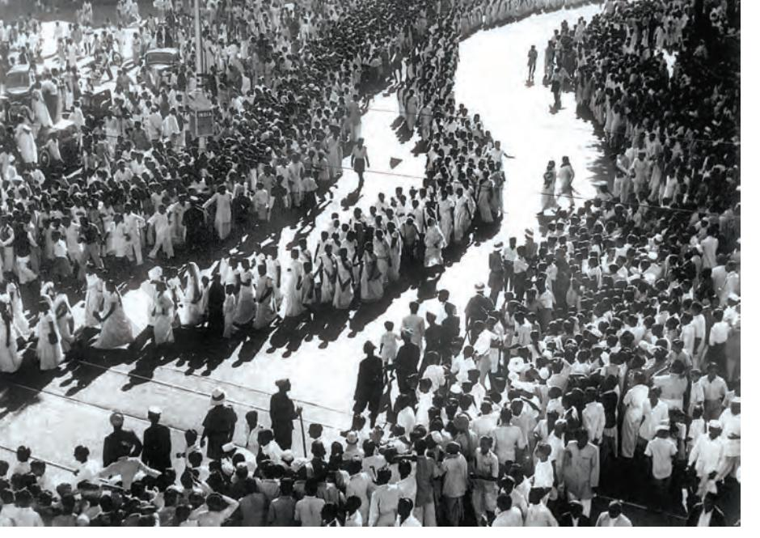

## **THEME ELEVEN**

# **Mahatma Gandhi and the Nationalist Movement** Civil Disobedience and Beyond

In the history of nationalism a single individual is often identified with the making of a nation. Thus, for example, we associate Garibaldi with the making of Italy, George Washington with the American War of Independence, and Ho Chi Minh with the struggle to free Vietnam from colonial rule. In the same manner, Mahatma Gandhi has been regarded as the 'Father' of the Indian nation.

 In so far as Gandhiji was the most influential and revered of all the leaders who participated in the freedom struggle, that characterisation is not misplaced. However, like Washington or Ho Chi-Minh, Mahatma Gandhi's political career was shaped and constrained by the society in which he lived. For individuals, even great ones, are made by history even as they make history.

 This chapter analyses Gandhiji's activities in India during the crucial period 1915-1948. It explores his interactions with different sections of the Indian society and the popular struggles that he inspired and led. It introduces the student to the different kinds of sources that historians use in reconstructing the career of a leader and of the social movements that he was associated with.

*Fig. 11.1 People gather on the banks of the Sabarmati River to hear Mahatma Gandhi speak before starting out on the Salt March in 1930*

### **1. A Leader Announces Himself**

In January 1915, Mohandas Karamchand Gandhi returned to his homeland after two decades of residence abroad. These years had been spent for the most part in South Africa, where he went as a lawyer, and in time became a leader of the Indian community in that territory. As the historian Chandran Devanesan has remarked, South Africa was "the making of the Mahatma". It was in South Africa that Mahatma Gandhi first forged the distinctive techniques of non-violent protest known as satyagraha, first promoted harmony between religions, and first alerted upper -caste Indians to their discriminatory treatment of low castes and women.

The India that Mahatma Gandhi came back to in 1915 was rather different from the one that he had left in 1893. Although still a colony of the British, it was far more active in a political sense. The Indian National Congress now had branches in most major cities and towns. Through the Swadeshi movement of 1905-07 it had greatly broadened its appeal among the middle classes. That movement had thrown up some towering leaders – among them Bal Gangadhar Tilak of Maharashtra, Bipin Chandra Pal of Bengal, and Lala Lajpat Rai of Punjab. The three were known as "Lal, Bal and Pal", the alliteration conveying the all-India character of their struggle, since their native provinces were

very distant from one another. Where these leaders advocated militant opposition to colonial rule, there was a group of "Moderates" who preferred a more gradual and persuasive approach. Among these Moderates was Gandhiji's acknowledged political mentor, Gopal Krishna Gokhale, as well as Mohammad Ali Jinnah, who, like Gandhiji, was a lawyer of Gujarati extraction trained in London.

On Gokhale's advice, Gandhiji spent a year travelling around British India, getting to know the land and its peoples. His first major public appearance was at the opening of the Banaras Hindu University (BHU) in February 1916. Among the invitees to

*Fig. 11.2 Mahatma Gandhi in Johannesburg, South Africa, February 1908*

this event were the princes and philanthropists whose donations had contributed to the founding of the BHU. Also present were important leaders of the Congress, such as Annie Besant. Compared to these dignitaries, Gandhiji was relatively unknown. He had been invited on account of his work in South Africa, rather than his status within India.

When his turn came to speak, Gandhiji charged the Indian elite with a lack of concern for the labouring poor. The opening of the BHU, he said, was "certainly a most gorgeous show". But he worried about the contrast between the "richly bedecked noblemen" present and "millions of the poor" Indians who were absent. Gandhiji told the privileged invitees that "there is no salvation for India unless you strip yourself of this jewellery and hold it in trust for your countrymen in India". "There can be no spirit of selfgovernment about us," he went on, "if we take away or allow others to take away from the peasants almost the whole of the results of their labour. Our salvation can only come through the farmer. Neither the lawyers, nor the doctors, nor the rich landlords are going to secure it."

The opening of the BHU was an occasion for celebration, marking as it did the opening of a nationalist university, sustained by Indian money and Indian initiative. But rather than adopt a tone of self-congratulation, Gandhiji chose instead to remind those present of the peasants and workers

> who constituted a majority of the Indian population, yet were unrepresented in the audience.

> Gandhiji's speech at Banaras in February 1916 was, at one level, merely a statement of fact – namely, that Indian nationalism was an elite phenomenon, a creation of lawyers and doctors and landlords. But, at another level, it was also a statement of intent – the first public announcement of Gandhiji's own desire to make Indian nationalism more properly

*Fig. 11.3 Mahatma Gandhi in Karachi, March 1916*

representative of the Indian people as a whole. In the last month of that year, Gandhiji was presented with an opportunity to put his precepts into practice. At the annual Congress, held in Lucknow in December 1916, he was approached by a peasant from Champaran in Bihar, who told him about the harsh treatment of peasants by British indigo planters.

## **2. The Making and Unmaking of Non-cooperation**

Mahatma Gandhi was to spend much of 1917 in Champaran, seeking to obtain for the peasants security of tenure as well as the freedom to cultivate the crops of their choice. The following year, 1918, Gandhiji was involved in two campaigns in his home state of Gujarat. First, he intervened in a labour dispute in Ahmedabad, demanding better working conditions for the textile mill workers. Then he joined peasants in Kheda in asking the state for the remission of taxes following the failure of their harvest.

These initiatives in Champaran, Ahmedabad and Kheda marked Gandhiji out as a nationalist with a deep sympathy for the poor. At the same time, these were all localised struggles. Then, in 1919, the colonial rulers delivered into Gandhiji's lap an issue from which he could construct a much wider movement. During the Great War of 1914-18, the British had instituted censorship of the press and permitted detention without trial. Now, on the recommendation of a committee chaired by Sir Sidney Rowlatt, these tough measures were continued. In response, Gandhiji called for a countrywide campaign against the "Rowlatt Act". In towns across North and West India, life came to a standstill, as shops shut down and schools closed in response to the *bandh* call. The protests were particularly intense in the Punjab, where many men had served on the British side in the War – expecting to be rewarded for their service. Instead they were given the Rowlatt Act. Gandhiji was detained while proceeding to the Punjab, even as prominent local Congressmen were arrested. The situation in the province grew progressively more tense, reaching a bloody climax in Amritsar in April 1919, when a British Brigadier ordered his troops to open fire on a nationalist meeting. More ‹ Discuss...

Find out more about the national movement in India before 1915 and see whether Mahatma Gandhi's comments are justified.

than four hundred people were killed in what is known as the Jallianwala Bagh massacre.

It was the Rowlatt satyagraha that made Gandhiji a truly *national* leader. Emboldened by its success, Gandhiji called for a campaign of "non-cooperation" with British rule. Indians who wished colonialism to end were asked to stop attending schools, colleges and law courts, and not pay taxes. In sum, they were asked to adhere to a "renunciation of (all) voluntary association with the (British) Government". If noncooperation was effectively carried out, said Gandhiji, India would win swaraj within a year. To further broaden the struggle he had joined hands with the Khilafat Movement that sought to restore the Caliphate, a symbol of Pan-Islamism which had recently been abolished by the Turkish ruler Kemal Attaturk.

#### 2.1 Knitting a popular movement

Gandhiji hoped that by coupling non-cooperation with Khilafat, India's two major religious communities, Hindus and Muslims, could collectively bring an end to colonial rule. These movements certainly unleashed a surge of popular action that was altogether unprecedented in colonial India.

Students stopped going to schools and colleges run by the government. Lawyers refused to attend court. The working class went on strike in many towns and cities: according to official figures, there were 396 strikes in 1921, involving 600,000 workers and a loss of seven million workdays. The countryside was seething with discontent too. Hill tribes in northern Andhra violated the forest laws. Farmers in Awadh did not pay taxes. Peasants in Kumaun refused to carry loads for colonial officials. These protest movements were sometimes carried out in defiance of the local nationalist leadership. Peasants, workers, and others interpreted and acted upon the call to "non-cooperate" with colonial rule in ways that best suited their interests, rather than conform to the dictates laid down from above.

"Non-cooperation," wrote Mahatma Gandhi's American biographer Louis Fischer, "became the name of an epoch in the life of India and of Gandhiji. Non-cooperation was negative enough to be peaceful but positive enough to be effective. It entailed denial, renunciation, and self-discipline. It was training for

### **What was the Khilafat Movement?**

The Khilafat Movement, (1919-1920) was a movement of Indian Muslims, led by Muhammad Ali and Shaukat Ali, that demanded the following: The Turkish Sultan or Khalifa must retain control over the Muslim sacred places in the erstwhile Ottoman empire; the *jazirat-ul-Arab* (Arabia, Syria, Iraq, Palestine) must remain under Muslim sovereignty; and the Khalifa must be left with sufficient territory to enable him to defend the Islamic faith. The Congress supported the movement and Mahatma Gandhi sought to conjoin it to the Non-cooperation Movement.

self-rule." As a consequence of the Non-Cooperation Movement the British Raj was shaken to its foundations for the first time since the Revolt of 1857. Then, in February 1922, a group of peasants attacked and torched a police station in the hamlet of Chauri Chaura, in the United Provinces (now, Uttar Pradesh and Uttaranchal). Several constables perished in the conflagration. This act of violence prompted Gandhiji to call off the movement altogether. "No provocation," he insisted, "can possibly justify (the) brutal

murder of men who had been rendered defenceless and who had virtually thrown themselves on the mercy of the mob."

During the Non-Cooperation Movement thousands of Indians were put in jail. Gandhiji himself was arrested in March 1922, and charged with sedition. The judge who presided over his trial, Justice C.N. Broomfield, made a remarkable speech while pronouncing his sentence. "It would be impossible to ignore the fact," remarked the judge, "that you are in a different category from any person I have ever tried or am likely to try. It would be impossible to ignore the fact that, in the eyes of millions of your countrymen, you are a great patriot and a leader. Even those who differ from you in politics look upon you as a man of high ideals and of even saintly life." Since Gandhiji had violated the law it was obligatory for the Bench to sentence him to six years' imprisonment, but, said Judge Broomfield, "If the course of events in India should make it possible for the Government to reduce the period and release you, no one will be better pleased than I".

#### 2.2 A people's leader

By 1922, Gandhiji had transformed Indian nationalism, thereby redeeming the promise he made in his BHU speech of February 1916. It was no longer a movement of professionals and intellectuals; now, hundreds of thousands of peasants, workers and artisans also participated in it. Many of them venerated Gandhiji, referring to him as their *Fig. 11.4 Non-cooperation Movement, July 1922* Foreign cloth being collected to be burnt in bonfires.

"Mahatma". They appreciated the fact that he dressed like them, lived like them, and spoke their language. Unlike other leaders he did not stand apart from the common folk, but empathised and even identified with them.

This identification was strikingly reflected in his dress: while other nationalist leaders dressed formally, wearing a Western suit or an Indian *bandgala*, Gandhiji went among the people in a simple *dhoti* or loincloth. Meanwhile, he spent part of each day working on the *charkha* (spinning wheel), and encouraged other nationalists to do likewise. The act of spinning allowed Gandhiji to break the boundaries that prevailed within the traditional caste system, between mental labour and manual labour.

In a fascinating study, the historian Shahid Amin has traced the image of Mahatma Gandhi among the peasants of eastern Uttar Pradesh, as conveyed by reports and rumours in the local press. When he travelled through the region in February 1921, Gandhiji was received by adoring crowds everywhere.

*Source 1*

### *Charkha*

Mahatma Gandhi was profoundly critical of the modern age in which machines enslaved humans and displaced labour. He saw the *charkha* as a symbol of a human society that would not glorify machines and technology. The spinning wheel, moreover, could provide the poor with supplementary income and make them self-reliant.

> What I object to, is the craze for machinery as such. The craze is for what they call laboursaving machinery. Men go on "saving labour", till thousands are without work and thrown on the open streets to die of starvation. I want to save time and labour, not for a fraction of mankind, but for all; I want the concentration of wealth, not in the hands of few, but in the hands of all.

> > *YOUNG INDIA,* I3 NOVEMBER 1924

Khaddar does not seek to destroy all machinery but it does regulate its use and check its weedy growth. It uses machinery for the service of the poorest in their own cottages. The wheel is itself an exquisite piece of machinery.

*Fig. 11.5 YOUNG INDIA,* 17 MARCH 1927

*Fig. 11.5*

*Mahatma Gandhi with the* charkha *has become the most abiding image of Indian nationalism.* In 1921, during a tour of South India, Gandhiji shaved his head and began wearing a loincloth in order to identify with the poor. His new appearance also came to symbolise asceticism and abstinence – qualities he celebrated in opposition to the consumerist culture of the modern world.

This is how a Hindi newspaper in Gorakhpur reported the atmosphere during his speeches:

> At Bhatni Gandhiji addressed the local public and then the train started for Gorakhpur. There were not less than 15,000 to 20,000 people at Nunkhar, Deoria, Gauri Bazar, Chauri Chaura and Kusmhi (stations) … Mahatmaji was very pleased to witness the scene at Kusmhi, as despite the fact that the station is in the middle of a jungle there were not less than 10,000 people here. Some, overcome with their love, were seen to be crying. At Deoria people wanted to give *bhent* (donations) to Gandhiji, but he asked them to give these at Gorakhpur. But at Chauri Chaura one Marwari gentleman managed to hand over something to him. Then there was no stopping. A sheet was spread and currency notes and coins started raining. It was a sight … Outside the Gorakhpur station the Mahatma was stood on a high carriage and people had a good darshan of him for a couple of minutes.

Wherever Gandhiji went, rumours spread of his miraculous powers. In some places it was said that he had been sent by the King to redress the grievances of the farmers, and that he had the power to overrule all local officials. In other places it was claimed that Gandhiji's power was superior to that of the English monarch, and that with his arrival the colonial rulers would flee the district. There were also stories reporting dire consequences for those who opposed him; rumours spread of how villagers who criticised Gandhiji found their houses mysteriously falling apart or their crops failing.

Known variously as "Gandhi baba", "Gandhi Maharaj", or simply as "Mahatma", Gandhiji appeared to the Indian peasant as a saviour, who would rescue them from high taxes and oppressive officials and restore dignity and autonomy to their lives. Gandhiji's appeal among the poor, and peasants in particular, was enhanced by his ascetic lifestyle, and by his shrewd use of symbols such as the *dhoti* and the *charkha*. Mahatma Gandhi was by caste a merchant, and by profession a lawyer; but his simple lifestyle and love of working with his hands allowed him to empathise more fully with the labouring poor and for them, in turn, to empathise with him. Where most

#### *Source 2*

### **The miraculous and the unbelievable**

Local newspapers in the United Provinces recorded many of the rumours that circulated at that time. There were rumours that every person who wanted to test the power of the Mahatma had been surprised:

> 1. Sikandar Sahu from a village in Basti said on 15 February that he would believe in the Mahatmaji when the *karah* (boiling pan) full of sugar cane juice in his *karkhana* (where *gur* was produced) split into two. Immediately the *karah* actually split into two from the middle.

> 2. A cultivator in Azamgarh said that he would believe in the Mahatmaji's authenticity if sesamum sprouted on his field planted with wheat. Next day all the wheat in that field became sesamum.

> > *contd*

*Source 2 (contd)*

There were rumours that those who opposed Mahatma Gandhi invariably met with some tragedy.

1. A gentleman from Gorakhpur city questioned the need to ply the *charkha*. His house caught fire.

2. In April 1921 some people were gambling in a village of Uttar Pradesh. Someone told them to stop. Only one from amongst the group refused to stop and abused Gandhiji. The next day his goat was bitten by four of his own dogs.

3. In a village in Gorakhpur, the peasants resolved to give up drinking liquor. One person did not keep his promise. As soon as he started for the liquor shop brickbats started to rain in his path. When he spoke the name of Gandhiji the brickbats stopped flying.

FROM SHAHID AMIN, "GANDHI AS MAHATMA", *SUBALTERN STUDIES III*, OXFORD UNIVERSITY PRESS, DELHI.

‹ You have read about rumours in Chapter 10 and seen that the circulation of rumours tells us about the structure of the belief of a time: they tell us about the mind of the people who believe in the rumours and the circumstances that make this belief possible. What do you think these rumours about Gandhiji reflect?

other politicians talked down to them, Gandhiji appeared not just to look like them, but to understand them and relate to their lives.

While Mahatma Gandhi's mass appeal was undoubtedly genuine – and in the context of Indian politics, without precedent – it must also be stressed that his success in broadening the basis of nationalism was based on careful organisation. New branches of the Congress were set up in various parts of India. A series of "Praja Mandals" were established to promote the nationalist creed in the princely states. Gandhiji encouraged the communication of the nationalist message in the mother tongue, rather than in the language of the rulers, English. Thus the provincial committees of the Congress were based on linguistic regions, rather than on the artificial boundaries of British India. In these different ways nationalism was taken to the farthest corners of the country and embraced by social groups previously untouched by it.

By now, among the supporters of the Congress were some very prosperous businessmen and industrialists. Indian entrepreneurs were quick to recognise that, in a free India, the favours enjoyed by their British competitors would come to an end. Some of these entrepreneurs, such as G.D. Birla, supported the national movement openly; others did so tacitly. Thus, among Gandhiji's admirers were both poor peasants and rich industrialists, although the reasons why peasants followed Gandhiji were somewhat different from, and perhaps opposed to, the reasons of the industrialists.

While Mahatma Gandhi's own role was vital, the growth of what we might call "Gandhian nationalism" also depended to a very substantial extent on his followers. Between 1917 and 1922, a group of highly talented Indians attached themselves to Gandhiji. They included Mahadev Desai, Vallabh Bhai Patel, J.B. Kripalani, Subhas Chandra Bose, Abul Kalam Azad, Jawaharlal Nehru, Sarojini Naidu, Govind Ballabh Pant and C. Rajagopalachari. Notably, these close associates of Gandhiji came from different regions as well as different religious traditions. In turn, they inspired countless other Indians to join the Congress and work for it.

Mahatma Gandhi was released from prison in February 1924, and now chose to devote his attention to the promotion of home-spun cloth (*khadi*), and

the abolition of untouchability. For, Gandhiji was as much a social reformer as he was a politician. He believed that in order to be worthy of freedom, Indians had to get rid of social evils such as child marriage and untouchability. Indians of one faith had also to cultivate a genuine tolerance for Indians of another – hence his emphasis on Hindu-Muslim harmony. Meanwhile, on the economic front Indians had to learn to become self-reliant – hence his stress on the significance of wearing *khadi* rather than mill-made cloth imported from overseas.

## **3. The Salt Satyagraha A Case Study**

For several years after the Non-cooperation Movement ended, Mahatma Gandhi focused on his social reform work. In 1928, however, he began to think of re-entering politics. That year there was an all-India campaign in opposition to the all-White Simon Commission, sent from England to enquire into conditions in the colony. Gandhiji did not himself participate in this movement, although he gave it his blessings, as he also did to a peasant satyagraha in Bardoli in the same year.

In the end of December 1929, the Congress held its annual session in the city of Lahore. The meeting was significant for two things: the election of Jawaharlal Nehru as President, signifying the passing of the baton of leadership to the younger generation; and the proclamation of commitment to "Purna Swaraj", or complete independence. Now the pace of politics picked up once more. On 26 January 1930, "Independence Day" was observed, with the national flag being hoisted in different venues, and patriotic songs being sung. Gandhiji himself issued precise instructions as to how the day should be observed. "It would be good," he said, "if the declaration [of Independence] is made by whole villages, whole cities even ... It would be well if all the meetings were held at the identical minute in all the places."

Gandhiji suggested that the time of the meeting be advertised in the traditional way, by the beating of drums. The celebrations would begin with the hoisting of the national flag. The rest of the day would be spent "in doing some constructive work, whether it is spinning, or service of 'untouchables', or reunion of Hindus and Mussalmans, or prohibition work, or even all these ‹ Discuss...

What was Non-cooperation? Find out about the variety of ways in which different social groups participated in the movement.

together, which is not impossible". Participants would take a pledge affirming that it was "the inalienable right of the Indian people, as of any other people, to have freedom and to enjoy the fruits of their toil", and that "if any government deprives a people of these rights and oppresses them, the people have a further right to alter it or abolish it".

### 3.1 Dandi

Soon after the observance of this "Independence Day", Mahatma Gandhi announced that he would lead a march to break one of the most widely disliked laws in British India, which gave the state a monopoly in the manufacture and sale of salt. His picking on the salt monopoly was another illustration of Gandhiji's tactical wisdom. For in every Indian household, salt was indispensable; yet people were forbidden from making salt even for domestic use, compelling them to buy it from shops at a high price. The state monopoly over salt was deeply unpopular; by making it his target, Gandhiji hoped to mobilise a wider discontent against

British rule. *Fig. 11.6 On the Dandi March, March 1930*

Where most Indians understood the significance of Gandhiji's challenge, the British Raj apparently did not. Although Gandhiji had given advance notice of his "Salt March" to the Viceroy Lord Irwin, Irwin failed to grasp the significance of the action. On 12 March 1930, Gandhiji began walking from his ashram at Sabarmati towards the ocean. He reached his destination three weeks later, making a fistful of salt as he did and thereby making himself a criminal in the eyes of the law. Meanwhile, parallel salt marches were being conducted in other parts of the country.

*Fig. 11.7 Satyagrahis picking up natural salt at the end of the Dandi March, 6 April 1930*

*Source 3*

### **Why the Salt Satyagraha?**

Why was salt the symbol of protest? This is what Mahatma Gandhi wrote:

The volume of information being gained daily shows how wickedly the salt tax has been designed. In order to prevent the use of salt that has not paid the tax which is at times even fourteen times its value, the Government destroys the salt it cannot sell profitably. Thus it taxes the nation's vital necessity; it prevents the public from manufacturing it and destroys what nature manufactures without effort. No adjective is strong enough for characterising this wicked dog-in-the-manger policy. From various sources I hear tales of such wanton destruction of the nation's property in all parts of India. Maunds if not tons of salt are said to be destroyed on the Konkan coast. The same tale comes from Dandi. Wherever there is likelihood of natural salt being taken away by the people living in the neighbourhood of such areas for their personal use, salt officers are posted for the sole purpose of carrying on destruction. Thus valuable national property is destroyed at national expense and salt taken out of the mouths of the people.

The salt monopoly is thus a fourfold curse. It deprives the people of a valuable easy village industry, involves wanton destruction of property that nature produces in abundance, the destruction itself means more national expenditure, and fourthly, to crown this folly, an unheard-of tax of more than 1,000 per cent is exacted from a starving people.

This tax has remained so long because of the apathy of the general public. Now that it is sufficiently roused, the tax has to go. How soon it will be abolished depends upon the strength the people.

*THE COLLECTED WORKS OF MAHATMA GANDHI (CWMG),* VOL. 49

‹ Why was salt destroyed by the colonial government? Why did Mahatma Gandhi consider the salt tax more oppressive than other taxes?

institutions. As in 1920-22, now too Gandhiji's call had encouraged Indians of all classes to make manifest their own discontent with colonial rule. The rulers responded by detaining the dissenters. In the wake of the Salt March, nearly 60,000 Indians were arrested, among them, of course, Gandhiji himself.

The progress of Gandhiji's march to the seashore can be traced from the secret reports filed by the police officials deputed to monitor his movements. These reproduce the speeches he gave at the villages en route, in which he called upon local officials to renounce government employment and join the freedom struggle. In one village,

Wasna, Gandhiji told the upper castes that "if you are out for Swaraj you must serve untouchables. You won't get Swaraj merely by the repeal of the salt taxes or other taxes. For Swaraj you must make amends for the wrongs which you did to the untouchables. For Swaraj, Hindus, Muslims, Parsis and Sikhs will have to unite. These are the steps towards Swaraj." The police spies reported that Gandhiji's meetings were very well attended, by villagers of all castes, and by women as well as men. They observed that thousands of volunteers were flocking to the nationalist cause. Among them were many officials, who had resigned from their posts with the colonial government. Writing to the government, the District Superintendent of Police remarked, "Mr Gandhi appeared calm and collected. He is gathering more strength as he proceeds."

The progress of the Salt March can also be traced from another source: the American newsmagazine, *Time*. This, to begin with, scorned at Gandhiji's looks, writing with disdain of his "spindly frame" and his "spidery loins". Thus in its first report on the march, *Time* was deeply sceptical of the Salt March reaching its destination. It claimed that Gandhiji "sank to the ground" at the end of the second day's walking; the magazine did not believe that "the emaciated saint would be physically able to go much further". But within a week it had changed its mind. The massive popular following that the march had garnered, wrote *Time*, had made the British rulers "desperately anxious". Gandhiji himself they now

*Fig. 11.8 After Mahatma Gandhi's release from prison in January 1931, Congress leaders met at Allahabad to plan the future course of action.*

You can see (from right to left) Jawaharlal Nehru, Jamnalal Bajaj, Subhas Chandra Bose, Gandhiji, Mahadev Desai (in front), Sardar Vallabh Bhai Patel*.*

*Source 5*

**The problem with separate electorates**

At the Round Table Conference Mahatma Gandhi stated his arguments against separate electorates for the Depressed Classes:

> Separate electorates to the "Untouchables" will ensure them bondage in perpetuity … Do you want the "Untouchables" to remain "Untouchables" for ever? Well, the separate electorates would perpetuate the stigma. What is needed is destruction of "Untouchability", and when you have done it, the barsinister, which has been imposed by an insolent "superior" class upon an "inferior" class will be destroyed. When you have destroyed the barsinister to whom will you give the separate electorates?

saluted as a "Saint" and "Statesman", who was using "Christian acts as a weapon against men with Christian beliefs".

### 3.2 Dialogues

The Salt March was notable for at least three reasons. First, it was this event that first brought Mahatma Gandhi to world attention. The march was widely covered by the European and American press. Second, it was the first nationalist activity in which women participated in large numbers. The socialist activist Kamaladevi Chattopadhyay had persuaded Gandhiji not to restrict the protests to men alone. Kamaladevi was herself one of numerous women who courted arrest by breaking the salt or liquor laws. Third, and perhaps most significant, it was the Salt March which forced upon the British the realisation that their Raj would not last forever, and that they would have to devolve some power to the Indians.

To that end, the British government convened a series of "Round Table Conferences" in London. The first meeting was held in November 1930, but without the pre-eminent political leader in India, thus rendering it an exercise in futility. Gandhiji was released from jail in January 1931 and the following month had several long meetings with the Viceroy. These culminated in what was called the "Gandhi-Irwin Pact', by the terms of which civil disobedience would be called off, all prisoners released, and salt manufacture allowed along the coast. The pact was criticised by radical nationalists, for Gandhiji was unable to obtain from the Viceroy a commitment to political independence for Indians; he could obtain merely an assurance of talks towards that possible end.

A second Round Table Conference was held in London in the latter part of 1931. Here, Gandhiji represented the Congress. However, his claims that his party represented all of India came under challenge from three parties: from the Muslim League, which claimed to stand for the interests of the Muslim minority; from the Princes, who claimed that the Congress had no stake in their territories; and from the brilliant lawyer and thinker B.R. Ambedkar, who argued that Gandhiji and the Congress did not really represent the lowest castes.

The Conference in London was inconclusive, so Gandhiji returned to India and resumed civil disobedience. The new Viceroy, Lord Willingdon, was deeply unsympathetic to the Indian leader. In a private

*Fig. 11.9*

*At the Second Round Table Conference, London, November 1931* Mahatma Gandhi opposed the demand for separate electorates for "lower castes". He believed that this would prevent their integration into mainstream society and permanently segregate them from other caste Hindus.

letter to his sister, Willingdon wrote: "It's a beautiful world if it wasn't for Gandhi ... At the bottom of every move he makes which he always says is inspired by God, one discovers the political manouevre. I see the American Press is saying what a wonderful man he is ... But the fact is that we live in the midst of very unpractical, mystical, and superstitious folk who look upon Gandhi as something holy, ..."

In 1935, however, a new Government of India Act promised some form of representative government. Two years later, in an election held on the basis of a restricted franchise, the Congress won a comprehensive victory. Now eight out of 11 provinces had a Congress "Prime Minister", working under the supervision of a British Governor.

In September 1939, two years after the Congress ministries assumed office, the Second World War broke out. Mahatma Gandhi and Jawaharlal Nehru had both been strongly critical of Hitler and the Nazis. Accordingly, they promised Congress support to the war effort if the British, in return, promised to grant India independence once hostilities ended.

*Source 6*

### **Ambedkar on separate electorates**

In response to Mahatma Gandhi's opposition to the demand for separate electorates for the Depressed Classes, Ambedkar wrote:

> Here is a class which is undoubtedly not in a position to sustain itself in the struggle for existence. The religion, to which they are tied, instead of providing them an honourable place, brands them as lepers, not fit for ordinary intercourse. Economically, it is a class entirely dependent upon the high-caste Hindus for earning its daily bread with no independent way of living open to it. Nor are all ways closed by reason of the social prejudices of the Hindus but there is a definite attempt all through our Hindu Society to bolt every possible door so as not to allow the Depressed Classes any opportunity to rise in the scale of life.

> In these circumstances, it would be granted by all fairminded persons that as the only path for a community so handicapped to succeed in the struggle for life against organised tyranny, some share of political power in order that it may protect itself is a paramount necessity …

FROM DR BABASAHEB AMBEDKAR, "WHAT CONGRESS AND GANDHI HAVE DONE TO THE UNTOUCHABLES", *WRITINGS AND SPEECHES*, VOL. 9, P. 312

*Fig. 11.10*

*Mahatma Gandhi and Rajendra Prasad on their way to a meeting with the Viceroy, Lord Linlithgow, 13 October 1939* In the meeting the nature of India's involvement in the War was discussed. When negotiations with the Viceroy broke down, the Congress ministries resigned.

*Fig. 11.11 Mahatma Gandhi with Stafford Cripps, March 1942*

The offer was refused. In protest, the Congress ministries resigned in October 1939. Through 1940 and 1941, the Congress organised a series of individual satyagrahas to pressure the rulers to promise freedom once the war had ended.

Meanwhile, in March 1940, the Muslim League passed a resolution demanding a measure of autonomy for the Muslim-majority areas of the subcontinent. The political landscape was now becoming complicated: it was no longer Indians versus the British; rather, it had become a threeway struggle between the Congress, the Muslim League, and the British. At this time Britain had an all-party government, whose Labour members were sympathetic to Indian aspirations, but whose Conservative Prime Minister, Winston Churchill, was a diehard imperialist who insisted that he had not been appointed the King's First Minister in order to preside over the liquidation of the British Empire. In the spring of 1942, Churchill was persuaded to send one of his ministers, Sir Stafford Cripps, to India to try and forge a compromise with Gandhiji and the Congress. Talks broke down, however, after the Congress insisted that if it was to help the British defend India from the Axis powers, then the Viceroy had first to appoint an Indian as the Defence Member of his Executive Council.

## ‹ Discuss...

Read Sources 5 and 6. Write an imaginary dialogue between Ambedkar and Mahatma Gandhi on the issue of separate electorates for the Depressed Classes.

### **4. Quit India**

After the failure of the Cripps Mission, Mahatma Gandhi decided to launch his third major movement against British rule. This was the "Quit India" campaign, which began in August 1942. Although Gandhiji was jailed at once, younger activists organised strikes and acts of sabotage all over the country. Particularly active in the underground resistance were socialist members of the Congress, such as Jayaprakash Narayan. In several districts, such as Satara in the west and Medinipur in the east, "independent" governments were proclaimed. The British responded with much force, yet it took more than a year to suppress the rebellion.

"Quit India" was genuinely a *mass* movement, bringing into its ambit hundreds of thousands of ordinary Indians. It especially energised the young who, in very large numbers, left their colleges to go to jail. However, while the Congress leaders languished in jail, Jinnah and his colleagues in the Muslim League worked patiently at expanding their influence. It was in these years that the League began to make a mark in the Punjab and Sind, provinces where it had previously had scarcely any presence.

In June 1944, with the end of the war in sight, Gandhiji was released from prison. Later that year

### **Satara, 1943**

From the late nineteenth century, a non-Brahman movement, which opposed the caste system and landlordism, had developed in Maharashtra. This movement established links with the national movement by the 1930s.

In 1943, some of the younger leaders in the Satara district of Maharashtra set up a parallel government *( prati sarkar)*, with volunteer corps *(seba dals)* and village units *(tufan dals ).* They ran people's courts and organised constructive work. Dominated by *kunbi* peasants and supported by dalits, the Satara *prati sarkar* functioned till the elections of 1946, despite government repression and, in the later stages, Congress disapproval.

*Fig. 11.12 Women's procession in Bombay during the Quit India Movement*

he held a series of meetings with Jinnah, seeking to bridge the gap between the Congress and the League. In 1945, a Labour government came to power in Britain and committed itself to granting independence to India. Meanwhile, back in India, the Viceroy, Lord Wavell, brought the Congress and the League together for a series of talks.

Early in 1946 fresh elections were held to the provincial legislatures. The Congress swept the "General" category, but in the seats specifically reserved for Muslims the League won an overwhelming majority. The political polarisation was complete. A Cabinet Mission sent in the summer of 1946 failed to get the Congress and the League to agree on a federal system that would keep India together while allowing the provinces a degree of autonomy. After the talks broke down, Jinnah called for a "Direct Action Day" to press the League's demand for Pakistan. On the designated day, 16 August 1946, bloody riots broke out in Calcutta. The violence spread to rural Bengal, then to Bihar, and then across the country to the United Provinces and the Punjab. In some places, Muslims were the main sufferers, in other places, Hindus.

In February 1947, Wavell was replaced as Viceroy by Lord Mountbatten. Mountbatten called onelast round of talks, but when these too

proved inconclusive he announced that British India would be freed, but also divided. The formal transfer of power was fixed for 15 August. When that day came, it was celebrated with gusto in different parts of India. In Delhi, there was "prolonged applause" when the President of the Constituent Assembly began the meeting by invoking the Father of the Nation – Mohandas Karamchand Gandhi. Outside the Assembly, the crowds shouted "Mahatma Gandhi ki jai".

*Mahatma Gandhi conferring with Jawaharlal Nehru (on his right) and Sardar Vallabh Bhai Patel (on his left)* Nehru and Patel represented two distinct political tendencies within the Congress – the socialist and the conservative. Mahatma Gandhi had to often mediate between these groups.

### **5. The Last Heroic Days**

As it happened, Mahatma Gandhi was not present at the festivities in the capital on 15 August 1947. He was in Calcutta, but he did not attend any function or hoist a flag there either. Gandhiji marked the day with a 24-hour fast. The freedom he had struggled so long for had come at an unacceptable price, with a nation divided and Hindus and Muslims at each other's throats.

Through September and October, writes his biographer D.G. Tendulkar, Gandhiji "went round hospitals and refugee camps giving consolation to distressed people". He "appealed to the Sikhs, the Hindus and the Muslims to forget the past and not to dwell on their sufferings but to extend the right hand of fellowship to each other, and to determine to live in peace ..."

At the initiative of Gandhiji and Nehru, the Congress now passed a resolution on "the rights of minorities". The party had never accepted the "two-nation theory": forced against its will to accept Partition, it still believed that "India is a land of many religions and many races, and must remain so". Whatever be the situation in Pakistan, India would be "a democratic secular State where all citizens enjoy full rights and are equally entitled to the protection of the State, irrespective of the religion to which they belong". The Congress wished to "assure the minorities in India that it will continue to protect, to the best of its ability, their citizen rights against aggression".

Many scholars have written of the months after Independence as being Gandhiji's "finest hour". After

working to bring peace to Bengal, Gandhiji now shifted to Delhi, from where he hoped to move on to the riottorn districts of Punjab. While in the capital, his meetings were disrupted by refugees who objected to readings from the Koran, or shouted slogans asking why he did not speak of the sufferings of those Hindus and Sikhs still living in Pakistan. In fact, as D.G. Tendulkar writes, Gandhiji "was equally concerned with the sufferings of the minority community in Pakistan. He would have liked to be able to go to their succour. But with *Fig. 11.14 On the way to a riot-torn village,1947*

*Fig. 11.15 The death of the Mahatma, a popular print* In popular representations, Mahatma Gandhi was deified, and shown as the unifying force within the national movement. Here you can see Jawaharlal Nehru and Sardar Patel, representing two strands within the Congress, standing on two sides of Gandhiji's pyre. Blessing them both from a heavenly realm, is Mahatma Gandhi, at the centre. what face could he now go there, when he could not guarantee full redress to the Muslims in Delhi?"

There was an attempt on Gandhiji's life on 20 January 1948, but he carried on undaunted. On 26 January, he spoke at his prayer meeting of how that day had been celebrated in the past as Independence Day. Now freedom had come, but its first few months had been deeply disillusioning. However, he trusted that "the worst is over", that Indians would henceforth work collectively for the "equality of all classes and creeds, never the domination and superiority of the major community over a minor, however insignificant it may be in numbers or influence". He also permitted himself the hope "that though geographically and politically India is divided into two, at heart we shall ever be friends and brothers helping and respecting one another and be one for the outside world".

Gandhiji had fought a lifelong battle for a free and united India; and yet, when the country was divided, he urged that the two parts respect and befriend one another.

Other Indians were less forgiving. At his daily prayer meeting on the evening of 30 January, Gandhiji was shot dead by a young man. The assassin, who surrendered afterwards, was Nathuram Godse.

Gandhiji's death led to an extraordinary outpouring of grief, with rich tributes being paid to him from across the political spectrum in India, and moving appreciations coming from such international figures as George Orwell and Albert Einstein. *Time* magazine, which had once mocked Gandhiji's physical size and seemingly non-rational ideas, now compared his martyrdom to that of Abraham Lincoln: it was a bigoted American who had killed Lincoln for believing that human beings were equal regardless of their race or skin colour; and it was a bigoted Hindu who had killed Gandhiji for believing that friendship was possible, indeed necessary, between Indians of different faiths. In this respect, as *Time* wrote, "The world knew that it had, in a sense too deep, too simple for the world to understand, connived at his (Gandhiji's) death as it had connived at Lincoln's."

### **6. Knowing Gandhi**

There are many different kinds of sources from which we can reconstruct the political career of Gandhiji and the history of the nationalist movement.

### 6.1 Public voice and private scripts

One important source is the writings and speeches of Mahatma Gandhi and his contemporaries, including both his associates and his political adversaries. Within these writings we need to distinguish between those that were meant for the public and those that were not. Speeches, for instance, allow us to hear the public voice of an individual, while private letters give us a glimpse of his or her private thoughts. In letters we see people expressing their anger and pain, their dismay and anxiety, their hopes and frustrations in ways in which they may not express themselves in public statements. But we must remember that this private-public distinction often breaks down. Many letters are written to individuals, and are therefore personal, but they are also meant for the public. The language of the letters is often shaped by the awareness that they may one day be published. Conversely, the fear that a letter may get into print often prevents people from expressing their opinion freely in personal letters. Mahatma Gandhi regularly published in his journal, *Harijan*, letters that others wrote to him. Nehru edited a collection of letters written to him during the national movement and published *A Bunch of Old Letters*.

*Source 7*

### **One event through letters**

In the 1920s, Jawaharlal Nehru was increasingly influenced by socialism, and he returned from Europe in 1928 deeply impressed with the Soviet Union. As he began working closely with the socialists (Jayaprakash Narayan, Narendra Dev, N.G. Ranga and others), a rift developed between the socialists and the conservatives within the Congress. After becoming the Congress President in 1936, Nehru spoke passionately against fascism, and upheld the demands of workers and peasants.

Worried by Nehru's socialist rhetoric, the conservatives, led by Rajendra Prasad and Sardar Patel, threatened to resign from the Working Committee, and some prominent industrialists in Bombay issued a statement attacking Nehru. Both Prasad and Nehru turned to Mahatma Gandhi and met him at his ashram at Wardha. The latter acted as the mediator, as he often did, restraining Nehru's radicalism and persuading Prasad and others to see the significance of Nehru's leadership.

In *A Bunch of Old Letters*, 1958, Nehru reprinted many of the letters that were exchanged at the time.

Read the extracts in the following pages.

#### *Source 7 (contd)*

### **From** *A Bunch of Old Letters*

#### *My dear Jawaharlalji,*

#### *Wardha, July 1, 1936*

Since we parted yesterday we have had a long conversation with Mahatmaji and a prolonged consultation among ourselves. We understand that you have felt much hurt by the course of action taken by us and particularly the tone of our letter has caused you much pain. It was never our intention either to embarrass you or to hurt you and if you had suggested or indictated that it hurt you we would have without the least hesitation amended or altered the letter. But we have decided to withdraw it and our resignation on a reconsideration of the whole situation.

We have felt that in all your utterances as published in the Press you have been speaking not so much on the general Congress programme as on a topic which has not been accepted by the Congress and in doing so you have been acting more as the mouthpiece of the minority of our colleagues on the Working Committee as also on the Congress than the mouthpiece of the majority which we expected you as Congress President to do.

There is regular continuous campaign against us treating us as persons whose time is over, who represent and stand for ideas that are worn out and that have no present value, who are only obstructing the progress of the country and who deserve to be cast out of the positions which they undeservedly hold … we have felt that a great injustice has been and is being done to us by others, and we are not receiving the protection we are entitled from you as our colleague and as our President …

> *Yours sincerely Rajendra Prasad*

#### *My Dear Bapu,*

#### *Allahabad, July 5, 1936*

I arrived here last night. Ever since I left Wardha I have been feeling weak in body and troubled in mind. … Since my return from Europe, I found that meetings of the Working Committee exhaust me greatly; they have a devitalising effect on me and I have almost the feeling of being older in years after every fresh experience …

I am grateful to you for all the trouble you took in smoothing over matters and in helping to avoid a crisis.

I read again Rajendra Babu's letter to me (the second one) and his formidable indictment of me ...

For however tenderly the fact may be stated, it amounts to this that I am an intolerable nuisance and the very qualities I possess – a measure of ability, energy, earnestness, some personality which has a vague appeal – become dangerous for they are harnessed to the wrong chariot (socialism). The conclusion from all this is obvious.

I have written at length, both in my book and subsequently, about my present ideas. There is no lack of material for me to be judged. Those views are not casual. They are part of me, and though I might change them or vary them in future, so long as I hold them I must give expression to them. Because I attached importance to a larger unity I tried to express them in the mildest way possible and more as an invitation to thought than as fixed conclusions. I saw no conflict in this approach and in anything that the Congress was doing. So far as the elections were concerned I felt that my approach was a definite asset to us as it enthused the masses. But my approach, mild and vague as it was, is considered dangerous and harmful by my colleagues. I was even told that my laying stress always on the poverty and unemployment in India was unwise, or at any rate the way I did it was wrong …

You told me that you intended issuing some kind of a statement. I shall welcome this for I believe in every viewpoint being placed before the country.

> *Yours affectionately Jawaharlal*

*Source 7 (contd)*

*Segaon, July 15, 1936*

#### *Dear Jawaharlal,*

Your letter is touching. You feel the most injured party. The fact is that your colleagues have lacked your courage and frankness. The result has been disastrous. I have always pleaded with them to speak to you freely and fearlessly. But having lacked the courage, whenever they have spoken they have done it clumsily and you have felt irritated. I tell you they have dreaded you, because of your irritability and impatience with them. They have chafed under your rebukes and magisterial manner and above all your arrogation of what has appeared to them your infallibility and superior knowledge. They feel you have treated them with scant courtesy and never defended them from socialist ridicule and even misrepresentation.

I have looked at the whole affair as a tragi-comedy. I would therefore like you to look at the whole thing in a lighter vein.

I suggested your name for the crown of thorns (Presidentship of the Congress). Keep it on, though the head be bruised. Resume your humour at the committee meetings. That is your most usual role, not that of care-worn, irritable man ready to burst on the slightest occasion.

How I wish you could telegraph me that on finishing my letter you felt as merry as you were on that new year's day in Lahore when you were reported to have danced around the tricolour flag.

You must give your throat a chance.

*Love Bapu*

### ‹

(a) What do the letters tell us about the way Congress ideals developed over time? (b) What do they reveal about the role of Mahatma Gandhi within the national movement? (c) Do such letters give us any special insight into the working of the Congress, and into the nature of the national movement?

#### 6.2 Framing a picture

Autobiographies similarly give us an account of the past that is often rich in human detail. But here again we have to be careful of the way we read and interpret autobiographies. We need to remember that they are retrospective accounts written very often from memory. They tell us what the author could recollect, what he or she saw as important, or was keen on recounting, or how a person wanted his or her life to be viewed by others. Writing an autobiography is a way of framing a picture of yourself. So in reading these accounts we have to try and see what the author does not tell us; we need to understand the reasons for that silence – those wilful or unwitting acts of forgetting.

#### 6.3 Through police eyes

Another vital source is government records, for the colonial rulers kept close tabs on those they regarded as critical of the government. The letters and reports written by policemen and other officials were secret at the time; but now can be accessed in archives.

Let us look at one such source: the fortnightly reports that were prepared by the Home Department from the early twentieth century. These reports were based on police information from the localities, but often expressed what the higher officials saw, or wanted to believe. While noticing the possibility of sedition and rebellion, they liked to assure themselves that these fears were unwarranted.

If you see the Fortnightly Reports for the period of the Salt March you will notice that the Home Department was unwilling to accept that Mahatma Gandhi's actions had evoked any enthusiastic response from the masses. The march was seen as a drama, an antic, a desperate effort to mobilise people who were unwilling to rise against the British and were busy with their daily schedules, happy under the Raj.

*Fig. 11.16 Police clash with Congress volunteers in Bombay during the Civil Disobedience Movement.*

‹ Can you see any conflict between this image and what was reported in the Fortnightly Reports of the police?

#### *Source 8*

### **Fortnightly Reports of the Home Department** *(Confidential)*

#### **FOR THE FIRST HALF OF MARCH 1930**

The rapid political developments in Gujarat are being closely watched here. To what extent and in what directions they will affect political condition in this province, it is difficult to surmise at present. The peasantry is for the moment engaged in harvesting a good rabi; students are pre-occupied with their impending examinations.

#### **Central Provinces and Berar**

The arrest of Mr. Vallabh Bhai Patel caused little excitement, except in Congress circles, but a meeting organised by the Nagpur Nagar Congress Committee to congratulate Gandhi on the start of his march was attended by a crowd of over 3000 people at Nagpur.

#### **Bengal**

The outstanding event of the past fortnight has been the start of Gandhi's campaign of civil disobedience. Mr. J.M. Sengupta has formed an All-Bengal Civil Disobedience Council, and the Bengal Provincial Congress Committee has formed an All Bengal Council of Disobedience. But beyond forming councils no active steps have yet been taken in the matter of civil disobedience in Bengal.

The reports from the districts show that the meetings that have been held excite little or no interest and leave no profound impression on the general population. It is noticeable, however, that ladies are attending these meetings in increasing numbers.

#### **Bihar and Orissa**

There is still little to report regarding Congress activity. There is a good deal of talk about a campaign to withhold payment of the chaukidari tax, but no area has yet been selected for experiment. The arrest of Gandhi is being foretold freely but it seems quite possible that nonfulfilment of the forecast is upsetting plans.

#### **Madras**

The opening of Gandhi's civil disobedience campaign has completely overshadowed all other issues. General opinion inclines to regard his march as theatrical and his programme as impracticable, but as he is held in such personal reverence by the Hindu public generally, the possibility of arrest which he seems deliberately to be courting and its effect on the political situation are viewed with considerable misgiving.

The 12th of March was celebrated as the day of inaugurating the civil disobedience campaign. In Bombay the celebrations took the form of saluting the national flag in the morning.

#### **Bombay**

Press *Kesari* indulged in offensive language and in its usual attitude of blowing hot and cold wrote: "If the Government wants to test the power of Satyagraha, both its action and inaction will cause injury to it. If it arrests Gandhi it will incur the discontent of the nation; if it does not do that, the movement of civil disobedience will go on spreading. We therefore say that if the Government punishes Mr. Gandhi the nation will have won a victory, and if it lets him alone it will have won a still greater victory."

On the other hand the moderate paper *Vividh Vritt* pointed out the futility of the movement and opined that it could not achieve the end in view. It, however, reminded the government that repression would defeat its purpose.

*contd*

2024-25

*Source 8 (contd)*

### **FOR THE SECOND HALF OF MARCH 1930**

### **Bengal**

Interest has continued to centre round Gandhi's march to the sea and the arrangements which he is making to initiate a campaign of civil disobedience. The extremist papers report his doings and speeches at great length and make a great display of the various meetings that are being held throughout Bengal and the resolutions passed thereat. But there is little enthusiasm for the form of civil disobedience favoured by Gandhi …

Generally people are waiting to see what happens to Gandhi and the probability is that if any action is taken against him, a spark will be set to much inflammable material in Bengal. But the prospect of any serious conflagration is at present slight.

#### **Central Provinces and Berar**

In Nagpur these meetings were well attended and most of the schools and colleges were deserted on the 12th March to mark the inauguration of Gandhi's march.

The boycott of liquor shops and the infringement of forest laws appear to be the most probable line of attack.

#### **Punjab**

It seems not improbable that organised attempts will be made to break the Salt Law in the Jhelum district; that the agitation relating to the non-payment of the water-tax in Multan will be revived; and that some movement in connection with the National Flag will be started probably at Gujranwala.

#### **United Provinces**

Political activity has undoubtedly intensified during the last fortnight. The Congress party feels that it must do something spectacular to sustain public interest. Enrolment of volunteers, propaganda in villages, preparations for breaking the salt laws on receipt of Mr. Gandhi's orders are reported from a number of districts.

### **FOR THE FIRST HALF OFAPRIL 1930**

#### **United Provinces**

Events have moved rapidly during the fortnight. Apart from political meetings, processions and the enrolment of volunteers, the Salt Act has been openly defied at Agra, Cawnpore, Benaras, Allahabad, Lucknow, Meerut, Rae Bareli, Farukhabad, Etawah, Ballia and Mainpuri.

Pt. Jawaharlal Nehru was arrested at Cheoki railway station early on the morning of April 14 as he was proceeding to the Central Provinces to attend a meeting of Youth League. He was at once taken direct to Naini Central Jail, where he was tried and sentenced to six months simple imprisonment.

#### **Bihar and Orissa**

There have been, or are now materialising, spectacular, but small-scale, attempts at illicit salt manufacture in a few places …

#### **Central Provinces**

In Jubbalpore Seth Govinddass has attempted to manufacture chemical salt at a cost many times in excess of the market price of clean salt.

### **Madras**

Considerable opposition was shown at Vizagapatam to the Police when they attempted to seize salt made by boiling sea water, but elsewhere resistance to the seizure of illicit salt has been half hearted.

#### **Bengal**

In the mufassal efforts have been made to manufacture illicit salt, the main operation areas being the districts of 24-Parganas and Midnapore.

Very little salt has actually been manufactured and most of it has been confiscated and the utensils in which it was manufactured destroyed.

‹ Read the Fortnightly Reports carefully. Remember they are extracts from confidential reports of the colonial Home Department. These reports did not always accept what the police reported from different localities.

(1) How do you think the nature of the source affects what is being said in these reports? Write a short note illustrating your argument with quotations from the above text.

(2) Why do you think the Home Department was continuously reporting on what people thought about the possibility of Mahatma Gandhi's arrest? Reread what Gandhiji said about the question of arrests in his speech on 5 April 1930 at Dandi.

(3) Why do you think Mahatma Gandhi was not arrested?

(4) Why do you think the Home Department continued to say that the march was not evoking any response?

#### 6.4 From newspapers

One more important source is contemporary newspapers, published in English as well as in the different Indian languages, which tracked Mahatma Gandhi's movements and reported on his activities, and also represented what ordinary Indians thought of him. Newspaper accounts, however, should not be seen as unprejudiced. They were published by people who had their own political opinions and world views. These ideas shaped what was published and the way events were reported. The accounts that were published in a London newspaper would be different from the report in an Indian nationalist paper.

We need to look at these reports but should be careful while interpreting them. Every statement made in these cannot be accepted literally as representing what was happening on the ground. They often reflect the fears and anxieties of officials who were unable to control a movement and were anxious about its spread. They did not know whether to arrest Mahatma Gandhi or what an arrest would mean. The more the colonial state kept a watch on the public and its activities, the more it worried about the basis of its rule.

#### *Fig. 11.17 Pictures like this reveal how Mahatma Gandhi was perceived by people and represented in popular prints* Within the tree of nationalism, Mahatma Gandhi appears as the looming central figure surrounded by small images of other leaders and sages.

|  | Timeline |
| --- | --- |
| 1915 | Mahatma Gandhi returns from South Africa |
| 1917 | Champaran movement |
| 1918 | Peasant movements in Kheda (Gujarat), and workers' movement |
|  | in Ahmedabad |
| 1919 | Rowlatt Satyagraha (March-April) |
| 1919 | Jallianwala Bagh massacre (April) |
| 1921 | Non-cooperation and Khilafat Movements |
| 1928 | Peasant movement in Bardoli |
| 1929 | "Purna Swaraj" accepted as Congress goal at the Lahore |
|  | Congress (December) |
| 1930 | Civil Disobedience Movement begins; Dandi March (March-April) |
| 1931 | Gandhi-Irwin Pact (March); Second Round Table Conference |
|  | (December) |
| 1935 | Government of India Act promises some form of representative |
|  | government |
| 1939 | Congress ministries resign |
| 1942 | Quit India Movement begins (August) |
| 1946 | Mahatma Gandhi visits Noakhali and other riot-torn areas to stop |
|  | communal violence |

### **ANSWER IN 100-150 WORDS**

- 1. How did Mahatma Gandhi seek to identify with the common people?
- 2. How was Mahatma Gandhi perceived by the peasants?
- 3. Why did the salt laws become an important issue of struggle?
- 4. Why are newspapers an important source for the study of the national movement?
- 5. Why was the *charkha* chosen as a symbol of nationalism?

### **Write a short essay (250-300 words) on the following:**

- 6. How was non-cooperation a form of protest?
- 7. Why were the dialogues at the Round Table Conference inconclusive?
- 8. In what way did Mahatma Gandhi transform the nature of the national movement?
- 9. What do private letters and autobiographies tell us about an individual? How are these sources different from official accounts?

### **Map work**

- 10. Find out about the route of the Dandi March. On a map of Gujarat plot the line of the march and mark the major towns and villages that it passed along the route.

### **Project (choose one)**

- 11. Read any two autobiographies of nationalist leaders. Look at the different ways in which the authors represent their own life and times, and interpret the national movement. See how their views differ. Write an account based on your studies.
- 12. Choose any event that took place during the national movement. Try and read the letters and speeches of the leaders of the time. Some of these are now published. He could be a local leader from the region where you live. Try and see how the local leaders viewed the activities of the national leadership at the top. Write about the movement based on your reading.

#### **If you would like to know more, read:**

Sekhar Bandyopadhyay. 2004. *From Plassey to Partition: A History of Modern India*. Orient Longman, New Delhi.

Sarvepalli Gopal. 1975. *Jawaharlal Nehru: A Biography, Volume I*, *1889-1947.* Oxford University Press, Delhi.

David Hardiman. 2003. *Gandhi in His Time and Ours*. Permanent Black, New Delhi.

Gyanendra Pandey. 1978. *The Ascendancy of the Congress in Uttar Pradesh. 1926-34*. Oxford University Press, Delhi.

Sumit Sarkar. 1983. *Modern India, 1885-1947*. Macmillan, New Delhi.

### **You could visit:** http:/www.gandhiserve.org/ cwmg/cwmg.html (for Collected Works of Mahatma Gandhi)

