THEME

TWO

#### THEME TWO Kings, Farmers and Towns Early States and Economies (c.600 BCE-600 CE)

There were several developments in different parts of the subcontinent during the long span of 1,500 years following the end of the Harappan civilisation. This was also the period during which the *Rigveda* was composed by people living along the Indus and its tributaries. Agricultural

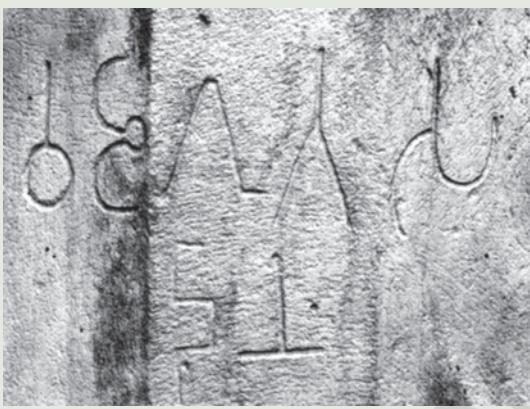

*Fig. 2.1 An inscription, Sanchi (Madhya Pradesh),* c*. second century BCE*

settlements emerged in many parts of the subcontinent, including north India, the Deccan Plateau, and parts of Karnataka. Besides, there is evidence of pastoral populations in the Deccan and further south. New modes of disposal of the dead, including the making of elaborate stone structures known as megaliths, emerged in central and south India from the first millennium BCE. In many cases, the dead were buried with a rich range of iron tools and weapons.

From *c.* sixth century BCE, there is evidence that there were other trends as well. Perhaps the most visible was the emergence of early states, empires and kingdoms. Underlying these political processes were other changes, evident in the ways in which agricultural production was organised. Simultaneously, new towns appeared almost throughout the subcontinent.

Historians attempt to understand these developments by drawing on a range of sources – inscriptions, texts, coins and visual material. As we will see, this is a complex process. You will also notice that these sources do not tell the entire story.

## 1. Prinsep and Piyadassi

Some of the most momentous developments in Indian epigraphy took place in the 1830s. This was when James Prinsep, an officer in the mint of the East India Company, deciphered Brahmi and Kharosthi, two scripts used in the earliest inscriptions and coins. He found that most of these mentioned a king referred to as Piyadassi – meaning "pleasant to behold"; there were a few inscriptions which also

*Epigraphy* is the study of inscriptions.

referred to the king as Asoka, one of the most famous rulers known from Buddhist texts.

This gave a new direction to investigations into early Indian political history as European and Indian scholars used inscriptions and texts composed in a variety of languages to reconstruct the lineages of major dynasties that had ruled the subcontinent. As a result, the broad contours of political history were in place by the early decades of the twentieth century.

Subsequently, scholars began to shift their focus to the *context* of political history, investigating whether there were connections between political changes and economic and social developments. It was soon realised that while there were links, these were not always simple or direct.

## 2. The Earliest States

### 2.1 The sixteen *mahajanapadas*

The sixth century BCE is often regarded as a major turning point in early Indian history. It is an era associated with early states, cities, the growing use of iron, the development of coinage, etc. It also witnessed the growth of diverse systems of thought, including Buddhism and Jainism. Early Buddhist and Jaina texts (see also Chapter 4) mention, amongst other things, sixteen states known as *mahajanapadas.* Although the lists vary, some names such as Vajji, Magadha, Koshala, Kuru, Panchala, Gandhara and Avanti occur frequently. Clearly, these were amongst the most important *mahajanapadas.*

While most *mahajanapadas* were ruled by kings, some, known as *ganas* or *sanghas*, were oligarchies (p. 30), where power was shared by a number of men, often collectively called *rajas*. Both Mahavira and the Buddha (Chapter 4) belonged to such *ganas.* In some instances, as in the case of the Vajji *sangha*, the *rajas* probably controlled resources such as land collectively. Although their histories are often difficult to reconstruct due to the lack of sources, some of these states lasted for nearly a thousand years.

Each *mahajanapada* had a capital city, which was often fortified. Maintaining these fortified cities as well as providing for incipient armies and bureaucracies required resources. From *c.* sixth

### Inscriptions

Inscriptions are writings engraved on hard surfaces such as stone, metal or pottery. They usually record the achievements, activities or ideas of those who commissioned them and include the exploits of kings, or donations made by women and men to religious institutions. Inscriptions are virtually permanent records, some of which carry dates. Others are dated on the basis of palaeography or styles of writing, with a fair amount of precision. For instance, in c. 250 BCE the letter "a" was written like this: . By c. 500 CE, it was written like this: .

The earliest inscriptions were in Prakrit, a name for languages used by ordinary people. Names of rulers such as Ajatasattu and Asoka, known from Prakrit texts and inscriptions, have been spelt in their Prakrit forms in this chapter. You will also find terms in languages such as Pali, Tamil and Sanskrit, which too were used to write inscriptions and texts. It is possible that people spoke in other languages as well, even though these were not used for writing.

*Janapada* means the land where a *jana* (a people, clan or tribe) sets its foot or settles. It is a word used in both Prakrit and Sanskrit.

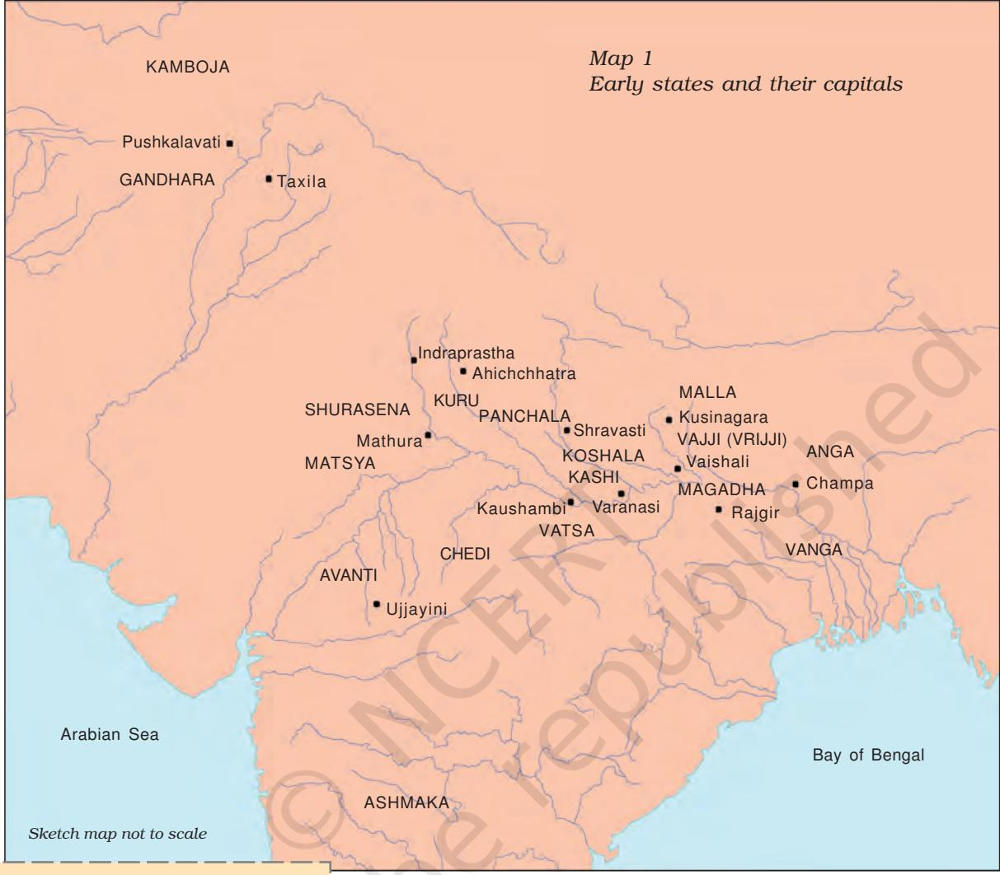

Ü Which were the areas where states and cities were most densely clustered?

*Oligarchy* refers to a form of government where power is exercised by a group of men. The Roman Republic, about which you read last year, was an oligarchy in spite of its name. century BCE onwards, Brahmanas began composing Sanskrit texts known as the Dharmasutras. These laid down norms for rulers (as well as for other social categories), who were ideally expected to be Kshatriyas (see also Chapter 3). Rulers were advised to collect taxes and tribute from cultivators, traders and artisans. Were resources also procured from pastoralists and forest peoples? We do not really know. What we do know is that raids on neighbouring states were recognised as a legitimate means of acquiring wealth. Gradually, some states acquired standing armies and maintained regular bureaucracies. Others continued to depend on militia, recruited, more often than not, from the peasantry.

#### 2.2 First amongst the sixteen: Magadha

Between the sixth and the fourth centuries BCE, Magadha (in present-day Bihar) became the most powerful *mahajanapada*. Modern historians explain this development in a variety of ways: Magadha was a region where agriculture was especially productive. Besides, iron mines (in present-day Jharkhand) were accessible and provided resources for tools and weapons. Elephants, an important component of the army, were found in forests in the region. Also, the Ganga and its tributaries provided a means of cheap and convenient communication. However, early Buddhist and Jaina writers who wrote about Magadha attributed its power to the policies of individuals: ruthlessly ambitious kings of whom Bimbisara, Ajatasattu and Mahapadma Nanda are the best known, and their ministers, who helped implement their policies.

Initially, Rajagaha (the Prakrit name for presentday Rajgir in Bihar) was the capital of Magadha. Interestingly, the old name means "house of the king". Rajagaha was a fortified settlement, located amongst hills. Later, in the fourth century BCE, the capital was shifted to Pataliputra, present-day Patna, commanding routes of communication along the Ganga.

# Ü Discuss...

What are the different explanations offered by early writers and present-day historians for the growth of Magadhan power?

*Fig. 2.2 Fortification walls at Rajgir*

Ü Why were these walls built?

## Languages and scripts

Most Asokan inscriptions were in the Prakrit language while those in the northwest of the subcontinet were in Aramaic and Greek. Most Prakrit inscriptions were written in the Brahmi script; however, some, in the northwest, were written in Kharosthi. The Aramaic and Greek scripts were used for inscriptions in Afghanistan.

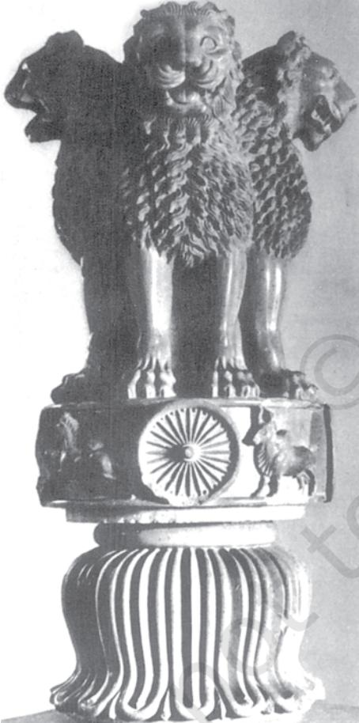

*Fig. 2.3 The lion capital*

Ü Why is the lion capital considered important today?

## 3. An Early Empire

The growth of Magadha culminated in the emergence of the Mauryan Empire. Chandragupta Maurya, who founded the empire (*c*. 321 BCE), extended control as far northwest as Afghanistan and Baluchistan, and his grandson Asoka, arguably the most famous ruler of early India, conquered Kalinga (present-day coastal Orissa).

### 3.1 Finding out about the Mauryas

Historians have used a variety of sources to reconstruct the history of the Mauryan Empire. These include archaeological finds, especially sculpture. Also valuable are contemporary works, such as the account of Megasthenes (a Greek ambassador to the court of Chandragupta Maurya), which survives in fragments. Another source that is often used is the *Arthashastra,* parts of which were probably composed by Kautilya or Chanakya, traditionally believed to be the minister of Chandragupta. Besides, the Mauryas are mentioned in later Buddhist, Jaina and Puranic literature, as well as in Sanskrit literary works. While these are useful, the inscriptions of Asoka (*c*. 272/268-231 BCE) on rocks and pillars are often regarded as amongst the most valuable sources.

Asoka was the first ruler who inscribed his messages to his subjects and officials on stone surfaces – natural rocks as well as polished pillars. He used the inscriptions to proclaim what he understood to be *dhamma*. This included respect towards elders, generosity towards Brahmanas and those who renounced worldly life, treating slaves and servants kindly, and respect for religions and traditions other than one's own.

### 3.2 Administering the empire

There were five major political centres in the empire – the capital Pataliputra and the provincial centres of Taxila, Ujjayini, Tosali and Suvarnagiri, all mentioned in Asokan inscriptions. If we examine the content of these inscriptions, we find virtually the same message engraved everywhere – from the present-day North West Frontier Provinces of Pakistan, to Andhra Pradesh, Orissa and Uttarakhand in India. Could this vast empire have had a uniform administrative system? Historians have increasingly come to realise that

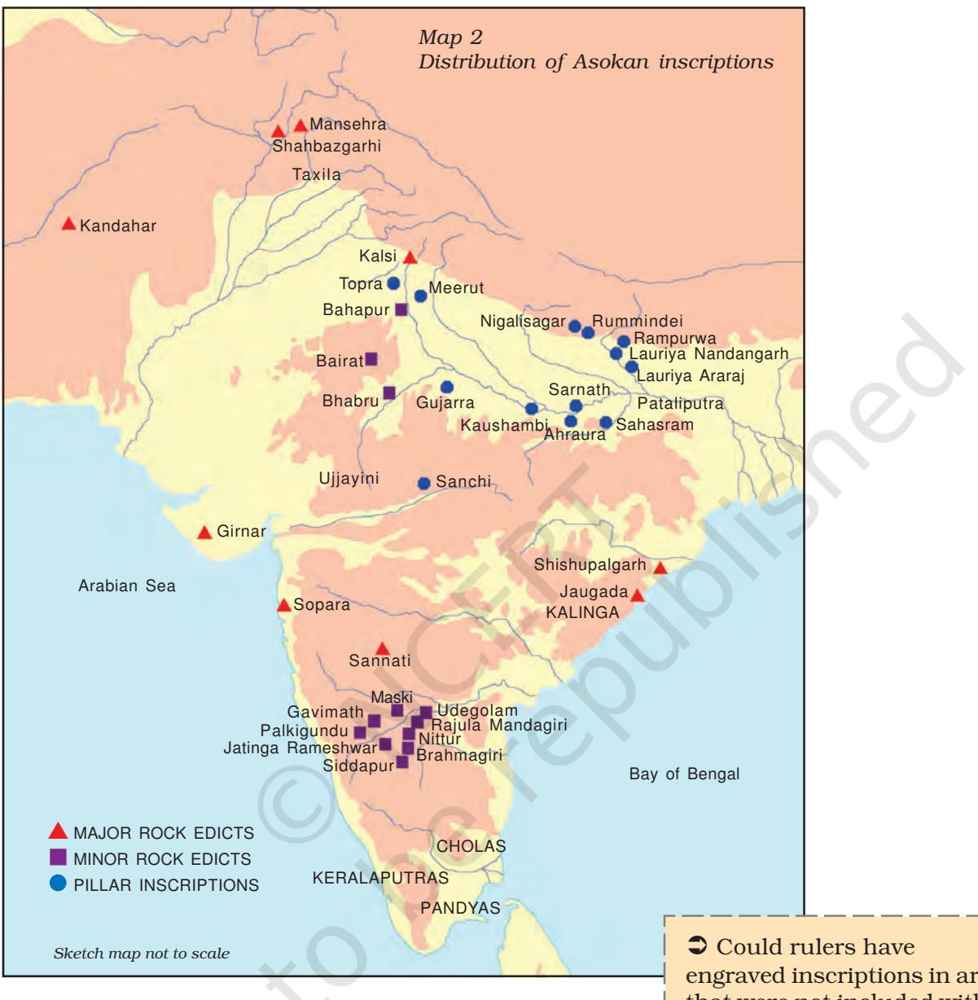

this is unlikely. The regions included within the empire were just too diverse. Imagine the contrast between the hilly terrain of Afghanistan and the coast of Orissa.

It is likely that administrative control was strongest in areas around the capital and the provincial centres. These centres were carefully chosen, both Taxila and Ujjayini being situated on important long-distance trade routes, while Suvarnagiri (literally, the golden mountain) was possibly important for tapping the gold mines of Karnataka.

engraved inscriptions in areas that were not included within their empire?

*Source 1*

## What the king's officials did

Here is an excerpt from the account of Megasthenes:

Of the great officers of state, some … superintend the rivers, measure the land, as is done in Egypt, and inspect the sluices by which water is let out from the main canals into their branches, so that every one may have an equal supply of it. The same persons have charge also of the huntsmen, and are entrusted with the power of rewarding or punishing them according to their deserts. They collect the taxes, and superintend the occupations connected with land; as those of the woodcutters, the carpenters, the blacksmiths, and the miners.

Ü Why were officials appointed to supervise these occupational groups?

# Ü Discuss...

Read the excerpts from Megasthenes and the *Arthashastra* (Sources 1 and 2). To what extent do you think these texts are useful in reconstructing a history of Mauryan administration?

Communication along both land and riverine routes was vital for the existence of the empire. Journeys from the centre to the provinces could have taken weeks if not months. This meant arranging for provisions as well as protection for those who were on the move. It is obvious that the army was an important means for ensuring the latter. Megasthenes mentions a committee with six subcommittees for coordinating military activity. Of these, one looked after the navy, the second managed transport and provisions, the third was responsible for foot-soldiers, the fourth for horses, the fifth for chariots and the sixth for elephants. The activities of the second subcommittee were rather varied: arranging for bullock carts to carry equipment, procuring food for soldiers and fodder for animals, and recruiting servants and artisans to look after the soldiers.

Asoka also tried to hold his empire together by propagating *dhamma,* the principles of which, as we have seen, were simple and virtually universally applicable. This, according to him, would ensure the well-being of people in this world and the next. Special officers, known as the *dhamma mahamatta,* were appointed to spread the message of *dhamma*.

### 3.3 How important was the empire?

When historians began reconstructing early Indian history in the nineteenth century, the emergence of the Mauryan Empire was regarded as a major landmark. India was then under colonial rule, and was part of the British empire. Nineteenth and early twentieth century Indian historians found the possibility that there was an empire in early India both challenging and exciting. Also, some of the archaeological finds associated with the Mauryas, including stone sculpture, were considered to be examples of the spectacular art typical of empires. Many of these historians found the message on Asokan inscriptions very different from that of most other rulers, suggesting that Asoka was more powerful and industrious, as also more humble than later rulers who adopted grandiose titles. So it is not surprising that nationalist leaders in the twentieth century regarded him as an inspiring figure.

Yet, how important was the Mauryan Empire? It lasted for about 150 years, which is not a very long time in the vast span of the history of the subcontinent. Besides, if you look at Map 2, you will notice that the empire did not encompass the entire subcontinent. And even within the frontiers of the empire, control was not uniform. By the second century BCE, new chiefdoms and kingdoms emerged in several parts of the subcontinent.

## 4. New Notions of Kingship

#### 4.1 Chiefs and kings in the south

The new kingdoms that emerged in the Deccan and further south, including the chiefdoms of the Cholas, Cheras and Pandyas in Tamilakam (the name of the ancient Tamil country, which included parts of present-day Andhra Pradesh and Kerala, in addition to Tamil Nadu), proved to be stable and prosperous.

## Chiefs and chiefdoms

A chief is a powerful man whose position may or may not be hereditary. He derives support from his kinfolk. His functions may include performing special rituals, leadership in warfare, and arbitrating disputes. He receives gifts from his subordinates (unlike kings who usually collect taxes) and often distributes these amongst his supporters. Generally, there are no regular armies and officials in chiefdoms.

We know about these states from a variety of sources. For instance, the early Tamil Sangam texts (see also Chapter 3) contain poems describing chiefs and the ways in which they acquired and distributed resources.

Many chiefs and kings, including the Satavahanas who ruled over parts of western and central India (*c.* second century BCE-second century CE) and the Shakas, a people of Central Asian origin who established kingdoms in the north-western and western parts of the subcontinent, derived revenues from long-distance trade. Their social origins were often obscure, but, as we will see in the case of the Satavahanas (Chapter 3), once they acquired power they attempted to claim social status in a variety of ways.

#### *Source 2*

## Capturing elephants for the army

The Arthashastra lays down minute details of administrative and military organisation. This is what it says about how to capture elephants:

Guards of elephant forests, assisted by those who rear elephants, those who enchain the legs of elephants, those who guard the boundaries, those who live in forests, as well as by those who nurse elephants, shall, with the help of five or seven female elephants to help in tethering wild ones, trace the whereabouts of herds of elephants by following the course of urine and dung left by elephants.

According to Greek sources, the Mauryan ruler had a standing army of 600,000 foot-soldiers, 30,000 cavalry and 9,000 elephants. Some historians consider these accounts to be exaggerated.

Ü If the Greek accounts were true, what kinds of resources do you think the Mauryan ruler would have required to maintain such a large army?

*Source 3*

## The Pandya chief Senguttuvan visits the forest

This is an excerpt from the Silappadikaram, an epic written in Tamil:

(When he visited the forest) people came down the mountain, singing and dancing … just as the defeated show respect to the victorious king, so did they bring gifts – ivory, fragrant wood, fans made of the hair of deer, honey, sandalwood, red ochre, antimony, turmeric, cardamom, pepper, etc. ... they brought coconuts, mangoes, medicinal plants, fruits, onions, sugarcane, flowers, areca nut, bananas, baby tigers, lions, elephants, monkeys, bear, deer, musk deer, fox, peacocks, musk cat, wild cocks, speaking parrots, etc. …

Ü Why did people bring these gifts? What would the chief have used these for?

*Fig. 2.4 A Kushana coin Obverse: King Kanishka Reverse: A deity*

> Ü How has the king been portrayed?

### 4.2 Divine kings

One means of claiming high status was to identify with a variety of deities. This strategy is best exemplified by the Kushanas (*c*. first century BCEfirst century CE), who ruled over a vast kingdom extending from Central Asia to northwest India. Their history has been reconstructed from inscriptions and textual traditions. The notions of kingship they wished to project are perhaps best evidenced in their coins and sculpture.

Colossal statues of Kushana rulers have been found installed in a shrine at Mat near Mathura (Uttar Pradesh). Similar statues have been found in a shrine in Afghanistan as well. Some historians feel this indicates that the Kushanas considered themselves godlike. Many Kushana rulers also adopted the title *devaputra*, or "son of god", possibly inspired by Chinese rulers who called themselves sons of heaven.

By the fourth century there is evidence of larger states, including the Gupta Empire. Many of these depended on *samantas*, men who maintained themselves through local resources including control over land. They offered homage and provided military support to rulers. Powerful *samantas* could become kings: conversely, weak rulers might find themselves being reduced to positions of subordination.

Histories of the Gupta rulers have been reconstructed from literature, coins and inscriptions, including *prashastis*, composed in praise of kings in particular, and patrons in general, by poets. While historians often attempt to draw factual information from such compositions, those who composed and read them often treasured them as works of poetry

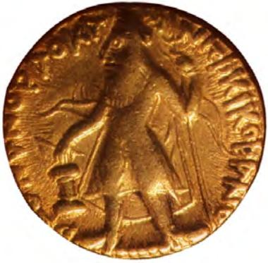

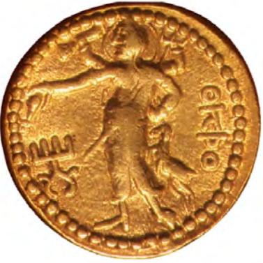

rather than as accounts that were literally true. The *Prayaga Prashasti* (also known as the Allahabad Pillar Inscription) composed in Sanskrit by Harishena, the court poet of Samudragupta, arguably the most powerful of the Gupta rulers (*c.* fourth century CE), is a case in point.

#### *Source 4*

#### In praise of Samudragupta

This is an excerpt from the Prayaga Prashasti:

He was without an antagonist on earth; he, by the overflowing of the multitude of (his) many good qualities adorned by hundreds of good actions, has wiped off the fame of other kings with the soles of (his) feet; (he is) Purusha (the Supreme Being), being the cause of the prosperity of the good and the destruction of the bad (he is) incomprehensible; (he is) one whose tender heart can be captured only by devotion and humility; (he is) possessed of compassion; (he is) the giver of many hundred-thousands of cows; (his) mind has received ceremonial initiation for the uplift of the miserable, the poor, the forlorn and the suffering; (he is) resplendent and embodied kindness to mankind; (he is) equal to (the gods) Kubera (the god of wealth), Varuna (the god of the ocean), Indra (the god of rains) and Yama (the god of death)…

*Fig. 2.5 Sandstone sculpture of a Kushana king*

Ü What are the elements in the sculpture that suggest that this is an image of a king?

Ü Discuss... Why do you think kings claimed divine status?

*Source 5*

## The Sudarshana (beautiful) lake in Gujarat

Find Girnar on Map 2. The Sudarshana lake was an artificial reservoir. We know about it from a rock inscription (c. second century CE) in Sanskrit, composed to record the achievements of the Shaka ruler Rudradaman.

The inscription mentions that the lake, with embankments and water channels, was built by a local governor during the rule of the Mauryas. However, a terrible storm broke the embankments and water gushed out of the lake. Rudradaman, who was then ruling in the area, claimed to have got the lake repaired using his own resources, without imposing any tax on his subjects.

Another inscription on the same rock (c. fifth century) mentions how one of the rulers of the Gupta dynasty got the lake repaired once again.

Ü Why did rulers make arrangements for irrigation?

*Transplantation* is used for paddy cultivation in areas where water is plentiful. Here, seeds are first broadcast; when the saplings have grown they are transplanted in waterlogged fields. This ensures a higher ratio of survival of saplings and higher yields.

# 5. A Changing Countryside

## 5.1 Popular perceptions of kings

What did subjects think about their rulers? Obviously, inscriptions do not provide all the answers. In fact, ordinary people rarely left accounts of their thoughts and experiences. Nevertheless, historians have tried to solve this problem by examining stories contained in anthologies such as the *Jatakas* and the *Panchatantra*. Many of these stories probably originated as popular oral tales that were later committed to writing. The *Jatakas* were written in Pali around the middle of the first millennium CE.

One story known as the *Gandatindu Jataka* describes the plight of the subjects of a wicked king; these included elderly women and men, cultivators, herders, village boys and even animals. When the king went in disguise to find out what his subjects thought about him, each one of them cursed him for their miseries, complaining that they were attacked by robbers at night and by tax collectors during the day. To escape from this situation, people abandoned their village and went to live in the forest.

As this story indicates, the relationship between a king and his subjects, especially the rural population, could often be strained – kings frequently tried to fill their coffers by demanding high taxes, and peasants particularly found such demands oppressive. Escaping into the forest remained an option, as reflected in the *Jataka* story. Meanwhile, other strategies aimed at increasing production to meet growing demand for taxes also came to be adopted.

## 5.2 Strategies for increasing production

One such strategy was the shift to plough agriculture, which spread in fertile alluvial river valleys such as those of the Ganga and the Kaveri from *c.* sixth century BCE. The iron-tipped ploughshare was used to turn the alluvial soil in areas which had high rainfall. Moreover, in some parts of the Ganga valley, production of paddy was dramatically increased by the introduction of transplantation, although this meant back-breaking work for the producer.

 While the iron ploughshare led to a growth in agricultural productivity, its use was restricted to certain parts of the subcontinent – cultivators in

areas which were semi-arid, such as parts of Punjab and Rajasthan did not adopt it till the twentieth century, and those living in hilly tracts in the northeastern and central parts of the subcontinent practised hoe agriculture, which was much better suited to the terrain.

Another strategy adopted to increase agricultural production was the use of irrigation, through wells and tanks, and less commonly, canals. Communities as well as individuals organised the construction of irrigation works. The latter, usually powerful men including kings, often recorded such activities in inscriptions.

#### 5.3 Differences in rural society

While these technologies often led to an increase in production, the benefits were very uneven. What is evident is that there was a growing differentiation amongst people engaged in agriculture – stories, especially within the Buddhist tradition, refer to landless agricultural labourers, small peasants, as well as large landholders. The term *gahapati* was often used in Pali texts to designate the second and third categories. The large landholders, as well as the village headman (whose position was often hereditary), emerged as powerful figures, and often exercised control over other cultivators. Early Tamil literature (the Sangam texts) also mentions different categories of people living in the villages – large landowners or *vellalar*, ploughmen or *uzhavar* and slaves or *adimai.* It is likely that these differences were based on differential access to land, labour and some of the new technologies. In such a situation, questions of control over land must have become crucial, as these were often discussed in legal texts.

## Gahapati

A gahapati was the owner, master or head of a household, who exercised control over the women, children, slaves and workers who shared a common residence. He was also the owner of the resources – land, animals and other things – that belonged to the household. Sometimes the term was used as a marker of status for men belonging to the urban elite, including wealthy merchants.

#### *Source 6*

## The importance of boundaries

The Manusmrti is one of the best-known legal texts of early India, written in Sanskrit and compiled between c. second century BCE and c. second century CE. This is what the text advises the king to do:

Seeing that in the world controversies constantly arise due to the ignorance of boundaries, he should … have … concealed boundary markers buried – stones, bones, cow's hair, chaff, ashes, potsherds, dried cow dung, bricks, coal, pebbles and sand. He should also have other similar substances that would not decay in the soil buried as hidden markers at the intersection of boundaries.

Ü Would these boundary markers have been adequate to resolve disputes?

#### *Source 7*

#### Life in a small village

The Harshacharita is a biography of Harshavardhana, the ruler of Kanauj (see Map 3), composed in Sanskrit by his court poet, Banabhatta (c. seventh century CE). This is an excerpt from the text, an extremely rare representation of life in a settlement on the outskirts of a forest in the Vindhyas:

The outskirts being for the most part forest, many parcels of rice-land, threshing ground and arable land were being apportioned by small farmers … it was mainly spade culture … owing to the difficulty of ploughing the sparsely scattered fields covered with grass, with their few clear spaces, their black soil stiff as black iron …

There were people moving along with bundles of bark … countless sacks of plucked flowers, … loads of flax and hemp bundles, quantities of honey, peacocks' tail feathers, wreaths of wax, logs, and grass. Village wives hastened en route for neighbouring villages, all intent on thoughts of sale and bearing on their heads baskets filled with various gathered forest fruits.

Ü How would you classify the people described in the text in terms of their occupations?

#### 5.4 Land grants and new rural elites

From the early centuries of the Common Era, we find grants of land being made, many of which were recorded in inscriptions. Some of these inscriptions were on stone, but most were on copper plates (Fig. 2.13) which were probably given as a record of the transaction to those who received the land. The records that have survived are generally about grants to religious institutions or to Brahmanas. Most inscriptions were in Sanskrit. In some cases, and especially from the seventh century onwards, part of the inscription was in Sanskrit, while the rest was in a local language such as Tamil or Telugu. Let us look at one such inscription more closely.

Prabhavati Gupta was the daughter of one of the most important rulers in early Indian history, Chandragupta II (*c.* 375-415 CE). She was married into another important ruling family, that of the Vakatakas, who were powerful in the Deccan (see Map 3). According to Sanskrit legal texts, women were not supposed to have independent access to resources such as land. However, the inscription indicates that Prabhavati had access to land, which she then granted. This may have been because she was a queen (one of the few known from early Indian history), and her situation was therefore exceptional. It is also possible that the provisions of legal texts were not uniformly implemented.

The inscription also gives us an idea about rural populations – these included Brahmanas and peasants, as well as others who were expected to provide a range of produce to the king or his representatives. And according to the inscription, they would have to obey the new lord of the village, and perhaps pay him all these dues.

Land grants such as this one have been found in several parts of the country. There were regional variations in the sizes of land donated – ranging from small plots to vast stretches of uncultivated land – and the rights given to donees (the recipients of the grant). The impact of land grants is a subject of heated debate among historians. Some feel that land grants were part of a strategy adopted by ruling lineages to extend agriculture to new areas. Others suggest that land grants were indicative of weakening political power: as kings were losing control over their *samantas*, they tried to win allies

by making grants of land. They also feel that kings tried to project themselves as supermen (as we saw in the previous section) *because* they were losing control: they wanted to present at least a façade of power.

*Source 8*

### Prabhavati Gupta and the village of Danguna

This is what Prabhavati Gupta states in her inscription:

Prabhavati Gupta … commands the gramakutumbinas (householders/peasants living in the village), Brahmanas and others living in the village of Danguna …

"Be it known to you that on the twelfth (lunar day) of the bright (fortnight) of Karttika, we have, in order to increase our religious merit donated this village with the pouring out of water, to the Acharya (teacher) Chanalasvamin … You should obey all (his) commands …

We confer on (him) the following exemptions typical of an agrahara …(this village is) not to be entered by soldiers and policemen; (it is) exempt from (the obligation to provide) grass, (animal) hides as seats, and charcoal (to touring royal officers); exempt from (the royal prerogative of) purchasing fermenting liquors and digging (salt); exempt from (the right to) mines and khadira trees; exempt from (the obligation to supply) flowers and milk; (it is donated) together with (the right to) hidden treasures and deposits (and) together with major and minor taxes …"

This charter has been written in the thirteenth (regnal) year. (It has been) engraved by Chakradasa.

Ü What were the things produced in the village?

Land grants provide some insight into the relationship between cultivators and the state. However, there were people who were often beyond the reach of officials or *samantas:* pastoralists, fisherfolk and hunter-gatherers, mobile or semisedentary artisans and shifting cultivators. Generally, such groups did not keep detailed records of their lives and transactions.

An *agrahara* was land granted to a Brahmana, who was usually exempted from paying land revenue and other dues to the king, and was often given the right to collect these dues from the local people.

# Ü Discuss...

Find out whether plough agriculture, irrigation and transplantation are prevalent in your state. If not, are there any alternative systems in use?

## The history of Pataliputra

Each city had a history of its own. Pataliputra, for instance, began as a village known as Pataligrama. Then, in the fifth century BCE, the Magadhan rulers decided to shift their capital from Rajagaha to this settlement and renamed it. By the fourth century BCE, it was the capital of the Mauryan Empire and one of the largest cities in Asia. Subsequently, its importance apparently declined. When the Chinese pilgrim Xuan Zang visited the city in the seventh century CE, he found it in ruins, and with a very small population.

## 6. Towns and Trade

#### 6.1 New cities

Let us retrace our steps back to the urban centres that emerged in several parts of the subcontinent from *c.* sixth century BCE. As we have seen, many of these were capitals of *mahajanapadas.* Virtually all major towns were located along routes of communication. Some such as Pataliputra were on riverine routes. Others, such as Ujjayini, were along land routes, and yet others, such as Puhar, were near the coast, from where sea routes began. Many cities like Mathura were bustling centres of commercial, cultural and political activity.

### 6.2 Urban populations: Elites and craftspersons

We have seen that kings and ruling elites lived in fortified cities. Although it is difficult to conduct extensive excavations at most sites because people live in these areas even today (unlike the Harappan cities), a wide range of artefacts have been recovered from them. These include fine pottery bowls and dishes, with a glossy finish, known as Northern Black Polished Ware, probably used by rich people, and ornaments, tools, weapons, vessels, figurines, made of a wide range of materials – gold, silver, copper, bronze, ivory, glass, shell and terracotta.

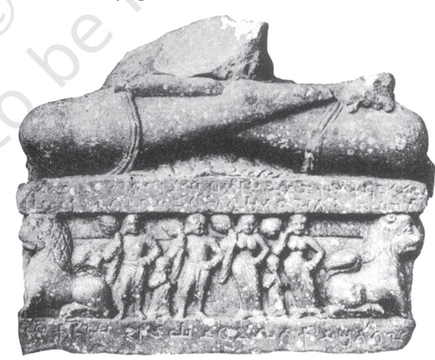

#### *Fig. 2.6*

*The gift of an image* This is part of an image from Mathura. On the pedestal is a Prakrit inscription, mentioning that a woman named Nagapiya, the wife of a goldsmith (*sovanika*) named Dharmaka, installed this image in a shrine.

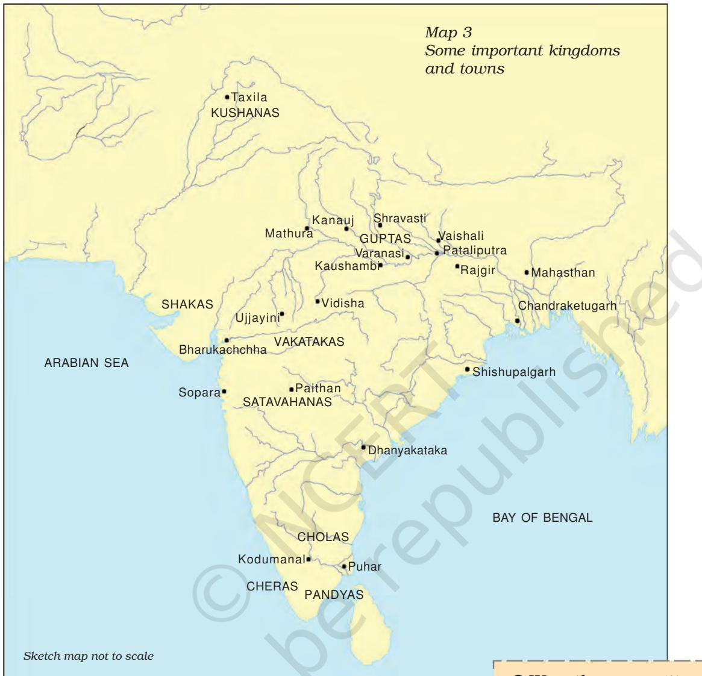

By the second century BCE, we find short votive inscriptions in a number of cities. These mention the name of the donor, and sometimes specify his/ her occupation as well. They tell us about people who lived in towns: washing folk, weavers, scribes, carpenters, potters, goldsmiths, blacksmiths, officials, religious teachers, merchants and kings.

Sometimes, guilds or *shrenis*, organisations of craft producers and merchants, are mentioned as well. These guilds probably procured raw materials, regulated production, and marketed the finished product. It is likely that craftspersons used a range of iron tools to meet the growing demands of urban elites.

Ü Were there any cities in the region where the Harappan civilisation flourished in the third millennium BCE?

*Votive inscriptions* record gifts made to religious institutions.

#### *Source 9*

## The Malabar coast (present-day Kerala)

Here is an excerpt from Periplus of the Erythraean Sea, composed by an anonymous Greek sailor (c.first century CE):

They (i.e. traders from abroad) send large ships to these market-towns on account of the great quantity and bulk of pepper and malabathrum (possibly cinnamon, produced in these regions). There are imported here, in the first place, a great quantity of coin; topaz … antimony (a mineral used as a colouring substance), coral, crude glass, copper, tin, lead … There is exported pepper, which is produced in quantity in only one region near these markets … Besides this there are exported great quantities of fine pearls, ivory, silk cloth, … transparent stones of all kinds, diamonds and sapphires, and tortoise shell.

Archaeological evidence of a bead-making industry, using precious and semi-precious stones, has been found in Kodumanal (Tamil Nadu). It is likely that local traders brought the stones mentioned in the Periplus from sites such as these to the coastal ports.

Ü Why did the author compile this list?

*"Periplus"* is a Greek word meaning sailing around and *"Erythraean"* was the Greek name for the Red Sea.

### 6.3 Trade in the subcontinent and beyond

From the sixth century BCE, land and river routes criss-crossed the subcontinent and extended in various directions – overland into Central Asia and beyond, and overseas, from ports that dotted the coastline – extending across the Arabian Sea to East and North Africa and West Asia, and through the Bay of Bengal to Southeast Asia and China. Rulers often attempted to control these routes, possibly by offering protection for a price.

Those who traversed these routes included peddlers who probably travelled on foot and merchants who travelled with caravans of bullock carts and pack-animals. Also, there were seafarers, whose ventures were risky but highly profitable. Successful merchants, designated as *masattuvan* in Tamil and *setthis* and *satthavahas* in Prakrit, could become enormously rich. A wide range of goods were carried from one place to another – salt, grain, cloth, metal ores and finished products, stone, timber, medicinal plants, to name a few. Spices, especially pepper, were in high demand in the Roman Empire, as were textiles and medicinal plants, and these were all transported across the Arabian Sea to the Mediterranean.

### 6.4 Coins and kings

To some extent, exchanges were facilitated by the introduction of coinage. Punch-marked coins made of silver and copper (*c.* sixth century BCE onwards) were amongst the earliest to be minted and used. These have been recovered from excavations at a number of sites throughout the subcontinent. Numismatists have studied these and other coins to reconstruct possible commercial networks.

Attempts made to identify the symbols on punchmarked coins with specific ruling dynasties, including the Mauryas, suggest that these were issued by kings. It is also likely that merchants, bankers and townspeople issued some of these coins. The first coins to bear the names and images of rulers were issued by the Indo-Greeks, who established control over the north-western part of the subcontinent *c.* second century BCE.

The kushanas, however, issued the largest hoards of gold coins first gold coins *c.* first century CE. These were virtually identical in weight with those issued

by contemporary Roman emperors and the Parthian rulers of Iran, and have been found from several sites in north India and Central Asia. The widespread use of gold coins indicates the enormous value of the transactions that were taking place. Besides, hoards of Roman coins have been found from archaeological sites in south India. It is obvious that networks of trade were not confined within political boundaries: south India was not part of the Roman Empire, but there were close connections through trade.

Coins were also issued by tribal republics such as that of the Yaudheyas of Punjab and Haryana (*c.* first century CE). Archaeologists have unearthed several thousand copper coins issued by the Yaudheyas, pointing to the latter's interest and participation in economic exchanges.

Some of the most spectacular gold coins were issued by the Gupta rulers. The earliest issues are remarkable for their purity. These coins facilitated long-distance transactions from which kings also benefited.

From *c.* sixth century CE onwards, finds of gold coins taper off. Does this indicate that there was some kind of an economic crisis? Historians are divided on this issue. Some suggest that with the collapse of the Western Roman Empire long-distance trade declined, and this affected the prosperity of the states, communities and regions that had benefited from it. Others argue that new towns and networks of trade started emerging around this time. They also point out that though finds of coins of that time are fewer, coins continue to be mentioned in inscriptions and texts. Could it be that there are fewer finds because coins were in circulation rather than being hoarded?

*Numismatics* is the study of coins, including visual elements such as scripts and images, metallurgical analysis and the contexts in which they have been found.

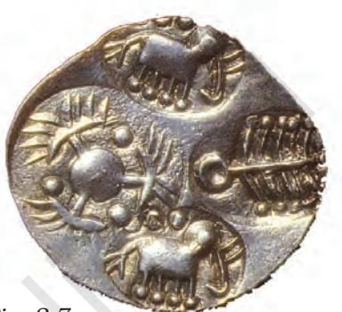

*Fig. 2.7 A punch-marked coin, so named because symbols were punched or stamped onto the metal surface*

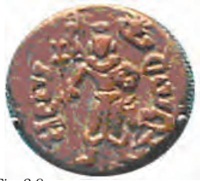

*Fig. 2.8 A Yaudheya coin*

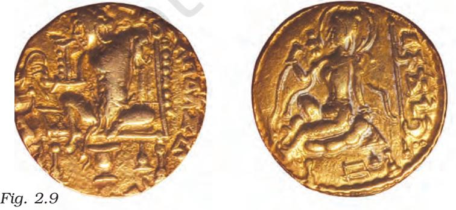

*A Gupta coin*

Ü Discuss...

What are the transactions involved in trade? Which of these transactions are apparent from the sources mentioned? Are there any that are not evident from the sources?

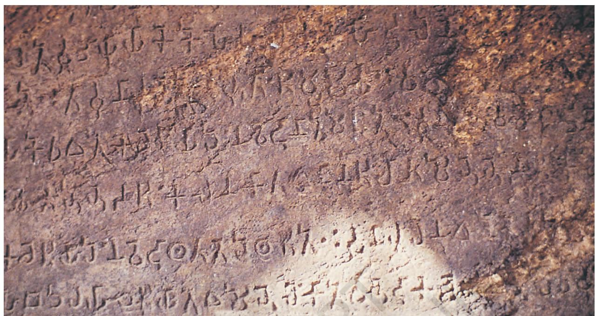

*Fig. 2.10 An Asokan inscription*

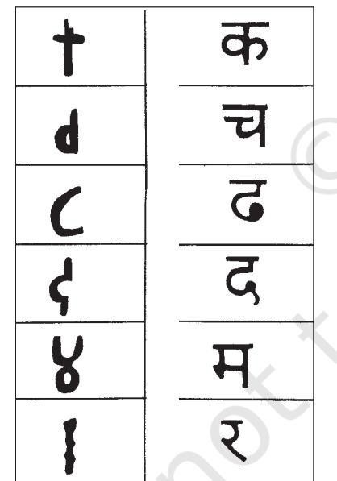

*Fig. 2.11 Asokan Brahmi with Devanagari equivalents*

Ü Do some Devanagari letters appear similar to Brahmi? Are there any that seem different?

## 7. Back to Basics

### How Are Inscriptions Deciphered?

So far, we have been studying excerpts from inscriptions amongst other things. But how do historians find out what is written on them?

#### 7.1 Deciphering Brahmi

Most scripts used to write modern Indian languages are derived from Brahmi, the script used in most Asokan inscriptions. From the late eighteenth century, European scholars aided by Indian pandits worked backwards from contemporary Bengali and Devanagari (the script used to write Hindi) manuscripts, comparing their letters with older specimens.

Scholars who studied early inscriptions sometimes assumed these were in Sanskrit, although the earliest inscriptions were, in fact, in Prakrit. It was only after decades of painstaking investigations by several epigraphists that James Prinsep was able to decipher Asokan Brahmi in 1838.

#### 7.2 How Kharosthi was read

The story of the decipherment of Kharosthi, the script used in inscriptions in the northwest, is different. Here, finds of coins of Indo-Greek kings who ruled over the area (*c*. second-first centuries BCE) have

facilitated matters. These coins contain the names of kings written in Greek and Kharosthi scripts. European scholars who could read the former compared the letters. For instance, the symbol for "a" could be found in both scripts for writing names such as Apollodotus. With Prinsep identifying the language of the Kharosthi inscriptions as Prakrit, it became possible to read longer inscriptions as well.

#### 7.3 Historical evidence from inscriptions

To find out how epigraphists and historians work, let us look at two Asokan inscriptions more closely.

Note that the name of the ruler, Asoka, is not mentioned in the inscription (Source 10). What is used instead are titles adopted by the ruler – *devanampiya*, often translated as "beloved of the gods" and *piyadassi*, or "pleasant to behold". The name Asoka is mentioned in some other inscriptions, which also contain these titles. After examining all these inscriptions, and finding that they match in terms of content, style, language and palaeography, epigraphists have concluded that they were issued by the same ruler.

You may also have noticed that Asoka claims that earlier rulers had no arrangements to receive reports. If you consider the political history of the subcontinent prior to Asoka, do you think this statement is true? Historians have to constantly assess statements made in inscriptions to judge whether they are true, plausible or exaggerations.

Did you notice that there are words within brackets? Epigraphists sometimes add these to make the meaning of sentences clear. This has to be done carefully, to ensure that the intended meaning of the author is not changed.

*Source 10*

#### The orders of the king

Thus speaks king Devanampiya Piyadassi:

In the past, there were no arrangements for disposing affairs, nor for receiving regular reports. But I have made the following (arrangement). Pativedakas should report to me about the affairs of the people at all times, anywhere, whether I am eating, in the inner apartment, in the bedroom, in the cow pen, being carried (possibly in a palanquin), or in the garden. And I will dispose of the affairs of the people everywhere.

Ü Epigraphists have translated the term *pativedaka* as reporter. In what ways would the functions of the *pativedaka* have been different from those we generally associate with reporters today?

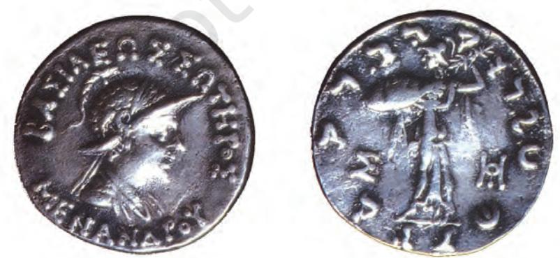

*Fig. 2.12 A coin of the Indo-Greek king Menander*

#### *Source 11*

#### The anguish of the king

When the king Devanampiya Piyadassi had been ruling for eight years, the (country of the) Kalingas (presentday coastal Orissa) was conquered by (him).

One hundred and fifty thousand men were deported, a hundred thousand were killed, and many more died.

After that, now that (the country of) the Kalingas has been taken, Devanampiya (is devoted) to an intense study of Dhamma, to the love of Dhamma, and to instructing (the people) in Dhamma.

This is the repentance of Devanampiya on account of his conquest of the (country of the) Kalingas.

For this is considered very painful and deplorable by Devanampiya that, while one is conquering an unconquered (country) slaughter, death and deportation of people (take place) there …

# Ü Discuss...

Look at Map 2 and discuss the location of Asokan inscriptions. Do you notice any patterns?

Historians have to make other assessments as well. If a king's orders were inscribed on natural rocks near cities or important routes of communication, would passers-by have stopped to read these? Most people were probably not literate. Did everybody throughout the subcontinent understand the Prakrit used in Pataliputra? Would the orders of the king have been followed? Answers to such questions are not always easy to find.

Some of these problems are evident if we look at an Asokan inscription (Source 11), which has often been interpreted as reflecting the anguish of the ruler, as well as marking a change in his attitude towards warfare. As we shall see, the situation becomes more complex once we move beyond reading the inscription at face value.

While Asokan inscriptions have been found in present-day Orissa, the one depicting his anguish is missing. In other words, the inscription has not been found in the region that was conquered. What are we to make of that? Is it that the anguish of the recent conquest was too painful in the region, and therefore the ruler was unable to address the issue?

## 8. The Limitations of Inscriptional Evidence

By now it is probably evident that there are limits to what epigraphy can reveal. Sometimes, there are technical limitations: letters are very faintly engraved, and thus reconstructions are uncertain. Also, inscriptions may be damaged or letters missing. Besides, it is not always easy to be sure about the exact meaning of the words used in inscriptions, some of which may be specific to a particular place or time. If you go through an epigraphical journal (some are listed in Timeline 2), you will realise that scholars are constantly debating and discussing alternative ways of reading inscriptions.

Although several thousand inscriptions have been discovered, not all have been deciphered, published and translated. Besides, many more inscriptions must have existed, which have not survived the ravages of time. So what is available at present is probably only a fraction of what was inscribed.

There is another, perhaps more fundamental, problem: not everything that we may consider

politically or economically significant was necessarily recorded in inscriptions. For instance, routine agricultural practices and the joys and sorrows of daily existence find no mention in inscriptions, which focus, more often than not, on grand, unique events. Besides, the content of inscriptions almost invariably projects the perspective of the person(s) who commissioned them. As such, they need to be juxtaposed with other perspectives so as to arrive at a better understanding of the past.

Thus epigraphy alone does not provide a full understanding of political and economic history. Also, historians often question both old and new evidence. Scholars in the late nineteenth and early twentieth centuries were primarily interested in the histories of kings. From the mid-twentieth century onwards, issues such as economic change, and the ways in which different social groups emerged have assumed far more importance. Recent decades have seen a much greater preoccupation with histories of marginalised groups. This will probably lead to fresh investigations of old sources, and the development of new strategies of analysis.

*Fig. 2.13 A copperplate inscription from Karnataka,* c*. sixth century CE*

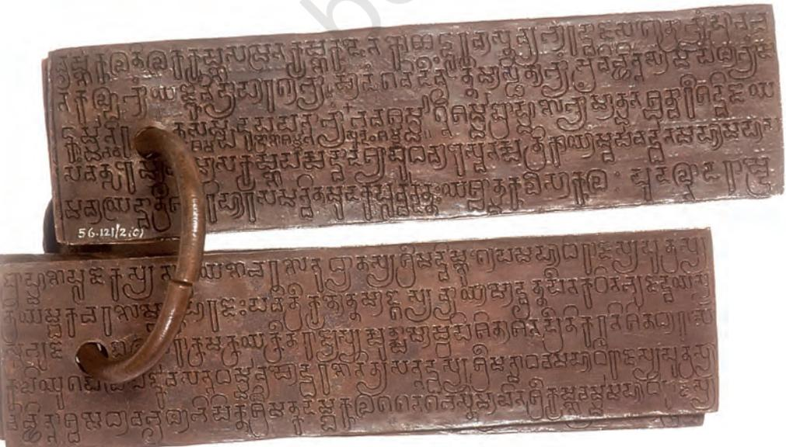

## Timeline 1

## Major Political and Economic Developments

| c.600-500 BCE | Paddy transplantation; urbanisation in the |
| --- | --- |
|  | Ganga valley; mahajanapadas; punch-marked coins |
| c. 500-400 BCE | Rulers of Magadha consolidate power |
| c. 327-325 BCE | Invasion of Alexander of Macedon |
| c. 321 BCE | Accession of Chandragupta Maurya |
| c. 272/268-231 BCE | Reign of Asoka |
| c. 185 BCE | End of the Mauryan empire |
| c. 200-100 BCE | Indo-Greek rule in the northwest; Cholas, Cheras |
|  | and Pandyas in south India; Satavahanas in the Deccan |
| c. 100 BCE-200 CE | Shaka (peoples from Central Asia) rulers in |
|  | the northwest; Roman trade; gold coinage |
| c. 78 CE? | Accession of Kanishka |
| c.100-200 CE | Earliest inscriptional evidence of land |
|  | grants by Satavahana and Shaka rulers |
| c. 320 CE | Beginning of Gupta rule |
| c. 335-375 CE | Samudragupta |
| c. 375-415 CE | Chandragupta II; Vakatakas in the Deccan |
| c. 500-600 CE | Rise of the Chalukyas in Karnataka and of the Pallavas |
|  | in Tamil Nadu |
| c. 606-647 CE | Harshavardhana king of Kanauj; Chinese pilgrim |
|  | Xuan Zang comes in search of Buddhist texts |
| c. 712 | Arabs conquer Sind |
| (Note: It is difficult to date economic developments precisely. Also, there are enormous |  |

*subcontinental variations which have not been indicated in the timeline. Only the earliest dates for specific developments have been given. The date of Kanishka's accession is not certain and this has been marked with a'?')*

|  | Timeline 2 |
| --- | --- |
|  | Major Advances in Epigraphy |
| Eighteenth century |  |
| 1784 | Founding of the Asiatic Society (Bengal) |
| Nineteenth century |  |
| 1810s | Colin Mackenzie collects over 8,000 inscriptions in Sanskrit and Dravidian languages |
| 1838 | Decipherment of Asokan Brahmi by James Prinsep |
| 1877 | Alexander Cunningham publishes a set of Asokan inscriptions |
| 1886 | First issue of Epigraphia Carnatica, a journal of south Indian inscriptions |
| 1888 | First issue of Epigraphia Indica |
| Twentieth century |  |
| 1965-66 | D.C. Sircar publishes Indian Epigraphy and Indian Epigraphical Glossary |

- 1. Discuss the evidence of craft production in Early Historic cities. In what ways is this different from the evidence from Harappan cities?
- 2. Describe the salient features of *mahajanapadas.*
- 3. How do historians reconstruct the lives of ordinary people?
- 4. Compare and contrast the list of things given to the Pandyan chief (Source 3) with those produced in the village of Danguna (Source 8). Do you notice any similarities or differences?
- 5. List some of the problems faced by epigraphists.

#### If you would like to know more, read:

D.N. Jha. 2004. Early India: A Concise History. Manohar, New Delhi.

R. Salomon. 1998. Indian Epigraphy. Munshiram Manoharlal Publishers Pvt. Ltd, New Delhi.

R.S. Sharma. 1983. Material Culture and Social Formation in Early India. Macmillan, New Delhi.

D.C. Sircar. 1975. Inscriptions of Asoka. Publications Division, Ministry of Information and Broadcasting, Government of India, New Delhi.

Romila Thapar. 1997. Asoka and the Decline of the Mauryas. Oxford University Press, New Delhi.

Write a short essay (about 500 words) on the following:

- 6. Discuss the main features of Mauryan administration. Which of these elements are evident in the Asokan inscriptions that you have studied?
- 7. This is a statement made by one of the best-known epigraphists of the twentieth century, D.C. Sircar: "There is no aspect of life, culture and activities of the Indians that is not reflected in inscriptions." Discuss.
- 8. Discuss the notions of kingship that developed in the post-Mauryan period.
- 9. To what extent were agricultural practices transformed in the period under consideration?

## Map work

- 10. Compare Maps 1 and 2, and list the *mahajanapadas* that might have been included in the Mauryan Empire. Are any Asokan inscriptions found in these areas?
# Project (any one)

- 11. Collect newspapers for one month. Cut and paste all the statements made by government officials about public works. Note what the reports say about the resources required for such projects, how the resources are mobilised and the objective of the project. Who issues these statements, and how and why are they communicated? Compare and contrast these with the evidence from inscriptions discussed in this chapter. What are the similarities and differences that you notice?
- 12. Collect five different kinds of currency notes and coins in circulation today. For each one of these, describe what you see on the obverse and the reverse (the front and the back). Prepare a report on the common features as well as the differences in terms of pictures, scripts and languages, size, shape and any other element that you find significant. Compare these with the coins shown in this chapter, discussing the materials used, the techniques of minting, the visual symbols and their significance and the possible functions that coins may have had.

