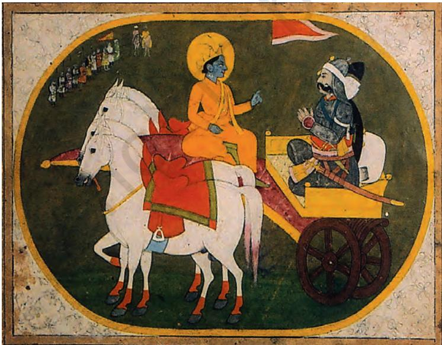

# THEME THREE

#### THEME TWO Kinship, Caste and Class Early Socie y Societies (C. 600 BCE-600 CE)

In the previous chapter we saw that there were several changes in economic and political life between *c.* 600 BCE and 600 CE. Some of these changes influenced societies as well. For instance, the extension of agriculture into forested areas transformed the lives of forest dwellers; craft specialists often emerged as distinct social groups; the unequal distribution of wealth sharpened social differences.

Historians often use textual traditions to understand these processes. Some texts lay down norms of social behaviour; others describe and occasionally comment on a wide range of social situations and practices. We can also catch a glimpse of some social actors from inscriptions. As we will see, each text (and inscription) was written from the perspective of specific social categories. So we need to keep in mind *who* composed *what* and for *whom*. We also need to consider the language used, and the ways in which the text

circulated. Used carefully, texts allow us to piece together attitudes and practices that shaped social histories.

In focusing on the *Mahabharata*, a colossal epic running in its present form into over 100,000 verses with depictions of a wide range of social categories and situations, we draw on one of the richest texts of the subcontinent. It was composed over a period of about 1,000 years (*c*. 500 BCE onwards), and some of the stories it contains may have been in circulation even earlier. The central story is about two sets of warring cousins. The text also contains sections laying down norms of behaviour for various social groups. Occasionally (though not always), the principal characters seem to follow these norms. What does conformity with norms and deviations from them signify?

*Fig. 3.1 A terracotta sculpture depicting a scene from the* Mahabharata *(West Bengal),* c*. seventeenth century*

#### *Fig. 3.2*

#### *A section of a page from the Critical Edition*

The section printed in large bold letters is part of the main text. The smaller print lists variations in different manuscripts, which were carefully catalogued.

#### 1. The Critical Edition of the Mahabharata

One of the most ambitious projects of scholarship began in 1919, under the leadership of a noted Indian Sanskritist, V.S. Sukthankar. A team comprising dozens of scholars initiated the task of preparing a critical edition of the *Mahabharata.* What exactly did this involve? Initially, it meant collecting Sanskrit manuscripts of the text, written in a variety of scripts, from different parts of the country.

The team worked out a method of comparing verses from each manuscript. Ultimately, they selected the verses that appeared common to most versions and published these in several volumes, running into over 13,000 pages. The project took 47 years to complete. Two things became apparent: there were several common elements in the Sanskrit versions of the story, evident in manuscripts found all over the subcontinent, from Kashmir and Nepal in the north to Kerala and Tamil Nadu in the south. Also evident were enormous regional variations in the ways in which the text had been transmitted over the centuries. These variations were documented in footnotes and appendices to the main text. Taken together, more than half the 13,000 pages are devoted to these variations.

 In a sense, these variations are reflective of the complex processes that shaped early (and later) social histories – through dialogues between dominant traditions and resilient local ideas and practices. These dialogues are characterised by moments of conflict as well as consensus.

Our understanding of these processes is derived primarily from texts written in Sanskrit by and for Brahmanas*.* When issues of social history were explored for the first time by historians in the nineteenth and twentieth centuries, they tended to take these texts at face value – believing that everything that was laid down in these texts was actually practised. Subsequently, scholars began studying other traditions, from works in Pali, Prakrit and Tamil. These studies indicated that the ideas contained in normative Sanskrit texts were on the whole recognised as authoritative: they were also questioned and occasionally even rejected. It is important to keep this in mind as we examine how historians reconstruct social histories.

# 2. Kinship and Marriage Many Rules and Varied Practices

#### 2.1 Finding out about families

We often take family life for granted. However, you may have noticed that not all families are identical: they vary in terms of numbers of members, their relationship with one another as well as the kinds of activities they share. Often people belonging to the same family share food and other resources, and live, work and perform rituals together. Families are usually parts of larger networks of people defined as relatives, or to use a more technical term, *kinfolk*. While familial ties are often regarded as "natural" and based on blood, they are defined in many different ways. For instance, some societies regard cousins as being blood relations, whereas others do not.

For early societies, historians can retrieve information about elite families fairly easily; it is, however, far more difficult to reconstruct the familial relationships of ordinary people. Historians also investigate and analyse *attitudes* towards family and kinship. These are important, because they provide an insight into people's thinking; it is likely that some of these ideas would have shaped their actions, just as actions may have led to changes in attitudes.

#### 2.2 The ideal of patriliny

Can we identify points when kinship relations changed? At one level, the *Mahabharata* is a story about this. It describes a feud over land and power between two groups of cousins, the Kauravas and the Pandavas, who belonged to a single ruling family, that of the Kurus, a lineage dominating one of the *janapadas* (Chapter 2, Map 1). Ultimately, the conflict ended in a battle, in which the Pandavas emerged victorious. After that, patrilineal succession was proclaimed. While patriliny had existed prior to the composition of the epic, the central story of the *Mahabharata* reinforced the idea that it was valuable. Under patriliny, sons could claim the resources (including the throne in the case of kings) of their fathers when the latter died.

Most ruling dynasties (*c.* sixth century BCE onwards) claimed to follow this system, although there were variations in practice: sometimes there were no sons,

# Terms for family and kin

Sanskrit texts use the term kula to designate families and jnati for the larger network of kinfolk. The term vamsha is used for lineage.

*Patriliny* means tracing descent from father to son, grandson and so on. *Matriliny* is the term used when descent is traced through the

mother.

in some situations brothers succeeded one another, sometimes other kinsmen claimed the throne, and, in very exceptional circumstances, women such as Prabhavati Gupta (Chapter 2) exercised power.

The concern with patriliny was not unique to ruling families. It is evident in mantras in ritual texts such as the *Rigveda.* It is possible that these attitudes were shared by wealthy men and those who claimed high status, including Brahmanas.

#### *Source 1*

## Producing "fine sons"

Here is an excerpt of a mantra from the Rigveda, which was probably inserted in the text c. 1000 BCE, to be chanted by the priest while conducting the marriage ritual. It is used in many Hindu weddings even today:

I free her from here, but not from there. I have bound her firmly there, so that through the grace of Indra she will have fine sons and be fortunate in her husband's love.

Indra was one of the principal deities, a god of valour, warfare and rain. "Here" and "there" refer to the father's and husband's house respectively.

Ü In the context of the mantra, discuss the implications of marriage from the point of view of the bride and groom. Are the implications identical, or are there differences?

#### *Source 2*

#### Why kinfolk quarrelled

This is an excerpt from the Adi Parvan (literally, the first section) of the Sanskrit Mahabharata, describing why conflicts arose amongst the Kauravas and Pandavas:

The Kauravas were the … sons of Dhritarashtra, and the Pandavas … were their cousins. Since Dhritarashtra was blind, his younger brother Pandu ascended the throne of Hastinapura (see Map 1) … However, after the premature death of Pandu, Dhritarashtra became king, as the royal princes were still very young. As the princes grew up together, the citizens of Hastinapura began to express their preference for the Pandavas, for they were more capable and virtuous than the Kauravas. This made Duryodhana, the eldest of the Kauravas, jealous. He approached his father and said, "You yourself did not receive the throne, although it fell to you, because of your defect. If the Pandava receives the patrimony from Pandu, his son will surely inherit it in turn, and so will his son, and his. We ourselves with our sons shall be excluded from the royal succession and become of slight regard in the eyes of the world, lord of the earth!"

Passages such as these may not have been literally true, but they give us an idea about what those who wrote the text thought. Sometimes, as in this case, they contain conflicting ideas.

Ü Read the passage and list the different criteria suggested for becoming king. Of these, how important was birth in a particular family? Which of these criteria seem justified? Are there any that strike you as unjust?

#### 2.3 Rules of marriage

While sons were important for the continuity of the patrilineage, daughters were viewed rather differently within this framework. They had no claims to the resources of the household. At the same time, marrying them into families outside the kin was considered desirable. This system, called exogamy (literally, marrying outside), meant that the lives of young girls and women belonging to families that claimed high status were often carefully regulated to ensure that they were married at the "right" time and to the "right" person. This gave rise to the belief that *kanyadana* or the gift of a daughter in marriage was an important religious duty of the father.

With the emergence of new towns (Chapter 2), social life became more complex. People from near

## Types of marriages

Endogamy refers to marriage within a unit – this could be a kin group, caste, or a group living in the same locality.

Exogamy refers to marriage outside the unit.

Polygyny is the practice of a man having several wives.

Polyandry is the practice of a woman having several husbands.

57

*Source 3*

# Eight forms of marriage

Here are the first, fourth, fifth and sixth forms of marriage from the Manusmriti:

First: The gift of a daughter, after dressing her in costly clothes and honouring her with presents of jewels, to a man learned in the Veda whom the father himself invites.

Fourth: The gift of a daughter by the father after he has addressed the couple with the text, "May both of you perform your duties together", and has shown honour to the bridegroom.

Fifth: When the bridegroom receives a maiden, after having given as much wealth as he can afford to the kinsmen and to the bride herself, according to his own will.

Sixth: The voluntary union of a maiden and her lover … which springs from desire …

Ü For each of the forms, discuss whether the decision about the marriage was taken by (a) the bride, (b) the bridegroom, (c) the father of the bride, (d) the father of the bridegroom, (e) any other person.

and far met to buy and sell their products and share ideas in the urban milieu. This may have led to a questioning of earlier beliefs and practices (see also Chapter 4). Faced with this challenge, the Brahmanas responded by laying down codes of social behaviour in great detail. These were meant to be followed by Brahmanas in particular and the rest of society in general. From *c*. 500 BCE, these norms were compiled in Sanskrit texts known as the Dharmasutras and Dharmashastras. The most important of such works, the *Manusmriti*, was compiled between *c*. 200 BCE and 200 CE.

While the Brahmana authors of these texts claimed that their point of view had universal validity and that what they prescribed had to be obeyed by everybody, it is likely that real social relations were more complicated. Besides, given the regional diversity within the subcontinent and the difficulties of communication, the influence of Brahmanas was by no means all-pervasive.

 What is interesting is that the Dharmasutras and Dharmashastras recognised as many as eight forms of marriage. Of these, the first four were considered as "good" while the remaining were condemned. It is possible that these were practised by those who did not accept Brahmanical norms.

## 2.4 The *gotra* of women

One Brahmanical practice, evident from *c.* 1000 BCE onwards, was to classify people (especially Brahmanas) in terms of *gotras*. Each *gotra* was named after a Vedic seer, and all those who belonged to the same *gotra* were regarded as his descendants. Two rules about *gotra* were particularly important: women were expected to give up their father's *gotra* and adopt that of their husband on marriage and members of the same *gotra* could not marry.

One way to find out whether this was commonly followed is to consider the names of men and women, which were sometimes derived from *gotra* names. These names are available for powerful ruling lineages such as the Satavahanas who ruled over parts of western India and the Deccan (*c.* second century BCE-second century CE). Several of their inscriptions have been recovered, which allow historians to trace family ties, including marriages.

#### *Source 4*

# Names of Satavahana kings from inscriptions

These are the names of several generations of Satavahana rulers, recovered from inscriptions. Note the uniform title raja. Also note the following word, which ends with the term puta, a Prakrit word meaning "son". The term Gotami-puta means "son of Gotami". Names like Gotami and Vasithi are feminine forms of Gotama and Vasistha, Vedic seers after whom gotras were named.

- raja Gotami-puta Siri-Satakani
- raja Vasithi-puta (sami-) Siri-Pulumayi
- raja Gotami-puta sami-Siri-Yana-Satakani
- raja Madhari-puta svami-Sakasena
- raja Vasathi-puta Chatarapana-Satakani
- raja Hariti-puta Vinhukada Chutukulanamda-Satakamni
	- raja Gotami-puta Siri-Vijaya- Satakani

Ü How many Gotami-putas and how many Vasithi (alternative spelling Vasathi)-putas are there?

#### *Fig. 3.3*

*A Satavahana ruler and his wife* This is one of the rare sculptural depictions of a ruler from the wall of a cave donated to Buddhist monks. This sculpture dates to *c*. second century BCE.

# Metronymics in the Upanishads

The Brihadaranyaka Upanishad, one of the earliest Upanishads (see also Chapter 4), contains a list of successive generations of teachers and students, many of whom were designated by metronymics.

*Source 5*

## A mother's advice

The Mahabharata describes how, when war between the Kauravas and the Pandavas became almost inevitable, Gandhari made one last appeal to her eldest son Duryodhana:

By making peace you honour your father and me, as well as your well-wishers … it is the wise man in control of his senses who guards his kingdom. Greed and anger drag a man away from his profits; by defeating these two enemies a king conquers the earth … You will happily enjoy the earth, my son, along with the wise and heroic Pandavas … There is no good in a war, no law (dharma) and profit (artha), let alone happiness; nor is there (necessarily) victory in the end – don't set your mind on war …

Duryodhana did not listen to this advice and fought and lost the war.

Ü Does this passage give you an idea about the way in which mothers were viewed in early Indian societies?

# Ü Discuss...

How are children named today? Are these ways of naming similar to or different from those described in this section?

Some of the Satavahana rulers were polygynous (that is, had more than one wife). An examination of the names of women who married Satavahana rulers indicates that many of them had names derived from *gotras* such as Gotama and Vasistha, their father's *gotras.* They evidently retained these names instead of adopting names derived from their husband's *gotra* name as they were required to do according to the Brahmanical rules. What is also apparent is that some of these women belonged to the same *gotra.* As is obvious, this ran counter to the ideal of exogamy recommended in the Brahmanical texts. In fact, it exemplified an alternative practice, that of endogamy or marriage within the kin group, which was (and is) prevalent amongst several communities in south India. Such marriages amongst kinfolk (such as cousins) ensured a close-knit community.

It is likely that there were variations in other parts of the subcontinent as well, but as yet it has not been possible to reconstruct specific details.

#### 2.5 Were mothers important?

We have seen that Satavahana rulers were identified through metronymics (names derived from that of the mother). Although this may suggest that mothers were important, we need to be cautious before we arrive at any conclusion. In the case of the Satavahanas we know that succession to the throne was generally patrilineal.

#### *Fig. 3.4 A battle scene*

This is amongst the earliest sculptural depictions of a scene from the *Mahabharata*, a terracotta sculpture from the walls of a temple in Ahichchhatra (Uttar Pradesh), *c*. fifth century CE.

# 3. Social Differences: Within and Beyond the Framework of Caste

You are probably familiar with the term caste, which refers to a set of hierarchically ordered social categories. The ideal order was laid down in the Dharmasutras and Dharmashastras*.* Brahmanas claimed that this order, in which they were ranked first, was divinely ordained, while placing groups classified as Shudras and "untouchables" at the very bottom of the social order. Positions within the order were supposedly determined by birth.

#### 3.1 The "right" occupation

The Dharmasutras and Dharmashastras also contained rules about the ideal "occupations" of the four categories or *varnas.* Brahmanas were supposed to study and teach the Vedas, perform sacrifices and get sacrifices performed, and give and receive gifts. Kshatriyas were to engage in warfare, protect people and administer justice, study the Vedas, get sacrifices performed, and make gifts. The last three "occupations" were also assigned to the Vaishyas*,* who were in addition expected to engage in agriculture, pastoralism and trade. Shudras were assigned only one occupation – that of serving the three "higher" *varnas.*

The Brahmanas evolved two or three strategies for enforcing these norms. One, as we have just seen, was to assert that the *varna* order was of divine origin. Second, they advised kings to ensure that these norms were followed within their kingdoms. And third, they attempted to persuade people that their status was determined by birth. However, this was not always easy. So prescriptions were often reinforced by stories told in the *Mahabharata* and other texts.

#### *Source 6*

#### A divine order?

To justify their claims, Brahmanas often cited a verse from a hymn in the Rigveda known as the Purusha sukta, describing the sacrifice of Purusha, the primeval man. All the elements of the universe, including the four social categories, were supposed to have emanated from his body:

The Brahmana was his mouth, of his arms was made the Kshatriya.

His thighs became the Vaishya, of his feet the Shudra was born.

Ü Why do you think the Brahmanas quoted this verse frequently?

#### *Source 7*

#### "Proper" social roles

Here is a story from the Adi Parvan of the Mahabharata:

Once Drona, a Brahmana who taught archery to the Kuru princes, was approached by Ekalavya, a forestdwelling nishada (a hunting community). When Drona, who knew the dharma, refused to have him as his pupil, Ekalavya returned to the forest, prepared an image of Drona out of clay, and treating it as his teacher, began to practise on his own. In due course, he acquired great skill in archery. One day, the Kuru princes went hunting and their dog, wandering in the woods, came upon Ekalavya. When the dog smelt the dark nishada wrapped in black deer skin, his body caked with dirt, it began to bark. Annoyed, Ekalavya shot seven arrows into its mouth. When the dog returned to the Pandavas, they were amazed at this superb display of archery. They tracked down Ekalavya, who introduced himself as a pupil of Drona.

Drona had once told his favourite student Arjuna, that he would be unrivalled amongst his pupils. Arjuna now reminded Drona about this. Drona approached Ekalavya, who immediately acknowledged and honoured him as his teacher. When Drona demanded his right thumb as his fee, Ekalavya unhesitatingly cut it off and offered it. But thereafter, when he shot with his remaining fingers, he was no longer as fast as he had been before. Thus, Drona kept his word: no one was better than Arjuna.

#### 3.2 Non-Kshatriya kings

According to the Shastras*,* only Kshatriyas could be kings. However, several important ruling lineages probably had different origins. The social background of the Mauryas, who ruled over a large empire, has been hotly debated. While later Buddhist texts suggested they were Kshatriyas*,* Brahmanical texts described them as being of "low" origin. The Shungas and Kanvas, the immediate successors of the Mauryas, were Brahmanas. In fact, political power was effectively open to anyone who could muster support and resources, and rarely depended on birth as a Kshatriya.

Other rulers, such as the Shakas who came from Central Asia, were regarded as *mlechchhas*,

Ü What message do you think this story was meant to convey to the *nishadas?* What message would it convey to Kshatriyas*?* Do you think that Drona, as a Brahmana, was acting according to the Dharmasutras when he was teaching archery?

barbarians or outsiders by the Brahmanas. However, one of the earliest inscriptions in Sanskrit describes how Rudradaman, the best-known Shaka ruler (*c.* second century CE), rebuilt Sudarshana lake (Chapter 2). This suggests that powerful *mlechchhas* were familiar with Sanskritic traditions.

It is also interesting that the best-known ruler of the Satavahana dynasty, Gotami-puta Siri-Satakani, claimed to be both a unique Brahmana (*eka bamhana)* and a destroyer of the pride of Kshatriyas*.* He also claimed to have ensured that there was no intermarriage amongst members of the four *varnas.* At the same time, he entered into a marriage alliance with the kin of Rudradaman.

As you can see from this example, integration within the framework of caste was often a complicated process. The Satavahanas claimed to be Brahmanas*,* whereas according to the Brahmanas*,* kings ought to have been Kshatriyas*.* They claimed to uphold the fourfold *varna* order, but entered into marriage alliances with people who were supposed to be excluded from the system. And, as we have seen, they practised endogamy instead of the exogamous system recommended in the Brahmanical texts.

#### 3.3 *Jatis* and social mobility

These complexities are reflected in another term used in texts to refer to social categories – *jati.* In Brahmanical theory, *jati,* like *varna*, was based on birth. However, while the number of *varnas* was fixed at four, there was no restriction on the number of *jatis.* In fact, whenever Brahmanical authorities encountered new groups – for instance, people living in forests such as the *nishadas* – or wanted to assign a name to occupational categories such as the goldsmith or *suvarnakara,* which did not easily fit into the fourfold *varna* system, they classified them as a *jati. Jatis* which shared a common occupation or profession were sometimes organised into *shrenis* or guilds.

We seldom come across documents that record the histories of these groups. But there are exceptions. One interesting stone inscription (*c*. fifth century CE), found in Mandasor (Madhya Pradesh), records the history of a guild of silk weavers who originally lived in Lata (Gujarat), from where they

*Fig. 3.5 Silver coin depicting a Shaka ruler,* c*. fourth century CE*

# The case of the merchants

Sanskrit texts and inscriptions used the term vanik to designate merchants. While trade was defined as an occupation for Vaishyas in the Shastras, a more complex situation is evident in plays such as the Mrichchhakatika written by Shudraka (c. fourth century CE), Here, the hero Charudatta was described as both a Brahmana and a sarthavaha or merchant And a fifth-century inscription describes two brothers who made a donation for the construction of a temple as kshatriya-vaniks.

Ü Do you think the silk weavers were following the occupation laid down for them in the Shastras?

migrated to Mandasor, then known as Dashapura. It states that they undertook the difficult journey along with their children and kinfolk, as they had heard about the greatness of the local king, and wanted to settle in his kingdom.

The inscription provides a fascinating glimpse of complex social processes and provides insights into the nature of guilds or *shrenis*. Although membership was based on a shared craft specialisation, some members adopted other occupations. It also indicates that the members shared more than a common profession – they collectively decided to invest their wealth, earned through their craft, to construct a splendid temple in honour of the sun god.

#### *Source 8*

# What the silk weavers did

Here is an excerpt from the inscription, which is in Sanskrit:

Some are intensely attached to music (so) pleasing to the ear; others, being proud of (the authorship of) a hundred excellent biographies, are conversant with wonderful tales; (others), filled with humility, are absorbed in excellent religious discourses; … some excel in their own religious rites; likewise by others, who were self-possessed, the science of (Vedic) astronomy was mastered; and others, valorous in battle, even today forcibly cause harm to the enemies.

## 3.4 Beyond the four *varnas*: Integration

Given the diversity of the subcontinent, there were, and always have been, populations whose social practices were not influenced by Brahmanical ideas. When they figure in Sanskrit texts, they are often described as odd, uncivilised, or even animal-like. In some instances, these included forest-dwellers – for whom hunting and gathering remained an important means of subsistence. Categories such as the *nishada,* to which Ekalavya is supposed to have belonged, are examples of this.

Others who were viewed with suspicion included populations such as nomadic pastoralists, who could not be easily accommodated within the framework of settled agriculturists. Sometimes those who spoke non-Sanskritic languages were labelled as

*mlechchhas* and looked down upon. There was nonetheless also a sharing of ideas and beliefs between these people. The nature of relations is evident in some stories in the *Mahabharata.*

#### *Source 9*

## A tiger-like husband

This is a summary of a story from the Adi Parvan of the Mahabharata:

The Pandavas had fled into the forest. They were tired and fell asleep; only Bhima, the second Pandava, renowned for his prowess, was keeping watch. A man-eating rakshasa caught the scent of the Pandavas and sent his sister Hidimba to capture them. She fell in love with Bhima, transformed herself into a lovely maiden and proposed to him. He refused. Meanwhile, the rakshasa arrived and challenged Bhima to a wrestling match. Bhima accepted the challenge and killed him. The others woke up hearing the noise. Hidimba introduced herself, and declared her love for Bhima. She told Kunti: "I have forsaken my friends, my dharma and my kin; and good lady, chosen your tiger-like son for my man … whether you think me a fool, or your devoted servant, let me join you, great lady, with your son as my husband."

Ultimately, Yudhisthira agreed to the marriage on condition that they would spend the day together but that Bhima would return every night. The couple roamed all over the world during the day. In due course Hidimba gave birth to a rakshasa boy named Ghatotkacha. Then the mother and son left the Pandavas. Ghatotkacha promised to return to the Pandavas whenever they needed him.

Some historians suggest that the term rakshasa is used to describe people whose practices differed from those laid down in Brahmanical texts.

#### 3.5 Beyond the four *varnas* Subordination and conflict

While the Brahmanas considered some people as being outside the system, they also developed a sharper social divide by classifying certain social categories as "untouchable". This rested on a notion that certain activities, especially those connected with the performance of rituals, were sacred and by Ü Identify the practices described in this passage which seem non-Brahmanical. extension "pure". Those who considered themselves pure avoided taking food from those they designated as "untouchable". In sharp contrast to the purity aspect, some activities were regarded as particularly "polluting". These included handling corpses and dead animals. Those who performed such tasks, designated as *chandalas,* were placed at the very bottom of the hierarchy. Their touch and, in some cases, even seeing them was regarded as "polluting" by those who claimed to be at the top of the social order.

The *Manusmriti* laid down the "duties" of the *chandalas.* They had to live outside the village, use discarded utensils, and wear clothes of the dead and ornaments of iron. They could not walk about in

villages and cities at night. They had to dispose of the bodies of those who had no relatives and serve as executioners. Much later, the Chinese Buddhist monk Fa Xian (*c.* fifth century CE) wrote that "untouchables" had to sound a clapper in the streets so that people could avoid seeing them. Another Chinese pilgrim, Xuan Zang (*c.* seventh century), observed that executioners and scavengers were forced to live outside the city.

By examining non-Brahmanical texts which depict the lives of *chandalas*, historians have tried to find out whether *chandalas* accepted the life of degradation prescribed in the Shastras. Sometimes, these depictions correspond with those in the Brahmanical texts. But occasionally, there are hints of different social realities.

*Fig. 3.6*

c*. third century, CE*

*Depiction of a mendicant seeking alms, stone sculpture (Gandhara)*

#### *Source 10*

#### **A Story of Bodhisattva from the Matanga Jataka**

Did chandalas resist the attempts to push them to the bottom of the social order? Read this story, which is part of the Matanga Jataka, a Pali text, where the Bodhisattva (the Buddha in a previous birth) is identified as a chandala.

Once, the Bodhisattva was born outside the city of Banaras as a chandala's son and named Matanga. One day, when he had gone to the city on some work, he encountered Dittha Mangalika, the daughter of a merchant. When she saw him, she exclaimed "I have seen something inauspicious" and washed her eyes. The angry hangers-on then beat him up. In protest, he went and lay down at the door of her father's house. On the seventh day they brought out the girl and gave her to him. She carried the starving Matanga back to the chandala settlement. Once he returned home, he decided to renounce the world. After attaining spiritual powers, he returned to Banaras and married her. A son named Mandavya Kumara was born to them. He learnt the three Vedas as he grew up and began to provide food to 16,000 Brahmanas every day.

One day, Matanga, dressed in rags, with a clay alms bowl in his hand, arrived at his son's doorstep and begged for food. Mandavya replied that he looked like an outcaste and was unworthy of alms; the food was meant for the Brahmanas. Matanga said: "Those who are proud of their birth and are ignorant do not deserve gifts. On the contrary, those who are free from vices are worthy of offerings." Mandavya lost his temper and asked his servants to throw the man out. Matanga rose in the air and disappeared. When Dittha Mangalika learnt about the incident, she followed Matanga and begged his forgiveness. He asked her to take a bit of the leftover from his bowl and give it to Mandavya and the Brahmanas …

‹Identify elements in the story that suggest that it was written from the perspective of Matanga.

# ‹ Discuss...

Which of the sources mentioned in this section suggest that people followed the occupations laid down by Brahmanas*?* Which sources suggest other possibilities?

4. Beyond Birth

## Resources and Status

If you recall the economic relations discussed in Chapter 2, you will realise that slaves, landless agricultural labourers, hunters, fisherfolk, pastoralists, peasants, village headmen, craftspersons, merchants and kings emerged as social actors in different parts of the subcontinent. Their social positions were often shaped by their access to economic resources. Here we will examine the social implications of access to resources in certain specific situations.

## 4.1 Gendered access to property

Consider first a critical episode in the *Mahabharata.* During the course of the long-drawn rivalry between the Kauravas and the Pandavas, Duryodhana invited Yudhisthira to a game of dice. The latter, who was deceived by his rival, staked his gold, elephants, chariots, slaves, army, treasury, kingdom, the property of his subjects, his brothers and finally himself and lost all. Then he staked their common wife Draupadi and lost her too.

Issues of ownership, foregrounded in stories such as this one (Source 11), also figure in the Dharmasutras and Dharmashastras*.* According to the *Manusmriti,* the paternal estate was to be divided equally amongst sons after the death of the parents, with a special share for the eldest. Women could not claim a share of these resources.

However, women were allowed to retain the gifts they received on the occasion of their marriage as *stridhana* (literally, a woman's wealth). This could be inherited by their children, without the husband having any claim on it. At the same time, the *Manusmriti* warned women against hoarding family property, or even their own valuables, without the husband's permission.

You have read about wealthy women such as the Vakataka queen Prabhavati Gupta (Chapter 2). However, cumulative evidence – both epigraphic and textual – suggests that while upper-class women may have had access to resources, land, cattle and money were generally controlled by men. In other words, social differences between men and women were sharpened because of the differences in access to resources.

*Source 11*

#### Draupadi's question

Draupadi is supposed to have asked Yudhisthira whether he had lost himself before staking her. Two contrary opinions were expressed in response to this question.

One, that even if Yudhisthira had lost himself earlier, his wife remained under his control, so he could stake her.

Two, that an unfree man (as Yudhisthira was when he had lost himself) could not stake another person.

The matter remained unresolved; ultimately, Dhritarashtra restored to the Pandavas and Draupadi their personal freedom.

Ü Do you think that this episode suggests that wives could be treated as the property of their husbands?

#### *Source 12*

# How could men and women acquire wealth?

For men, the Manusmriti declares, there are seven means of acquiring wealth: inheritance, finding, purchase, conquest, investment, work, and acceptance of gifts from good people.

For women, there are six means of acquiring wealth: what was given in front of the fire (marriage) or the bridal procession, or as a token of affection, and what she got from her brother, mother or father. She could also acquire wealth through any subsequent gift and whatever her "affectionate" husband might give her.

Ü Compare and contrast the ways in which men and women could acquire wealth.

#### 4.2 *Varna* and access to property

According to the Brahmanical texts, another criterion (apart from gender) for regulating access to wealth was *varna.* As we saw earlier, the only "occupation" prescribed for Shudras was servitude, while a variety of occupations were listed for men of the first three *varnas*. If these provisions were actually implemented, the wealthiest men would have been the Brahmanas and the Kshatriyas*.* That this corresponded to some extent with social realities is evident from descriptions of priests and kings in other textual traditions. Kings are almost invariably depicted as wealthy; priests are also generally shown to be rich, though there are occasional depictions of the poor Brahmana*.*

At another level, even as the Brahmanical view of society was codified in the Dharmasutras and Dharmashastras*,* other traditions developed critiques of the *varna* order. Some of the best-known of these were developed within early Buddhism (*c.* sixth century BCE onwards; see also Chapter 4). The Buddhists recognised that there were differences in society, but did not regard these as natural or inflexible. They also rejected the idea of claims to status on the basis of birth.

*Source 13*

# The wealthy Shudra

This story, based on a Buddhist text in Pali known as the Majjhima Nikaya, is part of a dialogue between a king named Avantiputta and a disciple of the Buddha named Kachchana. While it may not be literally true, it reveals Buddhist attitudes towards varna.

Avantiputta asked Kachchana what he thought about Brahmanas who held that they were the best caste and that all other castes were low; that Brahmanas were a fair caste while all other castes were dark; that only Brahmanas were pure, not non-Brahmanas; that Brahmanas were sons of Brahma, born of his mouth, born of Brahma, formed by Brahma, heirs to Brahma.

Kachchana replied: "What if a Shudra were wealthy … would another Shudra …or a Kshatriya or a Brahmana or a Vaishya … speak politely to him?"

Avantiputta replied that if a Shudra had wealth or corn or gold or silver, he could have as his obedient servant another Shudra to get up earlier than he, to go to rest later, to carry out his orders, to speak politely; or he could even have a Kshatriya or a Brahmana or a Vaishya as his obedient servant.

Kachchana asked: "This being so, are not these four varnas exactly the same?"

Avantiputta conceded that there was no difference amongst the varnason this count.

#### 4.3 An alternative social scenario: Sharing wealth

So far we have been examining situations where people either claimed or were assigned status on the basis of their wealth. However, there were other possibilities as well; situations where men who were generous were respected, while those who were miserly or simply accumulated wealth for themselves were despised. One area where these values were cherished was ancient Tamilakam, where, as we saw earlier (Chapter 2), there were several chiefdoms around 2,000 years ago. Amongst other things, the chiefs were patrons of bards and poets who sang their praise. Poems included in the Tamil Sangam anthologies often illuminate social and economic

Ü Read Avantiputta's first statement again. What are the ideas in it that are derived from Brahmanical texts/traditions? Can you identify the source of any of these? What, according to this text, explains social difference?

relationships, suggesting that while there were differences between rich and poor, those who controlled resources were also expected to share them.

#### *Source 14*

# The poor generous chief In this composition from the Puranaruru, one of the anthologies of poems of the Tamil Sangam literature (c. first century CE), a bard describes his patron to other poets thus : He (i.e. the patron) doesn't have the wealth to lavish on others everyday Nor does he have the pettiness to say that he has nothing and so refuse! … he lives in Irantai (a place) and is generous. He is an enemy to the hunger of bards! If you wish to cure your poverty, come along with me, bards whose lips are so skilled! If we request him, showing him our ribs thin with hunger, he will go to the blacksmith of his village And will say to that man of powerful hands: "Shape me a long spear for war, one that has a straight blade!" Ü What are the strategies which the bard uses to try and persuade the chief to be generous? What is the chief expected to do to acquire wealth in order to give some to the bards? *Fig. 3.7*

# Ü Discuss...

How do social relationships operate in present-day societies? Are there any similarities or differences with patterns of the past?

*A chief and his follower, stone sculpture, Amaravati (Andhra Pradesh),* c*. second century CE*

> Ü How has the sculptor shown the difference between the chief and his follower?

# 5. Explaining Social Differences:

# A Social Contract

The Buddhists also developed an alternative understanding of social inequalities, and of the institutions required to regulate social conflict. In a myth found in a text known as the *Sutta Pitaka* they suggested that originally human beings did not have fully evolved bodily forms, nor was the world of plants fully developed. All beings lived in an idyllic state of peace, taking from nature only what they needed for each meal.

However, there was a gradual deterioration of this state as human beings became increasingly greedy, vindictive and deceitful. This led them to wonder: "What if we were to select a certain being who should be wrathful when indignation is right, who should censure that which should rightly be censured and should banish him who deserves to be banished? We will give him in return a proportion of the rice … chosen by the whole people, he will be known as *mahasammata,* the great elect."

This suggests that the institution of kingship was based on human choice, with taxes as a form of payment for services rendered by the king. At the same time, it reveals recognition of human agency in creating and institutionalising economic and social relations. There are other implications as well. For instance, if human beings were responsible for the creation of the system, they could also change it in future.

# 6. Handling Texts

#### His torians and the Mahabharata

If you look through the sources cited in this chapter once more you will notice that historians consider several elements when they analyse texts. They examine whether texts were written in Prakrit, Pali or Tamil, *languages* that were probably used by ordinary people, or in Sanskrit, a language meant almost exclusively for priests and elites. They also consider the *kinds* of text. Were these mantras, learnt and chanted by ritual specialists, or stories that people could have read, or heard, and then retold if they found them interesting? Besides, they try to find out about the *author(s)* whose perspectives and ideas shaped the text, as well as the intended

*audience*, as, very often, authors keep the interests of their audience in mind while composing their work. And they try and ascertain the possible *date* of the composition or compilation of the texts as well as the *place* where they may have been composed. It is only after making these assessments that they draw on the *content* of texts to arrive at an understanding of their historical significance. As you can imagine, this is a particularly difficult task for a text as complex as the *Mahabharata.*

#### 6.1 Language and content

Let us look at the language of the text. The version of the *Mahabharata* we have been considering is in Sanskrit (although there are versions in other languages as well). However, the Sanskrit used in the *Mahabharata* is far simpler than that of the Vedas, or of the *prashastis* discussed in Chapter 2. As such, it was probably widely understood.

Historians usually classify the contents of the present text under two broad heads – sections that contain stories, designated as the *narrative*, and sections that contain prescriptions about social norms, designated as *didactic.* This division is by no means watertight – the didactic sections include stories, and the narrative often contains a social message. However, generally historians agree that the *Mahabharata* was meant to be a dramatic, moving story, and that the didactic portions were probably added later.

*Didactic* refers to something that is meant for purposes of instruction.

*Fig. 3.8 Krishna advises Arjuna on the battlefield*

This painting dates to the eighteenth century. Perhaps the most important didactic section of the *Mahabharata* is the *Bhagavad Gita*, which contains the advice offered by Lord Krishna to Arjuna. This scene is frequently depicted in painting and sculpture.

Interestingly, the text is described as an *itihasa* within early Sanskrit tradition. The literal meaning of the term is "thus it was", which is why it is generally translated as "history". Was there a real war that was remembered in the epic? We are not sure. Some historians think that the memory of an actual conflict amongst kinfolk was preserved in the narrative; others point out that there is no other corroborative evidence of the battle.

#### 6.2 Author(s) and dates

Who wrote the text? This is a question to which there are several answers. The original story was probably composed by charioteer-bards known as *sutas* who generally accompanied Kshatriya warriors to the battlefield and composed poems celebrating their victories and other achievements. These compositions circulated orally. Then, from the fifth century BCE, Brahmanas took over the story and began to commit it to writing. This was the time when chiefdoms such as those of the Kurus and

*Fig. 3.9 Lord Ganesha the scribe* According to tradition, Vyasa dictated the text to the deity. This illustration is from a Persian translation of the *Mahabharata*, *c*. 1740-50.

Panchalas, around whom the story of the epic revolves, were gradually becoming kingdoms. Did the new kings want their *itihasa* to be recorded and preserved more systematically? It is also possible that the upheavals that often accompanied the establishment of these states, where old social values were often replaced by new norms, are reflected in some parts of the story.

We notice another phase in the composition of the text between *c*. 200 BCE and 200 CE. This was the period when the worship of Vishnu was growing in importance, and Krishna, one of the important figures of the epic, was coming to be identified with Vishnu. Subsequently, between *c.* 200 and 400 CE , large didactic sections resembling the *Manusmriti* were added. With these additions, a text which initially perhaps had less than 10,000 verses grew to comprise about 100,000 verses. This enormous composition is traditionally attributed to a sage named Vyasa.

#### 6.3 The search for convergence

The *Mahabharata,* like any major epic, contains vivid descriptions of battles, forests, palaces and settlements. In 1951-52, the archaeologist B.B. Lal excavated at a village named Hastinapura in Meerut (Uttar Pradesh). Was this the Hastinapura of the epic? While the similarity in names could be coincidental, the location of the site in the Upper Ganga doab, where the Kuru kingdom was situated, suggests that it may have been the capital of the Kurus mentioned in the text.

Lal found evidence of five occupational levels, of which the second and third are of interest to us. This is what Lal noted about the houses in the second phase ( *c*. twelfth-seventh centuries BCE): "Within the limited area excavated, no definite plans of houses were obtained, but walls of mud and mud-bricks were duly encountered. The discovery of mud-plaster with prominent reed-marks suggested that some of the houses had reed walls plastered over with mud." For the third phase (*c.* sixth-third centuries BCE), he noted: "Houses of this period were built of mud-brick as well as burnt bricks. Soakage jars and brick drains were used for draining out refuse water, while terracotta ring-wells may have been used both as wells and drainage pits." KINSHIP, CASTE AND CLASS

*Source 15*

## Hastinapura

This is how the city is described in the Adi Parvan of the Mahabharata:

The city, bursting like the ocean, packed with hundreds of mansions, displayed with its gateways, arches and turrets like massing clouds the splendour of Great Indra's city.

*Source 16* Ü Do you think Lal's finds match the description of Hastinapura in the epic?

*Fig. 3.10 A wall excavated at Hastinapura*

Was the description of the city in the epic added after the main narrative had been composed, when (after the sixth century BCE) urban centres flourished in the region? Or was it a flight of poetic fancy, which cannot always be verified by comparisons with other kinds of evidence?

Consider another instance. One of the most challenging episodes in the *Mahabharata* is Draupadi's marriage with the Pandavas, an instance of polyandry that is central to the narrative. If we examine the section of the epic that describes this event, it is evident that the author(s) attempted to explain it in a variety of ways.

## Draupadi's marriage

Drupada, the king of Panchala, organised a competition where the challenge was to string a bow and hit a target; the winner would be chosen to marry his daughter Draupadi. Arjuna was victorious and was garlanded by Draupadi. The Pandavas returned with her to their mother Kunti, who, even before she saw them, asked them to share whatever they had got. She realised her mistake when she saw Draupadi, but her command could not be violated. After much deliberation, Yudhisthira decided that Draupadi would be their common wife.

When Drupada was told about this, he protested. However, the seer Vyasa arrived and told him that the Pandavas were in reality incarnations of Indra, whose wife had been reborn as Draupadi, and they were thus destined for each other.

Vyasa added that in another instance a young woman had prayed to Shiva for a husband, and in her enthusiasm, had prayed five times instead of once. This woman was now reborn as Draupadi, and Shiva had fulfilled her prayers. Convinced by these stories, Drupada consented to the marriage.

Ü Why do you think the author(s) offered three explanations for a single episode?

Present-day historians suggest that the fact that the author(s) describe a polyandrous union indicates that polyandry may have been prevalent amongst ruling elites at some point of time. At the same time, the fact that so many different explanations are offered for the episode (Source 16) suggests that polyandry gradually fell into disfavour amongst the Brahmanas, who reworked and developed the text through the centuries.

Some historians note that while the practice of polyandry may have seemed unusual or even undesirable from the Brahmanical point of view, it was (and is) prevalent in the Himalayan region. Others suggest that there may have been a shortage of women during times of warfare, and this led to polyandry. In other words, it was attributed to a situation of crisis.

Some early sources suggest that polyandry was not the only or even the most prevalent form of marriage. Why then did the author(s) choose to associate this practice with the central characters of the *Mahabharata*? We need to remember that creative literature often has its own narrative requirements and does not always literally reflect social realities.

# 7. A Dynamic Text

The growth of the *Mahabharata* did not stop with the Sanskrit version. Over the centuries, versions of the epic were written in a variety of languages through an ongoing process of dialogue between peoples, communities, and those who wrote the texts. Several stories that originated in specific regions or circulated amongst certain people found their way into the epic. At the same time, the central story of the epic was often retold in different ways. And episodes were depicted in sculpture and painting. They also provided themes for a wide range of performing arts – plays, dance and other kinds of narrations.

# Ü Discuss...

Read the excerpts from the *Mahabharata* included in this chapter once more. For each of these, discuss whether they could have been literally true. What do these excerpts tell us about those who composed the text? What do they tell us about those who must have read or heard the epic?

Most retellings or re-enactments of the epic draw on the main narrative in creative ways. Let us look at one example, an episode from the *Mahabharata* that has been transformed by Mahashweta Devi, a contemporary Bengali writer known for raising her voice against all forms of exploitation and oppression. In this particular instance, she works out alternative possibilities from the main story of the *Mahabharata* and draws attention to questions on which the Sanskrit text is silent.

 The Sanskrit text describes how Duryodhana plotted to kill the Pandavas by inviting them to stay in a specially prepared house of lac, which he planned to set on fire. Forewarned, the Pandavas dug a tunnel to ensure their escape. Then Kunti arranged for a feast. While most of the invitees were Brahmanas, a *nishada* woman came with her five sons. When they were satiated with drink and fell off to sleep, the Pandavas escaped, setting fire to the house. When the bodies of the woman and her sons were discovered, people thought that the Pandavas were dead.

In her short story titled "Kunti O Nishadi", Mahashweta Devi takes up the narrative from where the *Mahabharata* ends it. She sets the story in a forest, where Kunti retires after the war. Kunti now has time to reflect on her past, and often confesses to what she regards as her failings, talking with the earth, the symbol of nature. Every day she sees the *nishadas* who come to collect wood, honey, tubers and roots. One *nishadi* (a *nishada* woman) often listens to Kunti when she talks with the earth.

One day, there was something in the air; the animals were fleeing the forest. Kunti noticed that the *nishadi* was watching her, and was startled when she spoke to her and asked if she remembered the house of lac. Yes, Kunti said, she did. Did she remember a certain elderly *nishadi* and her five young sons? And that she had served them wine till they were senseless, while she escaped with her own sons? That *nishadi* … "Not you!" Kunti exclaimed. The *nishadi* replied that the woman who was killed had been her mother-in-law. She added that while Kunti had been reflecting on her past, not once did she remember the six innocent lives that were lost because she had wanted to save herself and her sons. As they spoke, the flames drew nearer. The *nishadi* escaped to safety, but Kunti remained where she was.

# Timeline 1 Major Textual Traditions

| c. 500 BCE | Ashtadhyayi of Panini, a work on Sanskrit grammar |
| --- | --- |
| c. 500-200 BCE | Major Dharmasutras (in Sanskrit) |
| c. 500-100 BCE | Early Buddhist texts including the Tripitaka (in Pali) |
| c. 500 BCE-400 CE | Ramayana and Mahabharata (in Sanskrit) |
| c. 200 BCE-200 CE | Manusmriti (in Sanskrit); composition and compilation |
|  | of Tamil Sangam literature |
| c. 100 CE | Charaka and Sushruta Samhitas, works on medicine |
|  | (in Sanskrit) |
| c. 200 CE onwards | Compilation of the Puranas (in Sanskrit) |
| c. 300 CE | Natyashastra of Bharata, a work on dramaturgy |
|  | (in Sanskrit) |
| c. 300-600 CE | Other Dharmashastras (in Sanskrit) |
| c. 400-500 CE | Sanskrit plays including the works of Kalidasa; |
|  | works on astronomy and mathematics by Aryabhata and |
|  | Varahamihira (in Sanskrit); compilation of Jaina works |
|  | (in Prakrit) |

# Timeline 2

#### Major Landmarks in the Study of the Mahabharata

| Twentieth century |  |
| --- | --- |
| 1919-66 | Preparation and publication of the Critical Edition of the |
|  | Mahabharata |
| 1973 | J.A.B. van Buitenen begins English translation of the Critical |
|  | Edition; remains incomplete after his death in 1978 |

## Answer in 100-150 words

- 1. Explain why patriliny may have been particularly important among elite families.
- 2. Discuss whether kings in early states were invariably Kshatriyas *.*
- 3. Compare and contrast the *dharma* or norms mentioned in the stories of Drona, Hidimba and Matanga.
- 4. In what ways was the Buddhist theory of a social contract different from the Brahmanical view of society derived from the *Purusha sukta?*
- 5. The following is an excerpt from the *Mahabharata,* in which Yudhisthira, the eldest Pandava, speaks to Sanjaya, a messenger:

Sanjaya, convey my respectful greetings to all the Brahmanas and the chief priest of the house of Dhritarashtra. I bow respectfully to teacher Drona … I hold the feet of our preceptor Kripa … (and) the chief of the Kurus, the great Bhishma. I bow respectfully to the old king (Dhritarashtra). I greet and ask after the health of his son Duryodhana and his younger brother ... Also greet all the young Kuru warriors who are our brothers, sons and grandsons … Greet above all him, who is to us like father and mother, the wise Vidura (born of a slave woman) ... I bow to the elderly ladies who are known as our mothers. To those who are our wives you say this, "I hope they are well-protected"… Our daughters-inlaw born of good families and mothers of children greet on my behalf. Embrace for me those who are our daughters … The beautiful, fragrant, well-dressed courtesans of ours you should also greet. Greet the slave women and their children, greet the aged, the maimed (and) the helpless …

Try and identify the criteria used to make this list – in terms of age, gender, kinship ties. Are there any other criteria? For each category, explain why they are placed in a particular position in the list.

- 6. This is what a famous historian of Indian literature, Maurice Winternitz, wrote about the *Mahabharata:* "just because the Mahabharata represents more of an entire literature … and contains so much and so many kinds of things, … (it) gives(s) us an insight into the most profound depths of the soul of the Indian folk." Discuss.
- 7. Discuss whether the *Mahabharata* could have been the work of a single author.
- 8. How important were gender differences in early societies? Give reasons for your answer.
- 9. Discuss the evidence that suggests that Brahmanical prescriptions about kinship and marriage were not universally followed.

# Map work

- 10. Compare the map in this chapter with Map 1 in Chapter 2. List the *mahajanapadas* and cities located near the Kuru-Panchala lands.
# Project (any one)

- 11. Find out about retellings of the *Mahabharata* in other languages. Discuss how they handle any two of the episodes of the text described in this chapter, explaining any similarities or differences that you notice.
- 12. Imagine that you are an author and rewrite the story of Ekalavya from a perspective of your choice.

If you would like to know more, read: Uma Chakravarti. 2006.

Everyday Lives, Everyday Histories. Tulika, New Delhi.

Irawati Karve. 1968. Kinship Organisation in India. Asia Publishing House, Bombay.

R.S. Sharma. 1983. Perspectives in Social and Economic History of Early India. Munshiram Manoharlal, New Delhi.

V.S. Sukthankar. 1957. On the Meaning of the Mahabharata. Asiatic Society of Bombay, Bombay.

Romila Thapar. 2000. Cultural Pasts: Essays in Early Indian History. Oxford University Press, New Delhi.

For more information, you could visit: http://bombay.indology.info/ mahabharata/statement.html

