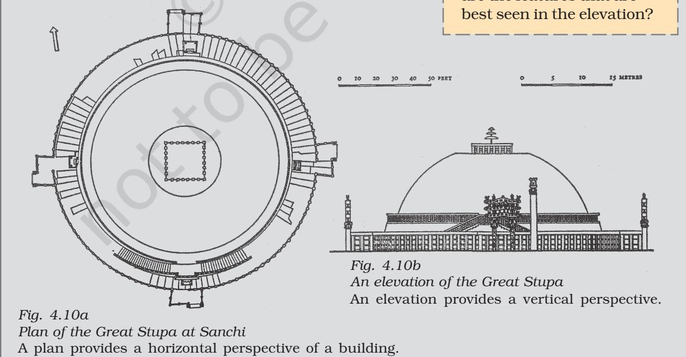
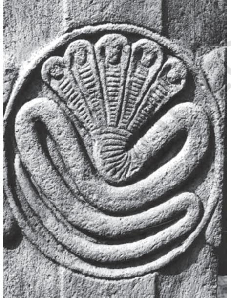
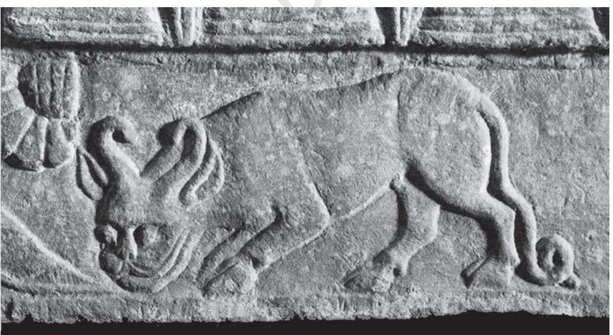

THEME

FOUR

#### THEME TWO Thinkers, Beliefs and Buildings Cultural Developments (c. 600 BCE - 600 CE)

*Fig. 4.1 A sculpture from Sanchi*

In this chapter we shall go on a long journey across a thousand years to read about philosophers and their attempts to understand the world they inhabited. We will also see how their ideas were compiled as oral and written texts as well as expressed in architecture and sculpture. These are indicative of the enduring influence these thinkers had on people. While we will be focusing on Buddhism, it is important to remember that this tradition did not develop in isolation – there were several other traditions, each engaged in debates and dialogues with the others.

The sources that historians use to reconstruct this exciting world of ideas and beliefs include Buddhist, Jaina and Brahmanical texts, as well as a large and impressive body of material remains including monuments and inscriptions. Among the best preserved monuments of the time is the stupa at Sanchi which is a major focus in this chapter.

*Fig. 4.2 Shahjehan Begum*

# 1. A Glimpse of Sanchi

# Sanchi in the nineteenth century

The most wonderful ancient buildings in the state of Bhopal are at Sanchi Kanakhera, a small village under the brow of a hill some 20 miles north-east of Bhopal which we visited yesterday. We inspected the stone sculptures and statues of the Buddha and an ancient gateway … The ruins appear to be the object of great interest to European gentlemen. Major Alexander Cunningham … stayed several weeks in this neighbourhood and examined these ruins most carefully. He took drawings of the place, deciphered the inscription, and bored shafts down these domes. The results of his investigations were described by him in an English work …

FROM SHAHJEHAN BEGUM, NAWAB OF BHOPAL (ruled 1868-1901), Taj- ul Iqbal Tarikh Bhopal (A History of Bhopal), translated by H.D. Barstow, 1876.

Nineteenth-century Europeans were very interested in the stupa at Sanchi. In fact, the French sought Shahjehan Begum's permission to take away the eastern gateway, which was the best preserved, to be displayed in a museum in France. For a while some Englishmen also wanted to do the same, but fortunately both the French and the English were satisfied with carefully prepared plaster-cast copies and the original remained at the site, part of the Bhopal state.

The rulers of Bhopal, Shahjehan Begum and her successor Sultan Jehan Begum, provided money for the preservation of the ancient site. No wonder then that John Marshall dedicated his important volumes on Sanchi to Sultan Jehan. She funded the museum that was built there as well as the guesthouse where he lived and wrote the volumes. She also funded the publication of the volumes. So if the stupa complex has survived, it is in no small measure due to wise decisions, and to good luck in escaping the eyes of railway contractors, builders, and those looking for finds to carry away to the museums of Europe. One of the most important Buddhist centres, the discovery of Sanchi has vastly transformed our understanding of early Buddhism. Today it stands testimony to the successful restoration and preservation of a key archaeological site by the Archaeological Survey of India.

#### *Fig. 4.3*

*The Great Stupa at Sanchi* If you travel from Delhi to Bhopal by train, you will see the majestic stupa complex on top of a hill, crowning it as it were. If you request the guard he will stop the train at the little station of Sanchi for two minutes – enough time for you to get down. As you climb up the hill you can see the complex of structures: a large mound and other monuments including a temple built in the fifth century.

# Ü Discuss...

Compare what Shahjehan Begum described with what you see in Fig. 4.3. What similarities and differences do you notice?

#### *Source 1*

# A prayer to Agni

Here are two verses from the Rigveda invoking Agni, the god of fire, often identified with the sacrificial fire, into which offerings were made so as to reach the other deities:

Bring, O strong one, this sacrifice of ours to the gods, O wise one, as a liberal giver. Bestow on us, O priest, abundant food. Agni, obtain, by sacrificing, mighty wealth for us.

Procure, O Agni, for ever to him who prays to you (the gift of) nourishment, the wonderful cow. May a son be ours, offspring that continues our line …

Verses such as these were composed in a special kind of Sanskrit, known as Vedic Sanskrit. They were taught orally to men belonging to priestly families.

> Ü List the objectives of the sacrifice.

But what is the significance of this monument? Why was the mound built and what did it contain? Why is there a stone railing around it? Who built the complex or paid for its construction? When was it "discovered"? There is a fascinating story that we can uncover at Sanchi for which we must combine information from texts, sculpture, architecture and inscriptions. Let us begin by exploring the background of the early Buddhist tradition.

# 2. The Background:

# Sacrifices and Debates

The mid-first millennium BCE is often regarded as a turning point in world history: it saw the emergence of thinkers such as Zarathustra in Iran, Kong Zi in China, Socrates, Plato and Aristotle in Greece, and Mahavira and Gautama Buddha, among many others, in India. They tried to understand the mysteries of existence and the relationship between human beings and the cosmic order. This was also the time when new kingdoms and cities were developing and social and economic life was changing in a variety of ways in the Ganga valley (Chapters 2 and 3). These thinkers attempted to understand these developments as well.

### 2.1 The sacrificial tradition

There were several pre-existing traditions of thought, religious belief and practice, including the early Vedic tradition, known from the *Rigveda*, compiled between *c*.1500 and 1000 BCE. The *Rigveda* consists of hymns in praise of a variety of deities, especially Agni, Indra and Soma. Many of these hymns were chanted when sacrifices were performed, where people prayed for cattle, sons, good health, long life, etc.

At first, sacrifices were performed collectively. Later (*c*. 1000 BCE-500 BCE onwards) some were performed by the heads of households for the wellbeing of the domestic unit. More elaborate sacrifices, such as the *rajasuya* and *ashvamedha*, were performed by chiefs and kings who depended on Brahmana priests to conduct the ritual.

### 2.2 New questions

Many ideas found in the Upanishads (*c.* sixth century BCE onwards) show that people were curious about the meaning of life, the possibility of life after death,

and rebirth. Was rebirth due to past actions? Such issues were hotly debated. Thinkers were concerned with understanding and expressing the nature of the ultimate reality. And others, outside the Vedic tradition, asked whether or not there even was a single ultimate reality. People also began speculating on the significance of the sacrificial tradition.

### 2.3 Debates and discussions

We get a glimpse of lively discussions and debates from Buddhist texts, which mention as many as 64 sects or schools of thought. Teachers travelled from place to place, trying to convince one another as well as laypersons, about the validity of their philosophy or the way they understood the world. Debates took place in the *kutagarashala* – literally, a hut with a pointed roof – or in groves where travelling mendicants halted. If a philosopher succeeded in convincing one of his rivals, the followers of the latter also became his disciples. So support for any particular sect could grow and shrink over time.

Many of these teachers, including Mahavira and the Buddha, questioned the authority of the Vedas. They also emphasised individual agency – suggesting that men and women could strive to attain liberation from the trials and tribulations of worldly existence. This was in marked contrast to the Brahmanical position, wherein, as we have seen, an individual's existence was thought to be determined by his or her birth in a specific caste or gender.

#### *Source 2*

### Verses from the Upanishads

Here are two verses from the Chhandogya Upanishad, a text composed in Sanskrit c.sixth century BCE:

#### The nature of the self

This self of mine within the heart, is smaller than paddy or barley or mustard or millet or the kernel of a seed of millet. This self of mine within the heart is greater than the earth, greater than the intermediate space, greater than heaven, greater than these worlds.

#### The true sacrifice

This one (the wind) that blows, this is surely a sacrifice … While moving, it sanctifies all this; therefore it is indeed a sacrifice.

# How Buddhist texts were prepared and preserved

The Buddha (and other teachers) taught orally – through discussion and debate. Men and women (perhaps children as well) attended these discourses and discussed what they heard. None of the Buddha's speeches were written down during his lifetime. After his death (c. fifth-fourth century BCE) his teachings were compiled by his disciples at a council of "elders" or senior monks at Vesali (Pali for Vaishali in present-day Bihar). These compilations were known as Tipitaka – literally, three baskets to hold different types of texts. They were first transmitted orally and then written and classified according to length as well as subject matter.

The Vinaya Pitaka included rules and regulations for those who joined the sangha or monastic order; the Buddha's teachings were included in the Sutta Pitaka; and the Abhidhamma Pitaka dealt with philosophical matters. Each pitaka comprised a number of individual texts. Later, commentaries were written on these texts by Buddhist scholars.

As Buddhism travelled to new regions such as Sri Lanka, other texts such as the Dipavamsa (literally, the chronicle of the island) and Mahavamsa (the great chronicle) were written, containing regional histories of Buddhism. Many of these works contained biographies of the Buddha. Some of the oldest texts are in Pali, while later compositions are in Sanskrit.

When Buddhism spread to East Asia, pilgrims such as Fa Xian and Xuan Zang travelled all the way from China to India in search of texts. These they took back to their own country, where they were translated by scholars. Indian Buddhist teachers also travelled to faraway places, carrying texts to disseminate the teachings of the Buddha.

Buddhist texts were preserved in manuscripts for several centuries in monasteries in different parts of Asia. Modern translations have been prepared from Pali, Sanskrit, Chinese and Tibetan texts.

*A Buddhist manuscript in Sanskrit,* c*. twelfth century*

#### *Source 3*

#### Fatalists and materialists?

Here is an excerpt from the Sutta Pitaka, describing a conversation between king Ajatasattu, the ruler of Magadha, and the Buddha:

On one occasion King Ajatasattu visited the Buddha and described what another teacher, named Makkhali Gosala, had told him:

"Though the wise should hope, by this virtue … by this penance I will gain karma … and the fool should by the same means hope to gradually rid himself of his karma, neither of them can do it. Pleasure and pain, measured out as it were, cannot be altered in the course of samsara (transmigration). It can neither be lessened or increased … just as a ball of string will when thrown unwind to its full length, so fool and wise alike will take their course and make an end of sorrow."

And this is what a philosopher named Ajita Kesakambalin taught:

"There is no such thing, O king, as alms or sacrifice, or offerings … there is no such thing as this world or the next …

A human being is made up of the four elements. When he dies the earthy in him returns to the earth, the fluid to water, the heat to fire, the windy to air, and his senses pass into space …

The talk of gifts is a doctrine of fools, an empty lie … fools and wise alike are cut off and perish. They do not survive after death."

The first teacher belonged to the tradition of the Ajivikas. They have often been described as fatalists: those who believe that everything is predetermined. The second teacher belonged to the tradition of the Lokayatas, usually described as materialists. Texts from these traditions have not survived, so we know about them only from the works of other traditions.

> Ü Do you think it is appropriate to describe these men as fatalists or materialists?

# Ü Discuss...

What are the problems in reconstructing histories of ideas and beliefs when texts are not available or have not survived?

*Fig. 4.5 An image of a* tirthankara *from Mathura,* c*. third century CE*

*Source 4*

# 3.Beyond Worldly Pleasures

The Message of Mahavira The basic philosophy of the Jainas was already in existence in north India before the birth of Vardhamana, who came to be known as Mahavira, in the sixth century BCE. According to Jaina tradition, Mahavira was preceded by 23 other teachers or *tirthankaras* – literally, those who guide men and

women across the river of existence. The most important idea in Jainism is that the entire world is animated: even stones, rocks and water have life. Non-injury to living beings, especially to humans, animals, plants and insects, is central to Jaina philosophy. In fact the principle of ahimsa, emphasised within Jainism, has left its mark on Indian thinking as a whole. According to Jaina teachings, the cycle of birth and rebirth is shaped through karma. Asceticism and penance are required to free oneself from the cycle of karma. This can be achieved only by renouncing the world; therefore, monastic existence is a necessary condition of salvation. Jaina monks and nuns took five vows: to abstain from killing, stealing and lying; to observe celibacy; and to abstain from possessing property.

# The world beyond the palace

Just as the Buddha's teachings were compiled by his followers, the teachings of Mahavira were also recorded by his disciples. These were often in the form of stories, which could appeal to ordinary people. Here is one example, from a Prakrit text known as the Uttaradhyayana Sutta, describing how a queen named Kamalavati tried to persuade her husband to renounce the world:

If the whole world and all its treasures were yours, you would not be satisfied, nor would all this be able to save you. When you die, O king and leave all things behind, dhamma alone, and nothing else, will save you. As a bird dislikes the cage, so do I dislike (the world). I shall live as a nun without offspring, without desire, without the love of gain, and without hatred …

Those who have enjoyed pleasures and renounced them, move about like the wind, and go wherever they please, unchecked like birds in their flight …

Leave your large kingdom … abandon what pleases the senses, be without attachment and property, then practise severe penance, being firm of energy …

> Ü Which of the arguments advanced by the queen do you find most convincing?

### 3.1 The spread of Jainism

Gradually, Jainism spread to many parts of India. Like the Buddhists, Jaina scholars produced a wealth of literature in a variety of languages – Prakrit, Sanskrit and Tamil. For centuries, manuscripts of these texts were carefully preserved in libraries attached to temples.

Some of the earliest stone sculptures associated with religious traditions were produced by devotees of the Jaina *tirthankaras*, and have been recovered from several sites throughout the subcontinent.

Ü Discuss... Is ahimsa relevant in the twenty-first century?

# 4.The Buddha and the Quest for Enlightenment

One of the most influential teachers of the time was the Buddha. Over the centuries, his message spread across the subcontinent and beyond – through Central Asia to China, Korea and Japan, and through Sri Lanka, across the seas to Myanmar, Thailand and Indonesia.

How do we know about the Buddha's teachings? These have been reconstructed by carefully editing, translating and analysing the Buddhist texts mentioned earlier. Historians have also tried to reconstruct details of his life from hagiographies. Many of these were written down at least a century after the time of the Buddha, in an attempt to preserve memories of the great teacher.

According to these traditions, Siddhartha, as the Buddha was named at birth, was the son of a chief *Fig. 4.6 A page from a fourteenth-century Jaina manuscript*

Ü Can you identify the script?

*Hagiography* is a biography of a saint or religious leader. Hagiographies often praise the saint's achievements, and may not always be literally accurate. They are important because they tell us about the beliefs of the followers of that particular tradition.

of the Sakya clan. He had a sheltered upbringing within the palace, insulated from the harsh realities of life. One day he persuaded his charioteer to take him into the city. His first journey into the world outside was traumatic. He was deeply anguished when he saw an old man, a sick man and a corpse. He realised in that moment that the decay and destruction of the human body was inevitable. He also saw a homeless mendicant, who, it seemed to him, had come to terms with old age, disease and death, and found peace. Siddhartha decided that he too would adopt the same path. Soon after, he left the palace and set out in search of his own truth.

Siddhartha explored several paths including bodily mortification which led him to a situation of near death. Abandoning these extreme methods, he meditated for several days and finally attained enlightenment. After this he came to be known as the Buddha or the Enlightened One. For the rest of

his life, he taught *dhamma* or the path of righteous living.

Ü Discuss... If you did not know about the life of the Buddha, would you be able to tell what the sculpture depicts?

*Fig. 4.7 A sculpture (*c*. 200 CE) from Amaravati (Andhra Pradesh), depicting the departure of the Buddha from his palace*

# 5. The Teachings of the Buddha

The Buddha's teachings have been reconstructed from stories, found mainly in the *Sutta Pitaka* . Although some stories describe his miraculous powers, others suggest that the Buddha tried to convince people through reason and persuasion rather than through displays of supernatural power. For instance, when a grief-stricken woman whose child had died came to the Buddha, he gently convinced her about the inevitability of death rather than bring her son back to life. These stories were narrated in the language spoken by ordinary people so that these could be easily understood. *Source 5* THINKERS, BELIEFS AND BUILDINGS

According to Buddhist philosophy, the world is transient (*anicca*) and constantly changing; it is also soulless (*anatta*) as there is nothing permanent or eternal in it. Within this transient world, sorrow (*dukkha*) is intrinsic to human existence. It is by following the path of moderation between severe penance and self-indulgence that human beings can rise above these worldly troubles. In the earliest forms of Buddhism, whether or not god existed was irrelevant.

#### Buddhism in practice

This is an e xcerpt from the Sutta Pitaka, and contains the advice given by the Buddha to a wealthy householder named Sigala:

In five ways should a master look after his servants and employees … by assigning them work according to their strength, by supplying them with food and wages, by tending them in sickness; by sharing delicacies with them and by granting leave at times …

In five ways should the clansmen look after the needs of samanas (those who have renounced the world) and Brahmanas: by affection in act and speech and mind, by keeping open house to them and supplying their worldly needs.

There are similar instructions to Sigala about how to behave with his parents, teacher and wife.

> Ü Suggest what the instructions regarding parents, teacher and wife may have been.

Ü Discuss...

Compare the Buddha's advice to Sigala with Asoka's advice to his subjects (Chapter 2). Do you notice any similarities and differences?

The Buddha regarded the social world as the creation of humans rather than of divine origin. Therefore, he advised kings and *gahapatis* (see also Chapter 2) to be humane and ethical. Individual effort was expected to transform social relations.

The Buddha emphasised individual agency and righteous action as the means to escape from the cycle of rebirth and attain self-realisation and *nibbana*, literally the extinguishing of the ego and desire – and thus end the cycle of suffering for those who renounced the world. According to Buddhist tradition, his last words to his followers were: "Be lamps unto yourselves as all of you must work out your own liberation."

# 6. Followers of the Buddha

Soon there grew a body of disciples of the Buddha and he founded a *sangha*, an organisation of monks who too became teachers of *dhamma*. These monks lived simply, possessing only the essential requisites for survival, such as a bowl to receive food once a day from the laity. As they lived on alms, they were known as *bhikkhus*.

Initially, only men were allowed into the *sangha*, but later women also came to be admitted. According to Buddhist texts, this was made possible through the mediation of Ananda, one of the Buddha's dearest disciples, who persuaded him to allow women into the *sangha*. The Buddha's foster mother, Mahapajapati Gotami was the first woman to be ordained as a *bhikkhuni*. Many women who entered the *sangha* became teachers of *dhamma* and went on to become *theris*, or respected women who had attained liberation.

The Buddha's followers came from many social groups. They included kings, wealthy men and *gahapatis*, and also humbler folk: workers, slaves and craftspeople. Once within the *sangha*, all were regarded as equal, having shed their earlier social identities on becoming *bhikkhus* and *bhikkhunis*. The internal functioning of the *sangha* was based on the traditions of *ganas* and *sanghas,* where consensus was arrived at through discussions. If that failed, decisions were taken by a vote on the subject.

#### *Source 6*

#### The Therigatha

This unique Buddhist text, part of the Sutta Pitaka, is a collection of verses composed by bhikkhunis. It provides an insight into women's social and spiritual experiences. Punna, a dasi or slave woman, went to the river each morning to fetch water for her master's household. There she would daily see a Brahmana performing bathing rituals. One morning she spoke to him. The following are verses composed by Punna, recording her conversation with the Brahmana:

> I am a water carrier: Even in the cold I have always gone down to the water frightened of punishment Or the angry words of high class women. So what are you afraid of Brahmana, That makes you go down to the water (Though) your limbs shake with the bitter cold?

The Brahmana replied:

I am doing good to prevent evil; anyone young or old who has done something bad is freed by washing in water.

#### Punna said:

Whoever told you You are freed from evil by washing in the water?… In that case all the frogs and turtles Would go to heaven, and so would the water snakes and crocodiles! (Instead) Don't do that thing, the fear of which leads you to the water. Stop now Brahmana! Save your skin from the cold …

> Ü Which of the teachings of the Buddha are evident in this composition?

*Fig. 4.8 A woman water-carrier, Mathura,* c*. third century CE*

#### *Source 7*

#### Rules for monks and nuns

These are some of the rules laid down in the Vinaya Pitaka:

When a new felt (blanket/rug) has been made by a bhikkhu, it is to be kept for (at least) six years. If after less than six years he should have another new felt (blanket/rug) made, regardless of whether or not he has disposed of the first, then – unless he has been authorised by the bhikkhus – it is to be forfeited and confessed.

In case a bhikkhu arriving at a family residence is presented with cakes or cooked grain-meal, he may accept two or three bowlfuls if he so desires. If he should accept more than that, it is to be confessed. Having accepted the two or three bowlfuls and having taken them from there, he is to share them among the bhikkhus. This is the proper course here.

Should any bhikkhu, having set out bedding in a lodging belonging to the sangha – or having had it set out – and then on departing neither put it away nor have it put away, or should he go without taking leave, it is to be confessed.

Ü Can you explain why these rules were framed?

Buddhism grew rapidly both during the lifetime of the Buddha and after his death, as it appealed to many people dissatisfied with existing religious practices and confused by the rapid social changes taking place around them. The importance attached to conduct and values rather than claims of superiority based on birth, the emphasis placed on *metta* (fellow feeling) and *karuna* (compassion), especially for those who were younger and weaker than oneself, were ideas that drew men and women to Buddhist teachings.

Ü Discuss... Why do you think a *dasi* like Punna wanted to join the *sangha*?

# 7. Stupas

We have seen that Buddhist ideas and practices emerged out of a process of dialogue with other traditions – including those of the Brahmanas, Jainas and several others, not all of whose ideas and practices were preserved in texts. Some of these interactions can be seen in the ways in which sacred places came to be identified.

From earliest times, people tended to regard certain places as sacred. These included sites with special trees or unique rocks, or sites of aweinspiring natural beauty. These sites, with small shrines attached to them, were sometimes described as *chaityas*.

Buddhist literature mentions several *chaityas*. It also describes places associated with the *Chaitya* may also have been derived from the word *chita,* meaning a funeral pyre, and by extension a funerary mound.

Buddha's life – where he was born (Lumbini), where he attained enlightenment (Bodh Gaya), where he gave his first sermon (Sarnath) and where he attained *nibbana* (Kusinagara). Gradually, each of these places came to be regarded as sacred. We know that about 200 years after the time of the Buddha, Asoka erected a pillar at Lumbini to mark the fact that he had visited the place.

#### **7.1 Why were stupas built?**

There were other places too that were regarded as sacred. This was because relics of the Buddha such as his bodily remains or objects used by him were buried there. These were mounds known as stupas.

The tradition of erecting stupas may have been pre-Buddhist, but they came to be associated with Buddhism. Since they contained relics regarded as sacred, the entire stupa came to be venerated as an emblem of both the Buddha and Buddhism. According to a Buddhist text known as the *Ashokavadana*, Asoka distributed portions of the Buddha's relics to every important town and ordered the construction of stupas over them. By the second century BCE a number of stupas*,* including those at Bharhut, Sanchi and Sarnath (Map 1), had been built.

#### **7.2 How were stupas built?**

Inscriptions found on the railings and pillars of stupas record donations made for building and decorating them. Some donations were made by kings such as the Satavahanas; others were made by guilds, such as that of the ivory workers who financed part of one of the gateways at Sanchi. Hundreds of donations were made by women and men who mention their names, sometimes adding the name of the place from where they came, as well as their occupations and names of their relatives. *Bhikkhus* and *bhikkhunis* also contributed towards building these monuments.

#### **7.3 The structure of the stupa**

The stupa (a Sanskrit word meaning a heap) originated as a simple semi-circular mound of earth, later called *anda*. Gradually, it evolved into a more complex structure, balancing round and square shapes. Above the *anda* was the *harmika*, a balconylike structure that represented the abode of the gods.

*Source 8*

#### **Why were stupas built?**

This is an excerpt from the Mahaparinibbana Sutta, part of the Sutta Pitaka:

As the Buddha lay dying, Ananda asked him:

"What are we to do Lord, with the remains of the Tathagata (another name for the Buddha)?"

The Buddha replied: "Hinder not yourselves Ananda by honouring the remains of the Tathagata. Be zealous, be intent on your own good."

But when pressed further, the Buddha said:

"At the four crossroads they should erect a thupa (Pali for stupa) to the Tathagata. And whosoever shall there place garlands or perfume … or make a salutation there, or become in its presence calm of heart, that shall long be to them for a profit and joy."

‹ Look at Fig. 4.15 and see whether you can identify some of these practices.

Arising from the *harmika* was a mast called the *yashti*, often surmounted by a *chhatri* or umbrella. Around the mound was a railing, separating the sacred space from the secular world.

The early stupas at Sanchi and Bharhut were plain except for the stone railings, which resembled a bamboo or wooden fence, and the gateways, which were richly carved and installed at the four cardinal points. Worshippers entered through the eastern gateway and walked around the mound in a clockwise direction keeping the mound on the right, imitating the sun's course through the sky. Later, the mound of the stupas came to be elaborately carved with niches and sculptures as at Amaravati, and Shahji-ki-Dheri in Peshawar (Pakistan).

*Fig. 4.9*

*A votive inscription from Sanchi* Hundreds of similar inscriptions have also been found at Bharhut and Amaravati.

# Ü Discuss...

What are the similarities and differences between the plan of the Great Stupa, Sanchi (Fig. 4.10a) and the photograph (Fig. 4.3)?

> Ü What are the features of the building that are clearest in the plan? What are the features that are best seen in the elevation?

# 8. "Discovering" Stupas

# The Fate of Amaravati and Sanchi

Each stupa has a history of its own – as we have just seen, some of these are histories of how they were built. But there are histories of discoveries as well, and let us now turn to some of these. In 1796, a local raja who wanted to build a temple stumbled upon the ruins of the stupa at Amaravati. He decided to use the stone, and thought there might be some treasure buried in what seemed to be a hill. Some years later, a British official named Colin Mackenzie (see also Chapter 7) visited the site. Although he found several pieces of sculpture and made detailed drawings of them, these reports were never published.

> In 1854, Walter Elliot, the commissioner of Guntur (Andhra Pradesh), visited Amaravati and collected several sculpture panels and took them away to Madras. (These came to be called the Elliot marbles after him.) He also discovered the remains of the western gateway and came to the conclusion that the structure at Amaravati was one of the largest and most magnificent Buddhist stupas ever built. By the 1850s, some of the slabs from Amaravati had begun to be taken to different places: to the Asiatic Society of Bengal at Calcutta, to the India Office in Madras and some even to London. It was not unusual to find these sculptures adorning the gardens of British administrators. In fact, any new official in the area continued to remove sculptures from the site on the grounds that earlier officials had done the same.

> One of the few men who had a different point of view was an archaeologist named H.H. Cole. He wrote: "It seems to me a suicidal and indefensible policy to allow the country to be looted of original works of ancient art." He believed that museums should have plaster-cast facsimiles of sculpture, whereas the originals should remain

*Fig. 4.11 The eastern gateway, Sanchi* Notice the vibrant sculpture.

where they had been found. Unfortunately, Cole did not succeed in convincing the authorities about Amaravati, although his plea for *in situ* preservation was adopted in the case of Sanchi.

Why did Sanchi survive while Amaravati did not? Perhaps Amaravati was discovered before scholars understood the value of the finds and realised how critical it was to preserve things where they had been found instead of removing them from the site. When Sanchi was "discovered" in 1818, three of its four gateways were still standing, the fourth was lying on the spot where it had fallen and the mound was in good condition. Even so, it was suggested that the gateway be taken to either Paris or London; finally a number of factors helped to keep Sanchi as it was, and so it stands, whereas the *mahachaitya* at Amaravati is now just an insignificant little mound, totally denuded of its former glory.

# 9. Sculpture

We have just seen how sculptures were removed from stupas and transported all the way to Europe. This happened partly because those who saw them considered them to be beautiful and valuable, and wanted to keep them for themselves. Let us look at some of these more closely.

#### 9.1 Stories in stone

You may have seen wandering storytellers carrying scrolls (*charanachitras*) of cloth or paper with pictures on them and pointing to the pictures as they tell the story.

Look at Figure 4.13. At first sight the sculpture seems to depict a rural scene, with thatched huts and trees. However, art historians who have carefully studied the sculpture at Sanchi identify it as a scene from the *Vessantara Jataka*. This is a story about a generous prince who gave away everything to a Brahmana, and went to live in the forest with his wife and children. As you can see in this

# Ü Discuss...

Read Section 1 again. Give your reasons why Sanchi survived.

#### *In situ* means on the spot.

*Fig. 4.12 A section of the gateway*

Do you think the sculptors at Sanchi wanted to depict a scroll being unfurled?

*Fig. 4.13 A part of the northern gateway*

*Fig. 4.14 (far right) Worshipping the Bodhi tree* Notice the tree, the seat, and the people around it. *Fig. 4.15 (middle right) Worshipping the stupa Fig. 4.16 (below) Setting in motion the wheel of dharma*

case, historians often try to understand the meaning of sculpture by comparing it with textual evidence.

#### 9.2 Symbols of worship

Art historians had to acquire familiarity with hagiographies of the Buddha in order to understand Buddhist sculpture. According to hagiographies, the Buddha attained enlightenment while meditating under a tree. Many early sculptors did not show the Buddha in human form – instead, they showed his presence through symbols. The empty seat (Fig. 4.14) was meant to indicate the meditation of the Buddha, and the stupa (Fig. 4.15) was meant to represent the *mahaparinibbana.* Another frequently used symbol was the wheel (Fig. 4.16). This stood for the first sermon of the Buddha, delivered at Sarnath. As is obvious, such sculptures cannot be understood literally – for instance, the tree does not stand

simply for a tree, but symbolises an event in the life of the Buddha. In order to understand such symbols, historians have to familiarise themselves with the traditions of those who produced these works of art.

#### 9.3 Popular traditions

Other sculptures at Sanchi were perhaps not directly inspired by Buddhist ideas. These include beautiful women swinging from the edge of the gateway, holding onto a tree (Fig.4.17). Initially, scholars were a bit intrigued about this image,

which seemed to have little to do with renunciation. However, after examining other literary traditions, they realised that it could be a representation of what is described in Sanskrit as a *shalabhanjika*. According to popular belief, this was a woman whose touch caused trees to flower and bear fruit. It is likely that this was regarded as an auspicious symbol and integrated into the decoration of the stupa. The *shalabhanjika* motif suggests that many people who turned to Buddhism enriched it with their own pre-Buddhist and even non-Buddhist beliefs, practices and ideas. Some of the recurrent motifs in the sculpture at Sanchi were evidently derived from these traditions.

There are other images as well. For instance, some of the finest depictions of animals are found there. These animals include elephants, horses, monkeys and cattle. While the *Jatakas* contain several animal stories that are depicted at Sanchi, it is likely that many of these animals were carved to create lively scenes to draw viewers. Also, animals were often used as symbols of human attributes. Elephants, for example, were depicted to signify strength and wisdom. *Fig. 4.17 The woman at the gate*

*Fig. 4.18 An elephant at Sanchi*

*Fig. 4.19 Gajalakshmi*

*Fig. 4.20 A painting from Ajanta* Note the seated figure and those serving him.

*Fig. 4.21 A serpent at Sanchi*

# Paintings from the past

While stone sculpture survives the ravages of time and is therefore most easily available to the historian, other visual means of communication, including paintings, were also used in the past. Those that have survived best are on walls of caves, of which those from Ajanta (Maharashtra) are the most famous.

The paintings at Ajanta depict stories from the Jatakas. These include depictions of courtly life, processions, men and women at work, and festivals. The artists used the technique of shading to give a three-dimensional quality. Some of the paintings are extremely naturalistic.

Another motif is that of a woman surrounded by lotuses and elephants (Fig. 4.19), which seem to be sprinkling water on her as if performing an *abhisheka* or consecration. While some historians identify the figure as Maya, the mother of the Buddha, others identify her with a popular goddess, Gajalakshmi – literally, the goddess of good fortune – who is associated with elephants. It is also possible that

devotees who saw these sculptures identified the figure with both Maya and Gajalakshmi.

Consider, too, the serpent, which is found on several pillars (Fig. 4.21). This motif seems to be derived from popular traditions, which were not always recorded in texts. Interestingly, one of the earliest modern art historians, James Fergusson, considered Sanchi to be a centre of tree and serpent worship. He was not familiar with Buddhist literature – most of which had not yet been translated – and arrived at this conclusion by studying only the images on their own.

# 10. New Religious Traditions

#### 10.1 The development of Mahayana Buddhism

By the first century CE, there is evidence of changes in Buddhist ideas and practices. Early Buddhist teachings had given great importance to self-effort in achieving *nibbana*. Besides, the Buddha was regarded as a human being who attained enlightenment and *nibbana* through his own efforts. However, gradually the idea of a saviour emerged. It was believed that he was the one who could ensure salvation. Simultaneously, the concept of the Bodhisatta also developed. Bodhisattas were perceived as deeply compassionate beings who accumulated merit through their efforts but used this not to attain *nibbana* and thereby abandon the world, but to help others. The worship of images of the Buddha and Bodhisattas became an important part of this tradition.

This new way of thinking was called Mahayana – literally, the "great vehicle". Those who adopted these beliefs described the older tradition as Hinayana or the "lesser vehicle".

# Hinayana or Theravada?

Supporters of Mahayana regarded other Buddhists as followers of Hinayana. However, followers of the older tradition described themselves as theravadins, that is, those who followed the path of old, respected teachers, the theras.

# Ü Discuss...

Bone, terracotta and metal can also be used for sculpture. Find out more about these.

*Fig. 4.22 An image of the Buddha from Mathura,* c*. first century CE*

*Fig. 4.23 The Varaha or boar avatar of Vishnu rescuing the earth goddess, Aihole (Karnataka)* c*. sixth century CE*

Ü What does the proportion of the figures suggest?

### 10.2 The growth of Puranic Hinduism

The notion of a saviour was not unique to Buddhism. We find similar ideas being developed in different ways within traditions that we now consider part of Hinduism. These included Vaishnavism (a form of Hinduism within which Vishnu was worshipped as the principal deity) and Shaivism (a tradition within which Shiva was regarded as the chief god), in which there was growing emphasis on the worship of a chosen deity. In such worship the bond between the devotee and the god was visualised as one of love and devotion, or bhakti.

> In the case of Vaishnavism, cults developed around the various avatars or incarnations of the deity. Ten avatars were recognised within the tradition. These were forms that the deity was believed to have assumed in order to save the world whenever it was threatened by disorder and destruction because of the dominance of evil forces. It is likely that different avatars were popular in different parts of the country. Recognising each of these local deities as a form of Vishnu was one way of creating a more unified religious tradition.

> Some of these forms were represented in sculptures, as were other deities. Shiva, for instance, was symbolised by the *linga,* although he was occasionally represented in human form too. All such representations depicted a complex set of ideas about the deities and their attributes through symbols such as headdresses, ornaments and *ayudhas –* weapons or auspicious objects the deities hold in their hands – how they are seated, etc.

> To understand the meanings of these sculptures historians

have to be familiar with the stories behind them – many of which are contained in the Puranas*,* compiled by Brahmanas (by about the middle of the first millennium CE)*.* They contained much that had been composed and been in circulation for centuries, including stories about gods and goddesses. Generally, they were written in simple Sanskrit verse, and were meant to be read aloud to everybody, including women and Shudras, who did not have access to Vedic learning.

Much of what is contained in the Puranas evolved through interaction amongst people – priests, merchants, and ordinary men and women who travelled from place to place sharing ideas and beliefs. We know for instance that Vasudeva-Krishna was an important deity in the Mathura region. Over centuries, his worship spread to other parts of the country as well.

#### 10.3 Building temples

Around the time that the stupas at sites such as Sanchi were acquiring their present form, the first temples to house images of gods and goddesses were also being built. The early temple was a small square room, called the *garbhagriha*, with a single doorway for the worshipper to enter and offer worship to the image. Gradually, a tall structure, known as the

#### *Fig. 4.24 An image of Durga, Mahabalipuram (Tamil Nadu),* c*. sixth century CE*

Ü Identify the ways in which the artists have depicted movement. Find out more about the story depicted in this sculpture.

*Fig. 4.25 A temple in Deogarh (Uttar Pradesh),* c*. fifth century CE*

> Ü Identify the remains of the *shikhara* and the entrance to the *garbhagriha.*

*shikhara*, was built over the central shrine. Temple walls were often decorated with sculpture. Later temples became far more elaborate – with assembly halls, huge walls and gateways, and arrangements for supplying water (see also Chapter 7).

One of the unique features of early temples was that some of these were hollowed out of huge rocks, as artificial caves. The tradition of building artificial caves was an old one. Some of the earliest (Fig. 4.27)

*Fig. 4.26 Vishnu reclining on the serpent Sheshnag, sculpture from Deogarh (Uttar Pradesh),* c*. fifth century CE*

of these were constructed in the third century BCE on the orders of Asoka for renouncers who belonged to the Ajivika sect.

This tradition evolved through various stages and culminated much later – in the eighth century – in the carving out of an entire temple, that of Kailashnatha (a name of Shiva).

A copperplate inscription records the amazement of the chief sculptor after he completed the temple at Ellora: "Oh how did I make it!"

*Fig. 4.27 Entrance to a cave at Barabar (Bihar),* c*. third century BCE*

*Fig. 4.28*

*Kailashnatha Temple, Ellora (Maharashtra). This entire structure is carved out of a single piece of rock.*

# 11. Can We "See" Everything?

By now you have had a glimpse of the rich visual traditions that existed in the past – expressed in brick and stone architecture, sculpture and painting. We have seen that much has been destroyed and lost over the centuries. Nevertheless, what remains and has been preserved conveys a sense of the vision of the artists, sculptors, masons and architects who created these spectacular works. Yet, do we always automatically understand what they wanted to convey? Can we ever know what these images meant to people who saw them and venerated them about 2,000 years ago?

#### 11.1 Grappling with the unfamiliar

It will be useful to recall that when nineteenthcentury European scholars first saw some of the sculptures of gods and goddesses, they could not understand what these were about. Sometimes, they were horrified by what seemed to them grotesque figures, with multiple arms and heads or with combinations of human and animal forms.

These early scholars tried to make sense of what appeared to be strange images by comparing them with sculpture with which they were familiar, that from ancient Greece. While they often found early Indian sculpture inferior to the works of Greek artists, they were very excited when they discovered images of the Buddha and Bodhisattas that were evidently based on Greek models. These were, more often than not, found in the northwest, in cities such as Taxila and Peshawar, where Indo-Greek rulers had established kingdoms in the second century BCE. As these images were closest to the Greek statues these scholars were familiar with, they were considered to be the best examples of early Indian art. In effect, these scholars adopted a strategy we all frequently use – devising yardsticks derived from the familiar to make sense of the unfamiliar.

#### 11.2 If text and image do not match …

Consider another problem. We have seen that art historians often draw upon textual traditions to understand the meaning of sculptures. While this is certainly a far more efficacious strategy than comparing Indian images with Greek statues, it is not always easy to use. One of the most intriguing examples of this is a famous sculpture along a huge rock surface in Mahabalipuram (Tamil Nadu).

Clearly, Fig. 4.30 is a vivid depiction of a story. But which story is it? Art historians have searched through the Puranas to identify it and are sharply divided in their opinions. Some feel that this depicts the descent of the river Ganga from heaven – the

> *Fig. 4.29 A Bodhisatta from Gandhara* Note the clothes and the hairstyle.

natural cleft through the centre of the rock surface might represent the river. The story itself is narrated in the Puranas and the epics. Others feel that it represents a story from the *Mahabharata* – Arjuna doing penance on the river bank in order to acquire arms – pointing to the central figure of an ascetic.

Finally, remember that many rituals, religious beliefs and practices were not recorded in a permanent, visible form – as monuments, or sculpture, or even paintings. These included daily practices, as well as those associated with special occasions. Many communities and peoples may not have felt the need for keeping lasting records, even as they may have had vibrant traditions of religious activities and philosophical ideas. In fact, the spectacular instances we have focused on in this chapter are just the tip of the iceberg.

‹ Discuss...

Describe any religious activity you have seen. Is it permanently recorded in any form?

*Fig. 4.30 A rock-cut sculptural panel at Mahabalipuram*

# Timeline 1

# Major Religious Developments

| c. 1500-1000 BCE | Early Vedic traditions |
| --- | --- |
| c. 1000-500 BCE | Later Vedic traditions |
| c. sixth century BCE | Early Upanishads; Jainism, Buddhism |
| c. third century BCE | First stupas |
| c. second century | Development of Mahayana Buddhism, Vaishnavism, |
| BCE onwards | Shaivism and goddess cults |
| c. third century CE | Earliest temples |

# Timeline 2

# Landmarks in the Discovery and Preservation of Early Monuments and Sculpture

| Nineteenth century |  |
| --- | --- |
| 1814 | Founding of the Indian Museum, Calcutta |
| 1834 | Publication of Essay on the Architecture of the Hindus, |
|  | by Ram Raja; Cunningham explores the stupa at Sarnath |
| 1835 -1842 | James Fergusson surveys major archaeological sites |
| 1851 | Establishment of the Government Museum, Madras |
| 1854 | Alexander Cunningham publishes Bhilsa Topes, one of the |
|  | earliest works on Sanchi |
| 1878 | Rajendra Lala Mitra publishes Buddha Gaya: The Heritage |
|  | of Sakya Muni |
| 1880 | H.H. Cole appointed Curator of Ancient Monuments |
| 1888 | Passing of the Treasure Trove Act, giving the government |
|  | the right to acquire all objects of archaeological interest |
| Twentieth century |  |
| 1914 | John Marshall and Alfred Foucher publish The Monuments |
|  | of Sanchi |
| 1923 | John Marshall publishes the Conservation Manual |
| 1955 | Prime Minister Jawaharlal Nehru lays the foundation stone |
|  | of the National Museum, New Delhi |
| 1989 | Sanchi declared a World Heritage Site |

# Answer in 100-150 words

- 1. Were the ideas of the Upanishadic thinkers different from those of the fatalists and materialists? Give reasons for your answer.
- 2. Summarise the central teachings of Jainism.
- 3. Discuss the role of the begums of Bhopal in preserving the stupa at Sanchi.
- 4. Read this short inscription and answer:

In the year 33 of the *maharaja* Huvishka (a Kushana ruler), in the first month of the hot season on the eighth day, a Bodhisatta was set up at Madhuvanaka by the *bhikkhuni* Dhanavati, the sister's daughter of the *bhikkhuni* Buddhamita, who knows the *Tipitaka*, the female pupil of the *bhikkhu* Bala, who knows the *Tipitaka,* together with her father and mother.

- (a) How did Dhanavati date her inscription?
- (b) Why do you think she installed an image of the Bodhisatta?
- (c) Who were the relatives she mentioned?
- (d) What Buddhist text did she know?
- (e) From whom did she learn this text?
- 5. Why do you think women and men joined the *sangha?*

*Fig. 4.31 A sculpture in Sanchi*

# Write a short essay (about 500 words) on the following:

- 6. To what extent does knowledge of Buddhist literature help in understanding the sculpture at Sanchi?
- 7. Figs. 4.32 and 4.33 are two scenes from Sanchi. Describe what you see in each of them, focusing on the architecture, plants and animals, and the activities. Identify which one shows a rural scene and which an urban scene, giving reasons for your answer.
- 8. Discuss the development in sculpture and architecture associated with the rise of Vaishnavism and Shaivism.
- 9. Discuss how and why stupas were built.

*Fig. 4.33*

*Fig. 4.32*

# Map work

- 10. On an outline world map, mark the areas to which Buddhism spread. Trace the land and sea routes from the subcontinent to these areas.
# Project (any one)

- 11. Of the religious traditions discussed in this chapter, is there any that is practised in your neighbourhood? What are the religious texts used today, and how are they preserved and transmitted? Are images used in worship? If so, are these similar to or different from those described in this chapter? Describe the buildings used for religious activities today, comparing them with early stupas and temples.
- 12. Collect at least five pictures of sculpture or painting, belonging to different periods and regions, on the religious traditions described in this chapter. Remove their captions, and show each one to two people, and ask them to describe what they see. Compare their descriptions and prepare a report on your findings.

Rupa, Calcutta.

#### If you would like to know more, read: A.L. Basham. 1985. The Wonder that was India.

N.N. Bhattacharyya. 1996. Indian Religious Historiography. Munshiram Manoharlal, New Delhi.

M.K. Dhavalikar. 2003. Monumental Legacy of Sanchi. Oxford University Press, New Delhi.

Paul Dundas. 1992. The Jains. Routledge, London.

Gavin Flood. 2004. Introduction to Hinduism. Cambridge University Press, Cambridge.

Richard F. Gombrich. 1988. Theravada Buddhism: A Social History from Ancient Benares to Modern Colombo. Routledge and Kegan Paul, London.

Benjamin Rowland. 1967. The Art and Architecture of India: Buddhist/Hindu/Jain. Penguin Books, Harmondsworth.

For more information, you could visit: http://dsal.uchicago.edu/ images/aiis/

# Credits for Illustrations

#### Theme 1

*Fig.1.1, 1.2, 1.3, 1.4, 1.5, 1.6, 1.8, 1.11, 1.12, 1.13, 1.14, 1.15, 1.16, 1.20, 1.22, 1.23, 1.26, 1.28, 1.29, Fig 1.30 of exercises: Archaeological Survey of India and National Museum, New Delhi Fig. 1.7, 1.9, 1.10, 1.17, 1.18, 1.19, 1.21, 1.24: Prof. Gregory L. Possehl Fig. 1.27: Centre for Cultural Resources and Training, New Delhi*

#### Theme 2

*Fig. 2.1: American Institute of Indian Studies, Gurgaon Fig. 2.2, 2.6: Archaeological Survey of India Fig. 2.3, 2.5, 2.10: Centre for Cultural Resources and Training, New Delhi Fig. 2.4, 2.7, 2.9, 2.12, 2.13: National Museum, New Delhi Fig. 2.8: Wikipedia*

#### Theme 3

*Fig. 3.1, 3.10: Archaeological Survey of India Fig. 3.3, 3.4, 3.5, 3.6, 3.7, 3.8, 3.9: National Museum, New Delhi*

#### Theme 4

*Fig. 4.1, 4.5, 4.8, 4.9, 4.12, 4.13, 4.14, 4.15, 4.16, 4.17, 4.18, 4.19, 4.21, 4.22, 4.23, 4.24, 4.25, 4.26, 4.27, 4.29, 4.31, fig 4.32 and 33 in exercise: American Institute of Indian Studies, Gurgaon Fig. 4.2: Wikipedia Fig. 4.3, 4.11, 4.28, 4.30: Centre for Cultural Resources and Training, New Delhi Fig. 4.4, 4.6, 4.7, 4.20: National Museum, New Delhi*

