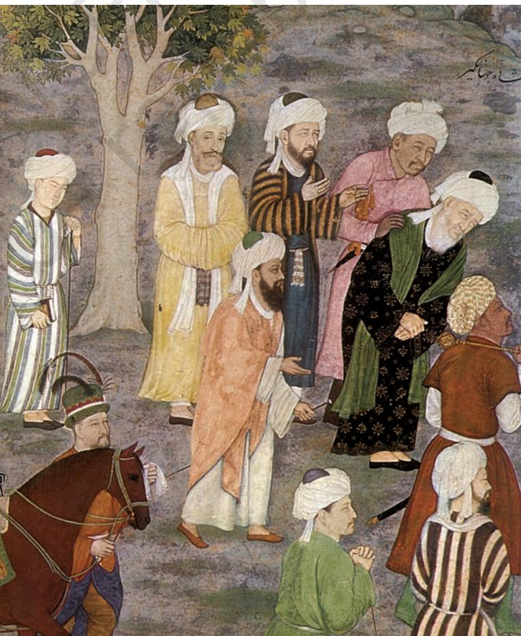
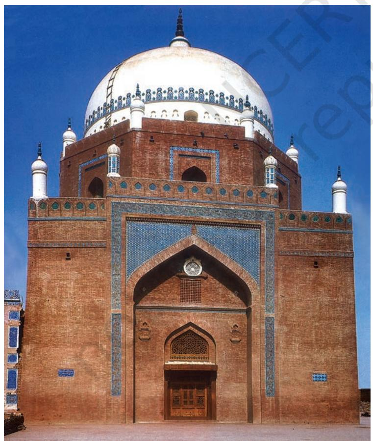

THEME SIX

## Bhakti- Sufi Traditions Changes in Religious Beliefs and Devotional Ttional T tional Texts (c. eighth to eighteenth century)

We saw in Chapter 4 that by the mid-first millennium CE the landscape of the subcontinent was dotted with a variety of religious structures – stupas*,* monasteries, temples. If these typified certain religious beliefs and practices, others have been reconstructed from textual traditions, including the Puranas*,* many of which received their present shape around the same time, and yet others remain only faintly visible in textual and visual records.

New textual sources available from this period include compositions attributed to poet-saints, most of whom expressed themselves orally in regional languages used by ordinary people. These compositions, which were often set to music, were compiled by disciples or devotees, generally after the death of the poet-saint. What is more, these traditions were fluid – generations of devotees tended to elaborate on the original message, and occasionally modified or even abandoned some of the ideas that appeared problematic or irrelevant in different political, social or cultural contexts. Using these sources thus poses a challenge to historians.

Historians also draw on hagiographies or biographies of saints written by their followers (or members of their religious sect). These may not be literally accurate, but allow a glimpse into the ways in which devotees perceived the lives of these pathbreaking women and men.

As we will see, these sources provide us with insights into a scenario characterised by dynamism and diversity. Let us look at some elements of these more closely.

*Fig. 6.1 A twelfth-century bronze sculpture of Manikkavachakar, a devotee of Shiva who composed beautiful devotional songs in Tamil*

## 1. A Mosaic of Religious Beliefs and Practices

Perhaps the most striking feature of this phase is the increasing visibility of a wide range of gods and goddesses in sculpture as well as in texts. At one level, this indicates the continued and even extended worship of the major deities – Vishnu, Shiva and the goddess – each of whom was visualised in a variety of forms.

#### 1.1 The integration of cults

Historians who have tried to understand these developments suggest that there were at least two processes at work. One was a process of disseminating Brahmanical ideas. This is exemplified by the composition, compilation and preservation of Puranic texts in simple Sanskrit verse, explicitly meant to be accessible to women and Shudras, who were generally excluded from Vedic learning. At the same time, there was a second process at work – that of the Brahmanas accepting and reworking the beliefs and practices of these and other social categories. In fact, many beliefs and practices were shaped through a continuous dialogue between what sociologists have described as "great" Sanskritic Puranic traditions and "little" traditions throughout the land.

One of the most striking examples of this process is evident at Puri, Orissa, where the principal deity was identified, by the twelfth century, as Jagannatha (literally, the lord of the world), a form of Vishnu.

## "Great" and "little" traditions

The terms great and little traditions were coined by a sociologist named Robert Redfield in the twentieth century to describe the cultural practices of peasant societies. He found that peasants observed rituals and customs that emanated from dominant social categories, including priests and rulers. These he classified as part of a great tradition. At the same time, peasants also followed local practices that did not necessarily correspond with those of the great tradition. These he included within the category of little tradition. He also noticed that both great and little traditions changed over time, through a process of interaction.

While scholars accept the significance of these categories and processes, they are often uncomfortable with the hierarchy suggested by the terms great and little. The use of quotation marks for "great" and "little" is one way of indicating this.

*Fig. 6.2 Jagannatha (extreme right) with his sister Subhadra (centre) and his brother Balarama (left)*

If you compare Fig. 6.2 with Fig. 4.26 (Chapter 4) you will notice that the deity is represented in a very different way. In this instance, a local deity, whose image was and continues to be made of wood by local tribal specialists, was recognised as a form of Vishnu. At the same time, Vishnu was visualised in a way that was very different from that in other parts of the country.

Such instances of integration are evident amongst goddess cults as well. Worship of the goddess, often simply in the form of a stone smeared with ochre, was evidently widespread. These local deities were often incorporated within the Puranic framework by providing them with an identity as a wife of the principal male deities – sometimes they were equated with Lakshmi, the wife of Vishnu, in other instances, with Parvati, the wife of Shiva.

#### 1.2 Difference and conflict

Often associated with the goddess were forms of worship that were classified as Tantric. Tantric practices were widespread in several parts of the subcontinent – they were open to women and men, and practitioners often ignored differences of caste and class within the ritual context. Many of these ideas influenced Shaivism as well as Buddhism, especially in the eastern, northern and southern parts of the subcontinent.

All of these somewhat divergent and even disparate beliefs and practices would come to be classified as Hindu over the course of the next millennium. The divergence is perhaps most stark if we compare Vedic and Puranic traditions. The principal deities of the Vedic pantheon, Agni, Indra and Soma, become marginal figures, rarely visible in textual or visual representations. And while we can catch a glimpse of Vishnu, Shiva and the goddess in Vedic mantras, these have little in common with the elaborate Puranic mythologies. However, in spite of these obvious discrepancies, the Vedas continued to be revered as authoritative.

Not surprisingly, there were sometimes conflicts as well – those who valued the Vedic tradition often condemned practices that went beyond the closely regulated contact with the divine through the performance of sacrifices or precisely chanted mantras. On the other hand those engaged in Tantric practices

*Fig. 6.3 Sculpture of a Buddhist goddess, Marichi (*c.*tenth century, Bihar), an example of the process of integration of different religious beliefs and practices*

frequently ignored the authority of the Vedas. Also, devotees often tended to project their chosen deity, either Vishnu or Shiva, as supreme. Relations with other traditions, such as Buddhism or Jainism, were also often fraught with tension if not open conflict.

The traditions of devotion or bhakti need to be located within this context. Devotional worship had a long history of almost a thousand years before the period we are considering. During this time, expressions of devotion ranged from the routine worship of deities within temples to ecstatic adoration where devotees attained a trance-like state. The singing and chanting of devotional compositions was often a part of such modes of worship. This was particularly true of the Vaishnava and Shaiva sects.

## 2. Poems of Prayer

### Early Traditions of Bhakti

In the course of the evolution of these forms of worship, in many instances, poet-saints emerged as leaders around whom there developed a community of devotees. Further, while Brahmanas remained important intermediaries between gods and devotees in several forms of bhakti, these traditions also accommodated and acknowledged women and the "lower castes", categories considered ineligible for liberation within the orthodox Brahmanical framework. What also characterised traditions of bhakti was a remarkable diversity.

At a different level, historians of religion often classify bhakti traditions into two broad categories: *saguna* (with attributes) and *nirguna* (without attributes)*.* The former included traditions that focused on the worship of specific deities such as Shiva, Vishnu and his avatars (incarnations) and forms of the goddess or Devi, all often conceptualised in anthropomorphic forms. *Nirguna* bhakti on the other hand was worship of an abstract form of god.

#### 2.1 The Alvars and Nayanars of Tamil Nadu

Some of the earliest bhakti movements (*c.* sixth century) were led by the Alvars (literally, those who are "immersed" in devotion to Vishnu) and Nayanars (literally, leaders who were devotees of Shiva). They travelled from place to place singing hymns in Tamil in praise of their gods.

Ü Discuss...

Find out about gods and goddesses worshipped in your town or village, noting their names and the ways in which they are depicted. Describe the rituals that are performed.

*Source 1*

### The chaturvedin (Brahmana versed in the four Vedas) and the "outcaste"

This is an excerpt from a composition of an Alvar named Tondaradippodi, who was a Brahmana:

You (Vishnu) manifestly like

those "servants" who express their love for your feet,

though they may be born outcastes, more than

the Chaturvedins who are strangers and without allegiance to your service.

> Ü Do you think Tondaradippodi was opposed to the caste system?

#### *Source 2*

#### Shastras or devotion?

This is a verse composed by Appar, a Nayanar saint:

O rogues who quote the law books,

Of what use are your gotra and kula?

Just bow to Marperu's lord (Shiva who resides in Marperu, in Thanjavur, Tamil Nadu) as your sole refuge.

## Ü Are there any

similarities or differences in the attitudes of Tondaradippodi and Appar towards Brahmanas?

During their travels the Alvars and Nayanars identified certain shrines as abodes of their chosen deities. Very often large temples were later built at these sacred places. These developed as centres of pilgrimage. Singing compositions of these poet-saints became part of temple rituals in these shrines, as did worship of the saints' images.

#### 2.2 Attitudes towards caste

Some historians suggest that the Alvars and Nayanars initiated a movement of protest against the caste system and the dominance of Brahmanas or at least attempted to reform the system. To some extent this is corroborated by the fact that bhaktas hailed from diverse social backgrounds ranging from Brahmanas to artisans and cultivators and even from castes considered "untouchable".

The importance of the traditions of the Alvars and Nayanars was sometimes indicated by the claim that their compositions were as important as the Vedas. For instance, one of the major anthologies of compositions by the Alvars, the *Nalayira Divyaprabandham,* was frequently described as the Tamil Veda, thus claiming that the text was as significant as the four Vedas in Sanskrit that were cherished by the Brahmanas.

#### 2.3 Women devotees

Perhaps one of the most striking features of these traditions was the presence of women. For instance, the compositions of Andal, a woman Alvar, were widely sung (and continue to be sung to date). Andal saw herself as the beloved of Vishnu; her verses express her love for the deity. Another woman, Karaikkal Ammaiyar, a devotee of Shiva, adopted the path of extreme asceticism in order to attain

#### Compilations of devotional literature

By the tenth century the compositions of the 12 Alvars were compiled in an anthology known as the Nalayira Divyaprabandham ("Four Thousand Sacred Compositions").

The poems of Appar, Sambandar and Sundarar form the Tevaram, a collection that was compiled and classified in the tenth century on the basis of the music of the songs.

her goal. Her compositions were preserved within the Nayanar tradition. These women renounced their social obligations, but did not join an alternative order or become nuns. Their very existence and their compositions posed a challenge to patriarchal norms.

*Source 3*

## *Fig. 6.4 A twelfth-century bronze image of Karaikkal Ammaiyar* A demon? This is an excerpt from a poem by Karaikkal Ammaiyar in which she describes herself: The female Pey (demoness) with . . . bulging veins, protruding eyes, white teeth and shrunken stomach, red haired and jutting teeth lengthy shins extending till the ankles, shouts and wails while wandering in the forest. This is the forest of Alankatu, which is the home of our father (Shiva) who dances … with his matted hair thrown in all eight directions, and with cool limbs. Ü List the ways in which Karaikkal Ammaiyar depicts herself as presenting a contrast to traditional notions of feminine beauty.

#### 2.4 Relations with the state

We saw in Chapter 2 that there were several important chiefdoms in the Tamil region in the early first millennium CE. From the second half of the first millennium there is evidence for states, including those of the Pallavas and Pandyas (*c.* sixth to ninth centuries CE). While Buddhism and Jainism had been prevalent in this region for several centuries, drawing support from merchant and artisan communities, these religious traditions received occasional royal patronage.

Interestingly, one of the major themes in Tamil bhakti hymns is the poets' opposition to Buddhism and Jainism. This is particularly marked in the compositions of the Nayanars. Historians have attempted to explain this hostility by suggesting that it was due to competition between members of other religious traditions for royal patronage. What is evident is that the powerful Chola rulers (ninth to thirteenth centuries) supported Brahmanical and bhakti traditions, making land grants and constructing temples for Vishnu and Shiva.

In fact, some of the most magnificent Shiva temples, including those at Chidambaram, Thanjavur and Gangaikondacholapuram, were constructed under the patronage of Chola rulers. This was also the period when some of the most spectacular representations of Shiva in bronze sculpture were produced. Clearly, the visions of the Nayanars inspired artists.

Both Nayanars and Alvars were revered by the Vellala peasants. Not surprisingly, rulers tried to win their support as well. The Chola kings, for instance, often attempted to claim divine support and proclaim their own power and status by building

splendid temples that were adorned with stone and metal sculpture to recreate the visions of these popular saints who sang in the language of the people.

These kings also introduced the singing of Tamil Shaiva hymns in the temples under royal patronage, taking the initiative to collect and organise them into a text (*Tevaram*). Further, inscriptional evidence from around 945 suggests that the Chola ruler Parantaka I had consecrated metal images of Appar, Sambandar and Sundarar in a Shiva temple. These were carried in processions during the festivals of these saints.

Ü Discuss... Why do you think kings were interested in proclaiming their connections with bhaktas?

*Fig. 6.5 An image of Shiva as Nataraja*

## 3. The Virashaiva Tradition in Karnataka

The twelfth century witnessed the emergence of a new movement in Karnataka, led by a Brahmana named Basavanna (1106-68) who was a minister in the court of a Kalachuri ruler. His followers were known as Virashaivas (heroes of Shiva) or Lingayats (wearers of the *linga*).

Lingayats continue to be an important community in the region to date. They worship Shiva in his manifestation as a *linga*, and men usually wear a small *linga* in a silver case on a loop strung over the left shoulder. Those who are revered include the *jangama* or wandering monks. Lingayats believe that on death the devotee will be united with Shiva and will not return to this world. Therefore they do not practise funerary rites such as cremation, prescribed in the Dharmashastras. Instead, they ceremonially bury their dead.

The Lingayats challenged the idea of caste and the "pollution" attributed to certain groups by Brahmanas. They also questioned the theory of rebirth. These won them followers amongst those who were marginalised within the Brahmanical social order. The Lingayats also encouraged certain practices disapproved in the Dharmashastras, such as post-puberty marriage and the remarriage of widows. Our understanding of the Virashaiva tradition is derived from *vachanas* (literally, sayings) composed in Kannada by women and men who joined the movement.

#### *Source 4*

#### Rituals and the real world

Here is a vachana composed by Basavanna:

- When they see a serpent carved in stone they pour milk on it.
- If a real serpent comes they say: "Kill. Kill."
- To the servant of the god who could eat if served they say: "Go away! Go away!"
- But to the image of the god which cannot eat they offer dishes of food.
- Ü Describe Basavanna's attitude towards rituals. How does he attempt to convince the listener?

## New religious developments

This period also witnessed two major developments. On the one hand, many ideas of the Tamil bhaktas (especially the Vaishnavas) were incorporated within the Sanskritic tradition, culminating in the composition of one of the best-known Puranas, the Bhagavata Purana. Second, we find the development of traditions of bhakti in Maharashtra in the thirteenth century.

## 4. Religious Ferment in North India

During the same period, in north India deities such as Vishnu and Shiva were worshipped in temples, often built with the support of rulers. However, historians have not found evidence of anything resembling the compositions of the Alvars and Nayanars till the fourteenth century. How do we account for this difference?

Some historians point out that in north India this was the period when several Rajput states emerged. In most of these states Brahmanas occupied positions of importance, performing a range of secular and ritual functions. There seems to have been little or no attempt to challenge their position directly.

*Fig. 6.6 Fragment of a page from the Qur'an, belonging to a manuscript dating to the eighth or ninth century*

At the same time other religious leaders, who did not function within the orthodox Brahmanical framework, were gaining ground. These included the Naths, Jogis and Siddhas. Many of them came from artisanal groups, including weavers, who were becoming increasingly important with the development of organised craft production. Demand for such production grew with the emergence of new urban centres, and long-distance trade with Central Asia and West Asia.

Many of these new religious leaders questioned the authority of the Vedas, and

expressed themselves in languages spoken by ordinary people, which developed over centuries into the ones used today. However, in spite of their popularity these religious leaders were not in a position to win the support of the ruling elites.

A new element in this situation was the coming of the Turks which culminated in the establishment of the Delhi Sultanate (thirteenth century). This undermined the power of many of the Rajput states and the Brahmanas who were associated with these kingdoms. This was accompanied by marked changes in the realm of culture and religion. The coming of the sufis (Section 6) was a significant part of these developments.

## 5. New Strands in the Fabric Islamic Traditions

Just as the regions within the subcontinent were not isolated from one another, so too, contact with lands beyond the seas and mountains had existed for millennia. Arab merchants, for instance, frequented ports along the western coast in the first millennium CE, while Central Asian people settled in the north-western parts of the subcontinent during the same period. From the seventh century, with the advent of Islam, these regions became part of what is often termed the Islamic world.

#### 5.1 Faiths of rulers and subjects

One axis of understanding the significance of these connections that is frequently adopted is to focus on the religions of ruling elites. In 711 an Arab general named Muhammad Qasim conquered Sind, which became part of the Caliph's domain. Later (*c.* thirteenth century) the Turks and Afghans established the Delhi Sultanate. This was followed by the formation of Sultanates in the Deccan and other parts of the subcontinent; Islam was an acknowledged religion of rulers in several areas. This continued with the establishment of the Mughal Empire in the sixteenth century as well as in many of the regional states that emerged in the eighteenth century.

Theoretically, Muslim rulers were to be guided by the *ulama,* who were expected to ensure that they ruled according to the *shari'a.* Clearly, the situation was complicated in the subcontinent, where there were populations that did not subscribe to Islam.

It is in this context that the category of the *zimmi,* meaning protected (derived from the Arabic word *zimma*, protection) developed for people who followed revealed scriptures, such as the Jews and Christians, and lived under Muslim rulership. They paid a tax called *jizya* and gained the right to be protected by Muslims. In India this status was extended to Hindus as well. As you will see (Chapter 9), rulers such as the Mughals came to regard themselves as emperors of not just Muslims but of all peoples.

In effect, rulers often adopted a fairly flexible policy towards their subjects. For instance, several rulers gave land endowments and granted tax exemptions to Hindu, Jaina, Zoroastrian, Christian and Jewish religious institutions and also expressed respect and *Ulama* (plural of *alim*, or one who knows) are scholars of Islamic studies. As preservers of this tradition they perform various religious, juridical and teaching functions.

#### Shari'a

The shari'a is the law governing the Muslim community. It is based on the Qur'an and the hadis, traditions of the Prophet including a record of his remembered words and deeds.

With the expansion of Islamic rule outside Arabia, in areas where customs and traditions were different, qiyas (reasoning by analogy) and ijma (consensus of the community) were recognised as two other sources of legislation. Thus, the shari'a evolved from the Qur'an, hadis, qiyas and ijma.

devotion towards non-Muslim religious leaders. These grants were made by several Mughal rulers, including Akbar and Aurangzeb.

#### *Source 5*

#### A church in Khambat

This is an excerpt from a farman (imperial order) issued by Akbar in 1598:

Whereas it reached our eminent and holy notice that the padris (fathers) of the Holy Society of Jesus wish to build a house of prayer (church) in the city of Kambayat (Khambat, in Gujarat); therefore an exalted mandate … is being issued, … that the dignitaries of the city of Kambayat should in no case stand in their way but should allow them to build a church so that they may engage themselves in their own worship. It is necessary that the order of the Emperor should be obeyed in every way.

Ü Who were the people from whom Akbar anticipated opposition to his order?

*Source 6*

#### Reverence for the Jogi

Here is an excerpt from a letter written by Aurangzeb to a Jogi in 1661-62:

The possessor of the sublime station, Shiv Murat, Guru Anand Nath Jio!

May your Reverence remain in peace and happiness ever under the protection of Sri Shiv Jio!

… A piece of cloth for the cloak and a sum of twenty five rupees which have been sent as an offering will reach (Your Reverence) … Your Reverence may write to us whenever there is any service which can be rendered by us.

Ü Identify the deity worshipped by the Jogi. Describe the attitude of the emperor towards the Jogi*.*

*Fig. 6.7 A Mughal painting depicting Emperor Jahangir with a Jogi*

#### 5.2 The popular practice of Islam

The developments that followed the coming of Islam were not confined to ruling elites; in fact they permeated far and wide, through the subcontinent, amongst different social strata – peasants, artisans, warriors, merchants, to name a few. All those who adopted Islam accepted, in principle, the five "pillars" of the faith: that there is one God, Allah, and Prophet Muhammad is his messenger (*shahada*); offering prayers five times a day (*namaz/salat* ); giving alms (*zakat*); fasting during the month of Ramzan (*sawm*); and performing the pilgrimage to Mecca (*hajj*).

However, these universal features were often overlaid with diversities in practice derived from sectarian affiliations (Sunni, Shi'a), and the influence of local customary practices of converts from different social milieus. For example, the Khojahs, a branch of the Ismailis (a Shi'a sect), developed new modes of communication, disseminating ideas derived from the Qur'an through indigenous literary genres. These included the *ginan* (derived from the Sanskrit *jnana*, meaning "knowledge"), devotional poems in Punjabi, Multani, Sindhi, Kachchi, Hindi and Gujarati, sung in special *ragas* during daily prayer meetings.

Elsewhere, Arab Muslim traders who settled along the Malabar coast (Kerala) adopted the local language, Malayalam. They also adopted local customs such as matriliny (Chapter 3) and matrilocal residence.

The complex blend of a universal faith with local traditions is perhaps best exemplified in the architecture of mosques. Some architectural features

#### *Fig. 6.8*

*A Khojaki manuscript* The *ginan* were transmitted orally before being recorded in the Khojaki script that was derived from the local *landa* ("clipped" mercantile script) used by the linguistically diverse community of Khojahs in the Punjab, Sind and Gujarat.

*Matrilocal* residence is a practice where women after marriage remain in their natal home with their children and the husbands may come to stay with them.

*Fig. 6.9 A mosque in Kerala,* c. *thirteenth century* Note the *shikhara*-like roof.

*Fig. 6.10 Atiya mosque, Mymensingh district, Bangladesh, built with brick, 1609*

#### *Fig. 6.11*

*The Shah Hamadan mosque in Srinagar, on the banks of the Jhelum, is often regarded as the "jewel in the crown" of all the existing mosques of Kashmir.* Built in 1395, it is one of the best examples of Kashmiri wooden architecture. Notice the spire and the beautifully carved eaves. It is decorated with papier mache.

of mosques are universal – such as their orientation towards Mecca, evident in the placement of the *mihrab* (prayer niche) and the *minbar* (pulpit). However, there are several features that show variations – such as roofs and building materials (see Figs. 6.9, 6.10 and 6.11).

#### 5.3 Names for communities

We often take the terms Hindu and Muslim for granted, as labels for religious communities. Yet, these terms did not gain currency for a very long time. Historians who have studied Sanskrit texts and inscriptions dating between the eighth and fourteenth centuries point out that the term *musalman* or Muslim was virtually never used. Instead, people were occasionally identified in terms of the region from which they came. So, the Turkish rulers were designated as Turushka, Tajika were people from Tajikistan and Parashika were people from Persia. Sometimes, terms used for other peoples were applied to the new migrants. For instance, the Turks and Afghans were referred to as Shakas (Chapters 2 and 3) and Yavanas (a term used for Greeks).

A more general term for these migrant

communities was *mlechchha*, indicating that they did not observe the norms of caste society and spoke languages that were not derived from Sanskrit. Such terms sometimes had a derogatory connotation, but they rarely denoted a distinct religious community of Muslims in opposition to Hindus. And as we saw (Chapter 5), the term "Hindu" was used in a variety of ways, not necessarily restricted to a religious connotation.

## Ü Discuss...

Find out more about the architecture of mosques in your village or town. What are the materials used to build mosques? Are these locally available? Are there any distinctive architectural features?

## 6. The Growth of Sufism

In the early centuries of Islam a group of religiousminded people called sufis turned to asceticism and mysticism in protest against the growing materialism of the Caliphate as a religious and political institution. They were critical of the dogmatic definitions and scholastic methods of interpreting the Qur'an and *sunna* (traditions of the Prophet) adopted by theologians. Instead, they laid emphasis on seeking salvation through intense devotion and love for God by following His commands, and by following the example of the Prophet Muhammad whom they regarded as a perfect human being. The sufis thus sought an interpretation of the Qur'an on the basis of their personal experience.

#### 6.1 *Khanqahs* and *silsilas*

By the eleventh century Sufism evolved into a welldeveloped movement with a body of literature on Quranic studies and sufi practices. Institutionally, the sufis began to organise communities around the hospice or *khanqah* (Persian) controlled by a teaching master known as *shaikh* (in Arabic), *pir* or *murshid* (in Persian)*.* He enrolled disciples (*murids*) and appointed a successor (*khalifa*). He established rules for spiritual conduct and interaction between inmates as well as between laypersons and the master.

Sufi *silsilas* began to crystallise in different parts of the Islamic world around the twelfth century. The word *silsila* literally means a chain, signifying a continuous link between master and disciple, stretching as an unbroken spiritual genealogy to the Prophet Muhammad. It was through this channel that spiritual power and blessings were transmitted to devotees. Special rituals of initiation were developed in which initiates took an oath of allegiance, wore a patched garment, and shaved their hair.

When the *shaikh* died, his tomb-shrine (*dargah,* a Persian term meaning court) became the centre of devotion for his followers. This encouraged the practice of pilgrimage or *ziyarat* to his grave, particularly on his death anniversary or *urs* (or marriage, signifying the union of his soul with God). This was because people believed that in death saints were united with God, and were thus closer to Him than when living. People sought their blessings to attain material and spiritual benefits. Thus evolved the cult of the *shaikh* revered as *wali*.

## Sufism and tasawwuf

Sufism is an English word coined in the nineteenth century. The word used for Sufism in Islamic texts is tasawwuf. Historians have understood this term in several ways. According to some scholars, it is derived from suf, meaning wool, referring to the coarse woollen clothes worn by sufis. Others derive it from safa, meaning purity. It may also have been derived from suffa, the platform outside the Prophet's mosque, where a group of close followers assembled to learn about the faith.

## Names of silsilas

Most sufi lineages were named after a founding figure. For example, the Qadiri order was named after Shaikh Abd'ul Qadir Jilani. However, some like the Chishti order, were named after their place of origin, in this case the town of Chisht in central Afghanistan.

*Wali* (plural *auliya*) or friend of God was a sufi who claimed proximity to Allah, acquiring His Grace (*barakat*) to perform miracles (*karamat*).

## Ü Discuss...

Are there any *khanqahs* or *dargahs* in your town or village? Find out when these were built, and what are the activities associated with them. Are there other places where religious men and women meet or live?

#### 6.2 Outside the *khanqah*

Some mystics initiated movements based on a radical interpretation of sufi ideals. Many scorned the *khanqah* and took to mendicancy and observed celibacy. They ignored rituals and observed extreme forms of asceticism. They were known by different names – Qalandars, Madaris, Malangs, Haidaris, etc. Because of their deliberate defiance of the *shari'a* they were often referred to as *be-shari'a*, in contrast to the *ba-shari'a* sufis who complied with it.

## 7. The Chishtis in the Subcontinent

Of the groups of sufis who migrated to India in the late twelfth century, the Chishtis were the most influential. This was because they adapted successfully to the local environment and adopted several features of Indian devotional traditions.

#### 7.1 Life in the Chishti *khanqah*

The *khanqah* was the centre of social life. We know about Shaikh Nizamuddin's hospice (*c.* fourteenth century) on the banks of the river Yamuna in Ghiyaspur, on the outskirts of what was then the city of Delhi. It comprised several small rooms and a big hall *( jama'at khana*) where the inmates and visitors lived and prayed. The inmates included family members of the Shaikh, his attendants and disciples. The Shaikh lived in a small room on the roof of the hall where he met visitors in the morning and evening. A veranda surrounded the courtyard, and a boundary wall ran around the complex. On one occasion, fearing a Mongol invasion, people from the neighbouring areas flocked into the *khanqah* to seek refuge.

#### MAJOR TEACHERS OF THE CHISHTI *SILSILA*

| SUFI TEACHERS | YEAR OF DEATH | LOCATION OF DARGAH |
| --- | --- | --- |
| Shaikh Muinuddin Sijzi | 1235 | Ajmer (Rajasthan) |
| Khwaja Qutbuddin Bakhtiyar Kaki | 1235 | Delhi |
| Shaikh Fariduddin Ganj-i Shakar | 1265 | Ajodhan (Pakistan) |
| Shaikh Nizamuddin Auliya | 1325 | Delhi |
| Shaikh Nasiruddin Chiragh-i Dehli | 1356 | Delhi |

There was an open kitchen (*langar*), run on *futuh* (unasked-for charity). From morning till late night people from all walks of life – soldiers, slaves, singers, merchants, poets, travellers, rich and poor, Hindu *jogis* (yogi) and *qalandars* – came seeking discipleship, amulets for healing, and the intercession of the Shaikh in various matters. Other visitors included poets such as Amir Hasan Sijzi and Amir Khusrau and the court historian Ziyauddin Barani, all of whom wrote about the Shaikh. Practices that were adopted, including bowing before the Shaikh, offering water to visitors, shaving the heads of initiates, and yogic exercises, represented attempts to assimilate local traditions.

Shaikh Nizamuddin appointed several spiritual successors and deputed them to set up hospices in various parts of the subcontinent. As a result the teachings, practices and organisation of the Chishtis as well as the fame of the Shaikh spread rapidly. This in turn drew pilgrims to his shrine, and also to the shrines of his spiritual ancestors.

#### 7.2 Chishti devotionalism: *ziyarat* and *qawwali*

Pilgrimage, called *ziyarat,* to tombs of sufi saints is prevalent all over the Muslim world. This practice is an occasion for seeking the sufi's spiritual grace (*barakat*). For more than seven centuries people of various creeds, classes and social backgrounds have expressed their devotion at the *dargahs* of the five great Chishti saints (see chart on p.154). Amongst these, the most revered shrine is that of Khwaja Muinuddin, popularly known as "Gharib Nawaz" (comforter of the poor).

 The earliest textual references to Khwaja Muinuddin's *dargah* date to the fourteenth century. It was evidently popular because of the austerity and piety of its Shaikh, the greatness of his spiritual successors, and the patronage of royal visitors. Muhammad bin Tughlaq (ruled, 1324-51) was the

#### *Fig. 6.12*

*A seventeenth-century painting of Shaikh Nizamuddin Auliya and his disciple Amir Khusrau*

ÜDescribe how the artist differentiates between the Shaikh and his disciple.

## The story of Data Ganj Bakhsh

In 1039 Abu'l Hasan al Hujwiri, a native of Hujwir near Ghazni in Afghanistan, was forced to cross the Indus as a captive of the invading Turkish army. He settled in Lahore and wrote a book in Persian called the Kashful-Mahjub (Unveiling of the Veiled) to explain the meaning of tasawwuf, and those who practised it, that is, the sufi.

Hujwiri died in 1073 and was buried in Lahore. The grandson of Sultan Mahmud of Ghazni constructed a tomb over his grave, and this tomb-shrine became a site of pilgrimage for his devotees, especially on his death anniversary.

Even today Hujwiri is revered as Data Ganj Bakhsh or "Giver who bestows treasures" and his mausoleum is called Data Darbar or "Court of the Giver".

first Sultan to visit the shrine, but the earliest construction to house the tomb was funded in the late fifteenth century by Sultan Ghiyasuddin Khalji of Malwa. Since the shrine was located on the trade route linking Delhi and Gujarat, it attracted a lot of travellers.

By the sixteenth century the shrine had become very popular; in fact it was the spirited singing of pilgrims bound for Ajmer that inspired Akbar to visit the tomb. He went there fourteen times, sometimes two or three times a year, to seek blessings for new conquests, fulfilment of vows, and the birth of sons. He maintained this tradition until 1580. Each of these visits was celebrated by generous gifts, which were recorded in imperial documents. For example*,* in 1568 he offered a huge cauldron (*degh*) to facilitate cooking for pilgrims. He also had a mosque constructed within the compound of the *dargah*.

*Fig. 6.13 Shaikhs greeting the Mughal emperor Jahangir on his pilgrimage to Ajmer, painting by an artist named Manohar,* c.*1615*

Ü Find his signature on the painting.

#### *Source 7*

#### The pilgrimage of the Mughal princess Jahanara, 1643

The following is an excerpt from Jahanara's biography of Shaikh Muinuddin Chishti, titled Munis al Arwah (The Confidant of Spirits):

After praising the one God … this lowly faqira (humble soul) Jahanara ... went from the capital Agra in the company of my great father (Emperor Shah Jahan) towards the pure region of incomparable Ajmer … I was committed to this idea, that every day in every station I would perform two cycles of optional prayer …

For several days ... I did not sleep on a leopard skin at night, I did not extend my feet in the direction of the blessed sanctuary of the revered saving master, and I did not turn my back towards him. I passed the days beneath the trees.

On Thursday, the fourth of the blessed month of Ramzan, I attained the happiness of pilgrimage to the illuminated and the perfumed tomb … With an hour of daylight remaining, I went to the holy sanctuary and rubbed my pale face with the dust of that threshold. From the doorway to the blessed tomb I went barefoot, kissing the ground. Having entered the dome, I went around the light-filled tomb of my master seven times … Finally, with my own hand I put the finest quality of itar on the perfumed tomb of the revered one, and having taken off the rose scarf that I had on my head, I placed it on the top of the blessed tomb ...

Ü What are the gestures that Jahanara records to indicate her devotion to the Shaikh*?* How does she suggest that the *dargah* was a special place?

Also part of *ziyarat* is the use of music and dance including mystical chants performed by specially trained musicians or *qawwals* to evoke divine ecstasy. The sufis remember God either by reciting the *zikr* (the Divine Names) or evoking His Presence through *sama*' (literally, "audition") or performance of mystical music. *Sama'* was integral to the Chishtis, and exemplified interaction with indigenous devotional traditions.

## The lamp of the entire land

Each sufi shrine was associated with distinctive features. This is what an eighteenth-century visitor from the Deccan, Dargah Quli Khan, wrote about the shrine of Nasiruddin Chiragh-i Dehli in his Muraqqa-i Dehli (Album of Delhi):

> The Shaikh (in the grave) is not the lamp of Delhi but of the entire country. People turn up there in crowds, particularly on Sunday. In the month of Diwali the entire population of Delhi visits it and stays in tents around the spring tank for days. They take baths to obtain cures from chronic diseases. Muslims and Hindus pay visits in the same spirit. From morning till evening people come and also make themselves busy in merrymaking in the shade of the trees.

## Amir Khusrau and the qaul

Amir Khusrau (1253-1325), the great poet, musician and disciple of Shaikh Nizamuddin Auliya, gave a unique form to the Chishti sama' by introducing the qaul (Arabic word meaning "saying"), a hymn sung at the opening or closing of qawwali. This was followed by sufi poetry in Persian, Hindavi or Urdu, and sometimes using words from all of these languages. Qawwals (those who sing these songs) at the shrine of Shaikh Nizamuddin Auliya always start their recital with the qaul. Today qawwali is performed in shrines all over the subcontinent.

*Fig. 6.14* Qawwali *at the* dargah *of Nizamuddin Auliya*

Ü In what ways are the ideas and modes of expression used in this song similar to or different from those used by Jahanara to describe her *ziyarat* (Source 7)?

#### 7.3 Languages and communication

It was not just in *sama'* that the Chishtis adopted local languages. In Delhi, those associated with the Chishti *silsila* conversed in Hindavi, the language of the people. Other sufis such as Baba Farid composed verses in the local language, which were incorporated in the *Guru Granth Sahib*. Yet others composed long poems or *masnavis* to express ideas of divine love using human love as an allegory. For example, the *prem-akhyan* (love story) *Padmavat* composed by Malik Muhammad Jayasi revolved around the romance of Padmini and Ratansen, the king of Chittor. Their trials were symbolic of the soul's journey to the divine. Such poetic compositions were often recited in hospices, usually during *sama'.*

A different genre of sufi poetry was composed in and around the town of Bijapur, Karnataka. These were short poems in Dakhani (a variant of Urdu) attributed to Chishti sufis who lived in this region during the seventeenth and eighteenth centuries. These poems were probably sung by women while performing household chores like grinding grain and spinning. Other compositions were in the form of *lurinama* or lullabies and *shadinama* or wedding songs. It is likely that the sufis of this region were inspired by the pre-existing bhakti tradition of the Kannada *vachanas* of the Lingayats and the Marathi *abhangs* of the *sants* of Pandharpur. It is through this medium that Islam gradually gained a place in the villages of the Deccan.

*Source 8*

#### Charkhanama

#### A song set to the rhythm of the spinning wheel:

- As you take the cotton, you do zikr-i jali
As you separate the cotton you should do zikr-i qalbi And as you spool the thread you should do zikr-i aini Zikr should be uttered from the stomach through the chest,

- And threaded through the throat.
- The threads of breath should be counted one by one, oh sister.
- Up to twenty four thousand.
- Do this day and night,
- And offer this to your piras a gift.

#### 7.4 Sufis and the state

A major feature of the Chishti tradition was austerity, including maintaining a distance from worldly power. However, this was by no means a situation of absolute isolation from political power. The sufis accepted unsolicited grants and donations from the political elites. The Sultans in turn set up charitable trusts (*auqaf* ) as endowments for hospices and granted tax-free land (*inam*).

The Chishtis accepted donations in cash and kind. Rather than accumulate donations, they preferred to use these fully on immediate requirements such as food, clothes, living quarters and ritual necessities (such as *sama'*). All this enhanced the moral authority of the *shaikhs,* which in turn attracted people from all walks of life. Further, their piety and scholarship, and people's belief in their miraculous powers made sufis popular among the masses, whose support kings wished to secure.

Kings did not simply need to demonstrate their association with sufis; they also required legitimation from them. When the Turks set up the Delhi Sultanate, they resisted the insistence of the *ulama* on imposing *shari'a* as state law because they anticipated opposition from their subjects, the majority of whom were non-Muslims. The Sultans then sought out the sufis – who derived their authority directly from God – and did not depend on jurists to interpret the *shari'a*.

Besides, it was believed that the *auliya* could intercede with God in order to improve the material and spiritual conditions of ordinary human beings. This explains why kings often wanted their tombs to be in the vicinity of sufi shrines and hospices.

However, there were instances of conflict between the Sultans and the sufis. To assert their authority, both expected that certain rituals be performed such as prostration and kissing of the feet. Occasionally the sufi *shaikh* was addressed with high-sounding titles. For example, the disciples of Nizamuddin Auliya addressed him as *sultan-ul-mashaikh* (literally, Sultan amongst *shaikhs*).

#### Sufis and the state

Other sufis such as the Suhrawardi under the Delhi Sultans and the Naqshbandi under the Mughals were also associated with the state. However, the modes of their association were not the same as those of the Chishtis. In some cases, sufis accepted courtly offices.

## Ü Discuss...

What are the potential sources of conflict in the relationship between religious and political leaders?

> Ü What aspects of the relationship between the sufis and the state do you think are best illustrated in this account? What does the account tell us about the modes of communication between the Shaikh and his disciples?

#### *Fig. 6.15*

*The* dargah *of Shaikh Salim Chishti (a direct descendant of Baba Farid) constructed in Fatehpur Sikri, Akbar's capital, symbolised the bond between the Chishtis and the Mughal state.*

## Declining a royal gift

*Source 9*

This excerpt from a sufi text describes the proceedings at Shaikh Nizamuddin Auliya's hospice in 1313:

> I (the author, Amir Hasan Sijzi) had the good fortune of kissing his (Shaikh Nizamuddin Auliya's) feet … At this time a local ruler had sent him the deed of ownership to two gardens and much land, along with the provisions and tools for their maintenance. The ruler had also made it clear that he was relinquishing all his rights to both the gardens and land. The master … had not accepted that gift. Instead, he had lamented: "What have I to do with gardens and fields and lands? … None of … our spiritual masters had engaged in such activity."

> Then he told an appropriate story: "… Sultan Ghiyasuddin, who at that time was still known as Ulugh Khan, came to visit Shaikh Fariduddin (and) offered some money and ownership deeds for four villages to the Shaikh, the money being for the benefit of the dervishes (sufis), and the land for his use. Smiling, Shaikh al Islam (Fariduddin) said: 'Give me the money. I will dispense it to the dervishes. But as for those land deeds, keep them. There are many who long for them. Give them away to such persons.'"

## 8. New Devotional Paths Dialogue and Dissent in Northern India

Many poet-saints engaged in explicit and implicit dialogue with these new social situations, ideas and institutions. Let us now see how this dialogue found expression. We focus here on three of the most influential figures of the time.

#### 8.1 Weaving a divine fabric: Kabir

Kabir (*c.* fourteenth-fifteenth centuries) is perhaps one of the most outstanding examples of a poet-saint who emerged within this context. Historians have painstakingly tried to reconstruct his life and times through a study of compositions attributed to him as well as later hagiographies. Such exercises have proved to be challenging on a number of counts.

Verses ascribed to Kabir have been compiled in three distinct but overlapping traditions. The *Kabir Bijak* is preserved by the Kabirpanth (the path or sect of Kabir) in Varanasi and elsewhere in Uttar Pradesh; the *Kabir Granthavali* is associated with the Dadupanth in Rajasthan, and many of his compositions are found in the *Adi Granth Sahib* (see Section 8.2). All these manuscript compilations were made long after the death of Kabir. By the nineteenth century, anthologies of verses attributed to him circulated in print in regions as far apart as Bengal, Gujarat and Maharashtra.

Kabir's poems have survived in several languages and dialects; and some are composed in the special language of *nirguna* poets, the *sant bhasha*. Others, known as *ulatbansi* (upside-down sayings), are written in a form in which everyday meanings are inverted. These hint at the difficulties of capturing the nature of the Ultimate Reality in words: expressions such as "the lotus which blooms without flower" or the "fire raging in the ocean" convey a sense of Kabir's mystical experiences.

Also striking is the range of traditions Kabir drew on to describe the Ultimate Reality. These include Islam: he described the Ultimate Reality as Allah, Khuda, Hazrat and Pir. He also used terms drawn from Vedantic traditions, *alakh* (the unseen), *nirakar* (formless), Brahman, Atman, etc. Other terms with mystical connotations such as *shabda* (sound) or *shunya* (emptiness) were drawn from yogic traditions. *Source 10*

#### The One Lord

Here is a composition attributed to Kabir:

> Tell me, brother, how can there be

No one lord of the world but two?

Who led you so astray?

God is called by many names:

Names like Allah, Ram, Karim, Keshav, Hari, and Hazrat.

Gold may be shaped into rings and bangles.

Isn't it gold all the same?

Distinctions are only words we invent …

Kabir says they are both mistaken.

Neither can find the only Ram. One kills the goat, the other cows.

They waste their lives in disputation.

Ü What is Kabir's argument against the distinction made between gods of different communities?

Diverse and sometimes conflicting ideas are expressed in these poems. Some poems draw on Islamic ideas and use monotheism and iconoclasm to attack Hindu polytheism and idol worship; others use the sufi concept of *zikr* and *ishq* (love) to express the Hindu practice of *nam-simaran* (remembrance of God's name).

Were all these composed by Kabir? We may never be able to tell with certainty, although scholars have tried to analyse the language, style and content to establish which verses could be Kabir's. What this rich corpus of verses also signifies is that Kabir was and is to the present a source of inspiration for those who questioned entrenched religious and social institutions, ideas and practices in their search for the Divine.

Just as Kabir's ideas probably crystallised through dialogue and debate (explicit or implicit) with the traditions of sufis and yogis in the region of Awadh (part of present-day Uttar Pradesh), his legacy was claimed by several groups, who remembered him and continue to do so.

This is most evident in later debates about whether he was a Hindu or a Muslim by birth, debates that are reflected in hagiographies. Many of these were composed from the seventeenth century onwards, about 200 years after Kabir's lifetime.

Hagiographies within the Vaishnava tradition attempted to suggest that he was born a Hindu, Kabirdas (Kabir itself is an Arabic word meaning "great"), but was raised by a poor Muslim family belonging to the community of weavers or *julahas,* who were relatively recent converts to Islam. They also suggested that he was initiated into bhakti by a guru, perhaps Ramananda.

#### *Fig. 6.16 Roadside musicians, a seventeenthcentury Mughal painting* It is likely that the compositions of the *sants* were sung by such musicians.

However, the verses attributed to Kabir use the words *guru* and *satguru,* but do not mention the name of any specific preceptor. Historians have pointed out that it is very difficult to establish that Ramananda and Kabir were contemporaries, without assigning improbably long lives to either or both. So, while traditions linking the two cannot be accepted at face value, they show how important the legacy of Kabir was for later generations.

#### 8.2 Baba Guru Nanak and the Sacred Wor d

Baba Guru Nanak (1469-1539) was born in a Hindu merchant family in a village called Nankana Sahib near the river Ravi in the predominantly Muslim Punjab. He trained to be an accountant and studied Persian. He was married at a young age but he spent most of his time among sufis and bhaktas. He also travelled widely.

The message of Baba Guru Nanak is spelt out in his hymns and teachings. These suggest that he advocated a form of *nirguna* bhakti. He firmly repudiated the external practices of the religions he saw around him. He rejected sacrifices, ritual baths, image worship, austerities and the scriptures of both Hindus and Muslims. For Baba Guru Nanak, the Absolute or "*rab*" had no gender or form. He proposed a simple way to connect to the Divine by remembering and repeating the Divine Name, expressing his ideas through hymns called "*shabad* " in Punjabi, the language of the region. Baba Guru Nanak would sing these compositions in various *ragas* while his attendant Mardana played the *rabab* . hymns, called *"gurbani",* are composed in various BHAKTI-SUFI TRADITIONS

Baba Guru Nanak organised his followers into a community. He set up rules for congregational worship (*sanga t*) involving collective recitation. He appointed one of his disciples, Angad, to succeed him as the preceptor (*gur u*), and this practice was followed for nearly 200 years.

It appears that Baba Guru Nanak did not wish to establish a new religion, but after his death his followers consolidated their own practices and distinguished themselves from both Hindus and Muslims. The fifth preceptor, Guru Arjan , compiled Baba Guru Nanak's hymns along with those of his four successors and other religious poets like Baba Farid, Ravidas (also known as Raidas) and Kabir in the *Adi Granth Sahib* . These languages. In the late seventeenth century the tenth preceptor, Guru Gobind Singh, included the compositions of the ninth guru, Guru Tegh Bahadur, and this scripture was called the *Guru Granth Sahib*. Guru Gobind Singh also laid the foundation of the Khalsa Panth (army of the pure) and defined its five symbols: uncut hair, a dagger, a pair of shorts, a comb and a steel bangle. Under him the community got consolidated as a socio-religious and military force.

#### 8.3 Mirabai, the devotee princess

Mirabai (*c.* fifteenth-sixteenth centuries) is perhaps the best-known woman poet within the bhakti tradition. Biographies have been reconstructed primarily from the *bhajans* attributed to her, which were transmitted orally for centuries. According to these, she was a Rajput princess from Merta in Marwar who was married against her wishes to a prince of the Sisodia clan of Mewar, Rajasthan. She defied her husband and did not submit to the traditional role of wife and mother, instead recognising Krishna, the *avatar* of Vishnu, as her lover. Her in-laws tried to poison her, but she escaped from the palace to live as a wandering saint composing songs that are characterised by intense expressions of emotion.

*Source 11*

#### Love for the Lord

This is part of a song attributed to Mirabai:

- I will build a funeral pyre of sandalwood and aloe;
- Light it by your own hand
- When I am burned away to cinders;
- Smear this ash upon your limbs.
- … let flame be lost in flame.
- In another verse, she sings:

What can Mewar's ruler do to me? If God is angry, all is lost, But what can the Rana do?

Ü What does this indicate about Mirabai's attitude towards the king?

*Fig. 6.17 A fifteenth-century stone sculpture (Tamil Nadu) depicting Krishna playing the flute, a form of the deity worshipped by Mirabai*

According to some traditions, her preceptor was Raidas, a leather worker. This would indicate her defiance of the norms of caste society. After rejecting the comforts of her husband's palace, she is supposed to have donned the white robes of a widow or the saffron robe of the renouncer.

Although Mirabai did not attract a sect or group of followers, she has been recognised as a source of inspiration for centuries. Her songs continue to be sung by women and men, especially those who are poor and considered "low caste" in Gujarat and Rajasthan.

## Ü Discuss...

Why do you think the traditions of Kabir, Baba Guru Nanak and Mirabai remain significant in the twenty-first century?

## 9. Reconstructing Histories of Religious Traditions

We have seen that historians draw on a variety of sources to reconstruct histories of religious traditions – these include sculpture, architecture, stories about religious preceptors, compositions attributed to women and men engaged in the quest of understanding the nature of the Divine.

As we have seen in Chapters 1 and 4, sculpture and architecture can only be understood if we have a grasp of the context – the ideas, beliefs and practices of those who produced and used these images and buildings. What about textual traditions regarding religious beliefs? If you return to the sources in this chapter, you will notice that they include a wide variety, written in several different languages and styles. They range from the apparently simple, direct language of the *vachanas* of Basavanna to the ornate Persian of the *farman* of the Mughal emperors. Understanding each type of text requires different skills: apart from a familiarity with several languages, the historian has to be aware of the subtle variations in style that characterise each genre.

#### Shankaradeva

In the late fifteenth century, Shankaradeva emerged as one of the leading proponents of Vaishnavism in Assam. His teachings, often known as the Bhagavati dharma because they were based on the Bhagavad Gita and the Bhagavata Purana, focused on absolute surrender to the supreme deity, in this case Vishnu. He emphasised the need for naam kirtan, recitation of the names of the lord in sat sanga or congregations of pious devotees. He also encouraged the establishment of satra or monasteries for the transmission of spiritual knowledge, and naam ghar or prayer halls. Many of these institutions and practices continue to flourish in the region. His major compositions include the Kirtana-ghosha.

## Varieties of sources used to reconstruct the history of sufi traditions

A wide range of texts were produced in and around sufi khanqahs. These included:

1.Treatises or manuals dealing with sufi thought and practices – The Kashf-ul-Mahjub of Ali bin Usman Hujwiri (died c. 1071) is an example of this genre. It enables historians to see how traditions outside the subcontinent influenced sufi thought in India.

2. Malfuzat (literally, "uttered"; conversations of sufi saints) – An early text on malfuzat is the Fawa'id-al-Fu'ad, a collection of conversations of Shaikh Nizamuddin Auliya, compiled by Amir Hasan Sijzi Dehlavi, a noted Persian poet. Source 9 contains an excerpt from this text. Malfuzats were compiled by different sufi silsilas with the permission of the shaikhs; these had obvious didactic purposes. Several examples have been found from different parts of the subcontinent, including the Deccan. They were compiled over several centuries.

3. Maktubat (literally, "written" collections of letters); letters written by sufi masters, addressed to their disciples and associates – While these tell us about the shaikh's experience of religious truth that he wanted to share with others, they also reflect the life conditions of the recipients and are responses to their aspirations and difficulties, both spiritual and mundane. The letters, known as Maktubat-i Imam Rabbani, of the noted seventeenth-century Naqshbandi Shaikh Ahmad Sirhindi (d.1624), whose ideology is often contrasted with the liberal and non-sectarian views of Akbar, are amongst those most frequently discussed by scholars.

4. Tazkiras (literally, "to mention and memorialise"; biographical accounts of saints) – The fourteenth-centurySiyar-ul-Auliya of Mir Khwurd Kirmani was the first sufi tazkira written in India. It dealt principally with the Chishti saints. The most famous tazkira is the Akhbar-ul-Akhyar of Abdul Haqq Muhaddis Dehlavi (d. 1642). The authors of the tazkiras often sought to establish the precedence of their own orders and glorify their spiritual genealogies. Many details are often implausible, full of elements of the fantastic. Still they are of great value for historians and help them to understand more fully the nature of the tradition.

 Remember that each of the traditions we have been considering in this chapter generated a wide range of textual and oral modes of communication, some of which have been preserved, many of which have been modified in the process of transmission, and others are probably lost forever.

Virtually all these religious traditions continue to flourish to date. This continuity has certain advantages for historians as it allows them to compare contemporary practices with those described in textual traditions or shown in old paintings and to trace changes. At the same time, because these traditions are part of peoples' lived beliefs and practices, there is often a lack of acceptance of the possibility that these may have changed over time. The challenge for historians is to undertake such investigations with sensitivity, while at the same time recognising that religious traditions, like other traditions, are dynamic and change over time.

|  | Timeline |
| --- | --- |
| Some Major | Religious Teachers in the Subcontinent |
| c. 500-800 CE | Appar, Sambandar, Sundaramurti in Tamil Nadu |
| c. 800-900 | Nammalvar, Manikkavachakar, Andal, Tondaradippodi in Tamil Nadu |
| c.1000-1100 | Al Hujwiri, Data Ganj Bakhsh in the Punjab; Ramanujacharya in Tamil Nadu |
| c.1100-1200 | Basavanna in Karnataka |
| c.1200-1300 | Jnanadeva, Muktabai in Maharashtra; Khwaja Muinuddin Chishti in Rajasthan; Bahauddin Zakariyya and Fariduddin Ganj- i Shakar in the Punjab; Qutbuddin Bakhtiyar Kaki in Delhi |
| c.1300-1400 | Lal Ded in Kashmir; Lal Shahbaz Qalandar in Sind; |
|  | Nizamuddin Auliya in Delhi; Ramananda in Uttar Pradesh; Chokhamela in Maharashtra; Sharafuddin Yahya Maneri in Bihar |
| c.1400-1500 | Kabir, Raidas, Surdas in Uttar Pradesh; Baba Guru Nanak in the Punjab; Vallabhacharya in Gujarat; Abdullah Shattari in Gwalior; |
|  | Muhammad Shah Alam in Gujarat; Mir Sayyid Muhammad Gesu |
|  | Daraz in Gulbarga, Shankaradeva in Assam; Tukaram in Maharashtra |
| c.1500-1600 | Sri Chaitanya in Bengal; Mirabai in Rajasthan;Shaikh Abdul |
|  | Quddus Gangohi, Malik Muhammad Jaisi, Tulsidas in Uttar Pradesh |
| c.1600-1700 | Shaikh Ahmad Sirhindi in Haryana; Miyan Mir in the Punjab |
|  | Note: These time frames indicate the approximate period during which these teachers lived. |

# Answer in100-150 words

- 1. Explain with examples what historians mean by the integration of cults.
- 2. To what extent do you think the architecture of mosques in the subcontinent reflects a combination of universal ideals and local traditions?
- 3. What were the similarities and differences between the *be-shari'a* and *ba-shari'a* sufi traditions?
- 4. Discuss the ways in which the Alvars, Nayanars and Virashaivas expressed critiques of the caste system.
- 5. Describe the major teachings of either Kabir or Baba Guru Nanak, and the ways in which these have been transmitted.

## Write a short essay (about 250-300 words) on the following:

- 6. Discuss the major beliefs and practices that characterised Sufism.
- 7. Examine how and why rulers tried to establish connections with the traditions of the Nayanars and the sufis.
- 8. Analyse, with illustrations, why bhakti and sufi thinkers adopted a variety of languages in which to express their opinions.
- 9. Read any five of the sources included in this chapter and discuss the social and religious ideas that are expressed in them.

## Map work

- 10. On an outline map of India, plot three major sufi shrines, and three places associated with temples (one each of a form of Vishnu, Shiva and the goddess).

- 11. Choose any two of the religious teachers/thinkers/ saints mentioned in this chapter, and find out more about their lives and teachings. Prepare a report about the area and the times in which they lived, their major ideas, how we know about them, and why you think they are important.
- 12. Find out more about practices of pilgrimage associated with the shrines mentioned in this chapter. Are these pilgrimages still undertaken? When are these shrines visited? Who visits these shrines? Why do they do so? What are the activities associated with these pilgrimages?

*Fig. 6.18 The* dargah *of Shaikh Bahauddin Zakariya, Multan (Pakistan)*

#### If you would like to know more, read:

Richard M. Eaton (ed). 2003. India's Islamic Traditions. Oxford University Press, New Delhi.

John Stratton Hawley. 2005. Three Bhakti Voices Mirabai, Surdas and Kabir in their times and ours. Oxford University Press, New Delhi.

David N. Lorenzen (ed.). 2004. Religious Movements in South Asia 600-1800. Oxford University Press, New Delhi,

A.K. Ramanujan. 1981. Hymns for the Drowning. Penguin, New Delhi.

Annemarie Schimmel. 1975. Mystical Dimensions of Islam. Univesity of North Carolina Press, Chapel Hill.

David Smith. 1998. The Dance of Siva: Religion Art and Poetry in South India. Cambridge Univesity Press, New Delhi.

Charlotte Vaudeville. 1997. A Weaver Named Kabir. Oxford University Press, New Delhi.

For more information, you could visit: http://www.alif-india.com

