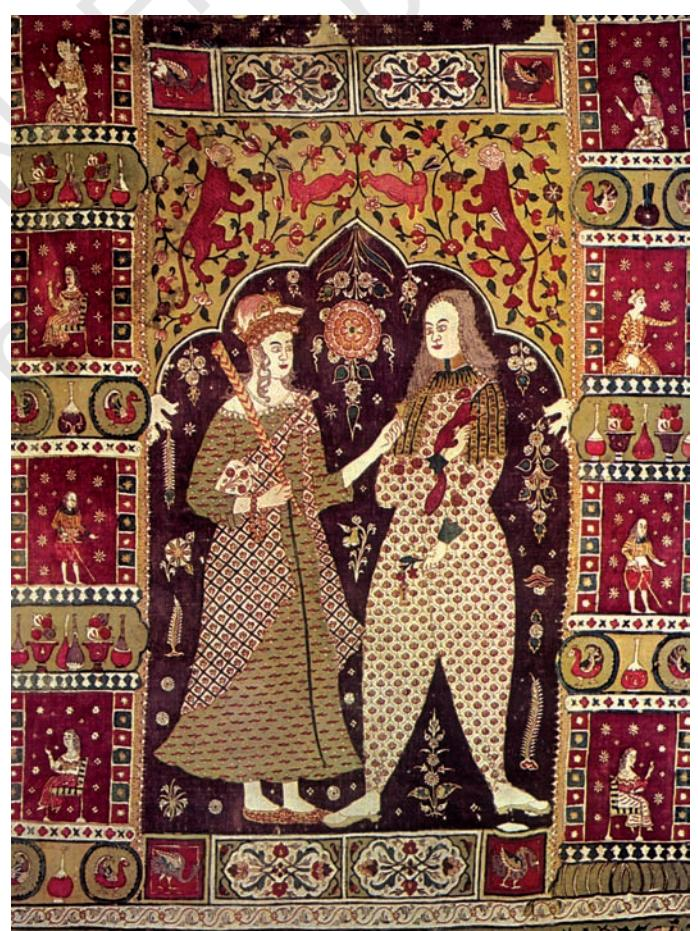

# Peasants, Zamindars and the State

# THEME EIGHT

#### Agrarian Society and t ty and tty and the Mughal Empire (c. sixteenth- seventeenth centuries)

*Fig. 8.1 A rural scene* Detail from a seventeenth-century Mughal painting

During the sixteenth and seventeenth centuries about 85 per cent of the population of India lived in its villages. Both peasants and landed elites were involved in agricultural production and claimed rights to a share of the produce. This created relationships of cooperation, competition and conflict among them. The sum of these *agrarian* relationships made up rural society.

At the same time agencies from outside also entered into the rural world. Most important among these was the Mughal state, which derived the bulk of its income from agricultural production. Agents of the state – revenue assessors, collectors, record keepers – sought to control rural society so as to ensure that cultivation took place and the state got its regular share of taxes from the produce. Since many crops were grown for sale, trade, money and markets entered the villages and linked the agricultural areas with the towns.

# 1. Peasants and Agricultural Production

The basic unit of agricultural society was the village, inhabited by peasants who performed the manifold seasonal tasks that made up agricultural production throughout the year – tilling the soil, sowing seeds, harvesting the crop when it was ripe. Further, they contributed their labour to the production of agro-based goods such as sugar and oil.

But rural India was not characterised by settled peasant production alone. Several kinds of areas such as large tracts of dry land or hilly regions were not cultivable in the same way as the more fertile expanses of land. In addition, forest areas made up a substantial proportion of territory. We need to keep this varied topography in mind when discussing agrarian society.

### 1.1 Looking for sources

Our understanding of the workings of rural society does not come from those who worked the land, as peasants did not write about themselves. Our major source for the agrarian history of the sixteenth and early seventeenth centuries are chronicles and documents from the Mughal court (see also Chapter 9) .

One of the most important chronicles was the *Ain-i Akbari* (in short the *Ain,* see also Section 8) authored by Akbar's court historian Abu'l Fazl. This text meticulously recorded the arrangements made by the state to ensure cultivation, to enable the collection of revenue by the agencies of the state and to regulate the relationship between the state and rural magnates, the zamindars.

The central purpose of the *Ain* was to present a vision of Akbar's empire where social harmony was provided by a strong ruling class. Any revolt or assertion of autonomous power against the Mughal state was, in the eyes of the author of the *Ain*, predestined to fail. In other words, whatever we learn from the *Ain* about peasants remains a view from the top.

Fortunately, however, the account of the *Ain* can be supplemented by descriptions contained in sources emanating from regions away from the Mughal capital. These include detailed revenue records from Gujarat, Maharashtra and Rajasthan dating from the seventeenth and eighteenth centuries. Further , the extensive records of the East India Company (see also Chapter 10) provide us with useful descriptions of agrarian relations in eastern India. All these sources record instances of conflicts between peasants, zamindars and the state. In the process they give us an insight into peasants' perception of and their expectations of fairness from the state. peasants – *khud-kashta* and *pahi-kashta*. The former PEASANTS, ZAMINDARS AND THE STATE

### 1.2 Peasants and their lands

The term which Indo-Persian sources of the Mughal period most frequently used to denote a peasant was *raiyat* (plural, *riaya*) or *muzarian*. In addition, we also encounter the terms *kisan* or *asami.* Sources of the seventeenth century refer to two kinds of *Source 1*

### Peasants on the move

This was a feature of agrarian society which struck a keen observer like Babur, the first Mughal emperor, forcefully enough for him to write about it in the Babur Nama, his memoirs:

> In Hindustan hamlets and villages, towns indeed, are depopulated and set up in a moment! If the people of a large town, one inhabited for years even, flee from it, they do it in such a way that not a sign or trace of them remains in a day and a half. On the other hand, if they fix their eyes on a place to settle, they need not dig water courses because their crops are all rain-grown, and as the population of Hindustan is unlimited it swarms in. They make a tank or a well; they need not build houses or set up walls … khas-grass abounds, wood is unlimited, huts are made, and straightaway there is a village or a town!

Ü Describe the aspects of agricultural life that struck Babur as particular to regions in northern India.

were residents of the village in which they held their lands. The latter were non-resident cultivators who belonged to some other village, but cultivated lands elsewhere on a contractual basis. People became *pahi-kashta* either out of choice – for example, when terms of revenue in a distant village were more favourable – or out of compulsion – for example, forced by economic distress after a famine.

Seldom did the average peasant of north India possess more than a pair of bullocks and two ploughs; most possessed even less. In Gujarat peasants possessing about six acres of land were considered to be affluent; in Bengal, on the other hand, five acres was the upper limit of an average peasant farm; 10 acres would make one a rich *asami.* Cultivation was based on the principle of individual ownership. Peasant lands were bought and sold in the same way as the lands of other property owners.

This nineteenth-century description of peasant holdings in the Delhi-Agra region would apply equally to the seventeenth century:

> The cultivating peasants (*asamis*), who plough up the fields, mark the limits of each field, for identification and demarcation, with borders of (raised) earth, brick and thorn so that *thousands of such fields* may be counted in a village.

### 1.3 Irrigation and technology

The abundance of land, available labour and the mobility of peasants were three factors that accounted for the constant expansion of agriculture. Since the primary purpose of agriculture is to feed people, basic staples such as rice, wheat or millets were the most frequently cultivated crops. Areas which received 40 inches or more of rainfall a year were generally rice-producing zones, followed by wheat and millets, corresponding to a descending scale of precipitation.

Monsoons remained the backbone of Indian agriculture, as they are even today. But there were crops which required additional water. Artificial systems of irrigation had to be devised for this.

#### *Source 2*

## Irrigating trees and fields

This is an excerpt from the Babur Nama that describes the irrigation devices the emperor observed in northern India:

The greater part of Hindustan country is situated on level land. Many though its towns and cultivated lands are, it nowhere has running waters … For … water is not at all a necessity in cultivating crops and orchards. Autumn crops grow by the downpour of the rains themselves; and strange it is that spring crops grow even when no rains fall. (However) to young trees water is made to flow by means of buckets or wheels …

In Lahore, Dipalpur (both in present-day Pakistan) and those other parts, people water by means of a wheel. They make two circles of rope long enough to suit the depths of the well, fix strips of wood between them, and on these fasten pitchers. The ropes with the wood and attached pitchers are put over the wheel-well. At one end of the wheel-axle a second wheel is fixed, and close to it another on an upright axle. The last wheel the bullock turns; its teeth catch in the teeth of the second (wheel), and thus the wheel with the pitchers is turned. A trough is set where the water empties from the pitchers and from this the water is conveyed everywhere.

In Agra, Chandwar, Bayana (all in present-day Uttar Pradesh) and those parts again, people water with a bucket … At the well-edge they set up a fork of wood, having a roller adjusted between the forks, tie a rope to a large bucket, put the rope over a roller, and tie its other end to the bullock. One person must drive the bullock, another empty the bucket.

Ü Compare the irrigation devices observed by Babur with what you have learnt about irrigation in Vijayanagara (Chapter 7). What kind of resources would each of these systems require? Which systems could ensure the participation of peasants in improving agricultural technology?

*Fig. 8.2 A reconstructed Persian wheel, described here*

# The spread of tobacco

This plant, which arrived first in the Deccan, spread to northern India in the early years of the seventeenth century. The Ain does not mention tobacco in the lists of crops in northern India. Akbar and his nobles came across tobacco for the first time in 1604. At this time smoking tobacco (in hookahs or chillums) seems to have caught on in a big way. Jahangir was so concerned about its addiction that he banned it. This was totally ineffective because by the end of the seventeenth century, tobacco had become a major article of consumption, cultivation and trade all over India.

# Agricultural prosperity and population growth

One important outcome of such varied and flexible forms of agricultural production was a slow demographic growth. Despite periodic disruptions caused by famines and epidemics, India's population increased, according to calculations by economic historians, by about 50 million people between 1600 and 1800, which is an increase of about 33 per cent over 200 years.

Irrigation projects received state support as well. For example, in northern India the state undertook digging of new canals (*nahr*, *nala*) and also repaired old ones like the *shahnahr* in the Punjab during Shah Jahan's reign.

Though agriculture was labour intensive, peasants did use technologies that often harnessed cattle energy. One example was the wooden plough, which was light and easily assembled with an iron tip or coulter. It therefore did not make deep furrows, which preserved the moisture better during the intensely hot months. A drill, pulled by a pair of giant oxen, was used to plant seeds, but broadcasting of seed was the most prevalent method. Hoeing and weeding were done simultaneously using a narrow iron blade with a small wooden handle.

# 1.4 An abundance of crops

Agriculture was organised around two major seasonal cycles, the *kharif* (autumn) and the *rabi* (spring). This would mean that most regions, except those terrains that were the most arid or inhospitable, produced a minimum of two crops a year (*do-fasla*), whereas some, where rainfall or irrigation assured a continuous supply of water, even gave three crops. This ensured an enormous variety of produce. For instance, we are told in the *Ain* that the Mughal provinces of Agra produced 39 varieties of crops and Delhi produced 43 over the two seasons. Bengal produced 50 varieties of rice alone.

However, the focus on the cultivation of basic staples did not mean that agriculture in medieval India was only for subsistence. We often come across the term *jins-i kamil* (literally, perfect crops) in our sources. The Mughal state also encouraged peasants to cultivate such crops as they brought in more revenue. Crops such as cotton and sugarcane were *jins-i kamil* par excellence. Cotton was grown over a great swathe of territory spread over central India and the Deccan plateau, whereas Bengal was famous for its sugar. Such cash crops would also include various sorts of oilseeds (for example, mustard) and lentils. This shows how subsistence and commercial production were closely intertwined in an average peasant's holding.

During the seventeenth century several new crops from different parts of the world reached the Indian

subcontinent. Maize (*makka*), for example, was introduced into India via Africa and Spain and by the seventeenth century it was being listed as one of the major crops of western India. Vegetables like tomatoes, potatoes and chillies were introduced from the New World at this time, as were fruits like the pineapple and the papaya.

# 2. The Village Community

The above account makes it clear that agricultural production involved the intensive participation and initiative of the peasantry. How did this affect the structure of agrarian relations in Mughal society? To find out, let us look at the social groups involved in agricultural expansion, and at their relationships and conflicts.

We have seen that peasants held their lands in individual ownership. At the same time they belonged to a collective village community as far as many aspects of their social existence were concerned. There were three constituents of this community – the cultivators, the panchayat, and the village headman (*muqaddam* or *mandal).*

### 2.1 Caste and the rural milieu

Deep inequities on the basis of caste and other castelike distinctions meant that the cultivators were a highly heterogeneous group. Among those who tilled the land, there was a sizeable number who worked

as menials or agricultural labourers (*majur*).

Despite the abundance of cultivable land, certain caste groups were assigned menial tasks and thus relegated to poverty. Though there was no census at that time, the little data that we have suggest that such groups comprised a large section of the village population, had the least resources and were constrained by their position in the caste hierarchy, much like the Dalits of modern India. Such distinctions had begun permeating into other Ü Discuss...

Identify the technologies and agricultural practices described in this section that appear similar to or different from those described in Chapter 2.

*Fig. 8.3 An early nineteenth-century painting depicting a village in the Punjab*

> Ü Describe what women and men are shown doing in the illustration as well as the architecture of the village.

communities too. In Muslim communities menials like the *halalkhoran* (scavengers) were housed outside the boundaries of the village; similarly the *mallahzadas* (literally, sons of boatmen) in Bihar were comparable to slaves.

There was a direct correlation between caste, poverty and social status at the lower strata of society. Such correlations were not so marked at intermediate levels. In a manual from seventeenthcentury Marwar, Rajputs are mentioned as peasants, sharing the same space with Jats, who were accorded a lower status in the caste hierarchy. The Gauravas, who cultivated land around Vrindavan (Uttar Pradesh), sought Rajput status in the seventeenth century. Castes such as the Ahirs, Gujars and Malis rose in the hierarchy because of the profitability of cattle rearing and horticulture. In the eastern regions, intermediate pastoral and fishing castes like the Sadgops and Kaivartas acquired the status of peasants.

### 2.2 Panchayats and headmen

The village panchayat was an assembly of elders, usually important people of the village with hereditary rights over their property. In mixed-caste villages, the panchayat was usually a heterogeneous body. An oligarchy, the panchayat represented various castes and communities in the village, though the village menial-cum-agricultural worker was unlikely to be represented there. The decisions made by these panchayats were binding on the members.

The panchayat was headed by a headman known as *muqaddam* or *mandal.* Some sources suggest that the headman was chosen through the consensus of the village elders, and that this choice had to be ratified by the zamindar*.* Headmen held office as long as they enjoyed the confidence of the village elders, failing which they could be dismissed by them. The chief function of the headman was to supervise the preparation of village accounts, assisted by the accountant or *patwari* of the panchayat.

The panchayat derived its funds from contributions made by individuals to a common financial pool. These funds were used for defraying the costs of entertaining revenue officials who visited the village from time to time. Expenses for community welfare activities such as tiding over

# Corrupt mandals

The mandals often misused their positions. They were principally accused of defrauding village accounts in connivance with the patwari, and for underassessing the revenue they owed from their own lands in order to pass the additional burden on to the smaller cultivator.

natural calamities (like floods), were also met from these funds. Often these funds were also deployed in construction of a bund or digging a canal which peasants usually could not afford to do on their own.

One important function of the *panchayat* was to ensure that caste boundaries among the various communities inhabiting the village were upheld. In eastern India all marriages were held in the

presence of the *mandal*. In other words one of the duties of the village headman was to oversee the conduct of the members of the village community "chiefly to prevent any offence against their caste".

Panchayats also had the authority to levy fines and inflict more serious forms of punishment like expulsion from the community. The latter was a drastic step and was in most cases meted out for a limited period. It meant that a person forced to leave the village became an outcaste and lost his right to practise his profession. Such a measure was intended as a deterrent to violation of caste norms.

In addition to the village panchayat each caste or jati in the village had its own jati panchayat. These panchayats wielded considerable power in rural society. In Rajasthan jati panchayats arbitrated civil disputes between members of different castes. They mediated in contested claims on land, decided whether marriages were performed according to the norms laid down by a particular caste group, determined who had ritual precedence in village functions, and so on. In most cases, except in matters of criminal justice, the state respected the decisions of jati panchayats.

Archival records from western India – notably Rajasthan and Maharashtra – contain petitions presented to the panchayat complaining about extortionate taxation or the demand for unpaid labour (*begar*) imposed by the "superior" castes or officials of the state. These petitions were usually made by villagers, from the lowest rungs of rural society. Often petitions were made collectively as

*Fig. 8.4 An early nineteenth-century painting depicting a meeting of village elders and tax collectors*

Ü How has the artist differentiated between the village elders and the tax collectors?

*Fig. 8.5 A seventeenth-century painting depicting textile production*

Ü Describe the activities that are shown in the illustration.

well, by a caste group or a community protesting against what they considered were morally illegitimate demands on the part of elite groups. These included excessive tax demands which, especially in times of drought or other disasters, endangered the peasants' subsistence. In the eyes of the petitioners the right to the basic minimum for survival was sanctioned by custom. They regarded the village panchayat as the court of appeal that would ensure that the state carried out its moral obligations and guaranteed justice.

> The decision of the panchayat in conflicts between "lower -caste" peasants and state officials or the local zamindar could vary from case to case. In cases of excessive revenue demands, the panchayat often suggested compromise. In cases where reconciliation failed, peasants took recourse to more drastic forms of resistance, such as deserting the village. The relatively easy availability of uncultivated land and the competition over labour resources made this an effective weapon in the hands of cultivators.

### 2.3 Village artisans

Another interesting aspect of the village was the elaborate relationship of exchange between different producers. Marathi documents and village surveys made in the early years of British rule have revealed the existence of substantial numbers of artisans, sometimes as high as 25 per cent of the total households in the villages.

At times, however, the distinction between artisans and peasants in village society was a fluid one, as many groups performed the tasks of both. Cultivators and their families would also participate in craft production – such as dyeing, textile printing, baking and firing of pottery, making and repairing

agricultural implements. Phases in the agricultural calendar when there was a relative lull in activity, as between sowing and weeding or between weeding and harvesting, were a time when cultivators could engage in artisanal production.

Village artisans – potters, blacksmiths, carpenters, barbers, even goldsmiths – provided specialised services in return for which they were compensated by villagers by a variety of means. The most common way of doing so was by giving them a share of the harvest, or an allotment of land, perhaps cultivable wastes, which was likely to be decided by the panchayat *.* In Maharashtra such lands became the artisans' *miras* or *watan –* their hereditary holding.

Another variant of this was a system where artisans and individual peasant households entered into a mutually negotiated system of remuneration, most of the time goods for services. For example, eighteenth-century records tell us of zamindars in Bengal who remunerated blacksmiths, carpenters, even goldsmiths for their work by paying them "a small daily allowance and diet money". This later came to be described as the *jajmani* system, though the term was not in vogue in the sixteenth and seventeenth centuries. Such evidence is interesting because it indicates the intricate ways in which exchange networks operated at the micro -level of the village. Cash remuneration was not entirely unknown either . export market (for example, weavers) received their PEASANTS, ZAMINDARS AND THE STATE

### 2.4 A "little republic"?

How does one understand the significance of the village community? Some British officials in the nineteenth century saw the village as a "little republic" made up of fraternal partners sharing resources and labour in a collective. However, this was not a sign of rural egalitarianism. There was individual ownership of assets and deep inequities based on caste and gender distinctions. A group of powerful individuals decided the affairs of the village, exploited the weaker sections and had the authority to dispense justice.

More importantly, a cash nexus had already developed through trade between villages and towns. In the Mughal heartland too, revenue was assessed and collected in cash. Artisans producing for the

# Money in the village

The seventeenth-century French traveller Jean-Baptiste Tavernier found it remarkable that in "India a village must be very small indeed if it has not a moneychanger called a Shroff. (They) act as bankers to make remittances of money (and who) enhance the rupee as they please for paisa and the paisa for these (cowrie) shells".

*Fig. 8.6 A shroff at work*

*Fig. 8.7 A woman spinning thread*

advances or wages in cash, as did producers of commercial products like cotton, silk or indigo.

# Ü Discuss...

In what ways do you think the panchayats described in this section were similar to or different from present-day gram panchayats*?*

# 3. Women in Agrarian Society

As you may have observed in many different societies, the production process often involves men and women performing certain specified roles. In the contexts that we are exploring, women and men had to work shoulder to shoulder in the fields. Men tilled and ploughed, while women sowed, weeded, threshed and winnowed the harvest. With the growth of nucleated villages and expansion in individuated peasant farming, which characterised medieval Indian agriculture, the basis of production was the labour and resources of the entire household. Naturally, a gendered segregation between the home (for women) and the world (for men) was not possible in this context. Nonetheless biases related to women's biological functions did continue. Menstruating women, for instance, were not allowed to touch the plough or the potter's wheel in western India, or enter the groves where betel-leaves (*paan*) were grown in Bengal.

Artisanal tasks such as spinning yarn, sifting and kneading clay for pottery, and embroidery were among the many aspects of production dependent on female labour. The more commercialised the product, the greater the demand on women's labour to produce it. In fact, peasant and artisan women worked not only in the fields, but even went to the houses of their employers or to the markets if necessary.

Women were considered an important resource in agrarian society also because they were child bearers in a society dependent on labour. At the same time, high mortality rates among women – owing to malnutrition, frequent pregnancies, death during childbirth – often meant a shortage of wives. This led to the emergence of social customs in peasant and artisan communities that were distinct from

those prevalent among elite groups. Marriages in many rural communities required the payment of bride-price rather than dowry to the bride's family. Remarriage was considered legitimate both among divorced and widowed women.

The importance attached to women as a reproductive force also meant that the fear of losing control over them was great. According to established social norms, the household was headed by a male. Thus women were kept under strict control by the male members of the family and the community. They could inflict draconian punishments if they suspected infidelity on the part of women.

Documents from Western India – Rajasthan, Gujarat and Maharashtra – record petitions sent by women to the village panchayat, seeking redress and justice. Wives protested against the infidelity of their husbands or the neglect of the wife and children by the male head of the household, the *grihasthi*. While male infidelity was not always punished, the state and "superior" caste groups did intervene when it came to ensuring that the family was adequately provided for. In most cases when women petitioned to the panchayat, their names were excluded from the record: the petitioner was referred to as the mother, sister or wife of the male head of the household.

Amongst the landed gentry, women had the right to inherit property. Instances from the Punjab show that women, including widows, actively participated in the rural land market as sellers of property inherited by them. Hindu and Muslim women inherited zamindaris which they were free to sell or mortgage. Women zamindars were known in eighteenth-century Bengal. In fact, one of the biggest and most famous of the eighteenth-century zamindaris, that of Rajshahi, had a woman at the helm.

Are there any differences in the access men and women have to agricultural land in your state?

*Fig. 8.8 a The construction of Fatehpur Sikri – women crushing stones*

*Fig. 8.8 b Women carrying loads* Migrant women from neighbouring villages often worked at such construction sites.

### 4.1 Beyond settled villages

There was more to rural India than sedentary agriculture. Apart from the intensively cultivated provinces in northern and north-western India, huge swathes of forests – dense forest (*jangal*) or scrubland (*kharbandi*) – existed all over eastern India, central India, northern India (including the Terai on the Indo-Nepal border), Jharkhand, and in peninsular India down the Western Ghats and the Deccan plateau. Though it is nearly impossible to set an all-India average of the forest cover for this period, informed conjectures based on contemporary sources suggest an average of 40 per cent.

Forest dwellers were termed *jangli* in contemporary texts. Being *jangli,* however, did

> not mean an absence of "civilisation", as popular usage of the term today seems to connote. Rather, the term described those whose livelihood came from the gathering of forest produce, hunting and shifting agriculture. These activities were largely season specific. Among the Bhils, for example, spring was reserved for collecting forest produce, summer for fishing, the monsoon months for cultivation, and autumn and winter for hunting. Such a sequence presumed and perpetuated mobility, which was a distinctive feature of tribes inhabiting these forests.

> For the state, the forest was a subversive place – a place of refuge (*mawas*) for troublemakers. Once again, we turn to Babur who says that jungles provided a good defence "behind which the people of the pargana become stubbornly rebellious and pay no taxes".

### 4.2 Inroads into forests

External forces entered the forest in different ways. For instance, the state required elephants for the army. So the *peshkash* levied from forest people often included a supply of elephants.

Ü Describe what you see in this painting. What is the symbolic element that helps establish the connection between the hunt and ideal justice?

In the Mughal political ideology, the hunt symbolised the overwhelming concern of the state to relate to all its subjects, rich and poor. Regular hunting expeditions, so court historians tell us, enabled the emperor to travel across the extensive territories of his empire and personally attend to the grievances of its inhabitants. The hunt was a subject frequently painted by court artists. The painter resorted to the device of inserting a small scene somewhere in the picture that functioned as a symbol of a harmonious reign.

*Pargana* was an administrative subdivision of a Mughal province.

*Peshkash* was a form of tribute collected by the Mughal state.

#### *Source 3*

# Clearance of forests for agricultural settlements

This is an excerpt from a sixteenth-century Bengali poem, Chandimangala, composed by Mukundaram Chakrabarti. The hero of the poem, Kalaketu, set up a kingdom by clearing forests:

Hearing the news, outsiders came from various lands.

Kalaketu then bought and distributed among them

Heavy knives, axes, battle-axes and pikes.

From the north came the Das (people)

One hundred of them advanced.

They were struck with wonder on seeing Kalaketu

Who distributed betel-nut to each of them.

From the south came the harvesters

Five hundred of them under one organiser.

From the west came Zafar Mian,

Together with twenty-two thousand men.

Sulaimani beads in their hands

They chanted the names of their pir and paighambar (Prophet).

Having cleared the forest

They established markets.

Hundreds and hundreds of foreigners

Ate and entered the forest.

Hearing the sound of the axe,

Tigers became apprehensive and ran away, roaring.

Ü What forms of intrusion into the forest does the text evoke? Compare its message with that of the miniature painting in Fig. 8.9. Who are the people identified as "foreigners" from the perspective of the forest dwellers? *Source 4*

# Trade between the hill tribes and the plains, c. 1595

This is how Abu'l Fazl describes the transactions between the hill tribes and the plains in the suba of Awadh (part of present-day Uttar Pradesh):

From the northern mountains quantities of goods are carried on the backs of men, of stout ponies and of goats, such as gold, copper, lead, musk, tails of the kutas cow (the yak), honey, chuk (an acid composed of orange juice and lemon boiled together), pomegranate seed, ginger, long pepper, majith (a plant producing a red dye) root, borax, zedoary (a root resembling turmeric), wax, woollen stuffs, wooden ware, hawks, falcons, black falcons, merlins (a kind of bird), and other articles. In exchange they carry back white and coloured cloths, amber, salt, asafoetida, ornaments, glass and earthen ware.

Ü What are the modes of transport described in this passage? Why do you think they were used? Explain what each of the articles brought from the plains to the hills may have been used for.

*Fig. 8.10 A peasant and a hunter listening to a sufi singer*

The spread of commercial agriculture was an important external factor that impinged on the lives of those who lived in the forests. Forest products – like honey, beeswax and gum lac – were in great demand. Some, such as gum lac, became major items of overseas export from India in the seventeenth century. Elephants were also captured and sold. Trade involved an exchange of commodities through barter as well. Some tribes, like the Lohanis in the Punjab, were engaged in overland trade, between India and Afghanistan, and in the town-country trade in the Punjab itself.

Social factors too wrought changes in the lives of forest dwellers. Like the "big men" of the village community, tribes also had their chieftains. Many tribal chiefs had become zamindars, some even became kings. For this they required to build up an army. They recruited people from their lineage groups or demanded that their fraternity provide military service. Tribes in the Sind region had armies comprising 6,000 cavalry and 7,000 infantry. In Assam, the Ahom kings had their *paiks*, people who were obliged to render military service in exchange for land. The capture of wild elephants was declared a royal monopoly by the Ahom kings.

Though the transition from a tribal to a monarchical system had started much earlier, the process seems to have become fully developed only by the sixteenth century. This can be seen from the *Ain's* observations on the existence of tribal kingdoms in the north-east. War was a common occurrence. For instance, the Koch kings fought and subjugated a number of neighbouring tribes in a long sequence of wars through the sixteenth and seventeenth centuries.

New cultural influences also began to penetrate into forested zones. Some historians have indeed suggested that sufi saints (*pirs*) played a major role in the slow acceptance of Islam among agricultural communities emerging in newly colonised places (see also Chapter 6).

# 5. The Zamindars

Our story of agrarian relations in Mughal India will not be complete without referring to a class of people in the countryside that lived off agriculture but did not participate directly in the processes of agricultural production. These were the zamindars who were landed proprietors who also enjoyed certain social and economic privileges by virtue of their superior status in rural society. Caste was one factor that accounted for the elevated status of zamindars; another factor was that they performed certain services (*khidmat*) for the state.

The zamindars held extensive personal lands termed *milkiyat,* meaning property. *Milkiyat* lands were cultivated for the private use of zamindars, often with the help of hired or servile labour. The zamindars could sell, bequeath or mortgage these lands at will.

Zamindars also derived their power from the fact that they could often collect revenue on behalf of the state, a service for which they were compensated financially. Control over military resources was another source of power. Most zamindars had fortresses (*qilachas*) as well as an armed contingent comprising units of cavalry, artillery and infantry.

Thus if we visualise social relations in the Mughal countryside as a pyramid, zamindars clearly constituted its very narrow apex. Abu'l Fazl's account indicates that an "upper-caste", Brahmana-Rajput

# Ü Discuss...

Find out which areas are currently identified as forest zones in your state. Is life in these areas changing today? Are the factors responsible for these changes different from or identical to those mentioned in this section?

combine had already established firm control over rural society. It also reflects a fairly large representation from the so-called intermediate castes, as we saw earlier, as well as a liberal sprinkling of Muslim zamindaris.

Contemporary documents give an impression that conquest may have been the source of the origin of some zamindaris*.* The dispossession of weaker people by a powerful military chieftain was quite often a way of expanding a zamindari. It is, however, unlikely that the state would have allowed such a show of aggression by a zamindar unless he had been confirmed by an imperial order (*sanad*).

More important were the slow processes of zamindari consolidation, which are also documented in sources. These involved colonisation of new lands, by transfer of rights, by order of the state and by purchase. These were the processes which perhaps permitted people belonging to the relatively "lower" castes to enter the rank of zamindars as zamindaris were bought and sold quite briskly in this period.

A combination of factors also allowed the consolidation of clan- or lineage-based zamindaris. For example, the Rajputs and Jats adopted these strategies to consolidate their control over vast swathes of territory in northern India. Likewise, peasant-pastoralists (like the Sadgops) carved out powerful zamindaris in areas of central and southwestern Bengal.

Zamindars spearheaded the colonisation of agricultural land, and helped in settling cultivators by providing them with the means of cultivation, including cash loans. The buying and selling of zamindaris accelerated the process of monetisation in the countryside. In addition, zamindars sold the produce from their *milkiyat* lands. There is evidence to show that zamindars often established markets (*haats*) to which peasants also came to sell their produce.

Although there can be little doubt that zamindars were an exploitative class, their relationship with the peasantry had an element of reciprocity, paternalism and patronage. Two aspects reinforce this view. First, the bhakti saints, who eloquently condemned caste-based and other forms of oppression (see also Chapter 6), did not portray the zamindars (or, interestingly, the moneylender) as exploiters or oppressors of the peasantry. Usually it was the

# A parallel army!

According to the Ain, the combined military strength of the zamindars in Mughal India was 384,558 cavalry, 4,277,057 infantry, 1,863 elephants, 4,260 cannons, and 4,500 boats.

revenue official of the state who was the object of their ire. Second, in a large number of agrarian uprisings which erupted in north India in the seventeenth century, zamindars often received the support of the peasantry in their struggle against the state.

# 6. Land Revenue System

Revenue from the land was the economic mainstay of the Mughal Empire. It was therefore vital for the state to create an administrative apparatus to ensure control over agricultural production, and to fix and collect revenue from across the length and breadth of the rapidly expanding empire. This apparatus included the office (*daftar*) of the *diwan* who was responsible for supervising the fiscal system of the empire. Thus revenue officials and record keepers penetrated the agricultural domain and became a decisive agent in shaping agrarian relations.

The Mughal state tried to first acquire specific information about the extent of the agricultural lands in the empire and what these lands produced before fixing the burden of taxes on people. The land revenue arrangements consisted of two stages – first, assessment and then actual collection. The *jama* was the amount assessed, as opposed to *hasil*, the amount collected. In his list of duties of the *amil-guzar* or revenue collector, Akbar decreed that while he should strive to make cultivators pay in cash, the option of payment in kind was also to be kept open. While fixing revenue, the attempt of the state was to maximise its claims. The scope of actually realising these claims was, however, sometimes thwarted by local conditions.

Both cultivated and cultivable lands were measured in each province. The *Ain* compiled the aggregates of such lands during Akbar's rule. Efforts to measure lands continued under subsequent emperors. For instance, in 1665, Aurangzeb expressly instructed his revenue officials to prepare annual records of the number of cultivators in each village (Source 7). Yet not all areas were measured successfully. As we have seen, forests covered huge areas of the subcontinent and thus remained unmeasured.

# Ü Discuss...

The zamindari system was abolished in India after Independence. Read through this section and identify reasons why this was done.

*Amin* was an official responsible for ensuring that imperial regulations were carried out in the provinces.

Ü What principles did the Mughal state follow while classifying lands in its territories? How was revenue assessed?

### *Map 1*

*The expansion of the Mughal Empire*

Ü What impact do you think the expansion of the empire would have had on land revenue collection?

# The mansabdari system

The Mughal administrative system had at its apex a militarycum-bureaucratic apparatus (mansabdari) which was responsible for looking after the civil and military affairs of the state. Some mansabdars were paid in cash (naqdi), while the majority of them were paid through assignments of revenue (jagirs) in different regions of the empire. They were transferred periodically. See also Chapter 9.

### *Source 5*

## Classification of lands under Akbar

The following is a listing of criteria of classification excerpted from the Ain:

> The Emperor Akbar in his profound sagacity classified the lands and fixed a different revenue to be paid by each. Polaj is land which is annually cultivated for each crop in succession and is never allowed to lie fallow. Parauti is land left out of cultivation for a time that it may recover its strength. Chachar is land that has lain fallow for three or four years. Banjar is land uncultivated for five years and more. Of the first two kinds of land, there are three classes, good, middling, and bad. They add together the produce of each sort, and the third of this represents the medium produce, one-third part of which is exacted as the Royal dues.

#### *Source 6*

### Cash or kind?

The Ainon land revenue collection:

> Let him (the amil-guzar) not make it a practice of taking only in cash but also in kind. The latter is effected in several ways. First, kankut : in the Hindi language kan signifies grain, and kut, estimates … If any doubts arise, the crops should be cut and estimated in three lots, the good, the middling, and the inferior, and the hesitation removed. Often, too, the land taken by appraisement, gives a sufficiently accurate return. Secondly, batai, also called bhaoli, the crops are reaped and stacked and divided by agreement in the presence of the parties. But in this case several intelligent inspectors are required; otherwise, the evil-minded and false are given to deception. Thirdly, khet-batai, when they divide the fields after they are sown. Fourthly, lang batai , after cutting the grain, they form it in heaps and divide it among themselves, and each takes his share home and turns it to profit.

Ü What difference would each of the systems of assessment and collection of revenue have made to the cultivator?

# Ü Discuss...

Would you consider the land revenue system of the Mughals as a flexible one?

# 7. The Flow of Silver

The Mughal Empire was among the large territorial empires in Asia that had managed to consolidate power and resources during the sixteenth and seventeenth centuries. These empires were the Ming (China), Safavid (Iran) and Ottoman (Turkey). The political stability achieved by all these empires helped create vibrant networks of overland trade from China to the Mediterranean Sea. Voyages of discovery and the opening up of the New World resulted in a massive expansion of Asia's (particularly India's) trade with Europe. This resulted in a greater geographical diversity of India's overseas trade as well as an *Source 7*

### The jama

This is an excerpt from Aurangzeb's order to his revenue official, 1665:

He should direct the amins of the parganas that they should discover the actual conditions of cultivation (maujudat), village by village, peasant-wise (asamiwar), and after minute scrutiny, assess the jama, keeping in view the financial interests (kifayat) of the government, and the welfare of the peasantry.

Ü Why do you think the emperor insisted on a detailed survey?

<i>Fig. 8.11 *A silver* rupya *issued by Akbar (obverse and reverse)*

*Fig. 8.12 A silver* rupya *issued by Aurangzeb*

*Fig. 8.13 An example of textiles produced in the subcontinent to meet the demands of European markets*

# Ü Discuss...

Find out whether there are any taxes on agricultural production at present in your state. Explain the similarities and differences between Mughal fiscal policies and those adopted by present-day state governments.

expansion in the commodity composition of this trade. An expanding trade brought in huge amounts of silver bullion into Asia to pay for goods procured from India, and a large part of that bullion gravitated towards India. This was good for India as it did not have natural resources of silver. As a result, the period between the sixteenth and eighteenth centuries was also marked by a remarkable stability in the availability of metal currency, particularly the silver *rupya* in India. This facilitated an unprecedented expansion of minting of coins and the circulation of money in the economy as well as the ability of the Mughal state to extract taxes and revenue in cash.

The testimony of an Italian traveller, Giovanni Careri, who passed through India *c.* 1690, provides a graphic account about the way silver travelled across the globe to reach India. It also gives us an idea of the phenomenal amounts of cash and commodity transactions in seventeenth-century India.

#### *Source 8*

### How silver came to India

This excerpt from Giovanni Careri's account (based on Bernier's account) gives an idea of the enormous amount of wealth that found its way into the Mughal Empire:

That the Reader may form some idea of the Wealth of this (Mughal) Empire, he is to observe that all the Gold and Silver, which circulates throughout the World at last Centres here. It is well known that as much of it comes out of America, after running through several Kingdoms of Europe, goes partly into Turky (Turkey), for several sorts of Commodities; and part into Persia, by the way of Smirna for Silk. Now the Turks not being able to abstain from Coffee, which comes from Hyeman (Oman), and Arabia … nor Persia, Arabia, and the Turks themselves to go without the commodities of India, send vast quantities of Mony (money) to Moka (Mocha) on the Red Sea, near Babel Mandel; to Bassora (Basra) at the bottom of the Persian Gulgh (Gulf); … which is afterwards sent over in Ships to Indostan (Hindustan). Besides the Indian, Dutch, English, and Portuguese Ships, that every Year carry the Commodities of Indostan, to Pegu, Tanasserri (parts of Myanmar), Siam (Thailand), Ceylon (Sri Lanka) … the Maldive Islands, Mozambique and other Places, must of necessity convey much Gold and Silver thither, from those Countries. All that the Dutch fetch from the Mines in Japan, sooner or later, goes to Indostan; and the goods carry'd hence into Europe, whether to France, England, or Portugal, are all purchas'd for ready Mony, which remains there.

#### 8. The Ain-i Akbari of Abu'l Fazl Allami

The *Ain-i Akbari* was the culmination of a large historical, administrative project of classification undertaken by Abu'l Fazl at the order of Emperor Akbar. It was completed in 1598, the forty-second regnal year of the emperor, after having gone through five revisions. The *Ain* was part of a larger project of history writing commissioned by Akbar. This history, known as the *Akbar Nama,* comprised three books. The first two provided a historical narrative. We will look at these parts more closely in Chapter 9. The *Ain-i Akbari*, the third book, was organised as a compendium of imperial regulations and a gazetteer of the empire.

The *Ain* gives detailed accounts of the organisation of the court, administration and army, the sources of revenue and the physical layout of the provinces of Akbar's empire and the literary, cultural and religious traditions of the people. Along with a description of the various departments of Akbar's government and elaborate descriptions of the

*Fig. 8.14 Abu'l Fazl presenting the manuscript of the completed* Akbar Nama *to his patron*

various provinces (*subas*) of the empire, the *Ain* gives us intricate quantitative information of those provinces.

Collecting and compiling this information systematically was an important imperial exercise. It informed the emperor about the varied and diverse customs and practices prevailing across his extensive territories. The *Ain* is therefore a mine of information for us about the Mughal Empire during Akbar's reign. It is important, however, to keep in mind that this is a view of the regions from the centre, a view of society from its apex.

The *Ain* is made up of five books (*daftars*), of which the first three books describe the administration. The first book, called *manzil-abadi*, concerns the imperial household and its maintenance. The second book, *sipah-abadi*, covers the military and civil administration and the establishment of servants. This book includes notices and short biographical sketches of imperial officials (*mansabdars*), learned men, poets and artists.

The third book, *mulk-abadi*, is the one which deals with the fiscal side of the empire and provides rich quantitative information on revenue rates, followed by the "Account of the Twelve Provinces". This section has detailed statistical information, which includes the geographic, topographic and economic profile of all *subas and* their administrative and fiscal divisions (*sarkars*, *parganas* and *mahals*), total measured area, and assessed revenue ( *jama* ).

After setting out details at the *suba* level, the *Ain* goes on to give a detailed picture of the *sarkars* below the *suba*. This it does in the form of tables, which have eight columns giving the following information: (1) *parganat*/*mahal*; (2) *qila* (forts); (3) *arazi* and *zamin-i paimuda* (measured area); (4) *naqdi,* revenue assessed in cash; (5) *suyurghal*, grants of revenue in charity; (6) zamindars*;* columns 7 and 8 contain details of the castes of these zamindars*,* and their troops including their horsemen (*sawar*), foot-soldiers (*piyada*) and elephants (*fil* ). The *mulk-abadi* gives a fascinating, detailed and highly complex view of agrarian society in northern India. The fourth and fifth books (*daftars*) deal with the religious, literary and cultural traditions of the people of India and also contain a collection of Akbar's "auspicious sayings".

#### *Source 9*

### "Moistening the rose garden of fortune"

In this extract Abu'l Fazl gives a vivid account of how and from whom he collected his information:

... to Abu'l Fazl, son of Mubarak … this sublime mandate was given. "Write with the pen of sincerity the account of the glorious events and of our dominion-conquering victories … Assuredly, I spent much labour and research in collecting the records and narratives of His Majesty's actions and I was a long time interrogating the servants of the State and the old members of the illustrious family. I examined both prudent, truth-speaking old men and active-minded, rightactioned young ones and reduced their statements to writing. The Royal commands were issued to the provinces, that those who from old service remembered, with certainty or with adminicle of doubt, the events of the past, should copy out the notes and memoranda and transit them to the court. (Then) a second command shone forth from the holy Presence-chamber; to wit – that the materials which had been collected should be ... recited in the royal hearing, and whatever might have to be written down afterwards, should be introduced into the noble volume as a supplement, and that such details as on account of the minuteness of the inquiries and the minutae of affairs, (which) could not then be brought to an end, should be inserted afterwards at my leisure.

Being relieved by this royal order – the interpreter of the Divine ordinance – from the secret anxiety of my heart, I proceeded to reduce into writing the rough draughts (drafts)which were void of the grace of arrangement and style. I obtained the chronicle of events beginning at the Nineteenth Year of the Divine Era, when the Record Office was established by the enlightened intellect of His Majesty, and from its rich pages, I gathered the accounts of many events. Great pains too, were taken to procure the originals or copies of most of the orders which had been issued to the provinces from the Accession up to the present-day … I also took much trouble to incorporate many of the reports which ministers and high officials had submitted, about the affairs of the empire and the events of foreign countries. And my labour-loving soul was satiated by the apparatus of inquiry and research. I also exerted myself energetically to collect the rough notes and memoranda of sagacious and well-informed men. By these means, I constructed a reservoir for irrigating and moistening the rose garden of fortune (the Akbar Nama).

Ü List all the sources that Abu'l Fazl used to compile his work. Which of these sources would have been most useful for arriving at an understanding of agrarian relations? To what extent do you think his work would have been influenced by his relationship with Akbar?

# Translating the Ain

Given the importance of the Ain, it has been translated for use by a number of scholars. Henry Blochmann edited it and the Asiatic Society of Bengal, Calcutta (present-day Kolkata), published it in its Bibliotheca Indica series. The book has also been translated into English in three volumes. The standard translation of Volume 1 is that of Henry Blochmann (Calcutta 1873). The other two volumes were translated by H.S. Jarrett (Calcutta 1891 and 1894).

Although the *Ain was* officially sponsored to record detailed information to facilitate Emperor Akbar govern his empire, it was much more than a reproduction of official papers. That the manuscript was revised five times by the author would suggest a high degree of caution on the part of Abu'l Fazl and a search for authenticity. For instance, oral testimonies were cross-checked and verified before being incorporated as "facts" in the chronicle. In the quantitative sections, all numeric data were reproduced in words so as to minimise the chances of subsequent transcriptional errors.

Historians who have carefully studied the *Ain* point out that it is not without its problems. Numerous errors in totalling have been detected. These are ascribed to simple slips of arithmetic or of transcription by Abu'l Fazl's assistants. These are generally minor and do not detract from the overall quantitative veracity of the manuals.

Another limitation of the *Ain* is the somewhat skewed nature of the quantitative data. Data were not collected uniformly from all provinces. For instance, while for many *subas* detailed information was compiled about the caste composition of the zamindars, such information is not available for Bengal and Orissa. Further, while the fiscal data from the *subas* is remarkable for its richness, some equally vital parameters such as prices and wages from these same areas are not as well documented. The detailed list of prices and wages that the *Ain* does provide is mainly derived from data pertaining to areas in or around the imperial capital of Agra, and is therefore of limited relevance for the rest of the country.

These limitations notwithstanding, the *Ain* remains an extraordinary document of its times. By providing fascinating glimpses into the structure and organisation of the Mughal Empire and by giving us quantitative information about its products and people, Abu'l Fazl achieved a major breakthrough in the tradition of medieval chroniclers who wrote mostly about remarkable political events – wars, conquests, political machinations, and dynastic turmoil. Information about the country, its people

and its products was mentioned only incidentally and as embellishments to the essentially political thrust of the narrative.

The *Ain* completely departed from this tradition as it recorded information about the *empire* and the *people* of India, and thus constitutes a benchmark for studying India at the turn of the seventeenth century. The value of the *Ain's* quantitative evidence is uncontested where the study of agrarian relations is concerned. But it is the information it contains on people, their professions and trades and on the imperial establishment and the grandees of the empire which enables historians to reconstruct the social fabric of India at that time.

# Timeline

|  | Landmarks in the History of the Mughal Empire |
| --- | --- |
| 1526 | Babur defeats Ibrahim Lodi, the Delhi Sultan, |
|  | at Panipat, becomes the first Mughal emperor |
| 1530-40 | First phase of Humayun's reign |
| 1540-55 | Humayun defeated by Sher Shah, |
|  | in exile at the Safavid court |
| 1555-56 | Humayun regains lost territories |
| 1556-1605 | Reign of Akbar |
| 1605-27 | Reign of Jahangir |
| 1628-58 | Reign of Shah Jahan |
| 1658-1707 | Reign of Aurangzeb |
| 1739 | Nadir Shah invades India and sacks Delhi |
| 1761 | Ahmad Shah Abdali defeats the Marathas |
|  | in the third battle of Panipat |
| 1765 | The diwani of Bengal transferred to the |
|  | East India Company |
| 1857 | Last Mughal ruler, Bahadur Shah II, |
|  | deposed by the British and exiled to Rangoon |
|  | (present day Yangon, Myanmar) |

- 1. What are the problems in using the *Ain* as a source for reconstructing agrarian history? How do historians deal with this situation?
- 2. To what extent is it possible to characterise agricultural production in the sixteenth-seventeenth centuries as subsistence agriculture? Give reasons for your answer.
- 3. Describe the role played by women in agricultural production.
- 4. Discuss, with examples, the significance of monetary transactions during the period under consideration.
- 5. Examine the evidence that suggests that land revenue was important for the Mughal fiscal system.

# Write a short essay (about 250-300 words) on the following:

- 6. To what extent do you think caste was a factor in influencing social and economic relations in agrarian society?
- 7. How were the lives of forest dwellers transformed in the sixteenth and seventeenth centuries?
- 8. Examine the role played by zamindars in Mughal India.

*Fig. 8.15 A seventeenth-century painting depicting jewellers*

- 9. Discuss the ways in which panchayats and village headmen regulated rural society.

- 10. On an outline map of the world, mark the areas which had economic links with the Mughal Empire, and trace out possible routes of communication.

# Project (choose one)

- 11. Visit a neighbouring village. Find out how many people live there, which crops are grown, which animals are raised, which artisanal groups reside there, whether women own land, how the local panchayat functions. Compare this information with what you have learnt about the sixteenthseventeenth centuries, noting similarities and differences. Explain both the changes and the continuities that you find.
- 12. Select a small section of the *Ain* (10-12 pages, available online at the website indicated below). Read it carefully and prepare a report on how it can be used by a historian.

*Fig. 8.16 A painting depicting a woman selling sweets*

### If you would like to know more, read:

Sumit Guha. 1999. Environment and Ethnicity in India. Cambridge University Press, Cambridge.

Irfan Habib. 1999. The Agrarian System of Mughal India 1556-1707 (Second edition). Oxford University Press, New Delhi.

W.H. Moreland. 1983 (rpt). India at the Death of Akbar: An Economic Study. Oriental, New Delhi.

Tapan Raychaudhuri and Irfan Habib (eds). 2004. The Cambridge Economic History of India. Vol.1. Orient Longman, New Delhi.

Dietmar Rothermund. 1993. An Economic History of India – from Pre-colonial Times to 1991. Routledge, London.

Sanjay Subrahmanyam (ed.).1994. Money and the Market in India, 1100-1700. Oxford University Press, New Delhi.

For more information, you could visit: http://persian.packhum.org persianindex.jsp?serv= pf&file=00702053&ct=0

# Credits for Illustrations

### Theme 5

Fig. 5.1: Ritu Topa.

- Fig. 5.2: Henri Stierlin, *The Cultural History of the Arabs,* Aurum Press, London, 1981.
224 KINGS AND CHRONICLES THEMES IN INDIAN HISTORY – PART II

- Fig. 5.4, 5.13: FICCI, *Footprints of Enterprise: Indian Business Through the Ages,* Oxford University Press, New Delhi, 1999.
- Fig. 5.5: Calcutta Art Gallery, printed in E.B. Havell, *The Art Heritage of India,* D.B. Taraporevala Sons & Co., Bombay, 1964.
- Fig. 5.6, 5.7, 5.12: Bamber Gascoigne, *The Great Moghuls*,
- Jonathan Cape Ltd., London, 1971.
- Fig. 5.8, 5.9: Sunil Kumar.
- Fig. 5.10: Rosemary Crill, *Indian Ikat Textiles,* Weatherhill, London, 1998.
- Fig. 5.11, 5.14: C.A. Bayly (ed). *An Illustrated History of Modern India, 1600-1947,* Oxford University Press, Bombay, 1991.

### Theme 6

- Fig. 6.1: Susan L. Huntington, *The Art of Ancient India,* Weatherhill, New York, 1993.
- Fig. 6.3, 6.17: Jim Masselos, Jackie Menzies and Pratapaditya Pal, *Dancing to the Flute: Music and Dance in Indian Art,* The Art Gallery of New South Wales, Sydney, Australia, 1997.
- Fig. 6.4, 6.5: Benjamin Rowland, *The Art and Architecture of India,* Penguin, Harmondsworth, 1970.
- Fig. 6.6: Henri Stierlin, *The Cultural History of the Arabs,* Aurum Press, London, 1981.
- Fig. 6.8: http://www.us.iis.ac.uk/view_article.asp/ContentID=104228
- Fig. 6.9: http://www.thekkepuram.ourfamily.com/miskal.htm
- Fig. 6.10: http://a-bangladesh.com/banglapedia/Images/A_0350A.JPG
- Fig. 6.11: foziaqazi@kashmirvision.com
- Fig. 6.12: Stuart Cary Welch, *Indian Art and Culture 1300-1900,* The Metropolitan Museum of Art, New York, 1985.
- Fig. 6.13: Bamber Gascoigne, *The Great Moghuls,* Jonathan Cape Ltd., London, 1971.
- Fig. 6.15: CCRT.
- Fig. 6.16: C. A. Bayly (ed). *An Illustrated History of Modern India, 1600-1947,* Oxford University Press, Bombay, 1991.
- Fig. 6.18: Ahmad Nabi Khan, *Islamic Architecture in Pakistan,* National Hijra Council, Islamabad, 1990.

### Theme 7

- Fig. 7.1, 7.11, 7.12, 7.14, 7.15, 7.16, 7.18: Vasundhara Filliozat and George Michell (eds), *The Splendours of Vijayanagara,* Marg Publications, Bombay, 1981.
- Fig. 7.2: C.A. Bayly (ed). *An Illustrated History of Modern India, 1600-1947,* Oxford University Press, Bombay, 1991.
- Fig. 7.3: Susan L. Huntington, *The Art of Ancient India,* Weatherhill, New York, 1993.
- Fig. 7.4, 7.6, 7.7, 7.20, 7. 23, 7.26, 7.27, 7.32: George Michell, *Architecture and Art of South India,* Cambridge University Press, Cambridge, 1995.
- Fig. 7.5, 7.8, 7.9, 7.21 http://www.museum.upenn.edu/new/ research/Exp_Rese_Disc/Asia/vrp/HTML/Vijay_Hist.shtml
- Fig 7.10: Catherine B. Asher and Cynthia Talbot. *India Before Europe,* Cambridge University Press, Cambridge, 2006.
- Fig. 7.17, 7.22, 7.24, 7.28, 7.29, 7.30, 7.31, 7.33: George Michell and M.B.Wagoner, *Vijayanagara: Architectural Inventory of the Sacred Centre,* Munshiram Manoharlal, New Delhi.
- Fig. 7.25: CCRT.

## Theme 8

- Fig. 8.1, 8.9: Milo Cleveland Beach and Ebba Koch, *King of the World,* Sackler Gallery, New York, 1997.
- Fig. 8.3: India Office Library, printed in C.A. Bailey (ed). *An Illustrated History of Modern India, 1600-1947,* Oxford University Press, Bombay, 1991.
- Fig. 8.4: Harvard University Art Museum, printed in Stuart Cary Welch, *Indian Art and Culture 1300-1900,* The Metropolitan Museum of Art, New York, 1985.
- Fig. 8.6, 8.11, 8.12, 8.14: C.A. Bayly (ed). *An Illustrated History of Modern India, 1600-1947,* Oxford University Press, Bombay, 1991.
- Fig. 8.13, 8.15: Bamber Gascoigne, *The Great Moghuls*, Jonathan Cape Ltd., London, 1971.

