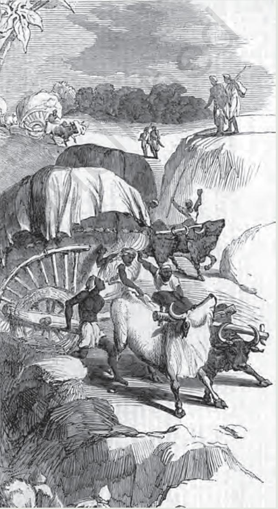
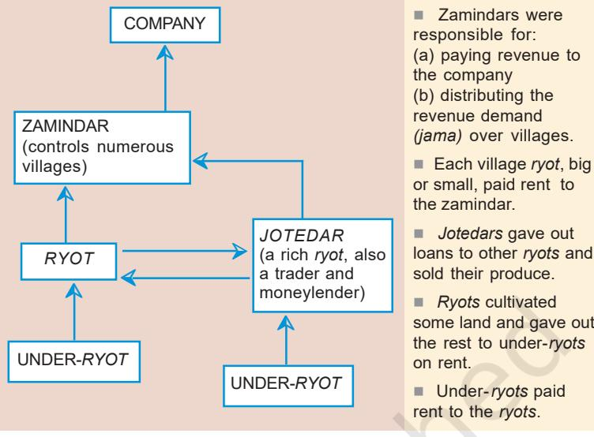

**THEME**

**NINE**

# **Colonialism and the Countryside** Exploring Official Ar icial Aricial Archives

In this chapter you will see what colonial rule meant to those who lived in the countryside. You will meet the zamindars of Bengal, travel to the Rajmahal hills where the Paharias and the Santhals lived, and then move west to the Deccan. You will look at the way the English East India Company (E.I.C.) established its raj in the countryside, implemented its revenue policies, what these policies meant to different sections of people, and how they changed everyday lives.

Laws introduced by the state have consequences for people: they determine to an extent who grows richer and who poorer, who acquires new land and who loses the land they have lived on, where peasants go when they need money. As you will see, however, people were not only subject to the working of laws, they also resisted the law by acting according to what they believed to be just. In doing so people defined the way in which laws operated, thereby modifying their consequences.

You will also come to know about the sources that tell us about these histories, and the problems historians face in interpreting them. You will read about revenue records and surveys, journals and accounts left by surveyors and travellers, and reports produced by enquiry commissions.

227

*Fig. 9.1 Cotton being carried from the village to the* mandi, Illustrated London News, *20 April 1861*

## **1. Bengal and the Zamindars**

As you know, colonial rule was first established in Bengal. It is here that the earliest attempts were made to reorder rural society and establish a new regime of land rights and a new revenue system. Let us see what happened in Bengal in the early years of Company (E.I.C.) rule.

### 1.1 An auction in Burdwan

In 1797 there was an auction in Burdwan (presentday Bardhaman). It was a big public event. A number of *mahals* (estates) held by the Raja of Burdwan were being sold. The Permanent Settlement had come into operation in 1793. The East India Company had fixed the revenue that each zamindar had to pay. The estates of those who failed to pay were to be auctioned to recover the revenue. Since the raja had accumulated huge arrears, his estates had been put up for auction.

Numerous purchasers came to the auction and the estates were sold to the highest bidder. But the Collector soon discovered a strange twist to the tale. Many of the purchasers turned out to be servants and agents of the raja who had bought the lands on behalf of their master. Over 95 per cent of the sale at the auction was fictitious. The raja's estates had been publicly sold, but he remained in control of his zamindari.

Why had the raja failed to pay the revenue? Who were the purchasers at the auction? What does the story tell us about what was happening in the rural areas of eastern India at that time?

#### 1.2 The problem of unpaid revenue

The estates of the Burdwan raj were not the only ones sold during the closing years of the eighteenth century. Over 75 per cent of the zamindaris changed hands after the Permanent Settlement.

In introducing the Permanent Settlement, British officials hoped to resolve the problems they had been facing since the conquest of Bengal. By the 1770s, the rural economy in Bengal was in crisis, with recurrent famines and declining agricultural output. Officials felt that agriculture, trade and the revenue resources of the state could all be developed by encouraging investment in agriculture. This could be done by securing rights of property and permanently fixing the rates of

Raja (literally king) was a term that was often used to designate powerful zamindars.

#### *Fig. 9.2*

*Burdwan raja's City Palace on Diamond Harbour Road, Calcutta* By the late nineteenth century many rich zamindars of Bengal had city palaces with ballrooms, large grounds, entrance porches supported by Corinthian columns like these.

revenue demand. If the revenue demand of the state was permanently fixed, then the Company could look forward to a regular flow of revenue, while entrepreneurs could feel sure of earning a profit from their investment, since the state would not siphon it off by increasing its claim. The process, officials hoped, would lead to the emergence of a class of yeomen farmers and rich landowners who would have the capital and enterprise to improve agriculture. Nurtured by the British, this class would also be loyal to the Company.

The problem, however, lay in identifying individuals who could both improve agriculture and contract to pay the fixed revenue to the state. After a prolonged debate amongst Company officials, the Permanent Settlement was made with the rajas and *taluqdars* of Bengal. They were now classified as zamindars, and they had to pay the revenue demand that was fixed in perpetuity. In terms of this definition, the zamindar was not a landowner in the village, but a revenue Collector of the state.

Zamindars had several (sometimes as many as 400) villages under them. In Company calculations the villages within one zamindari formed one revenue estate. The Company fixed the total demand over the entire estate whose revenue the zamindar contracted to pay. The zamindar collected rent from the different villages, paid the revenue to the Company, and retained the difference as his income. He was expected to pay the Company regularly, failing which his estate could be auctioned.

#### 1.3 Why zamindars defaulted on payments

Company officials felt that a fixed revenue demand would give zamindars a sense of security and, assured of returns on their investment, encourage them to improve their estates. In the early decades after the Permanent Settlement, however, zamindars regularly failed to pay the revenue demand and unpaid balances accumulated.

The reasons for this failure were various. First: the initial demands were very high. This was because it was felt that if the demand was fixed for all time to come, the Company would never be able to claim a share of increased income from land when prices rose and cultivation expanded. To minimise this anticipated loss, the Company pegged the revenue

*Fig. 9.3 Charles Cornwallis (1738-1805), painted by Thomas Gainsborough, 1785* He was the commander of the

British forces during the American War of Independence and the Governor General of Bengal when the Permanent Settlement was introduced there in 1793.

*Taluqdar* literally means "one who holds a *taluq*" or a connection. *Taluq* came to refer to a territorial unit.

demand high, arguing that the burden on zamindars would gradually decline as agricultural production expanded and prices rose.

Second: this high demand was imposed in the 1790s, a time when the prices of agricultural produce were depressed, making it difficult for the *ryots* to pay their dues to the zamindar. If the zamindar could not collect the rent, how could he pay the Company? Third: the revenue was invariable, regardless of the harvest, and had to be paid punctually. In fact, according to the Sunset Law, if payment did not come in by sunset of the specified date, the zamindari was liable to be auctioned. Fourth: the Permanent Settlement initially limited the power of the zamindar to collect rent from the *ryot* and manage his zamindari.

The Company had recognised the zamindars as important, but it wanted to control and regulate them, subdue their authority and restrict their autonomy. The zamindars' troops were disbanded, customs duties abolished, and their "*cutcheries*" (courts) brought under the supervision of a Collector appointed by the Company. Zamindars lost their power to organise local justice and the local police. Over time the collectorate emerged as an alternative centre of authority, severely restricting what the zamindar could do. In one case, when a raja failed to pay the revenue, a Company official was speedily dispatched to his zamindari with explicit instructions "to take charge of the District and to use the most effectual means to destroy all the influence and the authority of the raja and his officers".

At the time of rent collection, an officer of the zamindar, usually the *amlah*, came around to the village. But rent collection was a perennial problem. Sometimes bad harvests and low prices made payment of dues difficult for the *ryots*. At other times *ryots* deliberately delayed payment. Rich *ryots* and village headmen – *jotedars* and *mandals* – were only too happy to see the zamindar in trouble. The zamindar could therefore not easily assert his power over them. Zamindars could prosecute defaulters, but the judicial process was long drawn. In Burdwan alone there were over 30,000 pending suits for arrears of rent payment in 1798.

*Ryot* is the way the term *raiyat*, used to designate peasants (Chapter 8), was spelt in British records. *Ryots* in Bengal did not always cultivate the land directly, but leased it out to under-*ryots*.

#### 1.4 The rise of the *jotedars*

While many zamindars were facing a crisis at the end of the eighteenth century, a group of rich peasants were consolidating their position in the villages. In Francis Buchanan's survey of the Dinajpur district in North Bengal we have a vivid description of this class of rich peasants known as *jotedars*. By the early nineteenth century, *jotedars* had acquired vast areas of land – sometimes as much as several thousand acres. They controlled local trade as well as moneylending, exercising immense power over the poorer cultivators of the region. A large part of their land was cultivated through sharecroppers (*adhiyars* or *bargadars*) who brought their own ploughs, laboured in the field, and handed over half the produce to the *jotedars* after the harvest.

Within the villages, the power of *jotedars* was more effective than that of zamindars. Unlike zamindars who often lived in urban areas, *jotedars* were located in the villages and exercised direct control over a considerable section of poor villagers. They fiercely resisted efforts by zamindars to increase the *jama* of the village, prevented zamindari officials from executing their duties, mobilised *ryots* who were dependent on them, and deliberately delayed payments of revenue to the zamindar. In fact,

when the estates of the zamindars were auctioned for failure to make revenue payment, *jotedars* were often amongst the purchasers.

The *jotedars* were most powerful in North Bengal, although rich peasants and village headmen were emerging as commanding figures in the countryside in other parts of Bengal as well. In some places they were called *haoladars*, elsewhere they were known as *gantidars* or *mandals*. Their rise inevitably weakened zamindari authority.

#### *Fig. 9.4*

*Bengal village scene, painted by George Chinnery, 1820* Chinnery stayed in India for 23 years (1802-25), painting portraits, landscapes and scenes of the everyday life of the common people. *Jotedars* and moneylenders in rural Bengal lived in houses like the one you see on the right.

*Source 1*

## **The** *jotedars* **of Dinajpur**

Buchanan described the ways in which the *jotedars* of Dinajpur in North Bengal resisted being disciplined by the zamindar and undermined his power:

> Landlords do not like this class of men, but it is evident that they are absolutely necessary, unless the landlords themselves would advance money to their necessitous tenantry …

> The *jotedars* who cultivate large portions of lands are very refractory, and know that the zamindars have no power over them. They pay only a few rupees on account of their revenue and then fall in balance almost every *kist* (instalment), they hold more lands than they are entitled to by their *pottahs* (deeds of contract). Should the zamindar's officers, in consequence, summon them to the *cutcherry*, and detain them for one or two hours with a view to reprimand them, they immediately go and complain at the Fouzdarry Thanna (police station) for imprisonment and at the munsiff 's (a judicial officer at the lower court) *cutcherry* for being dishonoured and whilst the causes continue unsettled, they instigate the petty *ryots* not to pay their revenue consequently …

‹ Describe the ways in which the *jotedars* resisted the authority of the zamindars.

*Fig. 9.5 Power in rural Bengal*

> ‹ Read the text accompanying Fig.9.5 carefully and insert the following terms in appropriate places along the arrows: rent, revenue, interest, loan, produce

### 1.5 The zamindars resist

The authority of the zamindars in rural areas, however, did not collapse. Faced with an exorbitantly high revenue demand and possible auction of their estates, they devised ways of surviving the pressures. New contexts produced new strategies.

Fictitious sale was one such strategy. It involved a series of manoeuvres. The Raja of Burdwan, for instance, first transferred some of his zamindari to his mother, since the Company had decreed that the property of women would not be taken over. Then, as a second move, his agents manipulated the auctions. The revenue demand of the Company was deliberately withheld, and unpaid balances were allowed to accumulate. When a part of the estate was auctioned, the zamindar's men bought the property, outbidding other purchasers. Subsequently they refused to pay up the purchase money, so that the estate had to be resold. Once again it was bought by the zamindar's agents, once again the purchase money was not paid, and once again there was an auction. This process was repeated endlessly, exhausting the state, and the other bidders at the auction. At last the estate was sold at a low price back to the zamindar. The

zamindar never paid the full revenue demand; the Company rarely recovered the unpaid balances that had piled up.

Such transactions happened on a grand scale. Between 1793 and 1801 four big zamindaris of Bengal, including Burdwan, made *benami* purchases that collectively yielded as much as Rs 30 lakh. Of the total sales at the auctions, over 15 per cent were fictitious.

There were other ways in which zamindars circumvented displacement. When people from outside the zamindari bought an estate at an auction, they could not always take possession. At times their agents would be attacked by *lathyals* of the former zamindar. Sometimes even the *ryots* resisted the entry of outsiders. They felt bound to their own zamindar through a sense of loyalty and perceived him as a figure of authority and themselves as his *proja* (subjects). The sale of the zamindari disturbed their sense of identity, their pride. The zamindars therefore were not easily displaced.

By the beginning of the nineteenth century the depression in prices was over. Thus those who had survived the troubles of the 1790s consolidated their power. Rules of revenue payment were also made somewhat flexible. As a result, the zamindar's power over the villages was strengthened. It was only during the Great Depression of the 1930s that they finally collapsed and the *jotedars* consolidated their power in the countryside.

#### 1.6 The Fifth Report

Many of the changes we are discussing were documented in detail in a report that was submitted to the British Parliament in 1813. It was the fifth of a series of reports on the administration and activities of the East India Company in India. Often referred to as the Fifth Report, it ran into 1002 pages, of which over 800 pages were appendices that reproduced petitions of zamindars and *ryots*, reports of collectors from different districts, statistical tables on revenue returns, and notes on the revenue and judicial administration of Bengal and Madras (present-day Tamil Nadu) written by officials.

From the time the Company established its rule in Bengal in the mid-1760s, its activities were closely watched and debated in England. There were many

#### *Fig. 9.6*

*Maharaja Mehtab Chand (1820-79)* When the Permanent Settlement was imposed, Tejchand was the Raja of Burdwan. Subsequently under Mehtab Chand the estate prospered. Mehtab Chand helped the British during the Santhal rebellion and the 1857 revolt.

*Benami*, literally anonymous, is a term used in Hindi and several other Indian languages for transactions made in the name of a fictitious or relatively insignificant person, whereas the real beneficiary remains unnamed.

*Lathyal,* literally one who wields the *lathi* or stick, functioned as a strongman of the zamindar.

groups in Britain who were opposed to the monopoly that the East India Company had over trade with India and China. These groups wanted a revocation of the Royal Charter that gave the Company this monopoly. An increasing number of private traders wanted a share in the India trade, and the industrialists of Britain were keen to open up the Indian market for British manufactures. Many political groups argued that the conquest of Bengal was benefiting only the East India Company but not the British nation as a whole. Information about Company misrule and maladministration was hotly debated in Britain and incidents of the greed and corruption of Company officials were widely publicised in the press. The British Parliament passed a series of Acts in the late eighteenth century to regulate and control Company rule in India. It forced the Company to produce regular reports on the administration of India and appointed committees to enquire into the affairs of the Company. The Fifth Report was one such report produced by a Select Committee. It became the basis of intense parliamentary debates on the nature of the East India Company's rule in India.

*Fig. 9.7*

*Andul Raj Palace*

The ruins of palaces are a visible sign of the end of an era. Satyajit Ray's famous film *Jalshaghar*, on the decline of the aristocratic zamindari style of living, was shot in Andul Raj Palace.

For over a century and a half, the Fifth Report has shaped our conception of what happened in rural Bengal in the late eighteenth century. The evidence contained in the Fifth Report is invaluable. But official reports like this have to be read carefully. We need to know who wrote the reports and why they were written. In fact, recent researches show that the arguments and evidence offered by the Fifth Report cannot be accepted uncritically.

Researchers have carefully examined the archives of various Bengal zamindars and the local records of the districts to write about the history of colonial rule in rural Bengal. They indicate that, intent on criticising the maladministration of the company, the Fifth Report exaggerated the collapse of traditional zamindari power, as also overestimated the scale on which zamindars were losing their land. As we have seen, even when zamindaris were auctioned, zamindars were not always displaced, given the ingenious methods they used to retain their zamindaris.

#### *Source 2*

### **From the Fifth Report**

Referring to the condition of zamindars and the auction of lands, the Fifth Report stated:

> The revenue was not realised with punctuality, and lands to a considerable extent were periodically exposed to sale by auction. In the native year 1203, corresponding with 1796-97, the land advertised for sale comprehended a *jumma* or assessment of *sicca* rupees 28,70,061, the extent of land actually sold bore a *jumma* or assessment of 14,18,756, and the amount of purchase money *sicca* rupees 17,90,416. In 1204, corresponding with 1797-98, the land advertised was for *sicca* rupees 26,66,191, the quantity sold was for *sicca* rupees 22,74,076, and the purchase money *sicca* rupees 21,47,580. Among the defaulters were some of the oldest families of the country. Such were the rajahs of Nuddea, Rajeshaye, Bishenpore (all districts of Bengal), … and others, the dismemberment of whose estates at the end of each succeeding year, threatened them with poverty and ruin, and in some instances presented difficulties to the revenue officers, in their efforts to preserve undiminished the amount of public assessment.

‹ From the tone in which evidence is recorded, what do you think is the attitude of the report to the facts narrated? What is the Report trying to say through the figures? Can you think of any problem in making long-term generalisations from these figures of two years?

## ‹ Discuss...

Compare the account of the zamindars you have just read with that in Chapter 8.

## **2. The Hoe and the Plough**

Let us now shift our focus from the wetlands of Bengal to drier zones, from a region of settled cultivation to one where shifting agriculture was practised. You will see the changes that came about when the frontiers of the peasant economy expanded outwards, swallowing up pastures and forests in the Rajmahal hills. You will also see how these changes created a variety of conflicts within the region.

### 2.1 In the hills of Rajmahal

In the early nineteenth century, Buchanan travelled through the Rajmahal hills. From his description, the hills appeared impenetrable, a zone where few travellers ventured, an area that signified danger. Wherever he went, people were hostile, apprehensive of officials and unwilling to talk to them. In many instances they deserted their villages and absconded.

Who were these hill folk? Why were they so apprehensive of Buchanan's visit? Buchanan's journal gives us tantalising glimpses of these hill folk in the early nineteenth century. His journal was written as a diary of places he visited, people he encountered, and practices he saw. It raises questions in our mind, but does not always help us answer them. It tells us about a moment in time, but not about the longer history of people and places. For that historians have to turn to other records.

If we look at late-eighteenth-century revenue records, we learn that these hill folk were known as Paharias. They lived around the Rajmahal hills, subsisting on forest produce and practising shifting cultivation. They cleared patches of forest by cutting bushes and burning the undergrowth. On these patches, enriched by the potash from the ash, the Paharias grew a variety of pulses and millets for consumption. They scratched the ground lightly with hoes, cultivated the cleared land for a few years, then left it fallow so that it could recover its fertility, and moved to a new area.

From the forests they collected *mahua* (a flower) for food, silk cocoons and resin for sale, and wood for charcoal production. The undergrowth that spread like a mat below the trees and the patches of grass that covered the lands left fallow provided pasture for cattle.

## **Who was Buchanan?**

Francis Buchanan was a physician who came to India and served in the Bengal Medical Service (from 1794 to 1815). For a few years he was surgeon to the Governor-General of India, Lord Wellesley. During his stay in Calcutta (present-day Kolkata), he organised a zoo that became the Calcutta Alipore Zoo; he was also in charge of the Botanical Gardens for a short period. On the request of the Government of Bengal, he undertook detailed surveys of the areas under the jurisdiction of the British East India Company. In 1815 he fell ill and returned to England. Upon his mother's death, he inherited her property and assumed her family name Hamilton. So he is often called Buchanan-Hamilton.

#### *Fig. 9.8*

*A view of a hill village in Rajmahal, painted by William Hodges, 1782* William Hodges was a British artist who accompanied Captain Cook on his second voyage to the Pacific (1772-75), and then came to India. In 1781 he became a friend of Augustus Cleveland, the Collector of Bhagalpur. On the invitation of Cleveland, Hodges accompanied him to the Jangal Mahals in 1782, and painted a set of aquatints. Like many other British painters of the time, Hodges searched for the picturesque. Artists in search of the picturesque were inspired by the ideals of Romanticism, a tradition of thought that celebrated nature and admired its magnificence and power. Romantics felt that to commune with nature the artist had to represent nature as an idyll, uncorrupted by modern civilisation, discover unknown landscapes, and appreciate the sublime play of light and shade. It is in search of this unknown that Hodges went to the Rajmahal hills. He found flat landscapes monotonous, and discovered beauty in roughness, irregularity and variety. A landscape that colonial officials found dangerous and wild, peopled by turbulent tribes, appears in the paintings of Hodges as exotic and idyllic.

‹ Look at the painting and identify the ways in which it represents the traditions of the picturesque.

The life of the Paharias – as hunters, shifting cultivators, food gatherers, charcoal producers, silkworm rearers – was thus intimately connected to the forest. They lived in hutments within tamarind groves, and rested in the shade of mango trees. They considered the entire region as their land, the basis Aquatint is a picture produced by cutting into a copper sheet with acid and then printing it.

#### *Fig. 9.9*

*A view of Jangal territory , painted by William Hodges* Here you can see the forested low hills and the rocky upper ranges, nowhere actually above 2,000 feet. By centring the hills and viewing them from below, Hodges emphasises their inaccessibility.

‹ Look at Figs. 9.8 and 9.9. Describe how the pictures represent the relationship between tribal people and nature.

of their identity as well as survival; and they resisted the intrusion of outsiders. Their chiefs maintained the unity of the group, settled disputes, and led the tribe in battles with other tribes and plainspeople.

With their base in the hills, the Paharias regularly raided the plains where settled agriculturists lived. These raids were necessary for survival, particularly in years of scarcity; they were a way of asserting power over settled communities; and they were a means of negotiating political relations with outsiders. The zamindars on the plains had to often purchase peace by paying a regular tribute to the hill chiefs. Traders similarly gave a small amount to the hill folk for permission to use the passes controlled by them. Once the toll was paid, the Paharia chiefs protected the traders, ensuring that their goods were not plundered by anyone.

This negotiated peace was somewhat fragile. It broke down in the last decades of the eighteenth century when the frontiers of settled agriculture were being aggressively extended in eastern India. The British encouraged forest clearance, and zamindars and *jotedars* turned uncultivated lands into rice fields. To the British, extension of settled agriculture was necessary to enlarge the sources of land revenue, produce crops for export, and establish the basis of a settled, ordered society. They also associated forests with wildness, and saw forest people as savage, unruly, primitive, and difficult to govern. So they felt that forests had to be cleared, settled agriculture established, and forest people tamed, civilised and persuaded to give up hunting and take to plough agriculture.

As settled agriculture expanded, the area under forests and pastures contracted. This sharpened the conflict between hill folk and settled cultivators. The former began to raid settled villages with increasing regularity, carrying away food grains and cattle. Exasperated colonial officials tried desperately to control and subdue the Paharias. But they found the task difficult.

In the 1770s the British embarked on a brutal policy of extermination, hunting the Paharias down and killing them. Then, by the 1780s, Augustus Cleveland, the Collector of Bhagalpur, proposed a policy of pacification. Paharia chiefs were given an annual allowance and made responsible for the proper conduct of their men. They were expected to maintain order in their localities and discipline their own people. Many Paharia chiefs refused the allowances. Those who accepted, most often lost authority within the community. Being in the pay of the colonial government, they came to be perceived as subordinate employees or stipendiary chiefs.

As the pacification campaigns continued, the Paharias withdrew deep into the mountains, insulating themselves from hostile forces, and carrying on a war with outsiders. So when Buchanan travelled through the region in the winter of 181 0 -11 the Paharias naturally viewed him with suspicion and distrust. The experience of pacification campaigns and memories of brutal repression shaped their perception of British infiltration into the area. Every white man appeared to represent a power that was destroying their way of life and means of survival, snatching away their control over their forests and lands. plough was a long one. COLONIALISM AND THE COUNTRYSIDE

By this time in fact there were newer intimations of danger. Santhals were pouring into the area, clearing forests, cutting down timber, ploughing land and growing rice and cotton. As the lower hills were taken over by Santhal settlers, the Paharias receded deeper into the Rajmahal hills. If Paharia life was symbolised by the hoe, which they used for shifting cultivation, the settlers came to represent the power of the plough. The battle between the hoe and the

#### 2.2 The Santhals: Pioneer settlers

At the end of 1810, Buchanan crossed Ganjuria Pahar, which was part of the Rajmahal ranges, passed through the rocky country beyond, and reached a village. It was an old village but the land around had been recently cleared to extend cultivation. Looking at the landscape, Buchanan found evidence of the region having been transformed through "proper application of human labour". He wrote: "Gunjuriya is just sufficiently cultivated to show what a glorious country this might be made. I think its beauty and riches might be made equal to almost any in the universe." The soil here was rocky but "uncommonly fine", and nowhere had Buchanan seen finer tobacco and mustard. On enquiry he discovered that the frontiers of cultivation here had been extended by the Santhals. They had moved into this area around 1800, displaced the hill folk who lived on these lower slopes, cleared the forests and settled the land.

How did the Santhals reach the Rajmahal hills? The Santhals had begun to come into Bengal around the 1780s. Zamindars hired them to reclaim land and expand cultivation, and British officials invited them to settle in the Jangal Mahals. Having failed to subdue the Paharias and transform them into settled agriculturists, the British turned to the Santhals. The Paharias refused to cut forests, resisted touching the plough, and continued to be

*Fig. 9.10 Hill village in Santhal country*, Illustrated London News, *23 February 1856* This village in the lower Rajmahal hills was sketched by Walter Sherwill in the early 1850s. The village appears to be peaceful, calm and idyllic. Life seems unaffected by the outside world.

‹ Contrast this image of the Santhal village with Fig. 9.12. turbulent. The Santhals, by contrast, appeared to be ideal settlers, clearing forests and ploughing the land with vigour .

The Santhals were given land and persuaded to settle in the foothills of Rajmahal. By 1832 a large area of land was demarcated as Damin-i-Koh. This was declared to be the land of the Santhals. They were to live within it, practise plough agriculture, and become settled peasants. The land grant to the Santhals stipulated that at least one-tenth of the area was to be cleared and cultivated within the first ten years. The territory was surveyed and mapped. Enclosed with boundary pillars, it was separated from both the world of the settled agriculturists of the plains and the Paharias of the hills.

After the demarcation of Damin-i-Koh, Santhal settlements expanded rapidly. From 40 Santhal villages in the area in 1838, as many as 1,473 villages had come up by 1851. Over the same period, the Santhal population increased from a mere 3,000 to over 82,000. As cultivation expanded, an increased volume of revenue flowed into the Company's coffers.

Santhal myths and songs of the nineteenth century refer very frequently to a long history of travel: they represent the Santhal past as one of continuous mobility, a tireless search for a place to settle. Here in the Damin-i-Koh their journey seemed to have come to an end.

When the Santhals settled on the peripheries of the Rajmahal hills, the Paharias resisted but were ultimately forced to withdraw deeper into the hills. Restricted from moving down to the lower hills and valleys, they were confined to the dry interior and to the more barren and rocky upper hills. This severely affected their lives, impoverishing them in the long term. Shifting agriculture depended on the ability to move to newer and newer land and utilisation of the natural fertility of the soil. When the most fertile soils became inaccessible to them, being part of the Damin, the Paharias could not effectively sustain their mode of cultivation. When the forests of the region were cleared for cultivation the hunters amongst them also faced problems. The Santhals, by contrast, gave up their earlier life of mobility and settled down, cultivating a range of commercial crops for the market, and dealing with traders and moneylenders. COLONIALISM AND THE COUNTRYSIDE

*Fig. 9.11 Sidhu Manjhi, the leader of the Santhal rebellion*

The Santhals, however, soon found that the land they had brought under cultivation was slipping away from their hands. The state was levying heavy taxes on the land that the Santhals had cleared, moneylenders (*dikus*) were charging them high rates of interest and taking over the land when debts remained unpaid, and zamindars were asserting control over the Damin area.

By the 1850s, the Santhals felt that the time had come to rebel against zamindars, moneylenders and the colonial state, in order to create an ideal world for themselves where they would rule. It was after the Santhal Revolt (1855-56 ) that the Santhal Pargana was created, carving out 5,500 square miles from the districts of Bhagalpur and Birbhum. The colonial state hoped that by creating a new territory for the Santhals and imposing some special laws within it, the Santhals could be conciliated.

#### *Fig. 9.12*

*Santhals fight the sepoys of the British Raj,* Illustrated London News, *23 February 1856* The rebellion changed the British perception of the Santhals. Villages that had earlier seemed calm and peaceful (Fig. 9.10) now appeared to have become places of violent and savage deeds.

‹ Imagine you are a reader of the *Illustrated London News* in England. How will you react to the images depicted in Figs. 9.12, 9.13 and 9.14? What image of the Santhals would these pictures create in your mind?

#### *Fig. 9.13*

*Burning of Santhal villages,* Illustrated London News, *23 February 1856*

After the rebellion was crushed, the region was searched, suspects were picked up, and villages set on fire. Images of the burning villages were shown to the public in England – once again as a demonstration of the might of the British and their ability to crush rebellion and impose colonial order.

#### *Fig. 9.14*

*Santhal prisoners being taken away,* Illustrated London News, *1856* Notice how images like this one seek to convey political messages. At the centre you can see British officials triumphantly riding on an elephant. One officer on a horse is smoking a hookah: a picture that emphasises that the time of trouble was over, the rebellion had been crushed. The rebels are now in chains, being taken away to jail escorted and surrounded by soldiers of the Company.

*Source 3*

## **Buchanan on the Santhals**

Buchanan wrote:

They are very clever in clearing new lands, but live meanly. Their huts have no fence, and the walls are made of small sticks placed upright, close together and plastered within with clay. They are small and slovenly, and too flat-roofed, with very little arch.

#### *Source 4*

**The rocks near Kaduya**

Buchanan's journal is packed with observations like the following:

> About a mile farther on, (I) came to a low ledge of rocks without any evident strata; it is a small grained granite with reddish feldspar, with quartz and black mica … More than half a mile from thence, I came to another rock not stratified, and consisting of very finegrained granite with yellowish feldspar, whitish quartz and black mica.

### 2.3 The accounts of Buchanan

We have been drawing on Buchanan's account, but while reading his reports we should not forget that he was an employee of the British East India Company. His journeys were not simply inspired by the love of landscape and the desire to discover the unknown. He marched everywhere with a large army of people – draughtsmen, surveyors, palanquin bearers, coolies. The costs of the travels were borne by the East India Company since it needed the information that Buchanan was expected to collect. Buchanan had specific instructions about what he had to look for and what he had to record. When he arrived at a village with his army of people, he was immediately perceived as an agent of the *sarkar*.

As the Company consolidated its power and expanded its commerce, it looked for natural resources it could control and exploit. It surveyed landscapes and revenue sources, organised voyages of discovery, and sent its geologists and geographers, its botanists and medical men to collect information. Buchanan, undoubtedly an extraordinary observer, was one such individual. Everywhere Buchanan went, he obsessively observed the stones and rocks and the different strata and layers of soil. He searched for minerals and stones that were commercially valuable, he recorded all signs of iron ore and mica, granite and saltpetre. He carefully observed local practices of salt-making and ironore-mining.

When Buchanan wrote about a landscape, he most often described not just what he saw, what the landscape was like, but also how it could be transformed and made more productive – what crops could be cultivated, which trees cut down, and which ones grown. And we must remember that his vision and his priorities were different from those of the local inhabitants: his assessment of what was necessary was shaped by the commercial concerns of the Company and modern Western notions of what constituted progress. He was inevitably critical of the lifestyles of forest dwellers and felt that forests had to be turned into agricultural lands.

#### *Source 5*

### **On clearance and settled cultivation**

Passing through one village in the lower Rajmahal hills, Buchanan wrote:

The view of the country is exceedingly fine, the cultivation, especially the narrow valleys of rice winding in all directions, the cleared lands with scattered trees, and the rocky hills are in perfection; all that is wanted is some appearance of progress in the area and a vastly extended and improved cultivation, of which the country is highly susceptible. Plantations of Asan and Palas, for Tessar (Tassar silk worms) and Lac, should occupy the place of woods to as great an extent as the demand will admit; the remainder might be all cleared, and the greater part cultivated, while what is not fit for the purpose, might rear Plamira (palmyra) and Mowa (*mahua*).

## ‹ Discuss...

What does Buchanan's description tell us about his ideas of development? Illustrate your argument by quoting from the excerpts. If you were a Paharia forest dweller how would you have reacted to these ideas?

## **3. A Revolt in the Countryside The Bombay Deccan**

You have read about how the lives of peasants and zamindars of colonial Bengal and the Paharias and Santhals of the Rajmahal hills were changing. Now let us move across to western India, and to a later period, and explore what was happening in the countryside in the Bombay Deccan.

One way of exploring such changes is by focusing on a peasant revolt. In such climactic times rebels express their anger and fury; they rise against what they perceive to be injustice and the causes of their suffering. If we try to understand the premises of their resentment, and peel the layers of their anger, we get a glimpse of their life and experience that is otherwise hidden from us. Revolts also produce records that historians can look at. Alarmed by the actions of rebels and keen on restoring order, state authorities do not simply repress a rebellion. They try and understand it, enquire into its causes so that policies can be formulated and peace established. These enquiries produce evidence that historians can explore.

Through the nineteenth century, peasants in various parts of India rose in revolt against *Source 6*

## **On that day in Supa**

On 16 May 1875, the District Magistrate of Poona wrote to the Police Commissioner:

> On arrival at Supa on Saturday 15 May I learnt of the disturbance.

One house of a moneylender was burnt down; about a dozen were forcibly broken into and completely gutted of their content. Account papers, bonds, grains, country cloth were burnt in the street where heaps of ashes are still to be seen.

The chief constable apprehended 50 persons. Stolen property worth Rs 2000 was recovered. The estimated loss is over Rs 25,000. Moneylenders claim it is over 1 lakh.

*DECCAN RIOTS COMMISSION*

A *sahukar* was someone who acted as both a moneylender and a trader.

‹ The words and terms used by a writer often tell us something about his or her prejudices. Read Source 7 carefully and pick out the terms that indicate any prejudices of the writer. Discuss how a *ryot* of the area would have described the same situation.

moneylenders and grain dealers. One such revolt occurred in 1875 in the Deccan.

## 3.1 Account books are burnt

The movement began at Supa, a large village in Poona (present-day Pune) district. It was a market centre where many shopkeepers and moneylenders lived. On 12 May1875, *ryots* from surrounding rural areas gathered and attacked the shopkeepers, demanding their *bahi khatas* (account books) and debt bonds. They burnt the *khatas*, looted grain shops, and in some cases set fire to the houses of *sahukars*.

From Poona the revolt spread to Ahmednagar. Then over the next two months it spread even further, over an area of 6,500 square km. More than thirty villages were affected. Everywhere the pattern was the same: *sahukars* were attacked, account books burnt and debt bonds destroyed. Terrified of peasant attacks, the *sahukars* fled the villages, very often leaving their property and belongings behind.

As the revolt spread, British officials saw the spectre of 1857 (see Chapter 11). Police posts were established in villages to frighten rebellious peasants into submission. Troops were quickly called in; 951 people were arrested, and many convicted. But it took several months to bring the countryside under control.

*Source 7*

### **A newspaper report**

The following report, titled 'The ryot and the moneylender', appeared in the *Native Opinion* (6 June 1876), and was quoted in *Report of the Native Newspapers of Bombay:*

They (the *ryots*) first place spies on the boundaries of their villages to see if any Government officers come, and to give timely intimation of their arrival to the offenders. They then assemble in a body and go to the houses of their creditors, and demand from them a surrender of their bonds and other documents, and threaten them in case of refusal with assault and plunder. If any Government officer happens to approach the villages where the above is taking place, the spies give intimation to the offenders and the latter disperse in time.

Why the burning of bonds and deeds? Why this revolt? What does it tell us about the Deccan countryside and about agrarian changes under colonial rule? Let us look at this longer history of changes over the nineteenth century.

#### 3.2 A new revenue system

As British rule expanded from Bengal to other parts of India, new systems of revenue were imposed. The Permanent Settlement was rarely extended to any region beyond Bengal.

Why was this so? One reason was that after 1810, agricultural prices rose, increasing the value of harvest produce, and enlarging the income of the Bengal zamindars. Since the revenue demand was fixed under the Permanent Settlement, the colonial state could not claim any share of this enhanced income. Keen on expanding its financial resources, the colonial government had to think of ways to maximise its land revenue. So in territories annexed in the nineteenth century, temporary revenue settlements were made.

There were other reasons too. When officials devise policies, their thinking is deeply shaped by economic theories they are familiar with. By the 1820s, the economist David Ricardo was a celebrated figure in England. Colonial officials had learnt Ricardian ideas during their college years. In Maharashtra when British officials set about formulating the terms of the early settlement in the 1820s, they operated with some of these ideas.

According to Ricardian ideas, a landowner should have a claim only to the "average rent" that prevailed at a given time. When the land yielded more than this "average rent", the landowner had a surplus that the state needed to tax. If tax was not levied, cultivators were likely to turn into rentiers, and their surplus income was unlikely to be productively invested in the improvement of the land. Many British officials in India thought that the history of Bengal confirmed Ricardo's theory. There the zamindars seemed to have turned into rentiers, leasing out land and living on the rental incomes. It was therefore necessary, the British officials now felt, to have a different system.

The revenue system that was introduced in the Bombay Deccan came to be known as the *ryotwari* *Rentier* is a term used to designate people who live on rental income from property.

settlement. Unlike the Bengal system, the revenue was directly settled with the *ryot*. The average income from different types of soil was estimated, the revenue-paying capacity of the *ryot* was assessed and a proportion of it fixed as the share of the state. The lands were resurveyed every 30 years and the revenue rates increased. Therefore the revenue demand was no longer permanent.

#### 3.3 Revenue demand and peasant debt

The first revenue settlement in the Bombay Deccan was made in the 1820s. The revenue that was demanded was so high that in many places peasants deserted their villages and migrated to new regions. In areas of poor soil and fluctuating rainfall the problem was particularly acute. When rains failed and harvests were poor, peasants found it impossible to pay the revenue. However, the collectors in charge of revenue collection were keen on demonstrating their efficiency and pleasing their superiors. So they went about extracting payment with utmost severity. When someone failed to pay, his crops were seized and a fine was imposed on the whole village.

By the 1830s the problem became more severe. Prices of agricultural products fell sharply after 1832 and did not recover for over a decade and a half. This meant a further decline in peasants' income. At the same time the countryside was devastated by a famine that struck in the years 1832-34. Onethird of the cattle of the Deccan were killed, and half the human population died. Those who survived had no agricultural stocks to see them through the crisis. Unpaid balances of revenue mounted.

How did cultivators live through such years? How did they pay the revenue, procure their consumption needs, purchase their ploughs and cattle, or get their children married?

Inevitably, they borrowed. Revenue could rarely be paid without a loan from a moneylender. But once a loan was taken, the *ryot* found it difficult to pay it back. As debt mounted, and loans remained unpaid, peasants' dependence on moneylenders increased. They now needed loans even to buy their everyday needs and meet their production expenditure. By the 1840s, officials were finding evidence of alarming levels of peasant indebtedness everywhere.

By the mid-1840s there were signs of an economic recovery of sorts. Many British officials had begun to realise that the settlements of the 1820s had been harsh. The revenue demanded was exorbitant, the system rigid, and the peasant economy on the verge of collapse. So the revenue demand was moderated to encourage peasants to expand cultivation. After 1845 agricultural prices recovered steadily. Cultivators were now extending their acreage, moving into new areas, and transforming pastureland into cultivated fields. But to expand cultivation peasants needed more ploughs and cattle. They needed money to buy seeds and land. For all this they had to turn once again to moneylenders for loans.

#### 3.4 Then came the cotton boom

Before the 1860s, three-fourths of raw cotton imports into Britain came from America. British cotton manufacturers had for long been worried about this dependence on American supplies. What would happen if this source was cut off? Troubled by this question, they eagerly looked for alternative sources of supply.

In 1857 the Cotton Supply Association was founded in Britain, and in 1859 the Manchester Cotton Company was formed. Their objective was "to encourage cotton production in every part of the world

*Fig. 9.16 Carts transporting cotton halting under a banyan tree,* Illustrated London News*, 13 December 1862*

suited for its growth". India was seen as a country that could supply cotton to Lancashire if the American supply dried up. It possessed suitable soil, a climate favourable to cotton cultivation, and cheap labour.

When the American Civil War broke out in 1861, a wave of panic spread through cotton circles in Britain. Raw cotton imports from America fell to less than three per cent of the normal: from over 2,000,000 bales (of 400 lbs each) in 1861 to 55,000 bales in 1862. Frantic messages were sent to India and elsewhere to increase cotton exports to Britain. In Bombay, cotton merchants visited the cotton districts to assess supplies and encourage cultivation. As cotton prices soared (see Fig. 10.15), export merchants in Bombay were keen to secure as much cotton as possible to meet the British demand. So they gave advances to urban *sahukars* who in turn extended credit to those rural moneylenders who promised to secure the produce. When there is a boom in the market credit flows easily, for those who give out loans feel secure about recovering their money.

#### *Fig. 9.17*

*Transporting cotton before the railway era,* Illustrated London News, *20 April 1861* When cotton supplies from America were cut off during the Civil War, Britain hoped that India would supply all the cotton that British industries needed. It began assessing the supply, examining the quality of cotton and studying the methods of production and marketing. This interest was reflected in the pages of the *Illustrated London News.*

‹ The three panels in Fig. 9.17 depict different modes of transporting cotton. Notice the bullocks collapsing under the weight of the cotton, the boulders on the road, and the huge pile of bales on the boat. What is the artist suggesting through these images?

These developments had a profound impact on the Deccan countryside. The *ryots* in the Deccan villages suddenly found access to seemingly limitless credit. They were being given Rs 100 as advance for every acre they planted with cotton. *Sahukars* were more than willing to extend long-term loans.

While the American crisis continued, cotton production in the Bombay Deccan expanded.

Between 1860 and 1864 cotton acreage doubled. By 1862 over 90 per cent of cotton imports into Britain were coming from India.

But these boom years did not bring prosperity to all cotton producers. Some rich peasants did gain, but for the large majority, cotton expansion meant heavier debt.

*Fig. 9.18 A fleet of boats carrying cotton bales down the Ganges from Mirzapur,* Illustrated London News, *13 December 1862* Before the railway age, the town of Mirzapur was a collection centre for cotton from the Deccan*.*

#### *Fig. 9.19*

*Cotton bales lying at the Bombay terminus of the Great Indian Peninsula Railway ready for shipment to England,* Illustrated London News, *23 August 1862*

Once the railways came up cotton supplies were not carried only on carts and boats. River traffic declined over time. But older modes of transport were not fully displaced. The loaded bullock cart in the foreground on the right is waiting to carry cotton bales from the railway station to the port.

#### 3.5 Credit dries up

While the boom lasted, cotton merchants in India had visions of capturing the world market in raw cotton, permanently displacing America. The editor of the *Bombay Gazette* had asked in 1861, "What can prevent India from supplanting the Slave States (of U.S.A.) as the feeder of Lancashire?" By 1865 these dreams were over. As the Civil War ended, cotton production in America revived and Indian cotton exports to Britain steadily declined.

Export merchants and *sahukars* in Maharashtra were no longer keen on extending long-term credit. They could see the demand for Indian cotton fall and cotton prices slide downwards. So they decided to close down their operations, restrict their advances to peasants, and demand repayment of outstanding debts.

While credit dried up, the revenue demand increased. The first revenue settlement, as we have seen, was in the 1820s and 1830s. Now it was time for the next. And in the new settlement, the demand was increased dramatically: from 50 to 100 per cent. How could *ryots* pay this inflated demand at a time when prices were falling and cotton fields disappearing? Yet again they had to turn to the moneylender. But the moneylender now refused loans. He no longer had confidence in the *ryots'* capacity to repay.

#### 3.6 The experience of injustice

The refusal of moneylenders to extend loans enraged the *ryots*. What infuriated them was not simply that they had got deeper and deeper into debt, or that they were utterly dependent on the moneylender for survival, but that moneylenders were being insensitive to their plight. The moneylenders were violating the customary norms of the countryside.

Moneylending was certainly widespread before colonial rule and moneylenders were often powerful

‹ Explain the complaints that the *ryot* is making in the petition. Why was the harvest taken by the moneylenders not credited to the peasants' account? Why were peasants not given any receipts? If you were a moneylender what reasons would you give for these practices?

*Source 8*

### **A** *ryot* **petitions**

This is an example of a petition from a *ryot* of the village of Mirajgaon, Taluka Karjat, to the Collector, Ahmednagar, Deccan Riots Commission:

> The *sowkars* (*sahukars*) … have of late begun to oppress us. As we cannot earn enough to defray our household expenses, we are actually forced to beg of them to provide us with money, clothes and grain, which we obtain from them not without great difficulty, nor without their compelling us to enter into hard conditions in the bond. Moreover the necessary clothes and grain are not sold to us at cash rates. The prices asked from us are generally twenty-five or fifty per cent more than demanded from customers making ready money payments … The produce of our fields is also taken by the *sowkars*, who at the time of removing it assure us that it will be credited to our account, but they do not actually make any mention of it in the accounts. They also refuse to pass us any receipts for the produce so removed by them.

figures. A variety of customary norms regulated the relationship between the moneylender and the *ryot*. One general norm was that the interest charged could not be more than the principal. This was meant to limit the moneylender's exactions and defined what could be counted as "fair interest". Under colonial rule this norm broke down. In one of the many cases investigated by the Deccan Riots Commission, the moneylender had charged over Rs 2,000 as interest on a loan of Rs 100. In petition after petition, *ryots* complained of the injustice of such exactions and the violation of custom.

#### *Source 9*

### **Deeds of hire**

When debts mounted the peasant was unable to pay back the loan to the moneylender. He had no option but to give over all his possessions – land, carts, and animals – to the moneylender. But without animals he could not continue to cultivate. So he took land on rent and animals on hire. He now had to pay for the animals which had originally belonged to him. He had to sign a deed of hire stating very clearly that these animals and carts did not belong to him. In cases of conflict, these deeds could be enforced through the court.

The following is the text of a deed that a peasant signed in November 1873, from the records of the Deccan Riots Commission:

I have sold to you, on account of the debt due to you, my two carriages having iron axles, with their appurtenances and four bullocks … I have taken from you on hire under (this) deed the very same two carriages and four bullocks. I shall pay every month the hire thereof at Rupees four a month, and obtain a receipt in your own handwriting. In the absence of a receipt I shall not contend that the hire had been paid.

The *ryots* came to see the moneylender as devious and deceitful. They complained of moneylenders manipulating laws and forging accounts. In 1859 the British passed a Limitation Law that stated that the loan bonds signed between moneylenders and *ryots* would have validity for only three years. This law was meant to check the accumulation of interest over time. The moneylender, however, turned ‹List all the commitments that the peasant is making in this deed. What does such a deed of hire tell us about the relationship between the peasant and the moneylender? How would it change the relationship between the peasant and the bullocks he previously owned?

the law around, forcing the *ryot* to sign a new bond every three years. When a new bond was signed, the unpaid balance – that is, the original loan and the accumulated interest – was entered as the principal on which a new set of interest charges was calculated. In petitions that the Deccan Riots Commission collected, *ryots* described how this process worked (see Source 10) and how moneylenders used a variety of other means to short-change the *ryot*: they refused to give receipts when loans were repaid, entered fictitious figures in bonds, acquired the peasants' harvest at low prices, and ultimately took over peasants' property.

Deeds and bonds appeared as symbols of the new oppressive system. In the past such deeds had been rare. The British, however, were suspicious of transactions based on informal understanding, as was common in the past. The terms of transactions, they believed, had to be clearly, unambiguously and categorically stated in contracts, deeds and bonds, and regulated by law. Unless the deed or contract was legally enforceable, it had no value.

Over time, peasants came to associate the misery of their lives with the new regime of bonds and deeds. They were made to sign and put thumb impressions on documents, but they did not know what they were actually signing. They had no idea of the clauses that moneylenders inserted in the bonds. They feared the written word. But they had no choice because to survive they needed loans, and moneylenders were unwilling to give loans without legal bonds.

#### *Source 10*

### **How debts mounted**

In a petition to the Deccan Riots Commission a *ryot* explained how the system of loans worked:

A *sowkar* lends his debtor Rs 100 on bond at Rs 3-2 annas per cent per mensem. The latter agrees to pay the amount within eight days from the passing of the bond. Three years after the stipulated time for repaying the amount, the *sowkar* takes from his debtor another bond for the principal and interest together at the same rate of interest, and allows him 125 days' time to liquidate the debt. After the lapse of 3 years and 15 days a third bond is passed by the debtor … (this process is repeated) at the end of 12 years … his interest on Rs 1000 amounts to Rs 2028 -10 annas -3 paise.

‹ Calculate the rate of interest that the *ryot* was paying over the years.

## **4. The Deccan Riots Commission**

When the revolt spread in the Deccan, the Government of Bombay was initially unwilling to see it as anything serious. But the Government of India, worried by the memory of 1857, pressurised the Government of Bombay to set up a commission of enquiry to investigate into the causes of the riots. The commission produced a report that was presented to the British Parliament in 1878.

This report, referred to as the Deccan Riots Report, provides historians with a range of sources for the study of the riot. The commission held enquiries in the districts where the riots spread, recorded statements of *ryots, sahukars* and eyewitnesses, compiled statistical data on revenue rates, prices and interest rates in different regions, and collated the reports sent by district collectors.

In looking at such sources we have to again remember that they are official sources and reflect official concerns and interpretations of events. The Deccan Riots Commission, for instance, was specifically asked to judge whether the level of government revenue demand was the cause of the revolt. And after presenting all the evidence, the commission reported that the government demand was not the cause of peasant anger. It was the moneylenders who were to blame. This argument is found very frequently in colonial records. This shows that there was a persistent reluctance on the part of the colonial government to admit that popular discontent was ever on account of government action.

Official reports, thus, are invaluable sources for the reconstruction of history. But they have to be always read with care and juxtaposed with evidence culled from newspapers, unofficial accounts, legal records and, where possible, oral sources.

‹ Discuss...

Check what rates of interest are charged in the region where you live at present. Find out whether these rates have changed over the last 50 years. Is there a variation in the rates paid by different groups of people? What are the reasons for the differences?

|  | TIMELINE |
| --- | --- |
| 1765 | English East India Company acquires Diwani of Bengal |
| 1773 | Regulating Act passed by the British Parliament to regulate the activities of the East India Company |
| 1793 | Permanent Settlement in Bengal |
| 1800s | Santhals begin to come to the Rajmahal hills and settle there |
| 1818 | First revenue settlement in the Bombay Deccan |
| 1820s | Agricultural prices begin to fall |
| 1840s-50s | A slow process of agrarian expansion in the Bombay Deccan |
| 1855-56 | Santhal rebellion |
| 1861 | Cotton boom begins |
| 1875 | Ryots in Deccan villages rebel |

*Fig. 9.20* the moneylenders? *A rural scene, painted by William Prinsep, 1820*

## **ANSWER IN 100-150 WORDS**

- 1. Why was the *jotedar* a powerful figure in many areas of rural Bengal?
- 2. How did zamindars manage to retain control over their zamindaris?
- 3. How did the Paharias respond to the coming of outsiders?
- 4. Why did the Santhals rebel against British rule?
- 5. What explains the anger of the Deccan *ryots* against

## **Write a short essay (250 -300 words) on the following:**

- 6. Why were many zamindaris auctioned after the Permanent Settlement?
- 7. In what way was the livelihood of the Paharias different from that of the Santhals?
- 8. How did the American Civil War affect the lives of *ryots* in India?
- 9. What are the problems of using official sources in writing about the history of peasants?

## **Map work**

- 10. On an outline map of the subcontinent, mark out the areas described in this chapter. Find out whether there were other areas where the Permanent Settlement and the *ryotwari* system were prevalent and plot these on the map as well.

**Projects (choose one)**

- 11. Francis Buchanan published reports on several districts of eastern India. Read one report and collate the information available about rural society, focusing on the themes discussed in this chapter. Highlight the ways in which historians can use such texts.
- 12. In the region where you live, talk to the older people within a rural community and visit the fields they now cultivate. Find out what they produce, how they earn their livelihoods, what their parents did, what their sons and daughters do now, and how their lives have changed over the last 75 years. Write a report based on your findings.

#### **If you would like to know more, read:**

Sugata Bose. 1986. *Agrarian Bengal.* Cambridge University Press, Cambridge.

Francis Buchanan.1930. *Journal of Francis Buchanan Kept During the Survey of the District of Bhagalpur.* Superintendent, Government Printing, Bihar and Orissa, Patna.

Ramachandra Guha. 1989. *The Unquiet Woods: Ecological Change and Peasant Resistance in the Himalayas.* Oxford University Press, New Delhi.

Sumit Guha. 1985. *The Agrarian Economy of the Bombay Deccan, 1818-1941.* Oxford University Press, New Delhi.

Ravinder Kumar. 1968. *Western India in the Nineteenth Century: A Study in the Social History of Maharashtra.* Routledge and Kegan Paul, London.

Ratnalekha Ray. 1979. *Change in Bengal Agrarian Society,* c. *1760-1850.* Manohar, New Delhi.

Kumar Suresh Singh. 1966. *Dust-storm and the Hanging Mist: A Study of Birsa Munda and His Movement in Chhotanagpur (1874-1901).* Firma K.L. Mukhopadhyay, Calcutta.

